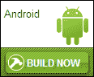

# 第八章：调整您的 HTML5 游戏以适应分发渠道

当您的游戏终于准备好供全世界观看时，是时候考虑可能的分发渠道了。您想让人们在网站上的浏览器中玩游戏，还是作为 Web 应用程序？也许您希望他们在平板电脑或智能手机上玩游戏，无论是在浏览器中还是作为应用程序。在本章中，我们将探讨其中几种不同的选择以及成功实施所需的工作。

在本章中，您将学到：

+   为网络浏览器准备您的游戏

+   为移动网络浏览器做适应

+   将您的游戏发布为 Google Chrome 网络应用程序

+   将游戏转换为 Android 应用程序

+   使您的游戏在 Facebook 上可玩

+   实施 AppMobi 的直接画布

# 为网络浏览器准备您的游戏

在开发过程中，您一直在 Web 浏览器中测试您的游戏。那么您的本地服务器和公共或生产服务器之间有什么区别呢？

在向公众发布您的游戏之前，您需要对其进行烘烤。**烘烤**游戏不过是压缩代码。这有两个优点：

1.  压缩代码将比未压缩代码更快地加载到浏览器中。更短的加载时间总是一个很大的优势，特别是对于第一次玩您的游戏的人。这些人还不知道您的游戏有多棒，不想浪费时间看加载条。

1.  烘烤后的代码也更难阅读。所有不同的模块，整齐地排列在单独的文件中，现在都在一个文件中与 ImpactJS 引擎一起。这使得普通用户很难从浏览器中复制和粘贴你宝贵的源代码，然后在自己的游戏中使用。然而，这并不能防止那些真正知道自己在做什么的人；代码并没有加密，只是压缩了。

用您下载的 ImpactJS 引擎一起的烘烤游戏的工具。在游戏的`root`目录中的`tools`文件夹中，您应该有四个文件：`bake.bat`、`bake.php`、`bake.sh`和`jsmin.php`。按照以下步骤来烘烤您的游戏：

1.  用文本编辑器打开`bake.bat`文件，您会找到以下行：

```js
php tools/bake.php %IMPACT_LIBRARY% %GAME% %OUTPUT_FILE%
```

1.  将`php`更改为 XAMPP 或 WAMP 服务器中`php.exe`文件的目录。对于默认的 XAMPP 安装，这一行现在将如下所示：

```js
C:/xampp/php/php.exe tools/bake.php %IMPACT_LIBRARY% %GAME% %OUTPUT_FILE%
```

1.  保存并关闭`bake.bat`文件，然后双击运行它。在 Windows 上，一个命令窗口将打开，并且`game.min.js`脚本将被创建在游戏的`root`目录中，如下面的屏幕截图所示：

`game.min.js`脚本现在包含了我们所有的代码。现在我们需要做的就是更改游戏`root`目录中的`index.html`文件，使其寻找`game.min.js`而不是`impact.js`和`main.js`脚本。

打开`index.html`文件，找到以下代码：

```js
<script type="text/javascript" src="img/impact.js"></script>
<script type="text/javascript" src="img/main.js"></script>
```

用我们新的紧凑版本的代码替换以前的代码，如下面的代码片段所示：

```js
<script type="text/javascript" src="img/game.min.js"></script>
```

现在，您可以剥离游戏文件夹中除`index.html`和`game.min.js`之外的所有代码文件，并将其上传到您的服务器。如果您购买了自己的网络空间，您可以使用免费的 FTP 程序，如**FileZilla**来完成此操作。

我们的游戏现在已经准备好分发了，通过将其加载到 Web 服务器，您已经可以让任何人使用。但是，我们还没有考虑移动设备上的浏览器。在我们研究这个问题之前，让我们快速回顾一下。

总结前面的内容，结论如下：

+   在向公众发布我们的游戏之前，我们应该对其进行烘烤。烘烤游戏基本上就是压缩源代码。烘烤有两个重要优点：

+   游戏加载到浏览器中的速度更快。

+   代码变得更难阅读，因此更不容易被盗。然而，代码并没有加密，因此对于一个专注的人来说，解除烘烤仍然相当容易。

+   为了烘烤游戏，我们在运行之前更改`bake.bat`文件。这个过程创建了一个`game.min.js`脚本。

+   在将游戏上传到服务器之前，我们在`index.html`文件中包含`game.min.js`而不是`main.js`和`impact.js`。

# 为移动 Web 浏览器准备我们的游戏

如果您考虑到人们可能使用智能手机玩游戏，您已经实现了触摸屏控制。这方面的例子可以在第五章中找到，*为您的游戏添加一些高级功能*。然而，有时这还不够。您希望玩家能够像在电脑上一样在智能手机上进行操作。为了实现这一点，我们可以引入**虚拟按钮**。这些虚拟按钮是屏幕上的区域，它们将表现得就像它们是常规键盘键一样。我们可以在`index.html`文件中使用**CSS**（层叠样式表）代码创建这些按钮。我们可以为玩家的每个动作创建按钮。在我们的角色扮演游戏中，他需要能够向各个方向行走和射击。在侧面卷轴游戏中，他可以向左或向右移动，飞行和射击。让我们假设我们将飞行与向上移动分开。以下屏幕截图显示了我们的按钮图块：


以下是创建虚拟按钮的步骤：

1.  打开`index.html`文件，并在 canvas 的 CSS 代码下面添加以下代码。如果您使用的是 ImpactJS 引擎示例提供的`index.html`文件，则该文件应该已经包含 canvas 的以下样式代码。另外，第三章中的*让我们建立一个角色扮演游戏*和第四章中的*让我们建立一个侧面卷轴游戏*的`index.html`文件都包含 canvas 的以下 CSS 代码：

```js
.button {
  background-image: url(media/iphone-buttons.png);
  background-repeat: no-repeat;
  width: 192px;
  height: 32px;
  position: absolute;
  bottom: 0px;
}
-webkit-touch-callout: none;
-webkit-user-select: none;
-webkit-tap-highlight-color: rgba(0,0,0,0);
-webkit-text-size-adjust: none;#buttonLeft {
  position: absolute;
  top: 50%;
  left: 10%;
  width: 32px;
  background-position: -32px;
  height: 32px;
  visibility:hidden;
}
```

1.  首先，我们定义了完整的按钮面板。它的高度为 32 像素，宽度为 192 像素（六个按钮，每个 32 像素宽）。

1.  在这个按钮中，我们可以分别定义六个不同的部分。在这里，你可以看到左按钮的 CSS 代码。其他五个按钮使用完全相同的代码，除了它们的背景位置，因为这是它们在`iphone-buttons.png`图像上的位置。因此，例如，对于左按钮，位置是`-32`，对于右按钮，位置是`0`，对于上按钮，位置是`-64`，因为它是第三行。`webkit`命令是为了保持布局整洁，如预期的那样。如果没有提供这些命令，用户可能会意外地通过点击屏幕改变缩放或颜色。

1.  然而，我们只希望我们的按钮显示在移动设备上。因此，让我们在`index.html`文件中用一小段 JavaScript 代码来控制，如下面的代码片段所示：

```js
<script type="text/javascript">
  <!--//test if it is a mobile device-->
varisMobile= {
    Android: function() {
      return navigator.userAgent.match(/Android/i) ? true : false;
    },
    BlackBerry: function() {
      return navigator.userAgent.match(/BlackBerry/i) ? true : false;
    },
    iOS: function() {
      return navigator.userAgent.match(/iPhone|iPad|iPod/i) ? true : false;
    },
    Windows: function() {
      return navigator.userAgent.match(/IEMobile/i) ? true : false;
    },
    any: function() {
      return (isMobile.Android() || isMobile.BlackBerry() || isMobile.iOS() || isMobile.Windows());
    }
  };
  function mobileButtons(){
    <!-- show the mobile buttons -->
    if(isMobile.any()){
      document.getElementById('buttonLeft').style.visibility = 'visible';
      document.getElementById('buttonRight').style.visibility = 'visible';
      document.getElementById('buttonUp').style.visibility = 'visible';
      document.getElementById('buttonDown').style.visibility = 'visible';
      document.getElementById('buttonShoot').style.visibility = 'visible';
      document.getElementById('buttonJump').style.visibility = 'visible';
    }
  };
</script>
```

1.  在这个脚本的第一部分中，我们定义了本地变量`isMobile`。如果检测到移动设备，则设置为`true`，否则设置为`false`。在第二部分中，如果`isMobile`为`true`，则将 CSS 对象的可见性设置为`visible`。请记住，在`index.html`的 CSS 部分中创建它们时，它们的可见性被设置为`hidden`。

1.  在我们的`index.html`文件中，唯一剩下的事情就是将这些按钮作为`<div>`元素添加到我们的`canvas`元素旁边，如下面的代码所示：

```js
<body onLoad='mobileButtons()'>
  <div id="game">
    <canvas id="canvas"></canvas>
 <div class="button" id="buttonLeft"></div>
 <div class="button" id="buttonRight"></div>
 <div class="button" id="buttonUp"></div>
 <div class="button" id="buttonDown"></div>
 <div class="button" id="buttonShoot"></div>
 <div class="button" id="buttonJump"></div>
  </div>
</body>
```

`index.html`文件现在有按钮，只有在检测到移动设备时才会显示，但这还不足以使我们的游戏准备就绪。为此，我们需要调整我们的`main.js`脚本。

1.  打开`main.js`，并将以下代码添加到`game`实例的`init()`方法中：

```js
if(ig.ua.mobile){
  // controls are different on a mobile device
  ig.input.bindTouch( '#buttonLeft', 'Left' );
  ig.input.bindTouch( '#buttonRight', 'Right' );
  ig.input.bindTouch( '#buttonUp', 'Up' );
  ig.input.bindTouch( '#buttonDown', 'Down' );
  ig.input.bindTouch( '#buttonJump', 'changeWeapon' );
  ig.input.bindTouch( '#buttonShoot', 'attack' );
  //alert('control setup');
}else{
  //initiate background music
  var play_music = true;
  var music = ig.music;
  music.add("media/music/backgroundMusic.ogg");
  music.volume = 0.0;
  music.play();
}
```

1.  如果检测到移动设备，则虚拟按钮将绑定到游戏输入状态。因此，例如，`buttonLeft`元素将绑定到输入状态`Left`。

1.  `else`语句中的代码会打开背景音乐（如果有的话）。正如在第六章中所述，*音乐和音效*，一些移动设备不允许声音重叠。因此，对于移动设备，关闭背景音乐是明智的，这样它就不会与其他音效重叠。这可能不会永远是一个问题，但现在考虑这些声音问题是明智的。

1.  我们还需要调整我们的画布大小，以便它适合智能手机或 iPad 的屏幕。替换默认的画布调用：

```js
ig.main('#canvas', OpenScreen, 60, 320, 320,2);
```

使用以下代码替换默认的画布调用：

```js
if( ig.ua.iPad ) {
  ig.main('#canvas', MyGame, 60, 240, 160, 2);
}
else if( ig.ua.mobile ) {
  ig.main('#canvas', MyGame, 60, 160, 160, 2);
}
else {
  ig.main( '#canvas', OpenScreen, 60, 320, 320, 2 );
}
```

1.  所有这些只是使用不同的画布尺寸初始化游戏，以便它适合 iPad（或其他平板电脑）和智能手机等较小屏幕。此外，这里跳过了介绍屏幕；这是一个选择，你可以在移动设备上留下它。您还可以为更多设备调整画布大小。这里只显示了 iPad 和所有其他移动设备，但当然还可以进行更多的区分。

万岁！您的游戏现在已经准备好移动设备使用了！在将其上线之前不要忘记进行烘烤；移动互联网不像常规 Wi-Fi 那样快，因此使您的文件更小在这里绝对很重要。

接下来，我们将看看如何为**Chrome 网络商店**制作移动网络应用，但首先让我们快速回顾一下如何为移动浏览器准备我们的游戏。

总结前面的内容，结论如下：

+   如果我们希望玩家在移动设备上有良好的游戏体验，我们需要调整游戏界面以适应这一点。我们通过添加虚拟按钮来实现这一点。

+   虚拟按钮的视觉方面是使用 CSS 和`index.html`中的图像文件创建的。我们可以根据游戏是在移动设备上玩还是在其他设备上玩来使按钮可见或隐藏。

+   在我们游戏的`main`脚本中，我们需要将这些按钮绑定到游戏动作状态，以便获得与键盘相同的功能。

+   此外，我们可以更改游戏屏幕分辨率和大小，使其更适合玩家使用的设备。

# 将游戏转化为谷歌 Chrome 网络商店的网络应用

网络应用是在浏览器中运行的应用程序，而不是在移动设备的操作系统上运行。要在谷歌 Chrome 网络商店发布网络应用，您需要一个谷歌 Chrome 开发者帐户，这需要支付一次性费用 5 美元。您需要一个谷歌站长帐户来确认谷歌提供给您的链接的所有权。此外，为了不使事情变得更加困难，最好获得一个免费的 AppMobi 帐户。您可以在他们的网站上做到这一点：[`www.appmobi.com`](http://www.appmobi.com)。AppMobi 是一个非常有趣的初学者工具，有三个主要原因：

1.  他们简化了将游戏推送到多个不同的分发渠道的过程。

1.  他们对您的应用程序或游戏的前 10,000 个用户不收费，这样您可以先赚钱，然后再要求您分一杯羹；这的确是一个非常有吸引力的定价方案。

1.  ImpactJS XDK（跨环境开发工具包）通过创建人工视口来帮助将游戏适应不同的移动设备。它包含许多其他有用的功能，如模拟位置检测。

AppMobi 便于为以下平台构建游戏版本：iOS、Android、AppUp、亚马逊、Nook、Facebook、Chrome、Mozilla 和 hostMobi（他们自己的云主机服务）。

订阅后，您可以安装他们的 ImpactJS XDK 进行开发。安装 XDK 后，它将在 Chrome 浏览器中变得非常易于访问，并在您的地址栏旁边显示一个插件图标，如下面的屏幕截图所示：


您可以登录到 appHub：AppMobi 控制面板，以访问其所有服务。我们现在特别感兴趣的是构建一个谷歌 Chrome 游戏。以下是构建 Chrome 游戏的步骤：

1.  首次登录时，您需要通过单击以下截图中显示的按钮向您的控制中心添加一个新游戏：

1.  为游戏命名并以压缩格式上传到服务器，如下截图所示：

1.  您将看到 AppMobi 允许您为不同的分发渠道准备文件，如下截图所示：

1.  在我们能够构建一个 Chrome `ready`文件之前，我们需要通过按下**PROMOTE**按钮将我们的文件推广到生产，如下截图所示：

1.  我们想要为 Chrome 构建一个游戏，所以检查您仍然存在的问题。很可能您只需要为游戏添加一个图标。但是您需要在构建游戏之前执行此操作，如下截图所示：

1.  如果一切顺利，您应该能够下载一个`production`文件，然后需要使用以下截图中显示的按钮将其上传到 Chrome 网络商店：

1.  现在是时候将文件上传到 Chrome 网络商店了。但是在这样做之前，打开您刚从 AppMobi 网站下载的压缩文件夹，并确保 Chrome 图标的名称与 AppMobi 添加的`manifest.json`文件中所述的名称完全相同。这是一个已知的问题，Chrome 不会接受不一致的命名。

1.  如果您是第一次上传，您将收到一条消息，说您需要验证谷歌提供给您的域名所有权。为了做到这一点，您必须将谷歌允许您下载的带有标记的 HTML 文件插入到您首次上传到 AppMobi 的捆绑包中，并重新上传您的游戏到 AppMobi，这次在压缩的捆绑包中包含验证文件。在 AppMobi 中，使用**UPDATE QA**按钮上传新文件。之后不要忘记推广到生产。

1.  在谷歌站长工具中，您需要添加谷歌提供的链接并进行验证，如下截图所示：

1.  现在您可以重新上传到 Chrome 网络商店，并填写所有必要的元素。您需要添加游戏的详细描述、定价方案和截图，使用以下截图中显示的按钮：

如果一切顺利，您将能够将您的游戏作为网络应用进行测试，并将其添加到您的谷歌 Chrome 中。如果出现问题，AppMobi 有大量关于其服务的文档和如何使用它们的信息。

现在我们有了一个网络应用，但是我们可以通过大致相同的过程来获得一个真正的应用程序。在本书中，我们将以 Android 为例。在这之前，让我们快速回顾一下。

总结前面的内容，结论如下：

+   网络应用是在浏览器中运行的应用程序，而不是直接在设备的操作系统上运行。谷歌浏览器在其谷歌浏览器网络商店中提供此类网络应用。在商店发布需要支付一次性 5 美元的订阅费。

+   AppMobi 提供了一种构建 Web 应用和应用的简单方法。注册是免费的，但一旦游戏取得一定的成功，就需要付费。

+   烘烤好的游戏需要被压缩并上传到 AppMobi 服务器。在这里，AppMobi 会对其进行适配，然后你可以重新下载并上传到 Chrome 开发者账户。

+   谷歌会提供一个链接，你需要重新上传到 AppMobi 并通过谷歌站长账户进行验证。

+   链接验证通过后，你可以重新上传游戏到 Web 商店，并填写游戏描述等详细信息。

+   在提交应用程序进行审核和发布到公众之前，你可以在浏览器中测试你的游戏。

# 将游戏推送到 Android 的谷歌应用商店

现在我们知道了如何构建 Web 应用，让我们在**谷歌应用商店**上构建一个真正的移动应用。我们将再次利用我们的 AppMobi 账户来完成这项工作。但是，此外，你还需要一个谷歌开发者账户，每年需支付 25 美元，用于在谷歌应用商店发布你的游戏。以下是将游戏推送到谷歌应用商店的步骤：

1.  使用上传到**AppMobi appHub**的`上传游戏`包或上传一个新的包。

1.  在**Android**选项卡下选择**构建**，并解决你仍然存在的任何问题。如果你成功构建了 Chrome 商店的 Web 应用程序，那么只剩下一个问题：设置谷歌云消息传递。为此，你需要一个**谷歌项目 ID**和一个**API 密钥**；你需要从你的开发者账户中获取这两者。

1.  在[`play.google.com/apps/publish/signup`](https://play.google.com/apps/publish/signup)注册开发者账户，或者如果你已经有账户就登录。

1.  转到你的**Google APIs**控制台并创建一个新项目。你可以从[`code.google.com/apis/console/`](https://code.google.com/apis/console/)选择你的项目 ID。

1.  在**服务**部分启用**Android 的谷歌云消息传递**，如下截图所示：

1.  在控制中心的**API 访问**部分选择**创建新的服务器密钥**。创建新服务器后，你也会收到 API 密钥。

1.  返回到 AppMobi appHub，在那里填写项目 ID 和 API 密钥。你现在已经设置好了推送消息。下面的截图显示了推送消息设置完成后的屏幕：

1.  你的应用现在应该准备好构建了。点击**立即构建**按钮，下载`apk`文件，如下截图所示：

1.  现在你需要做的就是将这个文件上传到你的开发者控制台。谷歌将要求你填写名称、描述，并添加一些截图。完成这些步骤后，你就可以开始了。

在将你的应用提交到应用商店进行审核之前，建议在多部移动设备上测试从 AppMobi 下载的`构建`文件是否流畅运行。你可以通过将文件上传到你自己的网站并用智能手机下载来完成测试。或者，你可以使用免费的云存储服务，如**Dropbox**，将文件从云端传输到你想要测试的任何设备上。

现在我们已经构建了应用和 Web 应用，我们将深入研究在**Facebook**上发布你的游戏的方法。在这之前，让我们快速回顾一下。

总结前面的内容，结论如下：

+   使用 AppMobi 构建应用与构建 Web 应用的过程几乎相同。但是，为了将你的游戏发布为应用，你需要一个谷歌开发者账户，每年需支付 25 美元。

+   如果你还没有将压缩的`游戏`文件上传到 AppMobi appHub，请先这样做。确保从 Google APIs 获得项目 ID 和 API 密钥。

+   构建您的`android`文件并将其上传到您的开发人员帐户，然后可以将其发送进行审查。但在这样做之前，请务必在几部 Android 移动设备上测试您的游戏。

# 在 Facebook 上提供您的游戏

AppMobi 可以用于构建 Facebook 应用程序，但 Facebook 还允许另一种选项来展示您的游戏。您需要一个 Facebook 开发人员帐户与您的 Facebook 帐户配套使用。目前没有订阅费。您可以转到以下链接获取您的 Facebook 开发人员帐户：

[`developers.facebook.com`](http://developers.facebook.com)

如果您已经在自己的网站上运行游戏，Facebook 允许您在您的网站上设置游戏的视口。

以下是使您的游戏在 Facebook 上可用的步骤：

1.  在您的帐户的应用程序部分，通过单击以下按钮创建一个新应用程序：

1.  填写**Facebook 应用**部分，如下面的屏幕截图所示。如果您的游戏也可以在移动设备上查看，还可以填写**移动网络**部分。确保**沙盒模式**打开，直到您彻底测试了所有内容。

1.  转到**应用详细信息**页面，在那里您需要填写有关您的游戏的一些基本信息：类别、描述和一些屏幕截图。一旦准备好，您可以通过单击以下按钮之一来预览您的游戏：

1.  尝试返回您自己的个人资料页面，您将在应用程序列表中找到您的游戏，如下面的屏幕截图所示。单击它以玩游戏并对您自己的 Facebook 游戏进行测试。

这不是将游戏发送到 Facebook 的唯一方法。您可以使用 AppMobi 制作一个真正的 Facebook 应用程序。但是，一旦您的游戏完成并存储在 Web 服务器的某个位置，这是一个非常快速的方法将其放在 Facebook 上。这种方法还有一个很大的优势：游戏仍然存储在您控制的服务器上，Facebook 仅提供一个视口。这意味着如果 Facebook 更改了某些内容，这对您的游戏的兼容性几乎没有影响，您不必在任何地方更改代码。

作为本章的最后一个主题，我们将快速查看 AppMobi 的直接画布实现。这是一个有趣的概念，因为它允许游戏运行速度比以往快得多。但是，首先让我们回顾一下。

总结前面的内容，结论如下：

+   有几种方法可以将您的游戏带到 Facebook。由于我们已经使用 AppMobi 构建应用程序，我们将研究视口解决方案。

+   您需要将游戏放在服务器上并拥有免费的 Facebook 开发人员帐户。

+   转到**应用**部分，并创建一个具有普通画布和/或移动 URL 的新应用程序。还填写所有应用程序详细信息。

+   在发布之前彻底测试您的游戏。您可以在您自己的个人 Facebook 页面的应用程序之间找到您的游戏。

# 使用 AppMobi 进行直接画布游戏加速

HTML5 游戏很棒，因为 HTML 和 JavaScript 可以被任何浏览器解释，并且转换为应用程序相当简单。易于“部署”是一个很大的优势，但它也带来了一个相当大的劣势。画布元素为了实际渲染游戏所需的资源可能是惊人的，一旦您想要同时使用许多实体，系统延迟很容易就会出现。在游戏体验中，很少有比这更糟糕的事情，这就像看幻灯片一样。但是，有一些技巧可以改善这一点，比如在第七章 *图形*中建议的预渲染图形。

如果你想利用直接画布提供的性能提升，实现起来相当简单。但是，首先你需要为 AppMobi ImpactJS XDK 准备好你的代码。以下是实现直接画布加速的步骤：

1.  转到 Chrome Web Store 并安装 Impact XDK 扩展。

1.  在 XDK 中，登录你的 AppMobi 账户并添加一个新项目。在 XAMPP（或 WAMP）库中选择你游戏的`root`文件夹。以下截图显示了开始新项目的按钮：

1.  XDK 会警告你尚未在游戏中包含 AppMobi 库，因此你将无法使用 AppMobi 命令。按照弹出窗口建议的方式，将以下代码复制到剪贴板中：

1.  打开你的`index.html`文件，并将脚本粘贴到文档的`head`部分。现在你的游戏已经准备好在 Impact XDK 中查看，当需要时你可以添加 AppMobi 命令，如下面的代码片段所示：

```js
<!-- the line below is required for access to the appMobi JS library -->
<script type="text/javascript" charset="utf-8" src="img/appmobi.js"></script>
<script type="text/javascript" language="javascript">
  // This event handler is fired once the AppMobilibraries are ready
  function onDeviceReady() {
    //use AppMobi viewport to handle device resolution differences if you want
    //AppMobi.display.useViewport(768,1024);
    //hide splash screen now that our app is ready to run
    AppMobi.device.hideSplashScreen();
  }
  //initial event handler to detect when appMobi is ready to roll
  document.addEventListener("appMobi.device.ready",onDeviceReady,false);
</script>
```

现在我们的游戏在 XDK 中运行。然而，我们还没有直接画布加速。

1.  在你游戏的`root`文件夹中创建一个名为`index.js`的新脚本，并添加以下代码：

```js
AppMobi.context.include( 'lib/impact/impact.js' );
AppMobi.context.include( 'lib/game/main.js' );
```

1.  打开`index.html`并将`AppMobi`命令添加到`onDeviceReady()`事件监听器中。以下代码将加载`index.js`脚本：

```js
functiononDeviceReady() {
  AppMobi.device.hideSplashScreen();
 AppMobi.canvas.load("index.js");
}
```

1.  删除包括你的游戏和 impact 引擎脚本的以下`script`标签：

```js
<script type="text/javascript" src="img/impact.js"></script>
<script type="text/javascript" src="img/main.js"></script>
```

1.  删除以下的`canvas`元素：

```js
<body>
 <canvas id="canvas"></canvas>
</body>
```

1.  打开`main.js`脚本，并将以下内容添加到所需脚本的列表中：

```js
'plugins.dc.dc'
```

1.  如果你的代码中有画布样式的引用，请从中删除。例如：`ig.system.canvas.style.width = '320px'`。

1.  最后，删除你可能已经实现的触摸事件绑定，并用 AppMobi 版本替换它们。`<div>`元素可以留在`index.html`文件中，但你需要附加其他事件。例如，对于`shoot`按钮`<div>`元素：

```js
onTouchStart="AppMobi.canvas.execute('ig.input.actions[\'shoot\']=true;ig.input.presses[\'shoot\']=true;');" onTouchEnd="AppMobi.canvas.execute('ig.input.delayedKeyup.push( \'shoot\' )');"
```

恭喜！你现在已经成功实现了直接画布加速！当在 Impact XDK 中玩游戏时，你可能会注意到画布元素的轮廓已经消失，如下面的截图所示：


# 总结

本章的目标是提供在多种方式发布游戏时所需的技术准备。首先，我们看了一下烘焙游戏代码的过程，这可以缩短加载时间并使源代码不那么易读。烘焙应该在分发游戏之前进行。然后我们深入研究了通过实现触摸控制来适应移动浏览器的游戏。将游戏转换为 Web 应用程序或 Android 应用程序是通过 AppMobi 完成的。在发布到 Facebook 时，你有几个选项，我们深入研究了其中一个。在这个解决方案中，你自己的网站充当实际平台，而 Facebook 仅提供一个视口。在移动设备上，运行游戏时处理能力和内存使用可能是真正的问题。因此，我们看了 AppMobi 的直接画布实现。通过摆脱普通的 HTML 画布元素，可以消除大量的开销处理，大大减少必要的资源。

在下一章中，我们将看看作为 HTML5 游戏开发者的赚钱选择，希望能把爱好变成工作。
