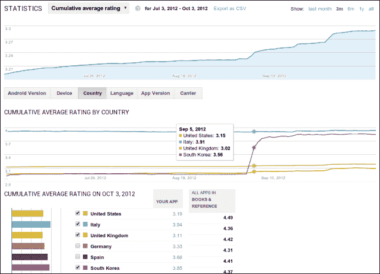
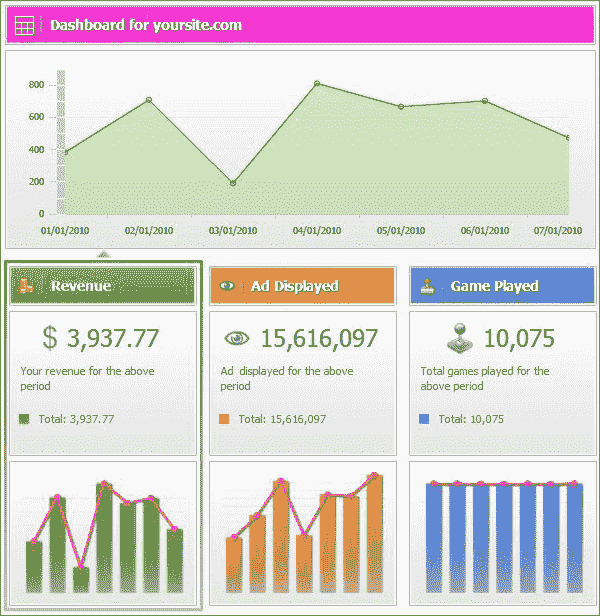
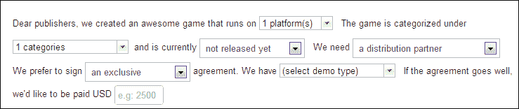
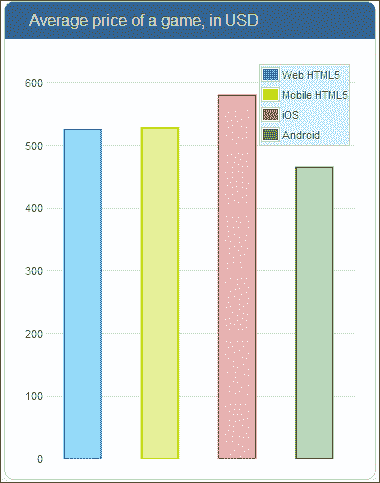

# 第九章：用你的游戏赚钱

在本章中，我们将快速了解 HTML5 游戏开发赚钱的选项。制作游戏可以纯粹是一种爱好，也可以是一种职业。然而，后者要求你制作一些非常独特和成功的游戏，因为竞争非常激烈。因此，提供一个独特的游戏主张，并得到健康的营销支持，似乎是大多数成功游戏开发者的选择。在本章中，我们将涵盖：

+   进入游戏开发时你有的一些战略选择

+   在安卓和苹果的应用市场赚钱

+   游戏内广告选项及其在 HTML5 游戏中的应用

+   MarketJS 作为向出版商出售发行权的途径

# 你的游戏开发策略

如果你想制作一款游戏来赚钱，那么在开始制作之前，有几件事情是必须考虑的。你需要问自己的第一个问题可能是：我要为谁制作游戏？你是针对所有能玩游戏的人，还是想要针对非常特定的人群并满足他们的游戏需求？这就是广泛和小众定位之间的区别。大多数塔防游戏都是非常广泛的目标游戏，你需要建造具有不同属性的塔来抵御敌军。例如《俄罗斯方块》、《宝石迷阵》、《扫雷》和大多数轻盈的益智游戏。《愤怒的小鸟》是另一个例子，它因其简单性、可爱的图形和大量巧妙的营销而受到广泛受众的欢迎。

总的来说，休闲游戏似乎吸引大众的原因有以下几个因素：

+   简单为主：大多数玩家在短短几分钟内就能适应游戏。

+   几乎没有知识先决条件：你不需要已经了解一些背景故事或在这些类型的游戏中有经验。

+   即使投入的练习时间较少，休闲玩家也往往表现不错。即使你一开始就表现不错，你仍然可以变得更好。一个你无法通过重玩变得更好的游戏不会长久。值得注意的例外是像轮盘赌和老虎机这样的机会游戏，它们确实会上瘾；但这是出于其他原因，比如赢钱的机会。

建造休闲游戏的主要优势在于几乎每个人都是你游戏的潜在用户。因此，可实现的成功可能是巨大的。《魔兽世界》是一款游戏，多年来已经从相当激烈和小众的游戏转变为更加休闲的游戏。他们之所以这样做，是因为他们已经吸引了大多数普通玩家，并决定说服大众，即使你一般不怎么玩游戏，也可以玩《魔兽世界》。试图取悦所有人的缺点是竞争的数量。在众多游戏中脱颖而出是非常困难的。特别是如果你没有一个强大的营销机器来支持它。

一个很好的例子是任何一款根据电影制作的游戏。《星际迷航》、《星球大战》、《指环王》等游戏，大多针对已经看过并喜欢这些电影的人。小众游戏也可能是小众，因为它们只针对特定的玩家群体。例如，喜欢玩第一人称射击游戏（FPS）的人，每天都这样做。实质上，小众游戏具有以下特点（请注意，它们与休闲或广泛定位的游戏相对）：

+   陡峭的学习曲线：掌握需要许多小时的专注游戏。

+   需要一些游戏知识或经验。例如《星球边际 2》这样的在线射击游戏，你至少需要一些以前的射击游戏经验，因为你将与知道自己在做什么的人对抗。

+   你玩游戏的次数越多，你获得的有用奖励就越多。经常玩游戏通常会获得使你在游戏中更强大的物品，从而加强了你通过更多游戏而变得更好的事实。

《星际争霸》是暴雪在 1998 年发布的一款游戏，即使有了续作《星际争霸 2》，它仍然在今天的比赛中被玩家们玩耍。原版《星际争霸》等游戏完全可以在 HTML5 中构建，并在浏览器或智能手机上运行。当《星际争霸》发布时，平均台式电脑的性能远不及今天许多智能手机。从技术上讲，道路是开放的；然而复制相同的成功水平又是另一回事。

瞄准游戏玩家群体的优势在于你可以在他们的生活中占据独特的位置。也许你的目标群体并不多，但由于游戏是专门为他们打造的，因此更容易吸引并保持他们的注意。此外，这并不意味着因为你有一个明确的目标，玩家就不能从意想不到的角落进入。你从未想过会玩你的游戏的人仍然可能喜欢你所做的事情。正是因为这个原因，了解你的玩家是如此重要，这也是像 Playtomic 这样的工具存在的原因。

利基营销的劣势是显而易见的：你的游戏很不可能超越一定的范围；它可能永远不会成为世界上最受欢迎的游戏之一。

你将要开发的游戏类型是一个选择，你在每款游戏中投入的细节数量是另一个选择。你可以尽可能多地努力去打造一款游戏。实质上，一款游戏永远不会完成。游戏总是可以有额外的关卡、彩蛋或其他精彩的细节。在规划游戏时，你必须决定你将使用霰弹枪还是狙击手的开发策略。

在霰弹枪策略中，你会快速开发和发布游戏。每款游戏仍然有一个独特的元素，应该使其与其他游戏有所区别：UGP（独特游戏命题）。但是在霰弹枪策略下发布的游戏并不提供很多细节；它们并不完善。

采用霰弹枪策略的优势有很多：

+   低开发成本；因此每款游戏代表着低风险

+   快速上市允许利用世界事件作为游戏背景

+   你可以同时在市场上推出多款游戏，但通常你只需要一款成功的游戏来支付其他游戏的开支

+   短小的游戏可以免费提供给公众，但通过出售附加内容（如关卡）来实现盈利

然而，当你采用这种策略时，并不全是美好的。有几个原因你不会选择霰弹枪策略：

+   一个感觉不完整的游戏成功的机会比一个完美的游戏要小。

+   将游戏投放市场不仅测试了某个概念是否可行，还使其暴露于竞争对手，他们现在可以开始制作副本。当然，你有先发优势，但并不像可能的那么大。

+   你必须始终小心，不要在市场上乱丢垃圾，否则你可能会毁了自己作为开发者的名声。

然而，不要混淆。霰弹枪策略并不是建造平庸游戏的借口。你发布的每款游戏都应该有独特的特色——没有其他游戏有的东西。如果一个游戏没有新的特色，为什么有人会选择它而不是其他所有游戏呢？

当然，还有狙击策略，它涉及构建一个体面且经过深思熟虑的游戏，并在市场上以最大的关怀和支持发布。这是苹果等分发商敦促开发者做的事情，也是有充分理由的——你不希望你的应用商店里充斥着糟糕的游戏，对吧？一些其他游戏分发商，比如 Steam，在允许分发的游戏方面更加挑剔，使得散弹策略几乎不可能。但这也是最成功的游戏开发者使用的策略。看看 Rockstar（GTA 系列的开发者）、Besthesda（上古卷轴系列的开发者）、Bioware（质量效应系列的开发者）、暴雪（魔兽世界系列的开发者）等开发者。这些都不是小角色，但他们在市场上的游戏并不多。开发高质量游戏并希望它们能够成功显然是有风险的。为了开发一个真正了不起的游戏，你还需要时间和金钱。如果你的游戏销售不佳，这对你或你的公司来说可能是一个真正的问题。即使对于 HTML5 游戏来说，情况也可能如此，特别是因为设备和浏览器变得越来越强大。当运行游戏的设备变得更强大时，游戏本身通常会变得更加复杂，开发时间也会更长。

我们已经看了进入游戏开发业务时需要做出的两个重要选择。现在让我们来看一下允许你通过游戏赚钱的分发渠道，但在此之前让我们总结一下我们刚刚讨论过的主题：

+   在开始开发游戏之前，决定你想要针对的目标群体非常重要。

+   广泛的目标实际上根本就不是目标。它是关于让尽可能多的人能够接触和喜欢游戏。

+   利基定位是深入研究和关注特定群体，并开发适合他们特定游戏需求的游戏。

+   在开发和发布游戏时，有两种主要策略：散弹和狙击。

+   在散弹策略中，你会快速发布游戏。每个游戏仍然具有其他游戏所不具备的独特元素，但它们不像可能那样精心制作和打磨。

+   采用狙击策略，你只开发少量游戏，但每个游戏在发布时已经完美，并且只需要在发布补丁时进行轻微的打磨。

# 通过游戏应用赚钱

如果你将你的游戏制作成应用程序，你可以选择多个分发渠道，比如 Firefox 市场、IntelAppUp 中心、Windows Phone 商店、亚马逊应用商店、SlideMe、Mobango、Getjar 和苹果 Appsfire。但目前市场上最受欢迎的玩家是 Google Play 和 iOS 应用商店。iOS 应用商店不应与 Mac 应用商店混淆。iPad 和 Mac 有两个不同的操作系统，iOS 和 Mac OS，因此它们有不同的商店。游戏可以在 iOS 商店和 Mac 商店发布。还可能会有一些混淆，例如 Google Play 和 Chrome Web 商店。Google Play 包含所有适用于搭载谷歌安卓操作系统的智能手机的应用程序。Chrome Web 商店允许你向 Google Chrome 浏览器添加应用程序。因此有很多分发渠道可供选择，我们将简要介绍一下 Google Play、iOS 应用商店和 Chrome Web 商店。

## 谷歌 Play

谷歌 Play 是安卓的默认应用商店，也是 iOS 应用商店最大的竞争对手。

如果你想成为安卓应用开发者，需要支付 25 美元的费用，并且必须阅读开发者分发协议。

作为进入费和签署协议的回报，他们允许您使用他们的虚拟货架并享有所有的好处。您可以随意设置价格，但是对于您出售的每款游戏，Google 将收取约 30％的费用。可能会进行一些地理价格歧视。因此，您可以在比利时将价格设定为 1 欧元，而在德国收取 2 欧元。您可以随时更改价格；但是，如果您免费发布游戏，就无法回头了。之后，该应用的唯一变现方式是允许游戏内广告、出售附加内容或创建可以用真钱购买的游戏内货币。

引入用真钱购买的游戏内货币可能是一种非常吸引人的格式。这种变现方案的一个非常成功的例子可以在《蓝精灵》游戏中找到。在这个游戏中，您可以建立自己的蓝精灵村庄，包括大蓝精灵、蓝精灵和大量的蘑菇。您种植更多庄稼并建造新房子，您的城市会变得更大，但这是一个缓慢的过程。为了加快速度，您可以用真钱购买特殊的浆果，从而可以建造独特的蘑菇和其他东西。这种变现方案变得非常受欢迎，正如在《英雄联盟》、《星球边境 2》、《坦克世界》等游戏中所显示的那样。对于 Google Play 应用，这种应用内支付系统得到了 Android 的 Google Checkout 的支持。

此外，Google 允许您访问有关游戏的一些基本统计数据，例如玩家数量和他们玩游戏的设备，如下图所示：



这样的信息可以让您重新设计游戏以提高成功率。例如，您可以注意到某个设备的独立用户数量并不多，尽管它是非常受欢迎的设备，被许多人购买。如果是这种情况，也许您的游戏在这种特定的智能手机或平板电脑上看起来不太好，您应该对其进行优化。

所有应用的最大竞争对手和发起者都是 iOS 应用商店，所以让我们来看看这个。

## iOS 应用商店

iOS 应用商店是第一个这样的应用商店，在撰写本书时，它仍然拥有最大的收入。

要在 iOS 应用商店发布应用，您需要订阅 iOS 开发者计划，每年费用为 99 美元，几乎是 Google Play 的四倍。实际上，它们提供的东西与 Google Play 几乎相同；正如您在这个简短的列表中所看到的：

+   您可以自行定价，并获得销售收入的 70％

+   您可以每月收到无需信用卡、托管或营销费用的付款

+   有支持和充分的文档可供您开始

更重要的是，以下是 Google Play 和 iOS 应用商店之间的区别：

+   如前所述，注册 Google Play 更便宜。

+   苹果的筛选过程似乎比 Google Play 更严格，这导致了更长的时间才能进入市场，甚至有更高的可能性根本无法进入市场。

+   Google Play 包含退款选项，允许购买您的应用的人在 24 小时内卸载应用或游戏后获得退款。

+   如果您希望您的游戏能够利用一些 Android 核心功能，这是可能的，因为该平台是开源的。另一方面，苹果对其 iOS 平台非常保护，并且不允许应用程序具有相同级别的灵活性。这个元素对于游戏来说可能还不那么重要，但对于那些确实希望利用这种自由的非常创新的游戏来说可能很重要。

+   iOS 覆盖的人数比 Android 多，尽管当前趋势表明这种情况可能在不久的将来会发生变化。

+   购买苹果设备的人和使用安卓系统智能手机或平板电脑的用户之间似乎存在显著差异。苹果粉丝对在应用上花钱的门槛似乎比安卓用户低。总的来说，iPad 和 iPhone 比其他平板电脑和智能手机更昂贵，吸引了那些对设备花更多钱没有问题的人。这种目标群体的差异似乎让安卓游戏开发者更难从他们的游戏中赚钱。

### 提示

如果你的游戏在 Safari 浏览器上运行，并不意味着它已经准备好被 iOS 应用商店接受。将你的游戏转换为本地应用需要一些额外的准备。同样的情况也适用于 Chrome 浏览器和 Google Play 商店。从浏览器游戏转换为应用可以使用 AppMobi，就像在第八章中展示的那样，*调整你的 HTML5 游戏到分销渠道*。

在这里我们将讨论的最后一个销售应用的选择是 Chrome 网络商店。

## Chrome 网络商店

Chrome 网络商店不同于 Google Play 和 iOS 应用商店，它提供的是专门为 Chrome 浏览器而不是移动设备的应用。

Chrome 商店提供网络应用。网络应用就像你在 PC 上安装的应用程序，只不过网络应用安装在你的浏览器中，大多数是使用 HTML、CSS 和 JavaScript 编写的，就像我们的 ImpactJS 游戏一样。关于 Chrome 商店值得注意的第一件事是发布应用的一次性 5 美元入场费。如果这本身还不够好，那么销售应用的交易费仅为 5％。这与 Google Play 和 iOS 应用商店有着显著的不同。如果你已经为自己的网站开发了一款游戏，并将其打包为安卓和/或苹果的应用，你也可以在 Chrome 网络商店上发布。将你的 ImpactJS 游戏转换为 Chrome 商店的网络应用可以使用 AppMobi，但 Google 本身提供了如何手动操作的详细文档。

网络应用的最大好处之一是简化了权限流程。假设你的网络应用需要用户的位置才能运行。而 iPad 应用每次需要位置数据时都会请求权限，网络应用只在安装时请求一次。

此外，它提供与 Google Play 相同的功能和支付方式。例如，还有一个包括免费试用版本的选项，也就是所谓的免费增值。免费增值模式是指允许免费下载演示版本，并提供升级到完整版本的选项。《蓝精灵》游戏也使用了免费增值模式，尽管有所不同。整个游戏是免费的，但玩家可以选择用真钱购买一些原本需要花费大量时间才能获得的东西。在这种免费增值模式中，你为方便和独特物品付费。例如，在《星际争霸 2》中，获得某个狙击步枪可能需要你花费几天或 10 美元，这取决于你选择如何玩免费增值游戏。

如果你计划为安卓发布 ImpactJS 游戏，那么在 Chrome 网络商店发布也是毫无理由不这样做的。

总之，让我们快速回顾一下：

+   iOS 应用商店是唯一的应用商店的时代早已一去不复返；现在有许多可供选择的应用商店，包括 Firefox Marketplace、Intel AppUp Center、Windows Phone Store、Amazon Appstore、SlideMe、Mobango、Getjar、Appsfire、Google Play 等。

+   目前最大的应用商店是 Google Play 和 iOS 应用商店。它们在几个方面有很大的不同，其中最重要的是：

+   订阅费

+   筛选流程

+   吸引的受众类型

+   Chrome 网络商店销售的是像普通应用一样的网络应用，但只能在 Chrome 浏览器中使用。

+   Chrome 网络商店便宜且易于订阅。你一定要试试在这个平台上发布你的游戏。

# 游戏内广告

游戏内广告是另一种赚钱的方式。游戏内广告是一个不断增长的市场，目前已经被主要公司使用；巴拉克·奥巴马在他 2008 年和 2012 年的竞选中也使用了游戏内广告，如下游戏内截图所示：


有一种趋势是更加动态的游戏内广告。游戏制造商确保游戏中有广告空间，但实际的广告内容是后来决定的。根据对你的了解，这些广告可以随后变化，变得与你作为玩家和现实消费者相关。

当刚开始制作游戏时，游戏内广告并不那么引人注目。大多数知名的在线游戏内广告商甚至不希望他们的广告出现在初创游戏中。

Google AdSense 的要求如下：

+   **游戏玩法**：每天至少 500,000 次

+   **游戏类型**：仅限基于 Web 的 Flash

+   **集成**：必须具备 SDK 集成的技术能力

+   **流量来源**：80%的流量必须来自美国和英国

+   **内容**：适合家庭和面向 13 岁及以上的用户

+   **分发**：必须能够报告嵌入目的地并控制游戏的分发位置

另一家大竞争对手 Ad4Game 的要求也不轻松：

+   至少每天有 10,000 个独立访客

+   不接受子域和博客

+   Alexa 排名应该低于 400,000

+   不允许成人/暴力/种族主义内容

如果你刚开始，这些先决条件并不是好消息。不仅因为你需要如此多的玩家才能开始广告，而且因为目前所有的支持都是针对 Flash 游戏。HTML5 游戏目前还没有得到充分支持，尽管这可能会改变。

幸运的是，有一些公司允许你开始使用广告，即使你每天没有 10,000 个访问者。Tictacti 就是其中之一。

再次强调，几乎所有的支持都是针对 Flash 游戏的，但他们确实为 HTML5 游戏提供了一个选项：**预滚动**。预滚动简单地意味着在你开始游戏之前会出现一个带有广告的屏幕。预滚动广告的集成非常简单，不需要对游戏进行更改，只需要对你的`index.html`文件进行更改，就像 Tictacti 的以下示例一样：

```js
//You can use publisherId 3140 and tagTypedemoAPI for testing purposes however the ads will not be credit to you.
<html>
<head>
  <title>Simple Ad</title>
</head>
<body>
<script type="text/javascript"src="img/t3widgets.js"></script><script type="text/javascript">
  var publisherId = "3140";var tagType = "jsGameAPI";var agencyUniqueId= "0";var playerWidth = "600";//The Game widthvar playerHeight = "400";//The Game heightvar t3cfg = {wrapperUrl: 'engine/game/3170/tttGameWrapper.swf',
config: { enableDM: false, tttPreloader: false, bgcolor: "#000000", engineConnectorType: 7 , externalId:agencyUniqueId},
    onClose:function(){document.location="http://www.tictacti.com";}
    //Called after the ad is closed. In the Demo after 30 seconds.};
  TicTacTi.renderWidget(publisherId, tagType, playerWidth ,playerHeight , t3cfg);
</script>
</body>
</html>
```

在将其添加到游戏的`index.html`文件时，填写你自己的发布者 ID，基本上就可以开始了。

Tictacti 类似于 Google Analytics，它还为你提供了一些关于游戏网站上广告的相关信息，如下图所示：



然而，要小心，预滚动广告是最具侵入性和恼人的广告之一。从技术上讲，它甚至不算是游戏内广告，因为它是在你玩游戏之前运行的。如果你的游戏还没有建立足够的声誉，无法说服玩家忍受广告才能开始游戏，就不要选择这个选项。给你的游戏一些时间来建立声誉，然后再让玩家忍受这些。

最后一个选择是通过 MarketJS 出售你的实际分发权。但首先让我们简要回顾一下游戏内广告：

+   游戏内广告是一个不断增长的市场。甚至巴拉克·奥巴马也利用游戏内广告牌来支持他的竞选活动。

+   有一种趋势是更加动态的游戏内广告——利用你的位置和人口统计信息来调整游戏中的广告。

+   目前，即使是最容易接触到的在线游戏广告公司也专注于 Flash 游戏，并要求有很多独立访问者才能允许你展示他们的广告。Tictacti 是一个值得注意的例外，因为它的先决条件低，实施简单；尽管广告目前仅限于预滚动广告。

+   始终要先为你的游戏建立良好的声誉，然后再允许广告。

# 使用 MarketJS 出售分发权

我们在本章中将要调查的最后一个选项是出售你的游戏分发权。你仍然可以通过将游戏发布到所有应用商店和你自己的网站上赚钱，但要被注意到变得越来越困难。只有当人们知道游戏存在时，质量才能获胜，因此制作一款好游戏有时是不够的——你需要营销。如果你是一个有很好的游戏创意和技能的初学者游戏开发者，那很好，但营销可能不是你的菜。这就是 MarketJS 发挥作用的地方。

MarketJS 充当游戏开发者和游戏出版商之间的中介。

一旦你有了游戏，程序就很简单：

1.  你可以在他们的网站[`www.marketjs.com`](http://www.marketjs.com)上注册。

1.  将游戏上传到你自己的网站或直接上传到 MarketJS 服务器。

1.  发布你的游戏供出版商查看。你可以设置一些选项，比如最适合你的价格和合同类型。你有五个合同选项：

+   **完整分发合同**：将你的游戏所有的分发权出售。

+   **独家分发合作伙伴合同**：在这里，你限制自己与一个分销商合作，但仍保留游戏的权利。

+   **非独家合同**：在这里，任何分销商都可以购买你游戏的使用权，但只要你愿意，你可以继续出售权利。

+   **收入分成**：在这里，你可以协商如何分配游戏产生的收入。

+   **定制合同**：这基本上可以有任何条款。如果你还不确定你想从你的游戏中得到什么，你可以选择这个选项。在填写你的合同偏好的网页部分如下截图所示：



发布演示后，就是等待出版商发现它，被它的壮丽所震撼，并提出与你合作的要约。

MarketJS 对游戏领域的重大贡献在于让游戏开发者专注于开发游戏。其他人负责营销方面，这是完全不同的一回事。

MarketJS 还提供了一些有趣的统计数据，比如他们网站上游戏的平均价格，如下图所示。这让你对是否应该把游戏开发作为一种生活方式或者继续把它作为一种爱好有了一些见解。



根据 MarketJS，非独家权利的价格平均在 500 到 1000 美元之间，而售出游戏的独家权利价格在 1500 到 2000 美元之间。如果你能在这个价格范围内制作一款体面的游戏，那么你已经准备好了：

+   MarketJS 是一家将游戏分销商和开发者联系在一起的公司。他们专注于 HTML5 游戏，所以如果你是一名初创的 ImpactJS 游戏开发者，他们是一个很好的选择。

+   他们不需要订阅费，并且有一个简单的流程将你的游戏变成一个带有价格标签的展示品。

# 总结

在本章中，我们已经看了一些重要的元素，考虑了你的游戏开发策略。你想采取散弹枪策略，在短时间内开发大量游戏吗？还是你会使用狙击手策略，只开发一些精心制作的游戏？你还需要决定你希望吸引的受众群体。你可以选择制作一款受到所有人喜爱的游戏，但竞争激烈。

在应用商店赚钱是可能的，但对于 Android 和 Apple 来说，有注册费。如果你决定开发应用程序，不妨试试 Chrome 网络应用商店（它运行网络应用）。

游戏内广告是资助你的努力的另一种方式，尽管大多数提供在线游戏服务的公司对此有很高的先决条件，并且更多地支持 Flash 游戏而不是更新的 HTML5 游戏。

最有前途的变现模式之一是免费模式。玩家可以自由玩游戏，但他们需要为额外的内容付费。这是一个容易被接受的模式，因为对于不愿意花钱的人来说，游戏基本上是免费的，而且也没有烦人的广告。

游戏内广告和免费模式的组合也是可能的：被广告打扰的人支付费用，作为回报，他们将不再受到打扰。

最后一个选择是通过与 MarketJS 合作出售你的发行权，将营销方面留给其他人。他们专注于 HTML5 游戏，这个选择对于初学者游戏开发者来说特别有用，因为他们在营销游戏方面可能会遇到困难。

我们现在已经到达了书的结尾，涵盖了大量的信息 - 从设置服务器的基础知识，到开发 ImpactJS 游戏，再到自己创作的分发。感谢你阅读了所有这些。

我希望能让整个过程更容易理解，并为你开始创作自己的游戏甚至可能靠此谋生提供最后的推动。有时，开发游戏可能会令人沮丧，因为魔鬼常常隐藏在细节中。你可能会发现自己经常咒骂屏幕，但请记住这不是电脑的错，只要有足够的决心，你总能找到解决方案。如果你有时感到迷茫，ImpactJS 网站有一个充满了非常乐于助人的人的论坛，我非常鼓励你利用它，在那里分享你的想法、问题和想法。当你关闭这本书，开始制作你的游戏时，不要忘记制定计划并以非常有条理的方式工作将是成功的关键因素，并可能避免许多不眠之夜。逐步进行变更和改进，并始终检查一切是否仍然按预期运行是正确的方式，可以交付一个完美运行的游戏。但是，尽管有组织和有条理的思维所带来的所有好处，还有另一个最重要的东西：你的想象力。

要有原创性，不要受到已有内容的限制，你无疑会创造出一款让数百万人喜欢的游戏，甚至可能经得起时间的考验。
