# 第一章：在画布中绘制形状

在本章中，我们将涵盖：

+   使用 2D 画布进行图形处理

+   从基本形状开始

+   分层矩形以创建希腊国旗

+   使用路径创建形状

+   创建复杂形状

+   添加更多顶点

+   重叠形状以创建其他形状

# 介绍

本章的主要重点是突破在画布上工作。在创建图表时，我们将花费大部分时间与画布一起工作。

在本章中，我们将掌握使用画布 API 绘制基本形状和样式。本章将是本书其余部分的图形支柱，因此如果在任何阶段您觉得需要复习，可以回到本章。绘制线条可能...嗯，不是很激动人心。有什么比将主题整合到本章作为一个子主题更能使它更加戏剧化呢：创建旗帜！

# 使用 2D 画布进行图形处理

画布是 HTML 的主要和最激动人心的补充。这是行业的热点，所以让我们从那里开始。我们将在后面的章节中再次访问画布。在这个示例中，我们将学习如何使用画布动态绘制，并创建一个彩色圆形数组，每秒更新一次。

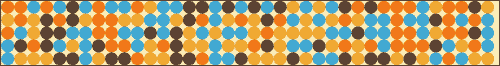

## 如何做...

我们将创建两个文件（一个 HTML5 文件和一个 JS 文件）。让我们从创建一个新的 HTML5 文档开始：

1.  第一步是创建一个空的 HTML5 文档：

```js
<!DOCTYPE html>
<html>
  <head>
    <meta charset="utf-8" />
    <title>Canvas Example</title>
  </head>
  <body>
  </body>
</html>
```

### 提示

**下载示例代码**

您可以从您在[`www.PacktPub.com`](http://www.PacktPub.com)的帐户中购买的所有 Packt 图书下载示例代码文件。如果您在其他地方购买了本书，您可以访问[`www.PacktPub.com/support`](http://www.PacktPub.com/support)并注册以直接通过电子邮件接收文件。

代码文件也可以在[`02geek.com/books/html5-graphics-and-data-visualization-cookbook.html`](http://02geek.com/books/html5-graphics-and-data-visualization-cookbook.html)上找到。

1.  创建一个新的画布元素。我们给我们的画布元素一个 ID 为`myCanvas`：

```js
  <body>
<canvas id="myCanvas"> </canvas>
  </body>

```

1.  将 JavaScript 文件`01.01.canvas.js`导入 HTML 文档（我们将在第 5 步中创建此文件）：

```js
<!DOCTYPE html>
<html>
  <head>
    <meta charset="utf-8" />
 <script src="img/01.01.canvas.js"></script>
    <title>Canvas Example</title>
  </head>

```

1.  添加一个`onLoad`监听器，并在文档加载时触发函数`init`：

```js
<!DOCTYPE html>
<html>
  <head>
    <meta charset="utf-8" />
    <script src="img/01.01.canvas.js"></script>
    <title>Canvas Example</title>
  </head>
  <body onLoad="init();" style="margin:0px">
    <canvas id="myCanvas" />
  </body>
</html>
```

1.  创建`01.01.canvas.js`文件。

1.  在 JavaScript 文件中，创建函数`init`并在其中调用函数`updateCanvas`：

```js
function init(){
  updateCanvas();
}
```

1.  创建函数`updateCanvas`：

```js
function  updateCanvas(){
  //rest of the code in the next steps will go in here
}
```

1.  在`updateCanvas`函数中（在接下来的步骤中，所有代码都将添加到此函数中），创建两个变量，用于存储您所需的宽度和高度。在我们的情况下，我们将获取窗口的宽度：

```js
function  updateCanvas(){
 var width = window.innerWidth;
 var height = 100;
...
```

1.  访问 HTML 文档中的画布层，并更改其宽度和高度：

```js
var myCanvas = document.getElementById("myCanvas");
    myCanvas.width = width;
    myCanvas.height = height;
```

1.  获取画布的 2D 上下文：

```js
var context = myCanvas.getContext("2d");
```

1.  创建一个矩形以填充画布的完整可见区域：

```js
context.fillStyle = "#FCEAB8";
context.fillRect(0,0,width,height);
```

1.  让我们创建一些辅助变量，以帮助我们确定要绘制的元素的颜色、大小和数量：

```js
var circleSize=10;
var gaps= circleSize+10;
var widthCount = parseInt(width/gaps); 
var heightCount = parseInt(height/gaps); 
var aColors=["#43A9D1","#EFA63B","#EF7625","#5E4130"];
var aColorsLength = aColors.length;
```

1.  创建一个嵌套循环，并创建一个随机颜色的圆形网格：

```js
for(var x=0; x<widthCount;x++){
  for(var y=0; y<heightCount;y++){
    context.fillStyle = aColors[parseInt(Math.random()*aColorsLength)];
    context.beginPath();
    context.arc(circleSize+gaps*x,circleSize+ gaps*y, circleSize, 0, Math.PI*2, true); 
    context.closePath();
    context.fill();	
  }
}
}
```

哇！这是很多步骤！如果您按照所有步骤进行操作，当您运行应用程序时，您将在浏览器中找到许多圆形。

## 它是如何工作的...

在我们直接进入此应用程序的 JavaScript 部分之前，我们需要触发`onLoad`事件以调用我们的`init`函数。我们通过将`onLoad`属性添加到我们的 HTML body 标签中来实现这一点：

```js
<body onLoad="init();">
```

让我们分解 JavaScript 部分，并了解这样做的原因。第一步是创建`init`函数：

```js
function init(){
  updateCanvas();
}
```

我们的`init`函数立即调用`updateCanvas`函数。这样做是为了以后可以刷新并再次调用`updateCanvas`。

在`updateCanvas`函数中，我们首先获取浏览器的当前宽度，并为我们的绘图区域设置一个硬编码值的高度：

```js
var width = window.innerWidth;
var height = 100;
```

我们的下一步是使用其 ID 获取我们的画布，然后根据先前的变量设置其新的宽度和高度：

```js
var myCanvas = document.getElementById("myCanvas");
    myCanvas.width = width;
    myCanvas.height = height;
```

是时候开始绘制了。为了做到这一点，我们需要要求我们的画布返回其上下文。有几种类型的上下文，如 2D 和 3D。在我们的情况下，我们将专注于 2D 上下文，如下所示：

```js
var context = myCanvas.getContext("2d");
```

现在我们有了上下文，我们有了开始探索和操纵我们的画布所需的一切。在接下来的几个步骤中，我们通过使用十六进制值设置`fillStyle`颜色来定义画布的背景颜色，并绘制一个适合整个画布区域的矩形：

```js
var context = myCanvas.getContext("2d");
    context.fillStyle = "#FCEAB8";
 context.fillRect(0,0,width,height);

```

`fillRect`方法接受四个参数。前两个是矩形的（x，y）位置，在我们的情况下，我们想从（0,0）开始，后面的参数是我们新矩形的宽度和高度。

让我们画我们的圆。为此，我们需要定义我们圆的半径和圆之间的间距。让我们不间隔圆，创建半径为 10 像素的圆。

```js
var rad=10;
var gaps= rad*2;
```

第一行分配了我们圆的半径，而第二行捕获了我们创建的每个圆的中心之间的间隙，或者在我们的情况下是我们圆的直径。通过将其设置为两倍的半径，我们将我们的圆精确地一个接一个地间隔开。

```js
var widthCount = parseInt(width/gaps); 
var heightCount = parseInt(height/gaps); 
var aColors=["#43A9D1","#EFA63B","#EF7625","#5E4130"];
var aColorsLength = aColors.length;
```

使用我们的新`gaps`变量，我们发现我们可以在画布组件的宽度和高度上创建多少个圆。我们创建一个存储一些圆的颜色选项的数组，并将变量`aColorsLength`设置为`aColors`的长度。我们这样做是为了减少处理时间，因为变量比属性更容易获取，因为我们将在我们的`for`循环中多次调用这个元素：

```js
for(var x=0; x<widthCount;x++){
 for(var y=0; y<heightCount;y++){
    context.fillStyle = aColors[parseInt(Math.random()*aColorsLength)];
    context.beginPath();
    context.arc(rad+gaps*x,rad+ gaps*y, rad, 0, Math.PI*2, true); 
    context.closePath();
    context.fill();
  }
}
```

我们嵌套的`for`循环使我们能够创建我们的圆到画布的宽度和高度。第一个`for`循环专注于升级宽度值，而第二个`for`循环负责遍历每一列。

```js
context.fillStyle = aColors[parseInt(Math.random()*aColorsLength)];
```

使用`Math.random`，我们随机从`aColors`中选择一种颜色，用作我们新圆的颜色。

```js
context.beginPath();
context.arc(rad+gaps*x,rad+ gaps*y, rad, 0, Math.PI*2, true); 
context.closePath();
```

在上一段代码的第一行和最后一行声明了一个新形状的创建。`beginPath`方法定义了形状的开始，`closePath`方法定义了形状的结束，而`context.arc`创建了实际的圆。`arc`属性采用以下格式的值：

```js
context.arc(x,y,radius,startPoint,endPoint, isCounterClock);
```

`x`和`y`属性定义了弧的中心点（在我们的例子中是一个完整的圆）。在我们的`for`循环中，我们需要添加额外半径的缓冲区，将我们的内容推入屏幕。我们需要这样做，因为如果我们不通过额外的半径将其推到左边和底部，那么我们第一个圆的四分之一将是可见的。

```js
context.fill();
```

最后但并非最不重要的是，我们需要调用`fill()`方法来填充我们新创建的形状的颜色。

## 还有更多...

让我们使我们的元素每秒刷新一次；要做到这一点，我们只需要添加两行。第一行将使用`setInterval`每秒触发对`updateCanvas`函数的新调用。

```js
function init(){
 setInterval(updateCanvas,1000);
  updateCanvas();
} 
```

如果您刷新浏览器，您会发现我们的示例正在工作。如果您努力寻找问题，您将找不到，但我们有一个问题。这不是一个主要问题，而是一个让我们学习画布的另一个有用功能的绝佳机会。在任何阶段，我们都可以清除画布或其部分。让我们在重新绘制之前清除当前画布，而不是在当前画布上绘制。在`updateCanvas`函数中，我们将添加以下突出显示的代码：

```js
var context = myCanvas.getContext("2d"); 
context.clearRect(0,0,width,height);

```

一旦我们得到上下文，我们就可以使用`clearRect`方法清除已经存在的数据。

## 另外

+   *从基本形状开始*食谱

# 从基本形状开始

在这个阶段，您知道如何创建一个新的画布区域，甚至创建一些基本形状。让我们扩展我们的技能，开始创建旗帜。

## 准备工作

嗯，我们不会从最基本的旗帜开始，因为那只是一个绿色的矩形。如果您想学习如何创建绿色旗帜，您不需要我，所以让我们转向稍微复杂一点的旗帜。

如果您已经按照*使用 2D 画布进行绘图*食谱的步骤进行操作，您已经知道如何做了。这个食谱专门为我们帕劳读者和完美的圆弧（也称为圆）而设。

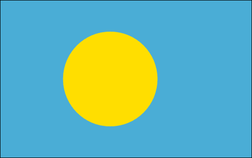

在这个食谱中，我们将忽略 HTML 部分，因此，如果您需要了解如何创建带有 ID 的画布，请返回到本章的第一个食谱，并设置您的 HTML 文档。不要忘记使用正确的 ID 创建画布。您也可以下载我们的示例 HTML 文件。

## 如何做...

添加以下代码块：

```js
var cnvPalau = document.getElementById("palau");
  var wid = cnvPalau.width;
  var hei = cnvPalau.height;

  var context = cnvPalau.getContext("2d");
      context.fillStyle = "#4AADD6";
      context.fillRect(0,0,wid,hei);

      context.fillStyle = "#FFDE00";
      context.arc(wid/2.3, hei/2, 40, 0, 2 * Math.PI, false);
      context.fill();
```

就是这样，你刚刚创建了一个完美的圆弧，以及你的第一个具有形状的国旗。

## 它是如何工作的...

在这个阶段，这段代码的大部分内容应该看起来非常熟悉。因此，我将重点放在与本章第一个食谱中使用的代码相比的新行上。

```js
  var wid = cnvPalau.width;
  var hei = cnvPalau.height;
```

在这些行中，我们提取了画布的宽度和高度。我们有两个目标：缩短我们的代码行数，减少不必要的 API 调用次数。由于我们使用它超过一次，我们首先获取这些值并将它们存储在`wid`和`hei`中。

现在我们知道了画布的宽度和高度，是时候画我们的圆圈了。在开始绘制之前，我们将调用`fillStyle`方法来定义在画布中使用的背景颜色，然后我们将创建圆弧，最后触发`fill`方法来完成。

```js
      context.fillStyle = "#FFDE00";
      context.arc(wid/2.3, hei/2, 40, 0, 2 * Math.PI, false);
      context.fill();
```

然后，我们使用`arc`方法创建我们的第一个完美圆圈。重要的是要注意，我们可以在任何时候更改颜色，例如在这种情况下，我们在创建新圆圈之前更改颜色。

让我们更深入地了解一下`arc`方法的工作原理。我们首先通过`x`和`y`位置定义我们圆圈的中心。画布标签遵循标准的笛卡尔坐标：（0，0）在左上角（`x`向右增长，`y`向底部增长）。

```js
context.arc(x, y, radius, startingAngle, endingAngle, ccw);
```

在我们的示例中，我们决定通过将画布的宽度除以`2.3`来将圆圈略微定位到中心的左侧，并将`y`定位在画布的正中心。下一个参数是我们圆圈的半径，接下来是两个参数，定义了我们描边的起始和结束位置。由于我们想要创建一个完整的圆圈，我们从`0`开始，到两倍的`Math.PI`结束，即一个完整的圆圈（`Math.PI`相当于 180 度）。最后一个参数是我们圆弧的方向。在我们的情况下，由于我们正在创建一个完整的圆圈，设置在这里无关紧要（ccw = 逆时针）。

```js
context.fill();
```

最后但同样重要的是，我们调用`fill`函数来填充和着色我们之前创建的形状。与`fillRect`函数不同，它既创建又填充形状，`arc`方法不会。`arc`方法只定义要填充的形状的边界。您可以使用这种方法（和其他方法）在实际绘制到舞台之前创建更复杂的形状。我们将在本章的后续食谱中更深入地探讨这一点。

# 层叠矩形以创建希腊国旗

我们在为帕劳创建国旗时学到，当我们使用`arc`方法创建一个圆圈时，我们必须单独触发一个请求来填充形状。这对我们从头开始创建的所有形状都是如此，对于创建线条也是如此。让我们转向一个稍微复杂一点的国旗：希腊国旗。

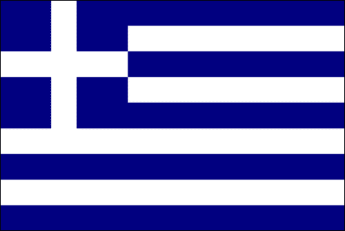

## 准备工作

与上一个食谱一样，我们将跳过 HTML 部分，直接进入绘制画布的 JavaScript 部分。有关创建画布元素所涉及的步骤的详细说明，请参考本章的第一个食谱。

在开始编码之前，仔细观察国旗，并尝试制定一个攻击计划，列出创建这面国旗所需执行的步骤。

## 如何做...

如果我们看一下旗帜，很容易就能想出如何规划这个过程。有很多方法可以做到这一点，但以下是我们的尝试：

1.  我们首先启动我们的应用程序，并创建一个空白的蓝色画布：

```js
  var canvas = document.getElementById("greece");
  var wid = canvas.width;
  var hei = canvas.height;

  var context = canvas.getContext("2d");
      context.fillStyle = "#000080";
      context.fillRect(0,0,wid,hei);
```

1.  如果你看一下前面的图，有四条白色条纹和五条蓝色条纹将成为背景的一部分。让我们将画布的总高度除以`9`，这样我们就可以找到我们线条的合适大小：

```js
  var lineHeight = hei/9;
```

1.  到目前为止，我们使用内置工具创建了形状，比如`arc`和`fillRect`。现在我们要手动绘制线条，为此我们将设置`lineWidth`和`strokeStyle`的值，这样我们就可以在画布上绘制线条：

```js
  context.lineWidth = lineHeight;
  context.strokeStyle = "#ffffff";
```

1.  现在，让我们循环四次，创建一条从右侧到左侧的线，如下所示：

```js
  var offset = lineHeight/2;
  for(var i=1; i<8; i+=2){
    context.moveTo(0,i*lineHeight + offset);
    context.lineTo(wid,i*lineHeight+offset);

  }
```

就是这样，我们成功了。重新加载你的 HTML 页面，你会发现希腊的国旗以其全部的荣耀展现在那里。嗯，还不是全部的荣耀，但足够让你猜到这是希腊的国旗。在我们继续之前，让我们深入了解一下这是如何工作的。

## 它是如何工作的...

注意偏移量的增加。这是因为`lineWidth`从线的中心点向两个方向增长。换句话说，如果从(0, 0)到(0, height)绘制宽度为 20 像素的线条，那么只有 10 像素可见，因为线条的厚度范围在(-10 到 10)之间。因此，我们需要考虑到我们的第一条线需要被其宽度的一半向下推，这样它就在正确的位置上了。

`moveTo`函数接受两个参数`moveTo(x,y)`。`lineTo`函数也接受两个参数。我相信你一定已经猜到它们之间的区别了。一个会移动虚拟点而不绘制任何东西，而另一个会在点之间创建一条线。

## 还有更多...

如果你运行你的 HTML 文件，你会发现我们的线条没有显示出来。别担心，你没有犯错（至少我是这么认为的；））。为了让线条变得可见，我们需要告诉浏览器我们已经准备好了，就像我们在使用`arc`时调用`fill()`方法一样。在这种情况下，由于我们正在创建线条，我们将在定义完线条后立即调用`stroke()`方法，如下所示：

```js
var offset = lineHeight/2;
  for(var i=1; i<8; i+=2){
    context.moveTo(0,i*lineHeight + offset);
    context.lineTo(wid,i*lineHeight+offset);

  }
 context.stroke();

```

如果你现在刷新屏幕，你会发现我们已经离成功更近了。现在是时候在屏幕的左上角添加那个矩形了。为此，我们将重用我们的`lineHeight`变量。我们的矩形的大小是`lineHeight`长度的五倍：

```js
  context.fillRect(0,0,lineHeight*5,lineHeight*5);
```

现在是时候在旗帜上创建十字了：

```js
  context.moveTo(0, lineHeight*2.5);
  context.lineTo(lineHeight*5,lineHeight*2.5);
  context.moveTo(lineHeight*2.5,0);
  context.lineTo(lineHeight*2.5,lineHeight*5+1);
  context.stroke();
```

如果你现在运行应用程序，你会感到非常失望。我们完全按照之前学到的内容去做了，但结果并不如预期。

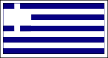

线条都混在一起了！好吧，别害怕，这意味着是时候学习新东西了。

### beginPath 方法和 closePath 方法

我们的旗帜效果不太好，因为它被我们之前创建的所有线搞混了。为了避免这种情况，我们应该告诉画布我们何时开始新的绘图，何时结束。为此，我们可以调用`beginPath`和`closePath`方法，让画布知道我们已经完成了某些事情或者正在开始新的事情。在我们的情况下，通过添加`beginPath`方法，我们可以解决我们的旗帜问题。

```js
  context.fillRect(0,0,lineHeight*5,lineHeight*5);
 context.beginPath();
  context.moveTo(0, lineHeight*2.5);
  context.lineTo(lineHeight*5,lineHeight*2.5);
  context.moveTo(lineHeight*2.5,0);
  context.lineTo(lineHeight*2.5,lineHeight*5+1);
  context.stroke();
```

恭喜！你刚刚创建了你的前两个国旗，并且在这个过程中学到了很多关于画布 API 的知识。这已经足够让你能够从 196 个国旗中创建 53 个国家的国旗。这已经是一个很好的开始；世界上 25%的国家都在你手中。

你现在应该能够做的最复杂的旗帜是英国的国旗。如果你想探索一下，试试看。如果你真的为此感到自豪，请给我写封邮件`<ben@02geek.com>`，我会很乐意看到它。

# 使用路径创建形状

我们在上一个教程中学习了如何创建世界国旗四分之一的内容，但这并不能结束，对吧？这个教程将致力于使用路径创建更复杂的形状。我们将从创建一个三角形开始，然后逐渐进展到更复杂的形状。

## 做好准备

让我们从基本形状库中不包括的最简单的形状开始：三角形。所以，如果你准备好了，让我们开始吧...

## 如何做...

让我们从创建我们的第一个形状开始，一个三角形：

```js
context.fillStyle = color;
context.beginPath();
context.moveTo(x1,y1);
context.lineTo(x2,y2);
context.lineTo(x3,y3);
context.lineTo(x1,y1);
context.closePath();
context.fill();
```

这里的代码中的点 `x1,y1` 到 `x3,y3` 是伪代码。你需要选择自己的点来创建一个三角形。

## 工作原理...

这里的大部分元素都不是新的。这里最重要的变化是，我们正在使用之前使用过的元素从头开始创建形状。当我们创建一个形状时，我们总是从使用 `beginPath()` 方法声明它开始。然后我们创建形状，并使用 `closePath()` 方法结束创建。在屏幕上我们仍然看不到任何东西，直到我们决定我们想要对我们创建的形状做什么，比如显示它的填充或显示它的描边。在这种情况下，因为我们试图创建一个三角形，我们将调用 `fill` 函数。

让我们在一个真实的国旗示例中看看它的运行情况。这次我们将参观圭亚那的罗赖马山。

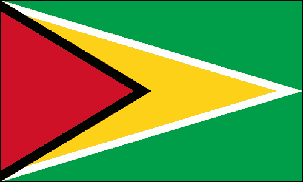

好的，你已经了解了三角形的概念。让我们看看它的实际应用。我提取了这段代码并将其放入一个函数中。要创建这个国旗，我们需要创建四个三角形。

```js
var canvas = document.getElementById("guyana");
var wid = canvas.width;
var hei = canvas.height;

var context = canvas.getContext("2d");
    context.fillStyle = "#009E49";
    context.fillRect(0,0,wid,hei);

fillTriangle(context,	0,0,
             wid,hei/2,
             0,hei, "#ffffff");
fillTriangle(context,0,10,
             wid-25,hei/2,
             0,hei-10, "#FCD116");
fillTriangle(context,0,0,
             wid/2,hei/2,
             0,hei, "#000000");
fillTriangle(context,0,10,
             wid/2-16,hei/2,
             0,hei-10, "#CE1126");

function fillTriangle(context,x1,y1,x2,y2,x3,y3,color){
  context.fillStyle = color;
  context.beginPath();
  context.moveTo(x1,y1);
  context.lineTo(x2,y2);
  context.lineTo(x3,y3);
  context.lineTo(x1,y1);
  context.closePath();
  context.fill();
}
```

通过创建 `fillTriangle()` 函数，我们现在可以快速有效地创建三角形，就像我们创建矩形一样。这个函数使得创建一个有如此丰富数量的三角形的国旗变得轻而易举。现在，借助 `fillTriangle` 方法的帮助，我们可以创建世界上任何有三角形的国旗。

## 还有更多...

不要让三角形成为你最复杂的形状，因为你可以创建任意数量的尖锐形状。让我们创建一个更复杂的锯齿形图案。为此，我们将飞到巴林王国。

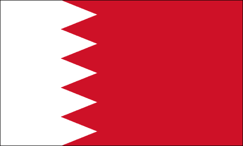

试着找到我们分解和解释之前的新逻辑。

```js
var canvas = document.getElementById("bahrain");
var wid = canvas.width;
var hei = canvas.height;

var context = canvas.getContext("2d");
    context.fillStyle = "#CE1126";
    context.fillRect(0,0,wid,hei);
var baseX = wid*.25;
    context.fillStyle = "#ffffff";
    context.beginPath();
    context.lineTo(baseX,0);

var zagHeight = hei/5;
for(var i=0; i<5; i++){
  context.lineTo(baseX +25 , (i+.5)*zagHeight);
  context.lineTo(baseX  , (i+1)*zagHeight);

}
context.lineTo(0,hei);
context.lineTo(0,0);
context.closePath();
context.fill();

addBoarder(context,wid,hei);
```

让我们分解这个锯齿形并理解这里发生了什么。在正常设置画布元素后，我们立即开始创建我们的形状。我们首先绘制一个红色背景，然后创建一个将有白色区域的形状。它非常像一个矩形，只是它里面有锯齿。

在这段代码中，我们首先创建一个矩形，但我们的目标是改变突出显示的代码行，使其成为锯齿形：

```js
var baseX = wid*.25;
context.fillStyle = "#ffffff";
context.beginPath();
context.lineTo(baseX,0);
context.lineTo(wid*.25,hei);
context.lineTo(0,hei);
context.lineTo(0,0);
context.closePath();
context.fill();
```

在这段代码中，我们将填充颜色设置为白色，我们设置了 `beginPath`，然后 `lineTo`（从点 `(0,0)` 开始，即默认起始点）并创建一个填充了画布宽度 25% 的矩形。我突出了水平线，因为这是我们想要用锯齿形的线。通过观察国旗，我们可以看到我们将在屏幕上创建五个三角形，所以让我们用 `for` 循环来替换这条线：

```js
...
context.lineTo(baseX,0);

var zagHeight = hei/5;
for(var i=0; i<5; i++){
 context.lineTo(baseX +25 , (i+.5)*zagHeight);
 context.lineTo(baseX  , (i+1)*zagHeight);

}

context.lineTo(0,hei);
  ...
```

因此，在我们运行循环之前，我们的第一步是决定每个三角形的高度：

```js
var zagHeight = hei/5;
```

我们将画布的总高度除以五，得到每个三角形的高度。

我们在 `for` 循环中绘制了锯齿形。为此，我们需要在每一轮中使用以下两行代码：

```js
context.lineTo(baseX +25 , (i+.5)*zagHeight);
context.lineTo(baseX  , (i+1)*zagHeight);		
```

在第一行中，我们远离当前位置，并将线条延伸到三角形高度的一半，并延伸到右侧的极点；然后在第二行中，我们返回到起始的 `x` 点，并更新我们的 `y` 到下一行段的起始点。顺便说一句，`baseX +25` 的添加是完全任意的。我只是随意尝试，直到看起来不错，但如果你愿意，你可以使用比例来代替（这样如果你扩展画布，它看起来仍然很好）。

所有这一切最令人惊奇的部分就是知道如何创建一些锯齿、三角形、矩形和圆。你可以创建更多的国旗，但我们还没有完成。我们继续追求如何创建世界上所有国旗的知识。

如果您是第一次通过代码绘图，或者觉得自己需要一些额外的练习，只需查看世界地图，并挑战自己根据我们已经建立的技能创建国旗。

# 创建复杂形状

现在是时候将我们学到的一切融入到迄今为止我们见过的最复杂的形状中，即大卫之星。这颗星星是以色列国旗的一部分（世界上我最喜欢的国旗之一；））。在我们能够创建它之前，我们需要绕个圈，访问正弦和余弦的神奇世界。

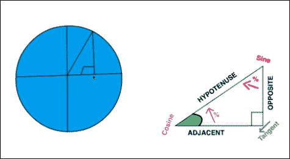

你一定会喜欢它，对吧？我知道很多人害怕余弦和正弦，但实际上它们非常容易和有趣。让我们在这里以一种更适合绘图的方式来解释它们。最基本的想法是你有一个有一个 90 度角的三角形。你对这个三角形有一些信息，这就是你开始使用正弦和余弦的全部所需。一旦你知道你有一个 90 度角并且知道正弦/余弦，你就有了所有你需要的信息，通过它你可以发现任何缺失的信息。在我们的情况下，我们知道所有的角度，我们知道斜边的长度（它就是我们的半径；看看带有圆的图像，看看它是如何运作的）。在 JavaScript 中，`Math.cos()`和`Math.sin()`方法都代表一个半径为 1 的圆，位于屏幕上的(0,0)点。如果我们将要查找的角度输入到`sin`函数中，它将返回`x`值（在这种情况下是邻边的长度），`cos`函数将返回对边的长度，在我们的情况下是所需的值`y`。

我制作了一个很好的视频，深入探讨了这个逻辑。你可以在[`02geek.com/courses/video/58/467/Using-Cos-and-Sin-to-animate.html`](http://02geek.com/courses/video/58/467/Using-Cos-and-Sin-to-animate.html)上查看它。

## 准备就绪

理解正弦/余弦工作的最简单方法是通过一个实时的例子，而在我们的情况下，我们将用它来帮助我们弄清楚如何在以色列国旗中创建大卫之星。我们将退一步，学习如何找到屏幕上的点来创建形状。同样，我们将跳过创建 HTML 文件的过程，直接进入 JavaScript 代码。有关如何设置 HTML 的概述，请查看*使用 2D 画布进行图形处理*配方。

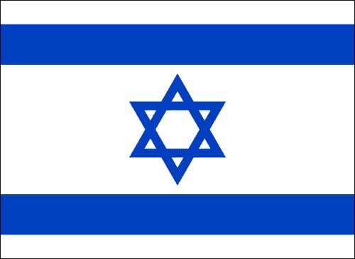

## 如何做...

在创建 JavaScript 文件后，在您的`init`函数中添加以下代码。

1.  创建我们基本的画布变量：

```js
var canvas = document.getElementById("israel");
var wid = canvas.width;
var hei = canvas.height;
var context = canvas.getContext("2d");
```

1.  定义弧度中的一度。我们这样做是因为`Math.cos`和`Math.sin`期望的是弧度值而不是度值（`radian`是以弧度测量的一度）：

```js
var radian = Math.PI/180;
```

1.  创建一个`tilt`变量。这个变量将定义将要创建的三角形的倾斜。想象三角形在一个圆内，我们正在用这个`tilt`变量旋转圆：

```js
var tilt = radian*180;
```

1.  定义画布的中心点：

```js
var baseX = wid / 2;
var baseY = hei / 2;
```

1.  设置大卫之星的无形边界圆的半径：

```js
var radius = 24;
```

1.  定义国旗中条纹的高度：

```js
var stripHeight = 14;
```

1.  定义线宽：

```js
context.lineWidth=5;
```

1.  创建两个三角形（一个倾斜，一个不倾斜）：

```js
createTrinagle(context,
  baseX+ Math.sin(0) * radius, baseY + Math.cos(0) * radius,
  baseX+ Math.sin(radian*120) * radius, baseY + Math.cos(radian*120) * radius,
  baseX+ Math.sin(radian*240) * radius, baseY + Math.cos(radian*240) * radius, 
  null,"#0040C0");

createTrinagle(context,
  baseX+ Math.sin(tilt) * radius, baseY + Math.cos(tilt) * radius,
  baseX+ Math.sin(radian*120+tilt) * radius, baseY + Math.cos(radian*120+tilt) * radius,
  baseX+ Math.sin(radian*240+tilt) * radius, baseY + Math.cos(radian*240+tilt) * radius, 
  null,"#0040C0");
```

1.  绘制国旗条纹：

```js
context.lineWidth=stripHeight;
context.beginPath();
context.moveTo(0,stripHeight);
context.lineTo(wid,stripHeight);
context.moveTo(0,hei- stripHeight);
context.lineTo(wid,hei- stripHeight);
context.closePath();
context.stroke();
```

1.  创建`createTriangle`函数：

```js
function createTriangle(context,x1,y1,x2,y2,x3,y3,fillColor,strokeColor){
  context.beginPath();
  context.moveTo(x1,y1);
  context.lineTo(x2,y2);
  context.lineTo(x3,y3);
  context.lineTo(x1,y1);
  context.closePath();
  if(fillColor) {
    context.fillStyle = fillColor;
    context.fill();	
  }
  if(strokeColor){
  context.strokeStyle = strokeColor;
  context.stroke();

  }
}
```

你完成了。运行你的应用程序，你会发现以色列国旗，中间有大卫之星。

## 它是如何工作的...

在我们深入探讨国旗的创建和如何完成它之前，我们需要了解如何在圆中定位点。为此，让我们看一个更简单的例子：

```js
var rad = Math.PI/180;	
context.fillStyle = "#FFDE00";
context.arc(wid / 2, hei / 2, 30, 0, 2 * Math.PI, false);
context.fill();
context.beginPath();
context.strokeStyle = "#ff0000";
context.lineWidth=6;
context.moveTo(Math.sin(0) * 30 + wid / 2, Math.cos(0) * 30 + hei/2);
context.lineTo(Math.sin(rad*120) * 30 + wid / 2, Math.cos(rad*120) * 30 + hei/2);
context.stroke();
```

以下是代码将生成的输出：

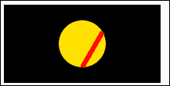

尽管在我们人类友好的头脑中，一个圆是一个有 360 度的形状，但实际上在大多数编程语言中最好用弧度表示。

弧度就像度数一样，只是它们不是人类友好的 0 到 360 之间的数字，而是 0 到两倍 Pi 之间的数字。你可能想知道 Pi 是什么，所以再多说一点关于 Pi。Pi 本质上是当你取任何圆的周长并将其除以相同圆的直径时得到的值。返回的结果将是 Pi 或约为 3.14159。这是一个神奇的数字，好消息是，如果你不想知道更多，你就不需要知道更多。你只需要知道 3.142 等于半个圆。有了这个事实，我们现在可以将 Pi 除以`180`得到一个弧度值等于一度的值：

```js
var rad = Math.PI/180;
```

然后我们在屏幕中心创建一个半径为`30`的圆，以帮助我们可视化，然后开始创建一条线，该线将从我们圆的角度`0`开始，到角度`120`结束（因为我们想创建一个 360/3 的三角形）。

```js
context.strokeStyle = "#ff0000";
context.lineWidth=6;
context.moveTo(Math.sin(0) * 30 + wid / 2, Math.cos(0) * 30 + hei/2);
context.lineTo(Math.sin(rad*120) * 30 + wid / 2, Math.cos(rad*120) * 30 + hei/2);
context.stroke();
```

让我们分解最复杂的那行代码：

```js
context.lineTo(Math.sin(rad*120) * 30 + wid / 2, Math.cos(rad*120) * 30 + hei/2);
```

由于`Math.sin`和`Math.cos`返回半径为`1`的值，我们将乘以我们圆的半径（在本例中为`30`）返回的任何值。在`Math.sin`和`Math.cos`的参数中，我们将提供完全相同的值；在这个例子中是`120`弧度。由于我们的圆将位于画布的左上角，我们希望通过添加到我们的值`wid/2`和`hei/2`来将圆移到屏幕中心开始。

在这个阶段，你应该知道如何在圆上找到点，以及如何在两点之间画线。让我们回到以色列国旗，深入研究新函数`createTriangle`。它是基于*使用路径创建形状*食谱中创建的`fillTriangle`函数。

```js
function createTriangle(context,x1,y1,x2,y2,x3,y3,fillColor,strokeColor){

...

 if(fillColor) {
 context.fillStyle = fillColor;
 context.fill(); 
 }

if(stokeColor){
 context.strokeStyle = fillColor;
 context.stroke(); 

 }

}
```

我已经突出显示了这个函数的新组件，与函数`fillTriangle`相比。两个新参数`fillColor`和`strokeColor`定义了我们是否应该填充或描边三角形。请注意，我们将`strokeStyle`和`fillStyle`方法移到函数底部，以减少我们的代码量。太棒了！我们现在有了一个现代的三角形创建器，可以处理大卫之星。

## 还有更多...

好的，是时候连接这些点（字面意思）并创建以色列国旗了。回顾我们的原始代码，我们发现自己使用`createTriangle`函数两次来创建完整的大卫之星形状。让我们深入研究一下这里的逻辑，看看第二个三角形（倒置的那个）：

```js
createTriangle(context,
  baseX+ Math.sin(tilt) * radius, 
  baseY + Math.cos(tilt) * radius,
 baseX+ Math.sin(radian*120+tilt) * radius, 
 baseY + Math.cos(radian*120+tilt) * radius,
baseX+ Math.sin(radian*240+tilt) * radius,
  baseY + Math.cos(radian*240+tilt) * radius, null,"#0040C0");
```

我们发送三个点到虚拟圆上创建一个三角形。我们将虚拟圆分成三等份，并找到`0`、`120`和`240`度的点值。这样，如果我们在这些点之间画一条线，我们将得到一个完美的三角形，其中所有边都是相等的。

让我们深入研究一下发送到`createTriangle`函数的一个点：

```js
baseX + Math.sin(radian*120+tilt) * radius, 	
baseY + Math.cos(radian*120+tilt) * radius
```

我们从`baseX`和`baseY`（屏幕中心）开始作为我们圆的中心点，然后找出从基本起始点到实际点间的间隙。然后分别从中加上我们从`Math.sin`和`Math.cos`得到的值。在这个例子中，我们试图得到`120`度加上倾斜值。换句话说，`120`度加上`180`度（或`300`度）。

为了更容易理解，在伪代码中，它看起来类似于以下代码片段：

```js
 startingPositionX + Math.sin(wantedDegree) * Radius 
 startingPositionY + Math.cin(wantedDegree) * Radius 
```

除了祝贺之外，没有更多要说的了。我们刚刚完成了另一面国旗的创建，并在这个过程中学会了如何创建复杂的形状，使用数学来帮助我们找出屏幕上的点，并混合不同的形状来创建更复杂的形状。

# 添加更多顶点

有许多国旗包含星星，这些星星无法通过重叠的三角形来创建。在这个示例中，我们将找出如何创建一个包含任意数量顶点的星星。我们将利用在上一个示例中发现的相同关键概念，利用虚拟圆来计算位置，这次只用两个虚拟圆。在这个示例中，我们将创建索马里的国旗，并在此过程中找出如何创建一个能够创建星星的函数。

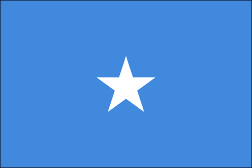

## 准备就绪

请继续在上一个示例中工作。如果您还没有开始，请务必这样做，因为这个示例是上一个示例的下一个逻辑步骤。与上一个示例一样，我们将跳过此示例的 HTML 部分。请查看本书中的第一个示例，以刷新所需的 HTML 代码。

## 如何做...

让我们开始创建索马里的国旗。

1.  创建画布的标准逻辑：

```js
var canvas = document.getElementById("somalia");
var wid = canvas.width;
var hei = canvas.height;

var context = canvas.getContext("2d");
```

1.  填充画布的背景颜色：

```js
context.fillStyle = "#4189DD";
context.fillRect(0,0,wid,hei);
```

1.  通过调用`createStar`函数来绘制星星：

```js
createStar(context,wid/2,hei/2,7,20,5,"#ffffff",null,0);
```

1.  创建`createStart`函数：

```js
function createStar(context,baseX,baseY,
                    innerRadius,outerRadius,
                    points,fillColor,
                    strokeColor,tilt){
// all the rest of the code in here
}
```

1.  从这一点开始，我们将在`createStart`函数中进行工作。添加一些辅助变量：

```js
function createStar(context,baseX,baseY,innerRadius,outerRadius,points,fillColor,strokeColor,tilt){
  var radian = Math.PI/180;
  var radianStepper = radian * ( 360/points) /2;
  var currentRadian =0;
  var radianTilt = tilt*radian;
```

1.  在开始绘制任何形状之前，调用`beginPath`方法：

```js
  context.beginPath();
```

1.  将绘图指针移动到内部圆圈的角度`0`：

```js
  context.moveTo(baseX+ Math.sin(currentRadian + radianTilt) * innerRadius,baseY+ Math.cos(currentRadian + radianTilt) * innerRadius);
```

1.  循环遍历星星的总点数，并在外圆和内圆之间来回绘制线条，以创建星形：

```js
for(var i=0; i<points; i++){
  currentRadian +=  radianStepper;
  context.lineTo(baseX+ Math.sin(currentRadian + radianTilt) * outerRadius,baseY+ Math.cos(currentRadian + radianTilt) * outerRadius);
  currentRadian +=  radianStepper;
  context.lineTo(baseX+ Math.sin(currentRadian + radianTilt) * innerRadius,baseY+ Math.cos(currentRadian + radianTilt) * innerRadius);
}
```

1.  关闭绘图路径，并根据函数参数进行填充或描边：

```js
context.closePath();

  if(fillColor){
    context.fillStyle = fillColor;
    context.fill();	
  }

  if(strokeColor){
    context.strokeStyle = strokeColor;
    context.stroke();	

  }

}
```

当您运行 HTML 包装器时，您将找到您的第一个星星，随之而来的是另一面国旗。

## 它是如何工作的...

让我们首先了解我们要创建的函数期望的内容。这个想法很简单，为了创建一个星形，我们希望有一个虚拟的内圆和一个虚拟的外圆。然后我们可以在圆圈之间来回绘制线条，以创建星形。为此，我们需要一些基本参数。

```js
function createStar(context,baseX,baseY,
     innerRadius,outerRaduis,points,fillColor,
                             strokeColor,tilt){
```

我们的常规上下文，`baseX`和`baseY`不需要进一步介绍。虚拟的`innerRadius`和`outerRadius`用于帮助定义创建星星的线段的长度和它们的位置。我们想知道我们的星星将有多少个点。我们通过添加`points`参数来实现。我们想知道`fillColor`和/或`strokeColor`，这样我们就可以定义星星的实际颜色。我们用`tilt`值来完成（当我们为以色列国旗创建大卫之星时，它可能很有用）。

```js
var radian = Math.PI/180;
var radianStepper = radian * ( 360/points) / 2;
var currentRadian =0;
var radianTilt = tilt*radian;
```

然后，我们继续配置我们星星的辅助变量。这不是我们第一次看到弧度变量，但这是我们第一次看到`radianStepper`。弧度步进器的目标是简化我们循环中的计算。我们将 360 度除以我们的三角形将具有的点数。我们将该值除以`2`，因为我们将有两倍于线条的点数。最后但并非最不重要的是，我们希望将该值转换为弧度，因此我们通过我们的弧度变量复制完整的结果。然后我们创建一个简单的`currentRadian`变量来存储我们目前所处的步骤，并最后将`tilt`值转换为弧度值，这样我们就可以在循环中添加到所有我们的线条中而无需额外的计算。

像往常一样，我们使用`beginPath`和`closePath`方法开始和完成我们的形状。让我们更深入地看一下我们即将形成的形状的起始位置：

```js
context.moveTo(baseX+ Math.sin(currentRadian + radianTilt) * innerRadius,baseY+ Math.cos(currentRadian + radianTilt) * innerRadius);
```

虽然乍一看这可能有点吓人，但实际上与我们创建大卫之星的方式非常相似。我们从`currentRadian`（目前为`0`）开始，使用`innerRadius`作为起点。

在我们的循环中，我们的目标是在内部和外部圆圈之间来回织线。为此，我们需要在每次循环周期中通过`radianStepper`来推进`currentRadian`值：

```js
for(var i=0; i<points; i++){
 currentRadian +=  radianStepper;
  context.lineTo(baseX+ Math.sin(currentRadian + radianTilt) * outerRadius,baseY+ Math.cos(currentRadian + radianTilt) * outerRadius);
  currentRadian +=  radianStepper;
  context.lineTo(baseX+ Math.sin(currentRadian + radianTilt) * innerRadius,baseY+ Math.cos(currentRadian + radianTilt) * innerRadius);
}
```

我们根据参数中的点数开始一个循环。在这个循环中，我们在内圆和外圆之间来回绘制两条线，每次步进大小由点数（我们用`radianStepper`变量配置的值）定义。

在之前的教程中，当我们创建`createTriangle`函数时，我们已经涵盖了其余的功能。就是这样！现在你可以运行应用程序并找到我们的第七面旗帜。有了这个新的复杂函数，我们可以创建所有实心星星和所有镂空的非实心星星。

好了，我希望你坐下...有了新获得的星星能力，你现在可以创建至少 109 面旗帜，包括美利坚合众国和所有其他国家的旗帜（世界上 57%的国家，而且还在增加！）。

# 重叠形状创建其他形状

目前为止，我们已经创建了许多旗帜和许多一般形状，这些形状可以通过组合我们迄今为止创建的形状来创建。在 82 面我们不知道如何创建的最受欢迎的形状之一是土耳其国旗中的新月形状。通过它，我们学会了使用减法来创建更深入的形状。

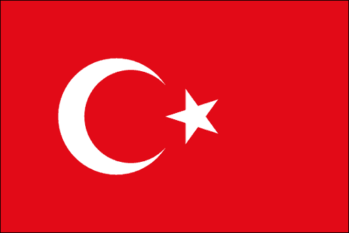

## 准备工作

前一个教程是本教程的起点。从这里开始，我们将继续努力创建更复杂的形状，这些形状是由两个形状组合而成的。因此，我们将使用上一个教程中创建的代码，位于`01.02.flags.js`中。

## 如何做...

让我们直接跳到我们的代码中，看看它是如何运作的。

1.  获取上下文并将画布的宽度和高度保存到变量中：

```js
var canvas = document.getElementById("turkey");
var wid = canvas.width;
var hei = canvas.height;

var context = canvas.getContext("2d");
```

1.  填充矩形画布区域：

```js
context.fillStyle = "#E30A17";
context.fillRect(0,0,wid,hei);
```

1.  创建一个完整的圆：

```js
context.fillStyle = "#ffffff";
context.beginPath();
context.arc(wid / 2 - 23, hei / 2, 23, 0, 2 * Math.PI, false);
context.closePath();
context.fill();
```

1.  更改画布填充的颜色。用另一个圆填充其边界内的圆，隐藏了上一个创建的圆的一部分。这种效果创建了一个看起来像新月的形状：

```js
context.fillStyle = "#E30A17";
context.beginPath();
context.arc(wid / 2 - 18, hei / 2, 19, 0, 2 * Math.PI, false);
context.closePath();
context.fill();
```

1.  重复使用前一个教程中的`createStart`来添加土耳其星：

```js
createStar(context,wid/2 + 13,hei/2,5,16,5,"#ffffff",null,15);
```

就是这样！你刚刚创建了一个不可能的形状，这是通过用一个形状遮罩另一个形状实现的。

## 它是如何工作的...

这里的关键是我们使用了两个圆，一个覆盖另一个来创建新月形状。顺便说一句，注意我们如何倾斜星星，以便其一个点指向圆的中心。

在过去的几个示例中，我们已经经历了很多，此时你应该非常熟悉在画布中创建许多形状和元素。在我们可以说我们已经掌握了画布之前，还有很多东西可以探索，但我们绝对可以说我们已经掌握了大部分世界旗帜的创建，这非常酷。我很想看到你的旗帜。当你创建了一面书中没有的旗帜时，给我留言！ :)
