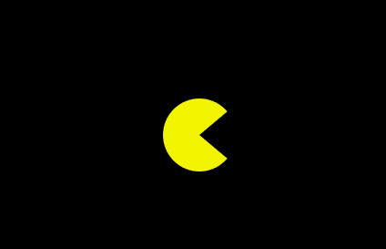
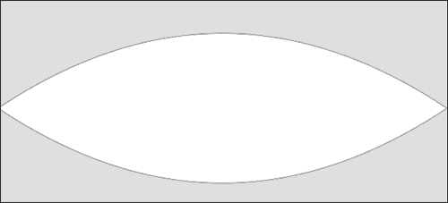
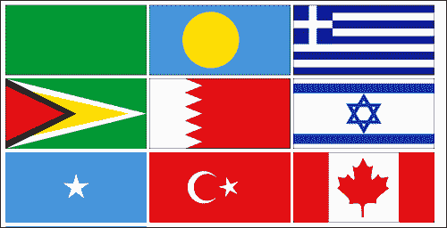
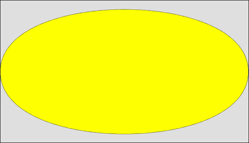
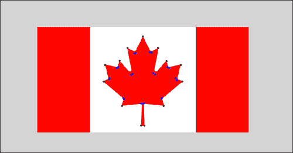
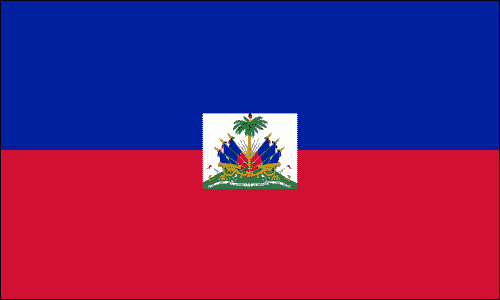
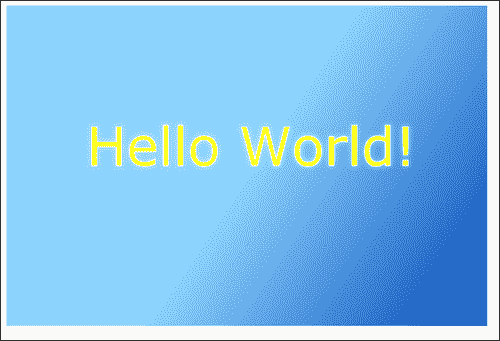
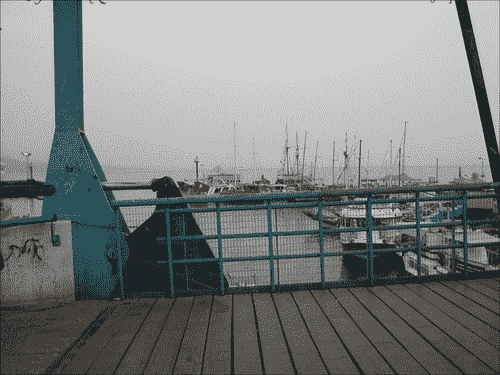
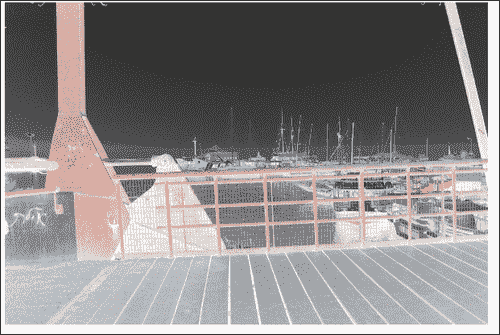

# 第二章：画布中的高级绘图

+   绘制弧线

+   使用控制点绘制曲线

+   创建贝塞尔曲线

+   将图像整合到我们的艺术中

+   使用文本绘制

+   理解像素操作

# 介绍

这是最后一章，我们将深入研究画布，因为剩下的章节将专注于构建图表和交互。

在本章中，我们将继续通过向画布添加曲线、图像、文本，甚至像素操作来掌握我们的技能。

# 绘制弧线

我们可以在画布中创建三种类型的曲线 - 使用弧线、二次曲线和贝塞尔曲线。让我们开始吧。

## 准备工作

如果您回忆一下第一章，*画布中的形状绘制*，在我们的第一个示例中，我们使用弧线方法创建了完美的圆圈。弧线方法不仅仅是如此。我们实际上可以在圆形中创建任何部分曲线。如果您不记得绘制圆圈，我强烈建议您再次浏览第一章 ，*画布中的形状绘制*，同时您也会找到创建 HTML 文档的模板。在本示例中，我们将专门关注 JavaScript 代码。

## 如何做...

让我们开始并创建我们的第一个具有曲线的非圆形：

1.  访问`pacman`画布元素，并使用以下代码片段获取其宽度和高度：

```js
var canvas = document.getElementById("pacman");
var wid = canvas.width;
var hei = canvas.height;
```

1.  创建一个`radian`变量（一度的弧度）：

```js
var radian = Math.PI/180;
```

1.  获取画布上下文，并使用以下代码片段将其背景填充为黑色：

```js
var context = canvas.getContext("2d");
  context.fillStyle = "#000000";
  context.fillRect(0,0,wid,hei);
```

1.  在开始绘制之前开始一个新路径：

```js
  context.beginPath();
```

1.  更改填充样式颜色：

```js
  context.fillStyle = "#F3F100";
```

1.  将指针移动到屏幕中心：

```js
  context.moveTo(wid/2,hei/2);
```

1.  绘制一个从 40 度开始到 320 度结束的曲线（半径为 40），位于屏幕中心：

```js
  context.arc(wid / 2, hei / 2, 40, 40*radian, 320*radian, false);
```

1.  通过使用以下代码片段，关闭形状，绘制一条线回到我们形状的起始点：

```js
  context.lineTo(wid/2,hei/2);
```

1.  关闭路径并填充形状：

```js
  context.closePath();
  context.fill();
```

您刚刚创建了一个 PacMan。

## 如何做...

第一次，我们利用并创建了一个饼状形状，称为 PacMan（当我们开始创建饼图时，您可以看到这是非常有用的）。非常简单 - 再次连接到弧度的概念：

```js
context.arc(wid / 2, hei / 2, 40, 40*radian, 320*radian, false);
```

请注意我们的第 4 和第 5 个参数 - 而不是从 0 开始到`2*Math.PI`结束的完整圆圈 - 正在设置弧线开始的角度为弧度 40，结束于弧度 320（留下 80 度来创建 PacMan 的嘴）。剩下的就是从圆的中心开始绘制：

```js
context.moveTo(wid/2,hei/2);
context.arc(wid / 2, hei / 2, 40, 40*radian, 320*radian, false);
context.lineTo(wid/2,hei/2);
```

我们首先将指针移动到圆的中心。然后创建弧线。由于我们的弧线不是完整的形状，它会继续我们离开的地方 - 从弧线的中心到起始点（40 度）画一条线。我们通过画一条线回到弧线的中心来完成动作。现在我们准备填充它并完成我们的工作。



既然我们已经解决了弧线问题，您可以看到这对于创建饼图将会非常有用。

# 使用控制点绘制曲线

如果世界上只有两个点和一个完美的弧线，那么这将是本书的结尾，但不幸或幸运的是，对我们来说，还有许多更复杂的形状需要学习和探索。有许多曲线不是完全对齐的曲线。到目前为止，我们创建的所有曲线都是完美圆的一部分，但现在不再是这样了。在本示例中，我们将探索二次曲线。二次曲线使我们能够创建不是圆形的曲线，通过添加第三个点 - 控制器来控制曲线。您可以通过查看以下图表轻松理解这一点：


**二次曲线**是一条具有一个控制点的曲线。考虑这样一种情况，当创建一条线时，我们在两点（本示例中的 A 和 B）之间绘制它。当我们想要创建一个二次曲线时，我们使用一个外部重力控制器来定义曲线的方向，而中间线（虚线）定义了曲线的延伸距离。

## 准备工作

与以前的示例一样，我们在这里也跳过了 HTML 部分——并不是说它不需要，只是每个示例中都重复出现，如果您需要了解如何设置 HTML，请参阅第一章中的*使用 2D 画布绘图*示例，*在画布中绘制形状*。

## 如何做...

在这个示例中，我们将创建一个看起来像一个非常基本的眼睛的封闭形状。让我们开始吧：

1.  我们总是需要从提取我们的画布元素开始，设置我们的宽度和高度变量，并定义一个弧度（因为我们发现它对我们有用）：

```js
var canvas = document.getElementById("eye");
  var wid = canvas.width;
  var hei = canvas.height;
  var radian = Math.PI/180;
```

1.  接下来，用纯色填充我们的画布，然后通过触发`beginPath`方法开始一个新形状：

```js
var context = canvas.getContext("2d");
  context.fillStyle = "#dfdfdf";
  context.fillRect(0,0,wid,hei);
  context.beginPath();
```

1.  为我们的眼睛形状定义线宽和描边颜色：

```js
  context.lineWidth = 1;
  context.strokeStyle = "#000000"; // line color	
  context.fillStyle = "#ffffff";
```

1.  将我们的绘图指针移动到左中心点，因为我们需要在屏幕中心从左到右绘制一条线，然后再返回（只使用曲线）：

```js
  context.moveTo(0,hei/2);
```

1.  通过使用锚点从我们的初始点绘制两个二次曲线到画布的另一侧，然后返回到初始点，锚点位于画布区域的极端顶部和极端底部：

```js
  context.quadraticCurveTo(wid / 2, 0, wid,hei/2);
  context.quadraticCurveTo(wid / 2, hei, 0,hei/2);
```

1.  关闭路径。填充形状并在形状上使用`stroke`方法（`fill`用于填充内容，`stroke`用于轮廓）：

```js
  context.closePath();
  context.stroke();
  context.fill();
```

干得好！您刚刚使用`quadraticCurveTo`方法创建了您的第一个形状。

## 工作原理...

让我们仔细看看这个方法：

```js
context.quadraticCurveTo(wid / 2, 0, wid,hei/2);
```

因为我们已经在原点（点 A）上，我们输入另外两个点——控制点和点 B。

```js
context.quadraticCurveTo(controlX, controlY, pointB_X, pointB_Y);
```

在我们的示例中，我们创建了一个封闭形状——创建眼睛的起点。通过控制器来调整方向和曲线的大小。一个经验法则是，越靠近垂直线，曲线就会越平缓，而离中心点越远，曲线的形状就会越弯曲。



# 创建贝塞尔曲线

我们刚刚学到，使用二次曲线时我们有一个控制点。虽然我们可以用一个控制点做很多事情，但我们并没有真正对曲线有完全的控制。所以让我们更进一步，添加一个控制点。添加第二个控制点实际上增加了这两个点之间的关系，使其成为三个控制因素。如果我们包括实际的锚点（我们有两个），最终会有五个控制形状的点。这听起来很复杂；因为我们获得的控制越多，理解它的工作原理就越复杂。仅仅通过代码来弄清楚复杂的曲线并不容易，因此我们实际上使用其他工具来帮助我们找到正确的曲线。

为了证明前面的观点，我们可以找到一个非常复杂的形状并从那个形状开始（不用担心，在本示例中，我们将练习一个非常简单的形状，以便搞清楚概念）。我们将选择绘制加拿大国旗，主要是枫叶。



## 准备工作

这个示例很难理解，但我们将在接下来的*工作原理...*部分详细介绍。所以如果您对曲线不熟悉，我强烈建议您在实现之前从*工作原理...*部分开始学习。

## 如何做...

让我们创建加拿大国旗。让我们直接进入 JavaScript 代码：

1.  创建画布和上下文：

```js
var canvas = document.getElementById("canada");
var wid = canvas.width;
var hei = canvas.height;

var context = canvas.getContext("2d");
```

1.  填充背景以匹配加拿大国旗的背景：

```js
context.fillStyle="#FF0000";
context.fillRect(0,0,50,100);
context.fillRect(wid-50,0,50,100);
```

1.  开始一个新路径并将指针移动到`84,19`：

```js
context.beginPath();
context.moveTo(84,19);
```

1.  绘制曲线和线条以创建枫叶：

```js
context.bezierCurveTo(90,24,92,24,99,8);
context.bezierCurveTo(106,23,107,23,113,19);
context.bezierCurveTo(108,43,110,44,121,31);
context.bezierCurveTo(122,37,124,38,135,35);
context.bezierCurveTo(130,48,131,50,136,51);
context.bezierCurveTo(117,66,116,67,118,73);
context.bezierCurveTo(100,71,99,72,100,93);
context.lineTo(97,93);
context.bezierCurveTo(97,72,97,71,79,74);
context.bezierCurveTo(81,67,80,66,62,51);
context.bezierCurveTo(67,49,67,48,63,35);
context.bezierCurveTo(74,38,75,37,77,31);
context.bezierCurveTo(88,44,89,43,84,19);
```

1.  关闭路径并填充形状：

```js
context.closePath();
context.fill();	
```

现在，你已经创建了加拿大国旗。我不知道你是否已经知道它是如何工作的，或者我们是如何得到我们放入曲线中的看似随机的数字的，但你已经创建了加拿大国旗！不要担心，我们将立即在下一节中解密曲线的魔力。

## 它是如何工作的……

在我们解释加拿大国旗的工作原理之前，我们应该退后一步，创建一个更简单的示例。在这个简短的示例中，我们将使用`bezierCurveTo`方法创建一个椭圆形状。

```js
context.moveTo(2,hei/2);
  context.bezierCurveTo(0, 0,wid,0, wid-2,hei/2);
  context.bezierCurveTo(wid, hei,0,hei, 2,hei/2);
  context.closePath();
  context.stroke();
  context.fill();
```

就是这样。以下是你通过这种方法得到的结果：



如果你明白了这一点，那就太好了。我们现在将解释这是如何工作的，然后进入我们是如何找出加拿大国旗的所有点的。我们再次充分利用整个画布，并通过将两个控制器设置为画布的角来控制我们的控制器：

```js
context.bezierCurveTo(controlPointX1, controlPointY1, controlPointX2, controlPointY2, pointBX, pointBY);
```

通过操纵控制器，看看使用两个点可以获得多少更多的控制权——当你需要更详细地控制曲线时，这是非常有用的。

这是我们完整国旗示例的核心。我强烈建议你探索改变控制点的值的影响，以更好地理解和敏感于它。现在是时候回到我们的国旗，看看我们是如何构造它的。

现在是时候将我们最复杂的绘图风格——贝塞尔曲线——用于比椭圆更有趣的东西了。我有一个坦白：当我决定从头开始创建加拿大国旗时，我感到害怕。我在想“我要怎么完成这个？这将花费我几个小时”，然后我恍然大悟……很明显，这面旗帜需要用很多贝塞尔点来创建，但我怎么知道这些点应该在哪里呢？因此，对于这样一个高级的形状，我打开了我的图形编辑器（在我这里是 Flash 编辑器），并为枫叶形状添加了枢轴点：



如果你仔细看前面的图表，你会发现我基本上是在加拿大国旗上做了标记，并在每个尖角上放了一个黑点。然后我创建了一个画布，并画了线，看看我得到的基本形状是否在正确的位置（顺便说一句，我得到这些点只是通过选择 Flash 中的点，看看它们的（x，y）坐标是否与画布坐标系统相同）。

```js
var context = canvas.getContext("2d");
context.beginPath();
context.moveTo(84,19);
context.lineTo(99,8);
context.lineTo(113,19);
context.lineTo(121,31);
context.lineTo(135,35);
context.lineTo(136,51);
context.lineTo(118,73);
context.lineTo(100,93);
context.lineTo(97,93);
context.lineTo(79,74);
context.lineTo(62,51);
context.lineTo(63,35);
context.lineTo(77,31);
context.lineTo(84,19);

context.closePath();
context.stroke();
```

我得到了一个远离我想要的形状。但现在我知道我的形状正在朝着正确的方向发展。缺少的是连接点之间的曲线。如果你再次看前面的图表，你会注意到我在每个尖角之间放了两个蓝点，以定义曲线的位置以及它们的锐利或柔和程度。然后我回到画布，更新了值以获得这两个控制点。我添加了所有的曲线，并从创建描边切换到创建填充。

```js
var context = canvas.getContext("2d");
 context.fillStyle="#FF0000";
 context.fillRect(0,0,50,100);
 context.fillRect(wid-50,0,50,100);

  context.beginPath();
  context.moveTo(84,19);
 context.bezierCurveTo(90,24,92,24,99,8);
 context.bezierCurveTo(106,23,107,23,113,19);
 context.bezierCurveTo(108,43,110,44,121,31);
 context.bezierCurveTo(122,37,124,38,135,35);
 context.bezierCurveTo(130,48,131,50,136,51);
 context.bezierCurveTo(117,66,116,67,118,73);
 context.bezierCurveTo(100,71,99,72,100,93);
 context.lineTo(97,93);
 context.bezierCurveTo(97,72,97,71,79,74);
 context.bezierCurveTo(81,67,80,66,62,51);
 context.bezierCurveTo(67,49,67,48,63,35);
 context.bezierCurveTo(74,38,75,37,77,31);
 context.bezierCurveTo(88,44,89,43,84,19);
  context.closePath();
  context.fill();	
```

太棒了！我刚刚得到了一个几乎完美的国旗，我觉得这对这个样本来说已经足够了。

不要试图自己创建非常复杂的形状。也许有一些人可以做到，但对于我们其他人来说，最好的方法是通过某种视觉编辑器来追踪元素。然后我们可以获取图形信息，并像我在加拿大国旗示例中所做的那样更新画布中的值。

在这个阶段，我们已经涵盖了画布中可以涵盖的最复杂的形状。本章的其余部分专门讨论屏幕上内容的其他操作方式。

# 将图像集成到我们的艺术中

幸运的是，我们并不总是需要从头开始，我们可以把更复杂的艺术留给外部图像。让我们想想如何将图像集成到我们的画布中。

## 准备工作

在本章中，我们一直在讨论国旗主题，现在我觉得现在是时候再添一面国旗了。所以让我们把目光转向海地，让他们的国旗运行起来。要创建这面国旗，我们需要有放置在国旗中心的象征的图像。



在源文件中，您会找到一个中心图形的图像（在`img/haiti.png`）。顺便说一句，当将艺术作品整合到画布中时，最好尽量避免通过代码调整图像大小，以保持图像质量。

## 如何做...

我们将准备背景以匹配国旗，然后将整个图像放在国旗的中心/画布上：

1.  按照我们需要访问画布的基本步骤。设置宽度、高度和实际上下文：

```js
var canvas = document.getElementById("haiti");
  var wid = canvas.width;
  var hei = canvas.height;

  var context = canvas.getContext("2d");	
```

1.  绘制背景元素：

```js
context.fillStyle="#00209F";
context.fillRect(0,0,wid,hei/2);
context.fillStyle="#D21034";
context.fillRect(0,hei/2,wid,hei/2);
```

1.  创建一个新的`Image`对象：

```js
var oIMG = new Image();

```

1.  创建一个`onLoad`函数（当图像加载时将被调用）：

```js
oIMG.onload = function(){
context.drawImage(this, (wid-this.width)/2, (hei-this.height)/2);
};
```

1.  设置图像的来源：

```js
oIMG.src = "img/haiti.png";
```

是的，将图像添加到画布中是如此简单，但让我们更深入地审视一下我们刚刚做的事情。

## 它是如何工作的...

创建图像涉及下载其数据，然后以与画布相同的方式创建一个新的图像容器：

```js
var oIMG = new Image();
```

下一步是创建一个监听器，当图像加载并准备好使用时将被触发：

```js
oIMG.onload = theListenerFunctionHere;
```

加载过程的最后一步是告诉画布应该加载哪个图像。在我们的情况下，我们正在加载`img/haiti.png`：

```js
oIMG.src = "img/haiti.png";
```

加载图像并准备好使用它只是第一步。如果我们在没有实际告诉画布该怎么处理它的情况下运行我们的应用程序，除了加载图像之外什么也不会发生。

在我们的情况下，当我们的监听器被触发时，我们将图像按原样添加到屏幕的中央：

```js
context.drawImage(this, (wid-this.width)/2, (hei-this.height)/2);
```

这就是将图像整合到画布项目中所需的全部步骤。

## 还有更多...

在画布中，我们可以对图像进行更多的操作，而不仅仅是将它们用作背景。我们可以精确定义图像的哪些部分（缩放）。我们可以调整和操作整个图像（缩放）。我们甚至可以对图像进行像素操作。我们可以对图像做很多事情，但在接下来的几个主题中，我们将涵盖一些更常用的操作。

### 缩放图像

我们可以通过向`drawImage`函数添加两个参数来缩放图像，这两个参数设置了我们图像的宽度和高度。尝试以下操作：

```js
context.drawImage(this, (wid-this.width)/2, (hei-this.height)/2 , 100, 120);
```

在前面的示例中，我们正在加载相同的图像，但我们正在强制调整大小的图像（请注意，位置不会在舞台的实际中心）。

### 添加更多的控制。

您可以控制图像的许多方面。如果您需要比前面示例更多的控制，您需要输入可能坐标的完整数量：

```js
context.drawImage(this, sourceX, sourceY, sourceWidth, sourceHeight, destX, destY, destWidth, destHeight);
```

在这种情况下，顺序已经改变（注意！）。现在，在`this`之后的前两个参数是图像的本地 x 和 y 坐标，然后是宽度和高度（创建我们谈论的裁剪），然后是画布上的位置及其控制信息（x、y、宽度和高度）。

在我们的情况下：

```js
context.drawImage(this, 25,25,20,20,0,0,50,50);
```

前面的代码行意味着我们想要从图像的内部位置（25,25）取图像，并且我们想要从中裁剪出一个 20 x 20 的矩形。然后我们想要将这个新裁剪的图像定位在（0,0），也就是画布的左上角，我们希望输出是一个 50 x 50 的矩形。

### 使用图像作为填充

我们可以使用加载的图像来填充对象：

```js
var oIMG = new Image();
  oIMG.onload = function(){
    var pattern = context.createPattern(this, "repeat");
    createStar(context,wid/2,hei/2,20,50,20,pattern,"#ffffff",20);
  };
  oIMG.src = "img/haiti.png";
```

图像加载后（始终在图像加载后，您开始操作它），我们创建一个基于我们的图像重复的模式：

```js
var pattern = context.createPattern(this, "repeat");
```

然后我们可以使用这种模式作为我们的填充。因此，在这种情况下，我们正在调用我们在早期任务中创建的`createStar`——通过以下模式在屏幕中心绘制一个星星：

```js
createStar(context,wid/2,hei/2,20,50,20,pattern,"#ffffff",20);
```

这结束了我们对旗帜的痴迷，转向了在旗帜中看不到的形状。顺便说一下，在这个阶段，你应该能够创建世界上所有的旗帜，并利用集成图像的优势，当你自己从头开始绘制它时，这样做就不再有趣，比如详细的国家标志。

# 用文本绘图

我同意，我们一直在做一些复杂的事情。现在，是时候放松一下，踢掉鞋子，做一些更容易的事情了。

## 准备工作

好消息是，如果你在这个页面上，你应该已经知道如何启动和运行画布的基础知识。所以除了选择文本的字体、大小和位置之外，你没有太多需要做的事情。

### 注意

在这里，我们不涉及如何嵌入在 JavaScript 中创建的字体，而是通过 CSS，我们将使用基本字体，并希望在这个示例中取得最好的效果。



## 如何做...

在这个例子中，我们将创建一个文本字段。在这个过程中，我们将第一次使用渐变和阴影。执行以下步骤：

1.  获得对画布 2D API 的访问：

```js
var canvas = document.getElementById("textCanvas");
  var wid = canvas.width;
  var hei = canvas.height;

  var context = canvas.getContext("2d");
```

1.  创建渐变样式并用它填充背景：

```js
var grd = context.createLinearGradient(wid/2, hei/2, wid, hei);
  grd.addColorStop(0, "#8ED6FF"); 
  grd.addColorStop(1, "#004CB3")
  context.fillStyle= grd;
  context.fillRect(0,0,wid,hei);
```

1.  创建用于文本的渐变：

```js
  grd = context.createLinearGradient(100, hei/2, 200, hei/2+110);
  grd.addColorStop(0, "#ffff00"); 
  grd.addColorStop(1, "#aaaa44");
```

1.  定义要使用的字体并设置样式：

```js
  context.font = "50pt Verdana, sans-serif";
  context.fillStyle = grd;
```

1.  在绘制文本之前添加阴影细节：

```js
  context.shadowOffsetX = 0;
  context.shadowOffsetY = 0;
  context.shadowBlur    = 8;
  context.shadowColor   = 'rgba(255, 255, 255, 0.5)';
```

1.  使用`fillText`填充形状，使用`strokeText`描绘形状的轮廓（请注意，我称文本为形状；这是因为一旦我们绘制它，它就只是我们画布的一部分，而不是实时文本）。

```js
  context.fillText("Hello World!", 100, hei/2);
  context.strokeStyle = "#ffffff";
  context.strokeText("Hello World!", 100, hei/2);
```

就是这样，我们刚刚将我们第一次绘制的文本集成到了画布中。

## 它是如何工作的...

到目前为止，我们一直在使用纯色。现在，我们将摆脱这一点，转向渐变颜色的新世界。请参考以下代码片段：

```js
var grd = context.createLinearGradient(wid/2, hei/2, wid, hei);
  grd.addColorStop(0, "#8ED6FF"); 
  grd.addColorStop(1, "#004CB3");
```

创建渐变涉及几个步骤。第一步是定义它的范围：

```js
var grd = context.createLinearGradient(x1, y1, x2, y2);
```

与许多其他语言相反，在画布中定义渐变的旋转和大小非常容易。如果你以前使用过 Photoshop，你会发现这很容易（即使你没有，它也会很容易）。

你需要做的就是定义渐变的起始位置和结束位置。你可以将两个点发送到`createLinearGradient`方法中：

```js
grd.addColorStop(0, "#8ED6FF"); 
grd.addColorStop(1, "#004CB3");
```

在这个过渡中，我们只使用两种颜色。将它们放在 0 和 1 之间的值。这些值是比率，换句话说，我们要求从渐变区域的开始一直到结束来扩展颜色过渡。我们可以添加更多的颜色，但我们的目标是将它们都绑定在 0 到 1 的比率内。你添加的颜色越多，你就需要更多地玩弄发送到第一个参数的值。

你刚刚完成了创建渐变。现在是时候使用它了：

```js
context.fillStyle= grd;
context.fillRect(0,0,wid,hei);
```

在这部分中，我们将使用`fillStyle`方法，然后创建一个矩形。

请注意，你可能发送到`addColorStop`方法的值范围的重要性。随着你在渐变中添加更多的颜色，这里发送的值的重要性就会更加明显。这些点不是计数器，而是我们示例中颜色的比率。过渡是在两种颜色的范围从 0 到 1 之间，换句话说，它们从我们发送到`createLinearGradient`方法的第一个点一直到最后一个点进行过渡。由于我们正在使用两种颜色，这对我们来说是完美的比率。

虽然我们没有涉及径向渐变，但对你来说应该很容易，因为我们已经学到了很多关于径向形状和渐变的知识。该方法的签名如下：

```js
context.createRadialGradient(startX,startY,startR, endX,endY,endR);
```

这里唯一的区别是我们的形状是一个径向形状。我们还想将起始半径和结束半径添加到其中。你可能会想知道为什么我们需要两个甚至更多的半径。那么为什么我们不能根据两个点（起点和终点）之间的距离来确定半径呢？我希望你会对此感到好奇，如果你没有，那么在阅读下一段之前，请先思考一下。

我们可以单独控制半径，主要是为了使我们能够分离半径并使我们能够在不改变实际艺术或重新计算颜色比例的情况下移动绘图中的焦点。一个真正好的方法是在绘制月亮时使用它。月亮的渐变随时间会改变，或者更准确地说，颜色的半径和半径的位置会随时间改变，具体取决于月亮相对于太阳的位置。

我们还没有完成。我们刚刚掌握了关于渐变的所有知识，现在是时候将一些文本整合到其中了。

```js
context.font = "50pt Verdana, sans-serif";
context.fillText("Hello World!", 100, hei/2);
```

我们设置全局字体值，然后创建一个新的文本元素。`fillText`方法有三个参数；第一个是要使用的文本，另外两个是新元素的 x 和 y 位置。

```js
context.strokeStyle = "#ffffff";
context.strokeText("Hello World!", 100, hei/2);
```

在我们的例子中，我们给我们的文本绘制了填充和轮廓。这两个函数是分开调用的。`fillText`方法用于填充形状的内容，而`strokeText`方法用于轮廓文本。我们可以使用其中一个或两个方法，它们可以获得完全相同的参数。

## 还有更多...

有一些更多的选项可以让你去探索。

### 在文本中使用渐变

如果您可以对画布中的任何图形元素进行任何操作，那么您也可以对文本进行操作，例如，在我们的示例中，我们为文本使用了渐变。

```js
grd = context.createLinearGradient(100, hei/2, 200, hei/2+110);
  grd.addColorStop(0, "#ffff00"); 
  grd.addColorStop(1, "#aaaa44");

  context.font = "50pt Verdana, sans-serif";
  context.fillStyle = grd;
```

请注意，我们正在更新我们的渐变。我们上一个渐变对于如此小的文本区域来说太大了。因此，我们正在从文本的开始周围水平绘制一条线，长度为 110 像素。

### 添加阴影和发光

您可以向任何填充元素添加阴影/发光：

```js
context.shadowOffsetX = 0;
  context.shadowOffsetY = 0;
  context.shadowBlur    = 8;
  context.shadowColor   = 'rgba(255, 255, 255, 0.5)';
  context.fillText("Hello World!", 100, hei/2);
```

您可以控制阴影的偏移位置。在我们的例子中，我们希望它成为一个发光的效果，所以我们把阴影放在了我们的元素正下方。当将模糊值设置为阴影时，尝试使用 2 的幂值以提高效率（渲染 2 的幂值更容易）。

请注意，当我们定义阴影颜色时，我们选择使用 RGBA，因为我们希望将 alpha 值设置为 50%。

# 理解像素操作

现在您已经掌握了在画布中绘制的技巧，是时候转向与画布一起工作的新方面了。在画布中，您可以操作像素。它不仅是一个矢量绘图工具，还是一个非常智能的像素编辑器（光栅）。

## 准备就绪

现在我们即将开始读取画布上存在的数据，我们需要了解在处理像素时安全性是如何工作的。为了保护不属于您的内容，与您的主机不同的数据的处理涉及安全问题。我们不会在本节中涵盖这些安全问题，并且将始终使用与我们的代码（或全部本地）在同一域中的图像。

您的第一步是找到您希望使用的图像（我已经将自己的旧图像添加到了源文件中）。在本示例中，我们将重新创建一个像素淡出动画-非常酷，对幻灯片非常有用。



## 如何做...

让我们让我们的代码运行起来，然后分解它看看它是如何工作的。执行以下步骤：

1.  创建一些辅助全局变量：

```js
var context;
var imageData;
var pixelData;
var pixelLen;
var currentLocation=0;
var fadeOutImageInterval;
```

1.  创建一个`init`函数（在接下来的步骤中，所有代码都将在这个函数中）：

```js
function init(){
  //all the rest of the code will go in here
}
```

1.  为 2D 画布 API 创建一个上下文变量：

```js
function init(){
  var canvas = document.getElementById("textCanvas");
  var wid = canvas.width;
  var hei = canvas.height;

  context = canvas.getContext("2d");
```

1.  创建一个新图像：

```js
var oIMG = new Image();
```

1.  添加`onload`监听器逻辑：

```js
oIMG.onload = function(){
  context.drawImage(this, 0,0,this.width,this.height,0,0,wid,hei);
  imageData = context.getImageData(0, 0, wid, hei);
  pixelData = imageData.data;
  pixelLen = pixelData.length;
  fadeOutImageInterval = setInterval(fadeOutImage, 25);
};
```

1.  定义图像源：

```js
oIMG.src = "img/slide2.jpg";

} //end of init function
```

1.  创建一个名为`fadeOutImage`的新函数。这个图像将过渡我们的图像：

```js
function fadeOutImage(){
  var pixelsChanged=0;
  for (var i = 0; i < pixelLen; i +=4) {
    if(pixelData[i]) {
      pixelData[i] =  pixelData[i]-1; // red
      pixelsChanged++;
    }
    if(pixelData[i + 1]){
      pixelData[i + 1] = pixelData[i+1]-1; // green
      pixelsChanged++;
    }
    if(pixelData[i + 2]){
      pixelData[i + 2] = pixelData[i+2]-1; // green
      pixelsChanged++;
    }

  }
  context.putImageData(imageData, 0, 0);

  if(pixelsChanged==0){
    clearInterval(fadeOutImageInterval);	
    alert("we are done fading out");
  }
}
```

您的结果应该看起来像以下截图：



## 它是如何工作的...

我们将跳过解释我们在早期示例中已经涵盖的内容，比如如何加载图像以及如何使用`drawImage`方法（在本章前面讨论的*将图像整合到我们的艺术品中*配方中涵盖）。

```js
var context;
var imageData;
var pixelData;
var pixelLen;
var currentLocation=0;
var fadeOutImageInterval;
```

我们将在代码中看到这些变量的用法，但所有这些变量都已保存为全局变量，因此无需在函数中重新定义它们。通过一次性定义这些变量，我们提高了应用程序的效率。

真正的新逻辑始于`onLoad`监听器。在我们将图像绘制到画布上后，我们添加了新的逻辑。在下面的代码片段中进行了突出显示：

```js
var oIMG = new Image();
  oIMG.onload = function(){
    context.drawImage(this, 0,0,this.width,this.height,0,0,wid,hei);
 imageData = context.getImageData(0, 0, wid, hei);
 pixelData = imageData.data;
 pixelLen = pixelData.length;
 fadeOutImageInterval = setInterval(fadeOutImage, 25);
  };
  oIMG.src = "img/slide2.jpg";
```

我们现在开始利用在画布区域和全局存储信息的优势。我们存储的第一个变量是`imageData`。这个变量包含了我们画布的所有信息。我们通过调用`context.getImageData`方法来获取这个变量。

```js
context.getImageData(x, y, width, height);
```

`getImageData`函数返回矩形区域的每个像素。我们需要通过定义我们想要的区域来设置它。在我们的情况下，我们希望整个画布区域作为我们的图像设置。

返回的对象（`imageData`）将像素数据信息直接存储在其数据属性（`imageData.data`）中，这是我们直接处理像素时的主要关注点。该对象包含画布中每个像素的所有颜色信息。信息存储在四个单元格（红色、绿色、蓝色和 alpha 通道）中。换句话说，如果我们的应用程序中总共有 100 个像素，我们期望我们的数组在`imageData.data`数组中包含 400 个单元格。

在我们的`onLoad`监听器中完成逻辑之前，还剩下最后一件事要做，那就是触发我们的动画，使我们的图像过渡；为此，我们将添加一个间隔，如下所示：

```js
fadeOutImageInterval = setInterval(fadeOutImage, 25);
```

我们的动画在每 25 毫秒触发一次，直到完成。淡出视图的逻辑发生在我们的`fadeOutImage`函数中。

现在我们已经做好了所有的准备工作，是时候深入了解`fadeoutImage`函数了。在这里，我们将进行实际的像素处理逻辑。该函数的第一步是创建一个变量，用于计算我们的`imageData.data`数组所做的更改次数。当达到所需的更改次数时，我们终止我们的间隔（或在实际应用中可能是动画下一个图像）：

```js
var pixelsChanged=0;
```

现在我们开始通过使用`for`循环遍历所有像素：

```js
for (var i = 0; i < pixelLen; i +=4) {
  //pixel level logic will go in here
}
```

每个像素存储 RGBA 值，因此每个像素在我们的数组中占据四个位置，因此我们每次跳过四个步骤以在像素之间移动。

```js
context.putImageData(imageData, 0, 0);
```

当我们完成了对数据的操作，就该更新画布了。为此，我们只需要将新数据发送回我们的上下文。第二个和第三个参数是 x 和 y 的起始点。

```js
if(pixelsChanged==0){
  clearInterval(fadeOutImageInterval);	
  alert("we are done fading out");
}
```

当我们没有更多的更改时（您可以调整以符合您的愿望，例如当更改的像素少于 100 个时），我们终止间隔并触发警报。

在我们的`for`循环中，我们将降低红色、绿色和蓝色的值，直到它们降至 0。在我们的情况下，由于我们正在计算更改，因此我们还将计数器添加到循环中：

```js
for (var i = 0; i < pixelLen; i +=4) {
  if(pixelData[i]) {
    pixelData[i] =  pixelData[i]-1; // red
    pixelsChanged++;
  }
  if(pixelData[i + 1]){
    pixelData[i + 1] = pixelData[i+1]-1; // green
    pixelsChanged++;

  if(pixelData[i + 2]){
    pixelData[i + 2] = pixelData[i+2]-1; // blue
    pixelsChanged++;
  }

}
```

我们之前提到每个像素在数组中有四个单元格的信息。前三个单元格存储 RGB 值，而第四个存储 alpha 通道。因此，我认为值得注意的是，我们跳过位置`i+3`，因为我们不希望影响 alpha 通道。`pixelData`数组中的每个元素的值都在`0`和`255`之间。换句话说，如果该像素的值为`#ffffff`（白色），所有三个 RGB 单元格的值将等于`255`。顺便说一句，要使这些单元格中的值降至`0`，需要调用我们的函数 255 次，因为单元格中的值将从`255`开始，每次减 1。

我们总是跳过位置`i+3`，因为我们不希望在我们的数组中改变任何内容。我们的值在`255`和`0`之间；换句话说，如果我们的图像的值为`#ffffff`（完全白色像素），我们的函数将下降`255`次才能达到`0`。

### 使图像变为灰度

要使图像或画布变为灰度，我们需要考虑所有的颜色（红色、绿色、蓝色）并将它们混合在一起。混合在一起后，得到一个亮度值，然后我们可以将其应用到所有的像素上。让我们看看它的实际效果：

```js
function grayScaleImage(){
  for (var i = 0; i < pixelLen; i += 4) {
    var brightness = 0.33 * pixelData[i] + 0.33 * pixelData[i + 1] + 0.34 * pixelData[i + 2];
    pixelData[i] = brightness; // red
    pixelData[i + 1] = brightness; // green
    pixelData[i + 2] = brightness; // blue
  }
  context.putImageData(imageData, 0, 0);	
}
```

在这种情况下，我们取红色（`pixelData[i]`），绿色（`pixelData[i+1]`）和蓝色（`pixelData[i+2]`），并使用每种颜色的三分之一来组合在一起得到一种颜色，然后我们将它们全部赋予这个新的平均值。

尝试只改变三个值中的两个，看看会得到什么结果。

### 像素反转

颜色反转图像非常容易，因为我们只需要逐个像素地取最大可能值（`255`）并从中减去当前值：

```js
function colorReverseImage(){
  for (var i = 0; i < pixelLen; i += 4) {
    pixelData[i] = 255-pixelData[i];
    pixelData[i + 1] = 255-pixelData[i+1];
    pixelData[i + 2] = 255-pixelData[i+2];
  }
  context.putImageData(imageData, 0, 0);	
}
```

就是这样！我们讨论了一些像素操作的选项，但限制实际上取决于你的想象力。实验一下，你永远不知道会得到什么结果！
