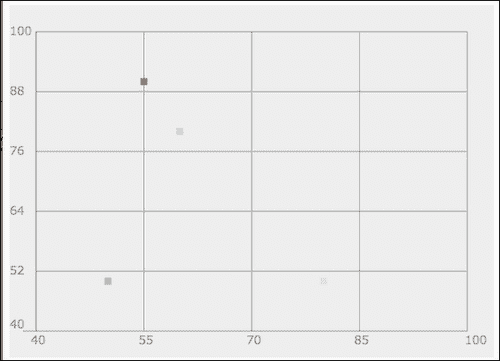
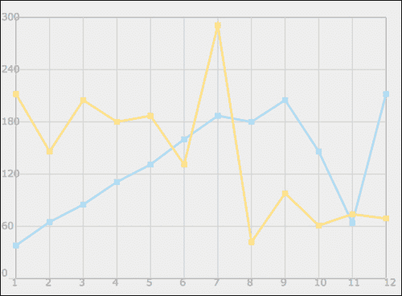
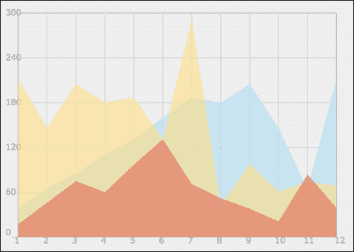
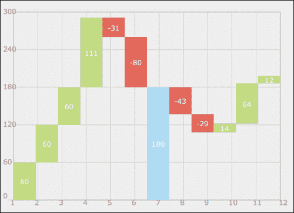
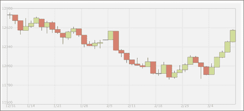
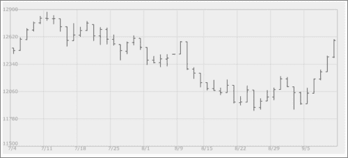

# 第三章：创建基于笛卡尔的图表

在本章中，我们将涵盖以下主题：

+   从头开始构建条形图

+   在散点图中传播数据

+   构建线图

+   创建飞行砖图（瀑布图）

+   构建蜡烛图（股票图）

# 介绍

我们放大的第一个图表/图表是最受欢迎和最简单的创建。我们可以粗略地将它们分类为基于笛卡尔的图表。总的来说，这种图表风格相对简单；它为探索数据的惊人创造方式打开了大门。在本章中，我们将奠定构建图表的基础，希望能激励您提出自己的创意，以创建引人入胜的数据可视化。

# 从头开始构建条形图

最简单的图表是只包含一维数据的图表（每种类型只有一个值）。有许多方法可以展示这种类型的数据，但最受欢迎、逻辑和简单的方法是创建一个简单的条形图。即使在非常复杂的图表中，创建这个条形图所涉及的步骤也会非常相似。这种类型的图表的理想用法是当主要目标是展示简单数据时，如下所示：

！[从头开始构建条形图]（img/3707OT_03_01.jpg）

## 准备好

创建一个包含画布和`onLoad`事件的基本 HTML 文件，该事件将触发`init`函数。加载`03.01.bar.js`脚本。我们将按照以下的食谱创建 JavaScript 文件的内容：

```js
<!DOCTYPE html>
<html>
  <head>
    <title>Bar Chart</title>
    <meta charset="utf-8" />
  <script src="img/03.01.bar.js"></script>		
  </head>
  <body onLoad="init();" style="background:#fafafa">
    <h1>How many cats do they have?</h1>
    <canvas id="bar" width="550" height="400"> </canvas>
  </body>
</html>
```

一般来说，创建图表有三个步骤：定义工作区域，定义数据源，然后在数据中绘制。

## 如何做...

在我们的第一个案例中，我们将比较一组朋友和他们各自拥有的猫的数量。我们将执行以下步骤：

1.  定义你的数据集：

```js
var data = [{label:"David",
         value:3,
         style:"rgba(241, 178, 225, 0.5)"},
         {label:"Ben",
         value:2,
         style:"#B1DDF3"},
         {label:"Oren",
         value:9,
         style:"#FFDE89"},
         {label:"Barbera",
         value:6,
         style:"#E3675C"},
         {label:"Belann",
         value:10,
         style:"#C2D985"}];
```

对于这个例子，我创建了一个可以包含无限数量元素的数组。每个元素包含三个值：标签、值和其填充颜色的样式。

1.  定义你的图表轮廓。

现在我们有了数据源，是时候创建我们的基本画布信息了，我们在每个样本中都会创建：

```js
var can = document.getElementById("bar");
  var wid = can.width;
  var hei = can.height;
  var context = can.getContext("2d");
  context.fillStyle = "#eeeeee";
  context.strokeStyle = "#999999";
  context.fillRect(0,0,wid,hei);
```

1.  下一步是定义我们的图表轮廓：

```js
var CHART_PADDING = 20;

  context.font = "12pt Verdana, sans-serif";
  context.fillStyle = "#999999";

  context.moveTo(CHART_PADDING,CHART_PADDING);
  context.lineTo(CHART_PADDING,hei-CHART_PADDING);
  context.lineTo(wid-CHART_PADDING,hei-CHART_PADDING);

  var stepSize = (hei - CHART_PADDING*2)/10;
  for(var i=0; i<10; i++){
    context.moveTo(CHART_PADDING, CHART_PADDING + i*  stepSize);
    context.lineTo(CHART_PADDING*1.3,CHART_PADDING + i*  stepSize);
    context.fillText(10-i, CHART_PADDING*1.5, CHART_PADDING + i*  stepSize + 6);
  }
  context.stroke();
```

1.  我们的下一个和最后一步是创建实际的数据条：

```js
var elementWidth =(wid-CHART_PADDING*2)/ data.length;
  context.textAlign = "center";
  for(i=0; i<data.length; i++){
    context.fillStyle = data[i].style;
    context.fillRect(CHART_PADDING +elementWidth*i ,hei-CHART_PADDING - data[i].value*stepSize,elementWidth,data[i].value*stepSize);
    context.fillStyle = "rgba(255, 255, 225, 0.8)";
    context.fillText(data[i].label, CHART_PADDING +elementWidth*(i+.5), hei-CHART_PADDING*1.5);

  }
```

就是这样。现在，如果你在浏览器中运行应用程序，你会发现一个条形图被渲染出来。

## 它是如何工作的...

我创建了一个名为`CHART_PADDING`的变量，它在整个代码中都被用来帮助我定位元素（变量是大写的，因为我希望它是一个常量；所以这是为了提醒自己这不是应用程序生命周期中会改变的值）。

让我们从我们的轮廓区域开始深入研究我们创建的样本：

```js
context.moveTo(CHART_PADDING,CHART_PADDING);
context.lineTo(CHART_PADDING,hei-CHART_PADDING);
context.lineTo(wid-CHART_PADDING,hei-CHART_PADDING);
```

在这些行中，我们正在创建我们数据的 L 形框架；这只是为了帮助和提供视觉辅助。

下一步是定义我们将用来在视觉上表示数值数据的步数。

```js
var stepSize = (hei – CHART_PADDING*2)/10;
```

在我们的样本中，我们正在硬编码所有数据。因此，在步长中，我们正在找到我们图表的总高度（画布的高度减去顶部和底部的填充），然后我们将其除以将在以下`for`循环中使用的步数：

```js
  for(var i=0; i<10; i++){
    context.moveTo(CHART_PADDING, CHART_PADDING + i*  stepSize);
context.lineTo(CHART_PADDING*1.3,CHART_PADDING + i*  stepSize);
    context.fillText(10-i, CHART_PADDING*1.5, CHART_PADDING + i*  stepSize + 6);
  }
```

我们循环 10 次，每次画一条短线。然后使用`fillText`方法添加数字信息。

请注意，我们发送值`10-i`。这个值对我们很有效，因为我们希望顶部值为 10。我们从图表的顶部开始；我们希望显示的值为 10，随着`i`的值增加，我们希望我们的值在循环的每一步中向下移动时变小。

接下来，我们要定义每个条的宽度。在我们的情况下，我们希望条形相互接触，为了做到这一点，我们将利用可用的总空间，除以数据元素的数量。

```js
var elementWidth =(wid-CHART_PADDING*2)/ data.length;
```

在这个阶段，我们已经准备好画条了，但在这之前，我们应该计算条的宽度。

然后我们循环遍历所有数据并创建条形图：

```js
context.fillStyle = data[i].style;
context.fillRect(CHART_PADDING +elementWidth*i ,hei-CHART_PADDING - data[i].value*stepSize,elementWidth,data[i].value*stepSize);
context.fillStyle = "rgba(255, 255, 225, 0.8)";
context.fillText(data[i].label, CHART_PADDING +elementWidth*(i+.5), hei-CHART_PADDING*1.5);
```

请注意，每次循环运行时，我们都会两次重置样式。如果我们不这样做，我们将无法获得我们希望获得的颜色。然后我们将文本放在创建的条形图的中间。

```js
context.textAlign = "center";
```

## 还有更多...

在我们的示例中，我们创建了一个不灵活的条形图，如果这是我们创建图表的方式，我们将需要每次从头开始重新创建它们。让我们重新审视我们的代码，并对其进行调整，使其更具重用性。

### 重新审视代码

尽管一切都按我们希望的方式工作，但如果我们玩弄数值，它就会停止工作。例如，如果我只想有五个步骤；如果我们回到我们的代码，我们会找到以下行：

```js
var stepSize = (hei - CHART_PADDING*2)/10;
for(var i=0; i<10; i++){
```

我们可以对其进行调整，以处理五个步骤：

```js
var stepSize = (hei - CHART_PADDING*2)5;
for(var i=0; i<5; i++){
```

我们很快就会发现我们的应用程序并没有按预期工作。

为了解决这个问题，让我们创建一个新函数，用于创建图表的轮廓。在这样做之前，让我们提取数据对象并创建一个将包含步骤的新对象。让我们将数据移动并以可访问的格式进行格式化：

```js
var data = [...];
var chartYData = [{label:"10 cats", value:1},
 {label:"5 cats", value:.5},
 {label:"3 cats", value:.3}];
var range = {min:0, max:10};

var CHART_PADDING = 20;
var wid;
var hei;
function init(){
```

深入研究`chartYData`对象，因为它使我们能够在没有定义间距规则的情况下放入尽可能多的步骤，并且范围对象将存储整个图形的最小值和最大值。在创建新函数之前，让我们将它们添加到我们的`init`函数中（以粗体标记的更改）。

```js
function init(){
  var can = document.getElementById("bar");
  wid = can.width;
   hei = can.height;
  var context = can.getContext("2d");
  context.fillStyle = "#eeeeee";
  context.strokeStyle = "#999999";
  context.fillRect(0,0,wid,hei);

  context.font = "12pt Verdana, sans-serif";
  context.fillStyle = "#999999";

  context.moveTo(CHART_PADDING,CHART_PADDING);
  context.lineTo(CHART_PADDING,hei-CHART_PADDING);
  context.lineTo(wid-CHART_PADDING,hei-CHART_PADDING);
 fillChart(context,chartYData);
 createBars(context,data);
}
```

在此代码中，我们所做的就是将图表的创建和其条形分开为两个单独的函数。现在我们有了一个外部数据源，用于图表数据和内容，我们可以构建它们的逻辑。

### 使用 fillChart 函数

`fillChart`函数的主要目标是创建图表的基础。我们正在整合我们的新`stepData`对象信息，并根据其信息构建图表。

```js
function fillChart(context, stepsData){
  var steps = stepsData.length;
  var startY = CHART_PADDING;
  var endY = hei-CHART_PADDING;
  var chartHeight = endY-startY;
  var currentY;
  var rangeLength = range.max-range.min;
  for(var i=0; i<steps; i++){
    currentY = startY + (1-(stepsData[i].value/rangeLength)) *  chartHeight;
    context.moveTo(CHART_PADDING, currentY );
    context.lineTo(CHART_PADDING*1.3,currentY);
    context.fillText(stepsData[i].label, CHART_PADDING*1.5, currentY+6);
  }
  context.stroke();

}
```

我们的更改并不多，但通过它们，我们使我们的函数比以前更加动态。这一次，我们基于`stepsData`对象和基于它的范围长度来确定位置。

### 使用 createBars 函数

我们的下一步是重新访问`createBars`区域并更新信息，以便可以使用外部对象动态创建它。

```js
function createBars(context,data){
  var elementWidth =(wid-CHART_PADDING*2)/ data.length;
  var startY = CHART_PADDING;
  var endY = hei-CHART_PADDING;
  var chartHeight = endY-startY;
  var rangeLength = range.max-range.min;
  var stepSize = chartHeight/rangeLength;
  context.textAlign = "center";
  for(i=0; i<data.length; i++){
    context.fillStyle = data[i].style;
    context.fillRect(CHART_PADDING +elementWidth*i ,hei-CHART_PADDING - data[i].value*stepSize,elementWidth,data[i].value*stepSize);
    context.fillStyle = "rgba(255, 255, 225, 0.8)";
    context.fillText(data[i].label, CHART_PADDING +elementWidth*(i+.5), hei-CHART_PADDING*1.5);	
  }	
}
```

这里几乎没有什么改变，除了在定位数据和提取硬编码值的方式上有一些改变。比较我们源代码中的两个示例，并找出它们之间的区别。

# 在散点图中传播数据

散点图是一种非常强大的图表，主要用于在比较两组数据时获得鸟瞰图。例如，比较英语课上的分数和数学课上的分数，以找到相关关系。这种视觉比较方式可以帮助发现意想不到的数据集之间的关系。

这在目标是以非常直观的方式显示大量细节时是理想的。



## 准备工作

如果您还没有机会浏览本章第一个食谱的逻辑，我建议您偷偷看一眼，因为我们将在此基础上进行大量工作，同时扩展并使其稍微复杂化，以容纳两组数据。

常规的 HTML 启动代码可以在代码包中找到，或者查看第一章，*在画布中绘制形状*，以获取有关创建 HTML 文档的更多信息。

我重新访问了上一个食谱的数据源，并修改为存储学生数学、英语和艺术考试成绩的三个变量。

```js
var data = [{label:"David",
 math:50,
 english:80,
 art:92,
       style:"rgba(241, 178, 225, 0.5)"},
       {label:"Ben",
 math:80,
 english:60,
 art:43,
       style:"#B1DDF3"},
       {label:"Oren",
 math:70,
 english:20,
 art:92,
       style:"#FFDE89"},
       {label:"Barbera",
 math:90,
 english:55,
 art:81,
       style:"#E3675C"},
       {label:"Belann",
 math:50,
 english:50,
 art:50,
       style:"#C2D985"}];
```

请注意，这些数据是完全随机的，因此我们无法从数据本身中学到任何东西；但我们可以学到很多关于如何准备好我们的图表以用于真实数据。我们删除了`value`属性，而是用`math`、`english`和`art`属性替换它。

## 如何做...

让我们直接进入 JavaScript 文件和我们想要进行的更改：

1.  定义`y`空间和`x`空间。为此，我们将创建一个存储所需信息的辅助对象：

```js
var chartInfo= { y:{min:40, max:100, steps:5,label:"math"},
        x:{min:40, max:100, steps:4,label:"english"}
      };
```

1.  现在是时候设置我们的其他全局变量并启动我们的`init`函数了：

```js
var CHART_PADDING = 30;
var wid;
var hei;
function init(){

  var can = document.getElementById("bar");

  wid = can.width;
  hei = can.height;
  var context = can.getContext("2d");
  context.fillStyle = "#eeeeee";
  context.strokeStyle = "#999999";
  context.fillRect(0,0,wid,hei);

  context.font = "10pt Verdana, sans-serif";
  context.fillStyle = "#999999";

  context.moveTo(CHART_PADDING,CHART_PADDING);
  context.lineTo(CHART_PADDING,hei-CHART_PADDING);
  context.lineTo(wid-CHART_PADDING,hei-CHART_PADDING);

 fillChart(context,chartInfo);
 createDots(context,data);
}
```

这里没有太多新东西。主要的变化已经被突出显示。让我们继续创建我们的`fillChart`和`createDots`函数。

1.  如果你之前做过我们的上一个示例，你可能会注意到前一个示例中的函数和这个函数之间有很多相似之处。我故意改变了创建事物的方式，只是为了让它们更有趣。现在我们也处理两个数据点，所以很多细节已经改变。让我们来回顾一下：

```js
function fillChart(context, chartInfo){
  var yData = chartInfo.y;
  var steps = yData.steps;
  var startY = CHART_PADDING;
  var endY = hei-CHART_PADDING;
  var chartHeight = endY-startY;
  var currentY;
  var rangeLength = yData.max-yData.min;
  var stepSize = rangeLength/steps;
  context.textAlign = "left";
  for(var i=0; i<steps; i++){
    currentY = startY + (i/steps) *	chartHeight;
    context.moveTo(wid-CHART_PADDING, currentY );
    context.lineTo(CHART_PADDING,currentY);
    context.fillText(yData.min+stepSize*(steps-i), 0, currentY+4);
  }

  currentY = startY +	chartHeight;
  context.moveTo(CHART_PADDING, currentY );
  context.lineTo(CHART_PADDING/2,currentY);
  context.fillText(yData.min, 0, currentY-3);

  var xData = chartInfo.x;
  steps = xData.steps;
  var startX = CHART_PADDING;
  var endX = wid-CHART_PADDING;
  var chartWidth = endX-startX;
  var currentX;
  rangeLength = xData.max-xData.min;
  stepSize = rangeLength/steps;
  context.textAlign = "left";
  for(var i=0; i<steps; i++){
    currentX = startX + (i/steps) *	chartWidth;
    context.moveTo(currentX, startY );
    context.lineTo(currentX,endY);
    context.fillText(xData.min+stepSize*(i), currentX-6, endY+CHART_PADDING/2);
  }

  currentX = startX +	chartWidth;
  context.moveTo(currentX, startY );
  context.lineTo(currentX,endY);
  context.fillText(xData.max, currentX-3, endY+CHART_PADDING/2);

  context.stroke();

}
```

当你审查这段代码时，你会注意到我们的逻辑几乎是重复两次。在第一个循环和第一批变量中，我们正在计算`y`空间中每个元素的位置，然后在这个函数的后半部分，我们继续计算`x`区域的布局。画布中的 y 轴从上到下增长（顶部较低，底部较高），因此我们需要计算整个图形的高度，然后减去该值以找到位置。

1.  我们的最后一个函数是渲染数据点，为此我们创建`createDots`函数：

```js
function createDots(context,data){
  var yDataLabel = chartInfo.y.label;
  var xDataLabel = chartInfo.x.label;
  var yDataRange = chartInfo.y.max-chartInfo.y.min;
  var xDataRange = chartInfo.x.max-chartInfo.x.min;
  var chartHeight = hei- CHART_PADDING*2;
  var chartWidth = wid- CHART_PADDING*2;

  var yPos;
  var xPos;
  for(var i=0; i<data.length;i++){
    xPos = CHART_PADDING + (data[i][xDataLabel]-chartInfo.x.min)/xDataRange * chartWidth;
    yPos = (hei - CHART_PADDING)  -(data[i][yDataLabel]-chartInfo.y.min)/yDataRange * chartHeight;

    context.fillStyle = data[i].style;
    context.fillRect(xPos-4 ,yPos-4,8,8);

  }  
}
```

在这里，我们正在为每个点找出相同的细节——`y`位置和`x`位置——然后绘制一个矩形。现在让我们测试我们的应用程序！

## 它是如何工作的...

我们首先创建一个新的`chartInfo`对象：

```js
var chartInfo= { y:{min:40, max:100, steps:5,label:"math"},
        x:{min:40, max:100, steps:4,label:"english"}
      };
```

这个非常简单的对象封装了定义我们的图表实际输出的规则。仔细看，你会发现我们设置了一个名为`chartInfo`的对象，其中包含有关 y 轴和 x 轴的信息。我们有一个最小值（`min`属性），最大值（`max`属性），我们想在我们的图表中拥有的步数（`steps`属性），并且我们定义了一个标签。

让我们深入了解`fillChart`函数的工作方式。实质上，我们有两个数值；一个是屏幕上的实际空间，另一个是空间所代表的值。为了匹配这些值，我们需要知道我们的数据范围以及我们的视图范围，因此我们首先通过找到我们的`startY`点和`endY`点，然后计算这两个点之间的像素数量：

```js
var startY = CHART_PADDING;
var endY = hei-CHART_PADDING;
var chartHeight = endY-startY;
```

当我们尝试弄清楚从`chartInfo`对象中放置数据时，这些值将被使用。因为我们已经在谈论那个对象，让我们看看我们对它做了什么：

```js
  var yData = chartInfo.y;
  var steps = yData.steps;
  var rangeLength = yData.max-yData.min;
  var stepSize = rangeLength/steps;
```

由于我们现在的重点是高度，我们正在深入研究`y`属性，为了方便起见，我们将其称为`yData`。现在我们专注于这个对象，是时候弄清楚这个值的实际数据范围（`rangeLength`）了，这将是我们的转换器数字。换句话说，我们想要在点`startY`和`endY`之间的视觉空间中，根据范围将其定位。当我们这样做时，我们可以将任何数据转换为 0-1 之间的范围，然后将它们定位在动态可见的区域中。

最后但并非最不重要的，由于我们的新数据对象包含我们想要添加到图表中的步数，我们使用该数据来定义步长值。在这个示例中，它将是 12。我们得到这个值的方式是通过取我们的`rangeLength`（100-40=60）值，然后除以`steps`的数量（在我们的例子中是 5）。现在我们已经解决了关键的变量，是时候遍历数据并绘制我们的图表了：

```js
var currentY;
context.textAlign = "left";
  for(var i=0; i<steps; i++){
    currentY = startY + (i/steps) *	chartHeight;
    context.moveTo(wid-CHART_PADDING, currentY );
    context.lineTo(CHART_PADDING,currentY);
    context.fillText(yData.min+stepSize*(steps-i), 0, currentY+4);
  }
```

这就是魔法发生的地方。我们遍历步数，然后再次计算新的`Y`位置。如果我们将其分解，我们会看到：

```js
currentY = startY + (i/steps) *	chartHeight;
```

我们从图表的起始位置（上部区域）开始，然后通过取当前`i`位置并将其除以总可能步数（0/5、1/5、2/5 等）来添加步骤。在我们的演示中，它是 5，但它可以是任何值，并且应该插入到`chartInfo`的步骤属性中。我们将返回的值乘以我们之前计算的图表的高度。

为了弥补我们从顶部开始的事实，我们需要颠倒我们放入文本字段的实际文本：

```js
yData.min+stepSize*(steps-i)
```

这段代码使用了我们之前的变量并让它们发挥作用。我们首先取可能的最小值，然后加上`stepSize`乘以总步数减去当前步数的数量。

让我们深入了解`createDots`函数以及它是如何工作的。我们从设置变量开始：

```js
var yDataLabel = chartInfo.y.label;
var xDataLabel = chartInfo.x.label;
```

这是我最喜欢的配方之一。我们从`chartInfo`对象中获取标签并将其用作我们的 ID；这个 ID 将用于从我们的数据对象中获取信息。如果您希望更改值，您只需要在`chartInfo`对象中切换标签。

再次，我们需要弄清楚我们的范围，就像我们在`fillChart`函数中所做的那样。这一次，我们想要获取 x 轴和 y 轴的实际范围以及我们需要处理的区域的实际宽度和高度：

```js
var yDataRange = chartInfo.y.max-chartInfo.y.min;
var xDataRange = chartInfo.x.max-chartInfo.x.min;
var chartHeight = hei- CHART_PADDING*2;
var chartWidth = wid- CHART_PADDING*2;
```

我们还需要获取一些变量来帮助我们在循环中跟踪我们当前的`x`和`y`位置：

```js
var yPos;
var xPos;
```

让我们深入到我们的循环中，主要是突出显示的代码片段：

```js
for(var i=0; i<data.length;i++){
 xPos = CHART_PADDING + (data[i][xDataLabel]-chartInfo.x.min)/xDataRange * chartWidth;
 yPos = (hei - CHART_PADDING)  -(data[i][yDataLabel]-chartInfo.y.min)/yDataRange * chartHeight;

    context.fillStyle = data[i].style;
    context.fillRect(xPos-4 ,yPos-4,8,8);

  }
```

这里的一切的核心是发现我们的元素需要在哪里。逻辑对于`xPos`和`yPos`变量几乎是相同的，只有一些变化。我们需要做的第一件事是计算`xPos`变量：

```js
(data[i][xDataLabel]-chartInfo.x.min)

```

在这部分中，我们使用了我们之前创建的标签`xDataLabel`来获取该科目中当前学生的分数。然后我们从中减去最低可能的分数。由于我们的图表不是从 0 开始的，我们不希望 0 和我们的最小值之间的值影响屏幕上的位置。例如，假设我们专注于数学，我们的学生得了 80 分；我们从中减去 40（80-40=40），然后应用以下公式：

`(data[i][xDataLabel] - chartInfo.x.min) / xDataRange`

我们将该值除以我们的数据范围；在我们的情况下，那将是（100-40）/60。返回的结果将始终在 0 和 1 之间。我们可以使用返回的数字并将其乘以像素的实际空间，以确切地知道在屏幕上定位我们的元素。我们通过将我们得到的值（在 0 和 1 之间）乘以总可用空间（在这种情况下是宽度）来这样做。一旦我们知道它需要定位的位置，我们就在图表上添加起始点（填充）：

```js
xPos = CHART_PADDING + (data[i][xDataLabel]-chartInfo.x.min)/xDataRange * chartWidth;

```

`yPos`变量的逻辑与`xPos`变量的逻辑相同，但这里我们只关注高度。

# 构建折线图

折线图是基于散点图的。与显示两个变量之间孤立相关性的散点图相反，折线图以多种方式讲述了一个故事；我们可以回到我们之前的散点图的配方，*在散点图中传播数据*，并在点之间画一条线来创建连接。这种类型的图表通常用于网站统计，随时间跟踪事物，速度，年龄等。让我们立即跳进去看看它的运作。



## 准备就绪

像往常一样，准备好您的 HTML 包装器。在这个配方中，我们实际上将根据之前的配方*在散点图中传播数据*来进行更改。

在这个案例研究中，我们将创建一个图表，显示 2011 年和 2010 年有多少新成员加入了我的网站[02Geek.com](http://02Geek.com)。我逐月收集了信息并将其汇总到两个数组中：

```js
var a2011 = [38,65,85,111,131,160,187,180,205,146,64,212];
var a2010 = [212,146,205,180,187,131,291,42,98,61,74,69];
```

两个数组的长度都是 12（代表一年的 12 个月）。我故意创建了一个与我们之前使用的完全不同的新数据源。我这样做是为了使我们以前的地图在这个例子中变得无用。我这样做是为了为这个配方增加一些额外的价值（一个很好的课程，教你如何操纵数据以适应，即使它不适合，而不是重建事物）。

```js
var chartInfo= { y:{min:0, max:300, steps:5,label:"users"},
        x:{min:1, max:12, steps:11,label:"months"}
      };
```

对于我们的图表信息，我们正在使用相同的对象类型，并且对于`y`位置，我们将假定范围从 0 到 300（因为我还没有在一个月内拥有超过 300 名成员的特权，但我对此抱有希望）。对于我们的`x`位置，我们将其设置为输出值从 1 到 12（代表一年的 12 个月）。

好的，是时候来构建它了！

## 如何做...

和往常一样，我们的`init`函数将看起来与我们在上一个示例中使用的函数非常相似。让我们看看在这个示例中发生了哪些修改：

1.  更新/创建全局变量：

```js
var a2011 = [38,65,85,111,131,160,187,180,205,146,64,212];
var a2010 = [212,146,205,180,187,131,291,42,98,61,74,69];

var chartInfo= { y:{min:0, max:300, steps:5,label:"users"},
        x:{min:1, max:12, steps:11,label:"months"}
      };

var CHART_PADDING = 20;
var wid;
var hei;
```

1.  更新`init`函数：

```js
function init(){

  var can = document.getElementById("bar");

  wid = can.width;
  hei = can.height;
  var context = can.getContext("2d");
  context.fillStyle = "#eeeeee";
  context.strokeStyle = "#999999";
  context.fillRect(0,0,wid,hei);

  context.font = "10pt Verdana, sans-serif";
  context.fillStyle = "#999999";

  context.moveTo(CHART_PADDING,CHART_PADDING);
 context.rect(CHART_PADDING,CHART_PADDING,wid-CHART_PADDING*2,hei-CHART_PADDING*2);
 context.stroke();
  context.strokeStyle = "#cccccc";
  fillChart(context,chartInfo);
 addLine(context,formatData(a2011, "/2011","#B1DDF3"),"#B1DDF3");
 addLine(context,formatData(a2010, "/2010","#FFDE89"),"#FFDE89"); 
}
```

1.  更改函数`createDots`的名称为`addLine`并更新逻辑：

```js
function addLine(context,data,style){
  var yDataLabel = chartInfo.y.label;
  var xDataLabel = chartInfo.x.label;
  var yDataRange = chartInfo.y.max-chartInfo.y.min;
  var xDataRange = chartInfo.x.max-chartInfo.x.min;
  var chartHeight = hei- CHART_PADDING*2;
  var chartWidth = wid- CHART_PADDING*2;

  var yPos;
  var xPos;
 context.strokeStyle = style;
 context.beginPath();
 context.lineWidth = 3;
  for(var i=0; i<data.length;i++){
    xPos = CHART_PADDING + (data[i][xDataLabel]-chartInfo.x.min)/xDataRange * chartWidth;
    yPos = (hei - CHART_PADDING)  -(data[i][yDataLabel]-chartInfo.y.min)/yDataRange * chartHeight;

    context.fillStyle = data[i].style;
    context.fillRect(xPos-4 ,yPos-4,8,8);

 i ? context.lineTo(xPos,yPos):context.moveTo(xPos,yPos);

  }
 context.stroke();
}
```

1.  创建`formatData`函数：

```js
function formatData(data , labelCopy , style){
  newData = [];
  for(var i=0; i<data.length;i++){
    newData.push({	label:(i+1)+labelCopy,
            users:data[i],
            months:i+1,
            style:style
            });	
  }

  return newData;	
}
```

就是这样！我们完成了！

## 它是如何工作的...

我已经为我们的绘图工具集添加了一个新方法`rect`；到目前为止，我们一直使用`drawRect`方法。我使用`rect`方法是因为它只是添加轮廓而不绘制任何东西，所以我可以分别执行描边或填充功能，并创建轮廓而不是填充。

`fillChart`函数一点都没有改变，很酷，对吧？我将函数`createDots`重命名为`addLine`，因为对于我们的示例来说，这似乎更合适。该函数已经进行了一些添加，并且正在使用一个新函数`formatData`来格式化数据以适应`addLine`函数所期望的格式。

正如您可能已经注意到的，我们对我们的代码进行了一些小的更改，以适应这种图表样式的需求。让我们深入研究并看到它们在实际操作中的表现：

```js
addLine(context,formatData(a2011,"/2011","#B1DDF3"),"#B1DDF3")

```

我们在调用`addLine`函数的方式中可以明显看到的最大变化是，我们正在调用`formatData`函数为我们呈现一个数据源，该数据源将被`addLine`函数接受。您可能现在正在想，为什么我不只是创建需要为`addLine`函数工作的数据的方式。当我们转移到真实的实时数据源时，我们经常会发现数据源与我们的原始工作不匹配。这并不意味着我们需要改变我们的工作，通常更好的解决方案是创建一个转换器方法，该方法将修改数据并重建它以匹配我们的应用程序结构，使其符合我们的期望格式。

从我们以前的示例中提醒一下：这是我们的数据源的样子：

```js
var data = [{label:"David",
       math:50,
       english:80,
       art:92
       style:"rgba(241, 178, 225, 0.5)"},
       ...
       ];
```

尽管我们的数组目前是平的，但我们需要改变它以适应我们当前的系统；它期望两个属性来定义`x`和`y`值：

```js
var chartInfo= { y:{min:0, max:300, steps:5,label:"users"},
 x:{min:1, max:12, steps:11,label:"months"}

```

换句话说，我们需要创建的对象需要看起来像下面这样：

```js
var data = [{label: "01/2011",
       users:200,
      months:1,
      style:"#ff0000"} ... ];
```

所以让我们创建一个将创建这种数据格式的函数：

```js
function formatData(data , labelCopy , style){
  newData = [];
  for(var i=0; i<data.length;i++){
    newData.push({	label:(i+1)+labelCopy,
            users:data[i],
            months:i+1,
            style:style
            });	
  }

  return newData;
}
```

请注意我们如何循环遍历我们的旧数组，并重新构造它以适应我们期望的数据格式，使用数组数据和发送到我们的`formatData`函数的外部数据。即使在这个示例中我们没有使用所有的信息，我也想保持它与所有基本信息保持最新，以防您想要扩展这个示例。我们将在未来这样做。

### 提示

这是编程工具集中最强大的技巧之一。我遇到过许多开发人员，他们改变他们的代码而不是改变他们的数据以适应所需的应用程序结构。总是有一种方法可以修改数据，使其更容易被应用程序消耗，动态修改数据比更改架构要容易得多。

我没有改变这个`addLine`函数的核心逻辑，而是只是从一个点到下一个点添加了画线。

如果您不熟悉三元操作符，它是一个简写的`if`语句：

```js
condition ? ifStatement: elseStatement;
```

顺便说一句，如果您担心效率问题，您可能希望通过将第一个实例提取出循环来更改`for`循环，因为这是我们的三元运算符触发 else 值的唯一发生的地方。

## 还有更多...

让我们重新审视我们的代码，并优化它以使其更具适应性。我们的目标是为我们的图表添加更多的灵活性，以便以各种模式呈现。

我的目标是使我们的图表能够以三种渲染模式呈现：点模式（如前一个示例中），线模式（在本示例中），以及填充模式（新添加）：



尽管在前面的屏幕截图中，我们有三个图表元素，它们都有填充，但在新代码中，您可以选择每行添加的方式。所以让我们开始吧。

### 启用在点和线之间切换模式

我们添加到函数中的所有工作都不需要经过大修，因为直到实际呈现之前，什么都看不见。这在一个地方受控，即我们在`addLine`函数中创建描边的地方。因此，让我们添加一个新规则，如果没有发送样式，那就意味着我们不想创建一条线：

```js
if(style)context.stroke();
```

换句话说，只有当我们有样式信息时，我们才会绘制刚刚创建的线；如果没有，就不会绘制线。

### 创建填充形状

为了创建填充形状并且为了保持我们的代码简洁，我们将在我们的代码中创建一个`if...else`语句，如果用户发送了一个新的第四个参数，我们将以填充模式呈现它（更改在以下代码片段中突出显示）：

```js
function addLine(context,data,style,isFill){
  var yDataLabel = chartInfo.y.label;
  var xDataLabel = chartInfo.x.label;
  var yDataRange = chartInfo.y.max-chartInfo.y.min;
  var xDataRange = chartInfo.x.max-chartInfo.x.min;
  var chartHeight = hei- CHART_PADDING*2;
  var chartWidth = wid- CHART_PADDING*2;

  var yPos;
  var xPos;
  context.strokeStyle = style;
  context.beginPath();
  context.lineWidth = 3;

 if(!isFill){
    for(var i=0; i<data.length;i++){
      xPos = CHART_PADDING + (data[i][xDataLabel]-chartInfo.x.min)/xDataRange * chartWidth;
      yPos = (hei - CHART_PADDING)  -(data[i][yDataLabel]-chartInfo.y.min)/yDataRange * chartHeight;

      context.fillStyle = data[i].style;
      context.fillRect(xPos-4 ,yPos-4,8,8);

      i==0? context.moveTo(xPos,yPos):context.lineTo(xPos,yPos);

    }
    if(style)context.stroke();
 }else{
 context.fillStyle = style;
 context.globalAlpha = .6;
 context.moveTo(CHART_PADDING,hei - CHART_PADDING)
 for(var i=0; i<data.length;i++){
 xPos = CHART_PADDING + (data[i][xDataLabel]-chartInfo.x.min)/xDataRange * chartWidth;
 yPos = (hei - CHART_PADDING)  -(data[i][yDataLabel]-chartInfo.y.min)/yDataRange * chartHeight;

 context.lineTo(xPos,yPos);

 }
 context.lineTo(	CHART_PADDING + chartWidth, CHART_PADDING+chartHeight);
 context.closePath();
 context.fill(); 
 context.globalAlpha = 1;
 }
}
```

新代码中的差异并不大。我们只是删除了一些代码，并添加了一些新行来创建一个完整的形状。我也叠加了 Alpha 值。一个更聪明的方法是重新审视发送的值，并根据需要放入 Alpha 值；但这留给你来改进。现在我们的`addLine`函数可以添加三种类型的可视化，我们可以同时向我们的图表中添加多种类型（查看源代码以查看其运行情况）。

# 创建飞行砖块图（瀑布图）

在本章的每个配方中，我们都在提高我们代码的复杂性，因此我们将重新审视条形图，并使其适应我们不断发展的图表平台。完成这个小任务后，我们将准备好创建我们的第一个瀑布图，摆脱标准图表，进入更有创意的领域。



瀑布图是一个非常有用的图表，可以概述趋势，比如每月的总变化（正面和负面），同时概述整体价值。这种类型的图表有助于概述公司的总资产，同时显示他们在整个月份内是盈利还是亏损。这种类型的图表非常适合在正负值之间变化的数据。

## 准备工作

我们将利用我们在早期配方中创建的接口，因此我们将把条形图的创建整合到我们更新的函数库中。为此，我们需要找出我们在`03.02.bar-revamp.js`中创建的旧`createBars`函数。

在实施更改之前的代码如下：

```js
function createBars(context,data){
  var elementWidth =(wid-CHART_PADDING*2)/ data.length;
  var startY = CHART_PADDING;
  var endY = hei-CHART_PADDING;
  var chartHeight = endY-startY;
  var rangeLength = range.max-range.min;
  var stepSize = chartHeight/rangeLength;
  context.textAlign = "center";
  for(i=0; i<data.length; i++){
    context.fillStyle = data[i].style;
    context.fillRect(CHART_PADDING +elementWidth*i ,hei-CHART_PADDING - data[i].value*stepSize,elementWidth,data[i].value*stepSize);
    context.fillStyle = "rgba(255, 255, 225, 0.8)";
    context.fillText(data[i].label, CHART_PADDING +elementWidth*(i+.5), hei-CHART_PADDING*1.5);

  }
}
```

以下是我们新更新的函数，以适应我们在早期配方中开发的新技能（更改在以下代码片段中突出显示）。

```js
function createBars(context,data){

 var range = chartInfo.x;
  var elementWidth =(wid-CHART_PADDING*2)/ data.length;
  var startY = CHART_PADDING;
  var endY = hei-CHART_PADDING;
  var chartHeight = endY-startY;
 var stepSize = chartHeight/(chartInfo.y.max-chartInfo.y.min);
  context.textAlign = "center";
  for(i=0; i<data.length; i++){
    context.fillStyle = data[i].style;
 context.fillRect(CHART_PADDING +elementWidth*i ,endY - data[i][chartInfo.y.label]*stepSize,elementWidth,data[i][chartInfo.y.label]*stepSize);
    context.fillStyle = "rgba(255, 255, 225, 0.8)";
    context.fillText(data[i].label, CHART_PADDING +elementWidth*(i+.5), hei-CHART_PADDING*1.5);

  }

}
```

这些更改不仅仅是表面的；我们正在利用我们在之前的一些示例中使用的外部数据源。现在我们的函数已经更新并且在前两个配方中开发的最新逻辑中运行，现在是时候开始构建我们的瀑布图了。

## 如何做...

创建瀑布图的第一步是复制、粘贴和重命名函数`createBars`，然后操纵它并改变数据呈现的方式（主要是元素的位置和方式）。在深入讨论之前，注意我们在这个方法中所做的更改：

1.  让我们从一个更新后的数据源开始：

```js
var a2011 = [60,60,60,111,-31,-80,0,-43,-29,14,64,12];
var chartInfo= { y:{min:0, max:300, steps:5,label:"users"},
        x:{min:1, max:12, steps:11,label:"months"}
        };
var CHART_PADDING = 20;
var wid;
var hei;
```

1.  在`init`函数中，我们将更新以下突出显示的代码片段：

```js
function init(){

  ...
  context.strokeStyle = "#cccccc";
  fillChart(context,chartInfo);
 createWaterfall(context,formatData(a2011));
}
```

1.  添加一些辅助变量：

```js
function createWaterfall(context,data){

  var range = chartInfo.x;
  var elementWidth =(wid-CHART_PADDING*2)/ data.length;
  var startY = CHART_PADDING;
  var endY = hei-CHART_PADDING;
  var chartHeight = endY-startY;
  var stepSize = chartHeight/(chartInfo.y.max-chartInfo.y.min);
  var currentY= endY;
 var elementValue ;
 var total=0;
  context.textAlign = "center";
```

1.  在`for`循环逻辑中，如果值不是`0`，则绘制一个矩形：

```js
  for(i=0; i<data.length; i++){
 elementValue = data[i][chartInfo.y.label];
 total +=elementValue;
 if(elementValue!=0){
 context.fillStyle = elementValue>0? "#C2D985" :"#E3675C" ;
 currentY -=(elementValue*stepSize);
 context.fillRect(CHART_PADDING +elementWidth*i ,currentY,elementWidth,elementValue*stepSize);
 }

```

1.  如果当前数据值是`0`，那么将其作为总列：

```js
else{
 context.fillStyle = "#B1DDF3" ;

 context.fillRect(CHART_PADDING +elementWidth*i ,currentY,elementWidth,endY-currentY);
 elementValue = total; //hack so we see the right value
 }
 context.fillStyle = "rgba(255, 255, 255, .8)"
;

```

1.  在元素内添加更改的值：

```js
 context.fillText(elementValue, CHART_PADDING +elementWidth*(i+.5), endY - (stepSize*total) + (stepSize*elementValue/2) + 6);

  }

}
```

这里有很多变化，但实质上这两个函数几乎做了相同的事情；只有我们的瀑布图更智能、更详细。

## 它是如何工作的...

当我们开始考虑如何创建瀑布图时，第一步和第一个问题是每个元素之间存在关系。为了简化逻辑，我们希望创建一个计数器来存储变化（当前汇总值）。

```js
  var elementValue ;
  var total=0;
```

第一个变量只是一个辅助变量，试图使我们的代码更易读，而总和则是为了跟踪当前总和是多少。

现在是时候进入`for`循环并看到重大的变化。让我们首先关注我们可能需要在瀑布图中进行的任务类型。有三种类型（值上升、值下降和值保持不变）。在我们开始解决这些情况之前，让我们更新我们的变量：

```js
for(i=0; i<data.length; i++){
    elementValue = data[i][chartInfo.y.label];
    total +=elementValue;
```

元素值将给我们当前的数值（不要忘记这与屏幕上的大小不对应；当我们想要绘制元素时，我们仍然需要将其乘以`stepSize`数）。`total`变量也是如此；我们只是跟踪当前的汇总。

因此，正如我们之前所述，我们有三个可能的任务，创建一个`if...else`情况没有问题，如下所示：

```js
if(elementValue>0){
  //do the positive values
}else if(elementValue<0){
  //do the negative values
}else{
  //do 0
}
```

这将捕捉所有三种选项，但会添加一些不必要的额外代码。因此，我们将对负值和正值使用相同的`if`语句，因为它们的逻辑非常接近。这样我们可以重用我们的代码并减少输入。

```js
if(elementValue!=0){
  //do positive/negative values
}else{
  // do 0
}
```

完美！现在让我们深入了解正负任务：

```js
context.fillStyle = elementValue>0? "#C2D985" :"#E3675C" ;
currentY -=(elementValue*stepSize);
context.fillRect(CHART_PADDING +elementWidth*i ,currentY,elementWidth,elementValue*stepSize);
```

请注意，这个代码块中的第一行代码是正负值之间唯一的区别。我们只是基于是否处于正负范围内改变颜色。在确定了`currentY`位置之后，我们在当前位置创建一个矩形（这个当前位置是在值被添加之后，所以这是我们的终点）。最重要的元素是第四个参数，`elementValue*stepSize`。第四个参数捕捉了矩形的大小。它捕捉了它是负值还是正值。`elementValue`变量可以是正数或负数。这就是我们在这里使用的技巧，因为我们会向上绘制条（如果值为负），或向下绘制条（如果值为正）。如果我们首先创建绘图再更新我们的`currentY`位置，那将会更加困难，可能需要我们创建三个单独的`if`情况。像这样的情况确实是我觉得编程如此有趣的原因；找到利用相同代码做相反事情的隐藏方法。

现在是时候访问`else`情况了：

```js
}else{
    context.fillStyle = "#B1DDF3" ;

 context.fillRect(CHART_PADDING +elementWidth*i ,currentY,elementWidth,endY-currentY);
    elementValue = total; //hack so we see the right value
    }
```

在`else`情况下，我们想要绘制条的全长，然后进行一个小技巧。我们将当前总和的值赋给`elementValue`变量（这不会改变我们的原始数据，因为我们在没有再使用`elementValue`变量之后才这样做）。我们这样做是为了避免在将文本添加到条中时再使用`if...else`语句。只有当值为`0`时，我们希望显示总和而不是当前变化，这就是这个技巧的作用。

留下我们创建瀑布图的最后一部分，即获取我们刚刚创建的元素中心的条形的值：

```js
context.fillStyle = "rgba(255, 255, 255, .8)";
context.fillText(elementValue, CHART_PADDING +elementWidth*(i+.5), endY - (stepSize*total) + (stepSize*elementValue/2) + 6);

```

深入研究文本元素的定位；直到我弄清楚为止，我进行了一些调整。我在这里主要是在最后一个参数（我们新文本的`y`位置）中进行操作，我取了我们图表的底部区域，减去当前的总数，这样就能得到条形图的顶端。但对于正值来说，这样做不太好，因为它会在条形图的上方，而对于负值来说，它会放在条形图的底部区域。这就需要创造性思维；我们可以把文本放在我们元素的中间。为了做到这一点，我们可以再次利用我们的`elementValue`变量（因为它是正数或负数），如果我们取它的一半大小并加到我们的总数中，我们就会处于条形图的中心，只需要最后一个调整，给我们的值加上 6（因为我们的文本高度为 12 像素）。

就是这样！你刚刚创建了你的第一个瀑布图。让我们来测试一下；从我们的`init`函数中删除任何数据可视化函数调用（比如`createBars`或`addLine`），并用我们的新函数替换它们：

```js
createWaterfall(context,formatData(a2011));	
```

### 注意

请注意，我正在使用`formatData`对象，因为我只是重用了我们之前样本中的数组。我只是更新了值，使它们不超出总数 300：

```js
var a2011 = [60,60,60,111,-31,-80,0,-43,-29,14,64,12];
```

## 还有更多……

我们结束的地方，引出了一个问题，那就是我们无法控制数据，而且我们要求最终用户/开发人员做出调整的越多，学习曲线就越长。我们有一个存储大部分辅助信息的`chartInfo`对象，这很好，但是如果有人没有填写属性会怎么样呢？我们的应用程序应该失败，还是应该尽力为用户找到新的默认值？比如在这个例子中，用户没有填写`y`对象的`max`和`min`属性：

```js
var chartInfo= { y:{steps:5,label:"users"},
        x:{min:1, max:12, steps:11,label:"months"}
        };
```

用户指定他们想要多少步骤，但他们没有提供关于图表应该输出的最小值和最大值的任何信息。为了解决这个问题，我们需要重新审视我们创建图表的方式。到目前为止，我们完全分开地创建了图表（在我们的`init`函数的最后两行）：

```js
  fillChart(context,chartInfo);
  createWaterfall(context,formatData(a2011));	
```

首先我们通常创建背景，然后绘制项目，但在这种情况下，我们在`fillchart`函数和`createWaterfall`函数之间有一个更清晰的关系。由于我们试图减少用户的代码占用，我们不希望为每个样本添加大量逻辑，这些逻辑对于每种条形图类型都是独特的。因此，我们将重新审视我们创建的所有图形函数（`addLine`、`createBars`和`createWaterfall`），并将`fillChart`函数调用移到函数的第一件事。这将使我们能够在调用`fillChart`函数之前创建自定义调整，这些调整对我们函数的最终用户（比如几个月后的你）是不可见的，因此你不需要记住一切是如何工作的。现在一切应该都能正常工作，但只有我们的`createWaterfall`函数会知道如何处理缺失的信息（我会让你更新其他函数）。

```js
function createWaterfall(context,data){
  fillChart(context,chartInfo);
//all the rest the same
//do to all 3 functions
```

现在我们有了`fillChart`函数，并且一切都正常工作，让我们在调用`fillChart`函数之前添加一些额外的逻辑，以帮助动态添加`min`/`max`值：

```js
function createWaterfall(context,data){
 if(!chartInfo.y.min || !chartInfo.y.max)
 updateCumulativeChartInfo(chartInfo,data);
  fillChart(context,chartInfo);
```

请注意，我们正在检查`min`或`max`值是否缺失，如果是，我们将调用`updateCumulativeChartInfo`函数来更新或添加这些值。

让我们创建`updateCumulativeChartInfo`函数：

```js
function updateCumulativeChartInfo(chartInfo,data){
  var aTotal=[];
  var total = 0;
  aTotal.push(total);
  for(i=0; i<data.length; i++){
    total +=data[i][chartInfo.y.label]
    aTotal.push(total);

  }
  chartInfo.y.min = Math.min.apply(this,aTotal);
  chartInfo.y.max = Math.max.apply(this,aTotal);
}
```

我们使用两个变量：`aTotal`和`total`。`aTotal`变量在每个循环中存储总数。在`aTotal`数组中，我们有了我们的`total`变量在图表的所有阶段中的值后，就该确定最小值和最大值了。我们有一个问题。`Math.min`方法可以接受无限数量的参数，但我们有一个与`Math.min`方法的要求不兼容的数组。为了确定值，我们可以使用`apply`方法的一个有趣的技巧。每个函数都有一个`apply`方法。`apply`方法的作用是使您能够更改函数的作用域并将参数作为数组发送。

### 注意

有关`apply`方法的更多信息，请查看以下网站的视频：

[`02geek.com/catagory/favorites/apply.html`](http://02geek.com/catagory/favorites/apply.html)

现在我们的数据已经动态创建，一切应该正常工作。当我们运行应用程序时，我们会发现得到一些太详细的数字（例如 3.33333）。下一步是进行一些格式调整。

### 清理数字的格式

为了解决我们的数字值非常丑陋的问题，我们可以创建一个格式化函数，并在每次输出动态创建的值时调用它。所以让我们首先创建这个函数：

```js
function formatNumber(num,lead){
  for(var i=0;i<lead;i++) num*=10;
  num = parseInt(num);
  for(var i=0;i<lead;i++) num/=10;
  return num;
}
```

函数参数是要格式化的值（`num`）和小数点后我们想要的位数。在函数中，我们将值乘以十；乘以的次数基于`lead`变量的值。然后我们将数字转换为整数，再次除以该数字。

最后但并非最不重要的是，让我们跟踪我们添加文本的位置；我们会在`fillChart`函数中找到它。我们唯一剩下的事情就是找到受影响的正确文本，并更新它以使用我们的新格式化函数：

```js
context.fillText(formatNumber(yData.min+stepSize*(steps-i),2), 0, currentY+4);

```

我们的格式看起来会好得多。是的，你可能应该将这些细节留给外部`chartInfo`对象来配置，但我们会让你来使我们的库更加智能。

### 我留下的其他任务

我们的新瀑布图有一个假设，即我们总是从零开始。在我们的示例中，我们不会改变这一点，但在下一个配方中，当使用蜡烛图表时，我们会重新审视这个想法。如果你勇敢的话，试着找出一个解决方案。

# 构建蜡烛图表（股票图表）

我们正要迈出一大步。到目前为止，我们使用的图表只有一个数据点，两个数据点，以及一些变化，现在我们要进入一个新世界，每个柱状图有四个数据点。股票图表是展示市场在特定时间范围内（在我们的例子中是一天）变化的一种方式。每天股票价格会多次变动，但最重要的因素是当天的最低价、最高价以及开盘价和收盘价。股票分析师需要能够快速看到信息并理解总体趋势。我们跳过了三个数据点元素，但我们将在第四章“让曲线变得更加曲线”中的“构建气泡图表”中回到它们。



你能做的最糟糕的事情就是假设四个维度数据的唯一用途是在股票市场上。这就是你可以想出下一个大事件的地方。以清晰快速的方式可视化数据，并将数据转化为逻辑是关于图表最有趣的事情之一。说了这么多，让我们开始创建我们的股票图表。

## 准备工作

我们在这个配方中的第一步会有点不同。我创建了一个名为`DJI.txt`的示例 CSV 文件；你可以在我们的源文件中找到它。格式是标准的 CSV 格式，第一行命名了所有数据列。

```js
DATE,CLOSE,HIGH,LOW,OPEN,VOLUME
```

未来的所有行都包含数据（在我们的例子中是每日数据）：

```js
1309752000000,12479.88,12506.22,12446.05,12505.99,128662688
```

所以我们需要经历的步骤是加载文件，将数据转换为适合我们标准数据集的格式，然后构建新的图表类型（然后在发现问题时进行修复；敏捷开发）。

## 如何做...

我们将从上一个步骤离开的地方开始工作。我们将直接在 JavaScript 文件中开始修改：

1.  让我们更新全局变量：

```js
var chartInfo= { y:{min:11500, max:12900,steps:5,label:"close"},
        x:{min:1, max:12, steps:11,label:"date"}
        };
var stockData;
var CHART_PADDING = 20;
var wid;
var hei
```

1.  在开始内部逻辑之前，我们需要加载新的外部 CSV 文件。我们将重命名`init`函数并将其称为`startUp`，然后创建一个新的`init`函数：

```js
function init(){

  var client = new XMLHttpRequest();
  client.open('GET', 'data/DJI.txt');

  client.onreadystatechange = function(e) {
   if(e.target.readyState==4){

     var aStockInfo = e.target.responseText.split("\n");
     stockData = translateCSV(aStockInfo,7);

      startUp()

   }
  }

  client.send();
}

function startUp(){
  //old init function
}
```

1.  我们从 CSV 文件中获取的数据需要格式化为我们可以使用的结构。为此，我们创建了`translateCSV`函数，该函数接受原始 CSV 数据并将其转换为与我们架构需求匹配的对象：

```js
function translateCSV(data,startIndex){
  startIndex|=1; //if nothing set set to 1
  var newData = [];
  var aCurrent;
  var dataDate;
  for(var i=startIndex; i<data.length;i++){
    aCurrent = data[i].split(",");
    dataDate = aCurrent[0].charAt(0)=="a"?parseInt(aCurrent[0].slice(1)):parseInt(aCurrent[0]);
    newData.push({	date:dataDate,
            close:parseFloat(aCurrent[1]),
            high:parseFloat(aCurrent[2]),
            low:parseFloat(aCurrent[3]),
            open:parseFloat(aCurrent[4]),
            volume:parseFloat(aCurrent[5])
            });	
  }

  return newData;	
}
```

1.  我们的`startUp`函数，以前称为`init`，除了将`createWaterfall`方法更改为调用`addStock`之外，将保持不变：

```js
function startUp(){
  ...
 addStock(context,stockData); 
}
```

1.  是时候创建`addStock`函数了：

```js
function addStock(context,data){ 
  fillChart(context,chartInfo);
  var elementWidth =(wid-CHART_PADDING*2)/ data.length;
  var startY = CHART_PADDING;
  var endY = hei-CHART_PADDING;
  var chartHeight = endY-startY;
  var stepSize = chartHeight/(chartInfo.y.max-chartInfo.y.min);
  var openY;
  var closeYOffset;
  var highY;
  var lowY;
  var currentX;
  context.strokeStyle = "#000000";
  for(i=0; i<data.length; i++){
    openY = (data[i].open-chartInfo.y.min)*stepSize;
    closeYOffset = (data[i].open-data[i].close)*stepSize;
    highY = (data[i].high-chartInfo.y.min)*stepSize;
    lowY =(data[i].low-chartInfo.y.min)*stepSize;
    context.beginPath();
    currentX = CHART_PADDING +elementWidth*(i+.5);
    context.moveTo(currentX,endY-highY);
    context.lineTo(currentX,endY-lowY);
    context.rect(CHART_PADDING +elementWidth*i ,endY-openY,elementWidth,closeYOffset);
    context.stroke();
    context.fillStyle = closeYOffset<0? "#C2D985" :"#E3675C" ;
    context.fillRect(CHART_PADDING +elementWidth*i ,endY-openY,elementWidth,closeYOffset);
  }

}
```

创建新的蜡烛图表需要执行所有这些步骤。

## 工作原理...

让我们回顾一下加载外部文件的步骤。如果您使用 jQuery 等开源工具，最好使用它们来加载外部文件，但是为了避免使用其他库，我们将使用`XMLHttpRequest`对象，因为它在支持 HTML5 的所有现代浏览器中都受支持。

我们首先创建一个新的`XMLHttpRequest`对象：

```js
var client = new XMLHttpRequest();
client.open('GET', 'data/DJI.txt');
```

下一步是设置我们想要执行的操作（GET/POST）和文件名，然后创建`onreadystatechange`回调的处理程序函数并发送我们的请求。

```js
client.onreadystatechange = function(e) {
   if(e.target.readyState==4){
     var aStockInfo = e.target.responseText.split("\n");
     stockData = translateCSV(aStockInfo,1);
      startUp()

   }
  }
  client.send();
```

事件处理程序`onreadystatechange`在文件加载过程中会被调用几次。我们只想在文件加载完成并准备好处理时监听并执行操作；为此，我们将检查`readyState`变量是否等于四（准备就绪和已加载）。文件加载完成后，我们希望根据换行符将文件拆分为数组。

### 注意

请注意，该文件是在 Mac 上创建的。`\n`起到了作用，但是当您创建自己的文件或下载文件时，您可能需要使用`\r`或组合`\n\r`或`\n\r`。始终通过输出数组的长度并验证其正确大小（然后测试其内容是否符合您的预期）来确认您是否做出了正确的选择。

在我们的数组准备就绪后，我们希望将其格式化为用户友好的格式，然后启动旧的`init`函数，现在称为`startUp`。

让我们快速回顾一下`translateCSV`格式化函数。我们实际上是在循环遍历之前创建的数据数组，并用格式化的对象替换每一行，这将适用于我们的需求。请注意，我们有一个可选参数`startIndex`。如果未设置任何值或设置为零，则在第一行上我们将其赋值为`1`：

```js
startIndex||=1; //if nothing set set to 1
```

前者是一种简写的写法：

```js
startIndex = startIndex || 1;
```

如果`startIndex`参数的值等于 true，则保持不变；否则，将其转换为`1`。

顺便说一句，如果您不知道如何使用这些快捷方式，我真的建议您熟悉它们；它们非常有趣，可以节省时间和输入。如果您想了解更多，请查看以下链接：

+   [`www.jquery4u.com/javascript/shorthand-javascript-techniques/`](http://www.jquery4u.com/javascript/shorthand-javascript-techniques/)

+   [`02geek.com/javascript/objects-and-arrays.html`](http://02geek.com/javascript/objects-and-arrays.html)

太好了！现在我们有了一个数据源，其格式与我们迄今为止使用的样式相同。

我们将硬编码我们的`chartInfo`对象。它对我们的`y`值效果很好，但对我们的日期要求（在`x`值中）效果不是很好。在我们的图表运行后，我们将稍后重新讨论这个问题。在早期的练习中，我们创建了一个动态范围生成器，所以如果您想跟上这个，那么请回顾一下，并将这种类型的逻辑也添加到这个图表中，但对于我们的需求，我们现在将它硬编码。

好的，让我们深入了解`addStock`函数。顺便说一下，注意到我们正在使用相同的格式和整体工具，我们可以轻松地混合图表。但在这之前，让我们了解一下`addStock`函数实际上是做什么的。让我们从我们的基本变量开始：

```js
  fillChart(context,chartInfo);
  var elementWidth =(wid-CHART_PADDING*2)/ data.length;
  var startY = CHART_PADDING;
  var endY = hei-CHART_PADDING;
  var chartHeight = endY-startY;
  var stepSize = chartHeight/(chartInfo.y.max-chartInfo.y.min);
```

我们正在收集信息，这将使我们在创建柱状图时更容易工作（从元素的宽度`elementWidth`到我们的值和图表高度之间的比率）。所有这些变量在本章的早期示例中都有涉及。

```js
 var openY;
 var closeYOffset;
 var highY;
 var lowY;
 var currentX;
  context.strokeStyle = "#000000";
```

这些变量将成为我们的辅助变量（在每轮循环后更新），用于确定高、低、开盘和收盘偏移的位置（因为我们正在绘制一个矩形，它期望高度而不是第二个`y`值）。

在我们的循环的每一轮中，我们首先找出这些变量的值：

```js
for(i=0; i<data.length; i++){
    openY = (data[i].open-chartInfo.y.min)*stepSize;
    closeYOffset = (data[i].open-data[i].close)*stepSize;
    highY = (data[i].high-chartInfo.y.min)*stepSize;
    lowY =(data[i].low-chartInfo.y.min)*stepSize;
```

您会注意到，所有变量的逻辑几乎都是相同的。我们只是从值中减去最小值（因为我们的图表不包括最小值以下的值），然后将其乘以我们的`stepSize`比率，使值适应我们的图表尺寸（这样即使我们改变图表尺寸，一切都应该继续工作）。请注意，只有`closeYOffset`变量不是减去`min`属性，而是减去`close`属性。

下一步是绘制我们的蜡烛图表，从当天的最低点到最高点开始画一条线：

```js
    context.beginPath();
    currentX = CHART_PADDING +elementWidth*(i+.5);
    context.moveTo(currentX,endY-highY);
 context.lineTo(currentX,endY-lowY);

```

接下来是代表完整开盘和收盘值的矩形：

```js
    context.rect(CHART_PADDING +elementWidth*i ,endY-openY,elementWidth,closeYOffset);
    context.stroke();
    context.fillStyle = closeYOffset<0? "#C2D985" :"#E3675C" ;
    context.fillRect(CHART_PADDING +elementWidth*i ,endY-openY,elementWidth,closeYOffset);
}
```

之后，我们将为这个矩形创建一个填充，并根据`closeYOffset`变量的值设置样式颜色。在这个阶段，我们有一个运行中的应用程序，尽管它可能需要一些调整来使其运行得更好。

## 还有更多...

是时候修复我们的`x`坐标值了：

```js
var chartInfo= { y:{min:11500, max:12900,steps:5,label:"close"},
 x:{min:1, max:12, steps:11,label:"date"}
        };
```

在此之前，我们没有改变这个变量，因为到目前为止，轮廓和我们的内容（图表本身）之间有明显的分离；但在这个阶段，由于我们的`x`轮廓内容不再是一个线性数字，而是一个日期；我们需要以某种方式将与图表内容相关的外部数据引入`fillChart`方法。这里最大的挑战是，我们不想在这个方法中引入仅与我们的图表相关的东西，因为这是一个全局使用的函数。相反，我们希望将我们的唯一数据放在一个外部函数中，并将该函数作为格式化程序发送进去。所以让我们开始吧：

```js
var chartInfo= { y:{min:11500, max:12900,steps:5,label:"close"},
 x:{label:"date",formatter:weeklyCapture}
        };
```

我们股票图表中的`x`空间代表时间，因此我们以前基于线性数据的使用不适用（例如`min`、`max`和`steps`等属性在这种情况下没有意义）。我们将删除它们，而是使用一个新属性`formatter`，它将以函数作为其值。我们将使用这个`formatter`函数而不是默认函数。如果设置了这个函数，我们将让一个外部函数定义规则。当我们描述`weeklyCapture`函数时，我们将会更多地了解这一点。这种编码方法称为**插件编码**。它的名称源自这样一个想法，即使我们在未来重新设计核心逻辑，也能够创建可替换的函数。在创建`weeklyCapture`函数之前，让我们调整`chartInfo`对象，以便获得正确的范围和步数：

```js
function addStock(context,data){
 if(!chartInfo.x.max){
 chartInfo.x.min = 0;
 chartInfo.x.max = data.length;
 chartInfo.x.steps = data.length; 
 }

  fillChart(context,chartInfo);

...
```

我们在这里要做的是，在`addStock`函数中调用`fillChart`函数之前，我们要检查`max`值是否已设置；如果没有设置，我们将重置所有值，将`min`设置为`0`，将`max`和`steps`设置为数据数组的长度。我们这样做是因为我们想要遍历所有的数据元素，以测试并查看是否有新的工作日。

现在我们将`weeklyCapture`函数整合到`fillChart`函数中。

```js
function fillChart(context, chartInfo){
  // ....
 var output;
  for(var i=0; i<steps; i++){
 output = chartInfo.x.formatter && chartInfo.x.formatter(i);
 if(output || !chartInfo.x.formatter){
      currentX = startX + (i/steps) *	chartWidth;
      context.moveTo(currentX, startY );
      context.lineTo(currentX,endY);
 context.fillText(output?output:xData.min+stepSize*(i), currentX-6, endY+CHART_PADDING/2);
 }
  }

 if(!chartInfo.x.formatter){
 currentX = startX +	chartWidth;
 context.moveTo(currentX, startY );
 context.lineTo(currentX,endY);
 context.fillText(xData.max, currentX-3, endY+CHART_PADDING/2);
 }

  context.stroke();

}
```

在我们的第一步中，我们将获取从我们的`formatter`函数返回的值。

```js
output = chartInfo.x.formatter && chartInfo.x.formatter(i);
```

逻辑很简单，我们正在检查`formatter`函数是否存在，如果存在，我们就调用它并发送当前值`i`（因为我们在循环中）。

接下来的步骤是，如果我们的输出不为空（负数或等于 false 的值），或者如果我们的输出为空但我们的格式化程序没有激活，那么渲染数据：

```js
if(output || !chartInfo.x.formatter){
  currentX = startX + (i/steps) *	chartWidth;
  context.moveTo(currentX, startY );
  context.lineTo(currentX,endY);
  context.fillText(output?output:xData.min+stepSize*(i), currentX-6, endY+CHART_PADDING/2);
}
```

只有当我们从`formatter`函数获得输出和/或`formatter`函数不存在时，我们才不需要做任何事情。因此，我们需要`if`语句来捕获两种情况，如果我们没有`if`语句，那么我们的输出将不符合我们之前的规则。我们在这段代码块中更改的唯一内容是`fillText`方法。如果我们正在处理输出，我们希望将其用于文本。如果没有，我们希望保持之前的逻辑不变：

```js
if(output || !chartInfo.x.formatter){
  currentX = startX + (i/steps) *	chartWidth;
  context.moveTo(currentX, startY );
  context.lineTo(currentX,endY);
 context.fillText(output?output:xData.min+stepSize*(i), currentX-6, endY+CHART_PADDING/2);
}
```

在我们运行应用程序并查看它运行的最后一件事是创建我们的`weeklyCapture`函数。所以现在让我们创建它：

```js
var DAY = 1000*60*60*24;
function weeklyCapture(i){
  var d;
  if(i==0){
    d =  new Date(stockData[i].date);	
  }else if ( i>1 && stockData[i].date != stockData[i-1].date+1 ){
    d = new Date(stockData[i].date + DAY*stockData[i].date );
  }

  return d? d.getMonth()+1+"/"+d.getDate():false;

}
```

我们首先创建一个名为`DAY`的辅助变量，它将存储一天有多少毫秒：

```js
var DAY = 1000*60*60*24;
```

如果您查看我们的外部数据，您会发现只有在第`0`天我们有一个实际日期（以自 1970 年以来的毫秒格式化）。我们只需要将其发送到`date`对象以创建一个日期：

```js
var d;
  if(i==0){
    d =  new Date(stockData[i].date);	
  }
```

虽然所有其他数据行只包含一个数字，表示自原始日期以来经过了多少天，但我们想要测试并查看当前日期是否仅比上一个日期晚一天。只有当日期变化大于一天时，我们才会为其创建新的日期格式：

```js
}else if ( i>1 && stockData[i].date != stockData[i-1].date+1 ){
    d = new Date(stockData[0].date + DAY*stockData[i].date );
  }
```

请注意，要创建日期对象，我们需要获取第`0`行的当前原始日期，然后将其与毫秒中的总天数相加（将我们的`DAY`变量乘以当前天数值）。

通过这种方法，我们只需要检查是否有有效的日期。让我们格式化它并发送回去，如果没有，我们将发送回`false`：

```js
return d? d.getMonth()+1+"/"+d.getDate():false;
```

恭喜！现在我们的示例是一个完全集成的蜡烛图表，具有动态日期。

### 向我们的股票图表添加其他渲染选项

尽管蜡烛图表是一个非常受欢迎的选项，但还有另一种受欢迎的技术图表视图。当没有颜色可用时使用的一种视图。在左侧绘制一条线来定义开盘价，在右侧捕获收盘价。让我们将该逻辑集成到我们的图表中作为可选的渲染模式。我们将向`addStock`函数添加一个新参数：

```js
function addStock(context,data,isCandle){
```

现在，我们将调整我们的内部`for`循环，以根据这个变量的值改变渲染：

```js
for(i=0; i<data.length; i++){
    openY = (data[i].open-chartInfo.y.min)*stepSize;
    closeYOffset = (data[i].open-data[i].close)*stepSize;
    highY = (data[i].high-chartInfo.y.min)*stepSize;
    lowY =(data[i].low-chartInfo.y.min)*stepSize;
    context.beginPath();
    currentX = CHART_PADDING +elementWidth*(i+.5);
    context.moveTo(currentX,endY-highY);
    context.lineTo(currentX,endY-lowY);
 if(!isCandle){
 context.moveTo(currentX,endY-openY);
 context.lineTo(CHART_PADDING +elementWidth*(i+.25),endY-openY);
 context.moveTo(currentX,endY-openY+closeYOffset);
 context.lineTo(CHART_PADDING +elementWidth*(i+.75),endY-openY+closeYOffset);
 context.stroke();
 }else{
 context.rect(CHART_PADDING +elementWidth*i ,endY-openY,elementWidth,closeYOffset);
 context.stroke();
 context.fillStyle = closeYOffset<0? "#C2D985" :"#E3675C" ;
 context.fillRect(CHART_PADDING +elementWidth*i ,endY-openY,elementWidth,closeYOffset);

 }

  }
```

这样就可以了。我们将`isCandle`布尔变量的默认值设置为`false`。如果我们再次运行我们的应用程序，我们会发现它以新格式呈现。要更改这一点，我们只需要在调用`addStock`函数时提供第三个参数为`true`：



本章是自包含的，真正是所有图表的中心，如果您需要加强图表构建技能。我建议您重新查看本章中的一些早期示例。
