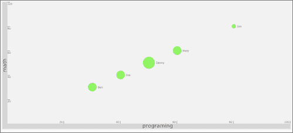
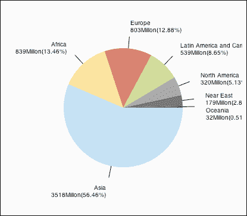
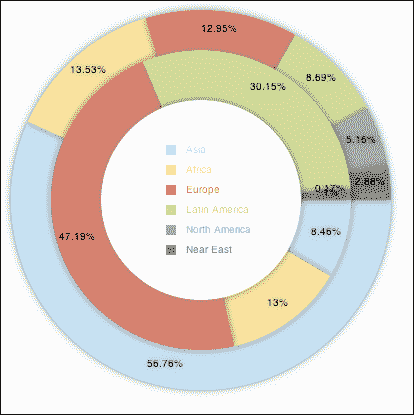
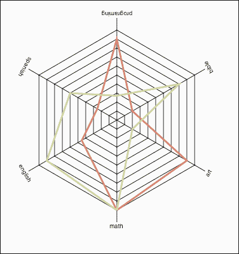
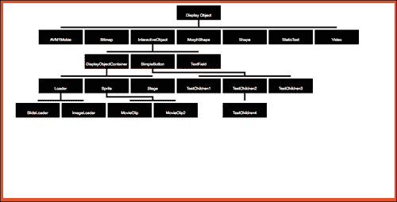

# 第四章：让事情变得曲线

在本章中，我们将涵盖：

+   构建气泡图

+   创建饼图

+   使用甜甜圈图表显示关系

+   利用雷达

+   构建树状图

# 介绍

在上一章中，我们构建了一个用于线性图的组件，通过点、线和条形图进行范围。我们处理的大部分数据是二维的，而我们在四维图表结束了我们的课程。它仍然使用线性艺术来表示。在本章中，我们将利用创建非线性数据来表示数据的能力。

# 构建气泡图

尽管我们图表中的许多项目与我们在第三章中创建的图表有关，但我们将从头开始。我们的目标是创建一个具有气泡的图表——气泡使我们能够展示具有三个数据点（x、y 和气泡大小）的数据。这种类型的图表在动画时非常理想，因为它可以展示随时间的变化（它可以在几秒钟内展示多年的变化）。

气泡图的强大功能在 Hans Rosling 的 TED 演示中可以得到很好的展示（[`blog.everythingfla.com/2012/05/hans-rosling-data-vis.html`](http://blog.everythingfla.com/2012/05/hans-rosling-data-vis.html)）。



## 准备就绪

我们将从画布设置开始启动我们的项目，并跳过 HTML 结尾。如果您忘记了如何创建，请参考第一章中的*使用 2D 画布绘制图形*。

有三个主要步骤：

+   创建数据源

+   创建背景

+   将图表数据信息添加到图表中

## 如何做...

让我们列出创建气泡图所需的步骤：

1.  下一个数据对象应该看起来很熟悉，它是一个数组，其中包含有关学生在英语、数学和编程方面的成绩的对象。构建数据对象：

```js
var students2001 = [{name:"Ben",
  math:30,
  english:60,
  programing:30},
  {name:"Joe",
  math:40,
  english:60,
  programing:40},
  {name:"Danny",
  math:50,
  english:90,
  programing:50},
  {name:"Mary",
  math:60,
  english:60,
  programing:60},
  {name:"Jim",
  math:80,
  english:20,
  programing:80}];
```

1.  创建我们的图表信息；与以前的图表相反，这个图表有一个用于气泡信息的第三个参数。定义我们的图表规则：

```js
var chartInfo= { y:{min:0, max:100,steps:5,label:"math"},
  x:{min:0, max:100,steps:5,label:"programing"},
  bubble:{min:0, max:100, minRaduis:3, maxRaduis:20,label:"english"}
};
```

1.  最后的数据对象将包含我们将来可能想要更改的所有样式信息。添加一个样式对象：

```js
var styling = { outlinePadding:4,
  barSize:16,
  font:"12pt Verdana, sans-serif",
  background:"eeeeee",
  bar:"cccccc",
  text:"605050"
};
```

1.  当文档准备就绪时，我们创建一个事件回调来触发`init`，因此让我们创建`init`函数：

```js
var wid;
var hei;
function init(){
  var can = document.getElementById("bar");

  wid = can.width;
  hei = can.height;
  var context = can.getContext("2d");

  createOutline(context,chartInfo);
  addDots(context,chartInfo,students2001,["math","programing","english"],"name");
}
```

1.  当我们创建样式对象时，我们开始创建我们的轮廓。现在是时候将一切绘制到我们的画布中了。因此，我们首先设置我们的基本画布样式：

```js
function createOutline(context,chartInfo){
  var s = styling;
  var pad = s.outlinePadding;
  var barSize = s.barSize;
  context.fillStyle = s.background;
  context.fillRect(0,0,wid,hei);
  context.fillStyle = s.bar;
  context.fillRect(pad,pad,barSize,hei-pad*2);
  context.font = s.font;
  context.fillStyle = s.text;
```

1.  我们需要保存我们当前的基于画布的图形布局信息，对其进行更改以使其更容易定位元素，然后将其恢复到原始状态：

```js
context.save();
context.translate(17, hei/2 );
context.rotate(-Math.PI/2);
context.textAlign = "center";
context.fillText(chartInfo.y.label, 0, 0);
context.restore();

context.fillStyle = s.bar;
context.fillRect(pad+barSize,hei-pad-barSize,wid-pad*2-barSize,barSize);
context.font = s.font;
context.fillStyle = s.text;
context.fillText(chartInfo.x.label,( wid-pad*2-barSize)/2, hei-pad*2);

context.translate(pad+barSize,hei-pad-barSize);
context.scale(1, -1);
//SET UP CONSTANTS - NEVER CHANGE AFTER CREATED
styling.CHART_HEIGHT = hei-pad*2-barSize;
styling.CHART_WIDTH = wid-pad*2-barSize;
```

1.  现在是时候借助我们的`chartInfo`对象绘制轮廓了：

```js
var steps = chartInfo.y.steps;
var ratio;
chartInfo.y.range = chartInfo.y.max-chartInfo.y.min;
var scope = chartInfo.y.range;
context.strokeStyle = s.text;
var fontStyle = s.font.split("pt");
var pointSize = fontStyle[0]/2;
fontStyle[0]=pointSize;
fontStyle = fontStyle.join("pt");
context.font = fontStyle; // making 1/2 original size of bars
  for(var i=1; i<=steps; i++){
    ratio = i/steps;
    context.moveTo(0,ratio*styling.CHART_HEIGHT-1);
    context.lineTo(pad*2,ratio*styling.CHART_HEIGHT-1);
    context.scale(1,-1);

    context.fillText(chartInfo.y.min + (scope/steps)*i,0,(ratio*styling.CHART_HEIGHT-3 -pointSize)*-1);
    context.scale(1,-1);

  }

  steps = chartInfo.x.steps;
  chartInfo.x.range = chartInfo.x.max-chartInfo.x.min;
  scope = chartInfo.x.max-chartInfo.x.min;
  context.textAlign = "right";
  for(var i=1; i<=steps; i++){
    ratio = i/steps;
    context.moveTo(ratio*styling.CHART_WIDTH-1,0);
    context.lineTo(ratio*styling.CHART_WIDTH-1,pad*2);
    context.scale(1,-1);
    context.fillText(chartInfo.x.min + (scope/steps)*i,ratio*styling.CHART_WIDTH-pad,-pad/2);
    context.scale(1,-1);

  }

context.stroke();
}
```

1.  现在是时候通过创建`addDots`方法将数据添加到我们的图表中了。`addDots`函数将使用规则（键）来接收数据的定义，与我们在之前的食谱中所做的相反。

```js
function addDots(context,chartInfo,data,keys,label){
  var rangeX = chartInfo.y.range;
  var _y;
  var _x; 

  var _xoffset=0;
  var _yoffset=0;

  if(chartInfo.bubble){
    var range = chartInfo.bubble.max-chartInfo.bubble.min;
    var radRange = chartInfo.bubble.maxRadius-chartInfo.bubble.minRadius; 
    context.textAlign = "left";
  }

  for(var i=0; i<data.length; i++){
    _x = ((data[i][keys[0]] - chartInfo.x.min )/ chartInfo.x.range) * styling.CHART_WIDTH;
    _y = ((data[i][keys[1]] - chartInfo.y.min )/ chartInfo.y.range) * styling.CHART_HEIGHT;
    context.fillStyle = "#44ff44";

    if(data[i][keys[2]]){
      _xoffset = chartInfo.bubble.minRadius + (data[i][keys[2]]-chartInfo.bubble.min)/range *radRange;
      _yoffset = -3;
      context.beginPath();
      context.arc(_x,_y, _xoffset , 0, Math.PI*2, true); 
      context.closePath();
      context.fill();

      _xoffset+=styling.outlinePadding;
    }else{
      context.fillRect(_x,_y,10,10);	
    }

    if(label){
      _x+=_xoffset;
      _y+=_yoffset;
      context.fillStyle = styling.text;
      context.save();
      context.translate(_x,_y );
      context.scale(1,-1);
      context.fillText("Bluping",0,0);
      context.restore();

    }
  }
}
```

这一段代码虽然是从头开始重新编写的，但与第三章中的*在散点图中传播数据*食谱有很多相似之处，通过修改使其能够处理第三级数据和新的图表格式。

就是这样。您应该有一个运行中的气泡图。现在当您运行应用程序时，您将看到`x`参数展示了数学成绩，`y`参数展示了编程成绩，而我们气泡的大小展示了学生的英语成绩。

## 它是如何工作的...

让我们从`createOutline`函数开始。在这个方法中，除了我们喜欢的常规画布绘制方法之外，我们还引入了一种新的编码风格，在这种风格中，我们操纵实际的画布来帮助我们以更简单的方式定义我们的代码。这里的两个重要关键方法如下：

```js
context.save();
context.restore();
```

我们将多次利用`save`方法。该方法保存画布的当前视图，而`restore`方法将用户返回到上次保存的画布：

```js
context.save();
context.translate(17, hei/2 );
context.rotate(-Math.PI/2);
context.textAlign = "center";
context.fillText(chartInfo.y.label, 0, 0);
context.restore();
```

在第一次使用这种样式时，我们将其用于通过将其旋转到右侧来绘制我们的文本。`translate`方法移动画布的`0,0`坐标，而`rotate`方法使用弧度旋转文本。

在绘制外部条之后，是时候利用这种新能力了。大多数图表依赖于 y 坐标向上增长，但是这个画布的 y 值是从画布区域的顶部向底部增长的。我们可以通过在循环之前添加一些代码来翻转这种关系。

```js
context.translate(pad+barSize,hei-pad-barSize);
context.scale(1, -1);
```

在前面的行中，我们首先将画布的`0,0`坐标移动到图表的右下范围，然后通过切换比例值翻转画布。请注意，从现在开始，如果我们尝试向画布添加文本，它将是颠倒的。请记住，因为我们现在正在绘制一个颠倒的画布。

在我们的第一个循环中，当我们尝试输入新文本时，需要注意的一点是，当我们想要添加文本时，我们首先撤消我们的比例，然后将画布返回以进行翻转：

```js
context.scale(1,-1);
context.fillText(chartInfo.y.min + (scope/steps)*i,0,(ratio*styling.CHART_HEIGHT-3 -pointSize)*-1);
context.scale(1,-1);
```

请注意，我们将 y 坐标乘以`*-1`。我们这样做是因为我们实际上希望 y 坐标的值为负数，因为我们刚刚翻转了屏幕。

关于 x 条文本的工作方式非常相似；请注意与查找 x 和 y 值计算相关的主要区别。

现在是深入了解`addDots`函数的时候了。如果您一直在关注第三章，*创建基于笛卡尔的图表*，那么这个函数会再次让您感到熟悉，但这次我们使用的是修改后的画布。

我们首先使用一些辅助变量：

```js
var rangeX = chartInfo.y.range;
var _y;
var _x; 
var _xoffset=0;
var _yoffset=0;
```

我们动态添加气泡效果，这意味着即使只有两个信息点而不是三个，该方法也可以工作。我们继续测试我们的数据对象是否包含气泡信息：

```js
if(chartInfo.bubble){
  var range = chartInfo.bubble.max-chartInfo.bubble.min;
  var radRange = chartInfo.bubble.maxRaduis-chartInfo.bubble.minRaduis; 
  context.textAlign = "left";
}
```

如果是这样，我们将添加一些变量并将我们的文本对齐到左侧，因为我们将在这个示例中使用它。

是时候浏览我们的数据对象并在图表上传播数据了。

```js
for(var i=0; i<data.length; i++){
  _x = ((data[i][keys[0]] - chartInfo.x.min )/ chartInfo.x.range) * styling.CHART_WIDTH;
  _y = ((data[i][keys[1]] - chartInfo.y.min )/ chartInfo.y.range) * styling.CHART_HEIGHT;
  context.fillStyle = "#44ff44";
```

对于每个循环，我们根据当前值重新计算`_x`和`_y`坐标。

如果我们有第三个元素，我们就准备开发一个气泡。如果没有，我们需要创建一个简单的点。

```js
if(data[i][keys[2]]){
  _xoffset = chartInfo.bubble.minRaduis + (data[i][keys[2]]-chartInfo.bubble.min)/range *radRange;
  _yoffset = -3;
  context.beginPath();
  context.arc(_x,_y, _xoffset , 0, Math.PI*2, true); 
  context.closePath();
  context.fill();	
  _xoffset+=styling.outlinePadding;
}else{
   context.fillRect(_x,_y,10,10);	
}
```

在这个阶段，我们应该有一个活跃的气泡/点方法。我们所要做的就是集成我们的覆盖副本。

在添加标签之前，让我们看一下函数签名：

```js
function addDots(context,chartInfo,data,keys,label){}
```

`context`和`chartInfo`参数在我们的示例中已经是标准的。键的想法是使我们能够动态切换要测试的数据。键的值是与 x 和 y 坐标相关的数组位置`0`和`1`，位置`2`用于气泡，正如我们之前所见。`label`参数使我们能够发送标签的键值。通过这种方式，如果标签存在，我们将添加一个标签，如果不存在，我们将不添加。

```js
if(label){
  _x+=_xoffset;
  _y+=_yoffset;
  context.fillStyle = styling.text;
  context.save();
  context.translate(_x,_y );
  context.scale(1,-1);
  context.fillText(data[i][label],0,0);
  context.restore();						
 }
```

然后我们添加前面的`if`语句。如果我们设置了标签，我们就定位样式并创建标签的文本。

# 创建饼图

创建饼图的步骤相对简单而短。饼图非常适合展示我们想要在数据字段之间轻松比较的封闭数据量，例如，在我们的示例中，根据其地区将世界上的人数分组：



## 准备工作

第一步将是在 HTML 区域更新我们的画布大小为矩形区域。在我们的示例中，我们将更新值为 400 x 400。就是这样；让我们开始建立它。

## 如何做...

在接下来的步骤中，我们将创建我们的第一个饼图。让我们开始吧：

1.  设置我们的数据源和全局变量：

```js
var data= [	{label:"Asia", value:3518000000,style:"#B1DDF3"},
  {label:"Africa", value:839000000,style:"#FFDE89"},
  {label:"Europe", value:803000000,style:"#E3675C"},
  {label:"Latin America and Caribbean", value: 539000000,style:"#C2D985"},
  {label:"North America", value:320000000,style:"#eeeeee"},
  {label:"Near East", value:179000000,style:"#aaaaaa"},
  {label:"Oceania", value:32000000,style:"#444444"}
  ];
var wid;
var hei;
var radius = 100;
```

1.  准备我们的画布（从这里开始我们将深入`init`函数）：

```js
function init(){
  var can = document.getElementById("bar");

  wid = can.width;
  hei = can.height;
  var context = can.getContext("2d");
...
```

1.  计算总数据（世界人口）：

```js
var total=0;
for(var i=0; i<data.length; i++) total+=data[i].value;
```

1.  设置 360 度的弧度并将我们的旋转点移动到`0,0`：

```js
var rad360 = Math.PI*2;
context.translate(wid/2,hei/2);
```

1.  使用以下代码片段绘制饼图：

```js
var currentTotal=0;
  for(i=0; i<data.length; i++){
  context.beginPath();
  context.moveTo(0,0);
  context.fillStyle = data[i].style;
  context.arc( 0,0,radius,currentTotal/total*rad360,(currentTotal+data[i].value)/total*rad360,false);
  context.lineTo(0,0);
  context.closePath();
  context.fill();	

  currentTotal+=data[i].value;
  }
}
```

就是这样；我们刚刚创建了一个基本的饼图——我告诉过你这很容易！

## 它是如何工作的……

正如其名称所示，我们的饼图使用饼图，并始终展示 100%的数据。由于我们的弧线方法是基于弧度的，我们需要将这些数据点从百分比转换为弧度。

在弄清楚所有值的总和以及圆圈中的总弧度（`2*PI`）之后，我们准备循环并绘制切片。

```js
var currentTotal=0;
  for(i=0; i<data.length; i++){
    context.beginPath();
    context.moveTo(0,0);
    context.fillStyle = data[i].style;
```

逻辑相对简单；我们循环遍历所有数据元素，根据数据对象改变填充样式，并将指针移动到`0,0`（将画布的中心点作为我们的旋转点）。

```js
context.arc( 0,0,radius,currentTotal/total*rad360,(currentTotal+data[i].value)/total*rad360,false);
context.lineTo(0,0);
context.closePath();
context.fill();	

currentTotal+=data[i].value;
```

现在我们来绘制弧线。注意高亮显示的文本；我们从当前总数结束的地方开始，并通过这个计算弧度角度：

```js
currentTotal/total*rad360

```

我们可以将这个值转换为我们可以对圆圈的总弧度进行复制的百分比值。我们的第二个参数非常接近，所以我们只需将当前值添加到我们所在的当前区域的当前值中：

```js
(currentTotal+data[i].value)/total*rad360
```

最后要注意的一点是，我们将弧线的最后一个参数设置为`false`（逆时针），因为这对我们的计算效果最好。

最后但并非最不重要的是，我们将更新我们的`currentTotal`值，以包括新添加的区域，因为这将是我们`for`循环的下一轮中的起始点。

## 还有更多……

一个没有任何内容信息的饼图可能不会像有信息的图表那样有效，但我们可以找出位置……别担心；我们将重新审视我们的老朋友`cos`和`sin`来帮助我们定位圆圈上的点，以便我们能够在我们新创建的饼图上添加文本信息。

### 重新审视 Math.cos()和 Math.sin()

我们将首先添加一个新的全局变量来存储我们线条的颜色，然后我们将称之为`copyStyle`：

```js
var copyStyle = "#0000000000";
```

现在我们回到了`init`函数，让我们在最后一行之前的`for`循环中添加它：

```js
currentTotal+=data[i].value;
```

正如预期的那样，我们将首先将我们的新`copyStyle`变量设置为我们的填充和描边值：

```js
context.strokeStype = context.fillStyle =  copyStyle;
```

我们的下一步是确定我们想要在饼图中的哪个位置绘制一条线，以便我们可以添加文本：

```js
midRadian = (currentTotal+data[i].value/2)/total*rad360;
```

为了实现这一点，我们将使用一个新变量来存储上一个总数和新值（新切片的中心）的中间值。到目前为止还不错。现在我们需要弄清楚如何获得该点的 x 和 y 位置。幸运的是，在圆圈中有一种非常简单的方法，就是使用`Math.cos`（对于 x）和`Math.sin`（对于 y）函数：

```js
context.beginPath();
context.moveTo(Math.cos(midRadian)*radius,Math.sin(midRadian)*radius);
context.lineTo(Math.cos(midRadian)*(radius+20),Math.sin(midRadian)*(radius+20));
context.stroke();
```

拥有我们的`midRadian`变量，我们将得到一个半径为`1`的圆的值，所以我们要做的就是将这个值乘以我们真正的半径来找到我们的起始点。由于我们想要在同一方向上绘制一条线到外部的弧线，我们将找到一个更大的虚拟圆的点；所以我们将使用相同的公式，但是将我们的半径值升级 20，创建一个与弧线相关的对角线。

我们要做的就是弄清楚我们想要在图表中放置什么文本，使用相同的弧线点和更大的圆圈尺寸：

```js
context.fillText(data[i].label,Math.cos(midRadian)*(radius+40),Math.sin(midRadian)*(radius+40));
```

看起来不错……唯一的问题是我们没有我们的值；让我们添加它们并弄清楚涉及其中的挑战。

### 改进我们气泡的文本格式

在实际应用中，如果这是一个实时应用程序，我们可能希望使用悬停效果（我们将在后面的章节中讨论这个想法），但让我们尝试找出一种创建包含所有信息的图表的方法。我们在前一行代码中停下来，有一个非常大的外圆（`radius+40`）。这是因为我们想在下面插入一行新的文本，所以让我们来做吧：

```js
context.fillText(formatToMillions(data[i].value) + "(" +formatToPercent(data[i].value/total) + ")" ,Math.cos(midRadian)*(radius+40),Math.sin(midRadian)*(radius+40) + 12);
```

这有点啰嗦，但基本上与前一行相同，只是多了一行文本和一个额外的更改，因为我们将 y 值向上移动 12 像素以适应同一区域上的第一行文本。为了使其工作，我们使用了两个帮助函数来格式化我们的文本：

```js
function formatToPercent(val){
  val*=10000;
  val = parseInt(val);
  val/=100;
  return val + "%"	
}

function formatToMillions(val){
  val/=1000000;
  return val + "Million";	
}
```

如果以当前格式运行应用程序，您会发现文本在页面上看起来不好，这就是您内心的艺术家需要解决的问题。我一直在我们的源文件中继续示例，直到感觉合适，所以请查看它或从这里开始创建您自己的变体。

# 使用甜甜圈图表显示关系

甜甜圈图表是一种花哨的饼图。因此，如果您还没有创建过饼图，我强烈建议您重新查看上一个示例，*创建饼图*。甜甜圈图表是一种分层饼图。这种图表非常适合压缩适合饼图的数据类型之间的可比数据：



## 准备工作

我们将从上一个示例中获取我们的代码，并调整它以满足我们的需求。因此，我们将从相同的 HTML 文件和上一个示例中的相同代码开始。

## 如何做...

执行以下步骤：

1.  让我们使用一些虚拟数据更新我们的数据（我们将创建两个数据对象）：

```js
var data1= [	{label:"Asia", value:3518000000,style:"#B1DDF3"},
  {label:"Africa", value:839000000,style:"#FFDE89"},
  {label:"Europe", value:803000000,style:"#E3675C"},
  {label:"Latin America and Caribbean", value: 539000000,style:"#C2D985"},
  {label:"North America", value:320000000,style:"#999999"},
  {label:"Near East", value:179000000,style:"#666666"}
];

var data2= [	{label:"Asia", value:151000,style:"#B1DDF3"},
  {label:"Africa", value:232000,style:"#FFDE89"},
  {label:"Europe", value:842000,style:"#E3675C"},
  {label:"Latin America and Caribbean", value: 538100,style:"#C2D985"},
  {label:"North America", value:3200,style:"#999999"},
  {label:"Near East", value:17900,style:"#666666"}
];
```

1.  通过提取所有创建饼图的行到一个单独的函数并添加一个新函数`createHole`（用于我们的甜甜圈）来修改`init`函数：

```js
function init(){
  var can = document.getElementById("bar");

  wid = can.width;
  hei = can.height;
  var context = can.getContext("2d");
  context.translate(wid/2,hei/2);

  createPie(context,data1,190);
  createPie(context,data2,150);
  createHole(context,100);
}
```

1.  修改饼图创建以改变文本布局以适应饼图：

```js
function createPie(context,data,radius){
  var total=0;
  for(var i=0; i<data.length;i++) total+=data[i].value;

  var rad360 = Math.PI*2;

  var currentTotal=0;
  var midRadian;
  var offset=0;
  for(i=0; i<data.length; i++){
    context.beginPath();
    context.moveTo(0,0);
    context.fillStyle = data[i].style;
    context.arc( 0,0,radius,currentTotal/total*rad360,(currentTotal+data[i].value)/total*rad360,false);
    context.lineTo(0,0);
    context.closePath();
    context.fill();	

    context.strokeStype = context.fillStyle =  copyStyle;
    midRadian = (currentTotal+data[i].value/2)/total*rad360;
    context.textAlign = "center";
    context.fillText(formatToPercent(data[i].value/total),Math.cos(midRadian)*(radius-20),Math.sin(midRadian)*(radius-20) );

    currentTotal+=data[i].value;

  }

}
```

1.  我们需要创建方法`createHole`（实际上是一个简单的圆）：

```js
function createHole(context,radius){
  context.beginPath();
  context.moveTo(0,0);
  context.fillStyle = "#ffffff";
  context.arc( 0,0,radius,0,Math.PI*2,false);
  context.closePath();
  context.fill();

}
```

就是这样！我们现在可以通过更改半径来创建一个无尽的甜甜圈，每次添加新层时使其变小。

## 它是如何工作的...

甜甜圈图表的核心逻辑与饼图相同。我们的主要重点实际上是重新格式化和重连内容以在视觉层面进行轮廓。因此，我们的工作的一部分是删除不相关的内容并进行所需的更新：

```js
context.fillText(formatToPercent(data[i].value/total),Math.cos(midRadian)*(radius-20),Math.sin(midRadian)*(radius-20) );
```

需要注意的主要事情是，我们正在硬编码一个比当前半径小 20 的值。如果我们希望我们的样本适用于每种可能的选项，我们需要找出一种更智能的方法来生成这些数据，因为理想情况下，我们希望文本位于甜甜圈区域之间并且旋转，但我们以前做过类似的事情，所以我会留给你去探索。

## 还有更多...

虽然我们的甜甜圈已经创建并准备好了，但如果我们添加一些更多的信息，比如轮廓和图例，会有所帮助，因为我们从上一个示例中提取了大部分文本。

### 添加轮廓

我们将使用阴影来在我们的形状周围创建发光效果。最简单和最快的方法是重新访问`init`函数并添加阴影信息以创建这种效果：

```js
function init(){
  var can = document.getElementById("bar");

  wid = can.width;
  hei = can.height;
  var context = can.getContext("2d");
  context.translate(wid/2,hei/2);

 context.shadowOffsetX = 0;
 context.shadowOffsetY = 0;
 context.shadowBlur    = 8;
 context.shadowColor   = 'rgba(0, 0, 0, 0.5)';

  createPie(context,data1,190);
  createPie(context,data2,150);
  createHole(context,100);

}
```

关键在于我们将 x 和 y 值的偏移量都设置为`0`，因此我们的阴影被用作发光。从现在开始绘制的每个元素都将有一个阴影，这对我们来说非常完美。

### 创建图例

嘿，既然我们的甜甜圈中有一个巨大的洞，我们怎么把我们的图例放在一切的中间呢？有时候中间并不是最好看的东西，最好手动找出创建图例后的完美位置。

```js
context.shadowColor   = 'rgba(0, 0, 0, 0)';
context.translate(-35,-55);
createLegend(context,data1);
```

我们首先通过将其 alpha 设置为`0`并移动我们的枢轴点来移除我们的阴影。（在创建图例后，我调整了这些数字，直到我满意为止。）

好的，我们准备使用`createLegend`函数创建我们的图例：

```js
function createLegend(context,data){
  context.textAlign="left";
  for(var i=0;i<data.length;i++){
    context.fillStyle=data[i].style;
    context.fillRect(0,i*20,10,10);	
    context.fillText(data[i].label,20,i*20+8);
  }
}
```

我们已经完成了一个带有图例的完整的圆环图。

## 另请参阅

+   *创建饼图*配方

# 利用雷达

雷达图是非常被误解的图表，但它们真的很棒。雷达使我们能够以非常紧凑的方式展示大量可比较的数据。雷达图也被称为蜘蛛图。

### 提示

警告

您真的需要熟悉`Math.cos`和`Math.sin`函数，因为我们将在这种图表类型中多次使用它们。也就是说，如果您还不熟悉它们，最好从本章的开头开始，刷新一下您的记忆。

## 准备工作

和往常一样，我们将从具有`init`回调的基本 HTML 页面开始。

### 提示

**注意**

雷达图实际上是一个线图，包裹在一个圆形中，涉及了很多不同的数学；但它的想法是一样的——我们不是将我们的数据水平展开，而是将我们的数据围绕一个中心点展开。



## 如何做...

让我们看看创建雷达图涉及哪些步骤：

1.  创建/组织图表数据和实际数据：

```js
var data=[{label:"Ben", style:"#E3675C", math:90,english:45,spanish:25,programing:90,bible:20,art:90},
  {label:"Sharon", style:"#C2D985", math:100,english:90,spanish:60,programing:27,bible:80,art:20}];

var chartInfo= {steps:10, max:100, types:["math","english","spanish","programing","bible","art"]};
```

1.  添加一些辅助变量和一个`init`函数：

```js
var wid;
var hei;
var copyStyle = "#0000000000";
var radius = 180;
var radianOffset = Math.PI/2

function init(){
  var can = document.getElementById("bar");

  wid = can.width;
  hei = can.height;
  var context = can.getContext("2d");

  createSpider(context,chartInfo,data);
}
```

1.  现在是创建`createSpider`函数的时候了：

```js
function createSpider(context,chartInfo,data){
  drawWeb(context,chartInfo,radius);
  drawDataWeb(context,chartInfo,data,radius);

}
```

1.  我们将雷达网的创建分为两个阶段。第一个是从网的中心出来的线，另一个是围绕这个中心点循环的实际网。让我们从第一步开始，然后在第二个循环中继续下一部分：

```js
function drawWeb(context,chartInfo,radius){
  chartInfo.stepSize = chartInfo.max/chartInfo.steps;
  var hSteps = chartInfo.types.length;
  var hStepSize = (Math.PI*2)/hSteps;
  context.translate(wid/2,hei/2);
  context.strokeStyle = "#000000";
    for(var i=0; i<hSteps; i++){
      context.moveTo(0,0);
      context.lineTo(Math.cos(hStepSize*i + radianOffset)*(radius+20),Math.sin(hStepSize*i + radianOffset)*(radius+20));
    }

    var stepSize = radius/chartInfo.steps;
    var cRad;

    for(var i=1; i<=chartInfo.steps; i++){
      cRad = i*stepSize;
      context.moveTo(Math.cos(radianOffset)*cRad,Math.sin(radianOffset)*cRad);

    for(var j=0;j<hSteps; j++){
      context.lineTo(Math.cos(hStepSize*j + radianOffset)*cRad,Math.sin(hStepSize*j + radianOffset)*cRad);
    }
    context.lineTo(Math.cos(radianOffset)*cRad,Math.sin(radianOffset)*cRad);

  }

  context.stroke();
}
```

1.  现在是时候整合我们的数据了：

```js
function drawDataWeb(context,chartInfo,data,radius){
  var hSteps = chartInfo.types.length;
  var hStepSize = (Math.PI*2)/hSteps;
  for(i=0; i<data.length; i++){
    context.beginPath();
    context.strokeStyle = data[i].style;
    context.lineWidth=3;
    cRad = radius*(data[i][chartInfo.types[0]]/chartInfo.max);
    context.moveTo(Math.cos(radianOffset)*cRad,Math.sin(radianOffset)*cRad);

    for(var j=1;j<hSteps; j++){
      cRad = radius*(data[i][chartInfo.types[j]]/chartInfo.max);
      context.lineTo(Math.cos(hStepSize*j + radianOffset)*cRad,Math.sin(hStepSize*j + radianOffset)*cRad);
    }
    cRad = radius*(data[i][chartInfo.types[0]]/chartInfo.max);
    context.lineTo(Math.cos(radianOffset)*cRad,Math.sin(radianOffset)*cRad);
    context.stroke();
  }

}
```

恭喜，您刚创造了一个雷达/蜘蛛图。

## 它是如何工作的...

雷达图是我们更复杂的图表类型之一。到目前为止，它使用了很多 cos/sin 函数，但逻辑非常一致，因此相对简单。

让我们更深入地了解`drawWeb`方法：

```js
chartInfo.stepSize = chartInfo.max/chartInfo.steps;
var hSteps = chartInfo.types.length;
var hStepSize = (Math.PI*2)/hSteps;
context.translate(wid/2,hei/2);
context.strokeStyle = "#000000";
```

我们首先创建一些辅助变量，并重新定位我们的枢轴点到屏幕中心，以帮助我们进行计算。

```js
for(var i=0; i<hSteps; i++){
  context.moveTo(0,0);
  context.lineTo(Math.cos(hStepSize*i + radianOffset)*(radius+20),Math.sin(hStepSize*i + radianOffset)*(radius+20));
}
```

然后，我们根据课程数量创建我们的尖峰，因为每门课程都将用一个尖峰表示。

现在是时候创建我们的蜘蛛网的互联网了，现在我们有了我们的核心构建块（尖峰）：

```js
var stepSize = radius/chartInfo.steps;
  var cRad;

  for(var i=1; i<=chartInfo.steps; i++){
    cRad = i*stepSize;
    context.moveTo(Math.cos(radianOffset)*cRad,Math.sin(radianOffset)*cRad);

    for(var j=0;j<hSteps; j++){
      context.lineTo(Math.cos(hStepSize*j + radianOffset)*cRad,Math.sin(hStepSize*j + radianOffset)*cRad);
    }
    context.lineTo(Math.cos(radianOffset)*cRad,Math.sin(radianOffset)*cRad);

  }

context.stroke();
```

在这个多维循环中，我们逐步从一个圆上的一个点画线到下一个点（从一个尖峰点到下一个点），每次完成创建一个完整的形状时，我们的半径都会增长。我们在这里创建的每个形状代表学生分数增加了 10 分，因为我们的学生只能在 0 到 100 分之间得分。在这个示例中，我们可以忽略极端情况。（如果您的数据范围不是从 0 开始，您可能需要调整此代码。）

虽然我们的`drawDataWeb`方法会改变基于分数的半径，假设范围是 0 到 100。（如果您的范围不同，您将需要修改此代码，或者在发送到该方法时修改您的数据集为 0 到 100 之间。）

## 还有更多...

我们的雷达并不完美，因为它可能需要一个图例和一些文本信息围绕我们的雷达，以便我们知道每个条形代表什么。我们将让您像在前面的配方*使用圆环图显示关系*中所做的那样整理一个图例。

### 添加旋转的图例

为了解决这个问题并添加我们的文本，我们将重新访问我们的`drawWeb`函数，通过该函数中的第一个循环，而不是更新 cos/sin 值来找到旋转，我们将只是旋转我们的画布，并在每次边缘集成我们的文本：

```js
function drawWeb(context,chartInfo,radius){
  chartInfo.stepSize = chartInfo.max/chartInfo.steps;
  var hSteps = chartInfo.types.length;
  var hStepSize = (Math.PI*2)/hSteps;
  context.translate(wid/2,hei/2);
  context.strokeStyle = "#000000";
  context.textAlign="center";
  for(var i=0; i<hSteps; i++){
 context.moveTo(0,0);	context.lineTo(Math.cos( radianOffset)*(radius+20),Math.sin( radianOffset)*(radius+20));
 context.fillText(chartInfo.types[i],Math.cos( radianOffset)*(radius+30),Math.sin( radianOffset)*(radius+30));
  context.rotate(hStepSize);
}
```

这里的逻辑要简单一些，因为我们每次只是旋转我们的画布，并且一遍又一遍地使用完全相同的代码，直到旋转完成一个完整的圆。

# 构建树状图

虚拟世界中有许多类型的树，尽管最直观的是家谱树。家谱树比基本数据树（如类继承树）更复杂，因为大多数情况下，类只有一个父类，而家谱树通常有两个。

我们将为 ActionScript 3.0 的显示对象构建一个继承树。

## 准备就绪

请注意，这个示例在 HTML5 中是尖端的。一个新功能，没有人真正知道是否会被采用的是 E4X。它已经被 Firefox 采用，但并非所有浏览器都实现了它（Flash 也完全支持）。

**ECMAScript for XML**（**E4X**）是一种编程语言扩展，它为 ECMAScript 添加了本机 XML 支持。它已经取代了 DOM 接口，并作为原语（如数字和布尔值）实现，使其更快速和更优化。

由于我们主要在本地工作，我们将直接在 JavaScript 中保存我们的 XML 文档，以避免沙盒安全问题。

为了帮助我们分隔元素，我们将在此示例中将我们的画布区域扩大（800 x 400）。好了，让我们开始实现使用 E4X 创建的树示例。



## 如何做...

执行以下步骤：

1.  我们将首先创建包含我们类树的 XML 对象（请注意，这只适用于 Firefox 的最新版本，因为在撰写本书时）：

```js
var xml = <node name ="Display Object">
<node name="AVM1Mobie" />
  <node name="Bitmap" />
  <node name="InteractiveObject" >
  <node name="DisplayObjectContainer">
  <node name="Loader" />	
  <node name="Sprite" >
  <node name="MovieClip"/>
</node>	
<node name="Stage" />	
</node>	
<node name="SimpleButton" />	
  <node name="TextField" />	
</node>
  <node name="MorphShape" />
  <node name="Shape" />
  <node name="StaticText" />
  <node name="Video" />
</node>;
```

1.  然后创建我们的标准辅助和样式对象：

```js
var wid;
var hei;
var style = {boxWidth:90,boxHeight:30, boxColor:"black",boxCopy:"white", boxSpace:4, lines:"black",lineSpace:30 };
```

1.  我们将实现我们的`init`函数，然后调用`drawTree`函数：

```js
function init(){
  var can = document.getElementById("bar");
  wid = can.width;
  hei = can.height;
  var context = can.getContext("2d");
  context.textAlign = "center";
  context.font = "6pt Arial";
  drawTree(context,wid/2,20, xml );
}
```

1.  现在是时候实现`drawTree`函数了（我们的递归函数）。

```js
function drawTree(context,_x,_y,node){	
  context.fillStyle=style.boxColor;
  context.fillRect(_x-style.boxWidth/2,_y-style.boxHeight/2,style.boxWidth,style.boxHeight);
  context.fillStyle=style.boxCopy;
  context.fillText(node.@name,_x,_y+8);

  if(node.hasComplexContent()){
    var nodes = node.node;
    var totalWidthOfNewLayer = nodes.length()* style.boxWidth;
    if(nodes.length()>1)totalWidthOfNewLayer += ( nodes.length()-1)* style.boxSpace;
    var startXPoint = _x-totalWidthOfNewLayer/2 + style.boxWidth/2;
    var currentY = _y+style.boxHeight/2;

    context.beginPath();
    context.strokeStyle ="#000000";
    context.lineWidth=3;
    context.moveTo(_x,currentY);
    currentY+=style.lineSpace/2;
    context.lineTo(_x,currentY);
    context.moveTo(startXPoint,currentY);
    context.lineTo(startXPoint+totalWidthOfNewLayer- style.boxWidth,currentY); 
    context.stroke();	

    for(var i=0; i<nodes.length();i++){
      drawTree(context,startXPoint + i*(style.boxWidth + style.boxSpace) ,_y+50,nodes[i]);
    }
  }
}
```

塔达！我们刚刚创建了我们的第一个树。

## 它是如何工作的...

有关 E4X 工作原理的更多信息，我建议查看一些在线资源，如[`goo.gl/jLWYd`](http://goo.gl/jLWYd)和[`goo.gl/dsHD4`](http://goo.gl/dsHD4)。

让我们深入了解一下我们的递归`drawTree`是如何工作的。`createTree`的基本思想是创建当前焦点节点，并检查节点是否有子节点；如果有，将它们发送到`drawTree`并让它们递归继续，直到所有子节点都创建完成。创建递归函数（调用自身的函数）时，最关键的一点是确保它不会无休止地进行下去，而我们的情景有一个非常明确定义的基于 XML 结构的结束，所以是安全的。

我们首先根据函数参数中发送的点值创建当前焦点节点：

```js
context.fillStyle=style.boxColor;
context.fillRect(_x-style.boxWidth/2,_y-style.boxHeight/2,style.boxWidth,style.boxHeight);
context.fillStyle=style.boxCopy;
context.fillText(node.@name,_x,_y+8);
```

在这些行之后，事情开始变得真正有趣。如果我们的节点很复杂，我们将假设它有子节点，因为这是我们创建 XML 对象的基本规则；如果是这样，那么现在是时候为我们绘制子节点了：

```js
if(node.hasComplexContent()){
```

我们首先绘制一个可视化条，以帮助我们查看当前元素的子元素，并在此过程中创建一些辅助变量：

```js
var nodes = node.node;
var totalWidthOfNewLayer = nodes.length()* style.boxWidth;
if(nodes.length()>1)
  totalWidthOfNewLayer += ( nodes.length()-1)* style.boxSpace;

  var startXPoint = _x-totalWidthOfNewLayer/2 + style.boxWidth/2;
  var currentY = _y+style.boxHeight/2;

  context.beginPath();
  context.strokeStyle ="#000000";
  context.lineWidth=3;
  context.moveTo(_x,currentY);
  currentY+=style.lineSpace/2;
  context.lineTo(_x,currentY);
  context.moveTo(startXPoint,currentY);
  context.lineTo(startXPoint+totalWidthOfNewLayer- style.boxWidth,currentY); 
context.stroke();
```

在创建我们的轮廓辅助线之后，是时候循环遍历子节点并将它们发送到`drawTree`以获得它们的新位置了：

```js
for(var i=0; i<nodes.length();i++){
  drawTree(context,startXPoint + i*(style.boxWidth + style.boxSpace) ,_y+50,nodes[i]);
  }	
}
```

这涵盖了所有的逻辑。在这个阶段，逻辑将为每个元素重新开始。

## 还有更多...

在理想的世界中，我们的树的工作现在应该已经完成了，但在现实世界的情况下，我们经常会遇到问题。如果我们足够玩弄我们当前的树，我们会发现视觉问题，比如如果一个子节点有多个子节点，它的子节点将重叠在其他树枝上。例如，如果我们更新我们的`Loader`类以拥有两个新的子节点（这只是为了我们的示例而创建的两个虚拟类）：

```js
var xml = <node name ="Display Object">
  <node name="AVM1Mobie" />
  <node name="Bitmap" />
  <node name="InteractiveObject" >
  <node name="DisplayObjectContainer">
 <node name="Loader">
 <node name="SlideLoader"/>
 <node name="ImageLoader"/>
 </node> 
  <node name="Sprite" >
  <node name="MovieClip"/>
 <node name="MovieClip2"/>
  </node>	
  <node name="Stage" />	
  </node>	
  <node name="SimpleButton" />	
  <node name="TextField" />	
  </node>
  <node name="MorphShape" />
  <node name="Shape" />
  <node name="StaticText" />
  <node name="Video" />
</node>;
```

如果您刷新浏览器（目前仅限 Firefox），您会发现我们的元素重叠在一起，因为我们没有考虑到具有子元素的选项。如果我们更深入地审查我们的代码，我们会发现在当前的逻辑格式中，没有办法解决这个问题，因为子元素的创建是分开进行的。我们需要想出一种方法来管理行，这样我们的元素就会知道它们即将重叠。

为了解决这个问题，我们需要使我们的递归函数更复杂，因为它需要跟踪其子元素的 x 位置，以便在重叠时进行偏移。请查看修改后的代码（更改用粗体标记）：

```js
function drawTree(context,_x,_y,node,nextChildX){
  context.fillStyle=style.boxColor;
  context.fillRect(_x-style.boxWidth/2,_y-style.boxHeight/2,style.boxWidth,style.boxHeight);
  context.fillStyle=style.boxCopy;
  context.fillText(node.@name,_x,_y+8);

  if(node.hasComplexContent()){
    var nodes = node.node;
    var totalWidthOfNewLayer = nodes.length()* style.boxWidth;
    if(nodes.length()>1)totalWidthOfNewLayer += ( nodes.length()-1)* style.boxSpace;
    var startXPoint = _x-totalWidthOfNewLayer/2 + style.boxWidth/2;
    var currentY = _y+style.boxHeight/2;

    context.beginPath();
    context.strokeStyle ="#000000";
    context.lineWidth=3;
    context.moveTo(_x,currentY);

    if(nextChildX>startXPoint){
      currentY+=style.lineSpace/4;
      context.lineTo(_x,currentY);
      context.lineTo(_x + (nextChildX-startXPoint),currentY);

      currentY+=style.lineSpace/4;
      context.lineTo(_x + (nextChildX-startXPoint),currentY);
      startXPoint = nextChildX; // offset correction value
 }else{
      currentY+=style.lineSpace/2;
      context.lineTo(_x,currentY);
 }
    context.moveTo(startXPoint,currentY);
    context.lineTo(startXPoint+totalWidthOfNewLayer- style.boxWidth,currentY); 
    context.stroke();
 var returnedNextChildX=0;
    for(var i=0; i<nodes.length();i++){
      returnedNextChildX = drawTree(context,startXPoint + i*(style.boxWidth + style.boxSpace) ,_y+50,nodes[i],returnedNextChildX);
    }
 return startXPoint + i*(style.boxWidth + style.boxSpace);
  }

 return 0;
}
```

哇，看起来很复杂——因为它确实很复杂！所以让我们分解这个逻辑。

这个想法很简单，但对于每个简单的想法来说，有时在实施后很难可视化。这个想法是，每当我们创建一个新的树元素时，如果它没有子元素，我们将返回`0`，如果它有子元素，我们将为未来的子元素发送下一个空闲位置。我们还向函数添加了第四个参数，并且每次循环遍历子元素时都发送了该信息。这样每个子元素都知道上一个子元素离开的位置。如果无法计算出元素的实际位置，我们将根据偏移量绘制重定向线，并更新`startXPoint`。深入研究一下这个（到目前为止，这是我在食谱中最喜欢的代码），这很有趣！
