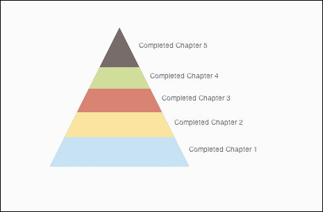
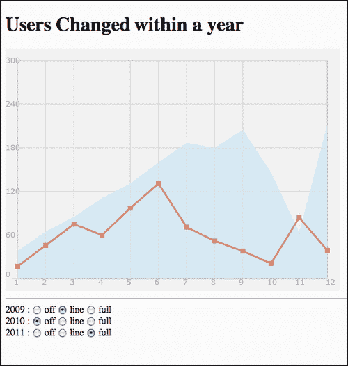
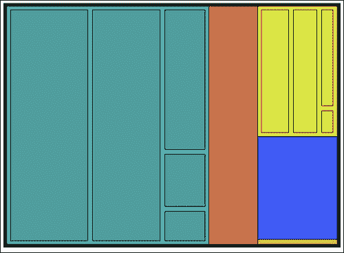
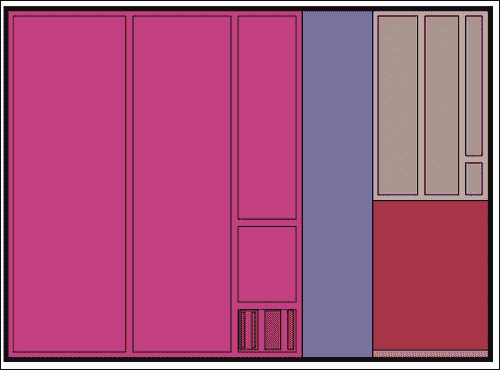
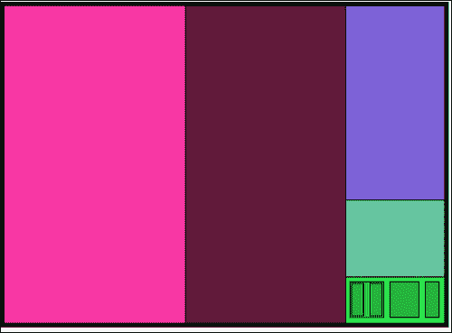
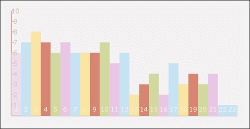

# 第五章：走出常规

在本章中，我们将涵盖：

+   通过漏斗（金字塔图表）

+   重新审视线条：使线状图表具有交互性

+   树状映射和递归

+   将用户交互添加到树状映射中

+   制作一个交互式点击计数器

# 介绍

我们已经涵盖了大多数标准图表的基础知识。在这个阶段，是时候让我们的图表变得更有创意了。从本章开始，我们将进入更具创意的、不常用的图表，并重新审视一些旧图表，将动态数据整合到它们中，或者改变它们的布局。

# 通过漏斗（金字塔图表）

很少见到动态创建的金字塔图表。在大多数情况下，它们是在设计和创意上进行完善，当它们到达网络时变成一个.jpg 文件，这正是我想以这个图表开始这一章的原因——它并不像听起来那么复杂。



金字塔图表本质上是一种让我们可视化数据变化的方式，这些数据本质上是定量的。它们在较低层和较高层之间有明确的关系。听起来很模糊，所以让我们通过一个例子来解释。

假设在某一年有 X 人完成了他们的第八年学校教育，如果我们跟随同一群人，四年后有多少人完成了他们的第十二年教育？好吧！我们无法知道答案，但我们知道的一件事是，它不可能超过最初的 X 人数。金字塔图表的概念正是这样一个数据体，随着时间或其他因素的变化，通过漏斗的数据越来越少。这是一个非常好的图表，可以比较教育水平、财务、政治参与等方面的情况。

## 准备工作

和往常一样，设置我们的 HTML 文件逻辑。如果需要关于如何启动 HTML 文件的复习，请回到第一章中的*使用 2D 画布进行图形处理*。

## 如何做... 

除了我们标准的 HTML 准备工作之外，我们需要想出我们希望展示的数据来源。让我们开始建立我们的金字塔。直接进入 JS 文件，让我们开始吧。

1.  对于我们的示例，我们将创建一个金字塔，以找出从第一章到第五章阅读本书的人中实际到达第五章的人数（这些数据是虚构的；我希望每个开始阅读的人都能到达那里！）。

```js
var layers = [{label:"Completed Chapter 1", amount:23},
  {label:"Completed Chapter 2", amount:15},
  {label:"Completed Chapter 3", amount:11},
  {label:"Completed Chapter 4", amount:7},
  {label:"Completed Chapter 5", amount:3} ];
```

1.  然后，提供一些图表和样式信息。

```js
var chartInfo= {height:200, width:200};

var s = { outlinePadding:4,
  barSize:16,
  font:"12pt Verdana, sans-serif",
  background:"eeeeee",
  stroke:"cccccc",
  text:"605050"
};
```

### 注意

注意，这是我们第一次区分我们希望画布的大小和图表（漏斗/三角形）的实际大小。另一个重要的事情是，为了使我们的示例在当前格式下工作，我们的三角形高度和宽度（底）必须相同。

1.  定义一些全局辅助变量。

```js
var wid;
var hei;
var totalPixels;
var totalData=0;
var pixelsPerData;
var currentTriangleHeight = chartInfo.height;
```

1.  现在是时候创建我们的`init`函数了。这个函数将在另一个函数的帮助下承担大部分的工作。

```js
function init(){
  var can = document.getElementById("bar");

  wid = can.width;
  hei = can.height;
  totalPixels = (chartInfo.height * chartInfo.width) / 2;
  for(var i in layers) totalData +=layers[i].amount;

  pixelsPerData = totalPixels/totalData;

  var context = can.getContext("2d");
  context.fillStyle = s.background;
  context.strokeStyle = s.stroke;

  context.translate(wid/2,hei/2 - chartInfo.height/2);

  context.moveTo(-chartInfo.width/2 , chartInfo.height);
  context.lineTo(chartInfo.width/2,chartInfo.height);
  context.lineTo(0,0);
  context.lineTo(-chartInfo.width/2 , chartInfo.height);

  for(i=0; i+1<layers.length; i++) findLine(context, layers[i].amount);

  context.stroke();
}
```

1.  我们的函数执行正常的设置并执行样式逻辑，然后创建一个三角形，然后找到正确的点（使用`findLine`函数）我们应该在哪里切割三角形：

```js
function findLine(context,val){
  var newHeight = currentTriangleHeight;
  var pixels = pixelsPerData * val;
  var lines = parseInt(pixels/newHeight); //rounded

  pixels = lines*lines/2; //missing pixels

  newHeight-=lines;

  lines += parseInt(pixels/newHeight);
  currentTriangleHeight-=lines;

  context.moveTo(-currentTriangleHeight/2 , currentTriangleHeight);
  context.lineTo(currentTriangleHeight/2,currentTriangleHeight);
}
```

这个函数根据当前线的数据找到我们三角形上的点。就是这样；现在是时候理解我们刚刚做了什么了。

## 它是如何工作的...

在`init`函数中设置了线条的代码之后，我们准备开始考虑我们的三角形。首先，我们需要找出在我们的三角形内的总像素数。

```js
totalPixels = (chartInfo.height * chartInfo.width) / 2;
```

这很容易，因为我们知道我们的高度和宽度，所以公式非常简单。下一个关键的数据点是总数据量。我们可以创建像素和数据之间的关系。

```js
for(var i in layers) totalData +=layers[i].amount;
```

因此，我们循环遍历所有的数据层，并计算所有数据点的总和。在这个阶段，我们已经准备好找出实际像素的数量。每个数据元素相当于：

```js
pixelsPerData = totalPixels/totalData;
```

设置了我们的描边和填充样式后，我们停下来考虑哪种最好的转换方式可以帮助我们构建我们的三角形。对于我们的三角形，我选择了顶边作为`0,0`点，创建了三角形后：

```js
context.translate(wid/2,hei/2 - chartInfo.height/2);

context.moveTo(-chartInfo.width/2 , chartInfo.height);
context.lineTo(chartInfo.width/2,chartInfo.height);
context.lineTo(0,0);
context.lineTo(-chartInfo.width/2 , chartInfo.height);
```

我们`init`函数的最后两行调用`layers`数组中每个元素的`findLine`方法：

```js
for(i=0; i+1<layers.length; i++) findLine(context, layers[i].amount);
context.stroke();
```

现在是时候深入了解`findLine`函数是如何找到创建线的点的。这个想法非常简单。基本思想是尝试找出完成三角形中像素数量需要多少条线。由于我们不是在建立数学公式，我们不在乎它是否 100%准确，但它应该足够准确以在视觉上工作。

## 还有更多...

让我们开始向我们的调色板引入颜色。

```js
var layers = [{label:"Completed Chapter 1", amount:23, style:"#B1DDF3"},  {label:"Completed Chapter 2", amount:15, style:"#FFDE89"},
  {label:"Completed Chapter 3", amount:11, style:"#E3675C"},
  {label:"Completed Chapter 4", amount:7, style:"#C2D985"},
  {label:"Completed Chapter 5", amount:3, style:"#999999"}];
```

好了，我们完成了简单的部分。现在，是时候重新调整我们的逻辑了。

### 使`findLine`更智能

为了能够创建一个封闭的形状，我们需要有一种改变绘制线的方向的方法，从右到左或从左到右，而不是让它总是朝一个方向。除此之外，我们现在正在使用`moveTo`，因此永远无法创建一个封闭的形状。我们实际上想要的是移动我们的点并绘制一条线：

```js
function findLine(context,val,isMove){
  var newHeight = currentTriangleHeight;
  var pixels = pixelsPerData * val;
  var lines = parseInt(pixels/newHeight); //rounded

  pixels = lines*lines/2; //missing pixels

  newHeight-=lines;

  lines += parseInt(pixels/newHeight);

  currentTriangleHeight-=lines;

 if(isMove){
    context.moveTo(currentTriangleHeight/2,currentTriangleHeight);
 context.lineTo(-currentTriangleHeight/2 , currentTriangleHeight);
 }else{
 context.lineTo(-currentTriangleHeight/2 , currentTriangleHeight);
 context.lineTo(currentTriangleHeight/2,currentTriangleHeight); 
 }
}
```

我们下一个问题是，我们不想改变实际的三角形高度，因为我们将调用这个函数的次数比过去多。为了解决这个问题，我们需要提取一些逻辑。我们将返回创建的新线的数量，这样我们就可以从三角形中外部删除它们。这个操作使我们对视觉有更精细的控制（当我们加入文本时这一点将很重要）。

```js
function findLine(context,val,isMove){
  var newHeight = currentTriangleHeight;
  var pixels = pixelsPerData * val;
  var lines = parseInt(pixels/newHeight); //rounded

  pixels = lines*lines/2; //missing pixels

  newHeight-=lines;

  lines += parseInt(pixels/newHeight);

 newHeight = currentTriangleHeight-lines;

 if(isMove){
 context.moveTo(newHeight/2,newHeight); 
 context.lineTo(-newHeight/2 , newHeight);
 }else{
 context.lineTo(-newHeight/2 , newHeight);
 context.lineTo(newHeight/2,newHeight); 
 }

return lines;
}
```

在这个阶段，我们的`findLine`函数非常智能，能够帮助我们创建封闭的形状，而不需要控制更多（因为它不会改变任何全局数据）。

### 更改`init`中的逻辑以创建形状

现在我们有了一个智能的`findLine`函数，是时候重新编写与在`init`函数中绘制线相关的逻辑了。

```js
var secHeight = 0;
  for(i=0;i<layers.length-1; i++){
    context.beginPath();
    findLine(context, 0,true);
    secHeight = findLine(context, layers[i].amount);
    currentTriangleHeight -= secHeight;
    context.fillStyle = layers[i].style;
    context.fill();	
  }

  context.beginPath();
  findLine(context, 0,true);
  context.lineTo(0,0);
  context.fillStyle = layers[i].style;
  context.fill();
```

首先，我们在循环中绘制所有元素，减去最后一个（因为我们的最后一个元素实际上是一个三角形而不是一条线）。然后，为了帮助我们隐藏我们的数学不准确性，每次循环开始时我们都创建一个新路径，并首先调用我们的`findLine`函数，没有新数据（在上次绘制线的地方绘制线，因为没有数据），然后绘制第二条线，这次使用真实的新数据。

我们对规则的例外是在循环之外创建的，在那里，我们只是手动绘制我们的形状，从最后一行开始，并将`0,0`点添加到它上面，覆盖我们的三角形。

### 将文本添加到我们的图表中

这将很简单，因为我们在调整三角形大小之前已经得到了线数。我们可以使用这些数据来计算我们想要定位文本字段变量的位置，所以让我们做吧：

```js
var secHeight = 0;
  for(i=0;i<layers.length-1; i++){
    context.beginPath();
    findLine(context, 0,true);
    secHeight = findLine(context, layers[i].amount);
    currentTriangleHeight -= secHeight;
    context.fillStyle = layers[i].style;
    context.fill();	
 context.fillStyle = s.text;
 context.fillText(layers[i].label, currentTriangleHeight/2 +secHeight/2, currentTriangleHeight+secHeight/2);
  }

  context.beginPath();
  findLine(context, 0,true);
  context.lineTo(0,0);
  context.fillStyle = layers[i].style;
  context.fill();
 context.fillStyle = s.text;
 context.fillText(layers[i].label, currentTriangleHeight/2 , currentTriangleHeight/2);

```

只需看一下在循环中绘制文本和在循环外绘制文本之间的区别。由于我们在循环中没有获取新的行数据，我们需要通过使用剩余三角形的总大小来改变点逻辑。

# 重温线条：使线图表交互

在这个食谱中，我们将回到我们早期的一个食谱，*在第三章*中创建基于笛卡尔的图表，并为其添加一些用户控制。这个控制使用户能够打开和关闭数据流。



## 准备工作

您需要采取的第一步是从第三章*创建基于笛卡尔坐标的图表*中获取源代码。我们将`03.05.line-revamp.html`和`03.05.line-revamp.js`重命名为`05.02.line-revisit`。

现在我们的文件已经更新，添加我们的 HTML 文件——三个单选按钮组来表示三个数据源（2009 年、2010 年和 2011 年）。

```js
<hr/>

  2009 : <input type="radio" name="i2009" value="-1" /> off
    <input type="radio" name="i2009" value="0" /> line
    <input type="radio" name="i2009" value="1" select="1" /> full<br/>
  2010 : <input type="radio" name="i2010" value="-1" /> off
    <input type="radio" name="i2010" value="0" /> line
    <input type="radio" name="i2010" value="1" select="1" /> full<br/>
  	2011 : <input type="radio" name="i2011" value="-1" /> off
    <input type="radio" name="i2011" value="0" /> line
    <input type="radio" name="i2011" value="1" select="1" /> full<br/>
```

请注意，我已经为每个单选按钮组添加了“i”以表示年份，并将可能的值设置为`-1`、`0`或`1`。

## 如何做...

执行以下步骤：

1.  创建一些常量（不会更改的变量），并设置以下三行，现在默认值已经分配：

```js
var HIDE_ELEMENT = -1;
var LINE_ELEMENT = 0;
var FILL_ELEMENT = 1;

var elementStatus={ i2009:FILL_ELEMENT,
  i2010:FILL_ELEMENT,
  i2011:FILL_ELEMENT};
```

1.  是时候将创建图表的逻辑移到一个单独的函数中。在初始化画布之后的所有内容都将被移出。

```js
var context;

function init(){
  var can = document.getElementById("bar");

  wid = can.width;
  hei = can.height;
  context = can.getContext("2d");

  drawChart();
}
```

1.  更新单选框以突出显示当前选定的内容，并为所有单选按钮添加`onchange`事件。

```js
function init(){
  var can = document.getElementById("bar");

  wid = can.width;
  hei = can.height;
  context = can.getContext("2d");

  drawChart();

  var radios ;
    for(var id in elementStatus){
      radios = document.getElementsByName(id);
      for (var rid in radios){
      radios[rid].onchange = onChangedRadio;
      if(radios[rid].value == elementStatus[id] )
      radios[rid].checked = true;	
    }
  }

}
```

1.  在我们的`drawChart`函数中进行一些更新。我们的目标是将新的控制器`elementStatus`纳入线条的绘制中。

```js
function drawChart(){
  context.lineWidth = 1;
  context.fillStyle = "#eeeeee";
  context.strokeStyle = "#999999";
  context.fillRect(0,0,wid,hei);
  context.font = "10pt Verdana, sans-serif";
  context.fillStyle = "#999999";

  context.moveTo(CHART_PADDING,CHART_PADDING);
  context.rect(CHART_PADDING,CHART_PADDING,wid-CHART_PADDING*2,hei-CHART_PADDING*2);
  context.stroke();
  context.strokeStyle = "#cccccc";
  fillChart(context,chartInfo);

  if(elementStatus.i2011>-1) addLine(context,formatData(a2011,   "/2011","#B1DDF3"),"#B1DDF3",elementStatus.i2011==1);
  if(elementStatus.i2010>-1) addLine(context,formatData(a2010, "/2010","#FFDE89"),"#FFDE89",elementStatus.i2010==1);
  if(elementStatus.i2009>-1) addLine(context,formatData(a2009, "/2009","#E3675C"),"#E3675C",elementStatus.i2009==1);

}
```

1.  最后但并非最不重要的是，让我们将逻辑添加到我们的`onChangedRadio`函数中。

```js
function onChangedRadio(e){	
  elementStatus[e.target.name] = e.target.value;
  context.clearRect(0,0,wid,hei);
  context.beginPath();
  drawChart();
}
```

就是这样！我们刚刚在图表中添加了用户交互。

## 它是如何工作的...

我们没有提前计划在此图表上进行用户交互。因此，我们需要重新审视它以更改一些逻辑。当 Canvas 绘制某物时，就是这样，它将永远存在！我们不能只删除一个对象，因为 Canvas 中没有对象，因此我们需要一种按需重新绘制的方法。为了实现这一点，我们需要从`init`函数中提取所有绘图逻辑，并创建`drawChart`函数。除了在函数末尾添加我们的逻辑之外，我们还需要添加函数的开始部分：

```js
context.lineWidth = 1;
```

尽管我们最初计算出用作背景宽度的默认值，在第二次重绘中，我们的画布仍然会保留其上次的大小（在我们的情况下可能是`3`），因此我们将其重置为原始值。

我们使用一个名为`elementStatus`的对象来存储图表上每条线的当前状态。它可以存储的值如下：

+   `-1`：不绘制

+   `0`：绘制无填充的线

+   `1`：绘制填充

因此，我们在函数末尾添加以下逻辑：

```js
if(elementStatus.i2011>-1) addLine(context,formatData(a2011, "/2011","#B1DDF3"),"#B1DDF3",elementStatus.i2011==1);
```

由于逻辑重复三次，让我们只关注其中一个。如果愿意，我们可以使用我们的常量变量使逻辑更容易查看。

```js
if(elementStatus.i2011!=HIDE_ELEMENT)
  addLine(context,formatData(a2011, "/2011","#B1DDF3"),"#B1DDF3",elementStatus.i2011==FILL_ELEMENT);
```

逻辑分解为第一个`if`语句，测试我们的内容是否应该隐藏。如果我们确定应该添加这行，我们通过将当前值与`FILL_ELEMENT`进行比较的结果发送到填充/线参数中来绘制它，根据此操作的结果有两种变化。

## 还有更多...

不幸的是，因为我们没有使用任何开源库，内置的 HTML 功能不允许我们为单选按钮组设置事件，因此我们需要找到它们并使用我们在`elementStatus`控制器中存储的 ID 为它们添加`onchange`事件。

```js
var radios ;
  for(var id in elementStatus){
    radios = document.getElementsByName(id);
    for (var rid in radios){
      radios[rid].onchange = onChangedRadio;
 if(radios[rid].value == elementStatus[id] ) radios[rid].checked = true; 
    }

  }
```

注意高亮显示的代码。在这里，我们正在检查当前单选按钮的值是否与`elementStatus`中的元素值匹配。如果是，这意味着单选按钮将被选中。

### 分解 onChangedRadio 的逻辑

让我们再来看看这个函数中的逻辑：

```js
elementStatus[e.target.name] = e.target.value;
```

我们要做的第一件事是将新选择的值保存到我们的`elementStatus`控制器中。

```js
context.clearRect(0,0,wid,hei);
```

接着我们清空画布上的所有内容。

```js
context.beginPath();
```

接下来，清空并开始一个新路径。

```js
drawChart();
```

然后开始重新绘制所有内容，我们在`elementStatus`中的新参数将验证正确的内容将被绘制。

## 另请参阅

+   第三章*创建基于笛卡尔坐标的图表*中的*构建线图*配方

# 树状映射和递归

树状映射使我们能够从鸟瞰视角深入了解数据。与比较图表相反——例如我们到目前为止创建的大多数图表——树状映射将树状结构的数据显示为一组嵌套的矩形，使我们能够可视化它们的数量特性和关系。



让我们从仅展示一级信息的树状映射开始。

## 准备工作

我们将从世界上的人数开始我们的应用程序，以百万为单位，按大陆划分（基于 2011 年的公共数据）。

```js
var chartData = [
  {name: "Asia", value:4216},
  {name: "Africa",value:1051},
  {name: "The Americas and the Caribbean", value:942},
  {name: "Europe", value:740},
  {name: "Oceania", value:37}
];
```

我们将在我们的示例中稍后更新这个数据源，所以请记住这个数据集是临时的。

## 如何做...

我们将从创建一个简单的、工作的、平面树状图开始。让我们直接开始，找出创建树状图所涉及的步骤：

1.  让我们在数据集的顶部添加一些辅助变量。

```js
var wid;
var hei;
var context;
var total=0;
```

1.  创建`init`函数。

```js
function init(){
  var can = document.getElementById("bar");

  wid = can.width;
  hei = can.height;
  context = can.getContext("2d");

  for(var item in chartData) total += chartData[item].value;

  context.fillRect(0,0,wid,hei);
  context.fillStyle = "RGB(255,255,255)";
  context.fillRect(5,5,wid-10,hei-10);
  context.translate(5,5);
  wid-=10;
  hei-=10;

  drawTreeMap(chartData);

}
```

1.  创建函数`drawTreeMap`。

```js
function drawTreeMap(infoArray){
  var percent=0;
  var cx=0;
  var rollingPercent = 0;
  for(var i=0; i<infoArray.length; i++){
    percent = infoArray[i].value/total;
    rollingPercent +=percent
    context.fillStyle = formatColorObject(getRandomColor(255));
    context.fillRect(cx,0 ,wid*percent,hei);
    cx+=wid*percent;
    if(rollingPercent > 0.7) break;

  }

  var leftOverPercent = 1-rollingPercent;
  var leftOverWidth = wid*leftOverPercent;
  var cy=0;
  for(i=i+1; i<infoArray.length; i++){
    percent = (infoArray[i].value/total)/leftOverPercent;
    context.fillStyle = formatColorObject(getRandomColor(255));
    context.fillRect(cx,cy ,leftOverWidth,hei*percent);
    cy+=hei*percent;
  }

}
```

1.  创建一些格式化函数来帮助我们为我们的树状映射块创建一个随机颜色。

```js
function formatColorObject(o){
  return "rgb("+o.r+","+o.g+","+o.b+")";
}

function getRandomColor(val){
  return {r:getRandomInt(255),g:getRandomInt(255),b:getRandomInt(255)};
}

function getRandomInt(val){
  return parseInt(Math.random()*val)+1
}
```

在创建这么多格式化函数时有点过度，它们的主要目标是在我们准备进行下一步时帮助我们——在我们的数据中创建更多深度（有关更多细节，请参阅本食谱中的*还有更多...*部分）。

## 它是如何工作的...

让我们从最初的想法开始。我们的目标是创建一个地图，展示我们矩形区域内更大的体积区域，并在一侧留下一条条带以展示较小的区域。所以，让我们从我们的`init`函数开始。我们的基本入门工作之外的第一个任务是计算实际总数。我们通过循环遍历我们的数据源来做到这一点，因此：

```js
for(var item in chartData) total += chartData[item].value;
```

我们继续设计一些东西，并且让我们的工作区比总画布大小小 10 像素。

```js
CONTEXT.FILLRECT(0,0,WID,HEI);
CONTEXT.FILLSTYLE = "RGB(255,255,255)";
CONTEXT.FILLRECT(5,5,WID-10,HEI-10);
CONTEXT.TRANSLATE(5,5);
WID-=10;
HEI-=10;

drawTreeMap(chartData);
```

是时候来看看我们的`drawTreeMap`函数是如何工作的了。首先要注意的是，我们发送一个数组而不是直接使用我们的数据源。我们这样做是因为我们希望这个函数在我们开始构建这种可视化类型的内部深度时可以被重复使用。

```js
function drawTreeMap(infoArray){...}
```

我们的函数从几个辅助变量开始（`percent`变量将存储循环中的当前`percent`值）。我们的矩形的`cx`（当前 x）位置和`rollingPercent`将跟踪我们的总图表完成了多少。

```js
var percent=0;
var cx=0;
var rollingPercent = 0;
```

是时候开始循环遍历我们的数据并绘制出矩形了。

```js
for(var i=0; i<infoArray.length; i++){
  percent = infoArray[i].value/total;
  rollingPercent +=percent
  context.fillStyle =
  formatColorObject(getRandomColor(255));
  context.fillRect(cx,0 ,wid*percent,hei);
  cx+=wid*percent;
```

在我们完成第一个循环之前，我们将测试它，看看我们何时越过我们的阈值（欢迎您调整该值）。当我们达到它时，我们需要停止循环，这样我们就可以开始按高度而不是宽度绘制我们的矩形。

```js
if(rollingPercent > 0.7) break;
}
```

在我们开始处理我们的框之前，它们占据了全部剩余的宽度并扩展到高度，我们需要一些辅助变量。

```js
var leftOverPercent = 1-rollingPercent;
var leftOverWidth = wid*leftOverPercent;
var cy=0;
```

从现在开始，我们需要根据剩余空间的大小计算每个元素，我们将计算值（`leftOverPercent`），然后我们将提取我们形状的剩余宽度，并启动一个新的`cy`变量来存储当前的 y 位置。

```js
for(i=i+1; i<infoArray.length; i++){
  percent = (infoArray[i].value/total)/leftOverPercent;
  context.fillStyle = formatColorObject(getRandomColor(255));
  context.fillRect(cx,cy ,leftOverWidth,hei*percent);
  cy+=hei*percent;
}
```

我们从比我们离开的值高一个值开始我们的循环（因为我们在之前的循环中打破了它之前，我们没有机会更新它的值并绘制到我们剩余区域的高度。

请注意，在两个循环中我们都使用了`formatColorObject`和`getRandomColor`。这些函数的分解是为了让我们在下一部分中更容易操纵返回的颜色。

## 还有更多...

为了使我们的图表真正具有额外的功能，我们需要一种方法来使它能够以至少第二个较低级别的数据显示数据的方式。为此，我们将重新审视我们的数据源并对其进行重新编辑：

```js
var chartData = [
  {name: "Asia", data:[
    {name: "South Central",total:1800},
    {name: "East",total:1588},
    {name: "South East",total:602},
    {name: "Western",total:238},
    {name: "Northern",total:143}
  ]},
  {name: "Africa",total:1051},
  {name: "The Americas and the Caribbean", data:[
    {name: "South America",total:396},
    {name: "North America",total:346},
    {name: "Central America",total:158},
    {name: "Caribbean",total:42}
  ]},
  {name: "Europe", total:740},
  {name: "Oceania", total:37}
];
```

现在我们有了世界上两个地区的更深入的子地区的视图。是时候修改我们的代码，使其能够再次处理这些新数据了。

### 更新`init`函数——重新计算总数

在`init`函数中，我们需要执行的第一步是用一个新的循环替换当前的总循环，这个新循环可以深入到元素中计算真正的总数。

```js
var val;
var i;
for(var item in chartData) {
  val = chartData[item];
  if(!val.total && val.data){
    val.total = 0;
    for( i=0; i<val.data.length; i++)
    val.total+=val.data[i].total;
  }

  total += val.total;
}
```

实质上，我们正在检查是否没有总数，以及是否有数据源。如果是这样，我们就开始一个新的循环来计算我们元素的实际总数——现在您可以尝试将这个逻辑变成一个递归函数（这样您就可以有更多层的数据）。

接下来，我们将更改`drawTreeMap`并准备将其变成一个递归函数。为了实现这一点，我们需要从中提取全局变量，并将它们作为函数的参数发送。

```js
drawTreeMap(chartData,wid,hei,0,0,total);
```

### 将 drawTreeMap 转换为递归函数

让我们更新我们的函数以启用递归操作。我们首先添加一个额外的新参数来捕获最新的颜色。

```js
function drawTreeMap(infoArray,wid,hei,x,y,total,clr){
  var percent=0;
  var cx=x ;
  var cy=y;

  var pad = 0;
  var pad2 = 0;

  var rollingPercent = 0;
  var keepColor = false;
 if(clr){ //keep color and make darker
 keepColor = true;
 clr.r = parseInt(clr.r *.9);
 clr.g = parseInt(clr.g *.9);
 clr.b = parseInt(clr.b *.9);
 pad = PAD*2; 
 pad2 = PAD2*2;
 }

```

如果我们传递了一个`clr`参数，我们需要在所有新创建的矩形中保持该颜色，并且我们需要在形状周围添加一些填充，以便更容易看到它们。我们还通过减去其所有 RGA 属性的 10%使颜色变暗一点。

下一步是添加填充和递归逻辑。

```js
for(var i=0; i<infoArray.length; i++){
  percent = infoArray[i].total/total;
  rollingPercent +=percent
 if(!keepColor){
 clr = getRandomColor(255);
 }

 context.fillStyle = formatColorObject(clr);
 context.fillRect(cx+pad ,cy+pad ,wid*percent - pad2,hei-pad2);
 context.strokeRect(cx+pad ,cy+pad ,wid*percent - pad2,hei-pad2);
 if(infoArray[i].data){
 drawTreeMap(infoArray[i].data,parseInt(wid*percent - PAD2),hei - PAD2,cx+ PAD,cy + PAD,infoArray[i].total,clr);
 }
  cx+=wid*percent;
  if(rollingPercent > 0.7) break;

}
```

同样的逻辑也在第二个循环中实现了（查看源文件以了解详情）。

### 将数据和总数转换为递归数据

让我们首先更新我们的树数据，使其真正递归（完整数据集请参考源代码）。

```js
...
{name: "Asia", data:[
  {name: "South Central",total:1800},
  {name: "East",total:1588},
  {name: "South East",total:602},
  {name: "Western",total:238},
  {name: "Northern",data:[{name: "1",data:[
    {name: "2",total:30},
    {name: "2",total:30}
  ]},
  {name: "2",total:53},
  {name: "2",total:30}
]}  ...
```

现在，我们有一个具有四个以上信息级别的树状图，我们可以重新审视我们的代码，并解决我们最后的问题，验证我们的总数在所有级别上始终是最新的。为了解决这个问题，我们将计算总数的逻辑提取到一个新函数中，并更新`init`函数中的`total`行。

```js
function init(){
  var can = document.getElementById("bar");

  wid = can.width;
  hei = can.height;
  context = can.getContext("2d");

  total = calculateTotal(chartData); //recursive function
...
```

是时候创建这个神奇的（递归）函数了。

```js
function calculateTotal(chartData){
  var total =0;
  var val;
  var i;
  for(var item in chartData) {
    val = chartData[item];
    if(!val.total && val.data)
      val.total = calculateTotal(val.data);

    total += val.total;
  }

return total;

}
```

逻辑与以前非常相似，唯一的区别是所有数据条目都是函数内部的，并且每次需要处理另一层数据时，它都会以递归的方式重新发送到同一个函数中，直到所有数据都解析完毕——直到它返回总数。

## 另请参阅

+   *将用户交互添加到树映射*教程

# 将用户交互添加到树映射

到目前为止，我们在示例中限制了用户的交互。在我们最后的一个示例中，我们以一种受控的方式添加和删除图表元素；在这个示例中，我们将使用户能够深入图表并通过创建一个真正无尽的体验来查看更多细节（如果我们只有无尽的数据可以挖掘）。

在下图中，左侧是初始状态，右侧是用户点击一次后的状态（图表重新绘制以展示被点击的区域）。



考虑当用户点击图表时的情况（例如，点击左侧矩形后生成的下一张图片——树状图将更新并放大到该区域）。



## 准备工作

为了正确使用这个示例，您需要从我们上一个教程*树映射和递归*开始，并调整它以适应这个示例。

## 如何做...

这是我们的第一个示例，我们使我们的画布区域具有交互性。在接下来的几步中，我们将从上一个示例中添加一些逻辑到我们的教程中，以使用户能够放大或缩小它：

1.  新增一个全局变量，

```js
var currentDataset;
```

1.  存储发送到树映射函数的当前数据。

```js
currentDataset = chartData;
drawTreeMap(chartData,wid,hei,0,0,total);
```

1.  在我们的画布区域添加一个`click`事件。

```js
can.addEventListener('click', onTreeClicked, false);
```

1.  创建`onTreeClick`事件。

```js
function onTreeClick(e) {
  var box;
  for(var item in currentDataset){
    if(currentDataset[item].data){
      box = currentDataset[item].box;
      if(e.x>= box.x && e.y>= box.y &&
      e.x<= box.x2 && e.y<= box.y2){
        context.clearRect(0,0,wid,hei);
        drawTreeMap(currentDataset[item].data,wid,hei,0,0,currentDataset[item].total);
        currentDataset = currentDataset[item].data;

      break;
      }

    }
  }
}
```

1.  在`drawTreemap`中两次绘制矩形——第一次在第一个循环中，第二次在第二个循环中。让我们用一个外部函数来替换它——替换绘制矩形的`for`循环行：

```js
drawRect(cx+pad ,cy+pad ,wid*percent – pad2,hei-pad2,infoArray[i]);
```

1.  是时候创建矩形函数了。

```js
function drawRect(x,y,wid,hei,dataSource){
  context.fillRect(x,y,wid,hei);
  context.strokeRect(x,y,wid,hei);
  dataSource.box = {x:x,y:y,x2:x+wid,y2:y+hei};

}
```

就是这样！我们有一个完全功能的、深层次的、与用户无限交互的图表（只取决于我们有多少数据）。

## 它是如何工作的...

Canvas 元素目前不支持与对象交互的智能方式。由于画布中没有对象，一旦创建元素，它就会变成位图，并且其信息将从内存中删除。幸运的是，我们的示例是由矩形构成的，这样就更容易识别我们点击的元素。我们需要在内存中存储我们绘制的每个元素的当前框位置。

因此，我们逻辑的第一步是我们在步骤 6 中做的最后一件事。我们想捕获构成我们矩形的点，这样在我们的`click`事件中，我们就可以弄清楚我们的点与矩形的关系：

```js
function onTreeClick(e) {
   var box;
  for(var item in currentDataset){
    if(currentDataset[item].data){
```

我们循环遍历我们的数据源（当前的数据源），并检查我们当前所在的元素是否有数据源（即子元素）；如果有，我们继续，如果没有，我们将跳过下一个元素来测试它。

现在我们知道我们的元素有子元素，我们准备看看我们的点是否在元素的范围内。

```js
box = currentDataset[item].box;
if(e.x>= box.x && e.y>= box.y &&
   e.x<= box.x2 && e.y<= box.y2){
```

如果是，我们准备重新绘制树状图，并用当前更深的数据集替换我们当前的数据集。

```js
context.clearRect(0,0,wid,hei);
drawTreeMap(currentDataset[item].data,wid,hei,0,0,currentDataset[item].total);
currentDataset = currentDataset[item].data;

break;
```

然后我们退出循环（使用`break`语句）。请注意，我们做的最后一件事是更新`currentDataset`，因为我们仍然需要从中获取信息以将总数据发送到`drawTreeMap`。当我们使用完它后，我们准备用新的数据集覆盖它（之前的子元素变成了下一轮的主要参与者）。

## 还有更多...

目前，没有办法在不刷新一切的情况下返回。因此，让我们添加到我们的逻辑中，如果用户点击没有子元素的元素，我们将恢复到原始地图。

### 回到主要的树状图

让我们将以下代码添加到`click`事件中：

```js
function onTreeClick(e) {
   var box;
  for(var item in currentDataset){
    if(currentDataset[item].data){
      box = currentDataset[item].box;
      if(e.x>= box.x && e.y>= box.y &&
      e.x<= box.x2 && e.y<= box.y2){
        context.clearRect(0,0,wid,hei);
        drawTreeMap(currentDataset[item].data,wid,hei,0,0,currentDataset[item].total);
        currentDataset = currentDataset[item].data;

      break;
      }

    }else{
      currentDataset = chartData;
      drawTreeMap(chartData,wid,hei,0,0,total);

    }
  }
}
```

太棒了！我们刚刚完成了为用户创建一个完全互动的体验，现在轮到你来让它看起来更好一些了。添加一些悬停标签和所有可视化效果，这将使您的图表在视觉上更加愉悦，并有助于理解。

# 创建一个交互式点击计量器

在下一个示例中，我们将专注于客户端编程的一个更强大的特性——与用户交互的能力和动态更新数据的能力。为了简单起见，让我们重新访问一个旧图表——第三章中的条形图，*创建基于笛卡尔坐标的图表*——并集成一个计数器，它将计算用户在任何给定秒内点击 HTML 文档的次数，并相应地更新图表。



## 如何做...

大部分步骤都会很熟悉，如果你曾经在第三章中的条形图上工作过，*创建基于笛卡尔坐标的图表*。因此，让我们运行它们，然后专注于新的逻辑：

1.  让我们创建一些辅助变量。

```js
var currentObject = {label:1,
  value:0,
  style:"rgba(241, 178, 225, .5)"};
  var colorOptions = ["rgba(241, 178, 225, 1)","#B1DDF3","#FFDE89","#E3675C","#C2D985"];

  var data = [];

var context;
var wid;
var hei;
```

1.  接下来是我们的`init`函数。

```js
function init(){

  var can = document.getElementById("bar");
  wid = can.width;
  hei = can.height;

  context = can.getContext("2d");

  document.addEventListener("click",onClick);
  interval = setInterval(onTimeReset,1000);
  refreshChart();
}
```

1.  现在是时候创建`onTimeReset`函数了。

```js
function onTimeReset(){
  if(currentObject.value){
    data.push(currentObject);
    if(data.length>25) data = data.slice(1);
    refreshChart();	
  }
  currentObject = {label:currentObject.label+1, value:0, style: colorOptions[currentObject.label%5]};

}
```

1.  下一步是创建`onClick`监听器。

```js
function onClick(e){
  currentObject.value++;
  refreshChart();
}
```

1.  现在创建`refreshChart`函数。

```js
function refreshChart(){
  var newData = data.slice(0);
  newData.push(currentObject);

  drawChart(newData);
}
```

1.  最后但并非最不重要的是，让我们创建`drawChart`（它的大部分逻辑与第三章中讨论的`init`函数相同，*创建基于笛卡尔坐标的图表*）。

```js
function drawChart(data){
  context.fillStyle = "#eeeeee";
  context.strokeStyle = "#999999";
  context.fillRect(0,0,wid,hei);

  var CHART_PADDING = 20;

  context.font = "12pt Verdana, sans-serif";
  context.fillStyle = "#999999";

  context.moveTo(CHART_PADDING,CHART_PADDING);
  context.lineTo(CHART_PADDING,hei-CHART_PADDING);
  context.lineTo(wid-CHART_PADDING,hei-CHART_PADDING);

  var stepSize = (hei - CHART_PADDING*2)/10;
  for(var i=0; i<10; i++){
    context.moveTo(CHART_PADDING, CHART_PADDING + i*stepSize);
    context.lineTo(CHART_PADDING*1.3,CHART_PADDING + i*stepSize);
    context.fillText(10-i, CHART_PADDING*1.5, CHART_PADDING + i*	stepSize + 6);
  }
  context.stroke();

  var elementWidth =(wid-CHART_PADDING*2)/ data.length;
  context.textAlign = "center";
  for(i=0; i<data.length; i++){
    context.fillStyle = data[i].style;
    context.fillRect(CHART_PADDING +elementWidth*i ,hei-CHART_PADDING - data[i].value*stepSize,elementWidth,data[i].value*stepSize);
    context.fillStyle = "rgba(255, 255, 225, 0.8)";
    context.fillText(data[i].label, CHART_PADDING +elementWidth*(i+.5), hei-CHART_PADDING*1.5);

  }
}
```

就是这样！我们有一个交互式图表，它将每秒更新一次，取决于您在 1 秒内点击鼠标的次数——我假设没有人可以在一秒内点击超过 10 次，但我已经成功做到了（使用两只手）。

## 它是如何工作的...

让我们专注于第三章中数据变量的分解，*创建基于笛卡尔的图表*。我们之前在数据对象中准备好了所有数据。这一次，我们保持数据对象为空，而是将一个数据行放在一个单独的变量中。

```js
var currentObject = {label:1,
  value:0,
  style:"rgba(241, 178, 225, .5)"};
var data = [];
```

每次用户点击时，我们都会更新`currentObject`的计数器，并刷新图表，从而使用户体验更加动态和实时。

```js
function onClick(e){
  currentObject.value++;
  refreshChart();
}
```

我们在`init`函数中设置间隔如下：

```js
interval = setInterval(onTimeReset,1000);
```

每秒钟，函数都会检查用户在那段时间内是否有任何点击，如果有，它会确保我们将`currentObject`推入数据集中。如果数据集的大小大于`25`，我们就会将其中的第一项删除，并刷新图表。无论我们创建什么，一个新的空对象都会被标记上显示当前时间的新标签。

```js
function onTimeReset(){
  if(currentObject.value){
    data.push(currentObject);
    if(data.length>25) data = data.slice(1);
    refreshChart();
}
  currentObject = {label:currentObject.label+1, value:0, style: colorOptions[currentObject.label%5]};

}
```

在我们结束这个示例之前，你应该看一下最后一件事：

```js
function refreshChart(){
  var newData = data.slice(0);
  newData.push(currentObject);

  drawChart(newData);

}
```

我们逻辑的这一部分真的是让我们能够在用户点击按钮时更新数据的关键。我们想要有一个新的数组来存储新数据，但我们不希望当前元素受到影响，所以我们通过将新数据对象添加到其中来复制数据源，然后将其发送到创建图表。
