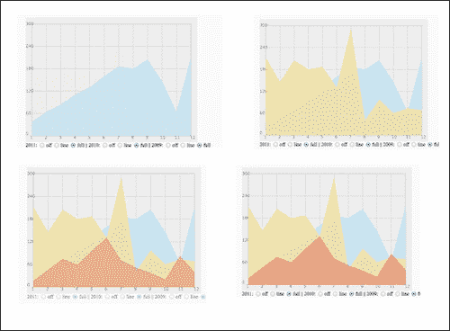
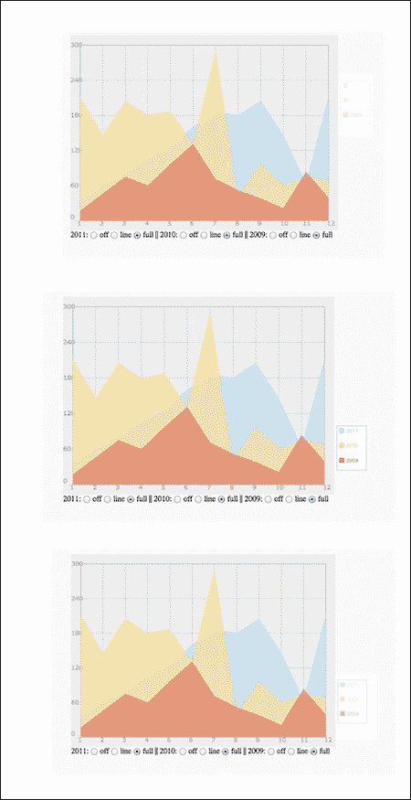
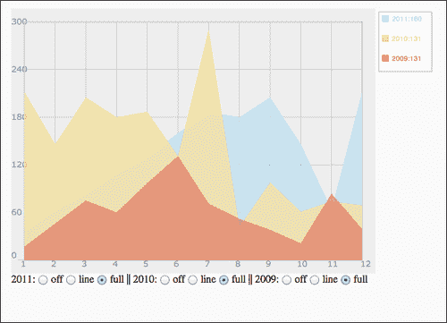

# 第六章：将静态事物变得生动起来

在本章中，我们将涵盖以下主题：

+   堆叠图形层

+   转向面向对象的视角

+   动画独立层

+   添加一个交互式图例

+   创建一个上下文感知的图例

# 介绍

到目前为止，保持组织和清洁的重要性并不像完成我们的项目那样重要，因为我们的项目相对较小。本章将通过首先使一切都变得动态，然后创建一个更面向对象的程序，使我们更容易分离任务并减少我们的代码量，为我们带来一些新的习惯。经过所有这些辛苦的工作，我们将重新审视我们的应用程序，并开始添加额外的逻辑，以使我们的应用程序逐层动画化。

本章是重构实践的一个很好的资源。在本章的前半部分，我们将专注于改进我们的代码结构，以使我们能够在本章的后半部分拥有我们需要的控制水平。

# 堆叠图形层

在我们可以在画布上进行任何真正的动画之前，我们真的需要重新思考在一个画布层上构建一切的概念。一旦画布元素被绘制，就非常难以对其进行微小的细微变化，比如特定元素的淡入效果。我们将重新访问我们的一个著名图表，柱状图，我们在早期章节中多次玩耍和增强。在本章中，我们的目标将是打破逻辑并使其更加模块化。在这个配方中，我们将分离层。每一层都将在我们准备好进行动画时给我们更多的控制。

## 准备工作

首先从上一章中获取最新的文件：`05.02.line-revisit.html`和`05.02.line-revisit.js`。

## 如何做...

对 HTML 文件进行以下更改：

1.  更新 HTML 文件以包含更多的画布元素（每个绘制线条一个）：

```js
<body onLoad="init();" style="background:#fafafa">
    <h1>Users Changed between within a year</h1>
    <div class="graphicLayers" >
      <canvas id="base" class="canvasLayer" width="550" height="400"> </canvas>

      <canvas id="i2011" class="canvasLayer" width="550" height="400"> </canvas>
      <canvas id="i2010" class="canvasLayer" width="550" height="400"> </canvas>
      <canvas id="i2009" class="canvasLayer" width="550" height="400"> </canvas>

  </div>
  <div class="controllers">
  2009 : <input type="radio" name="i2009" value="-1" /> off
        <input type="radio" name="i2009" value="0" /> line
        <input type="radio" name="i2009" value="1" select="1" /> full ||
    2010 : <input type="radio" name="i2010" value="-1" /> off
        <input type="radio" name="i2010" value="0" /> line
        <input type="radio" name="i2010" value="1" select="1" /> full ||
    2011 : <input type="radio" name="i2011" value="-1" /> off
        <input type="radio" name="i2011" value="0" /> line
        <input type="radio" name="i2011" value="1" select="1" /> full
  </div>
</body>
</html>
```

1.  添加一个 CSS 脚本，使层叠起来：

```js
<head>
    <title>Line Chart</title>
    <meta charset="utf-8" />
    <style>
    .graphicLayers {
    	position: relative;	
    	left:100px
    }

    .controllers {
      position: relative;	
      left:100px;
      top:400px;

    }

    .canvasLayer{
      position: absolute; 
      left: 0; 
      top: 0; 
    }
    </style>
  <script src="img/06.01.layers.js"></script>		
  </head>
```

让我们进入 JavaScript 文件进行更新。

1.  添加一个`window.onload`回调函数（在代码片段中突出显示的更改）：

```js
window.onload = init;

function init(){
```

1.  从全局范围中删除变量`context`（删除高亮显示的代码片段）：

```js
var CHART_PADDING = 20;
var wid;
var hei;
var context;

```

1.  将所有柱线信息合并到一个对象中，以便更容易控制（删除所有高亮显示的代码片段）：

```js
var a2011 = [38,65,85,111,131,160,187,180,205,146,64,212];
var a2010 = [212,146,205,180,187,131,291,42,98,61,74,69];
var a2009 = [17,46,75,60,97,131,71,52,38,21,84,39];

var chartInfo= { y:{min:0, max:300, steps:5,label:"users"},
        x:{min:1, max:12, steps:11,label:"months"}
      };

var HIDE_ELEMENT = -1;
var LINE_ELEMENT = 0;
var FILL_ELEMENT = 1;

var elementStatus={i2009:FILL_ELEMENT,i2010:FILL_ELEMENT,i2011:FILL_ELEMENT};

var barData = {
        i2009:{
          status:	FILL_ELEMENT,
          style: "#E3675C",
          label: "/2009",
          data:[17,46,75,60,97,131,71,52,38,21,84,39]
        },
        i2010:{
          status:	FILL_ELEMENT,
          style: "#FFDE89",
          label: "/2010",
          data:[212,146,205,180,187,131,291,42,98,61,74,69]
        },
        i2011:{
          status:	FILL_ELEMENT,
          style: "#B1DDF3",
          label: "/2011",
          data:[38,65,85,111,131,160,187,180,205,146,64,212]
        }

      };
```

1.  从`init`函数中删除所有画布逻辑，并将其添加到`drawChart`函数中：

```js
function init(){
  var can = document.getElementById("bar");

  wid = can.width;
  hei = can.height;
  context = can.getContext("2d");

  drawChart();

  var radios ;
  for(var id in elementStatus){
    radios = document.getElementsByName(id);
    for (var rid in radios){
       radios[rid].onchange = onChangedRadio;
      if(radios[rid].value == elementStatus[id] ) radios[rid].checked = true;	 
    }

  }

}

function drawChart(){
 var can = document.getElementById("base");

 wid = can.width;
 hei = can.height;
 var context = can.getContext("2d");
...
```

1.  在`init`函数中更新对新数据对象的引用：

```js
function init(){
  drawChart();

  var radios ;
 for(var id in barData){
    radios = document.getElementsByName(id);
    for (var rid in radios){
       radios[rid].onchange = onChangedRadio;
 if(radios[rid].value == barData[id].status ) radios[rid].checked = true; 
    }

  }

}
```

1.  在`drawChart`函数中，将线条创建的逻辑提取到一个外部函数中（删除高亮显示的代码片段）：

```js
 if(elementStatus.i2011>-1) addLine(context,formatData(a2011, "/2011","#B1DDF3"),"#B1DDF3",elementStatus.i2011==1);
 if(elementStatus.i2010>-1) addLine(context,formatData(a2010, "/2010","#FFDE89"),"#FFDE89",elementStatus.i2010==1);
 if(elementStatus.i2009>-1) addLine(context,formatData(a2009, "/2009","#E3675C"),"#E3675C",elementStatus.i2009==1);
  changeLineView("i2011",barData.i2011.status);
  changeLineView("i2010",barData.i2010.status);
  changeLineView("i2009",barData.i2009.status);
```

1.  更改`onChangedRadio`回调函数中的逻辑。让它触发对`changeLineView`函数的调用（我们将在下面创建该函数）：

```js
function onChangedRadio(e){
  changeLineView(e.target.name,e.target.value);
}
```

1.  创建函数`changeLineView`：

```js
function changeLineView(id,value){
  barData[id].status = value;
  var dataSource = barData[id];

  can = document.getElementById(id);
  context = can.getContext("2d");
  context.clearRect(0,0,wid,hei);
  if( dataSource.status!=HIDE_ELEMENT){
    context.beginPath();
    addLine(context,formatData(dataSource.data, dataSource.label,dataSource.style),dataSource.style,dataSource.status==1);
  }
}
```

在所有这些更改之后运行 HTML 文件，你应该看到与我们在开始所有这些更改之前看到的完全相同的东西。如果是这样，那么你就处于一个很好的位置。然而，我们目前还看不到任何变化。

## 工作原理...

这个配方的核心是我们的 HTML 文件，它使我们能够将画布元素层叠在彼此之上，由于我们的画布默认是透明的，我们可以看到它下面的元素。在我们的画布上叠加了四个层之后，是时候将我们的背景与线条分开了，因此我们希望将所有的图表背景信息都放在基础画布中：

```js
var can = document.getElementById("base");
```

对于每个线条层，我们使用一个预先配置的画布元素，它已经设置好：

```js
changeLineView("i2011",barData.i2011.status);
changeLineView("i2010",barData.i2010.status);
changeLineView("i2009",barData.i2009.status); 
```

第一个参数既是我们画布的 ID，也是我们在存储线条信息的新对象中使用的键（以保持我们的代码简洁）：

```js
var barData = {
        i2009:{...},
        i2010:{...},
        i2011:{...}	

      };
```

在这个数据对象中，我们有与画布中完全相同数量的元素，名称也完全相同。这样我们就可以非常容易地获取信息，而不需要使用额外的变量或条件。这与创建/更新线条的逻辑相关：

```js
function changeLineView(id,value){
  barData[id].status = value;
  var dataSource = barData[id];

  can = document.getElementById(id);
  context = can.getContext("2d");
  context.clearRect(0,0,wid,hei);
  if( dataSource.status!=HIDE_ELEMENT){
    context.beginPath();
    addLine(context,formatData(dataSource.data, dataSource.label,dataSource.style),dataSource.style,dataSource.status==1);
  }
}
```

我们没有改变我们线条的核心逻辑，而是将逻辑重定向到当前线条的上下文中：

```js
can = document.getElementById(id);
```

这样我们就可以提取任何直接提及年份或元素的提及，而不直接引用元素名称。这样我们可以添加或删除元素，我们只需要在 HTML 文件中添加另一个画布，添加新属性，并在创建函数中添加线条。这仍然很多，那么在继续前进到更有创意的领域之前，我们如何继续优化这段代码呢？

## 还有更多...

我们这个食谱的最终目标是帮助最小化用户需要进行的更改线条的步骤数量。目前，要添加更多线条，用户需要在三个地方进行更改。接下来的一些优化技巧将帮助我们减少添加/删除线条所需的步骤数量。

### 优化`drawChart`函数

我们的`drawChart`函数经历了一次改头换面，但是现在，当我们创建我们的线条时，我们仍然直接引用我们当前的元素：

```js
  changeLineView("i2011",barData.i2011.status);
  changeLineView("i2010",barData.i2010.status);
  changeLineView("i2009",barData.i2009.status);
```

相反，让我们利用`barData`对象并使用该对象的数据键。这样我们完全可以避免直接引用我们的显式元素的需要，而是依赖于我们的数据源作为信息来源：

```js
  for(var id in barData){
    changeLineView(id,barData[id].status);
  }
```

完美！现在我们`barData`对象中的任何更改都将定义在应用程序启动时最初呈现的元素。我们刚刚减少了用户需要进行的更改次数到两次。

### 进一步简化我们的代码

我们现在比刚开始时要好得多。最初，我们的代码中有三个地方直接引用了图表信息的硬编码值。在最后一次更新中，我们将其减少到了两个（一次在 HTML 文件中，一次在数据源中）。

现在是时候删除另一个硬编码的实例了。让我们删除我们额外的画布，并动态创建它们。

所以让我们从 HTML 文件中删除我们的图表画布元素，并为我们的`<div>`标签设置一个 ID（删除突出显示的代码片段）：

```js
<div id="chartContainer" class="graphicLayers" >
      <canvas id="base" class="canvasLayer" width="550" height="400"> </canvas>

 <canvas id="i2011" class="canvasLayer" width="550" height="400">      </canvas>
 <canvas id="i2010" class="canvasLayer" width="550" height="400">      </canvas>
 <canvas id="i2009" class="canvasLayer" width="550" height="400">      </canvas>

  </div>
```

顺便说一句，我们为包含图层的`<div>`添加了一个 ID，这样我们就可以在 JavaScript 中轻松访问它并进行更改。

现在我们的图层没有任何画布，我们希望在第一次绘制图表时动态创建它们（这发生在`drawChart`函数中，我们刚刚在*优化`drawChart`函数*部分中创建的新`for`循环中）：

```js
var chartContainer = document.getElementById("chartContainer");

  for(var id in barData){
 can = document.createElement("canvas");
 can.id=id;
 can.width=wid;
 can.height=hei; 
 can.setAttribute("class","canvasLayer");
 chartContainer.appendChild(can);

    changeLineView(id,barData[id].status);

  }

}
```

刷新您的 HTML 文件，您会发现我们的画布元素看起来和以前一样。我们还有最后一件事要解决，那就是我们的控制器，它们目前在 HTML 文件中是硬编码的。

### 动态创建单选按钮

另一个可以是动态的部分是我们创建单选按钮。所以让我们从 HTML 文件中删除单选按钮，并为我们的包装器添加一个 ID（删除突出显示的代码片段）：

```js
<div id="chartContainer" class="controllers">
 2009 : <input type="radio" name="i2009" value="-1" /> off
 <input type="radio" name="i2009" value="0" /> line
 <input type="radio" name="i2009" value="1" select="1" /> full ||
 2010 : <input type="radio" name="i2010" value="-1" /> off
 <input type="radio" name="i2010" value="0" /> line
 <input type="radio" name="i2010" value="1" select="1" /> full ||
 2011 : <input type="radio" name="i2011" value="-1" /> off
 <input type="radio" name="i2011" value="0" /> line
 <input type="radio" name="i2011" value="1" select="1" /> full
  </div>
```

回到我们的 HTML 文件，让我们创建一个创建新单选按钮的函数。我们将其称为`appendRadioButton`函数：

```js
function appendRadioButton(container, id,value,text){
  var radioButton = document.createElement("input");
  radioButton.setAttribute("type", "radio");
  radioButton.setAttribute("value", value);
  radioButton.setAttribute("name", id);

  container.appendChild(radioButton);

  container.innerHTML += text;
}
```

最后但同样重要的是在我们开始与它交互之前绘制我们的新按钮：

```js
function init(){
  drawChart();

 var radContainer = document.getElementById("controllers");

 var hasLooped= false;
 for(var id in barData){

 radContainer.innerHTML += (hasLooped ? " || ":"") + barData[id].label +": " ;

 appendRadioButton(radContainer,id,-1," off ");
 appendRadioButton(radContainer,id,0," line ");
 appendRadioButton(radContainer,id,1," full ");
 hasLooped = true;

 }

  var radios ;
  for(id in barData){
    radios = document.getElementsByName(id);
    for (var i=0; i<radios.length; i++){
       radios[i].onchange = onChangedRadio;
      if(radios[i].value == barData[id].status ){
         radios[i].checked = true;	 
      }
    }
  }

}
```

请注意，我们没有将两个`for`循环整合在一起。尽管看起来可能是一样的，但分离是必要的。JavaScript 需要一些时间，几纳秒，才能将元素实际呈现到屏幕上，因此通过分离我们的循环，我们给浏览器一个机会来追赶。创建元素和操作元素之间的分离主要是为了让 JavaScript 有机会在与创建的元素交互之前呈现 HTML 文件。

干得好！我们刚刚完成了更新我们的内容，使其完全动态化。现在一切都通过一个位置控制，即数据源，我们准备开始在接下来的食谱中探索分层画布逻辑。

# 转向面向对象的视角

我们的应用程序一直在不断发展。现在是时候通过将我们的图表更改为更符合面向对象编程的方式来停止了。在这个食谱中，我们将进一步清理我们的代码，并将其中一些转换为对象。我们将继续从上一个食谱*堆叠图形层*中离开的地方继续。

## 准备工作

第一步是获取我们的最新源文件：`06.01.layers.optimized.html`和`06.01.layers.optimized.js`。我们将重命名它们并添加我们的动画逻辑。除了在我们的 HTML 文件中更改引用之外，我们不会在 HTML 文件中做任何其他更改，而是将注意力集中在 JavaScript 文件中。

在 JavaScript 中创建对象的最简单方法之一是使用函数。我们可以创建一个函数，并在函数名称中引用`this`，通过这样做，我们可以将函数视为对象（有关更多详细信息，请参阅本食谱的*工作原理...*部分）。

## 如何做...

让我们立即开始将我们的代码转换为更符合面向对象编程的方式：

1.  我们从 JavaScript 文件开始进行代码更改。创建`LineChart`构造方法：

```js
function LineChart(chartInfo,barData){
  this.chartInfo = chartInfo;
  this.barData = barData;

  this.HIDE_ELEMENT = -1;
  this.LINE_ELEMENT = 0;
  this.FILL_ELEMENT = 1;
  this.CHART_PADDING = 20;

  this.wid;
  this.hei;

  drawChart();

  var radContainer = document.getElementById("controllers");

  var hasLooped= false;
  for(var id in barData){

    radContainer.innerHTML += (hasLooped ? " || ":"") + barData[id].label +": " ;

    appendRadioButton(radContainer,id,-1," off ");
    appendRadioButton(radContainer,id,0," line ");
    appendRadioButton(radContainer,id,1," full ");
    hasLooped = true;

  }

  var radios ;
  for(id in barData){
    radios = document.getElementsByName(id);
    for (var i=0; i<radios.length; i++){
       radios[i].onchange = onChangedRadio;
      if(radios[i].value == barData[id].status ){
         radios[i].checked = true;	 
      }
    }
  }

}
```

1.  让我们更新所有函数，使其成为`LineChart`函数（我们的伪类）的原型：

```js
LineChart.prototype.drawChart =function(){...}
LineChart.prototype.appendRadioButton = function(container, id,value,text){...}
LineChart.prototype.onChangedRadio = function (e){...}
LineChart.prototype.changeLineView = function(id,value){...}
LineChart.prototype.fillChart = function (context, chartInfo){...}
LineChart.prototype.addLine = function(context,data,style,isFill){ ...}
LineChart.prototype.formatData = function(data , labelCopy , style){...}
```

1.  现在让我们来看看真正困难的部分。我们需要用`this`引用所有函数和对象变量。有关更改的完整列表，请查看源文件（因为我们不想为此占用太多页面）。这里是一个小样本：

```js
LineChart.prototype.drawChart =function(){
  var can = document.getElementById("base");

 this.wid = can.width;
 this.hei = can.height;
  var context = can.getContext("2d");

  context.lineWidth = 1;
  context.fillStyle = "#eeeeee";
  context.strokeStyle = "#999999";
  context.fillRect(0,0,this.wid,this.hei);

  context.font = "10pt Verdana, sans-serif";
  context.fillStyle = "#999999";

  context.moveTo(this.CHART_PADDING,this.CHART_PADDING);
 context.rect(this.CHART_PADDING,this.CHART_PADDING,this.wid-this.CHART_PADDING*2,this.hei-this.CHART_PADDING*2);
  context.stroke();
  context.strokeStyle = "#cccccc";
  this.fillChart(context,this.chartInfo);

  var chartContainer = document.getElementById("chartContainer");

  for(var id in this.barData){
    can = document.createElement("canvas");
    can.id=id;
 can.width=this.wid;
 can.height=this.hei; 
    can.setAttribute("class","canvasLayer");
    chartContainer.appendChild(can);
 this.changeLineView(id,this.barData[id].status);

  }

}
//continue and update all methods of our new object
```

1.  到目前为止，为了处理单选按钮，我们只创建了一个回调函数，该函数设置为所有单选按钮。当用户点击我们的单选按钮时，将触发事件。一个问题将出现，因为事件内部的作用域将会中断，因为`this`将是其他内容的`this`引用，而不是我们的主对象。单选按钮有自己的作用域（自己的`this`引用）。我们想要强制进行作用域更改；为此，我们将创建一个辅助函数：

```js
LineChart.prototype.bind = function(scope, fun){
   return function () {
        fun.apply(scope, arguments);
    };

}
```

1.  我们现在将重写在`LineChart`构造函数中触发事件的行：

```js
for (var i=0; i<radios.length; i++){
 radios[i].onchange = this.bind(this, this.onChangedRadio);
   if(radios[i].value == barData[id].status ){
         radios[i].checked = true;	 
      }
    }

```

1.  我们现在将重写我们的`init`函数。我们将在其中创建我们的数据点：

```js
window.onload = init;

function init(){
  var chartInfo= { y:{min:0, max:300, steps:5,label:"users"},
        x:{min:1, max:12, steps:11,label:"months"}
      };

  var barData = {
        i2011:{
          status:	FILL_ELEMENT,
          style: "#B1DDF3",
          label: "2011",
          data:[38,65,85,111,131,160,187,180,205,146,64,212]
        },
        i2010:{
          status:	FILL_ELEMENT,
          style: "#FFDE89",
          label: "2010",
          data:[212,146,205,180,187,131,291,42,98,61,74,69]
        },	

        i2009:{
          status:	FILL_ELEMENT,
          style: "#E3675C",
          label: "2009",
          data:[17,46,75,60,97,131,71,52,38,21,84,39]
        }

      };

  chart = new LineChart(chartInfo,barData);	
}
```

1.  删除所有全局变量。

令人惊讶的是，你刚刚将所有逻辑移到了一个对象中。在我们的应用程序中没有任何全局变量，这样可以更容易地同时拥有多个图表。

## 工作原理...

我们将我们的更改保持在最小阶段。JavaScript 是一种面向对象的编程语言，因此我们可以通过将所有函数包装到一个新类中来利用它。我们首先创建一个构造函数。这个函数将被用作我们的对象类型/名称：

```js
function MyFirstObject(){
 //constructor code
}
```

要创建对象变量，我们将使用`this`引用构造函数变量。`this`运算符是一个动态名称，始终指的是当前作用域。在对象内部的当前作用域是对象本身；在我们的情况下，`MyFirstObject`函数将如下所示：

```js
function MyFirstObject(){
 this.a = "value";
}
```

你仍然可以在函数内部使用常规变量定义来创建变量，但是，在那里，作用域不会是对象作用域，而是仅在该函数内部。因此，每当你想创建在整个对象中共享的变量时，你必须创建它们，并使用前导`this`引用来引用它们。

下一步是将所有函数重命名为我们创建的新类（函数）的原型。这样，我们的函数将属于我们正在创建的新对象。我们希望过去的全局变量的转变成为当前对象的对象变量。每当我们想引用对象变量（属性）时，我们需要通过使用`this`指令明确地让 JavaScript 知道我们的对象。例如，如果我们想引用`sampleVar`变量，我们可以这样做：

```js
this.sampleVar;
```

我们只遇到了一个问题，那就是当我们在代码中引入其他对象时。指令`this`需要知道其位置的范围，以知道我们正在引用的是哪个对象。在使用事件的情况下，我们对`this`指向我们的对象的期望将不成立。实际上，在事件侦听器中处理`this`时，`this`指令总是指向被侦听的元素，也就是被操作的元素。因此，向单选按钮添加事件将导致我们的范围被破坏。为了解决这个问题，我们创建一个函数，将我们的范围绑定到侦听器上。`bind`方法将我们的函数绑定到当前范围。尽管默认情况下，侦听器的范围将是它正在侦听的对象，但我们强制范围保持在我们的对象上，使我们的代码更好地为我们工作。

这留下了我们的最后一个任务。我们需要创建我们对象的一个新实例。通过创建一个新实例，我们将激活我们迄今为止所做的所有工作。创建新对象的步骤与创建其他基本对象的步骤相同，只是这一次我们使用我们的构造函数名称：

```js
new LineChart(chartInfo,barData);
```

我们对象的真正测试将是我们是否能创建多个图表实例。现在我们还不能，所以我们需要对我们的逻辑做一些更改才能使其工作。

## 还有更多...

尽管现在我们有一个可用的 OOP 对象，但它并没有真正优化，可以进行一些改进。由于我们在一个范围内，我们可以重新审视和重连可以发送的内容以及可以依赖内部变量的内容。我们将在本章的这一部分探讨下一个任务。

### 将我们的基本画布元素移到我们的构造函数中

让我们从`drawChart`函数开始移动。以下逻辑将获取基本画布并在我们的新构造函数中创建一个全局变量：

```js
var can = document.getElementById("base");

  this.wid = can.width;
  this.hei = can.height;
  this.baseCanvas = can.getContext("2d");
```

接下来将替换`drawChart`方法中的相关行，引用我们新创建的`baseCanvas`对象：

```js
LineChart.prototype.drawChart =function(){
  var context = this.baseCanvas;
...
  this.fillChart();
```

注意，我们从`fillChart`方法中删除了函数参数，因为现在我们可以在方法内部传递它们：

```js
LineChart.prototype.fillChart = function (){ 
  var context = this.baseCanvas;
  var chartInfo = this.chartInfo;
```

我强烈建议您继续以同样的方式优化其余的函数，但是对于我们的示例，让我们继续下一个主题。

### 动态创建所有 HTML 组件

我们为什么要动态创建我们的控制器和基本画布？因为我们提前创建了一些类，所以我们在每个 HTML 页面中只能有一个对象。如果我们动态创建了控制器或传递了类信息，我们就可以在我们的应用程序中启用创建多个控制器。由于我们正在动态创建许多元素，继续这样做似乎是合乎逻辑的。让我们首先动态创建剩下的两个元素。

让我们从 HTML 页面中删除内部画布细节（删除突出显示的代码片段）：

```js
<div id="chartContainer" class="graphicLayers" >
 <canvas id="base" class="canvasLayer" width="550" height="400"> </canvas>

	</div>
 <div id="controllers" class="controllers">

 </div>

```

我们将开始将控制器类插入到我们的全局`<div>`标记中，该标记将用于我们的画布。我们需要更新控制器的 CSS 信息：

```js
.controllers {
      position: absolute;	
      left:0;
      top:400px;

    }
```

好的。我们现在准备对我们的构造函数进行一些代码更新。应该实现的更新代码片段已经突出显示：

```js
function LineChart(chartInfo,barData,divID){
  this.chartInfo = chartInfo;
  this.barData = barData;

  this.HIDE_ELEMENT = -1;
  this.LINE_ELEMENT = 0;
  this.FILL_ELEMENT = 1;
  this.CHART_PADDING = 20;
  this.BASE_ID = divID;

 var chartContainer = document.getElementById(divID);
 var	can = document.createElement("canvas");
 can.width=chartInfo.width;
 can.height=chartInfo.height; 
 can.setAttribute("class","canvasLayer");
 chartContainer.appendChild(can);

  this.wid = can.width;
  this.hei = can.height;
 this.baseCanvas = can.getContext("2d");

  this.drawChart();

 var	div = document.createElement("div");
 div.setAttribute("class","controllers");
 chartContainer.appendChild(div);
 var radContainer = div;

  var hasLooped= false;
  for(var id in barData){

    radContainer.innerHTML += (hasLooped ? " || ":"") + barData[id].label +": " ;

    this.appendRadioButton(radContainer,id,-1," off ");
    this.appendRadioButton(radContainer,id,0," line ");
    this.appendRadioButton(radContainer,id,1," full ");
    hasLooped = true;

  }

  var radios ;
  for(id in barData){
    radios = document.getElementsByName(id);
    for (var i=0; i<radios.length; i++){
       radios[i].onchange = this.bind(this, this.onChangedRadio);
      if(radios[i].value == barData[id].status ){
         radios[i].checked = true;	 
      }
    }
  }

}
```

我们希望通过将`<div>`标签 ID 发送到`LineChart`对象来开始：

```js
  new LineChart(chartInfo,barData,"chartContainer");	 
```

如果您刷新屏幕，所有这些辛苦的工作应该是看不见的。如果一切仍然像我们开始做出改变之前一样工作，那么干得好，您刚刚完成了将图表转换为智能和动态的过程。

### 移除松散的部分

尽管我们提取了所有外部画布和控制器，并且一切都在运行，但我们仍然是以一种可能会破坏它们的方式引用内部画布元素和单选按钮。如果我们尝试在它们旁边创建一个镜像图表来解决这个问题，我们需要查看所有我们的新元素，并在它们的名称中添加一个唯一的键（我们可以使用`div id`元素作为该键，因为在任何 HTML 应用程序中只能有一个具有相同 ID 的`<div>`标签）。为了节省一些页面，我只会在这里展示基本逻辑，但请获取最新的代码包以查找所有更新。

```js
LineChart.prototype.extractID = function(str){
  return  str.split(this.BASE_ID + "_")[1];
}

LineChart.prototype.wrapID = function(str){
  return  this.BASE_ID + "_"+str;
}
```

我创建了两个辅助函数，它们的作用很简单：通过将主`<div>`标签 ID 添加到它们的名称中来重命名`<div>`标签/类/单选按钮。这样我们就不会有重复的元素。剩下的就是定位我们创建元素的所有区域（我们在`drawChart`函数中创建画布，在构造函数中创建单选按钮，但我们在一些函数中与它们交互）。搜索调用`this.extractID`或`this.wrapID`方法的更改，并理解为什么它们被调用。

### 通过创建两个图表来测试我们的工作

为了让生活变得更加困难，我们将使用相同的数据源两次创建完全相同的图表（因为这是一个很好的边缘案例，所以如果这样可以工作，任何图表都可以工作）。更新 HTML 文件并添加两个`<div>`标签，并更新 CSS：

```js
<!DOCTYPE html>
<html>
  <head>
    <title>Line Chart</title>
    <meta charset="utf-8" />
    <style>
 #chartContainer {
 position: relative; 
 left:100px
 }
 #chartContainer2{
 position: relative; 
 left:700px
 }
    .controllers {
      position: absolute;	
      left:0;
      top:400px;

    }
    .canvasLayer{
      position: absolute; 
      left: 0; 
      top: 0; 
    }
    </style>
  <script src="img/06.02.objects.optimized.js"></script>		
  </head>
  <body style="background:#fafafa">
    <h1>Users Changed between within a year</h1>
 <div id="chartContainer" class="graphicLayers" >

 </div>
 <div id="chartContainer2" class="graphicLayers2" >

 </div> 
  </body>
</html>
```

在我们的`init`函数中让我们设置好两个图表：

```js
 new LineChart(chartInfo,barData,"chartContainer"); 
 new LineChart(chartInfo,barData,"chartContainer2"); 

```

是的！我们有两个基于相同代码基础的交互式图表同时工作。干得好！不用担心，本章的其余部分会更容易一些。

# 独立层的动画

经过一些非常困难的配方之后，让我们做一些有趣且简单的事情；让我们为我们的图表添加一些动画，并添加一些淡入和延迟。

## 准备工作

我们应用程序的核心逻辑是在前两个配方*堆叠图形层*和*转向面向对象编程*中构建的。我们的状态非常良好，因此我们可以非常容易地扩展并创建内容并将其添加到我们的应用程序中。我们将对我们最新的 HTML 文件进行一些非常轻微的更新，主要是删除我们不需要的东西，然后就是 JavaScript 了。

从我们上一个示例（`06.02.objects.optimized.html`和`06.02.objects.optimized.js`）中获取最新的文件，然后让我们继续。

## 操作步骤...

在接下来的几个步骤中，我们的目标是删除不需要的代码，然后构建我们的分层动画。执行以下步骤：

1.  删除不需要的 HTML、CSS 和`<div>`标签（删除高亮显示的代码片段）：

```js
<!DOCTYPE html>
<html>
  <head>
    <title>Line Chart</title>
    <meta charset="utf-8" />
    <style>
    #chartContainer {
    	position: relative;	
    	left:100px
    }
 #chartContainer2{
 position: relative; 
 left:700px
 }

    .controllers {
      position: absolute;	
      left:0;
      top:400px;

    }

    .canvasLayer{
      position: absolute; 
      left: 0; 
      top: 0; 
    }
    </style>
  <script src="img/06.02.objects.optimized.js"></script>		
  </head>
  <body style="background:#fafafa">
    <h1>Users Changed between within a year</h1>
    <div id="chartContainer" class="graphicLayers" >

  </div>
 <div id="chartContainer2" class="graphicLayers2" >

 </div> 
  </body>
</html>
```

1.  创建新的`Animator`构造函数：

```js
function Animator(refreshRate){
  this.animQue = [];
  this.refreshRate = refreshRate || 50; //if nothing set 20 FPS
  this.interval = 0;
}
```

1.  创建`add`方法：

```js
Animator.prototype.add = function(obj,property, from,to,time,delay){
  obj[property] = from;
  this.animQue.push({obj:obj,
            p:property,
            crt:from,
            to:to,
            stepSize: (to-from)/(time*1000/this.refreshRate),
            delay:delay*1000 || 0});

  if(!this.interval){ //only start interval if not running already
    this.interval = setInterval(this._animate,this.refreshRate,this);	
  }

}
```

1.  创建内部的`_animate`方法：

```js
Animator.prototype._animate = function(scope){
  var obj;
  var data;

  for(var i=0; i<scope.animQue.length; i++){
      data = scope.animQue[i];

      if(data.delay>0){
        data.delay-=scope.refreshRate;
      }else{
        obj = data.obj;
        if(data.crt<data.to){
          data.crt +=data.stepSize;
          obj[data.p] = data.crt;
        }else{
          obj[data.p] = data.to;	
          scope.animQue.splice(i,1);
          --i;
        }
      }

  }

  if(	scope.animQue.length==0){
    clearInterval(scope.interval);
    scope.interval = 0; //so when next animation starts we can start over
  }
}
```

1.  在`LineChart`构造函数方法中创建一个新的`Animate`对象并对关键组件进行动画处理：

```js
function LineChart(chartInfo,barData,divID){
...
 this.animator = new Animator(50);

  var chartContainer =this.mainDiv;
  var	can = document.createElement("canvas");
    can.width=chartInfo.width;
      can.height=chartInfo.height; 
    can.setAttribute("class","canvasLayer");
  chartContainer.appendChild(can);
 this.animator.add(can.style,"opacity",0,1,.5,.2);

... 

  var	div = document.createElement("div");
    div.setAttribute("class","controllers");
  chartContainer.appendChild(div);

 this.animator.add(div.style,"opacity",0,1,.4,2.2);
...

```

1.  在`drawChart`方法中为画布元素添加动画：

```js
 var delay = .75;
  for(var id in this.barData){
    can = document.createElement("canvas");
    can.id=this.wrapID(id);
        can.width=this.wid;
        can.height=this.hei; 
    can.setAttribute("class","canvasLayer");
    chartContainer.appendChild(can);
    this.changeLineView(id,this.barData[id].status);

 this.animator.add(can.style,"opacity",0,1,1,delay);
 delay+=.5;

  }
```

当您再次运行网页时，您会发现分离层的淡入效果。



## 它是如何工作的...

让我们从查看我们的`Animator`构造函数开始。我们在构造函数中首先有一些变量：

```js
function Animator(refreshRate){
  this.animQue = [];
  this.refreshRate = refreshRate || 50; //if nothing set 20 FPS
  this.interval = 0;
}
```

这些变量是一切的关键。`animQue`数组将存储我们发出的每个新动画请求。`refreshRate`属性将控制我们的动画更新频率。更新得越频繁，我们的动画就会越流畅（刷新率的值越高，用户系统的压力就越小）。例如，如果我们想要有几个动画，一个在更平滑的设置中，另一个以较低的刷新率运行，我们可以设置两个不同的`Animator`类，具有不同的刷新率。

我们的`add`方法接收所有必要的信息来对属性进行动画处理：

```js
Animator.prototype.add = 
    function(obj,property, from,to,time,delay){}
```

发送到动画的每个元素都会被转换为一个引用对象，该对象在动画运行时将被使用，并推送到我们的`animQue`数组中：

```js
  this.animQue.push({obj:obj,
            p:property,
            crt:from,
            to:to,
            stepSize: (to-from)/(time*1000/this.refreshRate),
            delay:delay*1000 || 0});
```

在队列中存储我们将需要动画元素的所有信息，从对象的当前状态到每个间隔应该进行多少变化。除此之外，我们还添加了一个延迟选项，使我们能够稍后开始动画。

我们只在这个函数中控制间隔的创建，所以在调用这个函数之前，将不会有间隔运行：

```js
if(!this.interval){ //only start interval if not running already
    this.interval = setInterval(this._animate,this.refreshRate,this);
  }
```

现在是我们对象的内部逻辑的时间了。`_animate`方法在有东西需要动画时被内部调用。换句话说，只要`animQue`数组中有东西。它循环遍历所有`animQue`数组元素，并对每个元素进行一些测试：

1.  如果元素设置了延迟，它将通过`refreshRate`属性降低延迟值，使得在每次循环中延迟变小，直到变为零或更小。当这种情况发生时，下一步将触发。

1.  现在延迟已经完成，`_animate`方法改变了状态。它开始为`animQue`数组中的对象进行动画，直到`data.crt`的值小于`data.to`为止。

1.  在测试从数组中移除元素之前，间隔将继续一次。这里的分步是帮助我们避免在核心逻辑中添加`if`语句，从而减少我们`for`循环的复杂性。因为我们只需要测试一次，所以我们可以吸收一个额外的循环周期的成本。在这个额外的周期中，我们将确切的最终值强制给我们的对象，并将其从动画队列中移除。

这是唯一的奇怪逻辑，我们在这里强制将循环变量的值降低：

```js
}else{
  obj[data.p] = data.to;	
  scope.animQue.splice(i,1);
  --i;
}
```

在这段代码中，我们正在移除我们的元素。一旦我们移除了元素，我们的`i`的当前值将比应该的值大一个，因为我们的对象已经缩小了。为了解决这个问题，我们需要强制降低值，将其重置为新的当前索引。

最后，在每次更新结束时，我们检查一下我们的数组中是否有任何东西。如果数组为空，那么是时候移除间隔了。我们希望在不需要时避免间隔运行。下次触发`add`方法时，它将重新启动间隔：

```js
  if(	scope.animQue.length==0){
    clearInterval(scope.interval);
    scope.interval = 0; //reset interval variable
  }
```

这就是我们逻辑的核心，现在是时候创建一个新的`animator`对象，并开始发送我们想要动画的元素了。尝试一下，动画其他东西，并找到你喜欢的动画速度、延迟和属性之间的平衡。这个`animator`类是所有动画库的基础，尽管我们的示例更简化，有更多的用户过载的可能性，比如多次发送相同的对象。

# 添加一个交互式图例

尽管我们之前创建了一个图例，但我们的图例注定是非交互式的，因为我们没有办法移动它。在这个示例中，我们将创建一个快速简单的图例，当用户在我们的图表上滚动时，它将更新其位置，并淡入淡出。

## 准备好

从我们之前的`06.03.fade.html`和`06.03.fade.js`中获取最新的文件，然后让我们开始吧。在这个例子中，我们将硬编码我们的值，但是提取动态元素的更模块化方法是使这个类可重用的好方法。

## 如何做...

这一次，我们将在`LineChart`对象中创建一个方法，为我们创建图例。执行以下步骤：

1.  创建`createLegend`方法：

```js
LineChart.prototype.createLegend = function (){
  var	can = document.createElement("canvas");
    can.width=70;
      can.height=100; 
    can.setAttribute("class","canvasLayer");
  chartContainer.appendChild(can);

  this.legend = can;
  this.updateLegend();
  can.style.opacity = 0;
}
```

1.  创建`updateLegend`方法：

```js
LineChart.prototype.updateLegend = function(){
  var wid = this.legend.width;
  var hei = this.legend.height;
  var context = this.legend.getContext("2d");
  context.fillStyle = "rgba(255,255,255,.7)";
  context.strokeStyle = "rgba(150,150,150,.7)";
  context.fillRect(0,0,wid,hei);
  context.strokeRect(5,5,wid-10,hei-10);

  var nextY= 10;
  var space = (hei-10 - this.chartInfo.bars * nextY) / this.chartInfo.bars;
  for(var id in this.barData){
    context.fillStyle = this.barData[id].style;
    context.fillRect(10,nextY,10,10);
    context.fillText(this.barData[id].label,25, nextY+9);
    nextY+=10+space;

  }
  this.legend.style.left = this.wid +"px";

}
```

1.  接下来，我们要创建一些方法，这些方法将被用作事件监听器。让我们添加一些监听器来控制我们的动画：

```js
LineChart.prototype.onMouseMoveArea = function(e){
  this.legend.style.top = (e.layerY) +"px";

}

LineChart.prototype.fadeInLegend = function(){
  this.animator.add(this.legend.style,"opacity",this.legend.style.opacity,1,.5);	
}

LineChart.prototype.fadeOutLegend = function(){
  this.animator.add(this.legend.style,"opacity",this.legend.style.opacity,0,.5);	
}
```

1.  我们刚刚创建的方法现在准备好与回调方法链接，比如我们的`mainDiv`的`onmouseover`或`onmouseout`事件。我们将我们的范围绑定回我们的主对象，并在用户触发这些内置事件时触发我们之前创建的方法。让我们在构造函数中注册我们的监听器：

```js
	this.drawChart();

this.createLegend();
this.mainDiv.onmousemove = this.bind(this,this.onMouseMoveArea);
this.mainDiv.onmouseover = this.bind(this,this.fadeInLegend);
this.mainDiv.onmouseout = this.bind(this,this.fadeOutLegend);

```

1.  在代码中添加一个变量，用于计算`drawChart`更新代码中图表中有多少个条形图：

```js
this.chartInfo.bars = 0;
  for(var id in this.barData){
 this.chartInfo.bars++;
    can = document.createElement("canvas");
    can.id=this.wrapID(id);
        can.width=this.wid;
        can.height=this.hei; 
    can.setAttribute("class","canvasLayer");
    chartContainer.appendChild(can);
    this.changeLineView(id,this.barData[id].status);

    this.animator.add(can.style,"opacity",0,1,1,delay);
    delay+=.5;

  }
```

干得好！当你刷新浏览器时，你会看到一个根据我们的鼠标移动而淡入/淡出和重新定位的传说。



## 它是如何工作的...

这一次的逻辑很简单，因为我们的应用程序已经很好地设置和优化了。我们的`createLegend`方法为我们创建了一个新的画布区域，我们可以用它来制作我们的传说。我已经在其中添加了一些硬编码的值，但将它们提取到我们的`chartInfo`变量中会是一个好主意。

唯一需要解释的是传说布局涉及的逻辑。我们需要知道我们的图表包含多少项，以避免再次循环遍历数据源或要求用户添加此信息。我们可以在第一次循环遍历用户生成的数据时计算这些信息，然后更新它以包含我们的总项数。

我们设置了我们的方法，这样我们就可以将动态数据直接放入我们的图表中。我留下了这个挑战给你去探索和为它设置基础。

## 还有更多...

还有一件事需要注意的是，如果你在这个例子中努力搜索并对我们的`Animator`类进行压力测试，你会发现它并不是百分之百优化的。如果我们向`Animator`类发送具有冲突指令的相同对象，它不会自动终止冲突。相反，它将运行直到完成（例如，它将同时淡出和淡入；它不会破坏我们的应用程序，但会产生不需要的结果）。为了解决这样的问题，我们需要修改我们的`Animator`类来覆盖冲突的动画。

通过检查我们的动画队列是否已经有相同属性的相同对象在进行动画来解决动画冲突。我们将创建一个`find`函数来帮助我们在`animQue`属性中找到重复的索引：

```js
Animator.prototype.find= function(obj,property){
  for(var i=0; i<this.animQue.length; i++){
    if(this.animQue[i].obj == obj && this.animQue[i].p == property) return i;	

  }

  return -1;
}
```

该函数将扫描我们的`animQue`数组并找到重复项。如果找到匹配项，将返回索引值。如果没有找到，将返回`-1`。现在是时候更新我们的`add`方法来使用这个新的`find`方法了：

```js
Animator.prototype.add = function(obj,property, from,to,time,delay){
  obj[property] = from;

 var index = this.find(obj,property);
  if(index!=-1) this.animQue.splice(index,1);
  this.animQue.push({obj:obj,
            p:property,
            crt:from,
            to:to,
            stepSize: (to-from)/(time*1000/this.refreshRate),
            delay:delay*1000 || 0});

  if(!this.interval){ //only start interval if not running already
    this.interval = setInterval(this._animate,this.refreshRate,this);	
  }

}
```

太好了！问题解决了！虽然在这个例子中我们还没有解决动态传说，但我们将在下一个示例中创建一个新的传说方向，它将是同样动态的，也许更加动态，*创建一个上下文感知的传说*。

# 创建一个上下文感知的传说

我们的目标是创建一个根据用户鼠标悬停在应用程序上的位置而更新的传说。根据用户的鼠标位置，我们将更新我们的传说以反映用户鼠标下的信息。

## 准备工作

从上一个示例中获取最新的文件：`06.04.legend.html`和`06.04.legend.js`。

## 如何做...

我们不会在 HTML 文件中做任何改变，所以让我们直接进入 JavaScript 并构建我们的动态传说：

1.  从`ChartLine`构造函数中删除 rollover/rollout 事件，因为我们希望保持我们的传说始终可见：

```js
  this.drawChart();

  this.createLegend();
  this.mainDiv.onmousemove = this.bind(this,this.onMouseMoveArea);
  this.mainDiv.onmouseover = this.bind(this,this.fadeInLegend);
  this.mainDiv.onmouseout = this.bind(this,this.fadeOutLegend);
```

1.  更新`createLegend`方法：

```js
LineChart.prototype.createLegend = function (){
  var	can = document.createElement("canvas");
    can.width=90;
      can.height=100; 
    can.setAttribute("class","canvasLayer");
  chartContainer.appendChild(can);

  this.legend = can;
  this.updateLegend(null,-1);
  can.style.left = this.wid +"px";
}
```

1.  更新`updateLegend`方法：

```js
LineChart.prototype.updateLegend = function(ren,currentXIndex){
  var ren = ren || this.barData;	
  var wid = this.legend.width;
  var hei = this.legend.height;
  var context = this.legend.getContext("2d");
  context.fillStyle = "rgba(255,255,255,.7)";
  context.strokeStyle = "rgba(150,150,150,.7)";
  context.fillRect(0,0,wid,hei);
  context.strokeRect(5,5,wid-10,hei-10);

  var nextY= 10;
  var space = (hei-10 - this.chartInfo.bars * nextY) / this.chartInfo.bars;
  var isXIndex = currentXIndex !=-1;
  for(var id in ren){
    context.fillStyle = this.barData[id].style;
    context.fillRect(10,nextY,10,10);
    context.fillText(this.barData[id].label + (isXIndex ? (":"+ this.barData[id].data[currentXIndex] ):""),25, nextY+9);
    nextY+=10+space;

  }

}
```

1.  更改事件监听器`onMouseMoveArea`：

```js
LineChart.prototype.onMouseMoveArea = function(e){
  var pixelData;
  var barCanvas;

  var chartX = e.layerX-this.CHART_PADDING;
  var chartWid = 	this.wid -this.CHART_PADDING*2;
  var currentXIndex = -1;
  if(chartX>=0 && chartX<= chartWid){
    currentXIndex = Math.round(chartX/this.chartInfo.x.stepSize)	
  }

  var renderList = {};
  var count = 0;
  for(var id in this.barData){
    barCanvas = this.barData[id].canvas;		
    pixelData = barCanvas.getImageData(e.layerX, e.layerY, 1, 1).data

    if( pixelData[3]){
       count++;
       renderList[id] = true; //there is content on this layer now
    }
  }

  if(!count) renderList = this.barData;

  this.updateLegend(renderList,currentXIndex);
}
```

1.  我们需要将步长添加到我们的数据中。这个变量应该动态计算，因为如果我们可以计算出来，用户就不需要知道这个信息。因此，当我们在`fillChart`方法中计算步长时，我们将把这个计算添加到我们的`chartInfo`对象中：

```js
stepSize = rangeLength/steps;
this.chartInfo.x.stepSize = chartWidth/steps;

```

1.  最后但同样重要的是，让我们直接将画布信息添加到我们的`barData`对象中，这样我们就可以轻松地与它交互（添加到`drawChart`函数中）：

```js
for(var id in this.barData){
    this.chartInfo.bars++;
    can = document.createElement("canvas");
    can.id=this.wrapID(id);
        can.width=this.wid;
        can.height=this.hei;
    can.setAttribute("class","canvasLayer");
    chartContainer.appendChild(can);
 this.barData[id].canvas =can.getContext("2d"); 
    this.changeLineView(id,this.barData[id].status);

    this.animator.add(can.style,"opacity",0,1,1,delay);
    delay+=.5;

  }
```

我们应该已经准备好了。当你再次运行页面时，你的鼠标应该控制传说中基于你所在的确切坐标提供的信息。

## 它是如何工作的...

在上一节配方的最后两个步骤中，我们添加了一些辅助变量来帮助我们创建鼠标移动逻辑。这是一个有趣的部分，因为在这个示例中，我们首次向画布请求像素信息。我们将主要关注`onMouseMoveArea`事件侦听器内的逻辑。

我们首先要确定画布区域的边界：

```js
var chartX = e.layerX-this.CHART_PADDING;
var chartWid = 	this.wid -this.CHART_PADDING*2;
```

接下来将是对我们所在图表的当前区域进行快速计算：

```js
var currentXIndex = -1;
	if(chartX>=0 && chartX<= chartWid){
		currentXIndex = Math.round(chartX/this.chartInfo.x.stepSize);	
	}
```

如果我们离开区域，我们的`currentXIndex`变量将保持为`-1`，而如果我们在区域内，我们将得到一个值，介于`0`和数据源步数的最大可能值之间。我们将把这个值发送到我们新更新的`updateLegend`方法中，该方法将把该索引信息的实际值从数据源附加到图例的渲染中。

接下来是一个`for`循环，我们通过循环遍历我们的数据来测试我们的画布元素，看它们是否是不透明的：

```js
var renderList = {};
  var count = 0;
  for(var id in this.barData){
    barCanvas = this.barData[id].canvas;		
    pixelData = barCanvas.getImageData(e.layerX, e.layerY, 1, 1).data;

    if( pixelData[3]){
       count++;
       renderList[id] = true; //there is content on this layer now
    }
  }
```

只有返回的数据确认鼠标指针下有内容，我们才会将该 ID 添加到`renderList`对象中。`renderList`对象将成为我们的中心；它将控制要发送到`updateLegend`方法的图例数据字段。如果我们的鼠标位于绘制的元素上方，我们将展示与用户悬停相关的图例信息；如果没有，我们将不展示。

我们将更新调用`updateLegend`方法的方式，但在将其发送到新参数之前，我们要确认我们确实发送了一些东西。如果我们的辅助（链接对象）为空，我们将发送原始对象。这样，如果鼠标指针下没有图表，一切都会渲染：

```js
if(!count) renderList = this.barData;
this.updateLegend(renderList,currentXIndex);
```

是时候来看看`updateLegend`方法内的变化了。第一件新事情就在第一行出现：

```js
var ren = ren || this.barData;
```

这是一个很好的编码技巧，它使我们能够更新我们的`ren`参数。它的工作方式非常简单；`||`运算符将始终返回它看到的第一个真值。在我们的情况下，如果`ren`参数为空，或为零，或为假，它将返回`this.barData`中的值。逻辑很简单，如果`ren`参数有内容，它将保持不变，而如果为空，则`this.barData`属性将在`ren`变量中设置。

```js
var isXIndex = currentXIndex !=-1;
 for(var id in ren){
    context.fillStyle = this.barData[id].style;
    context.fillRect(10,nextY,10,10);
 context.fillText(this.barData[id].label + (isXIndex ? (":"+ this.barData[id].data[currentXIndex] ):""),25, nextY+9);
    nextY+=10+space;

  }
```

这确实是整个配方的魔力所在。我们不是通过`this.barData`属性进行循环，而是通过包含我们要渲染的所有项目的键对象进行循环。在添加文本时，只需在添加文本时添加数据，如果有列出有效索引。

就是这样！我们刚刚添加了一个非常酷的动态图例，随着用户探索我们的图表而变化。


