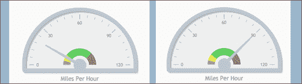
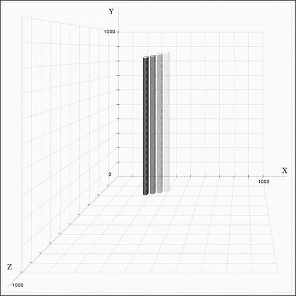
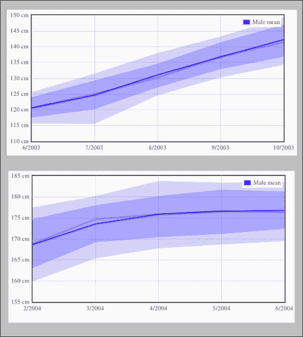
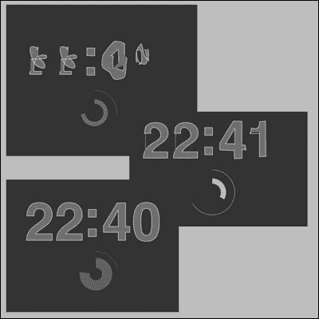
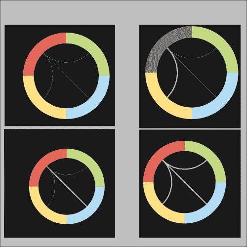

# 第七章：依赖于开源领域

在本章中，我们将涵盖：

+   创建一个仪表盘表（jqPlot）

+   创建一个动画 3D 图表（canvas3DGraph）

+   随着时间的推移绘制图表（flotJS）

+   使用 RaphaelJS 创建时钟

+   使用 InfoVis 制作一个日光图

# 介绍

开源数据可视化社区非常丰富和详细，有许多选项和一些真正令人惊叹的库。每个库都有其优点和缺点。有些是独立的代码，而其他依赖于其他平台，如 jQuery。有些非常庞大，有些非常小；没有一个选项适用于所有机会，但是有这么多的选择，最重要的是找出哪个库适合您。

在使用开源库时总会有一个权衡，主要是在文件大小和拖慢应用程序速度、加载时间等方面有太多功能的情况下。但是由于社区的丰富和创造力，很难避免在几分钟内创建出真正奇妙的图表，而不是几个小时。

在本章中，我们将探索使用一些这些选项。我们的目标不是根据项目的文档使用库，而是找到方法来覆盖内置库，以便更好地控制我们的应用程序，以防在应用程序的文档中找不到合适的解决方案。因此，本章的目标现在是双重的，即找到执行不是自然设置的事情的方法，并找到绕过问题的方法。

还有一件重要的事情要注意，所有这些开源库都有版权。建议您在继续之前检查项目的法律文件。

# 创建一个仪表盘表（jqPlot）

在这个配方中，我们将创建一个非常有趣的仪表盘表，并注入一些随机动画，使其看起来像是连接到实时数据源，比如汽车的速度：



## 准备工作

要开始，您需要使用 jQuery 和 jqPlot。这一次我们将从头开始。

要获取最新的脚本，请访问[`blog.everythingfla.com/?p=339`](http://blog.everythingfla.com/?p=339)的创建者网站。

下载 jQuery 和 jqPlot，或者下载我们的源文件开始。

## 如何做...

让我们列出完成任务所需的步骤：

1.  为我们的项目创建一个 HTML 页面：

```js
<!DOCTYPE html>
<html>
  <head>
    <title>JQPlot Meter</title>
    <meta charset="utf-8" />
    <link rel="stylesheet" href="./external/jqplot/jquery.jqplot.min.css">
    <script src="img/jquery.min.js"></script>
    <script src="img/jquery.jqplot.js"></script>
    <script src="img/jqplot.meterGaugeRenderer.min.js"></script>

    <script src="img/07.01.jqplot-meter.js"></script>		
  </head>
  <body style="background:#fafafa">

  <div id="meter" style="height:400px;width:400px; "></div>
  </body>
</html>
```

1.  创建`07.01.jqplot-meter.js`文件。

1.  让我们添加一些辅助变量。我们将在渲染仪表时使用它们：

```js
var meter;
var meterValue=0;
var startingSpeed = parseInt(Math.random()*60) + 30;
var isStarting = true;
var renderOptions= {
               label: 'Miles Per Hour',
               labelPosition: 'bottom',
               labelHeightAdjust: -10,
               intervalOuterRadius: 45,
               ticks: [0, 40, 80, 120],
               intervals:[25, 90, 120],
               intervalColors:[ '#E7E658','#66cc66', '#cc6666']
            };
```

1.  现在是时候创建我们的仪表盘了。我们将使用 jQuery 来知道我们的文档何时被阅读，然后创建我们的图表。

```js
$(document).ready(function(){

  meter = $.jqplot('meter',[[meterValue]],{
    seriesDefaults: {
      renderer: $.jqplot.MeterGaugeRenderer,
      rendererOptions:renderOptions
    }
  });

});
```

1.  现在是时候为我们的图表添加动画了。让我们在`ready`监听器间隔的最后一行中添加（从现在开始直到配方结束）：

```js
$(document).ready(function(){

  meter = $.jqplot('meter',[[meterValue]],{
    seriesDefaults: {
      renderer: $.jqplot.MeterGaugeRenderer,
      rendererOptions:renderOptions
    }
  });

  setInterval(updateMeter,30);

});
```

1.  最后但同样重要的是，现在是创建`updateMeter`函数的时候了：

```js
function updateMeter(){
  meter.destroy();  

  if(isStarting && meterValue<startingSpeed){
    ++meterValue	
  }else{
    meterValue += 1- Math.random()*2;
    meterValue = Math.max(0,Math.min(meterValue,120)); //keep our value in range no mater what	
  }

  meter = $.jqplot('meter',[[meterValue]],{
    seriesDefaults: {
      renderer: $.jqplot.MeterGaugeRenderer,
      rendererOptions:renderOptions
    }
  });

}
```

做得好。刷新您的浏览器，您会发现一个动画速度计，看起来像是汽车在行驶（如果您只是想象）。

## 它是如何工作的...

这个任务真的很容易，因为我们不需要从头开始。为了使仪表运行，我们需要导入`meterGaugeRenderer`库。我们通过将其添加到我们正在加载的 JavaScript 文件中来实现这一点。但让我们专注于我们的代码。我们 JavaScript 的第一步是准备一些全局变量；我们使用全局变量是因为我们希望在两个不同的函数中重复使用这些变量（当我们准备重置我们的数据时）。

```js
var meter;
var meterValue=0;
var startingSpeed = parseInt(Math.random()*60) + 30;
var isStarting = true;
```

`meter`变量将保存我们从开源库生成的仪表。`meterValue`将是应用程序加载时的初始值。我们的`startingSpeed`变量将是`30`和`90`之间的随机值。目标是每次从不同的地方开始，使其更有趣。应用程序一启动，我们希望我们的仪表快速动画到其新的基本速度（`startingSpeed`变量）。最后，这与`isStarting`变量相关联，因为我们希望有一个动画将我们带到基本速度。当我们到达那里时，我们希望切换到一个会导致动画改变的随机驾驶速度。现在我们已经设置了所有辅助变量，我们准备创建`renderOptions`对象：

```js
var renderOptions= {
               label: 'Miles Per Hour',
               labelPosition: 'bottom',
               labelHeightAdjust: -10,
               intervalOuterRadius: 45,
               ticks: [0, 40, 80, 120],
               intervals:[25, 90, 120],
               intervalColors:[ '#E7E658','#66cc66', '#cc6666']
           };
```

这个对象实际上是我们应用程序视觉效果的核心。（在 jqPlot 项目主页文档中还有其他选项可供您探索。）现在让我们回顾一些关键参数。

`intervalOuterRadius`有一个有点棘手的名称，但实际上它是内半径。我们的仪表的实际大小由我们设置应用程序所在的`div`的大小控制。`intervalOuterRadius`控制速度计核心中内部形状的大小。

```js
var renderOptions= {
  label: 'Miles Per Hour',
  labelPosition: 'bottom',
  labelHeightAdjust: -10,
  intervalOuterRadius: 45,
 //ticks: [0, 40, 80, 120],
 intervals:[10,25, 90, 120],
 intervalColors:['#999999', '#E7E658','#66cc66', '#cc6666']
};
```

`ticks`函数控制复制轮廓的位置。默认情况下，它会将我们的顶部范围除以 4（即 30、60、90 和 120）。`intervals`和`intervalColors`函数让仪表知道范围和内部、内部、饼颜色（与刻度分开）。

```js
$(document).ready(function(){

  meter = $.jqplot('meter',[[meterValue]],{
    seriesDefaults: {
      renderer: $.jqplot.MeterGaugeRenderer,
      rendererOptions:renderOptions
    }
  });
  setInterval(updateMeter,30);

});
```

要使用 jqPlot 库创建新图表，我们总是调用`$.jqplot`函数。函数的第一个参数是`div`层，这是我们的工作所在的地方。第二个参数是包含图表数据的二维数组（对于这个示例来说看起来有点奇怪，因为它期望一个二维数组，而我们的示例一次只包含一个数据条目，所以我们需要将它包装在两个数组中）。第三个参数定义了使用的渲染器和`rendererOptions`（我们之前创建的）。

## 还有更多…

让我们再探索一些功能。

### 创建`updateMeter`函数

`updateMeter`函数每 30 毫秒调用一次。我们需要做的是每次调用时都清除我们的艺术品：

```js
meter.destroy();  
```

这将清除与我们的仪表相关的所有内容，以便我们可以重新创建它。

如果我们仍然处于应用程序的介绍部分，希望我们的速度达到目标速度，我们需要通过`1`更新我们的`meterValue`。

```js
if(isStarting && meterValue<startingSpeed){
    ++meterValue;
}
```

如果我们已经通过了这个状态，想让我们的仪表随机上下波动，看起来像是驾驶速度的变化，我们将使用以下代码片段：

```js
}else{
    meterValue += 1- Math.random()*2;
    meterValue = Math.max(0,Math.min(meterValue,120)); //keep our value in range no mater what	
}
```

我们随机地向我们的仪表值添加一个介于`-1`和`1`之间的值。通过保持我们的值不低于`0`且不高于`120`，然后用我们的新的`meterValue`值重新绘制我们的仪表，可以实现对我们结果的修正。

# 创建一个动画 3D 图表（canvas3DGraph）

这个配方真的很有趣。它基于 Dragan Bajcic 的源文件。它不是一个完整的图表库，但它是一个很棒的启发式图表，可以修改并用来创建您自己的 3D 数据可视化。

尽管我们附带示例中的源文件是从原始源文件（主要是`canvas3DGraph.js`）修改的，但要获取本书中使用的开源项目的原始源，请访问我们的集中列表[`blog.everythingfla.com/?p=339`](http://blog.everythingfla.com/?p=339)。



## 准备好了

如果您想关注我们的更新，请从提供的链接下载原始源文件，或者查看我们对 Dragan 的源文件所做的更改。

## 如何做到…

让我们马上开始，因为我们有很多工作要做：

1.  创建 HTML 文件：

```js
<!DOCTYPE html>
<html>
  <head>
    <title>canvas3DGraph.js</title>
    <meta charset="utf-8" />
    <link rel="stylesheet" href="./external/dragan/canvas3DGraph.css">
    <script src="img/canvas3DGraph.js"></script>
    <script src="img/07.02.3d.js"></script>

  </head>
  <body style="background:#fafafa">

    <div id="g-holder">  
      <div id="canvasDiv">  
        <canvas id="graph" width="600" height="600" ></canvas>  
        <div id="gInfo"></div>   
      </div>  

    </div>      
  </body>
</html>
```

1.  创建 CSS 文件`canvas3DGraph.css`：

```js
#g-holder {  
    height:620px;  
    position:relative;  
}  

#canvasDiv{  
    border:solid 1px #e1e1e1;  
    width:600px;  
    height:600px;  
    position:absolute;  
    top:0px; left:0px;  
    z-index:10;  
}  
#x-label{  
    position:absolute;  
    z-index:2;  
    top:340px;  
    left:580px;  
}  

#y-label{  
    position:absolute;  
    z-index:2;  
    top:10px;  
    left:220px;  
}  

#z-label{  
    position:absolute;  
    z-index:2;  
    top:540px;  
    left:10px;  
}  

#gInfo div.gText{  
    position:absolute;  
    z-index:-1;  
    font:normal 10px Arial;  
}  
```

1.  现在是时候转到 JavaScript 文件了。

1.  让我们添加一些辅助变量：

```js
var gData = [];

var curIndex=0;
var trailCount = 5;
var g;
var trailingArray=[];
```

1.  当文档准备就绪时，我们需要创建我们的图表：

```js
window.onload=function(){  
  //Initialize Graph  
  g = new canvasGraph('graph');  
  g.barStyle = {cap:'rgba(255,255,255,1)',main:'rgba(0,0,0,0.7)', shadow:'rgba(0,0,0,1)',outline:'rgba(0,0,0,0.7)',formater:styleFormater};	
  for(i=0;i<100;i++){
    gData[i] = {x:(Math.cos((i/10)) * 400 + 400), y:(1000-(i*9.2)), z:(i*10)};
  }

plotBar();
setInterval(plotBar,40);

}  
```

1.  创建`plotBar`函数：

```js
function plotBar(){
  trailingArray.push(gData[curIndex]);

  if(trailingArray.length>=5) trailingArray.shift();

  g.drawGraph(trailingArray);//trailingArray);
  curIndex++
  if(curIndex>=gData.length) curIndex=0;
}
```

1.  创建格式化函数`styleFormatter`：

```js
function styleFormatter(styleColor,index,total){
  var clrs = styleColor.split(",");
  var alpha = parseFloat(clrs[3].split(")"));
  alpha *= index/total+.1;
  clrs[3] = alpha+")";
  return clrs.join(",");
}
```

假设您正在使用我们修改过的开源 JavaScript 文件，现在您应该看到您的图表正在进行动画。(在这个食谱的*更多内容*部分，我们将深入研究这些更改以及我们为什么进行这些更改。)

## 它是如何工作的...

让我们首先以与 JavaScript 库交互的方式来查看我们的代码。之后我们将更深入地了解这个库的内部工作原理。

```js
var gData = [];
var trailingArray=[];
var trailCount = 5;
var curIndex=0;
```

`gData`数组将存储 3D 空间中所有可能的点。一个 3D 条形图将使用这些点创建(这些点是将作为对象放入这个数组中的 3D 点 x、y 和 z 值)。`trailingArray`数组将存储视图中当前的条形图元素。`trailCount`变量将定义同时可以看到多少条形图，我们的当前索引(`curIndex`)将跟踪我们最新添加到图表中的元素。

当窗口加载时，我们创建我们的图表元素：

```js
window.onload=function(){  
  //Initialise Graph  
  g = new canvasGraph('graph');  
  g.barStyle = {cap:'rgba(255,255,255,1)',main:'rgba(0,0,0,0.7)', shadow:'rgba(0,0,0,1)',outline:'rgba(0,0,0,0.7)',formatter:styleFormatter};	
  for(i=0;i<100;i++){
    gData[i] = {x:(Math.cos((i/10)) * 400 + 400), y:(1000-(i*9.2)), z:(i*10)};
  }

  plotBar();
  setInterval(plotBar,40);

}  
```

在创建我们的图表之后，我们更新`barStyle`属性以反映我们想要在条形图上使用的颜色。除此之外，我们还发送了一个格式化函数，因为我们希望单独处理每个条形图(在视觉上对它们进行不同处理)。然后我们创建我们的数据源——在我们的情况下是在我们的内部空间中旅行的`Math.cos`。随意玩弄所有数据点；它会产生一些非常惊人的内容。在实际应用中，您可能希望使用实时或真实数据。为了确保我们的数据将从后到前堆叠，我们需要对数据进行排序，以便后面的 z 值首先呈现。在我们的情况下，不需要排序，因为我们的循环正在创建一个按顺序增长的 z 索引顺序，所以数组已经组织好了。

## 更多内容...

接下来我们调用`plotBar`并且每 40 毫秒重复一次这个动作。

### plotBar 的逻辑

让我们来审查一下`plotBar`函数中的逻辑。这是我们应用程序的真正酷的部分，我们通过更新数据源来创建动画。我们首先将当前索引元素添加到`trailingArray`数组中：

```js
trailingArray.push(gData[curIndex]);
```

如果我们的数组长度为`5`或更多，我们需要摆脱数组中的第一个元素：

```js
if(trailingArray.length>=5) trailingArray.shift();
```

然后我们绘制我们的图表并将`curIndex`的值增加一。如果我们的`curIndex`大于数组元素，我们将其重置为`0`。

```js
g.drawGraph(trailingArray);//trailingArray);
curIndex++
if(curIndex>=gData.length) curIndex=0;
```

### styleFormatter 的逻辑

每次绘制条形图时，我们的格式化函数都会被调用来计算要使用的颜色。它将获取条形图的索引和正在处理的图表中数据源的总长度。在我们的示例中，我们只是根据它们的位置改变条形图的`alpha`值。(数字越大，我们就越接近最后输入的数据源。)通过这种方式，我们创建了我们的淡出效果。

```js
function styleFormatter(styleColor,index,total){
  var clrs = styleColor.split(",");
  var alpha = parseFloat(clrs[3].split(")"));
  alpha *= index/total+.1;
  clrs[3] = alpha+")";
  return clrs.join(",");
}
```

这个示例实际上还有更多。在不深入代码本身的情况下，我想概述一下这些更改。

为了控制我们的条形图的颜色，第三方包的第 66 行必须更改。因此，我引入了`this.barStyle`并且替换了在创建条形图元素时硬编码值的所有引用(并设置了一些默认值)：

```js
this.barStyle = {cap:'rgba(255,255,255,1)',main:'rgba(189,189,243,0.7)', shadow:'rgba(77,77,180,0.7)',outline:'rgba(0,0,0,0.7)',formatter:null};
```

我为我们的条形图创建了一个样式生成器。这是为了帮助我们在外部格式化程序和内部样式之间重定向逻辑：

```js
canvasGraph.prototype.getBarStyle= function(baseStyle,index,total){
  return this.barStyle.formatter? this.barStyle.formatter(baseStyle,index,total):baseStyle;
}
```

我们创建了一个清除函数，以删除图表中的所有可视内容，这样我们每次调用它时就可以重新渲染数据：

```js
canvasGraph.prototype.getBarStyle= function(baseStyle,index,total){
  return this.barStyle.formatter? this.barStyle.formatter(baseStyle,index,total):baseStyle;
}
```

我们将绘制图表的逻辑移动到`drawGraph`函数中，这样我可以同时删除图表，使得每次刷新所有数据更容易：

```js
canvasGraph.prototype.drawGraph=function(gData){
  //moved this to the drawGraph so i can clear each time its called.
  this.clearCanvas();
  // Draw XYZ AXIS 
  this.drawAxis();
  this.drawInfo();

  var len = gData.length;

  for(i=0;i<len;i++){
    this.drawBar(gData[i].x,gData[i].y,gData[i].z,i,len); 
  }
}
```

当前索引和长度信息现在通过`drawBar`传递，直到它到达格式化函数。

最后但并非最不重要的是，我已经从构造函数中删除了绘制图表的部分，这样我们的图表将更有利于我们的动画想法。

# 随时间变化的图表(flotJS)

这个库的一个更令人印象深刻的特性是更新图表信息的简易性。当您第一次审查这个库及其样本时，就可以很容易地看出作者热爱数学和图表。我最喜欢的功能是图表可以根据输入动态更新其 x 范围。

我第二喜欢的功能是使用`tickFormater`方法更新图表文本信息的简易性。



## 准备工作

要获取`flotJS`库的最新版本，请访问我们的链接中心[`blog.everythingfla.com/?p=339`](http://blog.everythingfla.com/?p=339)以获取图表开源库，或者下载我们书籍的源文件，在出版时包含最新版本[`02geek.com/books/html5-graphics-and-data-visualization-cookbook.htm`](http://02geek.com/books/html5-graphics-and-data-visualization-cookbook.htm)。

## 如何做...

让我们创建我们的 HTML 和 JavaScript 文件：

1.  创建一个 HTML 文件：

```js
<!DOCTYPE html>
<html>
  <head>
    <title>flot</title>
    <meta charset="utf-8" />
    <script src="img/jquery.min.js"></script>
    <script src="img/jquery.flot.js"></script>
    <script src="img/jquery.flot.fillbetween.js"></script>    

    <script src="img/07.03.flot.js"></script>

  </head>
  <body style="background:#fafafa">

    <div id="placeholder" style="width:600px;height:300px;"></div> 
  </body>
</html>
```

1.  创建一个新的 JavaScript 文件（`07.03.flot.js`），然后创建我们的数据源：

```js
var males = {

//...
//please grab from source files its a long list of numbers
};Create helper variables:
var VIEW_LENGTH = 5;
var index=0;
var plot;

var formattingData = {
  xaxis: { tickDecimals: 0, tickFormatter: function (v) { return v%12 + "/" + (2009+Math.floor(v/12)); } },
  yaxis: { tickFormatter: function (v) { return v + " cm"; } }
};
```

1.  创建一个`ready`事件并触发`updateChart`：

```js
$(document).ready(updateChart);
```

1.  创建`updateChart`：

```js
function updateChart() {
  plot = $.plot($("#placeholder"), getData(), formattingData);

  if(index+5<males['mean'].length){
    setTimeout(updateChart,500);
  }
}
```

1.  创建`getData`：

```js
function getData(){
  var endIndex = index+5>=males.length?males.length-1:index+5;
  console.log(index,endIndex);
  var dataset = [
    { label: 'Male mean', data: males['mean'].slice(index,endIndex), lines: { show: true }, color: "rgb(50,50,255)" },
    { id: 'm15%', data: males['15%'].slice(index,endIndex), lines: { show: true, lineWidth: 0, fill: false }, color: "rgb(50,50,255)" },
    { id: 'm25%', data: males['25%'].slice(index,endIndex), lines: { show: true, lineWidth: 0, fill: 0.2 }, color: "rgb(50,50,255)", fillBetween: 'm15%' },
    { id: 'm50%', data: males['50%'].slice(index,endIndex), lines: { show: true, lineWidth: 0.5, fill: 0.4, shadowSize: 0 }, color: "rgb(50,50,255)", fillBetween: 'm25%' },
    { id: 'm75%', data: males['75%'].slice(index,endIndex), lines: { show: true, lineWidth: 0, fill: 0.4 }, color: "rgb(50,50,255)", fillBetween: 'm50%' },
    { id: 'm85%', data: males['85%'].slice(index,endIndex), lines: { show: true, lineWidth: 0, fill: 0.2 }, color: "rgb(50,50,255)", fillBetween: 'm75%' }
  ];

  index++;
  return dataset;
}
```

现在，如果您在浏览器中运行图表，您将一次看到 6 个月，每隔半秒，图表将通过将图表向前推一个月来更新，直到数据源的末尾。

## 工作原理...

`flotJS`具有内置逻辑，在重新绘制时重置自身，这是我们的魔法的一部分。我们的数据源是从`flotJS`的样本中借来的。我们实际上使用数据来表示一个虚构的情况。最初，这些数据代表了人们根据年龄的平均体重，按百分位数分解。但我们在这个例子中的重点不是展示数据，而是展示数据的可视化方式。因此，在我们的情况下，我们必须通过保持百分位数的原意来处理数据，但使用内部数据来展示多年来的平均值，而不是年龄，如下所示：

```js
{'15%': [[yearID, value], [yearID, value]...
```

`yearID`的值范围从`2`到`19`。我们希望将这些信息展示为如果我们从 2006 年开始选择我们的数据。每个`yearId`将代表一个月（19 将是 2006 年之后 1.5 年的时间，而不是实际代表的年龄 19）。

所以让我们开始分解。现在我们知道我们将如何处理我们的数据集，我们想要限制我们在任何给定时间内可以看到的月数。因此，我们将添加两个辅助参数，一个用于跟踪我们当前的索引，另一个用于跟踪任何给定时间内可见元素的最大数量：

```js
var VIEW_LENGTH = 5;
var index=0;
```

我们将为我们的 Flot 图创建一个全局变量，并创建一个格式化程序来帮助我们格式化将发送的数据。

```js
var plot;
var formattingData = {
  xaxis: { tickDecimals: 0, tickFormatter: function (v) { return v%12 + "/" + (2003+Math.floor(v/12)); } },
  yaxis: { tickFormatter: function (v) { return v + " cm"; } }
};
```

请注意，`tickFormater`使我们能够修改图表中刻度的外观方式。在 x 轴的情况下，目标是展示当前日期`2/2012...`，在 y 轴上，我们希望在屏幕上打印出的数字后面添加`cm`。

## 还有更多...

还有两件事情要讲——`getData`函数和`updateChart`函数。

### 获取数据函数

在`flotJS`中，每个数据点都有一个 ID。在我们的情况下，我们想展示六种相关的内容类型。调整参数以查看它们如何改变视图的方式。在我们发送创建的数组之前，我们将索引 ID 更新一次，这样下次调用函数时它将发送下一个范围。

我们需要注意的另一件事是实际数据范围。由于我们没有发送完整的数据范围（而是最多`5`个），我们需要验证索引后至少有五个项目，如果没有，我们将返回数组的最后一个元素，确保我们不会切割超过实际长度的部分：

```js
var endIndex = index+5>=males.length?males.length-1:index+5;
```

### 更新图表函数

这部分可能是最简单的。相同的代码用于第一次渲染和所有后续渲染。如果数据集有效，我们创建一个超时，并再次调用此函数，直到动画完成。

# 使用 RaphaelJS 构建时钟

毫无疑问，这是本章中我最喜欢的示例。它基于 Raphael 网站上的两个示例的混合（我强烈建议你去探索）。尽管`Raphael`不是一个绘图库，但它是一个非常强大的动画和绘图库，非常值得玩耍。

在这个示例中，我们将创建一个创意的时钟（我认为）。我计划玩这个库一两天，结果玩了整个周末，因为我玩得太开心了。我最终得到了一个数字变形时钟（基于 Raphael 在其网站上为字母变形创建的示例），并根据其网站上的极坐标时钟示例加入了一些弧线。让我们看看它的表现：



## 准备工作

就像本章中的其他部分一样，您需要 Raphael 的原始库。我已经将其添加到我们的项目中。所以只需下载文件，让我们开始吧。

要获取原始库，请访问本章的外部源文件中心[`blog.everythingfla.com/?p=339`](http://blog.everythingfla.com/?p=339)。

## 如何做...

让我们构建我们的应用程序：

1.  创建 HTML 文件：

```js
<!DOCTYPE html>
<html>
  <head>
    <title>Raphael</title>
    <meta charset="utf-8" />
    <script src="img/jquery.min.js"></script>
    <script src="img/raphael-min.js"></script> 
    <script src="img/07.04.raphael.js"></script>
    <style>
      body {
        background: #333;
        color: #fff;
        font: 300 100.1% "Helvetica Neue", Helvetica, "Arial Unicode MS", Arial, sans-serif;
      }
      #holder {
        height: 600px;
        margin: -300px 0 0 -300px;
        width: 600px;
        left: 50%;
        position: absolute;
        top: 50%;
      }
    </style>

  </head>
  <body>

  <div id="holder"></div>
  </body>
</html>
```

1.  现在是时候进入 JavaScript 文件`07.04.raphael.js`了。将路径参数复制到一个名为`helveticaForClock`的对象中，以绘制数字`0`到`9`和`:`符号。这实际上只是一个很长的数字列表，所以请从我们可下载的源文件中复制它们：

```js
var helveticaForClock = {...};
```

1.  我们将创建一个`onload`监听器，并将所有代码放入其中，以与 Raphael 示例中的代码风格相匹配：

```js
window.onload = function () {
  //the rest of the code will be put in here from step 3 and on
};
```

1.  创建一个 600 x 600 大小的新`Raphael`对象：

```js
var r = Raphael("holder", 600, 600);
```

1.  现在我们需要使用一个辅助函数来找出弧线的路径。为此，我们将创建一个`arc`函数作为我们新创建的`Raphael`对象的额外属性：

```js
r.customAttributes.arc = function (per,isClock) {
  var R = this.props.r,
  baseX = this.props.x,
  baseY = this.props.y;
  var degree = 360 *per;
  if(isClock) degree = 360-degree;

  var a = (90 - degree) * Math.PI / 180,
  x = baseX + R * Math.cos(a),
  y = baseY - R * Math.sin(a),
  path;

  if (per==1) {
    path = [["M", baseX, baseY - R], ["A", R, R, 0, 1, 1, baseX, baseY - R]];
  } else {
    path = [["M", baseX, baseY - R], ["A", R, R, 0, +(degree > 180), 1, x, y]];
  }

  var alpha=1;

  if(per<.1 || per>.9) 
    alpha = 0;
  else  
    alpha = 1;

  return {path: path,stroke: 'rgba(255,255,255,'+(1-per)+')'};  
};
```

1.  创建我们时钟的小时绘制（00:00）：

```js
var transPath;

var aTrans = ['T400,100','T320,100','T195,100','T115,100'];
var base0 = helveticaForClock[0];
var aLast = [0,0,0,0];
var aDigits = [];

var digit;
for(i=0; i<aLast.length; i++){
  digit = r.path("M0,0L0,0z").attr({fill: "#fff", stroke: "#fff", "fill-opacity": .3, "stroke-width": 1, "stroke-linecap": "round", translation: "100 100"});

  transPath = Raphael.transformPath(helveticaForClock[aLast[i]], aTrans[i]);
  digit.attr({path:transPath});
  aDigits.push(digit);
}
var dDot = r.path("M0,0L0,0z").attr({fill: "#fff", stroke: "#fff", "fill-opacity": .3, "stroke-width": 1, "stroke-linecap": "round", translation: "100 100"});
transPath = Raphael.transformPath(helveticaForClock[':'], 'T280,90');
dDot.attr({path:transPath});
```

1.  现在是时候为我们的`seconds`动画创建艺术品了：

```js
var time;
var sec = r.path();
sec.props = {r:30,x:300,y:300}; //new mandatory params

var sec2 = r.path();
sec2.props = {r:60,x:300,y:300};

animateSeconds();
animateStrokeWidth(sec,10,60,1000*60);
```

1.  创建`animateSeconds`递归函数：

```js
function animateSeconds(){ //will run forever
  time = new Date();

  sec.attr({arc: [1]});
  sec.animate({arc: [0]}, 1000, "=",animateSeconds);
  sec2.attr({arc: [1,true]});
  sec2.animate({arc: [0,true]}, 999, "=");

  var newDigits = [time.getMinutes()%10,
  parseInt(time.getMinutes()/10),
  time.getHours()%10,
  parseInt(time.getHours()/10)	];
  var path;
  var transPath;
  for(var i=0; i<aLast.length; i++){
    if(aLast[i]!=newDigits[i]){
      path = aDigits[i];
      aLast[i] = newDigits[i]; 	
      transPath = Raphael.transformPath(helveticaForClock[newDigits[i]], aTrans[i]);
      path.animate({path:transPath}, 500);
    }
  }

}
```

1.  创建`animateStrokeWidth`函数：

```js
function animateStrokeWidth(that,startWidth,endWidth,time){
  that.attr({'stroke-width':startWidth});
  that.animate({'stroke-width':endWidth},time,function(){
    animateStrokeWidth(that,startWidth,endWidth,time); //repeat forever
  });
}
```

如果现在运行应用程序，您将看到我与 Raphael 库玩耍一天的成果。

## 它是如何工作的...

这个项目有很多元素。让我们开始关注弧线动画。请注意，我们在代码中使用的一个元素是当我们创建新的路径时（我们创建了两个）。我们添加了一些硬编码的参数，这些参数将在`arc`方法中后来用于绘制弧线：

```js
var sec = r.path();sec.props = {r:30,x:300,y:300}; //new mandatory params

var sec2 = r.path();sec2.props = {r:60,x:300,y:300};
```

我们这样做是为了避免每次将这三个属性发送到弧线中，并且使我们能够选择一个半径并坚持下去，而不是将其集成或硬编码到动画中。我们的`arc`方法是基于 Raphael 示例中用于极坐标时钟的`arc`方法，但我们对其进行了更改，使值可以是正数或负数（这样更容易来回动画）。

然后在`animateSeconds`函数内部动画化时，使用`arc`方法来绘制我们的弧线：

```js
sec.attr({arc: [1]});
sec.animate({arc: [0]}, 1000, "=",animateSeconds);
sec2.attr({arc: [1,true]});
sec2.animate({arc: [0,true]}, 999, "=");
```

`attr`方法将重置我们的`arc`属性，以便我们可以重新对其进行动画处理。

顺便说一句，在`animateStrokeWidth`中，我们正在将我们的描边宽度从最小值动画到最大值，持续 60 秒。

## 还有更多...

你真的以为我们完成了吗？我知道你没有。让我们看看其他一些关键步骤。

### 动画路径

这个库中更酷的事情之一是能够动画化路径。如果您曾经使用过 Adobe Flash 的形状 Tween，这看起来会非常熟悉——毫无疑问，这真的很酷。

这个想法非常简单。我们有一个具有许多路径点的对象。如果我们通过它们绘制线信息，它们将一起创建一个形状。我们借用了 Raphael 创建的一个列表，所以我们不需要从头开始，而且我们在其中改变的只是我们不希望我们的元素按照它们当前的路径绘制。我们需要做的就是使用内部的`Raphael.transformPath`方法来转换它们的位置：

```js
transPath = Raphael.transformPath(helveticaForClock[0], 'T400,100');
```

换句话说，我们正在抓取数字 0 的路径信息，然后将其转换，向右移动 400 像素，向下移动 100 像素。

在我们的源代码中，看起来我们正在循环执行该函数（这有点更复杂，但是压缩了）：

```js
for(i=0; i<aLast.length; i++){
  digit = r.path("M0,0L0,0z").attr({fill: "#fff", stroke: "#fff", "fill-opacity": .3, "stroke-width": 1, "stroke-linecap": "round", translation: "100 100"});

  transPath = Raphael.transformPath(helveticaForClock[aLast[i]], aTrans[i]);
  digit.attr({path:transPath});
  aDigits.push(digit);
}
```

基本上，我们正在循环遍历`aLast`数组（我们要创建的数字列表），并为每个元素创建一个新的数字。然后，我们根据`aTrans`数组中的转换信息确定数字的位置，然后通过添加一个新的路径到属性中将其绘制出来。最后但并非最不重要的是，我们将我们的数字保存到`aDigits`数组中，以便在以后重新渲染元素时使用。

每次调用`animateSeconds`函数（每秒一次），我们都会弄清楚数字是否发生了变化，如果发生了变化，我们就准备更新它的信息：

```js
var newDigits = [time.getMinutes()%10,
  parseInt(time.getMinutes()/10),
  time.getHours()%10,
  parseInt(time.getHours()/10)];
var path;
var transPath;
  for(var i=0; i<aLast.length; i++){
    if(aLast[i]!=newDigits[i]){
    path = aDigits[i];
    aLast[i] = newDigits[i]; 	
    transPath = Raphael.transformPath(helveticaForClock[newDigits[i]], aTrans[i]);
    path.animate({path:transPath}, 500);
  }
}
```

我们首先收集当前时间`HH:MM`到一个数组中（`[H,H,M,M]`），然后查看我们的数字是否发生了变化。如果它们发生了变化，我们就从我们的`helveticaForClock`函数中获取所需的新数据，并在我们的新路径信息中为我们的数字（路径）进行动画处理。

这涵盖了遵循此方法的最重要因素。

# 使用 InfoVis 制作一个日晕图

另一个非常酷的库是`InfoVis`。如果我必须对这个库进行分类，我会说它是关于连接的。当您查看 Nicolas Garcia Belmonte 提供的丰富示例时，您会发现很多非常独特的关系数据类型。

这个库是通过 Sencha 的法定所有者免费分发的。（版权很容易遵循，但请查看您遇到的任何开源项目的说明。）

我们将从他的基本示例之一开始——源文件中的日晕示例。我做了一些改变，赋予它新的个性。日晕图的基本思想是展示节点之间的关系。树是有序的父子关系，而日晕图中的关系是双向的。一个节点可以与任何其他节点有关系，可以是双向或单向关系。一个完美适合这种情况的数据集是一个国家的总出口额的例子——从一个国家到所有其他从中获得出口的国家的线。

我们将保持相对简单，只有四个元素（Ben，Packt Publishing，02geek 和 InfoVis 的创建者 Nicolas）。我与他们每个人都有单向关系：作为`02geek.com`的所有者，作为 Packt Publishing 的作者，以及作为 InfoVis 的用户。虽然这对我来说是真的，但并非所有其他人都与我有真正深入的关系。其中一些人与我有联系，比如 02geek 和 Packt Publishing，而对于这个例子来说，Nicolas 是一个我从未互动过的陌生人。这可以用日晕图来描述：



## 准备工作

和往常一样，您将需要源文件，您可以下载我们的示例文件，或者访问我们的聚合列表获取最新版本。

## 如何做...

让我们创造一些 HTML 和 JavaScript 的魔法：

1.  创建一个 HTML 文件如下：

```js
<!DOCTYPE html>
<html>
  <head>
    <title>Sunberst - InfoVis</title>
    <meta charset="utf-8" />

    <style>
      #infovis {
        position:relative;
        width:600px;
        height:600px;
        margin:auto;
        overflow:hidden;
      }
    </style>

    <script  src="img/jit-yc.js"></script>
    <script src="img/07.05.jit.js"></script>
  </head>

  <body onload="init();">
    <div id="infovis"></div>    
  </body>
</html>
```

1.  其余的代码将在`07.05.jit.js`中。创建一个基本数据源如下：

```js
var dataSource = [ {"id": "node0", "name": "","data": {"$type": "none" },"adjacencies": []}]; //starting with invisible root
```

1.  让我们创建一个将为我们的图表系统创建所需节点的函数：

```js
function createNode(id,name,wid,hei,clr){
  var obj = {id:id,name:name,data:{"$angularWidth":wid,"$height":hei,"$color":clr},adjacencies:[]};
  dataSource[0].adjacencies.push({"nodeTo": id,"data": {'$type': 'none'}});
  dataSource.push(obj);

  return obj;
}
```

1.  为了连接这些点，我们需要创建一个函数，用于创建元素之间的关系：

```js
function relate(obj){
  for(var i=1; i<arguments.length; i++){
    obj.adjacencies.push({'nodeTo':arguments[i]});
  }
}
```

1.  我们希望能够突出显示关系。为此，我们需要一种方法来重新排列数据并突出显示我们想要突出显示的元素：

```js
function highlight(nodeid){
  var selectedIndex = 0;
  for(var i=1; i<dataSource.length; i++){
    if(nodeid!=	dataSource[i].id){
      for(var item in dataSource[i].adjacencies)
      delete dataSource[i].adjacencies[item].data;
    }else{
      selectedIndex = i;
      for(var item in dataSource[i].adjacencies)
      dataSource[i].adjacencies[item].data =  {"$color": "#ddaacc","$lineWidth": 4 };
      }

    }

    if(selectedIndex){ //move selected node to be first (so it will highlight everything)
    var node = dataSource.splice(selectedIndex,1)[0];
    dataSource.splice(1,0,node); 
  }

}
```

1.  创建一个`init`函数：

```js
function init(){
/* or the remainder of the steps 
all code showcased will be inside the init function  */
}
```

1.  让我们开始建立数据源和关系：

```js
function init(){
  var node = createNode('geek','02geek',100,40,"#B1DDF3");
  relate(node,'ben');
  node = createNode('packt','PacktBub',100,40,"#FFDE89");
  relate(node,'ben');
  node = createNode('ben','Ben',100,40,"#E3675C");
  relate(node,'geek','packt','nic');

  node = createNode('nic','Nicolas',100,40,"#C2D985");
  //no known relationships so far ;)
...
```

1.  创建实际的旭日图并与 API 交互（我已将其简化到最基本的形式；在原始示例中，它更加详细）：

```js
var sb = new $jit.Sunburst({
  injectInto: 'infovis', //id container
  Node: {
    overridable: true,
    type: 'multipie'
  },
  Edge: {
    overridable: true,
    type: 'hyperline',
    lineWidth: 1,
    color: '#777'
  },
  //Add animations when hovering and clicking nodes
  NodeStyles: {
    enable: true,
    type: 'Native',
    stylesClick: {
    'color': '#444444'
  },
  stylesHover: {
    'color': '#777777'
  },
    duration: 700
  },
  Events: {
    enable: true,
    type: 'Native',
    //List node connections onClick
    onClick: function(node, eventInfo, e){
      if (!node) return;

      highlight(node.id);
      sb.loadJSON(dataSource);
      sb.refresh()
    }
  },
  levelDistance: 120
});
```

1.  最后但并非最不重要的是，我们希望通过提供其`dataSource`来渲染我们的图表，并首次刷新渲染：

```js
sb.loadJSON(dataSource);
sb.refresh();
```

就是这样。如果运行应用程序，您将找到一个可点击和有趣的图表，并且只是展示了这个真正酷的数据网络库的功能。

## 它是如何工作的...

我将避免详细介绍实际 API，因为那相当直观，并且具有非常丰富的信息和示例库。因此，我将专注于我在此应用程序中创建的更改和增强功能。

在我们这样做之前，我们需要了解此图表的数据结构是如何工作的。让我们深入了解填充信息后数据源对象的外观：

```js
{
        "id": "node0",
        "name": "",
        "data": {
          "$type": "none"
        },
        "adjacencies": [
            {"nodeTo": "node1","data": {'$type': 'none'}}, 
            {"nodeTo": "node2","data": {'$type': 'none'}}, 
            {"nodeTo": "node3","data": {'$type': 'none'}}, 
            {"nodeTo": "node4","data": {'$type': 'none'}}
                       ]
}, 

{
        "id": "node1",
        "name": "node 1",
        "data": {
          "$angularWidth": 300,
          "$color": "#B1DDF3",
          "$height": 40
        },
        "adjacencies": [
            {
              "nodeTo": "node3",
              "data": {
                "$color": "#ddaacc",
                "$lineWidth": 4
              }
            }
                    ]
},
```

有一些重要因素需要注意。首先是有一个基本父级，它是所有无父节点的父级的父级。在我们的情况下，它是一个平面图表。真正令人兴奋的关系是在相同级别的节点之间。因此，主父级与所有接下来的节点都有关系。子元素，例如在这种情况下的`node1`，可能具有关系。它们在一个名为`adjacencies`的数组中列出，其中包含对象。唯一强制性的参数是`nodeTo`属性。它让应用程序知道单向关系列表。还有一些可选的布局参数，我们将在需要突出显示一条线时才添加。因此，让我们看看如何使用一些函数动态创建这种类型的数据。

`createNode`函数通过将脏步骤封装在一起，帮助我们保持代码清晰。我们添加的每个新元素都需要添加到数组中，并且需要更新我们的主父元素（始终位于新元素数组的位置`0`）：

```js
function createNode(id,name,wid,hei,clr){
  var obj = {id:id,name:name,data:{"$angularWidth":wid,"$height":hei,"$color":clr},adjacencies:[]};
  dataSource[0].adjacencies.push({"nodeTo": id,"data": {'$type': 'none'}});
  dataSource.push(obj);

  return obj; 	
}
```

我们返回对象，因为我们希望继续并建立与该对象的关系。一旦我们创建一个新对象（在我们的`init`函数中），我们就调用`relate`函数，并将所有与其相关的关系发送给它。`relate`函数的逻辑看起来比实际上更复杂。该函数使用 JavaScript 中的一个隐藏或经常被忽略的特性，该特性使开发人员能够使用`arguments`数组将开放数量的参数发送到函数中，该数组在每个函数中都会自动创建。我们可以将这些参数作为名为`arguments`的数组获取：

```js
function relate(obj){
  for(var i=1; i<arguments.length; i++){
    obj.adjacencies.push({'nodeTo':arguments[i]});
  }
}
```

`arguments`数组内置在每个函数中，并存储已发送到函数中的所有实际信息。由于第一个参数是我们的对象，我们需要跳过第一个参数，然后将新关系添加到`adjacencies`数组中。

我们最后一个与数据相关的函数是我们的`highlight`函数。`highlight`函数期望一个参数`nodeID`（我们在`createNode`中创建）。`highlight`函数的目标是遍历所有数据元素，并取消突出显示限于所选元素及其关系的所有关系。

```js
function highlight(nodeid){
  var selectedIndex = 0;
  for(var i=1; i<dataSource.length; i++){
    if(nodeid!=	dataSource[i].id){
      for(var item in dataSource[i].adjacencies)
      delete dataSource[i].adjacencies[item].data;
    }else{
      selectedIndex = i;
      for(var item in dataSource[i].adjacencies)
      dataSource[i].adjacencies[item].data =  {"$color": "#ddaacc","$lineWidth": 4 };
    }

  }
}
```

如果我们没有`highlight`，我们希望确认并删除节点的邻接数据对象的所有实例，而如果它被选中，我们需要通过设置它的颜色和更粗的线来添加相同的对象。

数据几乎都完成了。但是在运行应用程序时，如果我们就此结束，你会发现一个问题。问题出在图表系统的工作方式上。如果画了一条线，它将不会再次重绘。实际上，如果我们选择“Ben”，而`ben`不是列表中的第一个元素，那么“Ben”与其他人的所有关系都将不可见。为了解决这个问题，我们希望将所选节点推到位置`0`（主要父节点）之后的第一个元素，这样它将首先渲染所选的关系：

```js
if(selectedIndex){ 
  var node = dataSource.splice(selectedIndex,1)[0];
  dataSource.splice(1,0,node); 
}
```

## 还有更多...

还有一件事是，当用户点击一个元素时，我们需要能够刷新我们的内容。为了完成这个任务，我们需要在`jit.Sunburst`的初始化参数对象中添加一个事件参数：

```js
var sb = new $jit.Sunburst({
  injectInto: 'infovis', //id container
     ...
  Events: {
    enable: true,
    type: 'Native',
    //List node connections onClick
    onClick: function(node, eventInfo, e){
      if (!node) return;

      highlight(node.id);
      sb.loadJSON(dataSource);
        sb.refresh();
    }
  },
  levelDistance: 120
});
```

在这个示例中需要注意的另一件事是`levelDistance`属性，它控制着你与渲染元素的距离（使其变大或变小）。

### 副本在哪里？

还有一个问题。我们的图表中没有任何副本，让我们知道实际点击的是什么。我从原始示例中删除了它，因为我不喜欢文本的定位，也搞不清楚如何把它弄对，所以我想出了一个变通方法。你可以直接与画布交互，直接在画布上绘制。画布元素将始终以与我们项目相同的 ID 命名（在我们的情况下是`infovis`后跟着`-canvas`）：

```js
var can = document.getElementById("infovis-canvas");
  var context = can.getContext("2d"); 
...
```

剩下的就留给你去探索了。逻辑的其余部分很容易理解，因为我已经简化了它。所以如果你也喜欢这个项目，请访问 InfoVis Toolkit 网站，并尝试更多他们的界面选项。
