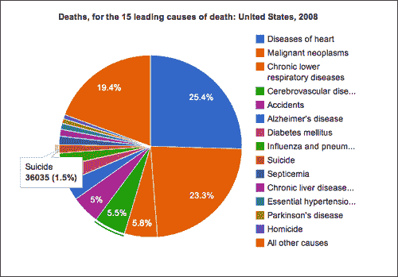
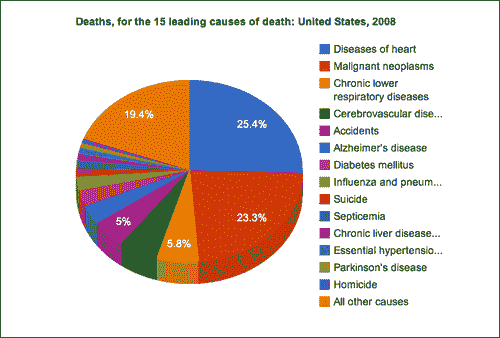
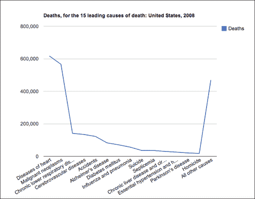
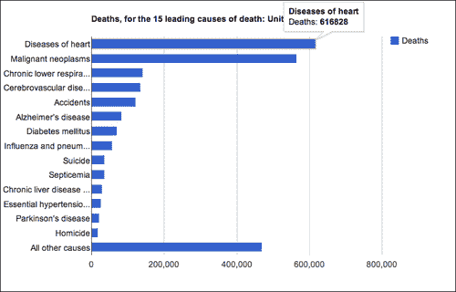
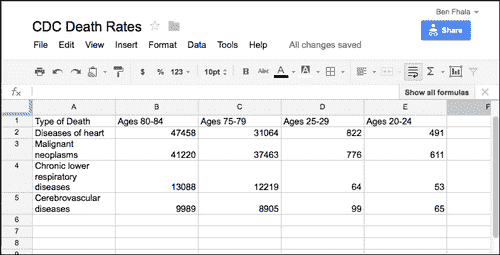
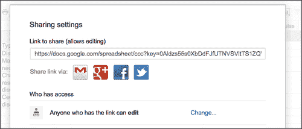
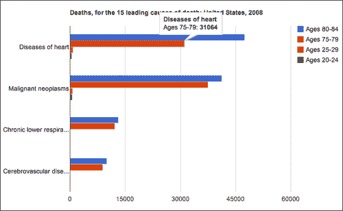
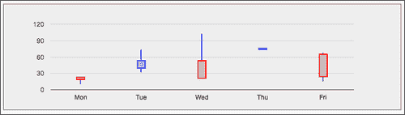
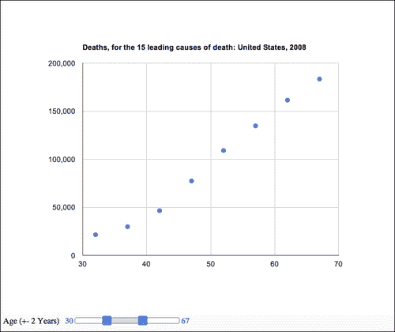

# 第八章：使用 Google 图表玩耍

在这一章中，我们将涵盖：

+   使用饼图开始

+   使用 ChartWrapper 创建图表

+   将数据源更改为 Google 电子表格

+   使用选项对象自定义图表属性

+   向图表添加仪表板

# 介绍

在这一章中，我们将逐个任务地探索 Google 可视化 API。我们将看一下创建图表并将其与图表 API 集成的步骤。

要使用 Google API，您必须遵守 Google 的使用条款和政策，可以在[`google-developers.appspot.com/readme/terms`](https://google-developers.appspot.com/readme/terms)找到。

# 使用饼图开始

在这个第一个示例中，我们将从 Google 图表开始，涵盖您在使用 Google 图表时需要了解的基本步骤，通过基于美国 CDC（LCWK）2008 年美国 15 个主要死因的死亡率的交互式数据集——死亡人数、总死亡人数的百分比以及按种族和性别分组的五年龄段内的死亡率。

## 准备工作

我们将从一个空的 HTML 文件和一个名为`08.01.getting-started.html`和`08.01.getting-started.js`的空 JavaScript 文件开始。

## 如何做...

让我们列出完成任务所需的步骤，从 HTML 文件开始：

1.  让我们从创建一个`head`并将其链接到 Google 的`jsapi`和我们的本地 JavaScript 文件开始：

```js
<!DOCTYPE html>
<html>
  <head>
    <title>Google Charts Getting Started</title>
    <meta charset="utf-8" />   
    <script src="img/jsapi"></script>
    <script src="img/08.01.getting-started.js"></script>
  </head>
```

1.  然后创建一个空的`div`，带有`id chart`：

```js
  <body style="background:#fafafa">
    <div id="chart"></div>
  </body>
</html>
```

现在，是时候进入`08.01.getting-started.js`文件了。

1.  让我们从 Google 的`jsapi`请求可视化 API：

```js
google.load('visualization', '1.0', {'packages':['corechart']});
```

1.  我们想要添加一个`callback`，当库准备就绪时将被触发：

```js
google.setOnLoadCallback(init);
```

1.  创建一个`init`函数如下：

```js
function init(){
..

}
```

从现在开始，我们将分解在`init`函数中添加的代码：

1.  创建一个新的 Google 数据对象，并按以下代码片段中所示提供数据源：

```js
data.addColumn('string', 'Type of Death');
data.addColumn('number', 'Deaths');
data.addRows([
        ['Diseases of heart', 616828],
        ['Malignant neoplasms', 565469],
        ['Chronic lower respiratory diseases', 141090], 
        ['Cerebrovascular diseases', 134148],
        ['Accidents', 121902],
        ['Alzheimer\'s disease', 82435],
        ['Diabetes mellitus', 70553],
        ['Influenza and pneumonia', 56284],
        ['Suicide', 36035],
        ['Septicemia', 35927],
        ['Chronic liver disease and cirrhosis', 29963],
        ['Essential hypertension and hypertensive renal disease', 25742],
        ['Parkinson\'s disease', 20483],
        ['Homicide', 17826],
        ['All other causes', 469062]

]);
```

1.  为图表创建一个`options`对象：

```js
var options = {'title':'Deaths, for the 15 leading causes of death: United States, 2008',
                     'width':800,
                     'height':600};
```

1.  使用以下代码片段创建并绘制图表：

```js
var chart = new google.visualization.PieChart(document.getElementById('chart'));
    chart.draw(data, options);
```

加载 HTML 文件。您将会发现一个工作的交互式图表，如下截图所示：



## 它是如何工作的...

让我们探索与 Google 图表一起工作的步骤。我们在使用 Google API 时首先要做的是将 Google 的 API 链接添加到我们的 HTML 文件中：

```js
 <script src="img/jsapi"></script>
```

现在，Google API 已加载到我们的应用程序中，我们可以请求我们希望使用的库。在我们的情况下，我们想要使用可视化 API 和`corechart`包：

```js
google.load('visualization', '1.0', {'packages':['corechart']});
```

请注意，我们正在请求版本 1.0；这可能会让人困惑，但实际上我们正在请求生产图表，1.0 始终是当前的生产版本。因此，如果您想要锁定一个版本，您需要发现它的代码版本并发送它，而不是 1.0 稳定版本。

在示例中，`corechart`库定义了大多数基本图表。对于未包含的图表，您需要传入所需的额外包，例如表格图表：

```js
google.load('visualization', '1.0', {'packages':['corechart','table']});
```

这涵盖了如何加载 API 的基础知识。但在我们完成加载过程之前，我们需要一种方式来进行回调，以便我们知道库何时可供我们操作：

```js
google.setOnLoadCallback(init);
```

我们正在请求 Google API 让我们知道包何时加载，方式类似于我们向文档添加回调的方式。当 API 加载完成时，是时候让我们开始与图表 API 进行交互了。

在每个 Google 图表中，您可能想要探索三个组件：

+   创建数据源

+   向您的图表添加选项

+   创建图表

让我们探索所有这些选项。

所有 Google 图表都需要数据源。数据源格式是基于通过图表 API 创建的内部对象：

```js
var data = new google.visualization.DataTable();
```

数据表是 2D 数组（或表）。它们像数据库一样有列和行。我们的下一步将是定义数据列：

```js
data.addColumn('string', 'Type of Death');
data.addColumn('number', 'Deaths');
```

在我们的情况下，由于我们正在使用饼图，只需要两行——一行用于命名我们的元素，另一行用于为它们提供值。`addColumn`方法只有一个强制参数来定义数据类型。数据类型可以是以下之一：

+   `字符串`

+   `数字`

+   `布尔`

+   `日期`

+   `日期时间`

+   `timeofday`

第二个参数是数据类型的可选描述，用于可视化，例如在我们的情况下是`10 Deaths`。还有其他参数，但只要我们按照顺序提供元素，我们就不需要探索它们。

最后但并非最不重要的，我们将调用`addRows`方法。我们可以调用`addRows`方法并发送一个一维数组（再次按照我们设置`addColumn`的数据顺序）。在我们的情况下，我们正在使用期望二维数组的`addRows`方法：

```js
data.addRows([
        ['Diseases of heart', 616828],
....
]);
```

这涵盖了我们的数据集。只要我们按照我们的数据顺序设置列并通过数组发送我们的信息，我们就不需要深入研究数据 API。

`options`对象使我们能够创建和修改图表的元素。我们在应用程序中控制的元素是宽度、高度和标题。

创建数据源并为我们的数组设置选项后，现在是简单的部分。创建图表的第一步是选择图表类型并定义它将被创建的位置。然后我们用数据源和选项来渲染它：

```js
var chart = new google.visualization.PieChart(document.getElementById('chart'));
chart.draw(data, options);
```

## 还有更多...

让我们探索一些谷歌图表的技巧和高级功能。使用选项`Objectto 创建 3D 图表`，我们可以将我们的图表转换为 3D。我们可以非常快速简单地将一个新参数添加到选项对象中：

```js
var options = {'title':'Deaths, for the 15 leading causes of death: United States, 2008',
                     'width':800,
                     'height':600,
                     "is3D": true};
```

结果将是一个在 3D 空间中倾斜的图表。



### 更改图表类型

更改图表类型并不复杂。只要图表类型共享相同数量的数据条目，更改通常只是从图表的实际构造对象中的一个单词。例如，我们可以通过更改调用可视化库中的方法来非常快速地切换图表类型：

```js
var chart = new google.visualization.LineChart(document.getElementById('chart'));
    chart.draw(data, options);
```

这将使用相同的数据，只是呈现为线图（`LineChart`对象）。



# 使用 ChartWrapper 创建图表

使用谷歌图表创建图表有两种方法。一种是我们在*使用饼图入门*中所做的方式，另一种将在本教程中介绍。ChartWrapper 对象的目标是使您能够减少创建图表所需的代码量。

它的主要优点是代码更少，数据源的灵活性更大。它的缺点是对图形创建步骤的控制较少。

## 做好准备

从上一个教程（*使用饼图入门*）中获取 HTML 文件。我们只会修改外部 JavaScript 文件的文件路径，其余代码将保持不变。

## 如何做...

在更改 HTML 文件源路径为 JavaScript 文件之后，现在是时候进入 JavaScript 文件并重新开始了：

1.  加载谷歌 API（您不需要再提及您想要加载的内容），并添加一个回调：

```js
google.load('visualization', '1.0');
google.setOnLoadCallback(init);
```

1.  创建`init`函数：

```js
function init(){
...
}
```

1.  使用数据源构建一个 2D 数组：

```js
var dataTable = [
        ['Type of Death','Deaths'],
        ['Diseases of heart', 616828],
        ['Malignant neoplasms', 565469],
        ['Chronic lower respiratory diseases', 141090], 
        ['Cerebrovascular diseases', 134148],
        ['Accidents ', 121902],
        ['Alzheimer\'s disease ', 82435],
        ['Diabetes mellitus', 70553],
        ['Influenza and pneumonia', 56284],
        ['Suicide', 36035],
        ['Septicemia', 35927],
        ['Chronic liver disease and cirrhosis', 29963],
        ['Essential hypertension and hypertensive renal disease', 25742],
        ['Parkinson\'s disease', 20483],
        ['Homicide', 17826],
        ['All other causes', 469062]
      ];
```

1.  创建`options`对象：

```js
var options = {'title':'Deaths, for the 15 leading causes of death: United States, 2008',
                     'width':800,
                     'height':600,
                     "is3D": true};
```

1.  构建和渲染图表：

```js
var chart = new google.visualization.ChartWrapper({
  chartType:'PieChart',
  dataTable:dataTable,
  options:options,
  containerId:'chart'

});
chart.draw();
```

您已经完成了创建这种图表类型。刷新您的屏幕，您将看到与上一个例子中相同的图表，只是使用了更少的代码。

## 它是如何工作的...

这个例子的好处是你不需要知道更多关于它是如何工作的。`ChartWrapper`函数本身处理了你在上一个教程中需要处理的所有信息。话虽如此，并不意味着这种方式总是更好的方式——如果你需要更多对步骤的控制，上一个例子会更好地工作。

## 还有更多...

由于这个教程非常简单，让我们添加一个额外的指针。

### 在一行中更改图表

在 Google Chart API 的不同视图类型之间切换非常容易。你只需要切换类型。让我们把我们的图表改成`BarChart`：

```js
var chart = new google.visualization.ChartWrapper({
  chartType:'BarChart',
  dataTable:dataTable,
  options:options,
  containerId:'chart'

});
```

刷新你的窗口，你会发现一个条形图。



# 将数据源更改为 Google 电子表格

与 Google API 合作的一个强大功能是产品线之间的深层关系。在这个配方中，基于上一个配方，我们将创建一个 Google 电子表格，然后将其整合到我们的应用程序中。

## 准备工作

在你周围备有上一个配方的源文件的副本（*使用 ChartWrapper 创建图表*）。

## 操作步骤...

创建新的 Google 文档所涉及的步骤很简单，但需要能够整合我们的工作；因此我们将快速地运行一遍。

1.  转到[`drive.google.com/`](http://drive.google.com/)（以前称为 Google Docs）并注册/登录。

1.  创建一个新的电子表格。

1.  向电子表格添加数据。

1.  点击**分享**按钮并将视图设置为公开：

1.  根据文档 ID 创建 API URL：

+   **文档链接**：

[`docs.google.com/spreadsheet/ccc?key=0Aldzs55s0XbDdFJfUTNVSVltTS1ZQWQ0bWNsX2xSbVE`](https://docs.google.com/spreadsheet/ccc?key=0Aldzs55s0XbDdFJfUTNVSVltTS1ZQWQ0bWNsX2xSbVE)

+   **API 链接**：

[`spreadsheets.google.com/tq?key=0Aldzs55s0XbDdFJfUTNVSVltTS1ZQWQ0bWNsX2xSbVE`](https://spreadsheets.google.com/tq?key=0Aldzs55s0XbDdFJfUTNVSVltTS1ZQWQ0bWNsX2xSbVE)

1.  现在，是时候进入我们的 JavaScript 文件，删除当前数据源，并用 URL feed 替换它：

```js
google.load('visualization', '1.0');

google.setOnLoadCallback(init);

function init(){
  var options = {'title':'Deaths, for the 15 leading causes of death: United States, 2008',
                     'width':800,
                     'height':600};
  var chart = new google.visualization.ChartWrapper({
    chartType:'BarChart',
 dataSourceUrl:"https://spreadsheets.google.com/tq?key=0Aldzs55s0XbDdFJfUTNVSVltTS1ZQWQ0bWNsX2xSbVE",
    options:options,
    containerId:'chart'

  });
  chart.draw();	
}
```

太棒了！看看我们需要多少代码才能创建一个丰富而完全交互的图表：



## 它是如何工作的...

这真的是令人惊讶的部分。你不需要理解它是如何工作的，你只需要创建你的图表，并使用前一节提供的步骤，你就可以将你自己的任何电子表格转换成 Google 电子表格。

在前面的步骤中，最重要的一步是第 4 步。注意通过 Google 文档（Google Drive）生成的 URL 与在代码中工作时需要访问的 URL 不同。这是因为第一个 URL 旨在呈现为可视页面，而第二个链接生成一个新的 Google 数据对象。不要忘记每个页面都有自己独特的 ID。

## 还有更多...

如果你有一点关于使用数据库的背景，你可以将简单的 SQL 查询发送到数据源，只获取你想要查看的项目。比如在我们的例子中，我们想以不同的顺序获取项目，排除 B 列，并根据 D 列（按年龄）进行排序：

```js
SELECT A,E,D,C ORDER BY D
```

我们的`Select`语句列出了我们想要选择的内容。`ORDER BY`语句不言自明。让我们把它添加到我们的代码中：

```js
var chart = new google.visualization.ChartWrapper({
  chartType:'BarChart',
  dataSourceUrl:"https://spreadsheets.google.com/tq?key=0Aldzs55s0XbDdFJfUTNVSVltTS1ZQWQ0bWNsX2xSbVE",
  query: 'SELECT A,E,D,C ORDER BY D',
  options:options,
  containerId:'chart'

});
```

当你刷新你的代码时，B 列将消失，数据将根据 D 列进行组织。

最后但并非最不重要的，将这添加到你的代码中：

```js
var chart = new google.visualization.ChartWrapper({
  chartType:'BarChart',
  dataSourceUrl:"https://spreadsheets.google.com/tq?key=0Aldzs55s0XbDdFJfUTNVSVltTS1ZQWQ0bWNsX2xSbVE",
  query: 'SELECT A,E,D,C ORDER BY D',
  refreshInterval: 1,
  options:options,
  containerId:'chart'

});
chart.draw();
```

现在回到公共图表并更改其中的数据。你会发现它会自动更新图表。

# 使用选项对象自定义图表属性

在这个配方中，我们将使用 Google Charts API 创建一个新的图表——蜡烛图，并将各种配置整合到其中。

## 准备工作

我们将通过创建一个全新的 JavaScript 和 HTML 文件开始一个干净的板。

## 操作步骤...

大多数步骤看起来几乎与本章中的过去的配方相同。我们的主要重点将放在我们的`options`参数上：

1.  创建一个 HTML 文件并将其链接到一个 JavaScript 文件（在我们的例子中是`08.04.candlestick.js`）：

```js
<!DOCTYPE html>
<html>
  <head>
    <title>Google Charts Getting Started</title>
    <meta charset="utf-8" />   
    <script src="img/jsapi"></script>
    <script src="img/08.04.candlestick.js"></script>		
  </head>
  <body style="background:#fafafa">
    <div id="chart"></div>
  </body>
</html>
```

1.  在`08.04.candlestick.js`文件中，添加 API 的`load`和`callback`函数：

```js
google.load('visualization', '1', {packages: ['corechart']});
google.setOnLoadCallback(init);

function init(){
```

1.  在`init`函数中（从现在开始到本配方结束，我们将一直保持在`init`函数中），使用`google.visualization.arrayToDataTable`方法创建一个新的`DataTable`对象：

```js
  var data = google.visualization.arrayToDataTable([
    ['Mon', 10, 24, 18, 21],
    ['Tue', 31, 38, 55, 74],
    ['Wed', 50, 55, 20, 103],
    ['Thu', 77, 77, 77, 77],
    ['Fri', 68, 66, 22, 15]
  ], true);
```

1.  为图表创建一个`options`对象（配置对象）：

```js
  var options = {
    legend:'none',
    backgroundColor:{fill:'#eeeeee',strokeWidth:2},
    bar:{groupWidth:17},
    candlestick:{hollowIsRising:true,
      fallingColor:{stroke:'red',fill:'#ffaaaa'},
      risingColor: {stroke:'blue',fill:'#aaaaff'}
    },
    enableInteractivity:false

  };
```

1.  使用以下代码片段绘制图表：

```js
  var chart = new google.visualization.CandlestickChart(document.getElementById('chart'));
  chart.draw(data, options);

}
```

加载 HTML 文件后，您将发现一个定制的蜡烛图表，如下截图所示：



## 它是如何工作的...

这是我们第一次使用`google.visualization.arrayToDataTable`方法。该方法接受一个数组并返回一个数据表。当此方法的第二个参数设置为`true`时，它将将数组中的第一行视为数据的一部分；否则，它将被视为标题数据。 

有许多选项，有关完整列表，请参阅 Google Charts 文档。我们将专注于我们选择修改视图的项目。Google 图表使您能够发送带有参数的对象。每种图表类型都有不同的选项集。在我们的情况下，我们有许多选项，使我们能够控制图表外观的细节。大多数选项与样式相关：

```js
backgroundColor:{fill:'#eeeeee',strokeWidth:2},
  bar:{groupWidth:17},
  candlestick:{hollowIsRising:true,
   fallingColor:{stroke:'red',fill:'#ffaaaa'},
  risingColor: {stroke:'blue',fill:'#aaaaff'}
  },
```

一些选项直接与功能相关，例如禁用图例：

```js
legend:'none',
```

或者禁用交互元素：

```js
enableInteractivity:false
```

## 还有更多...

突出显示这个元素的主要目的不是因为它很难，而是因为它很容易，这是您会发现自己对图表进行更改的主要地方。需要注意的一点是，在使用 Google Charts 之前，确保您可以通过使用 Google Charts 来做您需要的事情，因为与其他图表系统相反，您不能进入它们的源文件并对其进行更改，就像我们在第七章的示例中所做的那样，*依赖于开源领域*。

# 向图表添加仪表板

在本章的最后一个示例中，我们将添加实时控制器，使用户可以更改数据的过滤，以查看更少或更多的信息。

## 准备就绪

我们将从头开始，所以不用担心。

## 如何操作...

以下是创建基本仪表板控制器所需的步骤：

1.  创建一个 HTML 文件并将其链接到外部 JavaScript 文件（在我们的例子中，我们将使用文件`08.05.slider.js`）：

```js
<!DOCTYPE html>
<html>
  <head>
    <title>Google Charts DASHBOARD</title>
    <meta charset="utf-8" />   
    <script src="img/jsapi"></script>
    <script src="img/08.05.slider.js"></script>		
  </head>
  <body style="background:#fafafa">
 <div id="chart"></div>
 <div id="dashboard"></div>
 <div id="filter"></div>
  </body>
</html>
```

1.  现在，是时候进入`08.05.slider.js`并加载 Google Visualization API 了。这一次我们将加载控制器包：

```js
google.load('visualization', '1', {packages: ['controls']});
```

1.  现在，是时候添加一个回调了：

```js
google.setOnLoadCallback(init);
function init(){
```

1.  让我们创建我们的数据源。我们将以 2008 年 CDC 死亡率为基础：

```js
var data = google.visualization.arrayToDataTable([
    ['Age (+- 2 Years)', 'Deaths'],
        [2, 4730],
        [7, 2502],
        [12, 3149], 
        [17, 12407],
        [22, 19791],
        [27,20786],
        [32,21489],
        [37,29864],
        [42,46506],
        [47,77417],
        [52, 109125],
        [57,134708],
        [62,161474],
        [67,183450],
        [72,218129],
        [77,287370],
        [82,366190],
        [87,372552],
        [92,251381],
         [100,20892],
    ]);
```

1.  然后创建一个新的仪表板：

```js
var dashboard = new google.visualization.Dashboard(document.getElementById('dashboard'));
```

1.  让我们创建一个滑块并为其提供连接到数据源所需的信息：

```js
  var slider = new google.visualization.ControlWrapper({
    containerId: 'filter',
    controlType: 'NumberRangeFilter',
    options: {
    filterColumnLabel: 'Age (+- 2 Years)'
  }
});
```

1.  创建一个图表：

```js
var chart = new google.visualization.ChartWrapper({
  chartType: 'ScatterChart',
  containerId: 'chart',
  options: {
    legend: 'left',
    title:'Deaths, for the 15 leading causes of death: United States, 2008',
    width: 800,
    height: 600

  }
});
```

1.  最后但并非最不重要的，是时候绑定和绘制我们的控制器了：

```js
dashboard.bind(slider, chart).draw(data);			
}
```

加载 HTML 文件，您将发现一个散点图，带有一个控制器，可以选择您想要深入了解的年龄范围。



## 它是如何工作的...

这可能是使用 Google 图表 API 中最顺畅的部分之一。因此，让我们分解并弄清楚创建图表控制器涉及的步骤。我们将展示一个控制器，但相同的逻辑流程适用于所有组件。

首先，在我们的 HTML 文件中，我们需要有一个与我们的仪表板关联的`div`层和每个后续控制器的`div`。要添加控制器，我们将它们分配给仪表板。我们首先创建一个仪表板：

```js
var dashboard = new google.visualization.Dashboard(document.getElementById('dashboard'));
```

这个仪表板现在将成为我们连接所有控制器的中心（在我们的情况下，一个控制器）。然后，我们将创建下一个控制器；在我们的情况下，我们想使用一个滑块：

```js
var slider = new google.visualization.ControlWrapper({
  containerId: 'filter',
  controlType: 'NumberRangeFilter',
  options: {
    filterColumnLabel: 'Age (+- 2 Years)'
  }
});
```

请注意，我们正在添加一个控件类型以获取我们的范围滑块，并通过给它列 ID（第一行中的标签）来将其链接到列。

我们继续以与之前相同的方式创建图表。在这种情况下，我们选择了散点图。这里的顺序并不重要，但最重要的部分是连接我们的控制器和图表。我们通过使用`dashboard.bind`方法来实现这一点：

```js
dashboard.bind(slider, chart);	
```

然后，当创建一个`bind`函数时，我们将我们的元素绘制为我们的仪表板返回自身：

```js
dashboard.bind(slider, chart).draw(data);
```

如果我们想的话，我们可以将其拆分为如下的单独行：

```js
dashboard.bind(slider, chart);
dashboard.draw(data);
```

现在你知道如何使用仪表板了。这些步骤很关键，但现在你可以添加任何控制器。这个产品的其余文档是不言自明的。
