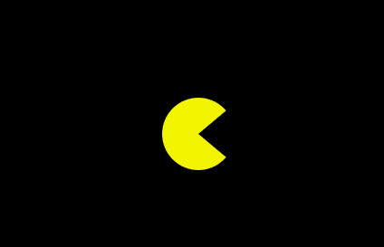
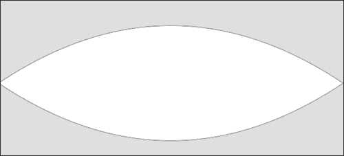
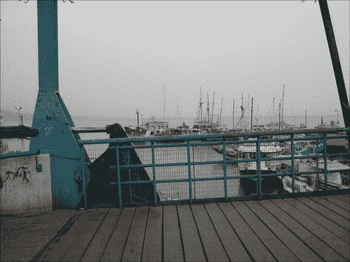

# 二、画布中的高级绘图

*   绘制弧线
*   用控制点绘制曲线
*   创建贝塞尔曲线
*   将图像融入我们的艺术
*   用文本绘图
*   理解像素操作

# 简介

这是最后一章，我们将深入挖掘画布，因为剩下的章节将侧重于构建图表和交互性。

在这一章中，我们将继续通过在我们的工具带上添加曲线、图像、文本甚至像素操作来掌握画布技巧。

# 绘制弧线

我们可以在画布中创建三种类型的曲线—使用圆弧、二次曲线和贝塞尔曲线。我们开始吧。

## 做好准备

如果你还记得在[第一章](01.html "Chapter 1. Drawing Shapes in Canvas")、*在画布*中绘制形状，在我们的第一个食谱中，我们使用了圆弧法来创建完美的圆。arc 方法远不止于此。我们实际上可以创建任何圆形的局部曲线。如果你不记得画圆了，我强烈建议你再浏览一遍[第一章](01.html "Chapter 1. Drawing Shapes in Canvas")、*在画布*中绘制形状，当你在那里的时候，你也会找到创建 HTML 文档的模板。我们将专门关注这个食谱中的 JavaScript 代码。

## 怎么做...

让我们跳进去创建我们的第一个有曲线的非圆:

1.  使用以下代码片段访问`pacman`画布元素并获取其宽度和高度:

    ```html
    var canvas = document.getElementById("pacman");
    var wid = canvas.width;
    var hei = canvas.height;
    ```

2.  创建一个`radian`变量(弧度为一度):

    ```html
    var radian = Math.PI/180;
    ```

3.  获取画布上下文，并使用以下代码片段将其背景填充为黑色:

    ```html
    var context = canvas.getContext("2d");
      context.fillStyle = "#000000";
      context.fillRect(0,0,wid,hei);
    ```

4.  开始绘制前先开始新路径:

    ```html
      context.beginPath();
    ```

5.  更改填充样式颜色:

    ```html
      context.fillStyle = "#F3F100";
    ```

6.  将指针移动到屏幕中心:

    ```html
      context.moveTo(wid/2,hei/2);
    ```

7.  在屏幕中心画一条从 40 度开始到 320 度结束(半径 40°)的曲线:

    ```html
      context.arc(wid / 2, hei / 2, 40, 40*radian, 320*radian, false);
    ```

8.  通过画一条线回到形状的起点来关闭形状:

    ```html
      context.lineTo(wid/2,hei/2);
    ```

9.  关闭路径并填充形状:

    ```html
      context.closePath();
      context.fill();
    ```

您刚刚创建了一个 PacMan。

## 怎么做...

我们第一次利用优势创建了一个饼图形状，称为 PacMan(当我们开始创建饼图时，您可以看到这是多么有用)。非常简单——我们再次联系到弧度的概念:

```html
context.arc(wid / 2, hei / 2, 40, 40*radian, 320*radian, false);
```

请注意，我们的第 4 个和第 5 个参数(而不是从 0 开始到`2*Math.PI`结束的完整圆)是如何设置角度的，以弧度 40 开始，以弧度 320 结束(保持 80 度打开以创建 PacMan 的口)。剩下的就是从圆心开始画:

```html
context.moveTo(wid/2,hei/2);
context.arc(wid / 2, hei / 2, 40, 40*radian, 320*radian, false);
context.lineTo(wid/2,hei/2);
```

我们从把指针移到圆心开始。然后我们创建弧。因为我们的弧线不是一个完整的形状，所以它在我们停止的地方继续——从弧线的中心到起点(40 度)画一条线。我们通过画一条线回到弧的中心来完成动作，从而完成形状。现在我们准备填补它，完成我们的工作。



现在我们已经排除了弧，您可以看到这对于创建饼图是多么有用。

# 用控制点绘制曲线

如果世界只是两个具有完美弧线的点，那么这个将是本书的结尾，但是，唉，还是我们幸运，还有很多更复杂的形状需要学习和探索。有许多曲线不是完全对齐的曲线。到目前为止，我们创造的所有曲线都是完美圆的一部分，但不再是了。在这个食谱中，我们将探索二次曲线。二次曲线使我们能够通过添加第三个点(控制曲线的控制器)来创建非圆形的曲线。通过查看下图，您可以轻松理解这一点:


一条**二次曲线** 是一条有一个控制点的曲线。考虑一下在创建一条线时的情况，我们将它画在两点之间(本图中的 A 和 B)。当我们想要创建一条二次曲线时，我们使用外部重力控制器来定义曲线的方向，而中间的线(虚线)定义曲线将到达多远。

## 做好准备

就像在之前的食谱中一样，我们在这里也跳过了 HTML 部分——并不是说它不需要，它只是在每个食谱中重复出现，如果你需要刷新自己如何获得 HTML 设置，请看看[第 1 章](01.html "Chapter 1. Drawing Shapes in Canvas")、*在画布*中绘制形状的*2D 画布图形*食谱。

## 怎么做...

在这个例子中，我们将创建一个闭合形状，看起来像一个非常基本的眼睛。让我们开始吧:

1.  我们总是需要从提取我们的画布元素开始，设置我们的宽度和高度变量，定义一个弧度(因为我们发现有一个弧度很有用):

    ```html
    var canvas = document.getElementById("eye");
      var wid = canvas.width;
      var hei = canvas.height;
      var radian = Math.PI/180;
    ```

2.  接下来，用纯色填充我们的画布，然后通过触发`beginPath`方法开始新的形状:

    ```html
    var context = canvas.getContext("2d");
      context.fillStyle = "#dfdfdf";
      context.fillRect(0,0,wid,hei);
      context.beginPath();
    ```

3.  定义我们眼睛形状的线条宽度和笔画颜色:

    ```html
      context.lineWidth = 1;
      context.strokeStyle = "#000000"; // line color	
      context.fillStyle = "#ffffff";
    ```

4.  将我们的绘图指针移动到左中心点，因为我们需要在屏幕中心从左到右画一条线，然后返回(只画一条曲线):

    ```html
      context.moveTo(0,hei/2);
    ```

5.  使用锚点从我们的起点到画布的另一侧画两条二次曲线，然后回到起点，锚点位于画布区域的最顶端，然后是最底端:

    ```html
      context.quadraticCurveTo(wid / 2, 0, wid,hei/2);
      context.quadraticCurveTo(wid / 2, hei, 0,hei/2);
    ```

6.  关闭路径。填充形状，使用形状上的`stroke`方法(`fill`填充内容，`stroke`填充轮廓):

    ```html
      context.closePath();
      context.stroke();
      context.fill();
    ```

干得好！您刚刚使用`quadraticCurveTo`方法创建了第一个形状。

## 它是如何工作的...

让我们仔细看看这个方法:

```html
context.quadraticCurveTo(wid / 2, 0, wid,hei/2);
```

由于我们已经在原点(点 A)，我们输入另外两个点——控制点和点 b

```html
context.quadraticCurveTo(controlX, controlY, pointB_X, pointB_Y);
```

在我们的示例中，我们创建一个包含的形状——创建眼睛的起点。玩控制器，看看它如何影响曲线的方向和大小。经验法则是，越靠近垂直线，曲线就越不陡峭，离中心点越远，偏移的曲线形状就越弯曲。



# 创建贝塞尔曲线

我们刚刚了解到，对于二次曲线，我们有一个控制点。虽然我们可以用一个控制点做很多事情，但我们并没有真正完全控制曲线。让我们更进一步，再增加一个控制点。增加第二个控制点实际上也增加了这两点之间的关系，使其成为三个控制因素。如果我们包括实际的锚点(我们有两个锚点)，我们会得到控制曲线形状的五个点。这听起来确实很复杂；这是因为我们得到的控制越多，实际理解它是如何工作的就越复杂。仅仅通过代码来计算复杂的曲线真的不容易，因此我们实际上使用其他工具来帮助我们计算出正确的曲线。

为了证明前面的观点，我们可以找到一个非常复杂的形状，并从那个形状开始(不要担心，在本食谱的后面，我们将在一个非常简单的形状上练习，以使概念清晰)。我们将选择画加拿大的国旗，主要是枫叶。


## 做好准备

这个食谱很难理解，但是我们将在下面的*中详细介绍它是如何工作的...*段。所以如果你是曲线新手，我强烈建议你从这个*开始学习它是如何工作的...*实施前的部分。

## 怎么做...

让我们创造加拿大的国旗。让我们直接进入 JavaScript 代码:

1.  创建画布和上下文:

    ```html
    var canvas = document.getElementById("canada");
    var wid = canvas.width;
    var hei = canvas.height;

    var context = canvas.getContext("2d");
    ```

2.  填充背景以匹配加拿大国旗的背景:

    ```html
    context.fillStyle="#FF0000";
    context.fillRect(0,0,50,100);
    context.fillRect(wid-50,0,50,100);
    ```

3.  开始新的路径，并将指针移动到`84,19` :

    ```html
    context.beginPath();
    context.moveTo(84,19);
    ```

4.  绘制曲线和线条来创建枫叶:

    ```html
    context.bezierCurveTo(90,24,92,24,99,8);
    context.bezierCurveTo(106,23,107,23,113,19);
    context.bezierCurveTo(108,43,110,44,121,31);
    context.bezierCurveTo(122,37,124,38,135,35);
    context.bezierCurveTo(130,48,131,50,136,51);
    context.bezierCurveTo(117,66,116,67,118,73);
    context.bezierCurveTo(100,71,99,72,100,93);
    context.lineTo(97,93);
    context.bezierCurveTo(97,72,97,71,79,74);
    context.bezierCurveTo(81,67,80,66,62,51);
    context.bezierCurveTo(67,49,67,48,63,35);
    context.bezierCurveTo(74,38,75,37,77,31);
    context.bezierCurveTo(88,44,89,43,84,19);
    ```

5.  关闭路径并填充形状:

    ```html
    context.closePath();
    context.fill();	
    ```

现在，你已经创造了加拿大的国旗。我不知道你是否已经知道为什么它会工作，或者我们是如何得到我们放入曲线中的明显随机的数字来创建旗帜的，但是你已经创建了加拿大的旗帜！别担心，我们将在下一节马上解密曲线的魔力。

## 它是如何工作的...

在我们解释加拿大国旗如何工作的细节之前，我们应该后退一步，创建一个更简单的例子。在这个简短的例子中，我们将使用`bezierCurveTo`方法创建一个椭圆形。

```html
context.moveTo(2,hei/2);
  context.bezierCurveTo(0, 0,wid,0, wid-2,hei/2);
  context.bezierCurveTo(wid, hei,0,hei, 2,hei/2);
  context.closePath();
  context.stroke();
  context.fill();
```

就这样。以下是你从中获得的结果:


如果你得到了这个，你的状态就很好。我们现在将解释这是如何工作的，然后进入我们如何计算出加拿大国旗的所有点。我们再次利用整个画布，通过将两个控制器设置为画布的角来控制我们的控制器:

```html
context.bezierCurveTo(controlPointX1, controlPointY1, controlPointX2, controlPointY2, pointBX, pointBY);
```

摆弄一下控制器，看看你通过使用两个点获得了多少控制——当你需要对曲线进行更详细的控制时，这非常有用。

这是我们完整旗帜的完整范例的核心。我强烈建议您探索更改控制点值的影响，以便更好地理解和敏感。是时候让我们回到我们的旗帜上，看看我们是如何构建它的。

是时候采用我们最复杂的绘图风格——贝塞尔曲线——并用比椭圆更有趣的东西来实现它们了。我有一个坦白:当我决定从头开始创建加拿大国旗时，我害怕了。我在想“我该怎么做？这将花费我几个小时，”然后它袭击了我...很明显，这个标志需要用很多贝塞尔点来创建，但是我怎么知道这些点应该在哪里呢？因此，对于如此高级的形状，我打开了我的图形编辑器(在我的例子中是 Flash 编辑器)，并向枫树形状添加了枢轴点:


如果仔细看前面的图，我基本上是描摹了加拿大的国旗，并在每个尖角上放置了一个黑点。然后我创建了一个画布，并画了线，看看我得到的基础形状是否在正确的整体位置(顺便说一下，我只是通过选择 Flash 中的点来查看它们的(x，y)坐标是否与 Flash 和画布坐标系相同，从而得到这些点)。

```html
var context = canvas.getContext("2d");
context.beginPath();
context.moveTo(84,19);
context.lineTo(99,8);
context.lineTo(113,19);
context.lineTo(121,31);
context.lineTo(135,35);
context.lineTo(136,51);
context.lineTo(118,73);
context.lineTo(100,93);
context.lineTo(97,93);
context.lineTo(79,74);
context.lineTo(62,51);
context.lineTo(63,35);
context.lineTo(77,31);
context.lineTo(84,19);

context.closePath();
context.stroke();
```

我得到了一个远非我所期望的形状。但是现在我知道我的形状正在朝着正确的方向形成。缺少的是点与点之间连接的曲线。如果你再看一下前面的图，你会注意到我在每个尖角之间放置了两个蓝色的点来定义曲线的位置以及它们有多尖或多软。然后我移回画布，然后更新值，得到两个控制点。我添加了所有的曲线，并从创建笔画切换到创建填充。

```html
var context = canvas.getContext("2d");
 context.fillStyle="#FF0000";
 context.fillRect(0,0,50,100);
 context.fillRect(wid-50,0,50,100);

  context.beginPath();
  context.moveTo(84,19);
 context.bezierCurveTo(90,24,92,24,99,8);
 context.bezierCurveTo(106,23,107,23,113,19);
 context.bezierCurveTo(108,43,110,44,121,31);
 context.bezierCurveTo(122,37,124,38,135,35);
 context.bezierCurveTo(130,48,131,50,136,51);
 context.bezierCurveTo(117,66,116,67,118,73);
 context.bezierCurveTo(100,71,99,72,100,93);
 context.lineTo(97,93);
 context.bezierCurveTo(97,72,97,71,79,74);
 context.bezierCurveTo(81,67,80,66,62,51);
 context.bezierCurveTo(67,49,67,48,63,35);
 context.bezierCurveTo(74,38,75,37,77,31);
 context.bezierCurveTo(88,44,89,43,84,19);
  context.closePath();
  context.fill();	
```

答对了。我刚刚得到了一个几乎完美的旗帜，我觉得这对于这个样本来说已经足够了。

暂时不要试图自己创造非常复杂的形状。也许有一些人可以做到这一点，但对我们其他人来说，最好的方法是使用某种可视化编辑器来跟踪元素。然后，我们可以抓取图形信息，并更新画布中的值，就像我对加拿大国旗示例所做的那样。

在这个阶段，我们已经覆盖了画布中可以覆盖的最复杂的形状。本章的其余部分专门介绍了操纵屏幕内容的其他方式。

# 将图像融入我们的艺术

幸运的是，我们不需要总是从头开始，我们可以将更复杂的艺术留给外部图像。让我们弄清楚如何将图像整合到画布中。

## 做好准备

在这一章中，我们讨论了一个旗帜主题，现在在我们的腰带下放另一面旗帜听起来真的很好。让我们把头转向海地，让他们的旗帜飘扬起来。要创建这个标志，我们需要将符号的图像放在标志的中心。


在源文件中，你会发现一个中心图形的图像(在`img/haiti.png`)。顺便说一下，当将艺术集成到画布中时，最好尽可能避免通过代码来调整图像大小，以保持图像质量。

## 怎么做...

我们将准备背景来匹配标志，然后将整个图像放在画布/标志的中心:

1.  遵循我们访问画布所需的基本步骤。设置宽度、高度和实际上下文:

    ```html
    var canvas = document.getElementById("haiti");
      var wid = canvas.width;
      var hei = canvas.height;

      var context = canvas.getContext("2d");	
    ```

2.  绘制背景元素:

    ```html
    context.fillStyle="#00209F";
    context.fillRect(0,0,wid,hei/2);
    context.fillStyle="#D21034";
    context.fillRect(0,hei/2,wid,hei/2);
    ```

3.  创建新的`Image`对象:

    ```html
    var oIMG = new Image();

    ```

4.  创建一个`onLoad`函数(加载图像时调用):

    ```html
    oIMG.onload = function(){
    context.drawImage(this, (wid-this.width)/2, (hei-this.height)/2);
    };
    ```

5.  设置图像来源:

    ```html
    oIMG.src = "img/haiti.png";
    ```

是的，把图像添加到画布上是那么容易，但是让我们更深入地回顾一下刚才所做的事情。

## 它是如何工作的...

创建图像的步骤包括下载其数据，然后以与在画布中相同的方式创建新的图像容器:

```html
var oIMG = new Image();
```

下一步是创建一个侦听器，该侦听器将在映像加载并准备使用时被触发:

```html
oIMG.onload = theListenerFunctionHere;
```

加载过程的最后一步是告诉 canvas 应该加载什么图像。在我们的情况下，我们正在加载`img/haiti.png`:

```html
oIMG.src = "img/haiti.png";
```

加载图像并准备好使用它只是第一步。如果我们在没有告诉 canvas 如何使用它的情况下运行我们的应用，除了加载图像之外，什么也不会发生。

在我们的例子中，当我们的侦听器被触发时，我们将图像原样添加到屏幕中心:

```html
context.drawImage(this, (wid-this.width)/2, (hei-this.height)/2);
```

这就是将图像集成到画布项目中所需的全部内容。

## 还有更多...

除了将图像用作背景，我们还可以对画布中的图像进行更多的操作。我们可以精确定义我们想要的图像部分(缩放)。我们可以调整整个图像的大小和操作(缩放)。我们甚至可以像素操作我们的图像。我们可以用图像做很多事情，但是在接下来的几个主题中，我们将讨论一些更常用的。

### 缩放图像

我们可以通过向`drawImage`功能添加两个参数来缩放图像，该功能设置图像的宽度和高度。尝试以下方法:

```html
context.drawImage(this, (wid-this.width)/2, (hei-this.height)/2 , 100, 120);
```

在前面的示例中，我们加载了相同的图像，但是我们强制调整了图像的大小(请注意，位置不会在舞台的实际中心)。

### 增加更多控制

您可以控制图像的许多方面。如果您需要比前一个示例更多的控制，则需要输入全部可能的坐标:

```html
context.drawImage(this, sourceX, sourceY, sourceWidth, sourceHeight, destX, destY, destWidth, destHeight);
```

在这种情况下，顺序已经改变(注意！).现在，`this`后的前两个参数是图像的局部 x 和 y 坐标，后面是宽度和高度(创建我们正在讨论的裁剪)，后面是画布上的位置及其控制信息(x，y，宽度和高度)。

在我们的例子中:

```html
context.drawImage(this, 25,25,20,20,0,0,50,50);
```

前面的代码行意味着我们想要从它的内部位置(25，25)获取图像，并且我们想要从那里切割出一个 20 x 20 的矩形。然后，我们希望将这个新的裁剪图像放置在(0，0)处，即画布的右上角，并且我们希望输出是一个 50 x 50 的矩形。

### 使用图像作为填充

我们也可以使用我们的加载图像来填充对象:

```html
var oIMG = new Image();
  oIMG.onload = function(){
    var pattern = context.createPattern(this, "repeat");
    createStar(context,wid/2,hei/2,20,50,20,pattern,"#ffffff",20);
  };
  oIMG.src = "img/haiti.png";
```

加载图像后(总是在加载图像后，您开始操纵它)，我们创建一个基于图像重复的模式:

```html
var pattern = context.createPattern(this, "repeat");
```

然后我们可以使用这个模式作为我们的填充。因此，在本例中，我们使用以下模式调用我们在早期任务中创建的`createStar`(在屏幕中心画一颗星):

```html
createStar(context,wid/2,hei/2,20,50,20,pattern,"#ffffff",20);
```

这就结束了我们对旗帜的痴迷，让我们转向那些不会出现在旗帜上的形状。顺便说一句，在这个阶段，你应该能够创建世界上所有的旗帜，并利用集成图像的优势，当从头开始绘制它并不有趣的时候——比如详细的国家标志。

# 用文字绘图

我同意，我们一直在做一些复杂的事情。现在，是时候让我们休息一下，脱掉鞋子，做些更轻松的事情了。

## 做好准备

好消息是，如果你在这一页上，你应该已经知道了让画布运行起来的基本知识。因此，除了选择文本的字体、大小和位置之外，您不需要做更多的事情。

### 注

在这里，我们不涉及如何嵌入不是在 JavaScript 中创建的字体，而是通过 CSS，我们将使用一种基本字体，并希望在这个示例中达到最佳效果。


## 怎么做...

在本例中，我们将创建一个文本字段。在这个过程中，我们将首次使用渐变和阴影。请执行以下步骤:

1.  访问画布 2D 应用编程接口:

    ```html
    var canvas = document.getElementById("textCanvas");
      var wid = canvas.width;
      var hei = canvas.height;

      var context = canvas.getContext("2d");
    ```

2.  创建渐变样式并用它填充背景:

    ```html
    var grd = context.createLinearGradient(wid/2, hei/2, wid, hei);
      grd.addColorStop(0, "#8ED6FF"); 
      grd.addColorStop(1, "#004CB3")
      context.fillStyle= grd;
      context.fillRect(0,0,wid,hei);
    ```

3.  创建文本使用的渐变:

    ```html
      grd = context.createLinearGradient(100, hei/2, 200, hei/2+110);
      grd.addColorStop(0, "#ffff00"); 
      grd.addColorStop(1, "#aaaa44");
    ```

4.  定义要使用的字体并设置样式:

    ```html
      context.font = "50pt Verdana, sans-serif";
      context.fillStyle = grd;
    ```

5.  绘制文字前添加阴影细节:

    ```html
      context.shadowOffsetX = 0;
      context.shadowOffsetY = 0;
      context.shadowBlur    = 8;
      context.shadowColor   = 'rgba(255, 255, 255, 0.5)';
    ```

6.  使用`fillText` 填充形状，使用`strokeText`填充形状的轮廓(请注意，我将文本称为形状；这是因为一旦我们画了它，它将只是我们画布的一部分，而不是实时文本):

    ```html
      context.fillText("Hello World!", 100, hei/2);
      context.strokeStyle = "#ffffff";
      context.strokeText("Hello World!", 100, hei/2);
    ```

就这样，我们刚刚将第一个绘制的文本集成到画布中。

## 它是如何工作的...

直到现在，我们还停留在的纯色上。我们现在将打破这种状态，进入渐变颜色的新世界。请参考以下代码片段:

```html
var grd = context.createLinearGradient(wid/2, hei/2, wid, hei);
  grd.addColorStop(0, "#8ED6FF"); 
  grd.addColorStop(1, "#004CB3");
```

创建渐变需要几个步骤。第一步是定义其范围:

```html
var grd = context.createLinearGradient(x1, y1, x2, y2);
```

与许多其他语言相反，在画布中定义渐变的旋转和大小非常容易。如果你以前使用过 Photoshop，你会发现这真的很容易(即使你没有，也会很容易)。

你所需要做的就是定义你想要渐变开始的位置和结束的位置。可以将两个点送入方法`createLinearGradient`:

```html
grd.addColorStop(0, "#8ED6FF"); 
grd.addColorStop(1, "#004CB3");
```

在这个过渡中，我们只使用两种颜色。将它们放在 0 到 1 之间的值上。这些值是比率，所以我们，换句话说，请求从渐变区域的开始一直扩展到结束。我们可以添加更多的颜色，但是我们的目标是将它们都绑定在 0 比 1 的比例内。添加的颜色越多，就越需要处理发送到第一个参数中的值。

您刚刚完成创建渐变。使用它的时间:

```html
context.fillStyle= grd;
context.fillRect(0,0,wid,hei);
```

在这一部分，我们将再次使用`fillStyle`方法，然后创建一个矩形。

请注意您可能发送到`addColorStop`方法的数值范围的重要性。当您在渐变中添加更多的颜色时，这里发送的值的重要性就越明显。这些点不是计数器，而是我们样本中的颜色比率。过渡在两种颜色之间，范围从 0 到 1，或者换句话说，它们从我们发送到`createLinearGradient`方法的第一点一直过渡到最后一点。当我们使用两种颜色时，这是最适合我们的比例。

虽然我们没有进入径向梯度，但它们对你来说应该很容易，因为我们已经了解了很多关于径向形状和梯度的知识。该方法的签名如下:

```html
context.createRadialGradient(startX,startY,startR, endX,endY,endR);
```

唯一不同的是，我们的形状是放射状的。我们还想在其中添加起始半径和终止半径。你可能想知道为什么我们需要两个甚至更多的半径。那么为什么不能根据两点(起点和终点)之间的距离算出半径呢？我希望你对此感到好奇，如果你没有，在阅读下一段之前，先考虑一下。

我们对半径有单独的控制，主要是使我们能够分开半径，并使我们能够在绘图中移动焦点，而不改变实际的艺术或重新计算颜色的比例。一个很好的方法是在画月亮的时候看这个。月亮的梯度会随着时间而变化，或者更准确地说，颜色的半径和半径的位置会随着时间而变化，这取决于月亮相对于太阳的位置。

我们还没有完成。我们刚刚掌握了所有我们需要了解的关于渐变的知识，现在是时候将一些文本整合到其中了。

```html
context.font = "50pt Verdana, sans-serif";
context.fillText("Hello World!", 100, hei/2);
```

我们设置全局字体值，然后创建一个新的文本元素。`fillText`方法得到三个参数；首先是要使用的文本，而另外两个是新元素的 x 和 y 位置。

```html
context.strokeStyle = "#ffffff";
context.strokeText("Hello World!", 100, hei/2);
```

在我们的例子中，我们给我们的文本绘制了一个填充和一个轮廓。这两个函数是分开调用的。`fillText`方法用于填充形状的内容，而`strokeText`方法用于勾勒文本。我们可以使用其中的任何一种或两种方法，它们可以获得完全相同的参数。

## 还有更多...

你可以探索更多的选择。

### 在文本中使用渐变

如果你可以对画布中的任何图形元素做任何事情，你也可以对文本做任何事情——例如，在我们的示例中，我们对文本使用渐变。

```html
grd = context.createLinearGradient(100, hei/2, 200, hei/2+110);
  grd.addColorStop(0, "#ffff00"); 
  grd.addColorStop(1, "#aaaa44");

  context.font = "50pt Verdana, sans-serif";
  context.fillStyle = grd;
```

请注意，我们正在更新我们的梯度。我们的最后一个渐变对如此小的文本区域来说太大了。因此，我们从文本的开始处画一条线，水平延伸 110 像素。

### 添加阴影和发光

您可以为任何填充的元素添加阴影/光晕:

```html
context.shadowOffsetX = 0;
  context.shadowOffsetY = 0;
  context.shadowBlur    = 8;
  context.shadowColor   = 'rgba(255, 255, 255, 0.5)';
  context.fillText("Hello World!", 100, hei/2);
```

您可以控制阴影偏移的位置。在我们的例子中，我们希望它是一个辉光，所以我们把我们的影子正好放在我们的元素下面。将模糊值设置为阴影时，为了提高效率，请尝试使用 2 的幂的值(更容易渲染 2 的幂的值)。

请注意，当我们定义阴影颜色时，我们选择使用 RGBA，因为我们希望将 alpha 值设置为 50%。

# 理解像素操作

现在你已经掌握了在画布上画画，是时候让我们转向使用画布的新方面了。在画布中，您可以操纵像素。它不仅是一个矢量绘图工具，还是一个非常智能的像素编辑器(光栅)。

## 做好准备

现在我们即将开始读取画布上呈现的数据，我们需要了解像素方面的安全性是如何工作的。为了保护不属于您的内容，在处理与您不在同一主机上的数据时会涉及安全问题。我们不会在本节中讨论这些安全问题，并且将始终使用与我们的代码相同的域中的图像(或者全部在本地)。

您的第一步是找到您希望使用的图像(我已经将自己的旧图像添加到源文件中)。在这个示例中，我们将重新创建一个像素淡出动画——非常酷，对幻灯片非常有用。



## 怎么做...

让我们让我们的代码工作，然后分解它，看看它是如何工作的。请执行以下步骤:

1.  创建几个辅助全局变量 :

    ```html
    var context;
    var imageData;
    var pixelData;
    var pixelLen;
    var currentLocation=0;
    var fadeOutImageInterval;
    ```

2.  创建一个`init`函数(剩下的步骤，所有代码都在这个函数中):

    ```html
    function init(){
      //all the rest of the code will go in here
    }
    ```

3.  为 2D 画布应用编程接口创建一个上下文变量【T1:

    ```html
    function init(){
      var canvas = document.getElementById("textCanvas");
      var wid = canvas.width;
      var hei = canvas.height;

      context = canvas.getContext("2d");
    ```

4.  创建新图像:

    ```html
    var oIMG = new Image();
    ```

5.  添加 `onload`监听器逻辑:

    ```html
    oIMG.onload = function(){
      context.drawImage(this, 0,0,this.width,this.height,0,0,wid,hei);
      imageData = context.getImageData(0, 0, wid, hei);
      pixelData = imageData.data;
      pixelLen = pixelData.length;
      fadeOutImageInterval = setInterval(fadeOutImage, 25);
    };
    ```

6.  定义图像来源:

    ```html
    oIMG.src = "img/slide2.jpg";

    } //end of init function
    ```

7.  创建名为`fadeOutImage` 的新函数。该图像将在:

    ```html
    function fadeOutImage(){
      var pixelsChanged=0;
      for (var i = 0; i < pixelLen; i +=4) {
        if(pixelData[i]) {
          pixelData[i] =  pixelData[i]-1; // red
          pixelsChanged++;
        }
        if(pixelData[i + 1]){
          pixelData[i + 1] = pixelData[i+1]-1; // green
          pixelsChanged++;
        }
        if(pixelData[i + 2]){
          pixelData[i + 2] = pixelData[i+2]-1; // green
          pixelsChanged++;
        }

      }
      context.putImageData(imageData, 0, 0);

      if(pixelsChanged==0){
        clearInterval(fadeOutImageInterval);	
        alert("we are done fading out");
      }
    }
    ```

    中转换我们的图像

你的结果应该看起来像下面的截图:


## 它是如何工作的...

我们将跳过解释我们在早期示例中已经介绍过的东西，例如如何加载图像以及如何使用`drawImage`方法(在本章前面讨论的*将图像集成到我们的艺术中*方法中介绍)。

```html
var context;
var imageData;
var pixelData;
var pixelLen;
var currentLocation=0;
var fadeOutImageInterval;
```

我们将在代码中看到这些变量的用法，但是所有这些变量都保存为全局变量，因此没有必要在函数中重新定义它们。通过一次定义这些变量，我们提高了应用的效率。

真正的新逻辑始于`onLoad`听者。就在我们将图像绘制到画布上之后，我们的新逻辑就被添加了。它在下面的代码片段中突出显示:

```html
var oIMG = new Image();
  oIMG.onload = function(){
    context.drawImage(this, 0,0,this.width,this.height,0,0,wid,hei);
 imageData = context.getImageData(0, 0, wid, hei);
 pixelData = imageData.data;
 pixelLen = pixelData.length;
 fadeOutImageInterval = setInterval(fadeOutImage, 25);
  };
  oIMG.src = "img/slide2.jpg";
```

我们现在利用的优势，将信息存储在我们的画布区域，并在全球范围内存储。我们存储的第一个变量是`imageData`。这个变量包含了我们画布上的所有信息。我们通过调用`context.getImageData`方法得到这个变量。

```html
context.getImageData(x, y, width, height);
```

`getImageData`函数返回矩形区域的每个像素。我们需要通过定义我们想要的区域来设置它。在我们的例子中，我们想要全画布区域，因为我们的图像设置在全画布区域。

返回的对象(`imageData`)将对像素数据信息的直接访问存储在其数据属性(`imageData.data`)中，这是我们直接处理像素时的主要关注点。该对象包含画布中每个像素的所有颜色信息。信息存储在四个单元格中(红色、绿色、蓝色和 alpha)。换句话说，如果在我们的应用中总共有 100 个像素，我们希望我们的阵列在`imageData.data`阵列中包含 400 个单元。

在我们的`onLoad`监听器中完成逻辑之前，剩下要做的最后一件事是触发我们的动画，它将转换我们的图像；为此，我们将添加如下间隔:

```html
fadeOutImageInterval = setInterval(fadeOutImage, 25);
```

我们的动画每 25 毫秒触发一次，直到完成。淡化我们观点的逻辑发生在我们的`fadeOutImage`功能中。

现在我们已经完成了所有的准备工作，是时候深入研究`fadeoutImage`功能了。这里，我们将进行实际的像素操作逻辑。这个函数的第一步是创建一个变量来计算我们的`imageData.data`数组已经做了多少改变。当我们达到所需的更改数量时，我们终止我们的间隔(或者在实际应用中，可以制作下一个图像的动画):

```html
var pixelsChanged=0;
```

我们现在开始使用`for`循环遍历所有像素:

```html
for (var i = 0; i < pixelLen; i +=4) {
  //pixel level logic will go in here
}
```

每个像素存储 RGBA 值，因此，每个像素在我们的阵列中获得四个位置，因此我们一次跳过四个步骤在像素之间移动。

```html
context.putImageData(imageData, 0, 0);
```

当我们处理完数据后，是时候更新我们的画布了。为此，我们只需要将新的数据发送回我们的上下文中。第二个和第三个参数是 x 和 y 起点。

```html
if(pixelsChanged==0){
  clearInterval(fadeOutImageInterval);	
  alert("we are done fading out");
}
```

当我们没有更多变化时(您可以根据自己的意愿进行调整，例如当变化的像素少于 100 个时)，我们会终止间隔并触发警报。

在我们的`for`循环中，我们将降低红色、绿色和蓝色的值，直到它们达到 0。在我们的例子中，当我们计算变化时，我们也将计数器添加到循环中:

```html
for (var i = 0; i < pixelLen; i +=4) {
  if(pixelData[i]) {
    pixelData[i] =  pixelData[i]-1; // red
    pixelsChanged++;
  }
  if(pixelData[i + 1]){
    pixelData[i + 1] = pixelData[i+1]-1; // green
    pixelsChanged++;

  if(pixelData[i + 2]){
    pixelData[i + 2] = pixelData[i+2]-1; // blue
    pixelsChanged++;
  }

}
```

前面我们提到，每个像素在阵列中获得四个单元的信息。前三个单元格存储 RGB 值，而第四个单元格存储 alpha 通道。因此，我认为重要的是要注意我们正在跳过位置`i+3`，因为我们不想阿尔法通道受到影响。`pixelData`数组中的每个元素都是介于`0`和`255`之间的值。换句话说，如果该像素的值是`#ffffff`(白色)，所有三个 RGB 单元将等于`255`。顺便说一下，我们的函数需要 255 次调用才能将值降低到`0`，因为单元格中的值将从`255`开始，每次降低 1。

我们总是跳过位置`i+3`，因为我们不想改变数组中的任何东西。我们的价值观介于`255`和`0`之间；换句话说，如果我们的图像有一个值`#ffffff`(全白像素)，我们的函数得到`0`将会下降`255`倍。

### 制作图像灰度

要制作一个图像或我们的画布灰度，我们需要考虑我们所有的颜色(红、绿、蓝)并把它们混合在一起。将它们混合在一起后，得到一个亮度值，然后我们可以将其应用于所有像素。让我们看看它的实际效果:

```html
function grayScaleImage(){
  for (var i = 0; i < pixelLen; i += 4) {
    var brightness = 0.33 * pixelData[i] + 0.33 * pixelData[i + 1] + 0.34 * pixelData[i + 2];
    pixelData[i] = brightness; // red
    pixelData[i + 1] = brightness; // green
    pixelData[i + 2] = brightness; // blue
  }
  context.putImageData(imageData, 0, 0);	
}
```

在这种情况下，我们取红色(`pixelData[i]`)、绿色(`pixelData[i+1]`)和蓝色(`pixelData[i+2]`)，用三分之一的颜色组合在一起得到一种颜色，然后用这个新的平均值给它们赋值。

试着只改变三个值中的两个，看看会有什么结果。

### 像素反转

对图像进行颜色反转非常容易，因为我们只需要通过取最大可能值(`255`)并从中减去当前值来逐个像素地翻转的值:

```html
function colorReverseImage(){
  for (var i = 0; i < pixelLen; i += 4) {
    pixelData[i] = 255-pixelData[i];
    pixelData[i + 1] = 255-pixelData[i+1];
    pixelData[i + 2] = 255-pixelData[i+2];
  }
  context.putImageData(imageData, 0, 0);	
}
```

给你。我们参观了几个像素操作的选项，但是极限真的只是由你的想象。实验，你永远不知道会有什么结果！