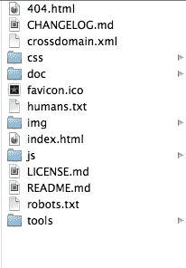
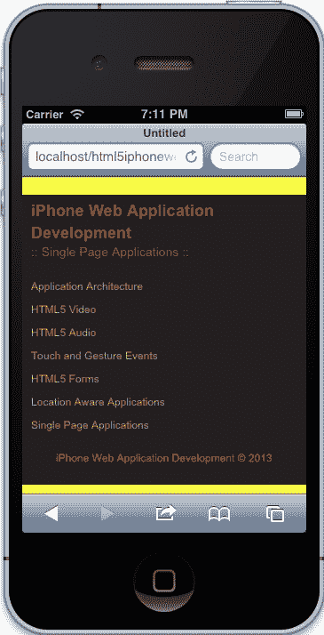
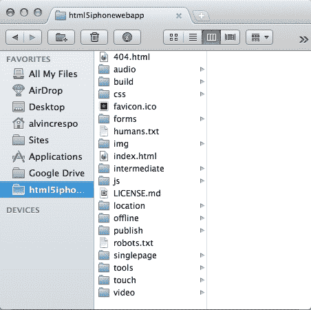

# 第一章：应用程序架构

在本章中，我们将为我们的 iPhone 应用程序创建一个标准架构。我们将以 HTML5 移动锅炉板为基础，并根据本书中的几个项目的需求进行定制。从在 HTML5 中标记我们的内容到创建 JavaScript 框架，我们将创建静态页面，帮助我们专注于 iPhone Web 应用程序开发的基础。

在本章中，我们将涵盖：

+   实施 HTML5 移动锅炉板

+   创建初步架构

+   自定义我们的框架

+   创建语义标记

+   结构化我们的样式表

+   响应式设计原则

+   建立我们的 JavaScript 架构

+   路由到移动站点

+   主屏幕图标

+   介绍我们的构建脚本

+   部署我们的项目

# 实施 HTML5 移动锅炉板

当您开始开发时，始终要从一个可以塑造成项目需求的基本框架开始。在许多情况下，我们在工作的地方或者为我们自己的个人项目开发这些框架。然而，开源社区为我们提供了一个可以在项目中使用的优秀框架——HTML5 移动锅炉板。这个框架基于著名的 HTML5 锅炉板，并针对移动进行了优化，包括精简的 HTML 模板；使用`Zepto`，以及针对移动进行了优化的工具和辅助功能。

## 下载并安装 HTML5 移动锅炉板

我们需要采取的第一步是下载 HTML5 移动锅炉板，位于这里：

[`html5boilerplate.com/mobile/`](http://html5boilerplate.com/mobile/)

一旦下载了锅炉板，您应该从解压的存档文件中看到以下结构：



初步目录结构

下一步是将这些文件放在您选择的目录中。例如，我已经将我的文件放在 Mac 上的以下目录中：

`/Users/alvincrespo/Sites/html5iphonewebapp`

接下来，我们将使用一个构建系统，帮助我们创建多个环境，简化部署过程，并在我们想要为测试和/或生产优化我们的网站时使事情变得更容易。

根据 HTML5 移动锅炉板的文档，有两种不同类型的构建系统，如 Node Build 脚本和 Ant Build 脚本。在本书中，我们将使用 Ant Build 脚本。我建议使用 Ant Build 脚本，因为它已经存在一段时间，并且具有我在项目中使用的适当功能，包括 CSS Split，它将帮助拆分锅炉板附带的主 CSS 文件。

## 集成构建脚本

要下载 Ant Build 脚本，请转到以下链接：

[`github.com/h5bp/ant-build-script`](https://github.com/h5bp/ant-build-script)

然后，通过单击**Download as zip**按钮下载 zip 文件。下载 Ant Build 脚本后，将文件夹及其内容复制到您的项目中。

一旦您的 Ant Build 脚本目录完全转移到您的项目中，将包含构建脚本的目录重命名为`build`。此时，您的项目应该已经完全设置好，以便在本书的其余应用程序中使用。我们将在本章后面介绍如何使用构建脚本。

# 创建我们的应用程序框架

对于每个项目，创建一个适应项目需求的框架是很重要的。重要的是要考虑项目的每个方面。从所需的文档到团队的优势和劣势，建立一个坚实的基础对我们构建和相应调整是很重要的。

## 修改锅炉板

现在，我们将修改我们的锅炉板，以满足我们将要构建的项目的需求。为简单起见，我们将从文件夹中删除以下项目：

+   `CHANGELOG.md`

+   `crossdomain.xml`

+   `README.md`

+   `/doc (目录)`

现在，目录已经整理好了，是时候看一下一些样板代码，并根据本书项目的需求进行定制了。

## 定制我们的标记

首先，用你喜欢的文本编辑器打开应用程序。一旦我们用我们选择的编辑器打开了应用程序，让我们看看`index.html`。

索引文件需要进行清理，以便专注于 iPhone Web 应用程序的开发，并且需要删除 Google Analytics 等未使用的项目。所以让我们删除一些对我们来说不必要的代码。

查找以下代码：

```html
<!DOCTYPE html>
<!--[if IEMobile 7 ]>    <html class="no-js iem7"> <![endif]-->
<!--[if (gt IEMobile 7)|!(IEMobile)]><!--> <html class="no-js"> <!--<![endif]-->
```

### 提示

**下载示例代码**

你可以从你在[`www.packtpub.com`](http://www.packtpub.com)的帐户中下载你购买的所有 Packt 图书的示例代码文件。如果你在其他地方购买了这本书，你可以访问[`www.packtpub.com/support`](http://www.packtpub.com/support)并注册，直接将文件发送到你的邮箱。

并将其修改为：

```html
<!DOCTYPE html>
<html class="no-js">
```

我们在这里所做的是移除 IE Mobile 的检测。虽然这对其他项目可能有帮助，但对于我们来说，它并不能真正帮助我们创建一个完全兼容 iPhone 的应用程序。然而，我们还需要删除一个`IEMobile`特定的 meta 标记：

```html
<meta http-equiv="cleartype" content="on">
```

之前的 meta 标记打开了`cleartype`（一种帮助字体呈现的实用程序）对 IE 移动的支持。这对我们来说并不是必要的，也不是我们应用程序的要求。

现在我们已经从页面中删除了一些不必要的标记，我们可以开始启用一些将增强我们应用程序的功能。查找以下 meta 标记并启用它们，删除周围的注释：

```html
<meta name="apple-mobile-web-app-capable" content="yes">
<meta name="apple-mobile-web-app-status-bar-style" content="black">
```

这些指令告诉我们的应用程序可以在全屏模式下运行，并将状态栏设置为黑色。

我们还可以从文档的`<head>`中删除以下代码：

```html
<!-- This script prevents links from opening in Mobile Safari. https://gist.github.com/1042026 -->
<!--
        <script>(function(a,b,c){if(c in b&&b[c]){var d,e=a.location,f=/^(a|html)$/i;a.addEventListener("click",function(a){d=a.target;while(!f.test(d.nodeName))d=d.parentNode;"href"in d&&(d.href.indexOf("http")||~d.href.indexOf(e.host))&&(a.preventDefault(),e.href=d.href)},!1)}})(document,window.navigator,"standalone")</script>
-->
```

一旦我们删除了之前的脚本，你的标记现在应该看起来像下面这样：

```html
<!DOCTYPE html>
<head>
    <meta charset="utf-8">
    <title></title>
    <meta name="description" content="">
    <meta name="HandheldFriendly" content="True">
    <meta name="MobileOptimized" content="320">
    <meta name="viewport" content="width=device-width">
    <link rel="apple-touch-icon-precomposed" sizes="144x144" href="img/touch/apple-touch-icon-144x144-precomposed.png">
    <link rel="apple-touch-icon-precomposed" sizes="114x114" href="img/touch/apple-touch-icon-114x114-precomposed.png">
    <link rel="apple-touch-icon-precomposed" sizes="72x72" href="img/touch/apple-touch-icon-72x72-precomposed.png">
    <link rel="apple-touch-icon-precomposed" href="img/touch/apple-touch-icon-57x57-precomposed.png">
    <link rel="shortcut icon" href="img/touch/apple-touch-icon.png">
    <meta name="apple-mobile-web-app-capable" content="yes">
    <meta name="apple-mobile-web-app-status-bar-style" content="black">
    <link rel="stylesheet" href="css/normalize.css">
    <link rel="stylesheet" href="css/main.css">
    <script src="img/modernizr-2.6.1.min.js"></script>
</head>
```

现在，我们可以专注于清理我们的正文。幸运的是，我们只需要删除一件事情——Google Analytics，因为我们不会专注于 iPhone Web 应用的跟踪。

为此，找到以下代码并删除它：

```html
<!-- Google Analytics: change UA-XXXXX-X to be your site's ID. -->
<script>
    var _gaq=[["_setAccount","UA-XXXXX-X"],["_trackPageview"]];
    (function(d,t){var g=d.createElement(t),s=d.getElementsByTagName(t)[0];g.async=1;
    g.src=("https:"==location.protocol?"//ssl":"//www")+".google-analytics.com/ga.js";
    s.parentNode.insertBefore(g,s)}(document,"script"));
</script>
```

页面上应该只有以下脚本：

```html
<script src="img/zepto.min.js"></script>
<script src="img/helper.js"></script>
```

一旦我们完成了上述步骤，我们的标记应该变得简洁明了，如下所示：

```html
<!DOCTYPE html>
<html class="no-js">
<head>
    <meta charset="utf-8">
    <title></title>
    <meta name="description" content="">
    <meta name="HandheldFriendly" content="True">
    <meta name="MobileOptimized" content="320">
    <meta name="viewport" content="width=device-width">

    <link rel="apple-touch-icon-precomposed" sizes="144x144" href="img/touch/apple-touch-icon-144x144-precomposed.png">
    <link rel="apple-touch-icon-precomposed" sizes="114x114" href="img/touch/apple-touch-icon-114x114-precomposed.png">
    <link rel="apple-touch-icon-precomposed" sizes="72x72" href="img/touch/apple-touch-icon-72x72-precomposed.png">
    <link rel="apple-touch-icon-precomposed" href="img/touch/apple-touch-icon-57x57-precomposed.png">
    <link rel="shortcut icon" href="img/touch/apple-touch-icon.png">

    <meta name="apple-mobile-web-app-capable" content="yes">
    <meta name="apple-mobile-web-app-status-bar-style" content="black">

    <link rel="stylesheet" href="css/normalize.css">
    <link rel="stylesheet" href="css/main.css">
    <script src="img/modernizr-2.6.1.min.js"></script>
</head>
    <body>

        <!-- Add your site or application content here -->

        <script src="img/zepto.min.js"></script>
        <script src="img/helper.js"></script>
    </body>
</html>
```

从这里开始，我们应该检查每个项目的样式表和脚本，并在开始项目之前尽可能优化它。然而，我们将使用的这个样板已经由社区优化，并得到了许多开发人员的支持，并且对于我们在这里使用的情况，样式和脚本都已经准备就绪。如果你感兴趣，我鼓励你查看`normalize.css`文件，其中包含了重置页面的优秀指令。还有必要审查已经使用这个样板增强了以支持移动设备的`main.css`文件。

现在，我们将继续建立我们的框架。

# 定制我们的框架

对于开发人员来说，为他们正在进行的每个项目建立一个框架都是至关重要的，无论项目大小如何。当然，你的框架也应该根据项目的要求进行调整。在本节中，我们将建立一个简单的框架，以便在本书的使用过程中使用。

我们已经根据我们的需求整理了样板，现在我们将继续扩展样板，包括对我们将构建的应用程序至关重要的文件。

第一个应用程序将基于 HTML5 视频规范（[`dev.w3.org/html5/spec-author-view/video.html`](http://dev.w3.org/html5/spec-author-view/video.html)）。在该应用程序中，我们将为我们的视频播放器创建一个特定的功能，包括播放、暂停和全屏功能。所以让我们创建一个专门针对这个应用程序的目录；我们将这个目录称为`video`。

在这个目录中，我们将创建一个`index.html`文件，并从`index.html`文件的主页复制内容。

现在我们已经创建了我们的视频部分，让我们在我们的`css`目录中创建一个`video.css`文件。

然后，在我们的`/js`文件夹中创建一个`App`目录。在`/js/App`目录中，让我们创建一个`App.js`文件。稍后，我们将详细解释这个文件是什么，但现在它将是我们的主要应用程序命名空间，基本上封装了我们应用程序的全局功能。

最后，在`/js/App`目录中创建一个`App.Video.js`文件，其中将包含我们视频应用程序的功能。

现在，您将为我们的每个应用程序重复之前的步骤；包括视频、音频、触摸、表单、位置、单页和离线。最终，您的目录结构应该包括以下新目录和文件：

```html
/audio
    index.html
/css
    audio.css
    forms.css
    location.css
    main.css
    normalize.css
    singlepage.css
    touch.css
    video.css
/forms
    index.html
/js
    /App/App.Audio.js
    /App/App.Forms.js
    /App/App.js
    /App/App.Location.js
    /App/App.SinglePage.js
    /App/App.Touch.js
    /App/App.Video.js
/location
    index.html
/offline
    index.html
/singlepage
    index.html
/touch
    index.html
/video
    .index.html
```

此时，我们应该修复对依赖项的引用，比如我们的 JavaScript 和样式表。所以让我们打开`/video/index.html`。

让我们修改以下行：

```html
<link rel="stylesheet" href="css/normalize.css">
<link rel="stylesheet" href="css/main.css">
<script src="img/modernizr-2.6.1.min.js"></script>
```

将先前的标记更改为以下内容：

```html
<link rel="stylesheet" href="../css/normalize.css">
<link rel="stylesheet" href="../css/main.css">
<script src="img/modernizr-2.6.1.min.js"></script>
```

### 提示

请注意，我们在每个依赖项中添加了`../`。这本质上是告诉页面向上一级并检索适当的文件。我们还需要对 apple-touch-icon-precomposed 链接、快捷图标和页面底部的脚本进行同样的操作。

我们的框架现在几乎完成了，只是它们还没有连接起来。现在我们已经把一切都组织好了，让我们开始把一切连接起来。它看起来可能不太好看，但至少它将能够工作并朝着一个完全功能的应用程序迈进。

让我们从主`index.html`文件`/ourapp/index.html`开始。一旦我们打开了主`index.html`文件，让我们在`<body>`元素内创建一个基本的站点结构。我们将给它一个类名为`"site-wrapper"`，并将其放在注释`Add your site or application content here`的下方：

```html
<body>
    <!-- Add your site or application content here -->
    <div class="site-wrapper">

    </div>
    <script src="img/zepto.min.js"></script>
    <script src="img/helper.js"></script>
</body>
```

在包含我们站点的包装器中，让我们使用新的 HTML5`<nav>`元素来语义化地描述将存在于所有应用程序中的主导航栏：

```html
<div class="site-wrapper">
<nav>      
</nav>
</div>
```

还没有什么特别的，但现在我们将继续使用无序列表元素，并创建一个没有样式的导航栏：

```html
<nav>
    <ul>
        <li>
            <a href="./index.html">Application Architecture</a>
        </li>
        <li>
            <a href="./video/index.html">HTML5 Video</a>
        </li>
        <li>
            <a href="./audio/index.html">HTML5 Audio</a>
        </li>
        <li>
            <a href="./touch/index.html">Touch and Gesture Events</a>
        </li>
        <li>
            <a href="./forms/index.html">HTML5 Forms</a>
        </li>
        <li>
            <a href="./location/index.html">Location Aware Applications</a>
        </li>
        <li>
            <a href="./singlepage/index.html">Single Page Applications</a>
        </li>
    </ul>
</nav>
```

如果我们复制在`/video/index.html`中创建的代码并测试页面，您会发现它不会正确工作。对于所有子目录，如视频和音频，我们需要将相对路径从`./`更改为`../`，以便我们可以向上一级文件夹。考虑到这一点，`nav`元素在其他应用程序中将如下所示：

```html
<nav>
    <ul>
        <li>
            <a href="../index.html">Application Architecture</a>
        </li>
        <li>
            <a href="../video/index.html">HTML5 Video</a>
        </li>
        <li>
            <a href="../audio/index.html">HTML5 Audio</a>
        </li>
        <li>
            <a href="../touch/index.html">Touch and Gesture Events</a>
        </li>
        <li>
            <a href="../forms/index.html">HTML5 Forms</a>
        </li>
        <li>
            <a href="../location/index.html">Location Aware Applications</a>
        </li>
        <li>
            <a href="../singlepage/index.html">Single Page Applications</a>
        </li>
    </ul>
</nav>
```

现在，我们可以将`/video/index.html`中的导航复制到其余的应用程序文件或我们之前创建的`index.html`文件中。完成后，我们将拥有一个连接良好的单一站点。

信不信由你，我们这里有一个非常简单的网站。我们的页面已经设置了基本的标记和通用样式。此时，我们需要一个将我们的页面连接在一起的导航。然而，我们几乎没有涉及一些重要的方面，包括应用程序的语义标记，我们将在下一节中讨论。

# 创建语义标记

语义标记之所以重要，原因有几个，包括搜索引擎优化、创建可维护的架构、使代码易于理解以及满足无障碍要求。然而，您应该熟悉使用与您的内容相关的标记来构建页面的结构。HTML5 规范中有一些新元素，有助于简化这个过程，包括`<header>`、`<nav>`、`<footer>`、`<section>`、`<article>`和`<aside>`元素。这些元素中的每一个都有助于描述页面的各个方面，并轻松识别应用程序的组件。在本节中，让我们从我们的视频应用程序开始构建我们的应用程序。

## 创建页眉

首先，让我们给我们的主索引页面一个标题和一个描述我们所在页面的页眉。让我们在应用程序的`/index.html`中打开主`index.html`文件。

找到`<title>`标签，并在其中输入`iPhone Web Application Development – Home`。请注意，我们在这里使用连字符。这很重要，因为它使用户更容易扫描页面内容，并有助于特定关键字的排名。

您现在应该在文档的`<head>`标签中有以下`<title>`：

`<title>iPhone Web Application Development - Home</title>`

现在，我们希望页面的内容也反映标题，并提醒用户他们在我们网站上的进度。我们想要做的是创建一个描述他们所在部分的页眉。为了实现这一点，让我们在之前创建的导航之前放置以下代码。然后您的代码应如下所示：

```html
<hgroup>
    <h1>iPhone Web Application Development</h1>
    <h2>Home</h2>
</hgroup>
<nav>...</nav>
```

`<hgroup>`元素用于对一个部分的多个标题进行分组。标题的等级基于`<h1>`到`<h6>`，其中`<h1>`的等级最高，`<h6>`的等级最低。因此，突出显示的文本将使我们的`<h1>`内容高于我们的`<h2>`。

还要注意，我们尚未使用`<section>`元素。但是，这个页面确实通过 W3C 标记验证服务（[`validator.w3.org/`](http://validator.w3.org/)）进行验证。

我们可以通过将我们的`<hgroup>`和`<nav>`元素包装在`<header>`元素中来进一步描述页面，以提供页面的介绍性帮助。完成此操作后，您的代码应如下所示：

```html
<header>
    <hgroup>... </hgroup>
    <nav>... </nav>
</header>
```

通过先前的代码，我们最终为我们的页面提供了一些结构。我们用一个主页眉描述我们的页面，用一个子页眉描述页面。我们还为页面提供了导航菜单，允许用户在应用程序之间导航。

## 创建页脚

现在让我们添加一个包含本书名称和版权日期的`<footer>`：

```html
<footer>
    <p>iPhone Web Application Development &copy; 2013</p>
</footer>
```

先前的代码基本上将与最近的分区祖先相关联。因此，页脚将与其前面的内容相关联，我们稍后会填充。此时，您的内容应该如下所示：

```html
<div class="site-wrapper">
    <header>
        <hgroup>...</hgroup>
        <nav>...</nav>
    </header>
    <footer>...</footer>
</div>
```

## 清理部分

您可能想知道为什么我们不立即为包含`<header>`和`<footer>`元素的`<div>`元素使用`<section>`元素。在这种情况下，这并不一定有用，因为我们并没有创建一个元素内容会在大纲中列出的页面。这是 W3C 的建议，每个开发人员在决定使用`<div>`还是`<section>`元素时都应该意识到。最终，这取决于内容本身和团队希望创建的大纲。

现在我们已经为我们的页面创建了基本结构，我们可以继续为我们的其他应用程序做同样的事情。如果您希望查看最终版本，本书提供的代码将为您完成这些工作。

有了这个想法，我们将继续进行应用程序开发，确保在合适的时候使用语义代码。

# 构建我们的样式表

样式在我们构建的任何应用程序中都非常重要，特别是因为它是用户体验的第一个方面。在这一部分，我们将开始适当地构建我们的样式。

## 全局样式

首先，让我们打开位于`CSS`目录中的`main.css`文件。打开此文件后，您将看到默认的样式。在这一点上，让我们跳过这些内容，以创建我们自己的样式。随着我们继续开发我们的应用程序，我们将审查这些样式。

在`main.css`中找到以下行：

```html
/* ==========================================================================
   Author's custom styles
========================================================================== */
```

在这条注释之后，我们希望包括我们之前编写的语义代码的全局样式。

首先定义全局站点样式，比如背景颜色：

```html
html{
    background: #231F20;
    border-top: 10px solid #FDFF3A;
    border-bottom: 5px solid #FDFF3A;
    width: 100%;
}
```

在之前的样式中，我们做了一些样式选择，比如设置背景颜色和一些边框。这里重要的部分是 HTML 元素的宽度被定义为 100％。这基本上允许我们的所有内容扩展到手机宽度的 100％。

## 定义我们的全局字体

然后我们需要在页面上定义整体字体。目前这只是基本的，可以根据我们的应用程序继续扩展设计，但现在先看看以下样式：

```html
h1, h2, p, a {
    font-family: Arial, Helvetica, sans-serif;
    text-decoration: none;
}

h1, h2 {
    color: #A12E33;
    font-weight: bold;
    margin: 0;
    padding: 0;
}

h1 {
    font-size: 18px;
}

h2 {
    font-size: 14px;
    font-weight: normal;
}

p {
    color: #F15E00;
    font-size: 12px;
}

a,
a:visited {
    color: #F19C28;
}
```

在之前的代码中，你可以看到我们是从更高的层次向下工作的，这是对层叠样式表的基本理解。我们首先通过使用特定的字体系列并且没有装饰来定义我们的标题、锚点和段落。

当我们继续定义之前的样式时，我们开始更具体地定义每一个，标题没有填充或边距，有特定的颜色。然后，当我们继续往下看，我们可以看到每种类型的标题都有特定的字体大小，我们也对段落和锚点做同样的处理。

## 我们的页面布局

一旦我们定义了一些字体和站点样式，我们就为包含我们内容的`<div>`元素包含一些基本布局信息：

```html
.site-wrapper {
    padding: 5px 10px 10px;
}
```

由于我们的元素自动缩放到屏幕宽度的 100％，我们告诉内容在顶部有`5px`的填充，在左右各有`10px`的填充，在底部有`10px`的填充。或者，我们可以写以下样式：

```html
    padding-top: 5px;
    padding-left: 10px;
    padding-right: 10px;
    padding-bottom: 10px;
```

前者被称为快捷属性设置，被认为是最佳实践。

## 使用`:before`和`:after`添加内容

由于我们还希望确保我们的第二个标题以某种形式有所区别，我们可以使用 CSS3 伪类选择器和属性来定义之前和之后的内容，如下所示：

```html
hgroup h2:before,
hgroup h2:after {
    content: " :: ";
}
```

### 注意

请记住，Safari 3.2 及以上版本支持`:before`和`:after`伪选择器。

之前的选择器针对`<hgroup>`元素内的`<h2>`元素，并在其之前和之后添加我们在属性中定义的内容，就像`:before`和`:after`伪类选择器一样。

## 为我们的导航添加样式

接下来，让我们为我们的导航添加一些样式，使其看起来更加易用。

```html
nav ul {
    padding: 0;
}

nav li {
    list-style: none;
}

nav a {
    display: block;
    font-size: 12px;
    padding: 5px 0;
}
```

在这里，我们去掉了`<ul>`元素的填充，然后移除了每个列表元素的默认样式选项。最后，我们通过将字体大小设置为`12px`并在每个锚点的顶部和底部添加填充来确保每个锚点正确显示，以便在 iPhone 上轻松选择。

最后，我们将为我们的页脚添加一些样式。

```html
footer p {
    text-align: center;
}
```

非常简单，我们将段落在页脚中居中对齐。由于我们在字体部分定义了段落的默认样式，所以样式被应用了。

当之前的样式被正确应用时，你的结果应该类似于以下显示：



# 响应式设计原则

响应式设计是我们移动应用程序的关键。考虑到许多移动体验现在超过了桌面上的体验，我们必须创建适应不断发展的技术环境的应用程序。幸运的是，HTML5 移动样板自带了我们可以修改的初步样式。

## 媒体查询的拯救

首先，让我们在`css`目录中打开`main.css`文件。

接下来，向文件底部滚动，你应该看到以下样式：

```html
/* ==========================================================================
   EXAMPLE Media Queries for Responsive Design.
   Theses examples override the primary ('mobile first') styles.
   Modify as content requires.
========================================================================== */

@media only screen and (min-width: 800px) {
}

@media only screen and (-webkit-min-device-pixel-ratio: 1.5),
       only screen and (min-resolution: 144dpi) {}
```

尽管这些样式让我们起步，但对于 iPhone 开发，我们需要更多的定制。第一个媒体查询是专门针对平板设备的，第二个媒体查询帮助我们针对分辨率更高的设备，比如 iPhone 4。

我们想要做的是让这个更简单一些。因为我们只针对 iPhone，这就是我们可以用来替换之前代码的内容：

```html
/* iPhone 4 and 5 Styles*/
@media only screen and (-webkit-min-device-pixel-ratio: 2) { }
```

先前的代码将针对 iPhone 4 和 5。我们通过检查设备上的`-webkit-min-device-pixel-ratio`属性来特别针对这两个设备，如果为真，意味着我们可以提供高清图形。

我们想要检查的另一个方面是我们在`index.html`页面中设置的视口设置。幸运的是，我们之前已经清理过这个，它应该有以下内容：

```html
<meta name="viewport" content="width=device-width">
```

先前的代码片段基本上会根据设备的宽度调整我们的内容。

在这一点上，我们应该为以后在我们的应用程序中实现响应式样式做好准备。现在我们的样式已经为我们的应用程序设置好，并且足够通用以扩展，让我们开始添加脚本背后的框架。

## 响应式图像

图像是任何应用程序的极其重要的部分。它有助于展示产品的特点，并且举例说明您希望用户理解的信息。然而，今天各种各样的设备需要内容正确响应。除此之外，我们需要能够提供适合体验的内容，这意味着我们需要为高分辨率设备量身定制，以便最高质量的内容传达给受众。

有多种技术可以提供适当的内容。但是，您选择的技术取决于项目的要求。在这部分，我们将回顾根据内容和/或容器调整图像大小的传统响应式网页设计原则。

### 流体图像

在这种技术中，开发人员将所有图像的最大宽度设置为 100%。然后我们定义图像的容器相应调整。

#### 流体宽度图像

要实现全宽度图像，我们可以这样做：

```html
<body>

</body>
```

标记很简单，基本上我们将图像包装到一个扩展所需全宽度的元素中。在这种情况下，body 的宽度将扩展到 100%。

接下来，我们将定义图像的样式如下：

```html
img {
    max-width: 100%;
}
```

通过这简单的 CSS 声明，我们告诉我们的图像将其最大宽度设置为包含内容的 100%。这将根据设备宽度的变化自动调整图像大小，这对于使网站对用户设备响应是至关重要的。

#### 全宽图像

在这种情况下，我们希望图像保持其全宽，但我们也需要相应地裁剪它。

为了实现这一点，我们可以简单地创建一个带有`class`的`div`，在这种情况下我们添加一个`overflow`类：

```html
<div class="overflow"></div>
```

然后我们可以创建保持图像全宽并根据内容调整大小的样式：

```html
overflow {
    background: transparent url('img/somgimg.jpg') no-repeat 50% 0;
    height: 500px;
    width: 100%;
}
```

这有点复杂，但基本上我们使用`background`属性附加图像。关键在于确保使用 50%将其居中。高度属性只是为了显示图像，宽度告诉容器与其内容相关的 100%。

这是我们在实现传统响应式设计时使用的两种技术。当我们创建视频和图像库时，我们将在以后实现这些技术。

# 建立我们的 JavaScript 架构

在为应用程序建立 JavaScript 架构时，有很多要考虑的事情，包括近期或短期内可能的变化、安全性、易用性和实施、文档等等。一旦我们能回答我们所提出的各种问题，我们就可以决定采用哪种模式（模块、外观和/或中介等）。我们还需要知道哪种库或框架最适合我们，比如`jQuery`、`Zepto.js`、`Backbone.js`或`Angular.js`。

幸运的是，为了在 iPhone 上提供有效的应用程序，我们将保持简单明了。我们将利用`Zepto.js`作为我们支持的库以保持轻量级。然后我们将通过创建遵循模块化模式的自定义 JavaScript 框架来构建 Zepto。

## 构建我们的应用功能

首先，让我们在我们喜欢的文本编辑器中打开我们的应用程序目录。

接下来，打开我们之前在 JavaScript 目录中创建的`App.js`文件。`App.js`文件应该是完全空的，不应该被包含在任何地方。这是我们将开始编写框架的地方。

### 给我们的应用程序命名空间

如果你是 JavaScript 的新手，你很可能大部分时间都是在全局作用域中编写代码——也许大部分 JavaScript 都是放在 script 标签中。虽然这可能实现了你的一些目标，但在开发大规模应用程序时，我们希望避免这样的做法。我们希望给我们的应用程序命名空间是为了可维护性、效率和可移植性。

让我们首先检查`App`命名空间；如果存在，我们将使用其中的内容，如果不存在，那么我们将创建一个空对象。以下代码展示了我们如何实现这一点：

```html
var App = window.App || {};
```

### 立即调用的函数表达式

太棒了！我们正在检查`App`命名空间，现在让我们定义它。在检查后，让我们包含以下代码：

```html
App = (function(){}());
```

先前的代码正在做几件事情，让我们一步一步来。首先，我们将`App`命名空间设置为所谓的**立即调用的函数表达式**（**IIFE**）。我们实质上是创建了一个由括号包裹并在闭括号后立即调用的函数。

当我们使用之前的技术或 IIFE 时，我们创建了一个新的执行上下文或作用域。这有助于创建自包含的代码，希望不会影响站点上的其他代码。它保护我们，并帮助我们有效地遵循模块化模式。

让我们通过传入 window、document 和 Zepto 对象来扩展先前的功能，如下所示：

```html
App = (function(window, document, $){
}(window, document, Zepto));
```

我知道这可能有点令人困惑，但让我们花点时间来思考一下我们在这里做什么。首先，我们在名为`window`、`document`和`$`的函数中设置了一些参数。然后，在调用此方法时，我们传入了`window`、`document`和`Zepto`。记住，我们之前讨论过这会创建一个新的作用域或执行上下文？嗯，这对我们很有用，因为现在我们可以传入任何可能是全局的对象的引用。

这对我们有什么用呢？嗯，想象一下，如果你想一遍又一遍地使用实际的`Zepto`对象，那将会有点累人。虽然输入`Zepto`并不难，但你可以将其命名空间为美元符号，保持简单。

### 使用严格模式

好的，我们已经设置好了我们的模块。现在让我们继续扩展它，包括`use strict`指令：

```html
App = (function(window, document, $){
    'use strict';
}(window, document, Zepto));
```

这个指令通过改变 JavaScript 的运行方式来帮助我们调试我们的应用程序，允许某些错误被抛出而不是悄悄失败。

### 默认选项

默认选项是给你的代码库提供一些可扩展性的好方法。例如，如果我们想要自定义或缓存与应用程序相关的元素，那么以下是我们将使用的默认值：

```html
var _defaults = {
'element': document.body,
    'name': 'App',
    'videoOptions': {},
    'audioOptions': {},
    'touchOptions': {},
    'formOptions': {},
    'locationOptions': {},
    'singlePageOptions': {}
};
```

让我们简要地看一下这些默认值。首先，我们将创建一个`defaults`变量，其中包含了我们应用程序的所有默认值。在其中，我们已经定义了一个默认位置，用于引用我们应用程序的`'element'`默认设置为`document.body`——这样就可以获取我们在**DOM**（**文档对象模型**）中的 body 元素。然后，我们为我们的应用程序创建一个自定义名称叫做`'App'`。之后，我们创建了视频、音频、触摸、表单、位置和单页面应用程序的空对象——以后会逐渐扩展这些空对象。当我们继续阅读本书时，这些空对象将被扩展。

### 定义构造函数

现在我们需要在`use strict`指令之后定义我们的构造函数。这个构造函数将接受一个名为`options`的参数。然后我们将用参数`options`扩展默认值，并存储这些设置，以便以后可以检索。最后，我们将把`'element'`选项作为`Zepto`对象进行缓存。

```html
function App(options) {
    this.options = $.extend({}, _defaults, options);
    this.$element = $(this.options.element);
}
```

这是先前代码的完成情况。首先，我们使用关键字`this`，它是对将要成为 App 实例的引用。因此，`this`是对象本身的上下文。希望这不会太令人困惑，并且随着我们的进行会变得清晰。在这种情况下，我们使用`this`来定义一个对象`options`，它将包含`_defaults`和我们传递给构造函数的任何自定义选项的合并内容。

注意，当我们将空对象或`{}`作为第一个参数传递给`$.extend()`时，我们告诉`Zepto`将`_defaults`和`options`合并到一个新对象中，因此不会覆盖`_defaults`对象。当我们需要在将来对默认选项进行某种检查时，这是有用的。

一旦我们定义了选项，我们就使用`this.$element`缓存元素，其中`$`在`element`前面只是为了我的参考，这样我就可以立即识别 Zepto 对象与普通 JavaScript 对象。

### 原型

好的，我们已经创建了我们的`App`命名空间，构建了一个 IIFE 来包含我们的代码，并定义了我们的构造函数。现在，让我们开始创建一些可以被访问的公共方法，使其更加模块化。但在我们这样做之前，让我们尝试理解 JavaScript 的`prototype`。

将`prototype`视为可以随时访问、修改和更新的活动对象。它也可以被视为指针，因为 JavaScript 将继续沿着链路向下查找对象，直到找到对象或返回`undefined`。原型只是一种将功能扩展到任何非普通对象的方法。

为了使事情变得更加混乱，我提到非普通对象具有原型。这些非普通对象将是数组、字符串、数字等。普通对象是我们简单地声明一个空对象，如下所示：

```html
var x = {};
```

`x`变量没有原型，它只是一个键/值存储，类似于我们的`_defaults`对象。

如果您还没有理解原型，不要担心，这一切都是关于动手实践和获取一些经验。所以，让我们继续前进，让我们的应用程序开始工作。

此时，您的`App.js`文件应该如下所示：

```html
var App = window.App || {};
App = (function(window, document, $){
    'use strict';
    var _defaults = {
        'element': document.body,
        'name': 'App',
        // Configurable Options for each other class
        'videoOptions': {},
        'audioOptions': {},
        'touchOptions': {},
        'formOptions': {},
        'locationOptions': {},
        'singlePageOptions': {}
    };
    function App(options) {
        this.options = $.extend({}, _defaults, options);
        this.$element = $(this.options.element);
    }
}(window, document, Zepto));
```

### 定义公共方法

现在我们需要通过在原型中输入来创建一些公共方法。我们将创建一个`getDefaults`方法，它返回我们的默认选项；`toString`将覆盖原生的`toString`方法，以便我们可以返回一个自定义名称。然后我们将创建初始化方法来创建我们的其他应用程序，我们将分别命名这些方法为`initVideo`、`initAudio`、`initLocalization`、`initTouch`、`initForms`和`initSinglePage`。

```html
App.prototype.getDefaults = function() {
    return _defaults;
};

App.prototype.toString = function() {
    return '[ ' + (this.options.name || 'App') + ' ]';
};

App.prototype.initVideo = function() {
    App.Video.init(this.options.videoOptions);
    return this;
};

App.prototype.initAudio = function() {
    App.Audio.init(this.options.audioOptions);
    return this;
};

App.prototype.initLocalization = function() {
    App.Location.init(this.options.locationOptions);
    return this;
};

App.prototype.initTouch = function() {
    App.Touch.init(this.options.touchOptions);
    return this;
};

App.prototype.initForms = function() {
    App.Forms.init(this.options.formOptions);
    return this;
};

App.prototype.initSinglePage = function() {
    App.SinglePage.init(this.options.singlePageOptions);
    return this;
};
```

此时，我们有几种方法可以在创建`App`实例时公开访问。首先，让我们回顾我们之前实现的代码，特别是这一行代码，它被复制，但根据`init`方法进行了定制：

```html
App.Touch.init(this.options.touchOptions);
```

对于我们创建的每个`init`方法，我们都调用适当的应用程序，例如`App.Touch`、`App.Forms`、`App.Video`等。然后我们传递在构造函数中定义的选项，例如`this.options.touchOptions`、`this.options.formOptions`、`this.options.videoOptions`等。

请注意，我们尚未为 Video、Forms、Touch 等创建这些类，但我们将很快创建这些类。

### 返回我们的构造函数/函数

在`App.js`中我们需要做的最后一件事是返回构造函数。因此，在之前定义的所有公共方法之后，包括以下代码：

```html
return App;
```

这段代码虽然简单，但非常重要。让我们看一个简化版本的`App.js`，以更好地理解正在发生的事情：

```html
App = (function(){
    function App() {}
    return App;
}());
```

如前所述，我们正在创建一个`App`命名空间，该命名空间设置为立即调用的函数表达式。当我们这样做时，在这个函数内部创建了一个新的作用域。

这就是为什么我们可以有一个名为`App`的函数或构造函数，而没有冲突或错误。但是如果您回忆起来，我们的函数`App`也是一个对象，就像 JavaScript 中的所有东西一样都是对象。这就是为什么当我们返回我们的函数`App`时，`App`命名空间被设置为构造函数。这样一来，您就可以创建多个`App`的实例，同时将代码集中在一个新的不可触及的范围内。

# 集成自定义模块模板

现在，为了将我们的架构其余部分放在一起，我们需要打开 JavaScript 目录中的每个其他`App`文件（`/js/App`）。

当我们打开这些文件时，我们需要粘贴以下模板，这是基于我们为`App.js`编写的脚本：

```html
var App = window.App || {};

App.Module = (function(window, document, $){
    'use strict';

    var _defaults = {
        'name': 'Module'
    };

    function Module(options) {
        this.options = $.extend({}, _defaults, options);

        this.$element = $(this.options.element);
    }

    Module.prototype.getDefaults = function() {
        return _defaults;
    };

    Module.prototype.toString = function() {
        return '[ ' + (this.options.name || 'Module') + ' ]';
    };

    Module.prototype.init = function() {

        return this;
    };

    return Module;

}(window, document, Zepto));
```

当我们每个模板都放入后，我们必须将`Module`更改为适当的类型，即视频、音频、位置等。

一旦您完成了粘贴部分并更改了名称，基本的 JavaScript 架构就设置好了。

## 包含我们的脚本

最后需要处理的一项事项是将这个基本架构包含到每个`index.html`文件中。为了做到这一点，您需要在页面底部粘贴以下代码，就在`helper.js`包含之后：

```html
<script src="img/App.js"></script>
<script src="img/App.Audio.js"></script>
<script src="img/App.Forms.js"></script>
<script src="img/App.Location.js"></script>
<script src="img/App.SinglePage.js"></script>
<script src="img/App.Touch.js"></script>
<script src="img/App.Video.js"></script>
<script src="img/main.js"></script>
```

我们基本上包含了框架的每个脚本。这里重要的是始终首先包含`App.js`。原因在于`App.js`创建了`App`对象并直接修改它。如果您在所有其他脚本之后包含它，那么`App.js`将覆盖其他脚本，因为它直接影响了`App`对象。

## 初始化我们的框架

我们需要处理的最后一项事项是`main.js`，其中包括我们应用程序的初始化。我们通过将我们的代码包装在 IIFE 中，然后将实例暴露给`window`对象来实现这一点。我们使用以下代码来实现这一点：

```html
(function(window, document) {
    'use strict';

    var app = new App({
        'element': document.querySelector('.site-wrapper')
    });

    window.app = app;

}(window, document));
```

我们之前看到的是将 IIFE 分配给对象。这里我们看不到，因为这不是必要的。我们只是想确保我们的代码不会影响其余的代码，大多数情况下不会发生，因为这个项目的简单性。然而，作为最佳实践，我尽量在大多数情况下将我的代码自包含起来。

前面代码的不同之处在于我们在这里看到了我们框架的初始化：

```html
var app = new App({
    'element': document.querySelector('.site-wrapper')
});
```

我们通过使用`new`关键字创建`App`的新实例，然后将一个对象传递给它，该对象将合并到我们之前编写的默认选项中。

### 注意

`querySelector`是一个附加到文档对象的 JavaScript 方法。该方法接受一个我们通常在 CSS 中使用的选择器，解析 DOM，并找到适当的元素。在这种情况下，我们告诉我们的应用程序将自己包含到具有`site-wrapper`类的元素中。

当我们最终初始化我们的应用程序时，我们将`app`附加到`window`对象上：

```html
window.app = app;
```

这基本上使它可以在我们的应用程序中的任何地方访问，通过将其附加到`window`对象上。

我们现在已经完成了应用程序的框架。虽然我们没有在页面上操纵任何内容，也没有附加与用户输入相关的任何事件，但我们现在有了一个遵循最佳实践、高效、有效且易于访问的编码的坚实基础。

# 路由到移动站点

除非我们正在制作一个完全响应式的站点，其中站点的样式会根据设备的尺寸而变化，否则我们很可能需要对站点进行某种重定向，以便转到我们站点的移动友好版本。

幸运的是，这可以很容易地通过几种方式实现。虽然我不会详细介绍我们可以实现这一点的方式，但以下是一些在决定如何前进时可能有所帮助的技术。

### 提示

由于本书面向前端，将路由到移动站点的过程将简要涵盖 PHP 和 htaccess。我们总是可以在前端执行此过程，但出于 SEO 和页面排名的目的，应该避免这样做。

## 通过 PHP 进行重定向

在 PHP 中，我们可以进行以下类型的重定向：

```html
<?php
    $iphone = strpos($_SERVER['HTTP_USER_AGENT'], "iPhone");
    if ($iphone) {
        header('Location: http://mobile.site.com/');
    }
?>
```

在这个例子中，我们正在创建一个变量`$iPhone`，并给它一个布尔值，true 或 false。如果在用户代理中找到`iPhone`，这可能是或可能不是最好的技术，然后我们告诉页面使用 PHP 中的`header()`方法进行重定向。

再次说明，还有其他方法可以实现这一点，但这将让你立即开始并运行起来。

## 通过 htaccess 进行重定向

我们还可以检测 iPhone，并通过在服务器上使用`htaccess`文件放置这些指令来进行重定向：

```html
RewriteEngine on
RewriteCond %{HTTP_USER_AGENT} iPhone
RewriteRule .* http://mobile.example.com/ [R]
```

在这个例子中，我们正在启用重写引擎，创建一个重写条件，检查用户代理中是否有`iPhone`文本，然后如果条件满足就创建一个重写规则。

实质上，如果我们想要重定向到我们网站的移动版本，我们需要能够检测设备的类型，而不是它的尺寸，然后适当地进行重定向。

# 主屏幕图标

如果您正在创建一个应用程序，应该模仿成为本机应用程序的感觉，或者只是增加 Web 应用程序的体验，那么拥有代表您的应用程序的书签图标是一个好主意。

目前，我们支持在我们的`index.html`文件中使用以下标记：

```html
<link rel="apple-touch-icon-precomposed" sizes="144x144" href="img/touch/apple-touch-icon-144x144-precomposed.png">
<link rel="apple-touch-icon-precomposed" sizes="114x114" href="img/touch/apple-touch-icon-114x114-precomposed.png">
<link rel="apple-touch-icon-precomposed" sizes="72x72" href="img/touch/apple-touch-icon-72x72-precomposed.png">
<link rel="apple-touch-icon-precomposed" href="img/touch/apple-touch-icon-57x57-precomposed.png">
<link rel="shortcut icon" href="img/touch/apple-touch-icon.png">
```

这些指令告诉 Safari 我们有适合相应设备的主屏幕图标。从上到下，我们支持视网膜显示屏、第一代 iPad 和非视网膜 iPhone、iPad Touch，甚至 Android 2.1+。

简单地说，我们有一个应用程序，用户可以将其添加到主屏幕的书签中，从而可以立即从主屏幕访问 Web 应用程序。

# 介绍我们的构建脚本

早些时候，我们安装了我们的构建脚本以及 HTML5 移动样板。现在，我们将通过为我们的目的定制它来进一步探索构建脚本。我们需要确保我们的样式、脚本、图像和标记都经过优化以进行部署。我们还需要设置多个环境来彻底测试我们的应用程序。

## 配置我们的构建脚本

让我们从为我们的需求配置构建脚本开始，这样我们将拥有一个为我们工作并立即启动的自定义构建脚本。

### 缩小和连接脚本

首先，让我们确保我们的脚本被连接和缩小。因此，让我们打开所有我们的`index.html`文件，并在页面底部用以下注释包装所有我们的脚本：

```html
<!-- scripts concatenated and minified via ant build script-->
<script src="img/script.js"></script>
<!-- end scripts-->
```

先前的注释被`ant`任务或构建脚本用来查找所有正在使用的 JavaScript 文件，将它们连接并进行缩小。该过程还将在新优化的 JavaScript 文件上使用时间戳，以打破服务器上的缓存。

### 缩小和连接样式

默认情况下，Ant 构建脚本会缩小和连接我们的样式。但是，如果我们想保留标识应用程序特定部分的注释，比如视频或音频部分，那么我们需要做一些事情来保留这些注释。

注释可以用来标识一个部分，并且可以写成以下形式：

```html
/*!
  Video Styling
*/
```

为每个样式表写上先前的注释。

然后，我们需要将每个样式表添加到项目属性中，以便可以通过 YUI 压缩器对每个样式表进行缩小。为此，我们需要打开位于`/build/config`目录中的`project.properties`文件。

然后找到以下行：

```html
file.stylesheets  =
```

一旦我们找到了那一行，让我们按照以下方式添加所有我们的`css`文件：

```html
file.stylesheets  = audio.css,forms.css,location.css,singlepage.css,touch.css,video.css
```

请注意，每个文件后面没有空格。这对于构建脚本的处理是必要的。

这是我们目前需要做的所有优化样式。

## 创建多个环境

通常，一个项目将在开发、测试和生产环境上运行。测试环境应该在配置方面最接近生产环境，这样我们就可以有效地重现可能出现的任何问题。

为了正确构建我们的环境，让我们通过构建我们的项目的过程。首先，让我们打开`终端`，这是一个允许你通过命令行界面与任何 Unix 风格计算机的操作系统进行交互的程序。

### 导航我们的目录

一旦终端启动并运行，我们必须导航到我们的项目。以下是一些可以帮助你导航的命令：

```html
cd /somesite
```

上一个命令意味着我们正在从当前目录切换到`Somesite`目录，相对于你现在的位置。

```html
cd ../somesite
```

这个命令告诉我们要更改目录，但是使用`../`向上一级，然后进入`somesite`目录。

举个更容易理解的例子，我的项目存在于`/Sites/html5iphonewebapp`。所以我可以使用以下命令进入我的项目：

```html
cd /Users/somuser/Sites/html5iphonewebapp
```

这个命令将我的目录更改为我正在开发这个应用程序的项目。

### 构建我们的项目

一旦我们进入了项目目录，我们就可以开始构建我们的项目。默认情况下，Ant Build 脚本会创建一个生产环境，优化整个过程的所有部分。

```html
ant build
```

这个命令告诉我们要构建我们的项目，并且如解释的那样，在一个名为`publish`的目录中创建我们的生产版本。当你运行该命令时，你会注意到你的终端会更新，让你知道构建过程中的哪个步骤。

一旦构建完成，你的目录结构应该类似于以下截图：



`publish`目录代表生产环境。你还会看到一个中间目录已经被创建；这是你的测试环境。

然而，假设你想要完全控制构建，并且想要手动创建你的环境，那么可以在终端中执行以下操作：

```html
ant build -Denv=dev
```

这个命令，`ant build –Denv=`, 让我们定义我们想要构建的环境，并相应地执行。

我们现在有一个准备好进行构建的项目。在这个过程中有很多步骤，所以我鼓励你练习这个过程，以便为你和/或你的团队开发一个适合你们的良好架构和部署过程。

# 总结

在本章中，我们看到了如何为我们的项目使用 HTML5 移动样板，从下载默认包到根据我们的需求进行定制。我们还采取了一些简单的步骤来为我们的 JavaScript、CSS 和 HTML 建立一个坚实的架构。作为一个额外的奖励，我们还介绍了包括构建过程并为我们的项目进行定制。然后我们快速回顾了 JavaScript 应用程序的最佳实践，并给出了一些关于如何将用户引导到一个单独的移动站点的建议。我们现在已经准备好深入开发移动 Web 应用程序了。
