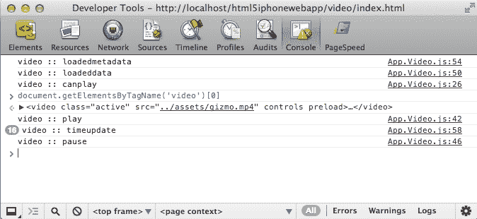

# 第二章：集成 HTML5 视频

媒体分发对于任何 Web 应用程序都是必不可少的；提供改变用户感知的丰富体验。很多时候，我们被要求在网站上放一张静态图片，而其他时候，我们被要求包含视频画廊，允许用户通过某种独特的导航轻松切换视频。以前，我们可以使用 Flash 和其他基于插件的技术来实现这一点，但随着 HTML5 视频的广泛支持，我们现在有能力在不需要下载插件的情况下提供视频。

需要记住的一件事是，HTML5 视频和音频共享相同的规范。这是因为它们都被认为是媒体元素。这意味着视频和音频共享一些属性和方法，使得在我们的应用程序中实现它们更容易。

无论如何，让我们开始学习如何配置我们的服务器以正确地传送我们的视频。

在本章中，我们将涵盖：

+   配置我们的服务器以进行视频分发

+   实施 HTML5 视频

+   监听 HTML5 视频事件

+   创建一个完整的 JavaScript 视频库

+   自定义 HTML5 视频控件

# 配置服务器

在实施视频之前，我们需要确保服务器知道我们将提供哪些媒体类型。现在这样做有助于避免以后出现网络错误时不知道原因的头痛。所以让我们开始吧。

## 视频格式

首先，我们需要知道我们将提供哪些文件类型。在我们的示例中，我们将使用 MP4，但允许支持的文件类型总是一个好主意。确保你的视频有 WebM、OGV 和 MP4 格式。但首先，在我们继续之前，让我们先了解一下这些格式。

### 提示

我们不会深入解释广泛支持的不同类型，但请记住，Theora、WebM 和 H.264/MPEG-4 是最广泛支持的格式。Theora 和 WebM 都是免费的，WebM 的开发得到了 Google 的支持。由于担心专利问题，Theora 在浏览器中的实现一直滞后，而 WebM 由于其免版税和开放的视频压缩功能，得到了 Mozilla Firefox、Google 和 Opera 的广泛支持。

当涉及到 H.264 时，情况变得有点棘手。尽管它是一个高质量、速度快、视频压缩的标准格式，但专利使其受到限制。因此，它在流行浏览器中的支持一直滞后。最终，每个浏览器都开始支持这种格式，但不是没有争议。

## 视频格式指令

接下来，根据服务器类型，我们需要包含特定的指令来允许我们的文件类型。在这个例子中，我们使用的是 Apache 服务器，因此以下语法：

```html
AddType video/ogg .ogv
AddType video/mp4 .mp4
AddType video/webm .webm
```

前面的代码将被添加到服务器上的`.htaccess`文件或`httpd.conf`文件中。无论哪种方式，`AddType`指令都会告诉服务器它应该和可以提供哪些类型。因此，当我们逐行进行时，我们可以看到我们正在添加`video/ogg`类型和扩展名`.ogv`，我们也为 MP4 和 WebM 这样做。

采取这些初始步骤有助于我们在使用 HTML5 在网站上实现视频时避免任何网络问题。如果你想知道我们如何使用这些类型，不用担心，下一节我们将详细介绍。

# 一个简单的 HTML5 视频

我们一直渴望在我们的 Web 应用程序中做一些酷炫的东西，所以让我们开始吧。让我们从在我们的网站上以最简单的方式包含一个视频开始，而不涉及任何复杂的交互！

## 单一视频格式

首先，让我们打开位于`Chapter 2`项目的`video`子目录中的`index.html`文件。如果你跳过了第一章，不要担心，`Chapter 2`的源文件会跟随并帮助你继续前进。

一旦我们有了我们的`index.html`文件，我们希望在内容区域中包含`video`元素，在`<header>`元素之后。这很简单，我们可以这样做：

```html
<video src="img/testvid.mp4" controls preload></video>
```

前面的代码类似于图像元素。我们定义了一个`src`属性，指示浏览器在哪里找到视频，然后我们定义了`controls`和`preload`属性，这些属性指示浏览器显示默认的本机控件并预加载视频。简单吧？

## 支持多种格式

这就是我们在网站上放置视频所需要的一切，但当然，事情并不总是那么简单。正如我们之前讨论的，浏览器可以支持我们指定的格式中的一个或一个都不支持。当然，现在我们有很好的浏览器支持，但我们要确保我们的应用程序是稳固的，所以我们需要确保我们传递适当的文件。为了做到这一点，我们可以修改上面的代码如下：

```html
<video poster="testvid.jpg" controls preload>
    <source src="img/testvid.webm" type='video/webm'/>
    <source src="img/testvid.ogv" type='video/ogg'/>
    <source src="img/textvid.mp4" type='video/mp4'/>
    <p>Fallback Content</p>
</video>
```

在这里，我们介绍了一个新属性，`poster`。`poster`属性是我们在视频开始时显示的图像，或者在视频无法加载时显示的图像。当我们将源元素移动到`video`元素内部时，事情变得有点复杂。但是，如果我们检查一切，我们基本上是在定义多个源视频及其类型。然后浏览器将选择适当的视频进行显示。可能会让你困惑的是包含`Fallback Content`文本的段落元素。如果一切都失败了，或者浏览器不支持 HTML5 视频，这就是它的作用。

如果这有点令人困惑，不要太担心，因为 iPhone 的移动 Safari 支持 MP4，而且这对你的应用程序来说已经足够了。所以如果我们想保持简单，我们可以在我们的 iPhone 应用程序中使用以下代码，这也正是我们在本书中所做的：

```html
<video src="img/testvid.mp4" controls preload>
    <p>Video is not supported in your browser.</p>
</video>
```

现在我们的应用程序中有一个简单的视频播放，我们可能想要捕捉视频的事件。

# 监听 HTML5 视频事件

很可能你会想要完全控制你的应用程序，或者至少监视可能发生的事情。出于各种原因，你通常会发现自己附加事件或监听事件。从跟踪到增强体验，事件是我们如何在页面上驱动交互的方式。使用 HTML5 视频，我们可以使用本机浏览器从头到尾监视视频的状态。你有机会监听视频何时加载完成以及用户何时暂停视频。

让我们回顾一下我们可以使用的事件。你会发现，我们用于视频的事件也可以转移到音频上。这是因为，正如我们之前学到的那样，视频和音频元素都被归类为 HTML5 规范中的媒体元素。这是我们可以使用的事件表：

| 事件名称 | 条件 |
| --- | --- |
| `loadedmetadata` | 已确定媒体资源的持续时间和尺寸。 |
| `loadeddata` | 现在可以首次渲染媒体数据。 |
| `canplay` | 媒体数据的播放可以恢复。 |
| `seeking` | 媒体资源的寻找属性已设置为 true。 |
| `seeked` | 媒体资源的寻找属性已设置为 false。 |
| `play` | 元素未暂停。当`play()`方法已返回或`autoplay`属性已导致元素开始播放时触发。 |
| `ended` | 已到达媒体资源的结尾并且播放已停止。 |
| `pause` | `pause()`方法已返回，元素已暂停。 |
| `timeupdate` | 媒体资源的播放位置以某种方式发生了变化。 |
| `volumechange` | 当音量或静音属性发生变化时触发。 |

规范定义了更多的事件，但这些是我们将从先前简单实现中监听的事件。所以让我们开始吧。

## 视频标记回顾

首先，打开`video`目录中的`index.html`文件。在这个文件中，您必须确保您的内容看起来像下面这样：

```html
<div class="site-wrapper">
    <header>
        ....
    </header>
    <div class="gallery">
                    <video src="img/testvid.mp4" controls preload></video>
    </div>
    <footer>
        ...
    </footer>
</div>
```

不要注意省略号，这只是为了使代码在文本中更短。您要确保的是，您有来自上一节的简单的`<video>`元素实现。

## 附加视频事件

现在开始有趣的部分。让我们开始扩展我们的 JavaScript 以包括监听器。让我们打开位于`App`文件夹下`/js`目录中的`App.Video.js`文件。如果您没有从我们的架构章节一直跟着做，不用担心，对您来说重要的是要理解我们为应用程序创建了一个结构，`App.Video.js`文件将包含视频应用程序的所有功能。

找到`App.Video`类的构造函数。这应该在您的文本编辑器的第 16 行，并且当前应该看起来像下面这样：

```html
function Video(options) {
    // Customizes the options by merging them with whatever is passed in
    this.options = $.extend({}, _defaults, options);

    //Cache the main element
    this.$element = $(this.options.element);
}
```

再次回顾一下，我们将一个称为`options`的对象传递给我们的构造函数。从这里，我们创建一个名为`options`的属性，用于`Video`的实例，这个属性将使用 Zepto 的 extend 方法设置为选项和默认值的扩展或合并版本。然后，我们缓存通过合并选项发送的元素。这可能有点令人困惑，但在 JavaScript 应用程序中，这是一个非常公认的模式。

由于我们已经验证了我们的构造函数存在并且运行良好，现在我们想要添加先前的监听器。我们可以使用本地的`addEventListener`方法轻松地做到这一点，如下所示：

```html
this.options.element.addEventListener('canplay', function(e){ 
    console.log('video :: canplay'); 
});

this.options.element.addEventListener('seeking', function(e){ 
    console.log('video :: seeking'); 
});

this.options.element.addEventListener('seeked', function(e){ 
    console.log('video :: seeked'); 
});

this.options.element.addEventListener('ended', function(e){ 
    console.log('video :: ended'); 
});

this.options.element.addEventListener('play', function(e){ 
    console.log('video :: play'); 
});

this.options.element.addEventListener('pause', function(e){ 
    console.log('video :: pause'); 
});

this.options.element.addEventListener('loadeddata', function(e){ 
    console.log('video :: loadeddata'); 
});

this.options.element.addEventListener('loadedmetadata', function(e){ 
    console.log('video :: loadedmetadata'); 
});

this.options.element.addEventListener('timeupdate', function(e){ 
    console.log('video :: timeupdate'); 
});
```

这里有几件事情需要注意。首先，我们使用`this.options.element`而不是缓存版本的`this.$element`。我们这样做是因为我们实际上想要元素而不是`Zepto`对象。其次，我们调用`addEventListener`并传递两个参数。第一个参数是一个字符串，定义了我们要监听的事件。第二个参数是一个回调函数，每当我们在参数一中指定的事件触发时都会被调用。

### 提示

请注意，我们正在使用`console.log()`方法。它类似于`alert()`，但没有那么烦人。它有助于更好地调试，并输出到一个控制台，让我们跟踪所有的日志输出。在继续之前，使用这种方法是调试我们的应用程序和测试功能的好方法。

您的构造函数现在应该如下所示：

```html
function Video(options) {
    // Customizes the options by merging them with whatever is passed in
    this.options = $.extend({}, _defaults, options);

    // Cache the main element
    this.element = options.element;
    this.$element = $(this.options.element);

    this.options.element.addEventListener('canplay', function(e){ 
        console.log('video :: canplay'); 
    });

    this.options.element.addEventListener('seeking', function(e){ 
        console.log('video :: seeking'); 
    });

    this.options.element.addEventListener('seeked', function(e){ 
        console.log('video :: seeked'); 
    });

    this.options.element.addEventListener('ended', function(e){ 
        console.log('video :: ended'); 
    });

    this.options.element.addEventListener('play', function(e){ 
        console.log('video :: play'); 
    });

    this.options.element.addEventListener('pause', function(e){ 
        console.log('video :: pause'); 
    });

    this.options.element.addEventListener('loadeddata', function(e){ 
        console.log('video :: loadeddata'); 
    });

    this.options.element.addEventListener('loadedmetadata', function(e){ 
        console.log('video :: loadedmetadata'); 
    });

    this.options.element.addEventListener('timeupdate', function(e){ 
        console.log('video :: timeupdate'); 
    });
}
```

## 初始化我们的视频

现在我们已经定义了一个初步的视频类，我们需要初始化它。所以让我们继续打开`main.js`，我们的初始化代码应该在那里。它应该看起来像这样：

```html
(function(window, document) {
    'use strict';

    // Create an instance of our framework
    var app = new App({
        // Custom Option, allowing us to centralize our framework
        // around the site-wrapper class
        'element': document.querySelector('.site-wrapper')
    });
    // Expose our framework globally
    window.app = app;
}(window, document));
```

我们在上一章中创建了这个，但让我们简要地回顾一下。在这里，我们创建了一个闭包，传递了`window`和`document`对象。在内部，我们设置解释器严格地读取我们的代码。然后我们创建了`App`类的一个实例，然后将其暴露给`window`对象。

现在我们需要添加`Video`类的初始化。为此，让我们在声明`App`的新实例之后放入以下代码片段，如下所示：

```html
new App.Video({
    'element': document.getElementsByTagName('video')[0]
});
```

这个片段创建了`App.Video`类或`Video`类的一个新实例，并传入一个包含元素的简单对象。我们通过使用附加到`document`对象的`getElementsByTagName`方法来检索元素。我们告诉方法查找所有的视频元素。有趣的部分是`[0]`，它告诉查找结果只获取返回的数组中的第一个元素。

如果我们加载页面并测试视频，我们应该在控制台中看到我们之前定义的日志输出，类似于以下的截图：



视频日志输出

我们已经开始了`Video`类的初步工作，从事件到初始化。然而，如果我们要使它可重用于我们的应用程序，并且如果我们想要扩展其功能，我们需要稍微整理一下。因此，让我们花一些时间创建一个完全功能的 JavaScript 视频库，它将在我们的 iPhone 网络应用程序中工作。

# 创建一个 JavaScript 视频库

目前，我们有一个非常简单的`Video`类，它缓存一个元素，然后附加了多个由 HTML5 媒体元素规范定义的事件。我们已经定义了视频播放器的基本要素，现在需要进一步抽象，以便更好地重用和管理。遵循一些约定并创建一个灵活的框架将帮助我们更快更有效地移动。

首先，让我们考虑一些可能需要从这个类中得到的东西：

+   一个附加适当事件的事件方法

+   可以定义的回调方法，例如`onPlay`，`onPause`和`onEnded`

+   可以从实例外部调用的公共方法

+   类似于 jQuery 的可链接方法，您可以依次调用一个方法，例如`fadeIn().fadeOut().show().hide()`

拥有一个抽象类行为的项目列表是建立一个坚实框架或库的正确方向。现在让我们开始创建回调。

## 集中我们的事件

首先，让我们解决如何为我们的`Video`类附加事件。以前，我们将这些事件添加到构造函数中，虽然这是一种不错的技术，但可以通过指定一个处理事件附加到`Video`对象实例的函数来改进。

那么，让我们在`Video`类中创建一个名为`attachEvents`的私有方法，该方法只能在`App.Video`闭包或 IIFE 中访问。当我们创建我们的`attachEvents`方法时，我们应该将所有的事件处理程序放在其中。然后我们希望在初始化`this.$element`之后调用`attachEvents`方法。完成后，您的代码应该如下所示：

```html
function Video(options) {
    this.options = $.extend({}, _defaults, options);

    // Cache the main element
    this.element = options.element;
    this.$element = $(this.options.element);

    attachEvents();
}

function attachEvents() {
    // All your event handlers go here
}
```

### 提示

在之前的代码中，`attachEvents()`函数将包含我们之前创建的事件处理程序。为了简洁起见，我现在省略了它们。

现在，如果我们运行这段代码，很可能会遇到一些错误。这实际上是正常的，被称为作用域问题。为了解决这个问题，首先我们需要了解幕后发生了什么。

### JavaScript 中的作用域

如果您是 JavaScript 的新手，作用域很可能会在早晚困扰您。如果您在 JavaScript 中处于中级或高级水平，您可能仍然会遇到作用域问题。这是完全正常的，我们都会遇到这种情况。无论如何，让我们拿出当前的`Video`类并分析一下，以便在上下文中理解作用域。

JavaScript 具有函数级作用域，这意味着每次创建新函数时，都会创建一个新的作用域。作用域可能会相当令人困惑，但通过实践会变得更容易。现在把作用域看作是对当前位置的引用，它知道自己和它的环境，但不知道在它内部新创建的作用域。如果听起来令人困惑，当你开始时可能会有些困惑。但让我们通过一些代码来更好地理解一下。

所以，让我们从全局范围开始：

```html
// Global Scope
var x = 10;
(function($){ 
    // New Scope
    console.log(x);
}(Zepto));
```

在这个例子中，`App.Video`的简化版本中，我们可以看到全局作用域在闭包周围。当我们创建一个闭包时，会创建一个新的作用域。这里很酷的一点是，闭包外的任何东西都可以被访问到。因此，当我们在闭包内部执行`console.log`时，我们应该得到`10`。

每当你创建一个新的函数作用域时，你可以传递参数，本质上是给你发送的值命名空间。在这种情况下，我们传入`Zepto`，并告诉新的函数作用域在该作用域内将美元符号定义为`Zepto`的实例。希望这能更清楚地解释作用域，如果不清楚，不要担心；理解这个概念需要时间和耐心。

因此，我们事件处理程序的问题在于`attachEvents`内的新函数作用域没有对`this.options`的引用。由于新的作用域，关键字`this`相对于窗口对象，而不是`Video`对象。它没有引用的原因是因为我们的构造函数是一个完全不同的作用域，它们之间没有交流。为了解决这个问题，我们可以使用`.call()`方法，它将改变`this`关键字的引用，以反映`Video`函数作用域。可以通过修改`attachEvents`的调用来实现：

```html
attachEvents.call(this);
```

如果你现在运行你的代码，你不应该得到任何错误。如果有的话，看看代码的最终版本，进行比较并找出问题所在。

## 暴露功能

在本章的后面，我们将探索自定义用户界面，帮助我们覆盖视频播放器的默认功能。然而，为了做到这一点，我们需要确保一些功能是公开的。在 JavaScript 中，为了使方法在闭包之外公开，我们需要将方法附加到`class`的原型上——在这种情况下是`Video`。

我们已经看到我们的所有类中都暴露了两个方法；这些包括`getDefaults`和重写函数`toString`。让我们通过添加`play`、`pause`、`stop`、`mute`、`unmute`和`fullscreen`方法来扩展原型。

```html
Video.prototype.play = function() {
    return this;
}

Video.prototype.pause = function() {
    return this;
}

Video.prototype.stop = function() {
    return this.pause();
}

Video.prototype.mute = function() {
    return this;
};

Video.prototype.unmute = function() {
    return this;
};

Video.prototype.fullscreen = function() {
    return this;
}
```

我相信你已经注意到这些方法中缺少了代码，没关系。我们想要理解的是，我们可以扩展`Video`原型，并且可以通过在`return this`行中返回实例来为我们的方法添加链式调用。

让我们开始为我们的方法添加功能，从`play`开始：

```html
Video.prototype.play = function() {
    this.element.play();

    return this;
}
```

在这里，我们通过调用`play`方法获取了我们在`Video`构造函数中缓存的元素。你可能想知道这个`play`方法是从哪里来的？嗯，HTML5 规范为媒体元素（包括视频和音频）定义了一个`play`方法。因此，我们可以使用`this.element.play()`来调用这个方法。我们可以用同样的方法来调用`pause`方法：

```html
Video.prototype.pause = function() {
    this.element.pause();
    return this;
}
```

再次，我们有一个由 HTML5 规范定义的暂停媒体元素的方法。当我们定义一个`stop`方法时，事情变得有点混乱：

```html
Video.prototype.stop = function() {
    return this.pause();
}
```

和以前一样；我们实际上没有做任何改变。让我解释一下，规范没有定义`stop`方法，所以我们需要创建一个方法来提供这个功能。但这并不太困难，因为我们已经定义了一个执行类似操作的`pause`方法。所以我们需要做的就是调用`this.pause()`，因为这是`Video`的一个实例，我们已经定义了一个`pause`方法。这里的巧妙之处在于我们不需要返回`this`，因为暂停方法已经返回了`this`，所以我们只需要返回调用`pause`方法的结果。我知道这有点令人困惑，但随着时间的推移，如果这是你第一次这样做，它会变得清晰起来。

现在，我们来看看我们的`mute`和`unmute`方法：

```html
Video.prototype.mute = function() {
    this.element.muted = true;
    return this;
};
Video.prototype.unmute = function() {
    this.element.muted = false;
    return this;
};
```

这些方法的唯一区别在于我们在视频元素上设置了一个属性为`false`。在这种情况下，我们将静音属性设置为`true`或`false`，取决于你调用的方法。

这里的事情变得有点复杂：

```html
Video.prototype.fullscreen = function() {
    if (typeof this.element.requestFullscreen === 'undefined') {
        this.element.webkitRequestFullScreen();
    } else {
        this.element.requestFullscreen();
    }
    return this;
}
```

这有点复杂，可能有点令人沮丧。相信我，行业内的许多人都感到痛苦。我们需要理解的是，我们正在处理的浏览器 Safari 是运行在一个名为 WebKit 的开源网络浏览器引擎上。

WebKit 非常受欢迎并得到广泛支持。问题在于，虽然它在实现最新和最好的功能方面做得很好，但其中许多是实验性的，因此它们具有前缀。我们在 CSS（层叠样式表）中经常看到这一点，使用`-webkit`。但在 JavaScript 中，我们也面临相同的问题，`webkit[standardMethodName]`。

虽然这可能很棒，但我们需要确保我们对剥离该前缀的新版本具有向后兼容性。这就是为什么在上一个方法中，我们对标准方法名称进行检查，如果不存在，我们使用`-webkit`前缀。否则，我们使用标准版本。

## 集成回调

回调在任何库或框架中都非常有用，您可能已经在使用 jQuery 或其他一些流行框架时看到过类似的东西。实质上，回调是在方法完成后调用的方法。例如，在`Zepto`方法中，`fadeout`接受两个参数，第一个是速度，第二个参数是在淡出完成时调用的函数。可以如下所示：

```html
$('.some-class').fadeout('fast', function(){
    // Do something when fading is complete
});
```

在上一个代码中的第二个参数不仅是一个回调函数，还是一个匿名函数。匿名函数只是一个没有名称的函数。在这种情况下，它在每次`fadeOut()`效果完成时执行。我们可以将上一个代码重写如下：

```html
$('.some-class').fadeOut('fast', someFadeOutFunc);
function someFadeOutFunc(){
    // Do something when fading is complete
}
```

由于我们创建了一个名为`someFadeOutFunc`的方法，当`fadeOut`完成时，我们只需调用该函数，而不是创建一个新函数。从架构的角度来看，这更有效和可管理。

创建回调的第一步是定义我们在代码中可能需要回调的位置。在这种情况下，我们可能希望为视频播放器中采取的每个操作创建一个回调，因此我们将创建以下回调：

+   `onCanPlay`

+   `onSeeking`

+   `onSeeked`

+   `onEnded`

+   `onPlay`

+   `onPause`

+   `onLoadedData`

+   `onLoadedMetaData`

+   `onTimeUpdate`

+   `onFullScreen`

好的，现在我们知道我们的代码中需要哪些回调，让我们在`attachEvents`方法之前的构造函数中实现它们：

```html
this.callbacks = {
    'onCanPlay': function(){ },
    'onSeeking': function(){},
    'onSeeked': function(){},
    'onEnded': function(){},
    'onPlay': function(){},
    'onPause': function(){},
    'onLoadedData': function(){},
    'onLoadedMetaData': function(){},
    'onTimeUpdate': function(){},
    'onFullScreen': function(){}
};
```

我们在这里所做的是将一个名为`callbacks`的属性附加到`Video`的实例上。该属性包含一个对象，该对象为我们想要实现的每个回调设置了键/值对，值是一个空的匿名函数。

### 扩展回调

尽管我们可以在类中使用回调，但问题在于它们不具有可扩展性，这意味着使用您的`Video`类的开发人员将无法扩展您的回调。为了使它们具有可扩展性，我们需要将它们放在我们的`_defaults`对象中：

```html
var _defaults = {
    'element': 'video',
    'name': 'Video',
    'callbacks': {
        'onCanPlay': function(){ },
        'onSeeking': function(){},
        'onSeeked': function(){},
        'onEnded': function(){},
        'onPlay': function(){},
        'onPause': function(){},
        'onLoadedData': function(){},
        'onLoadedMetaData': function(){},
        'onTimeUpdate': function(){},
        'onFullScreen': function(){}
    }
};
```

缺点是现在我们需要使用`this.options.callbacks`来访问我们想要的回调。通过在我们的构造函数中执行以下操作，可以轻松解决这个问题：

```html
this.callbacks = this.options.callbacks;
```

这仍然允许我们访问回调，但只能从扩展对象中访问。

### 使用回调

现在我们有了回调，并且已经使它们具有可扩展性，我们可以进入并将它们集成到我们的事件处理程序中。但首先，我们需要将我们的事件处理程序作为私有方法放在这个`Video`类中，并按以下方式调用我们的自定义回调：

```html
function onCanPlay(e, ele) {
    this.callbacks.onCanPlay();
}

function onSeeking(e, ele) {

    this.callbacks.onSeeking();
}

function onSeeked(e, ele) {

    this.callbacks.onSeeked();
}

function onEnded(e, ele) {

    this.callbacks.onEnded();
}

function onPlay(e, ele) {

    this.callbacks.onPlay();
}

function onPause(e, ele) {

    this.callbacks.onPause();
}

function onLoadedData(e, ele) {
    this.callbacks.onLoadedData();
}

function onLoadedMetaData(e, ele) {
    this.callbacks.onLoadedMetaData();
}

function onTimeUpdate(e, ele) {
    this.callbacks.onTimeUpdate();
}
```

在这一点上，我们已经完全将我们的回调集成到我们的库中。现在，我们只需要通过修改`attachEvents`处理程序来调用它们，如下所示：

```html
function attachEvents() {
        var that = this;
        this.element.addEventListener('canplay', function(e){ onCanPlay.call(that, e, this);  });
        this.element.addEventListener('seeking', function(e){ onSeeking.call(that, e, this); });
        this.element.addEventListener('seeked', function(e){ onSeeked.call(that, e, this);  });
        this.element.addEventListener('ended', function(e){ onEnded.call(that, e, this);  });
        this.element.addEventListener('play', function(e){ onPlay.call(that, e, this);  });
        this.element.addEventListener('pause', function(e){ onPause.call(that, e, this);  });
        this.element.addEventListener('loadeddata', function(e){ onLoadedData.call(that, e, this);  });
        this.element.addEventListener('loadedmetadata', function(e){ onLoadedMetaData.call(that, e, this);  });
        this.element.addEventListener('timeupdate', function(e){ onTimeUpdate.call(that, e, this);  });
    }
```

这里实施了一些概念。首先，我们用之前定义的实际私有方法替换了`console.logs`。其次，我们使用`call`方法通过传入`that`来更改`private`方法的范围，然后将`event`和`element`作为参数发送进去。

## 将所有内容联系起来

我们拥有一切所需的东西，如事件处理程序、公开功能、回调，甚至可链接的方法。这都很好，但现在我们需要让它起作用。这就是魔法发挥作用的地方。

要验证，您的`Video`类应该如下所示：

```html
var App = window.App || {};

App.Video = (function(window, document, $){
    'use strict';

    var _defaults = { ... };

    // Constructor
    function Video(options) {
        this.options = $.extend({}, _defaults, options);

        this.element = options.element;
        this.$element = $(this.options.element);

        this.callbacks = this.options.callbacks;

        attachEvents.call(this);
    }

    // Private Methods
    function attachEvents() { ... }

    // Event Handlers
    function onCanPlay(e, ele) { ... }
    function onSeeking(e, ele) { ... }
    function onSeeked(e, ele) { ... }
    function onEnded(e, ele) { ... }
    function onPlay(e, ele) { ... }
    function onPause(e, ele) { ... }
    function onLoadedData(e, ele) { ... }
    function onLoadedMetaData(e, ele) { ... }
    function onTimeUpdate(e, ele) { ... }

    // Public Methods
    Video.prototype.getDefaults = function() { ... };
    Video.prototype.toString = function() { ... };
    Video.prototype.play = function() { ... }
    Video.prototype.pause = function() { ... }
    Video.prototype.stop = function() { ... }
    Video.prototype.mute = function() { ... };
    Video.prototype.unmute = function() { ... };
    Video.prototype.fullscreen = function() { ... }

    return Video;

}(window, document, Zepto));
```

### 注意

请注意，上一段代码中的省略号表示应该有功能。由于页面数量的限制，我们只能展示到目前为止代码的简要摘要。如果您需要查看已完成的工作，请查看前面的部分或查看本书附带的源代码。

如果您的文件看起来像这样，那就太完美了！如果它看起来不太像这样，不要担心，这就是为什么我们在这本书中附上了源代码。在这一点上，我们已经准备好在我们的页面上初始化这个库了。

让我们打开`main.js`文件；该文件应该位于`js`目录下。我们需要进行以下添加：

```html
new App.Video({
    'element': document.getElementsByTagName('video')[0],
    'callbacks': {
        'onCanPlay': function(){ console.log('onCanPlay'); },
        'onSeeking': function(){ console.log('onSeeking'); },
        'onSeeked': function(){ console.log('onSeeked'); },
        'onEnded': function(){ console.log('onEnded'); },
        'onPlay': function(){ console.log('onPlay'); },
        'onPause': function(){ console.log('onPause'); },
        'onLoadedData': function(){ console.log('onLoadedData'); },
        'onLoadedMetaData': function(){ console.log('onLoadedMetaData'); },
        'onTimeUpdate': function(){ console.log('onTimeUpdate'); },
        'onFullScreen': function(){ console.log('onFullScreen'); }
    }
});
```

让我们快速浏览一下。首先，我们创建一个新的`App.Video`实例，传入一个参数——一个简单的对象。其次，我们传入的对象包含两个对象：我们想要在页面上的`video`元素，以及一个覆盖默认值的回调对象。第一个参数使用内置方法`getElementsByTagName`来获取`video`元素的所有实例，然后我们使用`[0]`获取找到的第一个实例。这是因为该方法返回一个数组。第二个参数`callbacks`包含我们想要在`App.Video`实例上调用的函数回调。在这些方法中，我们只想要记录被调用的方法。

从这里开始，当实例被初始化时，我们定义的`Video`库将合并我们传入的简单对象，并从那里开始。几乎就像魔术一样，除了我们已经创建了它。

最后要注意的一点是，确保我们只在视频页面上初始化视频。如果我们在应用程序的非视频页面上，这段代码将产生一个错误。这是因为没有视频元素，我们也没有添加错误检测。这是一个很好的功能，但本书不涵盖这部分。因此，让我们在`main.js`中做以下操作：

```html
if(document.querySelector('video') !== 'null') {
    new App.Video({
        'element': document.getElementsByTagName('video')[0],
        'callbacks': {
            ...
        }
    });
}
```

在前面的代码中，我们将我们的初始化代码包装在一个`if`语句中，检查我们是否在视频页面上。我们进行检查的方式是使用文档对象上的内置方法`querySelector`。这个方法接受一个 CSS 类型的选择器，在这种情况下，我们发送`video`选择器，告诉它获取所有`video`元素的实例。如果返回的结果不是 null，那么我们就初始化。

现在我们不需要对标记做任何事情，这段代码将运行，我们应该没问题。如果由于某种原因您遇到任何错误，请查看本书附带的源代码。接下来，让我们考虑覆盖视频播放器的默认控件，以便更好地控制功能。

# 自定义 HTML5 视频控件

我们可能希望对视频控件有更多的输入，从样式到视频功能，比如添加停止按钮。为了做到这一点，我们需要稍微修改我们的标记。我们应该对视频做以下操作：

```html
<div class="video-container">
    <video src="img/testvid.mp4" controls preload>
        <p>Video is not supported in your browser.</p>
    </video>
</div>
```

我们在这里所做的只是在`video`元素周围添加了一个包含`div`的类，并给它添加了一个`video-container`的类。现在我们想要为`video`元素添加一些响应式样式，所以让我们打开`video.css`并添加以下样式：

```html
video {
    display: block;
    width: 100%;
    max-width: 640px;
    margin: 0 auto;
}

.video-container {
    width: 100%;
}
```

第一个选择器将应用于页面上的所有`video`元素，并告诉每个元素相对于其容器具有 100%的宽度，但最大宽度为`640px`。边距属性有助于使其在页面或容器中居中。下一个选择器`video-container`只指定宽度为 100%。这种样式将相应地调整播放器的大小；您可以通过调整浏览器大小来查看。

在这个例子中，我们将使用锚元素来使用基本控件。请记住，您可以使用任何类型的样式或标记来设计您的控件，只要记住我们已经在我们的`Video`类中公开了视频播放，所以为了简洁起见，我们将演示如何使用锚元素来实现这一点。

在我们的`video-container`中，我们想要附加以下标记：

```html
<div class="video-controls">
    <div class="vc-state">
        <a class="vc-play vc-state-play" href="#play">Play</a>
        <a class="vc-pause vc-state-pause" href="#pause">Pause</a>
    </div>
    <div class="vc-track">
        <div class="vc-progress vc-track-progress"></div>
        <div class="vc-handle vc-track-handle"></div>
    </div>
    <div class="vc-volume">
        <a class="vc-unmute vc-volume-unmute" href="#volume">Volume On</a>
        <a class="vc-mute vc-volume-mute" href="#volume">Volume Off</a>
    </div>
    <a class="vc-fullscreen" href="#fullscreen">Fullscreen</a>
</div>
```

前面的标记是我们将用于控件的标记。它们非常直观，但让我们回顾一下这里做出的一些决定。首先，我们有一个带有`video-controls`类的周围`div`，以帮助定义我们所有控件的存在位置。其次，每种类型的控件都以`vc`为前缀，代表视频控件。第三，在这个例子中，我们有四种类型的控件，即状态、轨道、音量和全屏控件。最后一点是，其中一些控件具有显示/隐藏功能，例如，播放和暂停只有在其他控件取消时才会显示。

对于样式，我们可以将以下样式添加到`video.css`文件中：

```html
.video-controls {
    margin: 12px auto;
    width: 100%;
    text-align: center;
}

.video-controls .vc-state,
.video-controls .vc-track,
.video-controls .vc-volume,
.video-controls .vc-fullscreen {
    display: inline-block;
    margin-right: 10px;
}

.video-controls .vc-fullscreen {
    margin-right: 0;
}

.video-controls .vc-state-pause,
.video-controls .vc-volume-unmute {
    display: none;
}
```

在这一部分的样式中，我们将所有视频控件样式自包含到`video-controls`类中。这有助于以模块化的方式维护样式。再次遵循响应式设计原则，我们告诉控件宽度为 100%。然后，每种类型的控件都设置为显示为内联块，类似于`float`。最后，我们告诉所有默认控件，它们不应该在初始时显示，所以设置为`display: none`。现在，我们需要为我们的控件添加交互性。

首先，让我们创建一个遵循整个框架的`App.VideoControls`类：

```html
var App = window.App || {};

App.VideoControls = (function(window, document, $){
    'use strict';

    var _defaults = { };

    function VideoControls(ele, options) {
        this.options = $.extend({}, _defaults, options);
        this.ele = ele;
        this.$ele = $(ele);

        this.init();
    }
    return VideoControls;

}(window, document, Zepto));
```

正如你所看到的，这里并没有太大的区别。唯一的区别是现在有一个被调用的`init`方法。这是为了将初始化功能分离到其他地方，以便构造函数不完全被代码填满。现在我们需要添加以下默认值：

```html
var _defaults = {
    // Supported Features
    'features': ['play', 'pause', 'fullscreen', 'mute', 'unmute', 'playpause'],
    // State of the controls
    'state': 'paused',
    // State of the sound
    'sound': 'unmuted',
    // Customizable Classes or Classes associated with Elements
    'classes': {
        'state': {
            'holder': 'vc-state',
            'play': 'vc-state-play',
            'pause': 'vc-state-pause'
        },
        'track': {
            'holder': 'vc-track',
            'progress': 'vc-track-progress',
            'handle': 'vc-track-handle'
        },
        'volume': {
            'holder': 'vc-volume',
            'mute': 'vc-volume-mute',
            'unmute': 'vc-volume-unmute'
        }
    },
    // Customizable Events or Dispatched Events
    'events': {
        'onPlay': 'videocontrols:play',
        'onPause': 'videocontrols:pause',
        'onFullScreen': 'videocontrols:fullscreen',
        'onMute': 'videocontrols:mute',
        'onUnmute': 'videocontrols:onUnmute'
    }
};
```

作为对这些默认值的回顾，第一个默认值是一个特性数组，允许开发人员进入这段代码来自定义我们需要初始化的内容。第二个默认值保持控件的状态，即播放、暂停等。第三个是专门用于声音的状态。类默认值允许我们使用自定义类，因此使用这个`videocontrols`类的开发人员不受我们在标记中定义的类的限制。最后一个是事件默认值，定义了我们想要分发的自定义事件。通过将其包含在我们的默认值中，开发人员现在也可以自定义这些事件。

### 注意

正如你所注意到的，构建一个可以在任何类型的网络应用程序中重复使用和正确实现的视频播放器需要很多工作。尽管一开始非常困难，但付出努力最终会有所帮助。现在我们可以以更模块化的方式添加和删除功能。

由于创建模仿原生控件的自定义控件需要大量的代码，我们决定将其余的功能，包括显示/隐藏和触发自定义事件，留在源代码中供您审查。不过不用担心，所有内容都有注释，如果您有问题，我鼓励您给我发电子邮件或向您的同事寻求帮助。

现在，我们想要实现控件和视频播放器之间的通信。但首先，我们需要清理一下`main.js`文件。因此，让我们从`main.js`中删除以下代码：

```html
if(document.querySelector('video') !== 'null') {
    new App.Video({
        'element': document.getElementsByTagName('video')[0],
        'callbacks': {
            ...
        }
    });
}
```

我们不希望这段代码出现在`main.js`中，因为它将在本书中构建的所有应用程序之间共享，所以我们需要将其抽离出来。因此，我们在`js/App`目录中创建了另一个名为`App.VideoController.js`的 JavaScript 文件。这个文件也包含在本书的源代码中。

请打开本书附带的`App.VideoController.js`文件，并找到`initControls`方法；它应该看起来像下面这样：

```html
VideoController.prototype.initControls = function() {
    // Remove Default control
    // Comment this out if you want native controls
    $(videoEle).removeAttr('controls');

    controlsEle = document.querySelector('.video-controls');

    controls = new App.VideoControls(controlsEle);

    $(controlsEle).
         on('videocontrols:play', function(){
            video.play();
        }).
        on('videocontrols:pause', function(){
            video.pause();
        }).
        on('videocontrols:fullscreen', function(){
            video.fullscreen();
        }).
        on('videocontrols:mute', function(){
            video.mute();
        }).
        on('videocontrols:onUnmute', function(){
            video.unmute();
        });

    return this;
}
```

让我们简要回顾一下这个方法中正在发生的事情，以便更好地理解它。首先，我们告诉我们的`video`元素隐藏它的控件。这是通过移除`controls`属性来实现的。然后我们将我们的`controls` div 缓存在`controlsEle`中。接下来，我们初始化我们的`App.VideoControls`类，并将其传递给缓存的`controls` div。最后，我们为缓存的视频控件添加监听器，并监听我们在`App.VideoControls`默认值中定义的自定义事件。这些监听器然后通过告诉实例`video`运行适当的函数来调用我们在`App.Video`中公开的方法。

我们需要处理的最后一个问题是初始化整个程序。由于我们在`main.js`中删除了初始化，我们需要在其他地方开始它。最好的地方应该是在特定的`index.html`上，即`video/index.html`。因此，让我们打开这个文件，并在页面底部包含以下脚本，就在`main.js`包含之后。

```html
<script>
    new App.VideoController(true);
</script>
```

这是最后需要处理的事项。当我们运行我们的页面时，我们应该有一个完全功能的视频播放器，它可以使用我们定制的控件。

# 总结

给自己一个大大的鼓励，因为你已经取得了相当大的成就！你不仅拥有了一个带有定制控件的视频播放器，而且还建立了一个符合 HTML5 规范并在 iPhone 上运行的稳固视频库。我们已经研究了 HTML5 规范的视频集成，创建了一个使用原生控件的简单视频播放器，构建了一个完全功能和模块化的视频库，用一个控件类扩展了视频库，定制了我们的体验，并最终创建了一个控制器类，将视频和定制控件连接起来。在这个过程中，我们花了一些时间来理解 JavaScript 中的作用域、原型和回调的有用性。如果在本章教授的概念中的任何时候你遇到了一些困难，请通过本书查看源代码，并且一如既往地，实践是完美的。下一章应该会更容易，因为我们将把我们在这里学到的概念应用到音频上。
