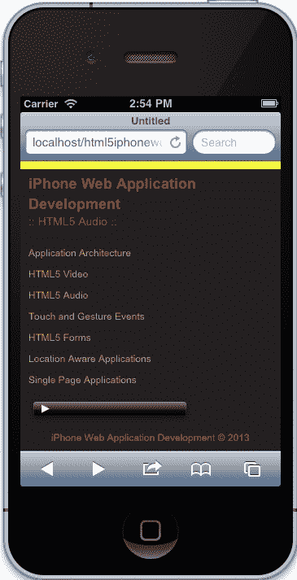
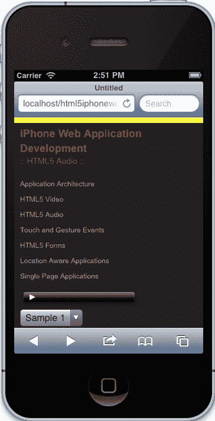
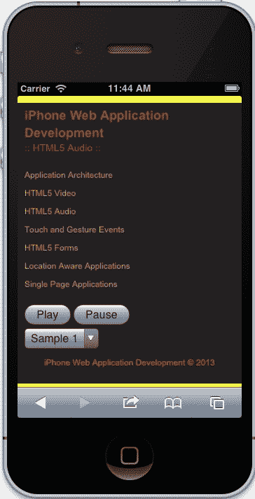
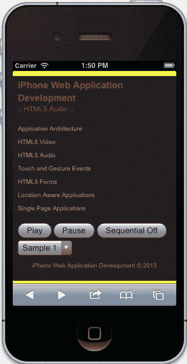

# 第三章：HTML5 音频

在上一章中，我们讨论了媒体分发的重要性，以及 HTML5 如何改变了在浏览器中提供音频和视频内容的方式。我们特别讨论了 HTML5 视频实现，但我们也讨论了`MediaElement`规范，该规范涵盖了视频和音频都使用的常见 API。

在本章中，我们将进一步研究规范并将其抽象化，使其可重用于音频和视频。但在此之前，我们将通过一个简单的示例讨论服务器配置，然后继续进行更高级的实现，包括动态音频播放器和自定义控件。

在本章中，我们将学习以下内容：

+   集成一个简单的 HTML5 音频示例

+   配置我们的服务器

+   `MediaElement`抽象

+   扩展`MediaElement`API 以支持音频

+   创建动态音频播放器

+   自定义音频控件

# 服务器配置

在开始使用 HTML5 音频元素之前，我们需要配置我们的服务器，以允许特定的音频格式适当播放。首先，让我们花点时间了解适当的音频格式。

## 音频格式

对 HTML5 音频播放的支持与视频元素的支持类似，因为每个浏览器出于某种原因支持不同类型的格式。以下是一些展示支持情况的表格：

+   以下是与桌面浏览器相关的细节：

| 桌面浏览器 | 版本 | 编解码器支持 |
| --- | --- | --- |
| Internet Explorer | 9.0+ | MP3，AAC |
| Google Chrome | 6.0+ | Ogg Vorbis, MP3, WAV |
| Mozilla Firefox | 3.6+ | Ogg Vorbis, WAV |
| Safari | 5.0+ | MP3，AAC，WAV |
| Opera | 10.0+ | Ogg Vorbis, WAV |

+   以下是与移动浏览器相关的细节：

| 移动浏览器 | 版本 | 编解码器支持 |
| --- | --- | --- |
| Opera Mobile | 11.0+ | 设备相关 |
| Android | 2.3+ | 设备相关 |
| Mobile Safari（iPhone，iPad，iPod Touch） | iOS 3.0+ | MPEG，MPG，MP3，SWA，AAC，WAV，BWF，MP4，AIFF，AIF，AIFC，CDDA，32G，3GP2，3GP，3GPP |
| Blackberry | 6.0+ | MP3，AAC |

正如我们所看到的，各种浏览器，无论是移动还是桌面，都支持多种格式类型。幸运的是，这本书侧重于 iPhone 网络应用程序，所以对于我们的目的，我们只关注传递大多数浏览器支持的 MP3 格式。现在，我们需要确保我们的服务器可以播放 MP3。

## 音频格式指令

为了提供正确的 MIME 类型，我们需要配置我们的 Apache 服务器。为此，我们希望将以下指令添加到一个`.htaccess`文件中：

```html
AddType audio/mpeg mp3
AddType audio/mp4 m4a
AddType audio/ogg ogg
AddType audio/ogg oga
AddType audio/webm webma
AddType audio/wav wav
```

当然，对于我们的目的，我们只需要 MPEG/MP3，但允许这些格式是个好主意，以便在支持其他浏览器时考虑可扩展性。

# 简单的 HTML5 音频集成

在页面上包含音频非常简单。我们只需在页面中包含以下标记，就可以立即拥有一个音频播放器：

```html
<audio controls>
    <source src="img/mymusic.mp3" type='audio/mpeg; codecs="mp3"'/>
    <p>Audio is not supported in your browser.</p>
</audio>
```



音频元素

前面的例子指定了一个带有控件属性的音频元素，告诉浏览器具有用于播放的本机控件的音频播放器。在这个元素内部，有一个源元素和一个段落元素。源元素指定音频的来源和类型。源元素上的`src`属性是音频的相对位置，`type`属性指定了源的 MIME 类型和编解码器。最后，我们有一个段落元素，以防音频元素不受支持。

这个例子非常适合演示在我们的页面上拥有媒体有多么容易，除非它并不总是那么简单。大多数时候，我们希望完全控制我们的组件，有时需要利用指定的 API。我们在上一章中已经讨论过这些概念，并且开发了一个广泛的 Video 类，我们可以在这里使用。在下一节中，我们将退一步，抽象我们迄今为止编写的代码。

# MediaElement 抽象

我们已经讨论过音频和视频在 HTML5 规范中共享相同的 API。在本节中，我们将讨论将我们编写的视频 JavaScript 抽象化，以便我们可以重用它来进行音频播放。

## 创建 App.MediaElement.js

1.  首先，在我们的`js`目录中创建一个新的 JavaScript 文件，命名为`App.MediaElement.js`。

1.  接下来，将`App.Video.js`的内容复制到新的`App.MediaElement.js`文件中。

在这一步中，我们希望确保我们的文件反映了`MediaElement`命名空间，因此我们将把`Video`一词重命名为`MediaElement`。

一旦我们把所有东西都重命名为`MediaElement`，我们可能想要删除默认元素及其名称，因为它们对于这样一个抽象类来说是不必要的。除了这些默认值，我们也不需要公共的`fullscreen`方法或`onFullScreen`回调。

当我们进行以上更改时，我们的文件应该如下所示：

```html
var App = window.App || {};
App.MediaElement = (function(window, document, $){
  'use strict';

  var _defaults = {
'callbacks': {
...
}
  };

  function MediaElement(options) { ... }
  function attachEvents() { ... }

MediaElement.prototype.onCanPlay = function(e, ele) { ... }
MediaElement.prototype.onSeeking = function(e, ele) { ... }
MediaElement.prototype.onSeeked = function(e, ele) { ... }
MediaElement.prototype.onEnded = function(e, ele) { ... }
MediaElement.prototype.onPlay = function(e, ele) { ... }
MediaElement.prototype.onPause = function(e, ele) { ... }
MediaElement.prototype.onLoadedData = function(e, ele) { ... }
MediaElement.prototype.onLoadedMetaData = function(e, ele) { ... }
MediaElement.prototype.onTimeUpdate = function(e, ele) { ... }
MediaElement.prototype.getDefaults = function() { ... ;
MediaElement.prototype.toString = function() { ... };
MediaElement.prototype.play = function() { ... }
MediaElement.prototype.pause = function() { ... }
MediaElement.prototype.stop = function() { ... }
MediaElement.prototype.mute = function() { ... };
MediaElement.prototype.unmute = function() { ... };

  return MediaElement;

}(window, document, Zepto)); 
```

尽管我们之前已经编写了这段代码，让我们简要回顾一下`MediaElement`类的结构。这个类包含可以访问的公开方法，比如`onCanPlay`、`onSeeking`和`onEnded`。当我们传递的元素分派了适当的事件时，这些方法将被调用。我们正在监听的事件在`attachEvents`中，它们包含共享的 API 事件，比如`canplay`、`seeking`、`ended`等等。

这个类基本上只包含在音频和视频媒体之间共享的 API。如果我们想要扩展它以实现特定功能，比如全屏，我们将扩展`MediaElement`的实例，或者使用 JavaScript 继承来为`App.Video`类。

### 提示

在本书中，我们不涵盖真正的 JavaScript 继承。鉴于我们希望全面审查 iPhone 网页应用程序开发的 HTML5，我们不会深入讨论 JavaScript 架构的更高级细节。

## 初始化 App.MediaElement.js

为了初始化`App.MediaElement.js`，我们可以这样做：

```html
new App.MediaElement({
    'element': someElement,
    'callbacks': {
        'onCanPlay': function(){ console.log('onCanPlay'); },
        'onSeeking': function(){ console.log('OVERRIDE :: onSeeking'); },
        'onSeeked': function(){ console.log('OVERRIDE :: onSeeked'); },
        'onEnded': function(){ console.log('OVERRIDE :: onEnded'); },
        'onPlay': function(){ console.log('OVERRIDE :: onPlay'); },
        'onPause': function(){ console.log('OVERRIDE :: onPause'); },
        'onLoadedData': function(){ console.log('OVERRIDE :: onLoadedData'); },
        'onLoadedMetaData': function(){ console.log('OVERRIDE :: onLoadedMetaData'); },
        'onTimeUpdate': function(){ console.log('OVERRIDE :: onTimeUpdate'); }
    }
});
```

在上述代码中，我们创建了一个`MediaElement`的新实例，并传递了一个对象，该对象与`MediaElement`构造函数的默认值合并。请记住，`element`将始终引用音频或视频元素。我们可以选择覆盖默认的回调，也可以不覆盖，因为它们是可选的。

### 注意

请注意，我们正在传递所有的回调。这是因为自从编写本书以来，`Zepto.js`包含一个 bug，如果将布尔值 true 作为第一个参数传递，它不会进行对象的深复制。

现在我们准备在这个页面上使用这个类与我们为此页面开发的音频类一起。

# 扩展音频的 MediaElement API

现在我们有了一个抽象的`MediaElement`类，我们希望在其基础上构建，以实现音频播放。从我们已经建立的基本模板开始，我们将创建一个包含此页面所有功能的`App.Audio`类；从创建一个`MediaElement`的实例，到创建一个下拉菜单来切换曲目和管理每个曲目的音量。

## 基本模板

我们可以通过遵循我们之前建立的模式来建立一个基本模板。以下是一些代码，您可以用作模板的起点：

```html
var App = window.App || {};

App.Audio = (function(window, document, $){
  'use strict';

  var _defaults = {
    'element': 'audio',
    'name': 'Audio'
  };

  function Audio(options) {
    this.options = $.extend({}, _defaults, options);

        this.element = this.options.element;
        this.$element = $(this.element);

        attachEvents.call(this);
  }

    function attachEvents() { }

  Audio.prototype.getDefaults = function() { ... };

  Audio.prototype.toString = function() { ... };

  return Audio;

}(window, document, Zepto));
```

这里没有什么新东西，我们使用了之前使用过的相同模式；建立一个`App.Audio`类，一个包含`Audio`构造函数的 IIFE，包含处理事件的相同`attachEvents`方法，以及一些扩展`Audio`的原型方法（`getDefaults`和`toString`）。我们继续使用`Zepto`并将`window`和`document`传递给 IIFE 作为引用，然后自包含我们的代码。

## 创建一个 MediaElement 的实例

在我们的构造函数中，我们需要做两件事。一是，我们需要获取页面上的音频元素并对其进行缓存。二是，我们需要根据页面上的元素创建或初始化一个基于 MediaElement 的实例。

### 查找和缓存音频元素

要找到音频元素并将其缓存，我们可以这样做：

```html
this.audioElement = document.getElementsByTagName('audio')[0];
this.$audioElement = $(this.audioElement);
```

请记住，`this`关键字是指返回给`App.Audio`的`audio`实例。然后我们在`this`上创建一个名为`audioElement`的属性，该属性设置为页面上找到的第一个音频元素。

### 注意

请注意，`getElementsByTagName`存在于文档中，接受一个参数，即一个字符串。这个方法获取页面上与该标签匹配的所有元素，并以数组的形式返回。在这种情况下，我们在页面上只有一个音频元素，所以我们得到一个包含一个找到的元素的数组。因此，我们使用`[0]`来获取该数组中的第一个实例。

一旦我们有了音频元素，我们将其缓存为`Zepto`对象，以便我们只使用一次`Zepto`，从而提高我们应用程序的性能。我在大多数项目中都这样做，因为我发现自己经常使用 Zepto 的许多内置方法，特别是用于创建事件侦听器。但是，如果在您的情况下发现它没有用处，可以跳过这一步。

### 初始化 MediaElement

现在我们有了音频元素，我们可以按照上一节中编写的代码来初始化`MediaElement`。因此，您不必翻回去，这是我们可以使用的代码：

```html
this.mediaElement = new App.MediaElement({
    'element': this.audioElement,
    'callbacks': {
        'onCanPlay': function(){ ... },
        'onSeeking': function(){ ... },
        'onSeeked': function(){ ... },
        'onEnded': function(){ ... },
        'onPlay': function(){ ... },
        'onPause': function(){ ... },
        'onLoadedData': function(){ ... },
        'onLoadedMetaData': function(){ ... },
        'onTimeUpdate': function(){ ... }
    }
});
```

这与我们之前编写的代码相同，回调中的省略号应包含我们编写的`console.log`。您应该注意到的一件事是，我们将`this.audioElement`，我们缓存的音频元素，传递给`MediaElement`的实例。此外，我们现在已经创建了对`MediaElement`实例的引用，即`this.mediaElement`。现在我们可以从稍后将创建的`App.Audio`实例中公开控制音频。

在这一点上，我们已经建立了一个完全功能的音频播放器，基于我们抽象类`MediaElement`。然而，目前没有太多事情发生；我们只是有一个可以工作和可扩展的设置，但它并不是独一无二的。这就是我们动态音频播放器将发挥作用的地方。

# 动态音频播放器

因此，在这一点上，我们有一个扩展了我们的`MediaElement`对象的音频类，具有公开的事件，因此可以用来创建动态内容。现在，让我们来玩一些，创建一个可以切换曲目的动态音频播放器。

## 选择元素

最初，当我们在第一章中创建这个应用程序时，*应用程序架构*，我们创建了一个由锚点标签和列表元素包含的导航。虽然这在桌面上和可能 iPad 上都可以完美运行，但对于 iPhone 等较小的屏幕设备来说并不适用。因此，`select`元素会弹出一个原生组件，允许您轻松导航并选择选项。

苹果的开发者文档建议我们在应用程序中使用`select`元素，因为它已经被优化为 iOS 中的自定义控件。这非常有用，因为它允许我们遵循 iOS 的 Web 应用程序设计指南。

现在让我们继续实施。首先，我们需要确保将`select`元素添加到我们的页面中。现在，您应该有以下标记：

```html
<div class="audio-container">
    <audio controls preload>
        <source src="img/sample.mp3" type='audio/mpeg; codecs="mp3"'/>
        <p>Audio is not supported in your browser.</p>
    </audio>
</div>
```

我们需要做的是在`audio`标签之后添加`select`元素，如下所示：

```html
<div class="audio-container">
    <audio controls preload>
        <source src="img/nintendo.mp3" type='audio/mpeg; codecs="mp3"'/>
        <p>Audio is not supported in your browser.</p>
    </audio>
    <select>
        <option value="sample1.mp3" selected>Sample1</option>
        <option value="sample2.mp3">Sample2</option>
        <option value="sample3.mp3">Sample3</option>
    </select>
</div>
```



选择元素

在上述代码中，我们添加了一个包含多个选项的选择元素。这些选项具有`value`属性，而第一个选项还包含一个`selected`属性。value 属性应包含您在资产中拥有的曲目，而 selected 属性告诉`select`在页面加载时自动选择该选项。

### 注意

在这个例子中，我们假设所有的音频都是 MP3 格式。在您的情况下可能会有所不同，如果是这样，我们需要在我们将要编写的代码中构建逻辑来处理这个逻辑。由于这将引入复杂性，我们专注于处理具有 MP3 MIME 类型的音频轨道。

## 切换音轨

现在我们在页面上有一个`select`元素，以 iOS 建议的方式列出了几个音轨，我们现在希望根据用户输入使我们的播放器动态。为此，我们需要创建一个事件监听器来处理`change`事件。

### change 事件监听器

`select`元素有一个特定的事件可以监听，即`change`事件。这在`Zepto`和我们缓存的音频元素实例中相当容易实现。要添加监听器，让我们进入`App.Audio`中的`attachEvents`方法，并添加以下代码：

```html
var that = this;
this.$element
    on('change', 'select', function(e) { onSelectChange.call(that, e); });
```

首先，我们创建了一个名为`that`的变量，它指的是音频的实例。然后，我们获取在构造函数中创建的缓存元素，并委托来自页面上任何`select`元素的`change`事件。当`change`事件触发时，我们调用匿名函数，即`on`方法中的第三个参数。在这个匿名函数内部，我们调用一个方法，我们还没有创建，叫做`onSelectedChange`，并将事件或`e`引用传递给它。

### 注意

我们正在使用 Zepto 的`on`方法。这个方法可以接受类似于 jQuery 的`on`方法的各种参数，但在这种情况下，我们发送我们想要监听的事件，它应该来自哪个元素，最后是应该被调用的函数。除此之外，我们的匿名函数正在调用我们之前讨论过的方法，但本质上它改变了`this`的引用为音频。

### change 事件处理程序

一旦我们为`change`事件创建了监听器，我们需要定义处理程序。我们还没有创建这个，但它涉及一些相当复杂的功能。最初，现在我们通过`MediaElement`实例有了一个 API，这应该相当容易。然而，页面上只有一个音频元素，所以我们需要能够使用该元素进行播放。因此，在我们的处理程序中，我们需要做以下事情：

+   创建对缓存音频元素的临时引用

+   停止音频的播放，即使它没有在播放

+   将缓存的音频元素克隆到临时引用

+   从 DOM 中删除音频元素

+   删除缓存的媒体元素、音频元素和 Zepto 音频元素

+   更改克隆的音频元素的源

+   将克隆的音频元素附加到 DOM

+   重新创建缓存的媒体元素、音频元素和 Zepto 音频元素

是的，这听起来是为了保持页面上的单个音频元素而要做很多工作，但要做到这一点的代码很少，涉及一些复制和粘贴，因为我们已经写过了。所以，让我们写一些魔法！

在事件处理程序部分，我们想要包含以下方法：

```html
function onSelectChange(e) {
    var $tempAudioElement;
    // Stop the song from playing
    this.mediaElement.stop();
    // Store the element temporarily
    $tempAudioElement = this.$audioElement.clone();
    // Now remove the element
    this.$audioElement.remove();
    // Remove from memory
    //-----
    delete this.mediaElement;
    delete this.audioElement;
    delete this.$audioElement;
    //-----

    // Change the temporary audio source
    $tempAudioElement.
        find('source').
            attr('src', '../assets/' + e.target.selectedOptions[0].value);

    // Now attach it to the DOM
    this.$element.prepend($tempAudioElement);
    // Reset the audioElement
    this.audioElement = document.getElementsByTagName('audio')[0];
    this.$audioElement = $(this.audioElement);
    // Reset the mediaElement
    this.mediaElement = new App.MediaElement({
        'element': this.audioElement,
        'callbacks': {
            'onCanPlay': function(){ ... },
            'onSeeking': function(){ ... },
            'onSeeked': function(){ ... },
            'onEnded': function(){ ... },
            'onPlay': function(){ ... },
            'onPause': function(){ ... },
            'onLoadedData': function(){ ... },
            'onLoadedMetaData': function(){ ... },
            'onTimeUpdate': function(){ ... }
        }
    });
}
```

如果我们继续在浏览器中运行代码，我们应该能够在音轨之间切换而没有问题。如果您遇到问题，请参考提供的源代码。

无论如何，前面的代码确实实现了我们想要的效果。如果我们仔细分析代码，我们可以看到当我们停止播放时，我们实质上是在利用`MediaElement`类。这是一个很好的例子，说明了现在通过抽象化处理媒体元素（如音频和视频）是多么容易。还要注意，我们使用了相当多的 Zepto 方法，包括`clone`、`remove`、`prepend`和`attr`。这些都是有用的方法，这正是我们缓存音频元素的原因。

您可能会问自己在我们前面的代码中`delete`部分是做什么的。基本上，这有助于垃圾收集；它告诉 JavaScript 引擎我们不再需要它，所以你可以重新收集它。是的，我们可以在将新音频元素前置之后将它们设置为新值，但这是一种确保从 JavaScript 引擎中重新开始并不留下任何猜测的方法。

我们编写的代码存在一个问题，那就是重复创建`audioElement`、`$audioElement`和`mediaElement`对象。由于我们之前在构造函数中定义了这个功能，我们可以重构以确保我们的功能都位于一个位置——这就是下一节要讨论的内容。如果你已经理解了这段代码的重构意义，你可以跳过这部分。

### 重构我们的代码

由于我们在两个地方有相同的代码，我们开始引入了一些冗余。为了使我们的应用程序更易管理，我们应该将相同的功能集中到一个位置。这样做并不复杂，比你想象的要简单。

对于我们的重构，我们只需要编写一个方法，一个`setAudioElement`方法。这个方法应该是私有的，只能在`Audio`类内部使用，它应该只包含创建对`audioElement`、`$audioElement`和`mediaElement`对象的引用所需的代码。

为此，在我们的私有方法部分创建以下方法：

```html
function setAudioElement() {
    return this;
}
```

现在从构造函数中复制以下代码，并粘贴到`setAudioElement`中：

```html
this.audioElement = document.getElementsByTagName('audio')[0];
this.$audioElement = $(this.audioElement);

this.mediaElement = new App.MediaElement({
        'element': this.audioElement,
        'callbacks': {
            'onCanPlay': function(){ ... },
            'onSeeking': function(){ ... },
            'onSeeked': function(){ ... },
            'onEnded': function(){ ... },
            'onPlay': function(){ ... },
            'onPause': function(){ ... },
            'onLoadedData': function(){ ... },
            'onLoadedMetaData': function(){ ... },
            'onTimeUpdate': function(){ ... }
        }
});
```

一旦我们完成了这个，让我们在构造函数中调用`setAudioElement`：

```html
function Audio(options) {
    // Customizes the option
    this.options = $.extend({}, _defaults, options);
    //Cache the main element
    this.element = this.options.element;
    this.$element = $(this.element);
    // Sets the audio element objects
    setAudioElement.call(this);
    attachEvents.call(this);
}
```

如果我们现在运行我们的应用程序，它应该像平常一样运行，就好像我们没有改变任何东西。现在我们需要替换`select`处理程序中的重复代码，以调用相同的方法：

```html
function onSelectChange(e) {
    ....
    // Now attach it to the DOM
    this.$element.prepend($tempAudioElement);

   setAudioElement.call(this);
}
```

现在我们已经做好了所有需要的重构，让我们在 iPhone 模拟器上运行应用程序。当页面运行并在音轨之间切换时，你不应该遇到任何问题。这里没有什么令人惊讶的，但很酷的是，现在你有一个通用的代码集中在一个位置。这就是重构的本质，它有助于实现可维护的代码库。

### 初始化我们的 Audio 类

到目前为止，我们专注于`Audio`类的开发。这很好，但现在我们需要初始化所有这些代码。

为此，打开`index.html`文件，找到**Audio**页面。它应该位于`/audio/index.html`。一旦打开了该文件，滚动到源代码底部，并在所有其他脚本之后添加以下脚本：

```html
<script>
    new App.Audio({
        'element': document.querySelector('.audio-container')
    });
</script>
```

这与我们初始化`App.Video`的方式有些不同，因为我们现在传入元素，而`App.Video`在其中查找视频元素。这种差异背后的原因是为了展示我们如何以不同的方式初始化我们的类。你可以自行决定如何初始化一个类。每种方式都有其优缺点，但了解替代方案并选择最适合你的代码风格和项目需求的方式是很好的。

现在我们有一个动态音频播放器运行在一个抽象的`MediaElement`类上。除此之外，我们还创建了一个对于这个目的有效的 UI，并执行了预期的操作。但是，如果我们想要更清晰地控制音频，除了默认界面提供的内容之外呢？在下一节中，我们将发现如何使用之前创建的`MediaElement`类来控制我们的音频。

# 自定义 HTML5 音频控件

在这一节中，我们将介绍如何自定义音频播放器的控件。正如我们在上一章讨论的视频播放器中所看到的，创建自定义体验可能非常有用。对于本书来说，我们保持了相当简单的方式，并将继续遵循这种模式，以便我们可以讨论原则并让你快速入门。对于音频，自定义控件甚至更简单，特别是因为我们无法控制音量，这将在下一节中进一步讨论。

## 创建自定义媒体控件

首先，让我们从`audio`元素中删除`controls`属性。这样做后，你应该有以下标记：

```html
<audio preload>
    <source src="img/sample1.mp3" type='audio/mpeg; codecs="mp3"'/>
    <p>Audio is not supported in your browser.</p>
</audio>
```

现在我们需要向标记添加自定义控件。我们可以继续做与上一章相同的事情，只是这次我们用一个 media-controls 类来抽象它，并简单地只有一个播放和暂停按钮。这也应该放在`audio`元素之后。完成后，标记应该是这样的：

```html
<div class="media-controls">
    <div class="mc-state">
        <button class="mc-play mc-state-play">Play</button>
        <button class="mc-pause mc-state-pause">Pause</button>
    </div>
</div>
```

当您在 iPhone 模拟器上查看应用程序时，它应该是这样的：



自定义控件

您会注意到的是，现在页面上没有显示音频元素。这是因为我们已经去掉了`controls`属性。不要太担心；这是 iOS 上预期的行为。通常，您会为音频播放器创建所有控件，但现在我们只做播放和暂停。作为奖励，您可能还想要一首曲目，但这是一个更大讨论的内容，不适合本书的范围。

## 为我们的自定义控件添加交互性

这就是所有魔术发生的地方。我们现在将连接我们已经构建的交互性到`MediaElement`类，以定制我们的体验。

首先，让我们去我们的`App.Audio` JavaScript 文件中找到`attachEvents`方法。为了简短和简单起见，让我们在我们的`change`事件监听器之后包含以下代码片段：

```html
this.$element.
    find('.media-controls').
        on('click', '.mc-play', function() { that.mediaElement.play(); }).
        on('click', '.mc-pause', function(){ that.mediaElement.pause(); });
```

前面的代码使用缓存的`$element`来查找媒体控件，然后相应地将时钟事件附加到播放和暂停按钮上。在每个事件监听器内部，我们使用在`setAudioElement`方法中创建的`mediaElement`的实例来调用`play`或`pause`方法。

### 注意

需要注意的一点是，我们的事件监听器使用`that`来引用`mediaElement`的实例。如果您还记得，我们在`attachEvents`方法的顶部创建了`that`变量，以便在事件监听器内部有一个`this`的引用。正如我们之前解释过的，JavaScript 具有函数作用域，因此当我们创建我们的事件监听器时，该函数创建了一个新的作用域，将`this`的关系设置为事件作用域。在幕后，Zepto 将`this`设置为目标元素，这可能是`play`或`pause`元素。

这就是我们需要的一切，以制作自定义控件来播放和暂停我们的音频。如果我们现在测试应用程序，我们应该能够在曲目之间切换，播放我们的曲目，并暂停曲目。

## 顺序播放

在这一部分，我们将看看如何构建一个初步的播放列表。虽然这一部分更多是额外材料，但在创建某种音乐播放器应用程序时，有音乐播放列表是很有用的。起初，可能很难理解我们如何做到这一点，特别是考虑到我们需要用户输入来启用播放，但这实际上并不是问题。因为加载和播放方法是在第一首歌曲上启动的，我们只需切换源，加载它，然后播放曲目。所以让我们一步一步地进行。

### 标记

我们实际上不希望默认按顺序播放音乐，这应该是基于良好的用户体验设计由用户发起的。因此，让我们为用户添加另一个按钮来启用或禁用此功能：

```html
<div class="mc-state">
    <button class="mc-play mc-state-play">Play</button>
    <button class="mc-pause mc-state-pause">Pause</button>
    <button class="mc-sequential mc-sequential-off mc-state-sequential">Sequential Off</button>
</div>
```

在前面的代码中，我们所做的只是在播放和暂停按钮之后添加了另一个按钮。这个按钮包含了我们需要的适当的三个类和文本`Sequential Off`，因为我们只希望用户在需要时启用此功能。

当您的标记都设置好后，您应该有以下界面：



顺序按钮

### JavaScript

这里有一些工作要做，但并不是太复杂。以下是我们要做的清单：

+   为顺序播放创建默认设置，并将其设置为 false

+   创建一个`handleOnAudioEnded`方法，带有`Audio`类的参数

+   在媒体元素初始化的`onEnded`回调中调用`handleOnAudioEnded`方法

+   在`handleOnAudioEnded`方法中，我们应该检查顺序播放是否已启用

+   如果启用了顺序播放，我们希望更新选择菜单并重新加载音频元素

+   最后，我们希望监听新的顺序按钮的点击事件以启用或禁用此功能，同时也更新按钮的状态

所以，首先，让我们创建顺序的默认设置：

```html
var _defaults = {
    'element': 'audio',
    'name': 'Audio',
    'sequential': false
};
```

没有太疯狂的事情，我们只是添加了一个名为`sequential`的默认设置，并将其设置为`false`。接下来，我们想创建包含我们之前列出的功能的`handleOnAudioEnded`方法：

```html
function handleOnAudioEnded(Audio) {
    if(Audio.options.sequential) {
        var $select = Audio.$element.find('select'), $next;

        // Go to next in playlist
        $next = $select.
            find('option[selected]').
                removeAttr('selected').
                    next().
                        attr('selected', 'selected');

        // Change the Selected Index
        $select[0].selectedIndex = $next.index();

        // Must be made on the audio element itself
        Audio.audioElement.src = '../assets/' + $select.val();
        Audio.audioElement.load();
        Audio.audioElement.play();
    }
}
```

如果你不理解前面的代码，不要担心，只需考虑以下几点：

+   我们传递的唯一参数是`Audio`的一个实例

+   然后我们检查`sequential`是否已启用

+   一旦我们确认我们想要顺序播放，我们创建两个变量：`$select`，它缓存了选择元素，和`$next`，它将缓存播放列表中的下一首歌曲。

+   然后我们设置`$next`元素，同时从当前选项中删除`selected`属性

+   通过将`select`的`selectedIndex`设置为`select`中的下一个选项来更新`select`菜单

+   最后，我们直接更新音频元素的源，加载该源，并将状态设置为播放

这个方法处理我们想要播放的下一个源的播放。我们可能可以通过在`MediaElement`类中添加更改源、加载和播放的功能来改进这一点，但我会把这个决定和需要扩展的功能留给你。我们也可能在类级别（`Audio`）缓存`select`，而不是每次想要顺序播放时都这样做。

### 注意

请注意，我们还没有添加任何错误检查。目前，这段代码没有检查我们是否到达列表的末尾。也许我们希望它循环，或者也许我们希望通知用户播放列表已经完成？我们可以在这里执行许多用例，但你明白我的意思，也就是说，如果我们愿意，我们可以在我们的应用程序中拥有一个播放列表。

接下来，当我们将`callbacks`传递给媒体元素的初始化时，我们希望调用我们创建的前面的方法。你可能还记得，我们把这个放在我们的`setAudioElement`中，因此我们希望更新初始化如下：

```html
this.mediaElement = new App.MediaElement({
    'element': this.audioElement,
    'callbacks': {
        ...
        'onEnded': function(){ handleOnAudioEnded(that); },
        ...
    }
});
```

我们在这里所做的就是通过调用`handleOnAudioEnded`来更新`onEnded`方法，并传入`that`，它是对`Audio`类实例的引用。现在，我们只需要为用户想要顺序播放时添加事件监听器，这可以在我们的`attachEvents`方法中添加：

```html
this.$element.
    find('.media-controls').
        on('click', '.mc-play', function() { that.mediaElement.play(); }).
        on('click', '.mc-pause', function() { that.mediaElement.pause(); }).
        on('click', '.mc-sequential', function(e) { handleSequentialClick(e, that); });
```

前面的代码基本上显示了我们已经向我们的顺序按钮添加了一个`click`事件监听器，它所做的就是调用`handleSequentialClick`方法，该方法接受一个事件和我们之前创建的`that`变量的音频实例。注意我们还没有创建`handleSequentialClick`方法吗？好吧，这就是它：

```html
function handleSequentialClick(e, Audio) {
    var $this = $(e.target);

    if(!Audio.options.sequential) {
        Audio.options.sequential = true;
        $this.
            removeClass('mc-sequential-off').
            addClass('mc-sequential-on').
            text('Sequential On');
    } else {
        Audio.options.sequential = false;
        $this.
            removeClass('mc-sequential-on').
            addClass('mc-sequential-off').
            text('Sequential Off');
    }
}
```

简而言之，这个方法只是将默认的`sequential`选项更新为`true`或`false`，根据先前的状态切换值。该方法还切换按钮和内部文本的类，根据用户的交互更新用户。

# iOS 注意事项

到目前为止，我们已经为视频和音频元素定制了许多体验。这对桌面设备来说非常完美，但在处理触摸设备（如 iPhone 和 iPad）时，我们需要考虑一些要点。好消息是，这些是所有 iOS 设备上一致的要点，因此应该是我们需要考虑的事情。

## 音量

我们可以为音频和视频元素设置音量从`0`到`1`，并且我们可以在我们的`MediaElement`库中保持音量的状态。这是整体架构的良好实践。然而，在 iOS 上，音量在用户的物理控制下——几乎任何设备上我们与之交互的音量按钮。

根据苹果的文档（[`developer.apple.com/library/safari/#documentation/AudioVideo/Conceptual/Using_HTML5_Audio_Video/Device-SpecificConsiderations/Device-SpecificConsiderations.html#//apple_ref/doc/uid/TP40009523-CH5-SW11`](http://developer.apple.com/library/safari/#documentation/AudioVideo/Conceptual/Using_HTML5_Audio_Video/Device-SpecificConsiderations/Device-SpecificConsiderations.html)）：

> 在 iOS 设备上，音量始终在用户的物理控制下。音量属性在 JavaScript 中不可设置。读取音量属性始终返回 1。

基本上，我们无法设置音量属性；它将始终返回`1`。这是为了我们不操纵用户的音量，因此只能通过用户的音量控制按钮设置。

## 自动播放

在我们的应用程序中，我们还看到了自动播放的一个例子，在我们的`select`中选择不同的音轨后播放音频。这在桌面上运行得很完美，但在 iOS 上不太好。这是有原因的，基本上是为了保护用户的蜂窝数据使用。这是苹果的设计决定，也是我们在其他设备上可能看到的东西。

根据苹果的文档（[`developer.apple.com/library/safari/#documentation/AudioVideo/Conceptual/Using_HTML5_Audio_Video/Device-SpecificConsiderations/Device-SpecificConsiderations.html#//apple_ref/doc/uid/TP40009523-CH5-SW8`](http://developer.apple.com/library/safari/#documentation/AudioVideo/Conceptual/Using_HTML5_Audio_Video/Device-SpecificConsiderations/Device-SpecificConsiderations.html)）：

> 自动播放被禁用以防止未经请求的蜂窝下载。

它还指出（[`developer.apple.com/library/safari/#documentation/AudioVideo/Conceptual/Using_HTML5_Audio_Video/Device-SpecificConsiderations/Device-SpecificConsiderations.html#//apple_ref/doc/uid/TP40009523-CH5-SW4`](http://developer.apple.com/library/safari/#documentation/AudioVideo/Conceptual/Using_HTML5_Audio_Video/Device-SpecificConsiderations/Device-SpecificConsiderations.html)）：

> 在 iOS 的 Safari 浏览器上（包括 iPad 在内的所有设备），用户可能在蜂窝网络上并且按数据单位收费，预加载和自动播放都被禁用。直到用户启动它，才会加载数据。这意味着 JavaScript 的 play()和 load()方法也在用户启动播放之前无效，除非 play()或 load()方法是由用户操作触发的。换句话说，用户启动的播放按钮有效，但 onLoad="play()"事件无效。

## 同时播放

你可能会问为什么我们没有涉足更复杂的体验，包括同时播放多个视频或音轨。嗯，这也有一个很好的理由，基本上是因为 iOS 限制了一次只能播放一个音频或视频流。这也归结于我们不想在页面上使用比必要更多的蜂窝数据。

根据苹果的文档（[`developer.apple.com/library/safari/#documentation/AudioVideo/Conceptual/Using_HTML5_Audio_Video/Device-SpecificConsiderations/Device-SpecificConsiderations.html#//apple_ref/doc/uid/TP40009523-CH5-SW10`](http://developer.apple.com/library/safari/#documentation/AudioVideo/Conceptual/Using_HTML5_Audio_Video/Device-SpecificConsiderations/Device-SpecificConsiderations.html)）：

> 目前，所有运行 iOS 的设备都限制为一次只能播放一个音频或视频流。在 iOS 设备上，目前不支持同时播放多个视频——并排、部分重叠或完全叠加。同时播放多个音频流也不受支持。

在开发支持音频和视频媒体播放的 iOS Web 应用程序时，应考虑更多因素。我们可以在这里继续讨论这些内容，但我鼓励您访问苹果的文档* iOS 特定注意事项*（[`developer.apple.com/library/safari/#documentation/AudioVideo/Conceptual/Using_HTML5_Audio_Video/Device-SpecificConsiderations/Device-SpecificConsiderations.html`](http://developer.apple.com/library/safari/#documentation/AudioVideo/Conceptual/Using_HTML5_Audio_Video/Device-SpecificConsiderations/Device-SpecificConsiderations.html)）来审查所有必要的注意事项。先前提到的文档片段应该涵盖了您在开发本书的视频和音频部分时遇到的一些问题，但了解所有可能出现的问题总是好的。

# 总结

在本章中，我们从 iOS 上音频播放的角度审查了媒体元素 API。从将先前的代码抽象成`MediaElement`类，使其可重用于音频和视频，到自定义音频元素的控件，我们创建了一个动态音频播放器，它以模块化的方式工作和构建。除了创建音频播放器，我们还审查了在 iOS 设备上必须考虑的注意事项，比如音量控制和同时播放的限制。我希望本章能帮助您开始尝试音频，并帮助您了解，通过抽象化我们的代码，我们可以 consoli 代码并专注于提供在我们的应用程序中至关重要的功能。在下一章中，我们将转向如何使用触摸和手势来创建超越可点击按钮的独特用户体验。
