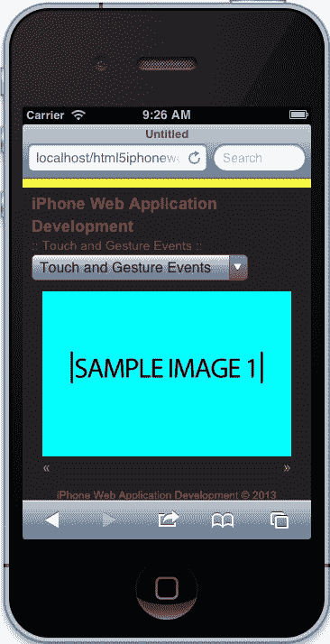
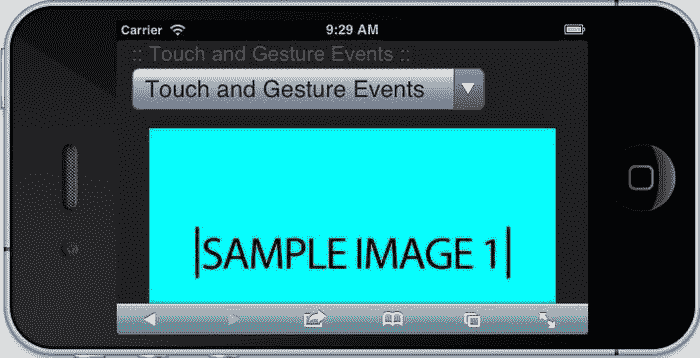

# 第四章：触摸和手势

创建 iPhone 网页应用程序默认涉及触摸交互。这是显而易见的，幸运的是，苹果已经通过默认将点击映射到触摸事件，很好地帮助我们快速上手。然而，如果我们想要一个幻灯片向用户的滑动做出反应怎么办？或者，如果我们想要在用户在应用程序的定义区域内捏合时放大照片，而不影响页面的布局怎么办？嗯，这都取决于我们作为开发者。

在本章中，我们将讨论触摸事件和手势，并利用这项技术构建一个对用户的触摸和手势响应的幻灯片。这里的大部分概念都是基础的，以帮助您理解这些在传统网页开发中不常见的新事件。然而，我们还将深入一些更高级的功能，使用捏合手势来放大和缩小图像。但首先，我们需要对我们的应用进行一些调整，重新组织我们的导航，以便它不会占用大部分屏幕空间，然后我们将开始深入研究触摸和手势。

在本章中，我们将涵盖：

+   简化我们的导航

+   创建响应式相册

+   监听和处理触摸事件

+   解释触摸事件

+   响应手势

+   将触摸事件扩展为插件

# 简化导航

我们的导航目前占据了一些严重的屏幕空间，尽管它对我们之前的示例有效，但它在本书的其余示例中效果不佳。所以，首先我们需要清理这个应用程序，以便专注于我们应用程序的实际内容。我们将清理我们的标记以使用`select`组件。然后我们将添加交互性，使我们的`select`元素实际上在页面之间切换。

在开始编码之前，在我们的 JavaScript 目录中创建一个`App.Nav.js`文件。创建文件后，让我们在页面底部包含它，使用以下脚本标签：

```html
<script src="img/App.Nav.js"></script>
```

## 导航标记和样式

在本章的这一部分，我们将重新设计我们应用程序的导航。在大多数情况下，我们希望确保在设备上使用原生控件，因此这里的目标是为用户提供在 iOS 中使用自定义选择控件的能力，但同时给我们提供相同的灵活性来自定义外观和感觉，同时具有相同的交互。我们将修改标记，查看自定义控件，然后模拟相同的体验。

### 基本模板

首先，让我们摆脱我们在导航中使用的锚标签。一旦我们移除了这些链接，让我们创建一个`select`元素，其中包含选项，并使值指向适当的页面：

```html
<nav>
    <select>
        <option value="../index.html">Application Architecture</option>
        <option value="../video/index.html">HTML5 Video</option>
        <option value="../audio/index.html">HTML5 Audio</option>
        <option value="../touch/index.html" selected>Touch and Gesture Events</option>
        <option value="../forms/index.html">HTML5 Forms</option>
        <option value="../location/index.html">Location Aware Applications</option>
        <option value="../singlepage/index.html">Single Page Applications</option>
    </select>
</nav>
```

在上述代码中，我们用`select`元素的选项替换了锚标签。每个选项都有一个值，指向特定的页面，选项中包含章节名称。由于我们已经移除了锚标签，我们需要调整样式。

### 样式化选择组件

这里我们没有太多需要做的，只需移除我们之前设置的样式。虽然这并非必需，但最佳实践是，您总是希望移除未使用的样式。这有助于通过降低页面加载来提高应用程序的性能。

所以让我们移除以下样式：

```html
/* --- NAVIGATION --- */
nav ul {
    padding: 0;
}
nav li {
    list-style: none;
}
nav a {
    display: block;
    font-size: 12px;
    padding: 5px 0;
}
```

现在，我们需要添加模仿锚标签默认操作的交互性。

## 导航交互

模仿锚标签的默认行为非常简单。让我们从创建一个基本模板开始，就像我们在之前的章节中所做的那样，然后缓存导航并添加切换页面的行为。所以让我们开始吧！

### 基本模板

以下是我们的默认模板。和以前一样，这只是一个简单的 IIFE，为我们的导航建立了一个类。这个闭包接受`window`、`document`和`Zepto`对象，并将`Zepto`对象别名为美元符号。

```html
var App = window.App || {};

App.Nav = (function(window, document, $){

  var _defaults = {};

  function Nav() {}

  return Nav;

}(window, document, Zepto));
```

### 缓存我们的导航

现在，我们可以每次需要时使用 Zepto 在 DOM 中查找导航。但是遵循我们的最佳实践，我们可以缓存导航，并在闭包范围内包含一个变量，该变量可以被私有和公共方法使用。

```html
var _defaults = {},
  $nav;

function Nav() {
  $nav = $('nav');
}
```

在前面的代码中，我们创建了一个`$nav`变量，它包含在闭包范围内，因此我们现在可以在闭包中包含的所有方法中引用它。然后在构造函数中，我们将变量设置为`nav`元素。

### 监听和处理 change 事件

现在开始有趣的部分。我们需要监听`select`元素的 change 事件何时被触发。我们以前为我们的音频播放器做过这个。但是，我们将简要介绍如何在这里做这个，以防您之前没有跟进。

首先，让我们调用一个我们将在下面定义的`attachEvents`方法：

```html
function Nav() {
  $nav = $('nav');

  attachEvents();
}
```

现在我们正在调用`attachEvents`方法，我们需要创建它。在这个方法中，我们想要监听 change 事件，然后处理它：

```html
function attachEvents() {
  $nav.
    on('change', 'select', handleSelectChange);
}
```

在前面的代码中，我们使用 Zepto 的`on`方法告诉缓存的导航监听`select`元素上的 change 事件，该元素包含在导航中。然后我们分配一个我们尚未创建的方法`handleSelectChange`。这个方法是一个处理程序，我们将在下面定义。

最后，我们需要定义我们的处理程序。这个处理程序所需要做的就是根据`select`元素的更改值切换页面。

```html
function handleSelectChange(e) {
  window.location = this.value;
}
```

前面的处理程序接受事件参数，但实际上我们并没有使用它。您可以删除此参数，但通常我喜欢保留处理程序接受的参数。无论如何，我们都在告诉窗口对象通过将`window.location`设置为`select`元素已更改为的值来切换位置。

### 注意

请注意，我们使用`this.value`来设置窗口对象的位置。在这种情况下，`this`指的是选择元素本身或事件目标元素。

### 初始化导航

最后，我们需要做的就是初始化这个类。因为这个导航理论上将出现在我们应用程序的每个页面上，所以我们可以在创建此调用后立即创建一个`App.Nav`的新实例。因此，让我们在`App.Nav.js`的末尾添加以下代码：

```html
new App.Nav();
```

这就是我们需要模仿以前锚标签行为的全部内容。完成这些后，我们现在有足够的屏幕空间来进行触摸事件。接下来，让我们讨论 iPhone 上的触摸事件和手势。

# 触摸和手势事件

在 iPhone 上处理触摸事件很容易；但是，当您开始深入研究事件何时被触发以及在某些情况下如何解释它们时，会有一些“陷阱”。幸运的是，手势也可以很容易地通过`GestureEvent`对象实现。在本节中，我们将总体上讨论触摸和手势，获得对这些用户体验背后技术的基本理解，以便在下一节中，我们可以成功地创建一个可滑动的幻灯片放映。

## 触摸事件

触摸事件包括移动设备接收的一个或多个输入。在本书中，我们将重点放在我们可以以多种方式处理的最多两个手指事件上。iOS 在解释这些输入方面做得很好；但是，元素可以是可点击的或可滚动的，如苹果的开发者文档所述（[`developer.apple.com/library/ios/#documentation/AppleApplications/Reference/SafariWebContent/HandlingEvents/HandlingEvents.html#pageTitle`](http://developer.apple.com/library/ios/#documentation/AppleApplications/Reference/SafariWebContent/HandlingEvents/HandlingEvents.html)）：

> 可点击元素是链接、表单元素、图像映射区域或任何其他具有 mousemove、mousedown、mouseup 或 onclick 处理程序的元素。可滚动元素是任何具有适当溢出样式、文本区域和可滚动的 iframe 元素的元素。由于这些差异，您可能需要将一些元素更改为可点击元素，如“使元素可点击”中所述，以在 iOS 中获得所需的行为。
> 
> 此外，您可以像在“阻止默认行为”中描述的那样关闭 iOS 上 Safari 的默认行为，并直接处理自己的多点触摸和手势事件。直接处理多点触摸和手势事件使开发人员能够实现类似原生应用程序的独特触摸屏界面。阅读“处理多点触摸事件”和“处理手势事件”以了解更多关于 DOM 触摸事件的信息。

这是必须牢记的，因为根据我们需要的功能类型，某些元素的默认行为会有所不同。如果我们想要修改这种功能，我们需要通过将某些事件附加到这些元素来覆盖默认行为，就像之前描述的那样。通过阻止默认功能并用我们自己的功能覆盖它，我们可以创建非常符合我们需求的体验。一个例子是创建一个全屏视差体验，在滚动时播放动画。

一旦我们知道我们想要的行为类型，就有一些重要的事情需要记住。例如，事件是有条件的，因此根据用户交互，某些手势可能不会生成任何事件。让我们来看看其中一些事件。

### 滚动时

一个有条件事件的很好例子是用户滚动页面。在这种交互中，滚动事件只有在页面停止移动并重绘时才会触发。因此，在大多数视差驱动的网站上，页面上的默认行为会被阻止，并实现自定义滚动解决方案。

### 触摸并保持

当用户触摸可点击元素并按住手指时，会显示一个信息气泡。但是如果您希望捕捉此手势，那就没那么幸运了。根据官方苹果文档，在这种类型的交互期间不会分派任何事件。

### 双击缩放

在这种交互中，用户双击屏幕，页面会放大。你可能会认为会有一个针对这种交互的事件，但是我们没有任何可以关联的事件。

如果我们记住了之前讨论的例外情况，我们应该能够正确地开发我们的应用程序并正确处理我们的触摸事件。现在我们需要知道我们可以关联哪些事件进行触摸，以及如何适当地监听和处理它们。

### 支持的触摸事件及其工作原理

苹果官方文档正式列出了在 iOS 上支持的所有事件，包括以下触摸和手势事件以及它们的支持情况：

| 事件 | 生成 | 有条件 | 可用 |
| --- | --- | --- | --- |
| `gesturestart` | 是 | 不适用 | iOS 2.0 及更高版本 |
| `gesturechange` | 是 | 不适用 | iOS 2.0 及更高版本 |
| `gestureend` | 是 | 不适用 | iOS 2.0 及更高版本 |
| `touchcancel` | 是 | 不适用 | iOS 2.0 及更高版本 |
| `touchend` | 是 | 不适用 | iOS 2.0 及更高版本 |
| `touchmove` | 是 | 不适用 | iOS 2.0 及更高版本 |
| `touchstart` | 是 | 不适用 | iOS 2.0 及更高版本 |

根据前面的列表，我们已经拥有了在 iPhone 上使用移动 Safari 制作复杂用户体验所需的一切。如果您担心这些事件是如何处理的，根据苹果的开发文档（[`developer.apple.com/library/ios/#documentation/AppleApplications/Reference/SafariWebContent/HandlingEvents/HandlingEvents.html`](http://developer.apple.com/library/ios/#documentation/AppleApplications/Reference/SafariWebContent/HandlingEvents/HandlingEvents.html)），无需担心，这些事件的传递方式与任何其他浏览器相同。 

> 鼠标事件按照您在其他网络浏览器中期望的顺序传递（...）。如果用户点击一个不可点击的元素，不会生成任何事件。如果用户点击一个可点击的元素，事件按照以下顺序到达：mouseover、mousemove、mousedown、mouseup 和 click。只有在用户点击另一个可点击的项目时，mouseout 事件才会发生。此外，如果页面内容在 mousemove 事件上发生变化，那么序列中的后续事件都不会发送。这种行为允许用户在新内容中点击。

现在我们对单指触摸事件有了很好的理解，包括异常和它们的工作方式，我们应该花一些时间来理解手势。

## 手势

从技术上讲，手势是触摸事件，因此前面的信息也适用于单点触摸事件，因为平移、缩放和滚动都被视为手势。但是，手势也是可以被不同解释的复杂交互。根据苹果的文档（[`developer.apple.com/library/ios/#documentation/AppleApplications/Reference/SafariWebContent/HandlingEvents/HandlingEvents.html`](http://developer.apple.com/library/ios/#documentation/AppleApplications/Reference/SafariWebContent/HandlingEvents/HandlingEvents.html)），我们可以结合多点触摸事件来创建自定义手势；

> 通常，您会实现多点触摸事件处理程序来跟踪一个或两个触摸。但您也可以使用多点触摸事件处理程序来识别自定义手势。也就是说，自定义手势不是已经识别的手势（...）

我们从前面的部分的图表中看到，我们可以监听手势，从而创建自定义体验；然而，关于手势和普通触摸事件的一件令人困惑的事情是它们发生的时间。但这并不是一个谜，因为苹果的文档（[`developer.apple.com/library/safari/#documentation/UserExperience/Reference/GestureEventClassReference/GestureEvent/GestureEvent.html#//apple_ref/javascript/cl/GestureEvent`](http://developer.apple.com/library/safari/#documentation/UserExperience/Reference/GestureEventClassReference/GestureEvent/GestureEvent.html)）为我们提供了以下信息：

（...）对于双指多点触摸手势，事件按照以下顺序发生：

1\. finger 1 的 touchstart。当第一根手指触摸表面时发送。

2\. gesturestart。当第二根手指触摸表面时发送。

3\. finger 2 的 touchstart。当第二根手指触摸表面时立即发送 gesturestart 后发送。

4\. 当前手势的 gesturechange。当两根手指在仍然触摸表面的情况下移动时发送。

5\. gestureend。当第二根手指从表面抬起时发送。

6\. finger 2 的 touchend。当第二根手指从表面抬起时立即发送 gestureend 后发送。

7\. finger 1 的 touchend。当第一根手指从表面抬起时发送。

根据前面的信息，我们可以得出触摸和手势事件是相辅相成的。这使我们能够在前端做一些有趣的事情，而不需要猜测。但是，我们该如何做到这一点呢？好吧，下一节通过创建一个对触摸和手势都有响应的照片库来解决这个问题。

# 创建一个响应式的照片库

如果我们专注于我们在传统移动应用程序中已经看到的小功能片段，比如交互式幻灯片放映，我们将更好地理解触摸和手势事件。我们到处都看到这个，一个带有下一个和上一个按钮的幻灯片放映，但也可以从左到右或从右到左滑动。按钮很容易，附加触摸事件也相当简单；然而，在移动 Safari 中，滑动不是开箱即用的，所以我们需要构建它。所以让我们首先布置我们的画廊，然后进行样式设置。

## 画廊标记和样式

与任何幻灯片画廊一样，创建一个良好的结构是至关重要的。这种结构应该易于遵循，如果我们想要模块化，就不需要太多的元素。

### 基本画廊幻灯片列表

让我们从非常基本的东西开始。首先，让我们创建一个带有`gallery`类的`div`：

```html
<div class="gallery"></div>
```

从这里开始，我们希望有一个内容区域，其中包含所有幻灯片。你可能会问为什么我们不把幻灯片直接放在父画廊容器中，原因是这样我们可以通过其他功能扩展我们的画廊，比如播放和暂停按钮，而不会影响幻灯片本身的结构。

所以让我们在我们的画廊内创建另一个带有`gallery-content`类的`div`，就像这样：

```html
<div class="gallery">
    <div class="gallery-content">
    </div>
</div>
```

现在我们有了一个画廊的内容区域，我们想要创建一个包含我们图像的幻灯片的无序列表。当我们最终这样做时，我们的`gallery`标记应该是这样的：

```html
<div class="gallery">
    <div class="gallery-content">
        <ul>
            <li>
                
            </li>
            <li>
                
            </li>
            <li>
                
            </li>
            <li>
                
            </li>
        </ul>
    </div>
</div>
```

### 提示

当你看到前面的标记时，可能会震惊于我在`image`标记上留下了`alt`属性的内容。是的，这是一个不好的做法，但我在这里这样做是为了更快地移动。然而，在你的应用程序中不应该这样做，始终为你的图像提供一个带有相关内容的`alt`属性。

现在我们有了一个基本的标记结构，我们应该开始为这个幻灯片秀设置样式，但要记住，前面的标记并不是最终的解决方案。我在其他网站上看到了一些非凡的工作，那很酷，但我们想在这里保持简单，并为你提供一个基础。我鼓励你进行实验和尝试新的东西，但不要让前面的标记成为你的最终解决方案。在我们开始样式化之前，让我们退一步，了解为什么我们有一个内容区域。

### 添加简单的画廊控件

我们不想为内容区域增加复杂的样式。如果我们这样做，这可能会导致一些混乱的样式，"修复我们的标记"。因此，出于这个原因，我们创建了一个内容区域，现在要向我们的幻灯片秀添加一个`controls`组。

所以让我们遵循同样的原则；让我们创建一个带有`gallery-controls`类的`div`，其中包含两个锚标记，一个用于下一个按钮，另一个用于上一个按钮。

```html
<div class="gallery-controls">
    <a href="#next">&raquo;</a>
    <a href="#previous">&laquo;</a>
</div>
```

现在，内容区域和控件是两个可以独立控制的区域。当我们开始为我们的画廊设置样式时，你会看到这样做对我们来说是多么容易。现在，请相信我，这将使你更容易控制你的画廊。但现在，让我们开始样式化！

### 使图像具有响应性

我们在本书的第一章已经介绍了响应式设计，希望你能理解这些原则。但如果你不理解，这一章应该给你一个很好的想法，让我们确保我们的应用程序不仅在 iPhone 上工作，而且在其他触摸设备上也能工作。

所以我们希望我们的画廊存在于我们网站的移动和桌面版本上，这是一个非常理想的功能，因为现在你正在构建一个可重用的、设备无关的组件。但这也会让事情变得困难，不考虑资产管理，我们需要计算我们的图像必须有多大。好吧，对于这个例子，我们希望我们的图像能够缩放到幻灯片的宽度的 100%，我们希望幻灯片占据我们屏幕宽度的 100%，并且两侧有 12 像素的填充。

为了实现这一点，我们可以简单地将所有图像的宽度设置为 100%，并让我们的画廊在两侧应用 12 像素的填充，如下所示：

```html
img {
  width: 100%;
}

.gallery {
  margin: 12px 0 0 0;
  padding: 0 12px;
}
```

### 注意

请注意，我们的画廊已经占据了屏幕宽度的 100%，减去我们在两侧给它的填充。因此你在`.gallery`中看不到`width: 100%`的属性。另外，要考虑到我们在画廊顶部添加了 12 像素的填充，以便给它一些与主导航的空间。最后但同样重要的是，我们在这里使用了简写属性，这样我们就不用使用 padding-left，margin-top 等。这不仅使我们的代码更短，而且更容易理解和维护。

这就是使用 CSS 制作响应式画廊所需的全部内容，其余的样式将通过 JavaScript 应用。有些人可能会对此感到反感，但这是一个相当常用的技术，因为我们需要知道设备的宽度才能正确设置我们的画廊以实现响应式使用。但在开始之前，让我们先完成我们的画廊样式。

### 为我们的画廊添加样式

现在让我们在 CSS 中完成我们画廊的样式。其中一些样式仍然适用于响应式应用，但前面的部分有助于定义原则。不过不用担心，我会逐一介绍这个应用的每个部分的样式，以便你能彻底理解。

首先，让我们确保我们的画廊内容在宽度上扩展到 100%，并且因为最终我们的幻灯片将左浮动，我们希望父容器有一个高度；所以让我们添加一个`overflow: hidden`的属性。当你完成后，你的样式应该是这样的：

```html
.gallery .gallery-content {
  width: 100%;
  overflow: hidden;
}
```

接下来，我们要确保无序列表在幻灯片左浮动时也有一个高度，这样这个高度就会应用到画廊内容上。不仅如此，因为我们想要根据用户交互来动画显示无序列表左右移动，所以我们需要确保位置和起始的`left`值已经定义。当你完成应用这些样式后，它应该看起来像这样：

```html
.gallery .gallery-content > ul {
  left: 0;
  margin: 0;
  overflow: hidden;
  padding: 0;
  position: relative;
}
```

### 提示

在这里，我们还将`margin`和`padding`的值设为`0`。这主要是为了重置，以免以后出现任何布局问题。`Normalize.css`默认为无序列表应用了一些`padding`和`margin`，这是好的，但对于我们的应用来说并不是必要的，所以我们清除了这些值。

现在，让我们专注于样式化我们幻灯片的控件。下一步主要是设置样式，以便我们在容器内浮动元素时不会遇到任何问题；就像我们之前为`gallery`内容和无序列表所做的那样。所以让我们确保我们的控件的`overflow`设置为`hidden`：

```html
.gallery .gallery-controls {
  overflow: hidden;
}
```

由于我们的控件现在设置为`hidden`当元素溢出时，我们可以相应地浮动我们的下一个和上一个按钮，使它们位于幻灯片的适当侧面。

```html
.gallery .gallery-controls a[href="#next"] {
  float: right;
}

.gallery .gallery-controls a[href="#previous"] {
  float: left;
}
```

这就是为你的幻灯片做基本样式所需的全部内容。不幸的是，它看起来仍然不够漂亮，这是因为我们需要使用 JavaScript 来确定屏幕尺寸，为幻灯片应用宽度，并为无序列表应用总体宽度。然而，这里还有一件事情可以带来严重的性能优化，那就是使用 CSS3 过渡。

### 注意

在我们继续之前，重要的是要注意，我们的 CSS 选择器是从`gallery``div`中级联的。这是一个很好的做法，因为它允许你将样式分隔开来。我们所做的基本上是为我们的画廊创建默认样式，如果有人想要自定义它，他们可以在`.gallery`之前添加自己的类来覆盖这些样式，从而使画廊更加可定制。这是一个基本的 CSS 基本原则，但我想指出它的重要性，以显示创建模块化样式的重要性。

### 使用 CSS3 过渡

CSS3 过渡对我们的应用程序非常重要。不仅因为它让我们的工作变得更容易，而且因为它为我们提供了性能优化。默认情况下，移动 Safari 使用硬件加速进行 CSS3 过渡；这意味着硬件将处理这些过渡的渲染，因此我们不需要手动处理。传统上，我们需要使用 JavaScript 来做到这一点，因为这样我们就无法获得性能优化，但现在我们可以通过 CSS3 过渡来实现。所以让我们使用它们！

这是一个基本的画廊，我们希望保持它简单。所以让我们只是将我们的过渡添加到无序列表中。毕竟，无序列表是我们希望在用户滑动或从控件发起操作时进行动画处理的内容。为此，我们将使用`transition`属性，并使用简写来定义我们要动画处理的属性、持续时间以及要使用的过渡时间函数，也就是所谓的缓动方法。

```html
.gallery .gallery-content > ul {
  left: 0;
  margin: 0;
  overflow: hidden;
  padding: 0;
  position: relative;

  -webkit-transition: left 500ms ease;
  -moz-transition: left 500ms ease;
  -ms-transition: left 500ms ease;
  -o-transition: left 500ms ease;
  transition: left 500ms ease;
}
```

我们在这里做的唯一一件事就是向我们的无序列表添加了`transition`属性。这个属性告诉无序列表在 500 毫秒内动画处理`left`属性，并使用默认的缓动方法。

### 提示

在这里，我们定义了五个过渡属性，每个属性都添加了浏览器厂商的前缀，而最后一个是支持的标准属性。这样做是为了使我们的画廊可以在各种设备上使用。是的，这有点复杂和混乱，但鉴于浏览器厂商已经给这个属性添加了前缀，并且现在才开始使用非前缀版本，这是一个必要的恶。

## 画廊互动

我们幻灯片秀的核心在于它的互动性；从下一个和上一个按钮、可滑动的内容和富有动画的显示——我们的幻灯片秀依赖于 JavaScript。在这一部分，我们深入探讨了我们的幻灯片秀是如何工作的；使用我们的基本框架，我们将构建一个高效的`Gallery`类，实现之前所述的目标。实际上，我们的画廊应该只具有允许其在某个方向上调整大小和播放的功能。但是，像往常一样，这需要一些设置工作，然后我们将一切连接起来。所以让我们开始吧！

### 基本模板

首先，我们将创建我们的`Gallery`类。这个类应该设置与我们构建的任何其他类的方式相同。但是，如果你没有按顺序阅读本书，我们只需要检查`App`命名空间，然后在其下创建一个`Gallery`类。包裹在闭包中，我们将有一些默认值和一个`Gallery`函数，并在闭包声明的末尾返回它。正如我们之前提到的，我们将有以下内容：

```html
var App = window.App || {};

App.Gallery = (function($) {

    var _defaults = {};

    function Gallery() {}

    return Gallery;

}(Zepto));
```

这里唯一不同的是我们只传入了`Zepto`对象。以前，我们传入了`window`和`document`，但对于这个类，我们不需要这两个对象，所以我们将它限制在 Zepto 库中。

现在我们所需要的就是缓存我们将要重复使用的元素，而且它们需要在闭包中可用，以便它们在私有和公共方法中可用。

### 缓存画廊

在我们的应用程序中，缓存对象非常有帮助，特别是因为它提高了性能，使我们的应用程序非常高效。通过减少我们在 DOM 中需要做的查找次数，我们可以加快处理速度，并创建一个不太容易出错的应用程序。

不仅我们想要缓存某些元素，而且我们希望它们也在闭包中可用，以便所有方法都可以访问它们。要做到这一点，我们只需要在上面的构造函数中添加缓存变量，就像这样：

```html
var _defaults = {},
    $gallery,
    $slides,
    $slidesContainer,
    $slidesLength,
    $galleryControls,
    slidesWidth,
    galleryWidth;
```

在上面的代码中，我们可以看到画廊、它的幻灯片、幻灯片容器、幻灯片数量、画廊控件、幻灯片和画廊宽度将被缓存。然而，此时我们还没有缓存任何东西。所以让我们开始给它们分配应该有的值。

初始化值的最佳位置应该是在构造函数中，或者在创建一个画廊的实例时。构造函数应该先缓存我们在整个运行应用程序中需要的值。此外，每个变量在语义上描述了它应该持有的内容，这样可以更容易地理解发生了什么。让我们来看看下面的函数：

```html
function Gallery() {
    $gallery = this.$el = $('.gallery');

    $slides = $gallery.find('li');

    $slidesContainer = $gallery.find('.gallery-content > ul');

    $galleryControls = $gallery.find('.gallery-controls');

    $slidesLength = $slides.length;
}
```

从这个函数中，我们可以得出结论，我们缓存了画廊，然后从中确定了所有其他值。例如，我们使用`$gallery`来查找所有幻灯片或列表项。这非常有用，因为我们所做的是告诉我们的应用程序从`gallery`元素开始，然后深入其中找到适当的值。否则，我们通常会从文档的顶部开始，然后向下进行，这在 DOM 查找方面非常昂贵。

这是过程中的一个关键步骤，因为其他所有事情都应该很容易。所以让我们开始连接一些交互！

### 连接我们的控件

首先，我们希望用户能够点击下一个和上一个按钮。但是，我们现在不希望发生任何事情，我们只是想捕获这些事件。和往常一样，让我们从小处开始，然后逐步扩大，我们想要的是有一个可以使用的基础。

#### 附加事件

我们之前已经讨论过如何附加事件，在本章中也是一样。首先创建一个`attachEvents`方法，从画廊中查找下一个和上一个按钮，然后调用`play`方法。当你写完代码时，你应该有类似这样的东西：

```html
function attachEvents() {
    $galleryControls
        on('click', 'a[href="#next"]', play).
        on('click', 'a[href="#previous"]', play);
}
```

这里没有什么不同。我们使用缓存的`$galleryControls`变量，并告诉它监听来自下一个和上一个按钮的`click`事件。当`click`事件来自指定的元素时，然后调用我们的`play`方法。如果我们现在运行我们的代码，除了可能会因为`play`不存在而出现错误之外，什么也不会发生。但我们不要这样做；相反，在所有设置代码完成后，我们将在构造函数中调用我们的`attachEvents`方法：

```html
function Gallery() {
  // our previous code 

    attachEvents();
}
```

这里没有什么疯狂的，我们只是调用`attachEvents`，一个私有方法。你是否注意到，即使它是一个私有方法，我们仍在使用`$galleryControls`？这是因为该变量存在于闭包范围内，因此这样可以更容易地管理变量，而不会污染程序的全局范围。如果你还不明白这里发生了什么，不要担心。随着时间和实践，这将变得清晰，事情将变得更容易。

现在，我们还有一个问题。没有`play`方法，所以让我们创建它！

#### 处理我们的事件

因为我们的`play`方法不存在，所以我们的应用程序失败了；所以我们需要编写它。但它应该做什么？对于这个应用程序，我们希望它确定画廊应该播放的方向。然后我们希望它根据画廊当前位置的左右动画。你可能会说，这听起来比你想象的要容易。但实际上是这样的。所以让我们一步一步来。

##### 再次缓存变量

是的，我们希望尽可能缓存。再次强调，我们正在为 iPhone 创建一个移动应用程序，由于移动设备的性质，我们需要尽可能进行优化。但我们应该缓存什么？好吧，我们将首先检查方向，然后操作无序列表的当前左侧位置。为了防止查找这些值，让我们在方法的顶部声明一个`currentLeftPos`和方向，如下所示：

```html
function play(e) {
    var currentLeftPos, direction;
}
```

简单！现在，让我们确定这些值。确定方向的简单方法是基于所点击元素的值。在这种情况下，我们可以检查#next 或#previous，即`href`属性的值。为了使其更简单，我们可能还想删除井号，以防我们将来想公开此方法并允许自己传递`next`或`previous`。所以让我们这样做：

```html
function play(e) {
    var currentLeftPos, direction;

    direction = $(this).attr('href');

    direction = direction.substr(1, direction.length);
}
```

### 提示

不要太担心这里的细节，但基本上，由于`play`是一个事件处理程序，`this`已经成为目标事件，这将是我们的锚标签。这是我们如何可以从这些元素中获取`href`值的方式。同时，不要对那里进行的字符串操作太紧张。基本上，我们使用了`substr`，这是一个内置的`string`方法，并传递了`1`，这样它就从位置 1 开始获取字符串的其余部分。这就是我们如何能够从`href`属性中获取单词“next”或“previous”的方式。

很好，到这一点上我们已经确定了方向。现在我们想要获取无序列表的最新左位置。为了做到这一点，我们可以在设置方向之后添加以下代码：

```html
function play(e) {

  // Previous code

    currentLeftPos = parseInt($slidesContainer.css('left'), 10);
}
```

### 注意

请注意，我们使用了`parseInt`，这是一个内置的数字方法，它接受一个整数作为其第一个参数，然后将基数作为其第二个参数。我们这样做是因为当我们请求`left`属性的值时，我们得到类似`0px`的东西，而我们希望我们使用的值是一个整数，而不是一个字符串。因此，`parseInt`通过将`0px`解释为`0`的整数来帮助我们。

现在是时候创建我们应用程序的神奇部分了。这部分有点复杂，但最终将帮助我们实现我们想要的效果。但首先让我们专注于让我们的应用程序在下一个行动呼叫时移动。为了做到这一点，我们希望将无序列表的左位置设置为当前左位置减去单个幻灯片的宽度。为了做到这一点，我们可以在设置`currentLeftPos`之后简单地编写以下代码：

```html
function play(e) {
    // Previous code

    // Next
    $slidesContainer.css({ 
    'left': currentLeftPos + -(slidesWidth) + 'px' });
}
```

前面的代码将完全按照我们的要求执行；但是，我们遇到了一些问题。首先，这将始终运行，即使点击了“previous”按钮。其次，没有检查当你到达画廊的最末端时。这可以很容易地添加到我们的应用程序中，就像这样：

```html
function play(e) {
    // Previous code

    // Next
    if (direction === 'next') {
        if (Math.abs(currentLeftPos) < (galleryWidth - slidesWidth)) {
            $slidesContainer.css({
                'left': currentLeftPos + -(slidesWidth) + 'px'
            });
        }
    }
}
```

### 提示

您可能已经注意到我们在`currentLeftPos`上使用了`Math.abs`。这是因为我们将得到一个负数作为我们的值，而且由于我们不想使数学或比较复杂化，我们只需使用`Math.abs`将其转换为正整数。保持简单！

在这个调整后的代码中，我们检查方向，寻找`next`，然后检查当前左位置是否小于画廊宽度减去单个幻灯片的宽度。这有助于防止可能出现的任何错误。

现在开始实现我们的`previous`功能。在这一步中，我们将按照相同的步骤进行；我们将确保我们要向`previous`方向前进，然后我们将进行比较，以确保我们不会低于`0`标记，最后我们将在条件满足时执行代码。当我们完成实现这个功能时，我们应该有以下代码：

```html
function play(e) {
    // Previous code

    // Previous
    if (direction === 'previous') {
        if (Math.abs(currentLeftPos) > 0) {
            $slidesContainer.css({
                'left':  currentLeftPos + slidesWidth + 'px'
            });
        }
    }
}
```

唯一的区别是我们正在与静态数字`0`进行比较。这是为了防止任何会在我们的画廊中引起视觉错误的正值。然后，我们不是对我们的数字取反，而是使用正确的值以便将其加到负数上，从而呈现`Previous`操作的外观。

最后，我们的`play`方法应该是这样的：

```html
function play(e) {
    var currentLeftPos, direction;

    direction = $(this).attr('href');

    direction = direction.substr(1, direction.length);

    currentLeftPos = parseInt($slidesContainer.css('left'), 10);

    // Next
    if (direction === 'next') {
        if (Math.abs(currentLeftPos) < (galleryWidth - slidesWidth)) {
            $slidesContainer.css({
                'left': currentLeftPos + -(slidesWidth) + 'px'
            });
        }
    }

    // Previous
    if (direction === 'previous') {
        if (Math.abs(currentLeftPos) > 0) {
            $slidesContainer.css({
                'left':  currentLeftPos + slidesWidth + 'px'
            });
        }
    }
}
```

我们完成了吗？是的！尽管我们只是在切换无序列表的左位置值，但我们实际上是在进行动画，因为如果你记得，我们已经告诉我们的元素在 CSS 中过渡左属性。看看使用 CSS3 属性是多么简单和有效？通过简单的声明，我们已经能够最小化代码，并制作出高度优化的版本。

现在，我们的画廊的核心已经完成，让我们使其响应式！

### 画廊响应性

我们要稍微绕个弯，但这是值得的努力！在这一步中，我们将研究如何使我们的画廊对用户设备的宽度做出响应。所以让我们开始设置我们的样式。

#### 设置画廊样式

在这里，我们将设置所有必要的样式，使我们的画廊具有响应性。我们需要做一些事情。首先，让我们使用`Gallery`函数的`prototype`创建一个公共的`setStyles`方法：

```html
Gallery.prototype.setStyles = function() {

    return this;
};
```

如你可能已经注意到的，前面的方法返回了`Gallery`的实例，因此允许你链接你的方法。接下来，获取单个幻灯片的宽度。这个宽度是其所在容器的 100%，因此应该与画廊本身的宽度相同。为了获取这个宽度，我们可以在`setStyles`中进行以下操作：

```html
Gallery.prototype.setStyles = function() {

    slidesWidth = $slides.width();

    return this;
};
```

现在，我们可以通过将幻灯片的数量乘以每个幻灯片设置的宽度来确定画廊的完整宽度，这是我们在上一步中已经确定的。当我们这样做时，我们得到以下代码：

```html
Gallery.prototype.setStyles = function() {

    slidesWidth = $slides.width();

    galleryWidth = slidesWidth * $slidesLength;

    return this;
};
```

以下步骤可能会令人困惑，但它非常重要，因为我们需要手动设置每个幻灯片的宽度，以便将它们浮动在一起。因此，我们现在需要做的是将`slideWidth`值应用到每个幻灯片上，如下所示：

```html
Gallery.prototype.setStyles = function() {

    slidesWidth = $slides.width();

    galleryWidth = slidesWidth * $slidesLength;

    $slides.width(slidesWidth);

    return this;
};
```

现在，我们还可以使用计算画廊宽度来设置幻灯片容器的宽度。同样，我们需要这样做，以便保持一个具有左浮动幻灯片的画廊。因此，我们将设置幻灯片容器的宽度，然后将所有幻灯片左浮动。当我们编写这些要求时，你的`setStyles`方法将如下所示：

```html
Gallery.prototype.setStyles = function() {

    slidesWidth = $slides.width();

    galleryWidth = slidesWidth * $slidesLength;

    $slides.width(slidesWidth);

    $slidesContainer.css({'width': galleryWidth});

    $slides.css({'float': 'left'});

    return this;
};
```

这就是以响应式方式设置我们的画廊样式所需的全部步骤。然而，这里有一个问题；样式无法重置，这是为了在设备的方向或宽度发生变化时适当地确定幻灯片和容器的宽度而需要的。让我们进行一些设置工作，以便进行重置。

为了做到这一点，我们将简单地将我们的功能包装在一个方法中，然后将其传递给一个公共的`resetStyles`方法。在这种技术中，我们实质上是在发送一个`回调`，当`resetStyles`功能完成时将被执行。目前，你的代码应该产生以下结果：

```html
Gallery.prototype.setStyles = function() {

    this.resetStyles(function(){
        slidesWidth = $slides.width();

        galleryWidth = slidesWidth * $slidesLength;

        $slides.width(slidesWidth);

        $slidesContainer.css({'width': galleryWidth});

        $slides.css({'float': 'left'});
    });

    return this;
};
```

正如你所看到的，我们最初为`setStyles`创建的所有功能都被包装在一个匿名函数中，也被称为`回调`，当`resetStyles`运行完成时将被调用。为了全面了解情况，让我们继续创建我们的`resetStyles`函数。

#### 重置画廊样式

重置元素的样式实际上并不复杂，所以我们将直接进入这个方法。查看下面应该在你的`reset`方法中的代码。

```html
Gallery.prototype.resetStyles = function(callback) {
    $slides.attr('style', null);

    $slidesContainer.attr('style', null);

    $slides.attr('style', null);

    if (typeof callback !== 'undefined') {
        callback.call(this);
    }

    return this;
};
```

不会太疯狂吧？我们基本上只是删除 Zepto 在我们使用 JavaScript 设置元素样式时应用的内联样式，或者我们在`setStyles`方法中所做的事情。当我们删除这些样式时，然后检查是否有`回调`方法并执行该方法。这是一个很好的做法，因为假设我们需要出于任何其他原因重置我们画廊的样式；我们不想无缘无故地创建不必要的函数。

#### 初始化画廊样式

我们需要做的最后一件事是初始化我们的样式。为此，让我们在`Gallery`构造函数中初始化代码时调用`setStyles`。

```html
function Gallery() {
  // our previous code 

   this.setStyles();
    attachEvents();
}
```

当我们最终设置好我们的样式时，我们的应用程序在纵向模式下应该如下所示：



响应式画廊

在横向模式下，我们的应用程序应该如下所示：



响应式画廊

### 提示

不幸的是，你的应用程序不会看起来或行为像这些截图中显示的应用程序；这是因为现在没有任何连接，我们甚至还没有初始化我们的任何代码。但是，如果你确实想立即进行操作并查看我们是如何做的，你可以在本章的最后一节之前查看我们的结论。如果你按照这些步骤，你应该会得到一个类似于我们刚刚看到的应用程序。

从技术上讲，我们的画廊现在已经完全构建好了，我们现在可以使用下一个和上一个按钮完全与之交互。但现在，让我们开始等待已久的有趣的触摸事件！

## 扩展触摸功能的画廊

默认情况下，我们可以将触摸交互包含在`Gallery`类中，但这不具有可重用性，也无法应用于应用程序的其他部分。因此，在本节中，我们将创建一个名为`Swipe`的新类，它将包含检测特定模块上滑动手势所需的一切。

### 基本模板

与以往编写的其他类似，我们始终希望从基本框架开始。我们可以编写以下基本模板来开始：

```html
var App = window.App || {};

App.Swipe = (function(window, document, $){

  var _defaults = {};

  function Swipe(options) {
    this.options = $.extend({}, _defaults, options);
  }

    return Swipe;

}(window, document, Zepto));
```

`Swipe`类与我们的`Gallery`类有些不同，它接受`window`、`document`和`Zepto`对象。另一个不同之处在于`Swipe`构造函数接受一个名为`options`的参数，用于覆盖我们即将设置的默认值。

### 默认选项和模块化滑动事件

`Swipe`类内部有几件事情要做。首先，我们希望确保它仅适用于特定容器，而不是整个文档。然后，我们希望能够缓存某些值，如触摸的初始 x 位置和结束 x 位置。这些缓存的值也应该在闭包作用域中可用，以便它们在所有方法中都可用。

以下是我们想要的默认值和将在闭包作用域中可用的缓存值：

```html
var _defaults = {
  'el': document.body,
  '$el': $(document.body)
},
el,
$el,
delta,
initXPos,
endXPos,
threshold = 30;
```

在前面的代码中，我们基本上是在说默认元素，滑动功能，应该附加到文档的`body`元素。从这里开始，我们确保可以在闭包作用域中访问这些缓存的元素。最后，我们设置一些变量，将存储关于我们将要监听的触摸手势的信息。

现在在我们的构造函数中，我们要覆盖这些默认值，并确保一些这些初始值将存在于全局作用域中：

```html
function Swipe(options) {
  this.options = $.extend({}, _defaults, options);
  $el = this.$el = this.options.$el = $(this.options.el);
  threshold = this.options.threshold || threshold;

  this.init();
}
```

在这里，我们使用 Zepto 的`extend`方法创建一个新对象，其中包含将选项参数合并到默认对象中。然后，我们确保闭包作用域包含了滑动类将附加到的缓存元素。最后，我们检查是否传递了自定义阈值，并覆盖默认的 30。在所有这些之后，我们在构造函数的末尾调用一个初始化方法，以便`Swipe`类自动启动。

### 监听触摸事件

现在我们需要将适当的事件附加到`Swipe`类。这些事件将基于我们之前介绍的触摸事件，但它们将以模拟滑动手势的方式使用。为了实现这一点，我们首先需要监听`touchstart`、`touchend`和`touchmove`事件，并为每个事件分配事件处理程序。我们可以在我们从构造函数调用的`init`方法中完成所有这些。

因此，首先让我们在`Swipe`的`prototype`上创建我们的`init`方法，并确保在方法的末尾返回实例：

```html
Swipe.prototype.init = function() {

  return this;
};
```

在这个方法中，我们希望监听前面提到的触摸事件，并确保它们有事件处理程序。为此，我们将使用 Zepto 的`on`方法，并将事件附加到我们缓存的元素上：

```html
Swipe.prototype.init = function() {
  this.options.$el.
    on('touchstart', handleTouchStart).
    on('touchend', handleTouchEnd).
    on('touchmove', handleTouchMove);

  return this;
};
```

在前面的代码中，我们将事件作为字符串传递给`on`方法的第一个参数，然后分配一个尚未创建的事件处理程序。您还会注意到这些方法是可链接的，允许我们一次附加多个事件。这就是为什么我们在公共方法的末尾返回`this`，以便我们可以允许自己同步调用的原因。

### 处理触摸事件

现在我们需要创建我们分配给每个监听器的事件处理程序。我们将逐个处理处理程序，以便解释如何从这些触摸事件中创建滑动手势。我们首先要看的是`touchstart`处理程序。

当我们把手指放在手机上时，我们想要做的第一件事是存储手指的初始 x 位置。要访问这些信息，事件触发时会有一个`touches`数组。因为我们只想使用第一个触摸，所以我们需要访问`touches`数组中的第一个触摸。一旦我们得到第一个触摸，我们就可以使用该对象上的`pageX`属性来获取 x 位置。这就是`handleTouchStart`的功能将会是什么样子：

```html
function handleTouchStart(e) {
    initXPos = e.touches[0].pageX;
}
```

正如你所看到的，`handleTouchStart`方法接受一个参数，即事件对象。然后我们将`initXPos`设置为事件对象上`touches`数组中第一个触摸的`pageX`属性。这可能听起来很混乱，但基本上我们只是访问我们需要的对象，以便保存您触摸的初始 x 值。

接下来，我们想要创建`handleTouchMove`事件处理程序。这个处理程序将包含与`handleTouchStart`相同的概念，但我们想要更新结束的 x 位置，而不是初始的 x 位置。可以在以下代码中看到：

```html
function handleTouchMove(e) {
  e.preventDefault();
    endXPos = e.changedTouches[0].pageX;
}
```

这里有一些我将解释的不同之处。首先，我们阻止了触摸移动的默认行为。这是为了阻止发生任何奇怪的行为，通常建议在我们想要创建独特体验时使用，比如可滑动的画廊。

你会注意到的另一个区别是我们正在查看事件的`changedTouches`对象。这是因为`move`事件不包含`touches`对象。尽管有点有争议，但这有助于跟踪每次触摸和该特定触摸的更改属性。因此，如果我有多次触摸，那么我的`changedTouches`对象将适当地包含每次更改的触摸。

到目前为止，我们所做的只是设置初始和结束的 x 位置。现在我们需要使用这些值来创建一个`delta`值，然后使用它来触发左右方向的滑动。这就是我们的`handleTouchEnd`事件处理程序将为我们做的事情。

这是`handleTouchEnd`应该包含的代码：

```html
function handleTouchEnd(e) {
    endXPos = e.changedTouches[0].pageX;
    delta = endXPos - initXPos;

    if(delta > threshold) {
        $el.trigger('SwipeLeft');
    }

    // The *-1 converts the threshold to a negative integer
    if(delta < threshold*-1) {
        $el.trigger('SwipeRight');
    }
}
```

现在让我们逐行查看这段代码。首先我们做的和`handleTouchMove`一样，就是设置结束的 x 位置。接下来，我们设置我们的`delta`值，即通过从初始 x 位置中减去结束 x 位置得到的差值。现在我们进行比较；如果`delta`大于阈值，那么触发一个名为`SwipeLeft`的自定义事件。我们的下一个比较有点更加混乱，但基本上我们检查`delta`值是否小于负阈值。这是为了检测向右方向的滑动。

我们的`Swipe`类现在已经完成。我们已经创建了监听我们触摸事件的必要功能，然后模拟了一个手势，我们可以将其连接起来。但实际上我们还没有将它连接到我们的画廊，这是整个过程中的最后一步。因为现在你已经达到了这一点，所以应该感到自豪，因为现在将会发生容易的事情！

## 把所有东西放在一起

好的，到目前为止我们有一个画廊和使用触摸事件检测滑动手势的能力。但现在，没有什么真正连接在一起，实际上我们还没有初始化我们的`Gallery`类，所以现在什么都不应该工作。但这就是最后一部分的内容；我们将会初始化我们的`Gallery`类，添加`Swipe`功能，然后对我们的滑动事件做出反应。

### JavaScript

我们要做的第一件事是打开我们的`App.Touch.js`文件，你还记得这个文件与我们的触摸页面的功能相关，因此这个文件将包含我们所有的初始化。当我们打开这个文件时，转到`init`方法，或者如果还没有创建，那么创建并初始化一个`Gallery`的实例：

```html
Touch.prototype.init = function() {
  var that = this;

  // Initializing Gallery
  this.gallery = new App.Gallery();

  return this;
};
```

现在我们已经初始化了我们的`Gallery`类，画廊应该立即初始化。但请记住，我们还没有修改我们的标记以包含这个文件。所以即使在这一点上，你也看不到你劳动的成果。但让我们确保我们继续设置工作。在下一步中，我们想要初始化我们的`Swipe`类，并确保它将自己设置为`gallery`元素：

```html
Touch.prototype.init = function() {
  // Previous code

  // Initializing Swipe
  this.swipe = new App.Swipe({
    'el': document.querySelector('.gallery')
  });

  return this;
};
```

现在，即使在这一点上，我们的画廊也不会响应滑动事件。这是因为我们的滑动功能只检测触摸并分派我们之前设置的自定义事件，所以我们需要做的是在画廊上监听这些事件，然后告诉它播放下一个或上一个幻灯片：

```html
Touch.prototype.init = function() {
  // Previous code

  // Listen to the swipe and then trigger the appropriate click
  this.swipe.$el.
    on('SwipeLeft', function(){
      that.gallery.$el.find('a[href="#previous"]').trigger('click');
    }).
    on('SwipeRight', function(){
      that.gallery.$el.find('a[href="#next"]').trigger('click');
    });

  return this;
};
```

在前面的代码中，我们监听由我们的滑动实例分派的`SwipeLeft`和`SwipeRight`事件。当任一事件被分派时，根据事件，我们模拟点击上一个或下一个按钮。通过这种方式，我们能够让用户看起来在整个画廊中滑动，同时消除任何复杂性。

当你完成编写你的`init`方法时，它应该是这样的：

```html
Touch.prototype.init = function() {
  var that = this;

  // Initializing Gallery
  this.gallery = new App.Gallery();

  // Initializing Swipe
  this.swipe = new App.Swipe({
    'el': document.querySelector('.gallery')
  });

  // Listen to the swipe and then trigger the appropriate click
  this.swipe.$el.
    on('SwipeLeft', function(){
      that.gallery.$el.find('a[href="#previous"]').trigger('click');
    }).
    on('SwipeRight', function(){
      that.gallery.$el.find('a[href="#next"]').trigger('click');
    });

  return this;
};
```

### 标记

需要处理的最后一项是页面上的标记 - 包括的脚本。为了简化事情并最终使您的应用程序正确运行，以下是您需要在页面上包含的内容：

```html
    <script src="img/zepto.min.js"></script>
    <script src="img/helper.js"></script>
    <!-- BEGIN: Our Framework -->
    <script src="img/App.js"></script>
    <script src="img/App.Nav.js"></script>
    <script src="img/App.Gallery.js"></script>
    <script src="img/App.Swipe.js"></script>
    <script src="img/App.Touch.js"></script>
    <!-- END: Our Framework -->
    <script src="img/main.js"></script>
    <script> touch = new App.Touch(); </script>
```

与其他页面相比，这里的不同之处在于我们只包括我们需要的项目，包括`App.Nav.js`、`App.Gallery.js`、`App.Swipe.js`和`App.Touch.js`。与其他页面相比，我们正在包括整个框架，但对于这个页面或任何以后的页面，我们实际上不需要这样做。需要注意的一点是，我们还创建了一个全局的触摸对象，它被设置为我们`App.Touch`类的一个实例。这样我们可以在调试器中轻松地引用它，但这应该被替换为`App.touch`，这样它就不会污染全局命名空间。

我们到达了终点！在这一点上，你应该有一个完全功能的画廊，可以进行滑动交互。现在给自己一个鼓励吧；这是一个漫长的旅程，但我希望你能欣赏到我们已经创建了可重用的、模块化的代码，它是完全自包含的。除此之外，我们的画廊是完全响应式的，可以适应用户的设备，让他们能够一致地享受体验。

# 总结

在本章中，我们重新设计了我们的主导航，讨论了触摸和手势事件的基本原理，然后使用一个响应式的照片画廊实现了这两种类型的事件，这将适应用户的设备。我们还讨论了如何附加这些事件，并根据幻灯片放映的要求适当地处理它们。从现在开始，你应该对如何使用触摸事件在 iPhone 上创建独特体验有很好的理解，以及在其他移动设备上也是如此。接下来，让我们来看看在 iPhone 上处理 HTML5 表单时会有一些特殊的交互。
