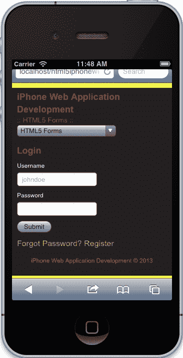
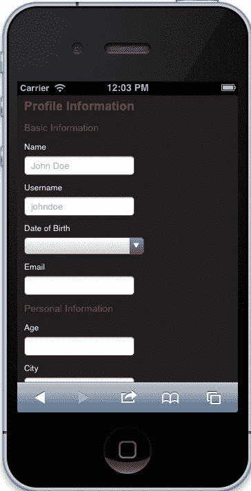
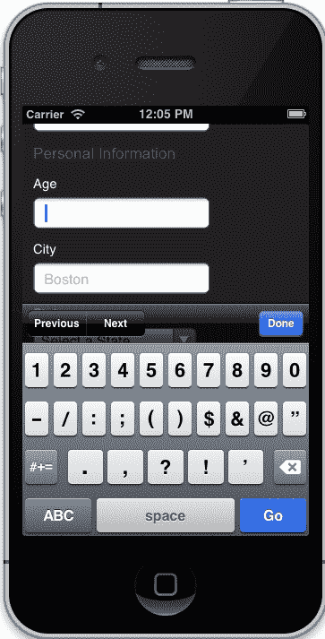
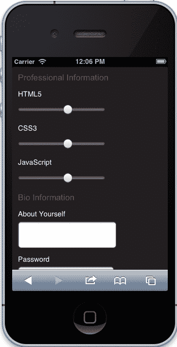
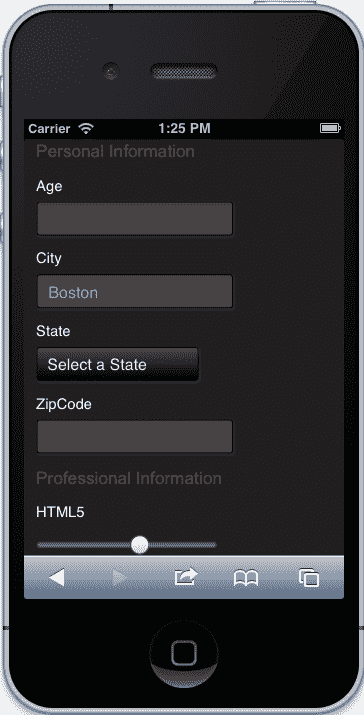

# 第五章：了解 HTML5 表单

在本章中，我们将使用最新的 HTML5 技术来查看表单，包括新的输入类型和表单属性。我们将简要回顾一些我们将在示例表单中使用的新输入类型。然后，我们将讨论规范中的一些新属性，同时专门针对移动设备查看`autocapitalize`属性。在深入研究我们的示例表单之前，我们考虑 iOS 设备上的表单布局以及与这些表单交互时出现的限制。最后，我们创建一些示例表单，开发一些简单的验证，然后专门为 iOS 和支持 WebKit 的浏览器样式化我们的表单。

一旦我们审查了所有这些功能，并且已经浏览了我们的示例表单，我们应该对 HTML5 表单以及它们与为 iOS 开发 Web 应用程序有何关联有了扎实的理解。

以下是本章将涵盖的主题：

+   新的 HTML5 输入类型

+   新的 HTML5 表单特定属性

+   iPhone 的表单布局

+   表单验证

+   iOS 的表单样式

因此，让我们首先来看一下新的标准 HTML5 输入类型。

# HTML5 输入类型

HTML5 引入了几种新的输入类型，加快了应用程序的开发。总共有 13 种新的输入类型在 HTML5 规范中引入，包括日期时间、本地日期时间、日期、月份、时间、周、数字、范围、电子邮件、网址、搜索、电话和颜色。不幸的是，这些新输入中只有 10 种在 iOS 上受支持，但不用担心，因为类型会自动默认为文本。这对我们帮助不大，但它确实允许我们为我们需要但不受支持的类型创建 polyfill。无论如何，以下是 iOS 上支持的所有输入类型的详细说明：

| 输入类型 描述 |
| --- |
| --- --- |
| 按钮 代表没有额外语义的按钮。 |
| 复选框 代表可以切换的状态或选项。 |
| 日期 代表将元素的值设置为表示日期的字符串的控件。 |
| 日期时间 代表将元素的值设置为表示全局日期和时间（带有时区信息）的字符串的控件。 |
| 本地日期时间 代表将元素的值设置为表示本地日期和时间（不带时区信息）的字符串的控件。 |
| 电子邮件 代表编辑电子邮件地址列表的控件。 |
| 文件 代表文件项目列表，每个项目包括文件名、文件类型和文件主体（文件的内容）。 |
| 隐藏 代表用户不打算检查或操作的值。 |
| 图像 代表 UA 从中启用用户交互地选择一对坐标并提交表单的图像，或者用户可以从中提交表单的按钮。 |
| 月份 代表一个控件，用于将元素的值设置为表示月份的字符串。 |
| 数字 代表一个精确的控件，用于将元素的值设置为表示数字的字符串。 |
| 密码 代表用于输入密码的单行纯文本编辑控件。 |
| 单选按钮 代表从项目列表中选择一个项目的选择（单选按钮）。 |
| 范围 代表一个不精确的控件，用于将元素的值设置为表示数字的字符串。 |
| 重置 代表重置表单的按钮。 |
| 搜索 代表用于输入一个或多个搜索词的单行纯文本编辑控件。 |
| 提交 代表提交表单的按钮。 |
| 电话 代表用于输入电话号码的单行纯文本编辑控件。 |
| 文本 代表输入元素值的单行纯文本编辑控件。 |
| 时间 代表将元素的值设置为表示时间（不带时区信息）的字符串的控件。 |
| `url` | 代表一个控件，用于编辑元素值中给出的绝对 URL。 |
| `week` | 代表一个控件，用于将元素值设置为表示一周的字符串。 |

这些详细信息可在以下网址找到：

+   [`www.w3.org/TR/html-markup/input.html`](http://www.w3.org/TR/html-markup/input.html)

+   [`developer.apple.com/library/safari/#documentation/AppleApplications/Reference/SafariHTMLRef/Articles/InputTypes.html#//apple_ref/doc/uid/TP40008055-SW1`](http://developer.apple.com/library/safari/#documentation/AppleApplications/Reference/SafariHTMLRef/Articles/InputTypes.html)

尽管我们可以在这里尝试许多输入，但我们只会专注于新的`email`、`number`、`datetime`和`range`类型。本书中的示例表单还将包含常规类型，包括`text`、`password`和`submit`。

现在我们对支持的内容有了很好的了解，并且有了适合我们需求的类型的信息参考，让我们继续审查我们也可以利用的属性。

# HTML5 表单属性

在 HTML5 中有许多属性可供我们使用，但为了简化这部分，我们将专注于我们可以在输入和表单上使用的新属性。以下属性在最新的 HTML5 规范中定义，除了`autocapitalize`外，在 iOS 上也得到支持：

| 输入属性 | 描述 |
| --- | --- |
| `autocapitalize` | 指定文本元素的自动大写行为。 |
| `autocomplete` | 指定元素是否表示用户输入的输入控件（以便用户代理可以稍后预填充表单）。 |
| `min` | 元素值的预期下限。 |
| `max` | 元素值的预期上限。 |
| `multiple` | 指定元素允许多个值。 |
| `placeholder` | 一个短提示（一个词或短语），旨在帮助用户输入控件的数据。 |
| `required` | 指定元素是表单提交的必需部分。 |

您可以在以下网址找到这些属性的详细信息：

+   [`www.w3.org/TR/html-markup/global-attributes.html#global-attributes`](http://www.w3.org/TR/html-markup/global-attributes.html#global-attributes)

+   [`developer.apple.com/library/safari/#documentation/AppleApplications/Reference/SafariHTMLRef/Articles/Attributes.html#//apple_ref/doc/uid/TP40008058-SW2`](https://developer.apple.com/library/safari/#documentation/AppleApplications/Reference/SafariHTMLRef/Articles/Attributes.html)

+   [`www.w3.org/TR/html-markup/form.html#form.attrs.autocomplete`](http://www.w3.org/TR/html-markup/form.html#form.attrs.autocomplete)

### 提示

并非所有表单属性都列在上表中；只列出了 HTML5 规范中定义的最新支持的属性。这是为了让我们对最新和最好有一个很好的了解。然而，如果您想获得更广泛的支持，我鼓励您查看上述详细信息的来源，并对规范中每个属性进行彻底的解释。

我们现在对 iOS 支持的最新属性有了基本的了解。我们现在可以简要地回顾一些设计考虑，然后直接进入一些示例 HTML5 表单，看看最新的输入类型和属性如何一起工作，以简化我们的开发过程。

# iPhone 的表单布局

在这一部分，我们简要介绍了在为 iOS 创建表单时的一些设计考虑。您可能对表单的设计有或没有完全控制；然而，为了更容易理解可能出现的限制，以下表格有助于展示我们在处理表单时所拥有的有限屏幕空间。希望这将帮助您解释这些限制，以便进行调整。让我们来看看以下表格：

| UI 控件 | 像素尺寸 |
| --- | --- |
| 状态栏 | 高度 20 英寸 |
| URL 文本字段 | 高度 60 英寸 |
| 表单助手 | 高度 44 英寸 |
| 键盘 | 竖屏高度 216 英寸，横屏高度 162 英寸 |
| 按钮栏 | 竖屏高度 44 英寸，横屏高度 32 英寸 |

有关这些控件的详细信息可以在[`developer.apple.com/library/safari/#documentation/AppleApplications/Reference/SafariWebContent/DesigningForms/DesigningForms.html`](https://developer.apple.com/library/safari/#documentation/AppleApplications/Reference/SafariWebContent/DesigningForms/DesigningForms.html)找到。

根据这些值，当这些控件出现时，我们需要调整我们的表单以适应特定的尺寸。例如，如果所有这些控件都出现，除了按钮栏，而我们有 480 像素的可用高度，那么我们的屏幕房地产最终将达到惊人的高度 140 像素。

正如你所看到的，为 iOS 创建可用的表单是一个挑战，但并非不可能。有一些有趣的技术可以用来适应我们应用程序中的表单。但最好的技术是简单。确保你不要一次要求用户提供大量信息；所以不要要求姓名、电子邮件、密码和密码确认以及出生日期，而只要求用户名、密码和电子邮件地址。保持简单在我们的应用程序中有很大帮助，并有助于改善用户体验。

我们现在对为 iOS 设计表单时出现的限制有了相当的了解，但现在让我们跳入功能性，看看我们如何创建一些简单的表单。

# 示例 HTML5 表单

现在我们将仔细研究一些代码，包括标记、脚本和样式。其中一些你可能已经知道，大部分重点将放在新的 HTML5 输入和属性上。我们将看看它们如何被实现到表单中，它们对 UI 控件的影响，以及如何将这项新技术应用到我们的脚本中。但首先，让我们做一些设置工作，以确保我们的页面保持一致。

## 设置工作

我们需要做的第一件事是打开我们的表单页面的`index.html`文件。一旦打开了这个文件，你会看到我们最初在本书开始时创建的旧模板。随着我们的应用程序的发展，我们必须更新这个模板以反映这些变化，所以让我们做以下任务：

+   在我们的主要样式之后包含表单样式（`forms.css`）

+   更新导航以反映我们的新菜单

+   包括我们的导航脚本（`App.Nav.js`）和我们的表单脚本（`App.Forms.js`）

### 包括我们的表单样式

目前，我们的页面没有任何样式，但我们应该包括我们的页面特定样式表。当我们这样做时，我们的头部应该是这样的：

```html
    <!DOCTYPE html>
    <html class="no-js">
    <head>
        [PREVIOUS META TAGS]

        <link rel="stylesheet" href="../css/normalize.css">
        <link rel="stylesheet" href="../css/main.css">
        <link rel="stylesheet" href="../css/forms.css">
        <script src="img/modernizr-2.6.1.min.js"></script>
    </head>
```

### 更新导航

与上一章一样，我们需要更新我们的导航以反映新的选择菜单。这有助于为我们的应用程序节省屏幕房地产。当我们更新我们的导航时，我们的标记将更新为以下代码：

```html
<nav>
    <select>
        <option value="../index.html">Application Architecture</option>
        <option value="../video/index.html">HTML5 Video</option>
        <option value="../audio/index.html">HTML5 Audio</option>
        <option value="../touch/index.html">Touch and Gesture Events</option>
        <option value="../forms/index.html" selected>HTML5 Forms</option>
        <option value="../location/index.html">Location Aware Applications</option>
        <option value="../singlepage/index.html">Single Page Applications</option>
    </select>
</nav>
```

### 包括我们的导航和表单脚本

现在我们的导航已经就位，让我们包含导航脚本，同时让我们包含我们的表单的页面特定脚本：

```html
<script src="img/zepto.min.js"></script>
<script src="img/helper.js"></script>
<!-- BEGIN: Our Framework -->
<script src="img/App.js"></script>
<script src="img/App.Nav.js"></script>
<script src="img/App.Forms.js"></script>
<!-- END: Our Framework -->
<script src="img/main.js"></script>
```

正如你所看到的，我们只包含了这个页面所需的必要脚本。

## 表单

我们将在页面上开发三种不同的表单，包括登录、注册和个人资料表单。它们非常基本，大部分将演示表单的实现。在每段代码之后，我们将审查新的输入并提供一些关于它们如何影响我们的标记和用户界面的背景信息。在这部分，不要担心整体结构；也就是说，不要担心表单的包含`div`或带有标题的部分。结构不会被讨论，大部分是作为指导线给你的。所以，让我们从我们的登录表单开始。

### 登录表单

以下是我们**登录**表单的结构。仔细审查这一点，主要关注“表单”元素以及它如何利用“自动大写”属性，然后看看我们如何在用户名和密码字段上实现了必填属性：

```html
<!-- BEGIN: LOGIN CONTAINER -->
<form autocorrect="off" autocapitalize="off">
    <div class="error-messaging"></div>
    <label for="login-username">Username</label>
    <input name="username" id="login-username" type="text" placeholder="johndoe" required>
    <label for="login-password">Password</label>
    <input name="password" id="login-password" type="password" required>
    <input type="submit" value="Submit">
</form>
<!-- END: LOGIN CONTAINER -->
```

当我们看最终产品时，由于我们还没有为我们的表单设置样式，它应该看起来有点像这样：



我们的登录表格

如你所见，我们在“表单”元素上将“自动大写”设置为关闭。这基本上告诉移动 Safari 不要对其中的任何输入进行大写。我们可以很容易地在每个单独的输入上设置这个属性为“关闭”，但为了简化这个演示，我们将其保留在“表单”元素上。

这里还有一件很酷的事情是，我们在用户名和密码上都设置了“必填”。这很棒，因为除非填写了这些字段，否则不会提交表单。在过去，我们需要设置一个“必填”的类，然后用 JavaScript 进行检查；现在有了 HTML5，我们就不需要了。

### 提示

我知道你们中的一些人可能会感到震惊，但在 iOS 中，你不会收到任何关于字段是否必填的通知。根据开发者文档，它不受支持。那么为什么在这里提到它呢？因为如果我们真的想要支持多个移动设备，包含这个属性仍然是一个好主意，这样我们的应用程序就会对设备友好，如果苹果选择在未来支持它，我们的应用程序就是未来的。再次强调，这需要你和可能是你的团队来权衡，但拥有这个属性符合 HTML 5 规范——只是在 iOS 上不受支持而已。

我们还可以看到“占位符”属性被用来为我们的文本输入应用一些默认文本。请记住，“占位符”就是一个占位符。它并不设置我们输入的值，所以值仍然是空的。

### 注册表格

现在我们转向我们的注册表格。在这个表格中，我们将收集用户的姓名、用户名、电子邮件、密码和确认密码。再次强调，不要关注结构。集中精力关注“自动更正”属性在“表单”元素上的实现，然后关注“电子邮件”输入类型的使用。

```html
<!-- BEGIN: REGISTER CONTAINER -->
<form autocorrect="off" autocapitalize="off">
    <div class="error-messaging"></div>
    <div class="field">
        <label for="register-name">Name</label>
        <input name="name" id="register-name" type="text" placeholder="John Doe">
    </div>
    <div class="field">                    
        <label for="register-username">Username</label>
        <input class="required" name="username" id="register-username" type="text" placeholder="johndoe">
    </div>
    <div class="field">
        <label for="profile-email">Email</label>
        <input class="required" type="email" id="profile-email" autocorrect="off">
    </div>
    <div class="field">
        <label for="register-password">Password</label>
        <input class="required" named="password" id="register-password" type="password">
    </div>
    <div class="field">
        <label for="register-password-confirm">Confirm Password</label>
        <input class="required" named="password" id="register-password-confirm" type="password">
    </div>
    <input type="submit" value="Register">
</form>
<!-- BEGIN: REGISTER CONTAINER -->
```

当我们完成了这一部分和一些初步的样式后，我们的表单会看起来像这样：


我们的注册表格

在这个表格中，我们已经关闭了所有表单字段的“自动更正”。再次强调，我们可以逐个元素地进行设置，但为了简化操作，我们选择将其添加到“表单”元素中。

最后要考虑的一点是使用输入类型“电子邮件”。当我们开始使用一些定制的输入类型时，我们的用户界面会相应调整。例如，当我们点击“电子邮件”输入类型时，我们会看到控件会改变以包括`@`符号：


电子邮件输入类型

现在，让我们更仔细地看看其他输入类型是如何影响我们的用户界面的。

### 个人资料表格

以下表单是登录和注册表单的一种组合，带有一些额外的字段。然而，有一些区别，所以让我们专注于改变的部分。在这个例子中，我们会看到我们已经将“自动大写”更改为“句子”，并且只在我们想要应用的字段上将“自动更正”设置为“关闭”。除此之外，我们开始使用“日期时间”、“数字”和“范围”输入类型。我们做出的最后一个改变是使用类而不是属性来应用“必填”字段——这将在我们脚本的实现中进一步解释。现在，先审查标记，然后继续阅读解释。

```html
<!-- BEGIN: PROFILE UPDATES -->
<form autocapitalize="sentences">
    <div class="error-messaging"></div>
    <h2>Basic Information</h2>
    <div class="field">
        <label for="profile-name">Name</label>
        <input name="name" id="profile-name" type="text" placeholder="John Doe">
    </div>
    <div class="field">
        <label for="profile-username">Username</label>
        <input name="username" id="profile-username" type="text" placeholder="johndoe" autocorrect="off">
    </div>            
    <div class="field">
        <label for="profile-dob">Date of Birth</label>
        <input type="datetime" id="profile-dob">
    </div>            
    <div class="field">
        <label for="profile-email">Email</label>
        <input type="email" id="profile-email" autocorrect="off">
    </div>
    <h2>Personal Information</h2>
    <div class="field">
        <label for="profile-age">Age</label>
        <input type="number" id="profile-age">
    </div>
    <div class="field">
        <label for="profile-city">City</label>
        <input type="text" id="profile-city" placeholder="Boston">
    </div>
    <div class="field">
        <label for="profile-state">State</label>
        <select name="state" id="profile-state">
            <!-- OPTIONS GO HERE -->
        </select>
    </div>
    <div class="field">
        <label for="profile-zip">ZipCode</label>
        <input type="number" min="0" id="profile-zip">
    </div>
    <h2>Professional Information</h2>
    <div class="field">
        <label for="profile-skills-markup">HTML5</label>
        <input type="range" min="0" max="5" id="profile-skills-markup">
    </div>
    <div class="field">
        <label for="profile-skills-styles">CSS3</label>
        <input type="range" min="0" max="5" id="profile-skills-styles">
    </div>
    <div class="field">
        <label for="profile-skills-scripts">JavaScript</label>
        <input type="range" min="0" max="5" id="profile-skills-scripts">
    </div>
    <h2>Bio Information</h2>
    <label for="profile-bio">About Yourself</label>
    <textarea id="profile-bio" name="about"></textarea>
    <div class="field">
        <label for="register-password">Password</label>
        <input class="required" named="password" id="register-password" type="password">
    </div>
    <p>Provide your password to confirm.</p>
    <input type="submit" value="Update Profile">
</form>
```

我们的最终产品在样式化后会是这样的：



我们的个人资料表格

在这个例子中，我们在`form`元素上将`autocapitalize`设置为`sentences`。这有助于我们，因为现在我们已经明确定义了我们希望大写的内容，即只有句子。这在苹果的文档中有描述，可以在那里进一步探索。至于`autocorrect`，我们在各个项目上设置它，因为我们可能希望在`textarea`上进行校正。同样，我们可以选择在`form`元素上将`autocorrect`设置为`off`，然后在`textarea`中将其设置为`on`，但这是一个选择的问题，完全取决于您作为开发人员。现在让我们来回顾一下几种输入类型。

#### 日期时间类型

在这个例子中，我们使用`datetime`来处理**出生日期**字段。这很棒，因为我们的 UI 完全符合我们的期望，以提供准确的信息：


日期时间输入类型

#### 数字类型

`number`输入类型也可以操作我们的 UI，以便我们在控件中有一组默认的数字选择：



我们的数字输入类型

#### 范围类型

`range`输入类型是我们表单中非常有用的控件。同样，这种类型提供了一个自定义的 UI，允许我们使用系统默认值，而不是 JavaScript，来提供我们所需的数值类型：



范围输入类型

现在我们已经完成了对 HTML5 中一些新的输入字段和属性以及它们如何影响我们的 iOS Web 应用程序 UI 的审查。接下来是使用 JavaScript 来验证我们的表单。同样，这将是非常基础的，并且将介绍我们如何设置一个可重用的表单组件，不会直接与这些新的输入和属性联系起来。这是因为这些自定义输入和属性是规范的一部分，旨在加快开发速度，因此您对使用脚本进行验证的需求应该是有限的。无论如何，让我们继续前进，快速看一下我们的脚本。

# 表单验证

在这一部分，我们回顾了为这个页面编写的 JavaScript。没有什么真正新颖或突破性的东西；它明确旨在演示如何使用我们在本书中开发的框架来创建自包含的代码，以验证多个表单并使您更容易扩展。所以让我们开始通过回顾基本模板。

## 基本模板

以下是我们一直在使用的基本模板。使用标准的命名空间技术，扩展`App`命名空间的`Form`类将包含我们所有的功能。

```html
var App = window.App || {};

App.Form = (function(window, document, $){
    'use strict';

    var _defaults = {
            'element': 'form',
            'name': 'Form'
        };

    function Form(options) {
        // Customizes the options by merging them with whatever is passed in
        this.options = $.extend({}, _defaults, options);

        this.init();
    }

    //----------------------------------------------------
    //  Private Methods
    //----------------------------------------------------

    //----------------------------------------------------

    //----------------------------------------------------
    //  Event Handlers
    //----------------------------------------------------

    //----------------------------------------------------

    //----------------------------------------------------
    //  Public Methods
    //----------------------------------------------------
    Form.prototype.getDefaults = function() {
        return _defaults;
    };

    Form.prototype.toString = function() {
        return '[ ' + (this.options.name || 'Form') + ' ]';
    };

    Form.prototype.init = function() {
        // Initialization Code

        return this;
    };

    return Form;

}(window, document, Zepto));
```

请记住，代码是包含在立即调用的函数表达式或 IIFE/闭包中的自包含的。当我们初始化`App.Form`时，`Form`构造函数将被调用，我们的公共方法`init`将初始化我们在其中编写的任何代码。所以让我们从那里开始，附加适当的事件。

## 初始化我们的表单

我们需要初始化我们的表单，但我们不需要为每个表单创建一个新对象。我们可以通过事件驱动来处理验证，然后使用我们为每个输入写的属性来处理验证。但让我们来看看我们的事件设置。

### 附加事件

首先，让我们执行事件附加：

```html
this.$element.
  on('submit', 'form', handleFormSubmission);

this.$cache.loginFormContainer.
  on('click', 'a[href="#forgot-password"]', handleForgotPasswordClick).
  on('click', 'a[href="#register"]', handleRegisterClick);

this.$cache.registerFormContainer.
  on('click', 'a[href="#login"]', handleLoginClick);
```

在上面的代码中，我们有一些事情要做。首先，我们要查找页面上任何表单的提交。然后，当我们提交表单时，我们将调用`handleFormSubmission`方法，我们将在一会儿编写。以下的事件监听器基本上是登录和注册按钮的显示/隐藏。

这里没有什么新的或突破性的东西，基本上我们只是做一些设置工作，如果需要的话随时可以回来。关键在于，我们没有为每个表单创建一个新的对象实例，而是将我们的代码概括为只监听每个表单上的`submit`事件。现在让我们创建或设置我们的处理程序，然后编写它们的功能。

### 事件处理程序

现在，让我们来看一下事件处理程序。

```html
function handleFormSubmission(e) {
  e.preventDefault();

  // Code goes here
}

function handleForgotPasswordClick(e) {
  e.preventDefault();

  // Code goes here
}

function handleRegisterClick(e) {
  e.preventDefault();

  // Code goes here
}

function handleLoginClick(e) {
  e.preventDefault();

  // Code goes here
}
```

在这里我们并没有做任何新的事情，我们所做的唯一步骤是为我们的代码设置桩，以便我们知道每个功能的位置。从这里开始，我们看一下每个表单提交的验证代码。我们不会看每个表单的显示/隐藏功能，但是你可以查看本书附带的源代码，以了解它是如何工作的。

## 验证我们的输入

我们将看一下`handleFormSubmission`方法，并逐步了解我们如何验证我们的字段。如果你在任何步骤感到困惑，不要担心。我们都曾经历过这种情况，我自己有时也会在表单验证和如何在项目中处理它方面遇到困难。

首先，让我们开始缓存我们将要使用的变量：

```html
function handleFormSubmission(e) {
  var $target, errors, $required, fields, $errorText, i, required_fields_length;
}
```

这些变量描述了它们自己，这是一个标准的做法，因为我们想要理解发生了什么，因此给我们的变量附上有意义的名称是必不可少的。

现在，我们需要阻止表单的默认行为；这意味着我们暂时不想提交表单。为了做到这一点，让我们做以下操作：

```html
function handleFormSubmission(e) {
  var $target, errors, $required, fields, $errorText, i, required_fields_length;
  e.preventDefault();
}
```

我们添加了`e.preventDefault`，它告诉事件阻止浏览器中的默认行为。接下来，我们想要定义目标，清空任何先前的错误消息，创建一个空的错误对象，然后找到所有必填元素。可以使用以下代码完成：

```html
function handleFormSubmission(e) {
  // Previous code
  $target = $(e.target);
  $target.find('.error-messaging').empty();
  errors = { 'required': [], 'invalid': [] };
  $required = $target.find(':required');
}
```

### 注意

请注意，我们的`errors`对象包含两个数组：一个`required`数组和一个`invalid`数组。这个`errors`数组将跟踪出了什么问题；例如，如果一个字段是`required`并且值是`empty`，那么我们将在`error`对象内填充`required`数组，但如果一个输入已经填写但不合法，那么我们将在`errors`对象内填充`invalid`对象。

现在，记得当我们添加了`required`类但没有添加`required`属性到我们的个人资料表单时吗？前面的代码就无法捕捉到这一点，所以我们会遇到问题。为了防止这种情况发生，我们可以这样做：

```html
function handleFormSubmission(e) {
  // Previous code
  if ($required.length === 0) {
    $required = $target.find('.required')
  }
}
```

这段代码有助于解决我们在`required`类上的问题，但确实存在一个逻辑缺陷。你能找到这个缺陷吗？我会留给你作为一个谜题来解决。这个过程的下一步是找到所有的`form`元素，然后找到`required`字段并检查它们是否已经填写：

```html
function handleFormSubmission(e) {
  //Previous code
  fields = $target[0].elements;

  i = 0, required_fields_length = $required.length;
  for (i; i < required_fields_length; i++) {
  if ($required[i].value === '') {
      errors.required.push($($required[i]).prev('label').text() + ' is required.');
    }
  }
}
```

在这一点上，我们基本上在`error`对象内填充我们的`invalid`数组。如果字段为空，我们收集与该字段关联的标签的值，并附加一个定制的消息，将呈现给用户。

### 注意

不幸的是，特定的验证不会被覆盖，比如电子邮件、数字和其他限制。然而，这里有足够的空间让你探索并添加到这段代码中，希望这足以让你理解验证、要求以及如何在代码中处理这些用例。

最后一步是检查错误，如果存在错误，将这些错误呈现给用户，以便他们相应地进行更正：

```html
function handleFormSubmission(e) {
  //Previous code
  if (errors.required.length === 0 && errors.invalid.length === 0) {
    console.log('Form Requirements and Validations Passed');
    return;
  } else {
    $errorText = $('<ul />');

    if (errors.required.length !== 0) {
      $errorText.append('<li>' + errors.required.join('</li><li>') + '</li>');
    }

    if (errors.invalid.length !== 0) {
      $errorText.append('<li>' + errors.invalid.join('</li><li>') + '</li>');
    }

    $target.find('.error-messaging').append($errorText);
  }
}
```

我们的检查非常简单，我们基本上检查`error`对象内的`invalid`和`required`数组是否为空。如果是，我们希望继续提交——在这种情况下将是一个 AJAX 调用。否则，我们希望创建一个包含错误的无序列表，然后将它们附加到表单上，以便用户在没有页面刷新的情况下了解出了什么问题。

希望这一部分帮助你理解验证表单的方法。有了 HTML5 规范的最新支持，浏览器已经处理了大部分工作。这加快了开发速度，减少了定制组件的开发，并帮助我们专注于交付。现在作为一个额外的功能，我们继续进行表单的样式设计。

# iOS 的表单样式

在本节中，我们将研究如何为我们的表单进行样式设置。如果我们目前在 iOS 设备上甚至桌面浏览器上测试我们的表单，它看起来并不漂亮。事实上，你可能会对它的丑陋感到有点不满。因此，让我们对其进行样式设置，让每个人都满意。我们将从帮助实现良好外观的基本样式开始。然后，我们将考虑如何使用 CSS3 功能自定义我们的组件。

## 基本样式

样式化表单非常容易。我们可以简单地使用元素本身，但有一个“陷阱”。您可能注意到我们在一个选择器中指定了`[type="datetime"]`。这是因为`datetime`输入类型在 iOS 上显示为选择菜单类型的 UI，因此典型的输入选择器不适用。否则，在基本样式中并没有太多真正突出的地方，它基本上给了我们在之前讨论过的表单中使用的输入类型中看到的样式。

```html
/*!
  Forms Styling
*/

label {
    color: #FFF;
    font-family: 'Helvetica', 'Arial', sans-serif;
    font-size: 12px;
    display: block;
    margin: 10px 0 5px 0;
}

input, select, input[type="datetime"], textarea {

    font-size: 13px;

    display: block;
    margin: 0;
    padding: 5px 8px;
}

input[type="submit"] {
    margin: 10px 0;
}

.form-container {
   display: none;
   margin: 15px 0;
}

.form-container.active {
  display: block;
}

form h2 {
    margin: 10px 0 5px 0;
}

.error-messaging ul {
  list-style: square outside;
  margin: 5px 0 0 0;
  padding: 0 0 0 12px;
}

.error-messaging li {
    color: #A12E33;
    font-family: 'Helvetica', 'Arial', sans-serif;
    font-size: 12px;  
}
```

## 自定义样式

这就是许多魔术发生的地方。在本节中，我们使用自定义的 CSS3 样式来自定义我们的组件。以下样式将自定义我们的输入、选择，并给我们一个更加风格化的表单，与我们当前的样式相匹配。在审查样式时，您可能需要记住的一些事情是使用 CSS3 的`gradient`属性作为`background`和`border-radius`的使用。

```html
/*!
  Forms Styling
*/

label {
    color: #FFF;
    font-family: 'Helvetica', 'Arial', sans-serif;
    font-size: 12px;
    display: block;
    margin: 10px 0 5px 0;
}

input, select, input[type="date-time"], textarea {

    background: rgb(69,72,77);
    background: -moz-linear-gradient(top, rgba(69,72,77,1) 0%, rgba(0,0,0,1) 100%);
    background: -webkit-gradient(linear, left top, left bottom, color-stop(0%,rgba(69,72,77,1)), color-stop(100%,rgba(0,0,0,1)));
    background: -webkit-linear-gradient(top, rgba(69,72,77,1) 0%,rgba(0,0,0,1) 100%);
    background: -o-linear-gradient(top, rgba(69,72,77,1) 0%,rgba(0,0,0,1) 100%);
    background: -ms-linear-gradient(top, rgba(69,72,77,1) 0%,rgba(0,0,0,1) 100%);
    background: linear-gradient(to bottom, rgba(69,72,77,1) 0%,rgba(0,0,0,1) 100%);

    font-size: 13px;
    color: #e5e5e5;

    border: 1px solid #000918;

    -moz-border-radius: 3px;
    -webkit-border-radius: 3px;
    -ms-border-radius: 3px;
    -o-border-radius: 3px;
    border-radius: 3px;

    display: block;
    margin: 0;
    padding: 5px 8px;

    -moz-box-shadow: 1px 1px 1px #333;
    -webkit-box-shadow: 1px 1px 1px #333;
    -ms-box-shadow: 1px 1px 1px #333;
    -o-box-shadow: 1px 1px 1px #333;
    box-shadow: 1px 1px 1px #333;
}

input[type="text"], 
input[type="number"], 
input[type="email"], 
input[type="datetime"],
input[type="password"],
textarea {
  background: -webkit-gradient(linear, left top, left bottom, color-stop(0, #42422F), color-stop(0.09, #444));
}

input[type="submit"] {
    margin: 10px 0;
}

.form-container {
   display: none;
   margin: 15px 0;
}

.form-container.active {
  display: block;
}

form h2 {
    margin: 10px 0 5px 0;
}

.error-messaging ul {
  list-style: square outside;
  margin: 5px 0 0 0;
  padding: 0 0 0 12px;
}

.error-messaging li {
    color: #A12E33;
    font-family: 'Helvetica', 'Arial', sans-serif;
    font-size: 12px;
}
```

当我们应用前面的样式时，我们得到以下 UI：



范围输入类型

正如您所看到的，我们给我们的表单赋予了全新的外观和感觉，并且很容易地对选择组件进行了样式设置，这在桌面浏览器上并不容易做到。在这些样式之上，我建议您查看`-webkit-appearance`属性，它基本上允许您进一步自定义您的表单，并在组件的样式方面提供更多的控制。然而，此时您应该已经有了一个坚实的基础，可以为 iOS 构建 HTML5 表单。

# 摘要

在本章中，我们回顾了最新的 HTML5 输入类型和属性，特别是针对我们的示例应用程序。然后，我们讨论了 iOS 上表单的布局及其限制。最后，我们开发了一些表单，并附加了一个非常基本的验证脚本，利用了这些最新的输入和属性。作为一个额外的奖励，我们还讨论了如何为 WebKit 浏览器（包括 iOS 上的移动 Safari）定制我们的表单样式。

现在，我们应该对 iPhone 和 iPad 上的表单有了坚实的掌握，以及如何利用最新的 HTML5 技术为我们带来好处。本章帮助演示了表单的使用以及我们需要考虑的因素，以便创建用户友好的表单。除此之外，我们现在将进入下一章的位置感知，并将使用在这里学到的一些概念来扩展体验。
