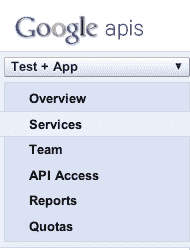
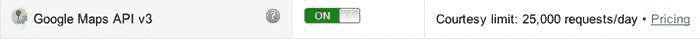
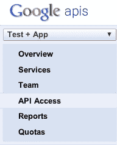

# 第六章：位置感知应用程序

地理位置是当今应用程序中广泛请求的功能，为用户提供准确的位置特定信息。在本章中，我们将回顾 HTML5 规范中的地理位置 API。有了这些知识，我们将继续构建一个包装器，使我们能够轻松地利用这一功能。一旦我们彻底了解了如何获取用户的位置，我们将利用一个简单的应用程序来使用我们新发现的知识，该应用程序使用谷歌地图 API。在本章结束时，您应该对地理位置规范有透彻的了解，有一个其实现的简单示例，并且作为奖励，您应该获得了使用谷歌地图 API 的一些经验。因此，让我们开始探索规范。

在本章中，我们将涵盖：

+   地理位置规范

+   检索用户当前位置

+   监视用户的位置

+   处理地理位置错误

+   谷歌地图 API

+   将谷歌地图与地理位置联系起来

+   自定义谷歌地图

# 地理位置规范

基于位置的服务已经存在了相当长的时间，并且随着时间的推移而发展。实质上，这些服务努力提供功能，允许在各种类型的程序中使用时间和位置。然而，直到现在，前端还没有一个有用的工具集。因此，**W3C**（**万维网联盟**）试图标准化从客户端设备检索地理位置的 API，无论是您的台式电脑、手机还是平板电脑。

## 实施

> 地理位置 API 定义了与托管实现的设备相关联的位置信息的高级接口，例如纬度和经度。API 本身对底层位置信息源是不可知的。

（如[`dev.w3.org/geo/api/spec-source.html#introduction`](http://dev.w3.org/geo/api/spec-source.html#introduction)所述。）

浏览器实现地理位置 API 的常见方式涉及**全球定位系统**（**GPS**）、IP 地址、WIFI 和蓝牙 MAC 地址以及基本用户输入。由于这些技术工作的方式各不相同，以及浏览器供应商选择实施规范的程度不同，无法保证此 API 将返回用户或设备的位置。因此，作为开发人员，您需要确保用户也意识到这一限制，并向所有相关方解释合理的期望。

## 范围、安全性和隐私

在实现地理位置到我们的应用程序时，我们唯一需要担心的是脚本。无需提供任何标记，也无需查询或点击某些外部资源或 API。地理位置的实现严格限于脚本方面，并直接与正在使用的设备相关联。还有一点需要知道的是，位置是以世界大地测量系统坐标或纬度和经度的形式提供的。

在暴露用户位置时，还必须考虑安全性和隐私问题。从用于检索和存储此信息的安全方法到如何在其他方之间分发它，每个实施它的设备都必须提供一种保护用户隐私的机制。因此，W3C 规范要求考虑以下问题：

+   需要用户的许可才能发送位置信息。

+   只有在必要时才能请求位置信息。

+   用户必须批准重新传输位置信息。

+   持有此信息的一方必须向用户披露他们正在收集位置数据，包括其目的、安全性、可访问性、共享（如果数据将与其他方共享）以及此类数据将被存储的时间长度。

### 提示

请记住，为移动 Safari 编写的应用程序无法直接访问设备。它们只能查询浏览器代表它们访问设备。因此，您的应用程序正在请求浏览器获取特定信息，浏览器会为您完成工作，但您永远不会与设备本身进行一对一的通信。

总的来说，该规范考虑了与其他方分享个人信息（如地理位置）时出现的问题。然而，这些考虑并未考虑到当用户无意中授予权限或用户决定改变主意时可能出现的复杂性。因此，该规范提出了以下建议：

> 缓解和深入的防御措施是实施责任，而不是由本规范规定。然而，在设计这些措施时，建议实施者启用用户对位置共享的意识，并提供易于访问的接口，以启用撤销权限。

（如在 [`www.w3.org/TR/geolocation-API/#implementation_considerations`](http://www.w3.org/TR/geolocation-API/#implementation_considerations) 中提到的。）

考虑到这些问题和考虑，我们现在简要地描述 API。在接下来的部分中，我们将看看 API 是如何构建的，特别是看看在本章构建的应用程序中将使用的部分。

## API 描述

在本章的这一部分，您可能会想知道为什么我们还没有看代码，尽管这是一个合理的担忧，但我的目标是帮助您彻底理解 Geolocation API，并指导您了解实际的 W3C 规范。因此，在本章中，我们将查看定义 `Geolocation` 规范的四个接口或公开行为，包括 `Geolocation`、`PositionOptions`、`Position`、`Coordinates` 和 `PositionError` 接口。如果您对此提供的任何信息感到困惑，不用担心。请将本节视为可以帮助您增加对该主题的了解的参考资料。

### Geolocation 接口

Geolocation 对象用于确定设备的位置。当我们实例化 Geolocation 对象时，会使用用户代理算法来确定位置，然后创建并填充一个 `position` 对象。如果我们查看 W3C 规范，Geolocation 被定义为：

```html
interface Geolocation { 
    void getCurrentPosition(PositionCallback successCallback,
            optional PositionErrorCallback errorCallback,
            optional PositionOptions options);

    long watchPosition(PositionCallback successCallback,
            optional PositionErrorCallback errorCallback,
            optional PositionOptions options);

    void clearWatch(long watchId);
};
```

（如在 [`www.w3.org/TR/geolocation-API/#geolocation`](http://www.w3.org/TR/geolocation-API/#geolocation) 中所见。）

先前的代码不是 JavaScript，而是 API 或 **接口定义语言** (**IDL**) 的描述。如果它令人困惑，不用担心，当我第一次看规范页面时，我也有同样的感觉。然而，您在这里看到的是 Geolocation 对象的描述。当您阅读先前的代码时，您应该收集以下信息：

有三种方法：

+   `getCurrentPosition`，接受三个参数，其中两个是可选的

+   `watchPosition`，接受三个参数，其中两个是可选的

+   `clearWatch`，接受一个参数

现在您应该知道与 Geolocation 对象关联的有三个方法，每个方法都有一个特定的目的，如函数名称所述。因此，让我们来看看这三种方法，从 `getCurrentPosition` 开始，您可能已经猜到它获取设备的当前位置或尝试获取。

#### getCurrentPosition 方法

如前所述，此方法接受三个参数，其中两个是可选的。第一个参数应该是一个成功请求的 `callback` 方法。第二个和第三个参数是完全可选的。如果定义了第二个参数，那么它是另一个当发生错误时的 `callback` 方法。最后一个参数是由 `PositionsOptions` 接口定义的 `options` 对象。

#### watchPosition 方法

`watchPosition`方法也接受三个参数，与`getCurrentPosition`方法的参数相同。唯一的区别是，这个方法将持续触发`successCallback`，或者第一个参数，直到调用`clearWatch`方法。请记住，只有在位置发生变化时，`successCallback`才会触发，因此不依赖于任何时间选项。此方法还返回一个长值，用于定义观察操作，这是用`clearWatch`方法清除的。

#### clearWatch 方法

正如我们已经讨论过的，`clearWatch`用于停止`watchPosition`设置的过程。要使用这个方法，我们必须使用`watchPosition`返回的长值，并将其作为参数发送给`clearWatch`。

### PositionOptions 接口

我们已经看到`PositionOptions`对象用于向`getCurrentPosition`和`watchPosition`方法传递可选参数。这个对象由 W3C 定义如下：

```html
interface PositionOptions {
    attribute boolean enableHighAccuracy;
    attribute long timeout;
    attribute long maximumAge;
};
```

（见[`www.w3.org/TR/geolocation-API/#position-options`](http://www.w3.org/TR/geolocation-API/#position-options)。）

从中我们应该得出的结论是，我们可以创建一个包含`enableHighAccuracy`、`timeout`和`maximumAge`键/值对的对象。这个对象在我们的 JavaScript 代码中看起来像下面这样：

```html
var positionOptions = {
    'enableHighAccuracy': false,
    'timeout': Infinity,
    'maximumAge': 0
};
```

但是这些值代表什么呢？幸运的是，这一切都在规范中定义了。不过，别担心，这里有每个选项的简单解释。

#### enableHighAccuracy 选项

这个选项基本上是向设备提示应用程序希望接收到最好的可能结果。默认设置为`false`，因为如果设置为`true`，可能会导致响应时间变慢和/或增加功耗。请记住，用户可能会拒绝此功能，设备可能无法提供更准确的结果。

#### 超时选项

超时被定义为等待成功回调被调用的时间，以毫秒为单位。如果获取位置数据的时间超过这个值，那么将调用错误回调，并发送`PositionError`代码`TIMEOUT`。默认情况下，该值设置为`Infinity`。

#### 最大年龄选项

最大年龄选项是指使用缓存位置的年龄不大于此选项设置的时间。默认情况下，此属性设置为`0`，因此每次都会尝试获取新的位置对象。如果此选项设置为`Infinity`，则每次都返回缓存位置。

现在我们了解了这些选项，我们可以将这个对象作为第三个参数传递给`getCurrentPosition`和`watchPosition`方法。API 的一个简单实现看起来可能是这样的：

```html
var positionOptions = {
    'enableHighAccuracy': false,
    'timeout': Infinity,
    'maximumAge': 0
};

function successCallback(position) {}

function errorCallback(positionError) {}

// Get the current position
navigator.geolocation.getCurrentPosition(successCallback, errorCallback, positionOptions);

// Watch for position changes
navigator.geolocation.watchPosition(successCallback, errorCallback, positionOptions);
```

现在我们知道如何自定义对地理位置 API 的调用，但是当成功调用时，数据是什么样子的呢？或者，错误返回是什么样子的？了解这些对于开发地理位置 API 的良好封装非常有用。所以让我们来看一下坐标和位置错误接口。

### 位置接口

位置接口只是设备实现地理位置 API 返回的信息的容器。它返回一个`Coordinates`对象和`Timestamp`。这在 W3C 规范中描述如下：

```html
interface Position {
    readonly attribute Coordinates coords;
    readonly attribute DOMTimeStamp timestamp;
};
```

（见[`www.w3.org/TR/geolocation-API/#position`](http://www.w3.org/TR/geolocation-API/#position)。）

在我们到目前为止讨论的内容中，位置接口在`getCurrentPosition`方法的`successCallback`中发挥作用。如果你还记得，这个方法接受一个名为`options`的参数，它是之前定义的`position`对象。实际上，如果我们想要记录坐标和时间戳，我们可以这样做：

```html
function successCallback(position) {
    console.log(position.coords);
    console.log(position.timestamp);
}
```

返回的时间戳表示为`DOMTimeStamp`，`coords`对象包含地理坐标和其他信息，由`Coordinates`接口定义。

### Coordinates 接口

正如我们之前讨论过的，`getCurrentPosition`和`watchPosition`的`successCallback`返回一个包含`Coordinates`对象的`position`对象。这个`Coordinates`对象包含多个属性，这些属性在下表中描述：

| 属性 | 描述 |
| --- | --- |
| `latitude` | 十进制度的地理坐标。 |
| `longitude` | 十进制度的地理坐标。 |
| `altitude` | 位置的高度，以米为单位。如果不存在则为 null。 |
| `accuracy` | 经度和纬度的精度，以米为单位。如果不存在则为 null。必须是非负实数。 |
| `altitudeAccuracy` | 海拔精度，以米为单位。如果不存在则为 null。必须是非负实数。 |
| `heading` | 行进方向，以度为单位（0° ≤ heading ≤ 360°），顺时针方向。如果不存在则为 null。如果静止则值必须为 NaN。 |
| `speed` | 当前速度的大小，以米/秒为单位。如果不存在则为 null。必须是非负实数。 |

（见[`www.w3.org/TR/geolocation-API/#coordinates`](http://www.w3.org/TR/geolocation-API/#coordinates)。）

既然我们知道了通过`Coordinates`接口可用的属性，我们可以通过以下实现访问这些属性。

```html
function successCallback(position) {
    console.log(position.coords);
    console.log(position.coords.lattitude);
    console.log(position.coords.longitude);
    console.log(position.timestamp);
}
```

正如您所见，我们可以通过`position.coords`对象访问属性。这样，我们可以非常容易地访问用户的当前位置并将其与其他 API 绑定，这正是我们很快将要使用 Google Maps API 做的事情。最后，让我们讨论`PositionError`接口，以便我们知道如何在应用程序中高效处理错误。

### PositionError 接口

当`getCurrentPosition`或`watchPosition`方法出现错误时，`PositionError`接口就会发挥作用。该接口描述了发送到我们的错误处理程序或回调的代码和消息。W3C 将`PositionError`接口解释如下：

```html
interface PositionError {
    const unsigned short PERMISSION_DENIED = 1;
    const unsigned short POSITION_UNAVAILABLE = 2;
    const unsigned short TIMEOUT = 3;
    readonly attribute unsigned short code;
    readonly attribute DOMString message;
};
```

（见[`www.w3.org/TR/geolocation-API/#position-error`](http://www.w3.org/TR/geolocation-API/#position-error)。）

前面的代码描述了作为对象发送到错误处理程序的两个属性，这两个属性分别是`code`和`message`。

`code`属性可以是以下三个常量之一，

+   `PERMISSION_DENIED`（错误代码 1）：用户选择不让浏览器访问位置信息。

+   `POSITION_UNAVAILABLE`（错误代码 2）：浏览器无法确定设备的位置。

+   `TIMEOUT`（错误代码 3）：获取位置信息的总时间已超过 PositionOptions 接口中指定的超时属性。

第二个参数`message`将是一个描述问题的 DOM 字符串或字符串。

在我们的实现中，我们可以这样做：

```html
function errorCallback(positionError) {
    if (positionError.code === 3) {
        console.log("A Timeout has occurred");
        console.log("Additional Details: " + positionError.message);
    }
}
```

正如您所见，我们可以很容易地使用`PositionError`接口确定错误，并根据提供的代码自定义我们的错误消息。在这一点上，您应该已经有了一个坚实的基础，可以在其上构建。现在我们将简要讨论一些将地理位置 API 实现到我们的应用程序中的用例，然后开始构建本书的应用程序。您可以略过下一节，因为它只会给您提供有关地理位置如何实现或已经实现的想法。

## 用例

在我们开始构建应用程序之前，我想回顾一些可以将地理位置信息实现到我们的应用程序中的情况。这将是简短而有用的，但它将帮助您构思如何高效地实现此功能。这些大部分已经在 W3C 规范中，但我希望这将让您更深入地了解规范的用处，以及在探索新功能时为什么一定要查看它。

### 兴趣点

我们一直对我们周围的环境感兴趣，无论是食物、啤酒还是娱乐。所以如果我们能列出与用户正在访问的内容相关的可能的兴趣点，那不是很酷吗？我们可以使用地理位置 API 来实现这一点。通过找到用户的当前位置并利用第三方供应商的开放 API，我们可以轻松地找到用户所在地区的相关信息并呈现相关信息。

### 路由导航

我们以前已经看到这样的情况发生了很多次，手机上的原生应用程序也是如此。甚至可能您的手机预装了这个功能，许多人在之前支付了数百美元。现在，使用 HTML5 地理位置 API，我们可以使用`currentPosition`方法构建这个功能，并将其与 Google Maps 之类的东西绑定在一起，以便我们可以向用户呈现路线。如果我们愿意，甚至可能使用`watchPosition`方法制作一个实时应用程序，尽管在构建应用程序时可能会遇到 API 访问限制，所以请记住这一点。

### 最新信息

该应用程序中的另一个有用功能是向用户提供最新信息。如果我们从后端系统公开 API，这将很容易实现，但如果我们进一步根据用户的当前位置在我们自己的应用程序之外实现信息，会怎么样呢？例如，如果我住在波士顿，去西雅图旅行，我可能想知道西雅图发生了什么，而不是波士顿，所以我的应用程序可能应该处理这种情况。使用 HTML5 地理位置 API，我们可以很容易地实现这一点，而不会有太多复杂性。

我们现在对地理位置 API 有了扎实的理解，从理论理解到简单实现，我们已经了解了关于地理位置和如何使用它的一切。使用案例也已经定义，以帮助我们找到一种将其集成到我们的应用程序中的方法，很可能你会发现在应用程序中使用这项技术的新颖和创新的方式。就目前而言，让我们为指出用户当前位置的简单使用案例场景做好准备，使用 Google Maps API。所以让我们开始吧。

# 谷歌地图 API

在我们开始使用 Google Maps 实现地理位置之前，我们需要做一些相当简单的设置工作。您可能已经知道，Google Maps 提供了一个 API，您可以利用它将他们的地图实现到您的应用程序中，这样您就可以轻松地显示与用户输入相关的信息，甚至更好的是，他们的当前位置。然而，出于几个原因，我们需要使用谷歌的 API 密钥来授权我们的应用程序，并跟踪从您的应用程序发出的请求。在本节中，我们将介绍设置工作，并希望能够快速帮助您。

## API(s)

首先，您需要知道与地图相关的几个 API，包括 JavaScript v3、Places、iOS SDK、Android API、Earth API 等。对于我们的目的，我们将使用 JavaScript API v3；请注意，我们将使用 API 的第 3 版。如果您想了解更多关于几个 API 的信息，您可以访问以下页面：

[`developers.google.com/maps/`](https://developers.google.com/maps/)

## 获取 API 密钥

如果您一直在关注，您会注意到我们的应用程序需要一个 API 密钥。谷歌为此提供了以下理由：

> 使用 API 密钥可以让您监视应用程序的地图 API 使用情况，并确保 Google 在必要时可以联系您的应用程序。如果您的应用程序的地图 API 使用超过使用限制，您必须使用 API 密钥加载地图 API 以购买额外的配额。

（如[`developers.google.com/maps/documentation/javascript/tutorial#api_key`](https://developers.google.com/maps/documentation/javascript/tutorial#api_key)所示。）

### 激活服务

现在让我们开始创建 API 密钥。首先，在以下 URL 登录到您的 Google 账户：

[`code.google.com/apis/console`](https://code.google.com/apis/console)

一旦我们在之前的 URL 登录，我们选择**服务**选项卡。



服务选项卡

在**服务**选项卡中，我们看到了 Google 提供的所有服务。在这个列表中，我们需要激活 Google Maps API v3。它应该看起来像这样：


未激活的 Google Maps API

当您单击**关闭**按钮时，服务将激活，并应该如下所示：



激活 Google Maps API

Google Maps API v3 服务现在已在您的 Google 账户下激活。下一步是检索将在我们的 Geolocation API 实现中使用的密钥。

### 检索密钥

现在，服务已在我们的 Google 账户下激活，让我们获取密钥——最后一步。为此，请切换到左侧导航中的**API 访问**选项卡。



API 访问选项卡

当我们访问这个页面时，我们将看到一个**简单 API 访问**部分，其中包含我们生成的密钥。这是您要用来授权您的 Google Maps 实现的密钥。除了密钥，您还会注意到它将列出引用者、激活时间以及激活密钥的人（您）。在所有这些信息的右侧，您还会注意到一些选项。这些选项包括生成新密钥、编辑引用者，以及最终删除生成的密钥。

### 提示

请注意，您还可以设置 OAuth 2.0 客户端 ID，这将保护您的应用程序。如果您将处理敏感信息，这绝对是推荐的，因为您将处理用户位置。然而，OAuth 的设置和使用超出了本书的范围，但我建议您花些时间学习这种新的身份验证方法，并在您自己的应用程序中实现它，一旦您在 API 方面有了坚实的基础。

有了 API 密钥，我们现在已经准备好开始使用 Google Maps 实现 Geolocation。接下来的部分将利用我们学到的知识，并使用我们可用的简单方法在页面上放置 Google 地图。在这方面，我希望它能激发您对 Google Maps API 的兴趣，因为它经过时间的发展，是一个几乎可以在任何应用程序中使用的优秀框架。现在让我们开始开发一些很酷的东西。

# Geolocation 和 Google Maps

如果您从本章的开头一直跟随下来，您应该对 Geolocation API 有了全面的了解，并且已经设置好了您的 Google 账户以便利用 Google Maps JavaScript API。如果您一直没有跟随，也没关系，因为本节主要是为了展示如何实现这两种技术。本节将准备我们应用程序中的位置页面，然后快速转移到使用 Google Maps 实现 Geolocation。

## 标记准备

在上一章中，我们做了一些设置工作来启动我们的应用程序；我们将在这里遵循相同的设置工作，以确保我们所有的页面都是一致的。因此，让我们打开与本书附带的源文件中的`location`相关的标记页面`/location/index.html`。当我们在文本编辑器中打开这个页面时，让我们对标记进行以下更新：

+   更新导航以反映选择菜单。

+   包括`location.css`文件，该文件将为此页面提供特定的页面样式。

+   从页面底部删除未使用的脚本。

+   包括`App.Location.js`。

+   在包含`main.js`之后初始化`App.Location`。

一旦我们进行了这些更新，您的标记应该如下所示：

```html
<!DOCTYPE html>
<html class="no-js">
<head>
    <meta charset="utf-8">
    <title></title>
    <meta name="description" content="">
    <meta name="HandheldFriendly" content="True">
    <meta name="MobileOptimized" content="320">
    <meta name="viewport" content="width=device-width">

    <!-- IOS THUMBS -->

    <!-- APPLE META TAGS -->

    <link rel="stylesheet" href="../css/normalize.css">
    <link rel="stylesheet" href="../css/main.css">
    <link rel="stylesheet" href="../css/location.css">
    <script src="img/modernizr-2.6.1.min.js"></script>
</head>
    <body>
        <!-- Add your site or application content here -->
        <div class="site-wrapper">
            <header>
                <hgroup>
                    <h1>iPhone Web Application Development</h1>
                    <h2>Location Aware Apps</h2>
                </hgroup>
                <nav>
                    <select>
                        <!-- OPTIONS HERE -->
                    </select>
                </nav>
            </header>
            <footer>
                <p>iPhone Web Application Development &copy; 2013</p>
            </footer>
        </div>

        <script src="img/zepto.min.js"></script>
        <script src="img/helper.js"></script>
        <!-- BEGIN: Our Framework -->
        <script src="img/App.js"></script>
        <script src="img/App.Nav.js"></script>
        <script src="img/App.Location.js"></script>
        <!-- END: Our Framework -->
        <script src="img/main.js"></script>
        <script> new App.Location({ 'element': document.body }); </script> 
    </body>
</html>
```

### 注意

请注意，在应该存在更多标记的地方添加了注释。与这些部分相关的标记在提供的书籍源代码中。请在那里查找更多关于这些部分应该存在什么的信息。

现在我们已经将标记调整到了先前页面的一致布局，我们准备开始为位置感知定制此应用程序。该过程的下一步是准备标记，以便我们将构建的附加功能。为此，我们需要做以下事情：

+   包括 Google Maps API JavaScript。

+   包括我们将要构建的`Geolocation`包装器。

+   创建一个包含我们地图的`div`。

当我们按照先前的指示进行操作时，我们的标记将如下所示：

```html
<!DOCTYPE html>
<html class="no-js">
<head>
    <meta charset="utf-8">
    <title></title>
    <meta name="description" content="">
    <meta name="HandheldFriendly" content="True">
    <meta name="MobileOptimized" content="320">
    <meta name="viewport" content="width=device-width">

    <!-- IOS THUMBS -->

    <!-- APPLE META TAGS -->

    <link rel="stylesheet" href="../css/normalize.css">
    <link rel="stylesheet" href="../css/main.css">
    <link rel="stylesheet" href="../css/location.css">
    <script src="img/modernizr-2.6.1.min.js"></script>
</head>
    <body>
        <!-- Add your site or application content here -->
        <div class="site-wrapper">
            <header>
                <hgroup>
                    <h1>iPhone Web Application Development</h1>
                    <h2>Location Aware Apps</h2>
                </hgroup>
                <nav>
                    <select>
                        <!-- OPTIONS HERE -->
                    </select>
                </nav>
            </header>
            <div id="map_canvas"></div>
            <footer>
                <p>iPhone Web Application Development &copy; 2013</p>
            </footer>
        </div>

        <script src="img/js?key=YOUR_API_KEY&sensor=SET_TO_TRUE_OR_FALSE"></script>
        <script src="img/zepto.min.js"></script>
        <script src="img/helper.js"></script>
  <script src="img/Geolocation.js"></script>
        <!-- BEGIN: Our Framework -->
        <script src="img/App.js"></script>
        <script src="img/App.Nav.js"></script>
        <script src="img/App.Location.js"></script>
        <!-- END: Our Framework -->
        <script src="img/main.js"></script>
        <script> new App.Location({ 'element': document.body }); </script> 
    </body>
</html>
```

正如您所看到的，这并没有太大的区别。我们在这里所做的是包含一个包含 Google Maps JavaScript 的新脚本。然后我们包含另一个名为`Geolocation.js`的脚本，它将存在于`/js/`中，最后我们创建一个 ID 为`map_canvas`的`div`，它存在于页眉和页脚之间。

### 提示

请注意，您需要将在上一节中创建的 API 密钥包含在 Google Maps JavaScript URL 字符串中，用您之前提供的密钥替换`YOUR_API_KEY`。还要记住，您必须将传感器参数设置为 true 或 false。传感器参数告诉 Google Maps 应用程序使用传感器（例如 GPS）来获取用户位置。

好的，现在我们的标记已经准备好了。我们在这里不需要做任何其他事情，所以现在我们将转向 JavaScript，首先创建我们的`Geolocation`包装器，然后将其实现到我们的`App.Location`类中。让我们看看如何在我们的应用程序中更轻松地利用地理位置。

## 地理位置包装器

在大多数情况下，我们不希望为每种用例反复重写相同的方法。因此，我们创建了包装器，抽象了某些技术的功能，以便我们可以在应用程序中轻松使用它们。这就是我们现在要做的事情，抽象地理位置 API，以便我们可以在 Google Maps API 中使用它。

让我们开始创建一个`Geolocation.js`文件，放在我们的`JavaScript`目录中。您可能已经注意到，这不会存在于`App`命名空间下；这是因为它是任何应用程序都可能使用的抽象类。对于我们的目的，我们只想要获取用户的当前位置，并且希望能够在整个应用程序中使用这些信息，因此我们将其设置为全局对象。

这是我们的`Geolocation`类的基本模板：

```html
(function($){

    var _self, _defaults, _callbacks;

    // Default options
    _defaults = {};

    // Stores custom callbacks
    _callbacks = {};

    /**
        @constructor
    */
    function Geolocation(options) {
        this.options = $.extend({}, _defaults, options);

        _self = this;
    }

    Geolocation.prototype.toString = function() {
        return "[object " + this.constructor.name + "]";
    }

    // Exposess the Geolocation Function
    window.Geolocation = new Geolocation();

}(Zepto));
```

这与我们先前编写的任何代码都没有什么不同，只是我们用以下代码公开了这个类：

```html
window.Geolocation = new Geolocation();
```

我们基本上只是初始化`Geolocation`对象并将其设置为`window`对象，而不是返回`Geolocation`对象，这使其成为全局对象。您还会注意到添加了一个名为`_callbacks`的闭包作用域变量，它将包含用户在扩展地理位置功能时可以覆盖的回调。现在让我们通过包括用于检索当前位置的默认值以及一个将保存地理位置 API 返回的所有数据的一般属性对象来进一步扩展这一点：

```html
    // Default options
    _defaults = {
        'currentPositionOptions': {
            'enableHighAccuracy': false,
            'timeout': 9000,
            'maximumAge': Infinity
        },
        'props': {}
    };
```

当我们检索用户位置时，将使用这些选项。目前，让我们将这些保留为原样，并创建一个回调，用户可以在地理位置 API 发生成功或错误时覆盖：

```html
    // Stores custom callbacks
    _callbacks = {
        'getCurrentPositionCallback': function(){}
    };
```

我们很快将看到如何实现这一点，但现在这将是一个默认方法，用于执行回调。接下来，让我们检查设备/浏览器是否实际支持地理位置 API：

```html
    /**
        @constructor
    */
    function Geolocation(options) {
        this.options = $.extend({}, _defaults, options);

        if(navigator.geolocation) {
            this.geolocation = navigator.geolocation;
        }

        _self = this;
        _self.props = this.options.props;
    }
```

这是一个相当简单的地理位置支持检查，基本上我们只是在 Geolocation 上创建一个叫做`geolocation`的属性，如果存在 API 就会设置它。这样，我们就不必在类内部每次都写`navigator.geolcation`。而且，这样做将更容易在以后检查地理位置功能是否存在。在这一点上，我们准备从 Geolocation API 中公开`getCurrentPosition`方法。

```html
Geolocation.prototype.getCurrentPosition = function(callback) {
    if (typeof callback !== 'undefined') {
        _callbacks.getCurrentPositionCallback = callback;
    }

    if (typeof this.geolocation !== 'undefined') {
    this.geolocation.getCurrentPosition(currentPositionSuccess, currentPositionError, _self.options.currentPositionOptions);

        return this;
    }

    return false;
};
```

之前的方法是公共的并且可访问，因为我们已经将它附加到了 Geolocation 的原型上。这个方法将接受一个参数，一个在 Geolocation API 的`getCurrentPosition`调用成功或失败时将被调用的回调函数。这个方法检查参数是否不是未定义的，然后根据发送的内容重新分配。然后我们检查在构造函数中设置的`geolocation`属性；如果它不是未定义的，我们就调用 Geolocation API 上的`getCurrentPosition`方法并发送适当的参数。然后我们返回我们的`Geolocation`类的实例。如果`geolocation`属性未定义，我们返回一个 false 的布尔值，因此开发人员在使用这个方法时也可以进行错误检查。

### 提示

请注意，我们正在传递两个未定义的方法`currentPositionSuccess`和`currentPositionError`，这些方法将很快被定义。但是，也请注意，我们将之前定义的默认属性作为它的第三个参数发送到这个方法中。通过这样做，我们使开发人员能够轻松地进一步定制地理位置功能的体验。当我们开始开发`App.Location.js`文件时，你会看到定制这些值是多么容易。

在这一点上，唯一剩下的就是创建之前的回调。所以让我们创建以下`successCallback`：

```html
function currentPositionSuccess(position) {
    _self.props.coords = position.coords;
    _self.props.timestamp = position.timestamp;

    _callbacks.getCurrentPositionCallback.call(_self, _self.props);
}
```

最后一个回调被称为，你可能已经猜到了，当我们成功获取用户位置时调用。根据 W3C 规范的定义，这个方法接受一个参数——一个包含坐标和时间戳的`Position`对象。我们使用构造函数中定义的`props`属性来公开返回的信息。一旦所有这些信息都被检索和设置，回调`getCurrentPositionCallback`被调用并传递检索到的属性。

### 提示

请注意，我们还将回调中的`this`的含义更改为 Geolocation 实例的含义，通过将`_self`作为第一个参数传递来调用。

最后，让我们创建我们的错误回调：

```html
    function currentPositionError(positionError) {
        _callbacks.getCurrentPositionCallback.call(_self, positionError);
    }
```

这个回调，根据 W3C 规范的定义，接受一个参数，一个带有错误代码和简短消息的`PositionError`对象。然而，我们所要做的就是使用回调并传递这些信息，类似于`successCallback`中所做的。不同的是，这里我们只是传递`PositionError`对象，以便在这个包装器之外创建自定义消息。

有了这个，我们就完成了对地理位置 API 的简单包装。现在我们可以轻松地从`App.Location.js`中调用 API。所以让我们继续扩展`App.Location`对象，并开始使用带有地理位置的 Google Maps API。

## 使用 Google Maps 的地理位置

所以我们现在准备开始使用`App.Location`来实现使用 Google Maps 的地理位置。我们将使用本书中一直使用的相同样板来将我们的`Geolocation`包装器与 Google Maps API 连接起来。让我们开始打开提供的`App.Location.js`，当你打开它时，它应该看起来类似于以下代码：

```html
var App = window.App || {};

App.Location = (function(window, document, $){
    'use strict';

    var _defaults = {
        'name': 'Location'
    }, _self;

    function Location(options) {
        this.options = $.extend({}, _defaults, options);

        this.$element = $(this.options.element);
    }

    Location.prototype.getDefaults = function() {
        return _defaults;
    };

    Location.prototype.toString = function() {
        return '[ ' + (this.options.name || 'Location') + ' ]';
    };

    Location.prototype.init = function() {
        // Initialization Code

        return this;
    };

    return Location;

}(window, document, Zepto));
```

如果您按顺序阅读本书，这里没有什么新内容。但是作为回顾，我们在`App`对象下声明了一个名为`Location`的新命名空间。这个命名空间将包含我们位置页面的所有功能，因此它非常适合作为 Google 地图和地理位置功能之间的控制器。因此，让我们从缓存地图元素开始，创建一个闭包作用域的`Location`实例引用，然后对其进行初始化。构造函数应该如下所示：

```html
function Location(options) {
    this.options = $.extend({}, _defaults, options);

    this.$element = $(this.options.element);

    // Cache the map element
    this.$cache = {
        'map': this.$element.find('#map_canvas')
    };

    _self = this;

    this.init();
}
```

在这里，我们在`Location`实例上创建了一个`$cache`属性，这个`$cache`属性将包含对`map`元素的引用，因此可以使用这个属性进行访问。然后我们创建了一个闭包作用域的 self 变量，引用了`Location`实例。最后，我们通过调用实例原型上的`init`方法来初始化我们的代码。

在这个过程中的下一步是使用我们的`Geolocation`包装器来获取用户的当前位置。我们将把这段代码添加到`initialize`方法中，如下所示：

```html
Location.prototype.init = function() {
    // Initialization Code
    Geolocation.getCurrentPosition(function(args){
        if(args.toString() !== '[object PositionError]') {
            _self.initGoogleMaps();
        } else {
            console.log("An ERROR has occurred: " + args.message);
        }
    });

    return this;
};
```

在这里，我们最终可以看到我们的`Geolocation`包装器的实现，以及它在应用程序中集成的简易程度，因为`Geolocation`类已经处理了验证和验证设置。这其中的重要部分是我们的回调实际上处理了错误；通过检查`PositionError`的对象类型，我们能够继续集成 Google 地图或记录返回的错误。当然，我们处理错误的方式应该更加详细，但对于这种情况，它有助于确定在我们的应用程序中采用这种方法有多么简单。

现在，让我们看看如何通过查看之前调用的`initGoogleMaps`方法来实现 Google 地图的成功回调：

```html
Location.prototype.initGoogleMaps = function() {
    this.latlng = new google.maps.LatLng(Geolocation.props.coords.latitude, Geolocation.props.coords.longitude);

    this.options.mapOptions.center = this.latlng;

    this.map = new google.maps.Map(this.$cache.map[0], this.options.mapOptions);

    this.marker = new google.maps.Marker({
        'position': this.latlng,
        'map': this.map,
        'title': 'My Location'
    });

    this.infowindow = new google.maps.InfoWindow({
        'map': this.map,
        'position': this.latlng,
        'content': 'My Location!',
        'maxWidth': '140'
    });
```

这里发生了很多事情，但信不信由你，我们几乎已经完成了。所以让我们一步一步地进行。

首先，我们将`latlng`属性设置为 Google Maps API 的`LatLng`类的一个新实例。这个`class`构造函数返回一个表示地理点的对象。尽管我们已经从 Geolocation API 中获得了坐标，但我们需要确保创建一个 Google 地图的`LatLng`实例，因为它将在接下来的方法中使用。

现在，在继续之前，我们需要暂时绕过一下。Google Maps API 非常广泛和可定制，允许我们在几乎每个区域自定义地图的外观和感觉。为了更深入地探索这一点，让我们在默认设置上创建一个`mapOptions`对象，它将为我们的地图定制移动端的外观：

```html
var _defaults = {
    'name': 'Location',
    'mapOptions': {
        'center': '',
        'zoom': 8,
        'mapTypeId': google.maps.MapTypeId.ROADMAP,
        'mapTypeControl': true,
        'mapTypeControlOptions': {
            'style': google.maps.MapTypeControlStyle.DROPDOWN_MENU
        },
        'draggable': true,
        'scaleControl': false,
        'zoomControl': true,
        'zoomControlOptions': {
            'style': google.maps.ZoomControlStyle.SMALL,
            'position': google.maps.ControlPosition.TOP_LEFT
        },
        'streetViewControl': false
    }
}, _self;
```

现在，我们不会深入讨论这一点，但请记住，有许多选项可供您探索和优化，以适用于我们的 iPhone Web 应用程序。我鼓励您访问以下网址并探索这些选项，以便熟悉可用的内容：

[`developers.google.com/maps/documentation/javascript/reference#MapOptions`](https://developers.google.com/maps/documentation/javascript/reference#MapOptions)

让我们回到之前描述的`initGoogleMaps`方法。在初始化`LatLng`类之后，我们现在在刚刚创建的`mapOptions`对象上定义了 center 属性。这个属性设置为`LatLng`的实例：

```html
this.options.mapOptions.center = this.latlng;
```

现在我们已经定义了创建 Google 地图所需的所有属性，我们初始化了 Google Maps API 的`Map`类：

```html
this.map = new google.maps.Map(this.$cache.map[0], this.options.mapOptions);
```

这个方法接受我们在 JavaScript 中创建并缓存的`div`元素作为它的第一个参数。第二个参数将是我们创建的`options`对象。我们在`mapOptions`对象上设置`center`属性的原因是因为地图的初始化将显示用户的位置。我们现在已经完成了地理定位和 Google Maps API 的实现。

# 总结

在本章中，我们回顾了由 W3C 定义的地理定位规范。然后，我们利用这些信息构建了一个包装器，以便我们可以轻松地利用 API。作为一个额外的奖励，我们还回顾了 Google Maps API，创建了一个访问密钥，然后使用我们的地理定位包装器来确定用户的位置并将其显示给用户。现在你应该对确定用户位置并有效使用它有了很好的理解。在下一章中，我们将进入单页应用程序开发，利用我们学到的概念并使用一些额外的开源库进行扩展。
