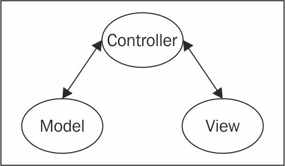
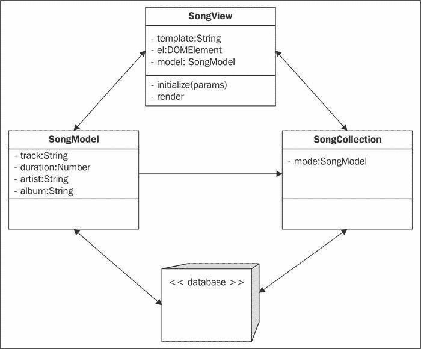
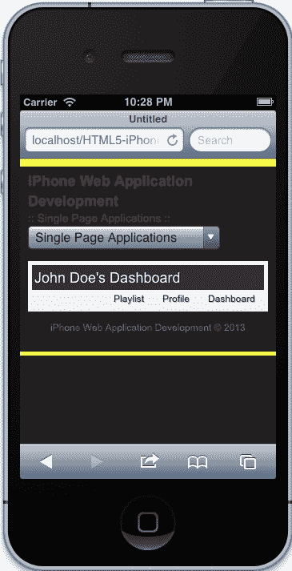
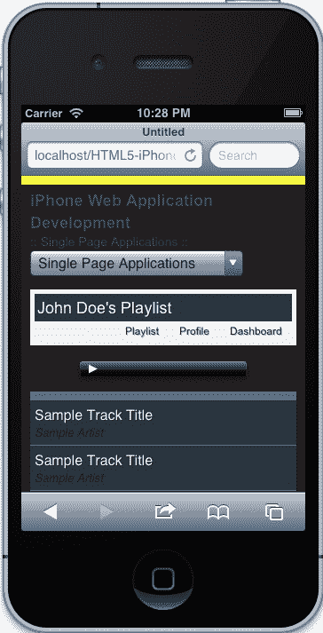
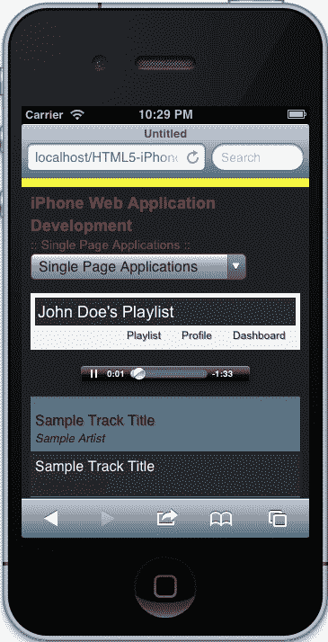
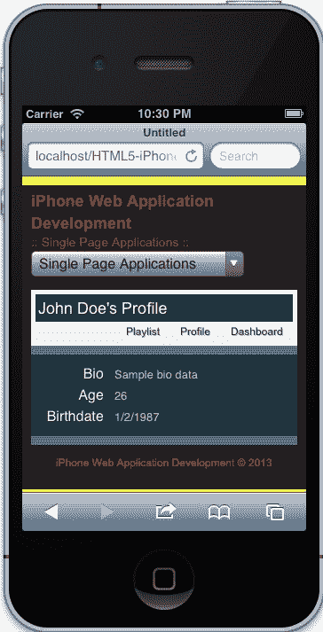

# 第七章：单页面应用程序

到目前为止，我们已经开发了包含相关静态内容的单独页面。在本章中，我们将通过深入研究单页面应用程序开发来提高水平。我们在许多网络应用程序中都见过这种情况，包括 Pandora、Mint 和 NPR。我们将介绍单页面应用程序开发的基础知识，从 MVC、Underscore 和 Backbone 的介绍到使用我们示例应用程序创建架构和利用本章第一部分教授的方法。完成本章后，您应该对单页面应用程序背后的概念有扎实的理解，这将使您能够继续扩展这些知识，并帮助您在构建复杂应用程序的道路上指引您。所以让我们首先学习 MVC。

在本章中，我们将涵盖：

+   MVC 架构

+   介绍`Underscore.js`

+   介绍`Backbone.js`

+   创建单页面应用程序

# 模型-视图-控制器或 MVC

**模型-视图-控制器**（**MVC**）是编程中广泛使用的设计模式。设计模式本质上是解决编程中常见问题的可重用解决方案。例如，**命名空间**和**立即调用函数表达式**是本书中经常使用的模式。MVC 是另一种模式，用于帮助解决分离表示和数据层的问题。它帮助我们将标记和样式保持在 JavaScript 之外；保持我们的代码有组织、清晰和可管理——这些都是创建单页面应用程序的基本要求。因此，让我们简要讨论 MVC 的几个部分，从模型开始。

## 模型

模型是一个对象的描述，包含与之相关的属性和方法。想想构成一首歌的内容，例如曲目的标题、艺术家、专辑、年份、时长等。在本质上，模型是您的数据的蓝图。

## 视图

视图是模型的物理表示。它基本上显示模型的适当属性给用户，页面上使用的标记和样式。因此，我们使用模板来填充我们的视图所提供的数据。

## 控制器

控制器是模型和视图之间的中介。控制器接受操作，并在必要时在模型和视图之间传递信息。例如，用户可以编辑模型上的属性；当这样做时，控制器告诉视图根据用户更新的信息进行更新。

## 关系

在 MVC 应用程序中建立的关系对于遵循设计模式至关重要。在 MVC 中，理论上，模型和视图永远不会直接交流。相反，控制器完成所有工作；它描述一个动作，当该动作被调用时，模型、视图或两者都相应地更新。这种类型的关系在下图中得以建立：



这个图解释了传统的 MVC 结构，特别是控制器和模型之间的通信是双向的；控制器可以向模型发送/接收数据，视图也可以如此。然而，视图和模型永远不会直接交流，这是有充分理由的。我们希望确保我们的逻辑得到适当的包含；因此，如果我们想要为用户操作正确地委派事件，那么这段代码将放入视图中。

然而，如果我们想要有实用方法，比如一个`getName`方法，可以适当地组合用户的名字和姓氏，那么这段代码将包含在用户模型中。最后，任何涉及检索和显示数据的操作都将包含在控制器中。

从理论上讲，这种模式有助于我们保持代码组织良好、清晰和高效。在许多情况下，这种模式可以直接应用，特别是在像 Ruby、PHP 和 Java 这样的许多后端语言中。然而，当我们开始严格将其应用于前端时，我们将面临许多结构性挑战。同时，我们需要这种结构来创建稳固的单页应用程序。接下来的章节将介绍我们将用来解决这些问题以及更多问题的库。

# Underscore.js 简介

我们在示例应用程序中将使用的库之一是`Underscore.js`。由于 Underscore 提供了许多实用方法，而不会扩展内置的 JavaScript 对象，如`String`，`Array`或`Object`，因此 Underscore 在过去几年变得非常流行。虽然它提供了许多有用的方法，但该套件还经过了优化并在许多最受欢迎的 Web 浏览器中进行了测试，包括 Internet Explorer。出于这些原因，社区广泛采用了这个库并不断支持它。

## 实现

在我们的应用程序中实现 Underscore 非常容易。为了让 Underscore 运行，我们只需要在页面上包含它，如下所示：

```html
<!DOCTYPE html>
<html>
    <head>
        <meta charset="utf-8">
        <meta http-equiv="X-UA-Compatible" content="IE=edge,chrome=1">
        <title></title>
        <meta name="description" content="">
        <meta name="viewport" content="width=device-width">
    </head>
    <body>
        <script src="img/jquery.min.js"></script>
        <script src="img/underscore-min.js"></script>
    </body>
</html>
```

一旦我们在页面上包含 Underscore，我们就可以使用全局范围内的`_`对象访问库。然后，我们可以通过`_.methodName`访问库提供的任何实用方法。您可以在线查看 Underscore 提供的所有方法（[`underscorejs.org/`](http://underscorejs.org/)），其中所有方法都有文档并包含它们的实现示例。现在，让我们简要回顾一些我们将在应用程序中使用的方法。

### _.extend

Underscore 中的`extend`方法与我们从`Zepto`中使用的`extend`方法非常相似（[`zeptojs.com/#$.extend`](http://zeptojs.com/#$.extend)）。如果我们查看 Underscore 网站上提供的文档（[`underscorejs.org/#extend`](http://underscorejs.org/#extend)），我们可以看到它接受多个对象，第一个参数是目标对象，一旦所有对象组合在一起就会返回。

> 将源对象的所有属性复制到目标对象中，并返回目标对象。它是按顺序的，因此最后一个源将覆盖先前参数中相同名称的属性。

例如，我们可以获取一个`Song`对象并创建一个实例，同时覆盖其默认属性。可以在以下示例中看到：

```html
<script>
    function Song() {
        this.track = "Track Title";
        this.duration = 215;
        this.album = "Track Album";
    };

    var Sample = _.extend(new Song(), {
        'track': 'Sample Title',
        'duration': 0,
        'album': 'Sample Album'
    });
</script>
```

如果我们记录`Sample`对象，我们会注意到它是从`Song`构造函数继承而来，并覆盖了默认属性`track`，`duration`和`album`。虽然我们可以使用传统的 JavaScript 来提高继承的性能，但使用`extend`方法可以帮助我们专注于交付。我们将在本章后面看看如何利用这种方法在我们的示例应用程序中创建基本架构。

### _.each

当我们想要迭代`Array`或`Object`时，`each`方法非常有用。实际上，这是我们可以在`Zepto`和其他流行库如`jQuery`中找到的另一种方法。尽管每个库的实现和性能略有不同，但我们将使用 Underscore 的`_.each`方法，以便我们可以在不引入新依赖项的情况下保持应用程序的架构。根据 Underscore 的文档（[`underscorejs.org/#each`](http://underscorejs.org/#each)），使用`_.each`与其他实现类似：

> 对元素列表进行迭代，依次将每个元素传递给迭代器函数。如果传递了上下文对象，则迭代器绑定到上下文对象。迭代器的每次调用都使用三个参数：（element，index，list）。如果列表是 JavaScript 对象，则迭代器的参数将是（value，key，list）。如果存在本地 forEach 函数，则委托给本地 forEach 函数。

让我们看一个在前一节中创建的代码中使用`_.each`的示例。我们将循环遍历`Sample`的实例，并记录对象的属性，包括曲目、持续时间和专辑。由于 Underscore 的实现允许我们像数组一样轻松地循环遍历`Object`，因此我们可以使用这种方法来迭代我们的`Sample`对象的属性：

```html
<script>
    function Song() {
        this.track = "Track Title";
        this.duration = 215;
        this.album = "Track Album";
    };

    var Sample = _.extend(new Song(), {
        'track': 'Sample Title',
        'duration': 0,
        'album': 'Sample Album'
    });

    _.each(Sample, function(value, key, list){
        console.log(key + ": " + value);
    });

</script>
```

我们的日志输出应该是这样的：

```html
track: Sample Title
duration: 0
album: Sample Album
```

正如你所看到的，使用 Underscore 的`each`方法与数组和对象非常容易。在我们的示例应用程序中，我们将使用这种方法来循环遍历对象数组以填充我们的页面，但现在让我们回顾一下我们将在 Underscore 库中使用的最后一个重要方法。

### _.template

Underscore 已经让我们非常容易地将模板集成到我们的应用程序中。默认情况下，Underscore 带有一个简单的模板引擎，可以根据我们的目的进行定制。实际上，它还可以预编译您的模板以便进行简单的调试。由于 Underscore 的模板化可以插入变量，我们可以利用它来根据需要动态更改页面。Underscore 提供的文档（[`underscorejs.org/#template`](http://underscorejs.org/#template)）有助于解释在使用模板时我们有哪些不同的选项：

> 将 JavaScript 模板编译为可以用于渲染的函数。用于从 JSON 数据源呈现复杂的 HTML 片段。模板函数既可以插入变量，使用<%= ... %>，也可以执行任意的 JavaScript 代码，使用<% ... %>。如果您希望插入一个值，并且它是 HTML 转义的，请使用<%- ... %>。当您评估一个模板函数时，传递一个数据对象，该对象具有与模板的自由变量对应的属性。如果您正在编写一个一次性的模板，可以将数据对象作为模板的第二个参数传递，以便立即呈现，而不是返回一个模板函数。

前端的模板化一开始可能很难理解，毕竟我们习惯于查询后端，使用 AJAX，并检索标记，然后在页面上呈现。如今，最佳实践要求我们使用发送和检索数据的 RESTful API。因此，理论上，您应该使用正确形成的数据并进行插值。但是，如果不是在后端，我们的模板在哪里？很容易，在我们的标记中：

```html
<script type="tmpl/sample" id="sample-song">
    <section>
        <header>
            <h1><%= track %></h1>
            <strong><%= album %></strong>
        </header>
    </section>
</script>
```

因为前面的脚本在浏览器中有一个已识别的类型，所以浏览器避免读取此脚本中的内容。而且因为我们仍然可以使用 ID 来定位它，所以我们可以获取内容，然后使用 Underscore 的`template`方法插入数据：

```html
<script>
    function Song() {
        this.track = "Track Title";
        this.duration = 215;
        this.album = "Track Album";
    };

    var Sample = _.extend(new Song(), {
        'track': 'Sample Title',
        'duration': 0,
        'album': 'Sample Album'
    });

    var template = _.template(Zepto('#sample-song').html(), Sample);

    Zepto(document.body).prepend(template);

</script>
```

运行页面的结果将是以下标记：

```html
<body>
    <section>
        <header>
            <h1>Sample Title</h1>
            <strong>Sample Album</strong>
        </header>
    </section>
    <!-- scripts and template go here -->
</body>
```

正如您所看到的，模板中的内容将被预先放置在主体中，并且数据将被插入，显示我们希望显示的属性；在这种情况下，歌曲的标题和专辑名称。如果这有点难以理解，不要太担心，当行业开始转向运行原始数据（`JSON`）的单页面应用程序时，我自己也很难理解这个概念。

目前，这些是我们将在本章中一直使用的方法。鼓励您尝试使用`Underscore.js`库，以发现一些更高级的功能，使您的生活更轻松，例如`_.map`，`_.reduce`，`_.indexOf`，`_.debounce`和`_.clone`。但是，让我们继续学习`Backbone.js`以及如何使用这个库来创建我们的应用程序。

# 介绍 Backbone.js

为了给我们的单页面应用程序添加结构，我们将使用`Backbone.js`，这是一个轻量级的框架，帮助我们应用 MVC 设计模式。`Backbone.js`是许多 MVC 类型框架之一，它帮助前端开发遵循将数据与视图或特别是 DOM 分离的最佳实践。除此之外，我们的应用程序可能会变得非常复杂。`Backbone.js`有助于缓解这些问题，并让我们快速上手。因此，让我们开始讨论 MVC 如何应用于这个框架。

## MVC 和 Backbone.js

有许多种类型的 JavaScript 框架以不同的方式应用 MVC，Backbone 也不例外。Backbone 实现了`Models`、`Views`、`Collections`和`Routers`；它还包括一个`Event`、`History`和`Sync`系统。正如你所看到的，Backbone 没有传统的 Controller，但我们可以将`Views`解释为控制器。根据 Backbone 的文档（[`backbonejs.org/#FAQ-mvc`](http://backbonejs.org/#FAQ-mvc)）：

> (…)在 Backbone 中，View 类也可以被视为一种控制器，分派源自 UI 的事件，HTML 模板作为真正的视图。

这种 MVC 实现可能有点令人困惑，但我们的示例应用程序将有助于澄清问题。现在让我们深入了解 Backbone 模型、视图和集合。在接下来的部分中，我们将介绍 Backbone 的每个部分是如何实现的，以及我们将用来构建应用程序的部分。

## Backbone 模型

在任何 MVC 模式中，模型都是至关重要的，包含数据和逻辑，包括属性、访问控制、转换、验证等。请记住，我们每天都在编写模型，事实上，我们在本书中创建了许多模型（`MediaElement`、`Video`、`Audio`等）。Backbone 模型类似于样板，它提供了我们否则必须自己构建的实用方法。

让我们以以下代码为例：

```html
function Song() {
    this.track = "Track Title";
    this.duration = 215;
    this.album = "Track Album";
};

Song.prototype.get = function(prop) {
    return this[prop] || undefined;
}

Song.prototype.set = function(prop, value) {
    this[prop] = value;

    return this;
}

var song = new Song();

song.get('album');
// "Track Album"

song.set('album', 'Sample Album');
// Song

song.get('album');
// "Sample Album"
```

在上面的示例中，我们创建了一个`Song`模型，与前一节中一样，它有几个属性（`track`、`duration`和`album`）和方法（`get`和`set`）。然后我们创建了`Song`的一个实例，并使用创建的方法来获取和设置`album`属性。这很棒；然而，我们需要手动创建这些方法。这不是我们想要做的；我们已经知道我们需要这些方法，所以我们只想专注于数据和扩展它。这就是 Backbone 模型发挥作用的地方。

让我们分析以下模型：

```html
var SongModel = Backbone.Model.extend({
    'defaults': {
        'track': 'Track Title',
        'duration': 215,
        'album': 'Track Album'
    }
});

var song = new SongModel();

song.get('album');
// "Track Album"

song.set('album', 'Sample Album');
// SongModel

song.get('album');
// "Sample Album"
```

上面的代码展示了我们快速开始编写应用程序的方式。在幕后，Backbone 是一个命名空间，并且有一个附加到它的模型对象。然后，使用 Underscore 的`extend`方法，我们返回一个`Backbone.Model`的副本，其中附加了默认属性，赋值给变量`SongModel`。然后我们做同样的事情，使用`get`和`set`，期望的输出在注释中。

如你所见，使用 Backbone 很容易入门，尤其是如果你只是想要一种方法来组织你的数据，而不是为每个应用程序构建自定义功能。现在让我们看看 Backbone 中的视图，以及它如何帮助我们将数据与 UI 分离。

## Backbone 视图

Backbone 视图与模型有些不同，它们更多的是为了方便。如果我们查看 Backbone 的文档并比较*Views*和*Models*部分，我们会发现 Views 更加简洁，但在组织我们的应用程序时也很有用。为了看到它们为什么仍然有用，让我们看下面的代码：

```html
var $section = $('section');

$section.on('click', 'a', doSomething);

function doSomething() {
    // we do something here
}
```

通常，这是我们在页面上缓存元素并为特定用户交互委托事件的方式。但是，如果可以减少设置工作呢？在下面的代码中，我们将上面的代码转换为典型的 Backbone 视图设置。

```html
var SongView = Backbone.View.extend({
    'el': document.querySelector('section'),

    'events': {
        'click a': 'doSomething'
    },

    'doSomething': function(e){
        console.log($(e.currentTarget).attr('href'));
    }
});

var view = new SongView();
```

正如您所看到的，Backbone 为您处理了设置工作。它在幕后为您缓存了所选元素并代理了事件。实际上，您在您的端上需要做的只是设置，然后快速进行下一步；现在您会注意到您的开发时间减少了，而您的效率增加了，这只是进入 Backbone 的初步步骤。当我们将模型和视图连接在一起时，魔术就会发生。要看到这一点，请看以下代码：

```html
var SongModel = Backbone.Model.extend({
    'defaults': {
        'track': 'Track Title',
        'duration': 215,
        'album': 'Track Album'
    }
});

var song = new SongModel();

var SongView = Backbone.View.extend({
    'el': document.querySelector('section'),

    'events': {
        'click a': 'doSomething'
    },

    'initialize': function() {
        this.model.on('change:track', this.updateSongTitle, this);

        this.$el.$songTrack = this.$el.find('.song-track');
        this.$el.$songTrack.text(this.model.get('track'));
    },

    'doSomething': function(e){
        console.log($(e.currentTarget).attr('href'));
    },

    'updateSongTitle': function() {
        this.$el.$songTrack.text(this.model.get('track'));
    }
});

var view = new SongView({
    'model': song
});

song.set('track', 'Sample Track');
// The DOM Updates with the right value
```

在这段代码片段中，我们最终将单个模型连接到一个视图。我们这样做的方式是将模型的实例传递给视图的实例：

```html
var view = new SongView({
    'model': song
});
```

当我们这样做时，我们将模型和视图关联起来。但我们还需要对该模型进行一些操作，通常我们希望显示与其关联的数据。因此，在这个例子中，我们创建了一个`initialize`方法，它被调用作为构造函数。在这个方法中，我们使用 Backbone 内置的事件系统来跟踪与模型的`track`属性相关的任何更改，并相应地调用`updateSongTitle`。在此过程中，我们通过将`this`作为第三个参数传递来更改事件处理程序的上下文，然后缓存显示歌曲轨道的元素。

最后，当您更改歌曲的`track`属性的实例时，DOM 会相应地更新。现在我们已经有了构建应用程序所需的基础。但让我们来看看 Backbone 集合，了解如何跟踪数据如何增加应用程序的效率。

## Backbone 集合

到目前为止，我们已经使用了单个模型，这很好，但在大多数情况下，我们使用数据集。这就是 Backbone 集合存在的原因，用于管理有序的模型集。Backbone 集合还与 Underscore 的方法相关联，使我们可以轻松高效地处理这些集合，而无需进行任何设置工作。

让我们看看以下代码：

```html
var SongModel = Backbone.Model.extend({
    'defaults': {
        'track': 'Track Title',
        'duration': 215,
        'album': 'Track Album'
    }
});

var SongCollection = Backbone.Collection.extend({
    'model': SongModel
});

var SongView = Backbone.View.extend({
    'el': document.querySelector('section'),

    'events': {
        'click a': 'doSomething'
    },

    'initialize': function() {
        this.collection.on('change', this.updateDetected, this);
    },

    'doSomething': function(e){
        console.log($(e.currentTarget).attr('href'));
    },

    'updateDetected': function() {
        console.log("Update Detected");
    }
});

var collection = new SongCollection();

for (var i = 0; i < 100; i++) {
    collection.add(new SongModel());
}

var view = new SongView({
    'collection': collection
});
```

这个示例代码与上一节中生成的代码非常相似。不同之处在于我们创建了一个`SongCollection`，它接受`SongModel`类型的模型。然后我们创建了这个集合的一个实例，通过我们的`for`循环向其中添加了 100 个模型，最后将集合附加到我们的视图上。

我们的视图也发生了变化，我们将`change`事件附加到我们的集合上，并创建了一个更通用的监听器，每当集合中的模型更新时都会被调用。因此，当我们执行以下代码时，视图会告诉我们有东西被更新了：

```html
collection.models[0].set('album', 'sample album');
// "Update Detected"
```

## 服务器端交互

看到 Backbone 应用程序如何连接到服务器并不容易，特别是因为前端代码中有很多事情要做。但是，如果您查看 Backbone.js 网站提供的文档（[`backbonejs.org/#Sync`](http://backbonejs.org/#Sync)），我们知道模型包含了操纵数据的所有功能。事实上，模型连接到数据库并可以与之同步。

> Backbone.sync 是 Backbone 每次尝试从服务器读取或保存模型时调用的函数。默认情况下，它使用（jQuery/Zepto）。ajax 来进行 RESTful JSON 请求并返回 jqXHR。您可以覆盖它以使用不同的持久化策略，例如 WebSockets、XML 传输或本地存储。

但是，模型并不是唯一可以连接到服务器的对象。随着文档的继续阅读，模型或集合可以开始同步请求并相应地与之交互。这与传统的 MVC 实现有些不同，特别是因为集合和模型可以与数据库交互。为了更好地显示 Backbone 对 MVC 的实现，提供的图像有助于显示不同类型对象之间的关系：



这基本上就是我们之前创建的东西；一个视图、模型和控制器。实现略有不同，但我们可以看到演示层和数据之间有明显的分离，因为视图从不直接与数据库交互。如果这有点令人困惑，那是因为它确实如此，这是另一种复杂性的层次，一旦理解，将有助于引导您编写优雅的代码。

您现在已经准备好使用`Underscore`、`Backbone`和`Zepto`创建一个单页应用程序。但是，有一个问题。这些库可以加快我们的开发速度并提高效率，但实际上并没有为我们的应用程序提供一个坚实的结构。这就是我们在示例应用程序中要解决的问题。接下来，我们将讨论单页应用程序所需的架构、实现和优化。

# 我们的示例应用程序

我们现在已经介绍了`Underscore.js`和`Backbone.js`，并且对这些库提供的内容以及它们如何帮助应用程序开发有了很好的理解。然而，我们仍然需要一种结构化应用程序的方式，以便它们可以轻松扩展，最重要的是，可以管理。因此，在本章的这一部分，我们将开始构建一个示例应用程序，将所有内容联系在一起，并帮助您快速构建单页应用程序。

## 应用程序架构

我们的示例应用程序将做两件事。一是允许我们查看用户信息，例如个人资料和仪表板。二是具有可以使用 HTML5 音频媒体元素收听的歌曲播放列表。我们可以将这些要求视为几乎是两个应用程序：一个用于管理用户数据的用户应用程序，另一个用于管理媒体播放的应用程序。但它们将相关联，以便用户将有与他们相关的歌曲播放列表。

### 基本示例架构

让我们开始实现前面的架构。首先，我们知道将有两个应用程序，类似于我们的`App`对象，因此让我们从定义这些开始：

+   `js/Music/`

+   `js/User/`

+   在 JavaScript（`js`）文件夹中，我们应该创建前面提到的两个文件夹：`Music`和`User`。这两个文件夹将分别包含用户和音乐应用程序的代码。为了帮助管理我们的 backbone 文件，我们将为每个创建`models`、`views`和`collections`文件夹。

+   `js/Music/`

+   `views/`

+   `models/`

+   `collections/`

+   `js/User/`

+   `views/`

+   `models/`

+   `collections/`

太棒了！现在我们可以开始创建一个主 JavaScript 文件，其中将包含每个应用程序的命名空间；每个命名空间分别为`User`和`Music`。

+   `js/Music/`

+   `views/`

+   `models/`

+   `collections/`

+   `Music.js`

+   `js/User/`

+   `views/`

+   `models/`

+   `collections/`

+   `User.js`

现在，我们的大多数视图都将具有非常熟悉的功能。例如，将有一个全局导航栏，其中包含三个链接，每个链接将启动每个部分的隐藏/显示，隐藏当前部分并显示下一个部分。我们不一定希望一遍又一遍地编写相同的代码，因此最好有一个基本视图，我们的应用程序可以从中继承。为此，我们将在我们的`App`文件夹中创建一个名为`views`的文件夹：

+   `js/App/`

+   `views/`

+   `BaseView.js`

好的，这基本上是我们这个示例应用程序的 JavaScript 框架。当然，还有其他设置方式，也许它们甚至更好—这很好。对于我们的目的，这符合要求，并有助于展示我们应用程序中的一些结构。现在，让我们开始查看我们的标记。

### 应用标记

让我们打开与本章相关的`index.html`文件；它应该位于`/singlepage/index.html`。现在，如果我们还没有这样做，让我们从更新站点的全局导航开始，这是我们之前为其他章节所做的。如果您需要参考资料，请查看本书提供的上一章的完成源代码，并根据需要更新标记。

更新后，我们的标记应该看起来像这样：

```html
<!DOCTYPE html>
<html class="no-js">
<head>
    <!-- Meta Tags and More Go Here -->

  <link rel="stylesheet" href="../css/normalize.css">
  <link rel="stylesheet" href="../css/main.css">
    <link rel="stylesheet" href="../css/singlepage.css">
  <script src="img/modernizr-2.6.1.min.js"></script>
</head>
  <body>
    <!-- Add your site or application content here -->
        <div class="site-wrapper">
            <header>
                <hgroup>
                    <h1>iPhone Web Application Development</h1>
                    <h2>Single Page Applications</h2>
                </hgroup>
                <nav>
                    <select>
                        <!-- Options Go Here -->
                    </select>
                </nav>
            </header>
            <footer>
                <p>iPhone Web Application Development &copy; 2013</p>
            </footer>
        </div>

        <!-- BEGIN: LIBRARIES / UTILITIES-->
    <script src="img/zepto.min.js"></script>
        <script src="img/underscore-1.4.3.js"></script>
        <script src="img/backbone-0.9.10.js"></script>
    <script src="img/helper.js"></script>
        <!-- END: LIBRARIES / UTILITIES-->
        <!-- BEGIN: FRAMEWORK -->
        <script src="img/App.js"></script>
        <script src="img/App.Nav.js"></script>
        <!-- END: FRAMEWORK -->
  </body>
</html>
```

现在，让我们开始修改这段代码以适应我们的应用程序。首先，让我们在标题后面添加一个`div`，类名为`content`：

```html
 <div class="site-wrapper">
    <header>
        <hgroup>
            <h1>iPhone Web Application Development</h1>
            <h2>Single Page Applications</h2>
        </hgroup>
        <nav>
            <select>
                <!-- Options Go Here -->
            </select>
        </nav>
    </header>
    <div class="content"></div>
    <footer>
        <p>iPhone Web Application Development &copy; 2013</p>
    </footer>
</div>
```

当我们完成这些工作后，让我们修改脚本，包括我们之前创建的整个应用程序。这意味着我们包括了`Music`和`User`应用程序脚本，以及`BaseView`。我们的标记脚本部分应该看起来像这样：

```html
<!-- BEGIN: LIBRARIES / UTILITIES-->
<script src="img/zepto.min.js"></script>
<script src="img/underscore-1.4.3.js"></script>
<script src="img/backbone-0.9.10.js"></script>
<script src="img/helper.js"></script>
<!-- END: LIBRARIES / UTILITIES-->
<!-- BEGIN: FRAMEWORK -->
<script src="img/App.js"></script>
<script src="img/App.Nav.js"></script>
<script src="img/BaseView.js"></script>
<!-- END: FRAMEWORK -->
<!-- BEGIN: MUSIC PLAYLIST APPLICATION -->
<script src="img/Music.js"></script>
<script src="img/SongModel.js"></script>
<script src="img/SongCollection.js"></script>
<script src="img/SongView.js"></script>
<script src="img/PlayListView.js"></script>
<script src="img/AudioPlayerView.js"></script>
<!-- END: MUSIC PLAYLIST APPLICATION -->
<!-- BEGIN: USER APPLICATION -->
<script src="img/User.js"></script>
<script src="img/UserModel.js"></script>
<script src="img/DashboardView.js"></script>
<script src="img/ProfileView.js"></script>
<!-- END: USER APPLICATION -->
<script src="img/main.js"></script>
<script> Backbone.history.start(); </script>
<!-- END: BACKBONE APPLICATION -->
```

### 注意

请注意，我们已经启动了 Backbone 历史 API。虽然我们还没有全面讨论这一点，但这对于保持应用程序状态至关重要。Backbone 中历史 API 的实现细节超出了本书的范围，但对于那些希望利用 Backbone 进行离线存储的人来说，这是非常鼓励的。现在，请记住这对于路由是至关重要的。

#### 创建模板

现在我们的标记接近完成，但我们还剩下应用程序的其余部分将由什么组成；这就是模板化将发挥作用的地方。下一步是包括我们应用程序所需的模板，包括音频播放器视图、播放列表、歌曲、仪表板、个人资料和共享导航视图。那么如何在静态 HTML 页面上指定模板呢？像这样：

```html
<script type="tmpl/Music" id="tmpl-audioplayer-view">
    <section class="view-audioplayer">
        <header>
            <h1>Audio Player</h1>
        </header>
        <div class="audio-container">
            <audio preload controls>
                <source src="img/<%= file %>" type='audio/mpeg; codecs="mp3"'/>
                <p>Audio is not supported in your browser.</p>
            </audio>
        </div>
    </section>
</script>
```

您可能想知道为什么这不会在浏览器中引起任何验证错误或代码执行错误。好吧，为了帮助澄清事情，我们的`script`标签的`type`属性是一个不受支持的 MIME 类型，因此浏览器会忽略`script`块中的所有内容（[`www.whatwg.org/specs/web-apps/current-work/multipage/scripting-1.html#script-processing-prepare`](http://www.whatwg.org/specs/web-apps/current-work/multipage/scripting-1.html#script-processing-prepare)）。因为块内的代码不会被执行，所以我们可以包含我们的 HTML 模板以供以后使用。请记住，我们已经附加了一个 ID，我们可以使用 Zepto 来定位这个元素。还要注意音频元素的来源，特别是`<%= file %>`。这将由 Underscore 的`template`方法用于插入模板本身传递的数据。我们很快就会讨论到这一点，但现在知道这就是我们可以设置模板的方式。

好的，现在我们知道如何创建模板，让我们在包含我们应用程序脚本之前实现以下模板。我们可以包括音频播放器的前一个模板，然后我们可以包括以下模板：

```html
<!-- Playlist View -->
<script type="tmpl/Music" id="tmpl-playlist-view">
    <section class="view-playlist">
        <header>
            <h1><%= name + "'s" %> Playlist</h1>
            <% print(_.template($('#tmpl-user-nav').html(), {})); %>
        </header>
        <ul></ul>
    </div>
</script>
```

在播放列表视图模板中，我们有一些非常有趣的东西。看一下`h1`标签后面的代码。我们在这里看到 Underscore 库的`template`方法；它接受一个参数，这个参数将是模板`#tmpl-user-nav`的 HTML 字符串，我们还没有定义，第二个参数是一个空对象。这个例子展示了在模板中使用模板的用法，有点像潜行，但希望不会太可怕。请记住，我们提到我们的应用程序中将包含全局导航；前面的方法帮助我们编写一次代码，保持我们的代码清洁、可管理和高效。

现在，我们的播放列表仍然不包含歌曲列表。这是因为它将是动态的，基于歌曲数据集；这就是为什么在播放列表视图中有一个空的无序列表。但我们的歌曲会是什么样子呢？传统上，我们只需在 JavaScript 中创建一个列表（`li`）元素，但是使用模板，我们不再需要这样做——我们可以将标记保留在逻辑之外：

```html
<!-- Individual Song View -->
<script type="tmpl/Music" id="tmpl-song-view">
    <li class="view-song">
        <strong><%= track %></strong>
        <em><%= artist %></em>
    </li>
</script>
```

现在看看将标记保留在脚本之外是多么容易？在这个模板中，我们遵循相同的基本原则：定义一个包含标记的脚本块，并创建将插值到其中的标记，以包含我们想要的数据。在这种情况下，我们希望将曲目和艺术家输出到它们自己的元素中。现在让我们创建用户的仪表板：

```html
<script type="tmpl/User" id="tmpl-user-dashboard">
    <section class="view-dashboard">
        <header>
            <h1><%= name + "'s" %> Dashboard</h1>
            <% print(_.template($('#tmpl-user-nav').html(), {})); %>
        </header>
    </section>
</script>
```

再次，和以前一样。实际上，我们正在重复使用在播放列表视图中显示全局导航的相同方法。到目前为止，你已经注意到每个模板都有一个特定的 ID，并且根据约定，我们已经根据其应用程序定义了每个`script`块的类型，例如`tmpl/User`用于用户应用程序，`tmpl/Music`用于音乐应用程序。现在让我们来看一下结合了前面两种方法的个人资料视图。

```html
<script type="tmpl/User" id="tmpl-user-profile">
    <section class="view-profile">
        <header>
            <h1><%= name + "'s" %> Profile</h1>
            <% print(_.template($('#tmpl-user-nav').html(), {})); %>
        </header>
        <dl>
            <dt>Bio</dt>
            <dd><%= bio %></dd>
            <dt>Age</dt>
            <dd><%= age %></dd>
            <dt>Birthdate</dt>
            <dd><%= birthdate.getMonth() + 1 %>/<%= birthdate.getDate() %>/<%= birthdate.getFullYear() %></dd>
        </dl>
    </section>
</script>
```

在这个视图中，全局导航被打印出来，并且数据被插值。正如你所看到的，模板中可以做任何事情。但它也可以是我们应用程序的全局导航这样简单的东西：

```html
<script type="tmpl/User" id="tmpl-user-nav">
    <a href="#dashboard">Dashboard</a>
    <a href="#profile">Profile</a>
    <a href="#playlist">Playlist</a>
</script>
```

在这个最后的例子中，没有发生复杂的事情，实际上就是我们一直期待的全局导航，结果是——它只是标记。现在，你可能会想为什么不在 DOM 中创建所有这些，隐藏它，然后使用`Zepto`或`jQuery`中的内置选择器引擎填充所需的信息。老实说，这是一个很好的问题。但是有一个主要原因，性能。使用这些引擎是昂贵的，甚至是内置方法`querySelector`和`querySelectorAll`。我们不想触及 DOM，因为这是一个繁重的操作，特别是对于处理大数据集的大规模应用程序。最终，仅仅为了数据填充或存储而进行 DOM 操作是混乱的。不要这样做，将 DOM 用于数据而不是最佳实践。

我们的模板已经完成，这就结束了我们应用程序的标记。现在我们转向有趣的部分，我们的脚本。接下来的部分将会相当复杂和相当具有挑战性，但我保证当我们完成时，你将成为一个单页应用程序的专家，并且准备快速创建你自己的应用程序。第一次总是艰难的，但坚持下去，你将会收获回报。

### 应用程序脚本

在本节中，我们将介绍使我们的应用程序工作所需的脚本。我们将从审查`BaseView`开始，这个视图包含了继承视图（`PlayListView`、`ProfileView`和`DashboardView`）中的共享功能。然后我们将创建我们的音乐和用户应用程序，每个应用程序都有它们相对应的模型、视图和集合。

#### BaseView

让我们开始查看我们的脚本，从我们在`App`命名空间下创建的`BaseView`文件开始（`js/App/views/BaseView.js`）。在这个文件中，我们将创建`BaseView`类，它将扩展 Backbone 的通用`View`类。`BaseView`将如下所示：

```html
(function(window, document, $, Backbone, _){

  var BaseView = Backbone.View.extend({

  });

  // Expose the User Object
  window.App.BaseView = BaseView;

}(window, document, Zepto, Backbone, _));
```

这个类遵循了我们在之前章节中编写的其他 JavaScript 的完全相同的模式，这里唯一的区别是包括了`Backbone`和`Undescore`，以及我们如何使用`window.App.BaseView = BaseView`来公开`BaseView`类。

现在，请跟着我。我们将创建几种方法，这些方法将包含在扩展`BaseView`类的任何对象中。这些方法将包括`show`、`hide`、`onProfileClick`、`onPlaylistClick`、`onDashboardClick`和`onEditClick`。正如你可能已经猜到的，其中一些方法将是事件处理程序，用于导航到我们应用程序的某些部分。查看以下代码以了解实现：

```html
(function(window, document, $, Backbone, _){

  var BaseView = Backbone.View.extend({
    'hide': function() {
      this.$template.hide();
    },

    'show': function() {
      this.$template.show();
    },

    'onProfileClick': function(e) {
      e.preventDefault();

      User.navigate('profile/' + this.model.get('username'), { 'trigger': true });
    },

    'onPlaylistClick': function(e) {
      e.preventDefault();

      Music.navigate('playlist', { 'trigger': true });
    },

    'onDashboardClick': function(e) {
      e.preventDefault();

      User.navigate('dashboard', { 'trigger': true });
    },

    'onEditClick': function() {
      console.log('onEditClick');
    }
  });

  // Expose the User Object
  window.App.BaseView = BaseView;

}(window, document, Zepto, Backbone, _));
```

现在，你可能注意到这里写的对象尚未创建，比如`$template`、`User`和`Music`对象。我们将在几个步骤后返回到这一点，但请记住，`this.$template`将指的是扩展`BaseView`的实例，而`User`和`Music`对象将是使用内置的 backbone 方法`navigate`来改变我们应用程序在 URL 中的位置并存储用户交互历史的路由器。为了更好地理解这个类`BaseView`是如何被使用的，让我们开始创建`Music.js`中`Music`对象的代码（`js/Music/Music.js`）。

#### 音乐应用程序

现在让我们开始创建我们应用程序的第一部分，音乐应用程序。音乐和用户应用程序都是分开的，以增加更高级别的可维护性和重用性。从音乐应用程序开始，我们将创建适当的路由器、集合、模型和视图。

##### 路由器

我们的音乐应用程序始于`Music.js`文件中定义的`Music`类，该文件位于`js/Music/`目录下。在这个文件中，我们将扩展 Backbone 的`Router`类，包含我们音乐应用程序的路由、用于模型和集合的示例数据对象，以及当请求播放列表时的事件处理程序。首先，让我们从定义类开始：

```html
(function(window, document, $, Backbone, _){

  var Music = Backbone.Router.extend({
    // Application Routes
    'routes': {
      'playlist': 'setupPlaylist',
      'playlist/:track': 'setupPlaylist'
    }
  });

  // Expose the Music Object
  window.Music = new Music();

}(window, document, Zepto, Backbone, _));
```

按照我们在`BaseView`类中建立的模式，我们在`Backbone`中扩展`Router`类，并定义一些默认路由。这两个路由包括一个常规播放列表路由和一个包含播放列表和曲目编号的替代路由。当调用这两个路由时，都将调用我们接下来将定义的`setupPlaylist`方法：

```html
'setupPlaylist': function(track){
  if (!this.songCollection) {
    // Create song collection on the instance of Music
    this.songCollection = new this.SongCollection(this.songs);
  }

  if (!this.playListView) {
    // Create song list view on the instance of Music
    this.playListView = new this.PlayListView({
      'el': document.querySelector('.content'),
      'collection': this.songCollection,
      'model': new User.UserModel()
    });
  } else {
    this.playListView.show();
    this.playListView.audioPlayerView.show();
  }

  if (track) {
    this.playListView.updateTrack(track);
  }
}
```

如果这段代码让你有点畏首畏尾，那没关系，它实际上非常简单。首先，我们检查是否已经使用`Music`的实例初始化了一个`songCollection`对象。如果没有，我们将使用一组歌曲的示例数据对象来创建一个。接下来，我们做同样的事情，检查`playListView`对象是否已经创建；如果没有，我们继续创建它。否则，我们只是显示播放列表和与之相关的音频播放器。最后，我们检查是否传递了曲目编号（与我们创建的第二个路由相关）；如果有曲目编号，我们将更新`playListView`以反映所选的曲目。

让我们专注于`playListView`的初始化：

```html
this.playListView = new this.PlayListView({
  'el': document.querySelector('.content'),
  'collection': this.songCollection,
  'model': new User.UserModel()
});
```

尽管我们尚未正式创建`PlayListView`类，但我们可以回顾它是如何初始化的。在这种情况下，我们在`Music`的实例上附加了一个`playListView`属性，即`this.playListView`。这个属性将是`PlayListView`的一个实例（`new PlayListView({})`）。这个`PlayListView`的新实例将接受一个普通对象，其中包含三个属性：一个定义为`el`的元素，一个集合，以及一个`UserModel`的实例，这个实例尚未定义。

这里我们需要做的最后一件事是包括一个`initialize`方法，该方法将创建一个示例数据对象（`this.songs`），并监听播放列表路由的调用。当我们调用播放列表路由或导航到它时，我们希望同时隐藏个人资料和仪表板；我们将在`routes`监听器中手动执行这一操作：

```html
'initialize': function() {
  this.songs = [{
      'duration': 251,
      'artist': 'Sample Artist',
      'added': new Date(),
      'track': 'Sample Track Title',
      'album': 'Sample Track Album'
    }, {
      'duration': 110,
      'artist': 'Sample Artist',
      'added': new Date(),
      'track': 'Sample Track Title',
      'album': 'Sample Track Album'
    }, {
      'duration': 228,
      'artist': 'Sample Artist',
      'added': new Date(),
      'track': 'Sample Track Title',
      'album': 'Sample Track Album'
    }
  ];

  this.on('route:setupPlaylist', function() {
    // This should be more dynamic, but fits our needs now
    // ---
    if (User.profileView) {
      User.profileView.hide();
    }

    if (User.dashboardView) {
      User.dashboardView.hide();
    }
    // ---
  });
},
```

好的，我们在这里创建了`initialize`方法，当创建`Music`的实例时会调用这个方法。这很好，因为在这个方法中，我们可以处理任何设置工作，比如创建示例数据对象。示例数据对象是一个对象数组，然后将被`SongCollection`类转换为模型：

```html
'setupPlaylist': function(track){
  if (!this.songCollection) {
    // Create song collection on the instance of Music
    this.songCollection = new this.SongCollection(this.songs);
  }
  // Some code defined after
}
```

看起来很熟悉吧？现在我们正在收尾。我们还没有创建`SongCollection`类，但是 Backbone 的文档中指出，如果将数组传递给集合，它会自动转换为集合中指定的模型（将在未来的步骤中描述）。

这个`initialize`方法做的最后一件事是，在播放列表的路由上定义一个监听器（`this.on('route:setupPlaylist', function() {});`）。事件处理程序然后隐藏了已经创建的个人资料和仪表板。另外，请注意，我们使用`route:setupPlaylist`指定了路由，但我们也可以使用`route`来监听任何路由。

我知道这是很多东西要消化的，但我们现在将从这个`Music`类开始连接这些点，从集合开始，然后转向模型，最后是视图。这个类是其他所有需要构建的东西的基础，以便拥有一个完全功能的音乐应用程序，并提供我们开发的蓝图。

##### 集合

我们音乐应用程序的集合很简单。遵循我们之前所做的基本模板，我们将创建一个包含`SongCollection`类的闭包。然后我们将定义`SongCollection`应该保持的模型类型。最后，我们将把这个类暴露给我们的`Music`对象。

当我们完成了实现这些要求后，我们的类看起来是这样的：

```html
(function(window, document, $, Backbone, _){

  var SongCollection = Backbone.Collection.extend({
    'model': window.Music.SongModel
  });

  window.Music.SongCollection = SongCollection;

}(window, document, Zepto, Backbone, _));
```

看起来多简单啊？现在我们知道这个集合只跟踪`SongModel`类型的模型，并且如果传递一个数组，它将把包含的对象转换为`SongModel`类型。这就是这个类现在要做的全部。当然，您可以扩展它并尝试使用几种方法，比如比较器，这个类可以利用；但现在，这就是我们需要的全部。

##### 模型

我们的`SongModel`将描述我们试图跟踪的数据类型。这个模型还将包含一个单一的方法，该方法将以秒为单位的持续时间作为属性，并将其以分钟返回。当然，我们有选择在模型初始化时准备我们的模型，但现在我们将保持简单。

`SongModel`，当写出来时，将是这样的：

```html
(function(window, document, $, Backbone, _){

  var SongModel = Backbone.Model.extend({
    'defaults': {
      // in seconds
      'duration': 0,
      'artist': '',
      'added': 0,
      'track': '',
      'album': ''
    },

    'initialize': function() {

    },

    'getDurationInMinutes': function() {
      var duration = this.get('duration');

      if (duration === 0) {
        return false;
      }

      return this.get('duration') / 60;
    }
  });

  window.Music.SongModel = SongModel;

}(window, document, Zepto, Backbone, _));
```

从前面的代码中，我们可以推断出`SongModel`将具有属性`duration`、`artist`、`added`、`track`和`album`。每个属性的默认值都是空的`String`或`0`。我们还可以注意到，每个模型都将有一个名为`getDurationInMinutes`的方法，可以被调用，并返回该模型的持续时间（以分钟为单位）。同样，`SongModel`类遵循相同的基本架构和最佳实践，返回给`Music`对象。最后，我们准备好查看这个音乐应用程序的视图。

##### 视图（们）

在这一部分，我们将审查三个单独的视图，包括播放列表、歌曲和音频播放器视图。每个视图呈现音乐应用程序的一个单独部分，除了播放列表，它还呈现音频播放器和每个单独的歌曲。所以，让我们从播放列表视图开始。

###### 播放列表视图

我们希望播放列表视图做一些事情，但我们将一步一步来。首先，让我们创建`PlayListView`类，它将扩展我们已经创建的`BaseView`类。

```html
(function(window, document, $, Backbone, _){

  var PlayListView = App.BaseView.extend({
    // Code goes here
  });

  // Expose the PlayListView Class
  window.Music.PlayListView = PlayListView;

}(window, document, Zepto, Backbone, _));
```

接下来，我们希望`PlayListView`类引用正确的模板。

```html
(function(window, document, $, Backbone, _){

  var PlayListView = App.BaseView.extend({
    'template': _.template($('#tmpl-playlist-view').html())
  });

  // Expose the PlayListView Class
  window.Music.PlayListView = PlayListView;

}(window, document, Zepto, Backbone, _));
```

通过将模板作为属性包含进来，我们可以很容易地使用`this.template`来引用它。请记住，在这个阶段我们还没有处理模板，我们只是简单地使用了 Underscore 的`template`方法来检索标记。接下来，我们想要为用户点击歌曲时定义一个事件监听器。

```html
(function(window, document, $, Backbone, _){

  var PlayListView = App.BaseView.extend({
    'template': _.template($('#tmpl-playlist-view').html()),

    'events': {
      'click .view-song': 'onSongClicked'
    }
  });

  // Expose the PlayListView Class
  window.Music.PlayListView = PlayListView;

}(window, document, Zepto, Backbone, _));
```

在这一步中，我们告诉视图将我们创建的所有事件委托给视图的元素。在这个事件对象中，我们监听一个带有类名`.view-song`的元素上的点击事件。当点击这个元素时，我们想要调用`onSongClicked`事件处理程序。让我们接下来定义这个事件处理程序。

```html
(function(window, document, $, Backbone, _){

  var PlayListView = App.BaseView.extend({
    'template': _.template($('#tmpl-playlist-view').html()),

    'events': {
      'click .view-song': 'onSongClicked'
    },

    'onSongClicked': function(e) {
      var $target = $(e.currentTarget);

      this.$el.find('.active').removeClass('active');

      $target.addClass('active');

      Music.navigate('playlist/' + ($target.index() + 1), { 'trigger': true });
    }
  });

  // Expose the PlayListView Class
  window.Music.PlayListView = PlayListView;

}(window, document, Zepto, Backbone, _));
```

在前面的代码中定义的事件处理程序切换活动类，然后告诉`Music`路由器导航到播放列表路由，告诉它触发路由事件并传递曲目的索引。通过这样做，我们的路由被调用，传递了一个曲目，播放列表更新了。然而，我们仍然没有定义`updateTrack`方法。让我们在我们的类中包含以下方法：

```html
(function(window, document, $, Backbone, _){

  var PlayListView = App.BaseView.extend({
    'template': _.template($('#tmpl-playlist-view').html()),

    'events': {
      'click .view-song': 'onSongClicked'
    },

    'onSongClicked': function(e) {
      var $target = $(e.currentTarget);

      this.$el.find('.active').removeClass('active');

      $target.addClass('active');

      Music.navigate('playlist/' + ($target.index() + 1), { 'trigger': true });
    },

    'updateTrack': function(track) {
      this.audioPlayerView.render(track);

      this.setActiveSong(track || 1);
    }
  });

  // Expose the PlayListView Class
  window.Music.PlayListView = PlayListView;

}(window, document, Zepto, Backbone, _));
```

现在我们有了`updateTrack`方法，这本质上是告诉音频播放器的视图渲染它收到的曲目。不幸的是，我们的代码还没有准备好运行，因为我们还没有创建这个方法。另外，下面的方法`setActiveSong`也没有定义，所以我们现在需要这样做：

```html
(function(window, document, $, Backbone, _){

  var PlayListView = App.BaseView.extend({
    'template': _.template($('#tmpl-playlist-view').html()),

    'events': {
      'click .view-song': 'onSongClicked'
    },

    'onSongClicked': function(e) {
      var $target = $(e.currentTarget);

      this.$el.find('.active').removeClass('active');

      $target.addClass('active');

      Music.navigate('playlist/' + ($target.index() + 1), { 'trigger': true });
    },

    'setActiveSong': function(track) {
      this.$el.find('.active').removeClass('active');

      this.$el.find('.view-song').eq(track - 1).addClass('active');

      return this;
    },

    'updateTrack': function(track) {
      this.audioPlayerView.render(track);

      this.setActiveSong(track || 1);
    }
  });

  // Expose the PlayListView Class
  window.Music.PlayListView = PlayListView;

}(window, document, Zepto, Backbone, _));
```

我们现在创建了`setActiveSong`方法，基本上是根据 URL 的曲目编号切换活动类。我们可能可以推断并在这里为歌曲创建一个通用的切换，但目前这满足了标准。但我们还没有完成，我们仍然需要初始化这个类并适当地渲染它。让我们看看这个类现在需要什么：

```html
(function(window, document, $, Backbone, _){

  var PlayListView = App.BaseView.extend({
    // code before

    'initialize': function() {
      this.render();
    },

    'render': function() {
      var i = 0,
        view,
        that = this;

      // Create the template
      this.$template = $(this.template(this.model.attributes));

      // Append the template
      this.$el.append(this.$template);

      // Create the audio player
      if(!this.audioPlayerView) {
        this.audioPlayerView = new Music.AudioPlayerView({
                      'el': this.el.querySelector('.view-playlist'),
                      'model': new User.UserModel()
                    });
      }

      this.collection.each(function(element, index, list){
        var view  = new Music.SongView({
          'el': that.$template.find('ul'),
          'model': element
        });
      });

      return this;
    },

    // code after 
  });

  // Expose the PlayListView Class
  window.Music.PlayListView = PlayListView;

}(window, document, Zepto, Backbone, _));
```

前面的代码完成了这个类，但在我们继续之前，让我们看看这里发生了什么。首先，我们定义了一个`initialize`方法。这个方法将在创建这个类的实例后被调用，因此`render`方法也将被调用。通常，在 Backbone 中，`render`方法确切地做了函数被调用的事情——渲染视图。

定义的`render`方法做了一些事情；首先，它使用传入的模型编译我们的模板。之前我们看到了以下代码：

```html
// Create song list view on the instance of Music
this.playListView = new this.PlayListView({
  'el': document.querySelector('.content'),
  'collection': this.songCollection,
  'model': new User.UserModel()
});
```

正如我们所看到的，创建了一个新的`UserModel`并将其传递给`PlayListView`，并且这个实例用于填充播放列表的模板。一旦编译完成，我们使用 Zepto 的`append`方法附加编译后的模板。你可能会问，它附加到什么上面？好吧，这个类的上面初始化正在寻找一个类为`content`的元素，我们在页面的标题元素之后定义了它。因此，`PlayListView`将附加到这个类为`content`的`div`上。

当模板附加完成后，我们检查音频播放器视图是否已经创建。如果没有，那么我们就创建它：

```html
if(!this.audioPlayerView) {
  this.audioPlayerView = new Music.AudioPlayerView({
    'el': this.el.querySelector('.view-playlist'),
    'model': new User.UserModel()
  });
}
```

最后，一旦检查音频播放器视图，我们就可以开始有趣的事情了。在最后一部分中，我们循环遍历发送过来的集合，这是`SongCollection`的一个实例，与`Music.js`中创建的相同数据。当我们遍历集合中的每个模型时，我们每次都创建一个`SongView`的实例，将编译模板的无序列表元素传递给它，并传递当前模型。

现在，如果这没有让你大吃一惊，我不知道还有什么能让你大吃一惊。无论如何，我希望你仍然能接受这个挑战，因为我们还有两个视图需要看一看：`AudioPlayerView`和`SongView`。不过不要失去希望，我们已经度过了最大的挑战，准备好迎接新的挑战。

###### 音频播放器视图

接下来我们要构建我们的`AudioPlayerView`。这个视图需要使用我们之前创建的模板，用曲目编号填充它，并在直接访问 URL 时加载它，例如`/#playlist/2`。我们还需要覆盖扩展的`BaseView`上的一个方法，需要被覆盖的方法是`onDashboardClick`。这是因为它要求我们隐藏播放列表，然后导航到仪表板。所以在最基本的层面上，这个类将如下所示：

```html
(function(window, document, $, Backbone, _){

  var AudioPlayerView = App.BaseView.extend({
    'template': _.template($('#tmpl-audioplayer-view').html()),

    'events': {
      'click a[href="#dashboard"]': 'onDashboardClick'
    },

    'initialize': function(){
      this.render();
    },

    'render': function(file){
      // Put our rendering code here
    },

    'onDashboardClick': function() {
      this.hide();
      Music.playListView.hide();

      User.navigate('/dashboard', { 'trigger': true });
    }
  });

  window.Music.AudioPlayerView = AudioPlayerView;

}(window, document, Zepto, Backbone, _));
```

正如我们所看到的，前面段落中列出的所有要求都已经在`AudioPlayerView`的基类中得到满足。然而，我们需要渲染出这个视图，并用 URL 提供的数据填充它。为了做到这一点，我们需要编写我们的`render`方法如下：

```html
'render': function(file){
  var audioElement;

  if (file) {
    audioElement = this.$el.find('audio')[0];

    // Must be made on the audio element itself
    audioElement.src = '../assets/' + 'sample' + (file || 1) + '.mp3';
    audioElement.load();
    audioElement.play();

    return this;
  }

  this.$template = $(this.template({ 'file': 'sample' + (file || 1) + '.mp3', 'name': this.model.get('name') }));
  this.$template.find('audio')[0].volume = 0.5;

  this.$el.find('header').after(this.$template);

  return this;
},
```

与我们为播放列表视图编写的先前的`render`方法类似，`render`方法检查是否传入了文件或数字。如果有，我们将使用传入的内容填充我们的模板中的音频元素。接下来，我们编译我们的模板，然后将音量设置为`0.5`，并将播放器附加到`PlayListView`的标题后面。如果我们回顾一下我们如何初始化这个类，我们会注意到音频播放器视图委托给了播放列表视图元素（在`PlayListView`内部）：

```html
this.audioPlayerView = new Music.AudioPlayerView({
  'el': this.el.querySelector('.view-playlist'),
  'model': new User.UserModel()
});
```

###### 歌曲视图

我们音乐应用程序的最后一部分是`SongView`。让我们快速回顾一下这个视图的要求并看看它的实现。对于这个视图，我们再次想设置我们的模板。当我们初始化这个视图时，我们希望在传入的模型上附加一个事件处理程序，因此如果模型被更新，视图将自动渲染更新。这个视图的`render`方法应该基本上使用模型的属性编译模板，然后将自己附加到为这个视图设置的元素上。

当我们完成了前面的要求实现后，视图应该看起来有点像这样：

```html
(function(window, document, $, Backbone, _){

  var SongView = App.BaseView.extend({
    'template': _.template($('#tmpl-song-view').html()),

    'initialize': function() {
      // Listen to when a change happens on the model assigned this view
      this.listenTo(this.model, 'change', this.render);

      this.render();
    },

    'render': function() {
      this.$el.append(this.template(this.model.attributes));

      return this;
    }
  });

  // Expose the SongView
  window.Music.SongView = SongView;

}(window, document, Zepto, Backbone, _));
```

正如我们所看到的，我们遵循了先前视图实现中设定的标准。唯一的区别是在模型的更改事件上添加了事件侦听器。让我们回顾一下`PlayListView`中这个视图是如何初始化的：

```html
this.collection.each(function(element, index, list){
  var view  = new Music.SongView({
    'el': that.$template.find('ul'),
    'model': element
  });
});
```

现在我们完全理解了音乐应用程序是如何工作的。在这一点上，我们的页面可以仅通过这种实现来运行；但是，我不建议这样做，因为我们还没有创建用户应用程序，错误将会出现。但是我们现在知道，我们的路由定义了应用程序中的操作，视图是实现模型和集合的表示层。模型是我们应用程序的核心，以可管理的方式包含我们需要的所有数据。最后，集合帮助我们管理模型的更大数据集，因为我们可以将这些传递到视图中，视图本身可以管理这些数据的呈现，这对于大型应用程序来说是理想的。

这个过程的下一步是开发用户应用程序，但希望事情会变得更容易一些。就像我们在上一部分中所做的那样，我们将从路由开始，然后逐步进行到集合、模型和视图。

#### 用户应用程序

用户应用程序将遵循我们创建的音乐应用程序相同的流程。同样，我们将涵盖路由、模型和视图的实现。当我们完成这一部分时，我们将拥有各自独立运行的子应用程序，从而增加了我们单页应用程序的可维护性和效率。

##### 路由

我们的用户应用程序的路由将与音乐应用程序非常相似。我们将定义仪表板和个人资料的路由。我们还将抽出时间创建单页应用程序的主页路由。该路由将包含设置仪表板和个人资料的适当方法。它还将包含主页方法，该方法将调用仪表板路由。在路由的`initialize`方法中，我们将监听这些路由并隐藏其他视图。

```html
(function(window, document, $, Backbone, _){

  var User = Backbone.Router.extend({
    // Application Routes
    'routes': {
      '': 'home',
      'dashboard': 'setupDashboard',
      'profile/:user': 'setupProfile'
    },

    'initialize': function() {

    },

    'home': function() {

    },

    'setupDashboard': function() {

    },

    'setupProfile': function(name) {

    }
  });

  // Expose the User Object
  window.User = new User();

}(window, document, Zepto, Backbone, _));
```

在前面的代码中，我们遵循我们的标准，为用户应用程序创建基本模板。接下来，让我们看看`initialize`方法将包含什么：

```html
'initialize': function() {
  var that = this;

  this.on('route:setupDashboard route:setupProfile', function(){
    if(Music.playListView) {
      Music.playListView.hide();
    }
  });

  this.on('route:setupDashboard', function(){
    if (that.profileView) {
      that.profileView.hide();
    }
  });

  this.on('route:setupProfile', function(){
    if (that.dashboardView) {
      that.dashboardView.hide();
    }
  });
},
```

我们路由的`initialize`方法满足了我们列出的要求，通过为我们创建的路由创建事件侦听器。每个侦听器都隐藏了我们不想看到的部分，但是我们如何看到我们想要的应用程序的实际部分呢？这就是`setup`方法发挥作用的地方。

```html
'setupDashboard': function() {
  if (!this.dashboardView) {
    this.dashboardView = new this.DashboardView({
                'model': this.model = new this.UserModel(),
                'el': document.querySelector('.content')
              });
    this.setupDashboard();
    return;
  }

  this.dashboardView.show();
},
'setupProfile': function(name) {
  if (!this.profileView) {
    this.profileView = new this.ProfileView({
                'model': this.model = new this.UserModel(),
                'el': document.querySelector('.content')
              });
    return;
  }

  this.profileView.show();
}
```

这些方法基本上是相同的。它们检查视图是否已经在路由实例上创建（例如`this.dashboardView`和`this.profileView`），如果已经创建，我们只显示该视图。然而，如果视图尚未创建，我们初始化适当的视图，然后再次调用该`setup`方法（递归），以便我们可以显示它，因为现在视图已经存在。

### 提示

你可能已经注意到，我们正在创建一个新的`UserModel`，并将其传递给我们的许多视图。目前这样做是可以的，因为我们想要测试应用程序的核心部分。但从理论上讲，一个`UserModel`将在整个应用程序中被初始化和维护。完成本章后，你可以尝试解决这个问题！

我们需要做的最后一件事是为我们的应用程序包含主页方法：

```html
'home': function() {
  this.navigate('dashboard', { 'trigger': true });
},
```

当你访问`/singlepage/index.html`时，将调用这个路由。根据`Backbone.js`库的文档，空路由指的是应用程序的主页状态。虽然我们可以将`setupDashboard`方法定义为回调，但这是为了说明我们可以在需要时立即从一个路由转到另一个路由。也许我们可以在这里做一些预处理，甚至创建之前提到的单个`UserModel`？

##### 集合

因为我们在这个应用程序中只处理一个用户，所以不需要创建集合。哦！你以为这会变得更加困难吗？好吧，别抱太大希望；我们仍然需要考虑模型和视图。

##### 模型

与 Backbone 中的任何模型一样，我们只是描述了将在整个应用程序中处理的数据。对于我们的`UserModel`来说也是如此，它将包含实例的默认属性，并在初始化时通过组合`first_name`和`last_name`属性来设置人的姓名。

为了满足这些要求，我们的`UserModel`将被定义如下：

```html
(function(window, document, $, Backbone, _){

  var UserModel = Backbone.Model.extend({
    'defaults': {
      // in seconds
      'first_name': 'John',
      'last_name': 'Doe',
      'bio': 'Sample bio data',
      'age': 26,
      'birthdate': new Date(1987, 0, 2),
      'username': 'doe'
    },

    'initialize': function() {
      this.attributes.name = this.get('first_name') + ' ' + this.get('last_name');
    }
  });

  window.User.UserModel = UserModel;

}(window, document, Zepto, Backbone, _));
```

这就是我们模型的全部内容。我们只是为用户定义了默认值，并在创建实例时设置了名称。现在我们将看一下我们的`DashboardView`和`ProfileView`——这个应用程序的最后两个部分。

##### 视图

用户应用程序将包含两个视图，包括`DashboardView`和`ProfileView`。正如我们已经建立的那样，每个视图都扩展了我们之前创建的`BaseView`。为了适应我们的体验，我们需要做一些改变，但总体上这与我们的音乐应用程序视图的实现非常相似。

###### 仪表板视图

与我们之前定义的视图一样，`DashboardView`将包含用于显示我们仪表板的模板，包含与此视图相关的事件，然后渲染模板。你会注意到这里我们的事件将使用在`BaseView`中定义的事件处理程序，因为`BaseView`的事件处理程序满足了导航到另一个视图的基本要求，而路由监听器处理了隐藏功能。

```html
(function(window, document, $, Backbone, _){

  var DashboardView = App.BaseView.extend({
    'template': _.template($('#tmpl-user-dashboard').html()),

    'events': {
      'click a[href="#profile"]': 'onProfileClick',
      'click a[href="#playlist"]': 'onPlaylistClick'
    },

    'initialize': function() {

      this.render();
    },

    'render': function() {
      if (!this.$template) {
        this.$template = $(this.template(this.model.attributes));

        this.$el.prepend(this.$template);
      }

      return this;
    }
  });

  window.User.DashboardView = DashboardView;

}(window, document, Zepto, Backbone, _));
```

这个视图的代码非常简单；我们以前见过这种模式，现在在这里重复。因为我们在`BaseView`中定义了事件处理程序，所以我们不需要在这里重新定义它们。至于`render`方法，它会检查模板的创建，如果存在，就会用用户的数据填充模板，这些数据是在创建`User.js`中的`DashboardView`实例时传递的。

这就是我们为仪表板视图需要做的全部；就像我承诺的那样，一旦一般设置完成，它就相当容易。接下来让我们来看看我们应用程序的最后一部分：个人资料视图。

###### 个人资料视图

我们的个人资料视图将与仪表板视图完全相同，因为我们有一个模板、一些事件和一个`render`方法。就像以前一样，我们不需要定义事件处理程序，因为`BaseView`在这个过程的开始时已经处理了隐藏视图的基本要求。

```html
(function(window, document, $, Backbone, _){

  var ProfileView = App.BaseView.extend({
    'template': _.template($('#tmpl-user-profile').html()),

    'events': {
      'click a[href="#dashboard"]': 'onDashboardClick',
      'click a[href="#edit"]': 'onEditClick'
    },

    'initialize': function() {

      this.render();
    },

    'render': function() {
      if (!this.$template) {
        this.$template = $(this.template(this.model.attributes));

        this.$el.prepend(this.$template);
      }

      return this;
    } 
  });

  window.User.ProfileView = ProfileView;

}(window, document, Zepto, Backbone, _));
```

这就是全部内容。如果我们现在运行页面，我们将得到一个完全可访问的应用程序，其默认视图为仪表板视图。然后，您可以通过导航到个人资料和播放列表视图与应用程序进行交互。当您这样做时，应用程序会更改 URL 并保留您的活动历史记录，让您可以轻松地前进和后退。相当不错，对吧？以下是一些屏幕截图，展示最终应用程序的外观：

### 提示

您可能想知道这个应用程序的样式。幸运的是，本书的源代码已经为您编写了所有这些内容。我们不会讨论样式，因为它实际上并没有涵盖任何移动特定的内容，而是更多地是对我们在这里构建的应用程序进行视觉增强的展示。



这个应用程序在 iOS 模拟器中运行的屏幕截图展示了我们编写的应用程序的仪表板视图。在这个视图中，我们看到我们的常规页眉和页脚，包括书名和作为导航的选择控件。在内容区域内，我们看到我们的仪表板模板呈现了约翰·多的仪表板和链接到播放列表、个人资料和返回到仪表板。



在这里，我们展示了播放列表和歌曲视图，展示了音频控件和在曲目之间切换的能力。我们可以看到模板在模板内的呈现（播放列表内的音轨）。通过这个例子，我们可以看到控件（模型、视图和控制器）的分离如何帮助我们区分逻辑和用户界面。



在这个屏幕截图中，我们看到在**播放列表**页面下选择并播放的音轨。看起来似乎没有太多事情发生，但在幕后，我们已经创建了一个可重复使用的应用程序，允许用户在不刷新页面的情况下进行交互。



在这最后一个屏幕截图中，我们看到了个人资料视图，显示了约翰·多的简短传记、年龄和出生日期。在播放列表和个人资料的过渡期间，我们没有看到页面刷新，而是内容更新。分析 URL，我们可以看到历史记录已被保留，因此，允许我们使用原生返回按钮在单页应用程序中进行操作。

# 总结

给自己一个鼓励吧；我们终于到达了本章的结尾！这是一次愉快的旅程，希望不会太糟糕。在这一点上，您现在已经准备好着手开发单页应用程序了。从理解 MVC 设计模式到实施，利用 Backbone 和 Underscore 等库，您现在可以扩展这个基础，开发与 API 相结合并为用户创造动态美妙体验的复杂应用程序。
