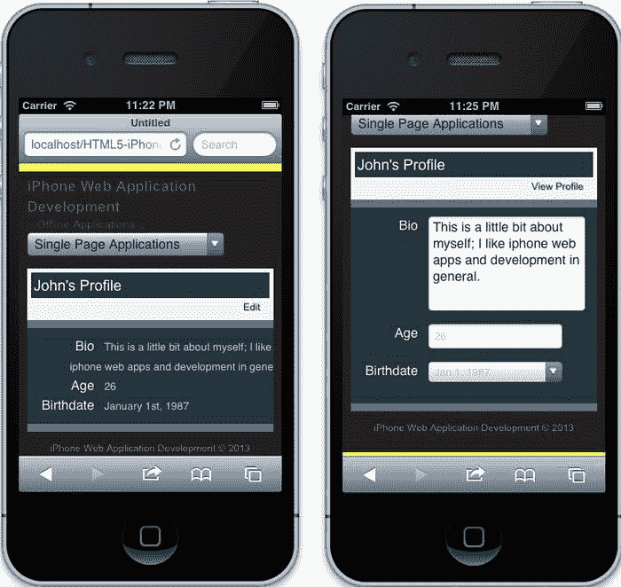
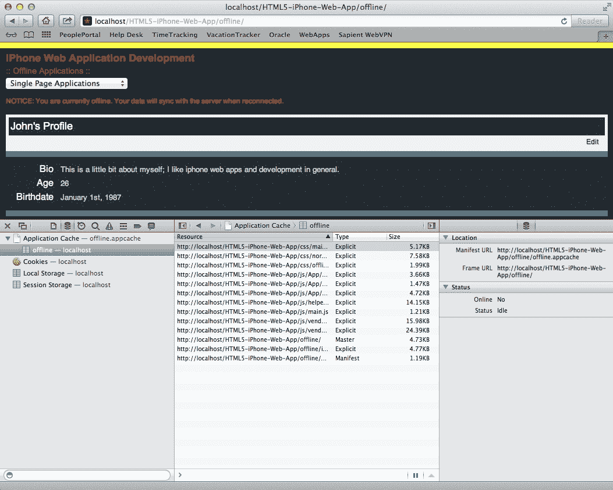
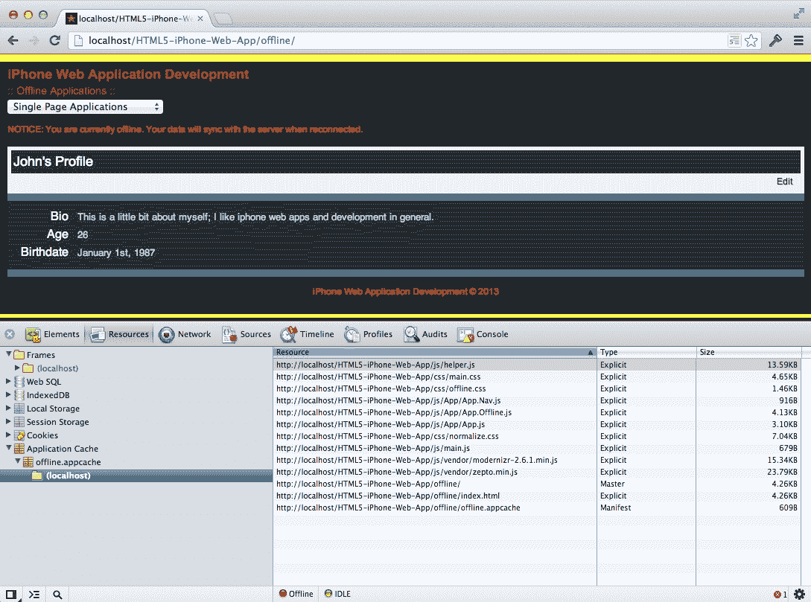
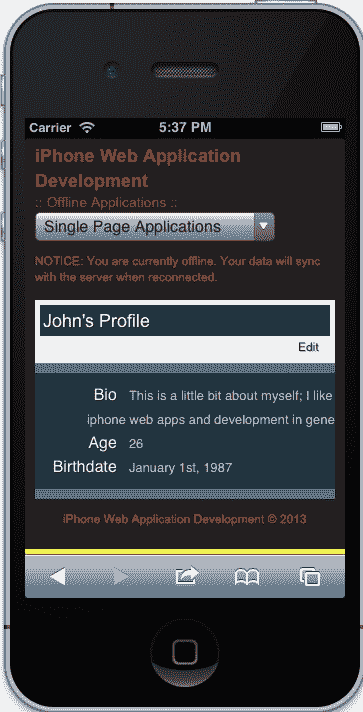

# 第八章：离线应用程序

在本章中，我们将介绍离线应用程序开发的基础知识。具体来说，我们将讨论应用程序清单，包括其优缺点，并看看我们如何处理离线交互。然后我们将深入研究如何使用`localStorage`和`IndexedDB`在客户端临时存储数据。本章的内容将以基本示例进行补充，这将帮助您快速上手。因此，让我们首先来看看应用程序清单对我们有什么好处。

本章将涵盖以下主题：

+   应用程序清单

+   处理离线交互

+   `localStorage`和`IndexedDB`API

# 应用程序缓存

**应用程序缓存**，又称为**AppCache**，允许您定义应该在离线使用期间缓存和可用的资源。这基本上使您的 Web 应用程序在用户离线时可用，因此失去网络连接甚至刷新页面都不会影响用户的连接，他们仍然能够与您的应用程序进行交互。让我们首先来看看应用程序缓存清单是什么样子。

## 清单文件

我们的应用程序清单文件包含了有关哪些资源将被文件缓存的信息。它明确告知浏览器您希望离线使用的资源，使其可供离线使用，同时通过缓存加快页面加载速度。以下代码展示了本章附带示例的缓存清单的基本示例：

```html
 CACHE MANIFEST

index.html

# stylesheets
../css/normalize.css
../css/main.css
../css/offline.css

# javascripts
../js/vendor/modernizr-2.6.1.min.js
../js/vendor/zepto.min.js
../js/helper.js
../js/App/App.js
../js/App/App.Nav.js
../js/App/App.Offline.js
../js/main.js
```

在上面的例子中，发生了一些事情。首先，我们使用全大写单词`CACHE MANIFEST`来标识缓存清单。这一行是必需的，并且被浏览器读取为确切的缓存清单。接下来的一行定义了一个我们想要缓存的文件，`index.html`。现在，有一件事情我们需要记住；这个清单文件是相对于我们所在的位置的。这意味着我们的文件位于`index.html`所在的目录中（例如，`offline.appcache`位于`localhost/`，就像`index.html`一样）。

接下来，我们发现我们可以在我们的清单文件中包含注释，只需在前面加上井号（`#stylesheets`）。这有助于我们跟踪这个文件中发生的事情。从这里开始，我们定义我们想要相对于正在查看的页面定义的样式表和脚本。此时，我们正在查看一个真正的清单文件，并对其进行分解以理解它。随着我们在本章中的进展，我们将回到这个文件，看看它如何影响本章中构建的示例。

## 清单实现

为了有效地使用我们的缓存清单，我们需要能够将其与当前页面关联起来。但是为了做到这一点，我们还需要设置我们的服务器以正确处理清单，通过发送正确的 MIME 类型。每种类型的服务器处理方式都有些不同，指令可能看起来不同，但它们都能实现相同的结果——发送与该文件相关联的正确类型的标头。

在 Apache 中，我们的配置看起来可能是这样的：

```html
AddType text/cache-manifest .appcache
```

正如您所看到的，我们已经定义了所有类型为`.appcache`的文件以`text`/`cache-manifest`的内容类型进行传递。这使得浏览器能够正确解释文件，因此浏览器将其关联为`cache-manifest`。尽管这很好，但我们还没有完成。为了完成，我们需要让我们的页面定义这个文件，以便它能够正确关联。

将我们的缓存清单与我们的页面相关联，我们需要在我们的 HTML 标签上设置`manifest`属性，如下所示：

```html
<html manifest=”offline.appcache”>
```

我们现在已经定义了我们的应用程序缓存清单，并将其与相关页面一起交付，但我们只是简要地涉及了这项技术。要充分理解其功能，我们需要看到它的使用。因此，我们将继续创建一个简单的示例，让我们使用到目前为止学到的知识。

## 一个简单的例子

本章的示例将基于上一章。因此，我们不会详细介绍用于创建此示例的结构、样式或脚本。但是，它将被简化为一个基本的个人资料视图，让您能够理解离线应用程序，而无需从前几章获取额外的知识。首先，让我们看看我们的标记。

### 标记

与本书一起提供的源代码包含了您开始本章目标所需的一切。因此，让我们看看这个示例的实质，并检查这个示例将如何运行，从标记开始。如果您打开位于`offline`目录中的索引文件，您会注意到我们的内容应该看起来像这样：

```html
<div class=”site-wrapper”>
    <section class=”view-profile”>
        <header>
            <h1>John’s Profile</h1>
            <a href=”#edit”>Edit</a>
        </header>
        <dl>
            <dt>Bio</dt>
            <dd>This is a little bit about myself; I like iphone web apps and development in general.</dd>
            <dt>Age</dt>
            <dd>26</dd>
            <dt>Birthdate</dt>
            <dd>January 1st, 1987</dd>
        </dl>
        <form>
            <div class=”field”>
                <label for=”bio”>Bio</label>
                <textarea id=”bio”>
                    This is a little bit about me; I like iphone web apps and development in general.
                </textarea>
            </div>
            <div class=”field”>
                <label for=”age”>Age</label>
                <input id=”age” type=”number” value=”26”>
            </div>
            <div class=”field”>
                <label>Birthdate</label>
                <input type=”date” value=”1987-01-01”>
            </div>
        </form>
    </section>
</div>
```

与任何网页应用程序一样，特别是本书中编写的应用程序，这只是整体应用架构的一部分，其中包括页眉、页脚、样式表和脚本。但是，前面的标记描述了一个显示用户信息的个人资料视图，包括简短的个人简介、年龄和出生日期。除了这些信息外，还有一个表单，允许您更新这些信息。

这个应用程序的体验如下。首先，当用户加载页面时，他们应该看到与他们相关的所有信息。其次，他们将有选择使用文本**编辑**的超链接来编辑这些信息。当单击超链接时，将出现一个表单，允许用户编辑他们的信息。相应地，**编辑**超链接将更新为**查看个人资料**。最后，当用户单击**查看个人资料**时，表单将隐藏，用户信息的显示将重新出现。

### JavaScript

这并不像听起来那么复杂。事实上，用于创建页面功能的脚本依赖于以下脚本：

```html
var $viewProfile = $(‘.view-profile’),
    $form = $viewProfile.find(‘form’),
    $dl = $viewProfile.find(‘dl’),
    $p = $(‘<p />’);

function onEditClick(e) {
    e.preventDefault();
    e.stopImmediatePropagation();

    $form.show();
    $dl.hide();
    $(this).text(‘View Profile’).attr(‘href’, ‘#view’);
}

function onViewClick(e) {
    e.preventDefault();
    e.stopImmediatePropagation();

    $form.hide();
    $dl.show();
    $(this).text(‘Edit’).attr(‘href’, ‘#edit’);
}

$viewProfile.
    on(‘click’, ‘a[href=”#edit”]’, onEditClick).
    on(‘click’, ‘a[href=”#view”]’, onViewClick);
```

让我们看看前面的代码中发生了什么，以确保没有人迷失方向。首先，我们缓存适合我们页面的元素。通过这种方式，我们通过不是每次需要查找东西时都遍历 DOM 来优化性能。然后，我们定义了`onEditClick`和`onViewClick`事件处理程序，它们显示或隐藏适当的内容块，然后更新与之相关的锚点标签的`text`和`href`属性。最后，我们将`click`事件附加到缓存的`$viewProfile`元素上。

### 注意

请注意，前面的 JavaScript 是本章书籍附带源代码的一部分。为了更好地解释正在构建的应用程序的实质，我们已经删除了闭包和`Offline`类。当然，您可以选择使用前面的代码，或者继续使用本书的源代码。无论您选择哪种方式，期望的结果都将是一个根据当前状态显示或隐藏内容的应用程序。

当执行前面的代码并加载页面时，应用程序的状态如下：



初始应用程序状态和应用程序编辑状态

现在，我们已经建立了应用程序与交互时应该看起来的坚实基础，我们希望确保它被缓存。通过实施我们应用程序开头给出的技术，我们现在应该有一个可以离线运行的应用程序。

请记住，我们需要将应用程序缓存清单放在与正在构建的示例应用程序相同的目录中。因此，我们的应用程序清单需要存在于离线目录中，与我们的`index.html`文件一起。如果您查看本章的源代码，您应该会看到我们的清单和源文件的结构和布局的工作示例。在正确配置的服务器上运行此应用程序将使我们的页面离线呈现。但问题是，我们如何调试这样的东西呢？好吧，这就是下一节要解决的问题。

# 调试缓存清单

调试我们的离线应用程序非常重要，毕竟，如果我们的应用程序依赖于网络连接，我们必须提供一个成功的替代体验给我们的用户。然而，调试离线应用程序并不容易。有几个原因，但主要是基于应用程序缓存接口的实现。

> 当 Safari 重新访问您的站点时，站点将从缓存中加载。如果缓存清单已更改，Safari 将检查声明缓存的 HTML 文件，以及清单中列出的每个资源，以查看它们是否有任何更改。
> 
> 如果文件与先前版本的文件在字节上完全相同，则认为文件未更改；更改文件的修改日期不会触发更新。您必须更改文件的内容。（更改注释就足够了。）

这可以在苹果文档中找到：[`developer.apple.com/library/safari/#documentation/iPhone/Conceptual/SafariJSDatabaseGuide/OfflineApplicationCache/OfflineApplicationCache.html#//apple_ref/doc/uid/TP40007256-CH7-SW5`](https://developer.apple.com/library/safari/#documentation/iPhone/Conceptual/SafariJSDatabaseGuide/OfflineApplicationCache/OfflineApplicationCache.html)

## 在浏览器中调试

根据先前的文档，我们可以通过清除具有更新资源的缓存来改进调试过程。这可能只是在我们的代码中更新注释，但为了确保正确的资产被缓存，我们可以使用现代浏览器和调试器工具来查看被缓存的资产。查看以下截图，了解如何测试您的资产是否被缓存：



Safari 开发者工具 - 资源

Safari 中的开发者工具（如前面的截图所示）通过提供一个**资源**选项卡来帮助我们调试应用程序缓存，允许我们分析多个域的应用程序缓存。在这个例子中，我们可以看到与我们示例应用程序域相关的资源。当我们审查应用程序缓存时，我们可以看到与缓存相关的文件列表在右侧。此外，我们还可以看到文件的位置和用户的状态；在这种情况下，我们是在线且空闲。



Chrome 开发者工具 - 资源

Chrome 开发者工具同样有助于显示与应用程序缓存相关的信息。虽然用户界面有点不同，但它包含了审查与您的应用程序缓存相关的所有必要组件。此视图还包括您的应用程序的在线状态；在这个例子中，我们不在线且空闲。

## 使用 JavaScript 进行调试

应用程序缓存也可以使用 JavaScript 进行调试，幸运的是，应用程序缓存清单的实现非常容易与之交互。我们可以监听多个事件，包括`progress`、`error`和`updateready`。当我们监听这些事件时，我们可以选择实现一个补充体验，但在这里，我们只是记录事件。

```html
window.applicationCache.addEventListener(‘cached’, handleCacheEvent, false);
window.applicationCache.addEventListener(‘checking’, handleCacheEvent, false);
window.applicationCache.addEventListener(‘downloading’, handleCacheEvent, false);
window.applicationCache.addEventListener(‘error’, handleCacheError, false);
window.applicationCache.addEventListener(‘noupdate’, handleCacheEvent, false);
window.applicationCache.addEventListener(‘obsolete’, handleCacheEvent, false);
window.applicationCache.addEventListener(‘progress’, handleCacheEvent, false);
window.applicationCache.addEventListener(‘updateready’, handleCacheEvent, false);

function handleCacheEvent(e) {
  console.log(e);
}

function handleCacheError(e) {
  console.log(e);

}
```

在上面的脚本中，我们监听规范定义的事件（[`www.whatwg.org/specs/web-apps/current-work/#appcacheevents`](http://www.whatwg.org/specs/web-apps/current-work/#appcacheevents)），并调用`handleCacheEvent`或`handleCacheError`方法。在这些方法中，我们只是记录事件本身；但是，如果我们愿意，我们可以创建一种替代体验。

在应用程序缓存过程的实施过程中还有许多可以使用的操作方法。例如，我们可以使用`update`方法手动更新缓存。

```html
window.applicationCache.update();
```

尽管前面的方法对我们可能有所帮助，但请记住，只有内容本身发生了变化，缓存才会更新。实际上，`update`方法触发了下载过程（[`www.whatwg.org/specs/web-apps/current-work/#application-cache-download-process`](http://www.whatwg.org/specs/web-apps/current-work/#application-cache-download-process)），这并不会告诉浏览器获取最新的缓存。 `swapCache`方法是另一个可以用来调试我们的应用程序的操作调用，它将缓存切换到最新版本。

```html
window.applicationCache.swapCache();
```

请记住，如果我们进行此调用，资产不会自动更新。获取更新后的资产的方法是刷新页面。根据规范，实现我们需要的更简单的方法是执行`location.reload()`（[`www.whatwg.org/specs/web-apps/current-work/#dom-appcache-swapcache`](http://www.whatwg.org/specs/web-apps/current-work/#dom-appcache-swapcache)）。

到目前为止，我们对应用程序缓存清单有了一个很好的了解，包括它的功能、实施细节以及最终如何调试它。现在我们需要知道如何使用前面的方法以及更多方法来处理离线交互。当我们对这两个方面有了很好的理解后，我们就能够创建利用这项技术的简单离线应用程序。

# 处理离线应用程序

到目前为止，我们已经学会了如何使用应用程序清单接口在客户端缓存我们的文件，以加快网站速度，同时使其在用户离线时可用。然而，这种技术并没有考虑到用户交互时应该做些什么。在这种情况下，我们需要确保我们的应用程序具有可用的部分，以使应用程序在失去连接时无缝运行。

## 一个简单的用例

在我们继续之前，让我们定义一个简单的用例，说明为什么处理离线应用对用户和我们都有用。假设我们有一个名叫约翰的用户，约翰正在通勤上班，目前正在 iPhone 上的 Web 应用程序中更新他的个人资料。通勤途中的网络连接有时不太稳定，有时会失去连接。他希望能够在上班途中继续使用应用程序，而不是等到上班后再使用。

考虑到我们今天生活的世界，一个不稳定的交互可能会让公司失去一个客户，我们肯定希望能够优雅地处理这种情况。这并不意味着我们会在用户离线时为其提供所有服务，那是不合理的。这意味着我们需要告知用户他们处于离线状态，由于这个原因，某些功能目前被禁用。

## 检测网络连接

现在，你可能会问：“如何检测网络连接？”嗯，实际上很简单。让我们看一下下面的代码：

```html
var $p = $(‘<p />’);
if(!navigator.onLine) {
  $p.
    text(‘NOTICE: You are currently offline. Your data will sync with the server when reconnected.’);

  $(‘.view-profile’).
    before($p);
}
```

让我们简要回顾一下前面的代码。这段代码的第一部分在内存中创建了一个缓存元素，并将其存储在变量`$p`中。接下来的一行是最重要的，它通过检查`navigator`对象的`onLine`属性来检测在线连接。如果用户不在线，我们最终设置了缓存元素的文本，并将其附加到我们之前的代码中。

如果我们的应用程序处于离线状态，它将如下所示：



检测网络连接

当然，这只是你在现实世界应用中处理网络连接的简化版本，但它展示了你可以获取网络状态并确定离线体验。这对我们来说很棒，因为它为我们打开了一个我们以前无法探索的网络开发新世界。但当然，这也需要一些复杂的预先考虑，以确定如何处理这样的体验。

回到我们定义的用例，用户想要更新他/她的个人资料信息，显然如果没有必要的资源，这将是非常困难的。幸运的是，我们有两种新技术可以用来完成类似这个用例的简单任务。因此，让我们简要地介绍一下这两种技术。

## localStorage API

尽管离线状态是新的 HTML5 规范的一个特性，但它与 HTML5 的另一个特性——存储（[`dev.w3.org/html5/webstorage/`](http://dev.w3.org/html5/webstorage/)）密切相关。存储是许多开发人员之前认为与后端系统有一对一关系的东西。这不再是真的，因为现在我们能够使用`localStorage`API 在客户端设备上保存数据。

让我们通过一个简短的例子来使用`localStorage`，看看它是如何工作的：

```html
localStorage.setItem(‘name’, ‘John Smith’);
```

我们刚刚写的代码有多个部分。首先，有一个名为`localStorage`的全局对象。这个对象有开发人员可以交互的方法，包括`setItem`方法。最后，`setItem`方法接受两个参数，都是字符串。

要检索我们刚刚设置的项目的值，我们会这样做：

```html
localStorage.getItem(‘name’);
```

很酷，对吧？唯一的缺点是，当前的实现描述了 API 只接受每个键/值对的字符串，类似于 JavaScript 对象。然而，我们可以通过以下方式克服这个限制：

```html
localStorage.setItem(‘name’, JSON.stringify({ ‘first’: ‘John’, ‘last’: ‘Smith’ }));
```

这里的区别在于，我们还访问了内置的`JSON`对象，将对象转换为字符串，以便`localStorage`API 可以高效地将其存储为纯字符串。否则，你会存储`[object Object]`，这只是对象的类型。

要访问这些信息，我们需要做以下操作：

```html
JSON.parse(localStorage.getItem(‘name’));
```

当你在控制台中运行这段代码时，你应该会看到一个对象。`JSON`功能所做的是将“字符串化”的对象转换为传统的 JavaScript 对象。这使得访问我们存储的数据变得简单和高效。

正如你开始了解的那样，我们有能力在客户端存储信息，这是过去无法做到的，这使得我们能够在应用离线时暂时允许用户与网站的某些方面进行交互。结合 HTML5 的存储和离线功能，使我们能够为我们的应用带来更深入的交互，同时满足客户和用户的期望。

然而，`localStorage`的限制在于可以存储的信息量。因此，另一种技术被称为`IndexedDB`。尽管它的支持在各个浏览器中并不一致，而且技术仍处于实验阶段，但它值得一看。不幸的是，由于在 iOS Safari 中缺乏支持，我们在本书中不会涉及这项技术，但它仍然值得一些审查（[`developer.mozilla.org/en-US/docs/IndexedDB`](https://developer.mozilla.org/en-US/docs/IndexedDB)）。

# 总结

在本章中，我们介绍了应用程序缓存的基础知识，包括其实施示例。我们的回顾指出了使用这项新技术的好处，但也讨论了缺点，比如不一致的支持，主要是在旧版浏览器中，以及在测试时面临的问题。我们学会了如何处理离线交互，以及`localStorage`和`IndexedDB`如何允许我们在客户端临时存储信息作为解决方案。在下一章中，我们将讨论性能优化，并看看这在本书中开发的应用程序中是如何发挥作用的。
