# 第九章：清洁和优化代码的原则

在整本书中，我们都强调了从应用程序开发的最开始就进行优化的重要性。尽管我们已经从 JavaScript 中缓存元素到模块化我们的样式等主题，但在本章中，我们想总结一下书中使用的技术。毕竟，性能对于我们的移动应用程序来说是非常重要的。在本章中，我们将涵盖优化我们的样式、脚本和媒体。除了涵盖优化技术之外，我们还将讨论增强代码可维护性的良好编码标准，同时也提高性能。我们将从讨论样式表开始。

在本章中，我们将涵盖以下主题：

+   验证 CSS

+   分析 CSS

+   CSS 最佳实践

+   验证 JavaScript

+   分析 JavaScript

+   JavaScript 最佳实践

# 优化样式表

传统上，样式被“随意”地添加到 Web 应用程序中而没有任何预见性。通常，我们只是为我们的页面添加样式，而没有考虑模块化、可重用性和可维护性。然而，由于今天 Web 应用程序的广泛性质，这种做法已不再可接受。

在本书中，我们努力遵守了一些行业标准，比如模块化。然而，现在我们有工具可以帮助我们验证和分析我们的样式。从分析样本 CSS 文件开始，我们可以优化这些样式；这就是我们在本章节中的目标。

## 验证我们的 CSS

为了优化我们的样式表，我们需要首先验证我们的 CSS 是否有效，并符合当今的标准。我们可以使用各种工具来验证我们的样式，包括 W3C CSS 验证器和一个名为**CSS Lint**的工具。这些工具都会检查您的样式表，并为您总结出错的地方、为什么出错以及您应该怎么做。

### W3C CSS 验证器

要访问 W3C CSS 验证器，您可以访问以下 URL：

[`jigsaw.w3.org/css-validator/`](http://jigsaw.w3.org/css-validator/)

以下屏幕截图显示了 W3C 验证器的默认视图，允许您输入包含样式的页面的 URI。它将根据 W3C 规范自动获取您的样式表并对其进行验证。然而，我们不仅仅局限于在现场或生产就绪的网站上让我们的页面可爬行。我们还可以选择上传我们的样式表，或直接将它们放入这个应用程序中。

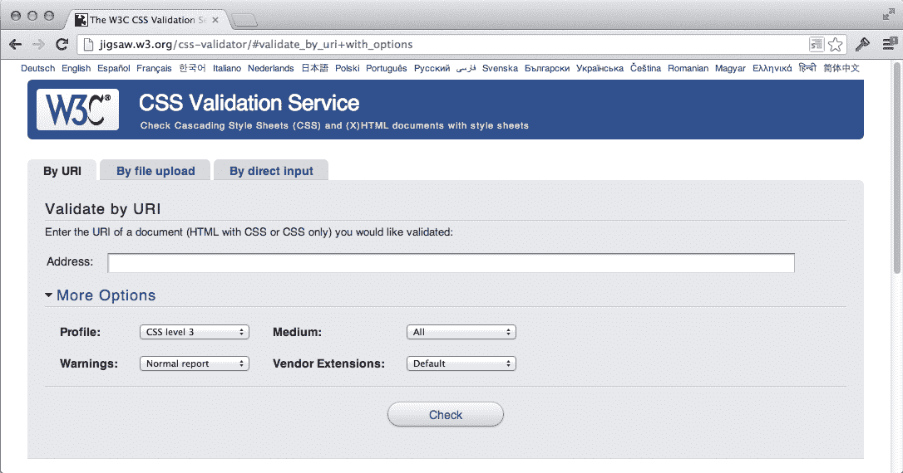

W3C CSS 验证器-URI 视图

在以下视图中，您可以看到我们可以通过文件上传过程验证样式。这将简单地通过后端处理器运行这些样式表，以检查样式是否有效；一旦这个过程完成，我们就会得到结果。

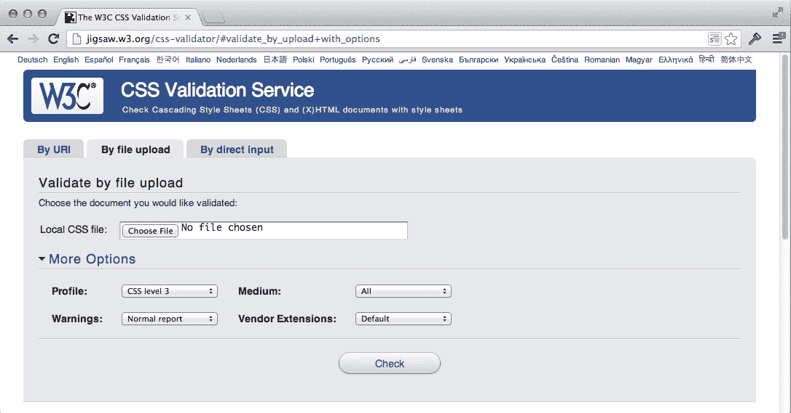

W3C CSS 验证器-文件上传视图

最后，我们有直接将我们的样式插入到工具中的选项，这可能是根据项目和团队或个人的需求最快速、最简单的解决方案。我们不必担心样式被剥离或以任何方式修改；文本字段将正确处理您的所有输入。与其他视图类似，一旦单击**检查**按钮，输入将通过处理器运行并向您呈现结果。

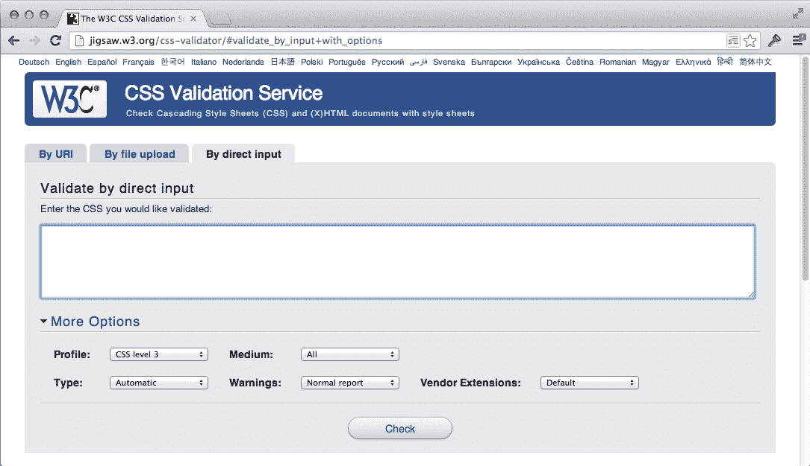

W3C CSS 验证器-直接输入视图

### 可定制选项

与任何优质保证工具一样，我们需要有能力定制此工具的选项以适应我们的需求。在这种情况下，我们有各种可用的选项，包括：

+   **配置文件**：此选项指定验证样式时要使用的配置文件，例如 CSS Level 1、CSS Level 2、CSS Level 3 等。

+   **警告**：此选项指定报告中要呈现的警告，例如 Normal、Most Important、No Warnings 等。

+   **介质**：此选项指定了样式表应该表示的介质，例如屏幕、打印、手持设备等。

+   **供应商扩展**：此选项指定了供应商扩展（`-webkit-`、`-moz-`、`-o-`）在报告中的处理方式，例如警告或错误。

### 验证一个成功的例子

让我们看一个成功的验证例子。首先，让我们使用我们在之前章节中创建的一些样式来查看 CSS 是否通过验证；特别是，让我们使用`singlepage.css`文件的内容，并将其粘贴到 W3C 验证器的直接输入视图中，并使用默认选项运行它。

当我们运行验证器时，我们的结果应该是这样的：

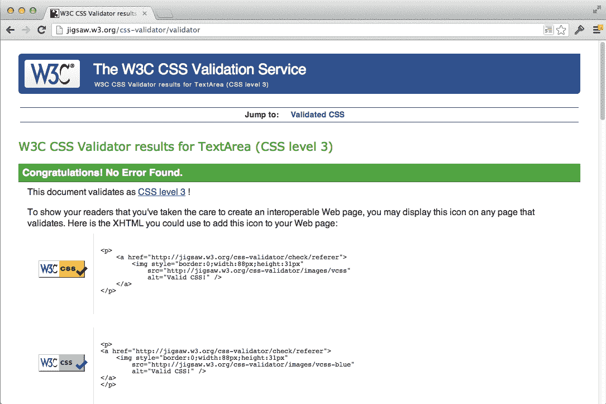

W3C CSS 验证器 - 成功验证

如您所见，输出是成功的，并通过了 CSS Level 3 规范。令人惊讶的是，我们甚至可以从验证器那里得到徽章放在我们的网站上！但不要这样做；尽管您应该对自己的工作感到满意，但这是我们大多数人不太喜欢在我们的网站上看到的东西。现在让我们看一个不成功的例子。

### 验证一个不成功的例子

编程中经常出现错误，因此在我们的样式、脚本和标记中遇到验证错误是很自然的。因此，让我们看一下 W3C CSS 验证器中验证错误的示例是什么样子。在这个例子中，我们将使用我们在第二章中创建的`video.css`文件的变体，*集成 HTML5 视频*。为了这个例子，我引入了一些错误，包括以下样式：

```html
video {
  display: block;
  width: 100%;
  max-width: 640px;
  margin: 0 auto;
  font-size: 2px;
  font-style: italics;
}

.video-container {
  width: 100;
}

.video-controls {
  margin: 12px auto;
  width: 100%;
  text-align:;
}

.video-controls .vc-state,
.video-controls .vc-track,
.video-controls .vc-volume,
.video-controls .vc-fullscreen, {
  display: inline-block;
  margin-right: 10px;
}

.video-controls .vc-fullscreen {
  margin-right: 0;
}

.video-controls .vc-state-pause,
.video-controls .vc-volume-unmute {
  display: none;
```

当我们通过 W3C CSS 验证器传递前面的样式时，我们得到以下结果：

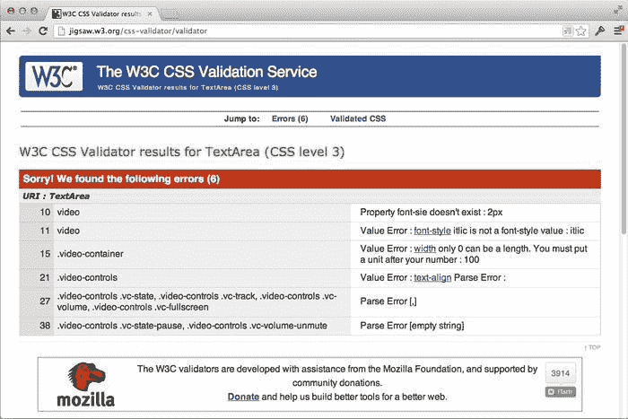

W3C CSS 验证器 - 不成功的验证

在上面的例子中，我们得到了一些值、属性和解析错误，所有这些都可以通过此不成功的验证示例中给出的参考轻松解决。这样做的好处是，不用试图弄清楚可能破坏布局的原因，屏幕截图中显示的错误可能解决所有问题。

从某种意义上说，这基本上是您需要确保您的 CSS 在多个浏览器中有效和符合规范的所有内容。但是，如果您能够防止这些错误发生呢？好吧，有一个工具可以做到，那就是 CSS Lint。

### CSS Lint

在大多数情况下，我们在编码时希望尽量避免出现错误，并且使用某种工具及早捕捉这些错误将会很有帮助。CSS Lint 就是这样一个工具，实际上可以直接在您选择的文本编辑器或 IDE 中使用。CSS Lint 不仅检查您的样式是否符合 CSS 的某些原则（如盒模型），还进行了大量的语法检查，帮助您有效地调试样式。

> CSS Lint 指出了 CSS 代码的问题。它进行基本的语法检查，并应用一组规则来查找问题模式或低效迹象。这些规则都是可插拔的，因此您可以轻松编写自己的规则或省略您不想要的规则。

有关 CSS Lint 的详细信息可以在[`github.com/stubbornella/csslint/wiki/About`](https://github.com/stubbornella/csslint/wiki/About)找到。

与 W3C CSS 验证器类似，CSS Lint 有自己的网站，您可以将样式复制粘贴到文本区域中，让处理器检查您的样式。我们与之交互的页面如下所示：

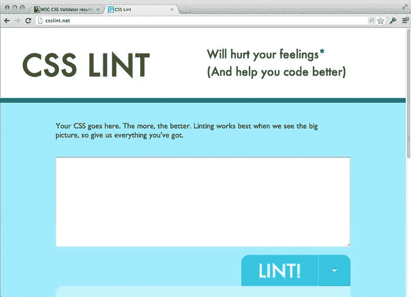

CSS Lint

### 可定制选项

CSS Lint 还带有可定制的选项，这些选项非常广泛，您可以根据自己或团队的需要进行定制。可定制选项有六个部分，包括**错误**、**可维护性和重复性**、**兼容性**、**可访问性**、**性能**和**OOCSS**（**面向对象的 CSS**）。

可定制的选项位于**Lint!**按钮的正下方：

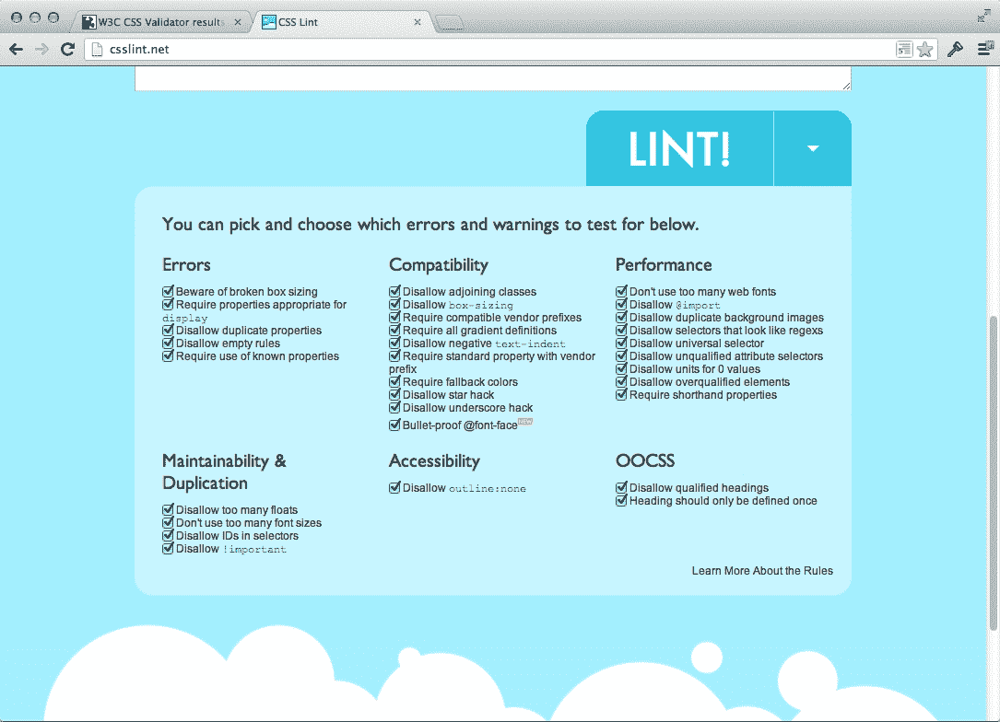

CSS Lint 选项

检查适当的选项使引擎能够根据这些属性进行验证。通常这些选项在项目之间会有所不同；例如，您可能正在开发一个需要在某些元素上设置填充和宽度的应用程序，因此，取消选中**注意破碎的框尺寸**选项可能更适合您，这样您就不会看到多个错误。

#### 使用 CSS Lint 验证成功的示例

当我们自定义选项并通过 CSS Lint 传递页面时，如果样式表符合标准，同时也满足团队的需求，我们应该收到一个成功的验证，如下面的截图所示：

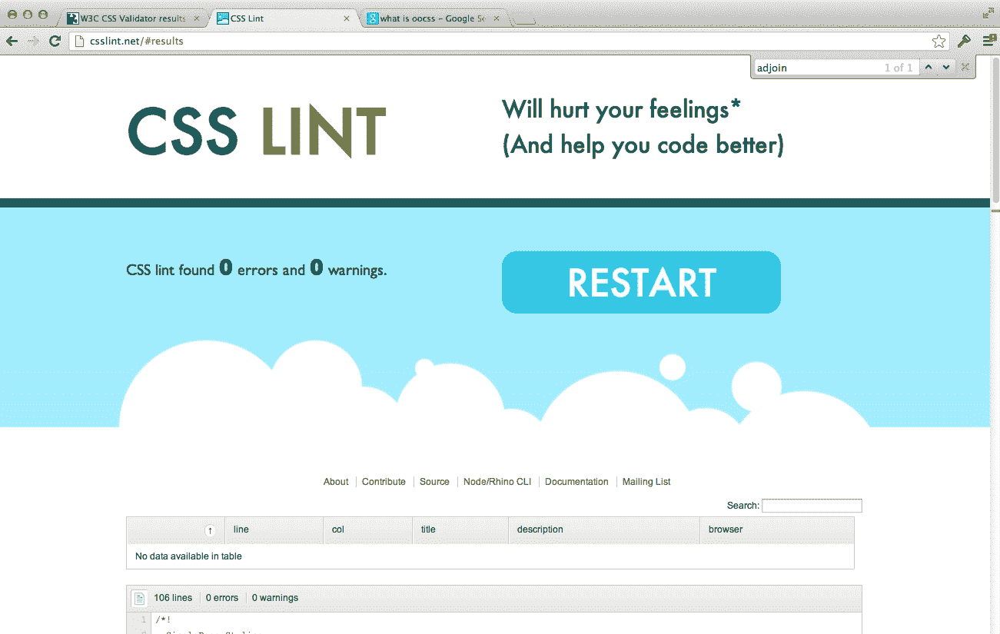

CSS Lint – 成功的验证

在上述情况下，我们的 CSS 样式通过了，不需要额外的信息。但是，当我们的 CSS 未通过验证时会发生什么呢？

#### 使用 CSS Lint 验证不成功的示例

如果我们将在上一节中为 W3C CSS 验证器创建的备用视频样式通过 CSS Lint，我们会得到以下结果：

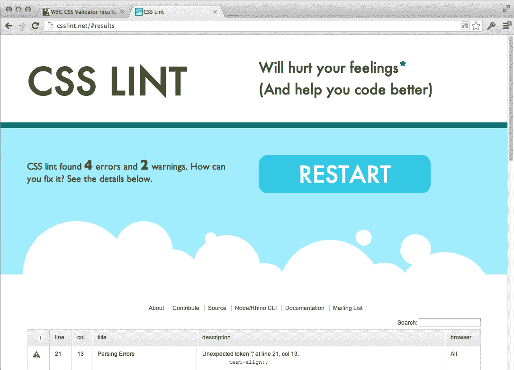

CSS Lint – 未成功的验证

然而，仅仅因为我们收到了四个错误和两个警告并不意味着我们无助。事实上，当我们向下滚动页面时，我们会看到需要处理的项目列表；它还包括问题类型，描述以及错误发生的行：

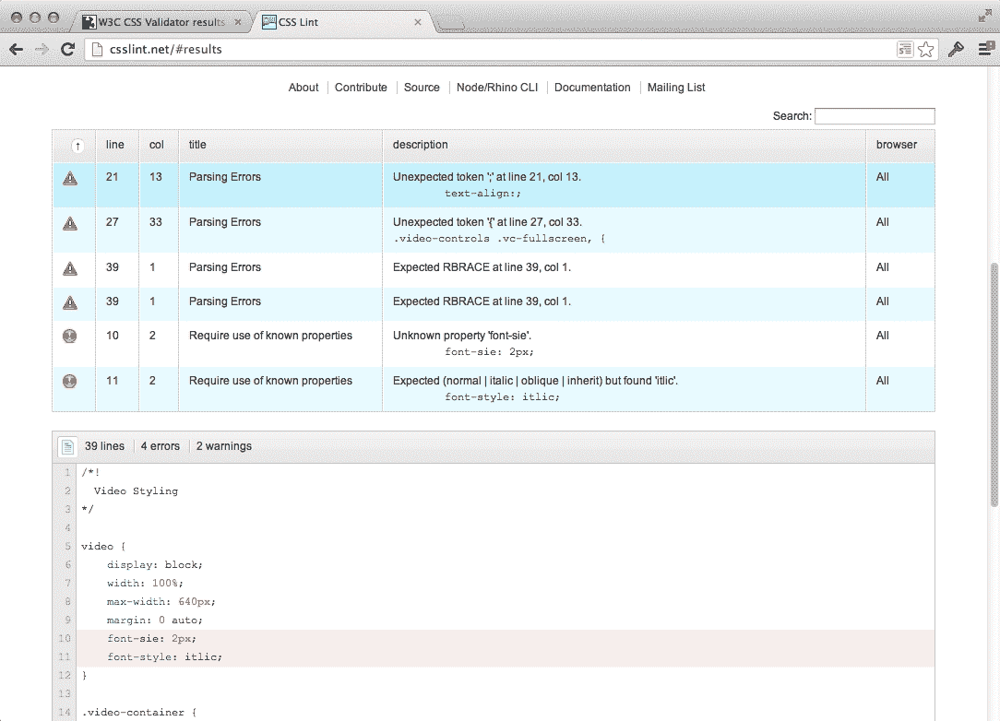

CSS Lint – 未成功的验证列表

#### 集成 CSS Lint

尽管我们有一个可以用来验证我们的样式的**图形用户界面**（**GUI**），但如果我们能够简化我们的个人开发工作流程，那将会更容易。例如，如果我们可以在文本编辑器或**集成开发环境**（**IDE**）中保存样式表时验证我们的 CSS，那将会很好。CSS Lint 非常灵活，允许我们实现这些集成的工作流程。

一些集成开发环境和文本编辑器供应商已经实现了 CSS Lint，包括 Sublime Text，Cloud 9，Microsoft Visual Studio 和 Eclipse Orion。虽然将 CSS Lint 安装和设置到您喜欢的工具中超出了本书的范围，但您可以在这里查找所有所需的信息：

[`github.com/stubbornella/csslint/wiki/IDE-integration`](https://github.com/stubbornella/csslint/wiki/IDE-integration)

## 分析我们的 CSS

以前很难对 CSS 进行分析，事实上可能是不可能的。但是随着浏览器调试工具的进步，我们现在能够在一定程度上对样式表进行分析。在本节中，我们将回顾如何对我们的样式进行分析，并阅读 Safari 浏览器在 Mac 上向我们呈现的信息。

在接下来的屏幕中，我们将简要介绍如何使用分析来分析样式以及 Safari 浏览器如何向我们呈现这些信息。我们只会查看我们的样式的布局和渲染。使用我们之前构建的单页面应用程序，我们将查看我们的样式的有效性，并查看我们的样式在与应用程序的呈现层相关的方面的弱点和优势。

让我们从查看我们的单页面应用程序的仪表板视图开始，Safari 调试工具已打开，并处于配置文件选项卡（时钟符号）上。

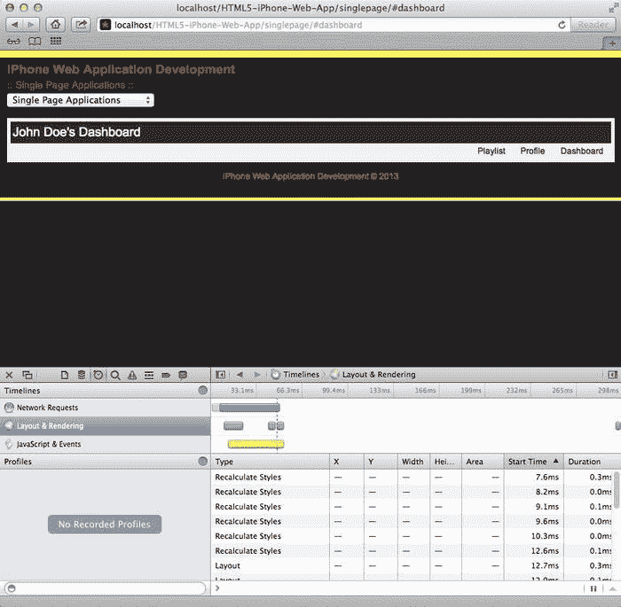

Safari 分析工具

当我们首次加载我们的单页面应用程序并查看页面加载的分析时，我们会看到三个不同的时间轴，包括**网络请求**，**布局和渲染**和**JavaScript 和事件**。对于我们的目的，让我们看看**布局和渲染**。

当我们查看**布局和渲染**时间轴时，我们可以看到重绘和重排计算是在页面加载时进行的。调试器还让我们知道运行了什么类型的进程，何时运行以及更改了哪些属性，包括其开始时间和持续时间。在寻找页面性能泄漏时，这些都非常有帮助。但是，运行时分析呢？嗯，调试器也有这个功能。

实际上，在我们的左侧边栏上有一个圆圈，与**Profiles**选项卡在同一行，它允许我们对 JavaScript 或 CSS 进行分析。这很棒，因为当我们启用它时，我们将开始对应用程序进行运行时分析。因此，假设我们启用了对 CSS 的分析，然后在应用程序中点击**Profile**选项卡以切换页面视图；我们肯定会执行一些更改，使我们的样式发生变化。当我们这样做并停止我们的 CSS 分析时，我们会得到以下结果：

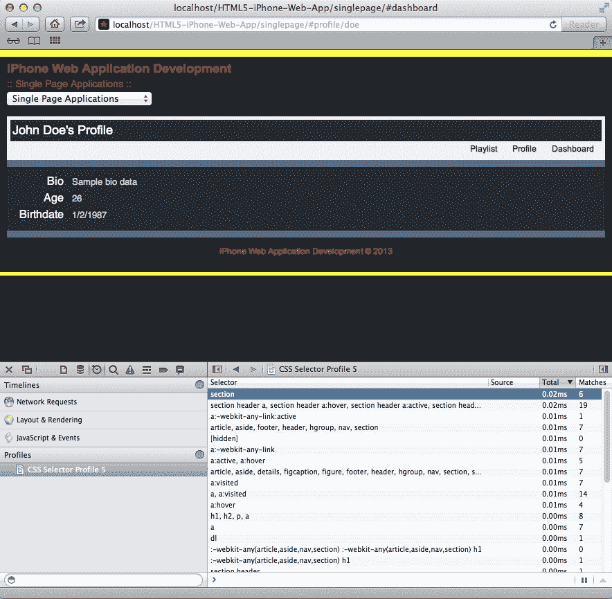

Safari 分析工具-运行时分析

当我们分析我们的分析时，我们可以看到正在使用的选择器，它们渲染的总时间，页面上的匹配数以及它们的来源。这是对发生了什么样的处理进行了很好的分解，并让我们对每个选择器查找和渲染所花费的时间有了一个很好的概念，从而让我们知道可以改进什么。鉴于我们为本书的应用程序很小，但如果你正在开发一个包括复杂动画或渲染数千行数据的应用程序，这将在调试您的移动应用程序时非常有用。

一旦我们对我们的应用程序的瓶颈有了一个很好的想法，我们就需要采取一些行动。拥有这些信息为我们提供了关于应用程序性能的关键信息以及我们应该关注的内容。优化阶段是基于每个团队或个人面临的问题和项目需求的，因此在下一节中，我们将讨论一些用于更快渲染和匹配我们样式的优化技术。

## 优化我们的 CSS

在这一部分，我们简要介绍了一些行业标准，这些标准通过提供高效、可维护和精心制作的模块化样式来帮助我们优化应用程序的渲染时间。这些标准已经被业内知名的个人和组织广泛讨论，并最终被各种框架采纳。当然，这里讨论的标准可能随着时间的推移和浏览器实现更好的处理方法而发生变化，使新技术更快、更高效，但这应该是任何希望创建符合当今需求的样式表的人的良好起点指南。

### 避免通用规则

不要在规则中使用`*`选择器。这会选择 DOM 中的每个元素，因此它们的遍历方法是低效的。

例如，以下是极其低效的：

```html
header > *
```

前面的代码之所以效率低，是因为它使用了通用选择器。因为 CSS 是从右到左读取的，引擎会说“让我们选择所有元素，然后看它们是否与标题元素直接相关”。因为我们需要遍历整个 DOM，所以这个选择器的渲染比像这样的东西要慢得多：

```html
header > h1
```

## 不要限定 ID 或类规则

限定 ID 或类涉及直接将标签名称与适当的选择器相结合，但出于与前一条规则相同的原因，这是极其低效的。

例如，以下所有选择器都是不好的：

```html
input#name-text-field

.text-field#name-text-field

input.text-field

.text-field.address-text-field
```

尽管其中一些可能看起来很诱人，但它们是不必要和低效的。但是，这里有一个例外；如果我们想通过向元素添加类来更改样式，那么限定类可能是必要的。无论如何，我们可以通过以下方式来纠正前面的限定 ID 或类。

```html
#name-text-field

.text-field

.text-field.address-text-field
```

正如前一段提到的，最后一个选择器在通过 JavaScript 基于用户操作更改元素样式时可能更有用。

### 永远不要使用!important

这条规则相当不言自明。使用它来覆盖样式肯定很诱人，但不要这样做；随着您的应用程序变得更加复杂，这只会带来麻烦。因此，请查看下一条规则。

### 模块化样式

创建通用于 Web 应用程序或网站的样式非常容易；然而，如果我们开始以模块化的方式思考，我们就会开始创建专门用于该应用程序部分的样式。例如，考虑一个表单及其输入，假设我们希望网站上的所有表单都包含具有棕色边框的文本字段。我们可以这样做：

```html
form .text-field { border: 1px solid brown; }
```

现在我们已经将所有包含在`form`元素内的类为`.text-field`的字段保留为这种样式。因此，如果任何类为`.text-field`的输入字段在此选择器之外，我们可以按照自己的方式进行样式设置。或者，我们也可以这样覆盖样式：

```html
form .personal-information .text-field { border: 1px solid blue; }
```

现在，如果我们在原始样式之后包含这个样式，它将优先使用，因为我们实际上使用了使我们的样式更高效和更易管理的级联原则。

### 提示

请记住，后代选择器是最昂贵的选择器。然而，它们非常灵活，因此我们不应该为了高效的 CSS 而牺牲可维护性或语义。

在大多数情况下，这些规则应该足够了，但您很可能会发现实施一些其他行业中已经写过的最佳实践是有用的。当然，您应该使用您所使用的框架采用的最佳实践，或者更好的是适合您的团队。我发现这些对我非常有帮助，是一个很好的起点，我鼓励您根据需要进行研究和实验。现在，让我们看看如何优化我们的应用的 JavaScript。

# 优化 JavaScript

现在我们已经涵盖了样式表的优化，让我们看看我们的脚本。JavaScript 也曾经被毫无考虑或计划地放在页面上，总的来说给这门语言带来了不好的声誉。但是，由于 Web 应用程序的复杂性，开源社区已经帮助塑造了这门语言。

在整本书中，我们采用了几个行业标准，包括命名空间、闭包、缓存变量等。然而，验证和分析我们的脚本也是必不可少的，以便进行优化。在本节中，我们将介绍这一点，并希望涵盖制作高性能移动应用所需的主要要点。

## 使用 JSLint 验证 JavaScript

近年来，出现了各种工具来帮助我们验证 JavaScript。诸如 JSLint 和 JSHint 之类的工具已经被创建，以帮助我们编码，类似于 CSS Lint。但为什么我们应该使用这些工具，特别是对于 JavaScript 呢？JSLint 的网站（[`www.jslint.com/lint.html`](http://www.jslint.com/lint.html)）提到了工具背后的原因：

> JavaScript 是一种年轻但成熟的语言。最初，它是用来在网页中执行一些小任务的，这些任务对于 Java 来说太笨重、太笨拙了。但 JavaScript 是一种令人惊讶的功能强大的语言，现在它也被用于更大的项目中。许多旨在使语言易于使用的功能在项目变得复杂时会带来麻烦。JavaScript 需要一个语法检查器和验证器：JSLint。

JSLint 的网站还提到了以下内容：

> JavaScript 是一种松散的语言，但在其中有一种更优雅、更好的语言。JSLint 可以帮助您使用更好的语言进行编程，并避免大部分松散。JSLint 会拒绝浏览器会接受的程序，因为 JSLint 关心您的代码质量，而浏览器不关心。您应该接受 JSLint 的所有建议。

要测试我们的 JavaScript，我们可以轻松访问 JSLint 的网站（[`www.jslint.com/`](http://www.jslint.com/)）：

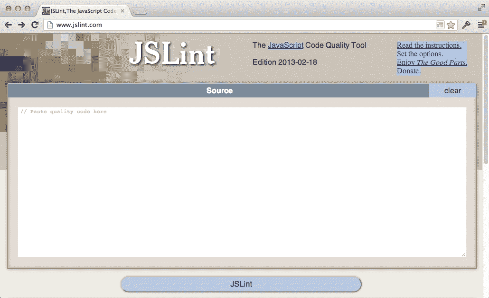

JSLint 网站

正如您所看到的，JSLint 与 CSS Lint 非常相似，您只需要将 JavaScript 输入到页面上，结果就会显示出来。让我们看看成功和失败的输出会是什么样子。

### 使用 JSLint 验证成功的例子

在我们的例子中，我们将利用我们的`App.js` JavaScript 来测试 JSLint 实用程序。当我们运行这个文件时，成功的输出将详细列出闭包中使用的方法、变量和属性。让我们看看以下截图：

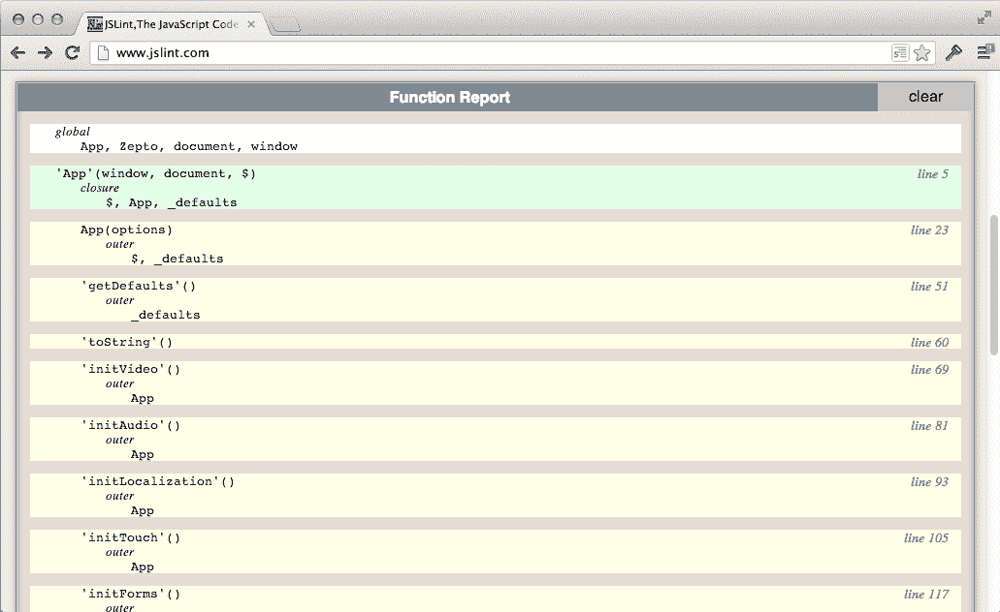

使用 JSLint 进行成功验证 - 方法和变量

前面的例子是使用 JSLint 进行成功验证的顶视图。验证器将返回一个以所有全局对象列表开头的列表。然后它将继续列出方法、变量以及每个的一些细节。例如，`initVideo`返回`this`或`App`的一个实例等等。

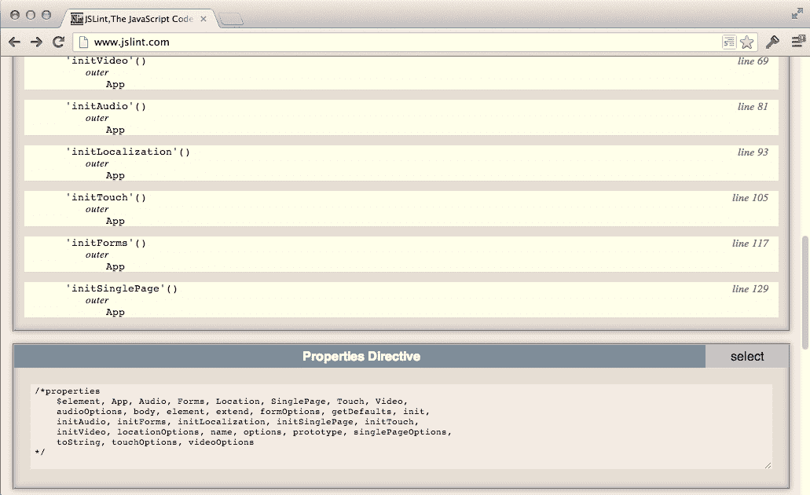

使用 JSLint 进行成功验证 - 属性

### 验证失败的例子

如果不修改 JSLint 选项，使用与前一个相同的例子将产生多个错误。这些错误主要是空格、间距和处理器不知道的全局对象。

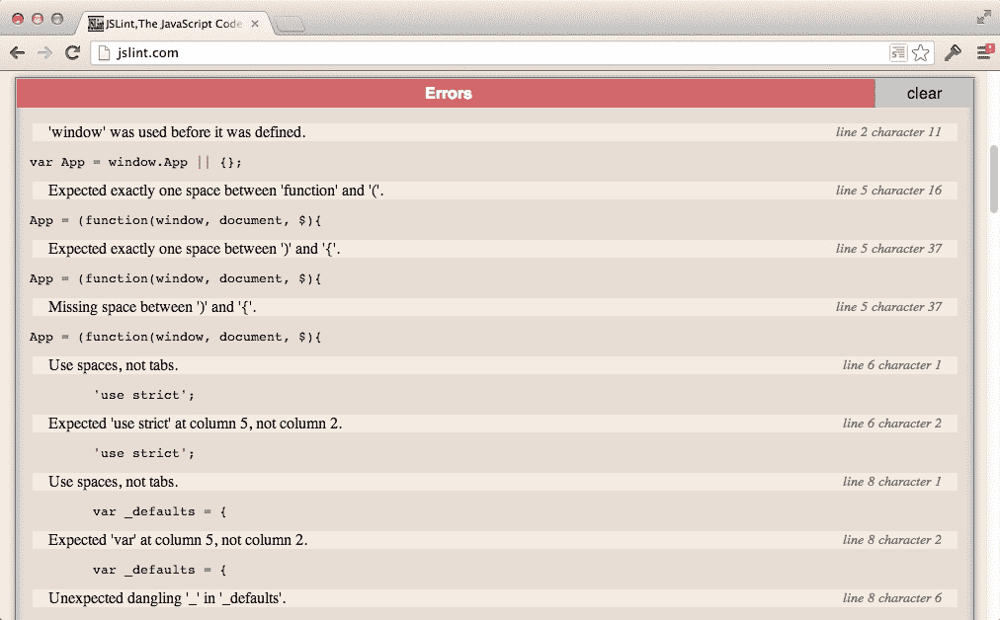

JSLint - 验证失败

根据前面的输出，错误以红色列出，包括描述、示例代码和错误发生的行号，让您轻松调试应用程序。现在，假设我们不希望空格或间距实际影响验证结果；那么我们可以定制 JSLint 的选项。

### 可定制选项

与本章讨论的大多数工具一样，JSLint 也提供了可以根据我们的需求定制的选项。让我们简要回顾一下网站上提供给我们的一些选项。

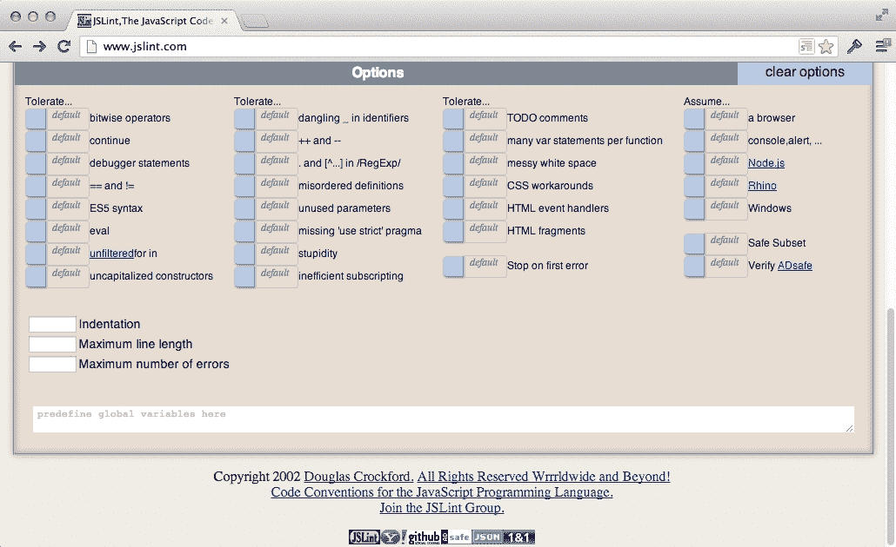

JSLint - 选项屏幕

对我们可用的选项非常广泛，从空格格式到对我们所有放在 JavaScript 中的`TODO`注释的正确性的容忍。当然，其中一些选项可能在测试时不符合我们的需求，但总的来说，它们非常有助于保持一致的编码标准，提供跨平台有效的脚本。

### 集成 JSLint

与 CSS Lint 类似，JSLint 可以在您喜欢的 IDE 或文本编辑器中使用。许多供应商已经创建了插件或扩展工具，使您可以在输入或保存代码时轻松进行代码检查。例如，Sublime Text 有一个`SublimeLinter`包，其中包括 CSS Lint、JSLint 以及其他一些可以帮助您更高效编码的工具。这是如何可能的？

*JSLint 可以在任何可以运行 JavaScript（或 Java）的地方运行。例如* [`github.com/douglascrockford/JSLint/wiki/JSLINT`](https://github.com/douglascrockford/JSLint/wiki/JSLINT)。

有关更多详细信息，请参考以下内容：

[`github.com/douglascrockford/JSLint`](https://github.com/douglascrockford/JSLint)

JSLint 本质上是一个 JavaScript 方法，可以传入代码，然后由 JavaScript 本身进行评估，使其非常高效地处理您的代码并集成到其他环境中。因此，如果您的文本编辑器或 IDE 中还没有它，您可以轻松创建一个扩展，帮助您使用 JSLint 编写高质量的代码。

## 对我们的 JavaScript 进行分析

与 CSS 性能分析一样，在 Web 的旧时代，测试 JavaScript 的性能是非常困难的。然而，这些天我们不需要太担心这个问题，因为几乎每个浏览器调试器都实现了一种对脚本进行性能分析的方法。使用 Safari 内置的调试工具，我们将了解如何调试我们应用程序的脚本性能。

在以下示例中，我们将仅仅讨论我们之前构建的单页面应用程序中 JavaScript 的性能分析，类似于我们在上一节中对样式进行性能分析的做法。

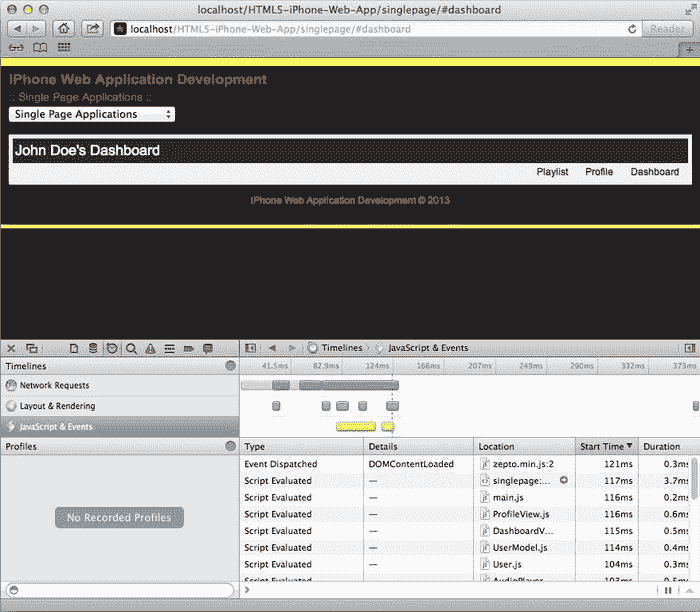

Safari 性能分析工具- JavaScript

前面的截图是页面加载时脚本的回顾。当我们查看“JavaScript & Events”时间轴时，我们可以得到每个脚本的类型、细节、位置、开始时间和持续时间的详细信息，这些都对脚本时间轴的结果有所贡献。虽然开始时间是我们肯定想要知道的，以便查看可能阻塞脚本（其他脚本），但持续时间可能更重要，因为如果每个脚本不是异步加载的话，它们可能会阻塞页面渲染的过程。

除了查看脚本对页面加载的影响之外，我们还可以对脚本执行的功能进行性能分析。例如，假设我们想要检测当我们在应用程序中点击“Profile”按钮时我们的方法的执行情况。这可以很容易地通过与对 CSS 进行性能分析相同的技术来实现，点击“Profile”选项卡中的圆圈并启用 JavaScript 的性能分析；我们将能够看到所有调用的方法及其性能。

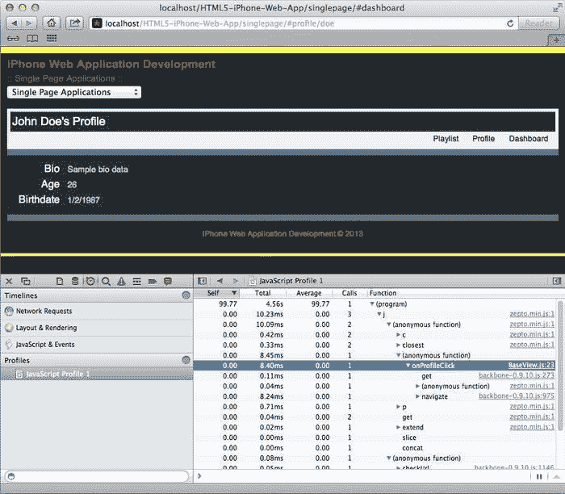

Safari 性能分析工具- JavaScript 运行时

根据我们之前的用例，我们可以很容易地详细了解我们应用程序的性能。从这个例子中我们可以得知，我们的`onProfileClick`事件大约需要 8.40 毫秒来执行，并且只调用了一次。然而，更重要的是，我们可以看到所有被调用的方法以及执行顺序，这是非常有用的信息，可以帮助我们检测内存泄漏和性能优化，这对我们的应用程序是必要的。

从这些非常基本的示例中，我们可以看到调试我们的应用程序性能比以往任何时候都更容易。我们可以对 JavaScript 进行性能分析，了解我们的应用程序的运行情况和代码的效率。但是既然我们有了这些信息，我们可以做些什么来改进我们的代码库呢？这就是我们在下一节要解决的问题，一些通用的优化技巧，我们都可以使用这些技巧来提高我们的应用程序的性能，而不会牺牲代码质量。

## 优化我们的 JavaScript

JavaScript 是高度可扩展的，允许我们几乎做任何我们想做的事情-这很棒，但也可能非常有害。例如，你可以很容易地忘记在变量前使用关键字`var`。然而，我们不希望这样做，因为这会使我们的变量在全局范围内可用，这可能会与其他脚本发生冲突，这些脚本可能使用完全相同的变量名。我们也可以很容易地将我们的 JavaScript 包装在`try...catch`语句中，这并不是最佳实践，因为我们并没有找出问题所在。或者，如果我们想的话，我们可以很容易地使用`eval`来评估一串 JavaScript，而不进行任何错误检查。

因此，该行业已经采用了多种经过验证的最佳实践，这些最佳实践由最常用的开源库实施，包括 jQuery、Backbone 和 Underscore。在本节中，我们简要介绍了我所基于的书籍的最佳实践，以及我认为对任何应用程序的成功至关重要的最佳实践。

### 避免全局变量

在全局范围内或在我们应用程序中创建的闭包之外创建所有变量和函数非常容易且诱人。但不要这样做；这是一个糟糕的想法，并且因为几个原因而受到社区的鄙视。例如，如果一个变量保留在全局范围内，它必须在整个应用程序的执行过程中进行维护，从而降低应用程序的性能。

所以，而不是这样做：

```html
Var Modal = function(){};
```

你应该这样做：

```html
(function(){ function Modal(){} }());
```

前面的技术与我们一直在做的非常相似。实际上，这就是我们所谓的闭包或**立即调用的函数表达式**（**IIFE**）。当我们将一个方法包装在括号内，然后使用`()`调用它时，我们立即调用该方法并创建一个新的包含范围，因此括号内的任何内容在全局范围内不可用，使我们的代码更易管理。

### 不要触及 DOM

嗯，我们可能不会这样做，但我们肯定应该尽量减少。访问 DOM 是昂贵的，并且在应用程序性能方面存在问题。因此，让我们来看一个用例，比如更新信息列表。

避免这样做：

```html
var $list = $('ul');

for (var i; i < 100; i++) {
  var li = '<li>' + i + '</li>';

  $list.append(li);
}
```

相反，你应该这样做：

```html
var $list = $('ul'),
  liArray = [];

for (var i; i < 100; i++) {
  liArray.push('<li>' + i + '</li>');
}

$list.append(liArray.join(''));
```

两者之间的区别在于前者每次创建列表项时都会触及 DOM，而后者会将每个项目推到一个数组中，当涉及到追加时，将数组与空字符串连接，只触及 DOM 一次。

### 使用文字

这可以在我们整本书的代码库中看到。这更有效，因为我们不使用`new`关键字。例如，我们可以使用`Array`文字，而不是通过新关键字声明一个新变量，就像这样：

```html
var arr = []; // not new Array();
var str = ''; // not new String('');
```

### 模块化功能

为了保持代码的模块化，您需要确保每个函数或类都有特定的功能集合。大多数情况下，每个函数可能应该是大约 10 到 15 行代码，实现特定的目标。

例如，您可以编写以下功能：

```html
function init() {
  var $list = $('ul'),
    liArray = [];

  for (var i; i < 100; i++) {
    liArray.push('<li>' + i + '</li>');
  }

  $list.append(liArray.join(''));	

  $list.on('click', function() {
    // do something
  });
}
```

而不是编写前面的代码，我们可以这样做：

```html
function populateLists() {
  var $list = $('ul'),
    liArray = [];

  for (var i; i < 100; i++) {
    liArray.push('<li>' + i + '</li>');
  }

  $list.append(liArray.join(''));	

  return $list;
}

function attachListsEvents($list) {
  $list.on('click', doSomething);
}

function doSomething(e) {
  // do something
}

function init() {
  var $list = populateLists();

  attachListsEvents($list);
}
```

正如您所看到的，代码已经模块化，以执行特定的功能集，使我们能够创建运行特定指令集的方法，每个方法都以名称描述。这对于维护我们的代码库并提供有效的功能非常有用。

# 总结

在这一章中，我们考虑了优化应用程序各个部分的性能，包括样式、脚本和媒体。我们讨论了验证、优化和分析我们的样式和脚本。此外，我们简要介绍了如何优化我们的媒体，包括图像、音频和视频。现在我们对本书中用于优化应用程序的技术有了坚实的理解，下一章中，我们将看看可以帮助我们使用 HTML5、CSS3 和 JavaScript 交付原生应用程序的框架。
