# 第十章：创建本机 iPhone Web 应用程序

在本章中，我们将研究如何使用 PhoneGap 框架将我们的 iOS Safari 本机应用程序转移到本机环境。我们将深入设置我们的开发环境，包括设置 Xcode IDE 和使用 iOS 模拟器。我们将构建一个`HelloWorld`示例，以演示快速入门的简单性，然后转移我们在第七章构建的单页应用程序，*单页应用程序*。一旦我们在本机应用程序开发上有了坚实的基础，我们将通过使用 PhoneGap 的联系人 API 来绑定本机功能，从而增强单页应用程序，以引入我们的联系人并显示其中一些信息。

我们的目标是帮助您使用单一代码库实现本机应用程序的一致外观和感觉。这里的目标是让您开始使用您已经喜爱和理解的 Web 编程语言进行本机应用程序开发。考虑到这一点，让我们从设置我们的开发环境开始。

在本章中，我们将涵盖：

+   Xcode 安装

+   使用 iOS 模拟器

+   实施 PhoneGap

+   创建`HelloWorld`示例

+   转移当前应用程序，包括 CSS、JavaScript、HTML 和资产

+   使用 PhoneGap 在 iOS 中绑定本机功能的联系人 API

# 设置开发环境

与创建软件的任何工作流程一样，我们的开发环境至关重要。因此，让我们花些时间设置许多工程师喜欢的环境，以创建本机应用程序。在本节中，我们将介绍 Xcode 的安装和集成开发环境（IDE）的概述。我们将继续设置 PhoneGap 框架，最后看看 iOS 模拟器如何在测试我们的应用程序中发挥关键作用。作为一个额外的奖励，我们将在本章中看看如何配置我们的应用程序以满足我们的需求。所以让我们开始吧。

## 开始使用 Xcode

Xcode 是 iOS 操作系统上本机应用程序开发的首选 IDE，因为它得到了苹果的积极支持，并专门针对 OS X 和 iOS 操作系统进行了定制。这个 IDE 由苹果提供，可以用来创建 Mac OS X、iPhone 和 iPad 应用程序。虽然它也可以用于其他各种类型的开发，但这三个平台最常与 Xcode 相关。默认情况下，您的 Mac 没有预装 Xcode，所以我们需要安装它。

### 安装 Xcode

幸运的是，Xcode 非常容易安装。我们可以通过 Mac App Store（[`itunes.apple.com/us/app/xcode/id497799835?ls=1&mt=12`](https://itunes.apple.com/us/app/xcode/id497799835?ls=1&mt=12)）安装这个 IDE。安装完成后，我们的计算机上将安装各种软件，包括 Instruments 分析工具、iOS 模拟器和最新的**Mac OS X 和 iOS 软件开发工具包**（**SDK**）。

### Xcode IDE 概述-基础知识

默认情况下，Xcode IDE 安装在应用程序目录中；双击显示的图标启动它。图标是一个对角放置在蓝色技术图纸上的锤子，上面有一个形成字母 A 的铅笔、刷子和尺子。应用程序启动时，我们将看到欢迎屏幕。

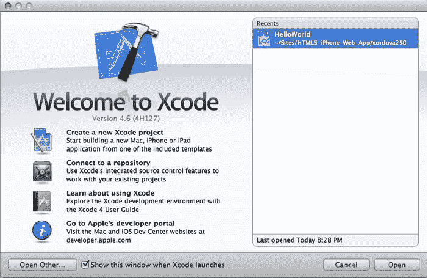

欢迎屏幕

这是 Xcode 的欢迎屏幕，列出了最近的项目和创建新项目、连接到存储库、了解 Xcode 或查看苹果开发者门户网站的能力。在您的屏幕上，您很可能不会看到前面截图中列出的`HelloWorld`项目，这是我们将要构建的项目，如果这是您第一次，它应该是空的。

### 提示

因为这一部分是让我们熟悉 Xcode 本身，不要担心接下来的几个屏幕。接下来的屏幕是我们要构建的，但只是为了帮助我们识别 Xcode 应用程序的某些部分，以便更容易使用。

#### Xcode 工作区

现在，让我们了解 Xcode 的用户界面，以了解如何利用这个强大的工具。首先，正如我们已经知道的，当我们打开应用程序时，会看到欢迎屏幕。您可以选择通过在欢迎屏幕上取消选中**Xcode 启动时显示此窗口**复选框来禁用此功能。但是当我们打开一个已创建的项目时，它看起来是这样的：

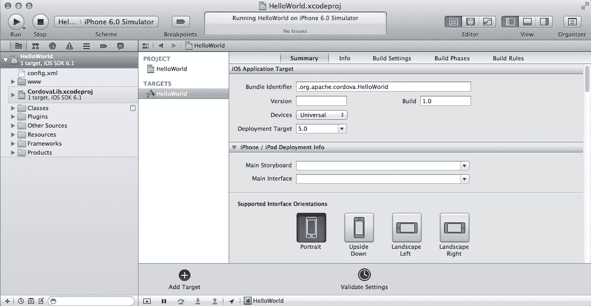

项目显示

看起来很简单对吧？这很好，因为这被称为工作区，这很关键，因为 Xcode 旨在使所有开发工作都集中在 IDE 的一个中心窗口中，帮助我们整合和加快开发过程。但要认识到这个工作区的两个关键方面：左侧的导航器区域，其中包含我们所有的文件，以及我们可以编辑所在项目的编辑器区域。

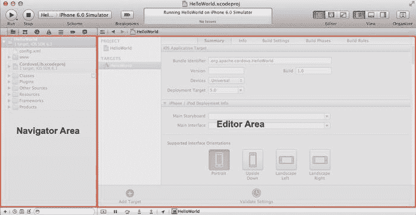

导航器和编辑器区域

前面的截图有助于演示 Xcode 在开发应用程序时的两个最关键的方面。请记住，根据所选的文件，您的编辑器区域会发生变化。例如，在前面的截图中，我们有一个 GUI，可以让我们设置项目的属性。

#### Xcode 工具栏

Xcode 工具栏具有各种功能，我们在开发原生应用程序时会经常使用。例如，在下面的截图中，有**Run**、**Stop**和**Breakpoints**按钮，以及**Scheme**选择器。在调试应用程序时，这些操作非常重要。**Run**按钮会运行您的应用程序。另一方面，**Stop**按钮将停止运行应用程序的所有活动。**Breakpoints**按钮将在编辑器区域显示我们的断点。

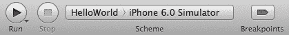

显示运行、Scheme 和断点的工具栏

**Scheme**选择器允许您选择要测试的应用程序以及要测试的环境。在我们的示例应用程序中，`HelloWorld`将使用 iPhone 6.0 模拟器进行测试，但我们有各种选项可供选择。从下面的截图中可以看到，如果安装了，我们可以使用 iPad 模拟器和各个版本以及 iPhone 模拟器来测试我们的应用程序。

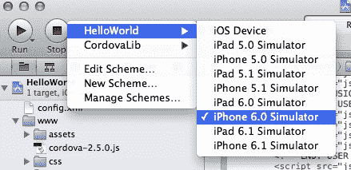

工具栏 Scheme 选择器

工具栏还有各种操作，位于 IDE 右侧，包括编辑器视图、常规视图和组织者。默认的编辑器视图是文本编辑器组件，允许我们对源文件进行基本编辑。中间的编辑器视图是助理编辑器，我们不会涉及。最后的编辑器视图是版本编辑器。

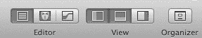

工具栏项目显示选项

版本编辑器对于我们作为开发人员来说非常有用，可以让我们立即编辑文件并查看版本变化。例如，在下面的截图中，我们可以看到添加了注释，并且原始版本文件通知用户更改发生的位置，让我们可以看到同一文件的实时编辑。

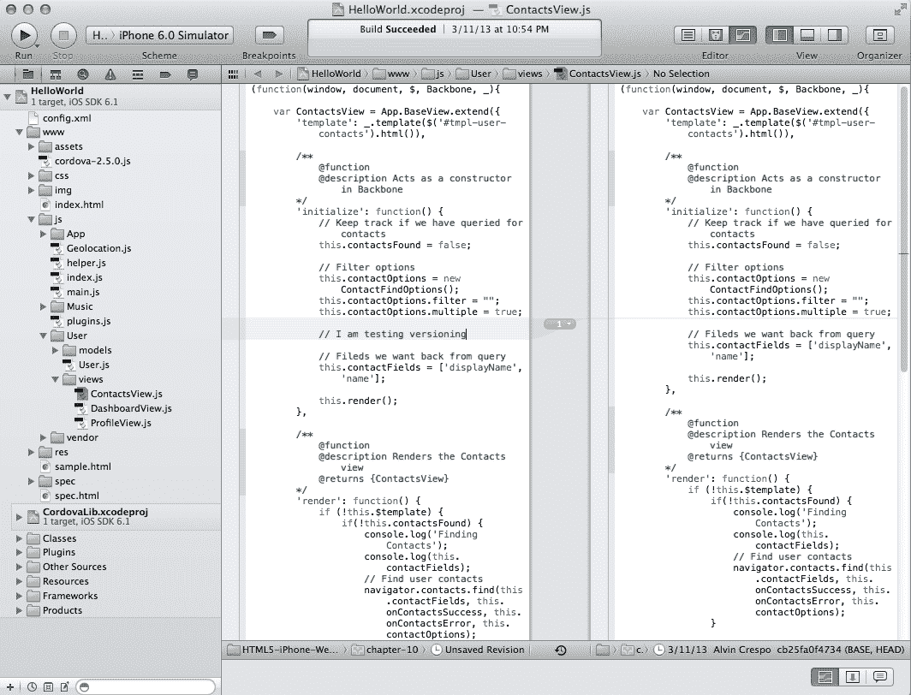

项目版本显示

继续讨论**View**工具栏部分，我们有三个按钮。每个按钮根据情况显示对我们有用的编辑器的某个部分。第一个按钮默认选中，因为它显示了左侧的导航器区域。中间的按钮显示了调试区域，如下面的截图所示：

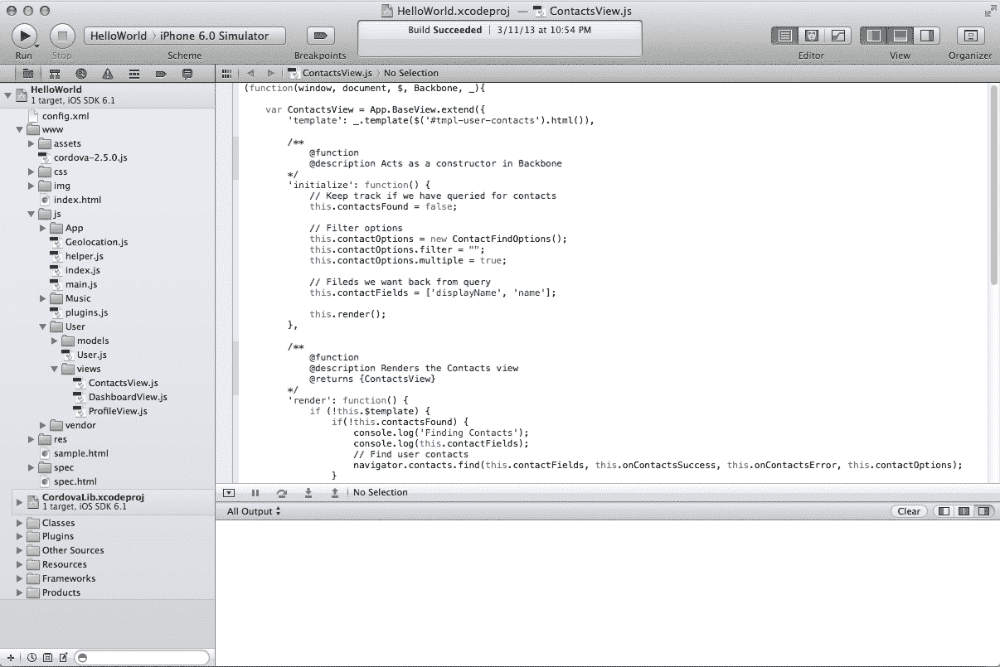

项目调试显示

这很好，因为我们现在可以在应用程序运行时调试应用程序并查看日志。记得我们在应用程序中使用的所有日志吗？它们会显示在这里；如果我们的浏览器中没有非常有用的开发者控制台，它们非常有用。工具栏中的最后一个按钮控制工具。这些工具帮助我们控制当前文件的各种设置；从名称到源代码控制，我们可以定制文件的各种细节。

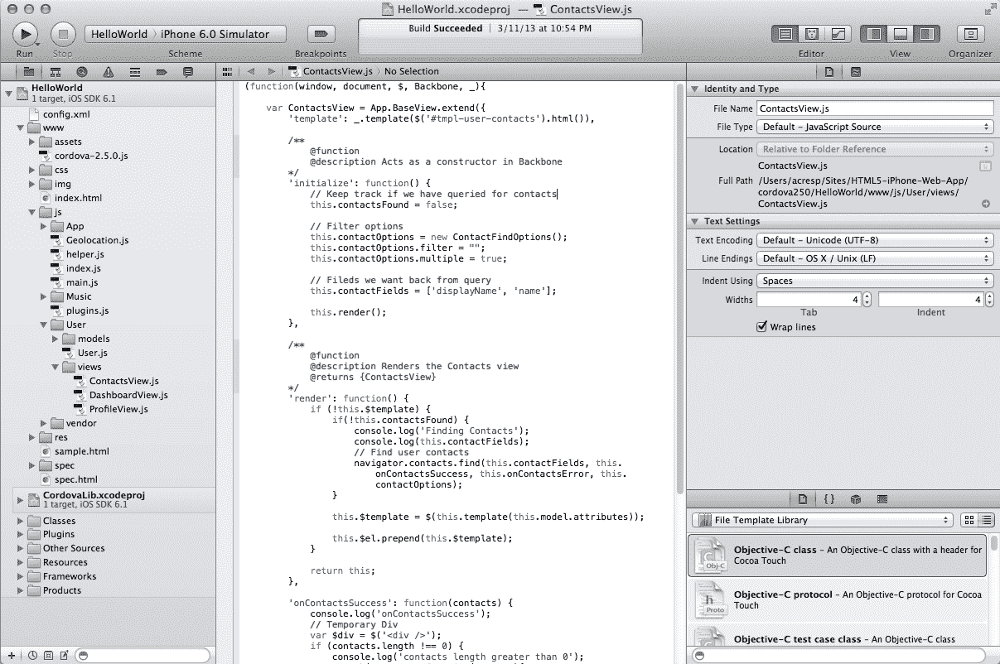

项目文件配置显示

好的，我们知道了 Xcode 的基本功能，还有很多可以探索的地方，而且作为开发者，它对我们来说既伟大又有益。我们可以继续介绍 Xcode 的所有非常有用的功能，但为了我们的利益，让我们转向 PhoneGap，毕竟我们更感兴趣的是学习如何构建原生应用程序。工具总是可以根据我们的需求使用和定制。

## 设置 PhoneGap

Xcode 在应用程序开发环境中非常好用。然而，PhoneGap 才是魔法发生的地方。它是一个框架，使我们能够基于我们已经用 HTML、CSS 和 JavaScript 编写的代码创建原生应用程序。因此，让我们回顾一下如何安装它，创建一个项目，并简要介绍它的支持和许可，以便为我们自己的应用程序利用其能力做好准备。

### 安装 PhoneGap

PhoneGap 非常容易上手；首先让我们从 PhoneGap 的网站安装它，网址是：[`phonegap.com/download/`](http://phonegap.com/download/)。当 ZIP 文件完全下载完成后，我们需要提取其内容。现在当您开始检查提取的内容时，您会注意到有很多内容，特别是在`lib`目录中列出了多个操作系统。这很好，因为 PhoneGap 支持多个平台，但我们想要的是特别针对 iOS 的。我们的重点应该放在以下内容上：

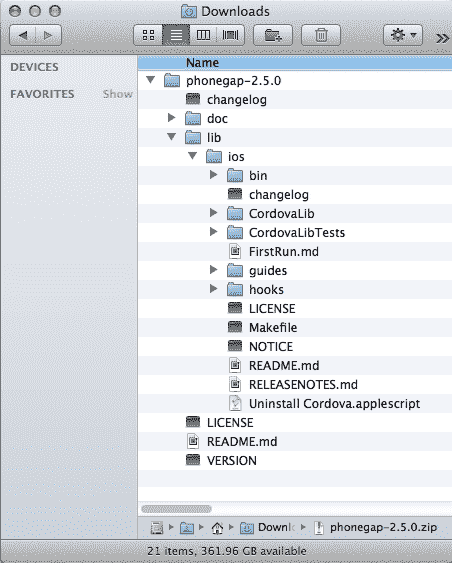

PhoneGap 目录结构

请注意，在 iOS 目录中，我们有多个文件，所有这些文件对于创建我们的第一个 PhoneGap 项目至关重要。在接下来的部分中，我们将使用这个经过简化的 PhoneGap 框架创建我们的第一个 PhoneGap 项目。

### 创建一个 PhoneGap 项目

现在我们已经下载并简化了 PhoneGap 框架以满足我们的需求，我们想要使用这个框架创建我们的第一个项目。为了做到这一点，我们需要我们值得信赖的**命令行界面**（**CLI**）的帮助。默认情况下，所有 Mac 操作系统都带有**终端**，但我们也可以使用 iTerm（免费）。无论哪种方式，启动该应用程序，它位于`/Applications/Utilities/`。

当您打开终端时，我们需要导航到 PhoneGap 文件所在的目录。默认情况下，这应该在我们的`Downloads`目录中，具体取决于您的浏览器设置。在这种情况下，我会使用`cd`命令导航到`/Users/acresp/Downloads`，如下所示：

```html
cd /Users/acresp/Downloads
```

一旦我们进入 PhoneGap 解压到的目录，我们需要导航到`phonegap`文件夹内`iOS`文件夹内的`bin`目录以查看。为此，我们可以输入以下内容：

```html
cd phonegap-2.5.0/lib/ios/bin/
```

现在我们可以使用`bin`文件夹内的`create` shell 脚本构建我们的 PhoneGap 应用程序。该脚本的文档如下：

```html
#
# create a Cordova/iOS project
#
# USAGE
#   ./create <path_to_new_project> <package_name> <project_name>
#
# EXAMPLE
#  ./create ~/Desktop/radness org.apache.cordova.radness Radness
#
```

这对我们来说非常好，因为我们知道可以轻松创建我们的应用程序。但在这之前，让我们确保我们的应用程序目录已经在我们的项目中创建了。在本章中，我创建了一个`cordova250`目录，其中包含我们的`HelloWorld`应用程序，可能还包含其他 PhoneGap 项目。

现在我们已经确保我们的应用程序目录存在，我们可以运行以下命令来确保我们的应用程序被创建：

```html
./create ~/Sites/HTML5-iPhone-Web-App/cordova250/HelloWorld .org.apache.cordova.HelloWorld HelloWorld
```

这将在`cordova250`文件夹内产生一个名为`HelloWorld`的目录，其中包含我们启动所需的所有必要文件。我们现在已经创建了我们的第一个 PhoneGap 项目。目前还没有太多的事情发生，但让我们继续；我们很快就会开始开发原生应用程序。首先，让我们回顾一下这个框架的支持以及支持它的许可证。

### PhoneGap 许可证

您可能会对 PhoneGap 许可证感到好奇，特别是因为我们在创建应用程序的过程中使用了许多开源项目。PhoneGap 基于 Apache 许可证（[`phonegap.com/about/license/`](http://phonegap.com/about/license/)）。对我们来说更好的是，Apache 基金会为我们提供了清晰简明的关于允许、禁止和要求的信息。直接来自*常见问题*部分的*这意味着什么？*部分（可在[`www.apache.org/foundation/license-faq.html#WhatDoesItMEAN`](http://www.apache.org/foundation/license-faq.html#WhatDoesItMEAN)找到），我们得到了所有我们需要的细节：

> 它允许您：
> 
> 自由下载和使用 Apache 软件，全部或部分，用于个人、公司内部或商业目的；
> 
> 在您创建的软件包或分发中使用 Apache 软件。
> 
> 它禁止你：
> 
> 在没有适当归属的情况下重新分发任何 Apache 来源的软件;
> 
> 以任何方式使用 Apache 软件基金会拥有的标记，可能会声明或暗示基金会支持您的分发;
> 
> 以任何方式使用 Apache 软件基金会拥有的标记，可能会声明或暗示您创建了相关的 Apache 软件。
> 
> 它要求你：
> 
> 在任何包含 Apache 软件的重新分发中包含许可证的副本;
> 
> 为包含 Apache 软件的任何分发提供清晰的归属于 Apache 软件基金会。
> 
> 它不要求你：
> 
> 在任何包含 Apache 软件的重新分发中，包括 Apache 软件本身的源代码，或者您对其进行的任何修改;
> 
> 提交您对软件所做的更改给 Apache 软件基金会（尽管鼓励这样的反馈）。

基于这些参数，我们可以继续使用 PhoneGap 创建开源软件，只要我们在每次重新分发时包含许可证的副本，同时清晰地归属于 Apache 软件基金会。如果您有任何与 PhoneGap 许可证或 Apache 2.0 许可证相关的其他问题，可以在上述链接和 PhoneGap 许可证页面（[`phonegap.com/about/license/`](http://phonegap.com/about/license/)）上找到更多信息。

## 配置我们的项目

我们的项目可以配置以满足我们的需求，同时也满足我们的用户需求。这个过程非常简单，并且在 PhoneGap API 文档网站（[`docs.phonegap.com/en/2.5.0/guide_project-settings_index.md.html#Project%20Settings`](http://docs.phonegap.com/en/2.5.0/guide_project-settings_index.md.html#Project%20Settings)）上有很好的文档。大多数这些设置都可以通过我们项目目录`/cordovar250/HelloWorld/HelloWorld/config.xml`中的`config.xml`文件轻松修改。

以下是可以定制的当前列表：

| 首选项 | 描述 |
| --- | --- |
| `UIWebViewBounce`（布尔值，默认为**true**） | 这设置了橡皮筋类型的交互/弹跳动画的属性。 |
| `TopActivityIndicator`（字符串，默认为**gray**） | 这设置了状态/电池栏中旋转的指示器的颜色，有效值为**whiteLarge**、**white**和**gray**。 |
| `EnableLocation` (布尔值，默认为**false**) | 这确定是否在启动时初始化地理位置插件，使您的位置在启动时更准确。 |
| `EnableViewportScale` (布尔值，默认为**false**) | 这启用/禁用视口缩放。 |
| `AutoHideSplashScreen` (布尔值，默认为**true**) | 这控制着是否通过 JavaScript API 隐藏启动画面。 |
| `FadeSplashScreen` (布尔值，默认为**true**) | 这使启动画面淡入淡出。 |
| `FadeSplashScreenDuration` (浮点数，默认为**2**) | 这表示启动画面的淡入淡出持续时间（以秒为单位）。 |
| `ShowSplashScreenSpinner` (布尔值，默认为**true**) | 这显示或隐藏启动画面的加载旋转器。 |
| `MediaPlaybackRequiresUserAction` (布尔值，默认为**false**) | 这允许 HTML5 自动播放。 |
| `AllowInlineMediaPlayback` (布尔值，默认为**false**) | 这控制内联 HTML5 媒体播放。HTML 文档中的`video`元素还必须包括`webkit-playsinline`属性。 |
| `BackupWebStorage` (字符串，默认为**cloud**) | 如果设置为**cloud**，存储数据将备份到 iCloud。如果设置为**local**，只会进行本地备份。如果设置为**none**，则不会发生任何备份。 |
| `KeyboardDisplayRequiresUserAction` (布尔值，默认为**true**) | 如果设置为**false**，当通过 JavaScript 的`focus()`调用`form`元素时，键盘将打开。 |
| `SuppressesIncrementalRendering` (布尔值，默认为**false**) | 这允许在渲染之前接收内容。 |

# 转移网络应用

此时，我们已经使用 PhoneGap 和 Xcode 创建了一个名为`HelloWorld`的示例应用程序。现在，我们将通过回顾从第七章*单页应用程序*转移我们的单页应用程序。在本节中，我们将介绍如何转移我们的资产，包括我们的标记、样式和脚本，然后学习如何调试我们的应用程序。最后，我们将通过使用 PhoneGap 允许我们利用已经编写的代码来扩展我们的单页应用程序，使用本机功能来扩展我们的单页应用程序。

## 转移我们的资产

让我们开始转移我们的资产。本节将简要介绍如何以最小的努力转移我们所写的内容。这里的目标基本上是拥有与本地运行的相同应用程序。我们暂时不会使用 PhoneGap 的内置功能，但我们将很快拥有一个正在运行的应用程序。

### 包括我们的标记

我们要做的第一件事是打开之前使用 PhoneGap 生成的 Xcode 项目。为此，我们首先在 Finder 中找到我们的项目，在我的情况下是`~/Sites/HTML5-iPhone-Web-App/cordova250/HelloWorld/`。一旦找到我们的项目，双击`HelloWorld.xcodeproj`文件；这将在 Xcode 中启动项目。

一旦 Xcode 启动了我们的项目，我们将看到它索引我们的文件。在索引过程中，它不会阻止您与项目进行交互，因此您可以开始编辑文件。因此，让我们继续查看位于`www`目录中的`index.html`文件。

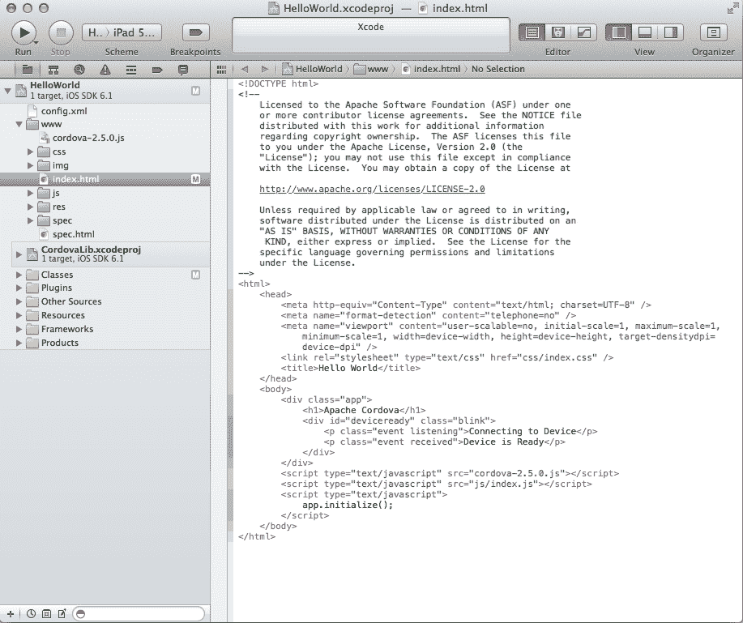

我们项目的初步 HelloWorld 标记

正如您所看到的，我们已经为我们设置了一个基本模板。让我们运行这个`HelloWorld`标记，看看结果。您应该首先看到的是一个带有默认 PhoneGap 图像的启动画面，紧接着是设备准备好的介绍。以下是显示结果的屏幕截图：

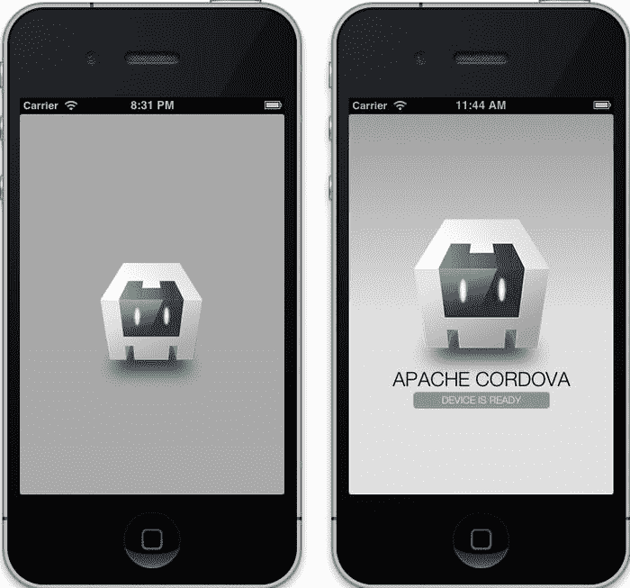

启动画面和设备准备好画面

现在我们知道我们的应用程序正在使用默认的标记和样式运行，我们应该能够相当快地移动。因此，首要任务是从第七章 *单页应用*中看到的单页应用程序屏幕中带有完成标记的导入。我们不会在这里回顾为该章节编写的代码，但这是模板：

```html
<!DOCTYPE html>
<html class="no-js">
<head>
    <meta charset="utf-8">
    <title></title>

    <meta http-equiv="Content-Type" content="text/html; charset=UTF-8" />
    <meta name="format-detection" content="telephone=no" />
    <meta name="viewport" content="user-scalable=no, initial-scale=1, maximum-scale=1, minimum-scale=1, width=device-width, height=device-height, target-densitydpi=device-dpi" />

    <link rel="stylesheet" href="css/normalize.css">
    <link rel="stylesheet" href="css/main.css">
    <link rel="stylesheet" href="css/singlepage.css">
    <script src="img/modernizr-2.6.1.min.js"></script>
</head>
    <body>
        <div class="app">
            <div id="deviceready" class="blink">
                <p class="event listening">Connecting to Device</p>
                <div class="event received site-wrapper">
                    <header>
                        <hgroup>
                            <h1>iPhone Web Application Development</h1>
                            <h2>Single Page Applications</h2>
                        </hgroup>
                    </header>
                    <div class="content"></div>
                    <footer>
                        <p>iPhone Web Application Development &copy; 2013</p>
                    </footer>
                </div>
            </div>
        </div>
    </body>
</html>
```

请记住，我们已经进行了一些修改，以适应这个目录结构。例如，我们不再使用`../css/somefile.css`来引用我们的 CSS 文件，而是使用`css/somefile.css`，其他资产也是如此。您还会注意到，前面的代码模板不包括我们从第七章 *单页应用*中创建的模板；这是为了使前面的模板在如何导入资产到您自己的 PhoneGap 项目方面保持简短和简单。

在这一点上，我们不会测试我们的应用程序，因为我们还没有导入我们的资产，包括样式和脚本，但我们现在应该还不错。我们想要在这里得到的是，导入现有的静态 Web 应用程序就像复制和粘贴一样简单，但不要被这个愚弄；大多数应用程序并不像这样简单，这个例子只是为了演示开始的简单。现在让我们继续导入我们的样式。

### 整合我们的样式

我们现在在我们的项目`index.html`文件中设置了标记。这很容易；这部分也将很容易。我们需要做的就是包含用于此项目的 CSS 文件。为了简化，我只是将我们以前的所有样式表都包含到 Xcode 项目的 CSS 目录中。您的项目现在应该是这样的：

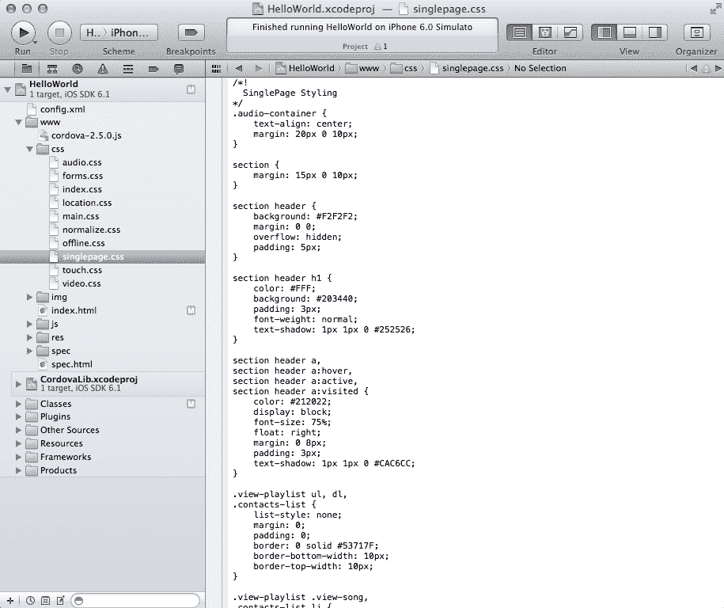

我们导入的样式表

现在我们已经将我们的样式表导入到 Xcode 项目中，我们已经完成了一半。在这一点上，我们需要导入我们的脚本。同样，在这里不要测试您的应用程序，因为它可能不起作用。这最后一点将使我们达到我们需要的地方，所以让我们开始导入我们的脚本。

### 插入我们的脚本

好的，我们已经导入了我们的标记和样式表，这很棒。但还有最后一部分，我们的 JavaScript。这最后一部分对于使我们的应用程序运行至关重要。因此，让我们开始做与我们的样式相同的事情；只需将所有脚本导入 Xcode 项目的`js`目录中。当您这样做时，结果将如下所示：

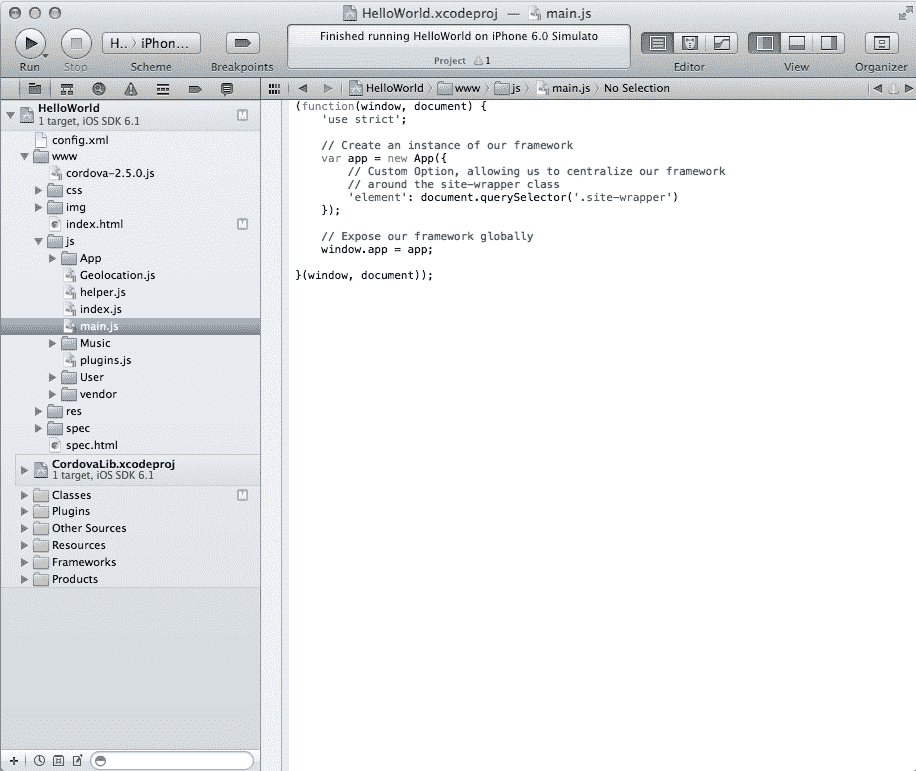

我们导入的脚本

我们的脚本在 Xcode 项目中。但我们仍然需要进行一些配置，包括在`index.html`文件中正确引用我们的脚本，并确保我们的应用程序将按预期启动。让我们首先在`index.html`文件中正确引用我们的脚本。

还记得两节前我们转移过的标记，展示了一个默认模板吗？我们要退一步再次看看那个模板，除了我们只会看标记底部在`body`标签关闭之前。这是我们的应用程序以前包含 JavaScript 的地方；所以这里没有什么新的，我们只是想确保文件被正确引用。只需确保在您的`index.html`文件中，您的脚本看起来像这样：

```html
        <!-- BEGIN: LIBRARIES / UTILITIES-->
        <script src="img/cordova-2.5.0.js"></script>
        <script src="img/zepto.min.js"></script>
        <script src="img/underscore-1.4.3.js"></script>
        <script src="img/backbone-0.9.10.js"></script>
        <script src="img/helper.js"></script>
        <!-- END: LIBRARIES / UTILITIES-->
        <!-- BEGIN: FRAMEWORK -->
        <script src="img/App.js"></script>
        <script src="img/App.Nav.js"></script>
        <script src="img/BaseView.js"></script>
        <!-- END: FRAMEWORK -->
        <!-- BEGIN: MUSIC PLAYLIST APPLICATION -->
        <script src="img/Music.js"></script>
        <script src="img/SongModel.js"></script>
        <script src="img/SongCollection.js"></script>
        <script src="img/SongView.js"></script>
        <script src="img/PlayListView.js"></script>
        <script src="img/AudioPlayerView.js"></script>
        <!-- END: MUSIC PLAYLIST APPLICATION -->
        <!-- BEGIN: USER APPLICATION -->
        <script src="img/User.js"></script>
        <script src="img/UserModel.js"></script>
        <script src="img/DashboardView.js"></script>
        <script src="img/ProfileView.js"></script>
  <!-- END: USER APPLICATION -->
        <script src="img/main.js"></script>
        <!-- END: BACKBONE APPLICATION -->
    </body>
</html>
```

注意这里发生的一些事情。首先，我们在最顶部包含了 PhoneGap 提供的`cordova`库；当我们尝试检测`deviceready`事件时，这将是至关重要的。接下来，我们将所有 JavaScript 源文件引用到 Xcode 项目中的`js`目录，而不是`../js`。现在，我们需要做的最后一件事是确保我们的代码在设备准备就绪时运行，这意味着我们需要修改我们的单页应用程序的启动方式。

为了确保我们的应用程序启动，我们需要监听 PhoneGap 事件提供的`deviceready`事件（[`docs.phonegap.com/en/2.5.0/cordova_events_events.md.html#deviceready`](http://docs.phonegap.com/en/2.5.0/cordova_events_events.md.html#deviceready)）。一旦 Cordova 完全加载，就会触发此事件。这是至关重要的，因为在本地代码加载时 DOM 没有加载，并且启动画面被显示。因此，当 DOM 加载之前需要 Cordova 函数时，我们可能会遇到问题。因此，为了我们的目的，我们将监听`deviceready`事件，然后启动我们的应用程序。可以使用以下代码完成：

```html
<script>
    (function(){
     document.addEventListener('deviceready', onDeviceReady, false);

     function onDeviceReady(){
        console.log("onDeviceReady");
        var parentElement,
            listeningElement,
            receivedElement;

        parentElement = document.getElementById('deviceready');
        listeningElement = parentElement.querySelector('.listening');
        receivedElement = parentElement.querySelector('.received');

        listeningElement.setAttribute('style', 'display:none;');
        receivedElement.setAttribute('style', 'display:block;');

        // Start our application
        Backbone.history.start();
     }
    }());
</script>
```

让我们逐行检查这段代码。首先，我们创建一个立即执行的闭包。在这个范围内，我们监听`deviceready`事件并分配`onDeviceReady`回调函数。然后，我们定义了`onDeviceReady`回调，显示和隐藏我们的应用程序。这个方法创建了三个变量，`parentElement`，`listeningElement`和`receivedElement`。我们缓存了`deviceready` DOM 元素并将其分配给`parentElement`，我们对`listeningElement`和`receivedElement`也做了同样的事情。接下来，我们在适当的元素上设置`style`属性，显示应用程序并隐藏启动画面。最后，我们启动基于 Backbone 的单页应用程序。

让我们将前面的脚本放在`index.html`文件中所有脚本之后。现在，我们应该能够成功运行我们的应用程序并导航到仪表板、个人资料和播放列表视图。如果之前讨论的一切都正确地完成了，您应该能够像这样本地使用您的单页应用程序：

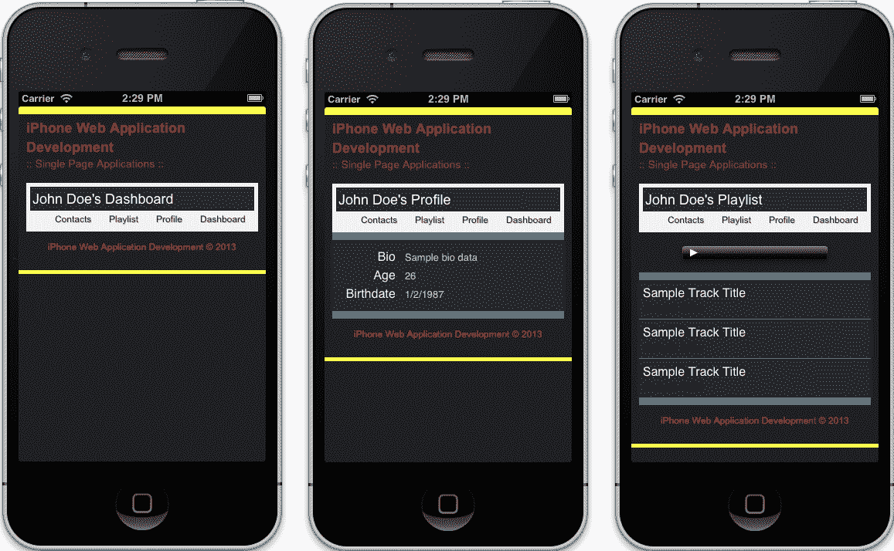

本地单页应用程序

### 注意

请注意，在前面的屏幕截图中，我们有一个**联系人**导航项。这尚未构建，将成为本章最后一部分的一部分。

到目前为止，我们已经创建了一个本地应用程序，展示了使用 PhoneGap 转移当前 Web 应用程序的简单性。是的，我们没有充分利用 PhoneGap 或 Xcode，但我们现在明白了启动流程是相当容易的。我们将暂时绕过来理解调试我们的应用程序，并最终使用 PhoneGap 的 API 构建本地组件到我们的应用程序中。

## 调试我们的应用程序

调试应用程序对于任何工作流程或流程都是至关重要的；因此，我们需要知道调试基于 Web 技术构建的本地应用程序是什么样的。这并不像你想象的那样复杂或容易。但它仍然是可行的，并且在撰写本文时，这是调试应用程序的最佳方式之一。所以让我们开始吧。

### 记录我们的代码

我们都熟悉通过 JavaScript 可用的控制台对象。这对我们仍然可用，但在创建本地应用程序时，尝试找到日志输出的位置时会有些困惑。传统上，我们在模拟器或实际设备上有一个可用于调试错误的控制台工具；然而，现在不再是这样。

首先，让我们看看 Xcode 中的日志记录是如何进行的。还记得本章前面讨论过的调试视图吗？好吧，这就是我们想要使用它的地方。所以首先，让我们启用调试视图。现在，让我们运行我们目前拥有的应用程序。

当我们运行您的应用程序时，我们应该在调试器区域看到以下内容：

```html
2013-03-16 14:24:43.732 HelloWorld[2322:c07] Multi-tasking -> Device: YES, App: YES
2013-03-16 14:24:44.624 HelloWorld[2322:c07] Resetting plugins due to page load.
2013-03-16 14:24:45.196 HelloWorld[2322:c07] Finished load of: file:///Users/acresp/Library/Application%20Support/iPhone%20Simulator/6.0/Applications/DEEABC2E-C2D6-40F3-A19E-43E4F7F5EB47/HelloWorld.app/www/index.html
2013-03-16 14:24:45.243 HelloWorld[2322:c07] [LOG] onDeviceReady
```

我们应该关注最后一行，即`[LOG]`发生的地方。这是使用`console.log()`生成的输出，目前在我们的`onDeviceReady`回调中。这对我们来说很好，因为我们可以积极地看到我们创建的日志。这样做的负面影响是，我们没有在其他浏览器中找到的典型开发人员工具。但是最近的发展使我们现在可以使用 Safari 内置的开发人员工具来调试在模拟器中运行的 iOS 应用程序。

### 使用 Safari 开发人员工具

正如我之前提到的，我们现在能够使用 Safari 的开发者工具调试基于 PhoneGap 构建的 Web 应用程序。所以让我们快速尝试一下，打开我们电脑上的 Safari。如果您还没有启用开发者工具，请进入 Safari 的偏好设置，并在**高级**选项卡下选择**在菜单栏中显示开发菜单**复选框。

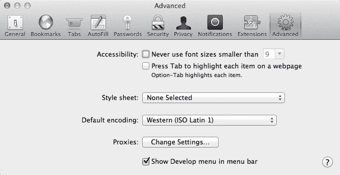

Safari 偏好设置的高级选项卡

一旦我们启用了开发者工具，我们可以从 Safari 的**开发**菜单中访问它们。如果我们的应用程序在 iOS 模拟器中运行，那么我们应该能够通过从 iPhone 模拟器子菜单中选择`index.html`来调试我们的应用程序。然后这将在 Safari 中启动本机开发者工具。

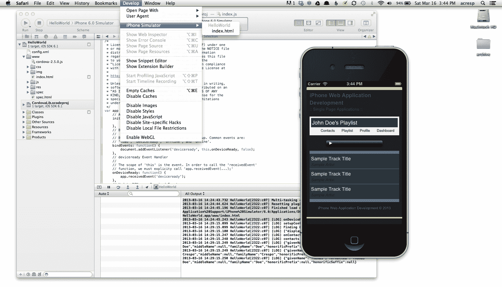

调试环境

现在我们能够使用 Safari 开发者工具完全调试本机应用程序。拥有一个完全集成的开发环境，模拟和调试都是这个过程的一部分，这真的很容易。虽然我们可以进一步详细讨论调试，但这超出了本书的范围。然而，让我们继续本书的最后一部分，我们将学习如何利用 PhoneGap 的内置 API 来连接到我们单页应用程序的本机功能。

## 扩展我们的应用程序与本机功能

恭喜！我们已经能够使用我们已经创建的 HTML5、CSS 和 JavaScript 创建我们的第一个本机应用程序。这是令人兴奋的事情，但我们还没有完成。现在让我们利用 PhoneGap 的 API 之一来利用本机功能。

从更高的层次上，我们希望我们的应用程序显示我们手机上的联系人。当我们点击应用程序导航中的**联系人**按钮时，我们希望能够访问这些信息。在这个例子中，我们只想显示我们联系人的全名。为了实现这些目标，我们将使用 PhoneGap 的 Contacts API ([`docs.phonegap.com/en/2.5.0/cordova_contacts_contacts.md.html#Contacts`](http://docs.phonegap.com/en/2.5.0/cordova_contacts_contacts.md.html#Contacts))。为此，我们将确保在我们的应用程序中进行了配置，然后编写适当的代码来处理这个问题，已经存在的应用程序框架中。让我们从配置开始。

### 配置我们的应用程序

我们已经在之前讨论了配置我们的应用程序的基础知识，但让我们再次看一下以确保完全理解。首先，让我们打开位于项目顶部的`config.xml`文件。然后通过将其值设置为`CDVContacts`来启用 Contacts API。完成后，您的`config.xml`文件应包含以下内容：

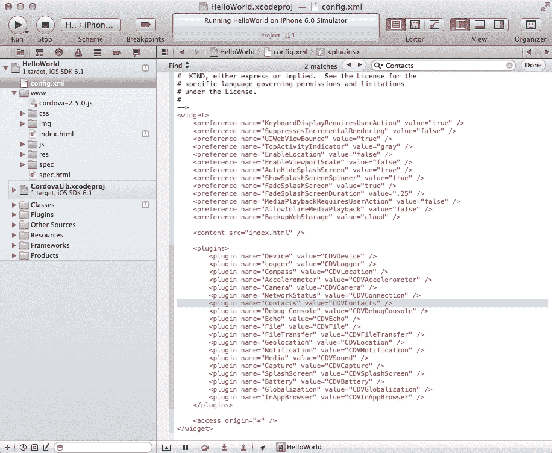

项目配置

### 设置我们的联系人功能

在本章的这一部分，我们将看看如何连接到我们的联系人信息以在我们的本机应用程序中显示。首先我们将创建视图，然后模板，最后是随 PhoneGap 提供的实际 API。完成后，我们应该对如何利用这些 API 来为 iOS 创建本机 Web 应用程序有一个很好的想法。

#### 创建 ContactsView 类

一旦我们为这个应用程序设置了配置，我们需要设置其他一切以使联系人视图正常工作。首先，让我们创建一个联系人视图，添加到我们的用户目录中。我们稍后会扩展其功能，但现在这是我们将使用的模板：

```html
(function(window, document, $, Backbone, _){

  var ContactsView = App.BaseView.extend({
    'template': _.template($('#tmpl-user-contacts').html()),

    'initialize': function() {

      this.render();
    },

    'render': function() {

      return this;
    }
  });

  window.User.ContactsView = ContactsView;

}(window, document, Zepto, Backbone, _));
```

上述代码并没有什么新东西。我们基本上正在创建一个遵循我们之前设置的约定的`ContactsView`类，没有任何额外的功能。请注意，我们已经为此视图设置了一个尚不存在的模板。让我们在`index.html`中包含此文件，并将其添加到最后一个被包含的视图中。现在，让我们创建与此视图相关联的模板。

#### 实现 ContactsView 模板

使用我们已经为播放列表构建的内容，我们将简单地复制播放列表视图的模板并更改其标题。与此同时，我们还将将无序列表的类更改为`contacts-list`。完成后，我们的模板将如下所示：

```html
<script type="tmpl/User" id="tmpl-user-contacts">
    <section class="view-contacts">
    <header>
    <h1><%= name + "'s" %> Contacts</h1>
    <% print(_.template($('#tmpl-user-nav').html(), {})); %>
    </header>
    <ul class="contacts-list"></ul>
    </section>
</script>
```

在我们创建的其他模板之后包含此模板。此时，我们应该已经完成了 50%。现在，您可能会遇到一些样式问题，但请确保将`contacts-list`类添加到与播放列表使用的相同样式中。我们不会在这里详细介绍，因为这相当简短；因此，我们将继续编写联系人实现。

#### 集成联系人 API

查找用户的联系人使用 PhoneGap API 非常简单。实际上，我们的示例将基于文档中的`Navigator`对象`contacts`。但首先，我们需要创建一个`ContactFindOptions`的新实例（[`docs.phonegap.com/en/2.5.0/cordova_contacts_contacts.md.html#ContactFindOptions`](http://docs.phonegap.com/en/2.5.0/cordova_contacts_contacts.md.html#ContactFindOptions)），它将在查找联系人时保存我们的过滤选项。

```html
'initialize': function() {

  // Filter options
  this.contactOptions = new ContactFindOptions();
  this.contactOptions.filter = "";
  this.contactOptions.multiple = true;

  this.render();
},
```

上述代码在`ContactFindOptions`的实例上设置了`filter`和`multiple`属性。默认情况下，`filter`为空，表示没有限制，`multiple`设置为`true`，允许多个联系人通过。接下来，当我们获取联系人时，我们希望找到两个字段，它们的`displayName`和`name`。这些字段将在一个数组中，我们很快会用到。

```html
'initialize': function() {

  // Filter options
  this.contactOptions = new ContactFindOptions();
  this.contactOptions.filter = "";
  this.contactOptions.multiple = true;

  // Fileds we want back from query
  this.contactFields = ['displayName', 'name'];

  this.render();
},
```

接下来，我们希望在视图渲染时找到联系人。因此，在我们的渲染视图中，我们希望传入前面的选项。

```html
'render': function() {
    // Find user contacts
    navigator.contacts.find(this.contactFields, this.onContactsSuccess, this.onContactsError, this.contactOptions);

    this.$template = $(this.template(this.model.attributes));

    this.$el.prepend(this.$template);
  }

  return this;
},
```

请注意，我们尚未创建我们的`onContactsError`或`onContactsSuccess`方法。此外，您将看到我们创建模板并将其附加到 DOM 的方式与我们为所有其他视图所做的方式相同。这个方法没有太多要做的事情，所以让我们看看我们的回调，从`onContactSuccess`开始。

`onContactSuccess`回调是我们所有魔法发生的地方。我们将在内存中创建一个`div`元素，然后循环遍历结果，将每个元素作为列表项添加到`div`中。一旦完成所有操作，我们将获取`div`元素的内容并将其添加到我们的`contacts-list`无序列表中。

```html
'onContactsSuccess': function(contacts) {
  console.log('onContactsSuccess');
  // Temporary Div
  var $div = $('<div />');
  if (contacts.length !== 0) {
    console.log('contacts length greater than 0');
    _.each(contacts, function(contact){
      console.log(contact.name);
      $div.append($('<li>' + contact.name.formatted + '</li>'));
    });
  } else {
    alert("No contacts found!");
  }

  $('.contacts-list').append($div.html());
},
```

正如您在这里看到的，我们使用**underscore**方法`each`来循环遍历结果。正如我们之前提到的，我们创建一个包含用户姓名的列表项作为其文本内容。这里的行为非常简单，没有太复杂的东西。现在，让我们来看看我们的`onContactsError`回调：

```html
'onContactsError': function(contactsError) {
  alert('onContactsError!');
}
```

在这个回调中，我们只是警告发生了错误。当然，在我们的真实应用程序中，我们会创建更全面的内容，但对于我们的目的来说，这已经足够了。如果我们现在运行我们的应用程序，我们应该会得到以下结果：

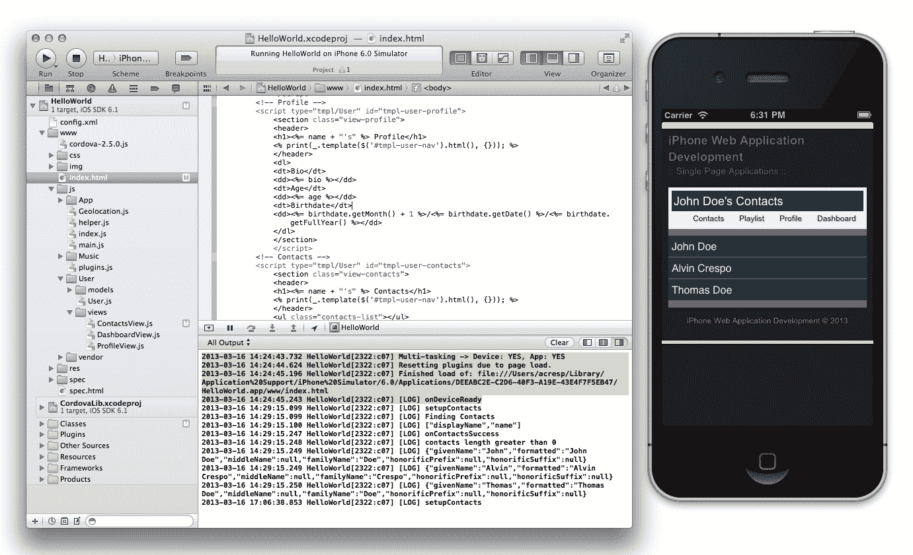

联系人 API 实现

给自己一个鼓励！您已经到达本节的末尾，现在已成功集成了 PhoneGap API，并利用了本地功能。非常酷，不是吗？

### 注意

请注意，本书提供的源代码进行了一些检查，确保用户每次访问**联系人**视图时不会添加相同的联系人。这样做是为了节省一些时间，真正专注于解决方案的核心。

# 摘要

在本章中，我们介绍了使用与我们用于 Web 应用程序相同的编程语言进行本机应用程序开发。使用流行的开源 PhoneGap 框架，我们实现了创建单页面应用程序的能力，在第七章中构建的*单页应用程序*，作为 iOS 的本机应用程序。我们通过使用 PhoneGap 中的联系人 API 来扩展单页面应用程序，将其与本机功能联系起来，列出我们的联系人和一些信息。现在我们应该有一个创建本机应用程序的基础，使我们能够使用 Web 技术来分发 iOS Safari 和 iOS 操作系统的 Web 应用程序。
