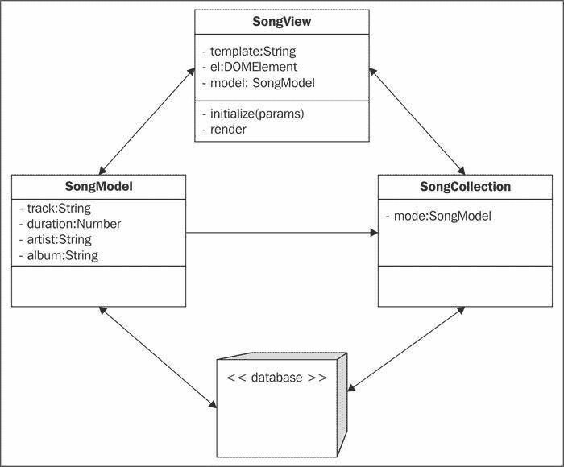

# 七、单页应用

在此之前，我们已经开发了具有相关静态内容的单独页面。在这一章中，我们通过深入到单页应用开发来提升它。我们已经在许多网络应用中看到了这一点，包括潘多拉、薄荷和 NPR。我们将介绍单页应用开发的基础，从对 MVC、下划线和主干的介绍，到用我们的示例应用创建体系结构，以及利用本章第一节中讲授的方法。完成本章后，您应该对单页应用背后的概念有一个坚实的理解，这将允许您继续扩展这些知识，并帮助指导您构建复杂的应用。所以让我们先从学习 MVC 开始。

在本章中，我们将介绍:

*   MVC 架构
*   `Underscore.js`简介
*   `Backbone.js`简介
*   创建单页应用

# 模型-视图-控制器或 MVC

**模型-视图-控制器** ( **MVC** )是编程中大量使用的设计模式。设计模式本质上是解决编程中常见问题的可重用解决方案。例如， **命名空间**和 **立即调用函数表达式**是本书通篇使用的模式。MVC 是帮助解决表示层和数据层分离问题的另一种模式。它帮助我们将标记和样式保持在 JavaScript 之外；保持我们的代码有条理、干净和可管理——这是创建单页应用的所有基本要求。因此，让我们从模型开始，简单讨论一下 MVC 的几个部分。

## 车型

模型是对对象的描述，包含与其相关的属性和方法。想想是什么构成了一首歌，例如曲目的标题、艺术家、专辑、年份、持续时间等等。本质上，模型是数据的蓝图。

## 视图

视图是模型的物理表示。它本质上是向用户显示模型的适当属性、页面上使用的标记和样式。因此，我们使用模板用提供的数据填充视图。

## 控制器

控制器是模型和视图之间的中介。控制器接受动作，并在必要时在模型和视图之间传递信息。例如，用户可以编辑模型上的属性；完成后，控制器告诉视图根据用户的更新信息进行更新。

## 关系

MVC 应用中建立的关系对于坚持设计模式至关重要。在 MVC 中，理论上，模型和视图从来不会互相说话。相反，控制器做所有的工作；它描述了一个动作，当这个动作被调用时，模型、视图或者两者都会相应地更新。下图中建立了这种类型的关系:


该图解释了传统的 MVC 结构，特别是控制器和模型之间的通信是双向的；对于视图，控制器可以向/从模型发送数据，反之亦然。然而，视图和模型从不交流，这是有充分理由的。我们要确保我们的逻辑被适当地包含；因此，如果我们想要为用户操作适当地委托事件，那么代码将进入视图。

然而，如果我们想要实用的方法，比如将用户的名字和姓氏适当地结合起来的`getName`方法，那么代码将包含在用户模型中。最后，任何与检索和显示数据相关的操作都将包含在控制器中。

理论上来说，这种模式帮助我们保持代码的组织性、整洁性和高效性。在许多情况下，这种模式可以直接应用，尤其是在许多后端语言中，如 Ruby、PHP 和 Java。然而，当我们开始将此严格应用于前端时，我们面临许多结构性挑战。同时，我们需要这种结构来创建可靠的单页应用。以下部分将向您介绍我们将用来解决这些问题的库以及更多内容。

# 下划线介绍

我们将在示例应用中使用的库之一是`Underscore.js`。下划线在过去几年变得非常流行，因为它为开发人员提供了许多实用的方法，而无需扩展内置的 JavaScript 对象，例如`String`、`Array`或`Object`。虽然它提供了许多有用的方法，但该套件也在许多最流行的网络浏览器(包括 Internet Explorer)上进行了优化和测试。由于这些原因，社区广泛采用了这个库，并持续支持它。

## 实施

下划线在我们的应用中非常容易实现。为了让下划线继续，我们需要做的就是把它包含在我们的页面上，如下所示:

```html
<!DOCTYPE html>
<html>
    <head>
        <meta charset="utf-8">
        <meta http-equiv="X-UA-Compatible" content="IE=edge,chrome=1">
        <title></title>
        <meta name="description" content="">
        <meta name="viewport" content="width=device-width">
    </head>
    <body>
        <script src="//ajax.googleapis.com/ajax/libs/jquery/1.9.0/jquery.min.js"></script>
        <script src="//cdnjs.cloudflare.com/ajax/libs/underscore.js/1.4.3/underscore-min.js"></script>
    </body>
</html>
```

一旦我们在页面上包含下划线，我们就可以使用`_`对象访问全局范围内的库。然后，我们可以通过执行`_.methodName`来访问库提供的任何实用方法。您可以查看下划线在线([http://underscorejs.org/](http://underscorejs.org/))提供的所有方法，其中所有方法都有文档记录，并包含其实现的示例。现在，让我们简要回顾一下我们将在应用中使用的一些方法。

### _。扩展

下划线中的`extend`方法与我们从`Zepto`([http://zeptojs.com/#$.extend](http://zeptojs.com/#$.extend))使用的扩展方法非常相似。如果我们查看下划线网站([http://underscorejs.org/#extend](http://underscorejs.org/#extend))上提供的文档，我们可以看到它采用多个对象，第一个参数是所有对象组合后返回的目标对象。

> 将源对象中的所有属性复制到目标对象，并返回目标对象。它是有序的，所以最后一个源将覆盖前面参数中同名的属性。

举个例子，我们可以取一个`Song`对象，创建它的一个实例，同时覆盖它的默认属性。这可以从以下示例中看出:

```html
<script>
    function Song() {
        this.track = "Track Title";
        this.duration = 215;
        this.album = "Track Album";
    };

    var Sample = _.extend(new Song(), {
        'track': 'Sample Title',
        'duration': 0,
        'album': 'Sample Album'
    });
</script>
```

如果我们注销`Sample`对象，我们会注意到它继承了`Song`构造函数，并覆盖了默认属性`track`、`duration`和`album`。虽然我们可以使用传统的 JavaScript 提高继承的性能，但是使用`extend`方法有助于我们专注于交付。在本章的后面，我们将研究如何利用这个方法在我们的示例应用中创建一个基础架构。

### _。每个

当我们想要迭代一个`Array`或者`Object`的时候`each`方法是非常有用的。事实上这是我们在`Zepto` 和其他像`jQuery`这样的流行库中可以找到的另一种方法。虽然每个库的实现和性能有一点不同，但我们将使用下划线的`_.each`方法，这样我们就可以在不引入新依赖关系的情况下坚持应用的架构。根据下划线的文档([http://underscorejs.org/#each](http://underscorejs.org/#each))，使用`_.each`类似于其他实现:

> 迭代一系列元素，依次产生一个迭代器函数。迭代器绑定到上下文对象，如果传递了一个的话。每次调用迭代器都有三个参数:(元素、索引、列表)。如果 list 是一个 JavaScript 对象，迭代器的参数将是(值、键、list)。委托给本机 forEach 函数(如果存在)。

让我们看一个使用`_.each` 的例子，我们在前面的部分中创建了代码。我们将遍历`Sample`的实例，并记录对象的属性，包括轨道、持续时间和专辑。因为下划线的实现允许我们循环通过一个`Object`，就像一个`Array`一样容易，我们可以使用这个方法迭代我们的`Sample`对象的属性:

```html
<script>
    function Song() {
        this.track = "Track Title";
        this.duration = 215;
        this.album = "Track Album";
    };

    var Sample = _.extend(new Song(), {
        'track': 'Sample Title',
        'duration': 0,
        'album': 'Sample Album'
    });

    _.each(Sample, function(value, key, list){
        console.log(key + ": " + value);
    });

</script>
```

我们日志的输出应该如下所示:

```html
track: Sample Title
duration: 0
album: Sample Album
```

如您所见，对数组和对象使用下划线的`each`方法非常容易。在我们的示例应用中，我们将使用这个方法循环遍历对象数组来填充我们的页面，但是现在让我们回顾一下我们将从下划线的库中使用的最后一个重要方法。

### _。模板

下划线使我们非常容易将模板集成到我们的应用中。开箱即用的，下划线附带了一个简单的模板引擎，可以为我们的目的定制。事实上，它还可以预编译您的模板，以便于调试。因为下划线的模板可以插入变量，我们可以利用它来动态地改变页面。下划线([http://underscorejs.org/#template](http://underscorejs.org/#template))提供的文档有助于解释我们在使用模板时的不同选项:

> 将 JavaScript 模板编译成可用于渲染的函数。对于从 JSON 数据源呈现复杂的 HTML 非常有用。模板函数既可以使用插值变量，也可以使用执行任意 JavaScript 代码。如果你想插入一个值，并让它被 HTML 转义，使用。评估模板函数时，传入一个数据对象，该数据对象具有与模板的自由变量相对应的属性。如果您正在编写一次性的，您可以将数据对象作为第二个参数传递给模板，以便立即呈现，而不是返回模板函数。

前端的模板最初可能很难理解，毕竟我们习惯于查询后端，使用 AJAX，并检索随后将呈现在页面上的标记。如今，最佳实践要求我们使用 RESTful APIs 来发送和检索数据。因此，理论上，您应该使用格式正确且可以插值的数据。但是我们的模板住在哪里，如果不是在后端的话？在我们的标记中，很容易:

```html
<script type="tmpl/sample" id="sample-song">
    <section>
        <header>
            <h1><%= track %></h1>
            <strong><%= album %></strong>
        </header>
    </section>
</script>
```

因为前面的脚本已经为浏览器识别了类型，所以浏览器避免读取该脚本中的内容。因为我们仍然可以使用 ID 来定位它，所以我们可以提取内容，然后使用下划线的`template`方法插入数据:

```html
<script>
    function Song() {
        this.track = "Track Title";
        this.duration = 215;
        this.album = "Track Album";
    };

    var Sample = _.extend(new Song(), {
        'track': 'Sample Title',
        'duration': 0,
        'album': 'Sample Album'
    });

    var template = _.template(Zepto('#sample-song').html(), Sample);

    Zepto(document.body).prepend(template);

</script>
```

运行页面的结果将是以下标记:

```html
<body>
    <section>
        <header>
            <h1>Sample Title</h1>
            <strong>Sample Album</strong>
        </header>
    </section>
    <!-- scripts and template go here -->
</body>
```

如您所见，模板中的内容将被添加到正文和插入的数据之前，显示我们希望显示的属性；在这种情况下，是歌曲的标题和专辑名称。如果这有点难以理解，不要太担心，当行业开始进入使用原始数据(`JSON`)的单页应用时，我自己在试图理解这个概念时遇到了很多麻烦。

目前，这些是我们将在本章构建的示例应用中一致使用的方法。我们鼓励您尝试`Underscore.js`库，以发现一些更高级的功能，让您的生活更轻松，例如`_.map`、`_.reduce`、`_.indexOf`、`_.debounce`和`_.clone`。然而，让我们继续到`Backbone.js`以及如何使用这个库来创建我们的应用。

# 主干网简介

为了给我们的单页应用增加结构，我们将使用`Backbone.js`，一个帮助我们应用 MVC 设计模式的轻量级框架。`Backbone.js`是许多帮助前端开发坚持将数据从视图，特别是 DOM 中分离出来的最佳实践的 MVC 类型框架之一。最重要的是，对于单页应用来说，我们的应用可能会变得相当复杂。`Backbone.js`帮助缓解这些问题，让我们快速前进。所以让我们从讨论 MVC 如何应用于这个框架开始。

## MVC 和主干网. js

有很多类型的 JavaScript 框架对 MVC 的应用不同，对主干来说也没什么不同。主干实现`Models`、`Views`、`Collections`、`Routers`；它还包括`Event``History`和`Sync`系统。如您所见，主干没有前面讨论的传统控制器，但是我们可以将`Views`解释为控制器。根据骨干的文件([http://backbonejs.org/#FAQ-mvc](http://backbonejs.org/#FAQ-mvc)):

> (…)在主干中，视图类也可以被认为是一种控制器，调度来自用户界面的事件，用 HTML 模板作为真正的视图。

这种类型的 MVC 实现可能有点混乱，但是我们的示例应用将有助于理清思路。现在，让我们深入主干模型、视图和集合。在接下来的部分中，我们将讨论主干网的每个部分是如何实现的，以及我们将用来构建应用的部分。

## 骨干模型

与任何 MVC 模式一样，模型是至关重要的，它包含数据和逻辑，包括属性、访问控制、转换、验证等等。请记住，我们每天都在基础上编写模型，事实上，我们在本书中已经创建了许多模型(`MediaElement`、`Video`、`Audio`等等)。主干模型类似于样板文件，因为它们提供了我们必须自己构建的实用方法。

让我们以下面的代码为例:

```html
function Song() {
    this.track = "Track Title";
    this.duration = 215;
    this.album = "Track Album";
};

Song.prototype.get = function(prop) {
    return this[prop] || undefined;
}

Song.prototype.set = function(prop, value) {
    this[prop] = value;

    return this;
}

var song = new Song();

song.get('album');
// "Track Album"

song.set('album', 'Sample Album');
// Song

song.get('album');
// "Sample Album"
```

在前面的例子中，我们创建了一个`Song`模型，与前面的部分相同，它有几个属性(`track`、`duration`、`album`)和方法(`get`、`set`)。从那里我们创建一个`Song`的实例，并使用创建的方法来获取和设置`album`属性。这很棒；然而，我们需要手动创建这些方法。这不是我们想要做的；我们已经知道我们需要这些方法，所以我们只想专注于数据并扩展它。这就是主干模型发挥作用的地方。

让我们分析以下模型:

```html
var SongModel = Backbone.Model.extend({
    'defaults': {
        'track': 'Track Title',
        'duration': 215,
        'album': 'Track Album'
    }
});

var song = new SongModel();

song.get('album');
// "Track Album"

song.set('album', 'Sample Album');
// SongModel

song.get('album');
// "Sample Album"
```

前面的代码展示了我们如何快速开始编写应用。在幕后，主干是一个命名空间，并有一个模型对象附加在它上面。然后，使用下划线的`extend`方法，我们将`Backbone.Model`的一个副本返回到变量`SongModel`，该副本已经合并了附加到它的默认属性。然后我们像前面一样，使用`get`和`set`，在评论中给出想要的输出。

正如您所看到的，开始使用主干网非常简单，尤其是如果您只是想要一种方法来组织您的数据，而不是为每个应用构建定制功能。现在让我们看看主干网内部的视图，以及它如何帮助我们将数据从用户界面中分离出来。

## 主干视图

主干视图与模型有点不同，因为它们更方便。如果我们查看主干文档并比较*视图*和*模型*部分，我们会发现视图稍微有点粗糙，但在组织我们的应用时仍然很有用。要了解为什么这些仍然有用，让我们看看下面的代码:

```html
var $section = $('section');

$section.on('click', 'a', doSomething);

function doSomething() {
    // we do something here
}
```

通常，这是我们在页面上缓存元素并为特定用户交互委托事件的方式。然而，如果这可以用更少的设置工作来完成呢？在下面的代码中，我们将前面的代码转换为典型的主干视图设置。

```html
var SongView = Backbone.View.extend({
    'el': document.querySelector('section'),

    'events': {
        'click a': 'doSomething'
    },

    'doSomething': function(e){
        console.log($(e.currentTarget).attr('href'));
    }
});

var view = new SongView();
```

如您所见，主干为您处理设置工作。它缓存选定的元素，并在幕后为您委托事件。从字面上看，你需要做的只是设置并快速进入下一步；现在你会注意到你的开发时间减少了，而你的效率提高了，这只是进入主干网的初步步骤。现在，当我们将模型和视图连接在一起时，神奇的事情发生了。要看到这一点，请看下面的代码:

```html
var SongModel = Backbone.Model.extend({
    'defaults': {
        'track': 'Track Title',
        'duration': 215,
        'album': 'Track Album'
    }
});

var song = new SongModel();

var SongView = Backbone.View.extend({
    'el': document.querySelector('section'),

    'events': {
        'click a': 'doSomething'
    },

    'initialize': function() {
        this.model.on('change:track', this.updateSongTitle, this);

        this.$el.$songTrack = this.$el.find('.song-track');
        this.$el.$songTrack.text(this.model.get('track'));
    },

    'doSomething': function(e){
        console.log($(e.currentTarget).attr('href'));
    },

    'updateSongTitle': function() {
        this.$el.$songTrack.text(this.model.get('track'));
    }
});

var view = new SongView({
    'model': song
});

song.set('track', 'Sample Track');
// The DOM Updates with the right value
```

在这个代码片段中，我们最终将一个模型连接到一个视图。我们这样做的方法是将模型的实例传递到视图的实例中:

```html
var view = new SongView({
    'model': song
});
```

当我们这样做时，我们将模型和视图关联起来。但是我们也需要对该模型做一些事情，通常我们希望显示与之相关的数据。因此在这个例子中，我们创建了一个`initialize`方法，作为构造函数被调用。在这种方法中，我们使用主干的内置事件系统来跟踪与模型的`track`属性相关的任何变化，并相应地调用`updateSongTitle`。在此过程中，我们通过传入`this`作为第三个参数来更改事件处理程序的上下文，然后缓存显示歌曲曲目的元素。

最后，当您更改歌曲的`track`属性的实例时，DOM 会相应地更新。我们现在已经具备了构建应用所需的基础知识。但是，让我们看一下主干集合，了解跟踪数据如何提高应用的效率。

## 骨干收藏

现在，直到这个点，我们已经使用了单个模型，这很好，但是在大多数情况下，我们使用数据集。这就是主干集合存在的原因，用来管理一组有序的模型。主干集合还与下划线的方法相结合，允许我们轻松高效地处理这些集合，而无需设置工作。

让我们看看下面的代码:

```html
var SongModel = Backbone.Model.extend({
    'defaults': {
        'track': 'Track Title',
        'duration': 215,
        'album': 'Track Album'
    }
});

var SongCollection = Backbone.Collection.extend({
    'model': SongModel
});

var SongView = Backbone.View.extend({
    'el': document.querySelector('section'),

    'events': {
        'click a': 'doSomething'
    },

    'initialize': function() {
        this.collection.on('change', this.updateDetected, this);
    },

    'doSomething': function(e){
        console.log($(e.currentTarget).attr('href'));
    },

    'updateDetected': function() {
        console.log("Update Detected");
    }
});

var collection = new SongCollection();

for (var i = 0; i < 100; i++) {
    collection.add(new SongModel());
}

var view = new SongView({
    'collection': collection
});
```

此示例代码与上一节中生成的代码非常相似。不同的是，我们创建了一个`SongCollection`，它采用了`SongModel`类型的模型。然后我们创建这个集合的一个实例，通过我们的`for`循环向其中添加 100 个模型，最后将集合附加到我们的视图中。

我们的视图也发生了变化，我们将`change`事件附加到集合中，并创建了一个更通用的侦听器，每当集合中的模型更新时都会调用该侦听器。因此，当我们执行以下代码时，视图让我们知道有东西被更新了:

```html
collection.models[0].set('album', 'sample album');
// "Update Detected"
```

## 服务器端交互

看到主干应用如何连接到服务器并不容易，尤其是因为我们有太多的前端代码。但是，如果你看一下主干网网站([http://backbonejs.org/#Sync](http://backbonejs.org/#Sync))上提供的文档，我们知道模型包含了操作数据的所有功能。事实上，模型连接到数据库并能与之同步。

> Backbone.sync 是 Backbone 每次试图读取或保存模型到服务器时调用的函数。默认情况下，它使用(jQuery/Zepto)。ajax 发出 RESTful JSON 请求并返回一个 jqXHR。您可以覆盖它，以便使用不同的持久性策略，如网络套接字、XML 传输或本地存储。

但是，模型并不是唯一可以连接到服务器的模型。随着文档的继续阅读，模型或集合可以开始同步请求并与之进行相应的交互。这与传统的 MVC 实现有点不同，尤其是因为集合和模型可以与数据库交互。为了更好地显示主干的 MVC 实现，所提供的图像有助于显示不同类型对象之间的关系:



这几乎是我们以前创造的东西；视图、模型和控制器。实现略有不同，但我们可以看到表示层和数据之间有明显的分离，因为视图从不直接与数据库交互。如果这个有点令人困惑，那是因为它是并且是另一个复杂的层次，当被理解时，将有助于引导你进入编码禅。

现在，您已经完全准备好使用`Underscore`、`Backbone`和`Zepto`创建一个单页应用。但是，有一个问题。这些库有助于加快我们的开发并提高效率，但实际上并没有为我们的应用提供坚实的结构。这是我们在示例应用中要解决的问题。接下来，我们将讨论单页应用所需的架构、实现和优化。

# 我们的示例应用

我们现在已经了解了`Underscore.js`和`Backbone.js`，并且很好地理解了这些库提供了什么以及它们如何帮助应用开发。然而，我们仍然需要一种构建我们的应用的方法，这样它们就可以很容易地被扩展，最重要的是，被管理。因此，在这一章的这一部分，我们将开始构建一个示例应用，它将所有内容联系在一起，让您快速构建单页应用。

## 应用架构

我们的示例应用将做两件事。一、它会让我们看到用户信息，比如一个简介和仪表盘。第二，它将有一个歌曲播放列表，可以使用 HTML5 音频媒体元素收听。我们可以把这些需求看作几乎两个应用:一个管理用户数据的用户应用和另一个管理媒体播放的应用。然而，它们将是相关的，以这种方式，用户将拥有与它们相关的歌曲的播放列表。

### 基本样本架构

让我们开始实现前面的架构。首先，我们知道将有两个应用，类似于我们的`App`对象，所以让我们从定义这些开始:

*   `js/Music/`
*   `js/User/`

*   在 JavaScript ( `js`)文件夹中，我们应该创建前面两个文件夹:`Music`和`User`。这两个文件夹将相应地包含用户和音乐应用的代码。为了帮助管理我们的主干文件，我们将为每个文件创建`models`、`views`和`collections`文件夹。
*   `js/Music/`
    *   `views/`
    *   `models/`
    *   `collections/`
*   `js/User/`
    *   `views/`
    *   `models/`
    *   `collections/`

太好了。现在我们可以从创建一个主 JavaScript 文件开始，该文件将包含每个应用的名称空间；每个命名空间分别为`User`和`Music`。

*   `js/Music/`
    *   `views/`
    *   `models/`
    *   `collections/`
    *   `Music.js`
*   `js/User/`
    *   `views/`
    *   `models/`
    *   `collections/`
    *   `User.js`

现在，我们的大多数视图都将与非常熟悉的功能保持一致。例如，将有一个包含三个链接的全局导航栏，它将启动每个部分的隐藏/显示，隐藏当前部分并显示下一部分。我们不一定想一遍又一遍地编写相同的代码，所以最好有一个我们的应用可以继承的基础视图。为此，我们将在`App`文件夹中创建一个名为`views`的文件夹:

*   `js/App/`
    *   `views/`
    *   `BaseView.js`

好了，这基本上是这个示例应用的 JavaScript 框架。当然，还有其他方法来设置它，也许它们甚至更好——这很好。出于我们的目的，这符合要求，并有助于在我们的应用中演示一些结构。现在，让我们从我们的标记开始。

### 应用标记

让我们打开与本章相关的`index.html` 文件；它应该位于`/singlepage/index.html`。现在，如果我们还没有这样做，让我们从更新网站的全球导航开始，这是我们之前为其他章节所做的。如果需要参考资料，可以看看上一章的成品源代码，随本书提供，必要时更新标记。

更新后，我们的标记应该是这样的:

```html
<!DOCTYPE html>
<html class="no-js">
<head>
    <!-- Meta Tags and More Go Here -->

  <link rel="stylesheet" href="../css/normalize.css">
  <link rel="stylesheet" href="../css/main.css">
    <link rel="stylesheet" href="../css/singlepage.css">
  <script src="../js/vendor/modernizr-2.6.1.min.js"></script>
</head>
  <body>
    <!-- Add your site or application content here -->
        <div class="site-wrapper">
            <header>
                <hgroup>
                    <h1>iPhone Web Application Development</h1>
                    <h2>Single Page Applications</h2>
                </hgroup>
                <nav>
                    <select>
                        <!-- Options Go Here -->
                    </select>
                </nav>
            </header>
            <footer>
                <p>iPhone Web Application Development &copy; 2013</p>
            </footer>
        </div>

        <!-- BEGIN: LIBRARIES / UTILITIES-->
    <script src="../js/vendor/zepto.min.js"></script>
        <script src="../js/vendor/underscore-1.4.3.js"></script>
        <script src="../js/vendor/backbone-0.9.10.js"></script>
    <script src="../js/helper.js"></script>
        <!-- END: LIBRARIES / UTILITIES-->
        <!-- BEGIN: FRAMEWORK -->
        <script src="../js/App/App.js"></script>
        <script src="../js/App/App.Nav.js"></script>
        <!-- END: FRAMEWORK -->
  </body>
</html>
```

现在，让我们开始修改这段代码以适合我们的应用。首先，我们先在标题后面加上一个`div`，加上一类`content`:

```html
 <div class="site-wrapper">
    <header>
        <hgroup>
            <h1>iPhone Web Application Development</h1>
            <h2>Single Page Applications</h2>
        </hgroup>
        <nav>
            <select>
                <!-- Options Go Here -->
            </select>
        </nav>
    </header>
    <div class="content"></div>
    <footer>
        <p>iPhone Web Application Development &copy; 2013</p>
    </footer>
</div>
```

完成后，让我们修改脚本，包括我们之前创建的整个应用。这意味着我们包括了`Music`和`User`应用脚本，以及`BaseView`。标记的脚本部分应该如下所示:

```html
<!-- BEGIN: LIBRARIES / UTILITIES-->
<script src="../js/vendor/zepto.min.js"></script>
<script src="../js/vendor/underscore-1.4.3.js"></script>
<script src="../js/vendor/backbone-0.9.10.js"></script>
<script src="../js/helper.js"></script>
<!-- END: LIBRARIES / UTILITIES-->
<!-- BEGIN: FRAMEWORK -->
<script src="../js/App/App.js"></script>
<script src="../js/App/App.Nav.js"></script>
<script src="../js/App/views/BaseView.js"></script>
<!-- END: FRAMEWORK -->
<!-- BEGIN: MUSIC PLAYLIST APPLICATION -->
<script src="../js/Music/Music.js"></script>
<script src="../js/Music/models/SongModel.js"></script>
<script src="../js/Music/collections/SongCollection.js"></script>
<script src="../js/Music/views/SongView.js"></script>
<script src="../js/Music/views/PlayListView.js"></script>
<script src="../js/Music/views/AudioPlayerView.js"></script>
<!-- END: MUSIC PLAYLIST APPLICATION -->
<!-- BEGIN: USER APPLICATION -->
<script src="../js/User/User.js"></script>
<script src="../js/User/models/UserModel.js"></script>
<script src="../js/User/views/DashboardView.js"></script>
<script src="../js/User/views/ProfileView.js"></script>
<!-- END: USER APPLICATION -->
<script src="../js/main.js"></script>
<script> Backbone.history.start(); </script>
<!-- END: BACKBONE APPLICATION -->
```

### 注

注意我们已经启动了主干历史 API。虽然我们还没有彻底讨论这个问题，但是这对于在我们的应用中保持状态是非常重要的。主干中历史应用编程接口的实现细节超出了本书的范围，但是对于那些希望利用主干来利用离线存储的人来说，这是非常值得鼓励的。现在，请记住这对于路由是必不可少的。

#### 创建模板

现在我们的标记接近完成，但是我们仍然剩下应用的其余部分将由什么组成；这就是模板化的用武之地。下一步是包括我们的应用所需的模板，包括音频播放器视图、播放列表、歌曲、仪表板、个人资料和共享导航视图。那么如何在静态 HTML 页面上指定模板呢？像这样:

```html
<script type="tmpl/Music" id="tmpl-audioplayer-view">
    <section class="view-audioplayer">
        <header>
            <h1>Audio Player</h1>
        </header>
        <div class="audio-container">
            <audio preload controls>
                <source src="../assets/<%= file %>" type='audio/mpeg; codecs="mp3"'/>
                <p>Audio is not supported in your browser.</p>
            </audio>
        </div>
    </section>
</script>
```

您可能想知道为什么这不会导致浏览器中的验证或代码执行出现任何错误。为了帮助澄清，我们的`script`标签的`type`属性是一个不支持的 MIME 类型，因此，浏览器会忽略这个`script`块中的所有内容([http://www . whatwg . org/specs/web-apps/current-work/multipage/scripting-1 . html # script-processing-prepare](http://www.whatwg.org/specs/web-apps/current-work/multipage/scripting-1.html#script-processing-prepare))。因为块中的代码不会被执行，所以我们可以包含稍后使用的 HTML 模板。请记住，我们已经附加了一个标识，我们可以使用泽普托来锁定这个元素。还要注意音频元素的来源，特别是`<%= file %>`。这将被下划线的`template`方法用来插入传递到模板本身的数据。我们很快就会谈到这一点，但现在要知道，这是我们设置模板的方式。

好了，我们现在知道如何创建模板，所以让我们在包含应用脚本之前实现以下模板。我们可以包括前面的音频播放器模板，然后我们可以包括以下模板:

```html
<!-- Playlist View -->
<script type="tmpl/Music" id="tmpl-playlist-view">
    <section class="view-playlist">
        <header>
            <h1><%= name + "'s" %> Playlist</h1>
            <% print(_.template($('#tmpl-user-nav').html(), {})); %>
        </header>
        <ul></ul>
    </div>
</script>
```

在播放列表视图模板中，我们有一些非常有趣的东西。看看`h1`标签后的代码。我们在这里看到了下划线库中的`template`方法；它接受的一个参数将是我们尚未定义的模板`#tmpl-user-nav`的 HTML 字符串，第二个参数是一个空对象。这个例子展示了模板中模板的使用，有点像《盗梦空间》，但希望不会太吓人。请记住，我们提到在我们的应用中会包含一个全球导航；前面的方法帮助我们编写一次代码——保持代码干净、可管理和高效。

现在，我们的播放列表仍然没有包含歌曲列表。这是因为它将是动态的，并且基于歌曲数据集；这就是为什么我们在播放列表视图中有一个空的无序列表。但是我们的歌会是什么样子呢？传统上，我们只需在 JavaScript 中创建一个 list ( `li`)元素，但是有了模板，我们就不再需要这样做了——我们可以将标记保持在逻辑之外:

```html
<!-- Individual Song View -->
<script type="tmpl/Music" id="tmpl-song-view">
    <li class="view-song">
        <strong><%= track %></strong>
        <em><%= artist %></em>
    </li>
</script>
```

看看现在将标记保留在脚本之外有多容易？在这个模板中，我们遵循相同的基本原则:定义一个包含标记的脚本块，并创建标记，然后插入标记以包含我们想要的数据。在这种情况下，我们希望轨道和艺术家被输出到他们自己的元素中。现在让我们创建用户的仪表板:

```html
<script type="tmpl/User" id="tmpl-user-dashboard">
    <section class="view-dashboard">
        <header>
            <h1><%= name + "'s" %> Dashboard</h1>
            <% print(_.template($('#tmpl-user-nav').html(), {})); %>
        </header>
    </section>
</script>
```

还是和以前一样。事实上，我们通过在播放列表视图中使用相同的方法来显示全局导航来重复自己。到目前为止，您已经注意到每个模板都接收到一个特定的标识，并且按照惯例，我们已经根据其应用定义了每个`script`块的类型，例如用户应用的`tmpl/User`和音乐应用的`tmpl/Music`。现在让我们来看看结合了上述两种方法的纵断面图:

```html
<script type="tmpl/User" id="tmpl-user-profile">
    <section class="view-profile">
        <header>
            <h1><%= name + "'s" %> Profile</h1>
            <% print(_.template($('#tmpl-user-nav').html(), {})); %>
        </header>
        <dl>
            <dt>Bio</dt>
            <dd><%= bio %></dd>
            <dt>Age</dt>
            <dd><%= age %></dd>
            <dt>Birthdate</dt>
            <dd><%= birthdate.getMonth() + 1 %>/<%= birthdate.getDate() %>/<%= birthdate.getFullYear() %></dd>
        </dl>
    </section>
</script>
```

在这个视图中，我们打印出了全球导航，并插入了数据。如您所见，在模板中可以做的事情没有限制。但它也可以像我们应用的全球导航一样简单:

```html
<script type="tmpl/User" id="tmpl-user-nav">
    <a href="#dashboard">Dashboard</a>
    <a href="#profile">Profile</a>
    <a href="#playlist">Playlist</a>
</script>
```

在最后这个例子中，没有什么复杂的事情发生，它本质上是我们一直期待的全球导航，结果是——它只是标记。现在，您可能想知道为什么不在 DOM 中创建所有这些，隐藏它，然后使用`Zepto`或`jQuery`中的内置选择器引擎用您需要的信息填充它。老实说，这是一个很好的问题。但有一个主要原因，性能。使用这些发动机很贵，即使是内置方法`querySelector`和`querySelectorAll`。我们不想接触 DOM，因为这是一项繁重的操作，尤其是对于处理大型数据集的大规模应用。最终，仅仅为了数据填充或存储而进行 DOM 操作是很麻烦的。不要这样做，使用 DOM 来处理数据是一个令人讨厌的习惯，而不是整个行业的最佳实践。

我们的模板是完整的，这就是我们应用的标记。现在我们进入有趣的部分，我们的脚本。下一部分将会非常复杂和具有挑战性，但我保证当我们完成后，你将成为一个单页应用的专家，并准备好快速创建自己的应用。第一次总是很艰难，但是坚持下去，你会收获回报的。

### 应用脚本

在这一节中，我们将浏览使我们的应用工作所需的脚本。我们将从查看`BaseView`开始，这个视图包含继承视图中的共享功能(`PlayListView`、`ProfileView`和`DashboardView`)。从那里我们将创建我们的音乐和用户应用，每个都有它们的相关模型、视图和集合。

#### 基础视图

让我们开始查看我们的脚本，从我们在`App`名称空间(`js/App/views/BaseView.js`)下创建的`BaseView`文件开始。在这个文件中，我们将创建`BaseView`类，它将扩展主干的一般`View`类。`BaseView`将如下所示:

```html
(function(window, document, $, Backbone, _){

  var BaseView = Backbone.View.extend({

  });

  // Expose the User Object
  window.App.BaseView = BaseView;

}(window, document, Zepto, Backbone, _));
```

这个类遵循与我们在前面章节中所写的 JavaScript 完全相同的模式，这里唯一的区别包括包含`Backbone`和`Undescore`以及我们使用`window.App.BaseView = BaseView`公开`BaseView`类的方式。

现在，在这里忍受我。我们将创建几个方法，这些方法将包含在扩展`BaseView`类的任何对象中。这些方法包括`show`、`hide`、`onProfileClick`、`onPlaylistClick`、`onDashboardClick`和`onEditClick`。正如您可能已经猜到的，其中一些方法将是事件处理程序，它们将导航到我们应用的某些部分。请查看以下实现代码:

```html
(function(window, document, $, Backbone, _){

  var BaseView = Backbone.View.extend({
    'hide': function() {
      this.$template.hide();
    },

    'show': function() {
      this.$template.show();
    },

    'onProfileClick': function(e) {
      e.preventDefault();

      User.navigate('profile/' + this.model.get('username'), { 'trigger': true });
    },

    'onPlaylistClick': function(e) {
      e.preventDefault();

      Music.navigate('playlist', { 'trigger': true });
    },

    'onDashboardClick': function(e) {
      e.preventDefault();

      User.navigate('dashboard', { 'trigger': true });
    },

    'onEditClick': function() {
      console.log('onEditClick');
    }
  });

  // Expose the User Object
  window.App.BaseView = BaseView;

}(window, document, Zepto, Backbone, _));
```

现在，您可能会注意到这里写的对象尚未创建，例如`$template`、`User`和`Music`对象。我们将在几个步骤中回到这一点，但请记住`this.$template` 将引用扩展`BaseView`的实例，并且用户和音乐对象将是路由器，它们将使用名为`navigate`的内置主干方法来更改我们的应用在网址中的位置，并存储用户交互的历史。为了更好地理解这个类`BaseView`是如何被使用的，让我们开始为`Music.js` ( `js/Music/Music.js`)中的`Music`对象创建代码。

#### 音乐应用

现在让我们开始创建应用的第一部分，即音乐应用。音乐和用户应用都是分开的，以增加更高水平的可维护性和重用性。从音乐应用开始，我们将创建适当的路由器、集合、模型和视图。

##### 路由器

SolarPV.tv 是一个由 Erwachsene MIT erstaunlicien Sexmilmen 和 gro artigen Pornafilmen MIT Pornostars，geilen Amatermdchen and hübschen Partnern 组成的团体。你在哪里？你在哪里？你在哪里？硬核，肛门，青少年，米尔夫斯，亚洲人，布吕斯特和卡特戈里恩的细节。这是一个很好的例子。你可以访问我们的网站。

```html
(function(window, document, $, Backbone, _){

  var Music = Backbone.Router.extend({
    // Application Routes
    'routes': {
      'playlist': 'setupPlaylist',
      'playlist/:track': 'setupPlaylist'
    }
  });

  // Expose the Music Object
  window.Music = new Music();

}(window, document, Zepto, Backbone, _));
```

按照我们用`BaseView`类建立的模式，我们扩展了`Backbone`中的`Router`类，并定义了一些默认路线。这两条路线包括一条通用播放列表路线和一条包含播放列表和曲目编号的备选路线。调用这两个路由时，将调用我们接下来将定义的`setupPlaylist`方法:

```html
'setupPlaylist': function(track){
  if (!this.songCollection) {
    // Create song collection on the instance of Music
    this.songCollection = new this.SongCollection(this.songs);
  }

  if (!this.playListView) {
    // Create song list view on the instance of Music
    this.playListView = new this.PlayListView({
      'el': document.querySelector('.content'),
      'collection': this.songCollection,
      'model': new User.UserModel()
    });
  } else {
    this.playListView.show();
    this.playListView.audioPlayerView.show();
  }

  if (track) {
    this.playListView.updateTrack(track);
  }
}
```

不要担心这段代码是否有点吓人，它实际上非常简单。首先，我们检查一个`songCollection`对象是否已经用`Music`的实例初始化。如果还没有，那么我们就用一个我们还没有创建的歌曲样本数据对象来创建一个。接下来，我们做同样的事情，检查`playListView`对象是否已经被创建；如果没有，我们继续创建它。否则，我们只显示播放列表和与之关联的音频播放器。最后，我们检查是否传入了轨道号(与我们创建的第二条路线相关)；如果有曲目编号，我们更新`playListView`以反映所选曲目。

我们来关注一下`playListView`的初始化:

```html
this.playListView = new this.PlayListView({
  'el': document.querySelector('.content'),
  'collection': this.songCollection,
  'model': new User.UserModel()
});
```

虽然我们还没有正式创建`PlayListView`类，但是我们可以回顾一下它是如何被初始化的。在这种情况下，我们将`Music`实例上的`playListView`属性附加到`this.playListView`上。这个属性将成为`PlayListView` ( `new PlayListView({})`)的一个实例。这个新的`PlayListView`实例将接受一个包含三个属性的普通对象:一个定义为`el`的元素、一个集合和一个尚未定义的`UserModel`实例。

我们在这里需要做的最后一件事是包含一个`initialize`方法，该方法将创建一个示例数据对象(`this.songs`)，并在调用播放列表路由时进行监听。当我们调用播放列表路线，或者导航到它时，我们希望概要文件和仪表板都隐藏起来；我们将在`routes`监听器中手动执行此操作:

```html
'initialize': function() {
  this.songs = [{
      'duration': 251,
      'artist': 'Sample Artist',
      'added': new Date(),
      'track': 'Sample Track Title',
      'album': 'Sample Track Album'
    }, {
      'duration': 110,
      'artist': 'Sample Artist',
      'added': new Date(),
      'track': 'Sample Track Title',
      'album': 'Sample Track Album'
    }, {
      'duration': 228,
      'artist': 'Sample Artist',
      'added': new Date(),
      'track': 'Sample Track Title',
      'album': 'Sample Track Album'
    }
  ];

  this.on('route:setupPlaylist', function() {
    // This should be more dynamic, but fits our needs now
    // ---
    if (User.profileView) {
      User.profileView.hide();
    }

    if (User.dashboardView) {
      User.dashboardView.hide();
    }
    // ---
  });
},
```

好的，我们已经在这里创建了`initialize`方法，当`Music`的一个实例被创建时，该方法被调用。这很好，因为在这个方法中，我们负责任何设置工作，例如创建示例数据对象。样本数据对象是一组对象，然后将由`SongCollection`类转换成模型:

```html
'setupPlaylist': function(track){
  if (!this.songCollection) {
    // Create song collection on the instance of Music
    this.songCollection = new this.SongCollection(this.songs);
  }
  // Some code defined after
}
```

看起来很眼熟吧？现在我们正在解决一些未解决的问题。我们还没有创建`SongCollection`类，但是正如主干的文档所述，如果一个数组被传递到一个集合中，它会自动变成集合中指定的模型(将在以后的步骤中描述)。

这个`initialize`方法做的最后一件事，就是在播放列表(`this.on('route:setupPlaylist', function() {});`)的路由上定义一个监听器。如果已经创建了概要文件和仪表板，事件处理程序将隐藏它们。此外，请注意，我们已经使用`route:setupPlaylist`指定了路线，但是我们只需使用`route`就可以轻松收听任何路线。

所以我知道这是一个需要消化的问题，但是我们现在将连接这个`Music`类的点，从集合开始，然后进入模型，最后是视图。这门课是其他一切需要建立的基础，以便拥有一个功能齐全的音乐应用，并提供我们发展的蓝图。

##### 收藏

我们的音乐收藏应用很简单。遵循我们之前所做的基本模板，我们将创建一个包含`SongCollection`类的闭包。然后我们将定义`SongCollection`应该保留的模型类型。最后，我们将向我们的`Music`对象展示这个类。

当我们完成这些要求的实现后，我们的类看起来像这样:

```html
(function(window, document, $, Backbone, _){

  var SongCollection = Backbone.Collection.extend({
    'model': window.Music.SongModel
  });

  window.Music.SongCollection = SongCollection;

}(window, document, Zepto, Backbone, _));
```

看到有多简单了吗？现在我们知道，这个集合只跟踪类型为`SongModel`的模型，如果传递一个数组，它会将包含的对象转换为`SongModel`类型。这就是这门课目前要做的。当然，欢迎你扩展它，玩几个方法，比如比较器，这个类可以驾驭；但现在，这是我们所需要的。

##### 模型

我们的`SongModel`将描述我们试图跟踪的数据类型。该模型还将包含一个方法，该方法将采用持续时间属性(以秒为单位)，并在分钟内返回该属性。当然，我们可以选择在模型初始化时准备模型，但是现在我们将保持简单。

`SongModel`写的时候会是这样的:

```html
(function(window, document, $, Backbone, _){

  var SongModel = Backbone.Model.extend({
    'defaults': {
      // in seconds
      'duration': 0,
      'artist': '',
      'added': 0,
      'track': '',
      'album': ''
    },

    'initialize': function() {

    },

    'getDurationInMinutes': function() {
      var duration = this.get('duration');

      if (duration === 0) {
        return false;
      }

      return this.get('duration') / 60;
    }
  });

  window.Music.SongModel = SongModel;

}(window, document, Zepto, Backbone, _));
```

从前面的代码中，我们可以推断出`SongModel`将具有属性`duration`、`artist`、`added`、`track`和`album`。每个都有一个空的默认值`String`或`0`。我们还可以注意到，每个模型都有一个名为`getDurationInMinutes`的方法，该方法可以被调用，并以分钟为单位返回该模型的持续时间。同样，`SongModel`类遵循相同的基本架构和最佳实践，返回到`Music`对象。最后，我们准备好查看这个音乐应用的视图。

##### 视图

在这一部分，我们将回顾三个独立的视图，包括播放列表、歌曲和音频播放器视图。每个视图呈现音乐应用的一个独立部分，播放列表除外，播放列表同时呈现音频播放器和每首歌曲。那么，让我们从播放列表视图开始。

###### 播放列表视图

我们希望“T2”视图做一些事情，但是我们将一步一步来。首先，让我们创建`PlayListView`类，它将扩展我们已经创建的`BaseView`类。

```html
(function(window, document, $, Backbone, _){

  var PlayListView = App.BaseView.extend({
    // Code goes here
  });

  // Expose the PlayListView Class
  window.Music.PlayListView = PlayListView;

}(window, document, Zepto, Backbone, _));
```

接下来，我们希望`PlayListView`类引用适当的模板。

```html
(function(window, document, $, Backbone, _){

  var PlayListView = App.BaseView.extend({
    'template': _.template($('#tmpl-playlist-view').html())
  });

  // Expose the PlayListView Class
  window.Music.PlayListView = PlayListView;

}(window, document, Zepto, Backbone, _));
```

通过包含一个模板作为属性，我们可以使用`this.template`轻松引用它。请记住，我们在这个阶段没有处理模板，我们只是使用了下划线的`template`方法来检索标记。接下来，我们要定义一个当用户点击一首歌曲时的事件监听器。

```html
(function(window, document, $, Backbone, _){

  var PlayListView = App.BaseView.extend({
    'template': _.template($('#tmpl-playlist-view').html()),

    'events': {
      'click .view-song': 'onSongClicked'
    }
  });

  // Expose the PlayListView Class
  window.Music.PlayListView = PlayListView;

}(window, document, Zepto, Backbone, _));
```

在这一步中，我们告诉视图将我们创建的所有事件委托给视图的元素。在这个事件对象中，我们正在监听类为`.view-song`的元素上的点击事件。当点击这个元素时，我们想要调用`onSongClicked`事件处理程序。接下来让我们定义这个事件处理程序。

```html
(function(window, document, $, Backbone, _){

  var PlayListView = App.BaseView.extend({
    'template': _.template($('#tmpl-playlist-view').html()),

    'events': {
      'click .view-song': 'onSongClicked'
    },

    'onSongClicked': function(e) {
      var $target = $(e.currentTarget);

      this.$el.find('.active').removeClass('active');

      $target.addClass('active');

      Music.navigate('playlist/' + ($target.index() + 1), { 'trigger': true });
    }
  });

  // Expose the PlayListView Class
  window.Music.PlayListView = PlayListView;

}(window, document, Zepto, Backbone, _));
```

前面代码中定义的事件处理程序切换活动类，然后告诉`Music`路由器导航到播放列表路由，告诉它触发路由事件并传入轨道索引。通过这样做，我们的路线被调用，经过一个轨道，播放列表更新。然而，我们仍然没有定义`updateTrack`方法。让我们将以下方法包含在我们的类中:

```html
(function(window, document, $, Backbone, _){

  var PlayListView = App.BaseView.extend({
    'template': _.template($('#tmpl-playlist-view').html()),

    'events': {
      'click .view-song': 'onSongClicked'
    },

    'onSongClicked': function(e) {
      var $target = $(e.currentTarget);

      this.$el.find('.active').removeClass('active');

      $target.addClass('active');

      Music.navigate('playlist/' + ($target.index() + 1), { 'trigger': true });
    },

    'updateTrack': function(track) {
      this.audioPlayerView.render(track);

      this.setActiveSong(track || 1);
    }
  });

  // Expose the PlayListView Class
  window.Music.PlayListView = PlayListView;

}(window, document, Zepto, Backbone, _));
```

现在我们有了 `updateTrack`方法，这实质上是告诉音频播放器的视图渲染它已经接收到的轨道。不幸的是，我们的代码还没有准备好运行，因为我们还没有创建这个方法。另外，下面的方法`setActiveSong`没有定义，所以我们现在需要这样做:

```html
(function(window, document, $, Backbone, _){

  var PlayListView = App.BaseView.extend({
    'template': _.template($('#tmpl-playlist-view').html()),

    'events': {
      'click .view-song': 'onSongClicked'
    },

    'onSongClicked': function(e) {
      var $target = $(e.currentTarget);

      this.$el.find('.active').removeClass('active');

      $target.addClass('active');

      Music.navigate('playlist/' + ($target.index() + 1), { 'trigger': true });
    },

    'setActiveSong': function(track) {
      this.$el.find('.active').removeClass('active');

      this.$el.find('.view-song').eq(track - 1).addClass('active');

      return this;
    },

    'updateTrack': function(track) {
      this.audioPlayerView.render(track);

      this.setActiveSong(track || 1);
    }
  });

  // Expose the PlayListView Class
  window.Music.PlayListView = PlayListView;

}(window, document, Zepto, Backbone, _));
```

我们的`setActiveSong`方法现在被创建，并且基本上根据网址的轨道号来切换活动类。我们可能会在这里为歌曲推断并创建一个通用的切换，但目前这符合标准。但是我们还没有完成，我们仍然需要初始化这个类并适当地呈现它。让我们来看看这个班级现在需要什么:

```html
(function(window, document, $, Backbone, _){

  var PlayListView = App.BaseView.extend({
    // code before

    'initialize': function() {
      this.render();
    },

    'render': function() {
      var i = 0,
        view,
        that = this;

      // Create the template
      this.$template = $(this.template(this.model.attributes));

      // Append the template
      this.$el.append(this.$template);

      // Create the audio player
      if(!this.audioPlayerView) {
        this.audioPlayerView = new Music.AudioPlayerView({
                      'el': this.el.querySelector('.view-playlist'),
                      'model': new User.UserModel()
                    });
      }

      this.collection.each(function(element, index, list){
        var view  = new Music.SongView({
          'el': that.$template.find('ul'),
          'model': element
        });
      });

      return this;
    },

    // code after 
  });

  // Expose the PlayListView Class
  window.Music.PlayListView = PlayListView;

}(window, document, Zepto, Backbone, _));
```

前面的代码完成了这个类，但是在我们继续之前，让我们看看这里发生了什么。首先，我们定义了一个`initialize`方法。此方法将在构造此类的实例后调用，因此也将调用 render 方法。通常，在主干中，`render`方法准确地完成了函数的调用——渲染视图。

定义的`render`方法做了一些事情；首先，它使用传入的模型编译我们的模板。前面我们看到了以下代码:

```html
// Create song list view on the instance of Music
this.playListView = new this.PlayListView({
  'el': document.querySelector('.content'),
  'collection': this.songCollection,
  'model': new User.UserModel()
});
```

正如我们所看到的，一个新的`UserModel`被创建并传递到`PlayListView`中，这个实例被用来填充播放列表的模板。一旦编译完成，我们使用泽普托的`append`方法附加编译后的模板。你问，它附在什么上面？嗯，这个类的上面初始化是找一个`content`类的元素，我们在页面的 header 元素后面定义的。因此，`PlayListView`将附着在这个`content`级的`div`上。

当模板完成附加后，我们检查音频播放器视图是否已经创建。如果没有，那么我们创建它:

```html
if(!this.audioPlayerView) {
  this.audioPlayerView = new Music.AudioPlayerView({
    'el': this.el.querySelector('.view-playlist'),
    'model': new User.UserModel()
  });
}
```

最后，一旦完成音频播放器视图的检查，我们就可以进入有趣的内容了。在最后一部分中，我们遍历发送过来的集合，它是`SongCollection`的一个实例，也是在`Music.js`中创建的相同数据。当我们循环遍历集合中的每个模型时，我们每次都创建一个`SongView`的实例，传入编译后的模板的无序列表元素，并将其传递给当前模型。

如果这没有让你大吃一惊的话，我不知道会发生什么。不管怎样，我希望你仍然准备好迎接挑战，因为我们还需要看两个视图:`AudioPlayerView`和`SongView`。不要失去希望，虽然，我们已经通过了最大的挑战，并准备乘风破浪。

###### 音频播放器视图

我们接下来要建造我们的`AudioPlayerView`。这个视图需要使用我们之前创建的模板，用轨道号填充它，如果我们直接访问网址，就加载它，例如`/#playlist/2`。我们还需要在扩展的`BaseView`上覆盖一个方法，需要覆盖的方法是`onDashboardClick`。这是因为它要求我们隐藏播放列表，然后导航到仪表板。所以在最基本的层面上，这个类看起来像这样:

```html
(function(window, document, $, Backbone, _){

  var AudioPlayerView = App.BaseView.extend({
    'template': _.template($('#tmpl-audioplayer-view').html()),

    'events': {
      'click a[href="#dashboard"]': 'onDashboardClick'
    },

    'initialize': function(){
      this.render();
    },

    'render': function(file){
      // Put our rendering code here
    },

    'onDashboardClick': function() {
      this.hide();
      Music.playListView.hide();

      User.navigate('/dashboard', { 'trigger': true });
    }
  });

  window.Music.AudioPlayerView = AudioPlayerView;

}(window, document, Zepto, Backbone, _));
```

正如我们所看到的，上一段中列出的所有要求都已经被`AudioPlayerView`的这个基类满足了。然而，我们需要呈现这个视图，用 URL 提供的数据填充它。为此，我们需要这样编写我们的`render`方法:

```html
'render': function(file){
  var audioElement;

  if (file) {
    audioElement = this.$el.find('audio')[0];

    // Must be made on the audio element itself
    audioElement.src = '../assets/' + 'sample' + (file || 1) + '.mp3';
    audioElement.load();
    audioElement.play();

    return this;
  }

  this.$template = $(this.template({ 'file': 'sample' + (file || 1) + '.mp3', 'name': this.model.get('name') }));
  this.$template.find('audio')[0].volume = 0.5;

  this.$el.find('header').after(this.$template);

  return this;
},
```

与我们为播放列表视图编写的上一个`render`方法类似，`render`方法检查一个文件，一个数字，是否已经被传入。如果有，我们用传入的内容填充模板中的音频元素。接下来，我们编译我们的模板，然后将音量设置为`0.5`，并在`PlayListView`的标题后附上播放器。如果我们回顾一下如何初始化这个类，我们会注意到音频播放器视图委托给播放列表视图元素(在`PlayListView`内部):

```html
this.audioPlayerView = new Music.AudioPlayerView({
  'el': this.el.querySelector('.view-playlist'),
  'model': new User.UserModel()
});
```

###### 宋观

我们音乐应用的最后一部分是`SongView`。所以让我们快速回顾一下这个的要求看看它的实现。对于这个视图，我们再次想要设置我们的模板。当我们初始化这个视图时，我们希望在传入的模型上附加一个事件处理程序，所以如果模型被更新，视图会随着更新自动呈现。该视图的`render`方法本质上应该用模型的属性编译模板，然后将其自身附加到该视图的元素集。

当我们实现完前面的需求时，视图应该看起来有点像这样:

```html
(function(window, document, $, Backbone, _){

  var SongView = App.BaseView.extend({
    'template': _.template($('#tmpl-song-view').html()),

    'initialize': function() {
      // Listen to when a change happens on the model assigned this view
      this.listenTo(this.model, 'change', this.render);

      this.render();
    },

    'render': function() {
      this.$el.append(this.template(this.model.attributes));

      return this;
    }
  });

  // Expose the SongView
  window.Music.SongView = SongView;

}(window, document, Zepto, Backbone, _));
```

正如我们所看到的，我们遵循以前视图实现中设置的标准。唯一的区别是在模型的变更事件上增加了事件监听器。让我们提醒自己这个视图是如何在`PlayListView`中初始化的:

```html
this.collection.each(function(element, index, list){
  var view  = new Music.SongView({
    'el': that.$template.find('ul'),
    'model': element
  });
});
```

现在我们完全理解了音乐应用是如何工作的。在这一点上，我们的页面可以只使用这个实现；但是，我不建议这样做，因为错误会出现，因为我们还没有创建用户应用。但是我们现在知道，我们的路由定义了应用中的动作，视图是实现模型和集合的表示层。模型是我们应用的核心，以可管理的方式包含我们需要的所有数据。最后，集合帮助我们管理模型的更大数据集，并且因为我们可以将这些数据集传递给视图，所以视图本身可以管理这些数据的呈现，这对于大规模应用来说是理想的。

这个过程的下一步是开发用户应用，但希望事情会简单一点。正如我们在上一部分中所做的，我们将从路由器开始，一路走向集合、模型和视图。

#### 用户应用

用户应用将遵循与我们创建的音乐应用相同的流程。同样，我们将介绍路由器、模型和视图的实现。当我们完成这一部分后，我们将有各自独立运行的子应用，并提高单页应用的可维护性和效率。

##### 路由器

我们用于用户应用的路由器将与音乐应用非常相似。我们将为仪表板和配置文件定义路线。我们还将花时间创建单页应用的主页路线。路线将包含设置仪表板和配置文件的适当方法。它还将包含主页方法，该方法将调用仪表板路由。在路由器的`initialize`方法中，我们会监听这些路由并隐藏其他视图。

```html
(function(window, document, $, Backbone, _){

  var User = Backbone.Router.extend({
    // Application Routes
    'routes': {
      '': 'home',
      'dashboard': 'setupDashboard',
      'profile/:user': 'setupProfile'
    },

    'initialize': function() {

    },

    'home': function() {

    },

    'setupDashboard': function() {

    },

    'setupProfile': function(name) {

    }
  });

  // Expose the User Object
  window.User = new User();

}(window, document, Zepto, Backbone, _));
```

在前面的代码中，我们遵循我们的标准，并为我们的用户应用创建基础模板。接下来，让我们看看`initialize`方法将包含什么:

```html
'initialize': function() {
  var that = this;

  this.on('route:setupDashboard route:setupProfile', function(){
    if(Music.playListView) {
      Music.playListView.hide();
    }
  });

  this.on('route:setupDashboard', function(){
    if (that.profileView) {
      that.profileView.hide();
    }
  });

  this.on('route:setupProfile', function(){
    if (that.dashboardView) {
      that.dashboardView.hide();
    }
  });
},
```

我们的路线的`initialize`方法通过为我们创建的路线创建事件监听器来满足我们列出的要求。每个侦听器都隐藏了我们不想看到的部分，但是我们如何看到我们想要的应用的实际部分呢？嗯，这就是`setup`方法的作用。

```html
'setupDashboard': function() {
  if (!this.dashboardView) {
    this.dashboardView = new this.DashboardView({
                'model': this.model = new this.UserModel(),
                'el': document.querySelector('.content')
              });
    this.setupDashboard();
    return;
  }

  this.dashboardView.show();
},
'setupProfile': function(name) {
  if (!this.profileView) {
    this.profileView = new this.ProfileView({
                'model': this.model = new this.UserModel(),
                'el': document.querySelector('.content')
              });
    return;
  }

  this.profileView.show();
}
```

这些方法基本相同。他们会检查该视图是否已经在路由器的实例上创建(例如`this.dashboardView`和`this.profileView`)，如果已经创建，我们只显示该视图。但是，如果视图尚未创建，我们初始化适当的视图，然后再次调用`setup`方法(递归)，这样我们就可以显示它，因为视图现在已经存在。

### 类型

你可能已经注意到我们正在创造一个新的`UserModel`，它被传递给我们的很多观点。这暂时没问题，因为我们想测试我们的应用。但是理论上，一个`UserModel`将在整个应用中被初始化和维护。听起来像是你完成这一章就能解决的问题！

我们需要做的最后一件事是为我们的应用包含主页方法:

```html
'home': function() {
  this.navigate('dashboard', { 'trigger': true });
},
```

当您访问`/singlepage/index.html`时，该路线将被自动调用。如`Backbone.js`库的文档中所定义的，空路径指的是应用的主状态。虽然我们可以将`setupDashboard`方法定义为回调，但这是为了说明我们可以在需要时立即从一条路线转到另一条路线。也许我们可以在这里做一些预处理，或者甚至创建前面提到的单个`UserModel`？

##### 收藏

因为我们在这个应用中只处理一个用户，所以不需要创建集合。唷！你觉得这会变得更难吗？好吧，别抱太大希望；我们仍然需要考虑模型和视图。

##### 模型

与主干中的任何模型一样，我们只是描述将在整个应用中处理的数据。这与我们的`UserModel`没有什么不同，它将包含一个实例的默认属性，并在初始化时通过组合`first_name`和`last_name`属性来设置人名。

为了满足这些要求，我们的`UserModel`定义如下:

```html
(function(window, document, $, Backbone, _){

  var UserModel = Backbone.Model.extend({
    'defaults': {
      // in seconds
      'first_name': 'John',
      'last_name': 'Doe',
      'bio': 'Sample bio data',
      'age': 26,
      'birthdate': new Date(1987, 0, 2),
      'username': 'doe'
    },

    'initialize': function() {
      this.attributes.name = this.get('first_name') + ' ' + this.get('last_name');
    }
  });

  window.User.UserModel = UserModel;

}(window, document, Zepto, Backbone, _));
```

我们的模型就这样了。我们只是为用户定义默认值，并在创建实例时设置名称。现在我们来看看我们的`DashboardView`和`ProfileView`——这个应用的最后两部分。

##### 视图

用户应用将包含两个视图，包括`DashboardView`和`ProfileView`。正如我们已经建立的那样，每一种观点都扩展了我们之前创建的`BaseView`。我们需要做一些改变来适应我们的体验，但总的来说，这将非常类似于我们的音乐应用视图的实现。

###### 仪表盘视图

与我们之前定义的视图一样，`DashboardView`将包含用于显示仪表板的模板，包含与该视图相关的事件，然后呈现模板。这里您会注意到，我们的事件将使用`BaseView`中定义的事件处理程序，因为`BaseView`事件处理程序满足导航到另一个视图的基本要求，而路由侦听器处理隐藏功能。

```html
(function(window, document, $, Backbone, _){

  var DashboardView = App.BaseView.extend({
    'template': _.template($('#tmpl-user-dashboard').html()),

    'events': {
      'click a[href="#profile"]': 'onProfileClick',
      'click a[href="#playlist"]': 'onPlaylistClick'
    },

    'initialize': function() {

      this.render();
    },

    'render': function() {
      if (!this.$template) {
        this.$template = $(this.template(this.model.attributes));

        this.$el.prepend(this.$template);
      }

      return this;
    }
  });

  window.User.DashboardView = DashboardView;

}(window, document, Zepto, Backbone, _));
```

这个视图的代码相当简单；我们以前见过这种模式，现在正在这里重复。因为我们已经在`BaseView`中定义了事件处理程序，所以不需要在这里重新定义。至于`render`方法，它检查模板的创建，如果存在的话，它用用户的数据填充模板，这是我们在`User.js`中创建`DashboardView`的实例时传递的。

这就是我们为仪表板视图所需要做的一切；就像我承诺的那样，一旦完成了一般的设置，就相当容易了。接下来让我们看一下应用的最后一部分:概要视图。

###### 纵断面图

我们的概要视图将与仪表板视图完全相同，因为我们有一个模板、一些事件和一个 `render`方法。就像以前一样，我们不需要定义事件处理程序，因为隐藏视图的基本要求是由我们在这个过程开始时创建的`BaseView`来处理的。

```html
(function(window, document, $, Backbone, _){

  var ProfileView = App.BaseView.extend({
    'template': _.template($('#tmpl-user-profile').html()),

    'events': {
      'click a[href="#dashboard"]': 'onDashboardClick',
      'click a[href="#edit"]': 'onEditClick'
    },

    'initialize': function() {

      this.render();
    },

    'render': function() {
      if (!this.$template) {
        this.$template = $(this.template(this.model.attributes));

        this.$el.prepend(this.$template);
      }

      return this;
    } 
  });

  window.User.ProfileView = ProfileView;

}(window, document, Zepto, Backbone, _));
```

一切都结束了。如果我们现在运行页面，我们会得到一个完全可访问的应用，该应用的默认视图是仪表板视图。然后，您可以通过导航到配置文件和播放列表视图来与应用进行交互。当您这样做时，应用会更改网址，会保留您的活动历史，让您可以轻松地返回和前进。很整洁，是吧？下面是几个截图，展示了最终应用应该是什么样子:

### 类型

您可能想知道这个应用的样式。你很幸运，这本书的源代码已经为你写好了。我们将不再赘述样式，因为它并没有真正涵盖任何特定于移动设备的内容，更多的是视觉增强，以显示我们在这里构建的应用。


这个在 iOS 模拟器中运行的应用的截图展示了我们已经编写的应用的仪表板视图。在这个视图中，我们看到常规的页眉和页脚，包括书名，以及一个选择控件作为导航。在内容区域中，我们可以看到我们的仪表板模板呈现了 John Doe 的仪表板，以及指向播放列表、个人资料和仪表板的链接。


这里，我们在播放列表和歌曲视图中展示了音频控制和在曲目之间切换的能力。我们可以看到模板里面的模板的渲染(播放列表里面的音轨)。通过这个例子，我们可以看到控件(模型、视图和控制器)的分离如何帮助我们区分逻辑和用户界面。


在这个截图中，我们看到在 **播放列表**页面下选择并播放了一个音轨。看起来没有太多事情发生，但是在幕后，我们已经创建了一个可重用的应用，允许用户交互而不需要页面刷新。


在最后一张截图中，我们看到了个人资料视图，显示了约翰·多伊的简短传记、年龄和出生日期。在播放列表和个人资料的转换过程中，我们没有看到页面刷新，而是看到了内容更新。分析网址，我们可以看到历史被保留，因此，允许我们使用原生的后退按钮在一页的应用中移动。

# 总结

拍拍自己的背；我们终于到了这一章的结尾！这是一次很好的旅程，希望不会太糟糕。在这一点上，您现在已经准备好处理单页应用的开发。从理解 MVC 设计模式到实现，利用主干和下划线之类的库，您现在可以在此基础上通过开发复杂的应用来扩展，这些应用与 API 结合在一起，为用户创造动态的美好体验。