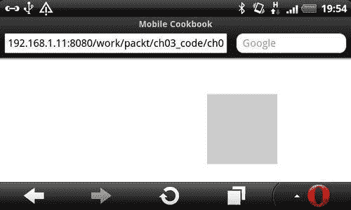
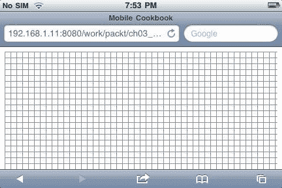
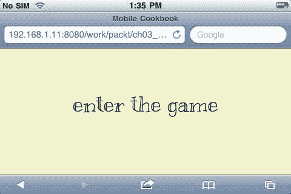
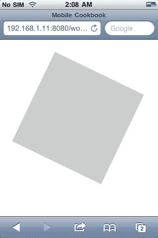
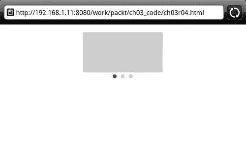
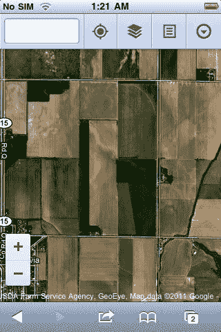

# 三、使用移动事件的交互式媒体

在本章中，我们将介绍:

*   使用触摸事件移动元素
*   检测和处理方向事件
*   旋转带有手势事件的 HTML 元素
*   制作带有滑动事件的旋转木马
*   使用手势事件操纵图像缩放

# 简介

移动和桌面最大的区别之一是我们与屏幕交互的方式。在桌面屏幕上，我们使用鼠标移动和点击事件来控制交互。在移动屏幕上，交互来自触摸和手势事件。在本章中，我们将看到触摸屏独有的一些事件(例如，两个手指事件)，以及您如何利用这些功能来构建移动设备独有的功能。

# 通过触摸事件移动元素

目标设备:跨浏览器

在移动屏幕上，我们使用触摸事件与元素进行交互。正因为如此，我们可以用手指在屏幕上移动一个 HTML 元素。

## 做好准备

对于这个例子，我们将使用 jQuery。首先，我们创建一个新的 HTML 文件，并将其命名为 `ch03r01.html`。

## 怎么做...

在您的 HTML 文档中，使用以下代码:

```html
<!doctype html>
<html>
<head>
<title>Mobile Cookbook</title>
<meta charset="utf-8">
<meta name="viewport" content="width=device-width, initial-scale=1.0">
<style>
#square {
width: 100px;
height: 100px;
background:#ccc;
position:absolute;
}
</style>
</head>
<body>
<div id="main">
<div id="square">
</div>
</div>
<script src="http://code.jquery.com/jquery-1.5.2.min.js"></script>
<script src="http://code.jquery.com/mobile/1.0a4.1/jquery. mobile-1.0a4.1.min.js"></script>
<script>
$('#square').bind('touchmove',function(e){
e.preventDefault();
var touch = e.originalEvent.touches[0] || e.originalEvent.changedTouches[0];
var elm = $(this).offset();
var x = touch.pageX - elm.left/2;
var y = touch.pageY - elm.top/2;
$(this).css('left', x+'px');
$(this).css('top', y+'px');
});
</script>
</body>
</html>

```

*   Now let's see how it renders in Opera:

    

## 它是如何工作的...

首先，我们用 `touchmove`事件注册广场 `div`。

您可以检测相对于页面的触摸位置，在我们的示例中为 `touch.pageX`和 `touch.pageY`。我们使用手指位置减去正方形 `div`元素宽度和高度的一半，所以感觉我们是以 `div`中心为注册点移动的。

```html
var x = touch.pageX - elm.left/2;
var y = touch.pageY - elm.top/2;

```

我们使用 CSS 位置将 x 和 y 值应用于正方形元素。这就是‘动’的动作。

```html
$(this).css('left', x+'px');
$(this).css('top', y+'px');

```

## 还有更多...

你可能已经意识到，在这个例子的顶部，有一行如下:

```html
var touch = e.originalEvent.touches[0] || e.originalEvent.changedTouches[0];

```

现在你可能想知道它是做什么的。移动 Safari 不允许将事件对象上的 `e.touches`和 `e.changedTouches`属性复制到另一个对象。你可以使用 `e.originalEvent`来回避这个问题。你可以在这里读到更多:

[http://www . the-Xavi . com/articles/touch-events-jquery](http://www.the-xavi.com/articles/trouble-with-touch-events-jquery)。

### jQuery 移动事件

jQuery mobile 是一组组件。如果你想挖掘所有与手机相关的事件，可以在:找到

[https://github . com/shi 川/jquery-mobile/blob/master/js/jquery . mobile . event . js](http://github.com/shichuan/jquery-mobile/blob/master/js/jquery.mobile.event.js)。

### 概念

如果您的主要目标是基于 WebKit 的浏览器，则可以考虑使用 Zepto 作为 jQuery 的更轻量级的替代。你可以在找到更多信息

[https://github . com/madobby/concepto](http://github.com/madrobby/zepto)。

### Safari 移动事件处理指南

作为官方参考，您可以访问 Safari 的在线指南:

[http://developer . apple . com/library/safari/](http://developer.apple.com/library/safari/#documentation/appleapplications/reference/safariwebcontent/HandlingEvents/HandlingEvents.html)

## 另见

*   *用方向事件重新绘制画布*
*   *旋转带有手势事件的 HTML 元素*
*   *利用刷卡事件制作转盘*
*   *通过手势事件操纵图像缩放*

# 检测和处理方位事件

目标设备:跨浏览器

在移动浏览器上，如果你的网站是基于流畅的布局构建的，它不应该受到方向变化的影响。但是对于一个高度互动的网站，有时你可能想用一种特殊的方式来处理方向的改变。

## 做好准备

新建一个 HTML 文件，命名为 `ch03r02.html`。

## 怎么做...

现在让我们开始创建 HTML 和脚本来检测和处理方向事件。

1.  输入以下代码:

    ```html
    <!doctype html>
    <html>
    <head>
    <title>Mobile Cookbook</title>
    <meta charset="utf-8">
    <meta name="viewport" content="width=device-width, initial-scale=1.0">
    <style>
    html, body {
    padding: none;
    margin: none;
    }
    </style>
    <link rel="stylesheet" href="http://code.jquery.com/mobile/1.0/jquery.mobile-1.0.min.css" />
    <script src="http://code.jquery.com/jquery-1.6.4.min.js"></script>
    <script src="http://code.jquery.com/mobile/1.0/jquery.mobile-1.0.min.js"></script>
    </head>
    <body>
    <div id="a">
    </div>
    <script>
    var metas = document.getElementsByTagName('meta');
    var i;
    if (navigator.userAgent.match(/iPhone/i)) {
    for (i=0; i<metas.length; i++) {
    if (metas[i].name == "viewport") {
    metas[i].content = "width=device-width, minimum-scale=1.0, maximum-scale=1.0";
    }
    }
    document.addEventListener("gesturestart", gestureStart, false);
    }
    function gestureStart() {
    for (i=0; i<metas.length; i++) {
    if (metas[i].name == "viewport") {
    metas[i].content = "width=device-width, minimum-scale=0.25, maximum-scale=1.6";
    }
    }
    }
    </script>
    <script>
    $(window).bind('orientationchange',function(event){
    updateOrientation(event.orientation);
    })
    function updateOrientation(orientation) {
    $("#a").html("<p>"+orientation.toUpperCase()+"</p>");
    }
    </script>
    </body>
    </html>

    ```

2.  Now, render this code in your mobile browser and rotate the screen to view in both portrait and landscape mode. In portrait mode, the text output will be 'PORTAIT'.

    

3.  When we rotate the screen to landscape mode, the text will be 'LANDSCAPE'.

    

## 它是如何工作的...

通过听 `window.onorientationchange`事件，我们可以得到 `orientationchange`事件，当它发生的时候；我们把 `event.orientation`解析成函数来输出结果。

## 还有更多...

有时候，你可能想锁定屏幕的方向，比如说在制作游戏的时候。对于本机应用，这可能很容易，但对于 web 应用，这可能有点难以实现。

让我们创建一个仅锁定横向模式的单页屏幕。请注意，这是一个概念验证，要创建真正复杂的应用或游戏，需要更多的计算和处理。

创建文档并命名为 `ch03r02_b.html`，并输入以下代码

```html
<!doctype html>
<html>
<head>
<title>Mobile Cookbook</title>
<meta charset="utf-8">
<meta name="viewport" content="width=device-width, initial-scale=1.0">
<link rel="stylesheet" href="css/style.css">
<style>
body {
font-family: 'Kranky', serif;
font-size: 36px;
font-style: normal;
font-weight: 400;
word-spacing: 0em;
line-height: 1.2;
}
html {
background:#F1F2CE;
}
html, body, #screen {
padding:0;
margin:0;
}
#screen {
text-align:center;
-moz-transform:rotate(90deg);
-webkit-transform:rotate(90deg);
-o-transform:rotate(90deg);
-ms-transform:rotate(90deg);
}
#screen div {
padding-top:130px;
}
@media screen and (min-width: 321px){
#screen {
text-align:center;
-moz-transform:rotate(0deg);
-webkit-transform:rotate(0deg);
-o-transform:rotate(0deg);
-ms-transform:rotate(0deg);
}
#screen div {
padding-top:70px;
}
}
</style>
</head>
<body>
<div id="screen">
<div id="loader">enter the game</div>
</div>
<script>
var metas = document.getElementsByTagName('meta');
var i;
if (navigator.userAgent.match(/iPhone/i)) {
for (i=0; i<metas.length; i++) {
if (metas[i].name == "viewport") {
metas[i].content = "width=device-width, minimum-scale=1.0, maximum-scale=1.0";
}
}
document.addEventListener("gesturestart", gestureStart, false);
}
function gestureStart() {
for (i=0; i<metas.length; i++) {
if (metas[i].name == "viewport") {
metas[i].content = "width=device-width, minimum-scale=0.25, maximum-scale=1.6";
}
}
}
window.onorientationchange = function() {
update();
}
function update() {
switch(window.orientation) {
case 0: // Portrait
case 180: // Upside-down Portrait
var cWidth = window.innerWidth;
var cHeight = window.innerHeight;
document.getElementById("screen").style.width = cHeight-36+'px';
document.getElementById("screen").style.height = cWidth+'px';
break;
case -90: // Landscape: turned 90 degrees counter-clockwise
case 90: // Landscape: turned 90 degrees clockwise
var cWidth = window.innerWidth;
var cHeight = window.innerHeight;
document.getElementById("screen").style.width = "100%";
document.getElementById("screen").style.height = "auto";
break;
}
}
update();
</script>
</body>
</html>

```

现在，如果您在浏览器中呈现页面，您将看到以下屏幕。在纵向模式下，它向用户建议游戏/应用设计为在横向模式下观看:


当您将屏幕从纵向模式旋转到横向模式时，它看起来很正常:



在本例中，我们使用了 CSS3 中的 `transform:rotate`在纵向模式下观看时将屏幕旋转 90 度:

```html
#screen {
text-align:center;
-moz-transform:rotate(90deg);
-webkit-transform:rotate(90deg);
-o-transform:rotate(90deg);
-ms-transform:rotate(90deg);
}

```

用户所处的模式可以通过 `window.orientation`确定。有四个值:-90，0，90，180。当度数为-90°和 90°时，设备处于横向模式。当度数为 0 和 180 时，它处于纵向模式。

```html
switch(window.orientation) {
case 0: // Portrait
case 180: // Upside-down Portrait
//...
break;
case -90: // Landscape: turned 90 degrees counter-clockwise
case 90: // Landscape: turned 90 degrees clockwise
//...
break;
}

```

这样，您就可以确定屏幕的方向。

### Safari 的原生支持

作为官方参考，您可以访问 Safari 的在线指南:

[http://developer . apple . com/library/safari/](http://developer.apple.com/library/safari/#documentation/appleapplications/reference/safariwebcontent/HandlingEvents/HandlingEvents.html)

### 网络对本地

尽管移动网络正在迎头赶上，但如果您正在开发一个高度交互的应用，请始终记住，即使是最慢的本机应用，其性能也仍然比 HTML 应用快。如果你决定使用 HTML5 来构建一个应用，你还必须记住所有的黑客攻击和浏览器不一致。

## 另见

*   *通过触摸事件移动元素*
*   *旋转带有手势事件的 HTML 元素*
*   *利用刷卡事件制作转盘*
*   *用手势事件缩放图像*

# 旋转带有手势事件的 HTML 元素

目标设备:iOS、安卓、塞班

在 Mobile Safari 上，您可以检测当人们用两个手指在屏幕上旋转时的旋转程度。正因为如此，我们可以用手指在屏幕上旋转一个元素！

## 做好准备

让我们创建一个 HTML 文档并命名为 `ch03r03.html`。

## 怎么做...

1.  将以下代码添加到 `ch03r03.html`并在您的移动浏览器中渲染:

    ```html
    <!doctype html>
    <html>
    <head>
    <title>Mobile Cookbook</title>
    <meta charset="utf-8">
    <meta name="viewport" content="width=device-width, initial-scale=1.0, maximum-scale=1.0">
    <style>
    #main {
    text-align:center;
    }
    #someElm {
    margin-top:50px;
    margin-left:50px;
    width: 200px;
    height: 200px;
    background:#ccc;
    position:absolute;
    }
    </style>
    </head>
    <body>
    <div id="main">
    <div id="someElm">
    </div>
    </div>
    <script>
    var rotation =0 ;
    var node = document.getElementById('someElm');
    node.ongesturechange = function(e){
    var node = e.target;
    //alert(e.rotation);
    // scale and rotation are relative values,
    // so we wait to change our variables until the gesture ends
    node.style.webkitTransform = "rotate(" + ((rotation + e.rotation) % 360) + "deg)";
    //alert("rotate(" + ((rotation + e.rotation) % 360) + "deg)");
    }
    node.ongestureend = function(e){
    // Update the values for the next time a gesture happens
    rotation = (rotation + e.rotation) % 360;
    }
    </script>
    </body>
    </html>

    ```

2.  Now use two fingers to rotate the box and you will see something like this:

    

## 它是如何工作的...

在本例中，当触发 `ongesturechange`事件时，我们旋转元素。我们通过使用以下值来获得旋转度:

```html
e.target.rotation

```

## 还有更多...

大家可能注意到了，我们也听 `ongestureend`事件，因为如果用户之前旋转过，这个脚本会记住上一次旋转的角度，并从那里继续旋转。

### Safari 事件处理

作为官方参考，您可以访问 Safari 的在线指南:

[http://developer . apple . com/library/safari/](http://developer.apple.com/library/safari/#documentation/appleapplications/reference/safariwebcontent/HandlingEvents/HandlingEvents.html)

### CSS3 变换

在这个例子中，我们使用了 CSS3 的转换功能。您可以在 WebKit 的博客中找到有关 WebKit 和 CSS 转换的更多信息，网址为:

[http://www.webkit.org/blog/130/css-transforms/](http://www.webkit.org/blog/130/css-transforms/)。

### scale bug 修复的缺点

在这个例子中，我们使用 `maximum-scale=1.0`来防止在使用手势事件时缩放。这将导致一些可访问性缺陷，因此只有在构建高度交互的 web 应用时，才使用 rotate 事件。建立移动网站时尽量避免。

## 另见

*   *通过触摸事件移动元素*
*   *用方向事件重新绘制画布*
*   *旋转带有手势事件的 HTML 元素*
*   使用手势事件缩放图像

# 制作带有滑动事件的旋转木马

移动设备的一个常见功能是刷卡。当您浏览照片库中的照片时，您可以左右滑动以从一张照片导航到另一张照片。在安卓设备上，你向下滑动解锁手机。在移动浏览器上，您也可以使用刷卡。

## 做好准备

首先，让我们创建一个 HTML 文档并命名它 `ch03r04.html.`

## 怎么做...

1.  输入以下代码:

    ```html
    <!doctype html>
    <html>
    <head>
    <title>Mobile Cookbook</title>
    <meta charset="utf-8">
    <meta name="viewport" content="width=device-width, initial-scale=1.0">
    <style>
    html, body {
    padding:0;
    margin:10px auto;
    }
    #checkbox {
    border:5px solid #ccc;
    width:30px;
    height:30px;
    }
    #wrapper {
    width:210px;
    height:100px;
    position:relative;
    overflow:hidden;
    margin:0 auto;
    }
    #inner {
    position:absolute;
    width:630px;
    }
    #inner div {
    width:200px;
    height:100px;
    margin:0 5px;
    background:#ccc;
    float:left;
    }
    .full-circle {
    background-color: #ccc;
    height: 10px;
    -moz-border-radius:5px;
    -webkit-border-radius: 5px;
    width: 10px;
    float:left;
    margin:5px;
    }
    .cur {
    background-color: #555;
    }
    #btns {
    width:60px;
    margin:0 auto;
    }
    </style>
    </head>
    <body>
    <div id="main">
    <div id="wrapper">
    <div id="inner">
    <div></div>
    <div></div>
    <div></div>
    </div>
    </div>
    <div id="btns">
    <div class="full-circle cur"></div>
    <div class="full-circle"></div>
    <div class="full-circle"></div>
    </div>
    </div>
    <script src="http://code.jquery.com/jquery-1.5.2.min.js"></script>
    <script src="http://code.jquery.com/mobile/1.0a4.1/jquery.mobile-1.0a4.1.min.js"></script>
    <script>
    var curNum = 0;
    $('#wrapper').swipeleft(function () {
    $('#inner').animate({
    left: '-=210'
    }, 500, function() {
    // Animation complete.
    curNum +=1;
    $('.full-circle').removeClass('cur');
    $('.full-circle').eq(curNum).addClass('cur');
    });
    });
    $('#wrapper').swiperight(function () {
    $('#inner').animate({
    left: '+=210'
    }, 500, function() {
    // Animation complete.
    curNum -=1;
    $('.full-circle').removeClass('cur');
    $('.full-circle').eq(curNum).addClass('cur');
    });
    });
    </script>
    </body>
    </html>

    ```

2.  Once you've entered the code in the page, swipe left and right of the viewing area, and you can see the boxes being scrolled horizontally:

    

## 它是如何工作的...

在这个例子中，我们使用了一些 HTML5 技术。首先，我们使用 jQuery Mobile 来检测刷卡事件。当我们用手指向左或向右滑动页面时，会分配一个事件监听器:

```html
$('#wrapper').swipeleft(function () {
});
$('#wrapper').swiperight(function () {
});

```

当检测到滑动事件时，jQuery 动画 `.animate()`用于创建移动效果:

```html
$('#inner').animate({
left: '+=210'
}, 500, function() {
// Animation complete.
curNum -=1;
$('.full-circle').removeClass('cur');
$('.full-circle').eq(curNum).addClass('cur');
});

```

## 还有更多...

在这个例子中，我们对圆形按钮使用了 CSS3 技术。您可以仅使用纯 CSS3 绘制整个圆:

```html
.full-circle {
background-color: #ccc;
height: 10px;
-moz-border-radius:5px;
-webkit-border-radius: 5px;
border-radius: 5px;
width: 10px;
}

```

在本例中，我们将文档的宽度和高度定义为 10 px，边框半径为 5 px。现在你只需要几行 CSS 就可以拥有一个完美的圆！

### Zepto 框架和刷卡事件

您可以使用 Zepto 框架来做类似的事情。它有 `swipe, swipeLeft, swipeRight, swipeUp, swipeDown`等事件。

### YUI 和手势事件

YUI 有手势事件，您可以使用它来创建滑动事件。你可以在这里读到更多:支持向左滑动手势:

[http://yuiblog.com/sandbox/yui/3.3.0pr3/examples/event/ swipe-gesture.html](http://yuiblog.com/sandbox/yui/3.3.0pr3/examples/event/)

### 潜入源头

jQuery mobile 中的事件是以模块化方式构建的。那些想了解 jQuery 如何进行刷卡活动的人可以访问:

[https://github . com/jquery/jquery-mobile/blob/master/js/jquery . mobile . event . js](http://github.com/jquery/jquery-mobile/blob/master/js/jquery.mobile.event.js)。与滑动事件相关的部分位于:

```html
$.event.special.swipe = {...}

```

为事件计算计算垂直、水平和距离阈值。

## 另见

*   *通过触摸事件移动元素*
*   *用方向事件重新绘制画布*
*   *旋转带有手势事件的 HTML 元素*
*   *用手势事件缩放图像*

# 用手势事件缩放图像

在 iPhone 上，您可以根据缩放检测来调整元素的大小。在手势改变时，您可以获得比例因子的值，并根据它缩放 HTML 元素。

## 做好准备

创建一个 HTML 文档并命名为 `ch03r05.html`。

## 怎么做...

输入以下代码:

```html
<!doctype html>
<html>
<head>
<title>Mobile Cookbook</title>
<meta charset="utf-8">
<meta name="viewport" content="width=device-width, initial-scale=1.0, user-scalable=no">
<style>
#frame {
width:100px;
height:100px;
background:#ccc;
}
</style>
</head>
<body>
<div id="main">
<div id="frame"></div>
</div>
<script src="http://code.jquery.com/jquery-1.5.2.min.js"></script>
<script src="http://code.jquery.com/mobile/1.0a4.1/jquery.mobile-1.0a4.1.min.js"></script>
<script>
var width = 100, height = 100;
var node = document.getElementById('frame');
node.ongesturechange = function(e){
var node = e.target;
// scale and rotation are relative values,
// so we wait to change our variables until the gesture ends
node.style.width = (width * e.scale) + "px";
node.style.height = (height * e.scale) + "px";
}
node.ongestureend = function(e){
// Update the values for the next time a gesture happens
width *= e.scale;
height *= e.scale;
}
</script>
</body>
</html>

```

## 它是如何工作的...

在这个例子中，我们用 `ongesturechange`事件分配我们想要缩放的元素。比例因子由 `e.target.scale:` 决定

```html
width *= e.scale;
height *= e.scale;

```

## 还有更多...

手势事件可能很棘手，因此正确使用它们非常重要。对于双指多点触控手势，事件按以下顺序发生:

1.  `touchstart`为手指 1。当第一根手指接触表面时发送。
2.  `gesturestart`。当第二个手指接触表面时发送。
3.  `touchstart`为手指 2。当第二个手指接触表面时，在 `gesturestart`之后立即发送。
4.  `gesturechange`为当前手势。当两个手指都在移动，同时仍然接触表面时发送。
5.  `gestureend`。当第二根手指从表面抬起时发送。
6.  `touchend`为手指 2。当第二个手指从表面抬起时，在 `gestureend`之后立即发送。
7.  `touchend`为手指 1。当第一根手指从表面抬起时发送。

### 官方 iOS Safari 关于手势事件的指南

有一个官方的 iPhone Safari 指南解释了 Safari 上 `GestureEvent`课的细节:

[http://developer . apple . com/library/safari/# documentation/user experience/Reference/gestureevents class Reference/GestureEvent . html](http://developer.apple.com/library/safari/#documentation/UserExperience/Reference/GestureEventClassReference/GestureEvent/GestureEvent.html)。

### YUI 手势事件

雅虎的 YUI！有跨浏览器的手势事件解决方案，但只支持单指事件。您可以在以下网址了解更多信息:

[http://developer.yahoo.com/yui/3/event/#gestures](http://developer.yahoo.com/yui/3/event/#gestures)。

### 谷歌地图和手势事件

严重依赖两个手指手势事件的网站的一个例子是移动 Safari 上的谷歌地图:



## 另见

*   *通过触摸事件移动元素*
*   *用方向事件重新绘制画布*
*   *旋转带有手势事件的 HTML 元素*
*   *制作转盘*