# 七、移动调试

在本章中，我们将介绍:

*   蜻蜓歌剧院远程调试
*   使用 weinre 进行远程调试
*   在手机上使用 Firebug
*   使用 JS 控制台进行远程调试
*   设置移动 Safari 调试

# 简介

尽管调试可能会花费大量时间，但无论是对于桌面还是移动，它都是 web 开发的一个重要方面。在本章中，我们将介绍一些移动调试工具，这些工具用于使前端调试更容易、更快，并使 web 开发更高效。

# 蜻蜓歌剧院远程调试

目标浏览器:Opera 手机

移动调试与桌面调试不同，因为移动屏幕相对较小。

## 做好准备

1.  确保您在 WiFi 网络上。
2.  在[http://www.opera.com/](http://www.opera.com/)下载最新版本的 Opera 桌面浏览器。
3.  在您的移动设备上下载 Opera Mobile。

## 怎么做...

1.  在撰写本文时，Opera 的版本为 11.50。当你阅读这本书时，这些说明中的一些可能会改变。
2.  在桌面上打开 Opera，从下拉菜单中选择**页面** | **开发者工具** | **Opera 蜻蜓**。
3.  You should see a debugger tool appear at the bottom of the page. Click on **Remote debug configuration**, as shown in the following screenshot:

    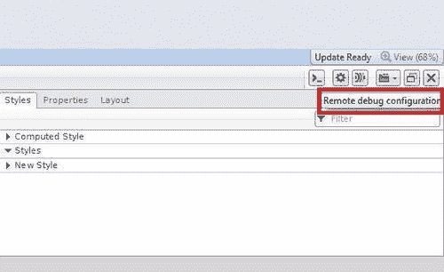

4.  一旦我们点击**远程调试配置**按钮，就会弹出一个面板。
5.  On the panel, you can see a text field to specify a port number and an **Apply** button. The default number should be unused and should work fine. Click on **Apply:**

    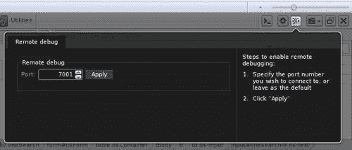

6.  现在启动你的桌面控制台，输入 `ipconfig`作为命令。IPv4 地址是您的 IP 地址。
7.  Open Opera Mobile on a mobile device, type `opera:debug` in the URL address bar, and we will arrive at a page as follows:

    

8.  Enter the IP address you got from the desktop console, and click on **Connect**. Now the mobile browser should be connected to Dragonfly:

    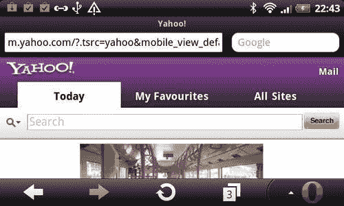

## 它是如何工作的...

在 Opera Mobile 上打开一个新的标签页，访问 Yahoo.com，现在切换到桌面，点击**选择调试上下文**，右上角第四个按钮。选择**雅虎！**从下拉开始检查页面！


## 另见

*   *用 weinre 进行远程调试*
*   *用 JS 控制台远程调试*

# 用 weinre 进行远程调试

目标浏览器:iOS、安卓、黑莓、webOS

在之前的食谱中，我们看到了如何远程调试 Opera 手机页面。在这个食谱中，我们将看到如何在其他移动设备中进行远程调试。**温若**是一个**网页浏览器远程**。

受支持的操作系统包括:

*   安卓 2.2 浏览器应用
*   Android 2.2 瓦/PhoneGap 0.9.2iOS 4.2.x
*   移动 Safari 应用
*   黑莓 v6.x 模拟器
*   webOS 2.x(未指定版本)

## 做好准备

首先，我们必须从官网下载 weinre 有两个版本可用，一个用于 PC，一个用于 Mac:

[https://github . com/phone gap/winre/archives/master](http://github.com/phonegap/weinre/archives/master)

## 怎么做...

1.  首先，通过在控制台中运行 `ipconfig`来获取您的 IP 地址。
2.  创建一个 HTML 文档并命名为 `ch07r01.html`。将 `192.168.1.11`替换为您自己的 IP 地址:

    ```html
    <!doctype html>
    <html>
    <head>
    <title>Mobile Cookbook</title>
    <meta charset="utf-8">
    <meta name="viewport" content="width=device-width, initial-scale=1.0">
    </head>
    <body>
    <header>
    <h1>Mobile Cookbook</h1>
    </header>
    <div id="main">
    </div>
    <script src="http://192.168.1.11:8081/target/target-script-min.js"></script>
    </body>
    </html>

    ```

3.  首先，定位下载的 `weinre.jar`文件。就我而言，路径是 `C:\xampp\htdocs\dev\weinre.jar`。第二，获取 IP 地址，在我这里是 `http://192.168.1.11`。
4.  现在打开你的控制台，输入下面一行:

    ```html
    java -jar path/to/weinre.jar -httpPort 8081 -boundHost http://192.168.1.11

    ```

5.  To test if it works, visit the URL address `http://192.168.1.11:8081/`, a page close to the following screenshot should appear:

    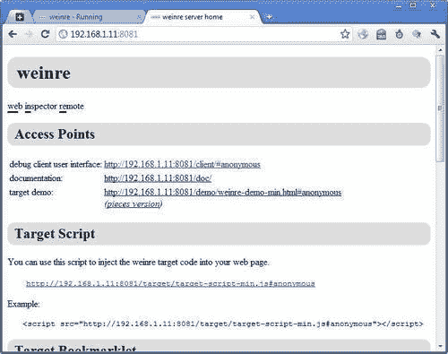

## 它是如何工作的...

现在使用您的移动设备访问创建的示例页面:


现在，回到桌面，点击**调试客户端用户界面**。不要打开选项卡，而是在新窗口中打开。

你应该可以看到如下截图:


点击**元素**，现在可以检查元素了(如下图截图所示):

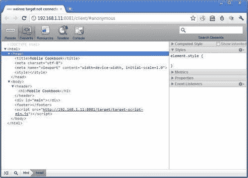

# 在手机上使用 Firebug

目标浏览器:跨浏览器

很多人在火狐和 Chrome 上使用 Firebug，但是 Firebug Lite 可以在任何支持 JavaScript 的浏览器上使用。在这个食谱中，我们将看到如何使用 Firebug 进行调试。

## 做好准备

创建一个 HTML 文档并命名为 `ch07r02.html`。

## 怎么做...

1.  在 HTML 中输入以下代码:

    ```html
    <!doctype html>
    <html>
    <head>
    <title>Mobile Cookbook</title>
    <meta charset="utf-8"> <meta name="viewport" content="width=device-width, initial-scale=1.0">
    </head>
    <body>
    <div id="main">
    </div>
    <script type="text/javascript" src="https://getfirebug.com/firebug-lite.js"></script>
    </body>
    </html>

    ```

2.  Render it in a mobile browser:

    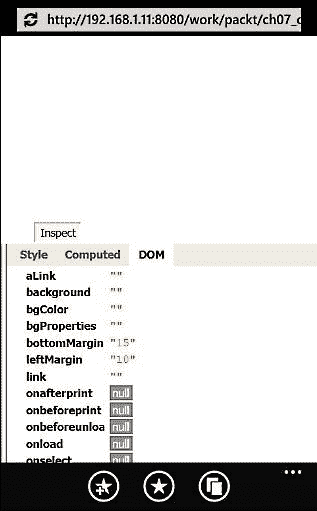

## 它是如何工作的...

Firebug Lite 是 Firebug 的 JavaScript 版本。下面一行代码将加载 Firebug 站点上托管的 Firebug Lite 脚本:

```html
<script type="text/javascript" src="https://getfirebug.com/firebug-lite.js"></script>

```

您也可以下载脚本并将其添加为本地版本。

您可以访问 HTML、CSS 和 JavaScript，并查看 DOM。控制台可用于 JavaScript 输入。

Firebug Lite 有四个发行渠道:

*   **稳定通道**T2】
*   **调试通道**
*   **贝塔通道**
*   **开发商渠道**

我们一直使用的是稳定通道。其他频道在*下解释，还有更多*部分。

## 还有更多...

除了直播和本地版本，你还可以添加书签。它可能不适用于所有浏览器。这是如何做到的。

1.  Click on the links on the right-hand side of the page: [http://getfirebug.com/firebuglite](http://getfirebug.com/firebuglite)

    

2.  这增加了散列 `#javascript:(function..`。移动浏览器中 URL 的末尾。
3.  在 Safari 上为页面添加书签。
4.  将书签的名称编辑为书签小程序、Firebug Lite、Firebug Lite 调试或 Firebug Lite 测试版的名称。
5.  保存书签后，打开书签菜单，选择 **Firebug Lite** ，点击**编辑**。删除网址和 `#`，只保留以 `javascript:(function`开头的部分。
6.  现在如果你打开任何一个网页，点击 **Firebug Lite 书签**，页面右下角会出现一个 Firebug 控制台。

### 调试通道

调试通道使用与稳定通道相同的版本，但具有不同的预配置，以便更容易调试 Firebug Lite 本身。

### β通道

测试通道是新特性和修复被完善的地方。它应该相当稳定(没有已知的回归)，但是它可能包含一些 bug，一些特性可能不完整。

### 开发商渠道

开发者渠道是创意被创造和测试的地方。一旦它直接绑定到我们的代码库，您将获得最新的代码，并且比其他渠道更频繁地接收更新。但是，需要注意的一点是，开发人员通道有时可能非常不稳定，初始加载可能会较慢。

# 用 JS 控制台进行远程 JavaScript 调试

目标浏览器:跨浏览器

如果你只找远程 JavaScript 调试，*雷米夏普*有一个很牛逼的工具叫 JavaScript Console。这对于移动调试来说是非常有效的。

## 做好准备

访问[http://jsconsole.com/](http://jsconsole.com/)，您将看到如下所示的页面:


## 怎么做...

1.  Enter `:listen` on the site, and you should see the following info messages returning:

    **创建连接…**

    **连接至“65c1f 9 f1-6a 57-46c 0-96BB-35c5 b 515331 f”**

2.  This will be followed by a line of JavaScript looking like:

    ```html
    <script src="http://jsconsole.com/remote.js?65C1F9F1-6A57-46C0-96BB-35C5B515331F"></script>

    ```

    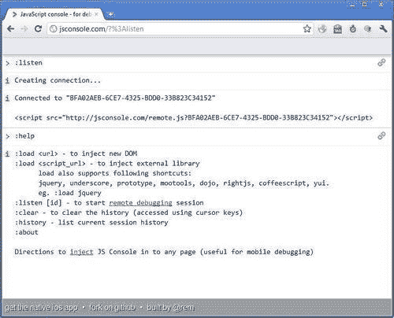

3.  创建一个 HTML 页面并命名为 `ch07r04.html`。在文档中输入以下代码，用自己从 jsconsole.com 获得的脚本替换`<script>...</script>`:

    ```html
    <!doctype html>
    <html>
    <head>
    <title>Mobile Cookbook</title>
    <meta charset="utf-8">
    <meta name="viewport" content="width=device-width, initial-scale=1.0">
    </head>
    <body>
    >
    <div id="main">
    </div>
    <script src="http://jsconsole.com/remote.js?04926BFB-44AB-4979-BAE9-F4A4FA7CE22C"></script>
    <script>
    for (var i=0; i<10; i++) {
    console.log('testing '+i);
    }
    </script>
    </body>
    </html>

    ```

4.  Now if we render the page on a mobile device, we will see the desktop screen web page has log messages appearing:

    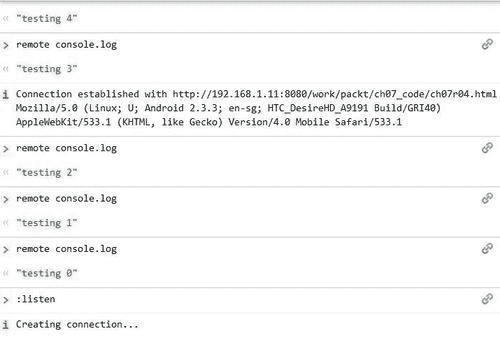

## 它是如何工作的...

在下面的循环中，我们使用 `console.log`来输出一串消息:

```html
<script>
for (var i=0; i<10; i++) {
console.log('testing '+i);
}
</script>

```

从您的 web 应用对 `console.log`的任何调用都会在监听您的键的 jsconsole 会话中显示结果。同样，如果您在 jsconsole 会话中运行命令，代码将被注入到您的 web 应用中，结果将返回到 jsconsole。

## 还有更多...

整个 JavaScript Console web 应用都是开源的；如果你想了解更多关于它是如何制作的，请访问:[https://github.com/remy/jsconsole](http://github.com/remy/jsconsole)。

### JS Console iOS 应用

iOS 的 JS Console 也是*雷米夏普*做的，是一个 JavaScript 控制台，可以测试和检查你的 JavaScript 的结果，不需要在线或者在浏览器里面。

### 简单的 iOS 模拟器示例

这个由*雷米夏普*制作的视频展示了如何使用 jsconsole.com 在 iOS 中远程调试 JavaScript。它展示了如何接收日志和发送任意命令:

[http://www.youtube.com/watch?v=Y219Ziuipvc&特色=玩家 _ 嵌入式](http://www.youtube.com/watch?v=Y219Ziuipvc&feature=player_embedded)

### 远程调试任意设备上的 JavaScript

在下面的视频中，*雷米夏普*记录了如何使用 jsconsole.com 远程调试任何设备上的任何浏览器:

[http://www.youtube.com/watch?v=DSH392Gxaho&特色=玩家 _ 嵌入式](http://www.youtube.com/watch?v=DSH392Gxaho&feature=player_embedded)

# 设置移动 Safari 调试

目标浏览器:iOS

在 iOS 手机 Safari 上，有一个用于调试的内置调试器。

## 做好准备

手里拿着一部 iPhone，导航到主屏幕。

## 怎么做...

1.  Find and open the **Settings** application:

    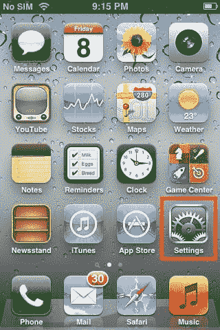

2.  Select **Safari:**

    

3.  Scroll down to find the **Developer** option at the bottom:

    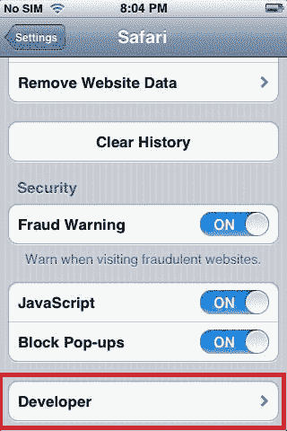

4.  By default, the **Debug Console** is **OFF:**

    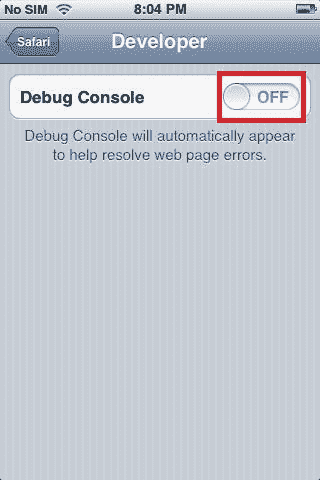

5.  Now we can switch the **Debug Console** to **ON:**

    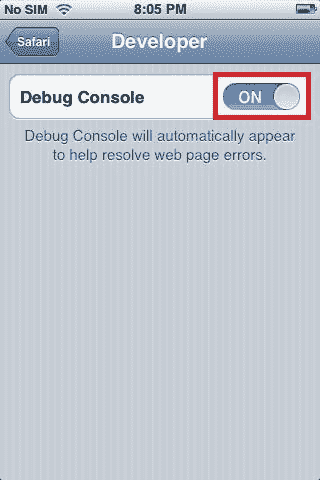

6.  In Safari, look for the debug console's summary info at the top of the page, just below the URL bar:

    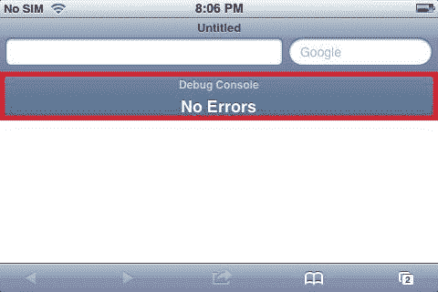

7.  触摸摘要信息，查看页面上错误的详细报告。
8.  现在，让我们创建一个 HTML 文档，并将其命名为 `ch07r05.html`。向页面输入以下代码:

    ```html
    <!doctype html>
    <html>
    <head>
    <title>Mobile Cookbook</title>
    <meta charset="utf-8">
    <meta name="viewport" content="width=device-width, initial-scale=1.0">
    </head>
    <body>
    <div id="main">
    </div>
    <script>
    for (var i=0; i<3; i++) {
    console.log('testing '+i);
    }
    </script>
    </body>
    </html>

    ```

9.  When rendering it, we can see:

    

## 它是如何工作的...

一旦你点击**调试控制台**，它会把你带到信息屏幕:

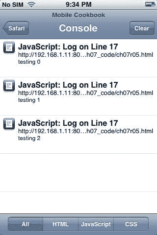

以下脚本用于创建调试消息:

```html
<script>
for (var i=0; i<3; i++) {
console.log('testing '+i);
}
</script>

```