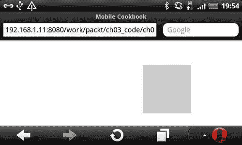
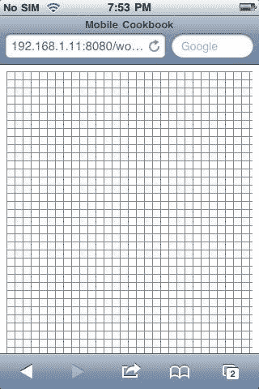
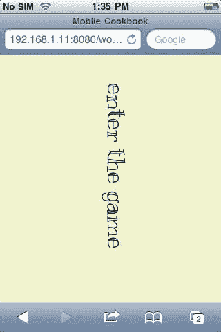
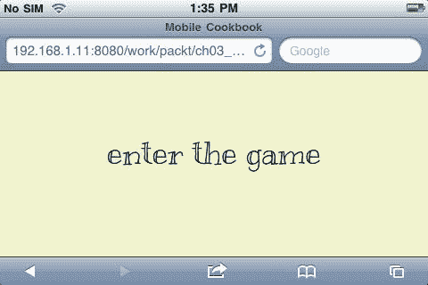
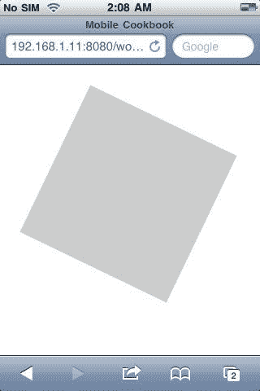
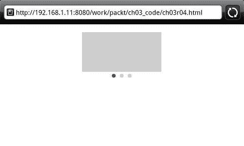
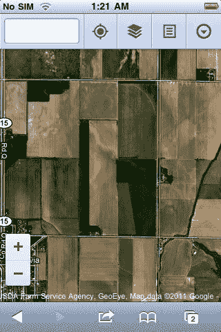

# 第三章：使用移动事件的交互媒体

在本章中，我们将涵盖：

+   使用触摸事件移动元素

+   检测和处理方向事件

+   使用手势事件旋转 HTML 元素

+   使用滑动事件制作轮播图

+   使用手势事件操作图像缩放

# 介绍

移动和桌面之间最大的区别之一是我们与屏幕交互的方式。在桌面屏幕上，我们使用鼠标移动和点击事件来控制交互。在移动屏幕上，交互来自触摸和手势事件。在本章中，我们将看到一些触摸屏独有的事件（例如，双指事件），以及您如何利用这些功能来为移动构建独特的东西。

# 使用触摸事件移动元素

目标设备：跨浏览器

在移动屏幕上，我们使用触摸事件与元素进行交互。因此，我们可以用手指在屏幕上移动 HTML 元素。

## 准备工作

在这个例子中，我们将使用 jQuery。首先，让我们创建一个新的 HTML 文件，并将其命名为`ch03r01.html`。

## 如何做...

在您的 HTML 文档中，使用以下代码：

```html
<!doctype html>
<html>
<head>
<title>Mobile Cookbook</title>
<meta charset="utf-8">
<meta name="viewport" content="width=device-width, initial-scale=1.0">
<style>
#square {
width: 100px;
height: 100px;
background:#ccc;
position:absolute;
}
</style>
</head>
<body>
<div id="main">
<div id="square">
</div>
</div>
<script src="img/jquery-1.5.2.min.js"></script>
<script src="img/jquery. mobile-1.0a4.1.min.js"></script>
<script>
$('#square').bind('touchmove',function(e){
e.preventDefault();
var touch = e.originalEvent.touches[0] || e.originalEvent.changedTouches[0];
var elm = $(this).offset();
var x = touch.pageX - elm.left/2;
var y = touch.pageY - elm.top/2;
$(this).css('left', x+'px');
$(this).css('top', y+'px');
});
</script>
</body>
</html>

```

+   现在让我们看看它在 Opera 中的渲染：

## 它是如何工作的...

首先，我们注册一个带有`touchmove`事件的正方形`div`。

您可以检测相对于页面的触摸位置，即在我们的例子中是`touch.pageX`和`touch.pageY`。我们使用手指位置减去正方形`div`元素宽度和高度的一半，这样就感觉像我们是以`div`中心作为注册点移动。

```html
var x = touch.pageX - elm.left/2;
var y = touch.pageY - elm.top/2;

```

我们使用 CSS 位置将 x 和 y 值应用于正方形元素。这就是'移动'动作。

```html
$(this).css('left', x+'px');
$(this).css('top', y+'px');

```

## 还有更多...

您可能已经意识到，在这个例子的顶部，有一行如下：

```html
var touch = e.originalEvent.touches[0] || e.originalEvent.changedTouches[0];

```

现在你可能想知道它是做什么的。移动 Safari 不允许将`e.touches`和`e.changedTouches`属性复制到另一个对象上的事件对象。您可以通过使用`e.originalEvent`来解决这个问题。您可以在这里阅读更多关于它的信息：

[`www.the-xavi.com/articles/trouble-with-touch-events-jquery`](http://www.the-xavi.com/articles/trouble-with-touch-events-jquery)。

### jQuery 移动事件

jQuery 移动是一组组件。如果您想深入了解所有与移动相关的事件，您可以在这里找到它们：

[`github.com/shichuan/jquery-mobile/blob/master/js/jquery.mobile.event.js`](http://github.com/shichuan/jquery-mobile/blob/master/js/jquery.mobile.event.js)。

### Zepto

Zepto 是一个比 jQuery 更轻量级的替代品，如果您的主要目标是基于 WebKit 的浏览器，您可以考虑使用它。您可以在这里了解更多信息：

[`github.com/madrobby/zepto`](http://github.com/madrobby/zepto)。

### Safari 关于移动事件处理的指南

官方参考资料，请访问 Safari 的在线指南：

[`developer.apple.com/library/safari/#documentation/appleapplications/reference/safariwebcontent/HandlingEvents/HandlingEvents.html`](http://developer.apple.com/library/safari/#documentation/appleapplications/reference/safariwebcontent/HandlingEvents/HandlingEvents.html)。

## 另请参阅

+   *使用方向事件重绘画布*

+   *使用手势事件旋转 HTML 元素*

+   *使用滑动事件制作轮播图*

+   *使用手势事件操作图像缩放*

# 检测和处理方向事件

目标设备：跨浏览器

在移动浏览器上，如果您的网站是基于流体布局构建的，它不应受方向变化的影响。但对于一个高度互动的网站，有时您可能希望以特殊的方式处理方向变化。

## 准备工作

创建一个新的 HTML 文件，并将其命名为`ch03r02.html`。

## 如何做...

现在让我们开始创建 HTML 和脚本来检测和处理方向事件。

1.  输入以下代码：

```html
<!doctype html>
<html>
<head>
<title>Mobile Cookbook</title>
<meta charset="utf-8">
<meta name="viewport" content="width=device-width, initial-scale=1.0">
<style>
html, body {
padding: none;
margin: none;
}
</style>
<link rel="stylesheet" href="http://code.jquery.com/mobile/1.0/jquery.mobile-1.0.min.css" />
<script src="img/jquery-1.6.4.min.js"></script>
<script src="img/jquery.mobile-1.0.min.js"></script>
</head>
<body>
<div id="a">
</div>
<script>
var metas = document.getElementsByTagName('meta');
var i;
if (navigator.userAgent.match(/iPhone/i)) {
for (i=0; i<metas.length; i++) {
if (metas[i].name == "viewport") {
metas[i].content = "width=device-width, minimum-scale=1.0, maximum-scale=1.0";
}
}
document.addEventListener("gesturestart", gestureStart, false);
}
function gestureStart() {
for (i=0; i<metas.length; i++) {
if (metas[i].name == "viewport") {
metas[i].content = "width=device-width, minimum-scale=0.25, maximum-scale=1.6";
}
}
}
</script>
<script>
$(window).bind('orientationchange',function(event){
updateOrientation(event.orientation);
})
function updateOrientation(orientation) {
$("#a").html("<p>"+orientation.toUpperCase()+"</p>");
}
</script>
</body>
</html>

```

1.  现在，在您的移动浏览器中渲染此代码，并旋转屏幕以在纵向和横向模式下查看。在纵向模式下，文本输出将是'PORTAIT'。

1.  当我们将屏幕旋转到横向模式时，文本将显示为'LANDSCAPE'。

## 它是如何工作的...

通过监听`window.onorientationchange`事件，我们可以在发生时获取`orientationchange`事件；我们将`event.orientation`传递给函数以输出结果。

## 还有更多...

有时，您可能希望锁定屏幕的方向，比如在构建游戏时。对于原生应用程序来说，这很容易，但对于 Web 应用程序来说，这可能有点难以实现。

让我们创建一个只能锁定在横向模式的单页面屏幕。请注意，这只是一个概念验证，要创建真正复杂的应用程序或游戏需要更多的计算和处理。

创建一个文档，并将其命名为`ch03r02_b.html`，然后输入以下代码

```html
<!doctype html>
<html>
<head>
<title>Mobile Cookbook</title>
<meta charset="utf-8">
<meta name="viewport" content="width=device-width, initial-scale=1.0">
<link rel="stylesheet" href="css/style.css">
<style>
body {
font-family: 'Kranky', serif;
font-size: 36px;
font-style: normal;
font-weight: 400;
word-spacing: 0em;
line-height: 1.2;
}
html {
background:#F1F2CE;
}
html, body, #screen {
padding:0;
margin:0;
}
#screen {
text-align:center;
-moz-transform:rotate(90deg);
-webkit-transform:rotate(90deg);
-o-transform:rotate(90deg);
-ms-transform:rotate(90deg);
}
#screen div {
padding-top:130px;
}
@media screen and (min-width: 321px){
#screen {
text-align:center;
-moz-transform:rotate(0deg);
-webkit-transform:rotate(0deg);
-o-transform:rotate(0deg);
-ms-transform:rotate(0deg);
}
#screen div {
padding-top:70px;
}
}
</style>
</head>
<body>
<div id="screen">
<div id="loader">enter the game</div>
</div>
<script>
var metas = document.getElementsByTagName('meta');
var i;
if (navigator.userAgent.match(/iPhone/i)) {
for (i=0; i<metas.length; i++) {
if (metas[i].name == "viewport") {
metas[i].content = "width=device-width, minimum-scale=1.0, maximum-scale=1.0";
}
}
document.addEventListener("gesturestart", gestureStart, false);
}
function gestureStart() {
for (i=0; i<metas.length; i++) {
if (metas[i].name == "viewport") {
metas[i].content = "width=device-width, minimum-scale=0.25, maximum-scale=1.6";
}
}
}
window.onorientationchange = function() {
update();
}
function update() {
switch(window.orientation) {
case 0: // Portrait
case 180: // Upside-down Portrait
var cWidth = window.innerWidth;
var cHeight = window.innerHeight;
document.getElementById("screen").style.width = cHeight-36+'px';
document.getElementById("screen").style.height = cWidth+'px';
break;
case -90: // Landscape: turned 90 degrees counter-clockwise
case 90: // Landscape: turned 90 degrees clockwise
var cWidth = window.innerWidth;
var cHeight = window.innerHeight;
document.getElementById("screen").style.width = "100%";
document.getElementById("screen").style.height = "auto";
break;
}
}
update();
</script>
</body>
</html>

```

现在，如果您在浏览器中呈现页面，您将看到以下屏幕。在纵向模式下，它建议用户游戏/应用程序是设计为横向模式查看的：



当您将屏幕从纵向旋转到横向时，它看起来很正常：



在这个例子中，我们使用 CSS3 的`transform:rotate`将屏幕旋转 90 度，以便在纵向模式下查看：

```html
#screen {
text-align:center;
-moz-transform:rotate(90deg);
-webkit-transform:rotate(90deg);
-o-transform:rotate(90deg);
-ms-transform:rotate(90deg);
}

```

用户所处的模式可以通过`window.orientation`确定。有四个值：-90、0、90、180。当度数为-90 和 90 时，设备处于横向模式。当度数为 0 和 180 时，设备处于纵向模式。

```html
switch(window.orientation) {
case 0: // Portrait
case 180: // Upside-down Portrait
//...
break;
case -90: // Landscape: turned 90 degrees counter-clockwise
case 90: // Landscape: turned 90 degrees clockwise
//...
break;
}

```

通过这种方式，您可以确定屏幕的方向。

### Safari 的原生支持

有关官方参考，请访问 Safari 的在线指南：

[`developer.apple.com/library/safari/#documentation/appleapplications/reference/safariwebcontent/HandlingEvents/HandlingEvents.html`](http://developer.apple.com/library/safari/#documentation/appleapplications/reference/safariwebcontent/HandlingEvents/HandlingEvents.html)。

### Web 与原生

尽管移动 Web 正在迎头赶上，但如果您正在开发高度交互式的应用程序，请始终记住，即使是最慢的原生应用程序的性能也比 HTML 应用程序更快。如果您决定使用 HTML5 构建应用程序，还必须牢记所有的黑客和浏览器不一致性。

## 另请参阅

+   *使用触摸事件移动元素*

+   *使用手势事件旋转 HTML 元素*

+   *使用滑动事件创建旋转木马*

+   *使用手势事件缩放图像*

# 使用手势事件旋转 HTML 元素

目标设备：iOS，Android，Symbian

在移动 Safari 上，当人们用两根手指在屏幕上进行旋转时，你可以检测旋转的角度。因此，我们可以使用手指在屏幕上旋转一个元素！

## 准备工作

让我们创建一个 HTML 文档，并将其命名为`ch03r03.html`。

## 如何做...

1.  将以下代码添加到`ch03r03.html`中，并在您的移动浏览器中呈现它：

```html
<!doctype html>
<html>
<head>
<title>Mobile Cookbook</title>
<meta charset="utf-8">
<meta name="viewport" content="width=device-width, initial-scale=1.0, maximum-scale=1.0">
<style>
#main {
text-align:center;
}
#someElm {
margin-top:50px;
margin-left:50px;
width: 200px;
height: 200px;
background:#ccc;
position:absolute;
}
</style>
</head>
<body>
<div id="main">
<div id="someElm">
</div>
</div>
<script>
var rotation =0 ;
var node = document.getElementById('someElm');
node.ongesturechange = function(e){
var node = e.target;
//alert(e.rotation);
// scale and rotation are relative values,
// so we wait to change our variables until the gesture ends
node.style.webkitTransform = "rotate(" + ((rotation + e.rotation) % 360) + "deg)";
//alert("rotate(" + ((rotation + e.rotation) % 360) + "deg)");
}
node.ongestureend = function(e){
// Update the values for the next time a gesture happens
rotation = (rotation + e.rotation) % 360;
}
</script>
</body>
</html>

```

1.  现在用两根手指旋转框，你会看到类似这样的东西：

## 它是如何工作的...

在这个例子中，当触发`ongesturechange`事件时，我们旋转元素。我们通过以下值获取旋转角度：

```html
e.target.rotation

```

## 还有更多...

您可能已经注意到，我们还监听`ongestureend`事件，因为如果用户之前已经旋转过，此脚本将记住上次旋转的角度，并继续从那里旋转。

### Safari 事件处理

有关官方参考，请访问 Safari 的在线指南：

[`developer.apple.com/library/safari/#documentation/appleapplications/reference/safariwebcontent/HandlingEvents/HandlingEvents.html`](http://developer.apple.com/library/safari/#documentation/appleapplications/reference/safariwebcontent/HandlingEvents/HandlingEvents.html)。

### CSS3 转换

在这个例子中，我们使用了 CSS3 的转换功能。您可以在 WebKit 的博客上找到有关 WebKit 和 CSS 转换的更多信息：

[`www.webkit.org/blog/130/css-transforms/`](http://www.webkit.org/blog/130/css-transforms/).

### 缩放错误修复的缺点

在这个例子中，我们使用了`maximum-scale=1.0`来防止在使用手势事件时进行缩放。这会导致一些无法访问的缺点，因此只有在构建高度交互式的 Web 应用程序时才使用旋转事件。在构建移动网站时尽量避免使用它。

## 另请参阅

+   *使用触摸事件移动元素*

+   *使用方向事件重绘画布*

+   *使用手势事件旋转 HTML 元素*

+   使用手势事件缩放图像

# 使用滑动事件制作一个旋转木马

移动设备的一个常见功能是滑动。当你在照片库中浏览照片时，你可以向左和向右滑动以从一张图片导航到另一张图片。在 Android 设备上，你可以向下滑动解锁手机。在移动浏览器上，你也可以使用滑动。

## 准备工作

首先，让我们创建一个 HTML 文档并命名为`ch03r04.html`。

## 如何做...

1.  输入以下代码：

```html
<!doctype html>
<html>
<head>
<title>Mobile Cookbook</title>
<meta charset="utf-8">
<meta name="viewport" content="width=device-width, initial-scale=1.0">
<style>
html, body {
padding:0;
margin:10px auto;
}
#checkbox {
border:5px solid #ccc;
width:30px;
height:30px;
}
#wrapper {
width:210px;
height:100px;
position:relative;
overflow:hidden;
margin:0 auto;
}
#inner {
position:absolute;
width:630px;
}
#inner div {
width:200px;
height:100px;
margin:0 5px;
background:#ccc;
float:left;
}
.full-circle {
background-color: #ccc;
height: 10px;
-moz-border-radius:5px;
-webkit-border-radius: 5px;
width: 10px;
float:left;
margin:5px;
}
.cur {
background-color: #555;
}
#btns {
width:60px;
margin:0 auto;
}
</style>
</head>
<body>
<div id="main">
<div id="wrapper">
<div id="inner">
<div></div>
<div></div>
<div></div>
</div>
</div>
<div id="btns">
<div class="full-circle cur"></div>
<div class="full-circle"></div>
<div class="full-circle"></div>
</div>
</div>
<script src="img/jquery-1.5.2.min.js"></script>
<script src="img/jquery.mobile-1.0a4.1.min.js"></script>
<script>
var curNum = 0;
$('#wrapper').swipeleft(function () {
$('#inner').animate({
left: '-=210'
}, 500, function() {
// Animation complete.
curNum +=1;
$('.full-circle').removeClass('cur');
$('.full-circle').eq(curNum).addClass('cur');
});
});
$('#wrapper').swiperight(function () {
$('#inner').animate({
left: '+=210'
}, 500, function() {
// Animation complete.
curNum -=1;
$('.full-circle').removeClass('cur');
$('.full-circle').eq(curNum).addClass('cur');
});
});
</script>
</body>
</html>

```

1.  一旦你在页面中输入了代码，左右滑动查看区域，你就可以看到盒子在水平滚动：

## 它是如何工作的...

我们在这个例子中使用了一些 HTML5 技术。首先，我们使用 jQuery Mobile 来检测滑动事件。当我们用手指向左或向右滑动页面时，会分配一个事件监听器：

```html
$('#wrapper').swipeleft(function () {
});
$('#wrapper').swiperight(function () {
});

```

当检测到滑动事件时，使用 jQuery 动画`.animate()`来创建移动效果：

```html
$('#inner').animate({
left: '+=210'
}, 500, function() {
// Animation complete.
curNum -=1;
$('.full-circle').removeClass('cur');
$('.full-circle').eq(curNum).addClass('cur');
});

```

## 还有更多...

在这个例子中，我们使用了 CSS3 技术来制作圆形按钮。你可以只用纯 CSS3 画出一个完整的圆：

```html
.full-circle {
background-color: #ccc;
height: 10px;
-moz-border-radius:5px;
-webkit-border-radius: 5px;
border-radius: 5px;
width: 10px;
}

```

在这个例子中，我们定义文档的宽度和高度为 10 像素，边框半径为 5 像素。现在你可以用几行 CSS 代码画出一个完美的圆！

### Zepto 框架和滑动事件

你可以使用 Zepto 框架做类似的事情。它有事件，如`swipe, swipeLeft, swipeRight, swipeUp, swipeDown`。

### YUI 和手势事件

YUI 有手势事件，你可以使用它们来创建滑动事件。你可以在这里阅读更多关于这个的信息：支持向左滑动手势：

[`yuiblog.com/sandbox/yui/3.3.0pr3/examples/event/ swipe-gesture.html`](http://yuiblog.com/sandbox/yui/3.3.0pr3/examples/event/)

### 深入源码

jQuery 移动中的事件是以模块化方式构建的。想要了解 jQuery 如何创建滑动事件的人可以访问：

[`github.com/jquery/jquery-mobile/blob/master/js/jquery.mobile.event.js`](http://github.com/jquery/jquery-mobile/blob/master/js/jquery.mobile.event.js)。与滑动事件相关的部分在：

```html
$.event.special.swipe = {...}

```

垂直、水平和距离阈值被用于事件计算。

## 另请参阅

+   *使用触摸事件移动元素*

+   *使用方向事件重绘画布*

+   *使用手势事件旋转 HTML 元素*

+   *使用手势事件缩放图像*

# 使用手势事件缩放图像

在 iPhone 上，你可以根据缩放检测调整元素的大小。在手势改变时，你可以获得缩放因子的值，并根据它来缩放 HTML 元素。

## 准备工作

创建一个 HTML 文档并命名为`ch03r05.html`。

## 如何做...

输入以下代码：

```html
<!doctype html>
<html>
<head>
<title>Mobile Cookbook</title>
<meta charset="utf-8">
<meta name="viewport" content="width=device-width, initial-scale=1.0, user-scalable=no">
<style>
#frame {
width:100px;
height:100px;
background:#ccc;
}
</style>
</head>
<body>
<div id="main">
<div id="frame"></div>
</div>
<script src="img/jquery-1.5.2.min.js"></script>
<script src="img/jquery.mobile-1.0a4.1.min.js"></script>
<script>
var width = 100, height = 100;
var node = document.getElementById('frame');
node.ongesturechange = function(e){
var node = e.target;
// scale and rotation are relative values,
// so we wait to change our variables until the gesture ends
node.style.width = (width * e.scale) + "px";
node.style.height = (height * e.scale) + "px";
}
node.ongestureend = function(e){
// Update the values for the next time a gesture happens
width *= e.scale;
height *= e.scale;
}
</script>
</body>
</html>

```

## 它是如何工作的...

在这个例子中，我们使用`ongesturechange`事件来分配我们想要缩放的元素。缩放因子由`e.target.scale:`确定。

```html
width *= e.scale;
height *= e.scale;

```

## 还有更多...

手势事件可能很棘手，因此正确使用它们非常重要。对于双指多点触摸手势，事件发生的顺序如下：

1.  `touchstart` 用于第一根手指。当第一根手指触摸表面时发送。

1.  `gesturestart`。当第二根手指触摸表面时发送。

1.  `touchstart` 用于第二根手指。在第二根手指触摸表面后立即发送`gesturestart`。

1.  `gesturechange` 用于当前手势。当两根手指仍然触摸表面时移动时发送。

1.  `gestureend`。当第二根手指从表面抬起时发送。

1.  `touchend` 用于第二根手指。在第二根手指从表面抬起后立即发送`gestureend`。

1.  `touchend` 用于第一根手指。当第一根手指从表面抬起时发送。

### 官方 iOS Safari 手势事件指南

有一个官方的 iPhone Safari 指南，详细解释了 Safari 上的`GestureEvent`类的细节：

[`developer.apple.com/library/safari/#documentation/UserExperience/Reference/GestureEventClassReference/GestureEvent/GestureEvent.html`](http://developer.apple.com/library/safari/#documentation/UserExperience/Reference/GestureEventClassReference/GestureEvent/GestureEvent.html).

### YUI 手势事件

来自 Yahoo!的 YUI 具有跨浏览器的手势事件解决方案，但只支持单指事件。您可以在以下网址找到更多信息：

[`developer.yahoo.com/yui/3/event/#gestures`](http://developer.yahoo.com/yui/3/event/#gestures).

### Google 地图和手势事件

一个依赖于双指手势事件的网站的例子是移动 Safari 上的 Google 地图：



## 另请参阅

+   *使用触摸事件移动元素*

+   *使用方向事件重绘画布*

+   *使用手势事件旋转 HTML 元素*

+   *制作一个旋转木马*
