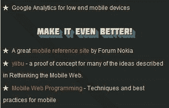

# 第四章：构建快速响应的网站

在本章中，我们将涵盖：

+   使用基本的 HTML5 标记构建页面

+   使用 CSS3 功能进行渐进增强

+   应用响应式设计与媒体查询

+   使用动态加载

+   应用用户代理检测

+   在主页上添加移动书签气泡

+   使用文本区域和自动增长表单构建联系页面

+   制作具有即时响应的按钮

+   隐藏 WebKit chrome

+   构建移动站点地图

# 介绍

在移动设备上，带宽并不总是像在台式电脑上那样好。如果您在一个慢速的 3G 网络上，加载速度可能比在 Wi-Fi 热点上慢得多。即使对于 Wi-Fi 连接，许多移动浏览器的处理速度也比台式电脑慢。因此，当我们创建移动站点时，它们必须快速且响应迅速。

从本章开始，我们还将开始介绍 HTML5 功能。HTML5 是一组技术，包括语义、新的 CSS 规则和属性，以及新的 JavaScript API，可用于构建结构更好的网页和功能强大的 Web 应用程序。以下是八个主要的 HTML5 功能：

+   语义

+   离线和存储

+   设备访问

+   连接

+   多媒体

+   3D、图形和效果

+   性能和集成

+   CSS3

并非所有这些功能都是专门针对移动设备的；有些与移动 Web 更相关，而有些则更适用于移动和桌面 Web。我们将讨论每个功能，并看看它们如何最好地帮助我们的移动开发。

基于使用新的语义标记和 CSS3 创建的示例，我们将讨论充分利用移动浏览器提供的内容以及如何使用这些独特功能构建网站的许多方法。

# 使用 HTML5 语义构建页面

目标设备：跨浏览器

HTML5 引入了更丰富的标签集；这些标签赋予结构以含义。语义是 HTML5 的一个基本方面。

我们不会在这里介绍所有标签，但会涵盖一些最常用的标签。

## 准备工作

首先，让我们创建一个新的 HTML 文件，并将其命名为`ch04r01.html`。让我们创建一个关于音乐的虚构网站。

## 如何做...

在我们的 HTML 文档中，输入以下代码：

```html
<!doctype html>
<html>
<head>
<title>first.fm</title>
<meta charset="utf-8">
<meta name="viewport" content="width=device-width, initial-scale=1.0">
<style>
</style>
</head>
<body>
<header>
<h1>first.fm</h1>
</header>
<div id="main">
<h2>Pages</h2>
<nav>
<ul>
<li class="list"><a href="http://music.html">Music</a></li>
<li><a href="radio.html">Radio</a></li>
<li><a href="http://events.html">Events</a></li>
<li><a href="http://charts.html">Charts</a></li>
<li><a href="community.html">Community</a></li>
<li><a href="help.html">Help</a></li>
<li><a href="http://about.html">About</a></li>
</ul>
</nav>
</div>
<footer>
<small>&copy; 2011 first.fm</small>
</footer>
</body>
</html>

```

## 它是如何工作的...

`header`元素通常用于`h1`到`h6`元素；它可以出现在整个页面的头部或任何块级元素的头部。它通常包含标题、副标题或标语。

`<header>`元素：

```html
<header>
</header>

```

`nav`元素表示文档的导航。`nav`元素是一个包含指向其他文档或当前文档内部部分的链接的部分。

页面上并非所有链接组都需要在`nav`元素中。只有主要或次要导航链接的组。特别是，页脚通常会有指向站点各个关键部分的链接列表，但在这种情况下，页脚元素更合适。

`<nav>`元素：

```html
<nav>
<ul class="list">
<li class="list"><a href="http://music.html">Music</a></li>
</ul>
</nav>

```

`footer`元素表示文档或文档部分的“页脚”。页脚元素通常包含有关其封闭部分的元数据，例如谁写的、相关文档的链接、版权数据等。页脚中给出的部分的联系信息应使用地址元素进行标记。

`<footer>`元素：

```html
<footer>
<small>&copy; 2011 first.fm</small>
</footer>

```

`small`元素可用于小字体。它不打算呈现页面的主要焦点。`small`元素不应用于长段落或文本部分。它只用于版权信息等短文本。

`<small>`元素：

```html
<small>&copy; 2011 first.fm</small>

```

## 还有更多...

语义不仅仅是更丰富的标签集。我们需要的不仅仅是更有意义的标签。为了扩展标签之外，我们还可以添加机器可读的额外语义；浏览器、脚本或机器人可以理解的数据，为程序和用户提供更有用的、数据驱动的 Web。这些语义是：**RDFa（属性中的资源描述框架）、Microdata**和**Microformats**。

### RDFa

RDFa 提供了一组可机器读取的 HTML 属性。通过使用 RDFa，作者可以将现有的可读信息转换为可机器读取的数据，而无需重复内容。最新的规范可以在此处找到：

[`www.w3.org/TR/rdfa-in-html/`](http://www.w3.org/TR/rdfa-in-html/)。

### 微数据

微数据使用属性来定义数据的名称-值对组。您可以在此处了解更多信息：[`html5doctor.com/microdata/`](http://html5doctor.com/microdata/)。

您可以通过阅读 W3C 工作草案来深入了解微数据：[`www.w3.org/TR/microdata/`](http://www.w3.org/TR/microdata/)。

您还可以阅读 W3C 编辑草案：[`dev.w3.org/html5/md/`](http://dev.w3.org/html5/md/)。

### 微格式

微格式首先设计为人类，其次为机器。目前有 34 个微格式规范，其中一些已发布，一些是草案。您可以在此处了解更多信息：[`html5doctor.com/microformats/`](http://html5doctor.com/microformats/)。

## 另请参阅

+   *在移动 Web 上使用 HTML5*在第一章中，*HTML5 和移动 Web*

+   *在第一章中使 HTML5 跨浏览器呈现*，*HTML5 和移动 Web*

# 使用 CSS3 功能进行渐进增强

目标设备：跨浏览器

CSS3 通过各种样式和效果增强 Web 应用程序和网站。使用 CSS3，可以创建一组无图像的丰富 UI。在移动设备上，更少的图像意味着更快的加载，这是提高性能的一种方式。由于大多数现代智能手机浏览器都广泛支持 CSS3，并且有用于回退的 polyfills（polyfills 用作回退，使 HTML5 功能在不支持 HTML5 的浏览器上工作），因此开始使用 CSS3 不仅安全而且必要！


## 准备就绪

让我们设计前面示例中创建的页面。首先复制`ch04r01.html`，并将其重命名为`ch04r02.html`。

## 如何做...

添加以下样式规则：

```html
<style>
body {
margin:0;
padding:0;
font-family:Arial;
background:#ccc;
}
header {
text-shadow: 0 1px #000;
background: #ff3019; /* Old browsers */
background: -moz-linear-gradient(top, #ff3019 0%, #cf0404 20%, #ff3019 100%); /* FF3.6+ */
background: -webkit-gradient(linear, left top, left bottom, color-stop(0%,#ff3019), color-stop(20%,#cf0404), color-stop(100%,#ff3019)); /* Chrome,Safari4+ */
background: -webkit-linear-gradient(top, #ff3019 0%,#cf0404 20%,#ff3019 100%); /* Chrome10+,Safari5.1+ */
background: -o-linear-gradient(top, #ff3019 0%,#cf0404 20%,#ff3019 100%); /* Opera11.10+ */
background: -ms-linear-gradient(top, #ff3019 0%,#cf0404 20%,#ff3019 100%); /* IE10+ */
filter: progid:DXImageTransform.Microsoft.gradient( startColorstr='#ff3019', endColorstr='#ff3019',GradientType=0 ); /* IE6-9 */
background: linear-gradient(top, #ff3019 0%,#cf0404 20%,#ff3019 100%); /* W3C */
}
h1 {
padding:0.5em 0.2em;
margin:0;
font-size: 18px;
color:white;
}
h2 {
text-shadow: 0 1px #FFFFFF;
background: #eeeeee; /* Old browsers */
background: -moz-linear-gradient(top, #eeeeee 0%, #cccccc 100%); /* FF3.6+ */
background: -webkit-gradient(linear, left top, left bottom, color-stop(0%,#eeeeee), color-stop(100%,#cccccc)); /* Chrome,Safari4+ */
background: -webkit-linear-gradient(top, #eeeeee 0%,#cccccc 100%); /* Chrome10+,Safari5.1+ */
background: -o-linear-gradient(top, #eeeeee 0%,#cccccc 100%); /* Opera11.10+ */
background: -ms-linear-gradient(top, #eeeeee 0%,#cccccc 100%); /* IE10+ */
filter: progid:DXImageTransform.Microsoft.gradient( startColorstr='#eeeeee', endColorstr='#cccccc',GradientType=0 ); /* IE6-9 */
background: linear-gradient(top, #eeeeee 0%,#cccccc 100%); /* W3C */
padding:0.5em 0.2em;
margin:0;
font-size: 16px;
color:#000;
}
nav ul {
border-top:1px solid #fff;
list-style-type: none;
padding:0;
margin:0;
}
nav li {
padding:0.5em 0.2em;
margin:0;
background:#AFAFAF;
border-bottom:1px solid #fff;
}
nav li a {
height:20px;
display:block;
text-decoration:none;
color:white;
}
</style>

```

通过在浏览器中运行此代码，我们可以看到：


## 它是如何工作的...

在此示例中，我们使用 CSS3 渐变来设计标题元素。传统上，要创建像前面的示例一样的渐变，人们必须使用 Photoshop 或 Illustrator，但现在您可以纯粹使用 CSS 来创建它！

```html
background: #eeeeee; /* Old browsers */
background: -moz-linear-gradient(top, #eeeeee 0%, #cccccc 100%); /* FF3.6+ */
background: -webkit-gradient(linear, left top, left bottom, color-stop(0%,#eeeeee), color-stop(100%,#cccccc)); /* Chrome,Safari4+ */
background: -webkit-linear-gradient(top, #eeeeee 0%,#cccccc 100%); /* Chrome10+,Safari5.1+ */
background: -o-linear-gradient(top, #eeeeee 0%,#cccccc 100%); /* Opera11.10+ */
background: -ms-linear-gradient(top, #eeeeee 0%,#cccccc 100%); /* IE10+ */
filter: progid:DXImageTransform.Microsoft.gradient( startColorstr='#eeeeee', endColorstr='#cccccc',GradientType=0 ); /* IE6-9 */
background: linear-gradient(top, #eeeeee 0%,#cccccc 100%); /* W3C */

```

通过查看上述每条规则，我们可以看到不同的浏览器使用不同的 CSS 规则来处理渐变。为了确保跨浏览器兼容性，有六种不同的变体。您可能会想：“哦，天哪，照顾每个浏览器真的很耗时。”别担心，这条规则不是手动输入的。**终极 CSS 渐变生成器**来拯救！ColorZilla 的强大类似于 Photoshop 的 CSS 渐变编辑器可以帮助您轻松创建 CSS3 渐变：

[`www.colorzilla.com/gradient-editor/`](http://www.colorzilla.com/gradient-editor/)


## 还有更多...

如果考虑 IE9 及以下版本，可以使用 CSS3 PIE（[`css3pie.com/`](http://css3pie.com/)）来提供支持。

下载`PIE.htc`后，将其包含在 CSS 中：

```html
-pie-background: linear-gradient(top, #eeeeee 0%,#cccccc 100%); /*PIE*/
behavior: url(PIE.htc);

```

支持的功能包括：

+   边框半径

+   盒阴影

+   边框图像

+   CSS3 背景（`-pie-background`）

+   渐变

+   RGBA 颜色值

+   PIE 自定义属性

### 了解 CSS3 渐变

*Jeffrey Way*，nettuts 的编辑，有一篇关于 CSS3 渐变的优秀文章。您可以在此处查看：[`net.tutsplus.com/tutorials/html-css-techniques/quick-tip-understanding-css3-gradients/.`](http://net.tutsplus.com/tutorials/html-css-techniques/quick-tip-understanding-css3-gradients/.)

### CSS3，请！

*CSS3 Please!*，由*Paul Irish*编写，提供了有关渐变和许多其他 CSS3 功能的最新语法：[`css3please.com/`](http://css3please.com/)。

## 另请参阅

+   *在移动 Web 上使用 HTML5*在第一章中

# 应用响应式设计

目标设备：跨浏览器

响应式设计是近期移动开发中最重要的概念之一。它强调浏览器应该对屏幕/浏览器调整大小做出不同的渲染。移动优先的响应式设计可以使页面在桌面浏览器上优雅地降级。

*那么为什么我们需要响应式网页设计呢？*

当我们在桌面网页上应用固定布局时，根据浏览器屏幕尺寸，屏幕左侧或右侧通常会出现空白。移动浏览器也有不同的尺寸，并且视口空间有限，每个像素都很重要，因此利用屏幕上的每个像素非常重要，因此需要使用响应式设计来消除页面左侧或右侧的不必要的空白。

*媒体查询如何帮助响应式设计？*

媒体查询用于根据屏幕尺寸更新样式内容，因此对于相同的 HTML 元素，可以应用两个单独的规则。渲染哪一个取决于浏览器视口的大小。

## 准备工作

在本示例中，我们将使用名为`respond.js`的 HTML5 填充。它是由*Scott Jehl*（来自 jQuery Mobile 团队）创建的。它位于源代码的`ch04_code/js`中。

## 操作步骤...

首先，让我们创建一个名为`ch04r03.html`的 HTML 文档。

在 HTML 中输入以下代码：

```html
<!doctype html>
<html>
<head>
<title>first.fm</title>
<meta charset="utf-8">
<meta name="viewport" content="width=device-width, initial-scale=1.0">
<link rel="stylesheet" href="css/style.css?v=1">
<script>Modernizr.mq('(min-width:0)') || document.write("<script src='js/respond.min.js'>\x3C/script>")</script>
</head>
<body>
<header>
<h1>first.fm</h1>
</header>
<div id="main">
<h2>Pages</h2>
<nav>
<ul class="list clearfix">
<li class="list"><a href="http://music.html">Music</a></li>
<li class="list"><a href="radio.html">Radio</a></li>
<li class="list"><a href="http://events.html">Events</a></li>
<li class="list"><a href="http://charts.html">Charts</a></li>
<li class="list"><a href="community.html">Community</a></li>
<li class="list"><a href="help.html">Help</a></li>
<li class="list"><a href="http://about.html">About</a></li>
</ul>
</nav>
</div>
<footer>
<small>&copy; 2011 first.fm</small>
</footer>
</body>
</html>

```

如果您在移动设备上渲染页面，这个页面看起来会和前面的示例一模一样。但是如果您在桌面浏览器上渲染它，它会看起来和下面的类似：


## 工作原理...

在文件顶部，我们使用**Modernizr**首先检测当前浏览器是否支持媒体查询。如果不支持，我们将加载`respond.min.js`：

```html
<script>Modernizr.mq('(min-width:0)') || document.write("<script src='js/respond.min.js'>\x3C/script>")</script>

```

在撰写本文时，您需要在规则的末尾添加`/*/mediaquery*/`注释才能使其工作。这在`respond.js`的未来版本中可能会得到改进：

```html
@media only screen and (min-width: 800px) {
}/*/mediaquery*/

```

## 还有更多...

在 Mobile Boilerplate 网站上，我进一步解释了媒体查询，并且您可以在以下网址找到幻灯片：[`html5boilerplate.com/mobile/`](http://html5boilerplate.com/mobile/)。

*Andy Clarke*创建了基于响应式设计理念的*320 and up*。您可以在以下网址下载：[`stuffandnonsense.co.uk/projects/320andup/`](http://stuffandnonsense.co.uk/projects/320andup/)。

# 优化填充脚本加载

目标设备：跨浏览器

脚本加载对于任何浏览器都很重要，但对于移动设备来说更重要，因为带宽较低。Modernizr 带有一个动态加载解决方案。

## 准备工作

首先，让我们创建一个 HTML 文档，命名为`ch03r04.html`。

## 操作步骤...

在代码编辑器中输入以下代码，并运行它。

```html
<!doctype html>
<html>
<head>
<title>first.fm</title>
<meta charset="utf-8">
<meta name="viewport" content="width=device-width, initial-scale=1.0">
<script src="img/modernizr.custom.54685.js"></script>
<style>
</style>
</head>
<body>
<header>
<h1>Your Location</h1>
</header>
<div id="main">
Your Geo Location is: <span id="geo"></span>
</div>
<script src="img/jquery.js"></script>
<script>
yepnope({
test : Modernizr.geolocation,
nope : ['js/geolocation.js'],
complete: function () { navigator.geolocation.getCurrentPosition(function(position) {
document.getElementById('geo').innerHTML = position.coords.latitude+", "+position.coords.longitude;
});
}
});
</script>
</body>
</html>

```

## 工作原理...

在撰写本文时，Modernizr 2.0 预览版处于 Beta 1 阶段。在这个测试版中，有两个很棒的新功能。一个是您可以选择自定义要检测的功能。另一个很棒的功能是您可以使用`yepnope.js`（也被称为*Alex Sexton*和*Ralph Holzmann*的`Modernizr.load`）。`Yepnope.js`提供了一个动态 JavaScript 加载器，您可以在本章的*还有更多*部分了解更多信息。


使用 Modernizr，我们可以首先检测当前用户代理中是否已存在某个功能：

```html
test : Modernizr.geolocation

```

如果不存在，我们将使用`yepnope`加载`shim geolocation.js`。加载完成后，我们可以附加纬度和经度：

```html
yepnope({
test : Modernizr.geolocation,
nope : ['js/geolocation.js'],
complete: function () {
...
});

```

## 还有更多...

有一些可选资源对开发人员很有帮助。Modernizr 测试套件就是其中之一。它有助于开发人员一目了然地了解某个设备支持哪些功能。您可以在以下网址了解更多信息：

[`modernizr.github.com/Modernizr/test/index.html`](http://modernizr.github.com/Modernizr/test/index.html)。

### yepnope

yepnope 是一个异步条件资源加载器，速度超快，允许您仅加载用户需要的脚本。要了解更多信息，请访问：[`yepnopejs.com/`](http://yepnopejs.com/)。

## 另请参阅

+   *使用 CSS3 功能进行渐进增强*

# 应用用户代理检测

目标设备：跨浏览器

在开发移动站点时，具有用户代理检测是很有用的。这可以帮助您编写重定向脚本，或者帮助您确定是否要基于用户代理加载/不加载某些内容。

## 准备工作

首先，让我们看看如何根据用户代理检测告诉用户是否可以从一个站点重定向到另一个站点。有几种方法可以做到这一点：您可以在服务器配置中执行此操作，也可以在服务器端编程语言中执行此操作，或者可以从前端 JavaScript 中执行此操作。

## 如何做...

您可以从以下位置下载重定向脚本：[`detectmobilebrowser.com/`](http://detectmobilebrowser.com/)。它带有许多不同版本。在本示例中，让我们使用 Apache 配置`.htaccess`。

## 它是如何工作的...

下载文件并打开后，您会看到以下脚本：

```html
RewriteEngine On
RewriteBase /
RewriteCond %{HTTP_USER_AGENT} android|avantgo|blackberry|blazer|compal|
....
|up\.(browser|link)|vodafone|wap|windows\ (ce|phone)|xda|xiino [NC,OR]
RewriteCond %{HTTP_USER_AGENT} ^(1207|6310|6590|
....
|your|zeto|zte\-) [NC]
RewriteRule ^$ http://example.com/mobile [R,L]

```

要将桌面站点重定向到移动站点，可以将`http://example.com/mobile`更改为您的站点地址。

## 还有更多...

用户代理检测不仅在重定向站点时有用，还在尝试确定是否应基于用户代理加载某些内容时有用。

在构建 Mobile Boilerplate 站点时，我使用了检测脚本的 JavaScript 版本来确定站点是否应根据用户代理（移动或桌面）呈现嵌入内容：

```html
if(!jQuery.browser.mobile) {
...
}

```

使用此桌面浏览器脚本，幻灯片将被加载并显示如下：


在移动版本中，它不会显示：



### 移动浏览器检测方法

移动 tuts 上的一篇文章解释了移动浏览器检测的不同方法：[`mobile.tutsplus.com/tutorials/mobile-web-apps/mobile-browser-detection/`](http://mobile.tutsplus.com/tutorials/mobile-web-apps/mobile)。

# 将移动书签气泡添加到主页

目标设备：iOS

在前几章中，我们已经谈到了在某些移动设备上为您的站点添加书签的能力。尽管这是一个非常酷的功能，使 Web 应用程序更接近本机应用程序，但它也存在一个问题：没有 API 可以用来调用书签操作，因此许多用户根本不知道手机上有这样一个功能。为了解决这个问题，一些框架使用 CSS 和 JavaScript 提供了书签气泡。该脚本将在 Web 应用程序页面底部添加一个促销气泡，要求用户将 Web 应用程序添加到其设备的主屏幕上。

## 准备工作

如前所述，许多框架提供了此功能，但为了简单起见，让我们使用一个独立的框架。Google 发布了一个名为*The Mobile Bookmark Bubble*的开源库来完成这项任务。首先，让我们在以下位置下载它：[`code.google.com/p/mobile-bookmark-bubble/`](http://code.google.com/p/mobile-bookmark-bubble/)。

## 如何做...

该库附带一个`sample.js`。只需在创建的任何网页中包含`bookmark_bubble.js`和`sample.js`，然后您会看到以下内容：


## 它是如何工作的...

该库使用 HTML5 本地存储来跟踪促销是否已经显示，以避免不断地纠缠用户。该库的当前实现专门针对 Mobile Safari，这是 iPhone 和 iPad 设备上使用的 Web 浏览器。

## 另请参阅

*在第二章中启用 iPhone 全屏模式*。

# 构建带有文本区域和自动增长表单的联系人页面

目标设备：跨浏览器

在像短信这样的原生应用中，文本区域会自动增长。在移动 Web 上，如果创建一个文本区域，您会意识到它是固定大小的。当您输入的文本行数超过文本区域的高度时，很难看到文本。在这个例子中，我们将看到如何创建一个在您输入更多行时自动增长的文本区域。

## 准备工作

首先，让我们创建一个名为`ch04r05.html`的 HTML 文档。在这个例子中，我们将在 Mobile Boilerplate 中使用`helper.js`：[`github.com/h5bp/mobile-boilerplate`](http://github.com/h5bp/)

## 如何做...

在文件中输入以下代码：

```html
<!doctype html>
<html>
<head>
<title>first.fm</title>
<meta charset="utf-8">
<meta name="viewport" content="width=device-width, initial-scale=1.0">
<style>
#contact {width:220px; height:40px;}
</style>
</head>
<body>
<header>
<h1>Contact Form</h1>
</header>
<div id="main">
<p>Type the message to see it autogrow</p>
<textarea id="contact">
</textarea>
</div>
<script src="img/jquery.js"></script>
<script src="img/helper.js"></script>
<script>
var contact = document.getElementById("contact");
MBP.autogrow(contact);
</script>
</body>
</html>

```

以下是 Palm webOS 中呈现方式的屏幕截图：


## 它是如何工作的...

在脚本中，我们有一个键盘事件监听器。这将检测文本区域的高度是否已更改。我们测量内容的高度，如果已更改，我们将更改文本区域的 CSS 样式以增加高度。

## 还有更多...

这个原始概念来自 Google 的 Code 博客。您可以在这里阅读更多关于它的信息：[`googlecode.blogspot.com/2009/07/gmail-for-mobile-html5-series.html`](http://googlecode.blogspot.com/2009/07/gmail-for-mobile-html5)。

## 参见

+   *使用即时响应制作按钮*

# 使用即时响应制作按钮

目标设备：iOS，Android

在移动设备浏览器上，按钮响应可能会比原生应用稍慢。在移动浏览器上，有一个`touchstart`事件。通过检测这个事件而不是点击事件，可以使点击更快。

## 准备工作

在这个例子中，我们将使用 Mobile Boilerplate 中的一个函数。创建一个名为`ch04r06.html`的文件。

## 如何做...

以下代码将创建一个带有提交按钮的表单：

```html
<!doctype html>
<html>
<head>
<title>first.fm</title>
<meta charset="utf-8">
<meta name="viewport" content="width=device-width, initial-scale=1.0">
<style>
#contact {
width:220px; height:40px;
}
</style>
</head>
<body>
<header>
<h1>Contact Form</h1>
</header>
<div id="main">
<textarea id="contact"></textarea><br />
<button id="btn">INSTANT button!!!</button><br />
<span id="result"></span>
</div>
<footer>
<small>&copy; 2011 first.fm</small>
</footer>
<script src="img/jquery.js"></script>
<script src="img/helper.js"></script>
<script>
var btn = document.getElementById("btn");
MBP.fastButton(btn,showForm);
function showForm() {
$("#result").html("Thank you for submitting, we will get back to you shortly!");
}
</script>
</body>
</html>

```

## 它是如何工作的...

以下是快速按钮函数的摘录，我们将在这里看到函数是如何工作的。

在顶部，我们定义了主要函数。只有在支持`addEventListener`的情况下才会使用它，它监听`touchstart`和`click`事件：

```html
MBP.fastButton = function (element, handler) {
this.element = element;
this.handler = handler;
if (element.addEventListener) {
element.addEventListener('touchstart', this, false);
element.addEventListener('click', this, false);
}
};
MBP.fastButton.prototype.handleEvent = function(event) {
switch (event.type) {
case 'touchstart': this.onTouchStart(event); break;
case 'touchmove': this.onTouchMove(event); break;
case 'touchend': this.onClick(event); break;
case 'click': this.onClick(event); break;
}
};

```

`onTouchStart`方法用于监听`touchmove`和`touchend`事件。`stopPropagation`用于停止事件在监听器中的传播，以便它停止冒泡：

```html
MBP.fastButton.prototype.onTouchStart = function(event) {
event.stopPropagation();
this.element.addEventListener('touchend', this, false);
document.body.addEventListener('touchmove', this, false);
this.startX = event.touches[0].clientX;
this.startY = event.touches[0].clientY;
this.element.style.backgroundColor = "rgba(0,0,0,.7)";
};

```

`touchmove`用于测试用户是否在拖动。如果用户拖动超过 10 像素，我们将重置它：

```html
MBP.fastButton.prototype.onTouchMove = function(event) {
if(Math.abs(event.touches[0].clientX - this.startX) > 10 || Math.abs(event.touches[0].clientY - this.startY) > 10) {
this.reset();
}
};

```

以下代码防止幽灵点击并调用实际的点击处理程序：

```html
MBP.fastButton.prototype.onClick = function(event) {
event.stopPropagation();
this.reset();
this.handler(event);
if(event.type == 'touchend') {
MBP.preventGhostClick(this.startX, this.startY);
}
this.element.style.backgroundColor = "";
};
MBP.fastButton.prototype.reset = function() {
this.element.removeEventListener('touchend', this, false);
document.body.removeEventListener('touchmove', this, false);
this.element.style.backgroundColor = "";
};

```

## 还有更多...

您可以在 Google 的博客上阅读有关快速按钮的更多信息。它详细解释了这个想法背后的背景和理论：[`code.google.com/mobile/articles/fast_buttons.html`](http://code.google.com/mobile/articles/)。

## 参见

*使用文本区域和自动增长表单构建联系页面*

# 隐藏 WebKit chrome

目标设备：iOS，Android

iOS 和 Android 上移动 Safari 的 URL 栏使用了大量空间。许多开发人员会在页面加载时隐藏它，因为移动房地产有限。每个像素都很重要，通过隐藏 URL 栏，可以帮助您利用屏幕上的每个像素，最大化显示区域。

## 准备工作

首先，让我们创建一个名为`ch04r07.html`的 HTML 文档。

## 如何做...

输入以下代码：

```html
<!doctype html>
<html>
<head>
<title>Mobile Cookbook</title>
<meta charset="utf-8">
<meta name="viewport" content="width=device-width, initial-scale=1.0">
<style>
html,body,header,footer{
padding:0;
margin:0;
}
header{
height:40px;
background:#BFB840;
display:block;
}
#main{
height:350px;
background:#F2CB67;
}
footer{
height:40px;
background:#DB5E31;
display:block;
}
</style>
</head>
<body>
<header>
header
</header>
<div id="main">
main
</div>
<footer>
footer
</footer>
<script src="img/jquery.js"></script>
<script src="img/helper.js"></script>
<script>
//MBP.hideUrlBar();
</script>
</body>
</html>

```

现在，如果您在浏览器中呈现它，它将看起来像这样：


现在取消以下行的注释：

```html
MBP.hideUrlBar();

```

再次呈现内容，您会看到 chrome 现在被隐藏，允许页脚显示：


## 它是如何工作的...

以下是 Boilerplate 中的脚本：

```html
MBP.hideUrlBar = function () {
var win = window,
doc = win.document;
// If there's a hash, or addEventListener is undefined, stop here
if( !location.hash || !win.addEventListener ){
//scroll to 1
window.scrollTo( 0, 1 );
var scrollTop = 1,
//reset to 0 on bodyready, if needed
bodycheck = setInterval(function(){
if( doc.body ){
clearInterval( bodycheck );
scrollTop = "scrollTop" in doc.body ? doc.body.scrollTop : 1;
win.scrollTo( 0, scrollTop === 1 ? 0 : 1 );
}
}, 15 );
win.addEventListener( "load", function(){
setTimeout(function(){
//reset to hide addr bar at onload
win.scrollTo( 0, scrollTop === 1 ? 0 : 1 );
}, 0);
}, false );
}
};

```

它检测 URL 中是否有任何哈希。如果有，我们将停止运行脚本，因为这意味着有一个内联锚点。如果没有任何哈希，我们将等待一秒，如果没有滚动，Android 使用 1 像素的 y 位置进行隐藏，而在 iOS 中为 0。脚本对两者进行了规范化。它是由*Scott Jehl*制作的：[`gist.github.com/1183357`](http://gist.github.com/1183357)。

它也包含在 Mobile Boilerplate 中：[`github.com/h5bp/mobile-boilerplate/blob/master/js/mylibs/helper.js`](http://github.com/h5bp/mobile-boilerplate/blob/master/js/mylibs/helper.js)。

## 另请参阅

*使用文本区域和自动增长表单构建联系页面*

# 构建移动站点地图

目标设备：跨浏览器

许多开发人员熟悉 Google 站点地图。作为最大的搜索引擎，确保它获取我们的内容非常重要。为了移动 SEO 目的，Google 提出了**移动站点地图**。Google 建议人们将其移动站点地图更新为下面描述的格式。

## 准备工作

首先，让我们创建一个 XML 文档并将其命名为`sitemap.xml`。

## 如何做...

我们可以将以下代码添加到 XML 文档中。对于您拥有的特定网站，URL 应该是您页面的 URL：

```html
<?xml version="1.0" encoding="UTF-8" ?>
<urlset 
>
<url>
<loc>http://mobile.example.com/article100.html</loc>
<mobile:mobile/>
</url>
</urlset>

```

所有 URL 都包含在`<loc></loc>`中。

确保您已包含`<mobile:mobile/>`。否则，站点将无法被正确爬取。

## 它是如何工作的...

站点地图遵循特定的模式；上述 XML 模式用于告诉 Google 搜索引擎移动网页的位置。通常，如果网站使用 CMS 系统构建，应该有一种自动生成 URL 的方法，并且它们都应该在`<loc></loc>`中列出。

## 还有更多...

移动站点地图不能包含仅限桌面的 URL。但是，它可以包含桌面和移动内容。

对于具有专用移动内容和专用 URL 的网站，您可以将用户从`example.com`重定向到`m.example.com`。在这种情况下，对用户和 Googlebot-Mobile 都使用 301 重定向。

如果您从`example.com`提供所有类型的内容，则 Google 不认为这是欺骗。

### Google 和移动友好的站点构建

在 Google 网站管理员网站上，有一篇关于如何使网站移动友好的博客文章：[`googlewebmastercentral.blogspot.com/2011/02/making-websites-mobile-friendly.html`](http://googlewebmastercentral.blogspot.com/2011/02/making-websites-mobile-friendly.html)。

### Google 和移动站点索引

Google 网站管理员网站上还有另一篇博客，讨论如何帮助 Google 索引您的移动站点：[`googlewebmastercentral.blogspot.com/2009/`](http://googlewebmastercentral.blogspot.com/2009/)
