# 第七章：移动调试

在本章中，我们将涵盖：

+   使用 Opera Dragonfly 进行远程调试

+   使用 weinre 进行远程调试

+   在移动设备上使用 Firebug

+   使用 JS 控制台进行远程调试

+   设置移动 Safari 调试

# 介绍

尽管调试可能需要大量时间，但它是网页开发的重要方面，无论是桌面还是移动。在本章中，我们将介绍一些用于使前端调试更容易，更快速，并使网页开发更高效的移动调试工具。

# 使用 Opera Dragonfly 进行远程调试

目标浏览器：Opera Mobile

由于移动屏幕相对较小，移动调试与桌面调试不同。

## 准备工作

1.  确保您连接到 WiFi 网络。

1.  在[`www.opera.com/`](http://www.opera.com/)下载最新版本的 Opera 桌面浏览器。

1.  在您的移动设备上下载 Opera Mobile。

## 如何做...

1.  在撰写本文时，Opera 的版本为 11.50。一些说明可能会在您阅读本书时发生变化。

1.  在您的桌面上打开 Opera，并从下拉菜单中选择**页面** | **开发者工具** | **Opera Dragonfly**。

1.  您应该会看到一个调试工具出现在页面底部。点击**远程调试配置**，如下截图所示：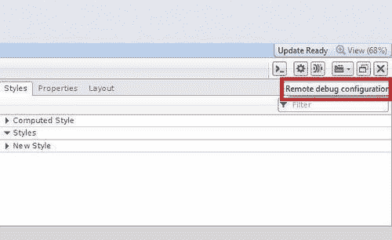

1.  一旦我们点击**远程调试配置**按钮，将会出现一个弹出面板。

1.  在面板上，您可以看到一个文本字段来指定端口号和一个**应用**按钮。默认号码应该是未使用的，并且应该可以正常工作。点击**应用：**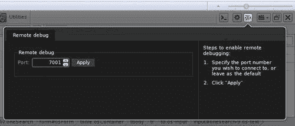

1.  现在打开您的桌面控制台并输入`ipconfig`作为命令。IPv4 地址就是您的 IP 地址。

1.  在移动设备上打开 Opera Mobile，输入`opera:debug`在 URL 地址栏中，我们将到达一个如下的页面：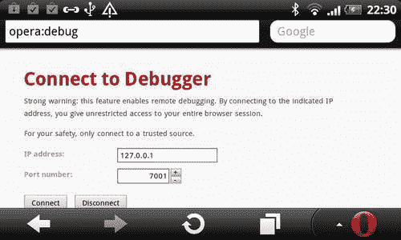

1.  输入您从桌面控制台获取的 IP 地址，然后点击**连接**。现在移动浏览器应该连接到 Dragonfly：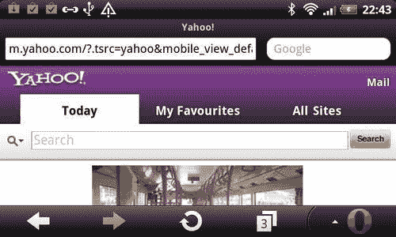

## 它是如何工作的...

在 Opera Mobile 上打开一个新标签，访问 Yahoo.com，现在切换到桌面，点击**选择调试上下文**，这是右上角的第四个按钮。从下拉菜单中选择**Yahoo!**开始检查页面！

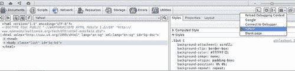

## 另请参阅

+   *使用 weinre 进行远程调试*

+   *使用 JS 控制台进行远程调试*

# 使用 weinre 进行远程调试

目标浏览器：iOS，Android，Blackberry，webOS

在上一个步骤中，我们看到了如何远程调试 Opera 移动页面。在这个步骤中，我们将看到如何在其他移动设备上进行远程调试。**Weinre**是一个**Web Inspector Remote**。

支持的操作系统包括：

+   Android 2.2 浏览器应用

+   Android 2.2 w/PhoneGap 0.9.2iOS 4.2.x

+   移动 Safari 应用

+   BlackBerry v6.x 模拟器

+   webOS 2.x（未指定版本）

## 准备工作

首先，我们必须从官方网站下载 weinre；有两个版本可用，一个是 PC 版，一个是 Mac 版：

[`github.com/phonegap/weinre/archives/master`](http://github.com/phonegap/weinre/archives/master)

## 如何做...

1.  首先，在控制台中运行`ipconfig`获取您的 IP 地址。

1.  创建一个名为`ch07r01.html`的 HTML 文档。将`192.168.1.11`替换为您自己的 IP 地址：

```html
<!doctype html>
<html>
<head>
<title>Mobile Cookbook</title>
<meta charset="utf-8">
<meta name="viewport" content="width=device-width, initial-scale=1.0">
</head>
<body>
<header>
<h1>Mobile Cookbook</h1>
</header>
<div id="main">
</div>
<script src="img/target-script-min.js"></script>
</body>
</html>

```

1.  首先，找到下载的`weinre.jar`文件。在我的情况下，路径是`C:\xampp\htdocs\dev\weinre.jar`。其次，获取 IP 地址，在我的情况下是`http://192.168.1.11`。

1.  现在打开控制台并输入以下行：

```html
java -jar path/to/weinre.jar -httpPort 8081 -boundHost http://192.168.1.11

```

1.  要测试是否有效，请访问 URL 地址`http://192.168.1.11:8081/`，应该会出现接近以下截图的页面：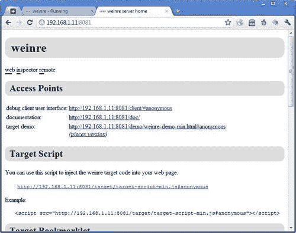

## 它是如何工作的...

现在使用您的移动设备访问创建的示例页面：

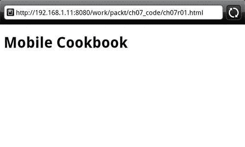

现在，回到桌面，点击**调试客户端用户界面**。不要在标签中打开，而是在新窗口中打开。

你应该能够看到类似以下截图的东西：

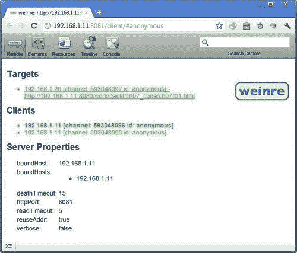

点击**元素**，现在你可以检查元素（如下图所示）：

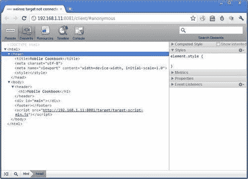

# 在移动设备上使用 Firebug

目标浏览器：跨浏览器

许多人在 Firefox 和 Chrome 上使用 Firebug，但 Firebug Lite 可以在支持 JavaScript 的任何浏览器上使用。在这个教程中，我们将看到如何使用 Firebug 进行调试。

## 准备工作

创建一个 HTML 文档并将其命名为`ch07r02.html`。

## 如何操作...

1.  在 HTML 中输入以下代码：

```html
<!doctype html>
<html>
<head>
<title>Mobile Cookbook</title>
<meta charset="utf-8"> <meta name="viewport" content="width=device-width, initial-scale=1.0">
</head>
<body>
<div id="main">
</div>
<script type="text/javascript" src="img/firebug-lite.js"></script>
</body>
</html>

```

1.  在移动浏览器中渲染它：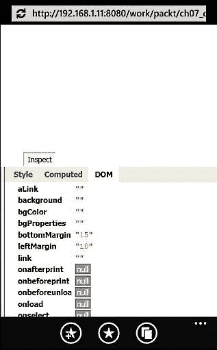

## 它是如何工作的...

Firebug Lite 是 Firebug 的 JavaScript 版本。以下代码将加载托管在 Firebug 网站上的 Firebug Lite 脚本：

```html
<script type="text/javascript" src="img/firebug-lite.js"></script>

```

你也可以下载脚本并将其添加为本地版本。

你可以访问 HTML、CSS 和 JavaScript，并查看 DOM。控制台可用于 JavaScript 输入。

Firebug Lite 有四个发布渠道：

+   **稳定通道**

+   **调试通道**

+   **Beta 通道**

+   **开发者通道**

我们一直在使用的是稳定通道。其他通道在*还有更多*部分下有解释。

## 还有更多...

除了实时和本地版本，你还可以添加书签。它可能无法在所有浏览器上运行。以下是如何操作的。

1.  点击页面右侧的链接：[`getfirebug.com/firebuglite`](http://getfirebug.com/firebuglite)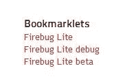

1.  这将在移动浏览器的 URL 末尾添加哈希`#javascript:(function..`。

1.  在 Safari 上收藏该页面。

1.  编辑书签的名称为书签的名称，Firebug Lite，Firebug Lite 调试或 Firebug Lite beta。

1.  保存书签后，打开书签菜单，选择**Firebug Lite**，然后点击**编辑**。删除 URL 和`#`，只保留以`javascript:(function`开头的部分。

1.  现在，如果你打开任何网页并点击**Firebug Lite 书签**，一个 Firebug 控制台将出现在页面的右下角。

### 调试通道

调试通道使用与稳定通道相同的版本，但具有不同的预配置，使得调试 Firebug Lite 本身变得更容易。

### Beta 通道

Beta 通道是新功能和修复的地方。它应该是相当稳定的（没有已知的回归），但可能会包含一些错误，一些功能可能不完整。

### 开发者通道

开发者通道是创意和测试的地方。一旦它直接绑定到我们的代码存储库，你将获得可能的最新代码，并且将比其他渠道更频繁地接收更新。但需要注意的是，开发者通道有时可能非常不稳定，初始加载可能会较慢。

# 使用 JS 控制台进行远程 JavaScript 调试

目标浏览器：跨浏览器

如果你只是寻找远程 JavaScript 调试，*Remy Sharp*有一个名为 JavaScript 控制台的很棒的工具。它对于移动调试非常有效。

## 准备工作

访问[`jsconsole.com/`](http://jsconsole.com/)，你会看到下面显示的页面：

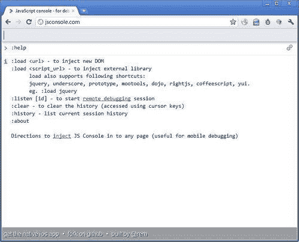

## 如何操作...

1.  在网站上输入`:listen`，你应该看到以下信息消息返回：

**创建连接...**

**连接到"65C1F9F1-6A57-46C0-96BB-35C5B515331F"**

1.  接下来将是一行类似于 JavaScript 的代码：

```html
<script src="img/remote.js?65C1F9F1-6A57-46C0-96BB-35C5B515331F"></script>

```

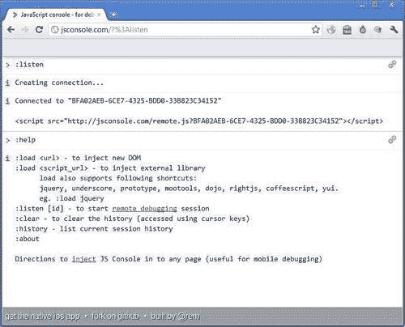

1.  创建一个 HTML 页面并将其命名为`ch07r04.html`。将以下代码输入到文档中，用你从 jsconsole.com 得到的`<script>...</script>`替换：

```html
<!doctype html>
<html>
<head>
<title>Mobile Cookbook</title>
<meta charset="utf-8">
<meta name="viewport" content="width=device-width, initial-scale=1.0">
</head>
<body>
>
<div id="main">
</div>
<script src="img/remote.js?04926BFB-44AB-4979-BAE9-F4A4FA7CE22C"></script>
<script>
for (var i=0; i<10; i++) {
console.log('testing '+i);
}
</script>
</body>
</html>

```

1.  现在，如果我们在移动设备上渲染页面，我们会看到桌面屏幕网页上出现日志消息：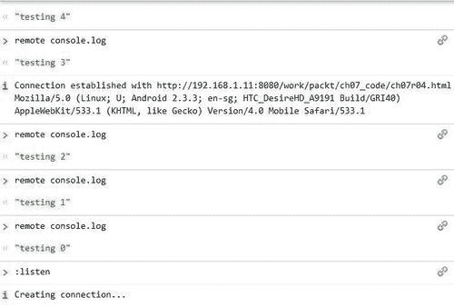

## 它是如何工作的...

在以下循环中，我们使用`console.log`输出一串消息：

```html
<script>
for (var i=0; i<10; i++) {
console.log('testing '+i);
}
</script>

```

从您的 Web 应用程序中对`console.log`的任何调用都将在监听您的密钥的 jsconsole 会话中显示结果。同样，如果您在 jsconsole 会话中运行命令，代码将被注入到您的 Web 应用程序中，并将结果返回给 jsconsole。

## 还有更多...

整个 JavaScript 控制台 Web 应用程序是开源的；如果您想了解更多关于它是如何制作的，请访问：[`github.com/remy/jsconsole`](http://github.com/remy/jsconsole)。

### JS 控制台 iOS 应用

JS Console for iOS，也是由*Remy Sharp*制作的，是一个 JavaScript 控制台，用于测试和检查 JavaScript 的结果，而无需在线或在浏览器中。

### 简单的 iOS 模拟器示例

这段由*Remy Sharp*制作的视频展示了如何在 iOS 上使用 jsconsole.com 进行远程调试 JavaScript。它展示了如何接收日志并发送任意命令：

[`www.youtube.com/watch?v=Y219Ziuipvc&feature=player_embedded`](http://www.youtube.com/watch?v=Y219Ziuipvc&feature=player_embedded)

### 在任何设备上远程调试 JavaScript

在以下视频中，*Remy Sharp*录制了如何使用 jsconsole.com 远程调试任何设备上的任何浏览器的操作步骤：

[`www.youtube.com/watch?v=DSH392Gxaho&feature=player_embedded`](http://www.youtube.com/watch?v=DSH392Gxaho&feature=player_embedded)

# 设置移动 Safari 调试

目标浏览器：iOS

在 iOS 移动 Safari 上，有一个用于调试的内置调试器。

## 准备就绪

拿起 iPhone 并导航到主屏幕。

## 如何做...

1.  找到并打开**设置**应用程序：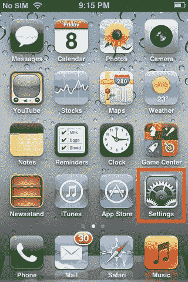

1.  选择**Safari**：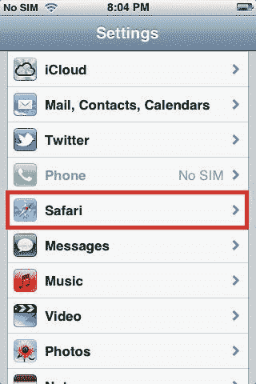

1.  向下滚动以找到底部的**开发人员**选项：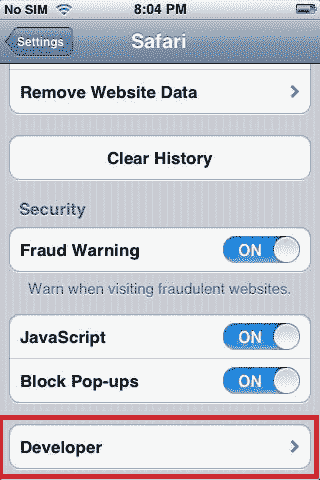

1.  默认情况下，**调试控制台**是**关闭**的：

1.  现在我们可以将**调试控制台**切换到**打开**：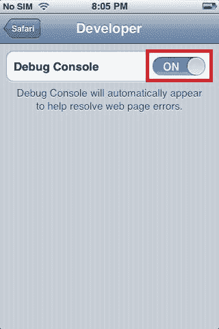

1.  在 Safari 中，查找页面顶部 URL 栏下方的调试控制台摘要信息：

1.  点击摘要信息以查看页面上的错误的详细报告。

1.  现在，让我们创建一个 HTML 文档并将其命名为`ch07r05.html`。将以下代码输入到页面中：

```html
<!doctype html>
<html>
<head>
<title>Mobile Cookbook</title>
<meta charset="utf-8">
<meta name="viewport" content="width=device-width, initial-scale=1.0">
</head>
<body>
<div id="main">
</div>
<script>
for (var i=0; i<3; i++) {
console.log('testing '+i);
}
</script>
</body>
</html>

```

1.  在渲染时，我们可以看到：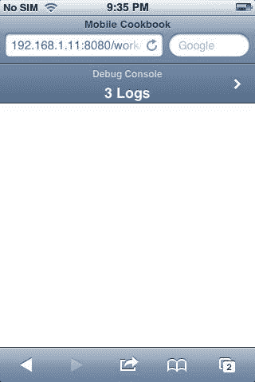

## 它是如何工作的...

一旦点击**调试控制台**，它将带您到消息屏幕：

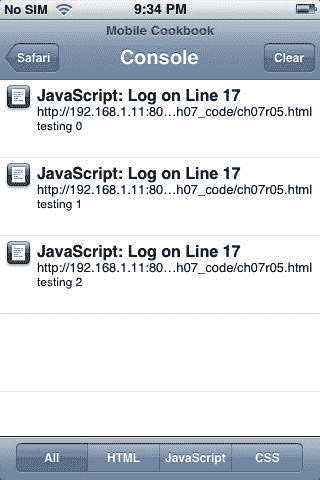

以下脚本用于创建调试消息：

```html
<script>
for (var i=0; i<3; i++) {
console.log('testing '+i);
}
</script>

```
