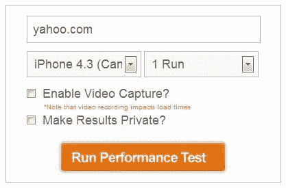
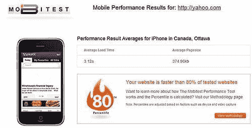
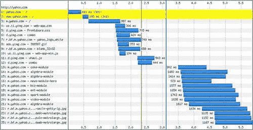
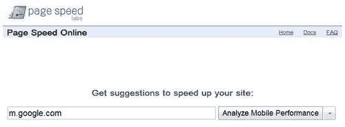
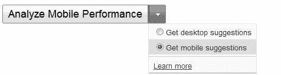
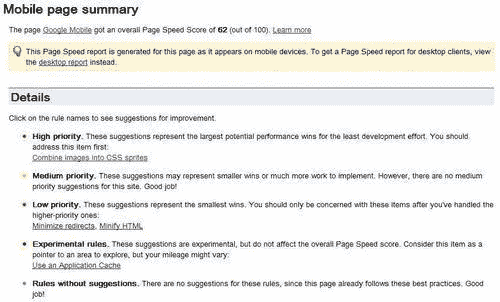
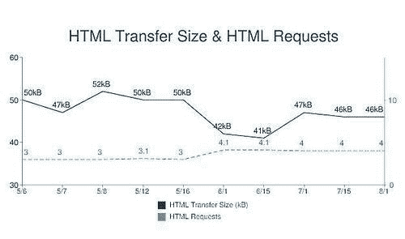
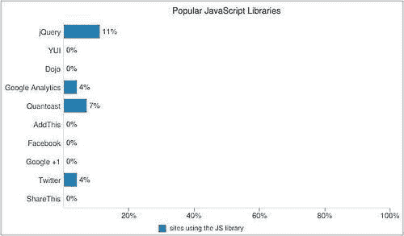

# 第九章：移动性能测试

在本章中，我们将介绍：

+   使用 Blaze 测试您的移动设备

+   在线分析移动页面速度

+   PCAP Web 性能分析仪

+   HTTP 存档移动版

+   使用 Jdrop 存储性能数据

# 介绍

在本章中，我们将介绍一些最热门的移动性能测试工具。

像移动调试一样，移动性能测试可能并不像桌面测试那样直接。但是每朵云都有一线阳光。许多开发人员已经找到了解决这些问题的创造性方法。

# 使用 Blaze 测试您的设备的速度

目标浏览器：跨浏览器

如果您想节省时间并快速测试移动站点的性能，了解加载时间和页面资源信息，那么 Blaze 是一个不错的选择。Mobitest 性能工具用于了解移动 Web 性能。它提供以下测试结果：

+   总加载时间

+   单个页面资源的分解

+   渲染视频

+   原始 HTTP 存档（HAR）文件

## 准备就绪

您只需登录[`www.blaze.io/mobile/`](http://www.blaze.io/mobile/)。

## 如何做...



在页面上，您可以看到以下表单，允许您输入 URL。让我们测试**yahoo.com**！

在结果页面的顶部，我们可以从屏幕截图中看到平均加载时间、页面大小和站点的速度排名：



以下图表显示了站点的瀑布图：



## 它是如何工作的...

**使用的设备**

您可能想知道后端使用了什么设备，它们是否是仿真器或模拟器。测试是在使用自定义构建的代理的真实移动设备上运行的。

**加载时间百分位数**

使用内部索引来计算加载时间百分位数。它使用数百个网站来获取站点速度与其他站点的比较。

**测试运行的位置**

测试运行位置在加拿大渥太华。代理通过 WiFi 连接到互联网。撰写时使用的设备有：iPhone、Nexus 和三星 Galaxy S。

要了解更多，请访问：

[`www.blaze.io/mobile/methodology/`](http://www.blaze.io/mobile/methodology/)。

## 还有更多...

可以在以下位置找到一些有用的页面测试工具列表：

[`www.blaze.io/learn/feo-resources/`](http://www.blaze.io/learn/feo-resources/)

### Blaze 博客

除了提供的测试工具，Blaze 还有一个博客，其中有很多关于移动优化的文章，网址是：

[`www.blaze.io/blog/`](http://www.blaze.io/blog/)

### Web 性能优化最佳实践

有关 Web 性能最佳实践的良好提示，请访问 Blaze 优化页面：

[`www.blaze.io/overview/optimizations/`](http://www.blaze.io/overview/optimizations/)

# 在线分析移动页面速度

目标浏览器：跨浏览器

如果您熟悉 Google Page Speed，您会知道有一个 Chrome 扩展程序，用于测试桌面浏览器的加载时间。但是还有一个 Google Page Speed 的 Web 版本，可以用于分析移动性能。

## 准备就绪

访问 Google Page Speed Online：

[`pagespeed.googlelabs.com/`](http://pagespeed.googlelabs.com/)。

## 如何做...

在此示例中，我们将测试 Google 的移动主页：

1.  输入您想要分析的 URL，在我们的例子中，让我们使用**m.google.com:**

1.  单击输入框旁边的下拉列表，并从下拉菜单中选择**获取移动建议**：

1.  一旦点击**分析移动性能**，我们将进入以下页面：

## 它是如何工作的...

页面速度得分表示页面可以快多少。对于我们的例子，数字是 100 中的 62。

以下是分析的细节。细节已经分解如下：

+   高优先级：这些建议代表了最大潜在的性能优胜者，而开发工作最少。您应该首先解决这些问题。

+   中等优先级：这些建议可能代表着较小的收益或者更多的工作来实施。

+   低优先级：这些建议代表最小的收益。

+   实验性规则：这些建议是实验性的，但不会影响整体页面速度得分。

+   没有建议的规则：对于这些规则没有建议，因为此页面已经遵循了这些最佳实践。但您仍然可以通过展开左侧可折叠菜单来检查规则。

## 还有更多...

要查看移动性能工具列表，请访问：

[`github.com/h5bp/mobile-boilerplate/wiki/Mobile-Performance-Tools`](http://github.com/h5bp/mobile-boilerplate/wiki/Mobile-Performance-Tools)

### 需要速度

麻省理工技术评论显示了一些关于速度有多重要以及它如何影响您网站访问者的图表和统计数据。文章提到，即使轻微的在线减速也会让人感到沮丧，并给公司带来损失：

[`www.technologyreview.com/files/54902/GoogleSpeed_charts.pdf`](http://www.technologyreview.com/files/54902/GoogleSpeed_charts.pdf)

### 当时间很重要

Gomez Inc 进行了一项关于网站和移动性能期望的全国消费者调查：

[`www.gomez.com/wp-content/downloads/GomezWebSpeedSurvey.pdf`](http://www.gomez.com/wp-content/downloads/GomezWebSpeedSurvey.pdf)

# 使用 PCAP Web 性能分析器分析移动性能

目标浏览器：跨浏览器

PCAP Web 性能分析器允许您更好地控制数据分析。您可以与移动网站/应用程序进行交互，并更准确地获取性能数据。它是由*Bryan McQuade*和*Libo Song*创建的。

## 准备工作

在使用 PCAP Web 性能分析器之前，我们需要先为移动设备捕获 PCAP 文件。我们通过设置一个私人 WiFi 网络，连接移动设备到网络，捕获，然后分析流量来实现。以下是如何做到这一点：

1.  打开**控制面板** | **网络和互联网** | **网络和共享中心**。

1.  选择**设置新的连接或网络**的链接。

1.  选择**设置无线自组网（计算机对计算机）网络**。

1.  接下来，给网络取一个名字（例如 hot1），并勾选**保存此网络**。

1.  返回**网络和共享中心**，点击左侧的**更改适配器设置**链接。

1.  找到您的局域网，右键单击并打开**属性** | **共享选项卡**。

1.  启用共享。

现在我们需要下载 Wireshark，我们可以使用它来选择要捕获的网络流量。我们可以通过以下步骤生成 HAR 文件并将其保存在本地机器上：

1.  从以下网址下载 Wireshark：[`www.wireshark.org/download.html`](http://www.wireshark.org/download.html)。

1.  打开 WireShark。

1.  点击**菜单捕获** | **选项**。

1.  在**选项**对话框中，选择您的无线接口，然后点击**捕获过滤器**。

1.  在**捕获过滤器**对话框中，创建一个新的过滤器（如果您还没有这样做），名称为**TCP 和 UDP 端口 53（DNS）**，过滤字符串为**tcp 或 udp 端口 53**。

1.  选择过滤器，然后关闭对话框。

1.  在**捕获选项**对话框中点击**开始**按钮开始捕获。

1.  完成后保存捕获。

要将移动设备连接到热点，请在移动设备上连接到指定的 WiFi 热点（在我们的示例中为“hot1”）。现在，您在移动设备上访问的任何网站都应该被*tcpdump*捕获。

## 如何做...

在**性能分析器**页面上，选择您保存的 HAR 文件，然后点击**上传**。文件将被处理，并将显示带有瀑布的详细分析：


## 它是如何工作的...

它使用开放文件格式 PCAP 和 HAR，以及开源工具 pcap2har、HAR 查看器和页面速度。

## 还有更多...

*Stoyan Stefanov*维护了一个非常有用的关于 Web 和移动性能的网站。

[`calendar.perfplanet.com/2010/mobile-performance-analysis-using-pcapperf/`](http://calendar.perfplanet.com/2010/mobile-performance-analysis-using-pcapperf/)

### HAR 查看器

正如官方描述所说，*HAR Viewer 是一个基于 HTTP 存档格式（HAR）的 HTTP 跟踪日志的可视化 Web 应用程序（PHP + JavaScript）*。该项目托管在 Google Code 上；您可以在以下网址查看：[`code.google.com/p/harviewer/`](http://code.google.com/p/harviewer/)。

### 使用 Page Speed 优化您的移动网站

有一个关于使用 Google 的 Page Speed 的视频。该视频是在 Google I/O 2011 期间拍摄的，由 PACPPERF 的创作者呈现，您可以在以下网址找到：

[`www.google.com/events/io/2011/sessions/use-page-speed-to-optimize-your-web-site-for-mobile.html`](http://www.google.com/events/io/2011/sessions/use-page-speed-to-optimize-your-web-site-for-mobile.html)

### pcap2har

要了解有关 pcap2har 的更多信息，您可以访问 Github 上托管的项目页面：

[`github.com/andrewf/pcap2har`](http://github.com/andrewf/pcap2har)

# 使用 HTTP 存档移动版

目标浏览器：跨浏览器

HTTP 存档移动版跟踪 Web 的构建方式。它提供：

+   **Web 技术趋势：**加载时间，下载大小，性能得分

+   **有趣的统计数据：**流行的脚本，图像格式，错误，重定向

+   **网站性能：**特定 URL 截图，瀑布图，HTTP 头

## 准备工作

登录到[`mobile.httparchive.org/`](http://mobile.httparchive.org/)。

## 如何做...

点击**趋势**，您可以查看诸如 HTML，JavaScript，CSS，图像和 Flash 的传输大小和请求等趋势。以下是 HTML 传输大小和 HTML 请求的图表：



点击**统计**，您可以获得许多有趣的统计数据，从最常见的图像格式到最常见的服务器；从具有最多 CSS 的页面到具有最多图像的页面。

以下是显示最受欢迎的 JS 库的图表：



点击**网站**，您将获得与特定网站相关的所有性能信息，包括 Filmstrip，瀑布图，页面速度，请求，趋势和 HAR 文件的下载。

## 它是如何工作的...

列出的网站是由 Alexa，财富，全球 500 和 Quancast10K 排名最高的网站。

URL 列表提供给`WebPagetest.org`。

使用 JavaScript 从 HAR 文件生成 HTTP 瀑布图。

## 还有更多...

因此，您可能会问为什么我们需要记录这些数据。我们这样做是因为归档并从 Web 性能历史中学习是很重要的。正如*Steve Souders*所说，“*HTTP 存档提供了这一记录。它是网页性能信息的永久存储库，如页面大小，失败的请求和使用的技术。”*（在[`www.stevesouders.com/blog/2011/03/30/announcing-the-http-archive/)`](http://www.stevesouders.com/blog/2011/03/30/announcing-the-http-archive/)）。

### 数据的准确性如何？

如果您想了解数据的准确性，请阅读：[`mobile.httparchive.org/about.php#accuracy`](http://mobile.httparchive.org/about.php#accuracy)关于测量的信息，特别是时间测量。

### 测试方法的限制

尽管测试结果在很大程度上是有用的，但用户需要注意一些限制。有关需要考虑的事项清单，请访问：

[`mobile.httparchive.org/about.php#limitations`](http://mobile.httparchive.org/about.php#limitations)

# 使用 Jdrop 存储性能数据

目标浏览器：跨浏览器

**Jdrop**用于存储移动设备性能数据。JSON 数据存储在云中。

移动设备的屏幕空间较小，这使得分析大量信息变得困难。为了解决这个问题，Jdrop 允许您在大屏幕上分析从移动设备收集的数据。

## 准备工作

登录到 Jdrop [`jdrop.org/`](http://jdrop.org/)。

## 如何做...

在您的移动设备上：

1.  登录到 Jdrop。

1.  安装任何使用 Jdrop 的应用程序。

1.  运行应用程序并将数据保存到 Jdrop。

在您的台式机或笔记本电脑上：

1.  登录 Jdrop。

1.  查看您生成的 JSON 数据。

在移动设备上，开始的最简单方法是将`jdrop-example.js`的内容（可以在[`jdrop.org/jdrop-example.js)`](http://jdrop.org/jdrop-example.js)找到）嵌入到您的书签脚本中。此外，您还必须添加一个“保存到 Jdrop”的链接到您的书签，以调用您的函数。您可以在[`jdrop.org/devdocs`](http://jdrop.org/devdocs)找到带有解释的代码。

**保存到 Jdrop：**

以下是您需要添加“保存到 Jdrop”链接到您的书签的代码。

```html
<a href="javascript:SaveToJdrop('MY APP NAME', myDataObj, '1.1.3', '1.8 secs')">Save to Jdrop</a>

```

**注册您的应用程序：**

目前，注册您的应用程序需要一些手动操作；您必须在 Jdrop 讨论列表（[`groups.google.com/group/jdrop/topics`](http://groups.google.com/group/jdrop/topics)）上发布请求。

这是注册您的应用程序所需的信息：

+   **应用程序名称**（必填）

+   **脚本 URL**（必填）

+   **回调函数**（可选）

+   **格式**（可选）

+   **格式密钥**（可选）

一些信息可能在您阅读此文时发生变化，您可以登录[`jdrop.org/devdocs`](http://jdrop.org/devdocs)检查是否有任何更新。

## 它是如何工作的...

当通过 Google 帐户连接时，您可能想知道为什么 Jdrop 要求访问您的 Google 联系人。这是因为 OAuth 到 Google 需要提到一个要进行身份验证的服务。Jdrop 实际上并不访问您的任何联系人。创建者正在考虑使用 OpenID 而不是 OAuth 来绕过这一步。

## 还有更多...

Jdrop 是由*Steve Souders*和*James Pearce*创建的。

*Steve Souders*对大多数开发者来说并不陌生；要查看他创造的所有奇迹，请访问：

[`stevesouders.com/`](http://stevesouders.com/)。

詹姆斯·皮尔斯（James Pearce）是 Sencha Inc.的开发者关系总监。您可以在他的网站上找到有关移动设备的有趣想法和有用信息：

[`tripleodeon.com/`](http://tripleodeon.com/)。
