# 第一章：HTML5 和移动网络

在本章中，我们将涵盖：

+   准备好你的移动设备

+   仿真器和模拟器

+   设置移动开发环境

+   在移动网络上使用 HTML5

+   使 HTML5 跨浏览器渲染

+   为移动设计

+   确定你的目标移动设备

+   制定内容适应策略

# 介绍

HTML5 和移动网络都是有前途的技术。两者的历史都相对较短。在本章中，我们将主要涵盖一些基础知识。这是为了帮助你快速开始移动开发，并付出最少的努力。

移动和 HTML5 仍在不断发展，你可能会有很多疑问。我们将解答这些疑问，让你专注于重要的事情。

移动网络发展迅速。我们现在有移动 Safari，这是 iPhone 上使用最广泛的应用之一，让开发人员能够构建高性能的网络应用，并增强用户的浏览体验。你不需要开发者账户来托管和运行移动网站，也不需要从任何应用市场获得批准来推出移动网站，而且你可以随时进行更新，而不必等待批准。这些都是移动网络开发的好处，但与此同时，也存在一些挑战，比如浏览器之间的不一致性，与原生应用相比缺少某些功能，以及安全性。我们无法解决所有问题，但我们肯定可以解决其中一些。在开发移动网站时，我们将看到如何将常规做法与最佳实践区分开来。

市面上有成千上万款智能手机；你不需要每一款都来测试你的应用。事实上，你可能只需要不到 10 款。如果这仍超出你的预算，那么两款设备就足够了。至于其他设备，你可以使用模拟器/仿真器来完成工作。本书重点关注六款 A 级移动设备，特别关注 iPhone、Android 和 Windows Phone：

+   iOS

+   Android

+   Windows Mobile

+   Blackberry v6.0 及以上版本

+   Symbian 60

+   Palm webOS

有两种与设备无关的浏览器也将在本书中介绍。它们是：

+   Opera Mobile

+   Firefox Mobile

其他浏览器不在列表中并不意味着它们不会受到我们在本书中讨论的问题和技术的影响。

## 确定你的目标移动设备

目标浏览器：全部

你不可能为每个移动设备制作一个移动网站。没有人有时间或精力这样做。

跨浏览器移动网络开发可能会很复杂。很难定义工作的范围，正如*John Resig*（jQuery Mobile 的创始人）在他的演示幻灯片中指出的那样，他提出了三个问题：（[`www.slideshare.net/jeresig/testing-mobile-javascript`](http://www.slideshare.net/jeresig/testing-mobile-javascript)）。

+   哪些平台和浏览器最受欢迎？

+   哪些浏览器能够支持现代脚本？

+   我需要哪些设备和模拟器来进行测试？

在构建移动网站时，你必须问自己类似的问题，但不是完全相同的问题，因为记住你的网站应该专门针对你的目标受众。所以你的问题应该是：

+   访问我网站的访客最常用的平台和浏览器是哪些？

+   有多少人从能够支持现代脚本的移动设备访问我的网站？

+   我需要哪些设备和模拟器来进行测试？

### 访问我网站的访客最常用的平台和浏览器是哪些？

现在让我们回答第一个问题。在构建移动网站之前，你必须首先找出你的目标受众是谁，以及他们在访问你网站时使用的移动设备。有许多分析工具可以帮助你回答这些问题。其中之一就是 Google Analytics。你可以在[`www.google.com/analytics/`](http://www.google.com/analytics/)免费注册一个 Google Analytics 账户。

做法非常简单：大多数开发人员对 Google Analytics 并不陌生。您只需从 Google Analytics 网站中包含 JavaScript 片段并嵌入到您的网页中即可。

大多数现代智能手机都可以渲染 JavaScript，因此在桌面站点和移动站点上使用它并没有真正的区别。

### 有多少人通过支持现代脚本的移动设备访问我的网站？

现在让我们回答第二个问题。您可能想要了解的一件事是使用移动浏览器浏览您的网站的人数。您还想了解有多少人使用根本不支持 JavaScript 的旧版移动浏览器。这是因为如果使用低端智能手机的人数比使用高端智能手机的人数更多，那么首先使用 HTML5 可能并不值得（尽管这种可能性非常低）。

因此，如果您的目标不仅是了解使用智能手机的人数，还要了解使用旧版移动电话的人数，Google Analytics for mobile 就可以派上用场。您可以从以下网址下载脚本：

[`code.google.com/mobile/analytics/download.html#Download_the_Google_Analytics_server_side_package`](http://code.google.com/mobile/analytics/download.html#Download_the_Google_Analytics_server_side_package)

Google Analytics for mobile 服务器端包目前支持 JSP、ASPX、Perl 和 PHP。让我们看看 PHP 中的一个示例。您只需将**ACCOUNT ID GOES HERE**更改为您的 GA 帐户 ID。但请记住**用'MO-xx'替换'UA-xx'**。

不幸的是，当您使用服务器端版本时，您不能在同时使用标准的 JavaScript 跟踪代码`ga.js`的页面上使用它。使用服务器端版本意味着您必须放弃 JavaScript 版本。这可能会很烦人，因为 JavaScript 版本提供了许多在服务器端版本中缺失的动态跟踪机制：

```html
<?php
// Copyright 2009 Google Inc. All Rights Reserved.
$GA_ACCOUNT = "ACCOUNT ID GOES HERE";
$GA_PIXEL = "ga.php";
function googleAnalyticsGetImageUrl() {
global $GA_ACCOUNT, $GA_PIXEL;
$url = "";
$url .= $GA_PIXEL . "?";
$url .= "utmac=" . $GA_ACCOUNT;
$url .= "&utmn=" . rand(0, 0x7fffffff);
$referer = $_SERVER["HTTP_REFERER"];
$query = $_SERVER["QUERY_STRING"];
$path = $_SERVER["REQUEST_URI"];
if (empty($referer)) {
$referer = "-";
}
$url .= "&utmr=" . urlencode($referer);
if (!empty($path)) {
$url .= "&utmp=" . urlencode($path);
}
$url .= "&guid=ON";
return $url;
}
?>

```

## Google Analytics 的替代方案

Google Analytics 并不是市场上唯一的移动分析服务。还有其他提供更专业服务的服务。例如，**PercentMobile**是一个托管的移动分析服务，可以清晰地展示您的移动受众和机会。您可以在以下网址了解更多关于这项服务的信息：

[`percentmobile.com/`](http://percentmobile.com/)

### Google Analytics 的准确性

移动设备报告的位置可能并不总是准确；Google Analytics 使用 IP 地址来确定地图叠加报告的用户位置。它们可能存在不准确性，因为移动 IP 来自无线运营商网关，这并不一定与移动用户位于同一位置。

### 服务器加载速度问题

由于服务器端处理，可能会产生一些额外的服务器负载。Google 建议您首先在您的一些页面上测试片段，以确保一切正常，然后再推广到整个网站。

# 设置移动开发工具

目标浏览器：全部

现在，前一个问题仍然没有得到答复：*我需要哪些设备和模拟器来进行测试？*我们将在这里找到答案。

如果您已经确定了要支持的主要移动设备，现在是时候看看如何设置它们了。如果您在各种移动设备上进行测试，移动开发可能会很昂贵。尽管我们有所有这些移动模拟器和仿真器可供测试，但与在真实设备上测试相比，效果并不好。现在让我们看看如何最大程度地覆盖测试并最小化成本。

## 准备就绪

我们在这里要做一些假设。每种情况都不同，但思路是一样的。假设您的桌面上使用的是 Windows 操作系统，但您网站的顶级访问者使用的是 iOS、Android 和 Blackberry。

## 如何做…

你的目标是最大程度地覆盖并最小化成本。这三种设备都有模拟器，但并非所有都支持不同的平台。

| 名称 | 兼容性 |
| --- | --- |
| iOS 模拟器 | Mac |
| Android 模拟器 | Windows, Mac, Linux |
| 黑莓模拟器 | Windows |

正如你所看到的，由于 iOS 模拟器只适用于 Mac，如果你使用的是 Windows 操作系统，最好且唯一的选择是购买 iPhone 进行测试。对于 Android 和黑莓，因为它们都有 Windows 的模拟器，为了节约预算，你可以下载模拟器。

## 它是如何工作的...

1.  列出人们用来浏览你的网站的热门移动设备。

1.  了解你用于开发的机器操作系统。

1.  了解每个设备模拟器与您的开发环境的兼容性。

## 还有更多...

如果你的预算可以支持多个不同操作系统的移动设备，你可以进一步考虑屏幕尺寸和移动设备的 DPI。你可能不需要购买两台高端设备。例如，拥有 iPhone4 和 Android Thunderbolt 并非必要。你可以购买一台低端的 Android 设备来测试你的网站在低端设备上的显示效果。因此，思路是结合操作系统、移动设备和模拟器，以最大程度地覆盖各种场景。

### 设备模拟器/模拟器下载查询表

以下表格显示了用于移动网页设计和开发测试的流行移动设备模拟器的列表：

| 名称 | 类型 | 兼容性 | URL |
| --- | --- | --- | --- |
| iOS | 模拟器 | Mac | [`developer.apple.com/devcenter/ios/index.action#downloads`](http://developer.apple.com/devcenter/ios/index.action#downloads) |
| Android | 模拟器 | Mac, Win, Linux | [`developer.android.com/sdk/index.html`](http://developer.android.com/sdk/index.html) |
| HP webOS | 虚拟机 | Mac, Win, Linux | [`developer.palm.com/index.php?option=com_content&view=article&id=1788&Itemid=55`](http://developer.palm.com/index.php?option=com_content&view=article&id=1788&Itemid=55) |
| Nokia Symbian | 模拟器 | Win | [`www.forum.nokia.com/info/sw.nokia.com/id/ec866fab-4b76-49f6-b5a5-af0631419e9c/S60_All_in_One_SDKs.html`](http://www.forum.nokia.com/info/sw.nokia.com/id/ec866fab-4b76-49f6-b5a5-af0631419e9c/S60_All_in_One_SDKs.html) |
| 黑莓 | 模拟器 | Win | [`us.blackberry.com/developers/resources/simulators.jsp`](http://us.blackberry.com/developers/resources/simulators.jsp) |
| Windows Mobile 7 | 模拟器 | Win | [`www.microsoft.com/downloads/en/details.aspx?FamilyID=04704acf-a63a-4f97-952c-8b51b34b00ce`](http://www.microsoft.com/downloads/en/details.aspx?FamilyID=04704acf-a63a-4f97-952c-8b51b34b00ce) |

### 浏览器模拟器/模拟器下载查询表

除了设备测试工具，我们还有针对平台独立浏览器的工具，特别是 Opera 和 Firefox。这些显示在下表中：

| 名称 | 类型 | 兼容性 | URL |
| --- | --- | --- | --- |
| Opera Mobile | 模拟器 | Mac, Win, Linux | [`www.opera.com/developer/tools/`](http://www.opera.com/developer/tools/) |
| Opera Mini | 模拟器 | Mac, Win, Linux | [`www.opera.com/developer/tools/http://www.opera.com/mobile/demo/`](http://www.opera.com/developer/tools/http://www.opera.com/mobile/demo/) |
| Firefox for Mobile | 模拟器 | Mac, Win, Linux | [`www.mozilla.com/en-US/mobile/download/`](http://www.mozilla.com/en-US/mobile/download/) |

### 远程测试

除了模拟器和模拟器，还有一些测试框架可以让你远程访问真实设备。其中一个工具是**DeviceAnywhere**；一个问题是它不是免费的。

[`www.deviceanywhere.com/`](http://www.deviceanywhere.com/)

# 黑莓模拟器

目标浏览器：黑莓

大多数移动设备模拟器在其网站上遵循说明进行安装和配置，但 BlackBerry 模拟器与其他移动设备模拟器的工作方式不同。对于 Blackberry 设备模拟器，除了下载模拟器外，还需要下载并安装**BlackBerry Email and MDS Services Simulator**以连接到互联网。

## 准备工作

确保您已经选择了一个要从中下载的模拟器：[`us.blackberry.com/developers/resources/simulators.jsp`](http://us.blackberry.com/developers/resources/simulators.jsp)

## 如何做...

首先，转到页面：[`swdownloads.blackberry.com/Downloads/entry.do?code=A8BAA56554F96369AB93E4F3BB068C22&CPID=OTC-SOFTWAREDOWNLOADS&cp=OTC-SOFTWAREDOWNLOADS`](http://swdownloads.blackberry.com/Downloads/entry.do?code=A8BAA56554F96369AB93E4F3BB068C22&CPID=OTC-SOFTWAREDOWNLOADS&cp=OTC-SOFTWAREDOWNLOADS)。在那里，您将看到一个类似以下截图的产品列表：

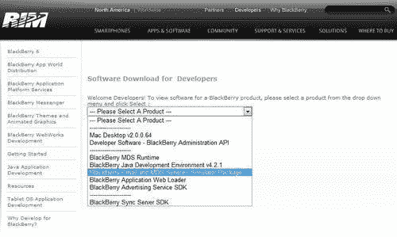

现在选择**BlackBerry Email and MDS Services Simulator Package**，然后点击**下一步**。

下载并安装软件后，您必须先启动服务模拟器，然后再启动 Blackberry 模拟器，以允许其连接到互联网。

以下是 Blackberry 模拟器的屏幕截图：


# 设置移动开发环境

目标浏览器：所有

在开始移动 Web 开发之前，我们必须先设置开发环境。

## 准备工作

1.  在您的机器上设置本地主机。对于 Windows、Mac 或 Linux，设置它的最简单方法是使用流行且免费的 XAMPP 软件：([`www.apachefriends.org/en/index.html`](http://www.apachefriends.org/en/index.html))。

1.  确保您有无线连接。

1.  您还应该随身携带一个移动设备。否则，使用移动模拟器/仿真器。

1.  确保您的移动设备和桌面在同一个无线网络上。

## 如何做...

1.  创建一个 HTML 文件，并将其命名为`ch01e1.html`，放在您的本地主机的根目录下：

在`ch01r01.html`中，输入以下内容：

```html
<html>
<head>
<meta name="viewport" content="width=device-width, initial-scale=1.0">
</head>
<body>
<header>
Main Navigation here
</header>
body content here
<footer>
Footer links here
</footer>
</body>
</html>

```

1.  现在获取您的 IP 地址。如果您使用 Windows，可以在命令提示符中输入以下命令：

```html
ipconfig

```

### 提示

下载本书的示例代码

您可以从您在[`www.PacktPub.com`](http://www.PacktPub.com)的帐户中下载您购买的所有 Packt 图书的示例代码文件。如果您在其他地方购买了这本书，您可以访问[`www.PacktPub.com/support`](http://www.PacktPub.com/support)并注册，以便将文件直接发送到您的邮箱

1.  一旦您获得了您的 IP 地址（例如，`192.168.1.16.`），在您的移动浏览器 URL 地址栏中输入它。现在您应该看到页面加载，并显示文本：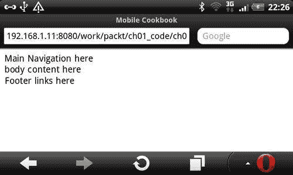

## 它是如何工作的...

在同一个网络中，您的移动设备可以通过您的桌面 IP 地址访问您的桌面主机。

## 还有更多...

如果您没有移动设备，可以使用其中一个模拟器进行测试。但建议至少有一两台真实的移动设备进行测试。模拟器可以测试大多数事情，但并不是所有事情都能准确测试。

### 在 Safari 桌面上进行测试

如果您的主要目标受众是 iPhone 移动 Safari 用户，您也可以在桌面上进行测试以节省时间。为此，打开 Safari，转到**首选项**，点击**高级**选项卡，勾选**显示开发菜单栏**，如下所示：

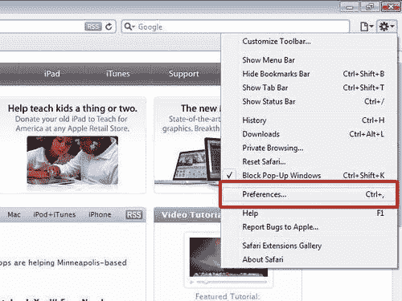

现在点击当前页面的显示菜单，选择**开发** | **用户代理** | **移动 Safari 3.1.3 - iPhone：**

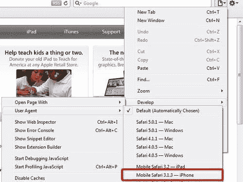

### 模拟器/仿真器的社区集合列表

如果您真的没有手机在手边，可以找到一份可用的模拟器和仿真器列表。您可以在 Mobile Boilerplate 项目的 wiki 上找到这个列表：

[`github.com/h5bp/mobile-boilerplate/wiki/Mobile-Emulators-&-Simulators`](http://github.com/h5bp/mobile-boilerplate/wiki/Mobile-Emulators-&-Simulators)

### Firtman 的仿真器/模拟器收藏清单

*Maximiliano Firtman*，一位移动和 Web 开发者，也是一位作者，他在自己的网站上维护着仿真器的清单：

[`www.mobilexweb.com/emulators`](http://www.mobilexweb.com/emulators)

# 在移动网络上使用 HTML5

目标浏览器：所有

现在我们将为你的移动设备创建一个简单的 HTML5 页面。如果你已经有了对旧版本 HTML 的经验，HTML5 应该很容易理解。如果你以前为桌面创建过网页，那么为移动设备创建一个网页对你来说也不难。

## 准备工作

创建一个新文件`ch01e2.html`。

## 如何做到...

将以下代码保存在文件中：

```html
<!doctype html>
<html>
<head>
<meta name="viewport" content="width=device-width, initial-scale=1.0">
</head>
<body>
hello to the HTML5 world!
</body>
</html>

```

现在在你的移动浏览器中渲染这个页面，你应该看到文本的渲染效果与预期一样。

## 它是如何工作的...

你可以看到，HTML5 和其他 HTML 页面之间唯一的区别是我们使用的**文档类型定义（DTD）**：`<!doctype html>`。

你可能已经看到了`<meta name="viewport" content="width=device-width, initial-scale=1.0">`的代码，并想知道它的作用。它帮助 Mobile Safari 知道页面与设备一样宽。设置`initial-scale=1`告诉浏览器不要放大或缩小。

## 还有更多...

以下是 HTML5 的一点历史：HTML5 有两个草案版本，一个由 W3C 创建，另一个由 WHATWG 创建。W3C 由一个民主性质的团体管理，但在实践中进展缓慢。WHATWG 由*Ian Hickson*（也在 Google 工作）编辑，以及一群不公开的人组成。由于*Ian*做出了大部分决策，WHATWG 的版本进展更快。

### HTML5 和版本号

你可能会想知道为什么 HTML5 在没有版本号的情况下使用声明如此模糊。有很多理由可以证明这一点：

1.  HTML 的版本支持对浏览器并不重要。重要的是功能支持。换句话说，如果浏览器支持你正在使用的 HTML5 功能，即使你将文档声明为 HTML4，它仍将按预期渲染 HTML5 元素。

1.  更容易输入！

### 移动文档类型

你可能会问，使用 HTML5 DTD`<!doctype html>`是否安全。答案是 DTD 是用于验证的，而不是用于浏览器渲染。你接下来可能会问：怪癖模式呢？`<!doctype html>`是确保浏览器以标准模式渲染所需的最低信息。所以你可以放心使用`<!doctype html>`。

你可能已经注意到我们使用`<!doctype html>`而不是`<!DOCTYPE html>`。原因是 HTML5 不区分大小写，但为了与其他 HTML 标签保持一致，我们将在整本书中使用小写。

### 学习 HTML5 的免费资源

有许多关于基本 HTML5 标签的优秀免费书籍和文章。如果你对 HTML5 不熟悉，可以查看以下内容之一：

+   HTML5 Doctor: [`html5doctor.com/`](http://html5doctor.com/)

+   Dive Into HTML5: [`diveintohtml5.org/`](http://diveintohtml5.org/)

+   HTML5 Rocks: [`www.html5rocks.com/`](http://www.html5rocks.com/)

如果你是那种真的想了解某件事的每一个细节的人，你可以阅读官方的 HTML5 规范。

规范的 W3C 版本在：

[`dev.w3.org/html5/spec/Overview.html`](http://dev.w3.org/html5/spec/Overview.html)

HTML Living Standard 的 WHATWG 版本在：

[`www.whatwg.org/specs/web-apps/current-work/multipage/`](http://www.whatwg.org/specs/web-apps/current-work/multipage/)

# 在不同浏览器中渲染 HTML5

目标浏览器：所有

有一些较旧的移动浏览器无法识别 HTML5 元素。问题在于，如果这些元素无法被识别，就无法对其进行样式设置。有许多 shim 来解决这个问题。其中一个是 Modernizr。

## 准备工作

1.  其中一个不识别 HTML5 元素的移动浏览器是 Windows Mobile。如果您没有 Windows Mobile，您可以简单地使用 IE7 来测试，因为它们都是基于相同的引擎。

1.  从网站下载 Modernizr：[`www.modernizr.com/`](http://www.modernizr.com/)。它是由*Faruk Ateş, Paul Irish*和*Alex Sexton*编写的。

## 如何做...

1.  创建一个 HTML 文件，并将其命名为`ch01e3.html`，然后在文件中输入以下代码：

```html
<!doctype html>
<html>
<head>
<meta charset="utf-8">
<meta name="viewport" content="width=device-width, initial-scale=1.0">
<style>
header, footer {display:block;}
</style>
</head>
<body>
<header>
Main Navigation here
</header>
body content here
<footer>
Footer links here
</footer>
</body>
</html>

```

1.  现在创建另一个包含 Modernizr 的页面，并将其命名为`ch01e4.html:`

```html
<!doctype html>
<html>
<head>
<meta charset="utf-8">
<meta name="viewport" content="width=device-width, initial-scale=1.0">
<script src="img/modernizr-1.7.min.js"></script>
<style>
header, footer {display:block;}
</style>
</head>
<body>
<header>
Main Navigation here
</header>
body content here
<footer>
Footer links here
</footer>
</body>
</html>

```

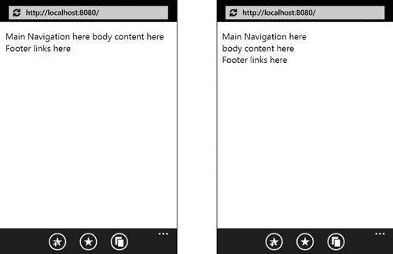

### 它是如何工作的...

记住，如果您在项目中使用 Modernizr，您应该始终在文件的头部在`<head>`标签的末尾之前包含它。还有其他用于类似目的的 polyfill，并且其中一些列在以下部分。

### 还有更多...

Modernizr 并不是唯一的脚本库助手；还有另外两个值得注意的：

+   **html5shim**由*Remy Sharp, Jonathan Neal & community*编写，可用于打印，以及在：

[`code.google.com/p/html5shim/`](http://code.google.com/p/html5shim/)

+   **innerShiv**由*Joe Bartlett*编写，可用于 innerHTML 使用：

[`jdbartlett.github.com/innershiv/`](http://jdbartlett.github.com/innershiv/)

#### HTML5 CSS 重置

您可能希望在样式表中重置一组新的 CSS HTML5 元素：

```html
article, aside, canvas, details, figcaption, figure,footer, header,
hgroup, menu, nav, section, summary,time, mark, audio, video {
margin: 0;
padding: 0;
border: 0;
font-size: 100%;
font: inherit; vertical-align: baseline;
}

```

#### 在较旧的 IE 中启用块级 HTML5 元素

在您的 CSS 中，您可能希望在 CSS 重置中包含一组块级 HTML5 元素。请注意，并非所有 HTML5 元素都必须显示为块级元素。

以下是一组块级 HTML5 元素的列表：

```html
article, aside, details, figcaption, figure,footer, header, hgroup, menu, nav, section {
display: block;
}

```

#### Modernizr

Modernizr 不仅可以使 HTML5 元素在 CSS 中可样式化。它还有助于检测浏览器中用于呈现的 HTML5 功能支持。在 2.0 版本中，您将有选择自定义下载[`www.modernizr.com/download/`](http://www.modernizr.com/download/)的选项。

# 为移动设备设计

目标浏览器：所有

对于桌面设计，人们倾向于使用固定布局或流式布局。在移动设备上，几乎总是应该使用流式布局。流式布局可以使您的网站对浏览器调整大小做出响应。

## 准备工作

现在在您的文本编辑器中创建两个空的 HTML 文件，一个命名为`ch01r06_a.html`，另一个命名为`ch01r06_b.html`。

## 如何做...

1.  在`ch01r06_a.html`中，输入以下代码并保存文件：

```html
<!doctype html>
<html>
<head>
<meta name="viewport" content="width=device-width, initial-scale=1.0, maximum-scale=1.0">
<script src="img/modernizr-1.7.min.js"></script>
<style>
body, #main ul, #main li, h1 {
margin:0; padding:0;
}
body {
background:#FFFFA6;
}
#container {
font-family:Arial;
width:300px;
margin:0 auto;
}
header, footer {
display:block;
}
#main li{
list-style:none;
height:40px;
background:#29D9C2;
margin-bottom:0.5em;
line-height:40px;
-moz-border-radius: 15px;
-webkit-border-radius: 15px;
border-radius: 15px;
}
#main li a {
color:white;
text-decoration:none;
margin-left:1em;
}
</style>
</head>
<body>
<div id="container">
<header>
<h1>Title here</h1>
</header>
<nav id="main">
<ul>
<li><a href="#">Home</a></li>
<li><a href="#">Contact Us</a></li>
<li><a href="#">Location</a></li>
<li><a href="#">Product</a></li>
<li><a href="#">About</a></li>
</ul>
</nav>
<footer>
Footer links here
</footer>
</div>
</body>
</html>

```

1.  在`ch01r06_b.html`中，输入以下代码并保存文档：

```html
<!doctype html>
<html>
<head>
<meta name="viewport" content="width=device-width, initial-scale=1.0, maximum-scale=1.0">
<script src="img/modernizr-1.7.min.js"></script>
<style>
body, #main ul, #main li, h1 {
margin:0;
padding:0;
}
body {
background:#FFFFA6;
}
#container {
font-family:Arial;
margin:0 10px;
}
header, footer {
display:block;
}
#main li{
list-style:none;
height:40px;
background:#29D9C2;
margin-bottom:0.5em;
line-height:40px;
-moz-border-radius: 15px;
-webkit-border-radius: 15px;
border-radius: 15px;
}
#main li a {
color:white;
text-decoration:none;
margin-left:1em;
}
</style>
</head>
<body>
<div id="container">
<header>
<h1>Title here</h1>
</header>
<nav id="main">
<ul>
<li><a href="#">Home</a></li>
<li><a href="#">Contact Us</a></li>
<li><a href="#">Location</a></li>
<li><a href="#">Product</a></li>
<li><a href="#">About</a></li>
</ul>
</nav>
<footer>
Footer links here
</footer>
</div>
</body>
</html>

```

### 它是如何工作的...

当您在纵向模式下查看这两个网站时，它们看起来几乎一样：

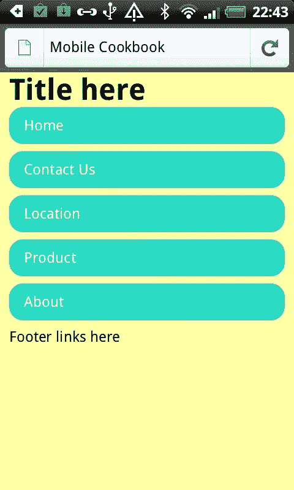

现在尝试旋转您的屏幕，看看会发生什么。

正如您现在所看到的，在横向模式下，第一个例子在左右两侧有空白，而第二个例子覆盖了屏幕的大部分空间：

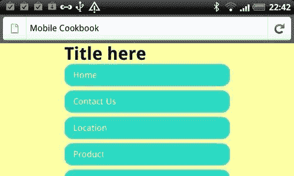

第二个例子显示了不同的结果：

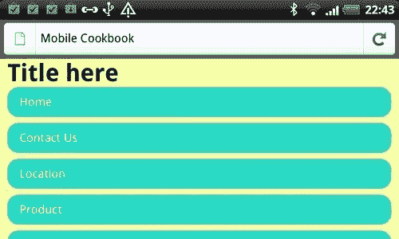

这个网站页面在固定布局中看起来非常尴尬，但在流式布局中看起来正常。因此，当您为移动设备设计时，始终记住您的网站应该具有这种灵活性。原因是：

+   移动设备既有纵向模式又有横向模式

+   移动设备的空间非常有限，因此您应该利用屏幕上的每个像素

### 还有更多...

CSS 媒体查询也是响应式设计的重要组成部分。它帮助您灵活设计移动设备。

```html
<!doctype html>
<html>
<head>
<meta name="viewport" content="width=device-width, initial-scale=1.0, maximum-scale=1.0">
<script src="img/modernizr-1.7.min.js"></script>
<style>
body {
margin:0;
padding:0;
background:#FFFFA6;
}
#main section {
display:block;
border:5px solid #29D9C2;
width:60%;
height:120px;
margin:5% auto;
}
@media screen and (min-width: 480px) {
#main {
width:90%;
margin:0 auto;
}
#main > section:first-child {
margin-right:5%;
}
#main section {
float:left;
width:45%;
}
}
</style>
</head>
<body>
<div id="container">
<div id="main">
<section id="top-news"></section>
<section id="sports"></section>
</div>
</div>
</body>
</html>

```

在较窄的屏幕上呈现时，这两个部分将垂直布局，而在较宽的屏幕上呈现时，这两个部分将水平布局。我们用来实现这一点的技术是使用 CSS 媒体查询。就像在这个例子中，我们使用了`@media screen and (min-width: 480px) {..}`，所以它的意思是页面在最小宽度为`480px`的页面上呈现时，其中的样式将被应用：


现在让我们在方向模式下看一下，如下所示。这两个框现在是相邻的。

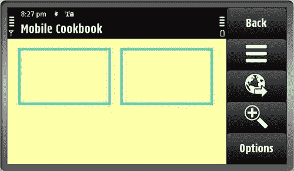

#### 首先桌面站点

除了构建纯粹的移动端或桌面端网站的想法，还有其他方式。其中之一是首先构建桌面站点，然后使其在移动端上优雅地降级。

#### 首先移动端站点

另一种方法是首先构建移动端，然后使其在桌面上优雅地呈现。

其中一种方法在 CSS 中使用以下内容：

```html
@media only screen and (min-width: 320px) {
/* Styles */
}
@media only screen and (min-width: 640px) {
/* Styles */
}
@media only screen and (min-width: 800px) {
/* Styles */
}
@media only screen and (min-width: 1024px) {
/* Styles */
}

```

#### 一个网站的方法

第三种方法是拥有一个“一个网站”版本，而不是专注于移动端或桌面端，而是同时专注于两者。

# 定义内容策略

目标浏览器：全部

使用分析工具收集的数据，您可以制定您想要构建的策略。如果您已经有了网站的桌面版本，这将特别有用。

## 准备就绪

确保您的网站上已经嵌入了 JavaScript。

## 如何做...

1.  转到您的分析工具，然后点击左侧导航下的**访客** | **移动设备**：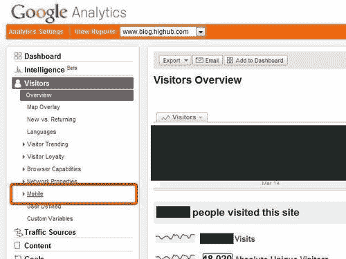

1.  现在，如果您点击**移动设备**，您可以看到人们用来浏览您网站的最常用设备：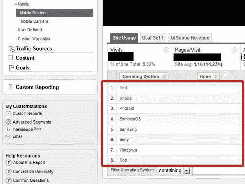

## 它是如何工作的...

Google Analytics 可以帮助您找出访问您网站的最常用的移动设备，并找出您网站最受欢迎的部分。

## 还有更多...

您还可以确定您的移动站点上最有用的页面是什么。人们对待移动浏览与桌面浏览不同。例如，如果您经营一家销售产品的本地商店，大多数人倾向于在移动设备上浏览**联系我们、位置**和**服务**等页面。相反，在桌面上，人们倾向于搜索**产品目录、关于**和**产品描述**。Google Analytics 可以帮助您找出您网站上访问量最高的部分/页面。除了 Google Analytics，您还可以使用 PercentMobile，就像我们之前看到的那样。

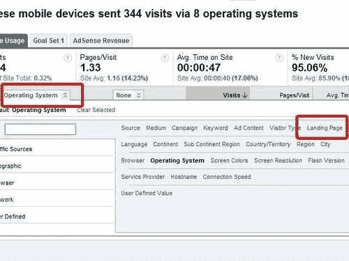

### 浏览器等级

使用分析服务是决定要支持哪些设备的一种方式。另一种方式是使用浏览器等级来了解您应该针对哪个类别。jQuery Mobile 在[`jquerymobile.com/gbs/.`](http://jquerymobile.com/gbs/.)上有一个出色的网格支持图表。还有一个关于移动浏览器 Web 开发的整体策略的 jQuery Mobile 幻灯片，网址是[`www.slideshare.net/jeresig/testing-mobile-javascript`](http://www.slideshare.net/jeresig/testing-mobile-javascript)。

### 移动矩阵

我一直在与*Jonathan Neal*和许多其他人合作，共同制定智能手机前端矩阵。您可以查看：

[`github.com/h5bp/mobile-boilerplate/wiki/Mobile-Matrices`](http://github.com/h5bp/mobile-boilerplate/wiki/Mobile-Matrices)

它包含了市场上大多数智能手机的信息，它们的屏幕尺寸、DPI 和操作系统。
