# 第二章：移动设置和优化

在本章中，我们将涵盖：

+   添加主屏幕按钮图标

+   防止文本调整大小

+   优化视口宽度

+   修复移动 Safari 屏幕缩放

+   从浏览器启动特定于手机的程序

+   启用 iPhone 全屏模式的开始屏幕

+   防止 iOS 在焦点上缩放

+   禁用或限制 WebKit 功能

# 介绍

虽然有许多操作系统（OS）以及设备制造商，但不可避免地可能会出现跨浏览器问题，这会给我们带来很多头疼。但另一方面，我们开发人员喜欢挑战，并着手解决这些问题！

在本章中，我们首先将关注跨浏览器/特定于浏览器的设置和优化，然后继续查看您可能希望在移动开发开始时添加的一些通用/特定于浏览器的功能。

# 添加主屏幕按钮图标

目标设备：iOS、Android、Symbian

在现代智能手机上，屏幕大多是触摸式的。iPhone 通过使设备上的一切都成为“应用程序”而改变了我们对移动设备的看法；即使是短信和电话拨号也像带有主屏幕图标的应用程序一样。对于 HTML 网络应用程序，情况有所不同；用户必须首先进入浏览器应用程序，输入地址，然后启动您的网站。从用户的角度来看，这可能是太麻烦了，因此在某些智能手机上，用户可以将主屏幕图标添加到特定的网络应用程序，以便他们可以直接从主屏幕上的图标启动该特定的网络应用程序网站。

听起来很酷，对吧？是的，但它也存在一些问题。当涉及到触摸图标时，并非所有浏览器的行为都是相同的。在这个教程中，我们将研究每个浏览器的行为以及如何使主屏幕图标尽可能地适用于尽可能多的移动浏览器。

## 准备就绪

首先，您必须从章节代码文件夹中下载图标集。如果您打开文件夹，您应该能够看到以下内容：

```html
apple-touch-icon.png
apple-touch-icon-57x57-precomposed.png
apple-touch-icon-72x72-precomposed.png
apple-touch-icon-114x114-precomposed.png
apple-touch-icon-precomposed.png

```

这些图像将用于不同的设备。

创建一个 HTML 文档，并将其命名为`ch02r01.html`。

## 如何做...

在您的 HTML 文档中，使用以下代码：

```html
<!doctype html>
<html>
<head>
<title>Mobile Cookbook</title>
<meta charset="utf-8">
<meta name="viewport" content="width=device-width, initial-scale=1.0">
<link rel="apple-touch-icon-precomposed" sizes="114x114" href="http://icons/apple-touch-icon-114x114-precomposed.png">
<link rel="apple-touch-icon-precomposed" sizes="72x72" href="http://icons/apple-touch-icon-72x72-precomposed.png">
<link rel="apple-touch-icon-precomposed" href="http://icons/apple-touch-icon-precomposed.png">
<link rel="shortcut icon" href="http://icons/apple-touch-icon.png">
</head>
<body>
</body>
</html>

```

## 它是如何工作的...

现在让我们来分解代码：

从 iOS 4.2.1 开始，可以使用`sizes`属性为不同的设备分辨率指定多个图标。

```html
<link rel="apple-touch-icon-precomposed" sizes="114x114" href="http://apple-touch-icon-114x114-precomposed.png">

```

对于 iPhone 4 的高分辨率 retina 显示屏，使用 114 x 114 的图标。

```html
<link rel="apple-touch-icon-precomposed" sizes="72x72" href="http://apple-touch-icon-72x72-precomposed.png">

```

对于 iPad，可以使用 72 x 72 的图标。对于非 retina iPhone、Android 2.1+设备，使用 57 x 57 的低分辨率图标。

```html
<link rel="apple-touch-icon-precomposed" href="http://apple-touch-icon-precomposed.png">

```

对于诺基亚 Symbian 60 设备，使用`shortcut icon`在链接关系中告诉设备有关快捷图标的信息。

```html
<link rel="shortcut icon" href="img/l/apple-touch-icon.png">

```

这是 Android 上书签的样子：

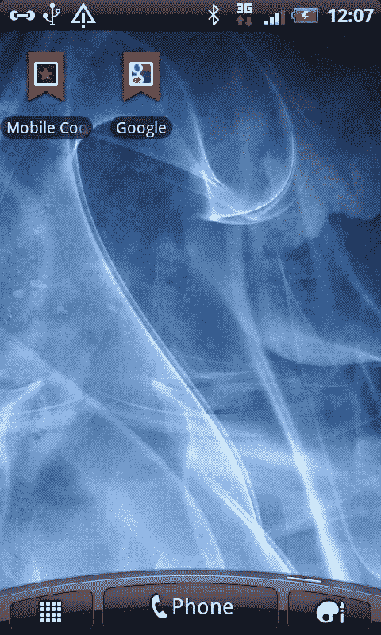

## 还有更多...

在看到上一个例子后，您的脑海中一定有一些问题：

+   在`rel`属性中定义多个值不是可能的吗？那么我们能否将最后两行合并成以下内容？

```html
<link rel="shortcut icon apple-touch-icon-precomposed" href="http://apple-touch-icon-precomposed.png">

```

已经测试过，但不知何故移动浏览器无法识别该值。

您可能已经看到人们使用：

```html
<link rel="apple-touch-icon-precomposed" media="screen and (min-resolution: 150dpi)" href="http://apple-touch-icon-114x114-precomposed.png">

```

与*Paul Irish*和*Divya Manian*一起，我们一直在致力于 Mobile Boilerplate ([`www.h5bp.com/mobile`](http://www.h5bp.com/mobile))，为前端移动开发提供了一个坚实的默认设置。在 Mobile Boilerplate 中，我们已经涵盖了所有当前的情景和可能的未来情景：

[`github.com/h5bp/mobile-boilerplate/blob/master/index.html#L21`](http://github.com/h5bp/mobile-boilerplate/blob/master/index.html#L21)

### Everything you always wanted to know about touch icons

这个主题上提出的大多数想法都源自*Mathias Bynens*。他的原始文章*Everything you always wanted to know about touch icons*可以在以下网址找到：[`mathiasbynens.be/notes/touch-icons`](http://mathiasbynens.be/notes/touch-icons)。

### 关于苹果触摸图标的官方文档

有一个官方文档列表，您可以在其中找到有关每个特定设备和浏览器的触摸图标的更多信息：

+   苹果触摸图标：

```html
http://developer.apple.com/library/safari/#documentation/AppleApplications/Reference/SafariWebContent/ConfiguringWebApplications/ConfiguringWebApplications.html

```

+   来自 WHATWG 的官方信息：

```html
http://www.whatwg.org/specs/web-apps/current-work/multipage/links.html#rel-icon

```

#### 苹果自定义图标和图像创建指南

关于如何创建触摸图标的指南和文章可以在以下文章中找到：

+   苹果 - *自定义图标和图像创建指南：*

```html
http://developer.apple.com/library/ios/#documentation/userexperience/conceptual/mobilehig/IconsImages/IconsImages.html#//apple_ref/doc/uid/TP40006556-CH14-SW11

```

#### 另请参阅

*在 iPhone 上启用全屏模式的开始屏幕* - 在这个示例中，我们将看到如何在从主屏幕触摸图标启动时添加全屏模式的开始屏幕。

# 防止文本调整大小

目标设备：iOS，Windows Mobile

在像 iPhone 和 Windows Mobile 这样的某些移动设备上，当您将设备从纵向模式旋转到横向模式时，浏览器文本可能会调整大小。这可能会对网页开发人员造成问题，因为我们希望完全控制网站的设计和呈现。

## 准备就绪

创建一个新的 HTML 文件，并将其命名为`ch02r02.html`。输入以下代码：

```html
<!doctype html>
<html>
<head>
<meta charset="utf-8">
<meta name="viewport" content="width=device-width, initial-scale=1.0, maximum-scale=1.0, minimum-scale=1.0">
<style>
figure, figcaption, header {
display:block;
margin:0 auto;
text-align:center;
}
</style>
</head>
<body>
<header>
HTML5 Logo
</header>
<figure>

<figcaption>
It stands strong and true, resilient and universal as the markup you write.
It shines as bright and as bold as the forward-thinking, dedicated web developers you are.
It's the standard's standard, a pennant for progress.
And it certainly doesn't use tables for layout.
</figcaption>
</figure>
</body>
</html>

```

现在在 iPhone 上以纵向模式呈现此页面，如您所见，它将正常呈现如下：

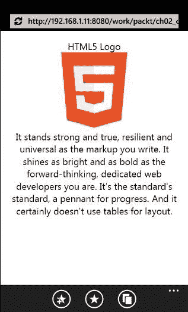

现在，如果您将其呈现为横向模式，字体大小将突然增加。正如我们所看到的，当页面更改为横向模式时，文本将被调整大小。这不是期望的行为。以下显示了它的外观：

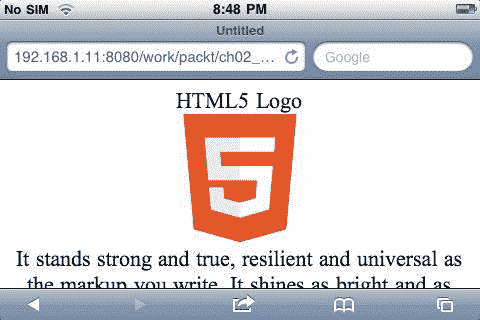

## 如何做...

您可以按照以下步骤来解决这个问题：

1.  您可以将以下行添加到 CSS 中，然后再次以横向方式呈现页面：

```html
html {
-webkit-text-size-adjust: none;
}

```

1.  如您所见，文本现在看起来正常：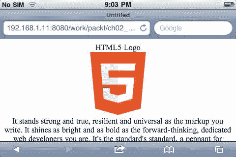

## 它是如何工作的...

要解决这个问题，您必须在 WebKit 中添加一个名为`text-size-adjust`的 CSS 属性，并将值分配为`none`以防止自动调整。

将`text-size-adjust`设置为 none 可以解决移动特定网站的问题，但如果我们在桌面屏幕或其他非移动浏览器上呈现此内容，桌面浏览器的文本缩放功能将被禁用。为了防止这种无障碍问题，我们可以将`text-size-adjust`设置为`100%`，而不是`none`。

因此，我们可以调整此示例以：

```html
html {
-webkit-text-size-adjust: 100%;
}

```

## 还有更多...

除了 iPhone 之外，其他设备也有添加文本大小调整属性的方法。

### Windows Mobile

Windows Mobile IE 使用不同的前缀。他们最初添加了 WebKit 前缀。其目的是添加对 WebKit 特定属性的支持，以使网页开发人员的生活变得更加轻松，而不必在页面中添加另一个供应商前缀的 CSS 属性来控制文本的缩放方式。更具体地说，他们直觉到这个属性的最常见用例是将其明确设置为`none`，以告诉浏览器不要缩放文本的特定部分。

在听取社区对这个问题的反馈后（以及在意识到实施其他浏览器供应商的 CSS 属性的更广泛影响时摔了几个跤），他们决定最好只实现`-ms-`前缀版本，而不是`-webkit-`版本。

因此，为了使前面的示例更完整，您可以添加：

```html
html {
-webkit-text-size-adjust: 100%;
-ms-text-size-adjust: 100%;
}

```

### 使其具有未来的保障

为了使事情更具未来性，您可以添加一行没有任何前缀的内容，如下所示：

```html
html {
-webkit-text-size-adjust: 100%;
-ms-text-size-adjust: 100%;
text-size-adjust: 100%;
}

```

### px em，哪个更好？

关于在移动设备上使用 px 与 em 的常见争论在移动设备上不再是一个问题。最初，Yahoo!用户界面使用 ems 的原因是 IE6 不支持像素的页面缩放。在移动设备上，没有这样的问题，即使我们希望页面在桌面浏览器上呈现良好，使用 IE6 的可能性也越来越低，因此在大多数情况下，您可以避免使用 ems 和所有计算的麻烦，而选择使用像素。

# 优化视口宽度

目标设备：跨浏览器

不同的移动设备有不同的默认移动视口宽度。请参考附录 X，了解所有移动设备的默认视口宽度列表。如果你将其保持未设置，在大多数情况下，会导致意外的结果。例如，在 iPhone 上，如果视口宽度保持未设置，它将被渲染为 980 像素。

## 准备就绪

让我们创建一个 HTML 文档并将其命名为`ch02r03.html`。

## 如何做...

以下是我们可以优化视口宽度的方法：

1.  将以下代码添加到`ch02r03.html`并在你的移动浏览器中渲染它：

```html
<!doctype html>
<html>
<head>
<meta charset="utf-8">
</head>
<body>
<header>
HTML5 Logo
</header>
<div id="main">
<h1>Lorem ipsum</h1>
Lorem ipsum dolor sit amet, consectetur adipisicing elit, sed do eiusmod tempor incididunt ut labore et dolore magna aliqua. Ut enim ad minim veniam, quis nostrud exercitation ullamco laboris nisi ut aliquip ex ea commodo consequat. Duis aute irure dolor in reprehenderit in voluptate velit esse cillum dolore eu fugiat nulla pariatur. Excepteur sint occaecat cupidatat non proident, sunt in culpa qui officia deserunt mollit anim id est laborum.
</div>
</body>
</html>

```

这是默认的渲染方式：

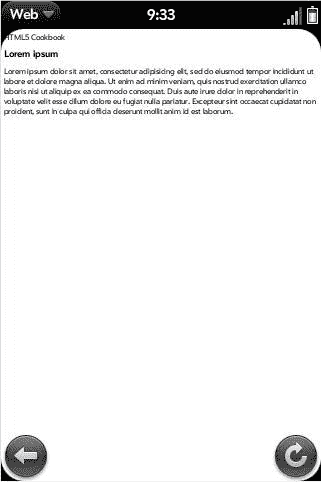

1.  如果我们渲染这个例子，我们会发现一切都变得非常小。现在，让我们将视口宽度设置为设备宽度：

```html
<!doctype html>
<html>
<head>
<meta charset="utf-8">
<meta name="viewport" content="width=device-width">
</head>
<body>
<header>
HTML5 Logo
</header>
<div id="main">
<h1>Lorem ipsum</h1>
<p>Lorem ipsum dolor sit amet, consectetur adipisicing elit, sed do eiusmod tempor incididunt ut labore et dolore magna aliqua. Ut enim ad minim veniam, quis nostrud exercitation ullamco laboris nisi ut aliquip ex ea commodo consequat. Duis aute irure dolor in reprehenderit in voluptate velit esse cillum dolore eu fugiat nulla pariatur. Excepteur sint occaecat cupidatat non proident, sunt in culpa qui officia deserunt mollit anim id est laborum.</p>
</div>
viewport widthviewport widthoptimizing</body>
</html>

```

现在内容宽度使用屏幕宽度，文本变得可读：

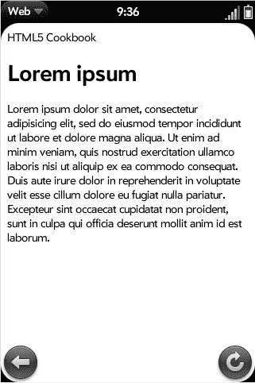

## 它是如何工作的...

当我们将视口宽度设置为设备宽度时，它会告诉浏览器不要缩放页面以适应设备区域。因此，对于 iPhone，`device-width`在纵向模式下是 320 像素，在横向模式下是 480 像素。

## 还有更多...

对于一些非常老旧的移动浏览器，`meta`属性是不被识别的。为了处理这些浏览器，你需要使用：

```html
<meta name="HandheldFriendly" content="true">

```

这被旧版本的 Palm OS、AvantGo 和 Blackberry 使用。

```html
<meta name="MobileOptimized" content="320">

```

对于 Microsoft PocketPC，引入了一个`MobileOptimized`属性。

因此，最完整的代码应该是：

```html
<meta name="HandheldFriendly" content="true">
<meta name="MobileOptimized" content="320">
<meta name="viewport" content="width=device-width">

```

### IE for Windows Phone 视口博客文章

在 IE for Windows Phone 团队博客上，有一篇关于*IE Mobile Viewport on Windows Phone 7*的文章。在其中，作者解释了 Windows Phone 7 如何实现“device-width”，以及其他很有用的一般信息。你可以在这里阅读这篇文章：[`blogs.msdn.com/b/iemobile/archive/2010/11/22/the-ie-mobile-viewport-on-windows-phone-7.aspx`](http://blogs.msdn.com/b/iemobile/archive/2010/11/22/the-ie-mobile-viewport-on-windows-phone-7.aspx)。

### Safari 文档

Safari 在开发者文库中有一个参考：[`developer.apple.com/library/safari/#documentation/appleapplications/reference/SafariHTMLRef/Articles/MetaTags.html`](http://developer.apple.com/library/safari/#documentation/appleapplications/reference/SafariHTMLRef/Articles/MetaTags.html)。

### 黑莓文档

有一个黑莓浏览器内容设计指南文档。它解释了黑莓对视口宽度的使用：[`docs.blackberry.com/en/developers/deliverables/4305/BlackBerry_Browser-4.6.0-US.pdf`](http://docs.blackberry.com/en/developers/deliverables/4305/BlackBerry_Browser-4.6.0-US.pdf)。

# 修复移动 Safari 屏幕重新流动比例

目标设备：iOS

移动 Safari 有一个恼人的屏幕重新流动 bug：当你将移动浏览器从纵向模式旋转到横向模式时，文本会突然跳到更大的尺寸。

在我致力于构建 Mobile Boilerplate 的时候，*Jeremy Keith*和我就这个问题进行了长时间的讨论。

修复这个问题的传统方法是向`meta`视口添加以下缩放属性：

```html
<meta name="viewport" content="width=device-width, initial-scale=1.0, maximum-scale=1.0, minimum-scale=1.0">

```

这个解决方案首先被纳入了 Mobile Boilerplate。*Jeremy*指出这解决了比例跳跃的问题，但同时也导致了另一个可访问性问题：当你设置如上所示的值时，你就不能再放大页面了。对于视力有问题的人来说，放大页面的能力是至关重要的。但如果我们让缩放发生，文本跳跃将会让大多数用户感到恼火。因此，很长一段时间里，这是一个可访问性与可用性的辩论。

我发现了一种可以解决这个问题的方法，我们将在下面讨论。

## 准备就绪

首先，让我们创建一个 HTML 文档并将其命名为`ch02r04.html`，在其中输入以下代码：

```html
<!doctype html>
<html>
<head>
<meta charset="utf-8">
<meta name="viewport" content="width=device-width, initial-scale=1.0">
</head>
<body>
<div>
<h1>Lorem ipsum</h1>
<p>Lorem ipsum dolor sit amet, consectetur adipisicing elit, sed do eiusmod tempor incididunt ut labore et dolore magna aliqua. Ut enim ad minim veniam, quis nostrud exercitation ullamco laboris nisi ut aliquip ex ea commodo consequat. Duis aute irure dolor in reprehenderit in voluptate velit esse cillum dolore eu fugiat nulla pariatur. Excepteur sint occaecat cupidatat non proident, sunt in culpa qui officia deserunt mollit anim id est laborum.</p>
</div>
</body>
</html>

```

这个页面在纵向模式下渲染得非常好：

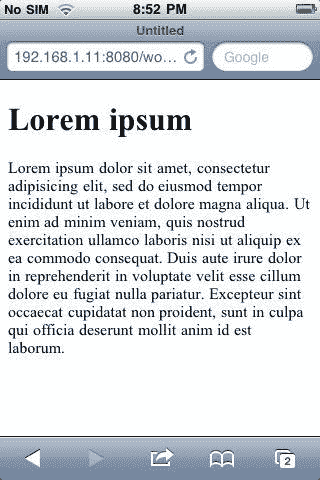

但在横向模式下显示时，情况就不同了：

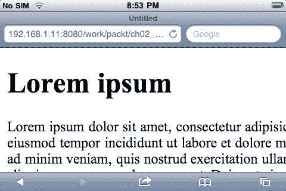

## 如何做...

我们需要做的就是在用户放大页面时动态重置比例因子为默认值。现在将以下代码放入 HTML 文档中：

```html
<!doctype html>
<html>
<head>
<meta charset="utf-8">
<meta name="viewport" content="width=device-width, initial-scale=1.0">
</head>
<body>
<div>
<h1>Lorem ipsum</h1>
<p>Lorem ipsum dolor sit amet, consectetur adipisicing elit, sed do eiusmod tempor incididunt ut labore et dolore magna aliqua. Ut enim ad minim veniam, quis nostrud exercitation ullamco laboris nisi ut aliquip ex ea commodo consequat. Duis aute irure dolor in reprehenderit in voluptate velit esse cillum dolore eu fugiat nulla pariatur. Excepteur sint occaecat cupidatat non proident, sunt in culpa qui officia deserunt mollit anim id est laborum.</p>
</div>
<script>
var metas = document.getElementsByTagName('meta');
var i;
if (navigator.userAgent.match(/iPhone/i)) {
for (i=0; i<metas.length; i++) {
if (metas[i].name == "viewport") {
metas[i].content = "width=device-width, minimum-scale=1.0, maximum-scale=1.0";
}
}
document.addEventListener("gesturestart", gestureStart, false);
}
function gestureStart() {
for (i=0; i<metas.length; i++) {
if (metas[i].name == "viewport") {
metas[i].content = "width=device-width, minimum-scale=0.25, maximum-scale=1.6";
}
}
}
</script>
</body>
</html>

```

现在，如果我们将屏幕从纵向旋转到横向，问题应该不复存在，如果我们放大页面，它将如预期般反应：

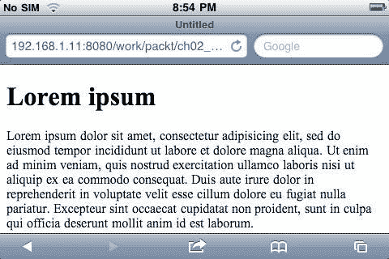

## 它是如何工作的...

让我们来看看代码是如何工作的。

1.  我们需要知道默认的最小比例和最大比例值。在 iPhone 的官方文档中，它指出最小比例值为 0.25，最大比例值为 1.6。因此，为了替换默认值，我们需要设置：

```html
function gestureStart() {
var metas = document.getElementsByTagName('meta');
var i;
for (i=0; i if (metas[i].name == "viewport") {
metas[i].content = "width=device-width, minimum- scale=0.25, maximum-scale=1.6";
}
}

```

1.  接下来，我们需要知道何时设置这个。这很容易：iPhone 有一个手势事件监听器，我们可以用来定位文档主体。以下是如何做到这一点：

```html
document.addEventListener("gesturestart", gestureStart, false);

```

1.  最后，我们需要确保这仅发生在 iPhone 上。同样，这可以很容易地通过以下方式完成：

```html
if (navigator.userAgent.match(/iPhone/i)) {
document.addEventListener("gesturestart", gestureStart, false);
}

```

### 还有更多...

如果您对 Jeremy 和我的整个故事和讨论感兴趣，您可以在[`www.blog.highub.com/mobile-2/a-fix-for-iphone-viewport-scale-bug/`](http://www.blog.highub.com/mobile-2/a-fix-for-iphone-viewport-scale-bug/)阅读。

尽管这为问题提供了一个解决方案，但一些人会遇到一些问题：

+   一旦用户在文档上做出手势，缩放就会再次启用。因此，如果在那之后更改设备方向，缩放错误仍然会发生。

+   在 iOS4 上报告说，用户只能在开始第二个手势后有效地开始缩放。

#### 稍微改进的版本

*Mathias Bynens*有一个智能编码的修订版本。您可以在这里看到代码

[`gist.github.com/901295`](http://gist.github.com/901295)。

#### 一个更好的版本

*John-David Dalton*有一个更新更好的版本，代码更智能更精简

[`gist.github.com/903131`](http://gist.github.com/903131)。

#### 给 jQuery Mobile 的一句话

*Scott Jehl*来自 jQuery Mobile 提到它可能会在将来的 jQuery Mobile 中实现。目前，您可以在[`gist.github.com/1183357`](http://gist.github.com/1183357)看到他的要点。

# 从浏览器启动特定于手机的程序

目标设备：跨浏览器

可以从移动浏览器启动特定于手机的程序，例如地图、呼叫和短信可以从某些移动设备启动。程序是否可以启动取决于特定设备上本机应用程序的可用性。

## 准备好了

创建一个 HTML 文档，并将其命名为`ch02r05.html.`

## 如何做...

以下是我们如何启动特定于手机的程序：

1.  让我们将以下代码添加到 HTML 文档中：

```html
<!doctype html>
<html>
<head>
<meta charset="utf-8">
<meta name="viewport" content="width=device-width, initial-scale=1.0">
</head>
<body>
<header>
HTML5 Logo
</header>
<div>
<h1>Lorem ipsum</h1>
<a href="http://maps.google.com/maps?q=cupertino"> Directions</a>
</div>
</body>
</html>

```

1.  现在在 Palm OS 浏览器中运行此代码，点击地址链接。您将被提示在手机上启动地图应用程序：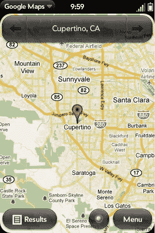

## 它是如何工作的...

与一些方案不同，地图 URL 不以“maps”方案标识符开头。相反，地图链接被指定为常规 HTTP 链接，但是针对 Google 地图服务器。设备浏览器将能够判断它是否是地图，并使用解析的信息启动程序。

## 还有更多...

您可以做的不仅仅是启动一个应用程序。以下示例显示了您将用于在旧金山和库比蒂诺之间提供驾驶路线的字符串：

```html
<a href="http://maps.google.com/maps?daddr=San+Francisco,+CA&saddr=cupertino">Directions</a>

```

那么，如果浏览器无法启动特定的程序怎么办？没关系！在这种情况下，它将像普通链接一样打开：

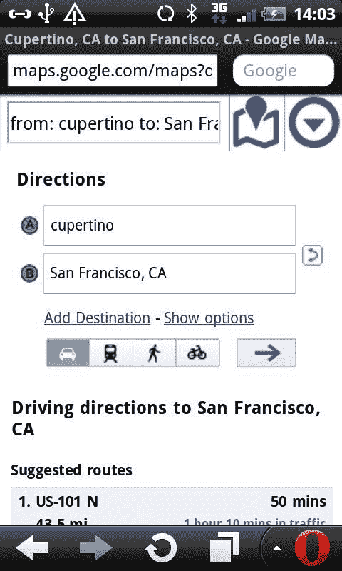

### 移动 Safari URL 方案

可以在这里找到所有与 Mobile Safari 相关的 URL 方案列表：[`developer.apple.com/library/safari/#featuredarticles/iPhoneURLScheme_Reference/Introduction/Introduction.html`](http://developer.apple.com/library/safari/#featuredarticles/iPhoneURLScheme_Reference/Introduction/Introduction.html)。

### 黑莓 URL 方案

所有与黑莓相关的 URL 方案列表可以在以下网址找到：[`docs.blackberry.com/en/developers/deliverables/18169/`](http://docs.blackberry.com/en/developers/deliverables/18169/)。

### 索尼爱立信开发者指南

索尼爱立信开发者可以从 Developer World 网站下载*Web 浏览开发者指南*：[`developer.sonyericsson.com/wportal/devworld/search-downloads?cat=%5B1.706817%2C+1.716594%2C+1.716688%5D&cc=gb&lc=en`](http://developer.sonyericsson.com/wportal/devworld/search-downloads?cat=%5B1.706817%2C+1.716594%2C+1.716688%5D&cc=gb&lc=en)。

# 启用 iPhone 全屏模式的启动屏幕

目标设备：iOS

为了使 Web 应用更像本机应用，iPhone 有一些独特的功能供开发者在 Web 应用上添加。您可以在全屏模式下添加启动屏幕，并为应用定义预加载屏幕。

## 准备工作

下载提供的源代码中的图像，创建一个 HTML 文档，并将其命名为`ch02r06.html`。

## 如何做到的...

以下是我们如何使启动屏幕进入全屏模式：

1.  输入以下 HTML 代码：

```html
<!doctype html>
<html>
<head>
<meta charset="utf-8">
<meta name="viewport" content="width=device-width, initial-scale=1.0">
<meta name="apple-mobile-web-app-capable" content="yes">
<meta name="apple-mobile-web-app-status-bar-style" content="black">
<link rel="apple-touch-startup-image" href="img/l/splash.png">
</head>
<body>
<header>
HTML5 Logo
</header>
<div>
Lorem ipsum
</div>
</body>
</html>

```

1.  如果您将该页面添加到书签并从应用图标在浏览器中打开，它将显示为全屏应用。

## 它是如何工作的...

让我们来看一下代码：

```html
<meta name="apple-mobile-web-app-capable" content="yes">

```

这使得网页在从主屏幕图标启动时以全屏模式运行，隐藏了浏览器顶部和底部的地址栏和组件栏。

```html
<meta name="apple-mobile-web-app-status-bar-style" content="black">

```

这个代码是为了给浏览器顶部的状态栏添加样式。

```html
<link rel="apple-touch-startup-image" href="img/l/splash.png">

```

您还可以在应用启动时添加一个启动屏幕，这是在页面仍在加载时显示的预加载屏幕。

## 还有更多...

iPad 和 iPhone 有不同的启动屏幕尺寸，所以如果我们希望网站动态更改启动屏幕，这取决于用于渲染的浏览器。我们可以使用以下 JavaScript 函数来实现：

```html
var filename = navigator.platform === 'iPad' ? 'h/' : 'l/'; document.write('<link rel="apple-touch-startup-image" href="/img/' + filename + 'splash.png" />' );

```

### iOS 4.3 的全屏问题

iOS 4.3 引入了一个他们称之为 JavaScript Nitro Engine 的新功能。这段新代码允许默认的 Safari 浏览器加载页面的速度提高了一倍。然而，这个功能似乎不支持全屏 Web 应用。虽然一些人质疑为什么苹果没有将新的 Safari 功能与其 Web 应用整合在一起，但也有人指出证据表明这可能只是一个 bug。

### Safari 关于 Web 应用的文档

官方文档可以在 Safari 上访问以下网站：

[`developer.apple.com/library/safari/#documentation/appleapplications/Reference/SafariWebContent/ConfiguringWebApplications/ConfiguringWebApplications.html`](http://developer.apple.com/library/safari/#documentation/appleapplications/Reference/SafariWebContent/ConfiguringWebApplications/ConfiguringWebApplications.html)

### Safari 启动图像和触摸图标指南

有关启动图像和触摸图标指南，您可以访问官方 Safari 网站上的自定义图标和图像创建指南：

`http://developer.apple.com/library/safari/#documentation/UserExperience/Conceptual/MobileHIG/IconsImages/IconsImages.html#//apple_ref/doc/uid/TP40006556-CH14`

# 防止 iOS 在焦点上缩放

目标设备：iOS

在 JavaScript 事件 API 中，有一个`form onfocus`事件。当您在 iOS 中点击表单元素时，元素将放大显示在设备屏幕上。对于未设计为响应式或移动特定的网站，这种默认缩放可能有所帮助，但对于移动优化的网站来说，这可能没有那么有用，甚至可能很烦人。为了禁用这种默认行为，我们可以更改 meta viewport 值`onfocus`和`onblur`。

## 准备工作

创建一个 HTML 文档，并将其命名为`ch02r06_b.html`。

## 如何做到的...

以下是我们如何启动一个特定于手机的程序：

1.  让我们将以下代码添加到 HTML 文档中：

```html
<!doctype html>
<html>
<head>
<meta charset="utf-8">
<meta name="viewport" content="width=device-width, initial-scale=1.0">
</head>
<body>
<form>
<label>First name:</label> <input type="text" name="fname" /><br />
<label>Last name:</label> <input type="text" name="lname" />
</form>
<script>
var $viewportMeta = $('meta[name="viewport"]');
$('input, select, textarea').bind('focus blur', function(event) {
$viewportMeta.attr('content', 'width=device-width,initial-scale=1,maximum-scale=' + (event.type == 'blur' ? 10 : 1));
});
</script>
</body>
</html>

```

1.  现在，在 iOS 设备中渲染页面，触摸聚焦表单输入字段，您会发现现在输入字段不会放大。

## 它是如何工作的...

现在让我们提取出 JavaScript 部分：

```html
<script>
var $viewportMeta = $('meta[name="viewport"]');
$('input, select, textarea').bind('focus blur', function(event) {
$viewportMeta.attr('content', 'width=device-width,initial-scale=1,maximum-scale=' + (event.type == 'blur' ? 10 : 1));
});
</script>

```

脚本的作用是检测到`onfocus`事件时，我们将最大缩放比例设置为 1，当检测到`onblur`时，我们将其设置为 10。

## 还有更多...

您可以阅读有关原始博客帖子讨论的更多信息：

[`nerd.vasilis.nl/prevent-ios-from-zooming-onfocus/`](http://nerd.vasilis.nl/prevent-ios-from-zooming-onfocus/)

此代码片段已添加到 Mobile Boilerplate：

[`github.com/h5bp/mobile-boilerplate/blob/master/js/mylibs/helper.js`](http://github.com/h5bp/mobile-boilerplate/blob/master/js/mylibs/helper.js)

# 禁用或限制 WebKit 功能

目标设备：WebKit 移动浏览器（Android，iOS）

移动浏览器中存在许多特定设备的问题。通过一些不太为人知的 CSS 技术，我们可以轻松解决这些问题。让我们看看一些问题以及我们如何神奇地解决它们。

## 准备工作

创建一个 HTML 文档并将其命名为`ch02r07.html`。

## 如何做到...

以下是限制 WebKit 功能的示例：

1.  将以下代码添加到 HTML 文档中：

```html
<!doctype html>
<html>
<head>
<meta charset="utf-8">
<meta name="viewport" content="width=device-width, initial-scale=1.0">
<meta name="apple-mobile-web-app-capable" content="yes">
<style>
.nocallout {-webkit-touch-callout: none;}
#targetarea {width:200px; height:120px; padding-top:80px; background:#ccc; text-align:center; font-size:20px;}
</style>
</head>
<body>
<div id="targetarea" class="nocallout">
<a href="http://www.google.com" target="_blank">Google</a>
</div>
WebKit featuresWebKit featureslimiting</body>
</html>

```

如何做到...

1.  现在，将附加代码输入到 HTML 文档中，

```html
<!doctype html>
<html>
<head>
<meta charset="utf-8">
<meta name="viewport" content="width=device-width, initial-scale=1.0">
<meta name="apple-mobile-web-app-capable" content="yes">
<style>
.nocallout {-webkit-touch-callout: none;}
#targetarea {width:200px; height:120px; padding-top:80px; background:#ccc; text-align:center; font-size:20px;}
</style>
WebKit featuresWebKit featureslimiting</head>
<body>
<div id="targetarea" class="nocallout">
<a href="http://www.google.com" target="_blank">Google</a>
</div>
</body>
</html>

```

如何做到...

### 它是如何工作的...

如果不设置`webkit-touch-callout`，当您在设备上点击并按住链接时，将会出现提示，询问您是否要在当前页面中打开它，在新页面中打开它或复制，如第一个示例所示。

如果要禁用此功能，可以通过将`webkit-touch-callout`值设置为`none`来实现，如第二个示例所示。

### 还有更多...

您可能还想限制的另一个功能是复制和粘贴。这个功能在网页上是有意义的，但对于大多数应用程序的界面元素来说是不需要的。

```html
<style type="text/css">
.oncopy {
-webkit-user-select: text;
}
</style>

```

#### 更改点击颜色

您可以使用以下规则更改点击颜色：

```html
<style type="text/css">
* {
-webkit-tap-highlight-color: rgba(0,0,0,0);
}
</style>

```

#### 使文本区域内容可编辑

如果要将元素设置为`contenteditable`，可以使用以下 CSS：

```html
textarea.contenteditable {
-webkit-appearance: none;
}

```

#### 窄屏幕的省略号

在移动浏览器上，屏幕要窄得多，因此在显示菜单标题列表时，可能会发生文本溢出。如果发生这种情况，CSS 技巧可以帮助您使用省略号修复文本溢出：

```html
.ellipsis {
text-overflow: ellipsis;
overflow: hidden;
white-space:
white-space:

```
