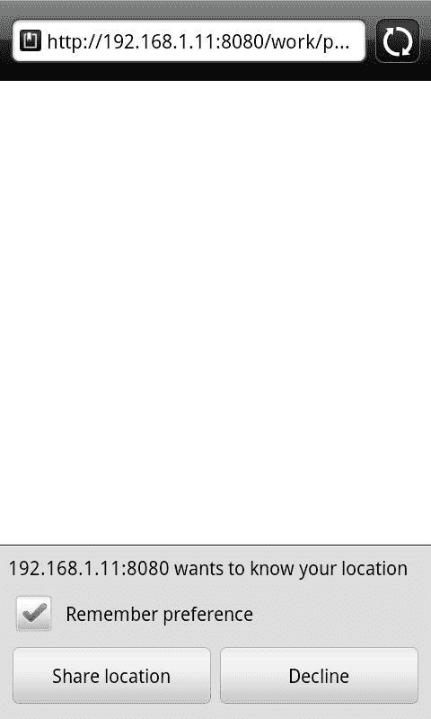
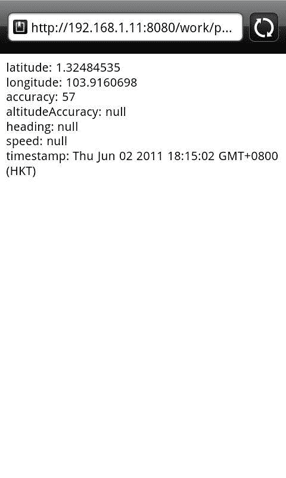
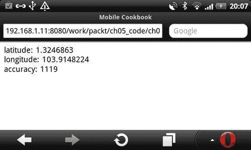
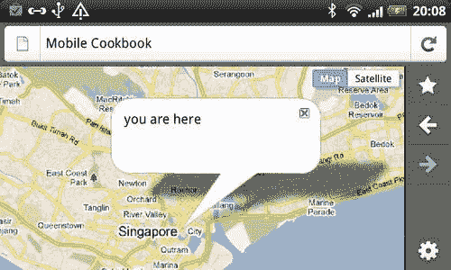
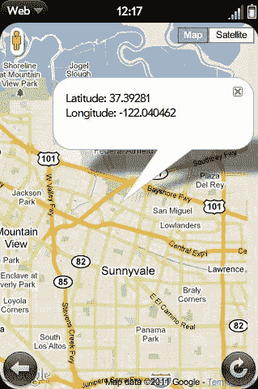
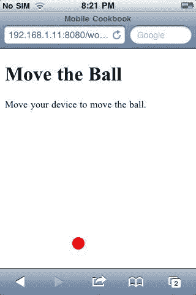

# 第五章：移动设备访问

在本章中，我们将涵盖：

+   获取您的位置

+   处理跨浏览器地理位置

+   根据您的地理位置显示地图

+   实时定位

+   `DeviceOrientation`事件

+   使用 foursquare 的地理位置

# 介绍

在所有 HTML5 类中，与移动开发最相关的类之一必须是设备访问。

这是 W3C HTML5 Movement 网站上设备访问的官方描述([`www.w3.org/html/logo/`](http://www.w3.org/html/logo/))：

> 从地理位置 API 开始，Web 应用程序可以呈现丰富的、设备感知的功能和体验。令人难以置信的设备访问创新正在被开发和实施，从音频/视频输入访问到麦克风和摄像头，再到诸如联系人和事件之类的本地数据，甚至倾斜方向。

您可以在以下网址找到描述和徽标：[`www.w3.org/html/logo/ #the-technology`](http://www.w3.org/html/logo/)。

基于位置的社交网络，如 foursquare，对业务运作方式和人们的动员方式产生了深远影响。如果 Groupon 发布了基于位置的新优惠，可能会从根本上改变消费者行为和零售业的运作方式。Google 地图使用实时地理位置和 GPRS 来帮助人们和车辆导航。将会有越来越多基于这种设备访问技术构建的令人兴奋的创新。

在本章中，我们将研究地理位置 API 和 DeviceOrientation API，解决跨浏览器问题，并看看我们如何将设备访问与流行的基于位置的服务一起使用。

# 获取您的位置

目标浏览器：Android、iOS、webOS、Opera、Firefox

使用地理位置 API，我们可以返回当前位置的纬度、经度和精度等值：

+   纬度和经度：这些属性是地理坐标，以十进制度数指定

+   精度：表示纬度和经度坐标的精度级别，以米为单位指定

## 准备就绪

让我们创建一个 HTML 文档，并获取纬度和经度以及精度。首先，让我们创建一个新的 HTML 文件，并将其命名为`ch05r01.html`。

## 如何做...

将以下代码输入到 HTML 文档中：

```html
<!doctype html>
<html>
<head>
<title>Mobile Cookbook</title>
<meta charset="utf-8">
<meta name="viewport" content="width=device-width, initial-scale=1.0">
</head>
<body>
<div id="main">
<div id="someElm">
</div>
</div>
<script src="img/jquery-1.5.2.min.js"></script>
<script>
function getLocation() {
navigator.geolocation.getCurrentPosition(showInfo);
}
function showInfo(position) {
var latitude = position.coords.latitude;
var longitude = position.coords.longitude;
var accuracy = position.coords.accuracy;
$('#someElm').html('latitude: '+latitude+'<br />longitude: '+longitude+'<br />accuracy: '+accuracy);
}
getLocation();
</script>
</body>
</html>

```

当您首次渲染它时，您将收到以下消息提示：



地理位置支持是可选的。没有浏览器会自动将设备的物理位置发送到服务器。相反，它会在执行发送设备位置的程序之前征求您的许可。浏览器可以记住您的偏好，以防止它再次从同一网站弹出。

现在按下允许分享位置的按钮。然后，您将在屏幕上看到显示的位置数据如下：



## 它是如何工作的...

`navigator`是 JavaScript 程序员所熟悉的对象。它通常用于用户代理检测：`navigator.userAgent`。

`geolocation`是`navigator`对象上的一个新属性：`navigator.geolocation`。

`getCurrentPosition`是`navigator.geolocation`的一个方法。在这个例子中，我们将函数`showInfo`作为第一个参数执行：

```html
navigator.geolocation.getCurrentPosition(showInfo);

```

在`showInfo`函数中，我们从`position`参数返回三个值，即`纬度、经度`和`精度`：

```html
var latitude = position.coords.latitude;
var longitude = position.coords.longitude;
var accuracy = position.coords.accuracy;

```

## 还有更多...

那么，前面提到的属性是地理位置 API 可能返回的全部吗？从理论上讲，可以返回更多的信息，但实际上，只有选定的浏览器会返回额外的信息。

# 处理跨浏览器地理位置

目标浏览器：跨浏览器

地理位置在所有移动浏览器上都不起作用，即使对于支持它的浏览器，它们的 API 也可能与标准不同。iOS 和 Android 使用标准。已知具有不同 API 的浏览器包括 Blackberry、Nokia 和 Palm。幸运的是，我们有一个移动中心的地理位置填充——**geo-location-javascript**。它具有非标准的 Blackberry 和 webOS 技巧，以帮助规范不同的 API 行为。

## 准备工作

下载本章附带的资源，并创建一个`js`文件夹。将`geo.js`放入`js`文件夹中。现在创建一个名为`ch05r02.html`的 HTML 文档。

## 如何做...

将以下代码输入 HTML 文档中：

```html
<!doctype html>
<html>
<head>
<title>Mobile Cookbook</title>
<meta charset="utf-8">
<meta name="viewport" content="width=device-width, initial-scale=1.0">
<script src="img/gears_init.js" type="text/javascript" charset="utf-8"></script>
<script src="img/geo.js" type="text/javascript" charset="utf-8"></script>
</head>
<body>
<div id="main">
<div id="someElm">
</div>
</div>
<script src="img/jquery-1.5.2.min.js"></script>
<script>
if(geo_position_js.init()){
geo_position_js.getCurrentPosition(success_callback,error_callback,{enableHighAccuracy:true,options:5000});
}
else{
$('#someElm').html("Functionality not available");
}
function success_callback(p)
{
$('#someElm').html('latitude: '+p.coords.latitude+'<br />longitude: '+p.coords.longitude+'<br />accuracy: '+p.coords.accuracy);
}
function error_callback(p)
{
$('#someElm').html('error='+p.message);
}
</script>
</body>
</html>

```

在 Opera 中进行测试，您应该能够看到以下结果：



## 它是如何工作的...

在 HTML 文档的顶部，我们链接到`gears_init.js`。如果浏览器没有默认支持的地理位置 API，但安装了 Gears，则 Gears API 可能会返回地理位置数据。对于具有地理位置 API 但使用不同方法的浏览器，将使用第二个脚本`geo.js`来规范化 API。

如果`geo_position_js.init()`返回 true，则意味着我们以某种方式能够获取地理位置数据。在这种情况下，我们将继续下一步。我们使用`geo_position_js.getCurrentPosition`作为方法，而不是使用`navigator.geolocation.getCurrentPosition`：

```html
geo_position_js.getCurrentPosition(showInfo,error_callback,{enableHighAccuracy:true,options:5000});

```

## 还有更多...

这是一个额外的资源，可以帮助您获取地理位置信息。

### YQL Geo 库

YQL Geo 库提供了一种替代方法，即基于 IP 地址的地理位置。这是一个轻量级库，与 Yahoo 服务相关联。它可以：

+   从文本中获取地理位置

+   从纬度/经度获取位置信息

+   从特定 URL 获取所有地理位置

+   从 IP 号码获取地点

# 根据您的地理位置显示地图

目标浏览器：跨浏览器

Google Maps API V3 已经设计成在移动设备上快速加载并在移动设备上运行良好。特别是，我们专注于为 iPhone 和运行 Android 操作系统的手机等先进移动设备开发。移动设备的屏幕尺寸比桌面上的典型浏览器小。此外，它们通常具有特定于这些设备的特定行为，例如 iPhone 上的“捏合缩放”。

## 准备工作

让我们创建一个在您的移动设备上显示的地图。首先，让我们创建一个名为`ch05r03.html`的 HTML 文档。

## 如何做...

输入以下代码：

```html
<!doctype html>
<html>
<head>
<title>Mobile Cookbook</title>
<meta charset="utf-8">
<meta name="viewport" content="initial-scale=1.0, user-scalable=no" />
<script type="text/javascript" src="img/js?sensor=true"></script>
<script src="img/gears_init.js"></script>
<script src="img/geo.js"></script>
<style>
html {
height: auto;
}
body {
height: auto;
margin: 0;
padding: 0;
}
#map_canvas {
height: auto;
position: absolute;
bottom:0;
left:0;
right:0;
top:0;
}
</style>
</head>
<body>
<div id="map_canvas"></div>
<script src="img/jquery-1.5.2.min.js"></script>
<script>
var initialLocation;
var siberia = new google.maps.LatLng(60, 105);
var newyork = new google.maps.LatLng(40.69847032728747, -73.9514422416687);
var browserSupportFlag = new Boolean();
var map;
var infowindow = new google.maps.InfoWindow();
function initialize() {
var myOptions = {
zoom: 12,
mapTypeId: google.maps.MapTypeId.ROADMAP
};
map = new google.maps.Map(document.getElementById("map_canvas"), myOptions);
if(geo_position_js.init()){
browserSupportFlag = true;
geo_position_js.getCurrentPosition(function(position) {
initialLocation = new google.maps.LatLng(position.coords.latitude,position.coords.longitude);
contentString = "you are here";
map.setCenter(initialLocation);
infowindow.setContent(contentString);
infowindow.setPosition(initialLocation);
infowindow.open(map);
});
}
}
function detectBrowser() {
var useragent = navigator.userAgent;
var mapdiv = document.getElementById("map_canvas");
if (useragent.indexOf('iPhone') != -1 || useragent.indexOf('Android') != -1) {
mapdiv.style.width = '100%';
mapdiv.style.height = '100%';
} else {
mapdiv.style.width = '600px';
mapdiv.style.height = '800px';
}
}
detectBrowser();
initialize();
</script>
</body>
</html>

```

在您的移动浏览器中呈现如下：



## 它是如何工作的...

现在让我们来分解代码，看看每个部分的作用：

1.  iPhone 具有捏合缩放功能，Google Maps API V3 对此事件有特殊处理。因此，您可以设置以下元标记，以确保用户无法调整 iPhone 的大小。运行软件版本 1.5（杯子蛋糕）的 Android 设备也支持这些参数：

```html
<meta name="viewport" content="initial-scale=1.0, user-scalable=no" />

```

1.  将包含地图的`<div>`设置为 100%的宽度和高度属性：

```html
mapdiv.style.width = '100%';
mapdiv.style.height = '100%';

```

1.  您可以通过检查 DOM 中的`navigator.userAgent`属性来检测 iPhone 和 Android 设备：

```html
function detectBrowser() {
var useragent = navigator.userAgent;
var mapdiv = document.getElementById("map_canvas");
if (useragent.indexOf('iPhone') != -1 || useragent.indexOf('Android') != -1 ) {
mapdiv.style.width = '100%';
mapdiv.style.height = '100%';
} else {
mapdiv.style.width = '600px';
mapdiv.style.height = '800px';
}
}

```

1.  指定传感器参数，使用传感器确定用户位置的应用程序在加载 Maps API JavaScript 时必须传递`sensor=true`。

```html
<script type="text/javascript" src="img/js?sensor=true"></script>

```

使用 Google Maps API 需要指示您的应用程序是否使用传感器（例如 GPS 定位器）来确定用户的位置。这对于移动设备尤为重要。在包含 Maps API JavaScript 代码时，应用程序必须将所需的传感器参数传递给`<script>`标记，指示您的应用程序是否使用传感器设备。

### 提示

请注意，即使我们针对的设备不使用传感器设备，我们仍然必须传递此参数，并将其值设置为`false`。

1.  我们将地理位置坐标解析到地图 API 的`LatLng`方法中：

```html
initialLocation = new google.maps.LatLng(position.coords.latitude,position.coords.longitude);

```

### 还有更多...

您可以在官方文档页面了解更多关于 Google Maps JavaScript API V3 的信息：

[`code.google.com/apis/maps/documentation/javascript/`](http://code.google.com/apis/maps/documentation/javascript/)

#### HTML5 地理位置教程

Mobile tuts 有一篇关于移动地理位置的优秀文章，名为*HTML5 Apps: Positioning with Geolocation*。您可以在以下链接阅读：

*HTML5 Apps: Positioning with Geolocation*

[`mobile.tutsplus.com/tutorials/mobile-web-apps/html5-geolocation/`](http://mobile.tutsplus.com/tutorials/mobile-web-apps/html5-geolocation/)

# 实时显示位置

目标浏览器：跨浏览器

除了`getCurrentPosition`，地理位置 API 还有另一个名为`watchPosition`的方法。当调用时，它执行两个重要的操作：

1.  它返回一个标识监视操作的值。

1.  它异步地开始监视操作。

## 准备工作

让我们创建一个名为`ch05r04.html`的 HTML 文档。

## 如何做...

将以下代码输入文档中：

```html
<!doctype html>
<html>
<head>
<title>Mobile Cookbook</title>
<meta charset="utf-8">
<meta name="viewport" content="initial-scale=1.0, user-scalable=no" />
<style>
html {
height: auto;
}
body {
height: auto;
margin: 0;
padding: 0;
}
#map_canvas {
height: auto;
position: absolute;
bottom:0;
left:0;
right:0;
top:0;
}
</style>
</head>
<body>
<div id="map_canvas"></div>
<script type="text/javascript" src="img/js?sensor=true"></script>
<script src="img/jquery-1.5.2.min.js"></script>
<script>
var watchProcess = null;
var initialLocation;
var map;
var infowindow = new google.maps.InfoWindow();
var myOptions = {
zoom: 12,
mapTypeId: google.maps.MapTypeId.ROADMAP
};
map = new google.maps.Map(document.getElementById("map_canvas"), myOptions);
navigator.geolocation.getCurrentPosition(function(position) {
updatePos(position.coords.latitude,position.coords.longitude,position.coords.accuracy);
});
initiate_watchlocation();
function initiate_watchlocation() {
if (watchProcess == null) {
watchProcess = navigator.geolocation.watchPosition(handle_geolocation_query, handle_errors);
}
}
function stop_watchlocation() {
if (watchProcess != null)
{
navigator.geolocation.clearWatch(watchProcess);
watchProcess = null;
}
}
locationdisplaying, in real timefunction handle_errors(error)
{
switch(error.code)
{
case error.PERMISSION_DENIED: alert("user did not share geolocation data");
break;
case error.POSITION_UNAVAILABLE: alert("could not detect current position");
break;
case error.TIMEOUT: alert("retrieving position timedout");
break;
default: alert("unknown error");
break;
}
}
function handle_geolocation_query(position) {
updatePos(position.coords.latitude,position.coords.longitude,position.coords.accuracy);
}
function updatePos(lat,long,acc) {
var text = "Latitude: " + lat + "<br/>" + "Longitude: " + long + "<br/>" + "Accuracy: " + acc + "m<br/>";
initialLocation = new google.maps.LatLng(lat,long);
contentString = text;
map.setCenter(initialLocation);
infowindow.setContent(contentString);
infowindow.setPosition(initialLocation);
infowindow.open(map);
}
</script>
</body>
</html>

```

这是它将如何呈现的：



## 它是如何工作的...

以下函数将启动位置监视：

```html
function initiate_watchlocation() {
if (watchProcess == null) {
watchProcess = navigator.geolocation.watchPosition(handle_geolocation_query, handle_errors);
}
}

```

`navigator.geolocation.watchPosition`将在执行时返回成功或错误。在成功函数中，您可以解析纬度和经度：

```html
navigator.geolocation.watchPosition(handle_geolocation_query, handle_errors);

```

当位置正在被监视时，`handle_geolocation_query`用于获取当前位置并解析到更新位置函数中：

```html
function handle_geolocation_query(position) {
updatePos(position.coords.latitude,position.coords.longitude,position.coords.accuracy);
}

```

# 使用 DeviceOrientation 事件

目标浏览器：iOS

`DeviceOrientation`事件是设备访问的重要方面。它包括设备运动事件和设备方向事件。不幸的是，这些事件目前只在 iOS 中受支持。

## 准备工作

创建一个名为`ch05r05.html`的 HTML 文档。

## 如何做...

将以下代码输入文档中：

```html
<!doctype html>
<html>
<head>
<title>Mobile Cookbook</title>
<meta charset="utf-8">
<meta name="viewport" content="initial-scale=1.0, user-scalable=no" />
<script type="text/javascript" src="img/js?sensor=true"></script>
<style>
#no {
display: none;
}
#ball {
width: 20px;
height: 20px;
border-radius: 10px;
background-color: red;
position:absolute;
top: 0px;
left: 0px;
}
</style>
</head>
<body>
<div id="content">
<h1>Move the Ball</h1>
<div id="yes">
<p>Move your device to move the ball.</p>
<div id="ball"></div>
</div>
<div id="no">
Your browser does not support Device Orientation and Motion API. Try this sample with iPhone, iPod or iPad with iOS 4.2+.</div>
</div>
<script>
// Position Variables
var x = 0;
var y = 0;
// Speed - Velocity
var vx = 0;
var vy = 0;
// Acceleration
var ax = 0;
var ay = 0;
var delay = 10;
var vMultiplier = 0.01;
if (window.DeviceMotionEvent==undefined) {
document.getElementById("no").style.display="block";
document.getElementById("yes").style.display="none";
} else {
window.ondevicemotion = function(event) {
ax = event.accelerationIncludingGravity.x;
ay = event.accelerationIncludingGravity.y;
}
setInterval(function() {
DeviceOrientation eventusingvy = vy + -(ay);
vx = vx + ax;
var ball = document.getElementById("ball");
y = parseInt(y + vy * vMultiplier);
x = parseInt(x + vx * vMultiplier);
if (x<0) { x = 0; vx = 0; }
if (y<0) { y = 0; vy = 0; }
if (x>document.documentElement.clientWidth-20) { x = document.documentElement.clientWidth-20; vx = 0; }
if (x>document.documentElement.clientWidth-20) { x = document.documentElement.clientWidth-20; vx = 0; }
if (y>document.documentElement.clientHeight-20) { y = document.documentElement.clientHeight-20; vy = 0; }
ball.style.top = y + "px";
ball.style.left = x + "px";
}, delay);
}
</script>
</body>
</html>

```

## 它是如何工作的...

这段代码是由*Maximiliano Firtman*制作的（[`www.mobilexweb.com/blog/safari-ios-accelerometer-websockets-html5`](http://www.mobilexweb.com/blog/safari-ios-accelerometer-websockets-html5)）。在示例中，我们使用了`accelerationIncludingGravity`。它返回设备的总加速度值，包括用户加速度和重力。

三个值 x，y，z 分别代表每个轴上的加速度（以 m/s² 为单位）：

```html
window.ondevicemotion = function(event) {
event.accelerationIncludingGravity.x
event.accelerationIncludingGravity.y
event.accelerationIncludingGravity.z
}

```



## 还有更多...

这是一个显示当前对`DeviceOrientationEvent`和`DeviceMotionEvent`支持的表格：

| 属性 | 描述 | 返回值 | 类 | 支持 |
| --- | --- | --- | --- | --- |
| `acceleration` | *用户给设备的加速度。* | *x，y，z（以 m/s² 为单位）* | `DeviceMotion Event` | *iPhone 4 / iPod Touch 4G* |
| `acceleration IncludingGravity` | *设备的总加速度，包括用户加速度和重力。* | *x，y，z（以 m/s² 为单位）* | `DeviceMotion Event` | *iPhone3 / iPod Touch 3G* |
| `interval` | *自上次设备运动事件以来的毫秒间隔。* | *毫秒* | `DeviceMotion Event` | *iPhone3 / iPod Touch 3G* |
| `rotationRate` | *设备的旋转速率。* | *alpha，beta 和 gamma（值在 0 到 360 之间）* | `DeviceMotionEvent` | *iPhone 4 / iPod Touch 4G* |
| `alpha` | *设备框架绕其 z 轴旋转的角度。* | *值在 0 到 360 之间。* | `DeviceOrientation Event` | *iPhone 4 / iPod Touch 4G* |
| `beta` | *设备框架绕其 x 轴旋转的角度。* | *值在-180 到 180 之间。* | `DeviceOrientation Event` | *iPhone 4 / iPod Touch 4G* |
| `gamma` | *设备框架绕其 y 轴旋转的角度。* | *值在-90 到 90 之间。* | `DeviceOrientation Event` | *iPhone 4 / iPod Touch 4G* |

### 设备方向事件规范

[`dev.w3.org/geo/api/spec-source-orientation.html`](http://dev.w3.org/geo/api/spec-source-orientation.html)

### Safari 官方指南

`DeviceOrientation`事件规范：

[`developer.apple.com/library/safari/#documentation/SafariDOMAdditions/Reference/DeviceMotionEventClassRef/DeviceMotionEvent/DeviceMotionEvent.html`](http://developer.apple.com/library/safari/#documentation/SafariDOMAdditions/Reference/DeviceMotionEventClassRef/DeviceMotionEvent/DeviceMotionEvent.html)

`DeviceOrientationEvent`类参考：

[`developer.apple.com/library/safari/#documentation/SafariDOMAdditions/Reference/DeviceOrientationEventClassRef/DeviceOrientationEvent/DeviceOrientationEvent.html`](http://developer.apple.com/library/safari/#documentation/SafariDOMAdditions/Reference/DeviceOrientationEventClassRef/DeviceOrientationEvent/DeviceOrientationEvent.html)

# 使用 foursquare 的地理位置

目标浏览器：跨浏览器

近年来，基于地理位置的社交网络网站 foursquare 变得越来越受欢迎。它影响了许多企业的工作方式和消费者的行为。用户使用移动网站、移动应用程序或短信在各个地方“签到”。

## 准备工作

第三方开发人员已发布了许多用于从各种编程语言访问 foursquare API 的库。其中之一是 Marelle。它基于 jQuery，用 coffeescript 编写。别担心，那只是 JavaScript。

## 如何做...

转到 Marelle 的 GitHub 页面（[`praized.github.com/marelle/`](http://praized.github.com/marelle/)）并下载最新版本。有两个示例，一个是登录，另一个是签到。

这是登录脚本的样子：

```html
// Supply your foursquare client id
var FSQUARE_CLIENT_ID = 'FOURSQUARE_CLIENT_ID';
// on DOM ready...
$(function() {
// setup with your key and a callback function which
// receives the Marelle Object ( "M" in this example )
$.Marelle( FSQUARE_CLIENT_ID ).done( function( M ){
// grab an authentication promise
var authpromise = M.authenticateVisitor();
// handle logged-in visitor
var authsuccess = function(visitor){
M.signoutButton( document.body );
console.log(visitor)
/*
I think the single entry point is through the visitor
*/
venuepromise = visitor.getVenues()
// venuepromise.then etc..etc...
};
// handle non visitor
var authfailure = function() {
M.signinButton( document.body );
};
// wait for promise to resolve
authpromise.then(authsuccess,authfailure)
}).fail(function(){
consoloe.log('Marelle could not be loaded.')
});
});

```

## 它是如何工作的...

它是如何工作的：

1.  首先触发 Marelle 初始化`$.Marelle(clientID)`，它会返回一个承诺：

```html
$.Marelle( FSQUARE_CLIENT_ID )

```

1.  然后我们使用`$.Marelle.authenticateVisitor()`获取认证承诺：

```html
$.Marelle( FSQUARE_CLIENT_ID ).done( function( M ){
var authpromise = M.authenticateVisitor();
});

```

1.  根据认证的结果，`authpromise.then()`用于执行`authsuccess`或`authfailure`：

```html
authpromise.then(authsuccess,authfailure)

```

1.  如果认证成功，它会将“断开连接”按钮附加到提供的选择器：

```html
M.signoutButton( document.body );

```

1.  可以返回推荐场所的列表，添加或搜索场所：

```html
venuepromise = visitor.getVenues()

```

1.  如果认证失败，它会将“连接”按钮附加到提供的选择器：

```html
M.signinButton( document.body );

```

### 还有更多..

可以在以下网址找到 foursquare API 的列表：

[`developer.foursquare.com/docs/libraries.html`](http://developer.foursquare.com/docs/libraries.html)
