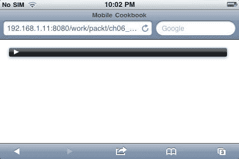
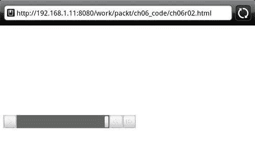
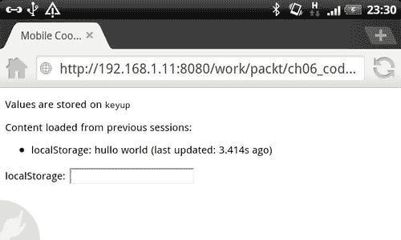
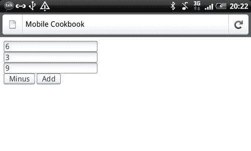
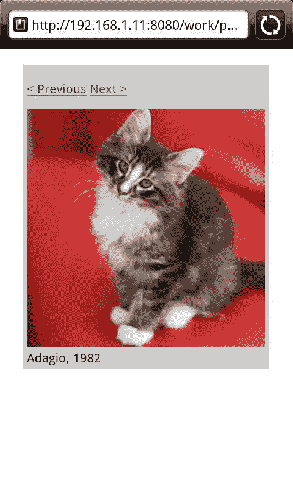

# 第六章：移动丰富媒体

在本章中，我们将涵盖：

+   从移动浏览器播放音频

+   在移动设备上流式传输视频

+   使用 Appcache 进行离线查看

+   使用 Web Storage 进行 Feed 或电子邮件应用程序

+   使用 web workers 进行大量计算工作

+   创建类似 Flash 的导航，使用会话和历史 API

# 介绍

使用 HTML5，您可以构建丰富的媒体应用程序以在移动设备上显示。使用 HTML5 的方式有无限种，唯一的限制是想象力。

在之前的章节中，我们已经涵盖了 HTML5 的语义命名、CSS3 和设备访问类别。在本章中，我们将介绍另外三个类别：

+   **多媒体**—越来越多的人在移动设备上播放视频和音频，我们将看到如何在移动设备上嵌入这些元素。

+   **离线和存储**—离线是移动设备的重要功能，因为连接在移动设备上并不一直稳定。存储对于移动设备存储数据以减少用户每次访问页面时的获取是有用的。

+   **性能和集成**—在 iOS 和 Blackberry 上支持 web workers，我们可以在移动浏览器上获得更好的性能。

# 在移动设备上播放音频

目标浏览器：iOS、Android、Blackberry、webOS、Opera Mobile、Firefox Mobile

多媒体包括音频和视频。在移动设备上播放音频可能会有些棘手。在移动浏览器上有一些支持的音频格式—Ogg Vorbis、MP3 和 WAV。这些格式的问题之一是并非所有浏览器都支持它们。

## 准备工作

创建一个 HTML 文档并将其命名为`ch06r01.html`。

## 如何做...

在文档中输入以下代码：

```html
<!doctype html>
<html>
<head>
<title>Mobile Cookbook</title>
<meta charset="utf-8">
<meta name="viewport" content="width=device-width, initial-scale=1.0">
</head>
<body>
<div id="main">
<audio src="img/snake_charmer.mp3" controls preload="auto" autobuffer>
</audio>
</div>
</body>
</html>

```

现在在浏览器中渲染时，您将看到一个音乐播放器显示如下，当您按下播放时，音乐应该会流式传输：



## 它是如何工作的...

使用音频标签非常简单。音频被包含在`<audio></audio>`标签中。

`controls` 告诉音频元素显示可视控件，如暂停、播放等。

`autobuffer`让浏览器处理缓冲和流式传输。`autobuffer`属性具有布尔值。如果它在音频标签中；音频将自动缓冲。`preload=auto`使流式传输在播放之前甚至预加载。

在移动设备上音频流式传输的一个问题是格式支持。下表显示了支持比较：

| 浏览器 | Ogg Vorbis | MP3 | WAV |
| --- | --- | --- | --- |
| Android WebKit | Yes | Yes |   |
| Opera Mobile |   | Yes |   |
| Firefox Mobile | Yes |   | Yes |
| iOS Safari |   | Yes | Yes |

如表所示，支持一直不够一致。这对于跨浏览器音频流式传输可能会很麻烦。您可以使用多个轨道来解决这个问题。如果浏览器无法识别第一个源标签中的轨道，它将尝试下一个。正如我们从前面的表中所看到的，最广泛支持的格式是 MP3。

它在大多数移动浏览器中都受支持，除了 Firefox。对于 Firefox，我们可以使用 Ogg，因此以下代码更适用于跨移动浏览器：

```html
<!doctype html>
<html>
<head>
<title>Mobile Cookbook</title>
<meta charset="utf-8">
<meta name="viewport" content="width=device-width, initial-scale=1.0">
</head>
<body>
<div id="main">
<audio controls preload="auto" autobuffer>
<source src="img/snake_charmer.mp3" />
<source src="img/snake_charmer.ogg" />
</audio>
</div>
</body>
</html>

```

## 还有更多...

您可能会问，'那些不支持 HTML5 音频标签的浏览器怎么办？' 有音频 polyfills，但一般来说，我不认为在移动音频中使用 polyfills 有意义。一个原因是因为这些 polyfills 是使用 Flash 制作的，而 Flash Lite 只支持有限的移动设备，如塞班。一个解决方案是在音频标签之前简单地包含一个链接。它不会被支持音频标签的浏览器渲染，但会显示在不支持音频标签的浏览器上。您可以通过在音频标签关闭之前添加一个下载链接来实现：

```html
<div id="main">
<audio controls preload="auto" autobuffer>
<a href="http://resources/snake_charmer.mp3">play or download here</a>
</audio>
</div>

```

现在，如果您在 Windows Phone 上渲染此内容，将显示如下：


如果您点击链接，它将简单地由系统的默认音乐播放器打开：


### W3C 音频工作组

当前的音频元素缺乏客户端 API。W3C 音频工作组（[`www.w3.org/2011/audio/`](http://www.w3.org/2011/audio/)）成立以解决这个问题。该 API 将支持高级交互应用程序所需的功能，包括在脚本中直接处理和合成音频流的能力。您可以订阅参与讨论：`<public-audio-request@w3.org>`。

# 在移动设备上流媒体视频

目标浏览器：iOS、Android、Blackberry、webOS、Opera Mobile、Firefox Mobile

从桌面平台访问最多的网站之一是视频网站，如[`www.youtube.com`](http://www.youtube.com)和[`www.vimeo.com`](http://www.vimeo.com)。它们有为移动设备优化的版本。视频流是移动设备的重要组成部分。人们喜欢在移动设备上观看视频，尤其是 YouTube 上的短视频。它们需要更少的时间来缓冲，观看完也不需要花费太多时间。那么视频在移动设备上是如何工作的呢？让我们首先创建一个示例。

## 准备工作

创建一个名为`ch06r02.html`的 HTML 文档。

## 如何做...

将以下代码输入 HTML 文档中：

```html
<!doctype html>
<html>
<head>
<title>Mobile Cookbook</title>
<meta charset="utf-8">
<meta name="viewport" content="width=device-width, initial-scale=1.0">
</head>
<body>
<div id="main">
<video id="movie" width="320" height="240" preload controls>
<source src="img/test.mp4" />
<source src="img/pr6.webm" type='video/webm; codecs="vp8, vorbis"' />
<source src="img/pr6.ogv" type='video/ogg; codecs="theora, vorbis"' />
<object width="320" height="240" type="application/x-shockwave-flash"data=" http://releases.flowplayer.org/swf/flowplayer-3.2.1.swfflowplayer-3.2.1.swf"> data="flowplayer-3.2.1.swf">
<param name="movie" value=" http://releases.flowplayer.org/swf/flowplayer-3.2.1.swf" />
<param name="allowfullscreen" value="true" />
<param name="flashvars" value='config={"clip": {"url":http://diveintohtml5.info/i//test.mp4", "autoPlay":false, "autoBuffering":true}}' />
<p>Download video as <a href=" http://diveintohtml5.info/i/pr6.mp4">MP4</a>, <a href=" http://diveintohtml5.info/i/pr6.webm">WebM</a>, or <a href=" http://diveintohtml5.info/i/pr6.ogv">Ogg</a>.</p>
</object>
</video>
<p>Try this page in Safari 4! Or you can <a href=" http://diveintohtml5.info/i//test.mp4">download the video</a> instead.</p>
</div>
</body>
</html>

```

现在，如果您在移动浏览器中打开它，您应该看到视频播放器已呈现。



## 它是如何工作的...

代码的一部分取自*Mark Pilgrim 的 Dive into HTML5*。您一定会想，这是一项非常艰巨的工作来让视频工作！在这里，让我们看看每个部分的作用。iOS 和 Android 都支持 H.264（`mp4`）格式，添加`webm`和`ogv`版本以确保它也可以在其他桌面和移动设备上呈现。

如果您有多个`<source>`元素，iOS 只会识别第一个。由于 iOS 设备只支持 H.264+AAC+MP4，您必须始终首先列出您的 MP4。这个错误在 iOS 4.0 中已经修复。因此，在这个例子中，我们将`test.mp4`列为第一个。

```html
<source src="img/test.mp4" />
<source src="img/pr6.webm" type='video/webm; codecs="vp8, vorbis"' />
<source src="img/pr6.ogv" type='video/ogg; codecs="theora, vorbis"' />

```

以下是添加的 Flash 回退，以确保不支持 HTML5 视频的站点可以播放视频：

```html
<object width="320" height="240" type="application/x-shockwave-flash"data=" http://releases.flowplayer.org/swf/flowplayer-3.2.1.swfflowplayer-3.2.1.swf"> data="flowplayer-3.2.1.swf">
<param name="movie" value=" http://releases.flowplayer.org/swf/flowplayer-3.2.1.swf" />
<param name="allowfullscreen" value="true" />
<param name="flashvars" value='config={"clip": {"url": "resources http://diveintohtml5.info/i//test.mp4", "autoPlay":false, "autoBuffering":true}}' />
<p>Download video as <a href="test.mp4">MP4</a>, <a href="test.webm">WebM</a>, or <a href="test.ogv">Ogg</a>.</p>
</object>

```

## 还有更多...

*Mark Pilgrim 的 Dive into HTML5*详细介绍了在不同浏览器上呈现视频时遇到的问题。您可以在以下网址阅读：[`diveintohtml5.info/video.html`](http://diveintohtml5.info/video.html)

Android 2.3 之前的版本在 HTML5 视频方面存在一些问题。`<source>`元素上的 type 属性让早期版本的 Android 感到困惑。让它识别视频源的唯一方法是讽刺的是完全省略 type 属性，并确保您的 H.264+AAC+MP4 视频文件的名称以`.mp4`扩展名结尾。您仍然可以在其他视频源上包括 type 属性，因为 H.264 是 Android 2.2 支持的唯一视频格式。这个错误在 Android 2.3 中已经修复。

`controls`属性不受支持。包括它不会产生任何不良影响，但 Android 不会为视频显示任何用户界面控件。您需要提供自己的用户界面控件。至少，您应该提供一个脚本，当用户点击时开始播放视频。这个错误在 Android 2.3 中也已经修复。

# 使用离线缓存

目标浏览器：iOS、Android、Opera Mobile、webOS、Firefox Mobile

除了设备访问之外，离线缓存是移动设备最重要的功能之一。桌面浏览和移动浏览之间最大的区别之一是移动用户总是在行动。与通常使用单一稳定连接的桌面浏览不同，移动浏览可能在移动中进行，在 3G 和 WiFi 之间切换，并在隧道等地方完全离线。离线缓存可以帮助解决因与互联网断开连接而引起的问题。

| 设备 | 支持 |
| --- | --- |
| iOS | 是的（3.2+） |
| Android | 是的（2.1+） |
| Windows Mobile | 否 |
| Blackberry v6.0 及以上 | 否 |
| Symbian 60 | 否 |
| Palm webOS | 是的 |
| Opera Mobile | 是的 |
| Firefox Mobile | 是的 |

## 准备工作

让我们创建一个文本文件并将其命名为`default.appcache`。

## 如何做...

在我们刚刚创建的`default.appcache`文件中，输入以下内容：

```html
CACHE MANIFEST
# version 1
img/apple-touch-icon.png
#img/splash.png
NETWORK:
#http://example.com/api/
FALLBACK:

```

现在创建一个 HTML 文档并将其命名为`ch06r03.html:`

```html
<!doctype html>
<html manifest="default.appcache">
<head>
<title>Mobile Cookbook</title>
<meta charset="utf-8">
<meta name="viewport" content="width=device-width, initial-scale=1.0">
</head>
<body>

</body>
</html>

```

现在如果你加载页面，禁用互联网连接并重新加载页面。你会发现页面仍然加载。

## 它是如何工作的...

`CACHE MANIFEST`下的任何内容都包括了将被缓存以供离线查看的文件。包含缓存清单文件的文件将自动包含在内，这意味着：

```html
CACHE MANIFEST
# version 1
img/apple-touch-icon.png
#img/splash.png

```

`NETWORK`部分列出了所有你不希望被缓存的 URL。这些是每次重新加载页面时应该加载的文件。这类文件的一个例子是 API 调用。你不希望浏览器缓存动态 API 返回。如果你所有的 API 调用都来自同一个前缀，你不必把它们都包括进来。相反，你只需要包括**前缀**。例如，如果你有以下 URL 列表：

```html
http://example.com/api/?loc=paris
http://example.com/api/?loc=london

```

不要一次添加到列表中，你可以只添加一个：

```html
NETWORK:
http://example.com/api/

```

`FALLBACK`部分是用于列出页面 URL 替换的网络 URL，当浏览器离线或远程服务器不可用时使用。

## 还有更多...

你可能会问为什么我们使用`.appcache`而不是`.manifest`作为扩展名？这是因为`.appcache`是由 WHATWG 推荐的。由于它是一个标准，并且没有浏览器支持的问题，最好使用`.appcache`。

你可能还想知道的一件事是这些扩展是否被浏览器识别。不用担心，以下的`AddType`将帮助`.appcache`和`.manifest`以正确的 MIME 类型呈现。将以下内容添加到`.htaccess`文件中：

```html
AddType text/cache-manifest appcache manifest

```

### Appcache facts

要了解更多关于 Appcache 的信息，可以访问*Appcache Facts*网站（[`appcachefacts.info/`](http://appcachefacts.info/)）。它有关于 Appcache 的许多有用和宝贵的信息。它还维护了一个链接列表，链接到探索 Appcache 的网站：

+   深入了解 HTML5 让我们离线: ([`diveintohtml5.info/offline.html`](http://diveintohtml5.info/offline.html))

+   Google Code 博客 使用 AppCache 启动离线: ([`googlecode.blogspot.com/2009/04/gmail-for-mobile-html5-series-using.html`](http://googlecode.blogspot.com/2009/04/gmail-for-mobile-html5-series-using.html))

+   HTML5 Rocks 使用应用程序缓存的初学者指南: ([`www.html5rocks.com/tutorials/appcache/beginner/`](http://www.html5rocks.com/tutorials/appcache/beginner/))

+   MDN 文档中心 火狐浏览器中的离线资源: ([`developer.mozilla.org/en/offline_resources_in_firefox`](https://developer.mozilla.org/en/offline_resources_in_firefox))

+   Safari 开发者文库 在客户端存储数据: ([`developer.apple.com/library/safari/#documentation/appleapplications/reference/SafariWebContent/Client-SideStorage/Client-SideStorage.html`](http://developer.apple.com/library/safari/#documentation/appleapplications/reference/SafariWebContent/Client-SideStorage/Client-SideStorage.html))

+   缓存清单验证器在线验证器，JSON(P)验证 API 和`TextMate`包：[(http://manifest-validator.com/)](http://(http://manifest-validator.com/))

### WHATWG 的官方描述

如果你想深入了解规范，可以阅读 HTML Living Standard 的官方描述：

[`www.whatwg.org/specs/web-apps/current-work/multipage/ offline.html`](http://www.whatwg.org/specs/web-apps/current-work/multipage/)

# 在移动设备上使用 Web 存储

目标浏览器：跨浏览器

Web 存储对离线应用非常有用，特别是新闻订阅或电子邮件 Web 应用。当人们谈论 Web 存储时，他们通常指的是`localStorage`部分。它是一个键/值持久性系统。除了 Web 存储，还有两个 HTML5 存储功能；它们是**索引数据库 API**和**Web SQL 数据库**。

让我们来看看 Web 存储、索引数据库和 Web SQL 数据库的优缺点。

| 存储类型 | 优点 | 缺点 |
| --- | --- | --- |
| *Web Storage* | *简单易用的 API**受主要浏览器支持* | *没有数据隐私* |
| *索引数据库* | *没有类似 SQL 的结构化存储* | *大多数移动浏览器尚不支持**没有 SQL（显然）* |
| *Web SQL Database* | *快速**功能丰富的 SQL 实现**受主要新移动浏览器支持* | *W3C 工作组已经将其暂停了标准* |

从移动浏览器支持的角度来看，Web Storage 得到了最广泛的支持，其次是 Web SQL 数据库。

Web SQL 数据库具有比 Web Storage 更好的功能集。因此，在这个示例中，我们将专注于 Web Storage 和 Web SQL 数据库，而不是索引数据库（至少目前是这样）。

## 准备工作

创建一个 HTML 文档并将其命名为`ch06r04.html`。

## 如何做...

首先，输入以下代码：

```html
<!doctype html>
<html>
<head>
<title>Mobile Cookbook</title>
<meta charset="utf-8">
<meta name="viewport" content="width=device-width, initial-scale=1.0">
<script src="img/modernizr.custom.54685.js"></script>
</head>
<body>
<section>
<p>Values are stored on <code>keyup</code></p>
<p>Content loaded from previous sessions:</p>
<div id="previous"></div>
</section>
<section>
<div>
<label for="local">localStorage:</label>
<input type="text" name="local" value="" id="local" />
</div>

```

现在我们要添加 JavaScript 部分：

```html
<script>
var addEvent = (function () {
if (document.addEventListener) {
return function (el, type, fn) {
if (el && el.nodeName || el === window) {
el.addEventListener(type, fn, false);
} else if (el && el.length) {
for (var i = 0; i < el.length; i++) {
addEvent(el[i], type, fn);
}
}
};
} else {
return function (el, type, fn) {
if (el && el.nodeName || el === window) {
el.attachEvent('on' + type, function () { return fn.call(el, window.event); });
} else if (el && el.length) {
for (var i = 0; i < el.length; i++) {
addEvent(el[i], type, fn);
}
}
};
}
})();
function getStorage(type) {
var storage = window[type + 'Storage'],
delta = 0,
li = document.createElement('li');
if (!window[type + 'Storage']) return;
if (storage.getItem('value')) {
delta = ((new Date()).getTime() - (new Date()).setTime(storage.getItem('timestamp'))) / 1000;
li.innerHTML = type + 'Storage: ' + storage.getItem('value') + ' (last updated: ' + delta + 's ago)';
} else {
li.innerHTML = type + 'Storage is empty';
}
document.querySelector('#previous').appendChild(li);
}
getStorage('local');
addEvent(document.querySelector('#local'), 'keyup', function () {
localStorage.setItem('value', this.value);
localStorage.setItem('timestamp', (new Date()).getTime());
});
</script>

```

现在在文件的末尾，让我们关闭 HTML 文档：

```html
</section>
</body>
</html>

```

`localStorage`甚至可以在 Dolphin 中使用，这是三星使用的浏览器，可以安装在任何安卓设备上。在 Dolphin 浏览器中渲染页面时，您可以输入任何单词。在这种情况下，如果您输入"hullo world"，一旦您点击刷新，它将显示这些信息：



## 它是如何工作的...

正如前面提到的，它真的就是值/键对，您可以使用`set`和`get`方法存储数据。

要设置数据，您可以使用`setItem`方法：

```html
localStorage.setItem('value', this.value);

```

要获取数据，您可以使用：

```html
storage.getItem('value')

```

寻找一个 polyfill？jQuery Offline 是一个不错的离线存储插件。它使用 HTML5 的`localStorage` API 进行持久化。您可以在不支持`localStorage`的浏览器上使用相同的 API。jQuery Offline 将简单地回退到每次向服务器发出请求。您可以在[`github.com/wycats/jquery-offline`](http://github.com/wycats/jquery-offline)了解更多信息。

## 还有更多...

Web SQL 数据库是`localStorage`的替代方案，受到使用 SQL 的人的喜爱。*Remy Sharp*在 github 上有一个非常好的演示，展示了如何使用 Web SQL 数据库。您可以在[`html5demos.com/database`](http://html5demos.com/database)了解更多信息。

### Web Storage 可移植层

Web Storage 可移植层库允许您轻松为支持 HTML5 数据库或 Gears 的浏览器编写离线存储代码。

Gears 是由 Google 开发的早期离线存储系统。它在 IE6 和 IE Mobile 4.0.1 等浏览器上受到支持，但已不再开发。

您可以在以下网址了解更多关于这个库的信息：[`google-opensource.blogspot.com/2009/05/web-storage-portability-layer-common.html`](http://google-opensource.blogspot.com/2009/05/web-storage-portability-layer-common.html)。

### HTML5 存储之争

您可以在以下网址了解更多关于 localStorage vs. IndexedDB vs. Web SQL 的信息：[`csimms.botonomy.com/2011/05/html5-storage-wars-localstorage-vs-indexeddb-vs-web-sql.html`](http://csimms.botonomy.com/2011/05/html5-storage-wars-localstorage-vs-indexeddb-vs-web-sql.html)。

# 使用 Web Workers

目标浏览器：Opera Mobile，Firefox Mobile，iOS5，黑莓

大多数具有 Java/Python/.NET 背景的程序员应该熟悉多线程或并发编程。曾经有人嘲笑 JavaScript 缺乏高级线程，但随着 HTML5 的出现，其 API 已经扩展以允许并发，大大增加了其有效能力！JavaScript 不再只是一种脚本语言。随着越来越多使用 JavaScript 创建的复杂任务，它在处理繁重的前端计算时必须表现得更好。

| 设备 | 支持 |
| --- | --- |
| iOS | 是（5.0+） |
| 安卓 | 否 |
| Windows Mobile | 否 |
| 黑莓 | 是（6.0+） |
| 塞班 | 否 |
| Palm webOS | 否 |
| Opera Mobile | 是 |
| Firefox Mobile | 是 |

## 准备工作

让我们创建一个 JavaScript 文件并将其命名为`math.js`。

## 如何做...

将以下代码输入到文档中：

```html
/* math.js */
function addNumbers(x,y) {
return x + y;
}
function minNumbers(x,y) {
return x - y;
}
/*
Add an eventlistener to the worker, this will
be called when the worker receives a message
from the main page.
*/
this.onmessage = function (event) {
var data = event.data;
switch(data.op) {
case 'mult':
postMessage(minNumbers(data.x, data.y));
break;
case 'add':
postMessage(addNumbers(data.x, data.y));
break;
default:
postMessage("Wrong operation specified");
}
};

```

现在，让我们创建一个 HTML 文档并将其命名为`ch06r05.html`。将以下代码输入到 HTML 文件中：

```html
<!doctype html>
<html>
<head>
<title>Mobile Cookbook</title>
<meta charset="utf-8">
<meta name="viewport" content="width=device-width, initial-scale=1.0">
<script src="img/modernizr.custom.54685.js"></script>
</head>
<body onload="loadDeals()">
<input type="text" id="x" value="6" />
<br />
<input type="text" id="y" value="3" />
<br />
<input type="text" id="output" />
<br />
<input type="button" id="minusButton" value="Subtract" />
<input type="button" id="addButton" value="Add" />
<script>
if (Modernizr.webworkers){
alert('hi');
}
/* Create a new worker */
arithmeticWorker = new Worker("js/math.js");
/*
Add an event listener to the worker, this will
be called whenever the worker posts any message.
*/
arithmeticWorker.onmessage = function (event) {
document.getElementById("output").value = event.data;
};
/* Register events for buttons */
document.getElementById("minusButton").onclick = function() {
/* Get the values to do operation on */
x = parseFloat(document.getElementById("x").value);
y = parseFloat(document.getElementById("y").value);
message = {
'op' : 'min',
'x' : x,
'y' : y
};
arithmeticWorker.postMessage(message);
}
document.getElementById("addButton").onclick = function() {
/* Get the values to do operation on */
x = parseFloat(document.getElementById("x").value);
y = parseFloat(document.getElementById("y").value);
message = {
'op' : 'add',
'x' : x,
'y' : y
};
arithmeticWorker.postMessage(message);
}
</script>
</body>
</html>

```

在移动浏览器中呈现此页面时，我们可以看到三个字段和两个用于计算的按钮。在以下示例截图中，我输入了 6 和 3，然后按下**添加**按钮，看到 9 显示为结果：



## 它是如何工作的...

我们可以将`math.js`分为三个部分：

+   实际的数学函数

+   从主文件（HTML 文档）获取事件

+   将信息发送到主文件（HTML 文档）

实际的数学函数相当容易理解，`addNumbers`是一个用于加法的函数，`minNumbers`用于减法：

```html
/* math.js */
function addNumbers(x,y) {
return x + y;
}
function minNumbers(x,y) {
return x - y;
}

```

接下来是`onmessage`。这是`math.js`从 HTML 文档获取的信息：

```html
this.onmessage = function (event) {
var data = event.data;
...
};

```

一旦`math.js`工作程序从主文件（HTML 文档）获取信息，它将开始进行数学计算，并通过使用`postMessage`将结果发送回主文件：

```html
switch(data.op) {
case 'mult':
postMessage(minNumbers(data.x, data.y));
break;
case 'add':
postMessage(addNumbers(data.x, data.y));
break;
default:
postMessage("Wrong operation specified");
}

```

在 HTML 文档中也有三个部分，如下所示：

+   创建工作程序

+   将信息发送到工作程序进行数学计算

+   通过工作程序完成数学计算

创建工作程序相当容易。通过调用`new Worker("math.js")`来创建：

```html
/* Create a new worker */
arithmeticWorker = new Worker("js/math.js");

```

要向工作程序发送信息，可以使用与`math.js`中解释的相同的`postMessage`方法。消息本身可以是具有名称/值对的对象：

```html
message = {
'op' : 'min',
'x' : x,
'y' : y
};
arithmeticWorker.postMessage(message);

```

完成工作程序完成数学计算后，我们使用与`math.js`中解释的相同的`onmessage`方法获取信息：

```html
arithmeticWorker.onmessage = function (event) {
document.getElementById("output").value = event.data;
};

```

# 使用会话和历史 API 创建类似 Flash 的导航

目标浏览器：跨浏览器

过去，人们不得不使用哈希标签来伪造 URL，以在 SEO 和平滑的页面转换之间进行妥协。现在，有了历史 API，就不再需要这种黑客行为。使用历史 API 和 Ajax 调用，可以动态更新 URL。

| 设备平台 | 支持 |
| --- | --- |
| iOS | 是（4.2+） |
| Android | 是（2.2+） |
| Windows Mobile | 否 |
| Blackberry | 否 |
| Symbian | 是（5.2+） |
| Palm webOS | 否 |
| Opera Mobile | 否 |
| Firefox Mobile | 是 |

## 准备就绪

让我们创建一个 HTML 文档并将其命名为`ch06r06.html`。

## 如何做...

在 HTML 文档中输入以下代码：

```html
<!doctype html>
<html>
<head>
<title>Mobile Cookbook</title>
<meta charset="utf-8">
<meta name="viewport" content="width=device-width, initial-scale=1.0">
<script src="img/modernizr.custom.54685.js"></script>
<style>
section {width:300px; background:#ccc; padding:5px; margin:20px auto;}
html, body, figure {padding:0; margin:0;}
figcaption {display:block;}
</style>
</head>
<body>
<section id="gallery">
<p class="photonav"><a id="photoprev" href="http://ch06r06_b.html">&lt; Previous</a> <a id="photonext" href="http://ch06r06_a.html">Next ></a></p>
<figure id="photo">
<br />
<figcaption>Adagio, 1982</figcaption>
</figure>
</section>
<script src="img/nav.js"></script>
</body>
</html>

```

现在让我们创建另一个文档并将其命名为`ch06r06_a.html`。将以下代码输入其中：

```html
<p class="photonav"><a id="photoprev" href="http://ch06r06_b.html">&lt; Previous</a> <a id="photonext" href="http://ch06r06_b.html">Next ></a></p>
<figure id="photo">

<figcaption>Aida, 1990</figcaption>
</figure>

```

现在让我们创建另一个文档并将其命名为`ch06r06_b.html`。将以下代码输入文档：

```html
<p class="photonav"><a id="photoprev" href="http://ch06r06_a.html">&lt; Previous</a> <a id="photonext" href="http://ch06r06_a.html">Next ></a></p>
<figure id="photo">

<figcaption>Air Cat, 2001</figcaption>
</figure>

```

现在让我们创建一个 JavaScript 文件并输入以下代码。将以下代码中的 URL 替换为您自己的 URL：

```html
function supports_history_api() {
return !!(window.history && history.pushState);
}
function swapPhoto(href) {
var req = new XMLHttpRequest();
req.open("GET",
"http://localhost /work/packt/ch06_code/" +
href.split("/").pop(),
false);
req.send(null);
if (req.status == 200) {
document.getElementById("gallery").innerHTML = req.responseText;
setupHistoryClicks();
return true;
}
return false;
}
function addClicker(link) {
link.addEventListener("click", function(e) {
if (swapPhoto(link.href)) {
history.pushState(null, null, link.href);
e.preventDefault();
}
}, true);
}
function setupHistoryClicks() {
addClicker(document.getElementById("photonext"));
addClicker(document.getElementById("photoprev"));
}
window.onload = function() {
if (!supports_history_api()) { return; }
setupHistoryClicks();
window.setTimeout(function() {
window.addEventListener("popstate", function(e) {
swapPhoto(location.pathname);
}, false);
}, 1);
}

```

现在让我们在移动浏览器中呈现页面。当您单击**上一页**或**下一页**按钮时，页面不会刷新。但是，如果您查看 URL，它们已更新：



## 它是如何工作的...

`history.pushState`用于将新的 URL 推送到浏览器地址栏：

```html
history.pushState(null, null, link.href);

```

实际的页面导航是对服务器的 Ajax 请求，因此页面永远不会重新加载。但是 URL 将使用以下函数进行更新：

```html
function swapPhoto(href) {
var req = new XMLHttpRequest();
req.open("GET",
"http://192.168.1.11:8080/work/packt/ch06_code/" +
href.split("/").pop(),
false);
req.send(null);
if (req.status == 200) {
document.getElementById("gallery").innerHTML = req.responseText;
setupHistoryClicks();
return true;
}
return false;
}

```

## 还有更多...

要了解有关历史 API 的更多信息，您可以深入研究规范：[`www.whatwg.org/specs/web-apps/current-work/multipage/history.html`](http://www.whatwg.org/specs/web-apps/current-work/multipage/history.html)

*Mark Pilgrim*在*Dive into HTML5*中有一个很好的详细解释：[`diveintohtml5.info/history.html`](http://diveintohtml5.info/history.html)

您还可以在*Mozilla's MDC Docs*中了解更多信息：[`developer.mozilla.org/en/DOM/Manipulating_the_browser_history`](https://developer.mozilla.org/en/DOM/Manipulating_the_browser_history)

### 放置小猫

想知道小猫图片来自哪里吗？它来自一个名为[`placekitten.com/`](http://placekitten.com/)的网站。这是一个快速简单的服务，用于获取小猫图片，以便在设计或代码中使用它们作为占位符。
