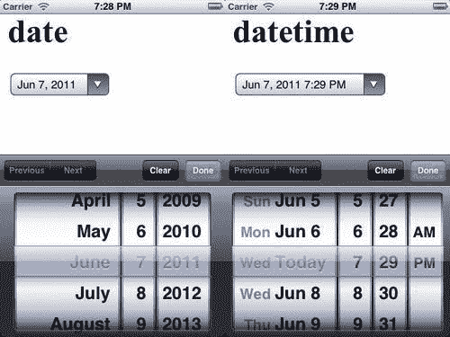
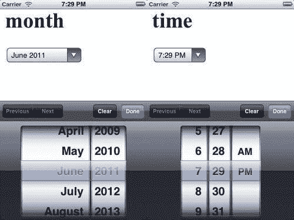
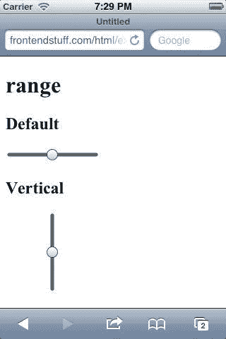

# 第十章：新兴移动 Web 功能

在本章中，我们将涵盖：

+   `window.onerror`

+   使用 ECMAScript 5 方法

+   新的 HTML5 输入类型

+   内联 SVG

+   `position:fixed`

+   `overflow:scroll`

# 介绍

iOS 5 上的移动 Safari 引入了一系列改进，使移动 Safari 成为最先进的移动浏览器之一。添加了许多尖端的 HTML5 功能——ECMAScript 5 以及移动特定功能——以允许在移动设备上实现更多功能并提高性能：

+   **Web forms**已经被引入，以帮助改善 Web 的用户界面，使界面原型设计更快速、更容易。

+   **内联 SVG**在移动浏览器上具有更大的可扩展性；这对于响应式设计可能非常有用。

+   **ES5**允许更好地控制创建的对象，并且可以在纯 JavaScript 中构建大型和复杂的功能。

+   添加了**移动特定属性**，如滚动 CSS。在移动 Safari 上，实现原生滚动曾经很痛苦，但现在添加了移动特定属性，使得 Web 开发人员能够开发具有与原生应用相同性能的 Web 应用变得轻松。

# window.onerror

目标浏览器：iOS 5

在 iOS 5 中，新增了一个事件处理程序：`window.onerror`。此事件处理程序用于发送到窗口的错误事件。

语法如下：

```html
window.onerror = funcA;

```

## 准备工作

创建一个 HTML 文档并将其命名为`ch10r01.html`。

## 操作步骤...

输入以下代码并在浏览器中进行测试：

```html
<!doctype html>
<html>
<head>
<title>Mobile Cookbook</title>
<meta charset="utf-8">
<style>
</style>
</head>
<body>
<script>
window.onerror=function(){
alert('An error has occurred!')
}
</script>
<script>
document.write('hello world'
</script>
</body>
</html>

```

您应该看到一个弹出警报，显示发生了错误。

## 它是如何工作的...

出现错误是因为我们没有在`document.write:`中关闭括号：

```html
<script>
document.write('hello world'
</script>

```

如果关闭括号并重试，错误将消失：

```html
<script>
document.write('hello world');
</script>

```

## 还有更多...

默认窗口行为是阻止显示错误对话框。它覆盖了默认行为：

```html
window.onerror = null;

```

### 浏览器对象模型

**浏览器对象模型** **(BOM)**是一组对象，让您可以访问浏览器和计算机屏幕。这些对象可以通过全局对象窗口和`window.screen`访问。要了解更多关于 BOM 的信息，请访问：

[`javascript.about.com/od/browserobjectmodel/Browser_Object_Model.htm`](http://javascript.about.com/od/browserobjectmodel/Browser_Object_Model.htm)

# 使用 ECMAScript 5 方法

目标浏览器：iOS 5

**ECMAScript 5**正在取代 ECMAScript 3.1。ECMAScript 5 为对象交互提供了很大的增强。从 iOS 4 开始，Safari 引入了许多新的 ECMAScript 5 功能；iOS 5 为 ECMAScript 5 提供了更大的支持。

以下是新引入的`Object`方法：

```html
Object.seal/Object.isSealed
Object.freeze/Object.isFrozen
Object.preventExtensions/Object.isExtensible
Function.prototype.bind

```

## 准备工作

创建一个 HTML 文档并将其命名为`ch10r02.html`。

## 操作步骤...

输入以下代码并在浏览器中进行测试：

```html
/*** freeze ***/
var dog = {
eat: function () {},
hair: "black"
};
var o = Object.freeze(dog);
// test if dog is frozen
assert(Object.isFrozen(dog) === true);
// can't alter the property
dog.hair = "yellow";
// can't remove property
delete dog.hair;
// can't add new property
dog.height = "0.5m";
/*** seal ***/
var human = {
eat: function () {},
hair: "black"
};
human.hair = "blonde";
var o = Object.seal(obj);
// changing property works
human.hair = "grey";
// can't convert
Object.defineProperty(obj, "hair", { get: function() { return "green"; } });
// silently doesn't add the property
human.height = "1.80m";
// silently doesn't delete the property
delete human.hair;
// detect if an object is sealed
assert(Object.isSealed(human) === true);
/*** preventExtensions ***/
ECMAScript 5ECMAScript 5testingvar nonExtensible = { removable: true };
Object.preventExtensions(nonExtensible);
Object.defineProperty(nonExtensible, "new", { value: 8675309 }); // throws a TypeError
assert(Object.isExtensible(nonExtensible) === true);
/*** bind ***/
var x = 9;
var module = {
x: 81,
getX: function() { return this.x; }
};
module.getX(); // 81
var getX = module.getX;
getX(); // 9, because in this case, "this" refers to the global object
// create a new function with 'this' bound to module
var boundGetX = getX.bind(module);
boundGetX(); // 81

```

## 它是如何工作的...

**Freeze**

如其名称所示，`freeze`冻结一个对象。不能向`freeze`添加或删除任何内容；甚至不能修改内容。它使对象不可变并返回一个冻结的对象：

```html
// can't alter the property
dog.hair = "yellow";
// can't remove property
delete dog.hair;
// can't add new property
dog.height = "0.5m";

```

要测试对象是否被冻结，请使用`isFrozen:`

```html
// test if dog is frozen
assert(Object.isFrozen(dog) === true);
// silently doesn't add the property
human.height = "1.80m";
// silently doesn't delete the property
ECMAScript 5ECMAScript 5object, freezingdelete human.hair;

```

**Seal**

如果您`seal`一个对象，则无法再添加或删除对象属性。您可能会问，`freeze`和`seal`之间有什么区别？区别在于对于`seal`，您仍然可以更改当前属性的值：

```html
// changing property works
human.hair = "grey";

```

要测试对象是否被封闭，请使用`isSealed:`

```html
// detect if an object is sealed
assert(Object.isSealed(human) === true);

```

**preventExtensions**

默认情况下，对象是可扩展的，但是通过`preventExtensions`，我们可以阻止对象扩展。这意味着不能再向对象中添加新属性。

```html
/*** preventExtensions ***/
var nonExtensible = { removable: true };
Object.preventExtensions(nonExtensible);
Object.defineProperty(nonExtensible, "new", { value: 8675309 }); // throws a TypeError
assert(Object.isExtensible(nonExtensible) === true);

```

**Function.prototype.bind**

另一个非常有用的功能是`bind`。它允许更好地控制`this`值。在我们的示例中，无论如何调用函数，它都会以特定的`this`值调用。

从示例中，我们可以看到有一个全局变量`x`，并且它的值在`module`对象中被修改：

```html
var x = 9;
var module = {
x: 81,
getX: function() { return this.x; }
};
module.getX(); // 81

```

当从对象中提取方法`getX`，然后调用该函数并期望它使用原始对象作为`this`，但此时对象是全局的，因此它返回`9`。

```html
var getX = module.getX;
getX(); // 9, because in this case, "this" refers to the global object

```

通过使用`bind`，我们创建了一个`this`绑定到`module:`的新函数

```html
// create a new function with 'this' bound to module
var boundGetX = getX.bind(module);
boundGetX(); // 81

```

## 还有更多...

默认窗口行为是防止错误对话框显示。它覆盖了默认行为：

```html
window.onerror = null;

```

### MDN 上的文档

`Object.freeze/Object.isFrozen:`

+   [`developer.mozilla.org/en/JavaScript/Reference/ Global_Objects/Object/freeze`](http://developer.mozilla.org/en/JavaScript/Reference/)

+   [`developer.mozilla.org/en/JavaScript/Reference/ Global_Objects/Object/isFrozen`](http://developer.mozilla.org/en/JavaScript/Reference/)

`Object.seal/Object.isSealed:`

+   [`developer.mozilla.org/en/JavaScript/Reference/ Global_Objects/Object/seal`](http://developer.mozilla.org/en/JavaScript/Reference/)

+   [`developer.mozilla.org/en/JavaScript/Reference/ Global_Objects/Object/isSealed`](http://developer.mozilla.org/en/JavaScript/Reference/)

`preventExtensions/isExtensible:`

+   [`developer.mozilla.org/en/JavaScript/Reference/ Global_Objects/Object/preventExtensions`](http://developer.mozilla.org/en/JavaScript/Reference/)

+   [`developer.mozilla.org/en/JavaScript/Reference/ Global_Objects/Object/isExtensible`](http://developer.mozilla.org/en/JavaScript/Reference/)

`Function.prototype.bind:`

+   [`developer.mozilla.org/en/JavaScript/Reference/ Global_Objects/Function/bind`](http://developer.mozilla.org/en/JavaScript/Reference/)

# 新的 HTML5 输入类型

目标浏览器：iOS 5

新的输入类型对于 Web 表单是有用的功能。iOS 5 现在支持：`date, datetime, month, time, range`等等。

## 准备工作

创建一个 HTML 文档并将其命名为`ch10r03.html`。

## 如何做...

输入以下代码并在浏览器中测试：

```html
<!doctype html>
<html>
<head>
<title>Mobile Cookbook</title>
<meta charset="utf-8">
</head>
<body>
<input type="date">
<input type="datetime">
<input type="month">
<input type="time">
<input type="range">
</body>
</html>

```

## 它是如何工作的...

在 iOS 5 上，`date`和`datetime`将被渲染如下：



在 iOS Safari 上渲染后，`month`和`time`输入类型将如下截图所示：



`slider`输入类型将如下截图所示：



## 还有更多...

有许多 polyfill 用于使 Web 表单在各种浏览器中工作。`html5slider`是 Firefox 4 及以上版本的 HTML5`<input type="range">`的 JavaScript 实现。您可以在以下网址了解更多信息：

[`github.com/fryn/html5slider`](http://github.com/fryn/html5slider)

# 文本/HTML 中的内联 SVG

目标浏览器：iOS 5

**可伸缩矢量图形（SVG）**可以在支持内联 SVG 的 HTML 文档中使用。

## 准备工作

创建一个 HTML 文档并将其命名为`ch10r04.html`。

## 如何做...

输入以下代码并在浏览器中测试：

```html
<svg width="500" height="220"  version="1.1">
<rect x="2" y="2" width="496" height="216" stroke="#000" stroke-width="2px" fill="transparent"></rect>
</svg>

```

## 它是如何工作的...

HTML 内联 SVG 必须以 MIME 类型`Content-Type: text/xml`呈现。您可以通过以`.xml`而不是`.html`结尾来创建这个。

## 还有更多...

有几种在 HTML 页面中嵌入 SVG 的方法：`<object>, <embed>, <iframe>`。

要了解不同浏览器中对 SVG 的支持，请访问（在*直接将 SVG 代码嵌入 HTML*部分下）：

[`www.w3schools.com/svg/svg_inhtml.asp`](http://www.w3schools.com/svg/svg_inhtml.asp)

### HTML 中的 SVG

Mozilla MDN 有很多关于前端网页和相关信息的有用文章：

[`developer.mozilla.org/en/SVG_In_HTML_Introduction`](http://developer.mozilla.org/en/SVG_In_HTML_Introduction)

# position:fixed

目标浏览器：iOS 5

`position:fixed`现在在 iOS 5 中得到支持。现在更容易为 Web 应用创建固定定位的工具栏。

## 准备工作

创建一个 HTML 文档并将其命名为`ch10r05.html`。

## 如何做...

在 iOS 5 之前，`position:fixed`在移动 Safari 中无法工作。如果我们想要创建一个工具栏或固定定位的页眉或页脚，就需要类似以下的 hack：

```html
<div id="fixedDiv">
</div>
<script>
window.onscroll = function() {
document.getElementById('fixedDiv').style.top =
(window.pageYOffset + window.innerHeight - 25) + 'px';
};
</script>

```

随着 iOS 5 的发布，不再需要这种 hack，我们可以简单地使用 CSS 样式，就像我们通常在其他浏览器中使用的那样：

```html
<style>
#fixedDiv { position:fixed; }
</style>
<div id="fixedDiv">
</div>

```

## 它是如何工作的...

我们将`onscroll`事件注册到`window`对象上，当滚动事件发生时，`div`将始终位于页面底部。

[`developer.mozilla.org/en/SVG_In_HTML_Introduction`](http://developer.mozilla.org/en/SVG_In_HTML_Introduction)

# overflow:scroll

目标浏览器：iOS 5

移动设备和桌面设备之间的一个重要区别是人们与浏览器的交互方式。在桌面浏览器上，可以通过鼠标滚轮或滚动条来进行滚动操作。在移动浏览器上，没有滚动条或鼠标滚轮，因此整个滚动交互都是通过手指操作完成的。很长一段时间内，iOS 不支持`overflow:scroll`，但现在 iOS 5 已经支持了！

## 准备工作

创建一个名为`ch10r06.html`的 HTML 文档。

## 如何做...

现在，如果您想要使一个区域可滚动，请使用以下代码：

```html
<!doctype html>
<html>
<head>
<title>Mobile Cookbook</title>
<meta charset="utf-8">
<meta name="viewport" content="width=device-width, initial-scale=1.0">
<style>
div {
width:200px;
height:200px;
margin:0 auto;
border:1px solid black;
overflow: scroll;
-webkit-overflow-scrolling: touch;
}
</style>
</head>
<body>
<div>
<p>Lorem Ipsum</p>
<p>Lorem Ipsum</p>
<p>Lorem Ipsum</p>
<p>Lorem Ipsum</p>
<p>Lorem Ipsum</p>
<p>Lorem Ipsum</p>
<p>Lorem Ipsum</p>
<p>Lorem Ipsum</p>
<p>Lorem Ipsum</p>
<p>Lorem Ipsum</p>
<p>Lorem Ipsum</p>
<p>Lorem Ipsum</p>
<p>Lorem Ipsum</p>
<p>Lorem Ipsum</p>
<p>Lorem Ipsum</p>
</div>
</body>
</html>

```

## 它是如何工作的...

通过将`overflow`定义为`scroll`，并将`-webkit-overflow-scrolling`定义为`touch`，可以在移动 Safari 页面上滚动内容，而无需任何额外的代码。

## 还有更多...

在过去的几年中，有许多 hack 用于模拟原生滚动行为。从未发布的苹果网页框架**PastryKit**启发了许多框架这样做。一些著名的框架包括：

+   Sencha touch: [`www.sencha.com/products/touch/`](http://www.sencha.com/products/touch/)

+   `iScroll`: [`cubiq.org/iscroll`](http://cubiq.org/iscroll)

+   Scrollability: [`github.com/joehewitt/scrollability/`](http://github.com/joehewitt/scrollability/)

+   jQuery mobile: [`jquerymobile.com/`](http://jquerymobile.com/)

有一句古话是“假装直到你成功”，现在苹果终于让这成为可能。就性能而言，它非常稳定，可能比以前的任何框架都要好。

### 浏览器碎片化

对于某些企业来说，可能会担心移动浏览器的碎片化。一种方法是支持当前浏览器版本之前的两个版本。另一种方法是
