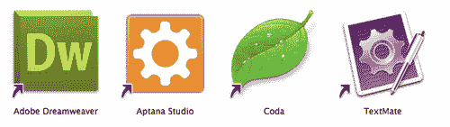
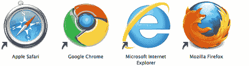
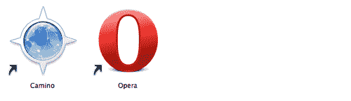
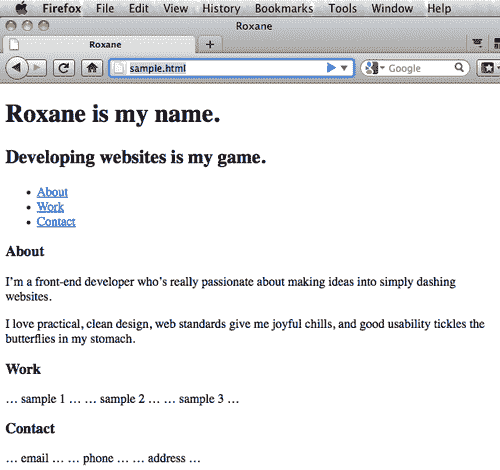

# 第一章：为丰富媒体应用程序进行结构化

在本章中，我们将涵盖：

+   设置 HTML5 测试区域

+   使用`header`标签用于标识和网站标题

+   使用`nav`标签创建目录

+   使用`section`标签来构建页面区域

+   使用`<aside>`标签对齐图形

+   使用`<aside>`标签显示多个侧边栏

+   实现`footer`标签

+   应用`outline`算法

+   在 HTML5 中创建时尚的推广页面

# 介绍

> “胆大者胜。”- 未知

不要听信唱衰者：HTML5 的许多方面已经准备好供我们使用。尽管有些人可能认为，没有遥远的日期可以开始使用这一系列新技术。事实上，下一代 Web 标记并不是遥远的梦想，它已经到来，准备好探索和使用。

没有网站可以存在没有至少一些简单的超文本标记语言。这种开放技术非常重要。如果你多年来一直在使用 HTML 创建和发布网站和应用程序，你可能会觉得自己已经掌握了这门语言。你已经知道语义标记的好处，内容、表现和行为的分离，以及无障碍问题，你对此已经很熟悉。事情可能会感到有点乏味。你已经准备好迎接新的挑战。

或许你是一位年轻的开发者，正在构建你的第一个网站，需要了解如何使用最新和最伟大的技术，并对 Web 开发的未来有所了解。

无论哪种方式，你的道路是清晰的：在你现有的 HTML 和相关技术编码能力的基础上，这本书将推动你的技能到下一个水平，并迅速让你创造出以前 HTML 无法做到的惊人的东西。

如果你感到自满，请继续阅读。事实上，现在是成为 Web 开发人员最激动人心的时刻。更丰富的界面，互联网的普及以及移动设备的兴起正是你正在寻找的新挑战。

幸运的是，HTML5、大量的层叠样式表和一点 JavaScript，可以应对这些新挑战。Web 开发的最新创新使得这是在线出版商的新黄金时代。对于我们许多人来说，经历了一段低迷之后，我们现在迅速发现，为 Web 开发是再次有趣的！毕竟，HTML5 代表了进化 - 而不是革命。

在几个成功的知名客户项目中，我使用了一种自定义的 JavaScript 方法来部署 HTML5 的一些方面，并支持包括微软 Internet Explorer 6 在内的旧版浏览器。

在本书中，你将学习这种强大的方法论，以及如何在真实的生产环境中使用许多仍在发展中的 HTML5 标准和功能。

当我们使用 HTML5 开发时，我们将语义命名的基本原则（将事物命名为它们是什么，而不是根据它们的外观命名）提升到一个全新的水平。这是使 HTML5 与其所有前身不同的关键因素。在本书的过程中，你会发现自己重新思考和优化许多你的代码命名约定。

尽管 Web 超文本应用技术工作组（WHATWG）提出的 HTML5 建议推荐计划直到 2022 年才全面实施，但由于前瞻性的浏览器制造商，没有理由你不能立即开始使用它，并获得更好的语义命名、增强的可访问性等诸多好处。

所以让我们开始吧！

在本章中，我们将向您展示如何设置开发环境，包括使用适当的`DOCTYPE`和要使用的浏览器，以及如何使用特定的新标签，包括：

+   `<header>` - 一组介绍或导航辅助工具

+   `<nav>` - 用于导航列表

+   `<section>` - 用于区分页面区域

+   `<aside>` - 用于对齐特定元素

+   `<footer>` - 页面或部分的底部信息

最后，我们将把所有这些元素组合在一起，用 HTML5 创建一个时尚的专业宣传页面。

# 设置 HTML5 测试区域

如果我们要使用 HTML5 构建新的令人兴奋的项目，我们需要为成功做好准备。毕竟，我们希望确保我们构建的内容对我们自己和我们的客户来说能够以可预测的方式显示和行为。让我们用一个代码编辑器和至少一个网络浏览器构建一个测试套件。

## 准备工作

我们需要一些东西才能开始。至少，我们都需要一个代码编辑器和一个浏览器来查看我们的工作。经验丰富的专业人士知道我们实际上需要一系列反映我们受众使用情况的浏览器。我们想要以他们的方式看待事物。我们*需要*以他们的方式看待事物。

## 如何做...

许多网络开发人员说他们能够使用像 Microsoft Windows 的记事本或 Mac OSX 的 TextEdit 这样的纯文本软件编写代码。这很好，但尽管吹嘘，我们不知道有哪个网络开发人员实际上每天都这样工作。

相反，大多数人使用一些开发应用程序，比如 Adobe Dreamweaver（适用于 Windows 和 Mac）或 Aptana Studio（适用于 Windows 和 Mac 和 Linux）或 Coda（我个人偏好，仅适用于 Mac）或 TextMate（也仅适用于 Mac）。

让我们首先下载这些应用程序中的至少一个：

+   Adobe Dreamweaver: [`adobe.com/products/dreamweaver`](http://adobe.com/products/dreamweaver)

+   Aptana Studio: [`aptana.com`](http://aptana.com)

+   Coda: [`panic.com/coda`](http://panic.com/coda)

+   TextMate: [`macromates.com`](http://macromates.com)

这里显示了最常见的网络编辑器的应用程序图标：



## 它是如何工作的...

为了使我们创建的代码正确呈现，我们需要一个网络浏览器 —— 可能不止一个。并非所有浏览器都是一样的。正如我们将看到的，一些浏览器需要一些额外的帮助来显示一些 HTML5 标签。以下是我们至少会使用的浏览器。

如果您在 Mac 上使用 OSX，苹果 Safari 已经安装。如果您是 Microsoft Windows 用户，Internet Explorer 已经安装。

如果您使用像 iPhone 或 Android 这样的现代移动设备进行开发，它已经安装了至少一个浏览器。

由于我们将在桌面上进行实际编码，让我们从以下位置下载一些浏览器开始。注意：Microsoft Internet Explorer 仅适用于 PC。

+   Apple Safari: [`apple.com/safari`](http://apple.com/safari)

+   Google Chrome: [`google.com/chrome`](http://google.com/chrome)

+   Mozilla Firefox: [`getfirefox.com`](http://getfirefox.com)

+   Microsoft Internet Explorer: [`windows.microsoft.com/en-US/windows/products/internet-explorer`](http://windows.microsoft.com/en-US/windows/products/internet-explorer)

这里显示了最常见的桌面网络浏览器的应用程序图标：



## 还有更多...

为什么我们需要不止一个浏览器？有两个原因：

+   这些应用程序具有不同的渲染引擎，并以稍微不同的方式解释我们的代码。这意味着无论我们的代码多么有效或出于良好意图，有时浏览器的行为是不可预测的。我们必须为此做好计划并保持灵活性。

+   我们无法总是预测我们的受众会在哪种设备上安装哪种浏览器，因此作为开发人员，我们需要比他们更先进一步，以最好地满足他们的需求以及我们自己的需求。

### WebKit 渲染引擎

幸运的是，Safari 和 Chrome 使用相同的 WebKit 渲染引擎。iPhone 和 iPad 的移动 Safari，以及 Android 移动设备的网络浏览器，都使用 WebKit 渲染引擎的一个版本。

### Gecko 渲染引擎

Firefox 及其移动版本都使用 Gecko 渲染引擎。

### Trident 渲染引擎

我只是想告诉你我的感受。必须让你明白：微软多次改变和更新了其名为 Trident 的 Internet Explorer 渲染引擎，这让我们作为开发人员的生活相当困难。我们经常感觉自己在瞄准一个移动的目标。随着 Internet Explorer 10 的到来，似乎这种情况不会很快改变。

## 另请参阅

Camino（仅限 Mac）和 Opera（适用于 Microsoft Windows、Apple OSX、Linux 和移动设备）都是出色的替代浏览器，支持 HTML5 的许多功能。考虑将这些浏览器添加到您的测试套件中。

+   Camino：[`caminobrowser.org`](http://caminobrowser.org)

+   Opera：[`opera.com`](http://opera.com)

这里显示了 Camino 和 Opera 网页浏览器的应用程序图标：



既然我们有了开发环境和不止一个浏览器，让我们来写一些代码吧！

### 提示

**渐进增强**

我们将使用渐进增强的概念来构建我们的页面，这意味着从纯 HTML 标记开始，然后添加 CSS 进行呈现，最后再添加一点 JavaScript 进行行为。我们听到的最好的类比之一是，基本的 HTML 就像黑白电视。添加 CSS 就像添加颜色，添加 JavaScript 有点像添加高清。

# 使用标题标签来放置标志和网站标题

> “`<header>`元素表示一组导航或导航辅助。`<header>`元素通常包含该部分的标题（`<h1> - <h6>`元素或`<hgroup>`元素），但这不是必需的。`<header>`元素还可以用于包装部分的目录、搜索表单或任何相关的标志。”- WHATWG 的 HTML5 草案标准 - [`whatwg.org/html5`](http://whatwg.org/html5)

## 准备工作

HTML5 的第一件事就是`DOCTYPE`。如果你是网页开发的老手，你会很高兴地知道我们不再需要使用这样冗长、复杂的`DOCTYPE`了：

`<!DOCTYPE html PUBLIC "-//W3C//DTD XHTML 1.0 Strict//EN" "http://www.w3.org/TR/xhtml1/DTD/xhtml1-strict.dtd">`

或：

`<!DOCTYPE html PUBLIC "-//W3C//DTD XHTML 1.0 Transitional//EN" "http://www.w3.org/TR/xhtml1/DTD/xhtml1-transitional.dtd">`

或：

`<!DOCTYPE html PUBLIC "-//W3C//DTD XHTML 1.0 Frameset//EN" "http://www.w3.org/TR/xhtml1/DTD/xhtml1-frameset.dtd">`

HTML5 消除了对 Strict、Transitional 和 Frameset `DOCTYPE`的需要。实际上，它完全消除了对`DOCTYPE`的需要。没有`DOCTYPE`，较旧版本的 Internet Explorer 会进入 Quirks 模式，这是没有人想要的。相反，我们可以使用简单的：

`<!DOCTYPE html>`

最后，一个`DOCTYPE`统治它们所有。

让我们从一个基本的页面结构开始，这是我们都应该熟悉的：

```html
<!DOCTYPE html>
<html lang="en">
<head>
<meta charset="UTF-8">
<title></title>
<!--[if lt IE 9]><script src="img/html5.js"> </script>[endif]-->
<meta name="viewport" content="width=device-width, initial-scale=1.0">
</head>
<body>
</body>
</html>

```

引号在创建有效的 XHTML 时是必需的，但由于 HTML5 不与 XML 耦合，这在 HTML5 规范中是可选的。然而，作者建议尽可能在属性周围加上引号。

敏锐的眼睛还会注意到`<meta name="viewport" content="width=device-width, initial-scale=1.0">`。目前它对我们来说没有太大作用，但在移动设备上预览您的工作时将是至关重要的。

关闭标签也是可选的。虽然这是一个好习惯，但你应该权衡一下是否值得花费开发时间和增加页面负担。

您还会注意到一个条件注释，检查用户是否在使用 Internet Explorer。如果是，我们告诉浏览器执行 Remy Sharp 的“HTML5 Shiv”脚本，这只是告诉 IE 要表现良好：`<article>、<aside>、<audio>、<canvas>、<command>、<datalist>、<details>、<embed>、<figcaption>、<figure>、<footer>、<header>、<hgroup>、<keygen>、<mark>、<meter>、<nav>、<output>、<progress>、<rp>、<ruby>、<section>、<source>、<summary>、<time>、<video>、<wbr>`。

该死的 Internet Explorer。它缺乏纪律。

## 如何做...

我们将为一位名叫 Roxane 的年轻开发者创建一个单页专业网页作品集。假设 Roxane 是一位有很多技能的才华横溢的网页开发者，就像你一样。她应该拥有一个与她的才华相称的专业单页作品集网站，你也一样。请随意在以下示例中用你的信息替换她的信息。

让我们从使用第一个新的`<header>`标签开始，来定义我们整个页面的最顶部区域。

在此过程中，我们还将使用新的`<hgroup>`标签来包含新的`<header>`标签中的标题。

```html
<!DOCTYPE html>
<html lang="en">
<head>
<meta charset="UTF-8">
<title>Roxane</title>
<!--[if lt IE 9]><script src="img/html5.js"> </script>[endif]-->
<meta name="viewport" content="width=device-width, initial-scale=1.0">
</head>
<body>
<header>
<hgroup>
<h1>Roxane is my name.</h1>
<h2>Developing websites is my game.</h2>
</hgroup>
</header>
</body>
</html>

```

> "`<hgroup>`元素表示一个部分的标题。当标题具有多个级别时，例如副标题、替代标题或标语时，该元素用于对一组`<h1> - <h6>`元素进行分组。" - WHATWG 的 HTML5 草案标准 - [`whatwg.org/html5`](http://whatwg.org/html5)

## 它是如何工作的...

新的`<header>`通常用于存储诸如标志、公司口号和通常与页眉相关的其他类型的品牌。它通常是 HTML5 页面上的第一个块级元素，并且通常用于标题，如`<h1>, <h2>`等。结果是一个更具语义的代码库，可以构建更多。

## 还有更多...

在 HTML5 之前，浏览器软件以及谷歌、雅虎和必应等主要搜索引擎都会给所有的`<div>`赋予相同的权重。但是我们知道`<div id="header">`的意图就不像新的`<header>`那么明显。HTML5 更倾向于根据实际情况来命名事物。现在，HTML5 认识到并不是所有的`<div>`都是平等的，而是用更语义化的术语来替换一些`<div>`，比如新的`<header>`、`<nav>`和`<footer>`，以获得更多的数据丰富性。

### 在其他地方使用`<header>`

有趣的是，页眉不是你可以使用新的`<header>`标签的唯一位置。在 HTML5 中，几乎可以在任何块级元素内使用新的`<header>`标签。

### 内容，而不是位置

新的`<header>`标签通常出现在网页的顶部，但并不总是出现在那里。请记住，从语义上讲，新的`<header>`标签是由其内容而不是其位置来定义的。

### 语义命名

语义命名也使我们作为网页开发者的工作更加容易。像新的`<footer>`标签的意图就更明显，而像模糊的`<div id="belowleft">`这样的标签就不那么明显。

### 提示

**语义命名的关键**

命名事物是什么 - 而不是它们的外观。

## 另请参阅

我们将继续参考 WHATWG 的 HTML5 草案标准[`whatwg.org/specs/web-apps/current-work/multipage`](http://whatwg.org/specs/web-apps/current-work/multipage)，因为这是 HTML5 演变的一个重要指南。

# 使用 nav 标签创建目录

> "`<nav>`元素表示一个导航部分，其中只有由主导航块组成的部分适合`<nav>`元素。" - WHATWG 的 HTML5 草案标准 - [`whatwg.org/html5`](http://whatwg.org/html5)

就像新的`<header>`标签取代了过时的命名约定`<div id="header">`一样，我们也可以用简单的新的`<nav>`来取代`<div id="nav">`。这更有意义，不是吗？我们也这么认为。

## 准备工作

我们将添加主导航栏，就像我们经常在网页上看到的那样。这使用户可以轻松地在页面之间移动，或者在这种情况下，在同一个页面内移动。Roxane 想展示她的个人简介信息、工作样本以及联系方式，所以我们将使用这些作为我们的锚点。

## 如何做...

让我们使用两个最典型的元素来创建我们的导航栏：

1.  无序列表

1.  附带的超文本链接

```html
<!DOCTYPE html>
<html lang="en">
<head>
<meta charset="UTF-8">
<title>Roxane</title>
<!--[if lt IE 9]><script src="img/html5.js"> </script>[endif]-->
<meta name="viewport" content="width=device-width, initial-scale=1.0">
</head>
<body>
<header>
<hgroup>
<h1>Roxane is my name.</h1>
<h2>Developing websites is my game.</h2>
</hgroup>
</header>
<nav>
<ul>
<li><a href="#About">About</a></li>
<li><a href="#Work">Work</a></li>
<li><a href="#Contact">Contact</a></li>
</ul>
</nav>
</body>
</html>

```

## 它是如何工作的...

以前，我们可能会使用类似`<div id="nav">`的东西来存储我们的导航列表。但是在 HTML5 中，新的`<nav>`标签就足够了。

当我们应用 CSS 时，我们将浮动这些列表项，并使它们看起来更像传统的网页导航栏。

## 还有更多...

更语义化的命名的美妙之处在于现在我们页面的部分确实做到了我们认为它们应该做的事情 - `<header>`包含标题信息，`<nav>`包含导航辅助信息，等等。避免混淆。

### 在其他地方使用`<nav>`

与`<header>`一样，`<nav>`可以出现在页面的多个位置。

### 更语义化=更好

还要记住，更语义化的命名通常会导致更短，更精简的代码。毕竟，`<nav>`肯定比常见的`<div id="nav">`更短。这对人类和机器都更有意义。这意味着我们需要写的东西更少，这节省了我们的时间。这也意味着浏览器需要解释和显示的代码更少，这节省了下载和渲染时间。它还赋予内容意义和结构，类似于大纲为研究论文提供意义和结构的方式。每个人都受益。

### 不断发展

最初，新的`<nav>`元素只用于“主要”导航块。然而，HTML5 的主要推动力 Ian Hickson 更新了规范，改为“主要”导航块。

## 另请参阅

由于它是一个不断发展的标准，鼓励您为 HTML5 的发展做出贡献，并帮助塑造语言。加入 WHATWG 的`<help@whatwg.org>`邮件列表，提出建议和提问。注册说明请参见：[`whatwg.org/mailing-list#help`](http://whatwg.org/mailing-list#help)。

# 使用 section 标签来结构页面的区域

> “`<section>`元素代表一个通用的文档内容块或应用程序块。在这种情况下，`<section>`是内容的主题分组，通常带有标题。” - WHATWG 的 HTML5 草案标准 - http://whatwg.org/html5

## 准备就绪

让我们为 Roxane 的单页面作品集站点的每个主要区域添加新的`<section>`标签。然后，这些`<section>`将被用作容器，每个都有一个标题和通用内容，其中包含她的个人简介信息，工作示例和联系方式。

## 如何做...

使用新的`<section>`标签可能会有些棘手。有很多它不是的东西，但只有某些它是的东西。

```html
<!DOCTYPE html>
<html lang="en">
<head>
<meta charset="UTF-8">
<title>Roxane</title>
<!--[if lt IE 9]><script src="img/html5.js"> </script>[endif]-->
<meta name="viewport" content="width=device-width, initial-scale=1.0">
</head>
<body>
<header>
<hgroup>
<h1>Roxane is my name.</h1>
<h2>Developing websites is my game.</h2>
</hgroup>
</header>
<nav>
<ul>
<li><a href="#About">About</a></li>
<li><a href="#Work">Work</a></li>
<li><a href="#Contact">Contact</a></li>
</ul>
</nav>
<section id="About">
<h3>About</h3>
<p>I'm a front-end developer who's really passionate about making ideas into simply dashing websites.</p>
<p>I love practical, clean design, web standards give me joyful chills, and good usability tickles the butterflies in my stomach.</p>
</section>
<section id="Work">
<h3>Work</h3>
<p>sample 1</p>
<p>sample 2</p>
<p>sample 3</p>
</section>
<section id="Contact">
<h3>Contact</h3>
<p>email</p>
<p>phone</p>
<p>address</p>
</section>
</body>
</html>

```

## 它是如何工作的...

我们使用新的`<section>`标签不是作为`<div>`的通用替代，而是以语义上正确的方式作为一个相关的分组，通常包含一个标题。

## 还有更多...

如果内容分组没有关联，那么它可能不应该是`<section>`。考虑使用`<div>`。

### Section 不等于 div

记住：如果没有`<header>`，那么可能不需要`<section>`。使用`<section>`来分组内容，但纯粹出于样式原因分组项目时使用`<div>`。

### 部分指南

仍然不确定是否应该使用`<section>`标签？请记住以下准则：

+   您是仅用于样式或脚本吗？那就是`<div>`。

+   如果有其他更合适的标签，请使用它。

+   只有在内容开头有标题时才使用它。

### 不断发展

HTML5 是一个不断发展的标准。来自 WHATWG 的最新指导建议：

> “鼓励作者在元素的内容可以进行合理地进行内容的合成时使用`<article>`元素而不是`<section>`元素。”

发布关于页面？那可能是一个很好的`<section>`候选。

## 另请参阅

新的`<section>`标签也可以支持引用属性用于引用。

# 使用 aside 标签对齐图形

> “`<aside>`元素代表页面的一个部分，其中包含与`<aside>`元素周围的内容有关的内容，可以被视为与该内容分开的内容。” - WHATWG 的 HTML5 草案标准 - [`whatwg.org/html5`](http://whatwg.org/html5)

## 准备就绪

让我们以一种常见的方式使用新的`<aside>`标签：创建一个缩略图图像的侧边栏，列出 Roxane 最近阅读的内容。

## 如何做...

过去，我们将图像或列表浮动到文本的右侧或左侧。这仍然有效，但现在我们可以更好地利用 HTML5 中改进的语义，通过使用新的`<aside>`标签来实现类似的视觉效果。让我们使用：

+   有序列表

+   缩略图像

+   书名

```html
<!DOCTYPE html>
<html lang="en">
<head>
<meta charset="UTF-8">
<title>Roxane</title>
<!--[if lt IE 9]><script src="img/html5.js"> </script>[endif]-->
<meta name="viewport" content="width=device-width, initial-scale=1.0">
</head>
<body>
<header>
<hgroup>
<h1>Roxane is my name.</h1>
<h2>Developing websites is my game.</h2>
</hgroup>
</header>
<nav>
<ul>
<li><a href="#About">About</a></li>
<li><a href="#Work">Work</a></li>
<li><a href="#Contact">Contact</a></li>
</ul>
</nav>
<section id="About">
<h3>About</h3>
<p>I'm a front-end developer who's really passionate about making ideas into simply dashing websites.</p>
<p>I love practical, clean design, web standards give me joyful chills, and good usability tickles the butterflies in my stomach.</p>
</section>
<section id="Work">
<h3>Work</h3>
<p>sample 1</p>
<p>sample 2</p>
<p>sample 3</p>
</section>
<section id="Contact">
<h3>Contact</h3>
<p>email</p>
<p>phone</p>
<p>address</p>
</section>
<aside>
<h4>What I'm Reading</h4>
<ul>
<li> Inkscape 0.48 Essentials for Web Designers</li>
<li> jQuery 1.4 Reference Guide</li>
<li> Blender 2.5 Lighting and Rendering</li>
<li> Blender 2.5 Lighting and Rendering</li>
</ul>
</aside>
</body>
</html>

```

注意：在这种情况下，引号是必需的，以确保有效性。

## 它是如何工作的...

`<aside>`标签有效地用于放置诸如图像和文本之类的项目，这些项目通常不如主要页面内容重要。

## 还有更多...

从语义上讲，`<aside>`类似于侧边栏。这并不一定指位置，而是指与之相关的内容。

### 并非所有的`<section>`都是相同的

尽管`<section>`是一块相关内容的通用块，但将`<header>、<nav>、<footer>`和`<aside>`视为`<section>`的专门类型。

### 记住的提示

内容可以在没有`<aside>`标签的情况下存在，但`<aside>`标签不能在没有内容的情况下存在。

### 除了`<aside>`之外

`<aside>`标签的定义已经扩大，不仅包括与之相关的`<article>`的信息，还包括与网站本身相关的信息，比如博客列表。

## 另请参阅

Jeremy Keith 撰写了出色的*“HTML5 For Web Designers”*，被认为是理解新技术组的最低要求。在这里找到它：[`books.alistapart.com/products/html5-for-web-designers`](http://books.alistapart.com/products/html5-for-web-designers)。

# 使用 aside 标签显示多个侧边栏

> “`<aside>`元素代表页面的一部分，其中包含与`<aside>`元素周围的内容有关的内容，这些内容可以被视为与该内容分开的内容。”- WHATWG 的 HTML5 草案标准 - [`whatwg.org/html5`](http://whatwg.org/html5)

## 准备工作

似乎每个博客和许多其他类型的网站都有侧边栏，其中充满各种信息。在这里，我们将使用新的`<aside>`标签为 Roxane 的单页作品集网站添加一个额外的侧边栏。

## 如何做...

Roxane 想让人们知道她还可以在哪里联系到她，你也是。让我们使用`<aside>`标签创建一个侧边栏，并吸引人们关注她的网站存在：

```html
<!DOCTYPE html>
<html lang="en">
<head>
<meta charset="UTF-8">
<title>Roxane</title>
<!--[if lt IE 9]><script src="img/html5.js"> </script>[endif]-->
<meta name="viewport" content="width=device-width, initial-scale=1.0">
</head>
<body>
<header>
<hgroup>
<h1>Roxane is my name.</h1>
<h2>Developing websites is my game.</h2>
</hgroup>
</header>
<nav>
<ul>
<li><a href="#About">About</a></li>
<li><a href="#Work">Work</a></li>
<li><a href="#Contact">Contact</a></li>
</ul>
</nav>
<section id="About">
<h3>About</h3>
<p>I'm a front-end developer who's really passionate about making ideas into simply dashing websites.</p>
<p>I love practical, clean design, web standards give me joyful chills, and good usability tickles the butterflies in my stomach.</p>
</section>
<section id="Work">
<h3>Work</h3>
<p>sample 1</p>
<p>sample 2</p>
<p>sample 3</p>
</section>
<section id="Contact">
<h3>Contact</h3>
<p>email</p>
<p>phone</p>
<p>address</p>
</section>
<aside>
<h4>What I'm Reading</h4>
<ul>
<li> Inkscape 0.48 Essentials for Web Designers</li>
<li> jQuery 1.4 Reference Guide</li>
<li> Blender 2.5 Lighting and Rendering</li>
</ul>
</aside>
<aside>
<h4>Elsewhere</h4>
<p>You can also find me at:</p>
<ul>
<li><a href="http://linkedin.com/in/">LinkedIn</a></li>
<li><a href="http://twitter.com/">Twitter</a></li>
<li><a href="http://facebook.com/">Facebook</a></li>
</ul>
</aside>
</body>
</html>

```

## 它是如何工作的...

在我们之前使用`<aside>`标签取得成功的基础上，我们再次使用它来对齐主要信息之后的信息。

## 还有更多...

仅仅因为设计需要一个侧边栏，并不意味着自动使用`<aside>`标签。在考虑位置之前，仔细考虑你的内容。

### 拉引语适合`<aside>`

拉引语在新闻文章中很常见，因此是被`<aside>`标签包含的主要候选对象。

### 记住验证

我们需要在这些锚点周围添加引号，以使它们有效。

## 另请参阅

Bruce Lawson 和 Remy Sharp 合著了出色的*Introducing HTML5*参考书，可在此处找到：[`peachpit.com/store/product.aspx?isbn=0321687299`](http://peachpit.com/store/product.aspx?isbn=0321687299)

# 实现页脚标签

> “`<footer>`元素代表已完成文档或其最近祖先分区内容的页脚。”- WHATWG 的 HTML5 草案标准 - [`whatwg.org/html5`](http://whatwg.org/html5)

## 准备工作

我们都在网页上使用页脚-通常用于次要导航等。这包含了通常在页面底部看到的所有信息，比如版权声明、隐私政策、使用条款等。与新的`<header>`标签一样，新的`<footer>`标签可以出现在多个位置。

## 如何做...

在这种情况下，我们将使用新的`<footer>`标签将 Roxane 的版权信息放在页面底部。

### 提示

这是一个可以增长的

记住：版权并不意味着你有权复制它！

```html
<!DOCTYPE html>
<html lang="en">
<head>
<meta charset="UTF-8">
<title>Roxane</title>
<!--[if lt IE 9]><script src="img/html5.js"> </script>[endif]-->
<meta name="viewport" content="width=device-width, initial-scale=1.0">
</head>
<body>
<header>
<hgroup>
<h1>Roxane is my name.</h1>
<h2>Developing websites is my game.</h2>
</hgroup>
</header>
<nav>
<ul>
<li><a href="#About">About</a></li>
<li><a href="#Work">Work</a></li>
<li><a href="#Contact">Contact</a></li>
</ul>
</nav>
<section id="About">
<h3>About</h3>
<p>I'm a front-end developer who's really passionate about making ideas into simply dashing websites.</p>
<p>I love practical, clean design, web standards give me joyful chills, and good usability tickles the butterflies in my stomach.</p>
</section>
<section id="Work">
<h3>Work</h3>
<p>sample 1</p>
<p>sample 2</p>
<p>sample 3</p>
</section>
<section id="Contact">
<h3>Contact</h3>
<p>email</p>
<p>phone</p>
<p>address</p>
</section>
<aside>
<h4>What I'm Reading</h4>
<ul>
<li> Inkscape 0.48 Essentials for Web Designers</li>
<li> jQuery 1.4 Reference Guide</li>
<li> Blender 2.5 Lighting and Rendering</li>
<footer> tagimplementing</ul>
</aside>
<aside>
<h4>Elsewhere</h4>
<p>You can also find me at:</p>
<ul>
<li><a href="http://linkedin.com/in/">LinkedIn</a></li>
<li><a href="http://twitter.com/">Twitter</a></li>
<li><a href="http://facebook.com/">Facebook</a></li>
</ul>
</aside>
<footer>
<h5>All rights reserved. Copyright Roxane.</h5>
</footer>
</body>
</html>

```

## 它是如何工作的...

尽管这个`<footer>`位于 Roxane 的单页作品集网站的底部，但它也可以用于页面的其他位置，比如在`<section>`标签的底部，以包含作者、发布日期等信息。结果比旧的`<div id="footer">`更灵活。在这种情况以及许多其他情况下，HTML5 的新标签允许我们根据内容而不是布局的需要，将适当的标签放在最合适的位置。

## 还有更多...

HTML5 规范建议在新的`<footer>`标签中包含作者信息，无论`<footer>`是`<section>`或`<article>`的一部分，甚至在页面底部。

### 这通常发生

绝大多数情况下，您将在文档顶部使用`<header>`标签，在底部使用`<footer>`标签，并在侧边使用`<aside>`标签。

### 灵活的页脚内容

当`<footer>`元素包含整个部分时，它们代表附录、索引、长的版权声明、冗长的许可协议等内容。

### 更灵活的页脚内容

新的`<footer>`标签还可以包含作者归属、相关文档的链接、版权等信息。

## 另请参阅

Mark Pilgrim 在[`diveintohtml5.org`](http://diveintohtml5.org)创建了一个很棒的免费在线 HTML5 参考资料*Dive Into HTML5*。

# 应用大纲算法

幸运的是，HTML5 现在有一种方法在浏览器中组织我们页面的大纲，因此搜索引擎以及无障碍技术可以更好地理解它们。我们将使用 HTML5 大纲：[`gsnedders.html5.org/outliner`](http://gsnedders.html5.org/outliner)

## 准备好了

要使用 HTML5 大纲，我们可以使用存储在本地计算机上的 HTML 或通过 URL 可见的代码。确保在此步骤中将我们一直在创建的代码保存在本地或上传到公共可访问的 Web 服务器上。

## 如何做...

让我们确保将此文档保存在本地硬盘或远程服务器上。我们将访问[`gsnedders.html5.org/outliner`](http://gsnedders.html5.org/outliner)来创建我们的大纲。

使用我们之前的代码示例，我们可以生成以下代码大纲：

1.  我的名字是 Roxane。

1.  无标题部分

1.  关于

1.  工作

1.  联系

1.  我在读什么

1.  其他地方

1.  保留所有权利。版权所有 Roxane。

## 它是如何工作的...

> “它是根据 DOM 树的节点遍历而定义的，在树的顺序中，每个节点在遍历期间被访问时，*进入*和*退出*。” - WHATWG

## 还有更多...

假设跟随任何标题的内容与该标题相关。因此，我们可以使用许多新的 HTML5 标签，如`<section>`，明确地展示相关内容的开始和结束。

### 你确定吗？

如果 HTML5 大纲工具显示“无标题部分”之类的消息，您应重新考虑如何使用每个标签，并确保您的方法符合规范的意图。

### 一个例外

“无标题部分”消息应被视为警告而不是错误。虽然`<section>`和其他新的 HTML5 标签需要标题标签，但对于`<nav>`区域来说，没有标题标签也是完全有效的。

### 记住无障碍

创建的大纲确保我们创建的代码符合 W3C 的标记规范，以及像 WAI-ARIA 这样的高级技术，以满足无障碍要求。

### 提示

良好的无障碍设计是良好的网页设计。

## 另请参阅

[`html5doctor.com`](http://html5doctor.com)网站是由七位思想领袖撰写的出色的互动参考资料，包括 Rich Clark、Bruce Lawson、Jack Osborne、Mike Robinson、Remy Sharp、Tom Leadbetter 和 Oli Studholme。

# 在 HTML5 中创建时尚的推广页面

我们的朋友 Roxane 的单页作品集网站已经使用了许多新的 HTML5 元素。她准备向世界展示她是一位有远见的网页开发人员，准备应对高级项目。

## 准备好了

我们已经通过整理单页作品集网站的大部分内容做好了准备。虽然现在还不太时尚，但当我们在其上添加 CSS 时，它将真正地融合在一起，并且会像我们的想象力允许的那样时尚。

## 如何做...

到目前为止，我们拥有的代码。它符合万维网联盟的 HTML5 和第五百零八部分无障碍测试。这个未经样式化的代码应该可以在任何现代网络浏览器上轻松查看，无论是在桌面上还是移动设备上。

```html
<!DOCTYPE html>
<html lang="en">
<head>
<meta charset="UTF-8">
<title>Roxane</title>
<!--[if lt IE 9]><script src="img/html5.js"> </script>[endif]-->
<meta name="viewport" content="width=device-width, initial-scale=1.0">
</head>
<body>
<header>
<hgroup>
<h1>Roxane is my name.</h1>
<h2>Developing websites is my game.</h2>
</hgroup>
</header>
<nav>
<ul>
<li><a href="#About">About</a></li>
<li><a href="#Work">Work</a></li>
<li><a href="#Contact">Contact</a></li>
</ul>
</nav>
<section id="About">
<h3>About</h3>
<p>I'm a front-end developer who's really passionate about making ideas into simply dashing websites.</p>
<p>I love practical, clean design, web standards give me joyful chills, and good usability tickles the butterflies in my stomach.</p>
</section>
<section id="Work">
<h3>Work</h3>
<p>sample 1</p>
<p>sample 2</p>
<p>sample 3</p>
</section>
<section id="Contact">
<h3>Contact</h3>
<p>email</p>
<p>phone</p>
<p>address</p>
</section>
<aside>
<h4>What I'm Reading</h4>
<ul>
<li> Inkscape 0.48 Essentials for Web Designers</li>
<li> jQuery 1.4 Reference Guide</li>
<li> Blender 2.5 Lighting and Rendering</li>
</ul>
</aside>
<aside>
<h4>Elsewhere</h4>
<p>You can also find me at:</p>
<ul>
<li><a href="http://linkedin.com/in/">LinkedIn</a></li>
<li><a href="http://twitter.com/">Twitter</a></li>
<li><a href="http://facebook.com/">Facebook</a></li>
</ul>
</aside>
<footer>
<h5>All rights reserved. Copyright Roxane.</h5>
</footer>
</body>
</html>

```

## 它是如何工作的...

对于开发人员或设计师来说，单页作品集网站非常有意义，因为所有信息都可以快速地提供给招聘职位的人，比如人力资源团队或招聘人员。

## 还有更多...

这正是 Roxane 需要展示她是一个前瞻性开发人员，学会运用下一代网络标准的专业单页作品集网站。

### 尝试不使用 shiv

作为一个实验，关闭代码中的“HTML5 Shiv” JavaScript 引用，看看各个版本的 Internet Explorer 如何处理我们的新 HTML5 标签。

### 移动优先

在创建这个和其他网站时，请记住考虑移动显示。几乎没有理由阻止整个群体的人看到您的内容。

### IE 邪恶？

在过去的 15 年左右，我们花了很多时间和精力抨击微软的 Internet Explorer，因为它缺乏标准支持，对盒模型的解释也有 bug。即将推出的 IE10 使我们更接近一个更统一的网络开发世界，但我们仍然需要数年的时间才能摆脱对 IE 的诅咒。

## 另请参阅

要获取大量单页作品集和其他网站灵感，请访问[`onepagelove.com`](http://onepagelove.com)画廊。

未经样式化的单页作品集在大多数主要现代桌面网络浏览器上的显示：


