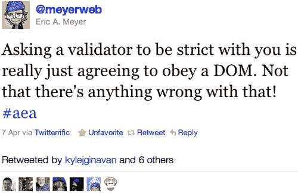
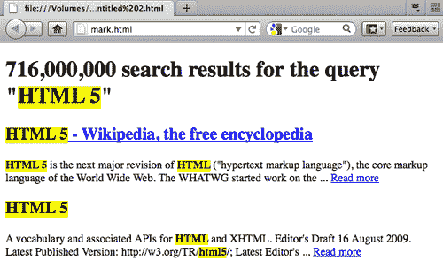
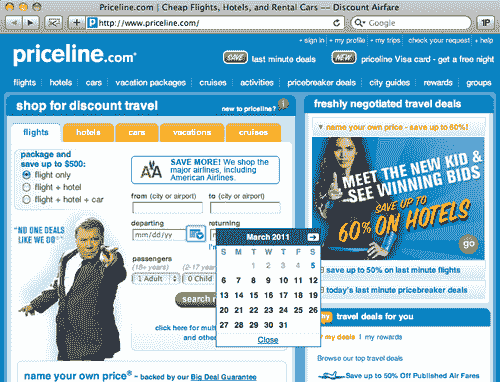
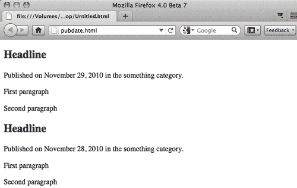
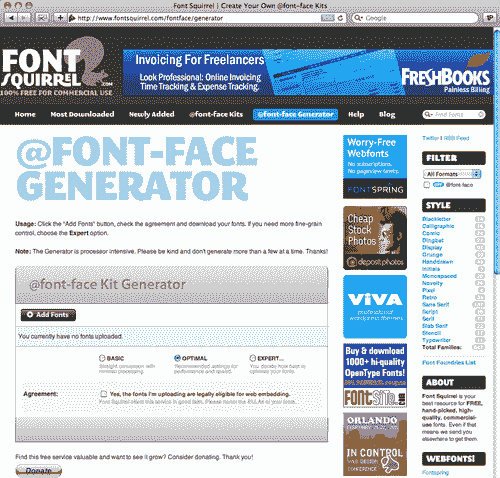
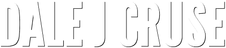
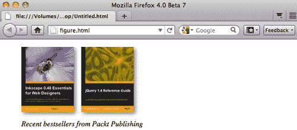

# 第二章：支持内容

在本章中，我们将涵盖：

+   构建博客`article`

+   使用`mark`元素突出显示文本

+   使用`time`元素

+   指定`article`的`pubdate`

+   使用`article`元素显示评论块

+   使用@font-face 动态添加字体

+   为字体添加阴影效果

+   将渐变效果应用于字体

+   使用`figure`标签注释视觉元素

# 介绍

> “在网络上，一个人不应该被肤色所判断，而应该被内容所判断。”-互联网迷因

HTML5 和以前所有版本的 HTML 之间最重要的区别之一是，在以前，我们构建了通用的`<div>`和其他这样的通用容器，而对其中的内容并不了解。随着 HTML5 的出现，这一切都结束了。根据规范的语义要求，我们需要知道内容是什么，这样我们才能用最合适的新元素标签来包裹它。虽然这可能意味着我们开发人员必须以不同的方式思考，但新的挑战正是我们在这里的原因。在本章中，我们将看一些例子，展示如何使用 HTML5 的新元素。

> “在冲突的情况下，考虑用户优先于作者，优先于实施者，优先于规范制定者，优先于理论纯度。”-代表团的优先级

在本章中，我们将向您展示如何使用新的`<article>`元素标记博客文章和评论，向`<article>`添加有意义的发布日期，使用新的`<mark>`元素突出显示文本，以及如何使用新的`<figure>`元素注释视觉元素。然后，我们将转向一些新的文本样式方法，如字体替换技术，以及向文本添加阴影和渐变。

# 构建博客文章

> “`<article>`元素代表文档、页面、应用程序或站点中的一个独立的组成部分，原则上是可以独立分发或重复使用的，例如在联合传播中。这可以是一个论坛帖子，一篇杂志或报纸文章，一篇博客条目，一个用户提交的评论，一个交互式小部件或小工具，或者任何其他独立的内容项。”- WHATWG 的 HTML5 草案标准-[`whatwg.org/html5`](http://whatwg.org/html5)

## 准备好了吗？

博客条目是新的`<article>`元素的完美候选者，它专为联合内容设计。

对于这个配方，让我们首先确定博客`<article>`的主要元素：通常有一个标题，以标题标签的形式，博客条目本身由几个段落和一个或多个图像组成，通常包括作者的姓名和其他相关元数据的一些信息。请注意，这是所有自包含的相关内容。

## 如何做…

我们将继续使用新的 HTML5 `<header>`和`<footer>`元素。标题，条目和元信息应该分别包含在它们自己独特的标签中，比如`<h2>`，多个`<p>`和新的`<footer>`。

让我们从一个与上一章非常相似的基础开始，并两次添加我们的新`<article>`元素：

```html
<!DOCTYPE html>
<html lang="en">
<head>
<meta charset="UTF-8">
<title>Blog Title</title>
<!--[if lt IE 9]><script src="img/html5.js"> </script>[endif]-->
<!--[if lt IE 9]><script src="img/html5.js"> </script>[endif]-->
<meta name="viewport" content="width=device-width, initial-scale=1.0">
</head>
<body>
<article>
<header>
<h2>Headline</h2>
</header>
<p>First paragraph</p>
<p>Second paragraph</p>
<footer>Meta information.</footer>
</article>
<article>
<header>
<h2>Headline</h2>
</header>
<p>First paragraph</p>
<p>Second paragraph</p>
<footer>Meta information.</footer>
</article>
</body>
</html>

```

### 让你的代码减肥？

准备好震惊了吗？想要大开眼界吗？`<html>`和`<head>`以及`<body>`标签（以及它们的闭合标签）现在在 HTML5 规范中是可选的。当然，你可以把它们留在那里，你的页面也会验证通过，但为什么我们要这样做呢？如果从以前的代码中删除它们，我们得到的是简约的：

```html
<!DOCTYPE html>
<meta charset="UTF-8">
<title>Blog Title</title>
<!--[if lt IE 9]><script src="img/html5.js"> </script>[endif]-->
<meta name="viewport" content="width=device-width, initial-scale=1.0">
<article>
<header>
<h2>Headline</h2>
</header>
<p>First paragraph</p>
<p>Second paragraph</p>
<footer>Meta information.</footer>
</article>
<article>
<header>
<h2>Headline</h2>
</header>
<p>First paragraph</p>
<p>Second paragraph</p>
<footer>Meta information.</footer>
</article>

```

不相信我？将代码通过万维网联盟的验证器运行：[`validator.w3.org`](http://validator.w3.org)，你会看到它在浏览器中正确显示。

嗯，别那么快，伙计。问题是，删除这些元素会破坏我们屏幕阅读器的代码。哦，犯了一个错误。此外，删除`<body>`标签会破坏我们为 Internet Explorer 编写的新的 HTML5 启用 JavaScript。犯了第二个错误。你猜怎么着？是的，删除`<html>`标签会删除页面的语言。这就是：犯了第三个错误。

所以让我们把这些元素加回去，好吗？

```html
<!DOCTYPE html>
<html lang="en">
<head>
<meta charset="UTF-8">
<title>Blog Title</title>
<!--[if lt IE 9]><script src="img/html5.js"> </script>[endif]-->
<meta name="viewport" content="width=device-width, initial-scale=1.0">
</head>
<body>
<article>
<header>
<h2>Headline</h2>
</header>
<p>First paragraph</p>
<p>Second paragraph</p>
<footer>Meta information.</footer>
</article>
<article>
<header>
<h2>Headline</h2>
</header>
<p>First paragraph</p>
<p>Second paragraph</p>
<footer>Meta information.</footer>
</article>
</body>
</html>

```

好了，现在好多了。

## 它是如何工作的...

记住，新的`<article>`元素是一个相关信息的集合，旨在通过 RSS 或其他方式进行合成。

## 还有更多...

更丰富，更有意义的语义可能是 HTML5 最重要的目标。这对机器更好，对作者更好，最重要的是，对我们的受众更好。

### 验证作为一种辅助手段，而不是一种支撑

正如我们之前看到的，删除`<html>`、`<head>`和`<body>`标签仍然可以呈现一个有效的页面。这就引出了验证器的有效性问题。与 XML 世界不同，HTML5 可以使用不正确的语法，但仍然可以正常呈现。

作者尽一切努力在可能的情况下验证他的代码。不必对验证器盲目追求，但这总是一个很好的质量控制检查。而且你的代码越接近有效，浏览器显示你的工作的一致性就越好。

### Eric Meyer 的有趣

作者喜欢 CSS 大师 Eric Meyer 对验证器的看法：



### 查找验证器的位置

你可以在以下地方充分利用代码验证器：

+   [`validator.nu`](http://validator.nu)

+   [`validator.w3.org`](http://validator.w3.org)

## 另请参阅

Kristina Halvorson 的书《网络内容战略》([`contentstrategy.com`](http://contentstrategy.com))自发布以来就成为了经典。在这本书中，明尼阿波利斯公司 Brain Traffic 的首席执行官 Halvorson 清晰地定义了如何为在线受众创建和传递有用和可用的内容的过程。

# 使用标记元素突出显示文本

> "`<mark>`元素代表文档中标记或突出显示的文本运行，用于参考目的，因为它在另一个上下文中具有相关性。当在引文或其他从散文中引用的文本中使用时，它表示原本不存在的突出显示，但在原始撰写该块时可能未被原始作者认为重要，但现在却受到了以前意想不到的审查。当在文档的主要散文中使用时，它表示由于其可能与用户当前活动的相关性而突出显示的文档的一部分。" - WHATWG 的 HTML5 草案标准 - [`whatwg.org/html5`](http://whatwg.org/html5)

## 准备就绪

在查看搜索结果时，你经常会发现你搜索的术语被突出显示。现在我们可以使用更有意义的`<mark>`元素，而不是依赖于语义上毫无意义的标记。

## 如何做...

在这个示例中，你会看到[HTML5doctor.com](http://HTML5doctor.com)有一个如何使用新的`<mark>`元素来突出显示搜索结果术语的优秀示例。这不仅为样式提供了有用的语义钩子，还为跟踪结果的机器提供了语义钩子。

```html
<!DOCTYPE html>
<html lang="en">
<head>
<meta charset="UTF-8">
<title></title>
<!--[if lt IE 9]><script src="img/html5.js"> </script>[endif]-->
<meta name="viewport" content="width=device-width, initial-scale=1.0">
</head>
<body>
<h1>716,000,000 search results for the query "<mark>HTML5</mark>"</h1>
<section id="search-results">
<article>
<h2><a href="http://en.wikipedia.org/wiki/HTML_5"> <mark>HTML5</mark> - Wikipedia, the free encyclopedia</a></h2>
<p><mark>HTML5</mark> is the next major revision of <mark>HTML</mark> ("hypertext markup language"), the core markup language of the World Wide Web. The WHATWG started work on the ... <a href="http://en.wikipedia.org/wiki/HTML_5"> Read more</a></p>
</article>
<article>
<h2><a href="http://dev.w3.org/html5/spec/Overview.html"> <mark>HTML5</mark></a></h2>
<p>A vocabulary and associated APIs for <mark>HTML</mark> and XHTML. Editor's Draft 16 August 2009\. Latest Published Version: http://w3.org/TR/<mark>html5</mark>/; Latest Editor's ... <a href="http://dev.w3.org/html5/spec/Overview.html"> Read more</a></p>
</article>
</section>
</body>
</html>

```

添加一个简单的样式声明，比如：

```html
<style type="text/css">
mark {background-color: yellow; font-weight: bold;}
</style>

```

在`<head>`部分帮助我们呈现这些突出显示的文本：



## 它是如何工作的...

新的`<mark>`元素只是突出显示一个词或短语以吸引读者的注意。为此，只需在相应的层叠样式表中指定`<mark>`为粗体、斜体或以某种方式突出显示。

## 还有更多...

当然，你可以标记和样式化搜索结果页面，使用`<b>`或`<i>`甚至`<span>`标签来指示搜索是为哪个术语进行的，但是这些标签只影响表现层。它们缺乏意义。新的`<mark>`元素可以实现相同的视觉效果，同时还可以为您的标记添加额外的含义。事实上，新的`<mark>`元素是非常有意义的。

### <Mark>长寿繁荣

新的`<mark>`元素的另一个很好的用途是突出显示日历选择器中的日期，正如我们经常在任何基于日期的预订系统网站上看到的[Priceline.com](http://Priceline.com)。

[Priceline.com](http://Priceline.com)在预订行程时默认突出显示当前日期。与使用语义上无意义的标签来实现这一点不同，新的`<mark>`元素可能是一个完美的选择。



### 等待浏览器

在撰写本文时，新的`<mark>`元素尚未得到任何 Web 浏览器的全面支持。尽管额外的语义含义对机器阅读者来说可能并不明显，但我们仍然可以使用新的`<mark>`元素作为样式上的“钩子”，直到有一天它的含义得到各种浏览器的全面支持。

### “未来证明”是一个词吗？

请记住，HTML5 的新元素试图为我们的标记添加额外的含义。目标绝不是剥夺含义或破坏页面。有了这个目标，我们就更容易接受像`<mark>`元素这样的新元素，尽管它还没有被浏览器完全实现。即使它的含义还没有被机器完全理解，将它添加到我们的页面中，使我们的页面尽可能“未来证明”，肯定是有益的。

## 另请参阅

2001 年，Carrie Bickner 为纽约公共图书馆的分支机构准备了“纽约公共图书馆在线样式指南”（[`legacy.www.nypl.org/styleguide`](http://legacy.www.nypl.org/styleguide)），供分支机构在更新其网站时使用。在这本开创性的出版物中，Bickner 通过将内容（标记）、表现（层叠样式表）和行为（JavaScript）分开，为 Web 标准提出了理由。该出版物在当时非常具有前瞻性，并且使用了很多年。

# 使用时间元素

> “`<time>`元素表示 24 小时制的时间，或者是普罗利普提克格里高利历的精确日期，可选的还有时间和时区偏移。”- WHATWG 的 HTML5 草案标准 - [`whatwg.org/html5`](http://whatwg.org/html5)

## 准备就绪

新的`<time>`元素是一种强大的显示时间或特定日期的方式。

## 如何做...

在这个配方中，我们将显示日期和时间，这些日期和时间对人类和机器都是可读的。让我们看看四个例子。

```html
<!DOCTYPE html>
<html lang="en">
<head>
<meta charset="UTF-8">
<title></title>
<!--[if lt IE 9]><script src=http://html5shiv.googlecode.com/svn/trunk/html5.js> </script>[endif]-->
<meta name="viewport" content="width=device-width, initial-scale=1.0">
</head>
<body>
<article>
<header>
<h2>Headline</h2>
<time datetime="2010-11-29">November 29, 2010</time>
</header>
<p>First paragraph</p>
<p>Second paragraph</p>
<footer>Meta information.</footer>
</article>
<article>
<header>
<h2>Headline</h2>
<time datetime="2010-11-29">Nov. 29</time>
</header>
<p>First paragraph</p>
<p>Second paragraph</p>
<footer>Meta information.</footer>
</article>
<article>
<header>
<h2>Headline</h2>
<time datetime="2010-11-29">the date this was written</time>
</header>
<p>First paragraph</p>
<p>Second paragraph</p>
<footer>Meta information.</footer>
</article>
<article>
<header>
<h2>Headline</h2>
<time datetime="2010-11-29T11:34">the date and time this was written</time>
</header>
<p>First paragraph</p>
<p>Second paragraph</p>
<footer>Meta information.</footer>
</article>
</body>
</html>

```

## 它是如何工作的...

我们可以使用新的`<time>`元素来指示特定的日期、时间或两者。

## 还有更多...

新的`<time>`元素指定了一个确切的时间点，而不是一个时间段。

### 奇怪的规则

新的`<time>`元素的一个有趣之处是，你不能使用公元前的日期。你也不能使用像“2010 年 11 月”这样的日期。我们指定的日期必须是一个正的、具体的日期，而不是一个相对的日期。HTML5 工作组继续解决这一看似武断的限制。

### <time>的时间将会到来

浏览器显示新的`<time>`元素，但目前并没有特殊处理。

### 永远记住 SEO

时间。我们为什么如此着迷？在网络上关注时间和日期的一个非常合理的原因是搜索引擎优化。SEO 曾经被视为一种只有黑帽巫师才能理解的神秘巫术，现在已经成为每个人在网上的责任。你花时间编写良好的代码，期望作家创作值得阅读的内容。现在再进一步，确保你的目标受众实际上能够找到你花时间创建的内容。新的`<time>`元素只是搜索引擎吸引注意力到最新内容的方式之一。

## 另请参阅

新的 HTML5 `<time>`元素是微格式运动的一个可能的补充。微格式承诺为我们的标记添加额外的语义含义。虽然它还没有正式成为标准，但微格式正在逐渐获得 Web 开发社区的认可。在[Microformats.org](http://Microformats.org)了解更多。

# 指定文章的发布日期

> "`pubdate`属性是一个布尔属性。如果指定了，它表示元素给出的日期和时间是最近祖先`<article>`元素的发布日期和时间，或者，如果元素没有祖先`<article>`元素，则是整个文档的发布日期和时间。" - WHATWG 的 HTML5 草案标准 - [`whatwg.org/html5`](http://whatwg.org/html5)

## 准备工作

新的`pubdate`是当它存在于新的`<article>`元素中的新`<time>`元素的属性。它使我们在呈现发布日期的日期和时间时更加精确。

## 如何做...

在这个教程中，我们将在上一个教程中介绍的新`<time>`元素的基础上，添加新的可选的`pubdate`属性来显示我们的发布日期。

```html
<!DOCTYPE html>
<html lang="en">
<head>
<meta charset="UTF-8">
<title></title>
<!--[if lt IE 9]><script src=http://html5shiv.googlecode.com/svn/trunk/html5.js> </script>[endif]-->
<meta name="viewport" content="width=device-width, initial-scale=1.0">
</head>
<body>
<article>
<header>
<h2>Headline</h2>
<p>Published on <time datetime="2010-11-29" pubdate> November 29, 2010</time> in the something category.</p>
</header>
<p>First paragraph</p>
<p>Second paragraph</p>
<footer></footer>
</article>
<article>
<header>
<h2>Headline</h2>
<p>Published on <time datetime="2010-11-28" pubdate> November 28, 2010</time> in the something category.</p>
</header>
<p>First paragraph</p>
<p>Second paragraph</p>
<footer></footer>
</article>
</body>
</html>

```

## 它是如何工作的...

`Pubdate`只是一个二进制变量，或布尔属性，用于表示某事的发布时间。

## 还有更多...

你可以认为`pubdate`是为已经提供额外信息的元素`(<time>)`添加额外信息。这就像在圣代上加樱桃一样。谁不喜欢在圣代上加樱桃呢？

### 仍在等待浏览器

通过包括新元素`<mark>, <time>`和`pubdate`，我们正在变得非常具有前瞻性，因为目前没有任何浏览器完全支持它们 - *但是*。



像 Firefox 这样的现代浏览器可以原生地显示新的`<time>`元素和`pubdate`属性，无需样式。

### 额外学分

如果您想符合 XML 语法，可以将新的`pubdate`布尔属性编码为`<time datetime="2010-11-29" pubdate="pubdate">`。

### 让我们结束混乱

尽管 HTML5 仍然很新，但对于新的`pubdate`布尔属性已经存在一些混淆。有些人认为它应该根据您的计算机时钟或服务器生成发布日期。这不是它的作用。它的作用是生成一个机器可读的发布日期，无论您在其后放置什么文本，都是有用的。

## 另请参阅

Tantek Celik 在[`favelets.com`](http://favelets.com)创建了一个非常有用的网站，其中包含各种"书签"或浏览器 JavaScript 命令。使用这些命令可以在同一个窗口中验证 HTML5、CSS 和锚点等。非常有帮助！

# 使用文章元素显示评论块

> "`<article>`元素代表文档、页面、应用程序或站点中的独立组成部分，原则上是可以独立分发或重复使用的，例如在联合传播中。这可以是论坛帖子、杂志或报纸文章、博客条目、用户提交的评论、交互式小部件或小工具，或任何其他独立的内容项。" - WHATWG 的 HTML5 草案标准 - [`whatwg.org/html5`](http://whatwg.org/html5)

## 准备工作

我们当然可以提出使用新的`<article>`元素来标记博客评论的理由。在这个教程中，我们将做到这一点。

## 如何做...

让我们使用新的`<article>`元素来标记一块博客评论。

```html
<!DOCTYPE html>
<html lang="en">
<head>
<meta charset="UTF-8">
<title></title>
<!--[if lt IE 9]><script src=http://html5shiv.googlecode.com/svn/trunk/html5.js> </script>[endif]-->
<meta name="viewport" content="width=device-width, initial-scale=1.0">
</head>
<body>
<article>
<header>
<h3>Comment by: <a href="http://dalejcruse.com">Dale J Cruse</a></h3>
<p>On <time datetime="2010-11-29">November 29, 2010</time></p>
</header>
<p>The is the first paragraph of my comment</p>
<p>The is the second paragraph of my comment</p>
<footer>
<p><small>Creative Commons Attribution-ShareAlike License</small></p>
</footer>
</article>
<article>
<header>
<article element> usedsteps<h3>Comment by: <a href="http://dalejcruse.com">Dale J Cruse</a></h3>
<p>On <time datetime="2010-11-29">November 29, 2010</time></p>
</header>
<p>The is the first paragraph of my comment</p>
<p>The is the second paragraph of my comment</p>
<footer>
<p><small>Creative Commons Attribution-ShareAlike License</small></p>
</footer>
</article>
</body>
</html>

```

## 它是如何工作的...

"等一下，"你在想。"博客评论不是一个`<article>`!"你大声说。别那么快，伙计。如果我们分析一下博客评论的组成部分，我们会发现与其他`<article>`相同的元素。

## 还有更多...

顺便说一下，让我们看看上一个`<footer>`中的新`<small>`元素。以前，`<small>`是一个表示物理上小的文本的表现元素。不再了！现在`<small>`已经重新定义为这样使用：

> “`<small>`元素代表所谓的‘小字体’，如法律声明和警告。”- WHATWG 的 HTML5 草案标准 - [`whatwg.org/html5`](http://whatwg.org/html5)

### 博客评论

由于博客评论及其评论源可能用于合成，更有理由使用新的`<article>`元素。

### 值得注意的评论

评论。它们几乎在任何值得一读的博客中都能找到。无论是我们创建自己的网站还是自己的博客内容管理系统，我们都应该像对待博客文章本身一样细心对待评论的代码。

### 机会在你手中

[Disqus.com](http://Disqus.com)是最广泛使用的博客评论插件的在线主页。发布者可以轻松地将其整合到他们的网站中，而无需太多的编程工作。那么这对我们意味着什么呢？无论你使用 Disqus 还是其他任何评论系统，总得有人开发那段代码，对吧？那么最好是你自己！

## 参见

Josh Duck 在[`joshduck.com/periodic-table.html`](http://joshduck.com/periodic-table.html)创建了聪明而有用的 HTML5 元素周期表。在那里，Josh 巧妙地将类似的新元素分成了根元素、文本级语义、文档部分等类别！

# 使用@font-face 动态添加字体

不久以前，我们设计师和开发人员只能在文本中使用少数“网页安全”字体。如果我们想要在一个不被认为“安全”的字体中显示文本，我们就把它做成了图片。这很愚蠢，但我们别无选择。现在我们有了选择。字体终于在网页上得到了解放。

良好的排版对于任何设计都是必不可少的，而新的@font-face 功能让我们嵌入字体供浏览器使用。虽然技术上不属于 HTML5 的一部分，但这个 CSS3 属性太重要了，不容忽视。

## 准备工作

对于这个配方，让我们找一个有趣的字体，并将其嵌入为一个简单的标志。下面你会找到一些链接，可以找到用于网页的免费和付费字体的几个很棒的网站。在这个例子中，让我们看看作者个人作品集的以前版本，网址是[`dalejcruse.com`](http://dalejcruse.com)。

## 如何做...

在网页上显示自定义字体的方法有几种，但我们将研究并使用一种能够在现代、传统甚至移动浏览器中运行的可靠方法。

让我们去@Font-Face Generator 的网址[`fontsquirrel.com/fontface/generator`](http://fontsquirrel.com/fontface/generator)。



使用@font-face Kit Generator 向我们展示了上传字体（这里是“League Gothic”）并确保你使用的字体在法律上被授权使用的过程。

上传后，生成器将把你的字体转换为多种文件格式。下载所有这些文件，并保存到你想要显示它们的服务器上。只需要两个样式：

1.  引用@font-face 文件

1.  将新字体分配给我们想要使用的元素。

```html
<!DOCTYPE html>
<html lang="en">
<head>
<meta charset="UTF-8">
<title></title>
<!--[if lt IE 9]><script src=http://html5shiv.googlecode.com/svn/trunk/html5.js> </script>[endif]-->
<meta name="viewport" content="width=device-width, initial-scale=1.0">
<style>
@font-face {font-family: 'LeagueGothic'; src: url('fonts/league_gothic-webfont.eot'); src: local(''), url('fonts/league_gothic-webfont.woff') format('woff'), url('fonts/league_gothic-webfont.ttf') format('truetype'), url('fonts/league_gothic-webfont.svg#webfontdrbhz05x') format('svg');
h1 {font-family: 'LeagueGothic'; font-size: 124px; line-height: 124px; margin: 355px 0 -25px 0; text-transform: uppercase;}
</style>
</head>
<body>
<h1>Dale J Cruse</h1>
</body>
</html>

```


然后炸药爆炸了。

## 它是如何工作的...

新的@font-face 功能允许我们在网页服务器上保存各种格式的字体文件，并使用 CSS 来引用它们进行显示。这样，字体文件就成为了另一个资产，就像图片一样。

## 还有更多...

浏览器在网页上显示时使用自己的专有字体文件。通过下载和引用每种可能的格式，我们确保现代浏览器如 Firefox、Chrome 和 Safari，以及传统浏览器如 Internet Explorer 甚至移动浏览器都能显示我们想要的字体。

### 不要偷

确保你使用的字体已经在网上显示上被合法授权使用。偷东西不酷。

### Firefox 注意

记得将你想要使用的字体存储在与你的唯一域名相同的服务器上。一些浏览器（我在说你，Firefox）不喜欢当你尝试跨域引用字体时。

### Paul Irish 很棒

为了给予应有的赞扬，我们用来调用各种本地存储的字体文件的 CSS 方法是由 Paul Irish 在他的帖子“Bulletproof @font-face Implementation Syntax”中开发的：[`paulirish.com/2009/bulletproof-font-face-implementation-syntax`](http://paulirish.com/2009/bulletproof-font-face-implementation-syntax)。

## 另请参阅

有一些很棒的来源可以在网上找到免费和付费字体，包括：

+   Fontdeck - [`fontdeck.com`](http://fontdeck.com)

+   Kernest - [`kernest.com`](http://kernest.com)

+   The League of Moveable Type - [`theleagueofmoveabletype.com`](http://theleagueofmoveabletype.com)

+   Typekit - [`typekit.com`](http://typekit.com)

+   Typotheque - [`typotheque.com/fonts`](http://typotheque.com/fonts)

+   Web Fonts - [`webfonts.fonts.com`](http://webfonts.fonts.com)

+   Webfonts.info - [`webfonts.info`](http://webfonts.info)

+   Webtype - [`webtype.com`](http://webtype.com)

# 添加下拉阴影效果到字体

曾经，似乎网络设计师和开发人员给每个视觉元素都添加了下拉阴影。几乎就像他们是按下拉阴影付费一样。幸运的是，那个时代已经过去了。今天，只有最时尚的设计师和开发人员知道如何非常节制地添加下拉阴影。让我们看看如何只使用 CSS 来做到这一点。

## 准备工作

要开始，让我们使用之前的例子，并简单地为作者的作品集网站[`dalejcruse.com`](http://dalejcruse.com)中的标题字体添加一个非常微妙的下拉阴影。

## 如何做...

在这个示例中，我们将使用一些小心的样式来为我们的一些文本添加一个别致的下拉阴影效果。

```html
<!DOCTYPE html>
<html lang="en">
<head>
<meta charset="UTF-8">
<title></title>
<!--[if lt IE 9]><script
src=http://html5shiv.googlecode.com/svn/trunk/html5.js>
</script>[endif]-->
<meta name="viewport" content="width=device-width,
initial-scale=1.0">
<style>
@font-face {
font-family: 'LeagueGothic';
src: url('fonts/league_gothic-webfont.eot');
src: local(''), url('fonts/league_gothic-webfont.woff')
format('woff'), url('fonts/league_gothic-webfont.ttf')
format('truetype'), url('fonts/league_gothic-
webfont.svg#webfontdrbhz05x') format('svg');
}
h1 {font-family: 'LeagueGothic'; font-size: 124px;
line-height: 124px; margin: 355px 0 -25px 0;
text-transform: uppercase; text-shadow: black 1px 1px 0;}
</style>
</head>
<body>
<h1>Dale J Cruse</h1>
</body>
</html>

```

## 它是如何运作的...

text-shadow CSS 属性在现代浏览器中显示一个微妙的黑色下拉阴影，向右移动一个像素，向下移动一个像素。虽然在作者的作品集网站上非常微妙，但如果我们将背景和字体颜色都设置为白色，效果会更加明显。

当背景和文本颜色都设置为白色时，我们在这里看到的只是向右移动一个像素，向下移动一个像素的黑色下拉阴影。由于 IE 不支持 text-shadow，这在该浏览器中将呈现为纯白色。这可能不是你想要的。



## 还有更多...

除了像“black”这样的绝对颜色值，我们还可以使用十六进制值如“#000”甚至带有半透明 alpha 通道的 RGBA 值。

### 浏览器支持

现代浏览器如 Chrome 2+，Firefox 3.1+，Opera 9.5+和 Safari 1.1+都支持 text-shadow CSS 属性。这首歌现在已经很老了，但可以说 Internet Explorer 不支持它。

### 伟大的力量...

尽管只使用 CSS 就能够给文本添加下拉阴影的能力存在，但不要认为这是一种滥用的许可。我们不想回到下拉阴影无处不在的丑陋网络时代。相反，要善用你的力量。

### 致所有读者的呼吁

为了易读起见，考虑只将下拉阴影效果应用于标题或页眉字体。将其应用于正文变得乏味和难以阅读。你不想成为滥用和再次杀死下拉阴影的人。

## 另请参阅

Google 发布了 WebFont Loader 开源 JavaScript 库，以更好地控制浏览器加载网络字体的方式。查看超简单的实现方法：[`code.google.com/apis/webfonts/docs/webfont_loader.html`](http://code.google.com/apis/webfonts/docs/webfont_loader.html)。

# 将渐变效果应用于字体

让我们拿我们之前的例子，并为它添加一个更多的层次：一个微妙的渐变效果。

## 准备工作

我们唯一需要的额外东西是一个便携式网络图形图像，我们可以通过 CSS 引用。

## 如何做...

在这个示例中，我们将添加一个带有 alpha 透明度的.png 图像文件，以在我们的标题上创建一个时髦的渐变效果。

```html
<!DOCTYPE html>
<html lang="en">
<head>
<meta charset="UTF-8">
<title></title>
<!--[if lt IE 9]><script src=http://html5shiv.googlecode.com/svn/trunk/html5.js> </script>[endif]-->
<meta name="viewport" content="width=device-width, initial-scale=1.0">
<style>
@font-face {font-family: 'LeagueGothic'; src: url('fonts/league_gothic-webfont.eot'); src: local(''), url('fonts/league_gothic-webfont.woff') format('woff'), url('fonts/league_gothic-webfont.ttf') format('truetype'), url('fonts/league_gothic-webfont.svg#webfontdrbhz05x') format('svg');
}
h1 {font-family: 'LeagueGothic'; font-size: 124px; line-height: 124px; margin: 355px 0 -25px 0; text-transform: uppercase; text-shadow: black 1px 1px 0; position: relative;}
h1 span {background: url(gradient.png) repeat-x; display: block; height: 124px; position: absolute; width: 100%;}
</style>
</head>
<body>
<h1><span></span>Dale J Cruse</h1>
</body>
</html>

```

注意我们的`<h1>`标签中有额外的`<span>`。那是我们放置图片的地方。

## 它是如何工作的...

通过简单地在文本上叠加一些透明度的图像，我们已经微妙地改变了文本，使其看起来具有渐变效果。

## 还有更多...

你的想象力是这种效果的唯一限制。您可以创建淡入淡出效果、金属效果、垂直或水平条纹，甚至斑马条纹！

### 提示

**小心**

请记住：仅仅因为你可以，不意味着你应该。请谨慎使用文本渐变。谢谢。

## 另请参阅

要查看一个关于字体渐变效果的美丽示例，请访问 Alex Clarke 关于土卫六的一个项目的标题，该项目位于：[`hagablog.co.uk/demos/enceladus/index.html`](http://hagablog.co.uk/demos/enceladus/index.html)。当您欣赏视觉设计时，不要忘记查看源代码，看看 Alex 非常详细记录的 HTML5 代码。

# 使用`figure`和`figcaption`标签注释视觉元素

> “`<figure>`元素表示一些流内容，可选地带有标题，它是自包含的，通常作为文档主要流中的单个单元引用。该元素因此可用于注释插图、图表、照片、代码清单等，这些内容是从文档的主要内容中引用的，但是，这些内容可以在不影响文档流的情况下，从主要内容中移开，例如移到页面的一侧、专门的页面或附录。”- WHATWG 的 HTML5 草案标准 - [`whatwg.org/html5`](http://whatwg.org/html5)
> 
> “元素的第一个`<figcaption>`子元素（如果有的话）代表`<figure>`元素内容的标题。如果没有子`<figcaption>`元素，则没有标题。”- WHATWG 的 HTML5 草案标准 - [`whatwg.org/html5`](http://whatwg.org/html5)

## 准备工作

你已经看过无数次了：一张图片下面带有某种文本标题。通常它在页面的一侧。以前，我们只是将其标记为一张图片，下面带有某种文本容器。现在，我们有了更富语义的新`<figure>`元素来处理它。让我们看看它是如何工作的。

## 如何做...

有两种方法可以实现这个配方：

1.  没有标题

1.  带标题

首先让我们尝试没有标题的情况：

```html
<!DOCTYPE html>
<html lang="en">
<head>
<meta charset="UTF-8">
<title></title>
<!--[if lt IE 9]><script src=http://html5shiv.googlecode.com/svn/trunk/html5.js> </script>[endif]-->
<meta name="viewport" content="width=device-width, initial-scale=1.0">
</head>
<body>
<figure>

</figure>
</body>
</html>

```

现在让我们添加那个标题：

```html
<!DOCTYPE html>
<html lang="en">
<head>
<meta charset="UTF-8">
<title></title>
<!--[if lt IE 9]><script src=http://html5shiv.googlecode.com/svn/trunk/html5.js>
</script>[endif]-->
<meta name="viewport" content="width=device-width, initial-scale=1.0">
</head>
<body>
<figure>

<figcaption>Inkscape 0.48 for Web Designers</figcaption>
</figure>
</body>
</html>

```

为多个图像添加一个标题也很容易。注意多个`img`标签和只有一个`<figcaption>`。

```html
<!DOCTYPE html>
<html lang="en">
<head>
<meta charset="UTF-8">
<title></title>
<!--[if lt IE 9]><script src=http://html5shiv.googlecode.com/svn/trunk/html5.js> </script>[endif]-->
<meta name="viewport" content="width=device-width, initial-scale=1.0">
</head>
<body>
<figure> elementvisual elements, annotating<figure>


<figcaption>Recent bestsellers from Packt Publishing</figcaption>
</figure>
</body>
</html>

```

## 它是如何工作的...

稍微调整样式，使`<figcaption>`显示在新的`<figure>`元素中的这些图像下方。



## 还有更多...

请记住，新的`<figure>`元素用于内联内容，您希望将其显示在相应的主要文本旁边。

### 分组很好

新的`<figure>`元素可以包含文本、图像、音频、视频、插图、图表、代码清单以及除了主要内容之外几乎任何其他值得被分组在一起的东西。

### 语义也很有价值

内联内容与标题在书籍、报纸和杂志中经常出现。自从网络的早期时代以来，我们就能够做同样的事情，但现在新的`<figure>`元素给了我们一个更语义化的“钩子”来进行样式设置，而不是诉诸于类名。

### `<figure>`与`<aside>`

那么`<figure>`和`<aside>`之间有什么区别呢？我们应该使用新的`<figure>`元素来放置位置不重要的基本内容。然而，新的`<aside>`元素是用于相关但不是必要的内容。我们在挑刺吗？也许。但你是那种对细节苛求的网页开发者，对吧？

## 另请参阅

有关 HTML5 与所有以前版本的 HTML 有何不同的更详细描述，请参阅维基百科条目：[`en.wikipedia.org/wiki/HTML5`](http://en.wikipedia.org/wiki/HTML5)。
