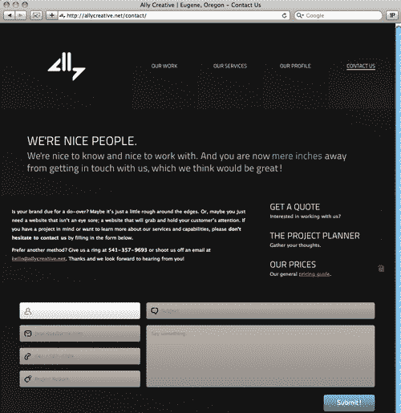
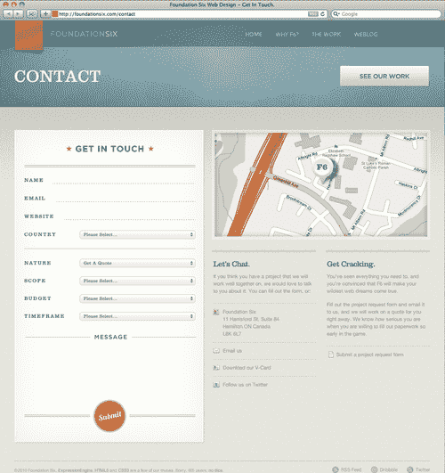
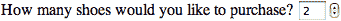

# 第五章：学会爱上表单

在本章中，我们将涵盖：

+   显示占位符文本

+   向表单字段添加自动对焦

+   使用 HTML5 和 CSS3 样式化表单

+   使用电子邮件输入类型

+   使用 URL 输入类型添加 URL

+   使用数字标签

+   使用范围标签

+   创建搜索字段

+   创建一个选择器来显示日期和时间

# 介绍

> “我们已经遇到了敌人，他就是我们自己。”-波戈

无聊。乏味。无聊。为什么当在线交互表单呈现给网络用户时，他们的眼睛会变得无神和心智麻木？这位作者认为问题至少部分在于安排表单字段的信息架构师，以及在较小程度上编码它的前端开发人员。

诚然，表单并不性感。但是如果你是一个网页开发人员（如果你正在阅读这篇文章，很可能你是），那么你的职业生涯中某个时刻很可能被要求标记和样式化某种形式的表单。如果你厌恶编写那个表单，想象一下你在用户中创造的恐惧程度。现在结束了。

你已经成熟，并寻求值得这种成熟的新挑战。如果我们能停止担心并学会爱上表单，那么我们的观众实际上也更有可能喜欢它们。

在本章中，我们将看一些 HTML5 用于交互式表单的实际示例，包括显示占位符文本，向表单字段添加自动对焦，使用 HTML5 和 CSS3 样式化表单，使用电子邮件输入类型，使用 URL 输入类型添加 URL，使用数字标签，使用范围标签，创建搜索字段，以及创建一个选择器来显示日期和时间。

现在让我们开始吧！

# 显示占位符文本

我们要检查的第一个新的 HTML5 表单功能是本地显示占位符文本的能力。

## 如何做...

我们都曾使用过 - 甚至创建过 - 表单占位符文本。但现在有了 HTML5，我们将以稍有不同和更高效的方式来做。Packt Publishing 网站具有搜索整个网站或仅搜索书籍/电子书的功能。

！如何做...

一旦用户点击这两个表单字段中的一个，占位符文本就会消失。

！如何做...

这是通过使用值属性来显示占位符文本的传统方法：

```html
<form action='/search'>
<div id="search-site">
<input type="text" class="form-text" name='keys' value="Search entire site" onclick='clearIf(this, "Search entire site")'/>
</div>
<div id="search-button-site">
<input type="image" src="img/search- button.png">
</div>
</form>
<form action='/books'>
<div id="search-books">
<input type="text" class="form-text" name='keys' value="Search only books/eBooks" onclick='clearIf(this, "Search only books/eBooks")'/>
</div>
<div id="search-button-books">
<input type="image" src="img/search- button.png">
</div>
</form>

```

使用`placeholder`属性而不是`value`的结果是：

```html
<form action='/search'>
<div id="search-site">
<input type="text" class="form-text" name='keys' placeholder="Search entire site" onclick='clearIf(this, "Search entire site")'/>
</div>
<div id="search-button-site">
<input type="image" src="img/search- button.png">
</div>
</form>
<form action='/books'>
<div id="search-books">
<input type="text" class="form-text" name='keys' placeholder="Search only books/eBooks" onclick='clearIf(this, "Search only books/eBooks")'/>
</div>
<div id="search-button-books">
<input type="image" src="img/search- button.png">
</div>
</form>

```

## 它是如何工作的...

`placeholder`属性可以取代`value`属性在表单中显示占位符文本。在这种情况下，开发人员添加了一个`onclick`事件处理程序来适应旧的浏览器。这是另一个例子，优秀的语义增加了标签的额外含义。

## 还有更多...

记住 - 并计划 - 当用户点击每个表单字段时，占位符文本本身将消失。如果用户在不填写表单字段的情况下点击离开，`placeholder`将重新出现。

### 仅文本

`placeholder`属性只能包含文本。我们不能在其中包含其他标记、图像或任何其他元素。 

### 拥抱斜体

默认情况下，占位符文本将以斜体显示。不幸的是，没有好的方法可以更改这一点。与其对着墙撞头，不如事先知道这一点，并说服你的设计师，文本*应该*是斜体，并让他专注于真正重要的事情。

### 浏览器支持

支持新的`placeholder`属性的 Web 浏览器。

！浏览器支持

## 另请参阅

Build Guild 是全国网页人员的每月聚会。使用 HTML5（并使用占位符属性！）在[`buildguild.org`](http://buildguild.org)建立，开发人员可以每隔几周聚在一起喝酒聊天。已经在城市建立了本地分会，例如：德克萨斯州阿比林；纽约州奥尔巴尼；蒙大拿州比灵斯；密歇根州大急流城；康涅狄格州哈特福德；肯塔基州路易斯维尔；威斯康星州密尔沃基；纽约市；宾夕法尼亚州费城；宾夕法尼亚州匹兹堡；密苏里州圣路易斯；马萨诸塞州塞勒姆。

如果您所在地区还没有 Build Guild，请创建一个！联系[`buildguild.org`](http://buildguild.org)的网站所有者开始！胡子是可选的。

# 向表单字段添加自动对焦

过去，我们不得不依赖 JavaScript 来为特定的表单字段添加输入焦点，但现在不再需要了！现在我们可以在 HTML5 中本地实现它的能力！

## 如何做...

Ally Creative 在[`allycreative.net/contact`](http://allycreative.net/contact)有效地使用了他们联系表单中的`autofocus`能力。



## 它是如何工作的...

他们是这样做的：

```html
<form action="" method="post">
<ol id="left">
<li>
<label for="contact-name" class="label-fade">Jane Doe of ACME Corporation</label>
<input type="text" id="contact-name" name="contact-name" title="Name / Business" autofocus /></li>
<li>
<label for="contact-mail" class="label- fade">jane.doe@acme.com</label>
<input type="text" id="contact-mail" name="contact-mail" title="E-mail Addy" /></li>
<li>
<label for="contact-phone" class="label-fade">541 / 567- 5309</label>
<input type="text" id="contact-phone" name="contact-phone" title="Phone Number" /></li>
<li>
<label for="contact-budget" class="label-fade">Project Budget</label>
<input type="text" id="contact-budget" name="contact-budget" title="Budget" /></li>
<li><input type="hidden" id="contact-human" name="contact-human" title="Human" /></li>
</ol>
<ol id="right">
<li>
<label for="contact-subject" class="label-fade">Subject</label>
<input type="text" id="contact-subject" name="contact-subject" title="Budget" /></li>
<li>
<label for="contact-body" id="textarea-label" class="label- fade">Say something.</label>
<textarea id="contact-body" name="contact-body" title="Contact Copy"></textarea></li>
<li class="f-right"><span id="required"></span> <input type="image" src="img/button.png" id="submit-button" alt="Submit!" /></li>
</ol>
</form>

```

通过将`autofocus`属性应用于联系人姓名的表单字段，并添加适当的样式来更改背景颜色，Ally Creative 的开发人员创建了一个流畅、互动的表单，用户可以轻松完成。

## 还有更多...

新的 HTML5 `autofocus`属性旨在适用于所有表单控件。因此，无论您是收集用户的姓名、地址、电话号码还是其他数据，都可以聪明地使用`autofocus`的能力！

### 每页一个

请记住，每页只能设置一个表单字段为`autofocus`。

### 旧版浏览器

一会儿，您将看到目前只有两个现代浏览器支持`autofocus`。幸运的是，旧版浏览器只是忽略这个属性。考虑到像`autofocus`这样的工具可以丰富那些能够看到它的用户体验，而不会损害或降低那些使用较差浏览器的用户体验。无害，无犯。

### 浏览器支持

支持新的`autofocus`属性的 Web 浏览器：


## 另请参阅

Mozilla 的“HTML5 的人”视频系列展示了 HTML5 运动的许多领军人物。Remy Sharpe，我们在其他地方检查和使用的“HTML5 *Shim*”的作者，是一位 JavaScript 工匠。当他描述新的 HTML5 规范的最喜欢的方面时，这应该不足为奇：

“对我来说，HTML5 最令人兴奋的方面是 JavaScript API 的深度。向 Joe Bloggs 解释这个新规范的 HTML 实际上并不是大部分 HTML，而是大部分 JavaScript 是相当棘手的。”

阅读并观看完整的采访：[`hacks.mozilla.org/2011/01/people-of-html5-remy-sharp`](http://hacks.mozilla.org/2011/01/people-of-html5-remy-sharp)。

# 使用 HTML5 和 CSS3 样式表单

作者见过的使用 HTML5 和 CSS3 制作表单的最简单但最美丽的例子之一是总部位于加拿大的 FoundationSix 在：[`foundationsix.com/contact`](http://foundationsix.com/contact)。他们是这样做的。



## 如何做...

FoundationSix 团队从一个相当简单的联系表单标记开始。请注意，出于空间考虑，这个示例中省略了冗长的国家下拉列表。

## 它是如何工作的...

```html
<form id="contactf6" method="post" action="http://foundationsix.com/index.php" enctype="multipart/form-data" >
<fieldset id="contactinfo">
<ul>
<li>
<label for="name">Name</label>
<input id="name" name="name" type="text" class="required">
</li>
<li>
<label for="email">Email</label>
<input id="email" name="email" type="text" class="required email">
</li>
<li>
<label for="website">Website</label>
<input id="website" name="website" type="text" class="required">
</li>
<li>
<label for="country">Country</label>
<select id="country" name="country" class="selectors">
<option selected value="">Please Select...</option>
</select>
</li>
</ul>
</fieldset>
<fieldset id="natureinfo">
<ul>
<li class="selectli">
<label for="nature">Nature</label>
<select id="nature" name="nature" class="selectors">
<option selected value="Get A Quote">Get A Quote</option>
<option value="Get More Info">Get More Info</option>
<option value="Say Hello">Say Hello</option>
</select>
</li>
<li class="selectli showmore">
<label for="scope">Scope</label>
<select id="scope" name="scope" class="selectors">
<option selected value="">Please Select...</option>
<option value="Complete Website Design">Complete Website Design</option>
<option value="Design Only">Design Only</option>
<option value="Coding Only">HTML / CSS Coding Only</option>
<option value="Other">Other</option>
</select>
</li>
<li class="selectli showmore">
<label for="budget">Budget</label>
<select id="budget" name="budget" class="selectors">
<option selected value="">Please Select...</option>
<option value="$2,500-$5,000">$2,500-$5,000</option>
<option value="$5,000-$7,500">$5,000-$7,500</option>
<option value="$7,500-$10,000">$7,500-$10,000</option>
<option value="$10,000-$15,000">$10,000-$15,000</option>
<option value="$15,000-$20,000">$15,000-$20,000</option>
<option value="$20,000-$50,000">$20,000-$50,000</option>
<option value="$50,000+">$50,000+</option>
</select>
</li>
<li class="selectli showmore">
<label for="timeframe">Timeframe</label>
<select id="timeframe" name="timeframe" class="selectors">
<option selected value="">Please Select...</option>
<option value="Right Away">Right Away</option>
<option value="Within 1 Month">Within 1 Month</option>
<option value="Within 2 Months">Within 2 Months</option>
<option value="Within 3 Months">Within 3 Months</option>
<option value="Within 6 Months">Within 6 Months</option>
<option value="Don't Know Yet">Don't Know Yet</option>
</select>
</li>
</ul>
</fieldset>
<fieldset id="message">
<ul>
<li>
<label for="messagetext">Message</label>
<textarea id="messagetext" name="message"></textarea>
</li>
</ul>
</fieldset>
<div id="submitbutton"><input type="submit" name="submit"></div>
</form>

```

团队为这个联系页面提供了一个特殊的样式表。请注意它是多么干净，只定义了必要的值，而省略了任何多余的东西。

```html
html {
background: url(../img/sitebg.jpg) repeat; -webkit-font-smoothing: antialiased;
}
body {
color: #8a8a8a; font: 13px/19px "Helvetica Neue", Arial, Helvetica, Geneva, sans-serif; background: url(../img/subbg.jpg) repeat-x;
}
#contactform {
float: left; width: 498px; margin-bottom: 40px;
}
#formtop {
height: 97px; width: 498px; background: url(../img/formtop.png) no-repeat;
}
#formtop h1 {
text-indent: -9999px; width: 445px; height: 57px; margin: 0 auto; background: url(../img/formheader.png) no-repeat; position: relative; top: 39px;
}
#formcontent {
background-image: url(../img/formrepeat.png); width: 498px; background-position: 1px;
}
form {
width: 445px; margin: 0 auto;
}
form label {
font: 13px "ClarendonRoman", Georgia, Times, serif; color: #525250; letter-spacing: 2px; text-transform: uppercase; float: left; position: relative; top: 4px;
}
form label.error {
text-transform: none; letter-spacing: 0; color: #a21714; font: 15px "SeanRegular", Courier New, Courier New, Courier6, monospace; margin-top: -10px; clear: both; padding: 0px 0px 10px 21px; background: url(../img/errow.png) no-repeat 0 0;
}
form ul {
padding-top: 10px;
}
form ul li {
padding-top: 10px; clear: both; overflow: hidden;
}
form ul li.selectli {
padding-bottom: 10px;
}
form select, form input {
float: right;
}
form input {
border-bottom: 1px dashed #989895; border-right: none; border-left: none; border-top: none; color: #4f4f4f; background: none; outline: none; position: relative; bottom: 13px; font: 16px "SeanRegular", Courier New, Courier New, Courier6, monospace; letter-spacing: 1px;
}
form input:focus {
border-bottom: 1px dashed #000; -webkit-transition:border 0.3s ease-in; -moz-transition:border 0.3s ease-in; -o-transition:border 0.3s ease-in; transition:border 0.3s ease-in;
}
form select {
width: 300px;
}
input#name {
width: 370px;
}
input#email {
width: 360px;
}
input#website {
width: 340px;
}
fieldset#contactinfo {
padding-bottom: 23px; border-bottom: 1px solid #a7a7a4;
}
fieldset#natureinfo {
margin-top: 4px;
}
fieldset#message {
background: url(../img/messagebar.png) top no-repeat; width: 445; margin-top: 25px;
background: url(../img/messagebar.png) top no-repeat; width: 445; margin-top: 25px;
}
fieldset#message label {
display: none;
}
textarea#messagetext {
margin-top: 4px; width: 445px; height: 150px; border: none; background: none; outline: none; resize: none; overflow: auto; color: #4f4f4f; font: 16px "SeanRegular", Courier New, Courier New, Courier6, monospace; letter-spacing: 1px; float: left; display: block;
}
#submitbutton {
float: right;
}
#submitbutton input {
cursor: pointer; background: url(../img/submit.png) no-repeat; width: 445px; height: 86px; border: none; text-indent: -9999px; position: relative; bottom: 10px;
}
#submitbutton input:hover {
background-position: 0 -86px;
}
span#formbottom {
background: url(../img/formbottom.png) no-repeat; width: 498px; height: 108px; display: block;
}
#othercontact {
float: right; width: 566px; margin-bottom: 40px;
}
#map {
width: 552px; height: 269px; background: url(../img/map.jpg) center no-repeat rgb(233,233,228); background: url(../img/map.jpg) center no-repeat rgba(255,255,255,0.3); padding: 6px; border: 1px solid rgb(249,249,248); border: 1px solid rgba(255,255,255,0.7); margin-bottom: 28px; position: relative;
}
span#mappointer {
width: 77px; height: 80px; display: block; position: absolute; top: 66px; left: 257px; background-image: url(../img/map-pin.png);
}
section.subcontact {
float: left; width: 267px; position: relative; padding-left: 3px; border-top: 6px solid #d3d2c5; -webkit-transition:border 0.4s ease-in; -moz-transition:border 0.4s ease-in; -o-transition:border 0.4s ease-in; transition:border 0.4s ease-in;
float: left; width: 267px; position: relative; padding-left: 3px; border-top: 6px solid #d3d2c5; -webkit-transition:border 0.4s ease-in; -moz-transition:border 0.4s ease-in; -o-transition:border 0.4s ease-in; transition:border 0.4s ease-in;
}
section.subcontact:hover {
border-top: 6px solid #cc7b58; -webkit-transition:border 0.3s ease-in; -moz-transition:border 0.3s ease-in; -o-transition:border 0.3s ease-in; transition:border 0.3s ease-in;
}
section.subcontact h2 {
padding-top: 17px; color: #5a5a5a; font: 20px "ClarendonRoman", Georgia, Times, serif; margin-bottom: 10px; letter-spacing: -0.05em;
}
section.subcontact p {
margin-bottom: 16px; width: 260px;
}
section.subcontact.subright {
position: relative; left: 25px;
}
ul.iconlist {
padding-top: 6px;
}
ul.iconlist li {
padding: 12px 25px; border-top: 1px dashed #b2b2ab;
}
li#mapicon {
background: url(../img/icons/map.png) no-repeat 0 14px;
}
li#emailicon {
background: url(../img/icons/mail.png) no-repeat 0 13px;
}
li#vcardicon {
background: url(../img/icons/card.png) no-repeat 0 13px;
}
li#twittericon {
background: url(../img/icons/twitter.png) no-repeat 0 13px;
}
li#docicon {
background: url(../img/icons/doc.png) no-repeat 3px 13px;
}

```

## 还有更多...

在大多数情况下，向 HTML5 添加层叠样式表与向 XHTML 或以前版本的 HTML 添加 CSS 一样。只是现在我们有额外的标签需要跟踪。

### 提示

请记住，HTML5 和 CSS3 是两回事。人们经常把它们混在一起 - 就像他们对“Web 2.0”这个术语做的那样，直到这个术语最终失去了所有意义（如果它确实有任何意义的话）。我们会滥用“HTML5”这个术语，以至于最终失去所有意义吗？或者它已经发生了？只有你可以防止森林火灾。

### 旧版浏览器

在为 HTML5 设置样式时，我们需要注意两件事：

1.  当所有浏览器都不支持新元素时，如何为新元素设置样式。

1.  当新的 HTML5 元素在任何给定的浏览器中不受支持时，回退看起来是什么样子。

### 测试，测试，测试

在为 HTML5 设置样式时，关键是在浏览器中进行测试，测试，测试。为了我们的客户和整个网络开发的利益，我们必须了解浏览器中发生的事情，并根据我们的经验进行调整。

### 关于伪类

CSS3 提供了一些新的伪类，用于区分必填表单字段和非必填表单字段。我们将把这些与内置的 HTML5 表单验证结合起来：

+   `:required` - 让我们根据所需的内容来设置字段样式

+   `:optional` - 让我们根据所需的内容来设置字段样式

+   `:valid` - 将与表单验证一起工作

+   `:invalid` - 将与表单验证一起工作

+   `:in-range` - 与最小和最大字符一样工作，比如电话号码

+   `:out-of-range` - 与最小和最大字符一样工作，比如电话号码

## 另请参阅

如果你想尝试使用 CSS3 来为 HTML5 设置样式，Blue Griffon 的开发人员创建了[`bluegriffon.org`](http://bluegriffon.org)，这是一个新的所见即所得的网络内容编辑器。这个工具支持多种语言，允许用户在不太考虑代码的情况下使用网络标准。

# 使用电子邮件输入类型

HTML5 支持的众多新输入类型之一是`email`。你有多少次使用`<input type="text" />`构建表单，意图收集电子邮件地址？现在我们可以使用更语义正确的东西了！稍后，我们将看到这也支持表单验证。

## 如何做...

先前的 FoundationSix 示例可以很容易地转换为这种新的输入类型。而不是：

```html
<li>
<label for="email">Email</label>
<input id="email" name="email" type="text" class="required email">
</li>

```

我们可以简单地改变输入类型，最终得到：

```html
<li>
<label for="email">Email</label>
<input id="email" name="email" type="email" class="required email">
</li>

```

在视觉上，`<input type="email" />`标签看起来与`<input type="text" />`完全相同。区别在于浏览器对信息的处理方式。

## 它是如何工作的...

将类型从`"text"`更改为`"email"`允许较新的浏览器验证用户输入的是否真的是有效的电子邮件地址。请注意，服务器无法确定电子邮件帐户是否处于活动状态，只能确定地址本身是否格式良好。

## 还有更多...

那么如果提交的电子邮件地址无效会发生什么？事实上，目前还没有定论。Opera 浏览器有一个实验性的错误消息，Firefox 有自己的实验性附加组件。不幸的是，这是一个灰色地带，我们必须耐心等待，直到浏览器以一致的方式处理它。

### 浏览器支持

但是关于`<input type="email" />`的酷炫之处在于：浏览器支持它！嗯，有点。即使不理解`<input type="email" />`的浏览器也会默认回到`<input type="text" />`，所以它仍然有效。太棒了！

### 没有 JavaScript

正如我们将在其他情况下看到的那样，HTML5 中的`<input type="email" />`允许我们停止使用 JavaScript 来实现类似的结果。我们不再需要使用行为层来弥补标记或演示层的不足。

### 验证的演变

表单验证已经从互联网的早期发展了。在最早期，开发人员被迫使用 CGI 脚本等技术来提交表单并完全重绘结果页面。只有在页面提交到服务器后，用户才知道他们的信息是否被接受。如果没有，他们就必须重新开始。

随着时间的推移，开发人员学会了使用 AJAX 来执行表单的客户端验证。这样做虽然有效，但大部分工作都落在了 JavaScript 身上。当 JavaScript 被关闭或者需要满足无障碍要求时，这就带来了挑战。

现在，使用 HTML5，一些验证可以在浏览器中进行，而不需要将信息发送到服务器或依赖 JavaScript。虽然不像 AJAX 解决方案那样强大，但这种类型的验证可以在错误发生之前捕获许多最常见的错误。

# 使用 URL 输入类型添加 URL

HTML5 支持的众多新输入类型之一是`URL`。你有多少次使用`<input type="text" />`构建表单，意图收集网站地址？现在我们可以使用更语义正确的东西！稍后我们将看到这也支持表单验证。

## 如何做到这一点...

以前的 FoundationSix 示例也可以很容易地转换为这种新的输入类型。而不是：

```html
<li>
<label for="website">Website</label>
<input id="website" name="website" type="text" class="required">
</li>

```

我们可以简单地改变输入类型，最终得到：

```html
<li>
<label for="website">Website</label>
<input id="website" name="website" type="URL" class="required">
</li>

```

与`<input type="email" />`类似，`<input type="URL" />`标签在视觉上看起来与`<input type="text" />`相同。再次强调的是浏览器对输入信息的处理方式有所不同。

## 它是如何工作...

将类型从`"text"`更改为`"URL"`允许较新的浏览器验证用户输入的是否实际上是有效的网站地址。请注意，服务器无法确定网站是否活动，只能确定地址本身是否格式良好。

## 还有更多...

如果提交的网站地址无效会发生什么？事实上，这里的情况还没有定论。不幸的是，这是一个灰色地带，我们需要耐心等待，直到浏览器以一致的方式处理它。

### 浏览器支持

但是关于`<input type="URL" />`的酷炫之处在于：浏览器支持它！嗯，有点。即使不理解`<input type="URL" />`的浏览器也会默认回到`<input type="text" />`，所以它仍然有效。太棒了！

### 没有 JavaScript

正如我们将在其他情况下看到的那样，HTML5 中的`<input type="URL" />`允许我们停止使用 JavaScript 来实现类似的结果。我们不再需要使用行为层来弥补标记或表现层的不足。

### 接下来呢？

随着浏览器的发展，未来我们可能会看到更智能的实现，允许浏览器对`<input type="URL" />`做更聪明的事情，比如预取一个站点图标以在评论字段中显示。时间会告诉我们。

## 另请参阅

乐队 Arcade Fire 与电影制作人 Chris Milk 合作，为 Chrome 浏览器创建了基于该乐队歌曲"We *Used To Wait"的互动在线电影"The Wilderness Downtown"，网址为[`thewildernessdowntown.com`](http://thewildernessdowntown.com)，完全使用 HTML5 和 CSS3。该网站因其使用画布、HTML5 视频、Google 地图等而成为有史以来最受关注的 HTML5 体验之一。

# 使用数字标签

HTML5 现在允许用户在一系列数字中进行选择。例如，如果你希望你的观众购买东西，你可能希望他们使用整数。毕竟，谁会订购 2 双半鞋呢？

## 如何做到这一点...

如果我们继续购买鞋子的例子，我们可以开发一个这样的表单：

```html
<form>
<label>How many shoes would you like to purchase?<label>
<input type="number" name="quantity" min="2" max="6" step="2" value="2" size="4" />
</form>

```

请注意，在`input`中，我们可以选择性地指定可以订购的最小数量（2）和可以订购的最大数量（6）。在这种情况下，`step`允许我们确保用户只能成对订购鞋子，而`value`设置了显示的初始物品数量。然后`size`控制了`input`框的宽度。

## 它是如何工作的...

指定`<input type="number">`将显示带有上下箭头的新表单控件，允许用户增加和减少字段中的值。这些通常被称为“微调器”或“微调框”。您还可以设置此字段的增量：



## 还有更多...

新的`<input type="number" />`标签在在线电子商务之外还有其他用途。例如，我们可以想象一个非营利组织使用它来设置一个表单，允许用户捐赠固定金额的钱。由于组织有时会针对不同的捐款金额提供奖品，表单可以被创建为只允许以这些最小增量输入。

### 浏览器支持

目前`<input type="number" />`仅受 Opera 以及基于 Webkit 的浏览器（如 Chrome 和 Safari）的支持。但是`<input type="number" />`的酷之处在于：像`<input type="email" />`和`<input type="URL" />`一样，其他浏览器也支持它！嗯，有点。就像这些标签一样，即使不理解`<input type="number" />`的浏览器也会默认回到`<input type="text" />`，所以它仍然有效。太棒了！

### 没有 JavaScript

正如我们将在其他情况下看到的那样，HTML5 中的`<input type="number" />`允许我们停止使用 JavaScript 来实现类似的结果。我们不再需要使用行为层来弥补标记或表示层的不足。

# 使用 range 标签

HTML5 现在允许我们创建一种全新的输入方式。range 标签创建了一个滑块控件，允许用户在一系列值中进行选择。这以前很困难，但现在不是了！看看吧！

## 如何做到...

有趣的是，我们可以使用几乎与数字示例中相同的代码，但将输入类型更改为`"range"`。以下是如何做到的：

```html
<form>
<label>How many shoes would you like to purchase?<label>
<input type="range" name="quantity" min="2" max="6" step="2" value="2" />
</form>

```

我们可以使用相同的可选属性`min，max，step，value`和`size`。

## 它是如何工作的...

指定`<input type="range">`将显示带有滑块的新表单控件，允许用户增加和减少字段中的值：


## 还有更多...

`<input type="range">`标签的用途绝不仅限于电子商务。事实上，由于我们无法看到当前选择的值，购物可能并不是这个新标签的最佳用途。作者可以想象在基于网络的音乐播放应用程序中使用`<input type="range">`，用户可以在不必看到具体音量数字的情况下直观地增加或减少音量。

### 使用时要小心

不幸的是，没有非 JavaScript 的方法来显示范围输入标签的当前选择值。希望随着 HTML5 的进一步定义和更多浏览器支持其原生控件，我们将能够更好地控制它。在那之前，请谨慎使用。

### 没有 JavaScript

正如我们将在其他情况下看到的那样，HTML5 中的`<input type="range" />`允许我们停止使用 JavaScript 来实现类似的结果。我们不再需要使用行为层来弥补标记或表示层的不足。

### 浏览器支持

与`<input type="number" />`一样，目前`<input type="range" />`仅受 Opera 以及基于 Webkit 的浏览器（如 Chrome 和 Safari）的支持。但是`<input type="range" />`的酷之处在于：像`<input type="email" />`和`<input type="URL" />`以及`<input type="number" />`一样，其他浏览器也支持它！嗯，有点。就像这些标签一样，即使不理解`<input type="range" />`的浏览器（Firefox，我在看你！）也会默认回到`<input type="text" />`，所以它仍然有效。太棒了！

## 另请参阅

Mozilla 的“HTML5 之人”视频系列展示了 HTML5 运动的许多主要声音。作者 Bruce Lawson 在娱乐性和权威性方面表现出色，尤其是当他批评将 HTML5 用作涵盖相关但不同技术的总称时。

> “客户和记者将使用'HTML5'来表示 CSS 3/在 iThings 上运行的视频/启用地理位置的应用程序。这是新的'Web 2.0'。但我们从业者需要搞清楚我们的命名。没有 HTML5 图像转换，就像没有 CSS 语义一样-说有这些东西表明你没有收到关于分离样式和内容的 2001 备忘录。”

阅读并观看完整访谈：[`hacks.mozilla.org/2011/01/people-of-html5-bruce-lawson`](http://hacks.mozilla.org/2011/01/people-of-html5-bruce-lawson)。

# 创建搜索字段

HTML5 支持的许多新输入类型之一是`search`。有多少次您使用`<input type="text" />`构建表单，意图是允许用户搜索网站？现在我们可以使用更具语义的东西。

## 如何做到...

让我们使用占位符属性构建一个快速搜索字段。到目前为止，您已经熟悉了这种过时的方法：

```html
<form>
<input name="something" type="text" value="keyword" />
<input type="submit" value="Search" />
</form>

```

我们都做过这个动作，对吧？好吧，让我们尝试这个替代方案：

```html
<form>
<input name="something" type="search" placeholder="keyword" />
<input type="submit" value="Search" />
</form>

```

发现了区别吗？我们的类型已从`text`更改为`search`，占位符文本不再使用值标记。对于我们开发人员以及搜索引擎和辅助技术来说更有意义。

## 它是如何工作的...

指定`<input type="search">`将在 Opera 以及 Chrome 和 Safari 等基于 Webkit 的浏览器中显示具有圆角的新表单字段：


## 还有更多...

圆角搜索框是由苹果在 OSX 上以及 iPad 和 iPhone 上推广的设计方法。苹果正在逐渐成为移动体验的思想领袖，以及 HTML5 的最积极的倡导者之一。

### 为什么要修复完美？

当然，可以覆盖新的 HTML5 搜索字段的默认圆角样式，但是为什么呢？它已经看起来很酷了！

### 浏览器支持

这已经成为一个熟悉的叮咛，但是像`<input type="email" />`和`<input type="URL" />`和`<input type="number" />`和`<input type="range" />`一样，您可以放心，如果浏览器不会原生理解`<input type="search" />`，它将继续像`<input type="text" />`一样进行处理。

### 搜索结果

新的`search`规范还支持新的`results`属性，以在下拉列表中显示已搜索的术语。

## 另请参阅

[`nevermindthebullets.com`](http://nevermindthebullets.com)上的 Never Mind The Bullets 是一个交互式在线游戏，专门用于演示 Microsoft Internet Explorer 9 能够处理的 HTML5 和 CSS3 功能，包括：@font-face；`<canvas>`动画；`<header>`和`<section>`布局；JavaScript 加速；CSS3 2D 变换；CSS3 多背景；可编辑内容；`<audio>`音轨播放器；`<video>`播放器。

# 创建一个显示日期和时间的选择器

每个飞机、火车和汽车租赁网站都将拥有某种时间/日期选择器。终于有了一种语义方法来处理这个问题，让我们看看如何使用 HTML5 创建这些`input`类型。

### 提示

截至目前，只有 Opera 浏览器完全支持这些新的`input`标签。

## 如何做...

HTML5 实际上有六种不同的新`input`，可以控制日期和时间。简而言之，它们是：

+   `<input type="date" />`

+   `<input type="datetime" />`

+   `<input type="datetime-local" />`

+   `<input type="month" />`

+   `<input type="time" />`

+   `<input type="week" />`

每种`input`类型都可以被视为彼此的变体。作为开发人员，我们的工作是选择最适合您收集的数据的那种类型。

## 它是如何工作的...

对于日期选择器：

```html
<form>
<input type="date"/>
</form>

```

对于日期/时间选择器：

```html
<form>
<input type="datetime"/>
</form>

```

对于本地日期/时间选择器：

```html
<form>
<input type="datetime-local"/>
</form>

```

对于月/年选择器：

```html
<form>
<input type="month"/>
</form>

```

对于时间选择器：

```html
<form>
<input type="time"/>
</form>

```

对于周选择器：

```html
<form>
<input type="week"/>
</form>

```

## 还有更多...

鼓励您尝试每个基于新日历的`input`标签，以确定哪个最适合您特定的网站或应用程序。

### 浏览器支持

截至目前，只有 Opera 为这些新的`input`标签提供了全面支持。随着时间的推移，预计其他浏览器也会赶上。一旦我们拥有了完全可样式化的日期/时间`input`方法，那将是一个真正快乐的日子。

与此同时，其他浏览器将默认显示这些`input`类型为纯文本框。它们仍然可以工作，但不会像我们希望的那样漂亮。耐心点，小草 hopper。记住，我们正在处理最新的技术 —— 还不是完全成熟、经过验证和批准的方法。

### 如果一切都失败了

User Agent Man 撰写了一篇关于当这些各种新的 HTML5 `input`标签不按照您的期望或预期的方式工作时，您应该怎么做的好文章。请查看完整文章：[`useragentman.com/blog/2010/07/27/cross-browser-html5-forms-using-modernizr-webforms2-and-html5widgets`](http://useragentman.com/blog/2010/07/27/cross-browser-html5-forms-using-modernizr-webforms2-and-html5widgets)。

## 另请参阅

[Forrst.com](http://Forrst.com)是由 Kyle Bragger 使用 HTML5 创建的一个很棒的在线资源。Forrst 是一个充满活力的网络开发者和设计师社区，他们相信通过分享和建设性地批评彼此的工作，可以增加他们对网站创建工艺的知识、技能和热情。我们很欣赏他们的工作态度。
