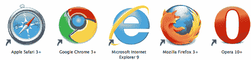
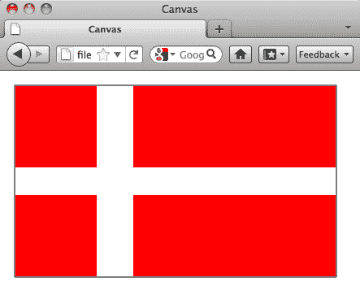
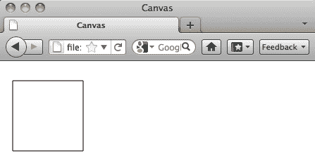
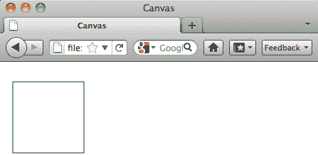
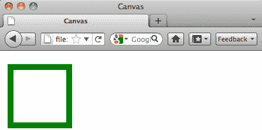
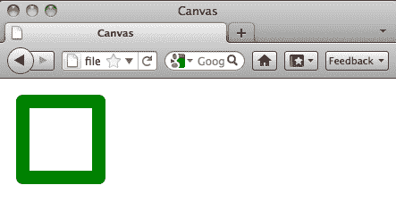
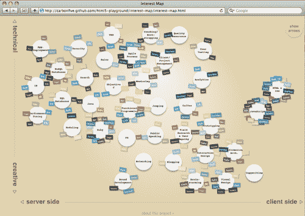
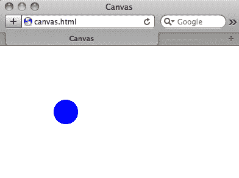
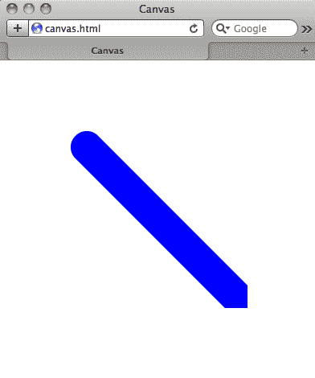
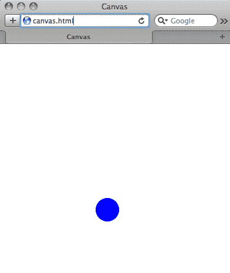

# 第六章：使用 Canvas 开发丰富的媒体应用程序

在本章中，我们将涵盖：

+   设置“画布”环境

+   了解 2D 渲染上下文

+   动态处理形状

+   使用“画布”为图像绘制边框

+   圆角

+   创建交互式可视化

+   弹跳球

+   创建备用内容

# 介绍

> “我更喜欢画画而不是说话。画画更快，也给谎言留下更少的空间。”-勒·柯布西耶

这可能是整本书中最实验性的一章。在接下来的配方中，我们将真正推动这组配方所能实现的极限。

### 注意

请注意，随着时间的推移，实验性的新“画布”元素规范可能会发生变化。在出版时，可以将这组配方视为可能性的一个快照。

在网站上放置图像是如此容易，我们现在认为理所当然。通过代码，你只需告诉浏览器显示一个图像，就完成了。所有这一切似乎都是小孩的游戏。目前，一些浏览器实际上可以使用新的“画布”元素动态地创建图像。所有繁重的工作都交给了 JavaScript。

新的开源“画布”元素的酷之处在于，不仅可以动态地创建图像，而且用户的操作也可以实时创建新的图像，而无需插件。听起来很棒，对吧？在许多方面确实如此，但它也让使用辅助技术的朋友们感到孤立。

### 提示

如果你使用的浏览器不支持新的“画布”元素会发生什么？基本上什么都不会发生。浏览器只是不会显示它。这就是为什么你需要特别小心使用这项技术，不要在新的“画布”元素中放置任何你的网站或应用程序绝对依赖的东西。你还必须考虑备用内容。

支持“画布”的浏览器包括：



### 提示

在继续使用新的“画布”元素进行开发之前，请确保你对 HTML 和 JavaScript 有扎实的基础技能。对面向对象编程感到舒适肯定也是有好处的。

在本章中，我们将看一些设置“画布”环境、了解 2D 渲染上下文、动态处理形状、使用“画布”为图像绘制边框、圆角、创建交互式可视化、弹跳球和创建备用内容的实际示例。

现在，让我们开始吧！

# 设置画布环境

创建新的“画布”元素很容易。

## 如何做...

看看这有多简单：

```html
<!DOCTYPE html>
<html>
<head>
<title>Canvas</title>
<meta charset="utf-8" />
</head>
<body>
<canvas id="FirstCanvas" width="800" height="600">
<!-- Fallback code goes here -->
</canvas>
</body>
</html>

```

## 它是如何工作的...

当然，我们可以使用任何需要的高度和宽度尺寸，但这组简单的标签是我们开始所需的。

### 提示

你可能会认为我们可以使用 CSS 来控制高度和宽度，但要抵制这种诱惑。因为新的“画布”元素包含一个 2D 渲染上下文，这种方法可能会导致不可预测的行为。

## 还有更多...

接下来，我们将调用新的“画布”元素 JavaScript API，同时调用 jQuery：

```html
<!DOCTYPE html>
<html>
<head>
<title>Canvas</title>
<meta charset="utf-8" />
<script src="img/ jquery.min.js"></script>
<script>
$(document).ready(function() {
var canvas = document.getElementById("FirstCanvas");
var ctx = canvas.getContext("2d");
});
</script>
</head>
<body>
<canvas id="FirstCanvas" width="800" height="600">
<!-- Fallback code goes here -->
</canvas>
</body>
</html>

```

### 他很聪明

> “让我完全明确一件事：当你使用‘画布’时，你并不是在画布元素本身上绘图。相反，你实际上是在通过 JavaScript API 访问‘画布’元素的 2D 渲染上下文上绘图。”-罗布·霍克斯

### 我在说什么？

苹果早在多年前就在 OSX Dashboard 中首次引入了新的“画布”元素。后来它在 Safari 和 Chrome 等网络浏览器中实现，其他浏览器也纷纷效仿。从那时起，它已成为 HTML5 规范的正式部分。

### <canvas>的下一步是什么？

现在，我们只是初步了解了新的“画布”元素可以做什么。现在和将来，我们将使用它来创建动画、图表、图表、绘图应用程序、图形和用户界面。你会梦想出什么？

## 另请参阅

开发者 Martin Angelov 为 Tutorial Zine 撰写了一篇名为《使用 Canvas 和 jQuery 创建 HTML5 幻灯片》的很棒的指南：[`tutorialzine.com/2010/09/html5-canvas-slideshow-jquery`](http://tutorialzine.com/2010/09/html5-canvas-slideshow-jquery)。在这篇文章中，Martin 演示了如何将新的 canvas 元素与 jQuery 这个最流行的 JavaScript 框架结合起来，创建一个非常互动的图像幻灯片。

# 理解 2D 渲染上下文

重要的是要理解，新的`canvas`元素实际上是一个在浏览器中绘制位图图像的“表面”。

## 如何做到...

像这样定义一个`canvas`标签只是讲了一半的故事：

```html
<!DOCTYPE html>
<html>
<head>
<title>Canvas</title>
<meta charset="utf-8" />
</head>
<body>
<canvas id="FirstCanvas" width="800" height="600">
<!-- Fallback code goes here -->
</canvas>
</body>
</html>

```

## 工作原理...

单独的 HTML5 代码不会做任何事情。我们必须使用 JavaScript 来使文档对象模型检索 2D 渲染上下文，以便让一些事情发生：

```html
<script>
$(document).ready(function() {
var canvas = document.getElementById("FirstCanvas");
var ctx = canvas.getContext("2d");
});
</script>

```

公平地说，如果没有 HTML 中的`canvas`标签，那么 JavaScript 也不会做任何事情。

## 还有更多...

你可能会对这个名字感到好奇。如果有一个 2D 渲染上下文，那么可能也有一个 3D 渲染上下文吗？简短的答案是肯定的。但更详细的答案并不那么简单。

尽管在理论上存在 3D 渲染上下文，但在本出版物发表时，没有浏览器支持它。因此，如果新的`canvas`元素以 3D 方式呈现，但没有人看到它，它真的做了什么吗？

### 你可以掌握<canvas>

2D 上下文使用了许多不同的绘图上下文来使用新的`canvas`元素，这些语法应该看起来非常熟悉，如果你熟悉 CSS 和 JavaScript 的话。

### X，见 Y

在绘图时，请记住浏览器窗口左上角的 X 和 Y 轴。数值向下增加。

### 尊重我的权威！

万维网联盟的 HTML5 `Canvas` 2d 上下文规范在线上可以找到：[`dev.w3.org/html5/2dcontext`](http://dev.w3.org/html5/2dcontext)。在那里，我们可以深入了解诸如符合性要求、`canvas`状态、变换、合成、颜色和样式、线条样式、阴影、简单形状、复杂形状、焦点管理、文本、图像、像素操作、绘图模型、示例等更多信息。

## 另请参阅

Steve Fulton 和 Jeff Fulton 为 O'Reilly Books 撰写了《HTML5 Canvas》一书。虽然本章将为您提供大约 30 页有价值的新`canvas`元素技巧，但 Fulton 的书大约有 400 页。可以将其视为在本章结束后继续学习的资源。在这里查看：[`oreilly.com/catalog/0636920013327`](http://oreilly.com/catalog/0636920013327)。

# 动态处理形状

让我们看看允许新的`canvas`元素绘制矩形的 JavaScript 函数。

## 如何做到...

```html
fillRect(x,y,width,height)
strokeRect(x,y,width,height)

```

按顺序：

```html
fillRect(x,y,width,height)

```

绘制一个填充的矩形。接下来，

```html
strokeRect(x,y,width,height)

```

绘制一个矩形的轮廓。

现在，让我们画一些形状。

## 工作原理...

我们将从基本的`canvas`代码开始，并整合我们的新功能：

```html
<!DOCTYPE html>
<html>
<head>
<title>Canvas</title>
<meta charset="utf-8" />
<script src="img/ jquery.min.js"></script>
<script>
$(document).ready(function() {
var canvas = document.getElementById("FirstCanvas");
var ctx = canvas.getContext("2d");
ctx.strokeRect(10, 10, 396, 236);
ctx.fillStyle = "red";
ctx.fillRect(11, 11, 100, 100);
ctx.fillStyle = "white";
ctx.fillRect(111, 11, 34, 100);
ctx.fillStyle = "red";
ctx.fillRect(156, 11, 249, 100);
ctx.fillStyle = "white";
ctx.fillRect(11, 111, 394, 34);
ctx.fillStyle = "red";
ctx.fillRect(11, 145, 100, 100);
ctx.fillStyle = "white";
ctx.fillRect(111, 145, 34, 100);
ctx.fillStyle = "red";
ctx.fillRect(156, 145, 249, 100);
});
</script>
</head>
<body>
<canvas id="FirstCanvas" width="416" height="256">
<p>Flag of Denmark</p>
</canvas>
</body>
</html>

```

我们创建的东西类似于丹麦的国旗！



## 还有更多...

这个例子一开始可能并不令人震惊，但当你记住我们几乎没有使用任何 HTML 和 CSS 就创建了一个图像时，新的`canvas`元素开始看起来相当令人印象深刻。

### 你想要的任何方式

请注意，虽然我们使用了颜色名称（“white”和“red”），但我们也可以使用十六进制值或 RGB 甚至 HSL！使用对你和你的互动项目最有意义的内容。

### 类似于表格？

对于这个例子的颜色和大小规格，几乎可以将其视为我们过去用于布局的老式`tables`。虽然肯定不一样，但在这种情况下，这种技术确实有相似之处。

### 首先成为一个正方形

掌握矩形是在掌握设置元素本身之后非常重要的`canvas`技术。理解这种方法的基础将有助于你掌握接下来几个技巧的基本原理。

## 另请参阅

另一本书，近 400 页，是 Rob Hawkes 的《Foundation HTML5 Canvas: For Games and Entertainment》，由 Friends of Ed 出版。在这本书中，Hawkes 为那些刚接触新的`canvas`元素的人，一直到最有经验的专家提供了一个提升技能的出版物。听起来像你认识的人吗？在这里查看：[`friendsofed.com/book.html?isbn=1430232919`](http://friendsofed.com/book.html?isbn=1430232919).

# 使用 canvas 为图像绘制边框

让我们更仔细地看看使用新的`canvas`元素绘制图像边框的超简单方法。

## 如何做...

首先，我们将从基本的`canvas`代码开始，然后添加一行新代码来绘制边框：

```html
<!DOCTYPE html>
<html>
<head>
<title>Canvas</title>
<meta charset="utf-8" />
<script src="img/ jquery.min.js"></script>
<script>
$(document).ready(function() {
var canvas = document.getElementById("FirstCanvas");
var ctx = canvas.getContext("2d");
ctx.strokeRect(10, 20, 100, 100);
});
</script>
</head>
<body>
<canvas id="FirstCanvas" width="800" height="600">
<!-- Fallback code goes here -->
</canvas>
</body>
</html>

```



## 它是如何工作的...

这一行 JavaScript 告诉浏览器创建一个矩形，从新的`canvas`元素的左边 10 像素，顶部 20 像素开始。它绘制了一个 100 像素的正方形。

## 更多内容...

这很好，但如果我们希望边框是除了默认颜色之外的任何其他颜色，我们需要指定：

```html
<!DOCTYPE html>
<html>
<head>
<title>Canvas</title>
<meta charset="utf-8" />
<script src="img/ jquery.min.js"></script>
<script>
$(document).ready(function() {
var canvas = document.getElementById("myCanvas");
var ctx = canvas.getContext("2d");
ctx.strokeStyle = "rgb(0, 128, 0)";
ctx.strokeRect(10, 20, 100, 100);
});
</script>
</head>
<body>
<canvas id="myCanvas" width="600" height="600">
<!-- Fallback code goes here -->
</canvas>
</body>
</html>

```

在这种情况下，我们使用`strokeStyle`来指定纯绿色的 RGB 颜色。



### 首先是样式

### 提示

如果您打算为边框设置样式，您需要在浏览器绘制边框之前指定。如果您在之后指定样式，浏览器将简单地忽略它。

### 许多颜色值都可以使用

我们刚刚使用的样式属性是 RGB，但该方法也适用于颜色（例如“绿色”）、十六进制值、HSL 和 RGBA。

### 我喜欢大边框，我无法否认

如果未指定边框宽度，浏览器将自动绘制一个像素的边框。以下是如何更改它的方法：

```html
<!DOCTYPE html>
<html>
<head>
<title>Canvas</title>
<meta charset="utf-8" />
<script src="img/ jquery.min.js"></script>
<script>
$(document).ready(function() {
var canvas = document.getElementById("myCanvas");
var ctx = canvas.getContext("2d");
ctx.lineWidth = 10;
ctx.strokeStyle = "rgb(0, 128, 0)";
ctx.strokeRect(10, 20, 100, 100);
});
</script>
</head>
<body>
<canvas id="myCanvas" width="600" height="600">
<!-- Fallback code goes here -->
</canvas>
</body>
</html>

```

就是这么简单：



## 另请参阅

[`rgraph.net`](http://rgraph.net)是一个专门为新的`canvas`元素设计的图形库。它允许您轻松创建各种图表类型：条形图、双极图、圆环图、漏斗图、甘特图、水平条形图、LED 显示、折线图、仪表、里程表、饼图、进度条、玫瑰图、散点图和传统的雷达图，使用 HTML5、`canvas`和 JavaScript。

# 圆角

到目前为止，我们已经使用方形或矩形形状创建了图像和边框。接下来，我们将看看如何使用新的`canvas`元素通过 JavaScript 来圆角这些图像和边框。

## 如何做...

`canvas`的圆角能力并非原生支持，但 Rob Hawkes 是一个非常聪明的人，他找到了实现这一功能的方法。这就是 Rob 所做的事情，解释在：[`rawkes.com/blog/2010/12/11/rounded-corners-in-html5-canvas`](http://rawkes.com/blog/2010/12/11/rounded-corners-in-html5-canvas)。

```html
<!DOCTYPE html>
<html>
<head>
<title>Canvas</title>
<meta charset="utf-8" />
<script src="img/ jquery.min.js"></script>
<script>
$(document).ready(function() {
var canvas = $("#myCanvas");
var context = canvas.get(0).getContext("2d");
var rectX = 10;
var rectY = 10;
var rectWidth = 100;
var rectHeight = 100;
var cornerRadius = 15;
context.lineJoin = "round";
context.lineWidth = cornerRadius;
context.strokeStyle = "rgb(0, 128, 0)";
context.strokeRect(rectX+(cornerRadius/2), rectY+(cornerRadius/2), rectWidth-cornerRadius, rectHeight-cornerRadius);
});
</script>
</head>
<body>
<canvas id="myCanvas" width="600" height="600">
<!-- Fallback code goes here -->
</canvas>
</body>
</html>

```

## 它是如何工作的...

首先，Rob 选择了一种稍微不同的调用 2d`canvas`渲染上下文的方法，但他的方法也完全有效。看看：

```html
$(document).ready(function() {
var canvas = $("#myCanvas");
var context = canvas.get(0).getContext("2d");

```

Rob 的代码的下一部分应该看起来很熟悉：他设置了图像的 X 和 Y 坐标，大小，然后是边框半径：

```html
var rectX = 10;
var rectY = 10;
var rectWidth = 100;
var rectHeight = 100;
var cornerRadius = 15;

```

然后 Rob 调用了连接线的能力和他想要使用的特定边框半径。假装直到你成功为止！

```html
context.lineJoin = "round";
context.lineWidth = cornerRadius;

```

最后是边框的颜色（仍然是绿色！）和将所有内容联系在一起的最后一部分脚本：

```html
context.strokeStyle = "rgb(0, 128, 0)";
context.strokeRect(rectX+(cornerRadius/2), rectY+(cornerRadius/2), rectWidth-cornerRadius, rectHeight-cornerRadius);

```

## 更多内容...

现在 Rob - 以及你，如果你在跟着做 - 可以成为一个拥有美丽圆角图像的摇滚明星。



### 就像学术能力测试一样

### 提示

记住：`lineWidth`对于新的`canvas`元素来说就像`border-radius`对于 CSS 一样。它们都实现了相同的功能 - 但是通过非常不同的方式。

### IE 怎么样？

可以使用 ExplorerCanvas 库在 Internet Explorer 6-8 中支持一些新的`canvas`元素功能：[`code.google.com/p/explorercanvas.`](http://code.google.com/p/explorercanvas.)

### 我们正在奠定基础

在本章的大部分食谱中，我们只使用新的`canvas`元素在浏览器中绘制静态形状，而没有使用图像。这可能看起来平淡无奇，甚至可能逆向思考。重点是为您提供这种新能力的坚实基础，以便您可以扩展它，使用新的`canvas`元素来创建游戏，可视化数据，并允许用户动态绘制对象。

## 另请参阅

Mozilla 的“HTML5 的人”视频系列展示了许多 HTML5 运动的领军人物。约翰·福利奥特是 HTML5 中媒体元素无障碍性小组委员会的联合主席。当他对当前浏览器对这些技术的支持状态感到遗憾时，这一点应该不足为奇：

> “我认为 HTML5 开始提供的许多功能将使所有用户受益，包括使用辅助技术的用户。然而，许多承诺的功能在所有浏览器中尚不受支持，相关技术——辅助技术——还有很长的路要走才能利用这一好处。”

阅读并观看完整的采访内容：[`hacks.mozilla.org/2011/02/people-of-html5-john-foliot`](http://hacks.mozilla.org/2011/02/people-of-html5-john-foliot).

# 创建交互式可视化

Carbon Five 团队面临着一个艰巨的任务：创建他们的技能和兴趣的物理图表。他们可能从办公室的墙壁开始，但很快意识到新的`canvas`元素带来的新能力将允许交互性，并且可以根据此进行结论。这是他们的做法：[`carbonfive.github.com/html5-playground/interest-map/interest-map.html.`](http://carbonfive.github.com/html5-playground/interest-map/interest-map.html.)



## 如何做...

### 提示

在按照本文进行操作时，查看源代码将非常有帮助：[查看源代码：http://carbonfive.github.com/html5-playground/interest-map/interest-map.html](http://view-source:http://carbonfive.github.com/html5-playground/interest-map/interest-map.html)

Carbon Five 团队提醒我们，画布并不是 HTML5 规范的正式部分，他们使用 HTML4.01 Transitional DOCTYPE 创建了这个交互式可视化。

```html
<!DOCTYPE html PUBLIC "-//W3C//DTD HTML 4.01 Transitional//EN"
"http://www.w3.org/TR/html4/loose.dtd">

```

这里详细介绍了他们如何使用 JavaScript 和新的`canvas`元素。他们从一些变量开始，比如卡片样式。在这里，他们做了几件事：设置背景颜色，创建黑色边框，卡片的宽度，以及围绕它的阴影的值。

```html
var CARD_STYLE = { fill:'rgb(240,240,240)',stroke:'rgb(0,0,0)',width:.05, shadow:{x:0, y:4, blur:4, color:'rgba(0, 0, 0, 0.3)'} };

```

下一个变量对于了解 CSS 的人来说应该很熟悉。在这里，设置了卡片的字体重量、大小、字体、颜色等：

```html
var CARD_FONT = {font:'bold 8pt Courier', color:'#555', yoffset:10, height:14};

```

接下来，他们设置了与边距、宽度、高度、比例、半径、阴影等相关的几个变量。

```html
var MARGIN = [75,75,75,100], WIDTH = 1000-MARGIN[1]-MARGIN[3], HEIGHT = 650-MARGIN[0]-MARGIN[2], CARD_SCALE=.75, CARD_RADIUS = 40, TAG_RADIUS = 50, CACHE_RADIUS=70, CLEAR_RADIUS = 50, ITERATIONS = 20, DEGREE = .5, CARD_SHADOW = 2, AXIS_ANIM=700;

```

最后，他们为技能、人员和人员与技能矩阵设置了变量。不幸的是，这些代码块太长，无法在此重新发布。

## 它是如何工作的...

变量本身并不会有太大作用，除非它们有函数来对其进行操作。

在初始化显示后，Carbon Five 团队使用更多的函数，如在 2D`canvas`渲染元素上绘制：

```html
function draw(t) {
var ctx = el('display').getContext('2d');
ctx.clearRect(0,0,ctx.canvas.width,ctx.canvas.height);
ctx.save(); ctx.globalAlpha = 1 - .75*arrow_visibility;
each( cards, function(card) {
var t0=card.tween(t); x = MARGIN[3] + card.lx + (card.x-card.lx)*t0, y = MARGIN[0] + card.ly + (card.y-card.ly)*t0;
draw_card( ctx, x, y, card.index);
});
ctx.restore();
if ( arrow_visibility > 0 ) {
ctx.save(); ctx.globalAlpha = arrow_visibility;
each( PEOPLE, function(p) { draw_interest_arrow(ctx,p,t); });
ctx.restore();
if (over_person) draw_over_arrow(ctx,over_person,t);
}
draw_axes(ctx);
}

```

除了创建名牌之外：

```html
function nametag( ctx, cardx, cardy, person, r, interest ) {
ctx.save(); ctx.translate( cardx, cardy ); ctx.rotate( r + .4*(Math.random()-.5) );
ctx.translate( -TAG_RADIUS - + 4*Math.random(), 0 ); ctx.rotate( -r );
draw_nametag( ctx, person, interest );
ctx.restore();
}

```

并且绘制箭头：

```html
function draw_arrow( ctx, length, head_length, head_width ) {
var cx1 = .9*(length - head_length), cy1 = .2*head_width, cx2 = (length - head_length), cy2=.2*head_width;
ctx.beginPath();
ctx.moveTo(0,0);
ctx.bezierCurveTo( cx1, cy1, cx2, cy2, length-head_length, head_width );
ctx.lineTo( length, 0 ); ctx.lineTo( length-head_length, -head_width );
ctx.bezierCurveTo( cx2, -cy2, cx1, -cy1, 0, 0 );
ctx.closePath();
}

```

## 还有更多...

已经设置了变量和函数，最后要做的就是在 HTML 中调用`canvas`元素本身，为其提供运行的空间：

```html
<canvas id="display" width="1000" height="650"></canvas>

```

### 两害相权取其轻

在旧的网络时代，Carbon Five 团队可以选择将他们的地图留在物理墙上，或者为计算机显示创建静态图像。虽然任何一种方式都可以渲染得和使用新的`canvas`元素一样好，但它们都不允许团队提取有价值的信息，就像新的`canvas`元素那样。

### 备用内容呢？

有趣的是，Carbon Five 在这种情况下没有在新的`canvas`元素中使用回退内容。这是一个你需要仔细权衡的方法，因为那些使用旧浏览器或辅助技术的人将什么也看不到。Carbon Five 在这个内部项目中得以成功。你能吗？

### 接受他的提议。

在[`blog.carbonfive.com/2011/02/17/visualizing-skillsets-in-html5-canvas-part-1`](http://blog.carbonfive.com/2011/02/17/visualizing-skillsets-in-html5-canvas-part-1)上写到这个项目时，Carbon Five 的开发者 Alex Cruikshank 甚至表示愿意为前五位以合理格式提供数据的人创建可视化地图。截至出版日期，尚不清楚是否有人接受了他的提议。

## 另请参阅

Jacob Seidelin 用他的新 canvas 元素可视化了乐队 Radiohead 的歌曲“Idioteque”，这首歌收录在专辑“Kid A”中：[`nihilogic.dk/labs/canvas_music_visualization`](http://nihilogic.dk/labs/canvas_music_visualization)。Jacob 正在挑战`canvas`元素和 JavaScript 的极限，这就是为什么我们认为他很棒！

# 弹跳球

我们已经看过如何使用新的`canvas`元素绘制形状，接下来我们将把注意力转向使这些形状移动。作者 Vinci Rufus 向我们展示了如何。

## 如何做...

我们将从通常的`canvas` HTML 代码开始：

```html
<!DOCTYPE html>
<html>
<head>
<title>Canvas</title>
<meta charset="utf-8" />
</head>
<body>
<canvas id="FirstCanvas" width="800" height="600">
<!-- Fallback code goes here -->
</canvas>
</body>
</html>

```

接下来是独特的部分：JavaScript。在这里，Vinci 选择了一个稍微不同的方法来调用 2D`canvas`渲染上下文，但他的方法也完全有效。看看：

```html
<script>
var context;
function init()
{
context= myCanvas.getContext('2d');
context.beginPath();
context.fillStyle="#0000ff";
// Draws a circle of radius 20 at the coordinates 100, 100 on the canvas
context.arc(100,100,20,0,Math.PI*2,true); context.closePath();
context.fill();
}
</script>

```

将这些代码放在一起，应该是这样的。注意在`body`标签中添加的`onLoad`函数。

```html
<!DOCTYPE html>
<html>
<head>
<title>Canvas</title>
<meta charset="utf-8" />
<script src="img/ jquery.min.js"></script>
<script>
var context;
function init()
{
context= myCanvas.getContext('2d');
context.beginPath();
context.fillStyle="#0000ff";
// Draws a circle of radius 20 at the coordinates 100, 100 on the canvas
context.arc(100,100,20,0,Math.PI*2,true); context.closePath();
context.fill();
}
</script>
</head>
<body onLoad="init();">
<canvas id="myCanvas" width="300" height="300">
<!-- Fallback code goes here -->
</canvas>
</body>
</html>

```

并渲染这个蓝色的球：



## 它是如何工作的...

到目前为止，Vinci 的代码非常简单。我们看到他如何调用 2D`canvas`渲染上下文。接下来他设置填充的颜色：

```html
context.fillStyle="#0000ff";

```

然后在距离顶部和左边 100 像素的地方绘制一个弧线，并用他已经设置的蓝色填充：

```html
context.arc(100,100,20,0,Math.PI*2,true); context.closePath();
context.fill();

```

但现在我们只有一个蓝色的球坐在那里。接下来，Vinci 向我们展示了如何使用变量和一个名为`draw`的新函数使其移动。

## 还有更多...

```html
<!DOCTYPE html>
<html>
<head>
<title>Canvas</title>
<meta charset="utf-8" />
<script src="img/ jquery.min.js"></script>
<script>
var context;var x=100;var y=200;var dx=5;var dy=5;
function init()
{
context= myCanvas.getContext('2d');
setInterval(draw,10);
}
function draw()
{
context.beginPath();
context.fillStyle="#0000ff";
// Draws a circle of radius 20 at the coordinates 100, 100 on the canvas
context.arc(x,y,20,0,Math.PI*2,true);
context.closePath();
context.fill();
x+=dx;
y+=dy;
}
</script>
</head>
<body onLoad="init();">
<canvas id="myCanvas" width="300" height="300" >
</canvas>
</body>
</html>

```



正如你所看到的，球在运动，但只是在`canvas`的边缘画了一条直线。Vinci 解释了原因：

> “这是因为每次调用`draw()`函数时，它都会在新坐标处绘制一个圆圈，而不会删除旧的圆圈。这就是`getContext`对象的工作原理，所以这不是一个 bug；它实际上并没有移动圆圈，而是在每次调用函数时在新坐标处绘制一个圆圈。”

### 重新开始

Vinci 向我们展示了一种方法，可以擦除旧的圆圈，因为新的`canvas`元素绘制了每一个新的圆圈：

```html
<script>
var context;
var x=100;
var y=200;
var dx=5;
var dy=5;
function init()
{
context= myCanvas.getContext('2d');
setInterval(draw,10);
}
function draw()
{
context.clearRect(0,0, 300,300);
context.beginPath();
context.fillStyle="#0000ff";
// Draws a circle of radius 20 at the coordinates 100, 100 on the canvas
context.arc(x,y,20,0,Math.PI*2,true);
context.closePath();
context.fill();
x+=dx;
y+=dy;
}
</script>

```

现在，球似乎向右下方的`canvas`边界外掉落。

### 不要把我困住

为了确保球留在`canvas`的边界内，Vinci 编写了一些逻辑来检查 x 和 y 坐标是否超出了`canvas`的尺寸。如果超出了，他就让球改变方向。

```html
<script>
var context;
var x=100;
var y=200;
var dx=5;
var dy=5;
function init()
{
context= myCanvas.getContext('2d');
setInterval(draw,10);
}
function draw()
{
context.clearRect(0,0, 300,300);
context.beginPath();
context.fillStyle="#0000ff";
// Draws a circle of radius 20 at the coordinates 100, 100 on the canvas
context.arc(x,y,20,0,Math.PI*2,true);
context.closePath();
context.fill();
// Boundary Logic
if( x<0 || x>300) dx=-dx;if( y<0 || y>300) dy=-dy;x+=dx;y+=dy;
}
</script>

```

现在球应该在`canvas`的四个边上不断地弹跳。



### 还有一个要学习的

正如 Vinci 在他引人入胜的教程中提醒我们：[`sixrevisions.com/html/bouncing-a-ball-around-with-html5-and-javascript`](http://sixrevisions.com/html/bouncing-a-ball-around-with-html5-and-javascript)，弹跳球起初可能看起来很简单，但实际上这是一个关键的技术，需要理解才能开发几乎任何新 HTML5`canvas`元素的游戏。

## 另请参阅

可以在 Yuri Vishnevsky 的[`weavesilk.com`](http://weavesilk.com)上看到用户生成的图形的美丽示例。该网站使用新的“画布”元素作为生成艺术实验的一部分。一些生成的图像非常美丽，Yuri 已经将它们作为令人惊叹的桌面背景图像提供。iPhone 和 iPad 版本也已计划。

# 创建备用内容

> “当作者使用‘画布’元素时，他们还必须提供内容，当呈现给用户时，传达的基本上与位图‘画布’相同的功能或目的。此内容可以放置为‘画布’元素的内容。‘画布’元素的内容（如果有）是元素的备用内容。”- WHATWG HTML5 规范

如果有人在使用旧版浏览器并且无法识别您的编码天赋时，您的出色的新“画布”应用会发生什么？或者当有人使用辅助技术时会发生什么？让我们来看看。

## 如何做...

如果由于某种原因，用户的浏览器不支持新的“画布”元素，作为开发人员，我们需要给他们提供有价值的替代内容。

在这里我们可以使用图像作为备用内容。

```html
<canvas id="clock" width="200" height="200">

</canvas>

```

或者文本：

```html
<canvas id="clock" width="200" height="200">
<p>clock</p>
</canvas>

```

或几乎任何其他元素。

## 它是如何工作的...

到目前为止，您对图像文件中`alt`标签的工作原理已经很熟悉：如果图像文件不显示或用户依赖辅助技术，`alt`标签至少会给他们一个有价值的文本标签，代表他们所错过的内容。新的“画布”元素的备用内容是一个类似的概念，但它能够做得更多，而不仅仅是一个`alt`标签。

## 还有更多...

支持新的“画布”元素的浏览器将忽略容器内的内容，并正常呈现新的“画布”元素。

### 谢谢，Mozilla

> “如果需要备用内容，则必须使用一些 CSS 技巧来掩盖 Safari 中的备用内容（应该只呈现‘画布’），并且还要掩盖 IE 中的 CSS 技巧本身（应该呈现备用内容）。”- [Mozilla.org](http://Mozilla.org)

### 我们将如何处理可访问性？

规范撰写者和 HTML5 社区普遍认为新的“画布”元素只是部分成熟。让使用辅助技术的人置身于寒冷中似乎不是正确的做法。敬请关注。

### 我们准备好使用<canvas>了吗？

许多开发人员认为新的“画布”元素的可访问性是新 HTML5 规范中的最后一个难点。由于几乎没有有意义的备用功能，这个新元素似乎还没有准备好投入使用。
