# 第八章：拥抱音频和视频

在本章中，我们将涵盖：

+   对 Flash 说不

+   理解“音频”和“视频”文件格式

+   为所有人显示“视频”

+   创建可访问的“音频”和“视频”

+   打造时髦的“音频”播放器

+   为移动设备嵌入“音频”和“视频”

# 介绍

> “Flash 是在 PC 时代创建的-为 PC 和鼠标。Flash 对 Adobe 来说是一个成功的业务，我们可以理解他们为什么想将其推广到 PC 之外。但移动时代是关于低功耗设备、触摸界面和开放的网络标准，所有这些领域 Flash 都做得不够好。提供其内容给苹果移动设备的媒体机构的大量增加表明，Flash 不再是观看视频或消费任何类型网络内容的必要条件。”- 史蒂夫·乔布斯

与我们已经看过的许多其他新技术一样，在开源 HTML5 标准中，新的“音频”和“视频”元素比以往任何时候都更加成熟和可用。这是一件好事，因为用户对多媒体的期望比以往任何时候都要高。在过去，我们使用需要 10 分钟才能下载一张照片的 300 波特调制解调器。后来，我们使用 Napster 非法下载 MP3“音频”文件。现在，我们在移动设备上播放电视和色情内容。由于带宽管道变得越来越宽，我们对互动娱乐的需求几乎变得无法满足。现在是展示成果的时候了。

多年来，视频播放在网页上一直是 QuickTime、RealPlayer 和 Flash 之间的战斗。这些浏览器插件安装起来很容易，*通常*能产生预期的结果。

随着时间的推移，QuickTime 和 RealPlayer 继续作为播放平台，但专有 Flash 工具的制造商也创建了一个强大的开发环境，使设计师和开发人员都认为它是一个可行的平台。

虽然 QuickTime 和 RealPlayer 仍然存在，但 Flash 赢得了这场战争。对于动画和卡通来说，Flash 是理想的工具。但它是否仍然是最好的“音频”和“视频”播放工具呢？史蒂夫·乔布斯肯定不这么认为。

2010 年，苹果电脑的负责人乔布斯划定了界限，并表示 Flash 永远不会出现在他最畅销的 iPhone 和 iPad 上。相反，他坚定地支持开放的 HTML5 标准，并引发了一场在线圣战。

不久之后，“Flash 的死亡”宣言成为媒体头条和博客圈的热门话题。有些人写得如此恶毒，好像一道堤坝决堤，所有积累的污秽和淤泥都被允许淹没我们的多媒体对话。

很快，即使非网页设计师和开发人员也开始注意到，比如 C.C. Chapman，著名书籍《内容*规则*》的作者，表达了他对《今日秀》无法在 iPad 上观看的不满：

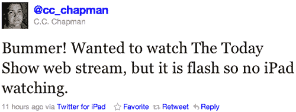

这个问题迅速渗透到我们的在线娱乐讨论中。你不再需要成为网页设计师或开发人员才知道这里存在真正的问题。

C.C.说得简单明了，但作者知道他在谈论史蒂夫制造的 Flash/HTML5“视频”战争时，他已经说错了话。有时他争论得太过激和傲慢，但事实是，像网页设计师杰西卡·邦恩这样头脑清晰的人在提醒我们，Flash 和 HTML5“视频”可以和平共存。

自从史蒂夫做出上述宣言以来不到一年的时间，像 ABC、CBS、CNN、ESPN、Facebook、Fox News、MSNBC、National Geographic、Netflix、《纽约时报》、NPR、People、《体育画报》、《时代》、Vimeo、《华尔街日报》、YouTube 等网站都采用了新的 HTML5“音频”和“视频”元素。截至目前，超过 60%的网络“视频”现在都已经准备好使用 HTML5。可以说，新的 HTML5“音频”和“视频”功能是一些最令人兴奋和期待的新发展！

支持新的 HTML5“音频”和“视频”元素的浏览器包括：


在这一章中，我们将看一些现实生活中的例子，比如对 Flash 说不，理解新的`video`和`audio`文件格式，为所有人显示`video`，创建可访问的`audio`和`video`，打造时尚的`audio`播放器，以及为移动设备嵌入`audio`和`video`。

现在，让我们开始吧！

# 对 Flash 说不

作者的妈妈过去常说，万事都有其时机和地点，我们相信 Flash 也有其时机和地点。只是现在，随着技术的成熟，作者认为 Flash 的时间和地点越来越少。

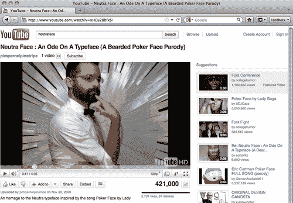

在那些糟糕的旧日子里，如果我们想在网页中使用 YouTube 视频，比如“Neutraface”，这是排版界对 Lady Gaga 的“Pokerface”的回应，我们就不得不使用一些丑陋的代码，比如这样：

```html
<object width="640" height="390">
<param name="movie" value="http://www.youtube.com/v/xHCu28bfxSI?fs=1&amp;hl=en_US"> </param>
<param name="allowFullScreen" value="true"></param>
<param name="allowscriptaccess" value="always"></param>
<embed src="img/xHCu28bfxSI?fs=1&amp;hl=en_US" type="application/x-shockwave-flash" allowscriptaccess="always" allowfullscreen="true" width="640" height="390"></embed>
</object>

```

那段代码又长又丑陋，而且复杂，无法通过验证测试。它还依赖于第三方插件。呃。

多年来，我们忍受了那些垃圾，但不再。现在我们可以重建它——我们有技术了。

## 如何做...

现在，我们可以使用更加优雅的东西，而不是臃肿的`object`代码：

```html
<video src="img/videosource.ogv"></video>

```

这就是所需的全部。它简短、漂亮，而且验证通过。最重要的是，它不需要插件。再告诉我，为什么我们认为 Flash 是个好主意。

为了增加一些样式和功能，让我们再加入一点代码。

```html
<video src="img/videosource.ogv" controls height="390" width="640"></video>

```

## 它是如何工作的...

那段代码应该很简单。你可能已经猜到，`src`指的是源`video`文件，`controls`表示`video`应该使用标准的播放和音量控件，`height`和`width`是不言自明的。

现代浏览器现在有了自己的原生 HTML5`audio`和`video`播放控件。让我们来看看每一个，从苹果 Safari 开始：

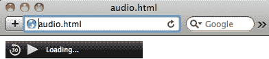

这是谷歌 Chrome 显示播放控件的方式：

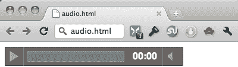

微软 Internet Explorer 9 以不同的方式显示它：

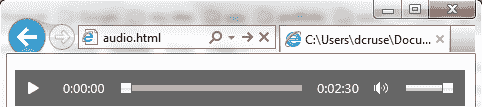

然后，Mozilla Firefox 以不同的方式做到了：

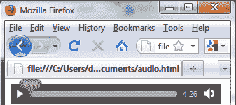

不足为奇的是，Opera 以另一种方式显示播放控件：

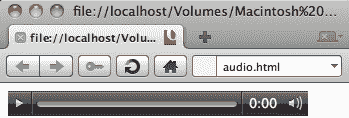

所有这些看起来都不一样。如果每一个不同的外观都满足你的需求，太好了！如果不是，那肯定需要更多的工作来让它们行为和外观相似。

## 还有更多...

还有一些可选的属性我们可以包括。它们是：

+   `autobuffer` - 这个布尔属性告诉浏览器在用户点击播放按钮之前就开始下载歌曲或电影。

+   `autoplay` - 你可能已经猜到，这告诉浏览器自动播放 HTML5`audio`或`video`。

+   `loop` - 也是一个布尔属性，它会一遍又一遍地播放 HTML5`audio`或`video`文件。

+   preload - preload 属性在播放之前开始加载文件。

+   `poster` - `poster`属性是在新的 HTML5`video`加载时显示的静态占位图像。显然，这个属性不适用于 HTML5`audio`文件。

无论你包括了这些可选属性中的哪些，你最终都会得到一种更漂亮、更语义化、更可访问的显示`audio`和`video`的方法，比起依赖 Flash 为你提供它们。

### 一些好消息

与`canvas`章节不同，关于新的 HTML5`audio`和`video`元素的好消息是它们是可访问的。新的 HTML5`audio`和`video`元素具有键盘可访问性。由于浏览器现在原生地处理新的 HTML5`audio`和`video`元素，它可以像按钮一样支持你的键盘。这一点单独就足以推动这项新技术的接受。

### 带样式的视频

新的 HTML5 `audio`和`video`元素可以使用 CSS 进行视觉样式设置。我们可以使用 CSS 不仅控制播放器的大小，还可以添加`:hover`和`:transform`效果。此外，我们可以使用 JavaScript 来控制新的 HTML5 `audio`和`video`的行为。很酷！

### 保护你的资产

Flash 确实提供优势的一个领域是保护你的`音频`和`视频`内容。请记住，新的 HTML5 `audio`和`video`元素天生是开源的，没有数字版权管理。如果保护你的`音频`或`视频`文件不被下载对你来说很重要，那么新的 HTML5 `audio`和`video`元素不适合你 - Flash 可能仍然适合。这并不是说 Flash 能够终极保护不被盗用 - 只是说，Flash 默认隐藏了媒体轨道的能力，而新的 HTML5 `<audio>`和`<video>`元素则默认将这些文件完全暴露给任何人。然而，Flash Media Server 可以完全保护你的资产。

仍然不确定是选择 HTML5 音频和视频还是 Flash？试试这个方便的提示列表。

HTML5 的好处包括：

+   **可访问性：**如果可访问性对你很重要（应该是的），那么新的 HTML5 `audio`和`video`元素是你最好的选择。

+   **iOS：**如果你希望你的`音频`和`视频`能在 iPhone 或 iPad 上显示，HTML5 是你唯一的选择。

+   **移动设备：**除了苹果的移动设备外，其他移动设备对新的 HTML5 `audio`和`video`元素有很好的支持。

+   `视频/音频` **流媒体：**如果你正在流媒体的内容不是专有的，也不需要版权管理，HTML5 是你的完美选择。

Flash 的好处包括：

+   **可访问性：**如果你不在乎盲人或聋人，也不支持他们。谁在乎你是否被起诉呢？

+   **动画：**毫无疑问，使用 Flash 的最好理由是如果你的网站有复杂的动画。像[`jibjab.com`](http://jibjab.com)这样的网站如果没有 Flash 就无法存在。

+   **仅桌面开发：**如果你不需要支持移动用户。那只是一个时尚。

+   `视频/音频` **流媒体：**如果你不喜欢分享并且必须锁定你的`音频`或`视频`，使其不容易被人下载，那就坚持使用 Flash。

+   **网络摄像头：**如果你使用网络摄像头（除了[`chatroulette.com`](http://chatroulette.com)之外，还有谁在用？），那么 Flash 就是最好的选择。

这真的是使用 Flash 的最具说服力的理由吗？


## 另请参阅

想要能够在所有主要浏览器中播放新的 HTML5 `audio`和`video`元素，甚至包括远至 Internet Explorer 6？谁不想呢？如果是这样，那就去看看免费的开源 Projekktor 项目，网址是[`projekktor.com`](http://projekktor.com)。Projekktor 是 Sascha Kluger 的创意，它使用 JavaScript 来确保各种支持的浏览器都能正确解释和显示特定的 HTML5 `video`文件格式。

# 了解音频和视频文件格式

有很多不同的`音频`和`视频`文件格式。这些文件不仅可能包括`视频`，还可能包括`音频`和元数据 - 都在一个文件中。这些文件类型包括：

+   `.avi` - 一个来自过去的冲击，音频视频交错文件格式是由微软发明的。不支持今天大多数现代的`音频`和`视频`编解码器。

+   `.flv` - Flash `视频`。这曾经是 Flash 完全支持的唯一`视频`文件格式。现在它还包括对`.mp4`的支持。

+   `.mp4`或`.mpv` - MPEG4 基于苹果的 QuickTime 播放器，并需要该软件进行播放。

## 它是如何工作的...

前面提到的每种`视频`文件格式都需要浏览器插件或某种独立软件进行播放。接下来，我们将看看不需要插件或特殊软件以及支持它们的浏览器的新开源`音频`和`视频`文件格式。

+   H.264 已经成为最常用的高清视频格式之一。它被用于蓝光光盘以及许多互联网视频流网站，包括 Flash、iTunes 音乐商店、Silverlight、Vimeo、YouTube、有线电视广播和实时视频会议。此外，H.264 有专利，因此从定义上来说，它不是开源的。支持 H.264 视频文件格式的浏览器包括：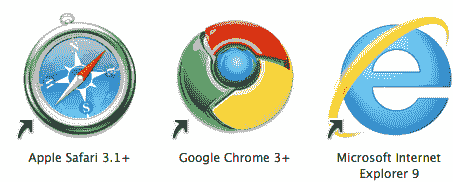

### 提示

谷歌现在部分地拒绝了 H.264 格式，更倾向于支持新的 WebM 视频文件格式。

+   Ogg 可能听起来有点滑稽，但它的潜力是非常严肃的，我向你保证。Ogg 实际上是两种东西：Ogg Theora 是一种视频文件格式；Ogg Vorbis 是一种音频文件格式。Theora 实际上更多地是一种视频文件压缩格式，而不是播放文件格式，尽管它也可以用于播放。它没有专利，因此被视为开源。我们将在下一节讨论 Ogg Vorbis。

### 提示

有趣的事实：根据维基百科，“Theora 是以 Max Headroom 电视节目中 Edison Carter 的控制器 Theora Jones 的名字命名的。”

支持 Ogg 视频文件格式的浏览器包括：

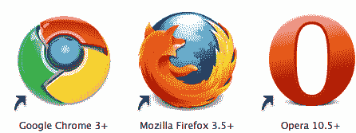

+   WebM 是在线视频文件格式竞赛中最新的参与者。这种开源音频/视频文件格式的开发由谷歌赞助。WebM 文件包含 Ogg Vorbis 音频流和 VP8 视频流。它得到了许多媒体播放器的支持，包括 Miro、Moovidia、VLC、Winamp 等，YouTube 也有初步支持。Flash 的制造商表示未来将支持 WebM，Internet Explorer 9 也将支持。目前支持 WebM 的浏览器包括：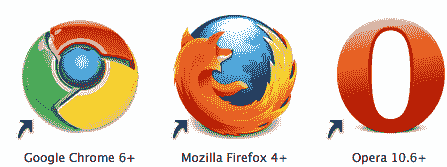

## 还有更多...

到目前为止，这似乎是一长串音频和视频文件格式，最多只有零星的浏览器支持。如果你开始有这种感觉，那么你是对的。

事实上，没有一个音频或视频文件格式能够成为统治它们所有的真正格式。相反，我们开发人员通常必须以多种格式提供新的音频和视频文件，让浏览器决定它最舒适和能够播放的格式。目前这有点麻烦，但希望未来我们能够选择更少的格式，获得更一致的结果。

### 音频文件格式

还有一些音频文件格式。让我们来看看这些。

+   AAC - 高级音频编码文件更为人所知的是 AAC。这种音频文件格式被设计成在相同比特率下比 MP3 更好听。苹果使用这种音频文件格式来制作 iTunes 音乐商店的音频文件。由于 AAC 音频文件格式支持 DRM，苹果提供受保护和非受保护格式的文件。AAC 有专利，因此从定义上来说，我们也不能完全称其为开源音频文件格式。所有苹果硬件产品，包括他们的 iPhone 和 iPad 移动设备以及 Flash，都支持 AAC 音频文件格式。支持 AAC 的浏览器包括：

+   MP3 - MPEG-1 音频层 3 文件更为人所知的是 MP3。除非你一直躲在石头下，你知道 MP3 是当今最普遍使用的音频文件格式。这些文件可以播放两个声道的声音，并且可以使用多种比特率进行编码，最高可达 320。一般来说，比特率越高，音频文件的音质就越好。这也意味着文件大小更大，因此下载速度更慢。MP3 有专利，因此从定义上来说，我们也不能完全称其为开源音频文件格式。支持 MP3 的浏览器包括：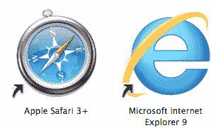

+   Ogg - 我们之前讨论过 Ogg Theora 视频文件格式。现在，让我们来看看 Ogg Vorbis 音频格式。正如之前提到的，Ogg 文件没有专利，因此被视为开源。

### 提示

另一个有趣的事实是：根据维基百科，“Vorbis 是以《小神》中的 Exquisitor Vorbis 角色命名的。”


### 文件格式不可知。

我们花了很多时间来检查这些不同的视频和音频文件格式。每种格式都有其优点和缺点，并且受到各种浏览器的支持（或不支持）。有些比其他的效果更好，有些听起来和看起来比其他的更好。但好消息是：新的 HTML5 `<video>`和`<audio>`元素本身是文件格式不可知的！这些新元素不在乎您引用的视频或音频文件的类型。相反，它们提供您指定的内容，并让每个浏览器做它最舒服的事情。

### 有一天我们能停止这种疯狂吗？

最重要的是，直到一个新的 HTML5 音频和一个新的 HTML5 视频文件格式成为所有浏览器和设备的明确选择，音频和视频文件将不得不被编码多次进行播放。不要指望这种情况很快会改变。

# 为所有人显示视频

根据作者 Mark Pilgrim 的说法，您的 HTML5 网络视频工作流程将如下所示：

+   制作一个使用 WebM（VP8 和 Vorbis）的版本。

+   制作另一个版本，该版本在 MP4 容器中使用 H.264 基线视频和 AAC“低复杂度”音频。

+   制作另一个版本，该版本在 Ogg 容器中使用 Theora 视频和 Vorbis 音频。

+   从单个`<video>`元素链接到所有三个视频文件，并回退到基于 Flash 的视频播放器。

Kroc Camen 在创建“面向所有人的视频”时确实做到了这一点，这是一段 HTML 代码，如果用户的浏览器可以处理它，就会显示新的 HTML5 视频元素，如果不能，就会显示 Flash 电影 —— 而无需 JavaScript。让我们看看 Kroc 是如何做到的：[`camendesign.com/code/video_for_everybody`](http://camendesign.com/code/video_for_everybody)。

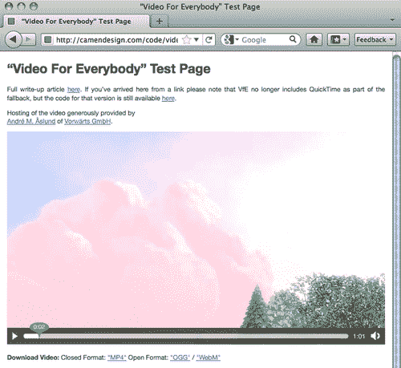

## 如何做...

```html
<video controls height="360" width="640">
<source src="img/__VIDEO__.MP4" type="video/mp4" />
<source src="img/__VIDEO__.OGV" type="video/ogg" />
<object width="640" height="360" type="application/ x-shockwave-flash" data="__FLASH__.SWF">
<param name="movie" value="__FLASH__.SWF" />
<param name="flashvars" value="controlbar=over&amp; image=__POSTER__.JPG&amp;file=__VIDEO__.MP4" />

</object>
</video>
<p><strong>Download Video:</strong>
Closed Format: <a href="__VIDEO__.MP4">"MP4"</a>
Open Format: <a href="__VIDEO__.OGV">"Ogg"</a>
</p>

```

仔细观察，很容易看出 Kroc 做了什么。首先，他调用了浏览器本地播放控件，以及新的 HTML5 视频元素的相关高度和宽度。

```html
<video controls height="360" width="640">

```

接下来，Kroc 依次调用每个新的 HTML5 视频源，从 MP4 文件开始。桌面浏览器不太在乎 HTML5 视频文件的顺序，但 iPad 对于想要首先指定 MP4 文件很挑剔，所以好吧。又是你赢了，史蒂夫·乔布斯。

```html
<source src="img/__VIDEO__.MP4" type="video/mp4" />
<source src="img/__VIDEO__.OGV" type="video/ogg" />

```

然后，Kroc 通过调用相同文件的 Flash 视频版本来保险，以应对无法处理新的 HTML5 视频元素的软弱浏览器。

```html
<object width="640" height="360" type="application/x-shockwave-flash" data="__FLASH__.SWF">
<param name="movie" value="__FLASH__.SWF" />
<param name="flashvars" value="controlbar=over&amp; image=__POSTER__.JPG&amp;file=__VIDEO__.MP4" />

</object>

```

最后，Kroc 通过提示用户选择性地下载新的 HTML5 视频文件本身，以封闭（MP4）和开放（Ogg）格式进行了精心的处理。分享就是关怀。

```html
<p><strong>Download Video:</strong>
Closed Format: <a href="__VIDEO__.MP4">"MP4"</a>
Open Format: <a href="__VIDEO__.OGV">"Ogg"</a>
</p>

```

### 提示

当然，您可以用自己文件的路径替换“_VIDEO_.MP4”之类的东西。

这种方法非常成功，因为无论您使用什么网络浏览器，您都可以看到*某些东西* —— 而无需使用 JavaScript 或下载 Flash。

## 它是如何工作的...

这个概念实际上非常简单：如果您的浏览器能够播放新的 HTML5 视频元素文件，那么您将看到它。如果它不能做到，代码堆栈中还包括了一个 Flash 电影，所以您应该会看到它。如果由于某种原因，您的浏览器无法原生支持新的 HTML5 视频元素，Flash 播放器崩溃或不可用，您将看到一个静态图像。每个人都有保障。

使用此方法将显示新的 HTML5 视频元素的浏览器包括：

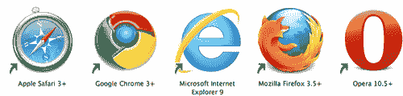

使用此方法将显示 Flash 视频的浏览器包括：

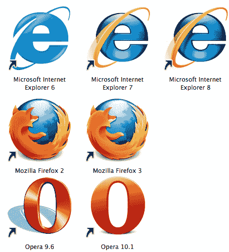

## 还有更多...

所有其他 Flash 视频嵌入方法都会提示用户下载 Flash（如果尚未安装）。《面向所有人的视频》独特之处在于它不会这样做。作者 Kroc Camen 是有意为之，他说：

> “用户已经有足够的安全问题了，而不需要随机的网站提示他们安装东西-对于那些不想要或无法使用 Flash 的人来说，这更加恼人。”

### 浪费 mime 是一件可怕的事情

Kroc 提醒我们确保我们的服务器使用正确的`mime-types`并建议将这些行放在你的`.htaccess`文件中：

```html
AddType video/ogg .ogv
AddType video/mp4 .mp4
AddType video/webm .webm

```

### 外部“Video for Everybody”

现在 WordPress 有一个“Video for Everybody”插件，网址是[`wordpress.org/extend/plugins/external-video-for-everybody`](http://wordpress.org/extend/plugins/external-video-for-everybody)。现在你也可以在你的博客上轻松使用 Kroc 的方法。

### 灵活地处理你的方法

稍后我们将看一种方法，它实现了与 Kroc 的方法几乎相同的功能，但这次是用 JavaScript。记住：做对你、你的项目和最重要的是你的客户最有意义的事情。

## 另见

Humanstxt.org 是一个让网站开发者更加知名的项目。该网站鼓励开发者包含一个小文本文件，其中包含每个贡献创建和构建网站的团队成员的信息。请访问：[`humanstxt.org`](http://humanstxt.org)。

# 创建无障碍音频和视频

我们已经非常广泛地研究了如何向人们提供在线 HTML5 `video`，而不管他们的浏览器是什么，但对于依赖辅助技术的人，我们并没有给予太多关注。现在结束了。

## 如何做到...

首先，我们将从 Kroc Camen 的“Video for Everybody”代码块开始，然后检查如何使其对辅助功能友好，最终看起来像这样：

```html
<div id="videowrapper">
<video controls height="360" width="640">
<source src="img/__VIDEO__.MP4" type="video/mp4" />
<source src="img/__VIDEO__.OGV" type="video/ogg" />
<object width="640" height="360" type="application/ x-shockwave-flash" data="__FLASH__.SWF">
<param name="movie" value="__FLASH__.SWF" />
<param name="flashvars" value="controlbar=over&amp; image=__POSTER__.JPG&amp;file=__VIDEO__.MP4" />

</object>
<track kind="captions" src="img/videocaptions.srt" srclang="en" />
<p>Final fallback content</p>
</video>
<div id="captions"></div>
<p><strong>Download Video:</strong>
Closed Format: <a href="__VIDEO__.MP4">"MP4"</a>
Open Format: <a href="__VIDEO__.OGV">"Ogg"</a>
</p>
</div>

```

## 它是如何工作的...

你会注意到的第一件事是，我们将新的 HTML5 `video`元素包装在一个`div`包装器中。虽然从语义上讲这并不是严格必要的，但它将为我们的 CSS 提供一个很好的“钩子”。

```html
<div id="videowrapper">

```

下一部分的大部分内容应该是从前一部分中可以识别出来的。这里没有改变：

```html
<video controls height="360" width="640">
<source src="img/__VIDEO__.MP4" type="video/mp4" />
<source src="img/__VIDEO__.OGV" type="video/ogg" />
<object width="640" height="360" type="application/ x-shockwave-flash" data="__FLASH__.SWF">
<param name="movie" value="__FLASH__.SWF" />
<param name="flashvars" value="controlbar=over&amp;
image=__POSTER__.JPG&amp;file=__VIDEO__.MP4" />

</object>

```

到目前为止，我们仍然使用的是向能够处理它的浏览器提供新的 HTML5 `video`元素的方法，并将 Flash 作为我们的第一个备用选项。但是如果 Flash 不是一个选择，接下来会发生什么就变得有趣起来：

```html
<track kind="captions" src="img/videocaptions.srt" srclang="en" />

```

你可能会想，那是什么鬼。

> “`track`元素允许作者为媒体元素指定显式外部定时文本轨道。它本身不代表任何东西。”- W3C HTML5 规范

现在我们有机会使用 HTML5 规范的另一个新部分：新的`<track>`元素。现在，我们可以引用`kind="captions"`中指定的外部文件类型。你可以猜到，`kind="captions"`是用于字幕文件，而`kind="descriptions"`是用于`audio`描述。当然，`src`调用特定的文件，`srclang`设置新的 HTML5 `track`元素的源语言。在这种情况下，`en`代表英语。不幸的是，目前没有浏览器支持新的`track`元素。

最后，我们允许最后一点备用内容，以防用户无法使用新的 HTML5 `video`元素或 Flash 时，我们会给他们一些纯文本内容。

```html
<p>Final fallback content</p>

```

现在，即使用户看不到图像，他们至少会得到一些描述性内容。

接下来，我们将创建一个容器`div`来容纳我们基于文本的字幕。因此，目前没有浏览器支持新的 HTML5 `audio`或`video`元素的闭合字幕，我们将留出空间来包含我们自己的字幕：

```html
<div id="captions"></div>

```

最后，我们将包括 Kroc 的文本提示，以下载 HTML5 `video`的封闭或开放文件格式：

```html
<p><strong>Download Video:</strong>
Closed Format: <a href="__VIDEO__.MP4">"MP4"</a>
Open Format: <a href="__VIDEO__.OGV">"Ogg"</a>
</p>

```

## 还有更多...

除了新的 HTML5 `audio`和`video`元素的可选`controls`属性之外，还有可选的`loop`属性。你可能会猜到，这个例子将允许 HTML5 `video`一直播放：

```html
<video controls height="360" loop width="640">

```

### 始终考虑无障碍。

我们默认提供的最终描述性内容可能是为使用辅助技术的人提供可下载链接的替代位置。这将使能够看到或听到的人无法下载，因此你应该确定这种方法是否适合你。

### 浏览器支持

对新的 HTML5 `audio`和`video`元素具有最佳辅助功能支持的网络浏览器包括：

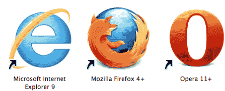

### 查看更多

你可以在[`html5accessibility.com`](http://html5accessibility.com)上跟踪 HTML5 的可访问性。该网站跟踪新的 HTML5 功能，如`audio`和`video`在哪些浏览器中可用。你可能会惊讶地发现，截至目前，Opera 是最不友好的可访问性的网络浏览器，甚至低于微软 Internet Explorer 9。惊喜吧。

## 另请参阅

Video.Js 是另一个免费的开源 HTML5 视频播放器。它很轻量，不使用任何图像，但通过 CSS 完全可定制。它看起来很棒，并支持苹果 Safari、Google Chrome、微软 Internet Explorer 9、Mozilla Firefox 和 Opera，同时还支持 IE 6-8 的回退。它甚至适用于 iPhone、iPad 和 Android 等移动设备。请访问[`videojs.com`](http://videojs.com)查看。

# 打造流畅的音频播放器

Neutron Creations 的负责人和联合创始人兼前端开发人员本·博迪恩为 Tim Van Damme 的 The Box 播客创建了一个定制的 HTML5 `audio`播放器，网址为[`thebox.maxvoltar.com`](http://thebox.maxvoltar.com)。本的创作快速、直观且流畅。让我们深入了解他是如何做到的。

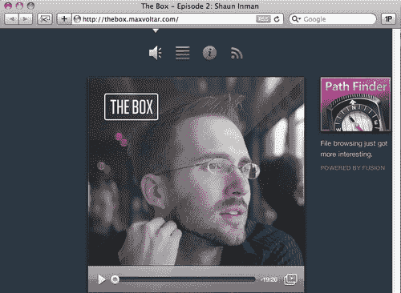

本的自定义 HTML5 `audio`播放器具有被采访者（在这种情况下是 Shaun Inman）的吸引人照片，一个播放/暂停按钮，指示播放进度的轨道，以及如果你愿意，将 HTML5 `audio`播放器弹出到一个单独的窗口的能力。就是这样。没有更多的需要。作为一个额外的触摸，注意 HTML5 `audio`播放器条的轻微透明度细节。平滑。

## 如何做到这一点...

起初，本的标记似乎看起来非常简单：

```html
<p class="player">
<span id="playtoggle" />
<span id="gutter">
<span id="loading" />
<span id="handle" class="ui-slider-handle" />
</span>
<span id="timeleft" />
</p>

```

等一下，我听到你在想，“HTML5 `audio`标签在哪里？！”别担心。本是个聪明人，对此有计划。但首先让我们看看他到目前为止做了什么。

```html
<p class="player">

```

到目前为止，这很简单。本创建了一个包装元素（在这种情况下是`<p>`）来放置他的播放器。他可以使用`<div>`吗？也许。做对你和你的项目最有意义的事情。

```html
<span id="playtoggle" />

```

然后，本使用这个自闭合的（注意末尾的斜杠）`span`来进行播放/暂停切换按钮。

```html
<span id="gutter">
<span id="loading" />
<span id="handle" class="ui-slider-handle" />
</span>

```

现在，事情变得有趣起来。本的“排水沟”`span`包含了时间轴轨道，显示 HTML5 `audio`文件的加载或缓冲进度的条形元素，以及指示播放头的圆形元素，如果你选择，可以来回“擦洗”。

```html
<span id="timeleft" />

```

最后，本使用另一个自闭合的`span`来显示剩余的时间，以分钟和秒为单位。

### 提示

`<span>`元素可以胜任，但它并不是非常语义化，是吗？Patrick H. Lauke 迅速指出，使用可聚焦元素将大大提高这种方法对依赖辅助技术的人的可访问性。

## 它是如何工作的...

本使用 jQuery 来检测对 HTML5 `audio`的支持。

```html
if(!!document.createElement('audio').canPlayType) {
var player = '<p class="player"> ... </p>\
<audio>\
<source src="img/episode1.ogg" type="audio/ogg"></source>\
<source src="img/episode1.mp3"
type="audio/mpeg"></source>\
<source src="img/episode1.wav" type="audio/ x-wav"></source>\
</audio>';
$(player).insertAfter("#listen .photo");
}

```

在这段代码中，我们可以看到如果浏览器支持 HTML5 `audio`，它将提供完整的 HTML5 `<audio>`标签，包括对`.ogg, .mp3`和`.wav`的回退，这是我们尚未使用过的文件格式。由于新的 HTML5 `<audio>`和`<video>`元素是文件格式不可知的，`.wav`文件也应该可以正常工作。

本已经创建了一个简单的 JavaScript 代码片段，允许浏览器做他们感觉最舒服的事情。如果这对你和你的项目有意义，考虑这种方法，但记住，你依赖 JavaScript 来完成大部分工作，而不是我们已经看过的其他方法，这些方法不依赖于它。

### 提示

请注意，如果您使用`<div>`来包含 HTML5“视频”播放器，那么 JavaScript 也必须进行调整。简而言之，`<p class="player">`...`</p>`将被更改为`<div class="player">`...`</div>`。

## 还有更多...

到目前为止，我们已经为播放器设置了标记，并“嗅探”以查看任何特定浏览器想要的文件格式。现在，我们需要添加一些功能。

```html
audio = $('.player audio').get(0);
loadingIndicator = $('.player #loading');
positionIndicator = $('.player #handle');
timeleft = $('.player #timeleft');
if ((audio.buffered != undefined) && (audio.buffered.length != 0)) {
$(audio).bind('progress', function() {
var loaded = parseInt(((audio.buffered.end(0) / audio.duration) * 100), 10);
loadingIndicator.css({width: loaded + '%'});
});
}
else {
loadingIndicator.remove();
}

```

然后添加一个函数来计算播放头的位置，以确定剩余时间，要小心包括前导零（如果需要的话）。

```html
$(audio).bind('timeupdate', function() {
var rem = parseInt(audio.duration - audio.currentTime, 10),
pos = (audio.currentTime / audio.duration) * 100,
mins = Math.floor(rem/60,10),
secs = rem - mins*60;
timeleft.text('-' + mins + ':' + (secs > 9 ? secs : '0' + secs));
if (!manualSeek) { positionIndicator.css({left: pos + '%'}); }
if (!loaded) {
loaded = true;
$('.player #gutter').slider({
value: 0,
step: 0.01,
orientation: "horizontal",
range: "min",
max: audio.duration,
animate: true,
slide: function() {
manualSeek = true;
},
stop:function(e,ui) {
manualSeek = false;
audio.currentTime = ui.value;
}
});
}
});

```

唯一剩下的就是调用播放/暂停按钮功能。

```html
$(audio).bind('play',function() {
$("#playtoggle").addClass('playing');
}).bind('pause ended', function() {
$("#playtoggle").removeClass('playing');
});
$("#playtoggle").click(function() {
if (audio.paused) { audio.play(); }
else { audio.pause(); }
});

```

### 风格和内容

在创建了简单的标记和详细的 JavaScript 来创建 Ben 定制的 HTML5“音频”播放器之后，唯一剩下的就是对其进行样式设置：

```html
.player {
display: block;
height: 48px;
width: 400px;
position: absolute;
top: 349px;
left: -1px;
-webkit-box-shadow: 0 -1px 0 rgba(20, 30, 40, .75);
-moz-box-shadow: 0 -1px 0 rgba(20, 30, 40, .75);
-o-box-shadow: 0 -1px 0 rgba(20, 30, 40, .75);
box-shadow: 0 -1px 0 rgba(20, 30, 40, .75);
border-top: 1px solid #c2cbd4;
border-bottom: 1px solid #283541;
background: #939eaa;
background: -webkit-gradient(linear, 0% 0%, 0% 100%, from(rgba(174, 185, 196, .9)), to(rgba(110, 124, 140, .9)), color-stop(.5, rgba(152, 164, 176, .9)), color-stop(.501, rgba(132, 145, 159, .9)));
background: -moz-linear-gradient(top, rgba(174, 185, 196, .9), rgba(152, 164, 176, .9) 50%, rgba(132, 145, 159, .9) 50.1%, rgba(110, 124, 140, .9));
background: linear-gradient(top, rgba(174, 185, 196, .9), rgba(152, 164, 176, .9) 50%, rgba(132, 145, 159, .9) 50.1%, rgba(110, 124, 140, .9));
cursor: default;
}
#playtoggle {
position: absolute;
top: 9px;
left: 10px;
width: 30px;
height: 30px;
background: url(../img/player.png) no-repeat -30px 0;
cursor: pointer;
}
#playtoggle.playing {background-position: 0 0;}
#playtoggle:active {top: 10px;}
#timeleft {
line-height: 48px;
position: absolute;
top: 0;
right: 0;
width: 50px;
text-align: center;
font-size: 11px;
font-weight: bold;
color: #fff;
text-shadow: 0 1px 0 #546374;
}
#wrapper #timeleft {right: 40px;}
#gutter {
position: absolute;
top: 19px;
left: 50px;
right: 50px;
height: 6px;
padding: 2px;
-webkit-border-radius: 5px;
-moz-border-radius: 5px;
-o-border-radius: 5px;
border-radius: 5px;
background: #546374;
background: -webkit-gradient(linear, 0% 0%, 0% 100%, from(#242f3b), to(#516070));
background: -moz-linear-gradient(top, #242f3b, #516070);
background: linear-gradient(top, #242f3b, #516070);
-webkit-box-shadow: 0 1px 4px rgba(20, 30, 40, .75) inset, 0 1px 0 rgba(176, 187, 198, .5);
-moz-box-shadow: 0 1px 4px rgba(20, 30, 40, .75) inset, 0 1px 0 rgba(176, 187, 198, .5);
-o-box-shadow: 0 1px 4px rgba(20, 30, 40, .75) inset, 0 1px 0 rgba(176, 187, 198, .5);
box-shadow: 0 1px 4px rgba(20, 30, 40, .75) inset, 0 1px 0 rgba(176, 187, 198, .5);
}
#wrapper #gutter {right: 90px;}
#loading {
background: #fff;
background: #939eaa;
background: -webkit-gradient(linear, 0% 0%, 0% 100%, from(#eaeef1), to(#c7cfd8));
background: -moz-linear-gradient(top, #eaeef1, #c7cfd8);
background: linear-gradient(top, #eaeef1, #c7cfd8);
-webkit-box-shadow: 0 1px 0 #fff inset, 0 1px 0 #141e28;
-moz-box-shadow: 0 1px 0 #fff inset, 0 1px 0 #141e28;
-o-box-shadow: 0 1px 0 #fff inset, 0 1px 0 #141e28;
box-shadow: 0 1px 0 #fff inset, 0 1px 0 #141e28;
-webkit-border-radius: 3px;
-moz-border-radius: 3px;
-o-border-radius: 3px;
border-radius: 3px;
display: block;
float: left;
min-width: 6px;
height: 6px;
}
#handle {
position: absolute;
top: -5px;
left: 0;
width: 20px;
height: 20px;
margin-left: -10px;
background: url(../img/player.png) no-repeat -65px -5px;
cursor: pointer;
}
.player a.popup {
position: absolute;
top: 9px;
right: 8px;
width: 32px;
height: 30px;
overflow: hidden;
text-indent: -999px;
background: url(../img/player.png) no-repeat -90px 0;
}
.player a.popup:active {background-position: -90px 1px;}Content matters

```

当包装内容引人入胜时，花时间创造有趣的东西会更容易和更有回报。The Box 音频采访总是很有趣——只是可惜作者 Tim Van Damme 不经常发布它们。希望将来会有所改变。在[`thebox.maxvoltar.com`](http://thebox.maxvoltar.com)上查看。

### 注意细节

当页面上一次只有一个新的 HTML5“音频”或“视频”元素时，这种方法效果很好。如果您需要多个，您将不得不修改 JavaScript 以连接到标记中的多个“挂钩”。

## 另请参阅

SublimeVideo 采用了一种不同的方法来进行 HTML5 在线视频播放：在这种情况下，播放器不是由您创建或托管的，而是由云中播放器的制造商创建的。好处是您始终拥有可能的最新、最新鲜的播放器版本。这样，当新功能可用或错误被修复时，您无需做任何事情。您自动拥有最新的功能。在[`sublimevideo.net`](http://sublimevideo.net)上查看。

# 为移动设备嵌入音频和视频

到目前为止，我们只是触及了移动体验，但随着越来越智能的移动设备的开发增加，我们需要将注意力转向如何在这些设备上显示我们的新 HTML5“音频”和“视频”。以下是方法。

## 如何做...

现在我们知道如何为我们的目标受众选择 HTML5“音频”或“视频”文件格式，我们现在可以将注意力转向确保他们不仅可以在台式电脑和笔记本电脑上听到或观看，还可以在移动设备上听到或观看。

我们将首先在[`vimeo.com`](http://vimeo.com)上创建一个免费帐户。注册完成后，选择主菜单中的上传|视频功能。您将选择要上传的文件，添加可选的元数据，然后让 Vimeo 服务器设置您的文件。接下来真正的激动时刻开始了：嵌入“视频”。从 Vimeo 主菜单中选择**工具**|**嵌入此视频**。

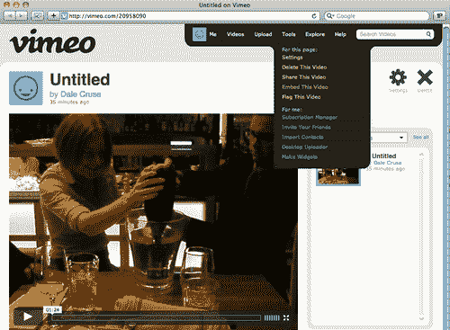

## 它是如何工作的...

Vimeo 过去使用我们之前看过的老式 Flash 嵌入方法。现在它使用基于 iFrame 的方法，可以在 iPhone、iPad 和其他移动设备上播放 HTML5“视频”。以下是一个示例，基于作者上传的一个“视频”：

```html
<iframe src="img/20958090" width="400" height="300" frameborder="0"></iframe><p><a href="http://vimeo.com/20958090">Untitled</a> from <a href="http://vimeo.com/user6281288">Dale Cruse</a> on <a href="http://vimeo.com">Vimeo</a>.</p>

```

## 还有更多...

一旦您将基于 iFrame 的代码片段复制并粘贴到网页上，并在 iPhone 或 iPad 上查看它，您应该会看到一个移动友好的 HTML5“视频”，您可以像这样使其全屏：


### Vimeo 提供了更多

Vimeo 还允许您从电子邮件联系人列表中添加朋友，创建“视频”订阅，制作小部件等等。他们现在甚至提供视频学校，以帮助用户了解捕捉、编辑和分享视频的最有效方法。

### 循环回来。

YouTube，世界上最受欢迎的在线视频观看网站，现在也采用基于 iFrame 的嵌入视频的方法。我们可以采用本章开头使用的“Neutraface”视频，使用新的基于 iFrame 的嵌入方法，得到更语义化和友好的结果。它也通过了验证！

```html
<iframe title="YouTube video player" width="1280" height="750" src="img/xHCu28bfxSI?rel=0&amp;hd=1" frameborder="0" allowfullscreen></iframe>

```

看看这有多漂亮！

我们已经完全转变了我们的视频捕捉、编辑和播放能力，以在现代浏览器中运行，同时支持依赖辅助技术和移动设备的用户。这是一个不断发展的过程。

## 另请参阅

Adobe 是否在自掘坟墓？并非如此。2011 年初，Adobe 推出了一个免费的 Flash 转 HTML5 转换器，代号“Wallaby”。不幸的是，许多设计师和开发人员认为 Adobe 在声称 Wallaby 可以使用 Web 标准将 Flash 转换为 HTML5 时过于夸大其词。事实上，它只是将 Flash CS5 或更高版本中创建的最简单的动画转换为简单的标记和样式。它没有能力将 ActionScript 转换为 JavaScript，这种能力才真正使该工具有价值。请查看 John Nack 的博客上关于 Wallaby 发布的公告[`blogs.adobe.com/jnack/2011/03/wallaby-flash-to-html5-conversion-tool-now-available.html`](http://blogs.adobe.com/jnack/2011/03/wallaby-flash-to-html5-conversion-tool-now-available.html)。
