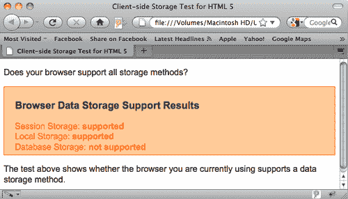
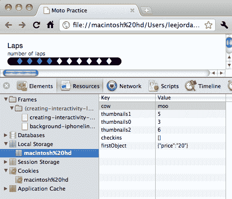
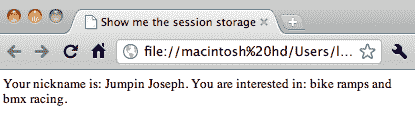
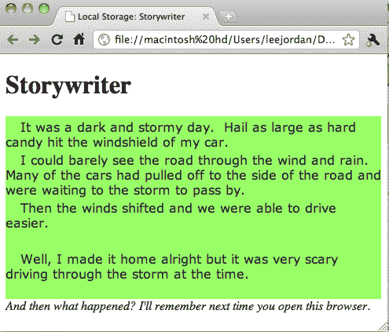
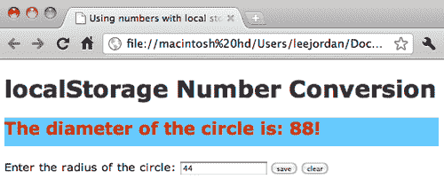
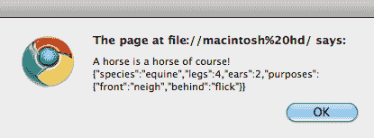
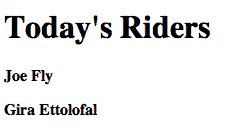
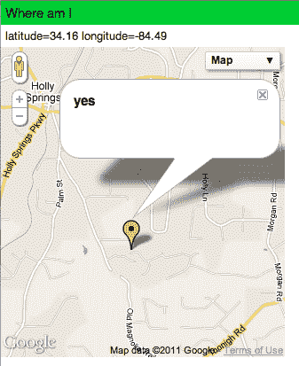

# 第九章：数据存储

在本章中，我们将涵盖：

+   测试浏览器是否支持数据存储

+   使用浏览器开发者工具来监视 web 存储

+   设置和获取会话存储变量

+   设置和获取本地存储变量

+   将本地存储字符串转换为数字使用`parseInt`

+   创建一个 web SQL 数据库

+   使用 web SQL 数据库

+   创建一个缓存清单并离线使用站点

+   使用地理位置 API 和`geo.js`显示当前位置

# 介绍

HTML5 引入了一种新的存储信息的方式，而不使用 cookies。这使得设计师和开发人员在处理和显示动态内容时具有更大的灵活性。我们将从测试浏览器是否支持三种主要的数据存储方法开始，最后创建一个使用本地存储来存储和访问视频的 HTML5 页面。虽然这些配方都是基于彼此构建的，但你不必按照它们呈现的顺序完成它们。本章的示例文件可在[`www.packtpub.com/support?nid=7940`](http://www.packtpub.com/support?nid=7940)下载。

# 测试浏览器是否支持数据存储

知道如何快速测试浏览器是否支持你想要使用的数据存储方法将使开发页面和应用程序变得更容易。在这个配方中，我们将创建一个脚本，查询浏览器的 DOM，以测试不同数据存储方法的支持。

## 准备工作

你需要访问一个现代浏览器，如 Firefox 3.6，或者流行浏览器的最新版本，如 Google Chrome，Opera，Safari 或 Internet Explorer。

## 如何做...

首先，我们将创建一个简单的 html 页面。打开一个 HTML 编辑程序或文本编辑器，并输入一个基本的 HTML5 页面的起始代码：

```html
<!doctype html><html lang="en"><head><title>Client-side Storage Test for HTML5</title>
<meta charset="utf-8">

```

现在测试页面的外观需要进行样式设置。我们将在 HTML 页面的`<head>`标签中使用`<style>`标签，但你也可以将它们放在一个单独的 CSS 文件中。

```html
<style>
#results { background-color: #ffcc99; border: 1px #ff6600 solid; color: #ff6600; padding: 5px 20px; margin-bottom: 10px; }
#results .value { font-weight: bold; }
#results h3 { color: #333333; }
</style>

```

输入一个闭合的`head`标签，然后创建一个如下所示的`body`标签。注意，一个很大的区别是我们在页面加载时调用了一个`RunTest()`函数来激活。

```html
</head><body onload="RunTest();">

```

创建一个带有类似下面所示的描述性文本的段落标签。关闭标签，并创建一个包含结果标题的`<h3>`标题标签。

```html
<p>Does your browser support all storage methods?</p>
<div id="results"><h3>Browser Data Storage Support Results</h3>

```

现在，输入每种存储方法，后面跟一个由类值样式化的 span 标签。输入存储方法的 ID 和文本“不支持”。关闭 span 标签，并添加一个换行标签，以便在浏览器窗口中将结果分开显示在单独的行上。结果的显示区域应该如下所示的代码块：

```html
Session Storage: <span class="value" id="session">not supported</span><br/>
Local Storage: <span class="value" id="local">not supported</span> <br />
Database Storage: <span class="value" id="db">not supported</span> <br /></div>

```

我们几乎完成了创建我们的测试页面。创建一个段落来解释测试的目的。用一个`<footer>`标签来包含我们接下来要添加的脚本块。描述性文本应该如下所示的代码：

```html
<p>The test above shows whether the browser you are currently using supports a data storage method.</p> <footer>

```

现在，我们将添加`script`标签，以便浏览器处理一个小的测试程序：

```html
<script language="javascript">
function RunTest() {
for (var mydata in window)
{

```

接下来，我们将创建一个包含每种数据存储方法的代码块的 case 语句，我们将要测试：

```html
switch (mydata) {
case "sessionStorage": document.getElementById("session").innerHTML = "supported";
break;
case "localStorage": document.getElementById("local").innerHTML = "supported";
break;
case "openDatabase": document.getElementById("db").innerHTML = "supported";
break;
} }} </script> </footer> </body> </html>

```

将文件保存为`data-storage-support-test.html`，并在浏览器窗口中打开它。你应该看到类似以下截图的结果：



## 它是如何工作的...

我们创建的 HTML5 测试页面使用了一小段 JavaScript 代码来查询浏览器是否支持特定的存储方法。我们首先编写了一个标准的 HTML5 页面，包括适当的`<html>`、`<head>`和其他文档标签。如果需要复习它们，可以在本书的早期章节中找到。接下来，我们使用简化的`<script>`标签设置了 JavaScript 代码片段的开头块。HTML5 JavaScript API 在本书的其他地方有更详细的介绍。我们创建了一个名为`RunTest()`的函数来包含变量和代码。然后创建了两个变量。变量 supp 被赋予了一个空字符串的值。这将包含每种存储方法的最终支持结果。我们正在循环遍历 window 对象的属性。在每次迭代中，当前属性暂时存储在`mydata`变量中。这使我们能够测试属性是否符合三种情况。

接下来，我们使用 switch 语句来测试`mydata`变量与我们感兴趣的特定属性。因为我们一次只测试一个值，而且列表很短，这是测试每种存储方法支持的好方法。switch 语句的主体包含三种情况，每种情况都包含一个必须评估的表达式。如果支持存储方法，则每种情况的最终操作是，如果表达式评估为 true，则将文档主体中结果文本的值从“不支持”更改为“支持”。如果情况评估为 false，则页面结果部分显示的文本将保持不变。

创建代码后，我们使用 CSS 样式控制了结果的呈现。使用名为 results 的 div 标签创建了一个显示框的容器，并指定了背景颜色、字体颜色和字体粗细。这是 html 页面头部的最后一块代码。

然后创建了页面的主体部分。测试被设置为在浏览器中加载页面时激活，使用`onload`命令。编写了结果框的开头文本和标题，并将每个结果的显示文本与唯一的 ID 绑定。然后输入了闭合标签以完成页面。保存页面后，在浏览器窗口中查看测试页面时，结果就会显示在屏幕上。截图中使用的浏览器是 Firefox 3.6.13。我们看到的结果反映了 Firefox 在 3.6 和 4.0.3 版本中提供的当前支持。这帮助我们确定，我们可以期望 Firefox 访问者在依赖本地存储和会话存储方法的网页上轻松查看和使用任何功能。他们将无法利用任何依赖于 WebSQL 的功能。

## 还有更多...

测试网站和在线应用程序从未如此简单。有许多可用的工具和服务，可用于在不同平台和各种浏览器上进行测试。

### 移动测试

您可以在智能设备上下载多个浏览器，如 iPod Touch 或 iPad，从而可以测试富媒体内容在移动设备和不同浏览器上的响应性。

### Adobe 浏览器实验室

不需要 Adobe CS5 即可尝试 Adobe BrowserLab，这是一个与 Adobe CS5 产品集成的在线跨浏览器测试工具。访问[`browserlab.adobe.com`](https://browserlab.adobe.com)了解更多信息。

### 使用 BrowserShots 进行免费的跨浏览器和操作系统测试

对于预算有限且有时间的人来说，[BrowserShots.org](http://BrowserShots.org)是一个替代选择。该网站允许访问者输入其网站的 URL，然后从大量的浏览器和操作系统中进行选择。在免费版本的服务中，结果可能需要几分钟才能出现。

# 使用浏览器开发者工具监视 Web 存储

Web 存储可能很具有挑战性。使用浏览器中的开发人员工具，如 Safari 或 Firefox 附加组件，如 Firebug，可以更容易地诊断问题并跟踪变量的值。在本教程中，我们将使用 Google Chrome 浏览器中的本机开发人员工具来探索浏览器本地存储区域中存储的键/值对。

## 准备工作

您需要一个最新版本的 Google Chrome 浏览器和本章的一个本地存储代码文件。

## 如何做...

在 Google Chrome 浏览器窗口中打开本章中的一个本地存储练习文件。

单击**查看**，从**查看**菜单中选择**开发人员**，然后从**开发人员**弹出菜单中选择**开发人员工具**。

当**开发人员**窗口出现在当前页面上时，选择**资源**选项卡，单击 Google Chrome 开发人员工具窗口导航区域中的**本地存储**，然后单击其中的子菜单。您应该看到类似以下截图的结果：



Google 开发人员工具窗口的资源选项卡下的本地存储部分为我们提供了对每个页面的本地存储区域的访问。它在屏幕右侧显示键和它们对应的值。如果您右键单击一个对象，您将有删除它的选项。

## 它是如何工作的...

我们加载了一个我们知道使用本地存储的页面，以测试 Google Chrome 浏览器中的 Google 开发人员工具窗口如何显示键/值对。

当我们在开发人员工具的左侧菜单中导航时，我们可以选择不同的 Web 存储方法和其他资源。

## 还有更多...

有许多免费的插件和本机浏览器工具，开发人员可以利用。

### 即使您不使用 Firefox，也可以使用 Firebug 附加组件

Firefox 用户长期以来一直在使用 Firebug 附加组件([`getfirebug.com/downloads`](http://getfirebug.com/downloads))来调试和浏览网站和其他在线应用程序。Opera、Google Chrome、Safari 和 IE 6+的用户可以使用 Firebug Lite([`getfirebug.com/firebuglite`](http://getfirebug.com/firebuglite))，并通过轻量级的书签工具体验类似的功能。

### Safari 开发人员工具是 Safari 浏览器的本机工具

打开 Safari 浏览器，单击**Safari**，选择**首选项**，然后单击**高级**选项卡。点击“在菜单栏中显示**开发菜单**”旁边的复选框，开始使用本机开发人员工具。

# 设置和获取会话存储变量

会话存储和本地存储都共享 Web 存储 API。在本教程中，我们将定义两个会话存储变量，然后在屏幕上显示它们。

## 准备工作

您需要一个支持会话存储的最新浏览器。如果您在本地计算机上测试文件，Safari 和 Google Chrome 会有最佳响应。

## 如何做...

首先，我们将创建一个 HTML5 页面的头部区域和一个开放的`body`标签：

```html
<!DOCTYPE HTML><html><head><meta http-equiv="Content-Type" content="text/html; charset=UTF-8"><title>Show me the session storage</title></head><body>

```

添加一个`section`和一个`article`标签。给文章标签一个 ID 为"aboutyou"。

```html
<section><article id="aboutyou"><p></p></section>

```

接下来，我们将使用`setItem`方法创建两个会话存储变量，如下面的代码块所示：

```html
<footer><script>sessionStorage.setItem('nickname', 'Jumpin Joseph'); sessionStorage.setItem('interest', 'bike ramps and bmx racing');

```

现在我们将使用`getElementByID`和`getItem`方法在屏幕上显示我们刚刚设置的会话存储变量：

```html
document.getElementById('aboutyou').innerHTML = ("Your nickname is: " + sessionStorage.getItem('nickname') + "." + " You are interested in: " + sessionStorage.getItem('interest') + "."); </script></footer></body></html>

```

结果应该在浏览器的 HTML 页面上显示，类似于以下截图中显示的方式：



## 它是如何工作的...

在这个例子中，我们为两个会话变量设置了唯一的值。会话存储使用键/值对，因此每个变量在创建时必须设置一个值。默认情况下，这些值是字符串。

我们通过输入`sessionStorage.setItem('`为人的昵称定义了一个会话变量，然后为我们的变量添加了一个名称。

我们为变量`"nickname"`命名，并赋予它值"Jumpin Joseph": `'nickname', 'Jumpin Joseph')`;。

当我们创建第二个会话变量来包含名为`"interest"`的变量及其值时，我们使用了与设置第一个会话变量时相同的语法格式。

尽管通常这些变量将由表单中的值填充，但在示例中我们专注于使用正确的语法。`sessionStorage`关键字标识了存储方法的类型。然后我们跟着一个句号，将`setItem`动作附加到关键字上。然后声明了变量`nickname`并赋予了`Jumpin Joseph`的值。当使用时，这将告诉浏览器创建一个名为`nickname`的新会话存储变量，并将`Jumpin Joseph`的值存储在其中。然后我们创建了第二个会话存储变量，只是因为我们可以。在本章的本地存储示例中，我们将使用表单来获取变量值，以完整地展示存储方法的创建、使用和销毁的生命周期视图。

## 还有更多...

会话存储为我们提供了一种更强大的方式来提供短期客户端存储。

### 一个浏览器，一个会话

会话存储最适用于不需要访问者使用多个浏览器标签来浏览网站的情况，以及存储是临时的情况。虽然 HTML5 规范的数据存储区域仍在不断发展，安全性在金融机构或其他需要高度安全信息的网站中并没有长期的使用记录，但仍然有许多有用的方法可以利用会话存储。

## 另请参阅

*设置和获取本地存储变量的教程*。

# 设置和获取本地存储变量

尽管会话存储是临时的，只在浏览器会话处于活动状态时持续。本地存储甚至在关闭浏览器后仍然存在。在这个教程中，我们将使用 HTML5 的`contenteditable`属性和本地存储来创建一个写故事的应用程序。

## 准备工作

您应该使用最近更新的浏览器。这个教程在 Google Chrome 和 Safari 中效果最好，但在 Firefox 中也可以正常使用。

## 如何做...

首先创建一个基本的 HTML5 页面，然后在打开和关闭`head`标签之间添加一个脚本标记。脚本应链接到[`ajax.googleapis.com/ajax/libs/jquery/1.5.2/jquery.min.js`](http://ajax.googleapis.com/ajax/libs/jquery/1.5.2/jquery.min.js)上的 1.5.2 最小化的 jQuery 库。您的代码现在应该类似于以下代码块：

```html
<!DOCTYPE html><html lang="en"><head><script src="img/ jquery.min.js"></script> <meta http-equiv="Content-Type" content="text/html; charset=utf-8"> <title>Local Storage: Storywriter</title>

```

接下来，我们将添加 CSS 样式来设置文章标记的`background-color`和文本`color`，以及`font-family`。

```html
<style> article{background-color: #9F6;color:#333; font-family:Verdana, Geneva, sans-serif} p{} </style>

```

关闭`head`标记并为`body`和`header`元素创建开放标记。添加一个`h1`标记来显示页面标题为`Storywriter`，然后关闭`header`标记。

```html
</head><body> <header> <h1>Storywriter</h1> </header>

```

为`section`和`article`元素创建开放标记。将`article`元素的 id 设置为“mypage”，并将`contenteditable`属性设置为“true”。

```html
<section><article id="mypage" contenteditable="true">

```

接下来，创建一个包含占位文本`type something`的段落标记，然后关闭段落、`article`和`section`标记。在两个`em`标记之间添加描述性的指令文本。您刚刚输入的内容应该看起来像以下代码：

```html
<p>type something</p> </article> </section><em>And then what happened? I'll remember next time you open this browser. </em>

```

创建一个`script`标记，然后键入`$(function(){`声明 jQuery 函数。

使用参数字符串“mypage”调用`document.getElementById`方法，并将其分配给变量'edit'。

接下来，我们需要添加一个事件处理程序，该处理程序由“edit”元素上的模糊事件触发。键入`$(edit).blur(function(){`，然后键入`localStorage.setItem('storyData", this.innerHTML);})`; 完成函数。

现在本地存储可以使用`setItem`存储字符串，我们可以使用`getItem`将存储的字符串内容推送回页面，方法是键入`if ( localStorage.getItem('storyData') ) { edit.innerHTML = localStorage.getItem('storyData'); } })`;

脚本代码块现在应该看起来像以下代码块：

```html
<script>$(function() { var edit = document.getElementById('mypage'); $(edit).blur(function() { localStorage.setItem('storyData', this.innerHTML); }); if ( localStorage.getItem('storyData') ) { edit.innerHTML = localStorage.getItem('storyData'); } });</script>

```

关闭 body 和 HTML 标签，并保存文件。在浏览器窗口中打开它。现在，您应该能够开始输入自己的故事，并在页面上看到输入的文本，即使您关闭浏览器并稍后重新打开它。它应该类似于以下截图：



## 工作原理...

当我们将`article`标签的`contenteditable`属性设置为`true`时，我们告诉浏览器允许用户输入文本。大多数 HTML5 元素都可以声明`contenteditable`属性，然后将其设置为`true`或`false`。然后，我们使用`document.getElementById`捕获输入的内容，使用 id`mypage`。`getElementById` jQuery 方法搜索文档，查找其参数中列出的特定 ID 名称。然后，我们在`blur`事件上添加了一个事件处理程序，以平滑地显示输入的文本。我们同时使用本地存储方法`setItem`和变量`storyData`存储文本。最后，我们使用`getItem`本地存储方法检查`storyData`是否存在，如果存在，则将其加载到可编辑的 HTML 元素中，使用`edit.innerHTML`和`getItem`。

## 另请参阅

本书中关于 HTML5 元素和 PACKT jQuery 书籍的早期章节。

# 使用 parseInt 将本地存储字符串转换为数字

在这个示例中，我们将从本地存储中获取一个字符串值，并将其转换为整数，以便我们可以使用`parseInt`对其进行数学运算。

## 准备工作

我们将使用 Modernizr（[`www.modernizr.com`](http://www.modernizr.com)）来检测本地存储是否可用，将其托管在名为"js"的子文件夹中。您还需要至少一个最近更新的浏览器。

## 如何做...

创建一个新的 html 页面，直到标题标签，如下面的代码块所示：

```html
<!DOCTYPE html><html lang="en"><head><meta charset="utf-8"> <title>Using numbers with local storage</title>

```

接下来，添加样式以指定`h1`和`h2`标签的字体族、文本颜色，以及`h2`标签的背景颜色和高度。

```html
<style>body{font-family:Verdana, Geneva, sans-serif;} h1{color:#333; }h2{color:#C30;background-color:#6CF; height:30px;}</style>

```

添加一个由 Google 托管的 IE HTML5 shiv，以及一个链接到本地 Modernizr JavaScript 文件：

```html
<!--[if IE]><script src="img/html5.js"></script> <![endif]--><script type="text/javascript" src="img/ modernizr-1.7.min.js"></script>

```

通过 Modernizr 脚本的帮助，执行检查以查看浏览器是否支持本地存储：

```html
<script>if (Modernizr.localstorage) {
// window.localStorage is available!}
else {// the browser has no native support for HTML5 storage document.getElementByID('yayanswer').innerHTML = "Local Storage is not supported by your browser. Maybe it's time for an update?";}

```

创建一个名为`storemyradius()`的函数，声明一个名为`myradiusToSave`的变量，并将其赋值为`document.getElementById('myradius').value`；当访问者点击保存时，将值传递到文本字段中。

```html
function storemyradius() {var myradiusToSave = document.getElementById('myradius').value;

```

添加一个`if`语句，检查`myradiusToSave`是否为 null。在此之下，创建一个本地存储`setItem`方法，键为"myradius"，值为"myradiusToSave"。在`if`语句和`storemyradius`函数的闭合括号之前，放置一个对`displaymyradius()`的函数调用，如下面的代码块所示：

```html
if (myradiusToSave != null) { localStorage.setItem('myradius', myradiusToSave);displaymyradius();}}

```

创建一个名为`displaymyradius`的函数，不接受任何参数，然后添加一个名为`myradius`的变量。将 JavaScript 函数`parseInt`赋值给它，其中包含一个本地存储`getItem`方法，参数为"myradius"，基数为 10。到目前为止，函数应该看起来像以下代码块：

```html
function displaymyradius() { var myradius = parseInt(localStorage.getItem('myradius'),10);

```

在同一个函数中，创建一个 if 语句，检查`myradius`变量是否不为 null 且大于零。创建变量`diameter`，并将其值赋为`2`乘以`myradius`的结果。使用`document.getElementById`和`innerHTML`来显示直径变量的值，以及在 HTML 页面的`h2`标签之间显示消息"The `diameter of the circle is"`。

```html
if (myradius != null && myradius > 0) {var diameter = 2 * myradius;document.getElementById('yayanswer').innerHTML = "The diameter of the circle is: " + diameter + "!";}}

```

创建一个名为`clearmyradius`的函数，不接受任何参数，然后创建一个`if`语句，检查本地存储`getItem`方法是否包含一个不为 null 的值。在`if`语句的括号之间，放置本地存储`removeItem`方法，参数为"myradius"，并调用本地存储`clear`方法。关闭脚本和头标签。我们刚刚编写的代码应该类似于以下代码块：

```html
function clearmyradius() {if (localStorage.getItem('myradius') != null) {localStorage.removeItem('myradius'); window.localStorage.clear();}}</script></head>

```

创建开头的 body、section、`hgroup`和`h1`标签，并在闭合的`h1`标签前输入`"localStorage Number Conversion"`。创建一个`h2`标签，并给它一个 ID 为`"yayanswer"`。关闭`hgroup`标签，然后为`myradius`文本字段添加一个标签标签。将`"Enter the radius of the circle:"`作为标签文本。创建一个带有 ID 为`"myradius"`和`maxlength`为`"4"`的输入表单字段标签。创建两个输入按钮，一个带有`onclick`值调用函数`storemyradius()`；另一个带有`onclick`值调用函数`clearmyradius();`。关闭 section、body 和 html 标签，并保存页面。最终的代码块应该如下所示：

```html
<body ><section><hgroup><h1>localStorage Number Conversion</h1> <h2 id="yayanswer"></h2></hgroup><label for="myradius">Enter the radius of the circle:</label><input id="myradius" maxlength="4" /> <input onclick="storemyradius();" name="save" type="button" value="save"><input onclick="clearmyradius();" name="clear" type="button" value="clear"></section></body></html>

```

在 Google Chrome 浏览器窗口中，完成的 HTML 页面应该如下所示：



## 它是如何工作的...

HTML 页面中显示的文本字段接受访问者输入并将其作为值传递给`storemyradius()`函数。我们声明了一个名为`myradiusToSave`的变量，并将其赋值为`document.getElementById('myradius').value`；它存储了`myradius`中包含的值。然后它将文本字段"myradius"中输入的值传递给本地存储的`setItem`方法。在将值传递给本地存储之前，我们需要验证`myradiusToSave`实际包含一个不为空的值。如果不为空，那么就有数据可以保存到本地存储中。然后，使用`setItem`将该值保存到本地存储中，作为键/值对的一部分。为了将`myradius`值作为数字使用，我们需要将其从字符串转换回整数。这是通过调用`parseInt` JavaScript 函数来完成的。接下来，我们创建了一个名为`diameter`的变量，用于保存我们的直径公式的结果，即半径值乘以 2。最后，我们使用`getElementbyId`方法将结果返回到屏幕上。

页面上的另一个选项是清除本地存储变量的值。虽然我们可以使用`removeItem`方法，但同时使用 clear 方法也可以确保没有其他本地存储变量潜伏。打开 Google 开发者工具刷新页面，验证本地存储区域为空。

## 还有更多...

目前，默认情况下，`localStorage`将所有数据存储为字符串。我们刚刚练习了将`localStorage`变量转换为整数，但它们也可以转换为数组等对象。

### 在 localStorage 中存储和检索数组

在许多情况下，您会希望使用`localStorage`与数组一起保存游戏中的进度或保留用户数据或消息。您可以使用 Douglas Crockford 的 JSON 库来简化数组的存储和检索。访问[`github.com/douglascrockford/JSON-js`](http://https://github.com/douglascrockford/JSON-js)下载代码并了解更多关于 JSON 的信息。

创建一个新的 HTML5 页面，在两个页脚标签之间添加脚本标签。声明一个名为"horsedef"的新变量数组，并将以下键/值对分配给它，如下所示：

```html
var horsedef = {"species":"equine","legs":4,"ears":2, "purposes":{"front":"neigh","behind":"flick"}};

```

现在，在本地存储中设置一个名为"describehorse"的新项目，同时使用`JSON`将我们的数组`horsedef`转换为字符串，如下所示：

```html
window.localStorage.setItem('describehorse', JSON.stringify(horsedef));

```

使用 JSON 解析从本地存储中检索值：

```html
console.log( alert('A horse is a horse of course! ' + JSON.parse (localStorage.getItem('describehorse')) ); // => Object { species="equine", more...} </script>

```

保存页面，并打开浏览器窗口。您应该看到一个警报框，显示了传递给`describehorse`的`horsedef`数组中的键/值对，如下面的屏幕截图所示：



### 提示

在使用 JSON 时要注意跨站点回调。通常最好从自己的服务器下载并使用文件。始终直接从源下载您的 JSON 副本。不要上当受骗，比如 JSONP。

# 创建 Web SQL 数据库

在这个示例中，我们将创建一个 Web SQL 数据库，并为其定义版本、名称、大小和描述等属性。

## 准备工作

您需要使用支持 Web SQL 数据库的当前浏览器。

## 如何做...

创建一个新的 HTML5 文件，在两个页脚标签之间放置开头和结尾的脚本标签。声明一个名为`db`的变量，然后将`openDatabase()`赋给它。给`openDatabase`传递以下参数：`'mymotodb', '1.0', 'Motocross Rider List DB', 2 * 1024 * 1024`，然后关闭声明。代码应该如下所示：

```html
<script>var db = openDatabase('mymotodb', '1.0', 'Motocross Rider List DB', 2 * 1024 * 1024);</script>

```

保存文件。

## 它是如何工作的...

所有 Web SQL 数据库都使用`openDatabase`方法来为数据库分配值。第一个参数“mymotodb”是数据库的名称。接下来是必需的版本号参数。这里的数字必须与用户尝试使用 Web SQL 数据库时匹配。接下来，我们定义了数据库的描述，然后是估计的大小。一旦为请求的`openDatabase`方法定义了所有参数，数据库就被创建，并且第一个（不可见的）事务发生了——数据库本身的创建。

## 更多信息...

浏览器对规范的实现，如 Web SQL 数据库，一直非常不可预测，同样在 Web 开发社区内对这些规范本身的支持也是如此。

### Web SQL 可能会被 SQLite 替代

Web SQL 数据库规范本身已不再由 W3C 维护，但在大多数浏览器中它仍然运行得相当好。在未来一年左右的时间内，足够多的主要利益相关者可能会就如何实现不同的客户端数据库解决方案达成一致，比如 SQLite，但这样的事情很难预测。请关注[`www.w3.org/TR/webdatabase/`](http://www.w3.org/TR/webdatabase/)上的规范，以获取有关使用客户端数据库的当前选项的更新。

# 使用 Web SQL 数据库

在这个示例中，我们将使用前一个示例中创建的数据库，并向其中添加表和数据，然后在 HTML 页面上显示结果。

## 准备工作

您需要一个当前的浏览器和一个带有基本标签的 HTML5 页面，用于头部区域和正文区域。

## 如何做...

在一个基本的 HTML5 页面上，添加一个`h1`标签来显示页面标题，然后创建一个 ID 为“status”的`div`标签来保存我们的结果，如下面的代码块所示：

```html
<!DOCTYPE HTML><html><head><meta http-equiv="Content-Type" content="text/html; charset=UTF-8"><title>Using WEB SQL Databases</title></head><body><article><section><header><h1>Today's Riders</h1></header><div id="status" name="status"></div> </section></article><footer>

```

开始脚本，如前一个示例所示，以创建数据库（如果尚未创建）。创建一个名为 info 的新变量，然后创建一个包含接受参数的函数的新事务。使用传递的参数，创建一个名为 RIDERS 的表，其中包含唯一 ID 和名为`ridername`的行。代码应该类似于以下代码块：

```html
var info;db.transaction(function (tx) { tx.executeSql('CREATE TABLE IF NOT EXISTS RIDERS (id unique, ridername)');

```

将数据添加到表行中，使用唯一 ID 和每个名称的文本字符串：

```html
tx.executeSql('INSERT INTO RIDERS (id, ridername) VALUES (1, "Joe Fly")'); tx.executeSql('INSERT INTO RIDERS (id, ridername) VALUES (2, "Gira Ettolofal")'); });

```

执行查询以从数据库中提取数据：

```html
db.transaction(function (tx) { tx.executeSql('SELECT * FROM RIDERS', [], function (tx, results) {

```

创建一个新变量和`for`循环来循环遍历结果并将其打印到屏幕上：

```html
var len = results.rows.length, i; for (i = 0; i < len; i++){ info = "<p><b>" + results.rows.item(i).ridername + "</b></p>"; document.querySelector('#status').innerHTML += info; } }, null);});

```

关闭脚本和 HTML 页面。

```html
</script></footer></body></html>

```

## 它是如何工作的...

当我们在浏览器中打开我们刚创建的页面时，我们将看到我们使用数据库来显示的信息。这是因为查询和循环一起工作，通过数据库并显示适当的信息。



## 更多信息...

HTML5 中的安全性和数据库事务可能执行不佳。在生产环境中，应该注意保护接受 SQL 查询的任何页面。

### 将脚本代码保存在单独的文件中

为了使这个示例保持简单，我们没有将 SQL 查询代码和 JavaScript 存储在单独的文件中。这可以通过将代码保存在子文件夹中来实现，例如`../js/myCode.js`。注意使用 Web SQL、Indexed DB 或任何其他类型的基于浏览器的查询 API 来获取安全信息。

### 在生产服务器上防止 SQL 注入

每当有可编辑字段时，都有可能会有一些机器人来尝试进行 SQL 注入攻击。可以通过在事务请求中使用“?”来采取基本预防措施。以下代码显示了一个例子。

```html
store.db.transaction(function(tx) { tx.executeSql( "insert into bmxtricks " + "(time, latitude, longitude, trick) values (?,?,?,?);", [bmxtricks.time, bmxtricks.latitude, bmxtricks.longitude, bmxtricks.trick], handler, store.onError );});

```

## 另请参阅

SQL 的 Packt 图书，任何覆盖客户端数据库的 Packt HTML5 图书。

# 为离线存储创建缓存清单

在这个配方中，我们将创建一个缓存清单文件，以便我们可以离线存储一个 HTML5 页面，并仍然查看页面上显示的图像和视频。

## 准备工作

您将需要一个 HTML5 页面，比如本配方的代码文件中提供的页面，并且可以上传文件到服务器，然后在计算机、智能手机或其他具有浏览器的网络设备上查看这些文件。

## 如何做...

首先，我们将创建缓存清单文件。这应该在一个简单的文本编辑器中创建。它应该包含用户在离线状态下访问所需的所有文件和支持代码。首先列出的是当前文件类型（CACHE MANIFEST）。清单的版本号也应包括在内。请注意，我们在以下代码块中添加了所有要让用户访问的文件的路径：

```html
CACHE MANIFEST
# version 0.1
itsallgooed.html
css/Brian Kent Font License.txt
css/exact-css-from-tutorial.css
css/font-stylesheet.css
css/plasdrip-webfont.eot
css/plasdrip-webfont.svg
css/plasdrip-webfont.ttf
css/plasdrip-webfont.woff
css/plasdrpe-webfont.eot
css/plasdrpe-webfont.svg
css/plasdrpe-webfont.ttf
css/plasdrpe-webfont.woff
css/style.css
images/gooed-science-logo.jpg
images/promo-bg.jpg
images/gakposter.png
movie/GakHowTo.mp4
movie/GakHowTo.ogv
movie/GakHowTo.webm

```

在`index.html`页面的`DOCTYPE`标签和`head`标签之间添加一个 manifest 属性，如下所示：

```html
<!DOCTYPE html> <html lang="en" manifest="gooed.manifest"> <head>

```

最后，创建一个`.htaccess`文件来创建正确的 mime 类型：

```html
AddType text/cache-manifest .manifest

```

页面应该显示类似于以下内容：


## 它是如何工作的...

创建缓存清单为浏览器提供了一个在离线加载页面时使用的清单。虽然离线存储页面的想法是它不需要频繁更新，但使用版本号允许作者在用户下次连接到互联网时推送更新。

并非所有浏览器或系统都能正确解释清单文件类型，因此包含一个`.htaccess`文件可以确保正确识别缓存清单。

您可以排除您认为不重要的文件，以降低离线页面的大小并减少加载时间。

# 使用地理位置和 geo.js 显示当前位置

在这个配方中，我们将使用地理位置规范和`geo.js`来显示活跃用户的当前位置在地图上，并显示他们当前的纬度和经度。

## 准备工作

访问[`code.google.com/p/geo-location-javascript/`](http://code.google.com/p/geo-location-javascript/)下载最新版本的`geo.js`，或者直接从 wiki (http://code.google.com/p/geo-location-javascript/wiki/JavaScriptAPI)获取链接 URL 在线链接到它。

## 如何做...

首先，我们将创建 HTML5 开头页面标签：<head></head>。

然后，在 meta 标签中，我们将把 name 属性设置为"viewport"，并为 content 属性定义以下值：`width = device-width; initial-scale=1.0; maximum-scale=1.0; user-scalable=no`;

现在，声明一个带有 src 属性的脚本标签：[`code.google.com/apis/gears/gears_init.js`](http://code.google.com/apis/gears/gears_init.js)

然后，调用`geo.js`脚本：`src="img/geo.js"`。

到目前为止，代码块应该如下所示：

```html
<html><head><meta name = "viewport" content = "width = device-width; initial-scale=1.0; maximum-scale=1.0; user-scalable=no;"> <script src="img/gears_init.js" type="text/javascript" charset="utf-8"></script><script src="img/geo.js" type="text/javascript" charset="utf-8"></script>

```

为 Google Maps API 添加一个脚本标签：`<script type="text/javascript" src="img/js?sensor=false"></script>`。

现在，我们将创建一个初始化地图的函数`initialize_map()`，然后创建一个名为`myOptions`的数组来存储地图属性。这些属性基于 Google Maps API。它们应该看起来类似于以下代码块：

```html
<script>function initialize_map(){ var myOptions = { zoom: 4, mapTypeControl: true, mapTypeControlOptions: {style: google.maps.MapTypeControlStyle.DROPDOWN_MENU}, navigationControl: true, navigationControlOptions: {style: google.maps.NavigationControlStyle.SMALL}, mapTypeId: google.maps.MapTypeId.ROADMAP }

```

使用`google.maps.Map()`方法向页面添加一个名为 map 的新地图，该方法以`document.getElementById`元素作为参数，而`document.getElementById`又传递了 id 为"map_canvas"。`google.maps.Map`接受的另一个方法是`myOptions`。

```html
map = new google.maps.Map(document.getElementById("map_canvas"), myOptions);}

```

创建`initialize()`函数，并添加一个`if`语句来检查`geo_position_js.init()`函数是否处于活动状态。使用`document.getElementById`和`innerHTML`为 id 为"current"的 div 输入一个新的状态。状态文本为"Receiving…"。

```html
function initialize(){ if(geo_position_js.init()){ document.getElementById('current').innerHTML="Receiving...";

```

如果我们无法获取位置或者由于某种原因浏览器不支持获取当前位置，可以在 helper 消息文本中添加文本以显示，如下所示的代码块：

```html
geo_position_js.getCurrentPosition(show_position,function(){document. getElementById('current').innerHTML="Couldn't get location"}, {enableHighAccuracy:true}); } else{document.getElementById('current').innerHTML="Functionality not available"; }}
function show_position(p){ document.getElementById('current').innerHTML= "latitude="+p.coords.latitude.toFixed(2)+" longitude="+p.coords.longitude.toFixed(2); var pos=new google.maps.LatLng( p.coords.latitude,p.coords.longitude); map.setCenter(pos); map.setZoom(14);

```

创建一个名为`infowindow`的新变量来显示`google.maps InfoWindow`，这是一个在单击标记时显示的气泡。给它一个文本字符串“yes”来显示。创建一个新的与用户当前位置相关联的标记，以及标记的标题文本，该文本将在鼠标悬停时显示。添加一个事件侦听器来检测标记何时被点击。

```html
var infowindow = new google.maps.InfoWindow({ content: "<strong>yes</strong>"}); var marker = new google.maps.Marker({ position: pos, map: map, title:"Here I am!" }); google.maps.event.addListener(marker, 'click', function() { infowindow.open(map,marker);});}</script >

```

样式页面以控制字体系列，填充以及标题和当前 div 的外观。

```html
<style>body {font-family: Helvetica;font-size:11pt; padding:0px;margin:0px} #title {background-color:#0C3;padding:5px;} #current {font-size:10pt;padding:5px;}</style></head>

```

在 body 标签中创建一个`onLoad`命令，初始化`initialize_map()`和`initialize()`函数以在页面加载时运行。创建一个新的`div`来显示页面标题，以及一个 id 为“current”的第二个`div`来显示位置获取过程的当前状态。最后，创建一个 id 为`map_canvas`的`div`来包含地图一旦显示，并使用内联样式设置`div`的宽度和高度。关闭标签并保存页面。

```html
<body onLoad="initialize_map();initialize()"><div id="title">Where am I now?</div> <div id="current">Initializing...</div> <div id="map_canvas" style="width:320px; height:350px"></div></body></html>

```

在浏览器窗口中打开页面，您应该看到类似以下截图的结果：



## 它是如何工作的...

使用`geo.js`简化了在多个设备上使用地理位置信息。它提供了准备好的错误消息，并遵循 W3C 的实现标准，以及“回退”到诸如 Google Gears 之类的工具的能力。首先，我们需要创建一个包含地图显示和处理选项数组的变量脚本，实例化一个新的地图对象，并绘制一个标记以将用户的当前位置固定到屏幕上。悬停在标记上会显示一个带有标题文本的气泡窗口。这个文本也可以包含一个链接，用于获取并显示驾驶方向、评论或笔记。当页面加载时，地图选项创建函数`map_initialize()`和主要的触发函数`initialize()`被调用。在使用`geo.js`的帮助下确定用户的当前位置并绘制地图时，会显示一个临时状态消息。
