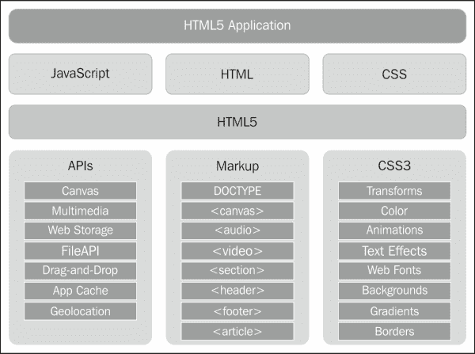
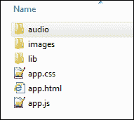
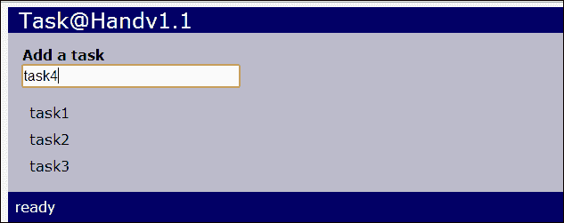
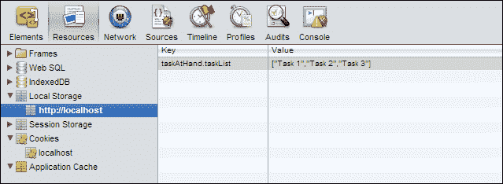

# 第一章：手头的任务

> “我渴望完成一项伟大而崇高的任务，但我的首要任务是完成小任务，就像它们是伟大而崇高的一样。”
> 
> - 海伦·凯勒

*在本章中，我们将学习创建 HTML5 应用程序的基础知识。我们将创建一个应用程序模板，用作快速构建新应用程序的起点，并且付出最小的努力。然后，我们将使用该模板创建一个简单的任务列表应用程序。在此过程中，我们将发现如何与用户交互并操作应用程序的用户界面。我们还将了解我们的第一个新 HTML5 功能，Web 存储 API。*

在本章中，我们将学习：

+   HTML5 应用程序的三个基本组件，HTML，CSS 和 JavaScript

+   对于那些不熟悉 JavaScript 库的 jQuery 基础知识

+   如何初始化应用程序并处理用户交互

+   如何操作 DOM 以添加、删除、更改和移动元素

+   如何创建可重用的 HTML 模板

+   如何使用 HTML5 Web 存储 API 存储和检索应用程序的状态

# HTML5 应用程序的组件

在开始构建我们的第一个应用程序之前，我们需要了解一些 HTML5 应用程序基础知识。HTML5 应用程序类似于使用任何其他编程语言编写的应用程序。在我们开始进行有趣的部分之前，需要放置一定数量的基础设施和管道。

当涉及到搭建项目时，Web 应用程序非常好。您可以每次开始新应用程序时都从头开始。但是随着您编写越来越多的应用程序，您会注意到每次开始时都在做相同的基本事情，因此创建应用程序模板以快速启动而不必每次重新发明轮子是有意义的。

为了了解 HTML5 应用程序是如何构建的，我们将从头开始构建自己的应用程序模板，我们可以在创建新应用程序时使用。我们将使用此模板作为本书中构建的所有应用程序的基础。

每个 Web 应用程序都以三个组件开始：HTML，CSS 和 JavaScript。您可以将它们全部放在一个文件中，对于非常简单的应用程序可能是可以接受的，但是我们在这里学习如何构建真正的应用程序。因此，我们将首先创建三个文件，每个组件一个文件，并将它们放在名为`template`的文件夹中。它们将被命名为`app.html`，`app.css`和`app.js`。

以下图表是对 HTML5 应用程序及其组件的解释。我们的应用程序是建立在 HTML，CSS 和 JavaScript 之上的。这些又建立在 CSS3 和 HTML5 框架之上，其中包括新的标记元素和 JavaScript API。



让我们看看我们应用程序的文件夹结构。我们将把我们创建的所有文件放在应用程序文件夹的根目录下。我们还将添加一个名为`lib`的文件夹，其中包含应用程序可能需要的任何第三方 JavaScript 库。由于我们将始终使用 jQuery 库，因此我们将在其中放置一个副本。如果有任何其他资产，例如图像或音频文件，我们将分别将它们放在`images`和`audio`文件夹中：



### 注意

我们可以从在线内容交付网络（CDN）引用 jQuery 库，但这要求您始终具有互联网连接。相信我，您永远不知道何时会在某个地方结束而无法连接并发现无法完成任何工作。

# 行动时间-创建 HTML 文件

我们将构建的第一个组件是我们的基本 HTML 文件`app.html`。我们将尽可能保持我们的 HTML 干净。它应该只包含标记。不应该混入任何样式或脚本块。保持标记、样式和行为分开将使您的应用程序更容易调试和维护。例如，如果某些东西的外观有问题，我们将知道问题在 CSS 文件中而不是 JavaScript 文件中。另一个好处是，您可以通过更改 CSS 完全重新设计应用程序的用户界面，而不必触及其功能。

这是我们基本 HTML 文件的标记。它只包括我们的 CSS 和 JavaScript 以及 jQuery 库，并定义了大多数应用程序将使用的简单 body 结构。这是我们将要编写的应用程序的一个很好的起点。

```html
<!DOCTYPE html>
<html>
  <head>
    <title>App</title>
    <link href="app.css" rel="StyleSheet" />
    <script src="img/jquery-1.8.1.min.js"></script>
    <script src="img/app.js"></script>
  </head>
  <body>
    <div id="app">
      <header>App</header>
      <div id="main"></div>
      <footer></footer>
    </div>
  </body>
</html>
```

### 提示

**下载示例代码**

您可以从您在[`www.packtpub.com`](http://www.packtpub.com)的帐户中下载您购买的所有 Packt 图书的示例代码文件。如果您在其他地方购买了本书，您可以访问[`www.packtpub.com/support`](http://www.packtpub.com/support)并注册，以便直接通过电子邮件接收文件。

HTML5 标记和以前版本的 HTML 之间的一个主要区别是文档类型声明已经大大简化。正如你可能记得的那样，HTML5 之前的文档类型声明非常冗长，普通人根本记不住。它们看起来像这样：

```html
<!DOCTYPE HTML PUBLIC "-//W3C//DTD HTML 4.01//EN" "http://www.w3.org/TR/html4/strict.dtd">
```

现在让我们来看看新的改进的 HTML5 文档类型声明。它简单、优雅，最重要的是易于记忆：

```html
<!DOCTYPE html>
```

您可能注意到的另一个区别是`<header>`和`<footer>`元素。这些是 HTML5 中的新语义元素，本质上与`<div>`元素相同。HTML5 实际上有一整套新的语义元素，旨在为 HTML 标记提供比仅仅将所有内容包装在`<div>`标记中更多的含义。

由于我们在这里构建的是应用程序，而不是编写内容页面，我们不会过多关注这些语义元素。大多数时候，我们将使用普通的`<div>`元素。但为了让您熟悉它们，这里是一些最有用的新语义元素的概述：

+   `<article>`：定义文档中的一篇文章

+   `<aside>`：定义页面内容以外的内容

+   `<footer>`：定义文档中某个部分的页脚

+   `<header>`：定义文档中某个部分的标题

+   `<nav>`：包含页面导航链接

+   `<section>`：定义文档中的一个部分

在 HTML5 中，以前版本的 HTML 中存在的一些元素和属性现在已经不再存在。这些主要是与布局和字体有关的元素，包括`<big>`、`<center>`、`<font>`、`<strike>`和`<u>`。过时的元素，如`<frame>`和`<applet>`也已经淘汰。

现在让我们来看看我们标记中`<body>`元素的内容。首先是一个`<div id=`"`app`"`>`元素。这将包装应用程序的整个标记。其他标记，如站点导航或与应用程序无关的任何其他内容，可以放在此元素之外。

在`app`元素内部，我们还有三个元素。在这里，我们使用了一些新的语义元素。首先，我们在应用程序中有一个`<header>`元素，它将包含应用程序的名称，比如标题栏（不要与文档`<head>`部分中的`<title>`元素混淆）。`<div id=`"`main`"`>`元素是应用程序主要部分的标记所在的地方。我们在它下面添加一个`<footer>`元素，它将被用作状态栏来显示应用程序的状态。

# 行动时间-创建 CSS 文件

接下来我们将创建名为`app.css`的基本 CSS 文件。这将包含所有应用程序将使用的基本样式，如默认字体和颜色。CSS 文件的第一部分包含一些文档范围的元素样式，设置了基本的外观和感觉。

```html
body
{
    font: 1em Verdana, Geneva, sans-serif;
    padding: 0;
    margin: 5px;
    color: Black;
    background-color: WhiteSmoke;
}
div
{
    padding: 0;
    margin: 0;
}
button
{
    cursor: pointer;
}
.hidden
{
    display: none;
}
```

首先，我们设置要应用于 body 的样式，这将传递到其他元素。我喜欢将字体大小设置为`1em`，而不是固定的像素大小，这样它就会使用浏览器的默认字体大小。然后，您可以使用 em 或百分比基于此进行其他测量，以便为您提供更具反应性的布局，并使以后更改应用程序外观更容易。当您始终需要某些东西保持相同大小时，常数像素大小很好，或者用于边框和边距等小值。

### 注意

通常，在大多数浏览器中，默认情况下 1em 等于 16px。

接下来，我们确保所有`div`元素的填充和边距都被移除，所以我们将它们归零。当用户悬停在按钮上时，将光标更改为指针也是很好的，所以我们也会在这里设置。最后，有一个`.hidden`类选择器，可以添加到任何元素中，以将其隐藏不显示。

我们将用一些样式来完成 CSS 的`app`和`main`元素。在这一点上，我们所设置的只是边距、填充和颜色：

```html
#app
{
    margin: 4px;
    background-color: #bbc;
}
#app>header
{
    padding: 0 0.5em;
    font-size: 1.5em;
    color: WhiteSmoke;
    background-color: #006;
}
#app>footer
{
    padding: 0.25em;
    color: WhiteSmoke;
    background-color: #006;
}
#main
{
    margin: 1em;
}
```

# 行动时间-创建 JavaScript 文件

让我们继续进行 JavaScript 文件`app.js`。在这里，我们将为我们的应用程序模板勾画出一个基本的轮廓。如果您不知道美元符号是用来做什么的，它们是 jQuery 库的别名。我们将在一会儿讨论一些 jQuery 基础知识。

```html
"use strict";

function MyApp()
{
    var version = "v1.0";

    function setStatus(message)
    {
        $("#app>footer").text(message);
    }

    this.start = function()
    {
        $("#app>header").append(version);
        setStatus("ready");
    };
}
```

从顶部开始，我们将在我们的 JavaScript 文件中包含`"use strict"`。这通知 JavaScript 运行时在运行我们的代码时使用更新和更严格的标准。例如，在旧版本的 JavaScript 中，完全可以在不使用`var`关键字先声明变量名的情况下使用它。这会导致它成为附加到`window`对象的全局变量。当定义`"use strict"`时，如果尝试这样做，将会收到错误。它可以帮助您找到可能导致程序中出现错误的糟糕编码错误。

### 注意

如果您使用一些不适用于严格模式的较旧的 JavaScript 库，可以在函数声明中添加`"use strict"`，以使仅该代码块使用严格模式。

```html
function strict()
{
    "use strict";
    // Everything inside here will use strict
// mode
}
```

接下来我们定义主应用程序对象`myApp`。在 JavaScript 中，有许多定义对象的方法，包括使用对象字面量和构造函数。对象字面量是定义对象的最简单方法，但这些对象通常在 JavaScript 加载后立即创建，通常在 DOM 准备就绪之前。以下是我们的对象作为对象字面量的样子：

```html
var myApp = {
    version: "v1.0",
    setStatus: function(message)
    {
        $("#app>footer").text(message);
    },
    start: function()
    {
        $("#app>header").append(this.version);
        this.setStatus("ready");
    };
};
```

由于我们的应用程序正在操作文档对象模型（DOM），我们不希望在 DOM 准备就绪之前创建对象。这就是为什么我们将使用函数构造函数形式来创建对象。

**DOM**，或**文档对象模型**，是 HTML 标记的内部表示。它是一个对象的分层树，表示 HTML 元素。

使用对象字面量的另一个问题是，其中定义的所有内容都是对象的成员，因此必须使用`this`关键字访问。请注意，在前面的对象字面量形式中，我们必须使用`this`来访问`version`和`setStatus()`。然而，当使用构造函数创建对象时，我们可以在构造函数中定义函数和变量，而不使它们成为对象的成员。由于它们不是成员，您不必使用`this`关键字来访问它们。

那么使用`this`有什么问题呢？在您使用 JavaScript 编程一段时间后，您会意识到`this`关键字可能会引起很多混乱，因为它在不同的时间可能会有不同的含义。在其他语言中，比如 C#和 Java，`this`总是指向您所在的对象。在 JavaScript 中，`this`是指向调用函数的对象的指针，对于事件处理程序来说，通常是`window`对象。因此，我们尽量避免使用它，越少用越好。

使用构造函数的另一个优点是能够定义私有和公共方法。请注意，`setStatus()`方法是使用普通函数声明定义的。这将使它成为一个私有方法，只能从封闭它的对象内部访问，并且不需要使用`this`来调用它。另一方面，`start()`方法是使用`this`分配给对象的。这将使`start()`成为一个公共方法，只能从对象的实例中访问。我们将在整个 JavaScript 中使用这种范式来实现对象的私有和公共成员。

我们需要的最后一件事是一个文档准备好的事件处理程序。文档准备好的事件在页面加载完成并且 DOM 层次结构已完全构建后触发。使用 jQuery 添加此事件处理程序有两种方法。第一种更冗长的方式是您所期望的：

```html
$(document).ready(handler);
```

然而，由于它可能是您需要实现的最基本和重要的事件，jQuery 提供了一种简写形式，就是这么简单：

```html
$(handler);
```

这是我们的文档准备好的事件处理程序：

```html
$(function() {
    window.app = new MyApp();
    window.app.start();
});
```

这是一个重要的代码片段。它定义了我们应用程序的起点。它相当于其他语言（如 C、C++、C#和 Java）中的`main()`函数。

在这里，我们创建了我们的主应用程序对象的一个实例，然后将其分配给一个名为`app`的全局变量，通过将其附加到`window`对象。我们将它设置为`global`，这样它就可以在整个应用程序中访问。最后但同样重要的是，我们调用我们的应用程序对象的`start()`方法来启动应用程序。

## 发生了什么？

我们刚刚创建了一个模板，可以用来开始编写新的应用程序，启动时间最短。它由 HTML、CSS 和 JavaScript 文件组成。在这一点上，我们的模板已经完成，我们已经拥有了开始编写新的 HTML5 应用程序所需的基础知识。

## 美元符号标识符

您可能已经注意到我们的 JavaScript 代码中到处都是美元符号。美元符号只不过是 jQuery 对象的别名。您可以用 jQuery 替换所有美元符号，效果是一样的，只是要多输入一些。如果您已经了解 jQuery，您可能想要跳过。否则，我将简要概述一下 jQuery。

jQuery 是一个流行的 JavaScript 库，它在最基本的层面上提供了访问和操作 DOM 的功能。它还提供了许多其他有用的功能，如事件处理、动画和 AJAX 支持。此外，它隐藏了许多不同浏览器之间的差异，因此您可以专注于编程，而不是如何使您的代码在每个浏览器中都能正常工作。它使编写 JavaScript 应用程序变得可忍受，甚至可以说是有趣的。我不会想在没有它的情况下编写 HTML5 应用程序。它对 JavaScript 来说就像 System 库对 Java 和 C#一样。

在大多数情况下，jQuery 使用与 CSS 相同的查询语法来选择元素。典型的模式是选择一个或多个元素，然后对它们执行某些操作，或者从中检索数据。因此，例如，这是一个 jQuery 选择，用于获取 DOM 中的所有`div`元素：

```html
$("div")
```

以下查询将给出具有 ID 为`main`的元素：

```html
$("#main")
```

与 CSS 一样，井号选择具有特定 ID 的元素，点选择具有特定类的元素。您还可以使用复合搜索条件。下一个查询将返回所有具有 ID 为`main`的元素的后代，并具有`selected`类的元素：

```html
$(#main .selected")
```

在选择了一个或多个元素之后，您可以对它们执行一些操作。jQuery 选择返回一个类似数组的 jQuery 对象，但也有很多内置函数可以做各种事情，我们将在本书中逐步学习。例如，以下代码行将隐藏从前一个选择返回的所有元素（将它们的 CSS `display`属性设置为`none`）：

```html
$(#main .selected").hide()
```

简单而强大。那么美元符号到底是怎么回事呢？有些人认为这是 jQuery 可以使用美元符号作为别名的一种魔法。但显然，美元符号是 JavaScript 中一个有效的字符，可以作为变量或函数名称的开头。

# 创建我们的第一个应用程序

在本章和接下来的几章中，我们将构建一个使用 HTML5 和 CSS3 的任务列表应用程序。在开始之前，我们应该明确我们应用程序的规格，这样我们就知道我们想要构建什么。

+   我们的任务列表应用程序应该允许用户快速输入一个或多个任务名称，并在列表中显示它们。

+   用户应该能够通过编辑、删除或上下移动任务来轻松操作任务。

+   应用程序应该记住输入的任务，所以当用户回到应用程序时，他们可以继续之前的工作。

+   UI 应该是响应式的，这样它可以在许多不同的设备上使用，具有不同的屏幕尺寸。

+   我们将从简单的开始，并随着进展逐步构建。在整个过程中，我们将构建一些 JavaScript 库，可以在后续项目中使用，这样我们就可以快速上手。

# 行动时间-创建任务列表

现在我们已经掌握了基础知识，让我们开始任务列表应用程序。我们将称我们的应用程序为`Task at Hand`，或者`Task@Hand`以时髦一点。首先复制我们的模板文件夹，并将其重命名为`taskAtHand`。还要将`.html`、`.css`和`.js`文件重命名为`taskAtHand`。现在我们准备开始我们的第一个 HTML5 应用程序。您可以在`第一章/示例 1.1`中找到本节的代码。

我们需要做的第一件事是进入 HTML 文件，并在`<head>`元素中更改标题和 CSS 和 JS 文件的名称为`taskAtHand`：

```html
<head>
  <title>Task@Hand</title>
  <link href="taskAtHand.css" rel="StyleSheet" />
  <script src="img/jquery-1.8.1.min.js"></script>
  <script src="img/strong>"></script>
</head>
```

接下来我们转到 body。首先我们在`<header>`元素中更改应用程序的名称。然后进入`<div id=`"`app`"`>`元素，并添加一个文本输入字段，用户可以在其中输入任务的名称。最后，我们添加一个空列表来保存我们的任务列表。因为我们正在构建一个列表，所以我们将使用无序列表`<ul>`元素。

```html
<body>
  <div id="app">
    <header>Task@Hand</header>
    <div id="main">
      <div id="add-task">
        <label for="new-task-name">Add a task</label>
        <input type="text" id="new-task-name" title="Enter a task name" placeholder="Enter a task name"/>
      </div>
      <ul id="task-list">
      </ul>
    </div>
    <footer>
    </footer>
  </div>
</body>
```

这是我们现在需要的所有标记。这里有一件事要指出，这是 HTML5 中的新内容。输入元素有一个新的属性叫做`placeholder`，它会在用户开始输入之前在字段中显示一些文本。这给用户一个提示，告诉他们应该在字段中输入什么。这对允许用户输入文本的输入元素是有效的。

让我们进入 JavaScript 文件并开始编码。我们要做的第一件事是将应用程序对象重命名为`TaskAtHandApp`：

```html
function TaskAtHandApp()
{
    // code not shown…
}
$(function() {
    window.app = new TaskAtHandApp();
    window.app.start();
});
```

### 注意

在 JavaScript 中的一个标准是，只有需要一个新语句（即对象构造函数）的东西才应该以大写字母开头。这有助于区分需要使用`new`关键字创建的内容。其他所有内容，包括变量和函数名称，都应该以小写字母开头。

当用户输入完任务名称并按下*Enter*键时，我们希望创建一个新的列表项元素并将其添加到列表中。我们首先需要在文本字段中添加一个事件处理程序，以便在按下键时得到通知。我们将在应用程序对象的`start()`方法中添加这个。

```html
this.start = function()
{
    $("#new-task-name").keypress(function(e) {
        if (e.which == 13) // Enter key
        {
            addTask();
            return false;
        }
    })
    .focus();

    $("#app header").append(version);
    setStatus("ready");
};
```

首先，我们通过对其 ID 进行 jQuery 选择来获取文本字段，即`new-task-name`。然后，我们向该元素添加一个`keypress()`事件处理程序，传入一个函数，以便在每次触发事件时执行。jQuery 向事件处理程序函数传递一个参数，即`keypress`事件对象。事件对象包含一个名为`which`的字段，其中包含按下的键的字符代码。我们感兴趣的是*Enter*键，它的代码是`13`。

当用户按下*Enter*键时，我们调用`addTask()`方法（下面定义），然后它返回`false`。我们在这里返回`false`的原因是告诉系统我们处理了按键事件，并且不希望它执行默认操作。一些浏览器在按下*Enter*键时会执行其他操作。

接下来，我们在`keypress()`处理程序的末尾添加另一个函数调用，将焦点设置回文本字段。此时，您可能会问自己，这是如何工作的，调用一个函数的函数？这称为函数链接，可能是 jQuery 最有用的功能之一。jQuery 的大多数方法都返回对象本身的指针，因此我们可以在一行代码中执行多个操作。

现在我们将编写`addTask()`方法。此方法将获取任务的名称，并将新的列表项添加到我们 HTML 中的`<ul>`元素中：

```html
function addTask()
{
    var taskName = $("#new-task-name").val();
    if (taskName)
    {
        addTaskElement(taskName);
        // Reset the text field
        $("#new-task-name").val("").focus();
    }
}
function addTaskElement(taskName)
{
    var $task = $("<li></li>");
    $task.text(taskName);
    $("#task-list").append($task);
}
```

首先，我们使用 jQuery 的`val()`方法获取`new-task-name`文本字段的值，该方法用于获取输入字段的值。只是为了确保用户实际输入了内容，我们测试`taskName`变量是否为"真值"，在这种情况下意味着它不是空字符串。

接下来我们调用`addTaskElement()`方法。在那里，我们创建一个新的`<li>`元素。您可以通过传入元素定义而不是选择到 jQuery 来创建一个新元素。在这种情况下，我们使用`"<li></li>"`来创建一个新的空列表项元素，然后将其分配给`$task`变量。然后，我们立即使用`text()`方法填充该元素的任务名称。

### 注意

将 jQuery 对象分配给变量时，最好的做法是以`$`开头的变量名，这样您就知道它引用了一个 jQuery 对象。

现在我们有了新元素，我们需要将其添加到文档的正确位置，即`<ul id=`"`task-list`"`>`元素内。这是通过选择`task-list`元素并调用`append()`方法来完成的。这将我们的新`<li>`元素添加到任务列表的末尾。

我们在`addTask()`方法中做的最后一件事是清除文本输入字段的值，并将焦点重新设置在它上面，以便用户可以立即输入另一个任务。我们在这里使用函数链接来在一条语句中完成两个操作。请注意，我们在设置和获取文本字段的值时都使用了 jQuery 的`val()`方法。如果传入一个值，它会设置控件的值；否则，它会返回控件的值。您会发现很多 jQuery 方法都是这样工作的。例如，`text()`方法将在元素内设置文本，或者如果没有传入值，则返回文本。

## *刚刚发生了什么？*

我们创建了一个任务列表应用程序，用户可以在其中输入任务名称并构建任务列表。让我们在浏览器中打开应用程序，看看我们目前有什么：



# 行动时间-从列表中删除任务

现在我们可以向列表中添加任务了，让我们添加删除任务的功能。为此，我们需要为列表中的每个任务添加一个删除按钮。我们将在`addTaskElement()`方法中添加创建按钮的代码。您可以在`第一章/example1.2`中找到此部分的代码。

```html
function addTaskElement(taskName)
{
    var $task = $("<li></li>");
    var $delete = $("<button class='delete'>X</button>");
    $task.append($delete)
         .append("<span class='task-name'>" + taskName +
                 "</span>"); 
    $delete.click(function() { $task.remove(); });
}
```

这个方法的第一件事是创建一个带有`delete`类的新`<button>`元素。然后，它创建了列表项元素，就像我们之前做的那样，只是首先附加了删除按钮，然后附加了任务名称。请注意，我们现在将任务名称包装在一个`<span class=`'`task-name`'`>`元素中，以帮助我们跟踪它。最后，我们为删除按钮添加了一个点击事件处理程序。要从列表元素中删除任务，我们只需调用`remove()`方法将其从 DOM 中删除。哇，它就消失了！

# 行动时间-在列表中移动任务

顺便说一句，让我们为列表中的任务添加上移和下移按钮。为此，我们将向`addTaskElement()`方法添加一些代码。首先，我们需要创建`move-up`和`move-down`按钮，然后将它们与`delete`按钮一起添加到列表元素中。

```html
function addTaskElement(taskName)
{
    var $task = $("<li></li>");
    var $delete = $("<button class='delete'>X</button>");
    var $moveUp = $("<button class='move-up'>^</button>");
    var $moveDown = $("<button class='move-up'>v</button>");
    $task.append($delete)
        .append($moveUp)
        .append($moveDown)
        .append("<span class='task-name'>" + taskName +
                "</span>");
    $("#task-list").append($task);

    $delete.click(function() { $task.remove(); });
    $moveUp.click(function() {
        $task.insertBefore($task.prev());
    });
    $moveDown.click(function() {
        $task.insertAfter($task.next());
    });
}
```

当单击**向上移动**或**向下移动**按钮时，它使用`prev()`和`next()`方法找到前一个或下一个任务元素。然后它使用 jQuery 的`insertBefore()`和`insertAfter()`方法将任务元素向上或向下移动到任务列表中。

## *刚刚发生了什么？*

我们为每个任务元素添加了按钮，以便可以删除它们或将它们上下移动到列表的顺序中。我们学会了如何使用 jQuery 的`remove()`、`insertBefore()`和`insertAfter()`方法来修改 DOM。

# HTML 模板

正如您所看到的，我们的`addTaskElement()`方法有点混乱。我们在 JavaScript 中以编程方式创建了一堆元素，并手动将它们添加到 DOM 中。如果我们只需在 HTML 文件中定义任务元素的结构，并使用它来创建新任务，那不是更容易吗？好吧，我们可以，而且我们将这样做。在本节中，我们将创建一个 HTML 模板，以便轻松创建新任务。

### 注意

有很多 JavaScript 库可以用来实现 HTML 模板，它们具有很多强大的功能，但对于我们的应用程序，我们只需要一些简单的东西，所以我们将自己实现。

# 行动时间-实施模板

首先，我们需要一个放置模板标记的地方。因此，我们将在 HTML 文件中的`app`元素之外添加一个`<div id="templates">`，并给它一个`hidden`类。正如您可能还记得的，从我们的 CSS 中，`hidden`类为元素设置`display`为`none`。这将隐藏模板标记，使用户永远看不到它。现在让我们定义模板：

```html
<div id="app">
  …
</div>
<div id="templates" class="hidden">
 <ul id="task-template">
 <li class="task">
 <div class="tools">
 <button class="delete" title="Delete">X</button>
 <button class="move-up" title="Up">^</button>
 <button class="move-down" title="Down">v</button>
 </div>
 <span class="task-name"></span>
 </li>
 </ul>
</div>
```

我不知道你怎么想，但对我来说，这比在代码中构建任务元素要容易得多。这样做也更容易阅读、添加和维护。你可能已经注意到，还添加了一些其他元素和属性，如果要以编程方式添加，那将是非常痛苦的。在按钮周围放置了一个`<div class="tools">`，将它们组合在一起，并为每个按钮添加了一个`title`属性，它将显示为浏览器中的工具提示。

请注意，我们在任务元素中没有使用任何 ID 属性。相反，我们使用类属性来标识不同的元素。这样做的原因是，ID 唯一地标识一个元素，因此它应该只被使用一次。如果我们创建一个具有一堆 ID 的模板并开始复制它，我们将会有重复的 ID。如果您多次使用 ID，那么 ID 对于唯一标识元素就毫无价值了。

在继续之前，我们需要为按钮及其容器在 CSS 中添加一些样式。我们希望按钮保持与任务名称在同一行，但它们的容器`<div>`是一个块级元素。让我们将它更改为`inline-block`，这样它就不会断行：

```html
#task-list .task .tools
{
    display: inline-block;
}
```

我们还希望从按钮中移除边框，使它们都是相同的大小，并移除填充和边距，使其更加紧凑：

```html
#task-list .task .tools button
{
    margin: 0;
    padding: 0;
    width: 1.25em;
    height: 1.25em;
    border: none;
}
```

所以，现在我们有了一个任务模板，我们该怎么办呢？这里再次用到了 jQuery。我们所要做的就是获取模板元素，并使用`clone()`方法来复制它。然后将复制的内容插入到 DOM 中的任何位置。下面是我们新的`addTaskElement()`方法的样子：

```html
function addTaskElement(taskName)
{
    var $task = $("#task-template .task").clone();
 $("span.task-name", $task).text(taskName);

    $("#task-list").append($task);

    $("button.delete", $task).click(function() {
        $task.remove();
    });
    $("button.move-up", $task).click(function() { 
        $task.insertBefore($task.prev());
    });
    $("button.move-down", $task).click(function() {
        $task.insertAfter($task.next());
    });
}
```

我们用一行代码替换了所有创建元素的代码行，它获取了任务模板元素，并使用`clone()`方法对其进行复制。第二行将任务名称填入了我们设置好的`<span class="task-name">`元素中。如果你仔细看，你会发现我们现在在选择时向 jQuery 传递了第二个参数。这告诉 jQuery 只搜索`task`元素的后代元素。否则它会在整个文档中找到每个任务名称元素并更改它们。在选择按钮时，我们也是用相同的方法来识别它们，使用它们的类名来连接点击事件处理程序。

## *刚刚发生了什么？*

我们实现了一个 HTML 模板，允许我们删除所有动态生成任务元素的代码，并用 jQuery 的`clone()`方法来替换它。这使得我们更容易在 HTML 中更新和维护元素结构，而不是在 JavaScript 中。

# 行动时间-编辑列表中的任务

到目前为止，我们有一个任务列表，可以向其中添加任务，从中删除任务，并更改任务的顺序。让我们添加一些功能，允许用户更改任务的名称。当用户点击任务名称时，我们将把它更改为文本输入字段。为此，我们需要在任务元素模板中的任务名称后面添加一个文本输入字段：

```html
<li class="task">
    <div class="tools">
        <button class="delete" title="Delete">X</button>
        <button class="move-up" title="Up">^</button>
        <button class="move-down" title="Down">v</button>
    </div>
    <span class="task-name"></span>
    <input type="text" class="task-name hidden"/>
</li>
```

我们给它一个`task-name`的类来标识它，并且还添加了隐藏类，所以默认情况下它是不可见的。我们只想在用户点击任务名称时显示它。所以让我们进入 JavaScript 文件，并在`addTaskElement()`方法的末尾添加一个`<span>`元素的事件处理程序：

```html
$("span.task-name", $task).click(function() {
    onEditTaskName($(this));
});
```

让我们来分解一下。首先，我们获取了任务元素的子元素，类名为`task-name`的 span。然后，我们添加了一个点击事件处理程序，调用`onEditTaskName()`方法。`onEditTaskName()`方法以`<span>`元素的引用作为参数。当你在 jQuery 事件处理程序函数中时，`this`指的是事件的源元素。因此，`$`(`this`)创建了一个包装`<span>`元素的 jQuery 对象，这样我们就可以在其上调用 jQuery 方法：

```html
function onEditTaskName($span)
{
    $span.hide()
        .siblings("input.task-name")
        .val($span.text())
        .show()
        .focus();
}
```

尽管`onEditTaskName()`方法在技术上只包含一行代码，但其中发生了很多事情。它使用函数链接在一个紧凑的语句中完成了很多工作。首先，它隐藏了`<span>`元素。然后，它通过查找`<span>`元素的兄弟元素，即类名为`task-name`的`<input>`元素，获取了文本输入字段。然后，它使用 jQuery 的`text()`方法从`<span>`元素中获取任务名称并设置文本字段的值。最后，它使文本字段可见，并将焦点设置在它上面。

当用户点击任务名称时，它似乎会在他们眼前变成一个可编辑的文本字段。现在我们只需要一种方法，在用户完成编辑名称后将其改回来。为此，我们将以下内容添加到`addTaskElement()`方法的末尾：

```html
$("input.task-name", $task).change(function() {
    onChangeTaskName($(this));
});
```

这与任务名称点击事件处理程序的工作方式相同。我们将调用一个名为`onChangeTaskName()`的方法，并传递一个包装文本字段输入元素的 jQuery 对象：

```html
function onChangeTaskName($input)
{
    $input.hide();
    var $span = $input.siblings("span.task-name");
    if ($input.val())
    {
        $span.text($input.val());
    }
    $span.show();
}
```

首先，我们隐藏文本输入字段，然后获取任务名称`<span>`元素并将其存储在一个变量中。在更新名称之前，我们检查用户是否确实输入了内容。如果是，我们就更新任务名称。最后，我们调用`show()`来使任务名称再次可见。用户会看到文本字段再次变成静态文本。

最后还有一件事要做。如果用户在不更改任何内容的情况下点击字段，我们将不会收到更改事件，并且文本字段将不会被隐藏。但是，当发生这种情况时，我们可以获得`blur`事件。因此，让我们向文本字段添加一个`blur`事件处理程序，以隐藏它并显示静态任务名称`<span>`元素：

```html
$("input.task-name", $task).change(function() {
    onChangeTaskName($(this));
})
.blur(function() {
 $(this).hide().siblings("span.task-name").show();
});

```

## *发生了什么？*

我们在任务模板中添加了一个文本字段，当用户点击任务名称时，它会显示出来，以便他们可以编辑任务名称。当任务名称文本字段更改时，它会更新任务名称标签。

发生了什么？

# 保存应用程序的状态

现在我们有一个非常实用的任务列表应用程序。我们可以添加、删除和移动任务。甚至可以编辑现有任务的名称。只有一个问题。由于我们动态向 DOM 添加了所有这些任务元素，所以下次用户返回应用程序时，它们将不会存在。我们需要一种方法来保存任务列表，这样用户下次返回应用程序时，任务仍将存在。否则，这有什么意义呢？

HTML5 刚好有这样的东西-Web Storage。Web Storage 是 HTML5 中的一个新 API，允许您在客户端上存储信息。过去，客户端上唯一可用的存储方式是 cookie。但是 cookie 并不是在客户端存储数据的好方法。它们仅限于几千字节的数据，并且还包含在 HTTP 请求中，增加了它们的大小。

另一方面，Web Storage 允许我们保存更多的数据（在大多数浏览器中最多可达 5MB），并且不会增加 HTTP 请求的内容。它由两个具有相同接口的全局对象组成，`localStorage`和`sessionStorage`。两者之间唯一的区别是存储在`sessionStorage`中的数据在关闭浏览器时会消失，而存储在`localStorage`中的数据不会。由于我们希望在会话之间保存应用程序数据，因此我们只会使用`localStorage`。

数据以键/值对的形式存储。您可以使用`setItem()`方法设置值，并使用`getItem()`检索值，如下所示：

```html
localStorage.setItem("myKey", "myValue");
var value = localStorage.getItem("myKey") // returns "myValue"
```

如果尝试使用在`localStorage`中不存在的键获取值，它将返回`null`。如果尝试向`localStorage`添加值并且内存不足，将会收到`QUOTA_EXCEEDED_ERR`异常。

`localStorage`有一些限制：

+   用户不一定可以访问存储在其中的任何内容（尽管可以通过浏览器的开发人员工具访问）。

+   它由域中的所有应用程序共享，因此存储限制在所有应用程序之间共享。这也意味着在所有应用程序中，所有键都必须是唯一的。如果两个应用程序使用相同的键，它们最终会覆盖彼此的数据。

+   键和值都必须是字符串。如果要存储的内容不是字符串，必须先将其转换为字符串。当您从存储中取出该值时，必须将其从字符串转换回您期望的类型。

幸运的是，JavaScript 有一个叫做 JSON 的实用对象，它提供了将值转换为字符串和从字符串转换回值的函数。**JSON**代表**JavaScript 对象表示法**，是以可读格式表示值的标准。它是 JavaScript 中对象文字表示法的子集，因此如果您知道如何定义对象文字，您就知道 JSON。JSON 对象有两种方法; `JSON.stringify()`将值转换为字符串，`JSON.parse()`将字符串转换回值。

# 行动时间-创建一个 localStorage 包装器

为了帮助解决`localStorage`的一些限制，我们将创建一个名为`AppStorage`的对象，它提供了对`localStorage`对象的包装。`AppStorage`对象将帮助我们避免键冲突，并提供一种简单的方法来存储非字符串值。让我们在一个名为`appStorage.js`的新文件中定义这个对象，这样我们可以在所有应用程序中重用它。您可以在`第一章/示例 1.3`中找到这一部分的代码。

```html
function AppStorage(appName)
{
    var prefix = (appName ? appName + "." : "");
```

构造函数以应用程序名称作为参数。下一行设置了一个名为`prefix`的私有变量，它将用于为所有键添加应用程序名称前缀，以避免冲突。如果未提供`appName`参数，则不会使用前缀，这对于在所有应用程序之间共享数据可能很有用。如果我们将`"myApp"`传递给构造函数，我们应用程序的所有键将以`"myApp"`开头（例如，`myApp.settings`或`myApp.data`）。

这一行创建了一个公共变量，用于确定浏览器是否支持`localStorage`。它只是检查全局`localStorage`对象是否存在：

```html
this.localStorageSupported = (('localStorage' in window) && window['localStorage']);
```

让我们首先实现`setValue()`方法，用于在本地存储中设置值：

```html
this.setValue = function(key, val)
{
    if (this.localStorageSupported)
        localStorage.setItem(prefix + key, JSON.stringify(val));
    return this;
};
```

`setValue()`方法接受一个键和一个要放入本地存储的值。它在键前面添加应用程序前缀，以避免命名冲突。由于您只能将字符串放入本地存储，我们使用`JSON.stringify()`方法将值转换为字符串，然后调用`localStorage.setItem()`进行存储。

现在让我们实现`getValue()`方法来从`localStorage`中获取值：

```html
this.getValue = function(key)
{
    if (this.localStorageSupported)
        return JSON.parse(localStorage.getItem(prefix + key));
    else return null;
};
```

`getValue()`方法接受一个键，将前缀添加到它，并返回与之在`localStorage`中关联的字符串值。它使用`JSON.parse()`将从`localStorage`中检索到的字符串解析为值。如果键不存在或不支持本地存储，这些方法将返回`null`。

我们需要的下一步是删除项目的方法。让我们实现`removeValue()`方法来做到这一点。它只是调用`localStorage.removeItem()`，传入带前缀的键：

```html
this.removeValue = function(key)
{
    if (this.localStorageSupported)
        localStorage.removeItem(prefix + key);
    return this;
};
```

在这个过程中，让我们添加一个方法来删除应用程序的所有键。`localStorage`确实有一个`clear()`方法，但这会完全清空您域中的`localStorage`，而不仅仅是我们应用程序的值。因此，我们需要获取我们应用程序的所有键，然后逐个删除它们：

```html
this.removeAll = function()
{
    var keys = this.getKeys();
    for (var i in keys)
    {
        this.remove(keys[i]);
    }
    return this;
};
```

`removeAll()`方法引用了一个`getKeys()`方法。这个方法将返回应用程序的所有键名数组。我们将制作`getKeys()`方法，这样用户也可以传入一个过滤函数，以便根据自己的标准进一步过滤结果：

```html
this.getKeys = function(filter)
{
    var keys = [];
    if (this.localStorageSupported)
    {
        for (var key in localStorage)
        {
            if (isAppKey(key))
            {
                // Remove the prefix from the key
                if (prefix) key = key.slice(prefix.length);
                // Check the filter
                if (!filter || filter(key))
                {
                    keys.push(key);
                }
            }
        }
    }
    return keys;
};
function isAppKey(key)
{
    if (prefix)
    {
        return key.indexOf(prefix) === 0;
    }
    return true;
};
```

这个方法通过循环遍历`localStorage`中的所有键来工作，你可以通过实现使用`in`关键字的循环来获取对象或数组中的所有键，它调用私有方法`isAppKey()`来确定键是否属于我们的应用程序。如果是，它会从键中移除应用程序前缀。最后，如果没有定义过滤器或过滤器函数返回`true`，则将键添加到要返回的键数组中。

私有的`isAppKey()`方法以键名作为参数，并在键属于我们的应用程序时返回`true`。如果未定义应用程序名称前缀，则没有要检查的内容。否则，我们检查键是否以应用程序前缀开头。

我们需要编写最后一个公共方法。`contains()`方法将确定与键关联的值是否存在。它只是尝试获取与键关联的值并检查是否存在：

```html
this.contains = function(key)
{
    return this.get(key) !== null;
};
```

## *刚发生了什么？*

我们创建了一个名为`AppStorage`的包装对象，它包装了 HTML5`localStorage`对象。它封装了与`localStorage`交互和保存 JavaScript 对象的所有行为。现在我们可以将任何类型的数据保存到`localStorage`中，然后检索它。

# 行动时间-存储任务列表

让我们回到任务列表应用程序。首先在我们的 HTML 文件中添加对`appStorage.js`的引用：

```html
<script src="img/appStorage.js"></script>
```

接下来，我们将在`TaskAtHandApp`对象中添加一个私有的`appStorage`变量，并将应用程序的名称传递给构造函数：

```html
function TaskAtHandApp()
{
    var version = "v1.3",
        appStorage = new AppStorage("taskAtHand");
    //…
}
```

现在让我们添加一个私有方法，可以在每次更改时调用以保存任务：

```html
function saveTaskList()
{
    var tasks = [];
    $("#task-list .task span.task-name").each(function() {
        tasks.push($(this).text())
    });
    appStorage.setValue("taskList", tasks);
}
```

`saveTaskList()`方法查找列表中每个任务的任务名称`<span>`元素。然后调用 jQuery 的`each()`方法，用于迭代由选择找到的元素。`each()`方法接受一个函数作为参数，并为每个元素调用该函数。我们的函数只是将任务名称推送到任务数组的末尾。然后我们调用`appStorage.setValue()`，告诉它使用键`"taskList"`存储任务数组。

现在我们需要在列表更改时每次调用`saveTaskList()`。这将在`addTask()`和`onChangeTaskName()`方法中进行。此外，在`addTaskElement()`中，我们需要在`delete`、`move-up`和`move-down`的按钮点击事件处理程序中调用它。为了使事情更容易阅读，让我们通过将内联处理程序代码移出到私有方法中进行一些重构：

```html
function addTaskElement(taskName)
{
    // code not shown…
    $("button.delete", $task).click(function() {
        removeTask($task);
    });
    $("button.move-up", $task).click(function() {
        moveTask($task, true);
    });
    $("button.move-down", $task).click(function() {
        moveTask($task, false);
    });
    //…
}
function removeTask($task)
{
    $task.remove();
    saveTaskList();
}
function moveTask($task, moveUp)
{
    if (moveUp)
    {
        $task.insertBefore($task.prev());
    }
    else
    {
        $task.insertAfter($task.next());
    }
    saveTaskList();
}
```

现在让我们在 Chrome 中看一下这个。继续添加一些任务，然后按*F12*打开开发者工具。如果您点击窗口顶部的**资源**图标，您将在左窗格中看到资源列表。展开**本地存储**项目，然后单击其下的项目。您应该在右窗格中看到存储在本地存储中的域中的所有数据：



在**Key**列中，您应该找到`taskAtHand.taskList`，并在**Value**列中看到代表我们任务列表的 JSON，正如您可能记得的那样，它存储为数组。

现在继续玩一下。尝试添加、删除、编辑和移动任务。您应该在每次更改后看到本地存储中的值更新。我们现在有一个持久的任务列表。

当使用`file://`协议时，一些浏览器不允许访问`localStorage`（也就是说，您直接从文件系统打开文件到浏览器）。如果您的`localStorage`不起作用，请尝试在另一个网络浏览器中使用，或者通过诸如 IIS 或 Apache 之类的网络服务器访问您的应用程序。

# 行动时间-加载任务列表

我们已经保存了任务列表。但如果我们无法加载它，那对我们来说没有太大用处。所以让我们添加一个名为`loadTaskList()`的新私有方法：

```html
function loadTaskList()
{
    var tasks = appStorage.getObject("taskList");
    if (tasks)
    {
        for (var i in tasks)
        {
            addTaskElement(tasks[i]);
        }
    }
}
```

此方法调用`appStorage.getValue()`，传入我们任务列表的键。然后检查确保我们得到了一些东西。如果是这样，它会遍历数组中的所有任务，为每个任务调用`addTaskElement()`方法。

唯一剩下的事情是在`start()`方法中添加一个调用`loadTaskList()`，这样在应用程序启动时加载列表：

```html
this.start = function()
{
    // Code not shown…
    loadTaskList();
    setStatus("ready");
};
```

## *刚才发生了什么？*

在我们的任务列表应用程序中，我们使用`AppStorage`对象将任务列表存储到`localStorage`中，每当有变化时，然后在用户返回时检索它并构建任务列表。

## 尝试一下

编写一个本地存储浏览器应用程序，用于查看域中每个应用程序的数据。在顶层，列出所有应用程序。当您深入到应用程序时，它会显示所有本地存储项。当您单击一个项目时，它会显示该项目的内容。

## 快速测验

Q1\. HTML5 应用程序的三个基本组件是什么？

1.  jQuery、模板和本地存储

1.  文档、对象和模型

1.  标签、元素和属性

1.  HTML、CSS 和 JavaScript

Q2\. 本地存储可以存储哪些类型的数据？

1.  任何类型

1.  对象

1.  数字

1.  字符串

# 总结

就是这样。我们现在已经完成了我们的第一个 HTML5 应用程序。一个任务列表，我们可以添加、删除和编辑任务。任务是持久的，所以当用户返回应用程序时，他们可以从他们离开的地方继续。在本章中，我们涵盖了以下概念：

+   我们学会了构建 HTML5 应用程序及其三个组件，HTML、CSS 和 JS 的基础知识。

+   我们创建了一个应用程序模板，以帮助我们快速启动新应用程序。

+   我们学会了如何使用 jQuery 来访问和操作 DOM。

+   我们学会了如何初始化一个 Web 应用程序并处理用户交互。

+   我们学会了如何创建 HTML 模板，以便我们可以在标记中定义可重用的元素结构。

+   我们学会了如何使用 Web Storage 来保存和检索应用程序的状态，并创建了一个`AppStorage`对象来帮助我们访问`localStorage`。

现在我们已经学会了创建 HTML5 应用程序的基础知识，并且我们的任务列表应用程序正在运行，我们准备开始一些样式设计。在下一章中，我们将学习一些新的 CSS3 功能，这些功能将使我们的应用程序看起来和任何桌面应用程序一样好，甚至更好。
