# 第二章：让我们时尚起来

> “在风格问题上，随波逐流；在原则问题上，坚如磐石。”- 托马斯·杰斐逊

*在本章中，我们将戴上我们的平面设计师帽子，进行一些样式设计。现在我们在第一章中创建的任务列表应用程序可以工作，但看起来像是 2005 年的东西。我们将使用 CSS3 使其现代化，并使用最新的 CSS3 功能使其看起来干净、现代。我们将添加圆角、阴影、渐变和过渡效果。我们还将使用 CSS 精灵为任务列表按钮添加一些图像。*

在本章中，我们将学习：

+   在 CSS3 中指定颜色的新方法和设置透明度

+   如何向元素添加圆角

+   如何向元素和文本添加阴影

+   如何在元素背景中绘制渐变

+   新的 CSS3 背景属性

+   如何在应用程序中使用 CSS 精灵

+   如何使用过渡和变换为用户界面添加效果

+   如何动态加载样式表以创建可定制的用户界面

# CSS3 概述

CSS3 不是 HTML5 规范的一部分，但它是编写 HTML5 应用程序的一个重要部分。CSS3 与 HTML5 并行开发，并提供许多新的样式，使网页的外观和功能比以往更好。曾经是 Photoshop 的领域，如渐变和阴影，现在可以通过样式轻松添加。使用这些新的图形功能将使您的应用程序看起来现代，并为您的应用程序增添特色。

CSS 的一些最令人兴奋的新增功能之一是能够向元素添加渐变和阴影。圆角是每个人都希望在网页中拥有的功能，曾经是许多 HTML hack 的领域，现在可以轻松添加。从未有过如此简单地使网页和应用程序看起来好，而无需下载额外的图像和代码来支持它们。

您可以在`chapter2/css3-examples/css3-examples.html`中看到所有以下 CSS3 样式的示例。

## CSS3 颜色

在开始新效果之前，让我们讨论一下颜色。CSS3 有新的定义颜色的方式，允许您设置透明度并以 HSL 格式定义颜色。当然，您仍然可以使用旧的十六进制值标准、任何 CSS 颜色名称和`rgb()`指定符。

已添加了一个新的`rgba()`指定符，允许设置颜色的 alpha 或不透明度。与`rgb()`一样，前三个参数设置红色、绿色和蓝色的数量，取值范围为`0`到`255`。第四个参数 alpha 是一个浮点值，范围从`0`到`1`，其中`0`是完全透明，`1`是完全不透明。以下声明了一个红色背景颜色，透明度为 50%：

```html
background-color: rgba(255, 0, 0, 0.5);
```

尽管大多数浏览器支持`rgba()`，但最好通过在其前面以`rgb()`格式定义颜色来为不支持它的浏览器指定一个回退，如下所示：

```html
background-color: rgb(255, 0, 0);
background-color: rgba(255, 0, 0, 0.5);
```

这是一个重叠三个元素的示例，所有元素的 alpha 值均为`0.5`，颜色分别为红色、绿色和蓝色（是的，您可以绘制圆形元素，我们将在下一节中看到）。

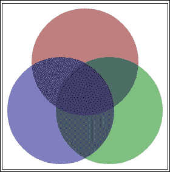

除了 RGB 颜色，CSS3 还支持**HSL**颜色，它代表**色调**、**饱和度**和**亮度**。HSL 基于一个颜色轮，边缘是全彩色，中心渐变为灰色。现在将该轮延伸为一个圆柱体，底部是黑色，顶部是白色，中间是全彩色。这就是 HSL 颜色的理论。

它是使用`hsl(h, s, l)`指定的。色调是从`0`到`360`的值，对应于颜色轮上的角度。`0`是红色，`120`是绿色，`240`是蓝色，`360`又回到红色。饱和度是颜色的百分比，其中`0%`是完全灰色，`100%`是全彩色。亮度是亮度的百分比，其中`0%`是黑色，`50%`是全彩色，`100%`是白色。您可以像`rgb()`一样指定它，也可以不带 alpha 值，如下所示：

```html
hsl(240, 100%, 50%);
hsla(240, 100%, 50%, 0.5);
```

大多数人不会考虑 HSL 中的颜色，但它确实存在，以防您想要使用它。如果您想尝试一下，可以在[`hslpicker.com`](http://hslpicker.com)找到一个不错的 HSL 选择器。

# 圆角

我们将要看的第一个 CSS3 效果是圆角，因为在 CSS3 之前这是一个非常受欢迎的功能。过去，如果您想要圆角，只有一些非最佳的解决方案可用。您可以加载四个图像，每个角一个，然后添加一些额外的标记来使它们对齐（并尝试使其在所有浏览器中工作）。或者使用多个`div`标签来“绘制”圆角边框的某种黑客方式。或者其他半打方法之一。最终，它们都不是很好的解决方案。那么为什么我们要如此努力地在 CSS3 之前使圆角边框起作用呢？因为人们被它们吸引，它们似乎让您的设计看起来更自然。

使用 CSS3 的新`border-radius`属性非常容易地向元素添加圆角。如果您希望每个角具有相同的边框半径，只需给出一个值，如下所示：

```html
border-radius: 0.5em;
```

如果要将边框的每个角设置为不同的半径，也可以这样做。值按照 CSS 属性的标准顺序，顺时针从左上角开始：左上，右上，右下和左下。

```html
border-radius: 1px 4px 8px 12px;
```

您可以设置一个、两个、三个或四个值。一和四是不言自明的。

+   如果设置了两个值，则第一个值适用于左上和右下，第二个值适用于右上和左下。因此，它是相对的角。

+   如果设置了三个值，则第二个值适用于右上和左下。第一个适用于左上，第三个适用于右下。

您还可以单独定义每个角的半径，如下所示：

```html
border-top-left-radius: 1px;
border-top-right-radius: 4px;
border-bottom-right-radius: 8px;
border-bottom-left-radius: 12px;
```

### 注意

想要创建圆形或椭圆形？将`border-radius`值设置为`50%`。

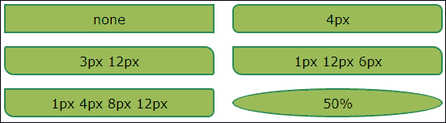

# 阴影

在 CSS3 中，向元素和文本添加阴影非常简单。使用阴影使某些元素真正脱颖而出，并为您的 UI 赋予更自然的外观。有许多选项可用于添加阴影，例如大小、位置和颜色。阴影不一定总是在元素和文本后面；它们也可以为它们提供框架、突出显示和添加效果。

## 盒子阴影

除了圆角，您还可以使用新的 CSS3 `box-shadow`属性为元素添加阴影。`box-shadow`属性接受一些参数，告诉它如何绘制阴影：

```html
box-shadow: h-offset v-offset blur-radius spread-radius color;
```

以下是参数的解释：

+   `h-offset`：阴影的水平偏移。负值将阴影放在元素的左侧。

+   `v-offset`：阴影的垂直偏移。负值将阴影放在元素上方。

+   `blur-radius`：确定模糊量；数字越高，模糊越多（可选）。

+   `spread-radius`：阴影的大小。如果为零，则与模糊大小相同（可选）。

+   `color`：阴影的颜色（可选）。

+   `inset`：添加`inset`以将阴影从外部更改为内部（可选）。

### 注意

您可以使用`box-shadow`属性为元素添加除阴影之外的一些有趣效果。通过将`offset`值设置为零并调整模糊和扩展（请参见前两个示例），您可以为元素设置内部或外部发光。

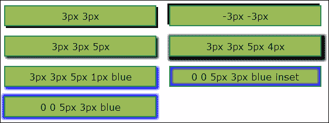

## 文本阴影

除了盒子阴影，CSS3 还支持使用`text-shadow`属性添加文本阴影。它的工作方式几乎与`box-shadow`相同，并且使用几乎相同的参数：

```html
text-shadow: h-offset v-offset blur-radius color;
```

与`box-shadow`一样，您可以产生一些有趣的效果，例如发光文本：


# 行动时间-样式行动

让我们在任务列表应用程序中充分利用`border-radius`和`box-shadow`效果。首先，我们将在页面上居中显示任务列表。然后我们将在每个任务周围放一个有圆角和阴影的框。让我们打开`taskAtHand.css`并进行一些更改。您可以在`chapter2/example2.1`中找到此部分的代码。

首先，我们将更改包含`task-name`文本字段和任务列表的`<div id="main">`元素的样式。让我们给这个部分设置一个最小宽度为`9em`，最大宽度为`25em`。我们不希望任务列表变得太宽或太小，以便更容易阅读。这将为我们提供一个反应式布局的开端。我们还将将上下边距设置为`1em`，将左右边距设置为`auto`以使其在页面上居中。

### 注意

一个反应式布局是根据其环境调整其布局以适应其显示的设备的布局。通过使用反应式布局，您可以确保您的应用程序在任何设备上都能正常工作和显示良好，从手机到桌面设备。

```html
#main
{
    max-width: 25em;
    min-width: 9em;
    margin: 1em auto;
}
```

我们还想通过将其`width`属性设置为`98%`来将`task-name`文本输入字段的样式更改为占据主区域的整个宽度。这将为文本框的边框留出一些余地；`100%`会让它爆炸：

```html
#task-name
{
    font-size: 1em;
    display: block;
    width: 98%;
}
```

现在让我们来处理`task-list`项目。我们将给它们设置背景颜色，圆角和阴影。我们将使阴影变黑并且给它一些透明度，这样背景颜色就会透过来。我们还将把`position`属性设置为`relative`，这样我们就可以在其中定位任务按钮（见下一个屏幕截图）：

```html
#task-list .task
{
    position: relative;
    list-style: none;
    padding: 0.25em;
    margin: 0.25em;
    background-color: beige;
    border-radius: 4px;
    box-shadow: 2px 2px 3px rgba(0, 0, 0, 0.6);
}
```

让我们还在任务按钮周围添加一个边框来对它们进行分组，并使用绝对定位将它们移到`task`元素的右上方。我们也可以在这里将其浮动到右侧，但是绝对定位可以给我们更多的控制：

```html
#task-list .task .tools
{
    position: absolute;
    top: 0.25em;
    right: 0.25em;
    border: 1px solid black;
    border-radius: 2px;
}
```

### 注意

在使用绝对定位时，元素相对于最近的已定位的父元素进行定位。在这种情况下，那将是`task`元素。这就是为什么我们将其`position`属性设置为`relative`的原因。

## *刚刚发生了什么？*

如果你在浏览器中查看应用程序，你会注意到我们的任务列表看起来更加自然。阴影确实让任务项目从页面中凸显出来，并赋予它们深度。这使它们成为应用程序的亮点。通过将任务按钮移到右侧并且远离，我们真的让任务名称脱颖而出：

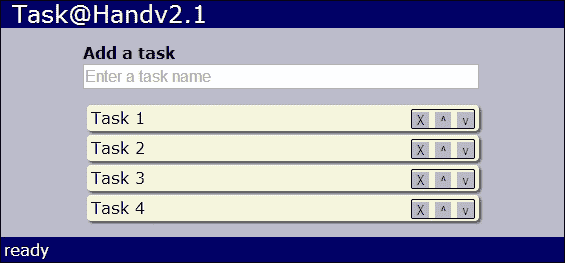

调整浏览器窗口大小，看看列表的反应。这是相同的布局调整为更小的样子，就像你在手机或其他移动设备上看到的一样：

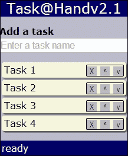

# 背景

有许多新的样式用于设置元素的背景样式。现在您可以轻松地绘制渐变而不使用图像。您可以改变背景图像的大小和原点，甚至在背景中使用多个图像。

渐变为元素绘制了从一种颜色到一种或多种其他颜色的背景。它们为您的页面增添了深度，并增添了更加自然的外观。您可以在 CSS3 中指定两种不同类型的渐变：**线性**和**径向**。线性渐变是线性的。它们从一种颜色直线流向另一种颜色。径向渐变从中心点向外扩散。

## 线性渐变

线性渐变是使用`background`属性上的`linear-gradient`指定符来定义的。对于最简单的形式，你可以使用我们在颜色部分讨论过的任何`color`指定符来指定起始和结束颜色，它会从元素的顶部到底部绘制渐变。以下是从红色到蓝色的渐变：

```html
background: linear-gradient(#FF0000, #0000FF);
```

尽管渐变目前受到几乎所有浏览器的支持，但您仍然必须使用特定于浏览器的前缀才能使其工作。这意味着至少要指定四次才能覆盖大多数浏览器。请记住，始终将非专有版本指定为最后一个，如下面的 CSS 片段所示，这样它将在可用时覆盖特定于浏览器的版本：

```html
background: -webkit-linear-gradient(#FF0000, #0000FF);
background: -moz-linear-gradient(#FF0000, #0000FF);
background: -ms-linear-gradient(#FF0000, #0000FF);
background: linear-gradient(#FF0000, #0000FF);
```

如果要使渐变从顶部开始，可以指定第一个参数，该参数可以是要从其开始的侧面的名称或旋转的量。侧面有`top`、`bottom`、`left`和`right`。您可以指定从`-360deg`到`360deg`的度数，或从`-6.28rad`到`6.28rad`的弧度。`0`与`left`相同。正数逆时针旋转，负数顺时针旋转。以下是从`left`到`right`绘制渐变的示例：

```html
background: linear-gradient(left, #FF0000, #0000FF);
```

以下是以`45`度角绘制的渐变，即从左下角开始：

```html
background: linear-gradient(45deg, #FF0000, #0000FF);
```

如果愿意，您还可以添加多于两个的颜色停止。以下是从红色到蓝色到绿色的`45`度角渐变：

```html
background: linear-gradient(45deg, #FF0000, #0000FF, #00FF00);
```

以下是这些代码片段的显示方式：

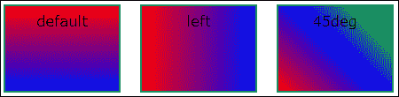

## 径向渐变

径向渐变在其使用的参数上几乎与线性渐变相同。默认情况下，从元素的中心到边缘绘制渐变：

```html
background: radial-gradient(#FF0000, #0000FF);
```

您还可以指定位置，例如使用预定义位置或从顶部左侧角的偏移点作为渐变的中心：

```html
background: radial-gradient(top, #FF0000, #0000FF);
```

以下是以距离左上角`20`像素和`20`像素处为中心绘制的渐变：

```html
background: radial-gradient(20px 20px, #FF0000, #0000FF);
```

您还可以为径向渐变添加多于两个的颜色停止。以下是从红色到蓝色到绿色的渐变，中心位于距左侧`20`像素和下方`20`像素的位置：

```html
background: radial-gradient(20px 20px, #FF0000, #0000FF, #00FF00);
```

以下是这些代码片段的显示方式：

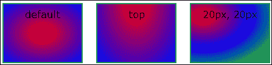

您可以指定许多其他设置来实现一些有趣的渐变效果，但这超出了本书的范围。如果发现自己创建自己的渐变太难，可以在[`www.colorzilla.com/gradient-editor/`](http://www.colorzilla.com/gradient-editor/)找到一个出色的渐变生成器。

## 背景图片

您可以将背景图像的大小设置为固定像素量或元素区域的百分比。图像将被缩放以适应指定的区域。`background-size`属性接受两个值：水平大小和垂直大小。如果要使背景图像填充元素的整个背景，可以使用以下方法：

```html
background-size: 100% 100%;
```

您可以通过用逗号分隔它们来指定多个背景图像。列表中的第一张图像将绘制在顶部，最后一张将绘制在底部。以下是绘制两个背景图像的示例：

```html
background: url(bg-front.png),
            url(bg-back.png);
```

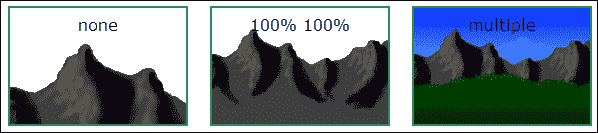

还有一个新的`background-origin`属性，用于确定背景图像的绘制位置。可能的值如下：

+   `content-box`：仅在元素的内容区域中绘制背景图像

+   `padding-box`：将背景图像绘制到元素的填充区域

+   `border-box`：将背景图像一直绘制到元素的边框

以下是一个示例：

```html
background-origin: content-box;
```

以下是输出：

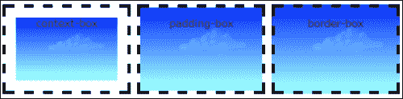

## CSS 精灵

我们接下来要讨论的概念是 CSS 精灵。这种技术对于 CSS3 来说并不新鲜，但在编写 HTML5 应用程序时，了解如何使用它是很重要的。CSS 精灵允许您将应用程序中的所有图像放入单个图像文件中，然后使用 CSS 将单个图像切片到元素中。这种技术节省了下载多个图像所需的时间和网络资源。如果您的应用程序有很多小图像，这种技术尤其有用。

要实现 CSS 精灵，将所有图像放入单个图像文件中，称为**精灵表**。然后按照以下步骤将精灵表中的图像放入页面上的元素中：

1.  使元素与要显示的图像大小相同。

1.  将元素的背景图像设置为精灵表图像。

1.  调整精灵表的背景位置，使要查看的图像位于元素的左上角。

让我们看一个例子。以下精灵表有 16 张图片，每张图片宽 10 像素，高 10 像素。首先，我们将元素的`width`和`height`属性设置为`10`像素。接下来，我们将背景图像设置为`sprite-sheet.png`精灵表。如果我们现在停下来，我们只会在我们的元素中看到第一张图片。

但是我们想要在我们的元素中显示第七张图片。因此，我们需要将精灵表的背景位置向左移动 20 像素，向上移动 10 像素。您必须使用负偏移来将正确的图像放置在位置上，因为您正在移动背景图像，而不是元素：

```html
#seven
{
    Width: 10px;
    height: 10px;
    background-image: url(sprite-sheet.png);
    background-position: -20px -10px;
}
```

这是结果：

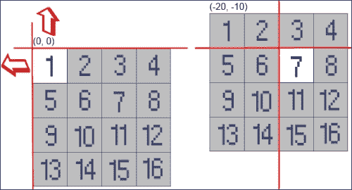

### 注意

将其视为在网页上切割一个洞，然后在洞后面滑动精灵表，直到正确的图像显示在洞中。

# 行动时间 - 添加渐变和按钮图像

让我们利用我们对渐变和背景图像的了解，使我们的应用程序看起来更有趣。首先，我们将在我们的任务列表应用程序的背景中添加一个渐变。我们将在`<div id="app">`元素上添加一个线性渐变。它将从顶部开始，渐变为底部的深蓝色。请注意，我们保留旧的背景颜色作为不支持渐变的浏览器的回退：

```html
#app
{
    margin: 4px;
    background-color: #bbc;
    background: -webkit-linear-gradient(top, #bbc, #558);
    background: -moz-linear-gradient(top, #bbc, #558);
    background: -ms-linear-gradient(top, #bbc, #558);
    background: linear-gradient(top, #bbc, #558);
}
```

这就是它的样子：

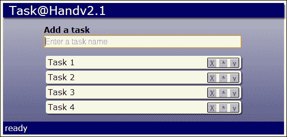

现在让我们使用 CSS 精灵将图像添加到任务列表应用程序中的按钮。我们需要删除、向上移动和向下移动的图像。我们的按钮将是 16x16 像素，因此我们的图像也需要是相同的大小。由于我们有三张图片，我们将创建一个 48 像素宽、16 像素高的精灵表。我们将把名为`icons.png`的精灵表图像文件放入`images`文件夹中。

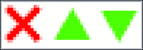

现在让我们打开`taskAtHand.css`并添加样式，将图像从精灵表中提取到按钮中。首先，我们将更改适用于所有任务按钮的样式，将大小设置为 16x16 像素，并将背景图像设置为我们的精灵表。这样，我们只需要指定一次精灵表图像，它就会应用到我们所有的按钮上：

```html
#task-list .task .tools button
{
    margin: 0;
    padding: 0;
    border: none;
    color: transparent;
 width: 16px;
 height: 16px;
 background: url(images/icons.png);
}
```

现在我们所有的按钮都将使用`icons.png`作为它们的背景。我们现在所要做的就是设置每个按钮的背景位置，使它们与正确的图像对齐：

```html
#task-list .task .tools button.delete
{
    background-position: 0 0;
}
#task-list .task .tools button.move-up
{
    background-position: -16px 0;
}
#task-list .task .tools button.move-down
{
    background-position: -32px 0;
}
```

## *刚刚发生了什么？*

现在在浏览器中查看应用程序。我们添加了渐变，所以它不再那么沉闷和单调。现在它看起来现代而时尚。我们使用 CSS 精灵向按钮添加图像，从一个精灵表图像中提取图像。有了真正的按钮图标，这样看起来不是更好吗？

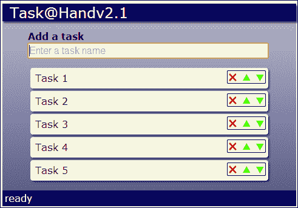

# 过渡

现在我们有一个相当不错的 UI，但是我们可以通过一些过渡效果使其变得更好。CSS3 过渡在元素样式改变时为元素添加动画效果。例如，如果我们改变元素的大小，它将逐渐从较小的大小变为较大的大小，从而为用户提供视觉反馈。当事物逐渐改变时，它比突然出现在页面上的东西更容易引起我们的注意。

CSS3 的`transition`属性允许我们在元素上指定过渡。它的格式如下：

```html
transition: property duration timing-function delay
```

以下是参数的解释：

+   `property`：要添加过渡的 CSS 属性。例如，`width`或`color`。使用`all`将过渡应用于所有属性。

+   `duration`：过渡所需的时间长度。例如，`0.5s`需要半秒钟来完成过渡。

+   `timing-function`：确定过渡在持续时间内的进展方式：

+   `linear`：从开始到结束的速度相同

+   `ease`：开始缓慢，然后加速，然后结束缓慢

+   `ease-in`：开始缓慢然后加速

+   `ease-out`：开始快然后减慢

+   `ease-in-out`：先缓慢，然后加速

+   `cubic-bezier()`: 如果你不喜欢预定义的函数，你可以构建自己的

+   `delay`: 开始过渡之前等待的时间。

`cubic-bezier`函数接受四个参数，这些参数是从`0`到`1`的数字。以下产生与`ease`函数相同的效果：

```html
transition: all 1s cubic-bezier(0.25, 0.1, 0.25, 1);
```

构建自己的`cubic-bezier`函数并不是大多数人可以凭空做到的。如果你想探索创建自己的时间函数，请访问[`cubic-bezier.com/`](http://cubic-bezier.com/)。

与渐变一样，过渡得到了广泛的支持，但在声明时仍应使用特定于浏览器的前缀：

```html
-webkit-transition: all 1s ease;
-moz-transition: all 1s ease;
-o-transition: all  1s ease;
transition: all 1s ease;
```

应用过渡的最简单方法是与 CSS 的`hover`选择器结合使用。当用户将鼠标移动到元素上时，以下内容将使元素的背景颜色从白色渐变到蓝色，用时 0.25 秒：

```html
#some-element
{
    background-color: White;
    transition: all 0.25s ease;
}
#some-element:hover
{
    background-color: Blue;
}
```

# 变换

CSS3 变换提供了更复杂的效果。有 2D 和 3D 变换可用。我们将在这里讨论一些 2D 变换。变换可以与过渡一起使用，提供一些有趣的效果。这是`transform`属性的基本形式：

```html
transform: function();
```

有一些不同的 2D`transform`函数。我们首先看的是`translate()`。它将一个元素从当前位置移动到一个新位置。它以 x 和 y 位置作为参数。你可以使用负值向上和向左移动。以下将使一个元素向右移动`10`像素，向上移动`25`像素：

```html
transform: translate(10px, -25px);
```

`rotate()`函数按给定的角度旋转元素。旋转量可以用度或弧度来指定。使用负值逆时针旋转，正值顺时针旋转：

```html
transform: rotate(45deg);
```

`scale()`函数通过某个因子调整元素的大小。它接受一个或两个参数。如果只提供一个参数，它将按该量进行缩放。如果指定了两个参数，它将分别缩放水平和垂直轴。以下示例将元素的宽度加倍，高度减半：

```html
transform: scale(2, 0.5);
```

我们将看一下`skew()`函数。这个函数扭曲或拉伸一个元素。它接受两个参数，即旋转 x 和 y 轴的量。角度的指定方式与`rotate()`函数相同：

```html
transform: skew(45deg, 10deg);
```

变换还需要特定于浏览器的前缀：

```html
-webkit-transform: rotate(45deg);
-moz-transform: rotate(45deg);
-o-transform: rotate(45deg);
-ms-transform: rotate(45deg);
transform: rotate(45deg);
```

以下是变换在浏览器中的样子：

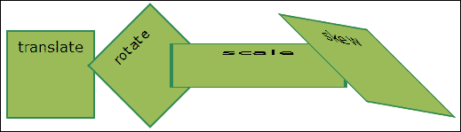

# 行动时间-效果在行动

让我们给任务列表添加一些效果。首先，我们将添加选择列表中任务的能力。当点击一个任务时，它将增大并获得一个有颜色的边框，这样就很容易看出它被选中了。我们还将为任务添加悬停效果，这样当用户将鼠标移动到一个任务上时，任务的操作按钮就会显示出来。当鼠标移出任务时，按钮将淡出。你可以在`chapter2/example2.2`中找到这一部分的代码。

我们需要做的第一件事是回到`taskAtHand.js`，并在`addTaskElement()`方法中创建`task`元素后添加一个`click`事件处理程序：

```html
$task.click(function() { onSelectTask($task); });
```

当点击一个任务时，它调用`onSelectTask()`方法。在这个方法中，我们将通过给它一个`selected`类名来标记一个`task`元素为选定。我们还将从先前选定的任务元素中删除`selected`类：

```html
function onSelectTask($task)
{
    if ($task)
    {
        // Unselect other tasks
        $task.siblings(".selected").removeClass("selected");
        // Select this task
        $task.addClass("selected");
    }
}
```

现在让我们在`taskAtHand.css`中为选定的任务添加样式。我们将增加填充以使元素更大，添加边框以突出显示它，并改变背景颜色：

```html
#task-list .task.selected
{
    padding: 0.6em 0.5em;
    border: 2px solid orange;
    border-radius: 6px;
    background-color: white;
}
```

这很好，但我们可以通过添加过渡来使它更好。我们将在`.task`类中添加`transition`属性。它将在 0.25 秒内平稳地改变所有属性。当用户选择一个任务时，这将为用户提供一些良好的视觉反馈：

```html
#task-list .task
{
    /* Not shown... */
    -webkit-transition: all 0.25s ease;
    -moz-transition: all 0.25s ease;
    -o-transition: all 0.25s ease;
    transition: all 0.25s ease;
}
```

在此期间，让我们再添加一个过渡效果。我们将隐藏任务操作按钮，直到用户将鼠标移动到任务上或选择任务。为此，我们只需要添加一些额外的 CSS。首先，我们将通过将其`opacity`属性设置为`0`来隐藏任务按钮的容器元素，使其变为透明。然后，我们添加与之前相同的`transition`属性：

```html
#task-list .task .tools
{
    position: absolute;
    top: 0.25em;
    right: 0.25em;
    border: 1px solid black;
    border-radius: 2px;
 opacity: 0;

 -webkit-transition: all 0.25s ease;
 -moz-transition: all 0.25s ease;
 -o-transition: all 0.25s ease;
 transition: all 0.25s ease;
}
```

现在我们为`task`元素添加一个`hover`选择器，将`opacity`属性设置为`1`，使其不透明。这个选择器和过渡一起，将使任务按钮在用户悬停在任务上时出现淡入效果。我们还添加了一个选择器，使任务按钮在选择任务时显示出来（以下片段中的第二行）：

```html
#task-list .task:hover .tools,
#task-list .task.selected .tools
{
    opacity: 1;
}
```

在 CSS3 之前，您可以使用 jQuery 的`fadeIn()`和`fadeOut()`方法以及一些鼠标事件来使用 JavaScript 做同样的事情，但这需要更多的代码。

## *刚刚发生了什么？*

我们在任务列表中添加了一些 CSS3 过渡效果，使任务项目按钮淡入淡出，并在单击时使选定的任务项目变大。我们已经看到，只需几行 CSS 代码，我们就可以为我们的应用程序添加一些不错的效果。现在我们的任务列表看起来是这样的，**Task 2**被选中：

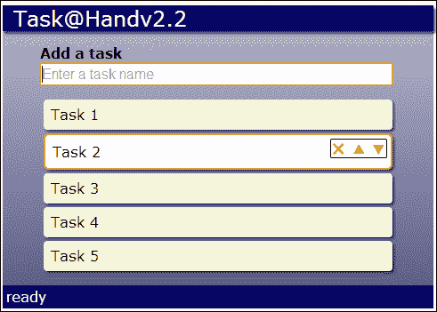

# 动态样式表

让我们为我们的应用程序添加一个新功能，允许用户选择颜色方案或主题，以便他们可以自定义应用程序的外观和感觉。我们可以通过动态加载 CSS 文件来改变网页的外观，以覆盖默认样式表中的现有样式。为了实现这一点，我们将在应用程序中添加一个主题的下拉列表供用户选择。当他们改变主题时，它将改变样式表，从而改变页面的颜色。

# 行动时间-添加主题选择器

首先，我们需要一个放置主题选择器的地方。因此，让我们在`taskAtHand.html`中的任务列表应用程序的标记中添加一个工具栏。我们将它插入在`<header>`和`<div id="main">`元素之间。工具栏将包含一个`<label>`和一个`<select>`下拉列表。列表将包含四种不同的颜色主题：`blue`、`green`、`magenta`和`red`。您可以在`chapter2/example2.3`中找到此部分的代码：

```html
<div id="app">
  <header>Task@Hand</header>
 <div id="toolbar">
 <label for="theme">Theme</label>
 <select id="theme" title="Select theme">
 <option value="blue">Blue</option>
 <option value="green">Green</option>

 <option value="magenta">Magenta</option>
 <option value="red">Red</option>
 </select>
 </div>
  <div id="main">
```

现在让我们设计工具栏。我们将使字体比页面的其他部分稍微小一些，并将背景颜色设置为黑色，并带有一些透明度，以便它后面的颜色透过来：

```html
#toolbar
{
    padding: 0.25em;
    font-size: 0.8em;
    color: WhiteSmoke;
    background-color: rgba(0, 0, 0, 0.4);
}
```

接下来，我们必须实现不同的主题。因此，让我们创建一些新的 CSS 文件，每个主题一个文件。我们将把它们放在一个名为`themes`的文件夹中，以便将它们分组在一起。CSS 文件将与`<option>`值具有相同的名称：`blue.css`、`green.css`、`magenta.css`和`red.css`。让我们来看一下`green.css`：

```html
#app
{
    background-color: #bcb;
    background: -webkit-linear-gradient(top, #bcb, #585);
    background: -moz-linear-gradient(top, #bcb, #585);
    background: -ms-linear-gradient(top, #bcb, #585);
    background: linear-gradient(top, #bcb, #585);
}
#app>header,
#app>footer
{
    background-color: #060;
}
```

从顶部开始，我们覆盖`app`元素的背景渐变，使它们成为绿色，而不是蓝色。我们还将`header`和`footer`元素改为绿色。其他 CSS 文件将与此文件完全相同，只是它们的颜色会有所不同。

现在让我们在 HTML 文件的`<header>`元素中添加一个样式表`<link>`元素，用于主题 CSS 文件。由于蓝色主题是默认的，我们将设置它加载`blue.css`：

```html
<link href="taskAtHand.css" rel="StyleSheet" />
<link id="theme-style" href="themes/blue.css" rel="StyleSheet" />

```

请注意，我们在基本样式表之后包含主题样式表。这将允许我们覆盖默认样式。还要注意，我们给`<link>`元素一个`ID`属性，这样我们以后就可以在 JavaScript 中访问它。

我们需要添加的其余代码在`taskAtHand.js`中。首先，我们将在`TaskAtHand.start()`方法中为主题选择器添加一个`change`事件处理程序：

```html
$("#theme").change(onChangeTheme);
```

当用户选择新主题时，它将调用`onChangeTheme()`私有方法：

```html
function onChangeTheme()
{
    var theme = $("#theme>option").filter(":selected").val();
    setTheme(theme);
    appStorage.setValue("theme", theme);
}
```

这个方法通过获取其`<option>`元素并使用 jQuery 的`:selected`选择器在`filter()`方法内找到选定的选项，从列表中获取所选选项。然后调用`setTheme()`方法，接下来我们将实现。最后，我们将所选主题保存到`localStorage`，这样下次用户返回应用程序时就可以设置它。

`setTheme()`方法接受主题名称作为参数。它获取`<link id="theme-style">`元素，并将其`href`属性更改为新样式表的 URL：

```html
function setTheme(theme)
{
    $("#theme-style").attr("href", "themes/" + theme + ".css");
}
```

当这发生时，页面将加载新的样式表，并将其样式应用于现有样式。就像这样，页面的颜色发生了变化。

等等，我们还没有完成。还记得我们是如何将主题保存到`localStorage`的吗？现在当用户返回我们的应用程序时，我们需要将其取出。我们将创建一个`loadTheme()`方法来做到这一点：

```html
function loadTheme()
{
    var theme = appStorage.getValue("theme");
    if (theme)
    {
        setTheme(theme);
        $("#theme>option[value=" + theme + "]")
            .attr("selected","selected");
    }
}
```

这个方法从`localStorage`获取主题名称。如果找到了一个，它就调用`setTheme()`来设置它。然后通过在列表中找到具有其值为主题名称的`<option>`，并在其上设置`selected`属性，来选择该主题。最后一件事是从`start()`方法中添加对`loadTheme()`的调用，然后我们就完成了。

### 注意

我们的主题样式更改非常简单，但是您可以完全改变应用程序的外观和感觉使用这种技术。

## *刚刚发生了什么？*

我们添加了一个主题选择器，可以更改主题样式表，这会导致页面使用不同的颜色来绘制背景。我们将所选主题保存到本地存储中，因此当用户返回应用程序时，设置将被记住。

# 填充窗口

在我们离开 CSS 章节之前，还有一件事情我们需要重新设计。让我们使应用程序填满整个窗口的空间。现在随着列表的增长，背景渐变也在增长，页脚也在下移。如果渐变覆盖整个窗口，页脚始终位于底部会更好。

# 行动时间-扩展应用程序

我们可以使用绝对定位来填充浏览器窗口。让我们为`<div id="app">`元素的样式添加以下内容：

```html
#app
{
 position: absolute;
 top: 0;
 bottom: 0;
 left: 0;
 right: 0;
 overflow: auto;
    /* Code not shown… */
}
```

首先，它将元素的定位设置为绝对定位，这样我们就可以将元素的位置设置为我们想要的位置。然后我们将所有的`position`属性设置为`0`。这样就可以拉伸元素，使其填满整个窗口空间。最后，我们将`overflow`属性设置为`auto`。这将使滚动条出现，并且如果任务列表超出窗口的高度，渐变会延伸到窗口底部以下。

我们还需要重新定位页脚，使其固定在窗口底部。我们可以通过将`position`设置为`absolute`和`bottom`设置为`0`来实现。请注意，我们没有将`right`设置为`0`，因此页脚不会占据整个宽度。否则，它可能会干扰任务列表：

```html
#app>footer
{
    position: absolute;
    bottom: 0;
    /* Code not shown… */
}
```

## *刚刚发生了什么？*

我们扩展了主应用程序元素，使其占据整个浏览器窗口的空间，并将页脚移动到底部。让我们看看我们的应用程序现在在浏览器中的样子：

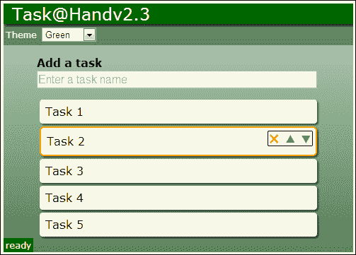

## 试试看

想出并实现更多的主题。使用我们学到的一些 CSS3 特性，如径向渐变、背景图片，甚至一些盒子阴影来制作一些看起来有趣的主题。

## 快速测验

Q1\. 渐变可以有多少个颜色停？

1.  一个

1.  二

1.  三

1.  任意数量

Q2\. 过渡是什么作用？

1.  将 CSS 属性从一个值过渡到另一个值

1.  将元素从一种类型过渡到另一种类型

1.  从一个类过渡到另一个类

1.  从一个视图过渡到另一个视图

# 总结

在本章中，我们学习了一些新的 CSS3 功能，可以用来使您的应用程序更加突出，并为用户提供大量的视觉反馈。我们通过向任务元素添加圆角和阴影，并向任务工具按钮添加图像来更新了我们的任务列表应用程序。我们为背景添加了渐变和主题选择器，允许用户更改颜色方案。我们还添加了一些过渡效果，使变化看起来更加自然。

在本章中，我们涵盖了以下概念。

+   如何在 CSS3 中定义带有透明度的颜色

+   如何给元素添加圆角

+   如何向元素和文本添加阴影

+   如何创建线性和径向渐变

+   如何使用 CSS3 过渡和变换来创建视觉效果

+   如何使用 CSS 精灵来减少应用程序的网络印记

+   如何动态加载样式表

+   如何使您的应用程序填满整个窗口

在我们继续之前，让我给你一个警告。仅仅因为 CSS3 拥有所有这些出色的效果，并不意味着你必须在应用程序中全部使用它们。每个文本并不都需要阴影，你不需要让你的背景具有彩虹般的渐变，也不需要让每个元素旋转 30 度。谨慎地使用这些效果将使您的应用程序看起来更专业；过度使用将使它们看起来滑稽。

在下一章中，我们将通过为每个任务添加一个详细部分，使用一些新的 HTML5 输入类型，将我们的任务列表应用程序提升到一个新的水平。我们还将学习如何使用自定义数据属性将数据模型绑定到输入元素。
