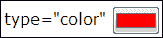
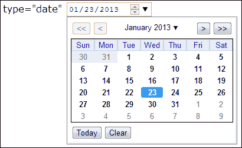
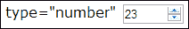
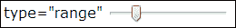
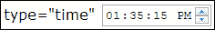
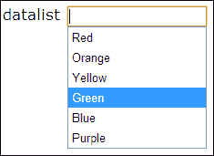
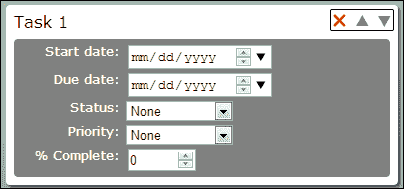
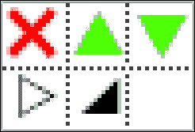
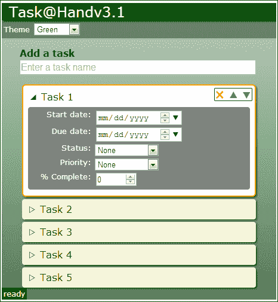

# 第三章：细节决定成败

> “希望了解世界的人必须从具体细节中了解它。”

*—赫拉克利特*

*本章主要介绍新的 HTML5 输入类型以及如何使用 JavaScript 与其进行交互。在第一章中，*手头的任务*，我们创建了一个任务列表应用程序，在第二章中，*时尚起来*，我们使用了新的 CSS3 样式对其进行了美化。在本章中，我们将继续改进它，通过添加新的 HTML5 输入类型的任务详细信息部分。然后，我们将使用自定义数据属性自动将视图中的值绑定到应用程序中的数据模型。我们还将添加一些 jQuery 动画，使 UI 过渡更加流畅。*

我们将在本章中学习以下主题：

+   新的 HTML5 输入类型及其提供的好处

+   自定义数据属性及其用途

+   如何使用自定义数据属性将数据模型绑定到输入元素

+   使用 jQuery 动画方法隐藏和显示元素

+   使用定时器将保存到 localStorage 的内容排队

# HTML5 输入类型

HTML5 带来了一系列新的输入类型。这些新类型旨在提供格式化、验证，有时还提供选择器。对于触摸设备，其中一些类型为键盘提供了不同的按键。并非所有新的输入类型都得到了所有浏览器的支持。幸运的是，如果浏览器不支持某种类型，它将只是将其显示为普通文本字段。不幸的是，如果不支持的类型只显示为文本字段，您不能依赖浏览器提供正确格式化的数据。因此，如果您要使用它们，请确保您有备用方案。

以下是一些更有用的新输入类型，以及 Chrome 支持的其中一些类型的图像。

### 注意

请参见`第三章/输入类型/input-types.html`中的示例。

## 颜色

`color`输入类型用于选择颜色。单击时通常会显示颜色选择器。值是十六进制颜色指示符（例如，#FF0000）。目前这个控件的支持范围有限，因此请谨慎使用。

```html
<input type="color" value="#FF0000"/>
```



## 日期

`date`输入类型用于选择日期。单击时通常会显示日期选择器。值是 yyyy-mm-dd 格式的日期字符串（例如，2013-01-23）。您还可以以相同的日期格式指定`min`和`max`属性，以限制日期范围：

```html
<input type="date" value="2013-01-23" min="2013-01-01"/>
```



## 电子邮件

`email`输入类型用于输入电子邮件地址。它的外观和行为类似于标准文本字段。在触摸设备上，键盘通常会更改以提供电子邮件符号，如*@*符号和*.com*：

```html
<input type="email" value="foo@bar.com"/>
```

## 数字

`number`输入类型用于输入数字。通常会显示带有上下按钮（微调控件）的形式，单击时会按`step`的量更改值。在触摸设备上，键盘可能会更改为数字键盘。您可以使用一些属性来限制字段：

+   `min`：指定允许的最小值

+   `max`：指定允许的最大值

+   `step`：指定单击上下微调按钮时值更改的量

```html
<input type="number" value="23" min="0" max="100" step="1"/>
```



## 范围

`range`输入类型用于从一系列值中选择一个值。这几乎与`number`输入类型相同，只是通常显示为滑块控件。它具有与`number`输入类型相同的属性。

```html
<input type="range" value="20" min="0" max="100" step="10"/>
```



## 时间

`time`输入类型用于选择时间。单击时，它可能会显示时间选择器，或者您可以使用微调器设置时间。值是 24 小时格式的时间字符串，格式为 hh:mm:ss（例如，13:35:15）。

```html
<input type="time" value="13:35:15"/>
```



## URL

`url`输入类型用于输入 URL。与`email`类型一样，触摸设备通常会显示为优化输入 URL 的键盘。

```html
<input type="url" value="http://www.worldtreesoftware.com"/>
```

## 数据列表

除了这些新的输入类型，HTML5 中还添加了一个新的`<datalist>`表单元素。它用于为文本字段添加一个下拉提示列表。当用户开始在文本字段中输入时，与正在输入的字母匹配的所有列表选项将显示在字段下的下拉菜单中。用户可以选择其中一个选项来自动填写字段。

你可以通过在`<datalist>`元素上设置一个 ID，并在`<input>`元素的`list`属性中引用它，将`<datalist>`元素与文本字段关联起来。

```html
<input type="text" list="color-list"/>
<datalist id="color-list">
    <option value="Red"/>
    <option value="Orange"/>
    <option value="Yellow"/>
    <option value="Green"/>
    <option value="Blue"/>
    <option value="Purple"/>
</datalist>
```



### 注意

由于新输入类型的实现在这个时候还不够完善，所以在使用它们时要小心。如果不支持使用`number`字段不会引起太多问题；用户仍然可以在文本字段中输入数字。但是如果像`color`字段这样的东西不被支持，它会显示为一个文本字段。在这种情况下，你的用户愿意输入十六进制代码的颜色吗？

## 自动聚焦

HTML5 输入元素还有一个有用的补充。新增了一个`autofocus`属性，用于在页面首次加载时设置焦点在特定的`<input>`元素上。以前我们在应用程序中通过调用 jQuery 的`focus()`方法来为`<input id="new-task-name">`元素设置焦点。在 HTML5 中，我们可以通过添加`autofocus`属性来实现相同的功能。

```html
<input type="text" autofocus id="new-task-name".../>
```

# 任务详细信息

让我们在我们的任务列表应用程序中充分利用一些新的输入类型。目前我们只有一个任务名称输入字段。我们对此无能为力。所以让我们为每个任务添加一些字段，让用户可以定义更多关于它们的细节。你可以在`Chapter 3\example3.1`中找到这一部分的源代码。

# 行动时间 - 添加任务详细信息

我们将为每个任务添加以下新字段：

+   **开始日期**：任务应该开始的日期。输入类型为`date`。

+   **截止日期**：任务应该完成的日期。输入类型为`date`。

+   **状态**：下拉列表`<select>`，选项为**无**，**未开始**，**已开始**和**已完成**。

+   **优先级**：下拉列表`<select>`，选项为**无**，**低**，**正常**和**高**。

+   **% 完成**：输入类型为`number`，有效范围为**0**到**100**。

让我们在`taskAtHand.html`中的任务模板标记中定义这些字段。每个任务的详细信息将显示在任务名称下的一个部分中。我们的模板现在看起来像以下的代码片段：

```html
<li class="task">
    <span class="task-name"></span>
    <input type="text" class="task-name hidden"/>
    <div class="tools">
        <button class="delete" title="Delete">X</button>
        <button class="move-up" title="Up">^</button>
        <button class="move-down" title="Down">v</button>
    </div>
    <div class="details">
 <label>Start date:</label>
 <input type="date"/><br/>
 <label>Due date:</label>
 <input type="date"/><br/>
 <label>Status:</label>
 <select>
 <option value="0">None</option>
 <option value="1">Not Started</option>
 <option value="2">Started</option>
 <option value="3">Completed</option>
 </select><br/>
 <label>Priority:</label>
 <select>
 <option value="0">None</option>
 <option value="1">Low</option>
 <option value="2">Normal</option>
 <option value="3">High</option>
 </select><br/>
 <label>%&nbsp;Complete:</label>
 <input type="number min="0" max="100" step="10" value="0"/>
 </div>
</li>
```

首先，我们添加了一个新的`<div class="details">`元素来包含新的详细字段。这样我们可以将详细信息与任务名称分开以便以不同的样式进行设置。然后我们向其中添加了标签和字段。请注意，对于**% 完成**，我们设置了`number`字段的`min`和`max`属性，以限制数字在 0 到 100 之间。

接下来我们需要为详细信息部分设置样式。我们将给它一个灰色的背景和圆角。我们将所有标签设置为相同的宽度，并将它们右对齐，以便所有输入字段对齐。然后我们将**状态**和**优先级**的`<select>`元素设置为固定宽度，以便它们也对齐。

```html
#task-list .task .details
{
    display: block;
    background-color: gray;
    color: white;
    border-radius: 4px;
    margin-top: 0.5em;
    padding: 0.25em;
    overflow: auto;
}
#task-list .task .details label
{
    width: 8em;
    text-align: right;
    display: inline-block;
    vertical-align: top;
    font-size: 0.8em;
}
#task-list .task .details select
{
    width: 8em;
}
```

## *刚刚发生了什么？*

我们使用一些新的 HTML5 输入类型为我们的任务添加了一个任务详细信息部分。以下截图显示了现在的任务项目是什么样子的，有一个详细信息部分：



# 行动时间 - 隐藏任务详细信息

看起来不错，但它也占用了很多空间。如果列表中的每个任务都这么长，它很快就会滚动到页面之外，我们将无法很好地看到任务列表的概述。由于任务详细信息是可选字段，我们可以通过不显示详细信息来使我们的列表更加紧凑，直到用户想要查看它们为止。我们将通过隐藏详细信息部分并在任务名称旁边添加一个切换按钮来实现这一点，以便在单击时显示或隐藏详细信息。

首先让我们在我们的任务模板中的任务名称旁边添加一个切换详细信息按钮，并给它一个名为`toggle-details`的类。

```html
<li class="task">
    <button class="toggle-details">+</button>
    <span class="task-name"></span>
    <!—- Not shown… -->
</li>
```

现在让我们在 JavaScript 代码中实现切换按钮。首先，在`addTaskElement()`方法中为切换按钮添加一个单击事件处理程序，该处理程序调用`toggleDetails()`方法：

```html
$("button.toggle-details", $task).click(function() {
    toggleDetails($task);
});
```

然后我们实现`toggleDetails()`方法：

```html
function toggleDetails($task)
{
    $(".details", $task).slideToggle();
    $("button.toggle-details", $task).toggleClass("expanded");
}
```

`toggleDetails()`方法使用了一些我们尚未见过的新的 jQuery 方法。它使用`slideToggle()`来切换任务详情的可见性，并使用`toggleClass()`来切换按钮上的`expanded`类。`toggleClass()`方法会在元素没有该类时向元素添加一个类，并在元素有该类时将其删除。

`slideToggle()`方法是一个动画函数，用于切换元素的可见性。它通过向下滑动的方式使元素可见，将其下面的元素推下。要隐藏元素，它会将其向上滑动，缩小直到隐藏。还有一个用于淡入淡出元素的方法，称为`fadeToggle()`。但是，当元素在变得可见时，滑动提供了更平滑的过渡，因为它会将其他元素推开。

### 注意

一般来说，当元素在变得可见时，滑动效果看起来更好，因为它会将下面的元素推下。它还适用于类似菜单的行为。当您使一个元素变得可见并显示在其他元素的顶部时，淡入通常看起来最好。

现在让我们为按钮添加一些样式。当然，我们想要一些漂亮的图标，就像我们的其他任务按钮一样，所以让我们将它们添加到我们的精灵表文件`icons.png`中。我们需要一个图像来显示任务属性折叠时的情况，另一个图像用于显示它们展开时的情况。让我们为这两个图标创建第二行图像。



我们在样式表中需要做的第一件事是将详情的`display`设置为`none`，以便它们默认情况下是隐藏的：

```html
#task-list .task .details
{
 display: none;
    /* Not shown… */
}
```

然后我们为`toggle-details`按钮添加样式。由于我们使用与任务工具按钮相同的精灵表，因此我们将通过将其添加到 CSS 选择器中，使用相同的样式来为我们的新按钮添加样式。然后，我们将添加选择器以使用背景位置偏移将图像放入按钮中：

```html
#task-list .task .tools button,
#task-list .task button.toggle-details
{
    /* Not shown… */
    background: url(images/icons.png);
}
#task-list .task button.toggle-details
{
    background-position: 0 -16px;
}
#task-list .task button.toggle-details.expanded
{
    background-position: -16px -16px;
}
```

我们的`toggle-details`图像的垂直偏移量为`-16px`，因为它们位于精灵表的第二行。请注意，第二个图像与`expanded`类匹配。当详情可见时，我们将`expanded`类添加到按钮上。

## 刚刚发生了什么？

我们为每个任务添加了一个切换按钮，当单击时隐藏或显示任务详情。在浏览器中打开它，看看我们现在有什么。您可以打开和关闭任务详情，并且它们会平稳地展开和关闭。相当酷。



# 自定义数据属性

HTML5 的另一个新功能是自定义数据属性。自定义数据属性允许您将自定义数据存储为 DOM 中任何元素的属性。您只需使用`data-`作为属性名称的前缀。名称应全部为小写字母。您可以为属性分配任何字符串值。

例如，假设我们有一个产品列表，我们想要存储有关产品的信息，例如产品 ID 和类别。我们只需向相关元素添加`data-product-id`和`data-category`属性：

```html
<ul id="product-list">
  <li data-product-id="d1e0ddde" data-category="widgets">
    Basic Widget
  </li>
  <li data-product-id="e6b2c03f" data-category="widgets">
    Super Widget
  </li>
</ul>
```

现在我们有了自定义属性，我们可以使用 JavaScript 从元素中提取自定义数据，并在我们的应用程序中使用它。jQuery 碰巧有一个专门为此目的设计的`data()`方法。您只需给出自定义属性的名称，减去`data-`，它就会返回与其关联的值。

继续上一个示例，假设我们希望允许用户单击列表中的产品，然后对其进行一些处理。以下的`setSelectedProduct()`方法使用`data()`方法从被单击的元素中提取产品 ID 和类别：

```html
$("#product-list li").click(function() {
    var $product = $(this);
    var productId = $product.data("product-id");
    var category = $product.data("category");
    // Do something...
});
```

# 使用自定义属性进行数据绑定

自定义数据属性的一个很好的用途是实现数据绑定。数据绑定允许我们将 DOM 中的用户控件映射到数据模型中的字段，以便在用户更改它们时自动更新。使用这种技术，我们可以消除许多无聊的重复代码，这些代码只是处理事件并将视图中的字段映射到模型中的字段。

### 注意

有一些出色的数据绑定库可用于 JavaScript，包括`Backbone.js`和`Knockout`。我们将在这里实现自己简单的数据绑定，以学习如何使用自定义属性。如果你发现自己正在构建一个大量数据的应用程序，你可能会考虑使用其中一个库。

# 行动时间-构建数据模型

在我们开始实现数据绑定之前，我们需要一个数据模型进行绑定。如果你还记得，我们只是将任务名称保存到`localStorage`。我们的数据模型只是一个字符串数组。现在每个任务都有多个详细字段，我们需要一些更实质的东西来保存所有这些数据。你可以在`Chapter 3\example3.2`中找到本节的源代码。

让我们从为我们的数据模型定义一个任务对象开始。我们将创建一个新文件`taskList.js`来放置它。

```html
function Task(name)
{
    this.name = name;
    this.id = Task.nextTaskId++;
    this.created = new Date();
    this.priority = Task.priorities.normal;
    this.status = Task.statuses.notStarted;
    this.pctComplete = 0;
    this.startDate = null;
    this.dueDate = null;
}
// Define some "static variables" on the Task object
Task.nextTaskId = 1;
Task.priorities = {
    none: 0,
    low: 1,
    normal: 2,
    high: 3
};
Task.statuses = {
    none: 0,
    notStarted: 1,
    started: 2,
    completed: 3
};
```

从头开始，我们的构造函数接受一个参数-任务名称。它用于设置对象中的名称字段。每个任务都有一个唯一的任务 ID，每次创建任务时都会递增。其余成员设置为默认值。

我们将`Task.nextTaskId`字段附加到`Task`对象构造函数，以跟踪下一个唯一任务 ID 应该是什么。这样做可以让我们定义我们在具有类的语言中定义静态或类变量的内容，比如 Java 或 C#（在这些语言中，它们使用静态变量定义）。`nextTaskId`字段在更改时将保存到`localStorage`，以便我们知道用户返回应用程序时我们离开的位置。

注意`priority`和`status`使用枚举。我们将这些实现为静态对象（因为 JavaScript 没有枚举），附加到`Task`构造函数。

我们需要的下一件事是一个列表，用于存储`Task`对象。为了更容易管理这段代码，我们将创建一个`TaskList`对象，它基本上是一个数组的包装器。它提供了添加、删除和获取任务的方法：

```html
function TaskList(tasks)
{
    tasks = tasks || [];
```

构造函数接受一个可选参数，即`Task`对象的数组。构造函数的第一行检查是否传入了一个数组。如果没有，则使用空方括号(`[]`)创建一个新的空数组。

### 注意

在 JavaScript 中，逻辑或运算符（`||`）可以充当空值合并运算符。如果操作数是“真值”，它将返回左操作数；否则返回右操作数。在这种情况下，真值意味着传入了`tasks`参数并且不是`null`或`undefined`。这是定义默认值的非常有用的范例。

现在我们添加一个公共的`getTasks()`方法，它简单地返回数组。我们以后需要访问它来保存任务：

```html
    this.getTasks = function()
    {
        return tasks;
    };
```

接下来我们添加一个公共的`addTask()`方法，它接受一个`Task`对象并将其追加到数组的末尾：

```html
    this.addTask = function(task)
    {
        tasks.push(task);
        return this;
    };
```

公共的`removeTask()`方法以任务 ID 作为参数，并从列表中删除相关的任务：

```html
    this.removeTask = function(taskId)
    {
        var i = getTaskIndex(taskId);
        if (i >= 0)
        {
            var task = tasks[i];
            tasks.splice(i, 1);
            return task;
        }
        return null;
    };
```

它通过调用`getTaskIndex()`获取任务的索引，然后使用`array.splice()`方法从`tasks`数组中删除它。`getTaskIndex()`方法是一个私有方法，它以任务 ID 作为参数，并通过数组搜索找到具有该 ID 的任务。如果找到任务，则返回它。否则返回`-1`：

```html
    function getTaskIndex(taskId)
    {
        for (var i in tasks)
        {
            if (tasks[i].id == taskId)
            {
                return parseInt(i);
            }
        }
        // Not found
        return -1;
    }
```

接下来是公共的`getTask()`方法。它以任务 ID 作为参数，并使用`getTaskIndex()`方法来查找它。它返回相关的`Task`对象，如果不存在则返回`null`。

```html
    this.getTask = function(taskId)
    {
        var index = getTaskIndex(taskId);
        return (index >= 0 ? tasks[index] : null);
    };
```

我们要添加的最后一个公共方法称为`each()`。它将`callback`函数的引用作为参数。它循环遍历任务数组，并对数组中的每个任务执行`callback`函数。此方法可用于遍历列表中的所有任务：

```html
    this.each = function(callback)
    {
        for (var i in tasks)
        {
            callback(tasks[i]);
        }
    };
}
```

# 行动时间-实现绑定

让我们回到 HTML 文件中的任务模板，并添加一些自定义数据属性。我们将为所有任务详细信息的`<input>`和`<select>`元素添加自定义属性。数据属性的名称将是`data-field`，属性值将是元素在`Task`对象中匹配的字段的名称。我们稍后将在 JavaScript 中使用这些属性来将 DOM 元素和数据模型连接在一起：

```html
<div class="details">
    <label>Start date:</label>
    <input type="date" data-field="startDate"/><br/>
    <label>Due date:</label>
    <input type="date" data-field="dueDate"/><br/>
    <label>Status:</label>
    <select data-field="status">
        <!— options removed... -->
    </select><br/>
    <label>Priority:</label>
    <select data-field="priority">
        <!— options removed... -->
    </select><br/>
    <label>%&nbsp;Complete:</label>
    <input type="number" data-field="pctComplete"
        min="0" max="100" step="10" value="0"/>
</div>
```

现在我们有了一个数据模型，我们需要进入`taskAtHand.js`中的`TaskAtHandApp`对象，并更新它以使用该模型。首先，我们将添加一个`taskList`变量，并将其初始化为`TaskList`对象的实例：

```html
function TaskAtHandApp()
{
    var version = "v3.2",
        appStorage = new AppStorage("taskAtHand"),
 taskList = new TaskList();

```

然后，我们将进入`addTask()`方法，并添加代码来创建一个新的`Task`对象，并将其添加到任务列表中。这也是在将`nextTaskId`值递增后将其保存到`localStorage`中的地方：

```html
function addTask()
{
    var taskName = $("#new-task-name").val();
    if (taskName)
    {
 var task = new Task(taskName);
 taskList.addTask(task);
 appStorage.setValue("nextTaskId", Task.nextTaskId);
        addTaskElement(task);
        saveTaskList();
        // Reset the field
        $("#new-task-name").val("").focus();
    }
}
```

请注意，我们还更改了`addTaskElement()`方法的参数，以传入`Task`对象。因此，让我们更新`addTaskElement()`方法，以将`Task`对象作为参数而不是任务名称：

```html
function addTaskElement(task)
{
    var $task = $("#task-template .task").clone();
 $task.data("task-id", task.id);
    $("span.task-name", $task).text(task.name);
```

在 DOM 中创建新任务元素后，我们使用名为`task-id`的自定义数据属性在其上设置任务 ID。这是通过 jQuery 的`data()`方法完成的，该方法将数据属性名称和值作为参数。接下来，我们将任务名称设置到`task.name`字段的`<span>`属性中。

现在我们将实现数据绑定的第一部分。下面的代码块使用了我们之前添加到标记中的数据属性，将`Task`对象的值设置到详细部分中关联的`<input>`和`<select>`元素中：

```html
    // Populate all of the details fields
    $(".details input, .details select", $task).each(function() {
        var $input = $(this);
        var fieldName = $input.data("field");
        $input.val(task[fieldName]);
    });
```

它的工作原理如下：

1.  首先，它查找任务元素内的所有`<input>`和`<select>`元素。

1.  然后调用 jQuery 的`each()`方法，用于遍历所选元素集，传入一个`callback`函数。

1.  在`callback`函数中，`this`指向当前元素。因此，我们首先将元素包装在 jQuery 对象中。

1.  然后，我们使用`data()`方法获取`data-field`自定义属性的值，这是与元素关联的`Task`对象中字段的名称。

1.  最后，我们将用户控件的值设置为`Task`对象中字段的值。我们使用方括号从`Task`对象中获取值。请记住，在 JavaScript 中，`object["field"]`与`object.field`是相同的。

### 注意

您可以将使用方括号访问对象字段视为类似于在 C#或 Java 中使用反射在运行时动态访问对象中的值。

现在，我们需要添加代码来实现双向绑定。每当用户更改表单控件的值时，我们希望自动将其保存回数据模型。因此，让我们为每个详细表单控件添加一个 change 事件处理程序：

```html
$(".details input, .details select", $task).change(function() {
    onChangeTaskDetails(task.id, $(this));
});
```

这调用`onChangeTaskDetails()`方法，传入任务 ID 和更改的表单控件元素，该元素包装在 jQuery 对象中。让我们实现该方法：

```html
function onChangeTaskDetails(taskId, $input)
{
    var task = taskList.getTask(taskId)
    if (task)
    {
        var fieldName = $input.data("field");
        task[fieldName] = $input.val();
        saveTaskList();
    }
}
```

让我们分解一下，看看它是如何工作的：

1.  首先，它从具有指定 ID 的任务列表中获取`Task`对象。

1.  确保我们得到了一个对象（你永远不知道，所以总是检查），我们从元素的`data-field`属性中获取`Task`对象字段名称。

1.  然后，我们将`Task`对象上的字段值设置为表单控件元素的值，再次使用方括号动态访问它。

1.  最后，我们调用`saveTaskList()`来提交对`localStorage`的更改。

提醒一下，我们需要重写`saveTaskList()`方法来保存我们的新`TaskList`对象。这很容易。我们只需调用任务列表的`getTasks()`方法来获取`Task`对象的数组。然后我们将数组保存到`localStorage`：

```html
function saveTaskList()
{
    appStorage.setValue("taskList", taskList.getTasks());
}
```

### 注意

如果您有来自先前示例的旧任务列表数据，则需要在使用新数据模型之前将其删除。在 Chrome 开发者工具中，您可以单击该项目，然后按*删除*键将其删除。

## *刚刚发生了什么？*

首先，我们创建了一个数据模型来保存所有任务数据。然后，我们使用自定义数据属性向我们的应用程序添加了数据绑定，以在页面更改字段时自动更新数据模型。然后我们将任务列表保存到本地存储。

# 行动时间-加载任务列表

现在我们已将新数据模型保存到`localStorage`，我们需要更新`loadTaskList()`方法来加载数据：

```html
function loadTaskList()
{
    var tasks = appStorage.getValue("taskList");
    taskList = new TaskList(tasks);
    rebuildTaskList();
}
```

首先，我们从`localStorage`获取任务数组，并将其作为参数传递给`TaskList`对象的构造函数。然后，我们调用一个新方法`rebuildTaskList()`来在 DOM 中创建任务元素：

```html
function rebuildTaskList()
{
    // Remove any old task elements
    $("#task-list").empty();
    // Create DOM elements for each task
    taskList.each(function(task)
    {
        addTaskElement(task);
    });
}
```

首先，我们使用 jQuery 的`empty()`方法从任务列表元素中删除任何旧元素。然后，我们使用我们在`TaskList`对象中实现的`each()`方法来迭代任务，并为每个任务调用`addTaskElement()`来构建任务元素。

# 排队更改

现在，我们已将用户控件绑定到数据模型，并在每次进行更改时自动保存。不过，这样做有一个问题。像`number`或`time`类型的输入控件，这些控件与微调按钮相关联，每次单击微调按钮时都会触发`change`事件。如果用户按住微调按钮，它将以惊人的速度触发`change`事件。这将反过来在非常短的时间内重复将任务列表保存到`localStorage`。这似乎不是一件非常有效的事情，特别是如果您有大量数据。

# 行动时间-延迟保存

### 注意

请参阅`第三章\示例 3.3`中的代码。

我们可以通过延迟保存到`localStorage`一段时间来缓解这个问题，以等待所有用户交互完成。使用 JavaScript 的`setTimeout()`函数很容易实现这一点。我们将在`saveTaskList()`方法中进行此更改，但首先我们需要在`TaskAtHandApp`对象中设置一个全局变量，以跟踪`setTimeout()`返回的超时 ID：

```html
function TaskAtHandApp()
{
    var version = "v3.3",
        appStorage = new AppStorage("taskAtHand"),
        taskList = new TaskList(),
        timeoutId = 0;
```

当更改待保存时，我们希望在页面底部的状态元素中显示消息，以便用户知道他们的更改将被保存。当实际保存发生时，我们将更新消息并使其淡出，以便用户知道保存已完成。为此，我们需要重写`setStatus()`方法：

```html
function setStatus(msg, noFade)
{
    $("#app>footer").text(msg).show();
    if (!noFade)
    {
        $("#app>footer").fadeOut(1000);
    }
}
```

我们添加了一个可选的`noFade`参数。当设置为`true`时，消息将不会淡出。否则，我们使用 jQuery 的`fadeOut()`方法在 1000 毫秒或一秒内逐渐淡出消息。现在让我们更新`saveTaskList()`方法：

```html
function saveTaskList()
{
    if (timeoutId) clearTimeout(timeoutId);
    setStatus("saving changes...", true);
    timeoutId = setTimeout(function()
    {
        appStorage.setValue("taskList", taskList.getTasks());
        timeoutId = 0;
        setStatus("changes saved.");
    },
    2000);
}
```

我们首先检查`timeoutId`变量是否有值，以查看是否已经有保存待处理。如果有，我们将使用 JavaScript 的`clearTimeout()`函数取消超时。这样做的效果是，如果用户在保存待处理时进行其他更改，所有更改将被排队并一次性保存。

接下来，我们使用`setTimeout()`设置一个新的超时。`setTimeout()`函数接受要执行的函数和等待执行该函数的毫秒数。它返回一个超时 ID，我们将其存储在`timeoutId`变量中，以防以后需要取消超时。

在 2000 毫秒或两秒的不活动后，任务列表将被保存。然后我们重置`timeoutId`变量，因为我们的超时已经结束。最后，我们调用`setStatus()`告诉用户更改已保存。

## *刚刚发生了什么？*

我们使用 JavaScript 的`setTimeout()`函数来有效地排队更改，这样当值快速变化时，我们不会不断保存任务列表。

## 尝试一下

就这样；我们的任务列表应用程序已经完成，至少在这本书中是这样。现在去添加你自己的功能，使它变得更好。例如，添加更多的任务字段，比如一个文本区域来输入备注。也许在工具栏中添加一个选项来隐藏已完成的任务。尝试添加一个排序选项，按名称、状态或日期对列表进行排序。

## 弹出测验

Q1\. 如果浏览器不支持新的 HTML5 输入类型会发生什么？

1.  输入字段未显示。

1.  该字段显示为文本字段。

1.  该字段设置为只读。

1.  浏览器显示错误消息。

Q2\. 自定义数据属性可以用在什么样的元素上？

1.  只有表单输入元素。

1.  只有块级元素。

1.  只有内联元素。

1.  任何元素。

# 总结

在本章中，我们看了一些更有用的 HTML5 输入类型。我们使用这些输入类型为每个任务创建了一个可折叠的任务详情部分。然后我们使用自定义数据属性来实现简单的数据绑定，将视图中的输入字段映射到数据模型。

在本章中，我们涵盖了以下概念：

+   如何以及何时使用新的 HTML5 输入类型

+   如何使用自定义数据属性在 DOM 中存储私有数据

+   如何使用自定义数据属性实现数据绑定，将数据模型绑定到表单控件

+   如何使用 jQuery 动画方法隐藏和显示元素

+   如何使用定时器延迟保存到`localStorage`，使应用程序更加响应

在下一章中，我们将朝着一个全新的方向前进。我们将看看 HTML5 画布元素和 API，并编写一个使用它的全新应用程序。
