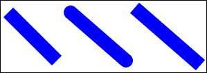
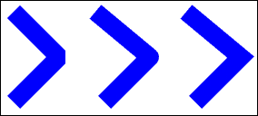
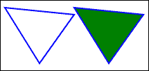
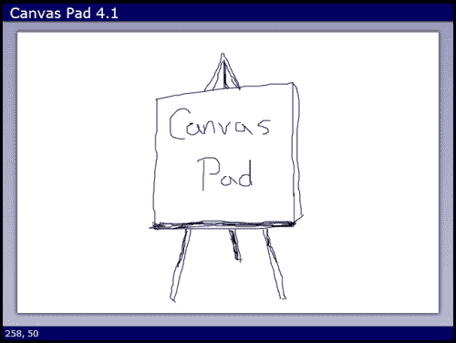
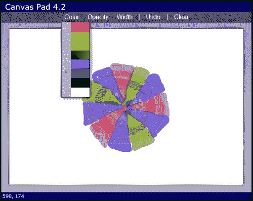
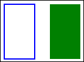
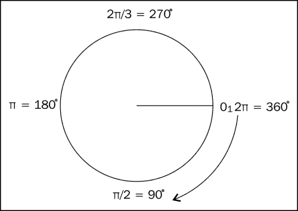
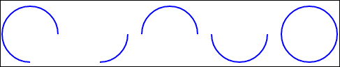
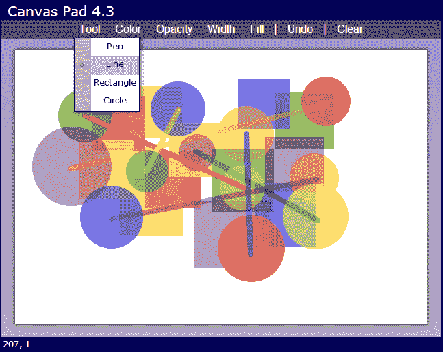

# 第四章：一块空白画布

> “站在一块空白的画布前，既美好又可怕。”

*—保罗·塞尚*

*在本章中，我们将朝着一个全新的方向前进。我们将学习如何使用新的 HTML5 画布元素和 API，创建一个简单的绘图应用程序。我们的应用程序将使用画布基础知识，如笔画、路径、线条和形状。我们将使用在上一章中学到的自定义数据属性创建一个工具栏，将菜单项绑定到我们代码中的操作。*

我们将在本章中学习以下内容：

+   画布元素及其绘图 API

+   如何获取画布上下文及其全局属性

+   如何绘制线条、矩形和其他形状

+   如何获取画布元素内鼠标的位置

+   如何创建包含下拉菜单的工具栏

+   如何使用自定义数据属性将工具栏操作绑定到 JavaScript 代码

# HTML5 画布

HTML5 最令人兴奋的新功能之一可能就是画布。您可以使用它在网页的任何位置创建绘图。以前唯一的方法是使用其他技术，如 Flash、SVG 或其他浏览器插件。

HTML5 画布既是一个元素，也是一个 API。`<canvas>`元素定义了网页的一个矩形区域，可以在其中绘制图形。画布 API 与`<canvas>`元素一起工作，提供了在画布上绘制的 JavaScript 接口。它是一组用于绘制线条、矩形、圆形和其他图形基元的低级函数。

`<canvas>`元素本身非常简单。您必须设置`width`和`height`属性来指定其大小。您还可以选择将内容放在`<canvas>`元素内，以便在不支持它的浏览器中显示。好消息是，几乎每个现代浏览器都广泛支持 HTML5 的`<canvas>`元素。以下代码创建一个宽度为 600 像素，高度为 400 像素的画布元素：

```html
<canvas width="600" height="400">
  Sorry, your browser doesn't support canvas.
</canvas>
```

### 注意

如果您在 CSS 中将`<canvas>`元素的宽度和高度设置为元素上指定的大小之外的值，它将拉伸或缩小画布中的绘图以适应，这可能会影响图像质量。

# 获取上下文

可以通过画布上下文对象访问画布 API。通过调用`<canvas>`元素的`getContext()`方法，传入一个字符串参数来定义您想要的上下文类型，来获取上下文：

```html
var context = $("canvas")[0].getContext("2d");
```

您目前可以传递给`getContext()`的唯一有效上下文类型参数是`"2d"`。这引出了一个问题，“是否有 3D 上下文？”答案是否定的。但我们总是可以期待未来会有一个。

# 画布基础知识

在本节中，我们将学习如何使用画布 API 的一些基础知识。现在我们有了上下文，我们可以调用其方法来绘制线条和形状。API 具有一系列方法，让您可以绘制从最基本的线条到形状，甚至位图图像的一切。

您可以在`chapter4/canvas-examples/canvas-examples.html`中找到此部分的源代码。

## 清除画布

画布的背景是透明的。您在 CSS 中为画布元素指定的任何背景颜色都会显示出来。您可以使用上下文的`clearRect()`方法清除画布或其部分。它接受*x*、*y*、宽度和高度参数，并清除画布的那一部分。

```html
context.clearRect(0, 0, canvas.width, canvas.height);
```

## 上下文属性

默认情况下，当您在画布上绘制时，线条宽度为一像素，颜色为黑色。您可以通过在`context`对象上设置全局属性来更改这些属性。

+   `penWidth`：此属性设置绘制线条的宽度。它可以是任何小数。例如，您可以有一条宽度为 1.5 像素的线。

+   `strokeStyle`：此属性设置用于绘制线条的颜色。它可以是 CSS 颜色规范符之一。例如，要用红色绘制，您可以使用`red`或`#FF0000`、`rgb(255, 0, 0)`或`rgba(255, 0, 0, 1)`。

+   `fillStyle`：此属性设置用于填充形状的颜色。与`strokeStyle`一样，它可以是任何 CSS 颜色规范。

+   `globalAlpha`：此属性设置要绘制的 alpha 或透明度量。它可以是从 0 到 1 的任何数字，其中 0 是完全透明的，1 是完全不透明的。

+   `lineCap`：此属性确定线的端点如何绘制。它可以是以下之一：

+   `butt`绘制一个平角

+   `round`绘制一个圆形的末端

+   `square`绘制一个方形的末端

`square`看起来类似于`butt`，只是它在末端多画了一个矩形，使它更长。



+   `lineJoin`：此属性确定两条线相交的地方如何绘制角。它可以是以下之一：

+   `bevel`绘制一个斜角或平角

+   `round`绘制圆角

+   `miter`绘制一个尖角



# Canvas pad

现在我们已经了解了画布 API 的基础知识，让我们利用我们新获得的知识来创建一个名为**canvas pad**的绘图应用程序。我们将从一个绘制黑色线条的应用程序开始，就像在纸上用笔画一样。然后我们将添加一个工具栏和菜单，以便用户可以更改选项，如宽度、不透明度、颜色，并选择不同的绘图工具。

# 行动时间 - 创建画布垫

您可以在`chapter4/example4.1`中找到本节的源代码。让我们从第一章创建的应用程序模板中复制，并将文件名更改为`canvasPad.html`、`canvasPad.css`和`canvasPad.js`。然后我们进入并更改 HTML 中这些文件的链接。最后，我们将 JavaScript 中的主应用程序对象更改为`CanvasPadApp`。

现在让我们在 HTML 中的`<div id="main">`元素内部添加一个`<canvas>`元素，并将其大小设置为 600 乘以 400：

```html
<div id="main">
  <canvas width="600" height="400">
    Sorry, your browser doesn't support canvas.
  </canvas>
</div>
```

接下来，我们将在 CSS 中添加一些样式，将画布居中显示在页面上，并给它一个白色背景。我们还将使用`box-shadow`元素使其突出显示：

```html
#main
{
    text-align: center;
}
#main>canvas
{
    cursor: crosshair;
    margin: 1em auto;
    background-color: white;
    box-shadow: 0 0 8px 2px #555;
}
```

为了封装我们与画布的交互，我们将创建一个名为`Canvas2D`的新对象，并将其放在一个名为`canvas2d.js`的文件中。在这个对象中，我们将创建一些更高级的绘图函数。这个对象的构造函数以一个包装在 jQuery 对象中的`<canvas>`元素作为参数：

```html
function Canvas2D($canvas)
{
    var context = $canvas[0].getContext("2d"),
        width = $canvas[0].width,
        height = $canvas[0].height;
}
```

构造函数的第一件事是设置一些私有变量。我们从`$canvas` jQuery 对象中获取上下文、宽度和高度。

### 注意

您可以通过使用方括号（如数组）访问 jQuery 对象包装的基础元素。因此，在这种情况下，`$canvas[0]`给我们第一个（也是唯一的）`<canvas>`元素。

## *刚刚发生了什么？*

我们从我们的模板中创建了一个新的画布垫应用程序，并向其添加了一个画布。我们将画布居中显示在页面上，并给它一个全面的阴影来框定它，并使其看起来浮在页面的顶部。最后，我们创建了一个`Canvas2D`对象来封装与画布的交互。

# 行动时间 - 显示坐标

我们在`Canvas2D`对象中要实现的第一件事是将页面坐标转换为画布坐标的方法。然后我们将使用它来在用户在画布上移动鼠标时在页面上显示鼠标坐标。

鼠标坐标的问题在于它们总是相对于网页的左上角偏移。为了获得画布坐标，我们需要找到页面上`<canvas>`元素的偏移量，并从页面坐标中减去它。

首先，我们需要一个名为`pageOffset`的变量来保存画布元素的偏移量。我们将使用 jQuery 的`offset()`方法来设置它的值，该方法获取元素的页面偏移量。它返回一个带有`left`和`top`字段的对象：

```html
var pageOffset = $canvas.offset();
```

现在我们添加一个`getCanvasPoint()`方法。它接受`pageX`和`pageY`参数，减去画布元素的偏移量，并返回一个新对象，其中包含`x`和`y`字段来保存调整后的坐标：

```html
this.getCanvasPoint = function(pageX, pageY)
{
    return {
        x: pageX - pageOffset.left,
        y: pageY - pageOffset.top
    }
};
```

由于我们的画布位于页面中心，每当窗口大小发生变化时，画布的偏移量也会发生变化。因此，我们需要向窗口添加一个`resize`事件处理程序，以便在其发生变化时更新`pageOffset`变量：

```html
$(window).resize(function() { pageOffset = $canvas.offset(); });
```

现在让我们添加代码，当用户在画布上移动鼠标时，在状态栏中显示鼠标坐标。首先，我们需要在我们应用程序的主类`CanvasPadApp`中创建`Canvas2D`对象的实例。我们将把它赋给一个名为`canvas2d`的私有变量：

```html
function CanvasPadApp()
{
    var version = "4.1",
 canvas2d = new Canvas2D($("#main>canvas"));
    // ...
```

我们将在画布下方的`<footer>`元素中显示坐标。让我们在页脚中添加一个`<span>`来保存坐标：

```html
<footer>
 <span id="coords">0, 0</span>
</footer>
```

接下来，在`start()`方法中为`<canvas>`元素添加一个`mousemove`事件处理程序。当鼠标移动时，它将调用`onMouseMove`：

```html
this.start = function()
{
    $("#app header").append(version);
    $("#main>canvas").mousemove(onMouseMove);
}
```

`onMouseMove`事件处理程序调用`canvas2d.getCanvasPoint()`方法，传入鼠标事件的页面坐标。它返回画布上鼠标的位置，并将其传递给`showCoordinates()`方法以在页脚中显示它们：

```html
function onMouseMove(e)
{
    var canvasPoint = canvas2d.getCanvasPoint(e.pageX, e.pageY);
    showCoordinates(canvasPoint);
}
function showCoordinates(point)
{
    $("#coords").text(point.x + ", " + point.y);
}
```

`showCoordinates()`方法使用 jQuery 的`text()`方法将坐标放入页脚。现在，如果您在页面上的画布上移动鼠标，您将看到坐标变化。当您将鼠标移动到左上角时，它应该显示**(0, 0)**。

## *刚刚发生了什么?*

我们通过从鼠标坐标中减去画布的位置来计算鼠标在画布上的页面偏移。然后我们添加了一个`mousemove`事件处理程序，以在用户在画布上移动鼠标时在页脚显示坐标。

# 绘制线条

我们要实现的第一件事是让用户绘制简单的线条，或者在画布上涂鸦。为此，我们需要在用户按下鼠标按钮并移动鼠标时获取点，并在它们之间绘制线条。所以让我们学习如何在画布上绘制。

## 路径和描边

在画布上绘制的最原始的方法是定义路径，然后描边或绘制它们。可以将其视为在脑海中规划要绘制的内容，然后将笔放在纸上，并实际绘制出来。

要创建路径，您需要使用`moveTo()`和`lineTo()`方法指定两个或更多点来定义它。然后通过调用`stroke()`方法将其绘制到画布上。有四种基本方法可用于定义和绘制路径。

+   `beginPath()`:此方法开始一个新路径。

+   `moveTo(x, y)`:此方法将笔移动到新位置而不绘制。

+   `lineTo(x, y)`:此方法从上一个位置绘制一条线到新位置。

+   `stroke()`:此方法将路径绘制到画布上。重要的是要注意，直到调用`stroke()`之前，实际上没有任何东西被绘制到画布上。

以下代码从点(10, 10)绘制一条线到(80, 100)：

```html
context.beginPath();
context.moveTo(10, 10);
context.lineTo(80, 100);
context.stroke();
```

在`beginPath()`和`stroke()`之间，您可以调用任意次`moveTo()`和`lineTo()`方法。这允许您排队多个绘图命令，然后一次性将它们提交到画布上。如果您希望路径形成一个封闭的形状，可以调用`closePath()`方法以从最后一个点绘制一条线到第一个点。例如，以下代码绘制了一个三角形：

```html
context.beginPath();
context.moveTo(100, 10);
context.lineTo(150, 90);
context.lineTo(200, 20);
context.closePath();
context.stroke();
```

还可以通过调用上下文的`fill()`方法而不是`stroke()`来填充形状。实际上，如果您希望形状以一种颜色轮廓并以另一种颜色填充，可以同时调用`fill()`和`stroke()`：

```html
context.beginPath();
context.moveTo(100, 10);
context.lineTo(150, 90);
context.lineTo(200, 20);
context.closePath();
context.fill();
context.stroke();

```



# 行动时间-使用鼠标绘制

我们需要做的第一件事是捕获鼠标事件。让我们进入`CanvasPadApp`对象，并在`start()`方法中添加代码来检查它们。您可能还记得，我们已经添加了`mousemove`事件处理程序。现在我们将为`mousedown`、`mouseup`和`mouseout`事件添加处理程序：

```html
$("#main>canvas").mousemove(onMouseMove)
    .mousedown(onMouseDown)
    .mouseup(onMouseUp)
    .mouseout(onMouseUp);
```

不，`mouseout`中没有错误。我们希望`mouseout`事件与`mouseup`事件以相同的方式处理，因此它们都会停止绘图过程。当鼠标离开`<canvas>`元素时，将触发`mouseout`事件。当这种情况发生时，我们将无法再获取`mousemove`事件，因此无法再跟踪笔的位置。

在我们实现事件处理程序之前，我们需要一些新变量来跟踪事物。我们需要一个布尔值来跟踪我们何时在绘制，一个数组来跟踪当前的点集，以及一个数组来跟踪所有的点集（我们将它们称为动作）：

```html
var version = "4.1",
canvas2d = new Canvas2D($("#main>canvas")),
drawing = false,
 points = [],
 actions = [];
```

### 注意

请注意，如果您给全局对象变量设置默认值，它将使具有自动完成功能的代码编辑器更容易确定变量的类型，并为您提供适当的建议。

首先让我们实现`onMouseDown()`，因为这会启动绘图过程。它接受一个参数，即鼠标事件对象：

```html
function onMouseDown(e)
{
 e.preventDefault();
    penDown(e.pageX, e.pageY);
}
function penDown(pageX, pageY)
{
    drawing = true;
    points = [];
    points.push(canvas2d.getCanvasPoint(pageX, pageY));
    actions.push(points);
}
```

`onMouseDown()`方法中的第一件事是在鼠标事件对象上调用`preventDefault()`。这将阻止系统执行默认的鼠标按下行为，其中的一部分是更改鼠标光标图标。我们希望它保持为十字光标，这是我们之前在 CSS 中设置的。然后我们调用`penDown()`，传入鼠标的页面坐标，这些坐标是从鼠标事件中获取的。

在`penDown()`方法中，我们初始化了绘图过程。首先，我们将`drawing`标志设置为`true`。然后我们创建一个新数组来存放当前的绘图点。然后我们将第一个点添加到数组中，通过调用`getCanvasPoint()`将其从页面坐标转换为画布坐标。我们做的最后一件事是将当前的`points`数组添加到`actions`数组中。

绘图过程中的下一步是处理`mousemove`事件，所以让我们重写`onMouseMove()`方法：

```html
function onMouseMove(e)
{
    penMoved(e.pageX, e.pageY);
}
function penMoved(pageX, pageY)
{
    var canvasPoint = canvas2d.getCanvasPoint(pageX, pageY);
    showCoordinates(canvasPoint);

    if (drawing)
    {
        points.push(canvasPoint);
        redraw();
    }
}
```

现在`onMouseMove()`调用`penMoved()`，传递鼠标坐标。`penMoved()`方法首先转换坐标，然后像以前一样调用`showCoordinates()`。然后我们检查`drawing`标志是否已设置。这是在`penDown()`方法中设置的，所以我们知道鼠标按钮已按下。如果用户正在绘制，那么我们将当前点添加到点数组中并调用`redraw()`，接下来我们将实现它：

```html
function redraw()
{
    canvas2d.clear();
    for (var i in actions)
    {
        canvas2d.drawPoints(actions[i]);
    }
}
```

`redraw()`方法首先通过调用`canvas2d.clear()`清除画布，接下来我们将编写它，然后遍历所有的动作并调用`drawPoints()`，传入每个动作的点集。

现在让我们进入我们的`Canvas2D`对象并添加`clear()`和`drawPoints()`方法。首先，我们的`clear()`方法调用`context.clearRect()`方法，传入我们在`Canvas2D`构造函数中定义的画布`width`和`height`变量：

```html
this.clear = function()
{
    context.clearRect(0, 0, width, height);
    return this;
};
```

接下来，`drawPoints()`方法接受一个点数组并在它们之间绘制线条：

```html
this.drawPoints = function(points)
{
    context.beginPath();
    context.moveTo(points[0].x, points[0].y);
    for (var i = 1; i < points.length; i++)
    {
        context.lineTo(points[i].x, points[i].y);
    }
    context.stroke();
    return this;
};
```

在开始新路径后，它调用`moveTo()`将笔移动到数组中的第一个点。然后它遍历数组中的其余点，为每个点调用`lineTo()`。完成后，它调用`stroke()`将其绘制到画布上。

### 注意

对于 Canvas2D 中那些通常不返回值的方法，我们将返回`this`，以便我们可以进行函数链接。

我们需要实现的最后一件事是`onMouseUp()`事件处理程序。我们在这里需要做的就是将`drawing`标志设置回`false`：

```html
function onMouseUp(e)
{
    penUp();
}
function penUp()
{
    drawing = false;
}
```

## *刚刚发生了什么？*

我们使用鼠标事件来捕获和存储绘图动作到缓冲区中。然后我们使用画布 API 从这些点绘制线条到画布上。现在让我们在浏览器中打开我们的应用程序并检查一下。我们可以使用鼠标在画布上涂鸦并创建简单的线条图。



# 更改上下文属性

让我们通过允许用户更改笔属性，如颜色、不透明度和宽度，将我们的应用程序提升到下一个级别。

# 行动时间 - 添加上下文属性

首先让我们在我们的`Canvas2D`对象中添加一些代码，以允许我们更改全局上下文绘图属性。让我们在构造函数中设置一些默认值。我们将笔的颜色设置为黑色，宽度为`4`，并通过将`globalAlpha`设置为`1`使其完全不透明。我们将线连接和端点设置为圆形，使我们的线看起来更加平滑：

```html
context.lineWidth = 4;
context.strokeStyle = "black";
context.fillStyle = "black";
context.globalAlpha = 1.0;
context.lineJoin = "round";
context.lineCap = "round";
```

接下来，我们将添加公共属性访问器方法，以允许我们设置和获取颜色、不透明度和宽度属性的值。如果参数被传递到属性方法中（即`arguments.length`不是`0`），它将设置属性的值，然后返回`this`，这样我们就可以进行函数链接。否则，它将返回属性的值：

```html
this.penWidth = function(newWidth)
{
    if (arguments.length)
    {
        context.lineWidth = newWidth;
        return this;
    }
    return context.lineWidth;
};
this.penColor = function(newColor)
{
    if (arguments.length)
    {
        context.strokeStyle = newColor;
        context.fillStyle = newColor;
        return this;
    }
    return context.strokeStyle;
};
this.penOpacity = function(newOpacity)
{
    if (arguments.length)
    {
        context.globalAlpha = newOpacity;
        return this;
    }
    return context
};
```

现在我们需要一种方式让用户从应用程序中更改这些设置，所以下一步我们将实现的是一个工具栏。

# 创建工具栏

我们的工具栏将需要以下按钮。前三个将用于更改上下文的属性。最后两个将允许我们撤消和清除画布。

+   **颜色**：这个按钮显示一个下拉菜单，用户可以选择笔的颜色。

+   **不透明度**：这个按钮显示一个下拉菜单，用户可以选择笔的不透明度。

+   **宽度**：这个按钮显示一个下拉菜单，用户可以选择笔的宽度。

+   **撤消**：这个按钮移除最后一次绘图操作

+   **清除**：这个按钮清除画布和所有绘图操作，重新开始

自定义数据属性，我们在上一章中介绍过，将在整个工具栏中使用，用于定义工具栏按钮的操作和菜单选项。我们稍后将在 JavaScript 中使用这些属性来确定所选的操作或选项。现在添加一些额外的标记将使我们免于以后编写大量重复的代码。

# 行动时间 - 创建工具栏

您可以在`chapter4/example4.2`中找到本节的代码。

我们将在 HTML 文件中的主要元素内部定义工具栏，并放在画布的上方：

```html
<div id="toolbar">
  <div class="dropdown-menu">
    <button data-action="menu">Color</button>
    <ul id="color-menu"data-option="penColor" class="menu">
      <li data-value="red"></li>
      <li data-value="orange"></li>
      <li data-value="yellow"></li>
      <li data-value="green"></li>
      <li data-value="blue"></li>
      <li data-value="purple"></li>
      <li data-value="black" class="selected"></li>
      <li data-value="white"></li>
    </ul>
  </div>
<div class="dropdown-menu">
    <button data-action="menu">Opacity</button>
      <ul data-option="penOpacity" class="menu">
        <li data-value=".1">10%</li>
        <li data-value=".2">20%</li>
        <li data-value=".3">30%</li>
        <li data-value=".4">40%</li>
        <li data-value=".5">50%</li>
        <li data-value=".6">60%</li>
        <li data-value=".7">70%</li>
        <li data-value=".8">80%</li>
        <li data-value=".9">90%</li>
        <li data-value="1" class="selected">100%</li>
      </ul>
  </div>
  <div class="dropdown-menu">
    <button data-action="menu">Width</button>
      <ul id="width-menu" data-option="penWidth" class="menu">
        <li data-value="1">1</li>
        <li data-value="2">2</li>
        <li data-value="4" class="selected">4</li>
        <li data-value="6">6</li>
        <li data-value="8">8</li>
        <li data-value="10">10</li>
        <li data-value="12">12</li>
        <li data-value="14">14</li>
        <li data-value="16">16</li>
      </ul>
  </div> |
  <button data-action="undo">Undo</button> |
  <button data-action="clear">Clear</button>
</div>
```

每个工具栏按钮都有一个`data-action`自定义属性。这将在 JavaScript 中用于确定单击按钮时要执行的操作。对于带有下拉菜单的按钮，我们将`data-action`设置为`"menu"`。**撤消**和**清除**按钮各自有自己独特的操作值。

由于颜色、不透明度和宽度的工具栏项目是下拉菜单，我们将它们包装在`<div class="dropdown-menu">`元素中。这将工具栏按钮和菜单分组在一起，当单击按钮时显示菜单。菜单使用无序列表定义。每个`<ul>`元素都被赋予一个`menu`类和一个`data-option`自定义属性。这个属性的值与`Canvas2D`对象中的属性方法的名称相匹配，例如`penColor()`。

菜单项使用`<li>`元素定义。每个菜单项都有一个`data-value`自定义属性。这个属性设置为将传递到菜单上的`data-option`属性定义的属性方法中的值。

现在让我们在 CSS 中为工具栏设置样式：

```html
#toolbar
{
    padding: 2px;
    background-color: rgba(0, 0, 0, 0.5);
}
#toolbar button
{
    border: none;
    background-color: transparent;
    color: white;
    font-size: 1em;
}

```

首先，我们将工具栏的颜色设置为黑色，不透明度为 50%，这样背景颜色会透过来。然后我们将样式按钮，去掉边框和背景颜色，并将文本颜色设置为白色。现在让我们为下拉菜单设置样式：

```html
#toolbar .dropdown-menu
{
    display: inline-block;
    position: relative;
}
#toolbar ul.menu
{
    display: none;
    position: absolute;
    top: 100%;
    left: 0;
```

```html
    margin: 0;
    padding-left: 1.5em;
    border: 1px solid black;
    box-shadow: 2px 2px 8px 1px rgba(0, 0, 0, 0.5);
    background-color: silver;
    color: black;
    list-style-type: none;
}
```

我们将`<div class="dropdown-menu">`包装元素设置为`inline-block`显示，并将`position`设置为`relative`，这样我们可以绝对定位菜单在它们下方。

对于`<ul>`菜单元素，首先我们将`display`设置为`none`，这样它们默认是隐藏的。然后我们将`position`设置为`absolute`，这样它们在页面中不占用任何空间。为了使它们出现在按钮下方而不是覆盖在按钮上方，我们将`top`设置为`100%`。然后我们给它添加阴影，以营造深度的错觉。最后，我们通过将`list-style-type`设置为`none`来去掉列表的项目符号。

最后让我们为菜单项设置样式：

```html
#toolbar ul.menu>li
{
    margin: 0;
    min-width: 4em;
    height: 2em;
    border-width: 0;
    background-color: WhiteSmoke;
    font-size: .75em;
    cursor: pointer;
}
#toolbar ul.menu>li.selected
{
    list-style-type: circle;
    background-color: lightblue;
}
```

我们给菜单项设置了最小宽度，以防它们变得太小。我们还指定了选定菜单项的样式，使用`list-style-type`显示一个圆圈，并将背景颜色设置为浅蓝色。

## *刚刚发生了什么？*

我们在 HTML 文件中创建了一个工具栏，其中包含颜色、宽度和不透明度的菜单项。我们使用自定义数据属性来定义将在 JavaScript 中实现的自定义操作。最后，我们在 CSS 文件中对菜单进行了样式设置，使它们与工具栏按钮对齐。

# 行动时间-实现可重用的工具栏

现在让我们创建一个新的可重用的`Toolbar`对象，封装工具栏的代码。这样我们以后也可以在其他应用程序中使用它。我们将把它放在一个名为`toolbar.js`的新文件中。构造函数将接受包装在 jQuery 对象中的工具栏的根元素：

```html
function Toolbar($toolbar)
{
    var _this = this;
```

还记得我在第一章中说过的吗，*手头的任务*，`this`指针在使用公共方法的事件处理程序时可能会引起问题？为了解决这个问题，我们将创建一个全局的`_this`变量，并将其设置为对象的`this`，这样它就始终可用。

首先我们将实现公共方法。我们有两个方法，用于通知应用程序工具栏按钮或菜单项已被单击。在这个对象中，它们只是占位符。客户端应用程序将覆盖它们以实现自定义行为：

```html
this.toolbarButtonClicked = function(action)
{
    return false;
};
this.menuItemClicked = function(option, value)
{
    return false;
};
```

`toolbarButtonClicked()`方法将按钮的`data-action`属性作为参数。`menuItemClicked()`方法将菜单的`data-option`和菜单项的`data-value`属性作为参数。

我们还需要一个名为`hideMenus()`的公共方法，以隐藏工具栏的所有下拉菜单。它只是找到所有菜单元素并隐藏它们：

```html
this.hideMenus = function()
{
    $(".menu", $toolbar).hide();
}
```

接下来我们将为所有工具栏按钮添加事件处理程序：

```html
$("button", $toolbar).click(function(e) {
  onToolbarButtonClicked($(this));
});
```

当用户单击工具栏中的按钮时，它调用私有的`onToolbarButtonClicked()`方法，将被单击的按钮包装在 jQuery 对象中传递给它。现在让我们实现这个处理程序：

```html
function onToolbarButtonClicked($button)
{
    var action = $button.data("action");
    if (!_this.toolbarButtonClicked(action))
    {
        if (action == "menu")
        {
            showMenu($button.siblings("ul.menu"));
        }
        else
        {
            _this.hideMenus();
        }
    }
}
```

该方法从按钮中获取`data-action`自定义属性的值。然后将其传递给公共的`toolbarButtonClicked()`方法。请注意，它必须使用`_this`来调用公共方法，因为`this`当前指向`window`对象。如果`toolbarButtonClicked()`返回`true`，这意味着客户端处理了操作，没有其他事情要做。否则，它检查操作是否为`"menu"`，如果是，则调用`showMenu()`，并传入菜单元素，该元素是按钮的兄弟元素。如果不是菜单操作，则隐藏所有菜单。

现在让我们编写私有的`showMenu()`方法：

```html
function showMenu($menu)
{
    if ($menu.is(":visible"))
    {
        $menu.fadeOut("fast");
    }
    else
    {
        // Hide any open menus
        _this.hideMenus();
        // Show this menu
        $menu.fadeIn("fast");
    }
}
```

我们使用 jQuery 的`is()`方法，传入`:visible`过滤器来确定菜单是否已经显示。如果是，它会淡出菜单以隐藏它。否则，它会隐藏工具栏中的所有菜单，以防其他菜单已经打开，然后淡入菜单以显示它。

接下来，我们为所有菜单项添加点击事件处理程序：

```html
$(".menu>li", $toolbar).click(function(e) {
  onMenuItemClicked($(this));
});
```

当用户在工具栏中单击菜单项时，它调用`onMenuItemClicked()`，并将被单击的菜单项包装在 jQuery 对象中传递给它：

```html
function onMenuItemClicked($item)
{
    var $menu = $item.parent();
    var option = $menu.data("option");
    var value = $item.data("value");
    if (!_this.menuItemClicked(option, value))
    {
        $item.addClass("selected")
             .siblings().removeClass("selected");
        $menu.fadeOut("fast");
    }
}
```

首先我们获取菜单的父元素。然后我们从中获取`data-option`属性。接下来我们从菜单项本身获取`data-value`属性。我们将这些值作为参数传递给公共的`menuItemClicked()`方法。如果该方法返回`true`，这意味着客户端处理了操作，没有其他事情要做。否则，我们向菜单项添加一个`"selected"`类来突出显示它，并从所有其他菜单项中删除该类。然后我们淡出菜单以隐藏它。

## *刚刚发生了什么？*

我们创建了一个可重用的对象，封装了工具栏行为，包括按钮和下拉菜单。它使用自定义数据属性来定义工具栏按钮和菜单项的操作。我们可以在需要工具栏的应用程序中使用这个对象。

# 添加工具栏

现在我们有了一个`Toolbar`对象和我们的工具栏和菜单的 HTML 定义，我们可以在我们的绘图应用程序中连接事件以处理用户交互。

# 行动时间-添加工具栏对象

让我们将`Toolbar`对象添加到我们的应用程序中。首先，我们向`CanvasPadApp`添加一个`toolbar`变量，并将其设置为`Toolbar`对象的新实例。我们将工具栏的根`<div>`元素作为参数传递给构造函数：

```html
var version = "4.2",
canvas2d = new Canvas2D($("#main>canvas")),
toolbar = new Toolbar($("#toolbar")),
        // code not shown...
```

在`start（）`中，我们重写`toolbar`对象的`toolbarButtonClicked（）`和`menuItemClicked（）`方法，将它们设置为我们自己的实现来处理这些事件：

```html
toolbar.toolbarButtonClicked = toolbarButtonClicked;
toolbar.menuItemClicked = menuItemClicked;
```

首先让我们实现我们的`CanvasPadApp.toolbarButtonClicked（）`方法：

```html
function toolbarButtonClicked(action)
{
    switch (action)
    {
        case "clear":
            if (confirm("Clear the canvas?"))
            {
                actions = [];
                redraw();
            }
            break;
        case "undo":
            actions.pop();
            redraw();
            break;
    }
}
```

当用户单击**清除**按钮时，我们确认他们是否要清除画布。如果是，我们将`actions`数组设置为一个新数组以清除所有内容，然后调用`redraw()`，这将清除画布。

当用户单击**撤消**按钮时，它会从`actions`数组中删除最后一个绘图操作，然后调用`redraw（）`。

现在让我们实现`menuItemClicked（）`方法。它接受两个参数;菜单选项名称和所选菜单项的值：

```html
function menuItemClicked(option, value)
{
    canvas2doption;
}
```

如果您还记得之前的实例，`data-option`属性是用于在`Canvas2D`对象中设置属性的方法的名称。我们使用方括号方法访问对象中的该方法，然后我们执行它，将菜单项的`data-value`属性传递给它。

例如，如果用户在**颜色**菜单中单击红色菜单项，则`data-option`将是``"penColor"``，`data-value`将是``"red"``。因此，在这种情况下，语句`canvas2doption`将等同于调用`canvas2d.penColor（`"red"`）`。

## *刚刚发生了什么？*

我们将我们在上一节中创建的可重用的`Toolbar`对象添加到我们的应用程序中，并添加事件处理程序来处理工具栏按钮和菜单事件。然后我们实现了撤消和清除操作。

# 行动时间-初始化菜单项

接下来，我们将初始化**颜色**菜单，将每个项目的背景颜色设置为它所代表的颜色。我们可以在 CSS 中做到这一点，但这将很麻烦。相反，我们将编写一个 JavaScript 方法，只需一点点代码就可以设置它们全部：

```html
function initColorMenu()
{
    $("#color-menu li").each(function(i, e) {
        $(e).css("background-color", $(e).data("value"));
    });
}
```

这会获取所有颜色菜单项，并使用 jQuery 的`each（）`方法对它们进行迭代。对于每个项目，它使用 jQuery 的`css（）`方法将背景颜色设置为`data-value`自定义属性的值，这是一个 CSS 颜色名称。就像这样，我们有了一个颜色菜单。

我们希望对宽度菜单的项目执行类似的操作，只是我们将底部边框设置为`data-value`自定义属性中的宽度，以便用户了解线条的大小：

```html
function initWidthMenu()
{
    $("#width-menu li").each(function(i, e) {
        $(e).css("border-bottom",
                 $(e).data("value") + "px solid black");
    });
}
```

当我们初始化应用程序时，我们将从`start（）`方法中调用这两种方法。

## *刚刚发生了什么？*

我们更改了颜色和宽度菜单项的样式，分别为它们设置颜色和宽度，以便用户可以更好地看到他们从菜单中选择了什么。

现在，如果您在浏览器中打开应用程序，您可以更改笔的属性。继续画几条线。如果单击**撤消**，最后一行将被擦除。当您单击**清除**时，整个图纸都将被擦除。

# 添加绘图操作

您可能已经注意到，当您更改选项时，下次绘制时，选项将应用于以前绘制的所有线条。这不是一个很好的用户体验。用户期望当他们更改笔选项时，它只会应用于他们绘制的下一件事，而不是所有事情。

为了使其正常工作，我们需要为每个操作添加更多数据，而不仅仅是一系列点。我们还需要知道颜色，宽度和不透明度以绘制点。为此，我们需要一个对象来保存所有这些值。

# 行动时间-创建绘图操作

我们将使用一个工厂方法来创建这个对象。让我们在`CanvasPadApp`中添加一个`newAction()`方法，用当前的绘图选项设置创建动作对象：

```html
function newAction(tool)
{
    return {
        tool: tool,
        color: canvas2d.penColor(),
        width: canvas2d.penWidth(),
        opacity: canvas2d.penOpacity(),
        points: []
    };
}
```

`newAction()`方法接受一个参数，即动作将使用的绘图工具的名称。接下来，它使用大括号定义一个新的对象字面量。该对象将保存工具、上下文属性值和该动作的点。它从我们的`Canvas2D`对象中获取当前颜色、宽度和不透明度设置。

我们需要做的下一件事是从`CanvasPadApp`对象中删除全局的`points`变量，并将其替换为一个`curAction`变量，用于保存由`newAction()`创建的当前动作对象。让我们还添加一个`curTool`变量来保存当前工具，并将其设置为`"pen"`：

```html
varversion = "4.2",
    // code not shown...
  curTool = "pen",
  curAction = newAction(curTool),
    actions = [];
```

现在，无论我们以前在哪里使用`points`变量，我们都需要将其更改为使用`curAction.points`。第一个地方是`penDown()`方法：

```html
function penDown(pageX, pageY)
{
    drawing = true;
 curAction = newAction(curTool);
 curAction.points.push(
 canvas2d.getCanvasPoint(pageX, pageY));
 actions.push(curAction);
}
```

首先我们将`curAction`设置为一个新的动作对象，然后将第一个点添加到`curAction`对象的`points`数组中。然后我们将`curAction`添加到`actions`数组中。

下一步是`penMoved()`方法。在那里，我们将下一个点添加到动作的`points`数组中：

```html
function penMoved(pageX, pageY)
{
    var canvasPoint = canvas2d.getCanvasPoint(pageX, pageY);
    showCoordinates(canvasPoint);
    if (drawing)
    {
        curAction.points.push(canvasPoint);
        redraw();
    }
}
```

我们还需要更新`penUp()`方法：

```html
function penUp()
{
    if (drawing)
    {
        drawing = false;
        if (curAction.points.length < 2)
        {
            actions.pop();
        }
    }
}
```

首先，我们检查`drawing`变量，确保我们确实在绘制。如果是这样，我们通过将其设置为`false`来关闭`drawing`标志。接下来，我们需要确保动作的`points`数组中至少有两个点。如果用户按下鼠标按钮但没有移动它，那么只会有一个点。我们不能在没有两个点的情况下绘制任何东西，所以我们将使用`pop()`从`actions`数组中移除该动作。

最后，我们将更新`redraw()`方法。这里我们需要做一些重大的改变：

```html
function redraw()
{
    canvas2d.clear();
 canvas2d.savePen();

    for (var i in actions)
    {
 var action = actions[i];
 canvas2d.penColor(action.color)
 .penWidth(action.width)
 .penOpacity(action.opacity);

        canvas2d.drawPoints(action.points);
    }

 canvas2d.restorePen();
}
```

首先注意`Canvas2D`对象中对`savePen()`和`restorePen()`的调用。它们将在我们开始绘制所有动作之前保存当前上下文属性，然后在完成后恢复它们。我们将马上实现它们。接下来，我们遍历所有动作，为每个动作设置笔的颜色、宽度和不透明度（使用函数链接），然后绘制点。

## *刚刚发生了什么？*

我们添加了一个绘图动作对象来跟踪工具、笔属性和每个绘图动作的点。现在当我们更改绘图属性时，它们不会影响以前的动作。

# 行动时间-保存和恢复

现在，关于`savePen()`和`restorePen()`方法。让我们去`canvas2d.js`，并将它们添加到`Canvas2D`对象中。我们可以自己跟踪当前属性，但画布 API 提供了一种更简单的方法。

画布 API 包含`save()`和`restore()`方法。每当需要保存上下文的状态时，调用`save()`，它会将上下文的状态推送到堆栈上。当您想要恢复上下文状态时，调用`restore()`，它会将状态从堆栈中弹出到上下文中。这允许您多次递归保存和恢复状态。

这对于可能在运行时以任何顺序绘制的绘图函数库非常有效。每个方法在开始更改上下文属性之前都可以调用`save()`，并在完成后调用`restore()`。这样，当方法完成时，上下文的状态与调用方法之前的状态相同：

```html
this.savePen = function()
{
    context.save();
    return this;
};
this.restorePen = function()
{
    context.restore();
    return this;
};
```

## *刚刚发生了什么？*

我们学会了如何保存上下文并恢复它，以便不会丢失上下文的当前属性。

让我们在浏览器中打开应用程序并查看一下。现在我们可以用各种不同的颜色、宽度和不透明度绘制。如果出错，您可以单击**撤消**来擦除它。如果您想重新开始，可以单击**清除**。



# 添加绘图工具

此时，我们的应用程序可以绘制简单的线条，比如笔，但如果我们能绘制一些形状，比如直线、矩形和圆形，那将会很好。在本节中，我们将添加一个**工具**菜单，允许用户选择不同的形状进行绘制。

# 行动时间-添加线条工具

您可以在`chapter4/example4.3`中找到本节的代码。

目前我们可以绘制自由线条，但是我们没有办法从一个点到另一个点画一条直线。所以让我们添加一个线条绘制工具。为了允许用户选择不同的工具，我们需要一个新的下拉菜单工具栏选项。让我们把它添加到我们的 HTML 中：

```html
<div id="toolbar">
  <div class="dropdown-menu">
    <button data-action="menu">Tool</button>
      <uldata-option="drawingTool" class="menu">
        <li data-value="pen" class="selected">Pen</li>
        <li data-value="line">Line</li>
      </ul>
    </div>
```

对于这个菜单，我们将`data-option`属性设置为`drawingTool`。我们为**笔**工具添加了菜单项，我们目前已经有了，以及**线条**工具，我们现在正在实现。由于`drawingTool`不是`Canvas2D`对象的属性，我们需要添加代码来检查`menuItemClicked()`中的属性。

```html
function menuItemClicked(option, value)
{
    switch (option)
    {
        case "drawingTool":
            curTool = value;
            break;
        default;
            canvas2doption;
    } 
}
```

首先，我们检查选择了哪个选项。如果是`"drawingTool"`，我们只需将当前工具设置为所选菜单项的值。否则，我们将执行设置`Canvas2D`属性为所选值的默认行为。

接下来我们将更改`penMoved()`方法。我们需要检查当前使用的工具。如果是笔，我们将向`points`数组添加另一个点。否则，我们只想更改`points`数组中的第二个点，因为我们正在画一条直线，而一条直线只有两个点：

```html
function penMoved(pageX, pageY)
{
    var canvasPoint = canvas2d.getCanvasPoint(pageX, pageY);
    showCoordinates(canvasPoint);

    if (drawing)
    {
 if (curTool == "pen")
 {
 // Add another point
 curAction.points.push(canvasPoint);
 }
 else
 {
 // Change the second point
 curAction.points[1] = canvasPoint;
 }
        redraw();
    }
}
```

最后，我们需要对`redraw()`方法进行一些更改。在循环内，我们将检查操作的工具。如果是笔，我们调用`canvas2d.drawPoints()`，就像以前一样。如果是线条工具，我们调用`canvas2d.drawLine()`，传入这两个点：

```html
function redraw()
{
    canvas2d.clear();
    canvas2d.savePen();

    for (var i in actions)
    {
        var action = actions[i];
        canvas2d.penColor(action.color)
                .penWidth(action.width)
                .penOpacity(action.opacity);

 switch (action.tool)
        {
 case "pen":
 canvas2d.drawPoints(action.points);
 break;
 case "line":
 canvas2d.drawLine(action.points[0], 
 action.points[1]);
 break;
 }
    }
    canvas2d.restorePen();
}
```

等一下！我们的`Canvas2D`对象中还没有`drawLine()`方法。所以让我们去添加它：

```html
this.drawLine = function(point1, point2)
{
    context.beginPath();
    context.moveTo(point1.x, point1.y);
 context.lineTo(point2.x, point2.y);
    context.stroke();
    return this;
};
```

`drawLine()`方法将线的起点和终点作为参数。在开始新路径后，它移动到第一个点，画一条线到第二个点，然后描边。就是这样。现在我们可以画直线了。

## *刚刚发生了什么？*

我们在工具栏中添加了一个**工具**菜单，用户可以选择不同的绘图工具。除了我们已经有的笔工具，我们还添加了一条线条绘制工具，用于在应用程序中绘制直线。

## 绘制矩形

您可以使用路径来绘制矩形，但是画布 API 有一些内置方法来实现这一点；`drawRect()`和`fillRect()`。它们都接受相同的参数；*x*，*y*，宽度和高度。`drawRect()`使用`strokeStyle`来绘制线条，而`fillRect()`使用`fillStyle`来填充。

以下是从点（350，10）开始的矩形，宽度为`50`，高度为`90`：

```html
context.strokeRect(350, 10, 50, 90);
```

这个例子画了一个从点（425，10）开始的填充矩形，宽度为`50`，高度为`90`：

```html
context.fillRect(425, 10, 50, 90);
```



# 行动时间-添加矩形工具

让我们添加一个绘制矩形的工具。我们将首先向**工具**下拉菜单添加一个菜单项，其`data-value`属性设置为`"rect"`：

```html
<li data-value="rect">Rectangle</li>

```

让我们在`Canvas2D`中实现`drawRect()`方法：

```html
this.drawRect = function(point1, point2, fill)
{
    var w = point2.x - point1.x,
        h = point2.y - point1.y;
    if (fill) context.fillRect(point1.x, point1.y, w, h);
    else context.strokeRect(point1.x, point1.y, w, h);
    return this;
};
```

我们的`drawRect()`方法接受三个参数；定义左上角和右下角坐标的两个点，以及一个布尔值来确定矩形是否应该填充。由于`fillRect()`和`strokeRect()`都需要宽度和高度参数，我们需要通过从`point2`变量的坐标中减去`point1`变量的坐标来计算它们。

在编写`drawRect()`之前，我们需要处理一件事。我们的`drawRect()`方法可以绘制轮廓或填充矩形，因此我们需要一种方法让用户选择他们想要的选项。让我们在工具栏中添加另一个下拉菜单，命名为**填充**，允许用户设置此选项：

```html
<div class="dropdown-menu">
  <button data-action="menu">Fill</button>
    <ul data-option="fillShapes" class="menu">
      <li data-value="true" class="selected">Yes</li>
      <li data-value="false">No</li>
    </ul>
</div>
```

下拉菜单只有两个选项：**是**和**否**。在我们的`CanvasPadApp`对象中，我们需要一个全局的`fillShapes`布尔变量来跟踪当前的设置。让我们在对象的顶部添加这个变量，以及其他变量：

```html
var version = "4.3",
    // code not shown...
  fillShapes = true;
```

我们还需要在`newAction()`方法的 action 对象中添加它。我们将添加一个名为`fill`的字段，并将其设置为`fillShapes`的当前值：

```html
function newAction(tool)
{
    return {
        tool: tool,
        color: canvas2d.penColor(),
        width: canvas2d.penWidth(),
        opacity: canvas2d.penOpacity(),
 fill: fillShapes,
        points: []
    };
  }
```

接下来，我们需要在`menuItemClicked()`方法中添加一些额外的代码，以检查选项是否为**填充**菜单选项，如果是，则将`fillShapes`变量设置为其`data-value`。由于值要么是`"true"`要么是`"false"`，我们可以直接将其转换为布尔值：

```html
function menuItemClicked(option, value)
{
    switch (option)
    {
        case "drawingTool":
            curTool = value;
            break;
 case "fillShapes":
 fillShapes = Boolean(value);
 break;
        default:
            canvas2doption;
    }
}
```

好了，**填充**选项就是这样。现在我们可以在`redraw()`方法中添加代码，检查矩形工具并通过调用`drawRect()`来绘制它。我们将传入矩形的两个点和`action.fill`的值，告诉它是否填充矩形：

```html
switch (action.tool)
{
    // code not shown...
 case "rect":
 canvas2d.drawRect(action.points[0],
 action.points[1],
 action.fill);
 break;
}
```

## *刚刚发生了什么？*

我们在**工具**菜单中添加了一个矩形工具。我们还添加了一个新的工具栏菜单来选择是否填充形状。我们用它来确定是绘制填充还是轮廓矩形。

## 弧和圆

除了直线，您还可以使用上下文的`arc()`方法绘制弧线或圆的部分。它需要以下参数：

```html
arc(centerX, centerY, radius, startAngle, endAngle, clockwise)
```

+   `centerX`: 此参数指定中心点的水平位置。

+   `centerY`: 此参数指定中心点的垂直位置。

+   `radius`: 此参数指定弧的半径。

+   `startAngle`: 此参数指定以弧度表示的弧的起始角度。它可以是`0`到`2π`之间的任何值。超出此范围的数字将自动归一化为其中。

+   `endAngle`: 此参数指定以弧度表示的弧的结束角度。它可以是`0`到`2π`之间的任何值。

+   `counterclockwise`: 这是一个`Boolean`参数，指定从起始角度到结束角度绘制弧的方向。如果为 false，则顺时针绘制，如果为 true，则逆时针绘制。

弧实际上是路径，因此您必须使用`beginPath()`和`stroke()`来绘制它们。以下代码绘制了一个圆的右下角。中心点在`(100, 200)`处。它的半径为`40`。角度从`0`开始，到`π/2`弧度或 90 度结束。并且是顺时针绘制的：

```html
context.beginPath();
context.arc(100, 200, 40, 0, Math.PI / 2, false);
context.stroke();
```

您也可以使用`arc()`方法绘制一个完整的圆。一个圆只是从`0`到`2π`弧度或 360 度绘制的完整弧：

```html
context.beginPath();
context.arc(100, 200, 40, 0, 2 * Math.PI, false);
context.stroke();
```

如果您不熟悉弧度，让我简要介绍一下。弧度只是指定角度的另一种方式。它基于圆的周长公式；`C = 2 * π *`半径。通过将半径设置为`1`，我们可以使用该公式来测量从圆上的一个点到圆周上的另一个点的弧长。如果您测量整个圆，您将得到`2π`弧度。因此，`2π`弧度等于 360 度。圆的一半是`π`弧度，等于 180 度。圆的四分之一是`π/2`弧度或 90 度。



如果您更喜欢使用度数，您可以始终使用此转换函数将度数转换为弧度：

```html
function toRadians(deg)
{
    return deg * Math.PI / 180;
}
```

以下是使用不同参数的弧的一些示例。弧 1 和 2 使用相同的起始和结束角度，只是以不同的方向绘制。弧 3 和 4 也是如此。弧 5 绘制一个完整的圆：

+   `context.arc(100, 200, 40, 0, toRadians(90), true);`

+   `context.arc(200, 200, 40, 0, toRadians(90), false);`

+   `context.arc(300, 200, 40, 0, toRadians(180), true);`

+   `context.arc(400, 200, 40, 0, toRadians(180), false);`

+   `context.arc(500, 200, 40, 0, toRadians(360), false);`



# 行动时间-添加圆形工具

让我们在我们的**工具**菜单中添加一个圆形菜单项：

```html
<li data-value="circle">Circle</li>
```

现在让我们继续添加一个`drawCircle()`方法到`Canvas2D`。我们的方法将接受中心点、半径和一个布尔值来确定是否应该填充圆：

```html
this.drawCircle = function(center, radius, fill)
{
    context.beginPath();
    context.arc(center.x, center.y, radius, 0, 2 * Math.PI, true)
    if (fill) context.fill();
    else context.stroke();
    return this;
};
```

如果 fill 参数设置为 true，我们在调用`arc()`后调用`context.fill()`。否则，我们只使用`context.stroke()`来绘制轮廓。

最后让我们添加代码到`redraw()`来绘制圆。这里我们需要做一些工作来找到传递到`drawCircle()`的半径。首先我们找到第一个点和第二个点之间的`x`的差值，然后找到`y`的差值。无论哪个更小，我们将使用它作为我们的半径：

```html
switch (action.tool)
{
    // code not shown...
 case "circle":
 var dx = Math.abs(action.points[1].x – 
 action.points[0].x);
 var dy = Math.abs(action.points[1].y – 
 action.points[0].y);
 var radius = Math.min(dx, dy);
 canvas2d.drawRect(action.points[0], radius, 
 action.fill);
 break;
}
```

## *刚刚发生了什么？*

我们在**工具**菜单中添加了一个新的菜单项，使用上下文的`arc()`方法来绘制圆。

打开应用程序并试一试。现在我们的应用程序中有一个相当不错的绘图工具集合。我们可以用各种颜色和不透明度制作一些更复杂的绘画，而不仅仅是黑色涂鸦。



## 试一试

尝试添加自己的绘图工具，比如三角形或其他形状。在`Canvas2D`对象中实现形状的绘制，然后在工具栏中添加一个菜单项。

## 快速测验

Q1\. 绘制弧时使用什么单位来定义角度？

1.  度

1.  单位

1.  弧度

1.  弧

Q2\. 用于将路径绘制到画布的上下文方法是什么？

1.  `drawPath()`

1.  `stroke()`

1.  `draw()`

1.  `endPath()`

# 总结

在本章中，我们创建了一个名为 canvas pad 的绘图应用程序，可以用来制作简单的绘画。在这个过程中，我们学习了如何使用 HTML5 画布元素和 API。我们还学习了如何实现一个可重用的工具栏，其中菜单项通过自定义数据属性绑定到操作。现在我们有一个可重用的工具栏，可以在其他应用程序中使用。

本章中我们涵盖了以下概念：

+   如何使用`<canvas>`元素和 canvas API

+   如何获取画布上下文并更改全局绘图属性，如宽度、颜色和不透明度

+   如何使用路径绘制自由线条和形状

+   如何绘制线条、矩形和圆形

+   如何获取画布元素内鼠标的位置

+   如何创建可重用的工具栏并实现下拉菜单

+   如何使用自定义数据属性将操作绑定到菜单项

在下一章中，我们将继续探索画布。我们将学习一些更高级的画布功能，如变换和旋转。我们还将看到如何加载图像并从画布中导出它们，同时涉及文件 API。然后我们将深入到画布的单个像素，进行一些图像处理。
