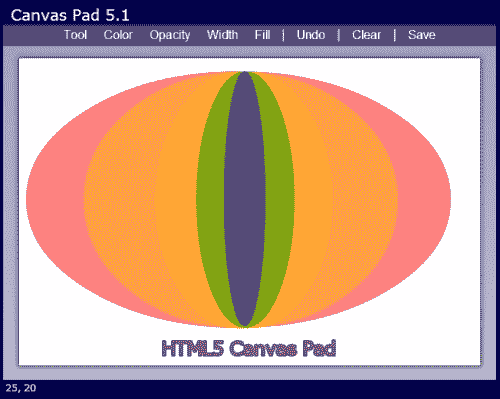
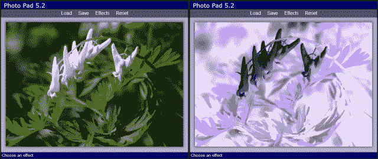
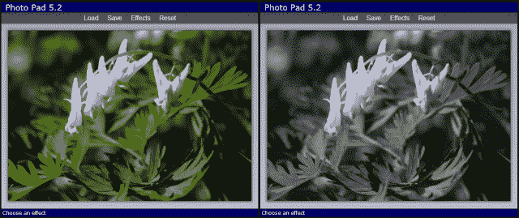
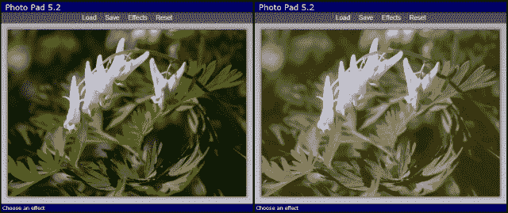
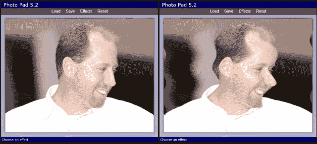

# 第五章：并不是空白画布

> 这个世界只是我们想象的画布。
> 
> - 亨利·大卫·梭罗

*在上一章中，我们学习了使用 HTML5 画布的基础知识。我们创建了一个名为 Canvas Pad 的绘图应用程序，其中包含用于以各种颜色和大小绘制线条和形状的工具。在本章中，我们将通过扩展 Canvas Pad 来添加更多工具来继续探索 Canvas API。然后，我们将创建一个名为 Photo Pad 的新应用程序，我们将学习如何使用 File API 加载图像，并通过访问和修改画布的单个像素来执行图像处理。*

在本章中我们将学习：

+   如何获取文本输入并将其绘制到画布上

+   如何使用 Canvas API 变换函数来改变在画布上绘制项目的方式

+   如何导出画布图像以保存它

+   如何使用 HTML5 文件 API 加载图像

+   如何将位图图像绘制到画布上

+   如何获取画布中每个像素的数据，操纵它，并将其放回

# 绘制文本

在画布上有两种可用的绘制文本的方法：`strokeText()`和`fillText()`。`strokeText()`使用当前的`lineWidth`和`strokeStyle`绘制轮廓文本，而`fillText()`使用当前的`fillStyle`进行绘制。两者都接受相同的参数：要绘制的文本以及 x 和 y 坐标。上下文对象有一个全局的字体属性来定义要使用的`font`。您可以像在 CSS 中定义字体时一样设置它的值。在我们在上一章中使用 Canvas Pad 应用程序结束的地方继续，我们将添加一个新的文本绘制工具。您可以在`第五章/example5.1`中找到本节的源代码。

# 行动时间-添加文本工具

让我们首先在工具下拉菜单中添加一个新项目，用于文本工具：

```html
<li data-value="text">Text</li>
```

接下来，我们将在`Canvas2D`对象中添加一个`drawText()`方法。它将接受要绘制的文本、从哪里绘制文本的点以及一个布尔值，指示是填充文本还是仅仅轮廓它。如果`fill`为`true`，它使用`fillText()`来绘制文本，否则它使用`strokeText()`：

```html
this.drawText = function(text, point, fill)
{
    if (fill)
    {
        context.fillText(text, point.x, point.y);
    }
    else
    {
        context.strokeText(text, point.x, point.y);
    }
};
```

现在我们需要一种方法，允许用户输入他/她想要绘制的文本。我们需要一个文本输入字段，我们将保持隐藏，直到用户想要添加一些文本。当用户选择文本工具并点击画布时，我们将把文本字段定位在他/她点击的位置，并等待他/她输入文本。当用户按下*Enter*键时，我们将隐藏文本字段并将文本绘制到画布上。

为了让用户看起来像是在画布上输入，我们需要在画布上下文中设置更多属性以用于字体。我们将在构造函数中设置`font`和`textBaseline`属性。基线告诉上下文在哪里相对于位置绘制文本。我们将其设置为`"top"`，这样它将在 y 位置绘制文本的顶部，这与我们的文本字段所在的位置相同。其他常见的基线值是`"bottom"`和`"middle"`：

```html
context.font = "24px Verdana, Geneva, sans-serif";
context.textBaseline = "top";
```

现在我们需要一个文本字段，让用户输入文本。让我们将它添加到我们的 HTML 文件底部，在页脚元素之后：

```html
<div id="text-input">
    <input type="text" />
</div>
```

接下来让我们进入 CSS 并定义`text-input`元素的样式。我们将`display`设置为`none`，这样它就被隐藏了，并将`position`设置为`absolute`，这样我们就可以在页面上任意位置放置它。我们还将字体大小改为 24 像素，因为这是我们在上下文中设置的字体大小：

```html
#text-input
{
    display: none;
    position: absolute;
    width: 8em; 
}
#text-input>input
{
    font-size: 24px;
}
```

现在让我们在`CanvasPadApp`的`penDown()`方法中添加一些 JavaScript 代码，以便当用户点击鼠标时显示文本输入字段：

```html
function penDown(pageX, pageY)
{
    if (curTool == "text")
 {
 // Check if it's already visible
 if ($("#text-input").is(":visible")) return;
 showTextInput(pageX, pageY);
 }
    else
    {
        drawing = true;
    }

    // code not shown...
}
```

首先检查当前的工具。如果是文本工具，它会检查文本字段是否已经可见，如果是，则无需继续。否则，它调用`showTextInput()`并传入鼠标坐标。请注意，在这种情况下，我们不会将`drawing`设置为`true`，因为我们不需要跟踪鼠标。

`showTextInput()`方法获取鼠标坐标并将`text-input`元素移动到用户在画布上单击鼠标的位置：

```html
function showTextInput(pageX, pageY)
{
    $("#text-input").css("top", pageY)
                    .css("left", pageX)
                    .fadeIn("fast");
    $("#text-input input").val("").focus();
}
```

首先我们设置`top`和`left` CSS 属性来移动元素到用户单击的位置，然后淡入。然后重置文本字段的值并将焦点设置在上面，这样用户就可以开始输入。这将使用户看起来好像在画布上输入。

当用户输入完成后，他/她可以按*Enter*键完成文本。我们需要在文本字段中添加一个`keydown`事件处理程序来检查这一点。我们将在`start()`方法中添加这个。

```html
$("#text-input input").keydown(function(e) { 
    checkTextInput(e.which);
});
```

处理程序调用`checkTextInput()`，传入按下的键的键码。键码在事件对象的`which`字段中找到：

```html
function checkTextInput(key)
{
    if (key == 13) // Enter key
    {
        curAction.text =  $("#text-input input").val();
        $("#text-input").hide();
        redraw();
    }
    else if (key == 27) // Escape
    {
        actions.pop();
        $("#text-input").hide();
    }
}
```

`checkTextInput()`方法查看键码以确定要执行什么操作。如果用户按下*Enter*键，即键码为 13，它将把文本设置到当前操作对象中，隐藏文本输入，然后调用`redraw()`。如果键码是 27，即*Escape*键，它将通过移除操作然后隐藏文本输入来取消文本。

实现的最后一部分是对`redraw()`的更改。我们需要将文本操作添加到我们的`switch`语句中。它传入文本、绘制位置以及是否填充：

```html
switch (action.tool)
{
    // code not shown...
    case "text":
 canvas2d.drawText(action.text, action.points[0],
 action.fill);
 break;
}
```

## *刚刚发生了什么？*

我们在应用程序中添加了一个文本工具，允许用户在画布上输入文本并绘制填充或轮廓。

## 试试看

尝试为用户添加一个工具栏菜单，以选择不同的字体大小。你需要在画布上下文中改变字体大小，以及文本输入字段的样式。

# 变换

Canvas API 包含四种方法来转换画布上的绘图方式。它们改变了画布的坐标系，使得当你绘制东西时，它会在一个不同的位置绘制。可以把它想象成在绘制之前移动或旋转一张纸。

+   `translate(x, y)`: 这将画布上绘制的任何东西平移指定的值。这些值可以是任何小数。负数向上和向左平移。通常你会使用`translate()`将形状平移到中心，然后对其应用其他变换。

+   `scale(x, y)`: 这将画布上绘制的任何东西按指定的值进行缩放。参数可以是任何正的小数。如果你想要一切都是一半大小，你会使用 scale(0.5, 0.5)。如果你想要加倍大小，使用 scale(2, 2)。

+   `rotate(angle)`: 这将以一个角度旋转画布。角度以弧度从 0 到 2π指定。负数将逆时针旋转。

+   `transform(a, b, c, d, e, f)`: 如果其他变换方法对你不起作用，你可以使用`transform()`来创建自己的变换。我不建议这样做，除非你知道如何使用变换矩阵。

# 行动时间-添加椭圆工具

让我们使用一些变换来在 Canvas Pad 中绘制一个椭圆。椭圆基本上是一个扁平的圆。我们可以使用`scale()`方法在绘制圆之前改变 x 或 y 轴的比例，将其压扁成椭圆。让我们在`Canvas2D`对象中添加一个`drawEllipse()`方法。它需要一个中心点、一个终点和一个布尔值来确定是否应该填充：

```html
this.drawEllipse = function(center, endPoint, fill)
{
    var rx = Math.abs(endPoint.x - center.x);
    var ry = Math.abs(endPoint.y - center.y);
    var radius = Math.max(rx, ry);
    var scaleX = rx / radius;
    var scaleY = ry / radius;

    context.save();
    context.translate(center.x, center.y);
    context.scale(scaleX, scaleY);
    context.beginPath();
    context.arc(0, 0, radius, 0, Math.PI * 2, true);
    context.closePath();
    if (fill) context.fill();
    else context.stroke();
    context.restore();

    return this;
};
```

这里有很多事情要做，所以让我们来分解一下：

1.  首先我们通过计算终点和中心点坐标之间的距离来找到水平和垂直半径(rx 和 ry)。其中较大的那个将是椭圆的半径。

1.  接下来我们通过将半径除以最大半径来找到水平和垂直比例。由于其中一个半径是最大半径，所以该比例将为 1。另一个将比 1 小。

1.  接下来我们调用`save()`来保存上下文的状态，然后开始变换它。

1.  现在我们进行变换。首先，我们将平移至椭圆的中心，这样它将围绕形状的中心进行变换。然后，我们按照之前计算的量进行缩放。

1.  然后，我们使用`beginPath()`，`arc()`和`closePath()`来绘制圆。由于画布在一个轴上被缩放，圆将被压扁成椭圆。

1.  然后，根据`fill`参数调用`fill()`或`stroke()`来将圆绘制到画布上。

1.  最后，我们调用`restore()`来恢复上下文到应用变换之前的状态，然后就完成了。

现在我们有了一个绘制椭圆的方法，我们可以在 HTML 中的工具菜单中添加一个椭圆菜单项：

```html
<li data-value="ellipse">Ellipse</li>
```

唯一剩下的事情就是在`redraw()`的`switch`语句中为椭圆工具添加一个选项，然后我们就完成了：

```html
switch (action.tool)
{
    // code not shown...
    case "ellipse":
        canvas2d.drawEllipse(action.points[0], action.points[1], 
            action.fill);
        break;
}
```

## *刚刚发生了什么？*

我们向应用程序添加了一个椭圆工具，并实现了一个使用变换在画布上绘制椭圆的方法，以便在一个轴上压扁圆。

# 行动时间-导出图像

我们可以使用 Canvas Pad 应用程序绘制图片，但如果我们不能保存它们，那有什么意义呢？由于安全风险，HTML5 无法直接将文件保存到用户的文件系统中。因此，我们在客户端的选择相当有限。我们可以将数据保存到`localStorage`中，或者我们可以在新的浏览器窗口中打开图像，用户可以使用浏览器的**保存**选项保存图像。我们将选择后者，因为它允许用户获得一个真正的图像文件。

您可以通过在画布元素本身（而不是上下文）上调用`toDataURL()`方法来将图像数据作为 URL 从画布中获取。然后，您可以使用`window.open()`在另一个窗口中打开图像 URL。让我们在工具栏中添加一个**保存**按钮，并将`data-action`属性设置为`"save"`：

```html
<button data-action="save">Save</button>
```

接下来，让我们在`toolbarButtonClicked()`方法的`switch`语句中添加对操作的检查。当单击**保存**按钮时，它将获取数据 URL，然后打开它：

```html
switch (action.tool)
{
    // code not shown...
    case "save":
        var url = $("#main>canvas")[0].toDataURL();
        window.open(url, "CanvasPadImage");
        break;
}
```

## *刚刚发生了什么？*

现在，我们可以使用上下文的`toDataUrl()`方法从画布中导出图像，并在另一个浏览器窗口中打开它们，以便用户可以保存图像。



# 处理触摸事件

HTML5 的一个伟大之处在于您可以编写一个应用程序，它将在许多不同的设备上运行。Canvas Pad 作为一个桌面应用程序非常出色，因为它支持鼠标事件。但是它在触摸屏设备上同样表现出色。因此，让我们为应用程序添加对触摸事件的支持。

触摸事件类似于鼠标事件。一个区别是用户可以用多个手指触摸屏幕，因此触摸事件可能包含多个点。因此，在处理它们时，我们必须考虑到这一点。

浏览器支持三种基本的触摸事件。

+   `touchstart`：当用户触摸屏幕时，我们会收到此事件。这相当于`mousedown`事件。

+   `touchmove`：在`touchstart`之后，当用户在屏幕上移动手指时，我们会收到这些事件。这相当于`mousemove`事件。

+   `touchend`：当用户从屏幕上抬起手指时，我们会收到此事件。这相当于`mouseup`事件。

传递给事件处理程序的触摸事件对象包含一个名为`touches`的数组。该数组包含所有被触摸的点。`touches`数组中的每个对象都有一个`pageX`和一个`pageY`字段，就像鼠标事件一样。

您可以通过检查文档元素是否具有`ontouchstart`方法来测试是否支持触摸事件。

```html
var touchSupported = "ontouchstart" in document.documentElement;
```

jQuery 不包括对触摸事件的支持，但如果我们可以使用相同的 jQuery 机制来为元素添加触摸事件处理程序，那将会很好。因此，让我们编写一个 jQuery 扩展来添加它。我们将创建一个名为`touchEvents.js`的新文件，以便将我们的扩展放入其中，以便在其他应用程序中重用它。

# 行动时间-添加触摸事件处理程序

扩展 jQuery 库实际上非常容易。首先，我们将我们的扩展包装在一个立即调用的函数表达式中，并将 jQuery 对象传递给它。这是一个最佳实践，以确保美元符号确实映射到 jQuery，而不是被其他东西使用。然后，我们通过将它们添加到 jQuery 的内部`$.fn`对象来定义我们的扩展方法：

```html
(function($)
{
    $.fn.touchstart = function(handler)
    {
        this.each(function(i, e) { 
            e.addEventListener("touchstart", handler); });
        return this;
    };
    $.fn.touchmove = function(handler)
    {
        this.each(function(i, e) { 
            e.addEventListener("touchmove", handler); });
        return this;
    };

    $.fn.touchend = function(handler)
    {
        this.each(function(i, e) { 
            e.addEventListener("touchend", handler); });
        return this;
    };

    $.isTouchSupported =
        ("ontouchstart" in document.documentElement);
})(jQuery);
```

### 注意

请注意，在扩展方法的上下文中，`this`指针指的是包装所选元素的 jQuery 对象。因此，`this.each()`会迭代选择的每个元素。

`touchstart`，`touchmove`和`touchend`方法都以相同的方式工作。它们遍历元素，并为每个元素调用`addEventListener()`。

我们还在 jQuery 对象上直接定义了一个全局的`isTouchSupported`变量。它使用之前描述的方法来检查触摸支持。我们将使用它来确定我们的应用程序是否应该使用触摸或鼠标事件。

### 注意

您可以在 jQuery 网站上了解更多关于编写 jQuery 扩展的信息（[`jquery.com`](http://jquery.com)）。

我们的扩展已经完成，所以让我们回到`CanvasPadApp`，并在我们的应用程序中添加处理触摸事件的代码。首先在`start()`方法中，我们需要检查是否支持触摸，并连接正确的事件：

```html
if ($.isTouchSupported)
{
    $("#main>canvas").touchstart(onTouchStart)
        .touchmove(onTouchMove)
        .touchend(onTouchEnd);
}
else
{
    $("#main>canvas").mousedown(onMouseDown)
        .mousemove(onMouseMove)
        .mouseup(onMouseUp)
        .mouseout(onMouseUp);
}
```

`onTouchStart()`事件处理程序方法必须在事件对象上调用`stopPropagation()`和`preventDefault()`，以防止它执行默认行为。否则它可能会尝试拖动屏幕而不是在画布上绘制：

```html
function onTouchStart(e)
{
    e.stopPropagation();
    e.preventDefault();
    penDown(e.touches[0].pageX, e.touches[0].pageY);
}
```

接下来，我们提取用户触摸的点。可能有多个点，但我们只对`touches`数组中的第一个点感兴趣。我们从中提取`pageX`和`pageY`字段，并将它们传递给`penDown()`方法。

`onTouchMove()`处理程序的工作方式相同，只是调用`penMoved()`：

```html
function onTouchMove(e)
{
    e.stopPropagation();
    e.preventDefault();
    penMoved(e.touches[0].pageX, e.touches[0].pageY);
}
```

`onTouchEnd()`处理程序简单地调用`penUp()`，与`onMouseUp()`一样。

```html
function onTouchEnd(e)
{
    penUp();
}
```

## *刚刚发生了什么？*

我们创建了一个可重用的 jQuery 扩展，以向任何元素添加触摸事件，并向我们的应用程序添加了触摸支持。我们现在有一个可以用于在桌面和移动设备上绘制的绘图应用程序。

有了这个，我们的 Canvas Pad 应用程序就完成了，但我们还没有完成学习有关画布的知识。现在我们将转向我们的下一个应用程序 Photo Pad，在那里我们将学习一些更高级的画布功能和文件 API。

# Photo Pad

我们接下来要编写的应用程序叫做 Photo Pad。它看起来很像 Canvas Pad，并且重用了工具栏和菜单的相同代码。但它不是一个绘图应用程序，而是一个照片处理应用程序。用户将能够加载图像并从几种不同的效果中选择，例如反转、黑白或棕褐色，然后应用到图像上。

# 行动时间-创建 Photo Pad

让我们像往常一样，首先复制我们在第一章中创建的应用程序模板，然后将文件重命名为`photoPad.html`，`photoPad.css`和`photoPad.js`。在 HTML 文件中，我们将添加一个带有加载、保存和效果按钮的工具栏。您可以在`第五章/example5.2`中找到此部分的代码：

```html
<body>
    <div id="app">
        <header>Photo Pad </header>
        <div id="main">
            <div id="toolbar">
                <div class="dropdown-menu">
                    <button data-action="menu">Load</button>
                    <ul id="load-menu" data-option="file-picker"
                        class="file-picker menu">
                        <li data-value="file-picker">
                            <input type="file" />
                        </li>
                    </ul>
                </div>
                <button data-action="save">Save</button>
                <div class="dropdown-menu">
                    <button data-action="menu">Effects</button>
                    <ul data-option="applyEffect" class="menu">
                        <li data-value="invert">Invert</li>
                    </ul>
                </div>
            </div>
            <canvas width="0" height="0">
                Sorry, your browser doesn't support canvas.
            </canvas>
        </div>
        <footer>Click load to choose a file</footer>
    </div>
</body>
```

加载工具栏项有一个下拉菜单，但里面没有菜单项，而是有一个文件输入控件，用户可以在其中选择要加载的文件。效果项目有一个效果的下拉菜单。目前我们只有一个，即反转，但以后我们会添加更多。

对于我们的 CSS，我们将把`canvasPad.css`中的所有内容复制到`photoPad.css`中，这样我们就可以获得工具栏和菜单的所有相同样式。我们还将在`toolbar.js`中使用`Toolbar`对象。

在我们的 JavaScript 文件中，我们将应用程序对象名称更改为`PhotoPadApp`。我们还需要在`PhotoPadApp`中定义一些变量。我们将`canvas`变量设置为`<canvas>`元素，将`context`变量设置为画布的上下文，并定义一个`$img`变量来保存我们将要显示的图像。在这里，我们使用 jQuery 将其初始化为一个新的``元素：

```html
function PhotoPadApp()
{
    var version = "5.2",
        canvas = $("#main>canvas")[0],
        context = canvas.getContext("2d"),
        $img = $("");
```

我们将要实现的第一个工具栏操作是**保存**按钮，因为我们已经从 Canvas Pad 中拥有了该代码。我们在`toolbarButtonClicked()`中检查操作是否为`"save"`，如果是，我们获取数据 URL 并在新的浏览器窗口中打开它：

```html
function toolbarButtonClicked(action)
{
    switch (action)
    {
        case "save":
            var url = canvas.toDataURL();
            window.open(url, "PhotoPadImage");
            break;
    }
}
```

## *刚刚发生了什么？*

我们使用工具栏项目为 Photo Pad 应用程序创建了脚手架，包括加载、保存和效果。我们实现了与 Canvas Pad 相同的保存功能。

接下来，我们将要实现的是加载下拉菜单，因为我们需要一个图像来操作。当单击**加载**工具栏按钮时，它将显示带有我们之前定义的文件输入控件的下拉菜单。所有这些都是免费的，因为它只是工具栏中的另一个下拉菜单。

但在此之前，我们需要了解 HTML5 文件 API。

# 文件 API

我们可能无法直接将文件保存到用户的文件系统，但我们可以使用 HTML5 的文件 API 访问文件。文件 API 允许您获取有关用户选择的文件的信息并加载文件的内容。用户可以使用类型为`file`的输入元素选择文件。加载文件的过程如下：

1.  用户使用`<input type="file">`元素选择一个或多个文件。

1.  我们从输入元素的`files`属性中获取文件列表。该列表是一个包含 File 对象的`FileList`对象。

1.  您可以枚举文件列表并像访问数组一样访问文件。

`File`对象包含三个字段。

+   `name`: 这是文件名。它不包括路径信息。

+   `size`: 这是文件的大小（以字节为单位）。

+   `type`: 这是 MIME 类型，如果可以确定的话。

1.  使用`FileReader`对象读取文件的数据。文件是异步加载的。文件读取后，它将调用`onload`事件处理程序。`FileReader`有许多用于读取文件的方法，这些方法接受一个`File`对象并返回文件内容。

+   `readAsArrayBuffer()`: 此方法将文件内容读入`ArrayBuffer`对象中。

+   `readAsBinaryString()`: 此方法将文件内容作为二进制数据读入字符串中。

+   `readAsText()`: 此方法将文件内容作为文本读入字符串中。

+   `readAsDataURL()`: 此方法将文件内容读入数据 URL 字符串。您可以将其用作加载图像的 URL。

# 行动时间-加载图像文件

让我们在应用程序的`start()`方法中添加一些代码来检查文件 API 是否可用。您可以通过检查`File`和`FileReader`对象是否存在来确定浏览器是否支持文件 API：

```html
this.start = function()
{
    // code not shown...
    if (window.File && window.FileReader)
    {
        $("#load-menu input[type=file]").change(function(e) {
            onLoadFile($(this));
        });
    }
    else
    {
        loadImage("images/default.jpg");
    }
}
```

首先，我们检查`window`对象中是否有`File`和`FileReader`对象。如果有，我们将为文件输入控件连接一个 change 事件处理程序，以调用`onLoadFile()`方法并传入用 jQuery 对象包装的`<input>`元素。如果文件 API 不可用，我们将通过调用`loadImage()`来加载默认图像，稍后我们将编写该方法。

让我们实现`onLoadFile()`事件处理程序方法：

```html
function onLoadFile($input)
{
    var file = $input[0].files[0];
    if (file.type.match("image.*"))
    {
        var reader = new FileReader();
        reader.onload = function() { loadImage(reader.result); };
        reader.readAsDataURL(file);        
    }
    else
    {
        alert("Not a valid image type: " + file.type);
        setStatus("Error loading image!");
    }
}
```

在这里，我们通过查看文件输入的`files`数组并取第一个来获取所选的文件。接下来，我们检查文件类型，即 MIME 类型，以确保它是图像。我们使用`String`对象的正则表达式`match()`方法来检查它是否以`"image"`开头。

如果是图像，我们将创建`FileReader`对象的一个新实例。然后，我们将设置`onload`事件处理程序以调用`loadImage()`方法，并传入`FileReader`对象的`result`字段，其中包含文件的内容。最后，我们调用`FileReader`对象的`readAsDataURL()`方法，传入`File`对象以异步开始加载文件。

如果不是图像文件，我们将显示一个带有错误消息的警报对话框，并通过调用`setStatus()`在页脚显示错误消息。

文件读取完成后，将调用`loadImage()`方法。在这里，我们将使用从`FileReader`对象的`result`字段获得的数据 URL 将图像绘制到画布中：

```html
function loadImage(url)
{
    setStatus("Loading image");
    $img.attr("src", url);
    $img[0].onload = function()
    {
        // Here "this" is the image
        canvas.width = this.width;
        canvas.height = this.height;
        context.drawImage(this, 0, 0);
        setStatus("Choose an effect");
    }
    $img[0].onerror = function()
    {
        setStatus("Error loading image!");
    }
}
```

首先，我们将图像元素的`src`属性设置为文件加载后获得的数据 URL。这将导致图像元素加载新图像。

接下来，我们为图像定义了`onload`事件处理程序，以便在图像加载时收到通知。请注意，当我们在`onload`事件处理程序内部时，`this`指向`<image>`元素。首先，我们将画布的宽度和高度更改为图像的宽度和高度。然后，我们使用上下文的`drawImage()`方法在画布上绘制图像。它接受要绘制的图像以及要绘制的 x 和 y 坐标。在这种情况下，我们在画布的左上角（0,0）绘制它。

最后，我们为图像设置了一个`onerror`事件处理程序。如果加载图像时发生错误，我们将在页脚显示错误消息。

## *刚刚发生了什么？*

我们学习了如何使用文件 API 从用户的文件系统加载图像文件。在加载图像后，我们调整了画布的大小以适应图像的大小，并将图像绘制到画布上。

# 添加效果

现在让我们向效果菜单添加一些效果。我们将首先实现的是颜色反转。它将获取画布中的图像并反转颜色，使图像看起来像旧的底片（还记得那些吗？）。我们可以通过迭代图像中的每个像素并反转它们的颜色来实现这一点。

您可以使用上下文的`getImageData()`方法从画布中获取像素。它获取画布的矩形区域的像素。您传递它区域的位置和大小：

```html
var data = context.getImageData(0, 0, width, height);
```

`getImageData()`方法返回一个字节数组，每个像素有四个字节，代表每个像素的颜色。第一个字节是红色量，第二个是绿色量，第三个是蓝色量，第四个是 alpha 量。所有值都在 0 到 255 之间。数组中的字节总数为*4 *宽度*高度*。

在获取图像数据之后，您可以访问和更改数组中的任何值。请注意，这只会更改内存中的图像。更改图像数据后，您可以使用`putImageData()`方法将其写回到画布。此方法接受要绘制的图像数据和要绘制的位置的参数。

```html
context.putImageData(data, 0, 0);
```

# 行动时间-图像效果对象

现在，我们将创建一个名为`imageEffects`的新对象，将所有图像效果的代码封装在一个新文件`imageEffects.js`中。`imageEffects`对象将是使用揭示模块模式定义的全局静态对象。

### 注意

使用揭示模块模式，您在私有范围内定义一组函数，然后返回一个匿名对象，该对象公开了您想要公开的这些方法。这对于定义静态对象很有效。

让我们首先定义`imageEffects`对象，并添加两个保持私有的辅助函数。它们用于获取和设置整个画布的图像数据：

```html
var imageEffects = function()
{
    function getImageData(canvas)
    {
        return canvas.getContext("2d").getImageData(0, 0,
            canvas.width, canvas.height)
    }

    function putImageData(canvas, imageData)
    {
        canvas.getContext("2d").putImageData(imageData, 0, 0);
    }
```

`getImageData()`方法获取画布并返回整个画布的图像数据。`putImageData()`方法接受画布和图像数据作为参数，并将图像数据放回画布。

让我们实现我们的第一个效果；反转图像的颜色。`invert()`方法以画布作为参数。反转颜色非常简单。我们只需取每个像素的每个颜色通道并从 255 的最大颜色值中减去它的值：

```html
    function invert(canvas)
    {
        var imageData = getImageData(canvas);
        var data = imageData.data;
        for (var i = 0; i < data.length; i += 4)
        {
            data[i]   = 255 - data[i];   //red
            data[i+1] = 255 - data[i+1]; //green
            data[i+2] = 255 - data[i+2]; //blue
            //data[i+3] is alpha
        }

        putImageData(canvas, imageData);
    }
```

首先，我们获取画布的图像数据，然后循环遍历字节，每次递增四个，因为每个像素有四个字节。每个颜色通道值都被反转并设置回字节中。Alpha 值保持不变。然后我们将图像数据放回画布。

现在让我们完成`imageEffects`对象。我们需要返回一个匿名对象，定义我们想要公开的所有方法。到目前为止，我们只有`invert()`方法：

```html
    return {
        invert: invert
    };
}();
```

请注意，我们在函数声明的末尾有开括号和闭括号。这立即执行函数，并将返回的匿名对象分配给`imageEffects`变量。所以现在我们有一个`imageEffects`对象，其中有一个`invert()`公共方法。

现在我们需要将 Effects 菜单项与`imageEffects`对象连接起来。我们可以在`PhotoPadApp`的`menuItemClicked()`方法中进行这样的操作。之前，我们给菜单元素设置了一个`data-option`自定义属性，值为`"applyEffect"`。所以我们将检查这个属性：

```html
function menuItemClicked(option, value)
{
    if (option == "applyEffect")
    {
        imageEffectsvalue;
    }
}
```

我们给 Invert 菜单项元素设置了一个`data-value`自定义属性，值为`"invert"`。我们将使用这个值来动态访问`imageEffects`对象中的`invert()`方法，就像我们在第三章中进行数据绑定一样。我们将`canvas`对象作为参数传递。对于`"invert"`，这相当于调用`imageEffects.invert(canvas)`。我们将以这种方式实现所有菜单项，以便它们自动绑定到`imageEffects`对象中的方法。

## *刚刚发生了什么？*

我们创建了一个`imageEffects`对象来保存所有的图像效果算法。我们实现了一个反转图像颜色的效果。我们使用自定义数据属性将 Effects 菜单与`imageEffects`对象中的方法绑定起来。

现在让我们在浏览器中打开我们的应用程序并尝试一下。加载图像后，从 Effects 菜单中选择**Invert**，您应该看到反转后的图像：



# 黑白时间行动

好的，`invert()`方法非常简单。让我们尝试一些更具挑战性的东西，但不是太多。我们将实现一个将彩色图像转换为黑白的效果。让我们在`imageEffects`对象中实现一个`toBlackAnWhite()`方法：

```html
function toBlackAndWhite(canvas)
{
    var imageData = getImageData(canvas);
    var data = imageData.data;
    for (var i = 0; i < data.length; i += 4)
    {
        var grayscale = (data[i] * 0.3) +
            (data[i + 1] * .59) +
            (data[i + 2] * .11);
        data[i]   = grayscale;
        data[i+1] = grayscale;
        data[i+2] = grayscale;
    }

    putImageData(canvas, imageData);
}
```

对于每个像素，我们通过取每个颜色通道的百分比并将它们相加来计算灰度值；30%红色，59%绿色和 11%蓝色。然后我们将每个颜色通道设置为该灰度值。

现在让我们在 Effects 菜单中添加一个黑白菜单项。`data-value`属性设置为我们之前创建的方法`toBlackAndWhite`：

```html
<li data-value="toBlackAndWhite">B&amp;W</li>
```

## *刚刚发生了什么？*

我们创建了一个过滤器，将每个像素更改为其灰度值，并将其设置回图像数据中。现在我们可以将彩色图像转换为黑白：



# 古铜时间行动

让我们实现另一个简单的效果。这次我们将图像转换为古铜色，给它一种老式照片的外观。古铜色与黑白色非常相似，只是略微温暖。首先让我们为它添加菜单项，并将`data-value`属性设置为`toSepia`：

```html
<li data-value="toSpeia">Sepia</li>
```

现在让我们在`imageEffects`对象中添加一个`toSepia()`方法。

```html
function toSepia(canvas, depth, intensity)
{
    depth = depth || 20;
    intensity = intensity || 10;

    var imageData = getImageData(canvas);
    var data = imageData.data;
    for (var i = 0; i < data.length; i += 4)
    {
        var grayscale = (data[i] * 0.3) +
            (data[i + 1] * .59) +
            (data[i + 2] * .11);
        data[i]   = Math.min(255, grayscale + (depth * 2));
        data[i+1] = Math.min(255, grayscale + depth);
        data[i+2] = Math.max(0, grayscale - intensity);
    }

    putImageData(canvas, imageData);
}
```

尽管`toSepia()`有三个参数，但我们只会传入一个参数，即画布，这样我们就可以使用我们的默认 Effects 菜单处理代码，并将其余设置为默认值。该方法的前两行设置了`depth`和`intensity`参数的默认值。`depth`用于调整红色和绿色通道，`intensity`用于调整蓝色通道，以便更精细调整最终结果。

要将像素转换为它的棕褐色调，我们首先以与黑白相同的方式获取灰度值。然后，我们根据通道调整这些值，而不仅仅是为所有颜色通道设置灰度。红色增强最多，这解释了棕褐色的红色调。绿色也增强，增强的程度是红色的一半。蓝色按强度值减少。我们使用`Math.max()`和`min()`函数来确保我们不会设置超出范围的值。

## *刚刚发生了什么？*

我们创建了一个滤镜，通过找到灰度并独立调整颜色通道的固定数量来将彩色图像转换为棕褐色，这个数量可以作为参数传入或默认值：



## 试试看

尝试在计算灰度值时使用不同百分比的红色、绿色和蓝色，看看它对图像有什么影响。尝试传入不同的深度和强度值，看看它对棕褐色调有什么影响。

# 图像失真

接下来，我们将添加一个更高级的效果。我们将采用图像并使用波浪进行扭曲，使其看起来像是水中的倒影。我们可以使用`Math.sin()`方法来偏移像素位置，使其呈波浪状。因此，这一次我们不是改变颜色通道，而是移动像素。

# 行动时间-制造波浪

让我们为我们的波浪效果添加菜单项。我们给它一个`data-value`自定义属性，设置为`makeWaves`：

```html
<li data-value="makeWaves">Waves</li>
```

现在我们将编写`makeWaves()`方法。它将有四个参数；`canvas`、`amplitude`、`frequency`和`phase`。`amplitude`确定波浪的大小，`frequency`确定有多少波浪，`phase`确定波浪从哪里开始。与`toSepia()`方法一样，我们只会传入`canvas`参数，但您可以尝试不同的参数，看看它们有什么影响：

```html
function makeWaves(canvas, amplitude, frequency, phase)
{
    amplitude = amplitude || 10;
    frequency = frequency || 4;
    phase = phase || 0;

    var data = getImageData(canvas).data;
    var newImageData = getImageData(canvas);
    var newData = newImageData.data;
    var width = newImageData.width;
    var height = newImageData.height;

    // Adjust frequency to height of image
    frequency = frequency * 2 * Math.PI / height;

    for (var y = 0; y < height; y++)
    {
        var xoff = 4 * Math.floor(amplitude *
            Math.sin(y * frequency + phase));
        var yoff = y * 4 * width;

        for (var x = 0; x < width; x++)
        {
            var pos = yoff + x * 4;
            newData[pos + xoff]     = data[pos];
            newData[pos + xoff + 1] = data[pos+1];
            newData[pos + xoff + 2] = data[pos+2];
            newData[pos + xoff + 3] = data[pos+3];
        }
    }

    putImageData(canvas, newImageData);
}
```

我们要做的第一件事是设置参数的默认值。然后设置一些变量。这一次我们将需要两组图像数据。一个是我们的原始图像，另一个`newImageData`是我们将要更改并最终写回画布的工作集。

接下来，我们调整频率值，使其相对于图像的高度。这样，如果我们想要频率为四，图像从顶部到底部将有四个波浪。

现在是时候迭代像素了。在外部循环中，我们迭代图像的行。对于每一行，我们通过计算该行的正弦值并将其乘以 4（每个像素的颜色通道数）来计算 x 偏移量。这给我们提供了偏移量，以字节为单位，进入图像数据数组。我们还计算 y 偏移量，这是当前行数组的字节偏移量。

接下来，我们迭代每一行中的每个像素。在这个循环内，我们将像素数据从原始图像数据复制到工作图像数据数组中，偏移位置。应用正弦波以获取像素偏移量会给我们一个波浪般的图案：



## *刚刚发生了什么？*

我们创建了一个失真效果，使用正弦波使图像看起来波浪起伏。它通过计算从原始图像的偏移量并将像素复制到新图像中来实现这一点。

## 试试看

尝试想出自己的效果并将其添加到 Photo Pad 应用程序中。例如，您可以使图像变暗或变亮。对于更高级的效果，请尝试通过计算像素及其相邻像素的平均颜色来模糊图像（如果您想看看如何实现，我已经在本节的示例代码中实现了它）。

## 小测验

Q1\. 触摸事件与鼠标事件有何不同？

1.  触摸事件可以有任意数量的点

1.  触摸事件没有任何点

1.  触摸事件没有`preventDefault()`方法

1.  没有区别

Q2\. 画布图像数据中每个像素有多少字节？

1.  一

1.  三

1.  四

1.  八

# 总结

在本章中，我们继续使用 Canvas Pad 应用程序。我们学习了在画布上绘制文本和通过绘制椭圆来进行变换。我们通过添加对触摸事件的支持使 Canvas Pad 具备了触摸功能。然后我们创建了一个名为 Photo Pad 的新应用程序，在那里我们学习了如何使用 HTML5 文件 API 从用户文件系统加载文件。我们进行了一些图像处理，以学习如何直接访问和操纵画布上的像素。

在本章中，我们涵盖了以下概念：

+   如何在画布上绘制文本

+   如何使用 Canvas API 的变换来进行平移、旋转、缩放等操作，以改变画布上的绘制方式

+   如何创建一个 jQuery 插件来检查触摸设备并为元素添加触摸事件

+   如何使用文件 API 访问用户文件系统中的文件，并使用`FileReader`对象将它们读入内存

+   如何加载图像文件并将其绘制到画布上

+   如何访问画布的像素并操纵它们的颜色以实现一些图像处理滤镜

在下一章中，我们将再次开启全新的方向。我们将通过构建一个虚拟钢琴来学习 HTML5 `<audio>`元素和音频 API。
