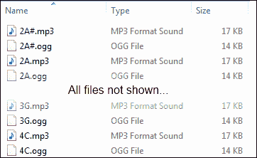
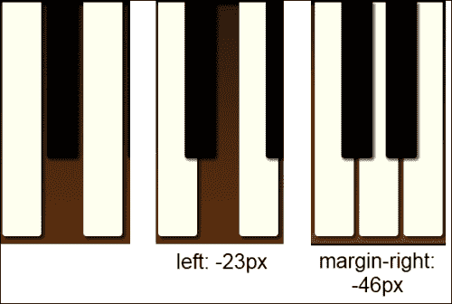
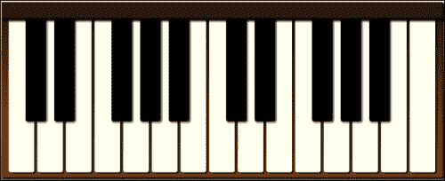
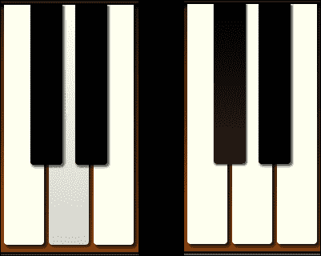
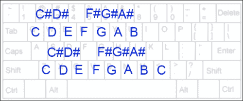
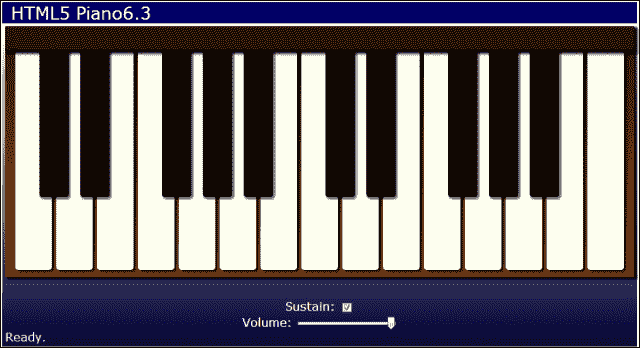

# 第六章：钢琴人

> “音乐不仅是艺术，不仅是文学，它是普遍可及的。” – 比利·乔尔

*在本章中，我们将通过创建一个虚拟钢琴应用程序来学习如何使用音频。首先，我们将学习 HTML5 音频元素和 API。然后，我们将创建一个音频管理器，以异步加载音频文件并缓存它们以供以后播放。我们将使用 HTML 元素创建一个键盘，并使用 CSS 进行样式设置。*

在本章中，我们将学习以下内容：

+   HTML5 `<audio>` 元素及其属性

+   如何使用音频 API 来控制应用程序中的音频

+   如何动态加载音频文件

+   如何处理键盘事件，将计算机键盘转换为钢琴键盘

+   如何使用范围输入来控制音频元素的音量

+   如何检查您的浏览器是否支持范围输入类型

# HTML5 音频概述

在我们开始编写钢琴应用程序之前，我们需要学习如何使用 HTML5 音频的基础知识。因此，让我们从 `<audio>` 元素及其 API 的概述开始。

## HTML5 <audio> 元素

HTML5 `<audio>` 元素用于定义在网页或应用程序中播放的音频文件。`audio` 元素可以在页面上具有可见控件，也可以保持隐藏并且可以通过 JavaScript 进行控制。以下是它支持的一些最有用的属性：

+   `src`: 要加载的音频文件的 URL。

+   `autoplay`: 用于指定文件在加载后立即开始播放。

+   `controls`: 告诉浏览器在页面上显示音频控件。否则，元素不会显示任何内容。

+   `loop`: 指定音频将循环播放。

+   `muted`: 指定音频将被静音。

+   `preload`: 定义音频文件的加载方式。

+   `auto`: 页面加载时加载音频文件。这是默认设置。

+   `none`: 不预加载文件，等待播放。

+   `metadata`: 页面加载时仅加载有关文件的元数据。

以下在页面加载后自动播放 `audioFile.mp3` 并在页面上显示音频控件：

```html
<audio src="img/audioFile.mp3" autoplay controls>
    Your browser doesn't support audio.
</audio>
```

在 Chrome 上显示在页面上时的样子如下：


如果浏览器不支持 `<audio>` 元素，它将显示元素内的任何内容。

虽然您可以使用 `src` 属性指定要加载的文件，但不建议这样做。不同的浏览器支持不同的文件类型，因此如果您只指定一个文件，它可能在所有浏览器上都无法工作。相反，您应该在 `<audio>` 元素内指定 `<source>` 子元素，以定义要使用的不同音频文件的列表。浏览器将使用它支持的第一个文件：

```html
<audio controls>
    <source src="img/audioFile.mp3">
    <source src="img/audioFile.ogg">
    <source src="img/audioFile.wav">
</audio>
```

支持的三种主要音频类型是 MP3、Ogg 和 WAV。您至少应提供 MP3 和 Ogg 文件，因为所有主要浏览器都支持其中一种。如果您还想包括 WAV 文件，请将其放在列表的最后，因为 WAV 文件未经压缩，因此需要大量带宽来下载。

## HTML5 音频 API

如果您只能使用 HTML5 音频在网页上放置一个元素让用户听音乐，那将会很无聊，这一章将结束。但是像 `<canvas>` 元素一样，`<audio>` 元素有一个完整的 API 支持它。我们可以使用音频 API 来控制何时以及如何从 JavaScript 播放音频剪辑。

音频 API 包含大量的方法和属性。以下是其中一些最有用的方法：

+   `play()`: 开始播放音频剪辑。

+   `pause()`: 暂停音频剪辑的播放。

+   `canPlayType(type)`: 用于确定浏览器是否支持某种音频类型。传入音频 MIME 类型，如 `"audio/ogg"` 或 `"audio/mpeg"`。它返回以下值之一：

+   `"probably"`: 很可能支持

+   `"maybe"`: 浏览器可能能够播放它

+   `""`（空字符串）：不支持

+   `currentTime`：用于获取或设置当前播放时间（以秒为单位）。这使我们能够在播放之前将声音定位到某个特定点。通常我们会将其设置为`0`以重新开始播放声音。

+   `volume`：用于获取或设置音量。可以是`0`到`1`之间的任何值。

+   `ended`：用于确定声音是否已完全播放。

### 注意

请注意，`<audio>`和`<video>`元素都共享相同的 API。因此，如果你知道如何使用 HTML 音频，你也知道如何使用视频。

我们可以使用音频 API 来做一些有趣的事情。在本章中，我们将创建一个虚拟钢琴，用户可以通过在屏幕上点击钢琴键来在网页上演奏。

# 加载音频文件

你可以通过在 HTML 文件中为每个音频文件添加`<audio>`元素来定义应用程序的所有音频文件。但是，我们也可以从 JavaScript 动态加载音频文件，以控制它们的加载方式和时间。我们可以像在上一章中动态加载图像文件一样加载它们。首先，我们创建一个新的`<audio>`元素，并将`src`属性设置为音频文件的名称：

```html
var audio = $("<audio>")[0];
audio.src = "2C.mp3";
```

接下来，我们添加一个事件处理程序，以便在音频文件加载完成时收到通知。我们可以使用两个事件。`canplay`事件在浏览器有足够的数据开始播放音频时触发。`canplaythrough`事件在文件完全加载后触发：

```html
audio.addEventListener("canplaythrough", function()
{
    audio.play();
});
```

# 行动时间 - 创建 AudioManager 对象

让我们将加载音频文件封装到一个可重用的对象中。我们将创建一个名为`AudioManager`的新对象，并将其放在名为`audioManager.js`的文件中。该对象将抽象出加载、缓存和访问音频文件所需的所有代码。

我们对象的构造函数接受一个名为`audioPath`的参数，这是存储音频文件的路径：

```html
function AudioManager(audioPath)
{
    audioPath = audioPath || "";
    var audios = {},
        audioExt = getSupportedFileTypeExt();
```

如果未定义`audioPath`，我们将其默认为一个空字符串。然后我们添加一个名为`audios`的变量，它是一个对象，将用于缓存所有已加载的`<audio>`元素。最后，我们定义一个变量来保存浏览器支持的音频文件扩展名，我们将通过调用`getSupportedFileTypeExt()`方法来确定：

```html
    function getSupportedFileTypeExt()
    {
        var audio = $("<audio>")[0];
        if (audio.canPlayType("audio/ogg")) return ".ogg";
        if (audio.canPlayType("audio/mpeg")) return ".mp3";
        if (audio.canPlayType("audio/wav")) return ".wav";
        return "";
    };
```

首先，我们在内存中创建一个新的`<audio>`元素，并使用它调用`canPlayType()`方法来确定浏览器支持的文件类型。然后我们返回该类型的文件扩展名。

接下来，我们需要一种从`AudioManager`对象获取音频文件的方法。让我们添加一个公共的`getAudio()`方法：

```html
    this.getAudio = function(name, onLoaded, onError)
    {
        var audio = audios[name];
        if (!audio)
        {
            audio = createAudio(name, onLoaded, onError);
            // Add to cache
            audios[name] = audio;
        }
        else if (onLoaded)
        {
            onLoaded(audio);
        }
        return audio;
    };
```

`getAudio()`方法接受三个参数。第一个是没有扩展名的音频文件的名称。在加载文件时，我们稍后将为其添加音频路径和默认扩展名。接下来的两个参数是可选的。第二个参数是在文件加载完成时将被调用的函数。第三个是在加载文件时将被调用的函数。

`getAudio()`的第一件事是检查`audios`对象，看看我们是否已经加载并缓存了该文件。在这种情况下，`audios`对象被用作关联数组，其中键是文件名，值是音频元素。这样可以很容易地通过名称查找`<audio>`元素。

如果文件尚未添加到缓存中，那么我们将创建一个新的`audio`元素，并通过调用`createAudio()`方法来加载它，接下来我们将实现。然后将新元素添加到`audios`对象中以进行缓存。

如果文件名已经在缓存中，那么我们立即调用传递的`onLoaded()`处理程序函数，因为文件已加载。

现在让我们编写私有的`createAudio()`方法。它接受与上一个方法相同的参数：

```html
    function createAudio(name, onLoaded, onError)
    {
        var audio = $("<audio>")[0];
        audio.addEventListener("canplaythrough", function()
        {
            if (onLoaded) onLoaded(audio);
            audio.removeEventListener("canplaythrough",
                arguments.callee);
        });
        audio.onerror = function()
        {
            if (onError) onError(audio);
        };
        audio.src = audioPath + "/" + name + audioExt;
        return audio;
    }
}
```

首先，我们使用 jQuery 创建一个新的`<audio>`元素。然后我们为`canplaythrough`添加一个事件监听器。当事件触发时，我们检查方法中是否传入了`onLoaded`函数。如果是，我们调用它并传递新的`<audio>`元素。我们还需要删除事件监听器，因为有些浏览器会在每次播放音频时调用它。

我们还为`<audio>`元素添加了一个`onerror`处理程序，以检查加载文件时是否出现错误。如果出现错误，它将调用`onError`函数（如果已定义）。

接下来，我们将`<audio>`元素的`src`属性设置为音频文件的 URL。我们通过组合`audioPath`、名称参数和`audioExt`来构建 URL。这将导致音频文件开始加载。最后，我们返回新的`<audio>`元素。

## *刚刚发生了什么？*

我们创建了一个名为`AudioManager`的对象来加载和缓存音频文件。当我们第一次请求音频文件时，它会被加载和缓存。下一次它将使用缓存的音频。例如，如果我们的浏览器支持 Ogg 文件，以下代码将加载`audio/2C.ogg`音频文件：

```html
var audioManager = new AudioManager("audio");
var audio = audioManager.getAudio("2C");
```

# HTML5 钢琴应用程序

现在让我们创建我们的 HTML5 钢琴应用程序。我们将拥有两个八度的钢琴键，包括黑色和白色，并且我们将使用一些样式使其看起来像一个真正的键盘。当用户用鼠标点击键时，它将播放相应的音符，该音符在音频文件中定义。

您可以在`chapter6/example6.1`中找到此部分的代码。

# 行动时间-创建虚拟钢琴

我们将像往常一样，复制我们在第一章中创建的应用程序模板，*手头的任务*，并将文件重命名为`piano.html`、`piano.css`和`piano.js`。我们还需要`touchEvents.js`，这是我们在上一章中创建的。

在`piano.js`中，我们将应用程序对象更改为`PianoApp`：

```html
function PianoApp()
{
    var version = "6.1",
        audioManager = new AudioManager("audio");
```

我们创建了一个`AudioManager`的实例，并传入了我们音频文件的路径，这将是`audio`文件夹。现在让我们打开我们的 HTML 文件并添加所有的钢琴键：

```html
<div id="keyboard">
    <div id="backboard"></div>
    <div class="keys">
        <div data-note="2C" class="piano-key white"></div>
        <div data-note="2C#" class="piano-key black"></div>
        <div data-note="2D" class="piano-key white"></div>
        <div data-note="2D#" class="piano-key black"></div>
        <div data-note="2E" class="piano-key white"></div>
        <div data-note="2F" class="piano-key white"></div>
        <div data-note="2F#" class="piano-key black"></div>
        <div data-note="2G" class="piano-key white"></div>
        <div data-note="2G#" class="piano-key black"></div>
        <div data-note="2A" class="piano-key white"></div>
        <div data-note="2A#" class="piano-key black"></div>
        <div data-note="2B" class="piano-key white"></div>
        <!-- third octave not shown -->
        <div data-note="4C" class="piano-key white"></div>
    </div>
</div>
```

在“main”元素内，我们添加一个`<div>`标签，`id`设置为`keyboard`。在里面，我们有一个`<div>`标签，它将成为背板，以及一个包含所有键的`<div>`标签。每个键由一个包含`piano-key`类和`white`或`black`类的元素定义，具体取决于键的颜色。每个键元素还有一个`data-note`自定义数据属性。这将设置为钢琴键音符的名称，也将是匹配音频文件的名称。

我们的钢琴有两个完整的八度钢琴键。每个键都有自己的音频文件。由于每个八度有 12 个音符，并且我们在键盘末尾有一个额外的 C 音符，我们将有 25 个音频文件，命名为`2C`到`4C`。我们希望提供 Ogg 和 MP3 格式的音频文件以支持所有浏览器，因此总共有 50 个音频文件：



让我们打开`piano.css`并为应用程序设置样式。首先，我们将通过将`position`设置为`absolute`并将所有`position`值设置为`0`来使应用程序占据整个浏览器窗口。我们将给它一个从白色到蓝色的线性渐变：

```html
#app
{
    position: absolute;
    top: 0;
    bottom: 0;
    left: 0;
    right: 0;
    margin: 4px;
    background-color: #999;
    /* browser specific gradients not shown */
    background: linear-gradient(top, white, #003);
}
```

我们还将`footer`选择器的`position`属性设置为`absolute`，`bottom`设置为`0`，这样它就贴在窗口底部了：

```html
#app>footer
{
    position: absolute;
    bottom: 0;
    padding: 0.25em;
    color: WhiteSmoke;
}
```

在主要部分，我们将`text-align`设置为`center`，这样键盘就居中在页面上了：

```html
#main
{
    padding: 4px;
    text-align: center;
}
```

现在让我们为键盘设置样式，使其看起来像一个真正的钢琴键盘。首先，我们给整个键盘一个从深棕色到浅棕色的渐变和一个阴影，使其具有一定的深度：

```html
#keyboard
{
    padding-bottom: 6px;
    background-color: saddlebrown;
    /* browser specific gradients not shown */
    background: linear-gradient(top, #2A1506, saddlebrown);
    box-shadow: 3px 3px 4px 1px rgba(0, 0, 0, 0.9);
}
```

接下来，我们样式化背板，隐藏键的顶部。我们给它一个深棕色，使其高度为`32`像素，并给它一个阴影以增加深度。为了使阴影绘制在钢琴键上方，我们需要将`position`设置为`relative`：

```html
#backboard
{
    position: relative;
    height: 32px;
    background-color: #2A1506;
    border-bottom: 2px solid black;
    box-shadow: 3px 3px 4px 1px rgba(0, 0, 0, 0.9);
}
```

所有钢琴键共享一些基本样式，这些样式是使用`piano-key`类定义的。首先，我们将`display`设置为`inline-block`，这样它们就可以保持在同一行，并且具有宽度和高度。然后我们给底部设置了边框半径，使它们看起来圆润。我们还将`cursor`属性设置为`pointer`，这样用户就可以知道它们可以被点击：

```html
#keyboard .piano-key
{
    display: inline-block;
    border-bottom-right-radius: 4px;
    border-bottom-left-radius: 4px;
    cursor: pointer;
}
```

最后，我们来到黑白键的样式。白键比黑键稍微宽一些，高一些。我们还给它们一个象牙色和阴影。最后，我们需要将`z-index`设置为`1`，因为它们需要显示在黑键的后面：

```html
#keyboard .piano-key.white
{
    width: 50px;
    height: 300px;
    background-color: Ivory;
    box-shadow: 3px 3px 4px 1px rgba(0, 0, 0, 0.7);
    z-index: 1;
}
```

黑键比白键小一点。为了使黑键显示在白键的上方，我们将`z-index`设置为`2`。为了使它们看起来在白键之间，我们将它们的`position`属性设置为`relative`，并使用负`left`偏移将它们移动到白键的上方。我们还需要一个负的`right-margin`值，这样下一个白键就会被拉到它的上方和下方：

```html
#keyboard .piano-key.black
{
    position: relative;
    width: 40px;
    height: 200px;
    left: -23px;
    margin-right: -46px;
    vertical-align: top;
    background-color: black;
    box-shadow: 2px 2px 3px 1px rgba(0, 0, 0, 0.6);
    z-index: 2;
}
```

这就是我们的钢琴会是什么样子的：



第一张图片显示了没有设置边距的键。看起来不太像一个真正的键盘，是吧？下一张图片显示了设置了`left`边距的样子。它变得更好了，但是白键还没有移动过来。设置右边距就解决了这个问题。

## *刚刚发生了什么？*

我们从我们的应用程序模板开始创建了一个新的 HTML5 钢琴应用程序。我们在 HTML 中定义了所有的键，然后使用负偏移和边距对它们进行了样式化，使键能够像真正的键盘一样排列。

就是这样！我们现在有一个看起来非常逼真的两个八度键盘：



# 行动时间-加载音符

我们有一个键盘，但还没有声音。让我们回到 JavaScript，加载所有的音频文件。我们将创建一个名为`loadAudio()`的新方法，并从应用程序的`start()`方法中调用它。

我们可以通过两种方式加载所有文件。我们可以通过为每个文件调用`audioManager.getAudio()`来一次加载它们，这将非常冗长并且需要大量输入。或者我们可以迭代所有的`piano-key`元素，并从它们的`data-note`属性中获取文件名。通过使用这种方法，我们可以在 HTML 中添加更多的钢琴键，甚至不需要触及 JavaScript：

```html
function loadAudio()
{
    var count = 0,
        loaded = 0,
        error = false;

    $(".keyboard .piano-key").each(function()
    {
        count++;
        var noteName = escape($(this).data("note"));
        audioManager.getAudio(noteName,
            function()
            {
                if (error) return;
                if (++loaded == count) setStatus("Ready.");
                else setStatus("Loading " +
                        Math.floor(100 * loaded / count) + "%");
            },
            function(audio)
            {
                error = true;
                setStatus("Error loading: " + audio.src);
            }
        );
    });
}
```

我们要做的第一件事是定义一些变量来跟踪正在加载的音频文件的数量和已加载的数量。我们将使用它们来计算完成百分比。我们还需要一个变量来设置如果加载文件时出现错误。

接下来，我们要使用 jQuery 选择所有的`piano-key`元素，并调用`each()`来对它们进行迭代。对于每一个，我们要做以下事情：

1.  将`count`变量加 1，以跟踪文件的总数。

1.  从`data-note`属性中获取音符名称，这也是文件名。请注意，我们必须使用`escape()`函数，因为一些音符包含 sharp 符号`#`，这在 URL 中是非法的。

1.  调用`audioManager.getAudio()`，传入音符名称。这将导致音频文件被加载和缓存。下次我们为这个音符调用`getAudio()`时，它将被加载并准备好播放。

1.  `getAudio()`的第二个参数是一个在每个文件成功加载完成时调用的函数。在这个函数中，我们增加了加载变量。然后我们检查是否所有文件都已加载，如果是，则显示准备好的消息。否则，我们通过调用`setStatus()`计算加载文件的完成百分比并显示在页脚中。

1.  `getAudio()`的最后一个参数是一个在加载文件时出错时调用的函数。当发生这种情况时，我们将`error`变量设置为`true`，并显示一个显示无法加载的文件的消息。

### 注意

请注意，如果您通过 IIS 等 Web 服务器运行此应用程序，您可能需要将`.ogg`文件类型添加到站点的 MIME 类型列表中（`.ogg`，`audio/ogg`）。否则，您将收到文件未找到的错误。

## *刚刚发生了什么？*

我们使用`AudioManager`对象动态加载每个键盘键的所有声音，使用它们的`data-note`属性作为文件名。现在我们已经加载、缓存并准备好播放所有的音频文件。

# 行动时间-播放音符

接下来我们需要做的是为钢琴键添加事件处理程序，当点击或触摸钢琴键时播放`<audio>`元素。我们将为所有的钢琴键连接事件处理程序，并在它们被触发时播放相关的音符。

### 注意

在撰写本文时，移动设备上的音频状态并不是很好。尽管触摸设备非常适合钢琴应用，但由于移动浏览器缓存音频的方式（或者没有缓存），声音并不总是正确播放。

让我们创建一个名为`initKeyboard()`的方法，它将从应用程序的`start()`方法中调用：

```html
function initKeyboard()
{
    var $keys = $(".keyboard .piano-key");
    if ($.isTouchSupported)
    {
        $keys.touchstart(function(e) {
            e.stopPropagation();
            e.preventDefault();
            keyDown($(this));
        })
        .touchend(function() { keyUp($(this)); })
    }
    else
    {
        $keys.mousedown(function() {
            keyDown($(this));
            return false;
        })
        .mouseup(function() { keyUp($(this)); })
        .mouseleave(function() { keyUp($(this)); });
    }
}
```

首先，我们使用 jQuery 选择键盘上所有的`piano-key`元素。然后，我们使用触摸事件的 jQuery 扩展来检查浏览器是否支持触摸事件。如果是，我们将触摸事件处理程序连接到钢琴键。否则，我们将连接鼠标事件处理程序。

当按下键或点击鼠标时，它调用`keyDown()`方法，传入用 jQuery 对象包装的键元素。

### 注意

请注意，在这种情况下，`this`是被点击的元素。当键被释放或鼠标释放，或鼠标离开元素时，我们调用`keyUp()`方法。

让我们首先编写`keyDown()`方法：

```html
function keyDown($key)
{
    if (!$key.hasClass("down"))
    {
        $key.addClass("down");
        var noteName = $key.data("note");
        var audio = audioManager.getAudio(escape(noteName));
        audio.currentTime = 0;
        audio.play();
    }
}
```

在`keyDown()`方法中，我们首先检查键是否已经被按下，通过检查它是否具有`down`类。如果没有，我们将`down`类添加到键元素。我们将使用这个来为键添加样式，使其看起来像是被按下。然后，我们从`data-note`自定义属性中获取键的音符名称。我们将其传递给`audioManager.getAudio()`方法以获取`<audio>`元素。为了开始播放音频剪辑，我们首先将`currentTime`属性设置为`0`，以在开始时排队声音。然后，我们调用 Audio API 的`play()`方法来开始播放它。

```html
function keyUp($key)
{
    $key.removeClass("down");
}
```

`keyUp()`方法只是从元素中移除`down`类，这样键就不会再以按下状态进行样式设置。

我们需要做的最后一件事是为按下状态添加样式。我们将使用渐变来使其看起来像是按下了键的末端。我们还会使阴影变小一点，因为按下时键不会那么高：

```html
.keyboard .piano-key.white.down
{
    background-color: #F1F1F0;
    /* Browser-specific gradients not shown */
    background: linear-gradient(top, Ivory, #D5D5D0);
    box-shadow: 2px 2px 3px 1px rgba(0, 0, 0, 0.6);
}
.keyboard .piano-key.black.down
{
    background-color: #111;
    /* Browser-specific gradients not shown */
    background: linear-gradient(top, Black, #222);
    box-shadow: 1px 1px 2px 1px rgba(0, 0, 0, 0.6);
}
```

## *刚刚发生了什么？*

我们连接了事件处理程序到钢琴键，当它们被鼠标点击或在触摸设备上被触摸时，播放相关的音符。我们添加了一些样式来给出视觉指示，表明键被按下。现在我们有一个使用 HTML5 音频的功能钢琴。请在浏览器中打开它，并弹奏一些曲调。



# 键盘事件

在我们的钢琴上使用鼠标弹奏音符效果还可以，但如果我们可以同时播放多个音符会更好。为此，我们可以使用计算机键盘来弹奏音符。为此，我们将在 JavaScript 中向 DOM`document`添加键盘事件处理程序，并将键盘键映射到钢琴键。

键盘的前两行将用于第一个八度，后两行将用于第二个八度。例如，按下*Q*键将播放最低的 C 音符。按下*2*键将播放 C#，*W*将播放 D，依此类推。对于第二个八度，按下*Z*将播放中央 C，*S*将播放 C#，依此类推：



您可以在`chapter6/example6.2`中找到本节的代码。

# 行动时间-添加键盘事件

我们需要做的第一件事是将`keycodes.js`添加到我们的应用程序中。该文件包含一个名为`keyCodes`的全局静态对象，将键盘上的键映射到它们关联的键码。例如，`keyCodes.ENTER`等于`13`。使用这个将使我们的代码比使用键码数字更易读。

我们需要做的下一件事是打开 HTML 并向`piano-key`元素添加一个新的自定义数据属性。我们将其称为`data-keycode`，并将其设置为我们想要与钢琴键关联的`keyCode`对象中的值：

```html
<div data-note="2C" data-keycode="Q" class="piano-key white" title="C2"></div>
<!—elements not shown -->
<div data-note="4C" data-keycode="COMMA" class="piano-key white" title="C4"></div>
```

现在我们需要将按键代码映射到音符。我们将在我们的应用程序中添加一个名为`keyCodesToNotes`的对象来保存我们的映射。我们将在`initKeyboard()`方法中对其进行初始化：

```html
function initKeyboard()
{
    // Code not shown...
    $keys.each(function() {
        var $key = $(this);
        var keyCode = keyCodes[$key.data("keycode")];
        keyCodesToNotes[keyCode] = $key.data("note");
    });
}
```

在这里，我们遍历所有`piano-key`元素，获取每个元素的`data-keycode`自定义属性，并使用它来从`keyCodes`对象中获取键码。然后，我们通过将其设置为元素的`data-note`自定义属性来将映射添加到`keyCodesToNotes`中。例如，*Q*键的键码为 81，关联的钢琴键音符为 2C。因此，`keyCodesToNotes[81]`将设置为`2C`。

现在让我们添加键盘事件处理程序。在检查按下、释放或按下事件时，您需要将事件处理程序附加到 HTML 文档上。让我们在应用程序的`start()`方法中添加`keydown`和`keyup`事件处理程序：

```html
this.start = function()
{
  // Code not shown... 
    $(document).keydown(onKeyDown)
               .keyup(onKeyUp);
}
```

`keydown`事件处理程序调用`onKeyDown()`方法。`keyup`处理程序调用`onKeyUp()`：

```html
function onKeyDown(e)
{
    var note = keyCodesToNotes[e.which];
    if (note)
    {
        pressPianoKey(note);
    }
}
```

在`onKeyDown()`方法中，我们使用`keyCodesToNotes`对象查找按下的键对应的音符。jQuery 在键事件对象上定义了一个`which`字段，其中包含键码。如果键码与我们键盘上的音符匹配，那么我们调用`pressPianoKey()`方法，将`note`参数传递给它：

```html
function onKeyUp(e)
{
    var note = keyCodesToNotes[e.which];
    if (note)
    {
        releasePianoKey(note);
    }
}
```

`onKeyUp()`方法的工作方式相同，只是调用了`releasePianoKey()`方法。

```html
function pressPianoKey(note)
{
    var $key = getPianoKeyElement(note);
    keyDown($key);
}
```

在`pressPianoKey()`方法中，我们将要播放的音符名称作为参数。然后，我们调用`getPianoKeyElement()`来获取与该音符相关联的钢琴键元素。最后，我们将该元素传递给我们在添加鼠标和触摸事件时已经实现的`keyDown()`方法。通过这种方式，我们模拟了用户在屏幕上点击钢琴键元素。

```html
function releasePianoKey(note)
{
    var $key = getPianoKeyElement(note);
    keyUp($key);
}
```

`releasePianoKey()`方法的工作方式完全相同，只是调用了现有的`keyUp()`方法。

```html
function getPianoKeyElement(note)
{
    return $(".keyboard .piano-key[data-note=" + note + "]");
}
```

在`getPianoKeyElement()`方法中，我们通过使用 jQuery 选择器匹配`data-note`自定义属性来找到与音符相关联的`piano-key`元素。

## *刚刚发生了什么？*

我们在应用程序的 HTML 文档中添加了键盘按键事件处理程序。当按下键盘上的键时，我们将键码映射到钢琴键，以便用户可以按下键盘上的键来弹奏钢琴。通过将`piano-key`元素传递给`keyDown()`和`keyUp()`，我们模拟了用户点击这些键。它们被添加了`down`类，看起来就像它们真的被按下了。

自己试一试。尝试同时按下两个或三个键，弹奏一些和弦。

# 音量和延音控制

让我们在钢琴上添加一些控件，允许用户更改音量和延音。你可能还记得，`audio`元素的音量可以设置为`0`到`1.0`之间的任何值。我们将使用一个范围输入控件，允许用户通过滑块来控制音量。

延音控制允许音符在释放钢琴键后继续播放。当关闭延音时，音符将在释放键时立即停止播放。我们将添加一个复选框来打开和关闭这个功能。

您可以在`chapter6/example6.3`中找到本节的源代码。

# 行动时间-添加延音控制

让我们继续在应用程序中添加一个延音控件。我们将使用复选框输入控件来打开和关闭延音。在我们的 HTML 文件中，我们将在键盘下方添加一个带有`controls`类的新`<div>`元素来容纳我们的控件：

```html
<div id="main">
    <!-- keyboard not shown... -->
    <div class="controls">
        <label for="sustain">Sustain: </label>
        <input type="checkbox" id="sustain" checked /><br />
    </div>
</div>
```

我们使用`id`属性定义一个标签和一个复选框，名称为`sustain`。我们还将其默认设置为选中状态。

现在让我们在`PianoApp`应用程序对象中实现复选框的代码。首先，我们需要添加一个名为`sustain`的变量，并将其设置为`true`：

```html
function PianoApp()
{
    var version = "6.3",
    // Code not shown...
    sustain = true;
```

接下来，我们将添加一个`change`事件处理程序，以便在复选框更改时收到通知。我们将在应用程序的`start()`方法中执行此操作：

```html
$("#sustain").change(function() { sustain = $(this).is(":checked"); });
```

复选框更改时，我们使用 jQuery 的`is()`过滤器方法来确定它是否被选中，传递给它`:checked`过滤器。如果选中，`sustain`变量将设置为`true`。

现在我们需要对`keyUp()`方法进行一些更改。该方法现在的作用只是从`piano-key`元素中移除`down`类。我们需要添加代码来检查`sustain`变量，并且如果该变量设置为`true`，则停止播放声音：

```html
function keyUp($key)
{
    $key.removeClass("down");
    if (!sustain)
    {
        var noteName = $key.data("note");
        var audio = audioManager.getAudio(escape(noteName));
        audio.pause();
    }
}
```

删除`down`类后，我们检查`sustain`变量。如果未设置延音，我们从`piano-key`元素的`data-note`自定义属性中获取音符名称，并使用它来从`audioManager`对象中获取`<audio>`元素。然后我们调用`pause()`方法来停止播放声音。

## *刚刚发生了什么？*

我们添加了一个复选框，允许用户打开和关闭延音控制。当延音关闭并且用户释放钢琴键时，我们调用音频 API 的`pause()`方法来停止播放音符。

# 行动时间-添加音量控制

回到 HTML 中，让我们添加一个范围输入控件，允许用户更改音量。我们将它放在刚刚添加的延音标签和控件下面：

```html
<label for="volume">Volume: </label>
<input type="range" id="volume" min="1" max="100" value="100" step="1" />
```

我们使用`volume`属性定义一个标签和一个范围输入。我们将控件的范围设置为`1`到`100`，步长值为`1`。我们还将默认值设置为`100`。

回到我们的`PianoApp`对象中，我们添加了另一个名为`volume`的全局变量，并将其默认设置为`1.0`，即最大音量：

```html
function PianoApp()
{
    var version = "6.3",
    // Code not shown...
    sustain = true,
    volume = 1.0;
```

与`sustain`复选框一样，我们需要为应用程序的`start()`方法添加一个`change`事件处理程序，用于范围控制：

```html
$("#volume").change(function() {
    volume = parseInt($(this).val()) / 100;
});
```

您可能已经注意到，我们的范围输入控件的范围为`1`到`100`，而`audio`元素的音量定义为`0`到`1.0`。因此，在我们的事件处理程序中，我们将`volume`变量设置为范围控件的值除以`100`。

现在我们只需要在`keyDown()`方法中添加一行代码，以在播放之前设置`audio`元素的`volume`属性：

```html
audio.currentTime = 0;
audio.volume = volume;
audio.play();
```

现在让我们在 CSS 中为页面的`controls`部分进行一些样式设置：

```html
.controls
{
    margin-top: 2em;
    color: white; 
}
.controls input
{
    vertical-align: middle;
}
.controls input[type=range]
{
    width: 10em;
}
```

我们设置顶部边距，为控件留出一些空间，为控件设置垂直对齐，使标签居中对齐，并设置音量范围控件的宽度。

我们还应该做一件事，使我们的应用程序更加动态。范围输入控件并不被所有浏览器广泛支持，因此让我们添加一些代码来检查它是否被支持。我们将添加一个`isInputTypeSupported()`方法：

```html
function isInputTypeSupported(type)
{
    var $test = $("<input>");
    // Set input element to the type we're testing for
    $test.attr("type", type);
    return ($test[0].type == type);
}
```

首先，我们在内存中创建一个新的`<input>`元素。然后我们将`type`属性设置为我们正在测试的类型。在我们的情况下，那将是`range`。然后我们检查`type`属性，看它是否被固定。如果元素保留了该类型，则表示浏览器支持它。

在`start()`方法中，我们将添加一个检查范围类型的检查。如果您还记得第三章中的内容，*细节中的魔鬼*，如果一个输入类型不受支持，它将显示为文本输入字段。因此，如果范围类型不受支持，我们将更改字段的宽度，使其变小。我们不希望一个宽度为`10em`的文本输入字段输入从`0`到`100`的数字：

```html
if (!isInputTypeSupported("range")) $("#volume").css("width", "3em");
```

## *刚刚发生了什么？*

我们添加了一个范围输入控件，允许用户使用滑块更改声音的音量。在播放声音之前，我们将音量设置为用户选择的值。我们还编写了一个方法，用于检查浏览器是否支持某些 HTML5 输入类型。以下是我们创建的内容：



## 尝试一下

为`<audio>`元素创建一个包装器对象，该对象将元素作为构造函数，并包含公共方法来访问音频 API 方法。添加一些便利方法，例如`rewind()`，它设置`audio.currentTime = 0`，或`stop()`，它调用`pause()`和`rewind()`。

## 快速测验

Q1\. `<audio>`元素支持哪种音频类型？

1.  Ogg

1.  MP3

1.  Wav

1.  以上所有内容

Q2\. 你将键盘事件附加到哪个对象？

1.  `窗口`

1.  `文档`

1.  `div`

1.  `音频`

# 音频工具

在我们离开本章之前，我想告诉你一些免费音频工具，你可以用它们来获取和处理应用程序的音频文件。

## FreeSound.org

[FreeSound.org](http://FreeSound.org)是一个网站，你可以在那里获取以知识共享许可发布的音频文件。这意味着你可以在各种使用限制下免费使用它们。有一些公共领域的声音，你可以无需做任何事情就可以使用。还有一些声音，只要你给作者以信用，你就可以做任何事情。还有一些声音，你可以用于任何目的，除了商业用途。FreeSound 数据库庞大，具有出色的搜索和浏览功能。你几乎可以在这个网站上找到任何你需要的声音。

## Audacity

Audacity 是一个免费的开源音频编辑器，用于录制、切割和混合音频，可在许多不同的操作系统上运行。Audacity 非常适合在不同文件类型之间转换，这对我们来说非常重要，因为我们需要支持不同浏览器的不同音频类型。它支持主要网络浏览器使用的所有主要音频类型，包括 Ogg、MP3 和 WAV。

# 总结

在本章中，我们学习了如何使用 HTML5 的`audio`元素和 API 来为 Web 应用程序添加声音。我们看到了如何通过创建可重用的音频管理器对象来加载和缓存音频文件。然后我们使用 HTML5 音频在网页中创建了一个虚拟钢琴应用程序。我们使用键盘事件允许用户通过键盘弹奏钢琴键。我们添加了控件来改变音量和延长音符。

在本章中，我们涵盖了以下概念：

+   如何将 HTML5 的`<audio>`元素添加到网页中并使用其属性来控制它

+   使用 JavaScript 从音频 API 来编程控制音频元素的播放

+   如何加载音频文件并缓存以供以后播放

+   如何播放、暂停和重置音频文件

+   如何将键盘事件连接到文档并在我们的应用程序中处理它们

+   如何使用范围输入控件改变`audio`元素的音量

+   如何检查浏览器是否支持任何 HTML5 输入类型

在下一章中，我们将把我们的钢琴应用程序变成一个叫做钢琴英雄的游戏。我们将学习关于时间、动画元素和通过创建音频序列器播放音乐。
