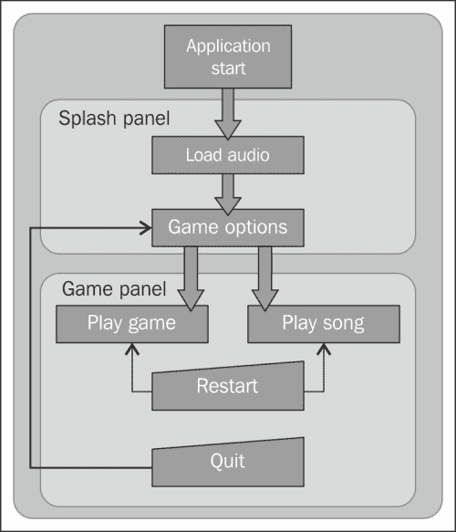
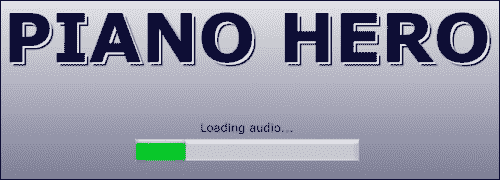
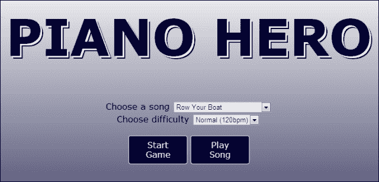
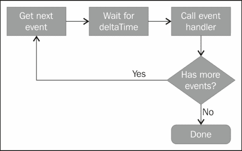
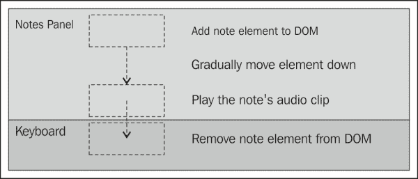
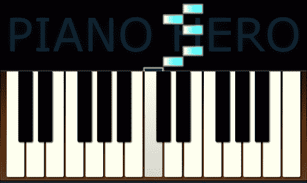
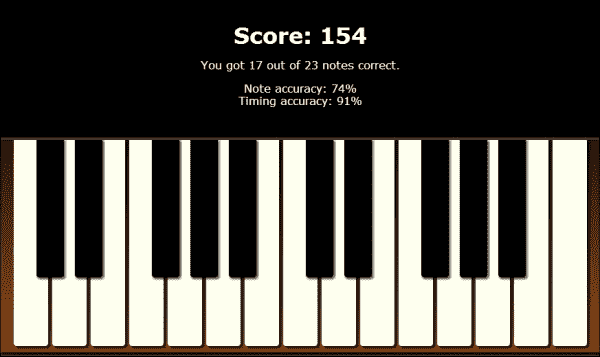

# 第七章：钢琴英雄

> "音乐的一大好处是，当它打动你时，你感觉不到痛苦。"
> 
> - 鲍勃·马利

*在本章中，我们将把上一章的钢琴应用程序转变成一个游戏，玩家必须在音符按下屏幕时以正确的时间演奏歌曲的音符。我们将创建一个启动页面，用于跟踪图像加载并允许玩家选择游戏选项。我们将创建一个音频序列以播放音乐数据中的歌曲。在游戏过程中，我们将收集钢琴键盘输入并验证以确定玩家的得分。*

在本章中我们将学到以下内容：

+   如何使用 HTML5 进度条元素跟踪资源的加载

+   如何使用 JavaScript 定时器来控制音频播放以播放歌曲

+   如何使用 DOM 元素动画来移动它们在屏幕上

+   如何在游戏状态之间过渡

+   如何获取用户输入并验证它

# 创建钢琴英雄

我们的钢琴英雄游戏将从我们在上一章中构建的 HTML5 钢琴应用程序开始。我们将添加一个音频序列到其中以播放预先录制的歌曲。为了得分，玩家需要跟着演奏歌曲的音符，并在正确的时间演奏。还将有一个练习模式，只播放歌曲，以便玩家能听到它。

我们的游戏将有两个不同的主面板。第一个将是启动面板，这是游戏的起点。当应用程序首次启动时，它将显示一个进度条，因为音频正在加载。加载完成后，它将显示游戏的选项。当玩家点击播放按钮时，他们将转到游戏面板。

游戏面板包含钢琴键盘和一个显示要演奏的音符从上面掉下来的区域。如果用户在正确的时间演奏了正确的音符，他们会得到积分。在歌曲结束时，玩家的得分和一些统计数据将被显示。游戏结束后，应用程序将转回到启动面板，用户可以选择选项并再次游戏。

通常有助于绘制一个流程图，显示游戏如何从一个状态过渡到另一个状态。



# 行动时间-创建启动面板

让我们从上一章创建的钢琴应用程序开始，并将文件重命名为`pinaoHero.html`，`pianoHero.js`和`pianoHero.css`。我们还将主应用程序对象重命名为`PianoHeroApp`。您可以在`第七章/example7.1`中找到本节的代码。

现在让我们创建启动面板。首先我们将在`pianoHero.html`中定义 HTML。我们将在键盘元素上方添加一个新的`<div>`元素来容纳启动面板：

```html
<div id="splash">
    <h1>Piano Hero</h1>
    <section class="loading">
        Loading audio...<br/>
        <progress max="100" value="0"></progress>
    </section>
```

首先，我们添加一个带有`"loading"`类的部分，显示应用程序首次启动时加载音频的状态。请注意，我们正在使用新的 HTML5`<progress>`元素。该元素用于在应用程序中实现进度条。它有一个`max`属性，定义最大值，和一个`value`属性来设置当前值。由于我们显示百分比完成，我们将`max`设置为`100`。随着音频文件的加载，我们将从 JavaScript 更新`value`属性。

然后我们添加一个带有`"error"`类的部分，如果加载音频时出错将显示错误消息。否则它将被隐藏：

```html
    <section class="error">
        There was an error loading the audio.
    </section>
```

最后，我们添加一个显示游戏选项和按钮的部分。这个面板在所有音频加载完成后显示：

```html
    <section class="loaded hidden">
        <label>Choose a song</label>
        <select id="select-song">
            <option value="rowBoat">Row Your Boat</option>
            <option value="littleStar">
              Twinkle, Twinkle, Little Star</option>
            <option value="londonBridge">London Bridge</option>
            <option value="furElise">Fur Elise</option>
        </select><br/>
        <label>Choose difficulty</label>
        <select id="select-rate">
            <option value="0.5">Slow (60bpm)</option>
            <option value="1" selected>Normal (120bpm)</option>
            <option value="1.5">Fast (180bpm)</option>
        </select>
        <p>
            <button id="start-game">Start Game</button>
            <button id="start-song">Play Song</button>
        </p>
    </section>
</div>
```

在这里，用户从下拉列表中选择歌曲和难度。难度是以歌曲播放速度的比率来表示。值为 1 是默认速度，即每分钟 120 拍。小于 1 的值是更慢的，大于 1 的值是更快的。

现在我们需要为启动面板设置样式。请查看所有样式的源代码。一个值得注意的样式是**PIANO HERO**标题，我们将其放在`<h1>`标题元素中：

```html
#splash h1
{
    font-size: 6em;
    color: #003;
    text-transform: uppercase;
    text-shadow: 3px 3px 0px #fff, 5px 5px 0px #003;
}
```

我们将文本的颜色设置为深蓝色。然后我们使用`text-shadow`来产生有趣的块文本效果。在使用`text-shadow`时，您可以通过逗号分隔指定任意数量的阴影。阴影将按照从后到前的顺序绘制。所以在这种情况下，我们首先绘制一个偏移为 5 像素的深蓝色阴影，然后是一个偏移为 3 像素的白色阴影，最后深蓝色文本将被绘制在其上方：



现在让我们创建一个名为`splashPanel.js`的新 JavaScript 文件，并在其中定义一个名为`SplashPanel`的新对象，该对象将包含控制闪屏面板的所有代码。构造函数将接受一个参数，即对`audioManager`的引用：

```html
function SplashPanel(audioManager)
{
    var $div = $("#splash"),
    error = false;
```

我们定义了一个`$div`对象来保存对闪屏面板根`<div>`元素的引用，并设置了一个`error`变量来设置是否在加载音频时出现错误。接下来，我们定义了公共的`show()`和`hide()`方法。这些方法将由主应用程序对象调用以显示或隐藏面板。

```html
    this.show = function()
    {
        $div.fadeIn();
        return this;
    };
    this.hide = function()
    {
        $div.hide();
        return this;
    };
}
```

接下来，我们将`loadAudio()`方法从`PianoHeroApp`移动到`SplashPanel`。在这个方法中，我们需要对`audioManager.getAudio()`的调用进行一些小的更改：

```html
audioManager.getAudio(noteName,
    function()
    {
        if (error) return;
        if (++loaded == count) showOptions();
        else updateProgress(loaded, count);
    },
    function(audio) { showError(audio); }
);
```

在我们每次加载音频文件时调用的函数中，我们首先检查是否有错误，如果有，则将其取出。然后我们检查是否已加载所有音频文件（`loaded == count`），如果是，则调用`showOptions()`方法。否则，我们调用`updateProgress()`方法来更新进度条：

```html
function updateProgress(loadedCount, totalCount)
{
    var pctComplete = parseInt(100 * loadedCount / totalCount);
    $("progress", $div)
        .val(pctComplete)
        .text(pctComplete + "%");
}
```

`updateProgress()`方法将加载计数和总计数作为参数。我们计算完成的百分比，并使用它来更新`<progress>`元素的值。我们还设置了`<progress>`元素的内部文本。这只会在不支持`<progress>`元素的浏览器中显示。

```html
function showOptions()
{
    $(".loading", $div).hide();
    $(".options", $div).fadeIn();
}
```

在加载完所有音频后，将调用`showOptions()`方法。首先隐藏具有`"loading"`类的元素，然后淡入具有`"options"`类的元素。这将隐藏进度部分并显示包含游戏选项的部分。

我们的错误处理程序调用`showError()`，将失败的音频元素传递给它：

```html
function showError(audio)
{
    error = true;
    $(".loading", $div).hide();
    $(".error", $div)
        .append("<div>" + audio.src + "<div>")
        .show();
}
```

在`showError()`方法中，我们将`error`标志设置为`true`，以便我们知道不要在`getAudio()`调用中继续。首先隐藏加载部分，然后将失败的文件名附加到错误消息中，并显示错误部分。

我们闪屏面板中的最后一件事是将事件处理程序连接到按钮。有两个按钮，**开始游戏**和**播放歌曲**。它们之间唯一的区别是**播放歌曲**按钮会播放歌曲而不计分，因此用户可以听歌曲并练习：

```html
$(".options button", $div).click(function()
{
    var songName = $("#select-song>option:selected", $div).val();
    var rate = Number($("#select-rate>option:selected", $div).val());
    var playGame = ($(this).attr("id") == "start-game");
    app.startGame(songName, rate, playGame);
});
```

我们为两个按钮使用相同的事件处理程序。首先获取用户选择的选项，包括歌曲和播放速率。您可以使用 jQuery 的`:selected`选择器找到所选的`<option>`元素。我们通过查看按钮的`id`属性来确定用户按下了哪个按钮。然后我们在全局`app`对象上调用`startGame()`方法，传入所选的选项。我们稍后将编写该方法。



## *刚刚发生了什么？*

我们创建了一个闪屏面板，使用 HTML5 的`<progress>`元素显示音频文件的加载进度。加载完成后，它会显示游戏选项，然后等待用户选择选项并开始游戏。

# 行动时间-创建游戏面板

接下来，我们将创建游戏面板。我们已经有了钢琴键盘，它将是其中的一部分。我们还需要在其上方添加一个区域来显示下降的音符，并在游戏结束时显示结果的地方。让我们将这些添加到我们的 HTML 文件中的`game`元素内部和键盘上方：

```html
<div id="game">
    <div id="notes-panel">
        <div class="title">PIANO HERO</div>
    </div>
```

`<div id="notes-panel">`元素将用于容纳代表要演奏的音符的元素。现在它是空的。在游戏进行时，`note`元素将动态添加到这个元素中。它有一个带有标题的`<div>`元素，将显示在音符的后面。

```html
    <div id="results-panel">
        <h1>Score: <span class="score"></span></h1>
        <p>
            You got <span class="correct"></span>
            out of <span class="count"></span> notes correct.
        </p>
        <p>
            Note accuracy: <span class="note-accuracy"></span>%<br/>
            Timing accuracy: <span class="timing-accuracy"></span>%
        </p>
    </div>
```

`<div id="results-panel">`元素将在游戏完成时显示。我们添加`<span>`占位符来显示得分，音符的总数以及正确的数量，以及一些准确度统计。

```html
    <div class="keyboard">
        <div class="keys">
            <!-- Code not shown... -->
        </div>
        <div class="controls">
            <button id="stop-button">Stop</button>
            <button id="restart-button">Restart</button>
            <button id="quit-button">Quit</button><br/>
            <label for="sustain">Sustain: </label>
            <input type="checkbox" id="sustain" checked /><br />
            <label for="volume">Volume: </label>
            <input type="range" id="volume" min="1" max="100"
                value="100" step="1" />
        </div>
    </div>
</div>
```

我们还在键盘下方的`<div class="controls">`元素中添加了一些按钮。**停止**按钮将停止游戏，**重新开始**将从头开始播放当前歌曲，**退出**将把玩家带回到启动面板。

现在让我们在一个名为`gamePanel.js`的文件中创建一个`GamePanel`对象，以包含实现游戏所需的所有代码。构造函数将接受对`audioManager`对象的引用：

```html
function GamePanel(audioManager)
{
    var $panel = $("#game"),
        $notesPanel = $("#notes-panel"),
        $resultsPanel = $("#results-panel"),
        practiceMode = false,
        noteCount = 0,
        notesCorrect = 0,
        score = 0,
        keyCodesToNotes = {},
        sustain = true,
        volume = 1.0;
```

在这里，我们定义了一些变量来跟踪游戏状态。`practiceMode`变量确定我们是在玩游戏还是练习。`noteCount`、`notesCorrect`和`score`用于跟踪玩家的表现。

我们将所有支持键盘的代码从`PianoHeroApp`对象移动到`GamePanel`对象。这包括`keyCodesToNotes`、`sustain`和`volume`变量。我们还移动了`initKeyboard()`、`keyDown()`、`keyUp()`、`pressPianoKey()`、`releasePianoKey()`、`getPianoKeyElement()`和`isInputTypeSupported()`方法。最后，我们移动了`onKeyDown()`和`onKeyUp()`事件处理程序。

现在让我们为应用程序与游戏面板交互添加一些公共方法。与启动面板一样，我们需要方法来显示和隐藏它：

```html
this.show = function()
{
    $panel.fadeIn(startGame);
    return this;
};
this.hide = function()
{
    $panel.hide();
    return this;
};
```

`show()`公共方法将游戏面板淡入。我们传入一个对`startGame()`方法的引用，我们将在下一节中编写该方法，以在淡入完成时调用。

## *刚刚发生了什么？*

我们通过添加标记来创建游戏面板，用于容纳动画`note`元素的区域，以及显示得分的区域。这些是我们在上一章中创建的键盘之外的内容。然后，我们创建了一个 JavaScript 对象来保存游戏面板的所有代码，包括我们之前为键盘编写的所有代码。

# 行动时间-创建控制器

此时在我们的主应用程序对象`PianoHeroApp`中剩下的不多了。我们将所有加载音频的代码移到了`SplashPanel`对象中，将使键盘工作的所有代码移到了`GamePanel`对象中。

`PianoHeroApp`对象现在只作为状态控制器来隐藏和显示正确的面板。首先，我们需要添加一些变量来保存对面板的引用：

```html
function PianoHeroApp()
{
    var version = "7.1",
        audioManager = new AudioManager("audio"),
        splashPanel = new SplashPanel(audioManager),
        gamePanel = new GamePanel(audioManager),
        curPanel = undefined;
```

我们定义变量来保存音频管理器、启动面板和游戏面板对象。我们还有一个`curPanel`变量，它将被设置为当前显示的面板。一开始我们将把它设置为`undefined`。

接下来，我们将创建一个私有的`showPanel()`方法，它将隐藏当前显示的面板（如果有的话），并显示另一个面板：

```html
    function showPanel(panel)
    {
        if (curPanel) curPanel.hide();
        curPanel = panel;
        curPanel.show();
    }
```

这个方法以要显示的面板作为参数。这将是对`SplashPanel`或`GamePanel`的引用。首先，我们检查是否正在显示面板，如果是，我们调用它的`hide()`方法。然后我们将`curPanel`设置为新面板，并调用它的`show()`方法。

接下来，我们定义公共的`startGame()`方法。如果你还记得我们为`SplashPanel`对象编写的代码，这个方法将在用户点击**开始游戏**或**播放歌曲**按钮时从事件处理程序中调用。它会传入玩家选择的游戏选项：

```html
    this.startGame = function(songName, rate, playGame)
    {
        gamePanel.setOptions(songName, rate, playGame);
        showPanel(gamePanel);
    };
```

`startGame()`方法接受三个参数；要播放的歌曲的名称，播放速率（控制游戏进度的快慢），以及一个布尔值（确定用户是否点击了**开始游戏**按钮）。

首先，我们调用`GamePanel`对象的`setOptions()`方法，稍后我们将编写。我们通过与启动面板获得的相同参数进行传递。然后我们调用`showPanel()`方法，传入`GamePanel`对象。这将开始游戏。

接下来，我们将定义公共的`quitGame()`方法。当用户点击**退出**按钮时，这将从游戏面板中调用：

```html
    this.quitGame = function()
    {
        showPanel(splashPanel);
    };
```

在这个方法中，我们所做的就是调用`showPanel()`，将`SplashPanel`对象传递给它。

我们需要定义的最后一件事是应用程序的`start()`方法：

```html
    this.start = function()
    {
        $(document).keydown(function(e) { curPanel.onKeyDown(e); })
                   .keyup(function(e) { curPanel.onKeyUp(e); });

        showPanel(splashPanel);
        splashPanel.loadAudio();
    };
```

首先，在文档上设置键盘事件处理程序，就像我们在创建钢琴应用程序时所做的那样。但是，在这个应用程序中，我们将键盘事件转发到当前面板。通过在应用程序对象中集中处理键盘事件处理程序，我们不必在每个面板中编写大量代码来订阅和取消订阅来自文档的键盘事件处理程序，当面板显示或隐藏时。

我们做的最后一件事是显示启动面板，然后调用它的`loadAudio()`方法来启动应用程序。

### 音符

我们的启动和游戏面板实现了`show()`、`hide()`、`keydown()`和`keyup()`方法。由于 JavaScript 是无类型的，我们无法通过接口来强制执行这一点。因此，我们改为按照约定进行编程，假设所有面板都将实现这些方法。

## *刚刚发生了什么？*

我们在主应用程序对象中添加了代码来控制游戏的状态。当玩家点击启动面板上的按钮之一时，游戏就会开始，当他们从游戏中点击**退出**时，它会显示启动面板。

# 创建音频序列

在我们玩游戏之前，我们需要一种方法来通过按照特定顺序、在正确的时间和以正确的速度播放音符来在钢琴上演奏歌曲。我们将创建一个名为`AudioSequencer`的对象，它接受一个音乐事件对象数组并将它们转换为音乐。

为了实现我们的音频序列，我们需要定义音乐事件的格式。我们将大致遵循 MIDI 格式，但简化得多。MIDI 是记录和回放音乐事件的标准。每个事件包含有关何时以及如何演奏音符或关闭音符的信息。

我们的事件对象将包含三个字段：

+   `deltaTime`：执行事件之前等待的时间量。

+   `事件`：这是一个整数事件代码，确定事件的操作。它可以是以下之一：

+   打开音符

+   关闭音符

+   提示点将在歌曲的开头

+   曲目结束将表示歌曲结束。

+   `注意`：这是要演奏的音符。它包含了八度和音符，并且与我们的音频文件名称匹配，例如，3C。

音频序列将通过查看每个事件中的`deltaTime`字段来确定在触发事件之前等待多长时间。客户端将传递一个事件处理程序函数，当事件触发时将调用该函数。然后客户端将查看事件数据并确定要演奏哪个音符。这个循环会一直持续，直到没有更多的事件为止。



# 行动时间 - 创建 AudioSequencer

让我们在一个名为`audioSequencer.js`的文件中创建我们的`AudioSequencer`对象。我们将首先定义一些变量：

```html
function AudioSequencer()
{
    var _events = [],
        _playbackRate = 1,
        _playing = false,
        eventHandler = undefined,
        timeoutID = 0;
```

首先，我们定义了一个`_events`数组来保存所有要播放的音乐事件。`_playbackRate`变量控制歌曲播放的速度。值为`1`时是正常速度，小于`1`时是较慢，大于`1`时是较快。`_playing`变量在播放歌曲时设置为`true`。`eventHandler`将设置为一个在事件触发时调用的函数，`timeoutID`将包含从`setTimeout()`返回的句柄，以防用户停止游戏，我们需要取消超时。

现在让我们定义一些公共属性方法。第一个是`events()`。它用于获取或设置`_events`数组：

```html
    this.events = function(newEvents)
    {
        if (newEvents) {
            _events = newEvents;
            return this;
        }
        return _events;
    };
```

接下来是`playbackRate()`。它用于获取或设置`_playbackRate`：

```html
    this.playbackRate = function(newRate)
    {
        if (newRate) {
            _playbackRate = newRate;
            return this;
        }
        return _playbackRate;
    };
```

最后，我们有`isPlaying()`，用于确定歌曲当前是否正在播放：

```html
    this.isPlaying = function()
    {
        return _playing;
    };
```

现在我们将编写公共的`startPlayback()`方法。该方法接受两个参数；事件处理程序函数和可选的起始位置，即`_events`数组的索引：

```html
    this.startPlayback = function(callback, startPos)
    {
        startPos = startPos || 0;

        if (!_playing && _events.length > 0)
        {
            _playing = true;
            eventHandler = callback;
            playEvent(startPos);
            return true;
        }
        return false;
    };
```

首先，我们将`startPos`参数默认设置为`0`，如果没有提供的话。接下来，我们检查歌曲是否已经在播放，并确保我们实际上有一些事件要播放。如果是这样，我们将`_playing`标志设置为`true`，存储事件处理程序的引用，然后为第一个事件调用`playEvent()`。如果成功开始播放，则返回`true`。

现在让我们编写`playEvent()`方法。它接受一个参数，即要触发的下一个事件的索引：

```html
    function playEvent(index)
    {
        var event = _events[index];
        eventHandler(event.event, event.note, index);

        index++;
        if (index < _events.length)
        {
            timeoutID = setTimeout(function()
            {
                playEvent(index);
            },
            _events[index].deltaTime * (1 / _playbackRate));
        }
        else _playing = false; // all done
    }
```

我们首先要做的是在`_events`数组中获取指定索引处的事件。然后立即调用`startPlayback()`方法中提供的事件处理程序的回调函数，传递事件代码、要播放的音符和事件索引。

接下来，我们增加索引以获取下一个事件。如果还有其他事件，我们将调用`setTimeout()`来等待事件的`deltaTime`字段中指定的时间量，然后再次调用`playEvent()`，传递下一个事件的索引。我们通过将`deltaTime`乘以播放速率的倒数来计算等待的时间量。例如，如果播放速率为 0.5，则等待时间将是 1，0.5 或 2 倍于正常速率。这个循环将继续进行，直到没有更多的事件要播放。

我们最后需要一个公共的`stopPlayback()`方法。调用此方法将停止事件循环，从而停止音频事件的播放：

```html
    this.stopPlayback = function()
    {
        if (_playing)
        {
            _playing = false;
            if (timeoutID) clearTimeout(timeoutID);
            eventHandler = undefined;
        }
    };
```

首先，我们检查`_playing`标志，以确保歌曲实际上正在播放。如果是这样，我们将标志设置为`false`，然后调用`clearTimeout()`来停止超时。这将阻止再次调用`playEvent()`，从而停止播放循环。

我们最后需要做的是定义播放事件代码，这样我们就不必记住事件代码编号。我们将使用`AudioSequencer`上的对象定义一个伪枚举，称为`eventCodes`：

```html
AudioSequencer.eventCodes =
{
    noteOn: 1,
    noteOff: 2,
    cuePoint: 3,
    endOfTrack: 4
};
```

## *刚刚发生了什么？*

我们创建了一个音频序列对象，它接受一个音乐事件数组，类似于 MIDI 事件，并使用`setTimeout()`函数在正确的时间调用它们。当事件被触发时，它会调用游戏面板传入的事件处理程序函数。

### 注意

虽然我们编写了这段代码来播放音乐，但你可以在任何需要在预定时间发生事情的地方使用相同的技术。

# 播放歌曲

现在我们有了一个音频序列，我们可以进入游戏面板并添加一些代码以在练习模式下播放歌曲。当歌曲播放时，它将在屏幕上按下正确的键，就像玩家钢琴一样。稍后我们将添加代码来检查玩家的互动，看他们跟着歌曲的节奏有多好。

# 行动时间-添加音频序列

让我们将音频序列添加到游戏面板中。我们将进入`GamePanel`对象，并在其中添加一个`AudioSequencer`的实例：

```html
function GamePanel(audioManager)
{
    var sequencer = new AudioSequencer();
```

接下来让我们编写公共的`setOptions()`方法，该方法从`PianoHeroApp`的`startGame()`方法中调用。它接受三个参数；歌曲名称，播放速率，以及是否在练习模式下播放游戏或歌曲：

```html
    this.setOptions = function(songName, rate, playGame)
    {
        sequencer.events(musicData[songName])
                 .playbackRate(rate);
        practiceMode = !playGame;
        return this;
    };
```

我们首先将音频序列的`events()`属性设置为要播放的歌曲的数据。我们从`musicData.js`中定义的`musicData`对象中获取歌曲数据。然后，我们设置音频序列的`playbackRate()`属性。最后，我们设置`practiceMode`变量。

`musicData`对象包含了音序器可以为用户在闪屏页面上选择的所有歌曲播放的事件数据。每首歌曲都被定义为一个音乐事件对象的数组。以下是韵律“Twinkle, Twinkle Little Star”数据的示例：

```html
var musicData =
{
    littleStar: [
        { deltaTime: 0, event: 3, note: null },
        { deltaTime: 0, event: 1, note: "3C" },
        { deltaTime: 500, event: 2, note: "3C" },
        { deltaTime: 0, event: 1, note: "3C" },
        { deltaTime: 500, event: 2, note: "3C" },
        { deltaTime: 0, event: 1, note: "3G" },
        { deltaTime: 500, event: 2, note: "3G" },
        // ...
        { deltaTime: 0, event: 4, note: null }
    ]
};
```

它以一个提示点事件（`event: 3`）开始，然后打开 3C 音符（`event: 1`）。500 毫秒后，关闭 3C 音符（`event: 2`）。它一直持续到最后一个事件，即曲目结束（`event: 4`）。

接下来让我们编写`startGame()`方法，该方法从`show()`方法中调用：

```html
function startGame()
{
    $resultsPanel.hide();
    $notesPanel.show();
    // Reset score
    noteCount = 0;
    notesCorrect = 0;
    score = 0;
    // Start interval for notes animation
    intervalId = setInterval(function() { updateNotes(); },
        1000 / framesPerSecond);
    // Start playback of the song
    sequencer.startPlayback(onAudioEvent, 0);
}
```

我们首先隐藏结果面板并显示音符面板。然后重置分数和统计信息。

接下来，我们通过调用 JavaScript 的`setInterval()`函数并将`intervalId`变量设置为返回的句柄来启动一个间隔计时器。我们稍后将使用它来在游戏结束或玩家停止游戏时停止间隔。此间隔用于动画播放从页面顶部下落的音符面板中的元素。我们通过将 1000 毫秒除以每秒帧数来设置间隔以以恒定速率触发。我们将使用每秒 30 帧的帧速率，这足以产生相对平滑的动画，而不会拖慢游戏。在计时器的每个间隔处，我们调用`updateNotes()`方法，我们将在下一节中编写。

在此方法中的最后一件事是调用音频顺序器的`startPlayback()`方法，将音频事件处理程序方法`onAudioEvent()`的引用和起始位置零传递给它：

```html
function onAudioEvent(eventCode, note)
{
    switch (eventCode)
    {
        case AudioSequencer.eventCodes.noteOn:
            addNote(note);
            break;
        case AudioSequencer.eventCodes.endOfTrack:
            sequencer.stopPlayback();
            break;
    }
}
```

此方法接受两个参数：音频事件代码和要播放的音符。我们使用`switch`语句以及我们的`eventCodes`枚举来确定如何处理事件。如果事件代码是`noteOn`，我们调用`addNote()`方法向音符面板添加一个`note`元素。如果是`endOfTrack`事件，我们在音频顺序器上调用`stopPlayback()`。我们现在可以忽略所有其他事件。

## *刚刚发生了什么？*

我们将音频顺序器添加到游戏面板中，并连接一个处理音符事件触发的函数。我们添加了一个`startGame()`方法，用于启动动画间隔以动画播放`note`元素。

# 创建动画音符

现在我们将实现音符面板的代码。这是音符从页面顶部下落的动画发生的地方。它的工作方式如下：

+   音频顺序器发送一个事件，指示应该播放一个音符（请参阅上一节中的`onAudioEvent()`）。

+   此时实际上并没有播放音符。相反，表示音符的矩形元素被添加到音符面板的顶部。

+   每当我们的动画间隔计时器触发时，`note`元素的 y 位置会递增，使其向下移动。

+   当元素触及音符面板的底边（以及键盘的顶边）时，它会播放与音符相关的音频剪辑。

+   当元素完全离开音符面板时，它将从 DOM 中移除。



# 行动时间-添加音符

让我们编写`addNote()`方法，该方法在上一节中由`onAudioEvent()`引用。此方法接受一个参数，要添加的音符的名称：

```html
function addNote(note)
{
    noteCount++;
    // Add a new note element
    var $note = $("<div class='note'></div>");
    $note.data("note", note);
    $notesPanel.append($note);

    var $key = getPianoKeyElement(note);
    // Position the note element over the piano key
    $note.css("top", "0")
         .css("left", $key.position().left)
         .css("width", $key.css("width"));

    if ($key.hasClass("black"))
    {
        $note.addClass("black");
    }
}
```

首先，我们更新`noteCount`变量以跟踪统计信息。然后，我们使用 jQuery 创建一个新的音符`<div>`元素，并给它一个`"note"`类。我们将`data-note`自定义属性设置为音符的名称。当它到达面板底部时，我们将需要它来知道要播放哪个音符。最后，我们使用 jQuery 的`append()`方法将其添加到音符面板中。

接下来我们要做的是将`note`元素定位在它所代表的钢琴键上。我们通过调用现有的`getPianoKeyElement()`方法来获取与音符关联的钢琴键元素。我们提取钢琴键的左侧位置和宽度，并将`note`元素设置为相同的值，使其对齐。

我们最后要做的是检查钢琴键是黑键还是白键，方法是检查它是否定义了`"black"`类。如果是，则我们也给`note`元素添加`"black"`类。这将使元素以不同的颜色显示。

让我们为`note`元素添加样式：

```html
#notes-panel .note
{
    position: absolute;
    display: block;
    width: 50px;
    height: 20px;
    background-color: cyan;
    /* browser specific gradients not shown */
    background: linear-gradient(left, white, cyan);
    box-shadow: 0 0 4px 4px rgba(255, 255, 255, 0.7);
}
```

我们将`position`设置为`absolute`，因为我们需要移动它们并将它们放在我们想要的任何位置。我们给它们一个从左到右的线性渐变，从白色渐变到青色。我们还给它一个没有偏移的白色阴影。这将使它看起来像是在黑色背景上发光：

```html
#notes-panel .note.black
{
    background-color: magenta;
    /* browser specific gradients not shown */
    background: linear-gradient(left, white, magenta);
}
```

具有``"black"``类的音符将覆盖背景颜色，从白色渐变为品红色。

## *刚刚发生了什么？*

我们创建了一个方法，向音符面板添加代表音符的元素。我们将这些音符定位在它们所属的钢琴键的正上方。

# 到了行动的时候-为音符添加动画

之前，我们在`startGame()`方法中使用`setInterval()`开始了一个间隔。`updateNotes()`方法在间隔到期时被调用。该方法负责更新所有`note`元素的位置，使它们看起来向下移动屏幕：

```html
function updateNotes()
{
    $(".note", $notesPanel).each(function()
    {
        var $note = $(this);
        var top = $note.position().top;
        if (top <= 200)
        {
            // Move the note down
            top += pixelsPerFrame;
            $note.css("top", top);
            if (top + 20 > 200)
            {
                // The note hit the bottom of the panel
                currentNote.note = $note.data("note");
                currentNote.time = getCurrentTime();
                currentNote.$note = $note;
                if (practiceMode) pressPianoKey($note.data("note"));
            }
        }
        else
        {
            // Note is below the panel, remove it
            if (practiceMode) releasePianoKey($note.data("note"));
            $note.remove();
        }
    });

    // Check if there are any notes left
    if ($(".note", $notesPanel).length == 0)
    {
        // No more notes, game over man
        if (!practiceMode) showScore();
        endGame();
    }
}
```

首先，我们选择音符面板中的所有`note`元素并对它们进行迭代。对于每一个，我们执行以下操作：

+   获取顶部位置并检查是否小于 200，这是音符面板的高度。

+   如果元素仍然在音符面板内，我们将元素向下移动`pixelsPerFrame`变量定义的像素数。每秒 30 帧，即 2 像素。

+   接下来，我们检查`note`元素的底部是否击中了音符面板的底部，方法是检查底部是否大于 200。

+   如果是，我们将`currentNote`对象的`note`变量设置为音符，这样我们可以稍后检查用户是否演奏了正确的音符。我们还获取音符击中底部的确切时间，以确定玩家离按时演奏有多近。

+   如果我们处于练习模式，还可以通过调用`pressPianoKey()`并将`note`元素传递给它来演奏音符。

+   如果`note`元素在音符面板之外，那么我们调用`releasePianoKey()`并将其从 DOM 中移除。

我们要做的最后一件事是检查音符面板中是否还有任何音符元素。如果没有，游戏结束，我们调用`showScore()`来显示结果面板。然后我们调用`endGame()`，停止动画间隔。

## *刚刚发生了什么？*

我们对`note`元素进行了动画处理，使它们看起来在键盘上的键上下落。当音符击中音符面板底部时，如果处于练习模式，我们会演奏音符。当`note`元素移出面板时，我们将其从 DOM 中移除。

## 试一试英雄

尝试调整帧速率，看看它如何影响动画的质量。什么是可以接受的最低帧速率？什么是可以察觉到的最高帧速率？

# 处理用户输入

用户已经开始了游戏，音符正在屏幕上下落。现在我们需要检查玩家是否在正确的时间按下了正确的钢琴键。当他们这样做时，我们将根据他们的准确性给他们一些分数。

# 行动时间-检查音符

我们将在`keyDown()`方法中添加对`checkNote()`方法的调用。`checkNote()`方法以音符的名称作为参数，并检查音符面板底部是否有与之匹配的`note`元素：

```html
function checkNote(note)
{
    if (currentNote.note == note)
    {
        var dif = getCurrentTime() - currentNote.time;
        if (dif < gracePeriod)
        {
            notesCorrect++;
            score += Math.round(10 * (gracePeriod - dif) / gracePeriod);
            currentNote.$note.css("background", "green");
            addHitEffect();
        }
    }
}
```

首先检查之前在`updateNotes()`中设置的`currentNote`对象。如果它的音符与用户演奏的音符相同，那么他们可能会因在正确时间演奏而得到一些分数。要找出他们是否得分，我们首先找出音符击中面板底部的时间与当前时间之间的毫秒时间差。如果在允许的宽限期内，我们将其设置为 200 毫秒，那么我们计算得分。

我们首先增加了正确音符的数量。然后，我们通过计算他们的偏差百分比并乘以 10 来确定分数。这样，每个音符的分数在 1 到 10 之间。最后，为了给用户一些指示他们做对了，我们将元素的背景颜色改为绿色，并调用`addHitEffect()`：

```html
function addHitEffect()
{
    var $title = $(".title", $notesPanel);
    $title.css("color", "#012");
    setTimeout(function() { $title.css("color", "black"); }, 100);
}
```

`addHitEffect()`方法通过改变颜色在音符面板的背景中闪烁**PIANO HERO**标题，使用`setTimeout()`调用等待 100 毫秒，然后将其改回黑色。



## *刚刚发生了什么？*

我们添加了一个方法来检查是否在“音符”元素的正确时间按下了正确的钢琴键。如果是这样，我们根据音符的演奏时间来添加分数，并改变音符的颜色以指示成功。

# 结束游戏

现在玩家可以玩游戏，我们可以跟踪分数和他们正确演奏的音符数量。游戏结束时，我们需要显示结果面板，显示分数和一些统计信息。

# 行动时间-创建结果面板

在歌曲的所有音符都被演奏后，`updateNotes()`方法调用`showScore()`，在那里我们将显示玩家的分数和一些统计信息：

```html
function showScore()
{
    $notesPanel.hide();
    $resultsPanel.fadeIn();
    $(".score", $resultsPanel).text(score);
    $(".correct", $resultsPanel).text(notesCorrect);
    $(".count", $resultsPanel).text(noteCount);
    $(".note-accuracy", $resultsPanel).text(
        Math.round(100 * notesCorrect / noteCount));
    $(".timing-accuracy", $resultsPanel).text(
        Math.round(10 * score / notesCorrect));
}
```

首先，我们隐藏音符面板，并在其位置淡入分数面板。然后，我们在 DOM 中的占位符中填入分数和统计信息。我们显示分数、正确音符的数量和总音符数量。此外，我们使用`notesCorrect`和`noteCount`变量计算他们正确演奏的音符的百分比。

我们通过从分数和正确音符的数量中计算来获得时间准确度百分比。请记住，每个音符可能获得的总分数是 10 分，所以如果他们正确演奏了 17 个音符，那么可能获得的总分数是 170。如果分数是 154，那么 154/170≈91%。



## *刚刚发生了什么？*

当游戏结束时，我们显示了结果面板，并填充了玩家的分数和统计信息。我们的游戏现在已经完成。试一试，成为钢琴英雄！

## 尝试一试

尝试编写一个音频记录器类，记录用户在键盘上演奏音符的时间，并将其保存到可以由音频序列器播放的数据对象数组中。

## 小测验

Q1. 哪个 JavaScript 函数可以用来创建一个定时器，直到清除为止？

1.  `setTimeout()`

1.  `setRate()`

1.  `setInterval()`

1.  `wait()`

Q2. `<progress>`元素的哪些属性控制标记为完成的进度条的百分比？

1.  `value`和`max`

1.  `currentValue`和`maxValue`

1.  `start`和`end`

1.  `min`和`max`

# 摘要

我们创建了一个基于我们在上一章中编写的钢琴应用程序的游戏。我们使用 JavaScript 计时器来实现音频序列器以播放歌曲并创建动画循环。我们创建了闪屏和游戏面板，并学会了在它们之间过渡游戏状态。

本章中我们涵盖了以下概念：

+   如何创建一个闪屏面板并使用文本阴影产生有趣的文本效果

+   如何使用 HTML5 进度条元素显示动态资源的加载进度

+   使用 JavaScript 计时器函数创建音频序列器，控制音频播放以播放歌曲

+   如何使用 JavaScript 计时器来动画 DOM 元素

+   如何在游戏状态和面板之间过渡

+   如何收集用户输入，验证它，并在游戏结束时显示结果

在下一章中，我们将学习如何使用 Ajax 来动态加载资源并通过构建天气小部件调用 Web 服务。
