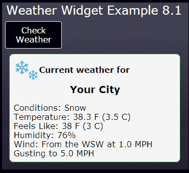
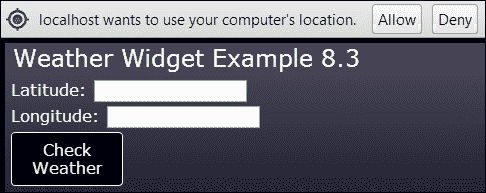
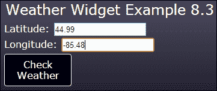
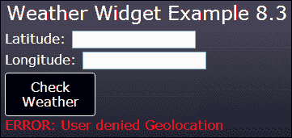
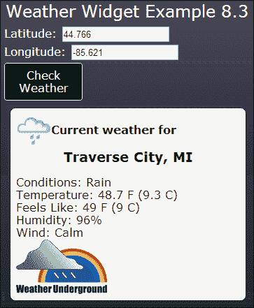

# 第八章：天气的变化

> "气候是我们所期望的，天气是我们得到的。"
> 
> -马克·吐温

*在本章中，我们将构建一个天气小部件，以了解如何使用 Ajax 异步加载内容并与 Web 服务通信。我们将学习 Ajax 以及如何使用 jQuery 的 Ajax 方法加载包含 XML 或 JSON 格式数据的文件。然后我们将从 Web 服务获取天气状况以在小部件中显示。我们还将使用 HTML 地理位置 API 来查找用户的位置，以便显示他们当地的天气。*

在本章中，我们将学到以下内容：

+   如何使用 jQuery 的 Ajax 方法获取 XML 和 JSON 数据

+   解析从服务返回的 JSON 与 XML

+   什么是 Web 服务以及如何使用 Ajax 异步与它们通信

+   跨站脚本的问题，以及解决方案 JSONP

+   如何使用 HTML5 地理位置 API 获取用户的位置

+   如何连接到 Web 服务以获取当前天气报告

# Ajax 简介

Ajax 是 JavaScript 用于向服务器发送数据和接收数据的技术。最初**Ajax**代表**异步 JavaScript 和 XML**，但现在这个含义已经丢失，因为 JSON（我们在第一章中学到的，*手头的任务*）已经开始取代 XML 作为打包数据的首选格式，而 Ajax 请求不需要是异步的。

使用 Ajax 将使您的应用程序更加动态和响应。与其在每次需要更新网页的部分时都进行回发，您可以仅加载必要的数据并动态更新页面。通过 Ajax，我们可以从服务器检索几乎任何东西，包括要插入到网页中的 HTML 片段和应用程序使用的静态数据。我们还可以调用提供对服务器端唯一可用的数据和服务的 Web 服务。

## 发出 Ajax 请求

jQuery 提供了一些方法，可以轻松访问 Web 资源并使用 Ajax 调用 Web 服务。`ajax()`方法是其中最原始的方法。如果你想对服务调用有最大的控制，可以使用这个方法。大多数情况下，最好使用`get()`或`post()`等更高级的方法。

`get()`方法使使用 Ajax 进行 HTTP GET 请求变得更加容易。最简单的情况下，您传入要获取的资源或服务的 URL，它会异步发送请求并获取响应。完成后，它会执行您提供的回调函数。

例如，以下代码片段对服务器上的 XML 文件进行 GET 请求，并在对话框中显示其内容：

```html
$.get("data/myData.xml", function(data) {
    alert("data: " + data);
});
```

所有的 jQuery Ajax 方法都返回一个对象，您可以附加`done()`、`fail()`和`always()`回调方法。`done()`方法在请求成功后调用，`fail()`在出现错误时调用，`always()`在请求成功或失败后都会调用：

```html
$.get("data/myData.xml")
    .done(function(data) { alert("data: " + data); })
    .fail(function() { alert("error"); })
    .always(function() { alert("done"); });
```

传递给`done()`方法的数据将根据响应中指定的 MIME 类型，要么是 XML 根元素，要么是 JSON 对象，要么是字符串。如果是 JSON 对象，您可以像引用任何 JavaScript 对象一样引用数据。如果是 XML 元素，您可以使用 jQuery 来遍历数据。

您可以通过传入一个名称/值对的对象文字来为请求提供查询参数：

```html
$.get("services/getInfo.php", {
    firstName: "John",
    lastName: "Doe"
})
.done(function(data) { /* do something */ });
```

这将发出以下请求：

```html
services/getInfo.php?firstName=John&lastName=Doe
```

如果您更喜欢进行 POST 请求而不是 GET 请求，则可以使用`post()`方法，如果您使用安全协议（如 HTTPS）并且不希望在请求中看到查询参数，则可能更可取：

```html
$.post("services/getInfo.php", {
    firstName: "John",
    lastName: "Doe"
});
```

### 注意

在一些浏览器中，包括 Chrome，您无法使用`file://`协议通过 Ajax 请求访问文件。在这种情况下，您需要通过 IIS 或 Apache 运行您的应用程序，或者使用其他浏览器。

# 行动时间-创建一个天气小部件

在本章中，我们将演示如何通过实现一个显示天气报告的小部件来进行各种 Ajax 调用。让我们从定义小部件的 HTML 标记开始：

```html
<div id="weather-widget">
  <div class="loading">
    <p>Checking the weather...</p>
    
  </div>
  <div class="results">
    <header>
      Current weather for
      <div class="location"><span></span></div>
    </header>
    <section class="conditions">
      Conditions: <span data-field="weather"></span><br/>
      Temperature: <span data-field="temperature_string"></span><br/>
      Feels Like: <span data-field="feelslike_string"></span><br/>
      Humidity: <span data-field="relative_humidity"></span><br/>
      Wind: <span data-field="wind_string"></span><br/>
    </section>
  </div>
  <div class="error">
    Error: <span></span>
  </div>
</div>
```

小部件由三个不同的面板组成，任何时候只有一个面板会显示。`<div class="loading">`面板在从服务器检索天气数据时可见。它里面有一个动画图像，向用户指示正在加载某些内容。

`<div class="results">`面板将显示从服务器返回的天气数据。它包含占位符字段，用于放置天气数据。请注意，我们在占位符`<span>`元素上使用了自定义数据属性。稍后将使用这些属性从服务器返回的 XML 文档或 JSON 对象中提取正确的数据。

`<div class="error">`面板将在 Ajax 请求失败时显示错误消息。

现在让我们创建 JavaScript 代码来控制小部件，命名为`weatherWidget.js`。我们将创建一个`WeatherWidget`对象，其构造函数接受一个包装在 jQuery 对象中的小部件根元素的引用：

```html
function WeatherWidget($widget)
{
    this.update = function()
    {
        $(".results", $widget).hide();
        $(".loading", $widget).show();
        getWeatherReport();
    };

    function getWeatherReport() {
        // not implemented
    }
}
```

在我们的对象中，我们创建了一个名为`update()`的公共方法。这将从页面调用，告诉小部件更新天气报告。在`update()`方法中，我们首先隐藏结果面板，显示加载面板。然后我们调用`getWeatherReport()`方法，它将进行 Ajax 调用并在完成时更新小部件。在接下来的几节中，我们将编写此方法的不同版本。

## *刚刚发生了什么？*

我们创建了一个可以放置在网站任何页面上的天气小部件。它有一个公共的`update()`方法，用于告诉小部件更新其信息。

# 行动时间-获取 XML 数据

首先让我们创建一个从 XML 文件中获取数据并从其数据更新天气小部件的示例。我们将创建一个名为`weather.html`的新网页，并将天气小部件的标记放入其中。该页面将有一个**检查天气**按钮。单击时，它将调用天气小部件的`update()`方法。您可以在`第八章/示例 8.1`中找到此示例的代码。

接下来，我们需要创建一个包含一些天气信息的 XML 文件。我们将文件命名为`weather.xml`，并将其放在`data`文件夹中：

```html
<weather>
    <location>Your City</location>
    <current_observation>
        <weather>Snow</weather>
        <temperature_string>38.3 F (3.5 C)</temperature_string>
        <feelslike_string>38 F (3 C)</feelslike_string>
        <relative_humidity>76%</relative_humidity>
        <wind_string>From the WSW at 1.0 MPH</wind_string>
        <icon_url>images/snow.gif</icon_url>
    </current_observation>
</weather>
```

现在让我们在`WeatherWidget`对象中编写`getWeatherReport()`方法：

```html
function getWeatherReport()
{
    $.get("data/weather.xml")
        .done(function(data) {
            populateWeather(data);
       })
        .fail(function(jqXHR, textStatus, errorThrown) { 
            showError(errorThrown);
        });
}
```

在这个方法中，我们使用 jQuery 的`get()`方法执行 Ajax 请求，并将 XML 文件的路径传递给它。如果服务器调用成功，我们调用`populateWeather()`方法，将请求返回的数据传递给它。这将是表示我们的 XML 文件的 DOM 的根元素。如果请求失败，我们调用`showError()`方法，将错误消息传递给它。

接下来让我们编写`populateWeather()`方法。这是我们将从 XML 文档中提取数据并插入到页面中的地方：

```html
function populateWeather(data)
{
    var $observation = $("current_observation", data);

    $(".results header img", $widget)
        .attr("src", $("icon_url", $observation).text());
    $(".location>span", $widget)
        .text($("location", data).text());

    $(".conditions>span").each(function(i, e)
    {
        var $span = $(this);
        var field = $span.data("field");
        $(this).text($(field, $observation).text());
    });

    $(".loading", $widget).fadeOut(function ()
    {
        $(".results", $widget).fadeIn();
    });
}
```

我们需要一种方法来从服务器检索到的 XML 文档中提取数据。幸运的是，jQuery 可以用来选择任何 XML 文档中的元素，而不仅仅是网页的 DOM。我们所要做的就是将我们的 XML 的根元素作为第二个参数传递给 jQuery 选择器。这正是我们在方法的第一行中所做的，以获取`current_observation`元素并将其存储在`$observation`变量中。

接下来，我们使用 jQuery 从`icon_url`元素中获取文本，并将图像的`src`属性设置为它。这是表示当前天气的图像。我们还从`location`元素中获取文本，并将其插入到小部件的标题中。

然后，我们遍历小部件条件部分中的所有`<span>`元素。对于每个元素，我们获取其`data-field`自定义数据属性的值。我们使用它来查找`current_observation`元素中具有相同名称的元素，获取其文本，并将其放入`<span>`元素中。

我们做的最后一件事是淡出加载面板并淡入结果面板，以在页面上显示当前天气。加载的数据如下所示：



## 发生了什么？

我们使用 jQuery 的`get()` Ajax 方法从服务器加载了一个包含天气数据的 XML 文件。然后，我们使用 jQuery 选择从 XML 文档中提取信息，并将其放入小部件的占位符元素中以在页面上显示它。

# 执行操作-获取 JSON 数据

现在让我们做与上一节相同的事情，只是这次我们将从包含 JSON 格式数据的文件中获取数据，而不是 XML。概念是相同的，只是从 Ajax 调用中返回的是 JavaScript 对象，而不是 XML 文档。您可以在`第八章/示例 8.2`中找到此示例的代码。

首先让我们定义我们的 JSON 文件，我们将其命名为`weather.json`，并将其放在`data`文件夹中：

```html
{
    "location": {
        "city":"Your City"
    }
    ,"current_observation": {
        "weather":"Clear",
        "temperature_string":"38.3 F (3.5 C)",
        "wind_string":"From the WSW at 1.0 MPH Gusting to 5.0 MPH",
        "feelslike_string":"38 F (3 C)",
        "relative_humidity":"71%",
        "icon_url":"images/nt_clear.gif"
    }
}
```

这个 JSON 定义了一个匿名包装对象，其中包含一个`location`对象和一个`current_observation`对象。`current_observation`对象包含 XML 文档中`current_observation`元素的所有数据。

现在让我们重写`getWeatherReport()`以获取 JSON 数据：

```html
function getWeatherReport()
{
    $.get("data/weather.json", {
        t: new Date().getTime()
    })
    .done(function(data) { populateWeather(data); })
    .fail(function(jqXHR, textStatus, errorThrown) {
        showError(errorThrown);
    });
}
```

我们仍然使用`get()`方法，但现在我们正在获取 JSON 文件。请注意，这次我们正在向 URL 添加查询参数，设置为当前时间的毫秒数。这是绕过浏览器缓存的一种方法。大多数浏览器似乎无法识别使用 Ajax 请求更改文件时。通过添加每次发出请求时都会更改的参数，它会欺骗浏览器，使其认为这是一个新请求，绕过缓存。请求将类似于`data/weather.json?t=1365127077960`。

### 注意

当通过诸如 IIS 之类的 Web 服务器运行此应用程序时，您可能需要将`.json`文件类型添加到站点的 MIME 类型列表中（`.json`，`application/json`）。否则，您将收到文件未找到的错误。

现在让我们重写`populateWeather()`方法：

```html
function populateWeather(data)
{
    var observation = data.current_observation;

    $(".results header img", $widget).attr("src", observation.icon_url);
    $(".location>span", $widget).text(data.location.city);

    $(".conditions>span").each(function(i, e)
    {
        var $span = $(this);
        var field = $span.data("field");
        $(this).text(observation[field]);
    });

    $(".loading", $widget).fadeOut(function ()
    {
        $(".results", $widget).fadeIn();
    });
}
```

这次 jQuery 认识到我们已经以 JSON 格式加载了数据，并自动将其转换为 JavaScript 对象。因此，这就是传递给方法的`data`参数。要获取观察数据，我们现在可以简单地访问`data`对象的`current_observation`字段。

与以前一样，我们遍历所有的`<span>`占位符元素，但这次我们使用方括号来使用`field`自定义数据属性作为字段名从`observation`对象中访问数据。

## 发生了什么？

我们重写了天气小部件，以从 JSON 格式文件获取天气数据。由于 jQuery 会自动将 JSON 数据转换为 JavaScript 对象，因此我们可以直接访问数据，而不必使用 jQuery 搜索 XML 文档。

# HTML5 地理位置 API

稍后，我们将再次重写天气小部件，以从 Web 服务获取天气，而不是从服务器上的静态文件。我们希望向用户显示其当前位置的天气，因此我们需要某种方式来确定用户的位置。HTML5 刚好有这样的东西：地理位置 API。

地理位置由几乎每个现代浏览器广泛支持。位置的准确性取决于用户设备的功能。具有 GPS 的设备将提供非常准确的位置，而没有 GPS 的设备将尝试通过其他方式（例如通过 IP 地址）尽可能接近地确定用户的位置。

通过使用`navigator.geolocation`对象访问地理位置 API。要获取用户的位置，您调用`getCurrentPosition()`方法。它需要两个参数-如果成功则是回调函数，如果失败则是回调函数：

```html
navigator.geolocation.getCurrentPosition(
    function(position) { alert("call was successful"); },
    function(error) { alert("call failed"); }
);
```

成功调用的函数会传递一个包含另一个名为`coords`的对象的对象。以下是`coords`对象包含的一些更有用的字段的列表：

+   `latitude`：这是用户的纬度，以十进制度表示（例如，44.6770429）。

+   `longitude`：这是用户的经度，以十进制度表示（例如，-85.60261659）。

+   `accuracy`：这是位置的精度，以米为单位。

+   `speed`：这是用户以米每秒为单位的移动速度。这适用于带有 GPS 的设备。

+   `heading`：这是用户移动的方向度数。与速度一样，这适用于带有 GPS 的设备。

例如，如果您想获取用户的位置，您可以执行以下操作：

```html
var loc = position.coords.latitude + ", " + position.coords.longitude);
```

用户必须允许您的页面使用 Geolocation API。如果他们拒绝您的请求，调用`getCurrentPosition()`将失败，并且根据浏览器，可能会调用错误处理程序或静默失败。在 Chrome 中，请求如下所示：



错误处理程序会传递一个包含两个字段`code`和`message`的错误对象。`code`字段是整数错误代码，`message`是错误消息字符串。有三种可能的错误代码：`permission denied`，`position unavailable`或`timeout`。

Geolocation API 还有一个`watchPosition()`方法。它的工作方式与`getCurrentPosition()`相同，只是当用户移动时会调用您的回调函数。这样，您可以实时跟踪用户并在应用程序中更新他们的位置。

### 注意

在某些浏览器中，您必须通过 IIS 或 Apache 等 Web 服务器运行网页才能使地理位置功能正常工作。

# 行动时间-获取地理位置数据

在本节中，我们将向我们的天气小部件示例中添加一些代码，以访问 Geolocation API。您可以在`chapter8/example8.3`中找到本节的代码。

首先让我们进入`weather.html`，并在**检查天气**按钮旁边添加一个显示用户位置的部分：

```html
<div id="controls">
    <div>
        Latitude: <input id="latitude" type="text"/><br/>
        Longitude: <input id="longitude" type="text"/>
    </div>
    <button id="getWeather">Check Weather</button>
    <div class="error">
        Error: <span></span>
    </div>
</div>
```

我们添加了一个带有文本字段的`<div>`元素，以显示我们从 Geolocation API 获取的用户纬度和经度。我们还添加了一个`<div class="error">`元素，以显示地理位置失败时的错误消息。

现在让我们进入`weather.js`，并向`WeatherApp`对象添加一些代码。我们将添加一个`getLocation()`方法：

```html
function getLocation()
{
    if (navigator.geolocation)
    {
        navigator.geolocation.getCurrentPosition(
        function(position)
        {
            $("#latitude").val(position.coords.latitude);
            $("#longitude").val(position.coords.longitude);
        },
        function(error)
        {
            $("#controls .error")
                .text("ERROR: " + error.message)
                .slideDown();
        });
    }
}
```

首先，我们通过检查`navigation`对象中是否存在`geolocation`对象来检查 Geolocation API 是否可用。然后我们调用`geolocation.getCurrentPosition()`。回调函数获取`position`对象，并从其`coords`对象中获取纬度和经度。然后将纬度和经度设置到文本字段中：



如果由于某种原因地理位置请求失败，我们从错误对象中获取错误消息，并在页面上显示它：



## *刚刚发生了什么？*

我们使用 Geolocation API 获取了用户的位置。我们提取了纬度和经度，并在页面上的文本字段中显示了它们。我们将把这些传递给天气服务，以获取他们所在位置的天气。

## 尝试一下

创建一个 Web 应用程序，使用 Geolocation API 跟踪用户的位置。当用户位置发生变化时，使用 Ajax 调用 Google Static Maps API 获取用户当前位置的地图，并更新页面上的图像。在您的智能手机上打开应用程序并四处走动，看看它是否有效。您可以在[`developers.google.com/maps/documentation/staticmaps/`](https://developers.google.com/maps/documentation/staticmaps/)找到 Google Static Maps API 的文档。

# 使用网络服务

Web 服务是创建大多数企业级 Web 应用程序的重要组成部分。它们提供了无法直接在客户端访问的服务，因为存在安全限制。例如，您可以有一个访问数据库以检索或存储客户信息的 web 服务。Web 服务还可以提供可以从许多不同应用程序访问的集中操作。例如，提供天气数据的服务。

Web 服务可以使用任何可以接收 Web 请求并返回响应的服务器端技术创建。它可以是简单的 PHP，也可以是像.NET 的 WCF API 这样复杂的面向服务的架构。如果您是唯一使用您的 Web 服务的人，那么 PHP 可能足够了；如果 Web 服务是为公众使用而设计的，那么可能不够。

大多数 Web 服务以 XML 或 JSON 格式提供数据。过去，XML 是 Web 服务的首选格式。然而，近年来 JSON 变得非常流行。不仅因为越来越多的 JavaScript 应用程序直接与 Web 服务交互，而且因为它是一种简洁、易于阅读和易于解析的格式。许多服务提供商现在正在转向 JSON。

这本书的范围不在于教你如何编写 web 服务，但我们将学习如何通过使用提供本地天气报告的 web 服务与它们进行交互。

## Weather Underground

在这个例子中，我们将从一个真实的 web 服务中获取天气。我们将使用 Weather Underground 提供的服务，网址为[`www.wunderground.com`](http://www.wunderground.com)。要运行示例代码，您需要一个开发者 API 密钥，可以在[`www.wunderground.com/weather/api/`](http://www.wunderground.com/weather/api/)免费获取。免费的开发者计划允许您调用他们的服务，但限制了您每天可以进行的服务调用次数。

## 跨站脚本和 JSONP

我们可以使用前面讨论过的任何 jQuery Ajax 方法来调用 Web 服务。调用与您的网页位于同一域中的 Web 服务没有问题。但是，调用存在于另一个域中的 Web 服务会带来安全问题。这就是所谓的跨站脚本，或 XSS。例如，位于`http://mysite.com/myPage.html`的页面无法访问`http://yoursite.com`的任何内容。

跨站脚本的问题在于黑客可以将客户端脚本注入到请求中，从而允许他们在用户的浏览器中运行恶意代码。那么我们如何绕过这个限制呢？我们可以使用一种称为**JSONP**的通信技术，它代表**带填充的 JSON**。

JSONP 的工作原理是由于从其他域加载 JavaScript 文件存在安全异常。因此，为了绕过获取纯 JSON 格式数据的限制，JSONP 模拟了一个`<script>`请求。服务器返回用 JavaScript 函数调用包装的 JSON 数据。如果我们将前面示例中的 JSON 放入 JSONP 响应中，它将看起来像以下代码片段：

```html
jQuery18107425144074950367_1365363393321(
{
    "location": {
        "city":"Your City"
    }
    ,"current_observation": {
        "weather":"Clear",
        "temperature_string":"38.3 F (3.5 C)",
        "wind_string":"From the WSW at 1.0 MPH Gusting to 5.0 MPH",
        "feelslike_string":"38 F (3 C)",
        "relative_humidity":"71%",
        "icon_url":"images/nt_clear.gif"
    }
}
);
```

使用 jQuery 进行 Ajax 请求的好处是，我们甚至不需要考虑 JSONP 的工作原理。我们只需要知道在调用其他域中的服务时需要使用它。要告诉 jQuery 使用 JSONP，我们将`dataType`参数设置为`"jsonp"`传递给`ajax()`方法。

`ajax()`方法可以接受一个包含所有请求参数的名称/值对对象，包括 URL。我们将`dataType`参数放在该对象中：

```html
$.ajax({
    url: "http://otherSite/serviceCall", 
    dataType : "jsonp"
});
```

# 行动时间-调用天气服务

现在我们已经获得了用户的位置，我们可以将其传递给 Underground Weather 服务，以获取用户当前的天气。由于服务存在于外部域中，我们将使用 JSONP 来调用该服务。让我们进入`WeatherWidget`对象并进行一些更改。

首先，我们需要更改构造函数以获取 Weather Underground API 密钥。由于我们正在编写一个通用小部件，可以放置在任何站点的任何页面上，页面的开发人员需要提供他们的密钥：

```html
function WeatherWidget($widget, wuKey)
```

接下来我们将更改`getWeatherReport()`方法。现在它获取我们想要获取天气报告的地点的坐标。在这种情况下，我们从地理位置 API 中获取的是用户的位置：

```html
function getWeatherReport(lat, lon)
{
    var coords = lat + "," + lon;
    $.ajax({
        url: "http://api.wunderground.com/api/" + wuKey +
             "/conditions/q/" + coords + ".json", 
        dataType : "jsonp"
    })
    .done(function(data) { populateWeather(data); })
    .fail(function(jqXHR, textStatus, errorThrown) { 
        showError(errorThrown);
    });
}
```

我们使用`ajax()`方法和 JSONP 调用 Weather Underground 服务。服务的基本请求是[`api.wunderground.com/api/`](http://api.wunderground.com/api/)后跟 API 密钥。要获取当前天气状况，我们在 URL 中添加`/conditions/q/`，后跟以逗号分隔的纬度和经度。最后，我们添加`".json"`告诉服务以 JSON 格式返回数据。URL 最终看起来像[`api.wunderground.com/api/xxxxxxxx/conditions/q/44.99,-85.48.json`](http://api.wunderground.com/api/xxxxxxxx/conditions/q/44.99,-85.48.json)。

`done()`和`fail()`处理程序与前面的示例中的处理程序相同。

现在让我们更改`populateWeather()`方法，以提取从服务返回的数据：

```html
function populateWeather(data)
{
    var observation = data.current_observation;

    $(".results header img", $widget).attr("src", observation.icon_url);
    $(".location>span", $widget).text(observation.display_location.full);

    $(".conditions>span").each(function(i, e)
    {
        var $span = $(this);
        var field = $span.data("field");
        $(this).text(observation[field]);
    });

    // Comply with terms of service
    $(".results footer img", $widget)
        .attr("src", observation.image.url);

    $(".loading", $widget).fadeOut(function ()
    {
        $(".results", $widget).fadeIn();
    });
}
```

这个版本的`populateWeather()`方法几乎与我们在 JSON 文件示例中使用的方法相同。唯一的区别是我们在小部件的页脚中添加了一个显示 Weather Underground 标志的图像，这是使用他们的服务的服务条款的一部分。

唯一剩下的事情就是回到网页的主`WeatherApp`对象，并更改对`WeatherWidget`的调用，以提供 API 密钥和位置：

```html
function WeatherApp()
{
    var weatherWidget =
            new WeatherWidget($("#weather-widget"), "YourApiKey"),
        version = "8.3";
```

接下来，我们更改`getCurrentWeather()`，当单击**检查天气**按钮时调用该方法，将用户的坐标传递给小部件的`update()`方法：

```html
function getCurrentWeather()
{
    var lat = $("#latitude").val();
    var lon = $("#longitude").val();
    if (lat && lon)
    {
        $("#weather-widget").fadeIn();
        weatherWidget.update(lat, lon);
    }
}
```

在小部件淡入后，我们从文本输入字段中获取坐标。然后我们调用小部件的`update()`方法，将坐标传递给它。这样，用户位置的天气就显示出来了：



## *刚刚发生了什么？*

我们更改了天气小部件，使用 Weather Underground 服务获取了从地理位置 API 获取的用户位置的当前天气。我们使用 JSONP 调用服务，因为它不在与我们网页相同的域中。

## 快速测验

Q1\. 你使用哪个 jQuery 方法来发出 Ajax 请求？

1.  `ajax()`

1.  `get()`

1.  `post()`

1.  以上所有

Q2\. 何时需要使用 JSONP 进行 Ajax 请求？

1.  调用 web 服务时

1.  在向另一个域发出请求时

1.  在向同一域发出请求时

1.  进行 POST 请求时

Q3\. 地理位置 API 提供什么信息？

1.  用户的纬度和经度

1.  用户的国家

1.  用户的地址

1.  以上所有

# 总结

在本章中，我们创建了一个可以放置在任何页面上的天气小部件。我们使用 Ajax 请求从服务器获取静态 XML 和 JSON 数据。我们学会了如何使用地理位置 API 找到用户的位置，并使用它来调用 web 服务以获取本地化的天气数据。

本章中涵盖了以下概念：

+   如何使用 Ajax 从服务器读取 XML 和 JSON 文件

+   如何使用 jQuery 从服务器调用返回的 XML 中提取数据

+   如何使用 HTML5 地理位置 API 在世界任何地方获取用户的当前位置

+   如何使用 Ajax 异步与 web 服务交互

+   使用 JSONP 绕过跨站点脚本的安全限制

+   如何使用地理位置和 web 服务获取用户当前位置的天气报告

在下一章中，我们将学习如何使用 Web Workers API 创建多线程 JavaScript 应用程序。我们将创建一个应用程序，绘制 Mandelbrot 分形图，而不会锁定浏览器。
