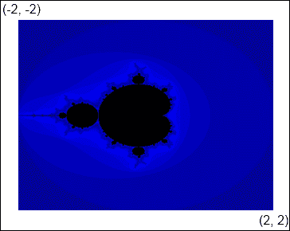
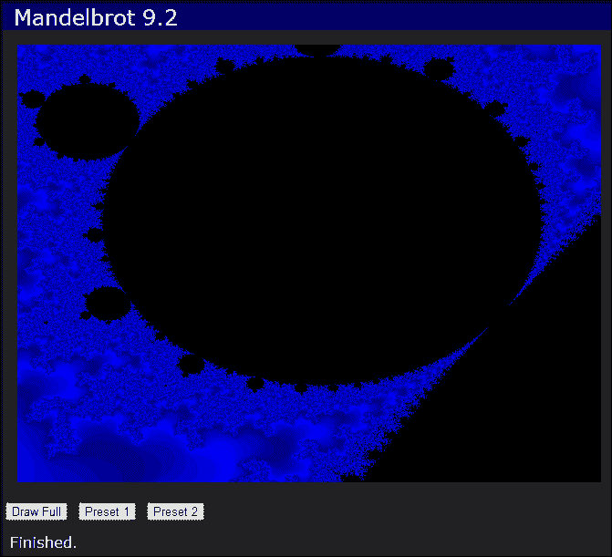

# 第九章：Web Workers Unite

> "如果你想要有创造力的工作者，就给他们足够的玩耍时间。"

*—约翰·克里斯*

*在本章中，我们将学习如何使用 HTML5 web worker 在另一个线程中运行后台进程。我们可以使用这个功能使具有长时间运行进程的应用程序更具响应性。我们将使用 web worker 在画布上绘制 Mandelbrot 分形，以异步方式生成它，而不会锁定浏览器窗口。*

在本章中，我们将学习以下主题：

+   通过使用 web workers 使 web 应用程序更具响应性的方法

+   如何启动和管理 web worker

+   如何与 web worker 通信并来回发送数据

+   如何使用 web worker 在画布上绘制 Mandelbrot 分形

+   调试 web workers 的技巧

# Web workers

Web workers 提供了一种在 Web 应用程序的主线程之外的后台线程中运行 JavaScript 代码的方式。尽管由于其异步性质，JavaScript 可能看起来是多线程的，但事实上只有一个线程。如果你用一个长时间运行的进程来占用这个线程，网页将变得无响应，直到进程完成。

过去，您可以通过将长时间运行的进程分成块来缓解这个问题，以便一次处理一点工作。在每个块之后，您将调用`setTimeout()`，将超时值设为零。当您调用`setTimeout()`时，实际上会在指定的时间后将事件放入事件队列。这允许队列中已经存在的其他事件有机会被处理，直到您的计时器事件到达队列的最前面。

如果您以前使用过线程，您可能会意识到很容易遇到并发问题。一个线程可能正在处理与另一个线程相同的数据，这可能导致数据损坏，甚至更糟糕的是死锁。幸运的是，web worker 不会给我们太多机会遇到并发问题。web worker 不允许访问非线程安全的组件，如 DOM。它们也无法访问`window`、`document`或`parent`对象。

然而，这种线程安全是有代价的。由于 web worker 无法访问 DOM，它无法执行任何操作来操作页面元素。它也无法直接操作主线程的任何数据结构。此时你可能会想，如果 web worker 无法访问任何东西，那它有什么用呢？

好吧，web worker 无法访问主线程中的数据，但它们可以通过消息来回传递数据。然而，需要记住的关键一点是，传递给 web worker 的任何数据在发送之前都会被序列化，然后在另一端进行反序列化，以便它在副本上工作，而不是原始数据。然后，web worker 可以对数据进行一些处理，并再次使用序列化将其发送回主线程。只需记住，传递大型数据结构会有一些开销，因此您可能仍然希望将数据分块并以较小的批次进行处理。

### 注意

一些浏览器确实支持在不复制的情况下传输对象，这对于大型数据结构非常有用。目前只有少数浏览器支持这一功能，所以我们在这里不会涉及。

## 生成 web worker

web worker 的代码在其自己的 JavaScript 文件中定义，与主应用程序分开。主线程通过创建一个新的`Worker`对象并给它文件路径来生成一个 web worker：

```html
var myWorker = new Worker("myWorker.js");
```

应用程序和 worker 通过发送消息进行通信。要接收消息，我们使用`addEventListener()`为 worker 添加消息事件处理程序：

```html
myWorker.addEventListener("message", function (event) {
  alert("Message from worker: " + event.data);
}, false);
```

一个`event`对象作为参数传递给事件处理程序。它有一个`data`字段，其中包含从 worker 传回的任何数据。`data`字段可以是任何可以用 JSON 表示的东西，包括字符串、数字、数据对象和数组。

创建 Worker 后，可以使用`postMessage()`方法向其发送消息。它接受一个可选参数，即要发送给 Worker 的数据。在这个例子中，它只是一个字符串：

```html
myWorker.postMessage("start");
```

## 实现 Web Worker

如前所述，Web Worker 的代码在单独的文件中指定。在 Worker 内部，您还可以添加一个事件监听器，以接收来自应用程序的消息：

```html
self.addEventListener("message", function (event) {
  // Handle message
}, false);
```

在 Worker 内部，有一个`self`关键字，它引用 Worker 的全局范围。使用`self`关键字是可选的，就像使用`window`对象一样（所有全局变量和函数都附加到`window`对象）。我们在这里使用它只是为了显示上下文。

Worker 可以使用`postMessage()`向主线程发送消息。它的工作方式与主线程完全相同：

```html
self.postMessage("started");
```

当 Worker 完成后，可以调用`close()`方法来终止 Worker。关闭后，Worker 将不再可用：

```html
self.close();
```

您还可以使用`importScripts()`方法将其他外部 JavaScript 文件导入 Worker。它接受一个或多个脚本文件的路径：

```html
importScripts("script1.js", "script2.js");
```

这对于在主线程和 Web Worker 中使用相同的代码库非常有效。

# 行动时间 - 使用 Web Worker

让我们创建一个非常简单的应用程序，获取用户的名称并将其传递给 Web Worker。Web Worker 将向应用程序返回一个“hello”消息。此部分的代码可以在`Chapter 9/example9.1`中找到。

### 注意

在某些浏览器中，Web Worker 不起作用，除非您通过 IIS 或 Apache 等 Web 服务器运行它们。

首先，我们创建一个包含`webWorkerApp.html`、`webWorkerApp.css`和`webWorkerApp.js`文件的应用程序。我们在 HTML 中添加一个文本输入字段，询问用户的名称，并添加一个响应部分，用于显示来自 Worker 的消息：

```html
<div id="main">
    <div>
        <label for="your-name">Please enter your name: </label>
        <input type="text" id="your-name"/>
        <button id="submit">Submit</button>
    </div>
    <div id="response" class="hidden">
        The web worker says: <span></span>
    </div>
</div>
```

在`webWorkerApp.js`中，当用户点击提交按钮时，我们调用`executeWorker()`方法：

```html
function executeWorker()
{
    var name = $("#your-name").val();
    var worker = new Worker("helloWorker.js");
    worker.addEventListener("message", function(event) {
        $("#response").fadeIn()
            .children("span").text(event.data);
    });
    worker.postMessage(name);
}
```

首先我们获取用户在文本字段中输入的名称。然后我们创建一个在`helloWorker.js`中定义了其代码的新的`Worker`。我们添加一个消息事件监听器，从 Worker 那里获取消息并将其放入页面的响应部分。最后，我们使用`postMessage()`将用户的名称发送给 Worker 以启动它。

现在让我们在`helloWorker.js`中创建我们的 Web Worker 的代码。在那里，我们添加了从主线程获取消息并发送消息的代码：

```html
self.addEventListener("message", function(event) {
    sayHello(event.data);
});
function sayHello(name)
{
    self.postMessage("Hello, " + name);
}
```

首先，我们添加一个事件监听器来获取应用程序的消息。我们从`event.data`字段中提取名称，并将其传递给`sayHello()`函数。`sayHello()`函数只是在用户的名称前面加上“Hello”，然后使用`postMessage()`将消息发送回应用程序。在主应用程序中，它获取消息并在页面上显示它。

## *刚刚发生了什么？*

我们创建了一个简单的应用程序，获取用户的名称并将其传递给 Web Worker。Web Worker 将消息发送回应用程序，在页面上显示 - 这就是使用 Web Worker 的简单方法。

# Mandelbrot 集

演示如何使用 Web Worker 来进行一些真正的处理，我们将创建一个绘制 Mandelbrot 分形的应用程序。绘制 Mandelbrot 需要相当多的处理能力。如果不在单独的线程中运行，应用程序在绘制时会变得无响应。

绘制 Mandelbrot 是一个相对简单的过程。我们将使用**逃逸时间算法**。对于图像中的每个像素，我们将确定达到临界逃逸条件需要多少次迭代。迭代次数决定像素的颜色。如果我们在最大迭代次数内未达到逃逸条件，则被视为在 Mandelbrot 集内，并将其涂黑。

有关此算法和 Mandelbrot 集的更多信息，请参阅维基百科页面：

[`en.wikipedia.org/wiki/Mandelbrot_set`](http://en.wikipedia.org/wiki/Mandelbrot_set)

# 行动时间-实施算法

让我们在一个名为`mandelbrotGenerator.js`的新文件中创建一个`MandelbrotGenerator`对象。这个对象将实现生成 Mandelbrot 的算法。构造函数接受画布的宽度和高度，以及 Mandelbrot 的边界：

```html
function MandelbrotGenerator(canvasWidth, canvasHeight, left, top,right, bottom)
    {
```

接下来我们定义算法使用的变量：

```html
    var scalarX = (right - left) / canvasWidth,
        scalarY = (bottom - top) / canvasHeight,
        maxIterations = 1000,
        abort = false,
        inSetColor = { r: 0x00, g: 0x00, b: 0x00 },
        colors = [ /* array of color objects */ ];
```

`scalarX`和`scalarY`变量用于将 Mandelbrot 坐标转换为画布坐标。它们是通过将 Mandelbrot 的宽度或高度除以画布的宽度或高度来计算的。例如，虽然画布可能设置为 640x480 像素，但 Mandelbrot 的边界可能是左上角(-2，-2)和右下角(2，2)。在这种情况下，Mandelbrot 的高度和宽度都是 4：



接下来，我们将算法的最大迭代次数设置为 1000。如果您将其设置得更高，您将获得更好的结果，但计算时间将更长。使用 1000 提供了处理时间和可接受结果之间的良好折衷。`abort`变量用于停止算法。`inSetColor`变量控制 Mandelbrot 集中的像素的颜色。我们将其设置为黑色。最后，有一个颜色数组，用于给不在集合中的像素上色。

让我们首先编写这些方法，将画布坐标转换为 Mandelbrot 坐标。它们只是将位置乘以标量，然后加上顶部或左侧的偏移量：

```html
function getMandelbrotX(x)
{
    return scalarX * x + left;
}
function getMandelbrotY(y)
{
    return scalarY * y + top;
}
```

现在让我们在一个名为`draw()`的公共方法中定义算法的主循环。它以要绘制的画布上的图像数据作为参数：

```html
this.draw = function(imageData)
{
    abort = false;

    for (var y = 0; y < canvasHeight; y++)
    {
        var my = getMandelbrotY(y);
        for (var x = 0; x < canvasWidth; x++)
        {
            if (abort) return;
            var mx = getMandelbrotX(x);
            var iteration = getIteration(mx, my);
            var color = getColor(iteration);
            setPixel(imageData, x, y, color);
        }
    }
};
```

在外部循环中，我们遍历画布中所有行的像素。在这个循环内，我们调用`getMandelbrotY()`，传入画布的 y 位置，并返回 Mandelbrot 中相应的 y 位置。

接下来，我们遍历行中的所有像素。对于每个像素，我们：

1.  调用`getMandelbrotX()`，传入画布的 x 位置，并返回 Mandelbrot 中相应的 x 位置。

1.  调用`getIterations()`，传入 Mandelbrot 的 x 和 y 位置。这个方法将找到达到逃逸条件所需的迭代次数。

1.  调用`getColor()`，传入迭代次数。这个方法获取迭代次数的颜色。

1.  最后，我们调用`setPixel()`，传入图像数据、x 和 y 位置以及颜色。

接下来让我们实现`getIterations()`方法。这是我们确定像素是否在 Mandelbrot 集合内的地方。它以 Mandelbrot 的 x 和 y 位置作为参数：

```html
function getIterations(x0, y0)
{
    var x = 0,
        y = 0,
        iteration = 0;
    do
    {
        iteration++;
        if (iteration >= maxIterations) return -1;
        var xtemp = x * x - y * y + x0;
        y = 2 * x * y + y0;
        x = xtemp;
    }
    while (x * x + y * y < 4);

    return iteration;
}
```

首先，我们将工作的`x`和`y`位置初始化为零，`iteration`计数器初始化为零。接下来，我们开始一个`do-while`循环。在循环内，我们递增`iteration`计数器，如果它大于`maxIterations`，我们返回`-1`。这表示逃逸条件未满足，该点在 Mandelbrot 集合内。

然后我们计算用于检查逃逸条件的 x 和 y 变量。然后我们检查条件，以确定是否继续循环。一旦满足逃逸条件，我们返回找到它所需的迭代次数。

现在我们将编写`getColor()`方法。它以迭代次数作为参数：

```html
function getColor(iteration)
{
    if (iteration < 0) return inSetColor;
    return colors[iteration % colors.length];
}
```

如果`iteration`参数小于零，这意味着它在 Mandelbrot 集合中，我们返回`inSetColor`对象。否则，我们使用模运算符在颜色数组中查找颜色对象，以限制迭代次数的长度。

最后，我们将编写`setPixel()`方法。它接受图像数据、画布 x 和 y 位置以及颜色：

```html
function setPixel(imageData, x, y, color)
{
    var d = imageData.data;
    var index = 4 * (canvasWidth * y + x);
    d[index] = color.r;
    d[index + 1] = color.g;
    d[index + 2] = color.b;
    d[index + 3] = 255; // opacity
}
```

这应该看起来非常熟悉，就像第五章中的内容，我们学习了如何操作图像数据。首先，我们找到图像数据数组中的像素的索引。然后，我们从`color`对象中设置每个颜色通道，并将不透明度设置为`255`的最大值。

## *刚刚发生了什么？*

我们实现了绘制 Mandelbrot 到画布图像数据的算法。每个像素要么设置为黑色，要么根据找到逃逸条件所需的迭代次数设置为某种颜色。

# 创建 Mandelbrot 应用程序

现在我们已经实现了算法，让我们创建一个应用程序来使用它在页面上绘制 Mandelbrot。我们将首先在没有 Web Worker 的情况下进行绘制，以展示这个过程如何使网页无响应。然后我们将使用 Web Worker 在后台绘制 Mandelbrot，以查看差异。

# 行动时间-创建 Mandelbrot 应用程序

让我们从创建一个新的应用程序开始，其中包括`mandelbrot.html`、`mandelbrot.css`和`mandelbrot.js`文件。我们还包括了之前为应用程序创建的`mandelbrotGenerator.js`。您可以在`第九章/example9.2`中找到本节的代码。

在 HTML 文件中，我们向 HTML 添加了一个`<canvas>`元素来绘制 Mandelbrot，并将大小设置为 640x480：

```html
<canvas width="640" height="480"></canvas>
```

我们还添加了三个按钮，其中预设的 Mandelbrot 边界以 JSON 格式定义为`data-settings`自定义数据属性中的数组：

```html
<button class="draw"
    data-settings="[-2, -2, 2, 2]">Draw Full</button>
<button class="draw"
    data-settings="[-0.225, -0.816, -0.197, -0.788]">Preset 1
</button>
<button class="draw"
    data-settings="[-1.18788, -0.304, -1.18728, -0.302]">Preset 2
</button>
```

现在让我们进入 JavaScript 文件，并添加调用 Mandelbrot 生成器的代码。在这里，我们定义变量来保存对画布及其上下文的引用：

```html
function MandelbrotApp()
{
    var version = "9.2",
        canvas = $("canvas")[0],
        context = canvas.getContext("2d");
```

接下来，我们添加一个`drawMandelbrot()`方法，当其中一个按钮被点击时将被调用。它以 Mandelbrot 的边界作为参数进行绘制：

```html
function drawMandelbrot(left, top, right, bottom)
{
    setStatus("Drawing...");
    var imageData =
        context.getImageData(0, 0, canvas.width, canvas.height);
    var generator = new MandelbrotGenerator(canvas.width, canvas.height, 
        left, top, right, bottom);
    generator.draw(imageData);
    context.putImageData(imageData, 0, 0)
    setStatus("Finished.");
}
```

首先，我们在状态栏中显示**绘制中...**的状态。然后，我们获取整个画布的图像数据。接下来，我们创建`MandelbrotGenerator`对象的一个新实例，传入画布和边界设置。然后我们调用它的`draw()`方法，传入图像数据。当它完成时，我们将图像数据绘制回画布，并将状态设置为**完成**。

我们需要做的最后一件事是更新应用程序的`start()`方法：

```html
this.start = function()
{
    $("#app header").append(version);

    $("button.draw").click(function() {
        var data = $(this).data("settings");
        drawMandelbrot(data[0], data[1], data[2], data[3]);
    });

    setStatus("ready");
};
```

在这里，我们为所有按钮添加了一个点击事件处理程序。当点击按钮时，我们获取`settings`自定义数据属性（一个数组），并将值传递给`drawMandelbrot()`进行绘制。

就是这样-让我们在浏览器中打开并查看一下。根据您使用的浏览器（有些比其他浏览器快得多）和您系统的速度，Mandelbrot 应该需要足够长的时间来绘制，以至于您会注意到页面已经变得无响应。如果您尝试点击其他按钮，将不会发生任何事情。还要注意，尽管我们调用了`setStatus("Drawing...")`，但您从未看到状态实际上发生变化。这是因为绘图算法在运行时有机会更新页面上的文本之前就接管了控制权：



## *刚刚发生了什么？*

我们创建了一个应用程序来绘制 Mandelbrot 集，使用了我们在上一节中创建的绘图算法。它还没有使用 Web Worker，因此在绘制时页面会变得无响应。

# 行动时间-使用 Web Worker 的 Mandelbrot

现在我们将实现相同的功能，只是这次我们将使用 Web Worker 来将处理转移到另一个线程。这将释放主线程来处理页面更新和用户交互。您可以在`第九章/example9.3`中找到本节的源代码。

让我们进入 HTML 并添加一个复选框，我们可以选择是否使用 Web Worker。这将使在浏览器中比较结果更容易：

```html
<input type="checkbox" id="use-worker" checked />
<label for="use-worker">Use web worker</label>
```

我们还将添加一个停止按钮。以前没有 Web Worker 的情况下无法停止，因为 UI 被锁定，但现在我们将能够实现它：

```html
<button id="stop">Stop Drawing</button>
```

现在让我们继续在一个名为`mandelbrotWorker.js`的新文件中创建我们的 Web Worker。我们的 worker 需要使用`MandelbrotGenerator`对象，因此我们将该脚本导入 worker：

```html
importScripts("mandelbrotGenerator.js");
```

现在让我们为 worker 定义消息事件处理程序。在接收到包含绘制 Mandelbrot 所需数据的消息时，worker 将开始生成它：

```html
self.addEventListener("message", function(e)
{
    var data = e.data;
    var generator = new MandelbrotGenerator(data.width, data.height,
        data.left, data.top, data.right, data.bottom);
    generator.draw(data.imageData);
    self.postMessage(data.imageData);
    self.close();
});
```

首先，我们创建`MandelbrotGenerator`的一个新实例，传入我们从主应用程序线程获取的值，包括画布的宽度和高度以及 Mandelbrot 边界。然后，我们调用生成器的`draw()`方法，传入消息中也包含的图像数据。生成器完成后，我们通过调用`postMessage()`将包含绘制 Mandelbrot 的图像数据传递回主线程。最后，我们调用`close()`来终止 worker。

至此，worker 就完成了。让我们回到我们的主应用程序对象`MandelbrotApp`，并添加代码，以便在单击按钮时启动 Web Worker。

在`mandelbrot.js`中，我们需要向应用程序对象添加一个名为 worker 的全局变量，该变量将保存对 Web Worker 的引用。然后，我们重写`drawMandelbrot()`以添加一些新代码来启动 worker：

```html
function drawMandelbrot(left, top, right, bottom)
{
    if (worker) return;

    context.clearRect(0, 0, canvas.width, canvas.height);
    setStatus("Drawing...");

    var useWorker = $("#use-worker").is(":checked");
    if (useWorker)
    {
        startWorker(left, top, right, bottom);
    }
    else
    {
        /* Draw without worker */
    }
}
```

首先，我们检查`worker`变量是否已设置。如果是，则 worker 已经在运行，无需继续。然后我们清除画布并设置状态。接下来，我们检查**使用 worker**复选框是否被选中。如果是，我们调用`startWorker()`，传入 Mandelbrot 边界参数。`startWorker()`方法是我们创建 Web Worker 并启动它的地方：

```html
function startWorker(left, top, right, bottom)
{
    worker = new Worker("mandelbrotWorker.js");
    worker.addEventListener("message", function(e)
    {
        context.putImageData(e.data, 0, 0)
        worker = null;
        setStatus("Finished.");
    );

    var imageData =
        context.getImageData(0, 0, canvas.width, canvas.height);
    worker.postMessage({
        imageData: imageData,
        width: canvas.width,
        height: canvas.height,
        left: left,
        top: top,
        right: right,
        bottom: bottom
    });
}
```

首先，我们创建一个新的`Worker`，将`mandelbrotWorker.js`的路径传递给它。然后，我们向 worker 添加一个消息事件处理程序，当 worker 完成时将调用该处理程序。它获取从 worker 返回的图像数据并将其绘制到画布上。

接下来我们启动 worker。首先，我们从画布的上下文中获取图像数据。然后，我们将图像数据、画布的宽度和高度以及 Mandelbrot 边界放入一个对象中，通过调用`postMessage()`将其传递给 worker。

还有一件事要做。我们需要实现停止按钮。让我们编写一个`stopWorker()`方法，当单击停止按钮时将调用该方法：

```html
function stopWorker()
{
    if (worker)
    {
        worker.terminate();
        worker = null;
        setStatus("Stopped.");
    }
}
```

首先，我们通过检查`worker`变量是否已设置来检查 worker 是否正在运行。如果是，我们调用 worker 的`terminate()`方法来停止 worker。调用`terminate()`相当于在 worker 内部调用`self.close()`。

## *刚刚发生了什么?*

我们实现了一个可以从后台线程绘制 Mandelbrot 的 Web Worker。这使用户可以在 Mandelbrot 绘制时继续与页面交互。我们通过添加一个停止按钮来演示这一点，该按钮可以停止绘制过程。您还会注意到，在绘制分形时，**正在绘制...**状态消息现在会显示出来。

## 试试看

我们 Mandelbrot 应用程序的一个问题是，我们正在序列化和传输整个画布的图像数据到 Web Worker，然后再传回。在我们的示例中，这是 640 * 480 * 4 字节，或 1,228,800 字节。那是 1.2 GB！看看您是否能想出一种将 Mandelbrot 的绘制分成更小块的方法。如果您想看看我是如何做到的，请查看`第九章/示例 9.4`。

# 调试 Web Worker

调试 Web Worker 可能很困难。您无法访问`window`对象，因此无法调用`alert()`来显示消息，也无法使用`console.log()`来写入浏览器的 JavaScript 控制台。您也无法向 DOM 写入消息。甚至无法附加调试器并逐步执行代码。那么，一个可怜的开发人员该怎么办呢？

您可以为 worker 添加错误监听器，以便在 worker 线程内发生任何错误时收到通知：

```html
worker.addEventListener("error", function(e)
{
    alert("Error in worker: " + e.filename + ", line:" + e.lineno + ", " + e.message);
});
```

错误处理程序传入的事件对象包含`filename`、`lineno`和`message`字段。通过这些字段，您可以准确地知道错误发生的位置。

但是，如果你没有收到错误，事情只是不正常工作呢？首先，我建议你将所有处理工作的代码放在一个单独的文件中，就像我们在`mandelbrotGenerator.js`中所做的那样。这样可以让你从主线程以及工作者中运行代码。如果需要调试，你可以直接从应用程序运行它，并像平常一样进行调试。

您可以使用的一个调试技巧是在 Web 工作者中定义一个`console`对象，将消息发送回主线程，然后可以使用窗口的控制台记录它们：

```html
var console = {
    log: function(msg)
    {
        self.postMessage({
            type: "log",
            message: msg
        });
    }
};
```

然后在你的应用程序中，监听消息并记录它：

```html
worker.addEventListener("message", function(e)
{
    if (e.data.type == "log")
    {
        console.log(e.data.message);
    }
});
```

## 小测验

Q1. 如何向 Web 工作者发送数据？

1.  你不能向工作线程发送数据。

1.  使用`postMessage()`方法。

1.  使用`sendData()`方法。

1.  使用`sendMessage()`方法。

Q2. Web 工作者在主线程中可以访问哪些资源？

1.  DOM。

1.  `window`对象。

1.  `document`对象。

1.  以上都不是。

# 摘要

在本章中，我们创建了一个应用程序来绘制 Mandelbrot 分形图，以了解如何使用 HTML Web 工作者在后台线程中执行长时间运行的进程。这使得浏览器能够保持响应并接受用户输入，同时生成图像。

我们在本章中涵盖了以下概念：

+   如何使用 Web 工作者使 Web 应用程序更具响应性

+   如何创建 Web 工作者并启动它

+   如何在主线程和 Web 工作者之间发送消息和数据

+   如何使用 Web 工作者绘制 Mandelbrot

+   如何捕获从 Web 工作者抛出的错误

+   如何调试 Web 工作者

在下一章和最后一章中，我们将学习如何通过组合和压缩其 JavaScript 文件来准备 Web 应用程序以发布。这将使应用程序在网络上的印记更轻。此外，我们将看到如何使用 HTML5 应用程序缓存来缓存应用程序，以便在用户离线时运行。
