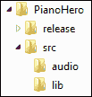
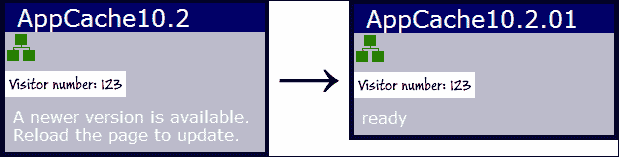
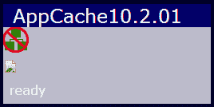

# 第十章：将应用程序发布到野外

> “互联网是一个充满了自己的游戏、语言和手势的荒野，通过它们我们开始分享共同的感受。”
> 
> - 艾未未

*在本章中，我们将学习如何为发布准备 Web 应用程序。首先，我们将讨论如何压缩和合并 JavaScript 文件以加快下载速度。然后，我们将看看如何使用 HTML5 应用程序缓存接口使您的应用程序离线可用。*

在本章中，我们将学习：

+   如何合并和压缩 JavaScript 文件

+   如何创建一个命令行脚本来准备一个应用程序发布

+   如何使用 HTML5 应用程序缓存 API 使页面及其资源离线可用

+   如何创建一个缓存清单文件来确定哪些资源被缓存

+   如何确定应用程序的缓存何时已更新

# 合并和压缩 JavaScript

过去，JavaScript 开发人员的共识是你应该将所有的代码写在一个文件中，因为下载多个脚本文件会导致大量不必要的网络流量，并减慢加载时间。虽然减少下载文件的数量确实更好，但在一个文件中编写所有的代码很难阅读和维护。我们在其他语言中不会这样写代码，那么为什么我们在 JavaScript 中要这样做呢？

幸运的是，这个问题有一个解决方案：JavaScript 压缩器。压缩器将应用程序的所有 JavaScript 源文件合并成一个文件，并通过将本地变量重命名为最小可能的名称，删除空格和注释来压缩它们。我们既可以利用多个源代码文件进行开发的好处，又可以在发布应用程序时获得单个 JavaScript 文件的所有好处。你可以把它看作是将你的源代码编译成一个紧凑的可执行包。

有许多 JavaScript 压缩器可供选择。你可以在网上找到许多。这些压缩器的问题在于你必须复制你的源代码并将其粘贴到一个网页表单中，然后再将其复制回到一个文件中。这对于大型应用程序来说效果不太好。我建议你使用可以从命令提示符运行的压缩应用程序之一，比如雅虎的 YUI 压缩器或谷歌的 Closure 编译器：

+   [`developers.google.com/closure/`](https://developers.google.com/closure/)

+   [`yui.github.io/yuicompressor/`](http://yui.github.io/yuicompressor/)

YUI 和 Closure 都很容易使用，并且工作得非常好。它们都提供有关糟糕代码的警告（但不是相同的警告）。它们都是用 Java 编写的，因此需要安装 Java 运行时。我不能说哪一个比另一个更好。我选择 YUI 的唯一原因是如果我还想要压缩 CSS，因为 Closure 不支持它。

# 行动时间-创建一个发布脚本

为了为 JavaScript 准备发布，最简单的方法是创建一个可以从命令行运行的脚本。在这个例子中，我们将使用 YUI 压缩器，但它几乎与 Closure 相同。唯一的区别是命令行参数。在这个例子中，我们创建一个可以从 Windows 命令行运行的命令行脚本，它将获取我们在第七章中编写的钢琴英雄应用程序，*钢琴英雄*，并将其打包发布。您可以在`第十章/example10.1`中找到本节的代码。

在我们开始之前，我们需要为应用程序定义一个文件夹结构。我喜欢为应用程序创建一个基本文件夹，其中包含一个`src`文件夹和一个`release`文件夹。基本文件夹包含命令行批处理脚本。`src`文件夹包含所有的源代码和资源。`release`文件夹将包含压缩的 JavaScript 文件和运行应用程序所需的所有其他资源：



现在让我们创建我们的批处理脚本文件，并将其命名为`release.bat`。我们需要告诉 YUI 要压缩哪些文件。有几种方法可以做到这一点。我们可以将所有 JavaScript 文件连接成一个文件，然后引用该文件，或者传入所有单独的文件列表。您使用的方法取决于您的需求。

如果您需要按特定顺序处理文件，或者文件不多，那么您可以将它们作为参数单独指定。如果您的应用程序中有很多文件，并且您不担心顺序，那么最简单的方法可能就是将它们连接成一个文件。在这个例子中，我们将使用`type`命令将所有 JavaScript 文件连接成一个名为`pianoHero.collated.js`的文件。

```html
type src\*.js > pianoHero.collated.js
```

我们使用`type`命令在`src`文件夹中找到所有`.js`文件，并将它们写入一个名为`pianoHero.collated.js`的文件中。请注意，这不包括`lib`文件夹中的文件。我喜欢将它们分开，但如果你愿意的话，你当然可以包括任何外部库（如果它们的许可证允许）。现在我们将执行压缩器，传入合并的 JavaScript 文件：

```html
java -jar ..\yui\yuicompressor-2.4.6.jar --type js -o release\pianoHero.min.js pianoHero.collated.js
```

我们启动 Java 运行时，告诉它在哪里找到 YUI 压缩器的 JAR 文件。我们传入一个文件类型参数`js`，因为我们正在压缩 JavaScript（YUI 也可以压缩 CSS）。`-o`参数告诉它输出的位置。最后是 JavaScript 文件（如果有多个文件）。

现在我们在`release`文件夹中有一个`pianoHero.min.js`文件。我们仍然需要将所有其他资源复制到`release`文件夹，包括 HTML 和 CSS 文件，jQuery 库和音频文件：

```html
xcopy /Y src\*.html release
xcopy /Y src\*.css release
xcopy /Y /S /I src\lib release\lib
xcopy /Y /S /I src\audio release\audio
```

我们使用`xcopy`命令将`pianoHero.html`，`pianoHero.css`，`lib`文件夹中的所有内容以及`audio`文件夹中的所有内容复制到`release`文件夹中。此时，我们在`release`文件夹中有运行应用程序所需的一切。

还有最后一件事要做。我们需要删除 HTML 文件中过时的`<script>`元素，并用指向我们压缩后的 JavaScript 文件的元素替换它们。这部分不容易自动化，所以我们需要打开文件并手动操作：

```html
<head>
    <title>Piano Hero</title>
    <link href="pianoHero.css" rel="StyleSheet" />
    <script src="img/jquery-1.8.1.min.js"></script>
    <script src="img/strong>"></script>
</head>
```

就是这样。现在在浏览器中打开应用程序，进行一次烟雾测试，确保一切仍然按照您的期望工作，然后发布它！

## *刚刚发生了什么？*

我们创建了一个 Windows 命令行脚本，将所有 JavaScript 源文件合并为一个文件，并使用 YUI 压缩器进行压缩。我们还将运行应用程序所需的所有资源复制到`release`文件夹中。最后，我们将脚本引用更改为压缩后的 JavaScript 文件。

## 尝试一下

YUI 压缩器还可以压缩 CSS。在发布脚本中添加代码来压缩 CSS 文件。

# HTML5 应用程序缓存

HTML5 应用程序缓存 API 提供了一种缓存网页使用的文件和资源的机制。一旦缓存，就好像用户在他们的设备上下载并安装了您的应用程序。这允许应用程序在用户未连接到互联网时离线使用。

### 注意

浏览器可能会限制可以缓存的数据量。一些浏览器将其限制为 5MB。

使应用程序被缓存的关键是缓存清单文件。这个文件是一个简单的文本文件，包含了应该被缓存的资源的信息。它被`<html>`元素的`manifest`属性引用：

```html
<html manifest="myapp.appcache">
```

在清单文件中，您可以指定要缓存或不缓存的资源。该文件可以有三个部分：

+   `CACHE`：这是默认部分，列出要缓存的文件。声明此部分标题是可选的。在 URI 中不允许使用通配符。

+   `网络`：此部分列出需要网络连接的文件。对这些文件的请求将绕过缓存。允许使用通配符。

+   `FALLBACK`：这个部分列出了如果资源在离线状态下不可用的备用文件。每个条目包含原始文件的 URI 和备用文件的 URI。通配符是允许的。两个 URI 必须是相对的，并且来自应用程序的同一个域。

### 注意

缓存清单文件可以有任何文件扩展名，但必须以 text/cache-manifest 的 MIME 类型传递。你可能需要在你的 Web 服务器中将你使用的扩展名与这个 MIME 类型关联起来。

需要注意的一件重要的事情是，一旦应用程序的文件被缓存，只有这些文件的版本会被使用，即使它们在服务器上发生了变化。应用程序缓存中的资源可以更新的方式只有两种：

+   当清单文件发生变化时

+   当用户清除浏览器对你的应用程序的数据存储时

我建议在开发应用程序时，将缓存清单文件放在与 HTML 文件不同的文件夹中。你不希望在编写代码时缓存文件。将它放在应用程序的基本文件夹中，以及你的发布脚本，并将它复制到你的脚本中的`release`文件夹中。

是否缓存你的应用程序取决于你的应用程序的性质。如果它严重依赖于对服务器的 Ajax 调用来工作，那么使它离线可用就没有意义。然而，如果你可以编写你的应用程序，使其在离线状态下本地存储数据，那么这可能是值得的。你应该确定维护缓存清单的开销是否对你的应用程序有益。

# 行动时间 - 创建缓存清单

让我们从我们的模板中创建一个简单的应用程序，以演示如何使用缓存清单。它包含 HTML、CSS 和 JavaScript 文件，以及一个`image`文件夹中的一些图片。你可以在`Chapter 10/example10.2`中找到这个示例的源代码。

现在让我们创建一个名为`app.appcache`的缓存清单文件：

```html
CACHE MANIFEST
# v10.2.01
```

清单文件必须始终以`CACHE MANIFEST`开头。在第二行我们有一个注释。以井号(`#`)开头的行是注释。建议在清单文件的注释中有某种版本标识或发布日期。正如之前所述，导致应用程序重新加载到缓存中的唯一方法是更改清单文件。每次发布新版本时，你都需要更新这个版本标识。

接下来，我们添加我们想要缓存的文件。如果你愿意，你可以添加`CACHE`部分的标题，但这不是必需的：

```html
CACHE:
app.html
app.css
app.js
lib/jquery-1.8.1.min.js
```

不幸的是，在这个部分中不允许使用通配符，所以你需要明确列出每个文件。对于一些应用程序，比如带有所有音频文件的钢琴英雄，可能需要大量输入！

接下来让我们定义`NETWORK`部分。现在你可能会想，这部分有什么意义？我们已经列出了所有我们想要被缓存的文件。那么为什么需要列出你不想被缓存的文件呢？原因是一旦被缓存，你的应用程序将只从缓存中获取文件，即使在线。如果你想在应用程序中使用非缓存资源，你需要在这个部分中包含它们。

例如，假设我们在页面上有一个用于跟踪页面点击的站点跟踪图像。如果我们不将它添加到`NETWORK`部分，即使用户在线，对它的请求也永远不会到达服务器。出于这个例子的目的，我们将使用一个静态图像文件。实际上，这可能是 PHP 或其他服务器端请求处理程序，返回一个图像：

```html
NETWORK:
images/tracker.png
```

现在让我们定义`FALLBACK`部分。假设我们想在我们的应用程序中显示一张图片，让用户知道他们是在线还是离线。这就是我们指定从在线到离线图片的备用的地方：

```html
FALLBACK:
online.png offline.png
```

这就是我们的清单文件。现在在浏览器中打开应用程序以便它被缓存。然后进入 JavaScript 文件并更改应用程序对象中`version`变量的值。现在刷新页面；什么都不应该改变。接下来进入清单文件并更改版本，再次刷新。仍然没有改变。发生了什么？

还记得我之前说过的吗？清单文件发生更改会导致应用程序重新加载？虽然这是真的，但在页面从缓存加载后，清单文件不会被检查是否有更改。因此用户需要两次重新加载页面才能获得更新的版本。幸运的是，我们可以在 JavaScript 中检测清单文件何时发生更改，并向用户提供消息，表明有新版本可用的方法。

让我们添加一个名为`checkIfUpdateAvailable()`的 JavaScript 方法来检查缓存何时已更新：

```html
function checkIfUpdateAvailable()
{
    window.applicationCache.addEventListener('updateready',
    function(e)
    {
        setStatus("A newer version is available. Reload the page to update.");
    });
}
```

首先，我们向`applicationCache`对象添加一个`updateready`事件监听器。这在浏览器发现清单文件已更改并下载了更新资源后触发。当我们收到缓存已更新的通知时，我们显示一条消息告诉用户重新加载页面。现在我们只需要在应用程序的`start()`方法中调用这个方法，我们就准备好了。

现在去更新应用程序和清单文件中的版本号并刷新页面。你应该看到更新消息显示。再次刷新页面，你会看到版本已经改变：



最后，让我们检查我们的回退。断开互联网连接并重新加载页面。你应该看到离线图像显示而不是在线图像。还要注意，它无法加载跟踪图像，因为我们将其标记为非缓存资源：



## *刚才发生了什么？*

我们学习了如何使用 HTML 应用程序缓存来缓存 Web 应用程序。我们使用清单文件定义了应该被缓存的资源，一个不被缓存的资源，以及应用程序离线时的回退资源。我们还学习了如何以编程方式检查缓存何时已更新。

## 弹出测验

Q1. JavaScript 压缩器*不*做什么？

1.  将你的代码压缩成一个压缩文件

1.  将你的 JavaScript 文件合并成一个文件

1.  从 JavaScript 文件中删除所有空格和注释

1.  将本地变量重命名为尽可能小的名称

Q2. 资源何时在应用程序缓存中更新？

1.  当服务器上的文件发生变化时

1.  当清单文件发生更改时

1.  资源永远不会更新

1.  每次用户启动应用程序时

# 总结

在本章中，我们学习了如何将我们完成的应用程序准备好发布到世界上。我们使用 JavaScript 压缩器将所有 JavaScript 文件合并压缩成一个紧凑的文件。然后我们使用应用程序缓存 API 使应用程序离线可用。

在本章中，我们涵盖了以下概念：

+   如何使用 YUI 压缩器合并和压缩 JavaScript 文件

+   如何创建一个命令行脚本，打包我们的应用程序并准备发布

+   如何使用应用程序缓存 API 缓存应用程序并使其离线可用

+   如何创建缓存清单文件并定义缓存、非缓存和回退文件

+   如何以编程方式检查清单文件何时发生更改并提醒用户更新可用

就是这样。我们已经从创建起始模板到准备应用程序发布，覆盖了 HTML5 Web 应用程序开发。现在去开始编写你自己的 HTML5 Web 应用程序吧。我期待看到你如何使用 HTML5 来创造下一个大事件。
