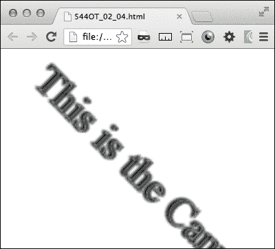
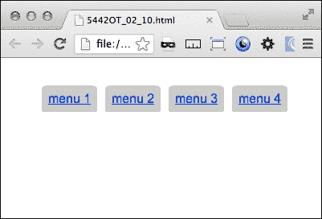

# 二、响应式排版

在本章中，您将了解:

*   创造流畅、反应灵敏的版式
*   用画布制作文本阴影
*   用画布制作内外阴影
*   使用画布旋转文本
*   使用 CSS3 旋转文本
*   用 CSS3 制作 3D 文本
*   使用 CSS3 文本遮罩为文本添加纹理
*   使用第 n 个位置伪类设置交替行的样式
*   在伪元素前后添加字符
*   制作具有相对字体大小的按钮
*   给字体添加阴影
*   用边界半径弯曲拐角

# 简介

这一章主要讨论如何做出有响应的排版。你将学习为不同类型的设备优化文本的方法，以及修饰字体的方法。所涉及的技术只是 CSS3 和 HTML5 的带有 JavaScript 的`canvas`元素。有了响应性的排版，你可以在你的文本中应用许多令人兴奋的效果。

当完成这一章时，你应该掌握一些技术，让你开始制作令人惊叹的响应性网站。这些食谱涵盖了基础知识，但是当它们与一些创造力结合在一起时，它们会让你做一些奇妙的制作。

# 创造流畅、反应灵敏的版式

这个食谱是响应排版的一个简单例子。它将演示新尺寸单位`REM`的使用。`REM` 意为 Root EM。这仅仅意味着字体的大小是相对于根字体大小的，而不是父字体，就像`EM`单位一样。

## 做好准备

没有任何进一步的讨论，让我们跳到这个食谱。去我最喜欢的伊普斯姆生成器([http://ipsum.com](http://ipsum.com))获取一些填充文字。生成至少一个段落，并将文本复制到剪贴板。

## 怎么做...

现在，将填充文本粘贴到您的 HTML 文档中，并将其包装在段落标签中。给出段落元素`class= "a"`，然后进行复制并分配新的段落`class="b"`，如下面的代码片段所示:

```html
<p class="a">
     Lorem ipsum dolor sit amet, consectetur adipiscing elit.
<p>

<p class="b">
     ultricies ut viverra massa rutrum. Nunc pharetra, ipsum ut ullamcorper placerat,
<p>
```

接下来，为基本 HTML `font-size`属性创建一个样式，然后为静态大小的段落创建一个样式，以比较字体大小的变化——类似于实验的控制组:

```html
html{font-size:12px;}
p.b{font-size:1rem;}
```

接下来创建两个`@media`查询，一个用于`orientation:portrait`，第二个用于`orientation:landscape`。在`orientation:portrait`媒体查询中，用`font-size`值`3rem`设置`"a"`类段落元素的样式。在`orientation:landscape`媒体查询中，用`1rem`的`font-size`值为`"a"`类段落设置样式。

```html
@media screen and (orientation:portrait){
p.a{font-size:3rem;}
}
@media screen and (orientation:landscape){
p.a{font-size:1rem;}
}
```

现在，当您将浏览器窗口从横向模式调整为纵向模式时，您将看到第一段的字体大小从 1:1 的基本大小变为 3:1 的基本大小。虽然这看起来很简单，但这个食谱可以变化，并在此基础上创造出许多令人印象深刻的响应排版技巧。

## 它是如何工作的...

当您的浏览器发出请求时，CSS3 `@media`查询会根据视口的宽度返回一些条件样式。它会动态加载或构建(重建)视口大小的更改。虽然你的受众中没有多少人会花太多时间在他们的浏览器中调整你的网站大小，但很容易花太多时间担心你的网站如何从一个大小转换到下一个大小。

## 另见

*   制作相对字体大小的按钮*配方*

# 用画布制作文字阴影

HTML5 给网页设计带来了一个新的元素， `<canvas>`元素。这用于使用 JavaScript 在网页上动态创建图形。

## 做好准备

`<canvas>`元素在页面上创建一个矩形区域。它的尺寸默认为 300 像素乘以 150 像素。您可以在 JavaScript 中指定不同的设置。这个食谱中的代码增长很快，所以你可以在 Packt Publishing 的网站上在线获取整个代码。

## 怎么做...

首先，用<`canvas>`元素创建一个简单的 HTML 页面:

```html
<!DOCTYPE HTML>
<html>
     <head>

     </head>
     <body>
           <canvas id="thecanvas"></canvas>
     </body>
</html>
```

JavaScript 从 DOM 中获取`canvas`元素。

```html
var canvas = document.getElementById('thecanvas');
```

然后它调用`getContext()`方法。`getContext('2d')`方法是内置的 HTML5 对象。它有许多方法来绘制文本、形状、图像等等。

```html
var ctx = canvas.getContext('2d');
```

接下来，开始在 JavaScript 中绘制文本。在这里，我们创建一个代码来绘制阴影的水平和垂直偏移、模糊和颜色。

```html
ctx.shadowOffsetX = 2;   
ctx.shadowOffsetY = 2;
ctx.shadowBlur = 2;
ctx.shadowColor = "rgba(0, 0, 0, 0.5)";
```

这里的文本及其属性是用 JavaScript 编写的，但是可以作为 DOM 中的变量传入:

```html
ctx.font = "20px Times New Roman"; 
ctx.fillStyle = "Black"; 
ctx.fillText("This is the canvas", 5, 30); 
```

回到 HTML 中，将`onload="drawCanvas();"`脚本命令添加到`body`元素。当页面加载时，JavaScript 激发并将文本及其阴影绘制到画布上。下面的截图说明了这一点:


## 它是如何工作的…

在不太深入 JavaScript 的情况下，`canvas`元素为设计者提供了一个在页面加载时将一些内容直接写入页面的地方。`body`元素的`onload="drawCanvas();"`命令触发 JavaScript，将内容绘制到画布上。

## 另见

*   用画布旋转你的文本

# 用画布制作内外阴影

这个食谱也使用`canvas`和 JavaScript 来在你的浏览器中绘制文本和效果。没有直接的方法可以使用`canvas`制作内发光或嵌入阴影效果，但是，使用描边方法，您可以在文本中模拟内阴影。

## 做好准备

这个食谱从一些已经写好的代码开始。你可以从帕克特出版公司的网站上下载。也是你在菜谱中创建的同一个代码，*用画布*制作文字阴影。这段代码应该在本地计算机上运行，不需要任何特殊的 web 服务器。你可以在这本书的网站上在线获取全部代码。

## 怎么做…

首先，用`<canvas>`元素创建一个简单的 HTML 页面。

```html
<html>
  <head>

  </head>
  <body>
    <canvas id="thecanvas"></canvas>
  </body>
</html>
```

JavaScript 从 DOM 中获取`canvas`元素。

```html
var canvas = document.getElementById('thecanvas');
```

然后称之为 `getContext()`法。`getContext('2d')`方法是内置的 HTML5 对象。它有许多方法来绘制文本、形状、图像等等。

```html
var context = canvas.getContext('2d');
```

这个脚本使用多种效果组合来制作一个内外阴影。添加一个投影和两个不同的轮廓。首先，在左上角添加一个阴影，使其变成黑色，其`context.shadowBlur`值为`2`。在此基础上，在`context.fillText`之后，在画布上下文中添加`context.strokeStyle`和`context.strokeText`。

```html
context.shadowOffsetX = -1;   
context.shadowOffsetY = -1;   
context.shadowBlur = 2;   
context.shadowColor = "#888888";   
context.textAlign = "left";
context.font = "33px Times New Roman";  
context.fillStyle = "#666";   
context.fillText("This is the Canvas", 0, 50); 
context.strokeStyle = "#555";
context.strokeText("This is the canvas", 2, 50); 
context.linewidth = 2;
```

文本看起来不是凸起的外观，而是倾斜的，具有内部发光或阴影效果。效果显示在下面的截图中:


## 它是如何工作的…

正如本食谱开头所说的，在画布上制作内影没有真正直接的方法，但是有办法将`context.fillText` 和`context.strokeStyle`方法结合起来会创造出看起来足够像内影的东西。

# 用画布旋转文本

HTML5 画布方法可以做的不仅仅是给文本着色或者添加阴影。您也可以使用它来移动或操纵画布区域中的对象。在这个食谱中，我们将旋转画布中的对象。

## 做好准备

本食谱建立在先前食谱的顶部之上。如果你跳过了它们，没关系，你可以回到前面的食谱来参考完整的代码。

## 怎么做…

一旦你设置好了之前的食谱画布，旋转的基本步骤就很容易了。在函数的开头添加一个`rotate`方法:

```html
context.rotate(Math.PI/4,0,0);
```

您可能会注意到文本从画布上旋转下来。发生了什么事？`rotate`方法旋转整个画布，并不知道其中有什么。

画布的默认小尺寸是 300 像素乘以 150 像素。更改元素的大小属性不会影响画布大小，但会扭曲在其上绘制的对象。要更改画布和绘制对象的大小，请在 JavaScript 中添加`canvas.width`和`canvas.height`属性:

```html
canvas.width=250;
canvas.height=250;
```

此外，由于画布完全自己旋转，而不是文本围绕原点旋转，因此需要将文本位置重新定位到所需位置。在这种情况下，更改填充和描边的对象偏移:

```html
context.fillText("This is the Canvas", 140, 1); 
context.strokeText("This is the Canvas ", 140, 1);
```

这在下面的截图中有描述:



## 它是如何工作的…

JavaScript 使用`rotate`方法旋转整个`canvas`元素和内部绘制的所有内容。在画布中使用`rotate`方法时，需要少量的深谋远虑。它很复杂，但却是大型响应性 web 项目中使用的完美工具。

## 另见

*   用 CSS3 食谱旋转你的文字

# 用 CSS3 旋转文本

CSS3 提供了一种简单的旋转文本的方法。`transform:rotate`属性易于实现，当项目不需要画布的复杂性时，它提供了一个简单的解决方案。

## 做好准备

在你的 HTML 文档中写一行文字。振作起来；你即将用 CSS3 旋转它。

## 怎么做…

在段落标记元素中换行:

```html
 <p class="rotate">I think, therefore I am</p>
```

然后，添加 CSS `transform`属性来旋转文本。每个浏览器呈现的方式不同，因此每个浏览器都需要自己独特的`transform`属性。但是，每个都将使用`transform`属性的子属性`rotate`，后跟旋转度数，如以下代码片段所示:

```html
<!DOCTYPE HTML>
<html>
     <head>
          <style>
     .rotate {
/* Chrome, Safari 3.1+*/
-webkit-transform: rotate(-90deg);
/* Firefox 3.5-15 */
-moz-transform: rotate(-90deg);
/* IE9 */
-ms-transform: rotate(-90deg);
/* Opera 10.50-12*/
-o-transform: rotate(-90deg);
/* IE */
transform: rotate(-90deg);
}
          </style>
     </head>
     <body >
          <p class="rotate">I think, therefore I am </p>
     </body>
</html>
```

## 它是如何工作的…

`transform`属性对元素应用 2D 或三维变换。其他可用的属性更改有`move`、`skew`和`perspective`。

## 另见

*   用画布旋转你的文本

# 用 CSS3 制作 3D 文字

在之前的食谱中，我们使用`canvas`元素创建了一个投影、斜面和一个内部阴影。有了 CSS3，我们可以这样做，让你的文字真正脱颖而出。使用 CSS3 `text-shadow`属性，我们可以使您的文本看起来像是向查看者伸出屏幕。

## 做好准备

如果你想跳过，你可以在帕克特出版公司的网站上在线获取代码。否则，如果你是边做边学的类型，让我们制作我们的 3D 文本。我们通过使用 CSS3 阴影效果的组合来创建 3D 效果。

## 怎么做…

在您的集成开发环境中，创建一个新的正文中只有一个标题的 HTML 文档。向`head`标签添加一个`style`部分，并为标题分配属性`color:#f0f0f0;`，如以下代码片段所示:

```html
<style>
     h1{ color: #f0f0f0;}
</style>
```

现在在它上面添加一系列从`0px 0px0px #666,`到`-6px -6px 0px #666;`的七个递增-递减的 X 和 Y 位置`text-shadow`属性。

```html
text-shadow: 0px 0px0px #666,
-1px -1px 0px #666, 
-2px -2px 0px #666,
-3px -3px 0px #666,
-4px -4px 0px #666,
-5px -5px 0px #666,
-6px -6px 0px #000,
```

你的标题现在跳出了屏幕。嗯，差不多了！为了确保它真的弹出屏幕，让我们给它一些更多的效果。在屏幕上构建任何 3D 对象时，提供一致的照明和阴影非常重要。既然这篇课文高高在上，就需要一个影子。

添加另一系列六个 X 和 Y 定位的`text-shadow`属性，只是这次给它们正值和较浅的颜色(`color:#ccc;`)。

```html
1px 1px 5px #ccc, 
 2px 2px 5px #ccc,
 3px 3px 5px #ccc,
 4px 4px 5px #ccc,
 5px 5px5px #ccc,
 6px 6px 5px #ccc;
```

掉落的影子说得通，但看起来还是有点假，好吧，那我们就把它带到的另一个层面；让我们模糊和变暗背景上的元素。您的`text-shadow`属性中的第三个数字创建模糊，因此添加一个 0、0、1、1、2、3 和 5 的递增模糊，如以下代码所示。此外，当您返回时，更改颜色以变暗:`#888`、`#777`、`#666`、`#555`、`#444`、`#333`和`#000`。

```html
text-shadow:0px 0px0px #888,
-1px -1px 0px #777, 
-2px -2px 1px #666,
-3px -3px 1px #555,
-4px -4px 2px #444,
-5px -5px 3px #333,
-6px -6px 4px #000,
```

现在你的头像有了真正逼真的 3D 效果。下面的截图说明了这种效果:


## 它是如何工作的…

在附近玩耍，并试验这个食谱的变化，以获得一些非常令人兴奋的印刷效果。CSS3 为排印设计带来了一个全新层次的刺激和深度，这一直是很难实现的，并且做得很好。

`text-shadow`属性可以处理大量的阴影属性。因此，您可以在离文本越来越远的地方将它们堆叠在一起。这会在文本上创建 3D 效果。

# 使用文本遮罩为文本添加纹理

CSS3 还为您提供了强大的功能，可以将图像遮罩纹理添加到带有图像的文本中。这种效果以前只能通过使用图像编辑软件创建文本的静态图像来实现。

## 做好准备

你需要一个图像来使用作为纹理蒙版。使用图像编辑软件，创建一个带有 alpha 通道的新图像。如果你没有一个可以用 alpha 通道创建 PNG 的图像编辑软件，你可以在[http://www.gimp.org](http://www.gimp.org)下载一个开源的免费图像编辑软件 GIMP 。要创建快速纹理效果，请使用分散型画笔在图像顶部附近创建纹理区域。

将其保存为 PNG 图像类型，保留 alpha 通道，在 webhost 的`images`目录中。

## 怎么做…

创建带有标题元素的 HTML，该元素包含要应用纹理蒙版的文本。然后，在其中添加一些文本:

```html
<h1 class="masked">I think, therefore I am</h1>
```

然后，添加你的 CSS 标记。这将包括一个大字体大小(炫耀你的面具纹理！)，白色字体，填充和对齐，当然还有图像蒙版属性。

### 类型

请注意，每个浏览器都需要自己的属性前缀。

```html
 h1.masked{
      font: 140px "Arial";
      color: white;
      -webkit-mask-image: url(img/mask2.png);
      -o-mask-image: url(img/mask2.png);
      -moz-mask-image: url(img/mask2.png);
      mask-image: url(img/mask2.png);
      text-shadow: 0px 0px 10px #f0f0f0;
      width: 100%;
      padding: 12% 0 12%;
      margin:0;
      text-align: center;
     }
```

CSS 效果显示在下面的截图中:


## 它是如何工作的…

蒙版图像根据蒙版图像的 alpha 裁剪出元素的可见部分。当应用在 CSS 中的文本上时，它会剪切掉被屏蔽的部分。这与图像编辑软件的 alpha 通道层非常相似。

# 使用第 n 个位置伪类设置交替行的样式

CSS3 中的位置伪类为以前需要非常复杂的解决方案的问题提供了简单的 CSS 解决方案。直到最近，为了对列表或表的交替行进行样式化，如果你足够幸运，能够在具有某种逻辑的服务器上工作，你至少可以遍历列表中的一个计数，或者如果运气不好，你必须手动对你的行进行计数。

## 做好准备

CSS3 的解决方案出奇的简单。首先，创建您的 HTML 值列表。这不一定需要一个名字间距的类，因为您可能希望这是一个贯穿整个站点的通用样式:

```html
       <ul>
           <li>
               I think, therefore I am
           </li>
           <li>
               I think before I act
           </li>
           <li>
               I think I can, I think I can
           </li>
       </ul>
```

## 怎么做…

为列表项`<li>`添加一个 CSS 属性，带有第 *n* 个位置伪类奇数值。给它一个与默认配色方案明显不同的背景颜色和字体颜色值。

```html
  ul{
width:100px;
  }
  li:nth-of-type(odd){
background-color:#333;
color:#f0f0f0;
  }
```

这将自动魔术般地样式奇数行你的名单！下面的截图说明了这种效果:


现在深呼吸；太容易了！

## 它是如何工作的…

根据[http://www.w3.org](http://www.w3.org)，`:nth-of-type(an+b)`伪类符号表示在文档树中，对于 *n* 的任意零或正整数值，一个元素前面有 *an+b-1* 兄弟，并且有一个父元素。

这是什么意思？这意味着只要它在同一个父元素中有相似的兄弟，您就可以为兄弟的最后两行输入类似 *(-n+2)* 的公式，或者保持简单，偶数或奇数，并通过 CSS 设置这些行的样式。

# 在伪元素前后添加字符

在《暮光之城 3:T4》中，CSS 的一个新特性让你能够在你的内容中添加伪标记。虽然听起来很奇怪，这种风格的用例数量惊人。您可能希望用引号将内容的一部分包装起来，而不必处理在内容或主题文件中加上引号的额外编码麻烦，这当然是明智的做法。或者，也许你想加入到推特及其散列标签和`@`标记的流行中，你可以在你的内容前面加上一个`#`或`@`符号，只需使用 CSS 标记，如下面的代码行所示:

```html
#I think, therefore I am#
```

## 做好准备

这不需要任何服务器端逻辑或花哨的步法。您所需要的就是能够在您的本地主机中启动页面，以查看它的运行情况。

## 怎么做…

这仅通过 CSS 来实现，因此您只需要在 HTML 中创建一个围绕目标内容的`class`或`id`属性:

```html
<h2 class="hashtag">I think, therefore I am</h2>
```

CSS 标记只是有点复杂，因为插入的符号遵循内容的边距和填充规则。它使用第 *n* 个`class:before`和`class:after`伪类。所以，`before`的 CSS 是`.class:before {content:"#";}`。只需将`#`替换为您想要使用的任何符号。对于`after`，将`.class:before{}`替换为`.class:after{}`。

```html
.hashtag {
     border:1px solid #ccc;
     display:block;
     width:200px;
     height:10px;
           }
.hashtag:before{
     content:"#";
           }
.hashtag:after{
     content:"#";
           }
```

## 它是如何工作的…

CSS 中的`before`和`after`伪元素在元素内容之前或之后生成内容。小心它们不是真正的内容或元素，不能用于标记或 JavaScript 事件触发器。

# 制作相对字体大小的按钮

有几个具有响应性按钮字体大小的用例。一个很好的用例例子是你网站的移动版本。当在您的 iPhone 上查看常规按钮时，它很小，很难按下。我们最不想做的事情就是通过我们对移动设备的疏忽，给移动设备用户造成不好的体验。

## 做好准备

本食谱的目标是使用`REM`的新字体度量，使响应按钮的字体大小在移动设备上查看时变大。

`REM`是 CSS3 中引入的新单位，它代表 Root `EM`，或者相对于 Root 字体大小。这与`EM`不同，后者是相对于父母而言的。使用它的一种方法是将某些元素的大小设置为正文字体的基本大小。

## 怎么做…

它可以与`@media`查询一起使用，为您的桌面和移动设备构建一个响应按钮。下面是要做的。

首先，创建一个带有一些填充文本([http://lipsum.com](http://lipsum.com))和一个`input`类型的`submit`的简单 HTML 页面。

```html
<div>
<p>Lorem ipsum dolor sit amet, consectetur adipiscing elit. Vestibulum vehicula enim at dolor ultricies ut viverra massa rutrum. Nunc pharetra, ipsum ut ullamcorper placerat,
</p>
     <input type="submit">
</div>
```

接下来，在`62.5%`处为 HTML 的基本字体大小添加 CSS，并为段落添加静态字体大小，作为实验对照组:

```html
html{font-size:62.5%;}
p{font-size:1.4rem;}
```

下一步是为移动设备创建您的`@media`查询，以及两个不同的桌面窗口大小。我正在为桌面屏幕添加一个额外的`@media`查询，所以如果你没有访问移动设备的权限，你仍然可以看到实际的响应。

在`1024px`和`1280px`为桌面设置两个`@media` 查询，为移动设备设置两个查询，一个用`max-device-width:480px`，一个用`orientation:landscape`，一个用`orientation:portrait`。

```html
@media screen and (min-width:1024px){ } 
@media screen and (min-width:1280px){ } 
@media screen and (max-device-width: 480px) and (orientation:landscape){ } 
@media screen and (max-device-width: 480px) and (orientation:portrait){ } 
```

在你的桌面`@media`查询中，给两者添加一个`input`元素；一个`font-size:1rem`值到`min-width:1024px`查询，一个`font-size:2rem`值到`min-width:1280px`查询。向这两个查询添加属性:`width:84px;`和`padding:2%;`。

在移动`@media`查询中，向两者添加`input`元素。在`orientation:landscape`媒体查询中，分配属性:`font-size:2rem;`和`width:25%;`。在`orientation:portrait`媒体查询中，分配属性:`font-size:2.4rem;`和`width:30%;`。

```html
@media screen and (min-width:1024px){    
           input{
               font-size:1rem;
               width:84px;
               padding:2%;}
       } 
@media screen and (min-width:1280px){    
     input{
          font-size:2rem;
          width:84px;
          padding:2%;
     }
} 
@media screen and (max-device-width: 480px) and 
(orientation:landscape){
     input{
          font-size:2rem;
          width:25%;
          padding:2%;
     }
} 
@media screen and (max-device-width: 480px) and 
(orientation:portrait){  
     input{
          font-size:2.4rem;
          width:30%;
          padding:2%;
     }  
} 
```

现在当你从移动设备查看此页面时，你可以看到`REM`大小单位是如何创建字体的，相对于基本字体的大小。移动设备可能会使字体变得很小，几乎不可读，并且按钮太小，不摸索就无法使用。将设备从纵向旋转到横向，您将看到按钮及其字体大小发生变化。

将移动设备按钮与桌面版本进行比较。您将看到按钮显示每个设备类型的唯一属性。并且，当您在`1024px`和`1280px`之间拖动桌面浏览器窗口时，按钮字体也会发生变化。

## 它是如何工作的…

`REM`字体大小单位创建相对于在`HTML`或`body`元素中声明的基本字体大小的字体大小，或者如果未声明，相对于字体的内置基本大小。我们编写的`@media`查询为不同的设备和方向提供了一个新的相对大小。

# 给字体添加阴影

使用 CSS3，你可以很容易地给你的文本添加一个阴影。这个效果可以用来或者给一个特殊的元素一个突出的效果，或者在你的`body`文本中使用来增强你的内容的外观。此外，您可以使用它来突出显示文本中的链接，以帮助它们脱颖而出。

## 做好准备

CSS3 使这变得容易，所以没有大的设置。打开你的开发环境，或者记事本程序，开始吧。你也可以上网到 Packt Publishing 的网页上获取这本书，获取完整的代码，并在里面看一看。

## 怎么做…

首先，创建文本的段落元素；回想一下，你可以从我们最喜欢的填充文本生成器[http://lipsum.com](http://lipsum.com)获得这个。并给文本一个标题:

```html
<h1>I think therefore I am </h1>
<p>Lorem ipsum dolor sit amet…
</p>
```

在你的段落中，插入一些链接，在`href`标签中包装几个单词:

```html
<h1>I think therefore I am</h1>
<p>Morbi<a href ="#">venenatis</a>Lorem ipsum dolor sit amet… <a href ="#">scelerisque</a> Lorem ipsum dolor sit amet…</p>
```

首先，让我们给你的段落文本一个阴影，这是一个简单的 CSS3 `dropshadow`效果，我们可以在文本上使用。在你的 CSS 中添加属性`text-shadow`。对于互联网浏览器，添加`filter`属性。

```html
text-shadow: 1px 1px 2px #333333; 
```

这给你的文本一个轻微的阴影，使其弹出页面。对于正文来说，任何超过轻微阴影的内容都是过分的。对于你的链接，为了让它们更突出，我们可以添加多层次的文本阴影。添加类似于前面示例的阴影，然后在逗号后面添加另一个阴影效果。本示例向链接文本添加浅蓝色阴影。

```html
text-shadow: 0px 0px 1px blue, 1px 1px 2px #333333; filter: dropshadow(color=blue, offx=1, offy=1);
```

让我们添加一个旧属性来给页面一些新的亮点。让我们让你的链接在伪动作悬停上闪烁(`:hover`):

```html
p.shadowa:hover{
text-shadow: 0px 0px 8px #ffff00, 2px 2px 3px #666; filter: dropshadow(color=#ffff00, offx=1, offy=1);
}
```

当您将鼠标悬停在段落中的链接上时，该属性会使它们闪烁黄色光芒。下面的截图说明了这种效果:


## 它是如何工作的...

这个食谱是阴影效果的组合。您可以组合多个阴影效果，为您的类型创建逼真的三维效果。最好的学习方法是实验，直到你对你的 3D 效果非常满意。

# 用边界半径弯曲拐角

弯角一度是网页设计界的圣杯。这总是可能的，但从来都不简单。一个设计师只有有限的几个错误的选择来使一个元素有一个弯曲的角。

## 做好准备

这一点现在用 CSS3 已经实现了，没有太多的大惊小怪。`border-radius`属性是在元素上创建圆角的简单方法。

## 怎么做…

首先创建你的 HTML 元素。这适用于任何可以有边框的元素。让我们制作一段文字。你可以在[http://lipsum.com](http://lipsum.com)获得填充文字。

```html
<p class="rounded"> Lorem ipsum dolor sit amet…</p>
```

接下来添加 CSS 来填充段落元素:

```html
.rounded{
           background-color:#ccc;
           width:200px;
           margin:20px;
           padding:20px;
        }
```

然后，到圆角，添加 CSS3 属性，`border-radius`。在这个例子中，我使用了`5px`的曲线半径。

```html
border-radius: 5px;
-webkit-background-clip: padding-box; 
background-clip: padding-box;
```

这个属性给你简单而容易的圆角。这对于页面上的浮动元素非常有用。但是，如果您只想要舍入菜单元素的顶角，该怎么办？还是很容易。

让我们从一个简单的内联列表开始:

```html
<ul class="inline">
     <li class="rounded-top"><a href="#">menu 1</a></li>
     <li class="rounded-top"><a href="#">menu 2</a></li>
     <li class="rounded-top"><a href="#">menu 3</a></li>
     <li class="rounded-top"><a href="#">menu 4</a></li>
</ul>
```

接下来添加 CSS，使列表内联，带有填充和边距:

```html
li.rounded-top{
     display:inline;
     background-color:#ccc;
     margin:3px;
     padding:8px;
}
```

上一个例子中的 CSS 为所有的角提供了圆角。要有不同的圆角，请为每个角指定一个半径。

```html
      border-radius: 8px 8px 1px 1px;
```

通过将每个角指定为自己的 CSS 属性，可以获得相同的结果:

```html
border-top-left-radius:8px;
border-top-right-radius:8px;
border-bottom-right-radius:2px;
border-bottom-left-radius:2px;
```

您可以通过添加另一个级别的弯曲半径来更进一步:

```html
border-top-left-radius:8px 4px;
border-top-right-radius:8px 4px;
border-bottom-right-radius:2px;
border-bottom-left-radius:2px;
```

新的外观如下截图所示:



要添加另一个级别的响应，请尝试用百分比替换曲线半径条目。回到本食谱中的第一个例子，改变 CSS，使其具有一个百分比半径曲线:

```html
border-radius: 1%;
```

## 它是如何工作的…

`border-radius`属性提供元素上曲线的简单渲染。此属性采用四个值，但可以用只有一个曲线半径的速记格式编写。